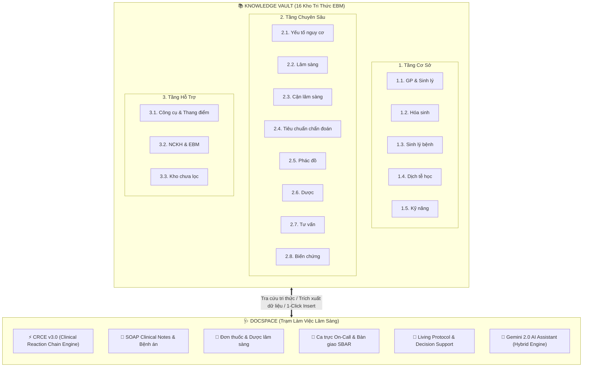
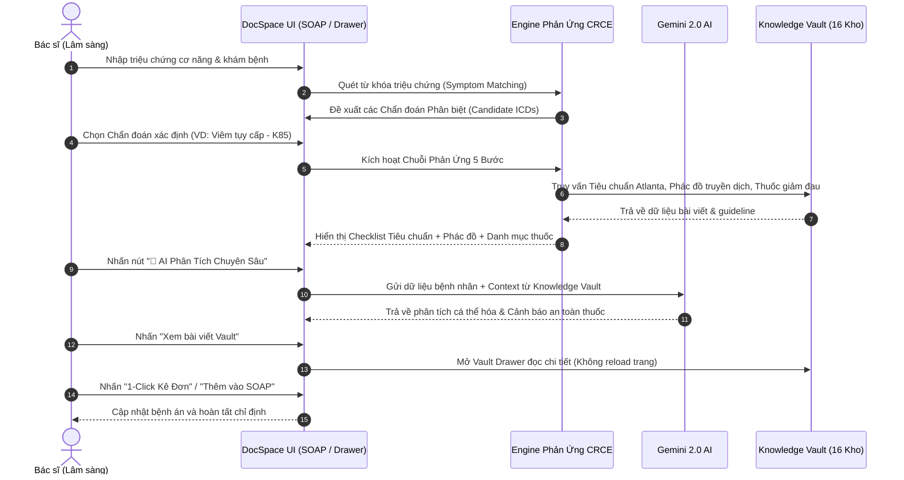

# QUY TRÌNH TƯƠNG TÁC GIỮA DOCSPACE VÀ KNOWLEDGE VAULT
## DocSpace Clinical Workspace & Knowledge Vault Integration Guide

> **Tài liệu chuẩn hóa kiến trúc và quy trình tương tác hai chiều** giữa **DocSpace** (Không gian làm việc lâm sàng thông minh) và **Knowledge Vault** (Kho tri thức Y học Chứng cứ 16 Phân hệ) trong hệ sinh thái **CliniPortal**.

---

## 🏛️ 1. Tổng Quan Kiến Trúc Hệ Thống



---

## 🔄 2. Cơ Chế Tương Tác Hai Chiều (Bidirectional Workflow)

### 2.1. Chiều 1: Knowledge Vault ➔ DocSpace (Tiếp Nạp & Ứng Dụng Tri Thức)

Knowledge Vault đóng vai trò là **"Bộ não lưu trữ tri thức" (Source of Truth)**, cung cấp dữ liệu nền tảng cho mọi tính năng trong DocSpace:

| Tính năng trong DocSpace | Nguồn dữ liệu từ Knowledge Vault | Cách thức tương tác |
|:---|:---|:---|
| **Chuỗi Phản Ứng Lâm Sàng (CRCE v3.0)** | `2.2. Lâm sàng`, `2.3. Cận lâm sàng`, `2.4. Tiêu chuẩn chẩn đoán`, `2.5. Phác đồ`, `2.6. Dược`, `2.8. Biến chứng` | Tự động kích hoạt quy trình 5 bước phản ứng liên hoàn, hiển thị checklist tiêu chuẩn và phác đồ điều trị chuẩn. |
| **Ghi chép SOAP Note** | `1.5. Kỹ năng`, `2.2. Lâm sàng`, `2.3. Cận lâm sàng` | Bác sĩ tìm kiếm nhanh bài viết và nhấn **"1-Click Insert"** để chèn cấu trúc khám/hỏi bệnh vào ô `S` hoặc `O`. |
| **Kê đơn thuốc (Prescription)** | `2.6. Kho Dược` (Dược thư, tương tác thuốc, chỉnh liều) | Lấy liều lượng chuẩn, đường dùng, tần suất và chống chỉ định nạp thẳng vào danh mục thuốc điều trị (`P`). |
| **Bàn giao ca trực (SBAR & On-Call)** | `2.8. Kho Biến chứng & Tiên lượng` | Trích xuất các biến chứng tối khẩn 24h và dấu hiệu cảnh báo đỏ nạp vào checklist theo dõi ca trực. |
| **Living Protocol & Thang điểm** | `2.5. Phác đồ`, `3.1. Công cụ & Thang điểm` | Chuyển đổi guideline tĩnh thành cây quyết định tương tác (Interactive Decision Tree) và máy tính y khoa. |
| **Trí tuệ nhân tạo Gemini AI (RAG)** | Toàn bộ 2.362+ bài viết trong 16 kho | Cung cấp tri thức chuẩn y học chứng cứ làm ngữ cảnh nền (Grounding) để AI phân tích chính xác, không ảo giác (*No Hallucination*). |

---

### 2.2. Chiều 2: DocSpace ➔ Knowledge Vault (Truy Vết, Tra Cứu & Vault Drawer)

DocSpace đóng vai trò là **"Giao diện tác chiến tại giường bệnh"**, cho phép Bác sĩ tra cứu ngược về Vault mà không làm gián đoạn dòng công việc:



---

## ⚡ 3. Chi Tiết Chuỗi Phản Ứng 5 Bước (CRCE v3.0 Reaction Chain)

Quy trình phản ứng liên hoàn giữa DocSpace và Knowledge Vault gồm 5 bước khép kín:

```
[BƯỚC 1: LÂM SÀNG] ➔ [BƯỚC 2: CĐ & TIÊU CHUẨN] ➔ [BƯỚC 3: PHÁC ĐỒ] ➔ [BƯỚC 4: DƯỢC THƯ] ➔ [BƯỚC 5: BIẾN CHỨNG]
   (Kho 2.2 & 2.3)          (Kho 2.4 & Cận LS)           (Kho 2.5)            (Kho 2.6)             (Kho 2.8)
```

### Bước 1: Đối Chiếu Lâm Sàng & Phân Tầng Ban Đầu
- **Đầu vào**: Dữ liệu từ phần `S` (Hỏi bệnh) và `O` (Khám thực thể + Sinh hiệu).
- **Tương tác Vault**: Đối chiếu với `2.2. Kho lâm sàng` và `2.3. Kho cận lâm sàng`.
- **Hành động**: Quét từ khóa, hiển thị Red Flags báo động đỏ và đề xuất các ICD-10 tiềm năng.

### Bước 2: Thẩm Định Tiêu Chuẩn Chẩn Đoán (Diagnostic Criteria)
- **Đầu vào**: Bác sĩ chọn mã bệnh ICD-10 hoặc chẩn đoán phân biệt.
- **Tương tác Vault**: Kéo tiêu chuẩn chẩn đoán từ `2.4. Kho tiêu chuẩn chẩn đoán` (Tiêu chuẩn vàng, tiêu chuẩn bắt buộc/chính/phụ/CLS).
- **Hành động**: Bác sĩ tick chọn hoặc nhấn **"AI Phân Tích"** để tự động chấm điểm (`criteriaMet >= minRequired`). Khi đủ điều kiện, nút chuyển sang **"ĐÃ ĐẠT TIÊU CHUẨN CHẨN ĐOÁN"**.

### Bước 3: Phác Đồ Điều Trị Phân Tầng (Clinical Protocol)
- **Đầu vào**: Chẩn đoán đã thỏa mãn tiêu chuẩn.
- **Tương tác Vault**: Kéo phác đồ xử trí từ `2.5. Kho phác đồ` (Guideline Bộ Y tế, AHA, ESC, KDIGO, GOLD, GINA...).
- **Hành động**: Hiển thị Mục tiêu điều trị (*Target Goals*), Xử trí cấp cứu (*Initial Management*), và Chăm sóc hỗ trợ (*Supportive Care*).

### Bước 4: Danh Mục Thuốc Kê Đơn & Kiểm Tra Tương Tác (Drug Ordering)
- **Đầu vào**: Phác đồ bậc 1 (First-line) và bậc 2 (Second-line).
- **Tương tác Vault**: Kéo thông tin thuốc từ `2.6. Kho Dược` (Tên hoạt chất, biệt dược, nhóm dược lý, liều lượng, đường dùng, tần suất).
- **Hành động**: Bác sĩ nhấn **"Thêm vào Đơn thuốc"** (1-Click Prescribe) để nạp thuốc vào phần `Plan` của SOAP.

### Bước 5: Cảnh Báo Biến Chứng & Bảng Kiểm Ca Trực (On-Call & Complications)
- **Đầu vào**: Toàn bộ diễn tiến ca bệnh.
- **Tương tác Vault**: Kéo cảnh báo từ `2.8. Kho Biến chứng & Tiên lượng`.
- **Hành động**: Hiển thị biến chứng 24h tối khẩn, dấu hiệu nhận biết, biện pháp dự phòng và **"Câu cảnh báo trực On-Call"** để gắn nhãn bàn giao ca trực.

---

## 🗂️ 4. Quy Chuẩn Kỹ Thuật & Cấu Trúc Dữ Liệu

### 4.1. Định Tuyến Thư Mục (Directory Mapping)

| Phân hệ DocSpace | Module Xử lý | Nguồn Knowledge Vault tương ứng |
|:---|:---|:---|
| **Database Tiêu chuẩn** | `src/content/docspace/data/diagnostic-criteria-database.ts` | `knowledge-vault/2.4. Kho tiêu chuẩn chẩn đoán/` |
| **Ánh xạ Triệu chứng** | `src/content/docspace/data/symptom-icd-mapping.ts` | `knowledge-vault/2.2. Kho lâm sàng/` |
| **Drawer Xem Vault** | `src/content/docspace/features/vault-article-drawer.ts` | Toàn bộ 16 thư mục con trong `knowledge-vault/` |
| **AI Gemini Hybrid Client**| `src/content/docspace/ai/gemini-crce-client.ts` | `knowledge-vault/**/*.md` (RAG Context) |
| **SOAP Clinical Note** | `src/content/docspace/features/soap-view.ts` | `src/content/docspace/storage/` |

### 4.2. Schema Dữ Liệu Liên Kết (TypeScript Interface)

```typescript
export interface VaultPathwayLink {
  khoCode: 'CS' | 'TC' | 'CLS' | 'CD' | 'PDDT' | 'DUOC' | 'TV' | 'BC' | 'EBM' | 'SCORE';
  khoName: string;
  articleTitle: string;
  searchKeyword: string;
  relativePath?: string;
}

export interface DiseaseReactionChainDefinition {
  icdCode: string;
  icdPrefixes: string[];
  diseaseName: string;
  specialty: string;
  severity: 'emergency' | 'urgent' | 'routine';
  summary: string;
  goldStandard: string;
  criteriaRule: {
    minMajorRequired?: number;
    minMinorRequired?: number;
    mandatoryIds?: string[];
    ruleDescription: string;
  };
  criteria: DiagnosticCriterionItem[];
  protocol: ClinicalProtocolDefinition;
  complications: DiseaseComplicationItem[];
  monitoringLabs: string[];
  vaultPathways: VaultPathwayLink[];
}
```

---

## 🎯 5. Hướng Dẫn Vận Hành Dành Cho Bác Sĩ

1. **Khám bệnh**: Mở DocSpace, chọn bệnh nhân hoặc tạo ca mới trong tab **Bệnh án SOAP**.
2. **Kích hoạt Vault**: Nhập triệu chứng trong ô `Subjective` / `Objective` ➔ Nhấn biểu tượng **"⚡ Chuỗi Phản Ứng Lâm Sàng (CRCE)"** trên thanh công cụ.
3. **Đối chiếu**: Đọc bảng tiêu chuẩn chẩn đoán được nạp tự động từ Knowledge Vault. Nhấn **"AI Đối Chiếu"** nếu muốn hệ thống tự động nhận diện từ ghi chú khám.
4. **Tra cứu chuyên sâu**: Nhấn vào bất kỳ liên kết **"Kho Vault"** nào ở dưới cùng Drawer để đọc toàn văn bài viết hướng dẫn chuyên sâu.
5. **Kê đơn & Xử trí**: Nhấn **"Thêm vào đơn thuốc"** tại Bước 4 và **"Gắn nhãn On-Call"** tại Bước 5 để hoàn thiện kế hoạch điều trị.

---

## 🛡️ 6. Quy Tắc Bảo Mật & Toàn Vẹn Hệ Thống
- **Quy tắc 1**: Không sửa đổi cấu trúc thư mục của 16 Kho Knowledge Vault để tránh gãy liên kết tương đối (`relative path`).
- **Quy tắc 2**: Toàn bộ dữ liệu bệnh nhân trong DocSpace được lưu trữ an toàn tại `LocalStorage / IndexedDB / Supabase`, không lưu trực tiếp vào các file Markdown tĩnh của Vault.
- **Quy tắc 3**: Khi thêm bài viết mới vào Knowledge Vault, cập nhật định danh và từ khóa vào `diagnostic-criteria-database.ts` và `symptom-icd-mapping.ts` để đồng bộ tính năng tìm kiếm tự động trong DocSpace.

---
*Tài liệu được phát hành và duy trì bởi Hội đồng Chuyên môn & Kỹ thuật CliniPortal.*
