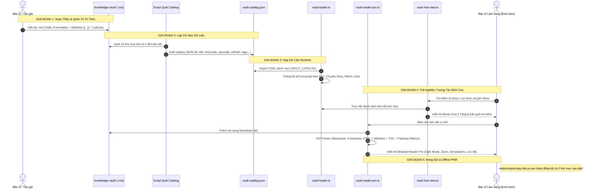

# QUY TRÌNH TƯƠNG TÁC GIỮA KNOWLEDGE-VAULT VÀ KNOWLEDGE-VAULT ENGINE
## Architecture, Data Pipeline & Interaction Workflow Guide

> **Tài liệu chuẩn hóa kiến trúc và quy trình chuyển hóa dữ liệu** giữa **Kho Lưu Trữ Markdown Thô** (`knowledge-vault/`) và **Bộ Engine Giao Diện Web Tương Tác** (`src/content/knowledge-vault/`) trong hệ sinh thái **CliniPortal**.

---

## 🏛️ 1. Định Vị Vai Trò Của Hai Phân Hệ

Trong kiến trúc của CliniPortal, hai thư mục `knowledge-vault` và `src/content/knowledge-vault` đại diện cho **hai tầng kiến trúc riêng biệt nhưng gắn kết chặt chẽ**:

```mermaid
flowchart LR
    subgraph DATA_LAYER["📂 1. DATA LAYER (knowledge-vault/)"]
        direction TB
        MD["2.362+ File Markdown (.md)"]
        WIKI["Hệ thống Wikilinks [[...]]"]
        OBS["Obsidian Metadata & Graph"]
        RES["Hình ảnh & Sơ đồ _resources/"]
    end

    subgraph PIPELINE["⚙️ 2. PIPELINE (Cataloging & Parser)"]
        direction TB
        CATALOG["scripts/generate_vault_catalog.js"]
        JSON["data/vault-catalog.json"]
    end

    subgraph ENGINE_LAYER["💻 3. ENGINE LAYER (src/content/knowledge-vault/)"]
        direction TB
        LOADER["vault-loader.ts (Data Ingestion)"]
        READER["vault-reader-pro.ts (Medical Reader)"]
        HUB["vault-hub-view.ts (Search & Matrix)"]
        FLOW["vault-flowchart-engine.ts (Decision Trees)"]
        FLASH["vault-flashcard-engine.ts (Spaced Repetition)"]
    end

    subgraph USER_EXPERIENCE["🩺 4. GIAO DIỆN LÂM SÀNG TƯƠNG TÁC"]
        direction TB
        WEB["CliniPortal Web App / PWA"]
        DOCSPACE["DocSpace Vault Drawer"]
        OBS_DEEP["Obsidian Deep-Link Protocol"]
    end

    DATA_LAYER -->|"Quét & Trích xuất Metadata"| PIPELINE
    PIPELINE -->|"Nạp CSDL Chỉ mục (Catalog)"| ENGINE_LAYER
    ENGINE_LAYER -->|"Render HTML / Interactive UX"| USER_EXPERIENCE
```



| Đặc điểm | `knowledge-vault/` (Storage & Markdown Vault) | `src/content/knowledge-vault/` (Engine & Web App) |
|:---|:---|:---|
| **Bản chất** | **Tầng Dữ liệu Thô (Data Layer)** | **Tầng Ứng dụng & Trình bày (Presentation & Engine Layer)** |
| **Công nghệ** | Pure Markdown (`.md`), YAML Frontmatter, Obsidian Graph | TypeScript (`.ts`), Vanilla CSS3, Semantic HTML5 |
| **Vai trò chính** | Nơi Bác sĩ/Tác giả soạn thảo, lưu trữ tri thức EBM dạng Atomic Notes & Zettelkasten y khoa. | Nơi parse, render, tìm kiếm toàn văn, vẽ lưu đồ tương tác và cung cấp giao diện đọc chuyên nghiệp. |
| **Môi trường chạy** | Obsidian App, VS Code, Git Repository | Trình duyệt Web (Desktop/Mobile), PWA Offline, DocSpace Drawer |
| **Quy mô** | 16 Phân hệ, 2.362+ bài viết y khoa | 10+ module TypeScript, CSS Variables, Flashcard & Flowchart engines |

---

## 🔄 2. Quy Trình Chuyển Hóa 5 Giai Đoạn (The 5-Stage Vault Pipeline)



---

## 🔍 3. Chi Tiết Các Giai Đoạn Chuyển Hóa

### 3.1. Giai Đoạn 1: Soạn Thảo & Chuẩn Hóa Tri Thức (`knowledge-vault/`)
Mỗi bài viết trong `knowledge-vault/` được định dạng chuẩn Obsidian Markdown với:
- **Cấu trúc thư mục 16 Phân hệ**: 
  - `1.1. Kho giải phẫu & sinh lý` (`GPSL`)
  - `1.2. Kho hóa sinh y học` (`HS`)
  - `1.3. Kho sinh lý bệnh` (`SLB`)
  - `1.4. Kho dịch tễ học` (`DTH`)
  - `1.5. Kho yếu tố nguy cơ` (`YTNC`)
  - `2.1. Kho tiếp cận lâm sàng` (`TC`)
  - `2.2. Kho kỹ năng lâm sàng` (`KN`)
  - `2.3. Kho chẩn đoán` (`CD`)
  - `2.4. Kho phác đồ điều trị` (`PDDT`)
  - `2.5. Kho biến chứng` (`BC`)
  - `3.1. Kho công cụ & thang điểm` (`CC`)
  - `3.2. Kho dược thư & tương tác thuốc` (`DUOC`)
  - `3.3. Kho cận lâm sàng & xét nghiệm` (`CLS`)
  - `Kho dinh dưỡng lâm sàng` (`TV`)
  - `Kho nghiên cứu khoa học & EBM` (`EBM`)
  - `Kho chưa lọc` (`RAW`)
- **Cú pháp liên kết Wikilink**: `[[Tên bài viết]]` hoặc `[[Thư mục/Tên bài|Tên hiển thị]]`.
- **Hộp chú thích lâm sàng (Callouts)**:
  ```markdown
  > [!ALERT] Cảnh báo nguy kịch
  > Dấu hiệu chèn ép tim cấp: Tam chứng Beck (Tụt HA, Tĩnh mạch cổ nổi, Tiếng tim mờ xa xăm).
  
  > [!PEARL] Clinical Pearl
  > Troponin hs tăng động học quan trọng hơn một giá trị đơn độc cắt ngang.
  ```

---

### 3.2. Giai Đoạn 2: Quét & Lập Chỉ Mục Tự Động (`data/vault-catalog.json`)
Script tự động quét toàn bộ cây thư mục `knowledge-vault/`, phân tích cấu trúc từng file `.md` và tạo file chỉ mục `src/content/knowledge-vault/data/vault-catalog.json`:

```json
{
  "id": "tc_dau_nguc_p1",
  "title": "Tiếp cận Đau ngực cấp & Phân tầng nguy cơ",
  "fullFileName": "TC_Đau ngực_P1.md",
  "khoCode": "TC",
  "khoName": "Lâm sàng",
  "khoGroup": "Chuyên sâu",
  "specialty": "Tim mạch",
  "relPath": "2.1. Kho tiếp cận lâm sàng/03. Tim mạch/TC_Đau ngực_P1.md",
  "aliases": ["Đau thắt ngực", "Chest Pain"],
  "tags": ["tim-mach", "cap-cuu", "dau-nguc"],
  "wordCount": 1850,
  "lastModified": "2026-08-23"
}
```

---

### 3.3. Giai Đoạn 3: Nạp Dữ Liệu Runtime (`vault-loader.ts`)
Module `vault-loader.ts` nạp catalog vào bộ nhớ và cung cấp các hàm nghiệp vụ:
- **`getKhoSummaries()`**: Thống kê số lượng bài viết, danh sách chuyên khoa của 16 kho.
- **`filterArticles(filterState)`**: Tìm kiếm tức thì theo từ khóa, nhóm kho, mã kho, chuyên khoa hoặc tags.
- **`findPathwayArticles(currentArticle)`**: Xâu chuỗi tự động 8 khía cạnh bệnh học cùng chủ đề (`GPSL` ➔ `SLB` ➔ `DTH` ➔ `YTNC` ➔ `CD` ➔ `PDDT` ➔ `BC` ➔ `TV`).

---

### 3.4. Giai Đoạn 4: Trình Đọc & Tương Tác Chuyên Nghiệp (`vault-reader-pro.ts`)
Khi người dùng mở một bài viết, `vault-reader-pro.ts` thực hiện các bước xử lý thời gian thực:
1. **Fetch File Markdown**: Tải nội dung từ đường dẫn tương đối `knowledge-vault/${relPath}`.
2. **AST Markdown Parser**:
   - Chuyển đổi Markdown thành semantic HTML chuẩn Typography y khoa.
   - **Xử lý Wikilinks 2 Chiều**:
     - Nếu bài viết đích có trong Catalog ➔ Biến thành nút điều hướng nội bộ SPA mượt mà.
     - Nếu là file ngoài ➔ Tự động gắn giao thức Obsidian URI (`obsidian://open?vault=Apps_ykhoa&file=...`).
   - **Xử lý Callouts**: Render thành thẻ cảnh báo với icon và viền màu tương ứng (*Alert, Pearl, Warning, Dosage*).
3. **Clinical Pathway Matrix Ribbon**: Render thanh liên kết 8 khía cạnh bệnh học ngang đầu bài viết.
4. **Dynamic Sticky TOC & Scrollspy**: Tự động trích xuất các tiêu đề `H1, H2, H3` tạo mục lục trượt bên phải màn hình.
5. **Ghi Chú Đúc Kết Lâm Sàng (Personal Annotations)**: Cho phép Bác sĩ lưu lại kinh nghiệm thực tế tại giường bệnh (lưu trữ trong LocalStorage).

---

### 3.5. Giai Đoạn 5: Các Engine Tương Tác Mở Rộng
Ngoài việc đọc tài liệu, bộ mã nguồn trong `src/content/knowledge-vault/` còn mở rộng dữ liệu thô thành các công cụ tương tác:
- **`vault-flowchart-engine.ts`**: Biến các lưu đồ thuật toán trong bài viết thành sơ đồ SVG tương tác trực quan.
- **`vault-flashcard-engine.ts`**: Trích xuất các cặp Hỏi - Đáp từ bài viết thành Flashcard ôn tập ngắt quãng (Spaced Repetition Algorithm SM-2).
- **DocSpace Integration**: Cung cấp Drawer đọc bài viết nhúng thẳng vào quy trình khám bệnh SOAP và Chuỗi Phản Ứng CRCE v3.0.

---

## 📊 4. Bảng Đối Soát Cấu Trúc Dữ Liệu & Mã Nguồn

```
d:\Apps_ykhoa\
│
├── 📂 knowledge-vault/                       ── [TẦNG DỮ LIỆU THÔ - MARKDOWN OBSIDIAN]
│   ├── .obsidian/                           ── Cấu hình đồ thị & plugins Obsidian
│   ├── 0. Kho thực thể hạt nhân/             ── Khái niệm y khoa cơ bản & định nghĩa
│   ├── 1.1. Kho giải phẫu & sinh lý/        ── Giải phẫu học, sinh lý học các cơ quan
│   ├── 1.2. Kho hóa sinh y học/             ── Chuyển hóa, enzyme, cân bằng nội môi
│   ├── 1.3. Kho sinh lý bệnh/               ── Cơ chế bệnh sinh & biến đổi chức năng
│   ├── 1.4. Kho dịch tễ học/                ── Tần suất, phân bố bệnh tật & phòng ngừa
│   ├── 1.5. Kho yếu tố nguy cơ/             ── Lối sống, cơ địa & nguy cơ tim mạch/ung thư
│   ├── 2.1. Kho tiếp cận lâm sàng/          ── Lưu đồ chẩn đoán triệu chứng cơ năng
│   ├── 2.2. Kho kỹ năng lâm sàng/           ── Kỹ năng khám thực thể & thủ thuật bedside
│   ├── 2.3. Kho chẩn đoán/                  ── Tiêu chuẩn chẩn đoán & phân nhóm bệnh
│   ├── 2.4. Kho phác đồ điều trị/           ── Phác đồ xử trí cấp cứu & duy trì EBM
│   ├── 2.5. Kho biến chứng/                 ── Biến chứng cấp tính & tiên lượng lâu dài
│   ├── 3.1. Kho công cụ & thang điểm/       ── Thang điểm tiên lượng & máy tính y khoa
│   ├── 3.2. Kho dược thư & tương tác thuốc/ ── Dược lực học, dược động học & tương tác
│   ├── 3.3. Kho cận lâm sàng & xét nghiệm/  ── Diễn giải ECG, X-quang, Khí máu, Sinh hóa
│   ├── Kho dinh dưỡng lâm sàng/             ── Dinh dưỡng bệnh lý & tư vấn lối sống
│   ├── Kho nghiên cứu khoa học & EBM/       ── Phương pháp NCKH, thống kê & y học chứng cứ
│   └── Kho chưa lọc/                        ── Bản nháp & tài liệu đang biên tập
│
└── 📂 src/content/knowledge-vault/           ── [TẦNG GIAO DIỆN & ENGINE WEB TƯƠNG TÁC]
    ├── index.html                           ── Trang đích hiển thị Knowledge Vault Hub
    ├── index.ts                             ── Entry point khởi chạy ứng dụng Vault
    ├── types.ts                             ── Định nghĩa Schema dữ liệu (TypeScript Interfaces)
    ├── vault-loader.ts                      ── Engine nạp CSDL catalog, lọc & pathway linking
    ├── vault-reader-pro.ts                  ── Trình đọc bài viết chuyên nghiệp & AST Parser
    ├── vault-hub-view.ts                    ── Giao diện Hub trung tâm Bento Grid & Tìm kiếm
    ├── vault-flowchart-engine.ts            ── Engine vẽ và tương tác lưu đồ lâm sàng SVG
    ├── vault-flashcard-engine.ts            ── Engine thẻ ghi nhớ ngắt quãng Spaced Repetition
    ├── 📂 data/
    │   └── vault-catalog.json               ── CSDL chỉ mục 2.362+ bài viết đã tiền xử lý
    └── 📂 css/
        └── vault-theme.css                  ── Hệ thống Design Tokens, Dark Mode & Typography
```

---

## 🛠️ 5. Hướng Dẫn Thực Hành (Workflow For Contributors)

### 5.1. Khi Thêm Bài Viết Mới Vào `knowledge-vault/`
1. Tạo file `.md` mới trong đúng thư mục kho tương ứng (VD: `knowledge-vault/2.4. Kho phác đồ điều trị/03. Tim mạch/PD_Suy tim cấp.md`).
2. Sử dụng đúng cú pháp tiêu đề `# Tên bài viết`, chèn các Callouts (`> [!ALERT]`, `> [!PEARL]`) và liên kết Wikilinks `[[Tên bài liên quan]]`.
3. Chạy lệnh cập nhật chỉ mục:
   ```bash
   node scripts/generate_vault_catalog.js
   ```
4. Chạy `npm run build` để kiểm thử và đồng bộ sang thư mục `dist/`.

### 5.2. Khi Nâng Cấp Giao Diện Trong `src/content/knowledge-vault/`
1. Chỉnh sửa logic hiển thị hoặc tính năng trong các file `.ts` tương ứng.
2. Tuân thủ tuyệt đối quy tắc **Dark Mode CSS Variables** (`var(--vault-...)`) và **không hardcode màu sắc**.
3. Kiểm tra tính tương thích trên cả Desktop và Mobile trước khi commit.

---
*Tài liệu kỹ thuật được quản lý và cập nhật tự động trong hệ sinh thái CliniPortal.*
