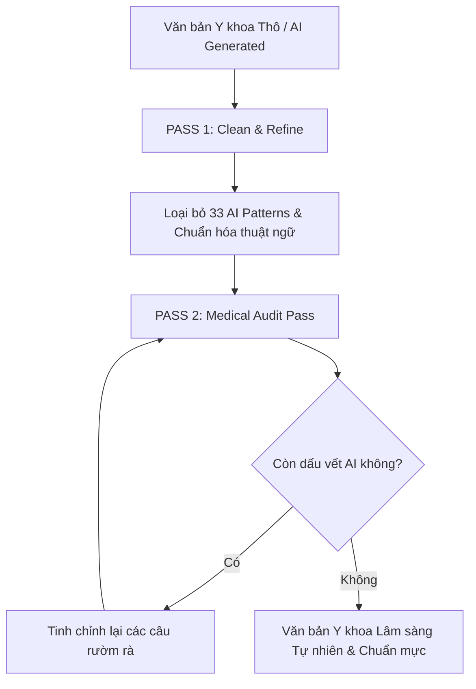

# Medical Humanizer & Clinical Voice Standardizer

Skill này giúp AI phát hiện, biên tập và loại bỏ triệt để các dấu vết văn phong sáo rỗng của mô hình ngôn ngữ lớn (LLM AI-isms, chatbot artifacts) khỏi bài viết/tài liệu y khoa. Kết quả thu được là văn bản có văn phong lâm sàng tự nhiên, súc tích, chuyên nghiệp, chuẩn Y học chứng cứ và giàu tính thực địa.

---

## 🎯 Mục tiêu & Phạm vi Áp dụng

1. **Khử AI-isms Y khoa (Medical AI Cleanup)**: Loại bỏ các cụm từ sáo rỗng, hoa mỹ, nịnh hót hoặc thổi phồng tầm quan trọng không có chứng cứ.
2. **Giọng văn Bác sĩ Lâm sàng (Clinical Practitioner Tone)**: Giúp câu từ súc tích, đi thẳng vào vấn đề, dễ đọc lướt cho bác sĩ, y sĩ và sinh viên y khoa.
3. **Bảo toàn Chứng cứ Y học 100% (Strict Fact Preservation)**: Tuyệt đối không thay đổi hay bịa đặt liều lượng thuốc, chỉ số xét nghiệm, tiêu chuẩn chẩn đoán, PMID/DOI hay số liệu lâm sàng.

---

## 📋 Bộ 33 Patterns Dấu vết AI (Việt - Anh Y khoa)

AI cần rà soát và loại bỏ 33 dạng mẫu văn bản LLM điển hình sau đây:

### 1. Nhóm Nội dung & Thổi phồng (Content Patterns)
| # | Pattern AI | Dấu hiệu AI (Before) | Văn phong Lâm sàng Chuẩn (After) |
|---|---|---|---|
| 1 | **Significance inflation** | *"đóng vai trò vô cùng quan trọng và là bước ngoặt vĩ đại..."* | *"là yếu tố tiên lượng quan trọng trong..."* |
| 2 | **Notability name-dropping** | *"được công nhận bởi WHO, CDC, FDA, ESC, AHA và nhiều tổ chức..."* | *"được khuyến cáo bởi ESC 2023..."* (chỉ giữ nguồn trực tiếp) |
| 3 | **Superficial -ing analyses** | *"giúp làm nổi bật... phản ánh... thể hiện sự kết hợp..."* | Đi thẳng vào kết quả/cơ chế y học |
| 4 | **Promotional language** | *"bệnh viện hiện đại bậc nhất nằm giữa không gian xanh mát..."* | *"bệnh viện trang bị 500 giường bệnh..."* |
| 5 | **Vague attributions** | *"các chuyên gia hàng đầu tin rằng..."*, *"nhiều nghiên cứu chỉ ra..."* | Nêu đích danh tác giả/nghiên cứu hoặc trích dẫn PMID |
| 6 | **Formulaic challenges** | *"Mặc dù đối mặt với nhiều thách thức, y học vẫn tiếp tục phát triển..."* | Bỏ câu cảm thán, đi thẳng vào số liệu |

### 2. Nhóm Ngôn ngữ & Từ vựng Cửa miệng LLM (Language Patterns)
| # | Pattern AI | Dấu hiệu AI (Before) | Văn phong Lâm sàng Chuẩn (After) |
|---|---|---|---|
| 7 | **AI vocabulary** | *"bức tranh tổng quan"*, *"chặng đường"*, *"hành trình"*, *"nhấn mạnh"*, *"pivotal"*, *"delve"*, *"landscape"* | Thay bằng từ y học chính xác: *"tổng quan lâm sàng"*, *"diễn tiến bệnh"* |
| 8 | **Copula avoidance** | *"đóng vai trò là..."*, *"sở hữu đặc tính..."*, *"mang lại khả năng..."* | Dùng động từ trực tiếp: *"là..."*, *"có..."*, *"gây ra..."* |
| 9 | **Negative parallelisms** | *"Đây không chỉ là một xét nghiệm, mà còn là chìa khóa..."* | *"Xét nghiệm này giúp chẩn đoán..."* |
| 10 | **Rule of three** | *"an toàn, hiệu quả và toàn diện"*, *"chẩn đoán, điều trị và theo dõi"* | Nêu đúng số lượng yếu tố thực tế |
| 11 | **Synonym cycling** | Thay đổi liên tục: *"bệnh nhân... người bệnh... ca bệnh... đối tượng"* | Dùng thống nhất *"bệnh nhân"* hoặc *"bệnh nhi"* |
| 12 | **False ranges** | *"từ chẩn đoán ban đầu đến điều trị chuyên sâu"* | Liệt kê trực tiếp các bước lâm sàng |
| 13 | **Passive voice / Subjectless** | *"Không cần hiệu chỉnh liều"* | *"Không cần giảm liều ở bệnh nhân suy thận nhẹ"* |

### 3. Nhóm Phong cách & Định dạng (Style & Formatting Patterns)
| # | Pattern AI | Dấu hiệu AI (Before) | Văn phong Lâm sàng Chuẩn (After) |
|---|---|---|---|
| 14 | **Em/en dashes overuse** | Lạm dụng dấu gạch ngang dài (`—`) liên tục | Thay bằng dấu phẩy, dấu chấm hoặc ngoặc đơn `()` |
| 15 | **Boldface overuse** | In đậm dày đặc từng câu: `**Chẩn đoán:** **Lâm sàng:**` | Chỉ in đậm các tiêu đề mục chính |
| 16 | **Inline-header lists** | Gạch đầu dòng có từ in đậm ở đầu câu dày đặc | Chuyển thành văn phong xuôi hoặc bảng so sánh |
| 17 | **Title Case Headings** | Viết Hoa Tất Cả Các Từ Trong Tiêu Đề | Viết hoa chữ cái đầu câu theo chuẩn Tiếng Việt |
| 18 | **Emojis overload** | Lạm dụng emoji: 🚀 💡 🔑 ⚡ 🏥 🩸 | Loại bỏ hoàn toàn emoji trong bài viết chuyên môn |
| 19 | **Curly quotes** | Sử dụng dấu ngoặc cong `“ ”` | Dùng ngoặc kép thẳng `" "` hoặc chuẩn HTML |
| 20 | **Signposting announcements** | *"Hãy cùng tìm hiểu..."*, *"Dưới đây là những điều bạn cần biết..."* | Bỏ câu dẫn dắt, đi ngay vào nội dung |
| 21 | **Staccato drama** | *"Không có ngoại lệ. Không có sự chậm trễ."* | Cấu trúc câu hoàn chỉnh có chủ ngữ - vị ngữ |
| 22 | **Aphorism formulas** | *"Sự chính xác là ngôn ngữ của y khoa"* | Trình bày phát biểu chuyên môn cụ thể |
| 23 | **Conversational rhetoric** | *"Thật ra? Điều này tùy thuộc vào..."* | *"Chỉ định phụ thuộc vào tình trạng huyết động..."* |

### 4. Nhóm Giao tiếp Chatbot & Phòng vệ Mơ hồ (Communication & Hedging Artifacts)
| # | Pattern AI | Dấu hiệu AI (Before) | Văn phong Lâm sàng Chuẩn (After) |
|---|---|---|---|
| 24 | **Chatbot artifacts** | *"Hy vọng bài viết này hữu ích cho bạn!"*, *"Nếu có thắc mắc..."* | Xóa bỏ hoàn toàn |
| 25 | **Sycophantic tone** | *"Câu hỏi rất hay!"*, *"Bạn hoàn toàn đúng!"* | Trả lời trực diện vào chuyên môn |
| 26 | **Cutoff disclaimers** | *"Do giới hạn dữ liệu, thông tin này có thể..."* | Trích dẫn nguồn y văn xác thực hoặc bỏ bớt |
| 27 | **Filler phrases** | *"Để nhằm mục đích..."*, *"Do thực tế là..."* | *"Để..."*, *"Do..."* |
| 28 | **Excessive hedging** | *"có thể tiềm ẩn khả năng có nguy cơ..."* | *"có nguy cơ..."* |
| 29 | **Generic conclusions** | *"Tóm lại, tương lai ngành y sẽ rất tươi sáng..."* | Tóm tắt phác đồ hoặc kết luận lâm sàng cụ thể |
| 30 | **Hyphenated word pairs** | Lạm dụng từ nối gạch ngang vô nghĩa | Dùng cụm từ tự nhiên |
| 31 | **Persuasive authority tropes**| *"Về bản chất, điều cốt lõi nhất là..."* | Phát biểu thẳng kết luận chuyên môn |
| 32 | **Fragmented headers** | Tiêu đề phụ lặp lại nội dung tiêu đề chính | Gom nhóm hợp lý |
| 33 | **Diff-anchored writing** | *"Hàm này được thêm vào để thay thế..."* | Mô tả trực tiếp cơ chế/chức năng |

---

## 🎙️ Hiệu chuẩn Giọng văn Y khoa (Medical Voice Calibration)

Khi người dùng cung cấp mẫu bài viết của một bác sĩ hoặc chuyên gia cụ thể, AI thực hiện:

1. **Phân tích Sample Writing**:
   - Nhịp điệu câu (độ dài trung bình câu, cách ngắt câu).
   - Thuật ngữ ưu tiên (VD: dùng *"tiên lượng"* thay cho *"dự đoán"*, *"lâm sàng"* thay cho *"thực tế"*).
   - Phong cách trình bày (ngắn gọn trực diện hay phân tích cơ chế chi tiết).
2. **Áp dụng giọng văn vào bài viết mới**: Giữ nguyên tính chính xác y khoa nhưng thể hiện qua "hơi thở" và văn phong cá nhân của tác giả.

---

## 🔄 Quy trình Biên tập 2 Bước (Two-Pass Medical Audit Workflow)

### Pass 1: Clean & Refine
- Áp dụng danh sách 33 AI patterns để lọc bỏ từ sáo rỗng, emoji thừa, câu hoa mỹ, gạch đầu dòng trùng lặp.

### Pass 2: Medical Audit Pass
- Đặt câu hỏi thẩm định: *"Nếu một bác sĩ lâm sàng đọc đoạn này, họ có cảm thấy đây là văn bản do bot viết tự động hay không?"*
- Chỉnh sửa triệt để những câu văn còn mang dấu vết "máy móc" hoặc "dịch thuật thô".

---

## 🔒 Nguyên tắc Bảo toàn Dữ liệu Y học 100% (Strict Medical Fact Preservation)

> [!CAUTION]
> **QUY TẮC BẤT DI BẤT DỊCH**: Quá trình làm mượt văn phong KHÔNG ĐƯỢC PHÉP thay đổi dữ liệu chuyên môn.

1. **Giữ nguyên số liệu**: Liều lượng thuốc (mg, mcg, mg/kg/ngày), các ngưỡng chỉ số (PAS, PAD, SpO2, GFR, Troponin T/I).
2. **Giữ nguyên mã y văn**: PMID, DOI, Guideline (ESC 2023, ADA 2024, GOLD 2024).
3. **Không tự thêm thông tin lâm sàng**: Nếu văn bản gốc không đề cập đến một tác dụng phụ hay chống chỉ định, tuyệt đối không tự bịa thêm vào.

---

## 📝 Ví dụ Minh họa Đối chiếu (Before vs After)

### ❌ Before (AI-Generated Y khoa):
> *"Bệnh đái tháo đường týp 2 đóng vai trò là một thách thức vô cùng to lớn và là bức tranh tổng quan phức tạp của y học hiện đại. 🚀 Được biết đến như một hành trình gian khó, bệnh lý này không chỉ ảnh hưởng đến đường huyết mà còn đe dọa toàn bộ cơ thể—từ tim mạch cho đến thận. Hãy cùng tìm hiểu những lưu ý quan trọng để làm nổi bật phác đồ điều trị an toàn, hiệu quả và toàn diện! 💡"*

### ✅ After (Medical Humanized):
> *"Đái tháo đường týp 2 là bệnh lý chuyển hóa mạn tính gây biến chứng đa cơ quan, đặc biệt là tim mạch và thận. Kiểm soát bệnh đòi hỏi phối hợp thay đổi lối sống và điều trị nội khoa theo khuyến cáo ADA 2024."*
