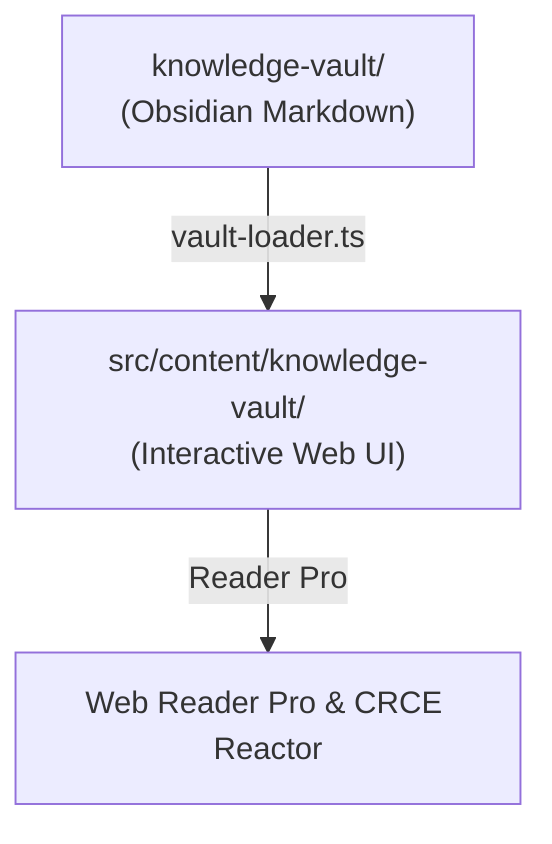

# 🧠 Obsidian CLI & Knowledge-Vault Management

Kỹ năng quản lý, điều hướng và tự động hóa kho tri thức Y khoa **`knowledge-vault/`** (Obsidian Vault) trong hệ sinh thái **CliniPortal**.

---

## 🏛️ 1. Cấu Trúc Kho `knowledge-vault` của CliniPortal

Kho `d:\Apps\Apps_ykhoa\knowledge-vault\` được tổ chức theo cấu trúc Vault chuẩn:
```text
knowledge-vault/
├── .obsidian/                       # Cấu hình plugin & theme Obsidian
├── MOC - Kho Kiến Thức Y Khoa.md    # Map of Content (MOC chính)
├── 0. Kho thực thể hạt nhân/        # Atomic Medical Entities (Bệnh, Thuốc, Triệu chứng)
├── 1.1. Kho giải phẫu & sinh lý/
├── 1.2. Kho hóa sinh y học/
├── 1.3. Kho sinh lý bệnh/
├── 1.4. Kho dịch tễ học/
├── 1.5. Kho yếu tố nguy cơ/
├── 2.1. Kho tiếp cận lâm sàng/
├── 2.2. Kho kỹ năng lâm sàng/
├── 2.3. Kho chẩn đoán/
├── 2.4. Kho phác đồ điều trị/
├── 2.5. Kho biến chứng/
├── 3.1. Kho công cụ & thang điểm/
├── 3.2. Kho dược thư & tương tác thuốc/
├── 3.3. Kho cận lâm sàng & xét nghiệm/
└── _resources/                      # Hình ảnh, sơ đồ SVG minh họa
```

---

## ⚡ 2. Cú Pháp Tương Tác Qua Obsidian CLI

> **Lưu ý**: Lệnh CLI yêu cầu ứng dụng Obsidian đang mở trên máy và plugin Obsidian CLI được kích hoạt.

### 🎯 Chỉ định Vault Mục Tiêu
```bash
# Đặt biến môi trường hoặc dùng param vault="knowledge-vault"
obsidian vault="knowledge-vault" search query="suy tim"
```

### 📝 Thao tác với Ghi chú Y khoa
```bash
# 1. Đọc nội dung ghi chú theo tên Wikilink
obsidian vault="knowledge-vault" read file="Hen phế quản"

# 2. Tạo bài viết mới trong thư mục cụ thể
obsidian vault="knowledge-vault" create path="2.4. Kho phác đồ điều trị/Phác đồ Sốc phản vệ 2026.md" content="# Phác đồ Xử trí Sốc Phản Vệ\n\nAdrenaline 1:1000 tiêm bắp ngay lập tức..." silent

# 3. Thêm dòng mới vào cuối bài viết
obsidian vault="knowledge-vault" append file="Phác đồ Sốc phản vệ 2026" content="\n- Liều người lớn: 0.5mg (1/2 ống) TB mặt trước ngoài đùi."

# 4. Cập nhật Metadata (YAML Frontmatter / Properties)
obsidian vault="knowledge-vault" property:set name="chuyen_khoa" value="Hồi sức Cấp cứu" file="Phác đồ Sốc phản vệ 2026"
obsidian vault="knowledge-vault" property:set name="ebm_level" value="Class I LoE A" file="Phác đồ Sốc phản vệ 2026"
obsidian vault="knowledge-vault" property:set name="updated" value="2026-08-26" file="Phác đồ Sốc phản vệ 2026"

# 5. Tra cứu liên kết ngược (Backlinks) và Tags
obsidian vault="knowledge-vault" backlinks file="Adrenaline"
obsidian vault="knowledge-vault" tags sort=count
```

---

## 🛠️ 3. Phương Thức Truy Xuất Trực Tiếp Bằng File System (Khi Obsidian Đóng)

Khi Obsidian không mở, AI Agent tương tác trực tiếp với các tệp Markdown trong `knowledge-vault/` theo quy chuẩn:

1. **Đọc tệp**: Sử dụng `view_file` với đường dẫn tuyệt đối:
   `d:\Apps\Apps_ykhoa\knowledge-vault\<Tên_Kho>\<Tên_Bài>.md`
2. **Quy chuẩn YAML Frontmatter bắt buộc**:
   ```yaml
   ---
   title: Phác đồ Điều trị Viêm phổi Mắc phải Cộng đồng (CAP)
   tags:
     - ho-hap
     - khang-sinh
     - phac-do
   icd10: J18
   updated: 2026-08-26
   verified_by: CliniPortal EBM Team
   ---
   ```
3. **Quy chuẩn Liên kết Nội bộ (Wikilinks)**:
   - Dùng cú pháp `[[Tên bài viết]]` hoặc `[[Tên bài viết|Tên hiển thị]]`.
   - Ví dụ: `Bệnh nhân cần đánh giá thang điểm [[Thang điểm CURB-65|CURB-65]] trước khi chỉ định nhập viện.`

---

## 🔄 4. Quy Trình Đồng Bộ Giữa `knowledge-vault` và Giao Diện Web CliniPortal



- Mọi bài viết Markdown mới trong `knowledge-vault` được tự động lập chỉ mục bởi `src/content/knowledge-vault/vault-loader.ts`.
- Khi tạo note mới trong Obsidian, luôn đảm bảo liên kết về tệp **`MOC - Kho Kiến Thức Y Khoa.md`** tương ứng.
