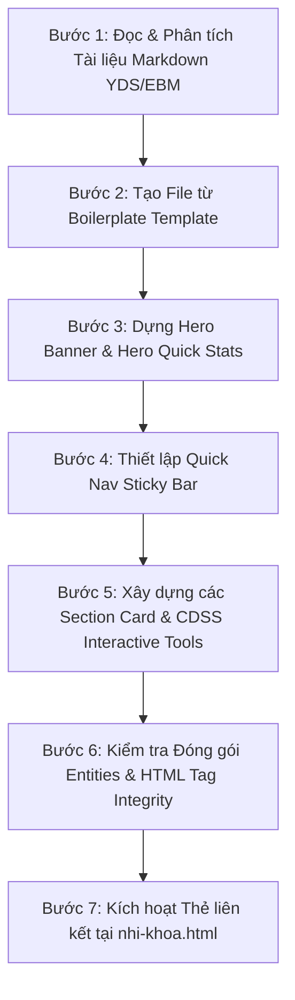

# Pediatric & Specialty Approach Workflow Skill

Tài liệu này định nghĩa **Workflow tiêu chuẩn**, quy chuẩn thiết kế UI/UX cao cấp, kiến trúc HTML/CSS/JS và **Bộ Checklist Phòng Chống Lỗi (Anti-Bug Checklist)** dành cho việc xây dựng các trang web tiếp cận chuyên khoa Nhi khoa (như *Tiếp cận Trẻ sốt*, *Tiếp cận Trẻ tím*, *Tiếp cận Tim bẩm sinh*...).

---

## 📐 1. Quy Chuẩn Kiến Trúc & Đường Dẫn Tương Đối

Các file web tiếp cận Nhi khoa thường nằm tại thư mục:
`src/content/approaches/specialties/pediatrics/` (Cấp 5 so với root).

- **CSS Core (5 cấp up `../../../../../`)**:
  ```html
  <link rel="stylesheet" href="../../../../../css/reset.css">
  <link rel="stylesheet" href="../../../../../css/main.css">
  <link rel="stylesheet" href="../../../../../css/components/header.css">
  <link rel="stylesheet" href="../../../../../css/components/sidebar.css">
  <link rel="stylesheet" href="../../../../../css/components/footer.css">
  <link rel="stylesheet" href="../../../../../css/components/approach-symptom.css">
  ```
- **JS Core (5 cấp up `../../../../../`)**:
  ```html
  <script src="../../../../../js/main.js" defer></script>
  <script src="../../../../../components/header.js" defer></script>
  <script src="../../../../../components/footer.js" defer></script>
  <script src="../../../../../js/approach-symptom.js" defer></script>
  ```

---

## 🎨 2. Quy Chuẩn Thiết Kế Giao Diện (Design System & Aesthetics)

Mỗi trang tiếp cận Nhi khoa chuẩn phải có 4 khối UI chính:

### A. Hero Banner Đỉnh Cao (`.hero-fever` / `.hero-cyanosis`)
- **Nền Gradient Tối & Radial Glow**:
  ```css
  background: linear-gradient(135deg, #0f172a 0%, #1e1b4b 40%, #431407 100%);
  ```
- **Hệ thống Badge Pills**: Thẻ nhãn chủ đề (`.hero-badge-pill`, `.hero-badge-pill.alert`).
- **Khối Thống Kê Nhanh (Hero Quick Stats)**: Lưới 4 ô stat box hiển thị chỉ số cốt lõi (`.hero-quick-stats` -> `.stat-box`).

### B. Thanh Mục Lục Đóng Băng Sticky (`.quick-nav-bar`)
- **Vị trí**: Nằm ngay dưới Hero Banner, bám dính khi cuộn trang.
- **Quy tắc CSS Bắt Buộc**:
  ```css
  /* Override parent container overflow để cho phép sticky hoạt động */
  html, body, .app-container, .main-wrapper, .layout-content-area {
    overflow: visible !important;
  }

  .quick-nav-bar {
    position: sticky !important;
    top: calc(var(--header-height, 60px) + 8px) !important;
    z-index: 150 !important;
    background: var(--color-surface);
    border: 1px solid var(--color-border);
    border-radius: 14px;
    padding: 10px 14px;
    margin-bottom: 24px;
    box-shadow: 0 4px 18px rgba(0, 0, 0, 0.08);
    display: flex;
    gap: 8px;
    overflow-x: auto;
    white-space: nowrap;
    backdrop-filter: blur(12px) !important;
    -webkit-backdrop-filter: blur(12px) !important;
  }
  ```

### C. Thẻ Nội Dung Độc Lập (`.section-card`)
- Bao bọc từng phần nội dung trong `.section-card` độc lập có `scroll-margin-top: 130px;` để khi click nút nhảy mượt mà không bị che bởi Header/Quick Nav.
- Tiêu đề tiêu chuẩn: `.section-title-group` -> `.section-icon-badge` + `<h2>` + `<span>subtitle</span>`.

### D. Công Cụ Giả Lập & CDSS Tương Tác (`.sim-container`)
- Tích hợp các bộ tính toán lâm sàng (Calculators, Converters, Traffic Light Risk Evaluator, Flow Engines).
- Sử dụng slider range (`input[type="range"]`), nút preset nhanh (`.preset-btn`), và bảng hiển thị kết quả trực quan (`.sim-result-box`).

---

## 🔄 3. Workflow 7 Bước Xây Dựng Trang Tiếp Cận Mới



1. **Bước 1: Phân tích Nguồn Kiến thức**: Trích xuất định nghĩa, cờ đỏ, bảng chỉ định CLS, liều thuốc, và thuật toán chẩn đoán.
2. **Bước 2: Dựng Khung Boilerplate**: Sử dụng `templates/specialty-approach-template.html`.
3. **Bước 3: Thiết lập Hero Banner**: Cấu hình màu nền, badge pills và 4 ô Quick Stats.
4. **Bước 4: Cấu hình Sticky Quick Nav**: Khai báo danh sách các section IDs và nút bấm tương ứng.
5. **Bước 5: Phát triển CDSS & Simulators**: Viết logic JavaScript tương tác cho máy tính liều/bảng điểm.
6. **Bước 6: Kiểm thử HTML & Escaping**: Chạy script kiểm tra thẻ và mã hóa entity.
7. **Bước 7: Cập nhật Hub Nhi Khoa (`nhi-khoa.html`)**: Chuyển thẻ bài học từ *Đang cập nhật* sang *Sẵn sàng*.

---

## 🚨 4. Checklist Phòng Tránh Lỗi (Anti-Bug & QA Checklist)

> [!CAUTION]
> **Đây là danh sách các lỗi ĐÃ TỪNG GẶP VÀ CÓ THỂ GẶP. Bắt buộc phải kiểm tra kỹ trước khi hoàn tất!**

### ❌ Lỗi 1: Ký tự `<` chưa mã hóa gây hỏng Parse HTML (`parse5 error`)
- **Sự cố**: Viết ký tự `<` trực tiếp trong văn bản hoặc LaTeX math (vd: `< 2 tháng`, `$< 39^\circ C$`) khiến trình đọc HTML hiểu nhầm là thẻ HTML chưa đóng (`invalid-first-character-of-tag-name`).
- **Quy tắc bắt buộc**: 
  - **MỌI ký tự `<` trong nội dung văn bản HTML hoặc chuỗi JS HTML đều PHẢI viết thành `&lt;`**.
  - Ký tự `>` trong văn bản nên viết thành `&gt;`.
- **Cách kiểm tra**: Chạy lệnh `node scratch/check_tags.js <file.html>` và script quét regex `<`.

### ❌ Lỗi 2: Trùng lặp Thanh Điều Hướng / Thẻ Breadcrumb
- **Sự cố**: Chèn cả `<clini-breadcrumb>` hoặc `<aside class="app-sidebar">` ở trên cùng, tạo ra 2-3 thanh điều hướng ngang chồng chéo rườm rà.
- **Quy tắc bắt buộc**:
  - Trên các trang Tiếp cận Chuyên khoa đã có `.quick-nav-bar`, **TUYỆT ĐỐI KHÔNG DÙNG `<clini-breadcrumb>` VÀ KHÔNG DÙNG `<aside class="app-sidebar">`**.

### ❌ Lỗi 3: Thanh Mục Lục (TOC) / Quick Nav bị mất tính năng Đóng Băng (Sticky)
- **Sự cố**: Thẻ cha (`.app-container`, `.main-wrapper`, `body`, `html`) bị thiết lập `overflow: hidden` hoặc `overflow-x: hidden`, làm vô hiệu hóa thuộc tính `position: sticky`.
- **Quy tắc bắt buộc**: Luôn chèn đoạn CSS ghi đè overflow:
  ```css
  html, body, .app-container, .main-wrapper, .layout-content-area {
    overflow: visible !important;
  }
  ```

### ❌ Lỗi 4: Sai Đường Dẫn Tương Đối (Relative Path Depth)
- **Sự cố**: File ở cấp 5 (`src/content/approaches/specialties/pediatrics/`) nhưng dùng sai số cấp `../../../` thay vì `../../../../../`.
- **Quy tắc bắt buộc**: Đếm chính xác 5 cấp thư mục về root.

### ❌ Lỗi 5: Hardcode Màu Sắc Giao Diện
- **Sự cố**: Dùng trực tiếp `#0284c7`, `#ffffff`, `#000000` làm mất khả năng tương thích Dark Mode.
- **Quy tắc bắt buộc**: Luôn dùng CSS variables: `var(--color-surface)`, `var(--color-text)`, `var(--color-border)`, `var(--color-primary)`.

### ❌ Lỗi 6: Thiếu Cảnh Báo An Toàn Y Khoa Bắt Buộc
- **Sự cố**: Quên ghi chú chống chỉ định Aspirin ở trẻ em (Hội chứng Reye) hoặc quên cảnh báo Ibuprofen cho trẻ < 6 tháng / nghi Dengue.
- **Quy tắc bắt buộc**: Luôn đặt khối `.clinical-alert-box.danger` cho các chống chỉ định đe dọa tính mạng.

---

## 🛠️ 5. Lệnh Kiểm Thử Tự Động Trước Khi Commit

```bash
# 1. Kiểm tra toàn vẹn thẻ HTML (Unclosed structural tags)
node scratch/check_tags.js src/content/approaches/specialties/pediatrics/<tên_file>.html

# 2. Quét các ký tự < chưa được mã hóa
node -e "
const fs = require('fs');
const content = fs.readFileSync('src/content/approaches/specialties/pediatrics/<tên_file>.html', 'utf8');
const lines = content.split('\n');
const validTags = new Set(['html','!doctype','head','meta','title','link','style','body','div','header','aside','button','svg','polyline','nav','ul','li','a','span','main','clini-breadcrumb','section','h1','p','h2','h3','h4','i','small','select','option','label','input','table','thead','tbody','tr','th','td','br','hr','strong','ol','script','footer','sub','sup','code','b','em']);
lines.forEach((line, idx) => {
  let pos = 0;
  while ((pos = line.indexOf('<', pos)) !== -1) {
    if (line.slice(pos, pos + 4) === '<!--') { pos += 4; continue; }
    const match = line.slice(pos + 1).match(/^\/?([a-zA-Z0-9-]+)/);
    if (!match || !validTags.has(match[1].toLowerCase())) {
      console.log('Unescaped entity at Line ' + (idx + 1) + ': ' + line.trim());
    }
    pos++;
  }
});
"
```
