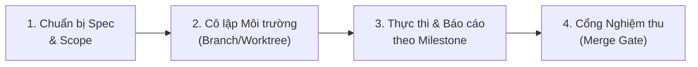

# 🤖 Subagent Coding Workflow & Agentic Discipline

Quy chuẩn vận hành và điều phối tác vụ lập trình cho AI Coding Agents và Subagents trong hệ sinh thái **CliniPortal**.

---

## 🎯 1. Nguyên Tắc Cốt Lõi (Core Laws)

1. **Durable Task Spec (Bản đặc tả bền vững)**:
   - Trước khi triển khai một tác vụ phức tạp (refactor, thêm phân hệ mới, sửa logic tính toán y khoa), bắt buộc tạo bản kế hoạch hoặc file spec (`implementation_plan.md` hoặc issue) làm kim chỉ nam.
   - Không bắt đầu viết code khi chưa thống nhất rõ mục tiêu và phạm vi ảnh hưởng.

2. **Worktree & Branch Isolation (Cô lập vùng làm việc an toàn)**:
   - Đối với các thay đổi lớn hoặc thử nghiệm kiến trúc mới, ưu tiên làm việc trên nhánh phụ (`git checkout -b feature/...`) hoặc git worktree độc lập.
   - Tuyệt đối không thay đổi mã nguồn trên nhánh chính khi chưa chạy qua các bước kiểm thử an toàn.

3. **Giao Tiếp & Báo Cáo Tinh Gọn (Milestone-based Reporting)**:
   - Không spam output log liên tục gây nhiễu context.
   - **Chỉ thông báo cho người dùng khi**:
     - Đạt một cột mốc quan trọng (**Milestone achieved**).
     - Cần người dùng phê duyệt hoặc làm rõ (**User decision needed**).
     - Phát sinh lỗi chặn (**Blocker / Critical bug**).
     - Hoàn thành toàn bộ nhiệm vụ (**Task completed**).

---

## 📋 2. Quy Trình 4 Bước Triển Khai Task



### Bước 1: Chuẩn bị Task Spec & Xác định Ranh giới
- Liệt kê danh sách file cần sửa, file tạo mới và file phụ thuộc (tham khảo `docs/FILE_MAP.md`).
- Xác định rõ tiêu chí hoàn thành (Acceptance Criteria) và các rủi ro tiềm ẩn đối với logic y khoa.

### Bước 2: Chuẩn bị Git & Cô lập Phân nhánh
- Kiểm tra trạng thái Git hiện tại:
  ```powershell
  git status
  ```
- Nếu là task lớn, tạo nhánh làm việc riêng:
  ```powershell
  git checkout -b feat/<ten-tinh-nang>
  ```

### Bước 3: Thực thi Vi phẫu & Báo cáo Tiến độ
- Áp dụng nguyên tắc **Surgical Edit** (sửa đúng điểm cần sửa, không xáo trộn dòng code không liên quan).
- Lưu checkpoint trạng thái sau mỗi bước thành công.

### Bước 4: Kiểm tra Cổng Nghiệm thu (Merge Gate Checklist)
Trước khi merge hoặc bàn giao mã nguồn:
- [ ] Toàn vẹn HTML (`node tools/scratch/check_tags.js <file.html>`).
- [ ] Không hardcode màu sắc, 100% dùng Design Tokens `var(--color-...)`.
- [ ] Tương thích Dark Mode (`data-theme="dark"`).
- [ ] Đạt chuẩn Responsive trên mobile ($\le 375\text{px}$, touch target $\ge 44\text{px}$).
- [ ] Không đưa thư viện ngoài vào mã nguồn (Pure Vanilla JS).
- [ ] Cập nhật `docs/FILE_MAP.md` và các tài liệu liên quan.

---

## 🛠️ 3. Quản Lý Tác Vụ Background & Subagents

Khi điều phối tác vụ chạy ngầm hoặc subagent:
- **Kiểm soát vòng đời**: Theo dõi trạng thái qua ID tác vụ.
- **Hủy tác vụ an toàn**: Nếu hủy một subagent hoặc background task, luôn giải thích rõ lý do và hoàn nguyên các thay đổi chưa hoàn tất.
- **Tổng kết bàn giao**: Luôn tạo Walkthrough tóm tắt các thay đổi đã thực hiện và bằng chứng kiểm thử cụ thể.
