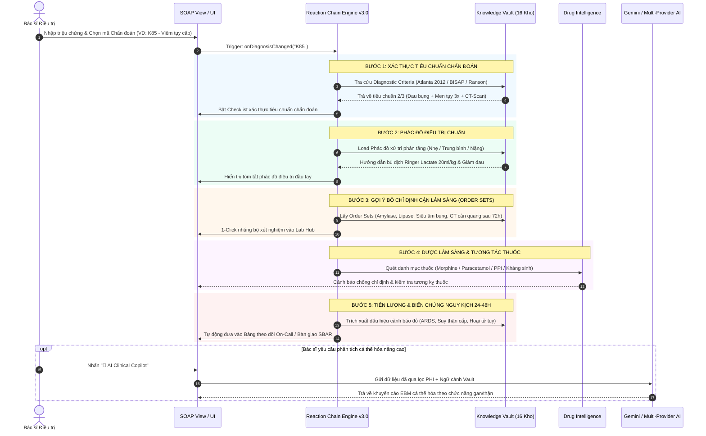
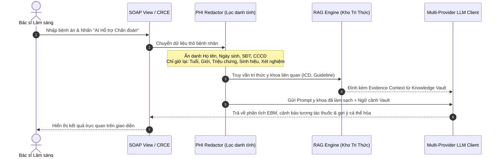

# 🩺 HƯỚNG DẪN VẬN HÀNH & KIẾN TRÚC HỆ SINH THÁI DOCSPACE
> **DocSpace Clinical Workspace & Architecture Master Manual**  
> *Không gian làm việc lâm sàng, sổ tay bệnh phòng thông minh, chuỗi phản ứng lâm sàng CRCE và trợ lý AI chuẩn EBM dành cho Bác sĩ điều trị trên nền tảng CliniPortal.*  
> **Phiên bản**: v3.5 (Tích hợp CRCE v3.0, FHIR R4, P2P LAN Sync & Multi-Provider AI)  
> **Kiến trúc**: 100% Client-Side, Offline-First (LocalStorage / IndexedDB / PouchDB)

---

## 📑 MỤC LỤC
1. [Tổng quan Dự án DocSpace](#-1-tổng-quan-dự-án-docspace)
2. [Sơ đồ Kiến trúc & Luồng Dữ liệu Hệ sinh thái](#-2-sơ-đồ-kiến-trúc--luồng-dữ-liệu-hệ-sinh-thái)
3. [Chuỗi Phản ứng Lâm sàng 5 Bước (CRCE v3.0)](#-3-chuỗi-phản-ứng-lâm-sàng-5-bước-crce-v30)
4. [Cấu trúc Thư mục & Mô-đun Mã nguồn](#-4-cấu-trúc-thư-mục--mô-đun-mã-nguồn)
5. [Các Phân hệ Tính năng Lâm sàng Cốt lõi](#-5-các-phân-hệ-tính-năng-lâm-sàng-cốt-lõi)
   - [5.1. Quản lý Hồ sơ Bác sĩ (Doctor Profiles)](#51-quản-lý-hồ-sơ-bác-sĩ-doctor-profiles)
   - [5.2. Sổ tay Bệnh phòng SOAP Digital & Lab Hub](#52-sổ-tay-bệnh-phòng-soap-digital--lab-hub)
   - [5.3. Báo cáo Bàn giao Ca trực SBAR](#53-báo-cáo-bàn-giao-ca-trực-sbar)
   - [5.4. Quản lý Tua trực On-Call Checklist](#54-quản-lý-tua-trực-on-call-checklist)
   - [5.5. Phác đồ Động Thích ứng (Living Protocols)](#55-phác-đồ-động-thích-ứng-living-protocols)
   - [5.6. Quản lý Bệnh Mạn tính (Chronic Care Manager)](#56-quản-lý-bệnh-mạn-tính-chronic-care-manager)
   - [5.7. Phòng Giả lập Ca bệnh OSCE (Simulation Sandbox)](#57-phòng-giả-lập-ca-bệnh-osce-simulation-sandbox)
   - [5.8. Sổ tay Cá nhân & Phác đồ Điều trị](#58-sổ-tay-cá-nhân--phác-đồ-điều-trị)
6. [Hệ thống Trợ lý AI & An toàn Dữ liệu Y tế](#-6-hệ-thống-trợ-lý-ai--an-toàn-dữ-liệu-y-tế)
   - [6.1. Lọc bỏ Dữ liệu Định danh (PHI Redactor / HIPAA Safe Harbor)](#61-lọc-bỏ-dữ-liệu-định-danh-phi-redactor--hipaa-safe-harbor)
   - [6.2. Multi-Provider LLM Engine & RAG Grounding](#62-multi-provider-llm-engine--rag-grounding)
   - [6.3. Trợ lý Thông minh & Insights Service](#63-trợ-lý-thông-minh--insights-service)
7. [Tầng Lưu trữ, Đồng bộ & Chuẩn Y tế Quốc tế](#-7-tầng-lưu-trữ-đồng-bộ--chuẩn-y-tế-quốc-tế)
   - [7.1. LocalStorage & IndexedDB / PouchDB Persistence](#71-localstorage--indexeddb--pouchdb-persistence)
   - [7.2. Đồng bộ Nội bộ Mạng LAN (P2P WebRTC / QR Sync)](#72-đồng-bộ-nội-bộ-mạng-lan-p2p-webrtc--qr-sync)
   - [7.3. Chuẩn hóa Quốc tế HL7 FHIR R4](#73-chuẩn-hóa-quốc-tế-hl7-fhir-r4)
   - [7.4. Sao lưu & Phục hồi Tức thì (QuickSave & JSON Export)](#74-sao-lưu--phục-hồi-tức-thì-quicksave--json-export)
8. [Tiện ích Tác chiến Nhanh (HUD & Clinical Utilities)](#-8-tiện-ích-tác-chiến-nhanh-hud--clinical-utilities)
   - [8.1. Clinical Command Bar (`Ctrl + K`)](#81-clinical-command-bar-ctrl--k)
   - [8.2. Drawer Tra cứu Nhanh Knowledge Vault (`Ctrl + Shift + V`)](#82-drawer-tra-cứu-nhanh-knowledge-vault-ctrl--shift--v)
   - [8.3. Drug Intelligence Panel (Kiểm tra Tương tác Thuốc)](#83-drug-intelligence-panel-kiểm-tra-tương-tác-thuốc)
   - [8.4. Clinical Calculator Picker & ABG Analyzer](#84-clinical-calculator-picker--abg-analyzer)
9. [Quy trình Vận hành Lâm sàng Tiêu chuẩn (Clinical SOP)](#-9-quy-trình-vận-hành-lâm-sàng-tiêu-chuẩn-clinical-sop)
10. [Bảng Phím tắt Nhanh (Keyboard Shortcuts Matrix)](#-10-bảng-phím-tắt-nhanh-keyboard-shortcuts-matrix)
11. [Hướng dẫn Phát triển & Mở rộng (Developer Guide)](#-11-hướng-dẫn-phát-triển--mở-rộng-developer-guide)

---

## 🌟 1. Tổng Quan Dự Án DocSpace

**DocSpace** là không gian làm việc số hóa tại giường bệnh (Bedside Clinical Workspace), được phát triển nhằm tối ưu hóa toàn diện dòng công việc (Workflow) của Bác sĩ điều trị, Bác sĩ nội trú và Sinh viên Y khoa trên nền tảng **CliniPortal**.

### Điểm nổi bật cốt lõi:
- **100% Client-Side & Offline-First**: Toàn bộ dữ liệu bệnh án lưu trữ an toàn trên thiết bị cá nhân/trình duyệt, sẵn sàng hoạt động ngay cả khi mất kết nối Internet.
- **Tương tác hai chiều với Knowledge Vault**: Kết nối trực tiếp 16 kho tri thức Y học chứng cứ (2.362+ bài viết EBM) thông qua RAG Grounding, 1-Click Insert và Quick Reference Drawer.
- **Chuỗi Phản Ứng Lâm Sàng (CRCE v3.0)**: Tự động kích hoạt chuỗi 5 bước tiêu chuẩn - phác đồ - cận lâm sàng - dược - biến chứng ngay khi chọn bệnh.
- **Bảo mật Y tế Tuyệt đối (HIPAA PHI Redacted)**: Tự động ẩn danh hóa toàn bộ thông tin nhạy cảm của người bệnh trước khi gửi qua API trí tuệ nhân tạo.

---

## 🏛️ 2. Sơ Đồ Kiến Trúc & Luồng Dữ Liệu Hệ Sinh Thái

```mermaid
flowchart TB
    %% Styling tokens
    classDef access fill:#0284c7,stroke:#0369a1,stroke-width:2px,color:#fff,rx:6px;
    classDef feature fill:#f0f9ff,stroke:#0284c7,stroke-width:1.5px,color:#0c4a6e;
    classDef engine fill:#ecfdf5,stroke:#10b981,stroke-width:2px,color:#064e3b;
    classDef hud fill:#fff7ed,stroke:#ea580c,stroke-width:1.5px,color:#7c2d12;
    classDef storage fill:#fffbeb,stroke:#f59e0b,stroke-width:1.5px,color:#78350f;
    classDef ai fill:#fdf4ff,stroke:#d946ef,stroke-width:1.5px,color:#701a75;
    classDef vault fill:#f8fafc,stroke:#64748b,stroke-width:1.5px,color:#0f172a,stroke-dasharray: 4 4;

    U([👤 Bác sĩ Lâm Sàng / Nội Trú / SV Y]):::access

    subgraph LAYER_1["1. User & Access Layer (Truy Cập & Điều Phối)"]
        Router["CliniRouter (#/docspace/*)"]:::access
        Login["Profile Selector (dsp_active_profile)"]:::access
        Dash["Dashboard Bento Grid Hub"]:::access
    end

    subgraph LAYER_2["2. Core Clinical Features (Trạm Tác Chiến Lâm Sàng)"]
        SOAP["SOAP Digital & Lab Hub<br/>(soap-view.ts & lab-diagnostics-hub.ts)"]:::feature
        SBAR["SBAR Bàn Giao Ca Trực<br/>(sbar-view.ts)"]:::feature
        OnCall["Checklist Tua Trực On-Call<br/>(oncall-view.ts)"]:::feature
        Chronic["Quản Lý Bệnh Mạn Tính<br/>(chronic-care-view.ts)"]:::feature
        Living["Living Protocols Động<br/>(living-protocol-view.ts)"]:::feature
        Sandbox["OSCE Simulation Sandbox<br/>(simulation-view.ts)"]:::feature
        Notepad["Personal Notes & Protocols<br/>(notepad-view.ts & protocol-view.ts)"]:::feature
    end

    subgraph LAYER_3["3. Fast HUD & Clinical Tools (Tiện Ích Tác Chiến Nhanh)"]
        CmdBar["Command Bar Spotlight (Ctrl+K)<br/>(command-bar.ts)"]:::hud
        Drawer["Quick Reference Drawer (Ctrl+Shift+V)<br/>(quick-reference-drawer.ts)"]:::hud
        DrugIntell["Drug Intelligence Panel<br/>(drug-intelligence-panel.ts)"]:::hud
        CalcHub["Clinical Calculator Hub & ABG<br/>(calculator-picker.ts & abg-picker.ts)"]:::hud
    end

    subgraph LAYER_4["4. Reaction Engine & AI Copilot (Động Cơ Lâm Sàng & AI)"]
        CRCE["⚡ CRCE v3.0 (Clinical Reaction Chain Engine)<br/>(reaction-chain-engine.ts)"]:::engine
        PHI["🛡️ PHI Redactor (HIPAA Safe Harbor)<br/>(ai/phi-redactor.ts)"]:::ai
        RAG["📚 RAG Knowledge Vault Engine<br/>(ai/rag-engine.ts & index.json)"]:::ai
        LLM["🤖 Multi-Provider LLM Client<br/>(Gemini, DeepSeek, Claude, OpenAI, Ollama)"]:::ai
    end

    subgraph LAYER_5["5. Storage & Interoperability (Lưu Trữ & Chuẩn Y Tế)"]
        Storage[("LocalStorage / IndexedDB / PouchDB<br/>(storage.ts & pouch-adapter.ts)")]:::storage
        P2P["📶 P2P LAN Sync (WebRTC / QR)<br/>(p2p-sync.ts & p2p-sync-view.ts)"]:::storage
        FHIR["🌐 HL7 FHIR R4 Adapter<br/>(data/fhir-adapter.ts)"]:::storage
        Export["💾 JSON / FHIR Export & QuickSave<br/>(features/quick-save.ts)"]:::storage
    end

    subgraph KNOWLEDGE_VAULT["📚 KNOWLEDGE VAULT (16 Kho Tri Thức EBM - 2.362+ Bài Viết)"]:::vault
        V1["1. Cơ Sở: GP, Sinh Lý, Hóa Sinh, Dịch Tễ, Kỹ Năng"]
        V2["2. Chuyên Sâu: Lâm Sàng, Cận LS, Tiêu Chuẩn, Phác Đồ, Dược, Biến Chứng"]
        V3["3. Hỗ Trợ: Thang Điểm, NCKH & EBM"]
    end

    %% Access Layer Connections
    U --> Router --> Login --> Dash
    Dash --> SOAP & SBAR & OnCall & Chronic & Living & Sandbox & Notepad

    %% HUD Interactions
    U -. "Ctrl+K" .-> CmdBar
    CmdBar --> SOAP & CalcHub & Drawer
    SOAP <--> DrugIntell
    SOAP <--> CalcHub
    SOAP <--> Drawer

    %% CRCE & AI Interactions
    SOAP <==>|"Chọn ICD-10 / Chẩn đoán"| CRCE
    CRCE <-->|"Tiêu chuẩn, Phác đồ, Biến chứng"| KNOWLEDGE_VAULT
    Drawer <-->|"Đọc bài viết không reload trang"| KNOWLEDGE_VAULT
    
    SOAP -->|"Gửi dữ liệu bệnh án"| PHI
    PHI -->|"Dữ liệu đã ẩn danh + Prompt y khoa"| LLM
    RAG -->|"Evidence Grounding"| LLM
    KNOWLEDGE_VAULT -->|"Vector Index"| RAG
    LLM -->|"Khuyến nghị EBM & Cảnh báo an toàn"| SOAP

    %% Storage Interactions
    Login & Dash & SOAP & SBAR & OnCall & Chronic & Living & Notepad <--> Storage
    Storage <--> FHIR <--> Export
    Storage <--> P2P
    Storage <--> Export
```

---

## ⚡ 3. Chuỗi Phản Ứng Lâm Sàng 5 Bước (CRCE v3.0)

Động cơ **Clinical Reaction Chain Engine (CRCE v3.0)** tự động kích hoạt phản ứng dây chuyền 5 bước ngay khi Bác sĩ chọn hoặc nhập một mã bệnh / chẩn đoán:



---

## 📁 4. Cấu Trúc Thư Mục & Mô-Đun Mã Nguồn

```text
src/content/docspace/
├── README.md                    # [Tài liệu hiện tại] Sổ tay Vận hành & Kiến trúc Hệ sinh thái Master
├── index.ts                     # Entry point: Đăng ký Router #/docspace/*, mount HUD & phím tắt
├── index.json                   # Vector/Keyword index tra cứu RAG ngữ nghĩa của Knowledge Vault
├── types.ts                     # Định nghĩa TypeScript Interface toàn diện (Patient, SOAP, SBAR, CRCE, AI...)
├── storage.ts                   # Storage API trung tâm (CRUD Profile, mã hóa, snapshot, FHIR I/O)
├── docspace-view.ts             # Template View: Header, Sidebar, Dashboard Bento Hub, Profile Selector
│
├── ai/                          # 🤖 TẦNG TRÍ TUỆ NHÂN TẠO & BẢO MẬT
│   ├── llm-client.ts            # Client đa mô hình (Gemini 2.0, DeepSeek, Claude, OpenAI, Ollama)
│   ├── phi-redactor.ts          # Lọc bỏ thông tin định danh cá nhân (PHI) đạt chuẩn HIPAA
│   ├── rag-engine.ts            # Động cơ RAG semantic/keyword search tri thức y học chứng cứ
│   ├── gemini-crce-client.ts    # Phân tích ca bệnh chuyên sâu kết hợp phác đồ CRCE
│   ├── gemini-insights-service.ts# Đề xuất tối ưu hóa điều trị & phát hiện tương tác nguy cơ
│   └── crce-ai-prompts.ts       # Thư viện Clinical System Prompts chuẩn hóa y khoa
│
├── core/                        # 🏛️ TẦNG CỐT LÕI
│   └── clinical-bridge.ts       # Cầu nối dữ liệu giữa DocSpace và các Module CliniPortal khác
│
├── data/                        # 📚 CƠ SỞ DỮ LIỆU TĨNH & PHÁC ĐỒ CHUẨN
│   ├── diagnostic-criteria-database.ts # Ngân hàng 100+ Tiêu chuẩn Chẩn đoán Quốc tế (Atlanta, KDIGO, GOLD...)
│   ├── disease-order-sets.ts    # Bộ chỉ định xét nghiệm & cận lâm sàng mẫu theo mặt bệnh
│   ├── drug-interactions.ts     # Cơ sở dữ liệu 500+ tương tác thuốc lâm sàng & mức độ nghiêm trọng
│   ├── master-protocols-data.ts # Dữ liệu phác đồ gốc và nhánh điều trị
│   ├── symptom-icd-mapping.ts   # Ma trận ánh xạ triệu chứng cơ năng ➔ Mã bệnh ICD-10
│   ├── fhir-adapter.ts          # Chuyển đổi dữ liệu DocSpace ➔ FHIR R4 Bundle
│   ├── p2p-sync.ts              # Giao thức truyền tin P2P WebRTC / QR sync
│   └── living-protocol-templates/# Template cây quyết định lâm sàng JSON
│
├── features/                    # 🛠️ CÁC TÍNH NĂNG LÂM SÀNG & VIEW CONTROLLERS
│   ├── soap-view.ts             # Giao diện SOAP Digital, buồng bệnh, buồng khám, lọc trạng thái
│   ├── lab-diagnostics-hub.ts   # Bộ nhập & phân tích kết quả xét nghiệm máu, sinh hóa, hình ảnh
│   ├── reaction-chain-engine.ts # Động cơ phản ứng 5 bước tự động CRCE v3.0
│   ├── reaction-chain-drawer.ts # Giao diện ngăn kéo (Drawer) chuỗi phản ứng lâm sàng
│   ├── sbar-view.ts             # Giao diện báo cáo và bàn giao ca trực chuẩn SBAR
│   ├── oncall-view.ts           # Bảng kiểm công việc ca trực (Emergency & Routine tasks)
│   ├── living-protocol-view.ts  # Trình diễn cây quyết định lâm sàng tương tác
│   ├── chronic-care-view.ts     # Quản lý theo dõi bệnh nhân mạn tính đường dài
│   ├── simulation-view.ts       # Phòng giả lập ca bệnh lâm sàng & OSCE AI
│   ├── command-bar.ts           # Thanh tìm kiếm lệnh nhanh Spotlight (Ctrl+K)
│   ├── quick-reference-drawer.ts# Ngăn kéo tra cứu nhanh 16 kho Knowledge Vault
│   ├── drug-intelligence-panel.ts# Bảng phân tích an toàn dược & tương tác thuốc
│   ├── calculator-picker.ts     # Trình chọn & nhúng máy tính y khoa vào bệnh án
│   ├── abg-picker.ts            # Phân tích khí máu động mạch tự động
│   ├── icd-picker.ts            # Bộ tra cứu mã ICD-10 thông minh
│   ├── drug-journal-view.ts     # Sổ tay kê đơn & phân liều cá thể hóa
│   ├── notepad-view.ts          # Sổ tay ghi chép lâm sàng cá nhân (Markdown)
│   ├── protocol-view.ts         # Quản lý phác đồ điều trị cá nhân
│   ├── quick-links-view.ts      # Danh bạ số hotline & liên kết thường dùng
│   ├── patient-demographics-view.ts # Quản lý chi tiết thông tin hành chính & tiền sử
│   ├── ai-settings-view.ts      # Quản lý API Key, chọn model LLM, Prompt customization
│   ├── sync-settings-view.ts    # Cấu hình đồng bộ P2P, Supabase, sao lưu định kỳ
│   ├── p2p-sync-view.ts         # Giao diện kết nối P2P qua QR Code
│   ├── insights-view.ts         # Dashboard thống kê chất lượng điều trị & ca bệnh
│   ├── dependency-map-view.ts   # Sơ đồ mạng lưới liên kết thực thể tri thức
│   ├── docspace-settings-modal.ts# Cửa sổ cài đặt giao diện & thông số vận hành
│   ├── quick-save.ts            # Tự động lưu & phục hồi dữ liệu tức thì
│   └── audit-shield.ts          # Nhật ký thao tác bảo mật lâm sàng
│
├── storage/                     # 💾 ADAPTER LƯU TRỮ NÂNG CAO
│   ├── pouch-adapter.ts         # Adapter PouchDB hỗ trợ lưu trữ Offline không giới hạn dung lượng
│   ├── supabase-soap.ts         # Adapter đồng bộ bảo mật lên đám mây Supabase (Tùy chọn)
│   └── supabase_soap_schema.sql # Schema PostgreSQL cho Supabase
│
└── tools/                       # 🧮 CÔNG CỤ TÍNH TOÁN & THANG ĐIỂM
    ├── registry.ts              # Đăng ký các thang điểm lâm sàng
    ├── score-modal.ts           # Modal hiển thị và tính toán điểm trực quan
    ├── types.ts                 # Type definitions cho thang điểm
    └── scores/                  # Thư mục chứa các thuật toán thang điểm cụ thể
```

---

## 🩺 5. Các Phân Hệ Tính Năng Lâm Sàng Cốt Lõi

### 5.1. Quản lý Hồ sơ Bác sĩ (Doctor Profiles)
- **Mã nguồn**: `storage.ts`, `docspace-view.ts`
- **Cơ chế Phân lập**: Dữ liệu được cô lập độc lập theo khóa `dsp_profile_data_<id>`. Bác sĩ có thể tạo nhiều hồ sơ riêng biệt cho từng Khoa/Bệnh viện (ví dụ: *Nội Tim Mạch - BV Chợ Rẫy*, *Khoa Cấp Cứu*, *Phòng Khám Ngoài Giờ*).

### 5.2. Sổ tay Bệnh phòng SOAP Digital & Lab Hub
- **Mã nguồn**: `features/soap-view.ts`, `features/lab-diagnostics-hub.ts`
- **Chuẩn hóa 4 phần y khoa**:
  - **S (Subjective)**: Bệnh sử, triệu chứng cơ năng, tiền sử bản thân/gia đình.
  - **O (Objective)**: Khám thực thể từng cơ quan, sinh hiệu, chỉ số phòng lab (Lab Hub).
  - **A (Assessment)**: Chẩn đoán sơ bộ/xác định, mã ICD-10, chẩn đoán phân biệt, phân tầng nguy cơ.
  - **P (Plan)**: Y lệnh điều trị, đơn thuốc, xét nghiệm theo dõi, dặn dò dinh dưỡng.
- **Tính năng nổi bật**: Phân loại màu sắc triage (Nguy kịch 🔴, Nặng 🟠, Ổn định 🟢, Xuất viện ⚪), Lab Hub tự động gắn cờ giá trị ngoài khoảng tham chiếu, in bệnh án A4 chuẩn PDF.

### 5.3. Báo cáo Bàn giao Ca trực SBAR
- **Mã nguồn**: `features/sbar-view.ts`
- **Mô hình 4 bước**: **S**ituation (Tình huống) — **B**ackground (Bệnh nền) — **A**ssessment (Đánh giá diễn biến) — **R**ecommendation (Đề xuất xử trí tiếp theo).
- **Tính năng**: 1-Click chuyển dữ liệu từ SOAP sang SBAR, lọc danh sách bệnh nhân nặng cần theo dõi trong đêm.

### 5.4. Quản lý Tua trực On-Call Checklist
- **Mã nguồn**: `features/oncall-view.ts`
- **Tính năng**: Quản lý đầu việc ca trực, phân loại Khẩn cấp / Thường quy, đếm giờ trực và đánh dấu hoàn thành trực quan.

### 5.5. Phác đồ Động Thích ứng (Living Protocols)
- **Mã nguồn**: `features/living-protocol-view.ts`, `data/master-protocols-data.ts`
- **Cơ chế**: Cây quyết định phân nhánh động. Bác sĩ tick chọn dấu hiệu thực tế của người bệnh (VD: Huyết áp tụt? SpO2 < 90%?), hệ thống sẽ chỉ ra nhánh can thiệp chính xác tiếp theo.

### 5.6. Quản lý Bệnh Mạn tính (Chronic Care Manager)
- **Mã nguồn**: `features/chronic-care-view.ts`
- **Mặt bệnh hỗ trợ**: Tăng huyết áp, ĐTĐ Type 2, Bệnh thận mạn (CKD), COPD, Suy tim.
- **Tính năng**: Vẽ biểu đồ diễn tiến đường huyết, HbA1c, eGFR, Huyết áp theo thời gian, tính toán độ lọc cầu thận và khuyến cáo chỉnh liều thuốc bảo vệ thận.

### 5.7. Phòng Giả lập Ca bệnh OSCE (Simulation Sandbox)
- **Mã nguồn**: `features/simulation-view.ts`
- **Mục đích**: Huấn luyện kỹ năng lâm sàng cho sinh viên và bác sĩ trẻ.
- **Cơ chế**: AI đóng vai bệnh nhân hoặc giám khảo chấm điểm quy trình tiếp cận theo thang điểm OSCE chuẩn.

### 5.8. Sổ tay Cá nhân & Phác đồ Điều trị
- **Mã nguồn**: `features/notepad-view.ts`, `features/protocol-view.ts`
- **Tính năng**: Trình soạn thảo ghi chép Markdown cá nhân hóa, lưu trữ phác đồ kinh nghiệm lâm sàng theo tuyến bệnh viện.

---

## 🤖 6. Hệ Thống Trợ Lý AI & An Toàn Dữ Liệu Y Tế



### 6.1. Lọc bỏ Dữ liệu Định danh (PHI Redactor / HIPAA Safe Harbor)
- **Mã nguồn**: `ai/phi-redactor.ts`
- **Quy chuẩn**: Chuẩn bảo mật thông tin y tế **HIPAA Safe Harbor**.
- Trước khi chuỗi văn bản được gửi ra ngoài trình duyệt qua API, hàm `redactPHI()` tự động nhận diện và thay thế:
  - Tên bệnh nhân ➔ `[PATIENT_NAME]`
  - Số điện thoại / CCCD / Mã BHYT ➔ `[IDENTIFIER_REDACTED]`
  - Địa chỉ ➔ `[ADDRESS]`
  - Ngày sinh chi tiết ➔ Chỉ giữ lại số tuổi.

### 6.2. Multi-Provider LLM Engine & RAG Grounding
- **Nhà cung cấp hỗ trợ**: **Google Gemini (Gemini 2.0 Flash / Pro)**, **DeepSeek (DeepSeek-V3 / R1)**, **OpenAI (GPT-4o)**, **Anthropic Claude (Claude 3.5 Sonnet)** và **Ollama (Chạy local 100% offline)**.
- **RAG Grounding**: Động cơ RAG đối sánh với 2.362+ bài viết trong Knowledge Vault để đảm bảo câu trả lời của AI luôn dựa trên bằng chứng y học (Evidence-Based Medicine), triệt tiêu hiện tượng ảo giác (Hallucination).

---

## 💾 7. Tầng Lưu Trữ, Đồng Bộ & Chuẩn Y Tế Quốc Tế

### 7.1. LocalStorage & IndexedDB / PouchDB Persistence
- Toàn bộ dữ liệu bệnh án, danh sách bệnh nhân và cài đặt được lưu trữ theo cấu trúc khóa có tiền tố `dsp_`:
  - `dsp_active_profile`: ID profile đang hoạt động.
  - `dsp_profiles_index`: Danh sách danh mục tất cả profile.
  - `dsp_profile_data_<id>`: Toàn bộ dữ liệu của hồ sơ cụ thể.
  - `dsp_ai_settings`: Cấu hình API Key và model AI.
- Tích hợp **PouchDB Adapter** (`storage/pouch-adapter.ts`) giúp vượt qua giới hạn 5MB của LocalStorage, cho phép lưu trữ hàng ngàn ca bệnh kèm hình ảnh cận lâm sàng ngay trong IndexedDB.

### 7.2. Đồng bộ Nội bộ Mạng LAN (P2P WebRTC / QR Sync)
- **Mã nguồn**: `features/p2p-sync-view.ts`, `data/p2p-sync.ts`
- Cho phép Bác sĩ đồng bộ nhanh dữ liệu ca trực giữa máy tính bàn trực và điện thoại di động thông qua mạng Wi-Fi nội bộ bệnh viện bằng cách quét mã QR hoặc WebRTC DataChannel, **không cần dữ liệu đi qua internet**.

### 7.3. Chuẩn hóa Quốc tế HL7 FHIR R4
- **Mã nguồn**: `data/fhir-adapter.ts`
- Cho phép xuất và nhập toàn bộ hồ sơ bệnh án dưới dạng **FHIR R4 Bundle JSON**, tương thích với các hệ thống EMR/HIS bệnh viện:
  - `Patient Resource`: Thông tin hành chính.
  - `Condition Resource`: Chẩn đoán xác định & phân biệt kèm mã ICD-10.
  - `Observation Resource`: Dấu hiệu sinh tồn, chỉ số phòng lab.
  - `MedicationRequest Resource`: Đơn thuốc điều trị.

---

## ⚡ 8. Tiện Ích Tác Chiến Nhanh (HUD & Clinical Utilities)

| Tiện ích | Phím tắt / Vị trí | Chức năng chính |
|:---|:---|:---|
| **Clinical Command Bar** | `Ctrl + K` (hoặc `Cmd + K`) | Thanh tìm kiếm Spotlight toàn năng: Tìm nhanh bệnh nhân theo tên/mã/giường, nhảy đến công cụ tính điểm, tra cứu nhanh ICD-10. |
| **Quick Reference Drawer** | `Ctrl + Shift + V` / Nút Sách Header | Ngăn kéo trượt từ bên phải, cho phép đọc toàn bộ 16 kho tri thức Knowledge Vault mà không làm mất trang bệnh án đang nhập dở. |
| **Drug Intelligence Panel** | Nút tra cứu thuốc trong SOAP / Plan | Tự động quét danh mục thuốc bệnh nhân đang dùng để cảnh báo tương tác thuốc mức độ Nặng (Major) và Nguy kịch (Contraindicated). |
| **Clinical Calculator Hub** | Nút máy tính / Phím tắt | Tra cứu và tính toán nhanh 50+ thang điểm lâm sàng (CURB-65, Wells, CHA2DS2-VASc, Glasgow, MELD, Child-Pugh, GFR...). |
| **ABG Analyzer** | Nút Khí máu trong Lab Hub | Nhập pH, PaCO2, HCO3- ➔ Tự động phân tích toan kiềm, tính Anion Gap, Delta-Delta và gợi ý nguyên nhân. |

---

## 🔄 9. Quy Trình Vận Hành Lâm Sàng Tiêu Chuẩn (Clinical SOP)

```text
[1. BẮT ĐẦU CA TRỰC]
   │
   ├── Chọn/Tạo Profile Bác sĩ & Khoa điều trị (#/docspace/select-profile)
   ├── Mở Dashboard Bento Grid nắm tổng quan buồng bệnh & ca trực
   └── Kiểm tra Checklist On-Call (#/docspace/oncall) lọc đầu việc khẩn cấp
   │
[2. KHÁM BỆNH & GHI CHÉP BỆNH ÁN PHÒNG]
   │
   ├── Mở SOAP Digital (#/docspace/soap) chọn buồng / giường
   ├── Nhập S (Bệnh sử) & O (Sinh hiệu + Lab Hub tự động gắn cờ bất thường)
   ├── Nhập Chẩn đoán ➔ Kích hoạt CRCE v3.0 kiểm tra tiêu chuẩn & phác đồ
   ├── Tra cứu tương tác thuốc trên Drug Intelligence Panel ➔ Kê đơn (P)
   └── (Nếu cần) Bật "AI Clinical Copilot" phân tích tối ưu hóa EBM
   │
[3. TRA CỨU NHANH TẠI GIƯỜNG (HUD)]
   │
   ├── Dùng `Ctrl + K` tìm kiếm nhanh bệnh nhân, thang điểm hoặc mã ICD
   ├── Bật Quick Reference Drawer (`Ctrl + Shift + V`) đọc guideline y văn
   └── Dùng ABG Analyzer đọc kết quả khí máu động mạch khẩn
   │
[4. GIAO BAN & BÀN GIAO CA TRỰC]
   │
   ├── Nhấn "1-Click Chuyển sang SBAR" trên bệnh án bệnh nhân nặng
   ├── Mở SBAR View (#/docspace/sbar) bàn giao cho tua trực tiếp theo
   └── Kiểm tra cảnh báo đỏ các biến chứng nguy hiểm 24-48 giờ tới
   │
[5. KẾT THÚC CA TRỰC & SAO LƯU]
   │
   ├── Quét mã QR đồng bộ P2P dữ liệu ca trực sang điện thoại cá nhân
   └── Xuất tệp sao lưu JSON / FHIR R4 Bundle lưu trữ an toàn
```

---

## ⌨️ 10. Bảng Phím Tắt Nhanh (Keyboard Shortcuts Matrix)

| Tổ hợp phím | Hành động |
|:---|:---|
| `Ctrl + K` (hoặc `Cmd + K`) | Mở Clinical Command Bar (Tìm kiếm & Điều hướng nhanh) |
| `Ctrl + S` (hoặc `Cmd + S`) | Lưu nhanh bệnh án / ghi chú hiện tại (QuickSave) |
| `Ctrl + Shift + V` | Đóng / Mở Quick Reference Drawer (Tra cứu Knowledge Vault) |
| `Ctrl + Shift + C` | Mở nhanh Chuỗi Phản Ứng Lâm Sàng (CRCE Drawer) |
| `Ctrl + Shift + L` | Mở nhanh Khí máu động mạch (ABG Analyzer) |
| `Ctrl + Shift + D` | Bật / Tắt chế độ Dark Mode |
| `Esc` | Đóng mọi Modal / Drawer đang mở |

---

## 💻 11. Hướng Dẫn Phát Triển & Mở Rộng (Developer Guide)

### 11.1. Môi trường Yêu cầu
- **Node.js**: >= 18.x
- **TypeScript**: >= 5.x
- **Chuẩn công nghệ**: Vanilla TypeScript/JavaScript DOM manipulation, CSS Variables Design Tokens của CliniPortal.

### 11.2. Biên dịch TypeScript
```powershell
# Chạy build TypeScript từ thư mục gốc dự án
npm run build:ts
# Hoặc watch chế độ dev
npx tsc -p tsconfig.json --watch
```

### 11.3. Đăng ký Route Mới trong DocSpace
Khi bổ sung một tính năng mới trong `src/content/docspace/features/`:
1. Tạo file View & Controller: `features/ten-tinh-nang-view.ts`.
2. Khai báo Interface trong `types.ts` nếu có cấu trúc dữ liệu mới.
3. Thêm mục vào `DSP_NAV_ITEMS` trong `docspace-view.ts`.
4. Đăng ký route trong `index.ts`:
   ```typescript
   router.register('#/docspace/ten-route', async () => {
     const profile = getActiveProfile();
     if (!profile) { router.navigate('#/docspace/select-profile'); return; }
     await mountDocSpace(renderSidebar('ten-route') + renderTenTinhNangView(profile));
     mountTenTinhNangController();
   });
   ```

---

> 📌 **Tài liệu Liên quan**:
> - [Quy trình Tương tác DocSpace & Knowledge Vault](file:///d:/Apps_ykhoa/docs/QUY_TRINH_TUONG_TAC_DOCSPACE_VAULT.md)
> - [Danh mục Bản đồ File CliniPortal](file:///d:/Apps_ykhoa/docs/FILE_MAP.md)
