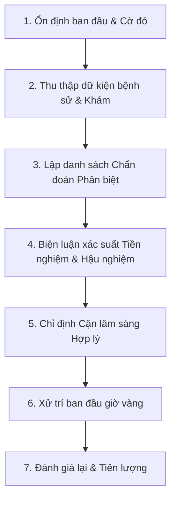

# Nguyên tắc Cốt lõi & Khuyến cáo Lâm sàng trong Tiếp cận Lâm sàng

> **Tài nguyên y học chứng cứ CliniPortal** — Cập nhật theo Hướng dẫn Ministry of Health, AHA/ACC, ESC, & WAO 2026.

---

## ⚡ 1. Khai thác Triệu chứng & Sàng lọc Dấu hiệu Cờ đỏ (Red Flags)

Khi tiếp cận bất kỳ bệnh nhân nào tại Khoa Cấp cứu hoặc Khám bệnh, việc **sàng lọc nguy cơ tử vong trong 5 phút đầu** là nguyên tắc bất di bất dịch:

- **Hệ Hô hấp - Tuần hoàn**: SpO2 < 92%, Nhịp thở > 30 lần/phút, Huyết áp tâm thu < 90 mmHg hoặc Mạch > 120 lần/phút.
- **Hệ Thần kinh**: Điểm Glasgow < 13, Cổ cứng, Liệt vận động đột ngột hoặc Co giật kéo dài > 5 phút.
- **Hệ Tiêu hóa - Máu**: Nôn ra máu lượng lớn, Tiêu phân đen vã mồ hôi, Bụng cứng như gỗ.

> [!WARNING]
> **Quy tắc Vàng**: Luôn ổn định chức năng sống (**ABCDE - Airway, Breathing, Circulation, Disability, Exposure**) trước khi tiến hành hỏi bệnh chi tiết hay cho đi làm cận lâm sàng hình ảnh.

---

## 💡 2. Các Bước Lý luận Lâm sàng Theo Mô hình 7 Bước CliniPortal

### Chi tiết các tiêu chuẩn:
1. **Biện luận Xác suất (Likelihood Ratios - LR)**: Sử dụng các bảng điểm lâm sàng chuẩn hóa (Well's Score cho Thuyên tắc phổi, TIMI/GRACE cho Hội chứng mạch vành cấp, Centor Score cho Viêm họng) để tránh chỉ định xét nghiệm tràn lan.
2. **Cận lâm sàng bậc thang**: Đi từ xét nghiệm đơn giản, tại giường (ECG, đường huyết mao mạch, Fast US) đến xét nghiệm chuyên sâu (CT-Scan, MRI, GenExpert).

---

## 📚 3. Tài liệu Tham khảo & Guidelines

1. **Bộ Y tế Việt Nam** (2020-2025), *Hướng dẫn Chẩn đoán và Điều trị các Bệnh Nội khoa & Cấp cứu Resuscitation*.
2. **AHA/ACC Guidelines** (2025), *Evaluation and Diagnosis of Chest Pain in Emergency Department*.
3. **World Allergy Organization (WAO)** (2024), *Anaphylaxis Guidance and Emergency Adrenaline Dosing Protocol*.
4. **European Society of Cardiology (ESC)** (2025), *Guidelines for the Management of Acute Coronary Syndromes*.
