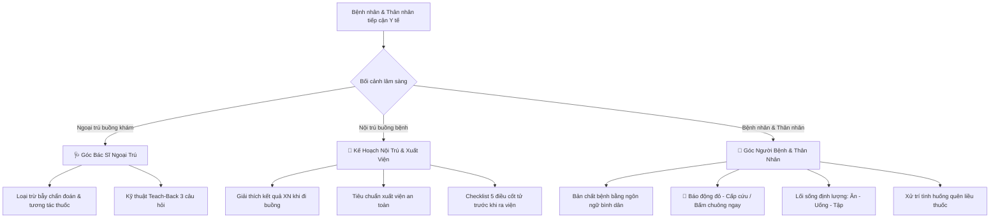

# 🗣️ CliniPortal — Kho Tư Vấn & Kịch Bản Lâm Sàng Ngoại Trú / Nội Trú (Master MOC)

> Cổng điều phối kịch bản giao tiếp, dặn dò và giáo dục người bệnh đa môi trường: **Buồng khám Ngoại trú (Outpatient)** & **Đầu giường Nội trú (Inpatient Bedside)**. Tích hợp đa góc nhìn trên cùng 1 tệp Markdown:
>
> - **🩺 Góc Bác Sĩ**: Chuyên môn, Dược động học, Cạm bẫy dùng thuốc & Kỹ thuật Teach-Back
> - **👤 Góc Người Bệnh**: Bản chất bệnh, Dấu hiệu đỏ cấp cứu, Lối sống định lượng & Xử trí sự cố dùng thuốc
> - **🏥 Kế Hoạch Nội Trú**: Giải thích cận lâm sàng, Tiêu chuẩn xuất viện an toàn & Checklist 5 điều trước khi ra viện

> [!TIP] 🌐 **TRA CỨU SIÊU TỐC TRÊN CLINIAPORTAL KNOWLEDGE VAULT WEB HUB**
> Tra cứu tức thì (< 10ms) với bộ lọc chuyên khoa, giao diện **Bảng Thông Báo Trung Tâm**, bộ chuyển đổi góc nhìn (Dual/Triplet Perspective), chế độ in tờ rơi bệnh nhân (Patient Leaflet) và sao chép lời dặn tại:
> 🔗 **[Mở Kho Tư Vấn trên Web Hub](file:///d:/Apps_ykhoa/src/content/knowledge-vault/index.html?kho=TV)** *(hoặc `http://localhost:3000/src/content/knowledge-vault/index.html?kho=TV`)*

---

## 🏷️ Quy Chuẩn Đặt Tên Tệp Kho Tư Vấn (Standardized File Naming Convention)

Để phục vụ kho dữ liệu mở rộng hàng trăm kịch bản bệnh học đa góc độ, mọi tệp trong Kho 2.6 tuân thủ cú pháp chuẩn hóa:

$$\mathbf{TV\_\langle TênBệnh\rangle\_\langle Context\rangle\_\langle Topic\rangle.md}$$

### 1. Bảng Định Nghĩa Các Trường Thành Phần

| Trường | Ý Nghĩa | Giá Trị Hợp Lệ | Mô Tả & Ví Dụ |
| :--- | :--- | :--- | :--- |
| **`TV`** | Tiền tố Kho Tư Vấn | `TV` | Cố định cho toàn bộ Kho 2.6 |
| **`TênBệnh`** | Tên bệnh lý tiếng Việt | Tên bệnh chuẩn y khoa | `Tăng huyết áp`, `Đái tháo đường type 2`, `Sốt xuất huyết Dengue` |
| **`Context`** | Bối cảnh điều trị lâm sàng | `Ngoai` `Noi` `CapCuu` `HauPhau` | • `Ngoai`: Buồng khám ngoại trú, kê đơn, tái khám định kỳ. • `Noi`: Nội trú buồng bệnh, đi buồng, chuẩn bị xuất viện. • `CapCuu`: Bàn tiếp nhận cấp cứu, xử trí dấu hiệu đỏ khẩn. • `HauPhau`: Tư vấn sau mổ, chăm sóc vết mổ và hồi phục. |
| **`Topic`** | Chủ đề / Nhóm câu hỏi | `P1` `QuenLieu` `TacDungPhu` `DauHieuDo` `CheDoAn` `QnA` | • `P1`: Kịch bản tổng quan toàn diện. • `QuenLieu`: Sự cố quên liều, uống quá liều, đi du lịch quên thuốc. • `TacDungPhu`: Giải tỏa lo ngại tác dụng không mong muốn. • `DauHieuDo`: Dấu hiệu cảnh báo nguy kịch cần nhập viện. • `CheDoAn`: Thực đơn định lượng chuyên biệt theo bệnh. • `QnA`: Bộ câu hỏi thường gặp của người bệnh/thân nhân. |

> [!NOTE] 💡 **Quy Tắc Tương Thích Ngược (Backward Compatibility)**:
> Các tệp khởi tạo giai đoạn pilot có định dạng `TV_<TênBệnh>_P1.md` được hệ thống catalog tự động nhận diện ngầm định là `Context: Ngoai` (ngoại trú) và `Topic: P1` (tổng quan) mà không cần đổi tên tệp.

---

## 🧭 Kiến Trúc Kịch Bản 3 Góc Nhìn (Multi-Perspective Framework)

---

## 🏛️ Danh Mục Kịch Bản Tư Vấn Lâm Sàng (Catalog)

### ❤️ 1. Tim Mạch

#### 1.1. Tăng Huyết Áp
| Tên Kịch Bản | Context | Topic | ICD-10 | Tệp Ghi Chú | Trạng Thái |
| :--- | :---: | :---: | :---: | :--- | :---: |
| **THA: Chẩn đoán & Biến chứng cơ quan đích** | `Ngoai` | `bien-chung` | `I10` | [[Tim mạch/Tăng huyết áp/TV_THA_Chẩn đoán & Biến chứng\|TV_THA_Chẩn đoán & Biến chứng]] | ✅ Sẵn sàng |
| **THA: Chế độ ăn DASH & Thay đổi lối sống** | `Ngoai` | `dinh-duong` | `I10` | [[Tim mạch/Tăng huyết áp/TV_THA_Dinh dưỡng\|TV_THA_Dinh dưỡng]] | ✅ Sẵn sàng |
| **THA: Dịch tễ học — Kẻ giết người thầm lặng** | `Ngoai` | `dich-te-hoc` | `I10` | [[Tim mạch/Tăng huyết áp/TV_THA_Dịch tễ học\|TV_THA_Dịch tễ học]] | ✅ Sẵn sàng |
| **THA: Phác đồ điều trị & Phối hợp thuốc** | `Ngoai` | `phac-do` | `I10` | [[Tim mạch/Tăng huyết áp/TV_THA_Phác đồ điều trị\|TV_THA_Phác đồ điều trị]] | ✅ Sẵn sàng |
| **THA: Sinh lý bệnh & Xơ vữa mạch máu** | `Ngoai` | `sinh-ly-benh` | `I10` | [[Tim mạch/Tăng huyết áp/TV_THA_Sinh lý bệnh\|TV_THA_Sinh lý bệnh]] | ✅ Sẵn sàng |
| **THA: Tiên lượng & Cơn tăng huyết áp khẩn cấp** | `Ngoai` | `tien-luong` | `I10` | [[Tim mạch/Tăng huyết áp/TV_THA_Tiên lượng\|TV_THA_Tiên lượng]] | ✅ Sẵn sàng |

#### 1.2. Suy Tim
| Tên Kịch Bản | Context | Topic | ICD-10 | Tệp Ghi Chú | Trạng Thái |
| :--- | :---: | :---: | :---: | :--- | :---: |
| **Suy tim: Chẩn đoán & Biến chứng loạn nhịp, thận** | `Ngoai` | `bien-chung` | `I50` | [[Tim mạch/Suy tim/TV_ST_Chẩn đoán & Biến chứng\|TV_ST_Chẩn đoán & Biến chứng]] | ✅ Sẵn sàng |
| **Suy tim: Dinh dưỡng & Cân bằng muối nước** | `Ngoai` | `dinh-duong` | `I50` | [[Tim mạch/Suy tim/TV_ST_Dinh dưỡng\|TV_ST_Dinh dưỡng]] | ✅ Sẵn sàng |
| **Suy tim: Dịch tễ học & Yếu tố thúc đẩy đợt cấp** | `Ngoai` | `dich-te-hoc` | `I50` | [[Tim mạch/Suy tim/TV_ST_Dịch tễ học\|TV_ST_Dịch tễ học]] | ✅ Sẵn sàng |
| **Suy tim: Phác đồ điều trị Tứ trụ GDMT** | `Ngoai` | `phac-do` | `I50` | [[Tim mạch/Suy tim/TV_ST_Phác đồ điều trị\|TV_ST_Phác đồ điều trị]] | ✅ Sẵn sàng |
| **Suy tim: Sinh lý bệnh & Phân độ NYHA** | `Ngoai` | `sinh-ly-benh` | `I50` | [[Tim mạch/Suy tim/TV_ST_Sinh lý bệnh\|TV_ST_Sinh lý bệnh]] | ✅ Sẵn sàng |
| **Suy tim: Tiên lượng & Dấu hiệu báo động đỏ** | `Ngoai` | `tien-luong` | `I50` | [[Tim mạch/Suy tim/TV_ST_Tiên lượng\|TV_ST_Tiên lượng]] | ✅ Sẵn sàng |

### 🧬 2. Nội Tiết - Chuyển Hóa

| Tên Kịch Bản | Context | Topic | ICD-10 | Tệp Ghi Chú | Trạng Thái |
| :--- | :---: | :---: | :---: | :--- | :---: |
| **Đái tháo đường type 2 (Ngoại trú)** | `Ngoai` | `P1` | `E11` | [[Nội tiết - Chuyển hóa/TV_Đái tháo đường type 2_P1\|TV_Đái tháo đường type 2_P1]] | ✅ Sẵn sàng |
| **Gout (Ngoại trú)** | `Ngoai` | `P1` | `M10` | [[Nội tiết - Chuyển hóa/TV_Gout_P1\|TV_Gout_P1]] | ✅ Sẵn sàng |
| **Đái tháo đường — Xử trí hạ đường huyết** | `Ngoai` | `QnA` | `E11`, `E16.2` | [[Nội tiết - Chuyển hóa/TV_Đái tháo đường_Ngoai_HaDuongHuyet\|TV_Đái tháo đường_Ngoai_HaDuongHuyet]] | ⏳ Đang biên soạn |

### 🫄 3. Tiêu Hóa - Gan Mật

| Tên Kịch Bản | Context | Topic | ICD-10 | Tệp Ghi Chú | Trạng Thái |
| :--- | :---: | :---: | :---: | :--- | :---: |
| **Trào ngược dạ dày thực quản (GERD)** | `Ngoai` | `P1` | `K21` | [[Tiêu hóa - Gan mật/TV_Trào ngược dạ dày thực quản (GERD)_P1\|TV_Trào ngược dạ dày thực quản (GERD)_P1]] | ✅ Sẵn sàng |
| **Xơ gan: Chẩn đoán & Biến chứng** | `Ngoai` | `bien-chung` | `K74` | [[Tiêu hóa - Gan mật/Xơ gan/TV_XG_Chẩn đoán và biến chứng\|TV_XG_Chẩn đoán và biến chứng]] | ✅ Sẵn sàng |
| **Xơ gan: Dịch tễ học** | `Ngoai` | `dich-te-hoc` | `K74` | [[Tiêu hóa - Gan mật/Xơ gan/TV_XG_Dịch tễ học\|TV_XG_Dịch tễ học]] | ✅ Sẵn sàng |
| **Xơ gan: Phác đồ điều trị** | `Ngoai` | `phac-do` | `K74` | [[Tiêu hóa - Gan mật/Xơ gan/TV_XG_Phác đồ điều trị\|TV_XG_Phác đồ điều trị]] | ✅ Sẵn sàng |
| **Xơ gan: Tiên lượng** | `Ngoai` | `tien-luong` | `K74` | [[Tiêu hóa - Gan mật/Xơ gan/TV_XG_Tiên lượng\|TV_XG_Tiên lượng]] | ✅ Sẵn sàng |
| **Viêm gan B mạn tính** | `Ngoai` | `P1` | `B18.1` | [[Truyền nhiễm/Viêm gan siêu vi/B/TV_VGSV-B_Phác đồ điều trị\|TV_VGSV-B_Phác đồ điều trị]] | ✅ Sẵn sàng |

### 🦟 4. Truyền Nhiễm

#### 4.1. Sốt Xuất Huyết Dengue
| Tên Kịch Bản | Context | Topic | ICD-10 | Tệp Ghi Chú | Trạng Thái |
| :--- | :---: | :---: | :---: | :--- | :---: |
| **SXHD: Chẩn đoán & Phân độ người lớn** | `Ngoai` | `tong-quan` | `A90` | [[Truyền nhiễm/Sốt xuất huyết/TV_SXHD_Chẩn đoán & Phân độ\|TV_SXHD_Chẩn đoán & Phân độ]] | ✅ Sẵn sàng |
| **SXHD: Dịch tễ học** | `Ngoai` | `dich-te-hoc` | `A90` | [[Truyền nhiễm/Sốt xuất huyết/TV_SXHD_Dịch tễ học\|TV_SXHD_Dịch tễ học]] | ✅ Sẵn sàng |
| **SXHD: Biến chứng nguy hiểm** | `Ngoai` | `bien-chung` | `A91` | [[Truyền nhiễm/Sốt xuất huyết/TV_SXHD_Biến chứng\|TV_SXHD_Biến chứng]] | ✅ Sẵn sàng |
| **SXHD: Phác đồ không Dấu hiệu cảnh báo** | `Ngoai` | `tong-quan` | `A90` | [[Truyền nhiễm/Sốt xuất huyết/TV_SXHD_PDDT ko DHCB\|TV_SXHD_PDDT ko DHCB]] | ✅ Sẵn sàng |
| **SXHD: Phác đồ có Dấu hiệu cảnh báo** | `Noi` | `tong-quan` | `A91` | [[Truyền nhiễm/Sốt xuất huyết/TV_SXHD_PDDT có DHCB\|TV_SXHD_PDDT có DHCB]] | ✅ Sẵn sàng |
| **SXHD: Phác đồ nặng thể Sốc (DSS/ICU)** | `Noi` | `tong-quan` | `A91` | [[Truyền nhiễm/Sốt xuất huyết/TV_SXHD_PDDT nặng thể sốc\|TV_SXHD_PDDT nặng thể sốc]] | ✅ Sẵn sàng |
| **SXHD: Phác đồ nặng thể Xuất huyết** | `Noi` | `tong-quan` | `A91` | [[Truyền nhiễm/Sốt xuất huyết/TV_SXHD_PDDT nặng thể xuất huyết\|TV_SXHD_PDDT nặng thể xuất huyết]] | ✅ Sẵn sàng |
| **SXHD: Tiên lượng & Hồi phục** | `Ngoai` | `tien-luong` | `A90` | [[Truyền nhiễm/Sốt xuất huyết/TV_SXHD_Tiên lượng\|TV_SXHD_Tiên lượng]] | ✅ Sẵn sàng |

#### 4.2. Bệnh Thủy Đậu
| Tên Kịch Bản | Context | Topic | ICD-10 | Tệp Ghi Chú | Trạng Thái |
| :--- | :---: | :---: | :---: | :--- | :---: |
| **Thủy đậu: Chẩn đoán & Biến chứng** | `Ngoai` | `bien-chung` | `B01` | [[Truyền nhiễm/Thủy đậu/TV_Thủy đậu_Chẩn đoán & Biến chứng\|TV_Thủy đậu_Chẩn đoán & Biến chứng]] | ✅ Sẵn sàng |
| **Thủy đậu: Dịch tễ học & Đường lây** | `Ngoai` | `dich-te-hoc` | `B01` | [[Truyền nhiễm/Thủy đậu/TV_Thủy đậu_Dịch tễ học\|TV_Thủy đậu_Dịch tễ học]] | ✅ Sẵn sàng |
| **Thủy đậu: Phác đồ điều trị & Chăm sóc da** | `Ngoai` | `phac-do` | `B01` | [[Truyền nhiễm/Thủy đậu/TV_Thủy đậu_Phác đồ điều trị\|TV_Thủy đậu_Phác đồ điều trị]] | ✅ Sẵn sàng |
| **Thủy đậu: Tiên lượng & Zona thần kinh** | `Ngoai` | `tien-luong` | `B01` | [[Truyền nhiễm/Thủy đậu/TV_Thủy đậu_Tiên lượng\|TV_Thủy đậu_Tiên lượng]] | ✅ Sẵn sàng |

#### 4.3. Viêm Gan Siêu Vi (A, B, C, E)
| Tên Kịch Bản | Context | Topic | ICD-10 | Tệp Ghi Chú | Trạng Thái |
| :--- | :---: | :---: | :---: | :--- | :---: |
| **VGSV A: Chẩn đoán & Vàng da** | `Ngoai` | `bien-chung` | `B15` | [[Truyền nhiễm/Viêm gan siêu vi/A/TV_VSGV-A_Chẩn đoán & biến chứng\|TV_VSGV-A_Chẩn đoán & biến chứng]] | ✅ Sẵn sàng |
| **VGSV A: Dịch tễ học** | `Ngoai` | `dich-te-hoc` | `B15` | [[Truyền nhiễm/Viêm gan siêu vi/A/TV_VGSV-A_Dịch tễ học\|TV_VGSV-A_Dịch tễ học]] | ✅ Sẵn sàng |
| **VGSV A: Phác đồ điều trị** | `Ngoai` | `phac-do` | `B15` | [[Truyền nhiễm/Viêm gan siêu vi/A/TV_VGSV-A_Phác đồ điều trị\|TV_VGSV-A_Phác đồ điều trị]] | ✅ Sẵn sàng |
| **VGSV B: Chẩn đoán & Xét nghiệm HBsAg** | `Ngoai` | `bien-chung` | `B18.1` | [[Truyền nhiễm/Viêm gan siêu vi/B/TV_VSGV-B_Chẩn đoán & biến chứng\|TV_VSGV-B_Chẩn đoán & biến chứng]] | ✅ Sẵn sàng |
| **VGSV B: Dịch tễ học & Lây nhiễm** | `Ngoai` | `dich-te-hoc` | `B18.1` | [[Truyền nhiễm/Viêm gan siêu vi/B/TV_VGSV-B_Dịch tễ học\|TV_VGSV-B_Dịch tễ học]] | ✅ Sẵn sàng |
| **VGSV B: Phác đồ điều trị kháng virus** | `Ngoai` | `phac-do` | `B18.1` | [[Truyền nhiễm/Viêm gan siêu vi/B/TV_VGSV-B_Phác đồ điều trị\|TV_VGSV-B_Phác đồ điều trị]] | ✅ Sẵn sàng |
| **VGSV B: Tiên lượng & Tầm soát K gan** | `Ngoai` | `tien-luong` | `B18.1` | [[Truyền nhiễm/Viêm gan siêu vi/B/TV_VGSV-B_Tiên lượng\|TV_VGSV-B_Tiên lượng]] | ✅ Sẵn sàng |
| **VGSV C: Chẩn đoán & Xét nghiệm anti-HCV** | `Ngoai` | `bien-chung` | `B18.2` | [[Truyền nhiễm/Viêm gan siêu vi/C/TV_VSGV-C_Chẩn đoán & biến chứng\|TV_VSGV-C_Chẩn đoán & biến chứng]] | ✅ Sẵn sàng |
| **VGSV C: Dịch tễ học** | `Ngoai` | `dich-te-hoc` | `B18.2` | [[Truyền nhiễm/Viêm gan siêu vi/C/TV_VGSV-C_Dịch tễ học\|TV_VGSV-C_Dịch tễ học]] | ✅ Sẵn sàng |
| **VGSV C: Phác đồ điều trị thuốc DAA** | `Ngoai` | `phac-do` | `B18.2` | [[Truyền nhiễm/Viêm gan siêu vi/C/TV_VGSV-C_Phác đồ điều trị\|TV_VGSV-C_Phác đồ điều trị]] | ✅ Sẵn sàng |
| **VGSV C: Tiên lượng & Chữa khỏi 98%** | `Ngoai` | `tien-luong` | `B18.2` | [[Truyền nhiễm/Viêm gan siêu vi/C/TV_VGSV-C_Tiên lượng\|TV_VGSV-C_Tiên lượng]] | ✅ Sẵn sàng |
| **VGSV E: Dịch tễ học & Vệ sinh thực phẩm** | `Ngoai` | `dich-te-hoc` | `B17.2` | [[Truyền nhiễm/Viêm gan siêu vi/E/TV_VGSV-E_Dịch tễ học\|TV_VGSV-E_Dịch tễ học]] | ✅ Sẵn sàng |
| **VGSV E: Cảnh báo Phụ nữ mang thai** | `Ngoai` | `bien-chung` | `B17.2` | [[Truyền nhiễm/Viêm gan siêu vi/E/TV_VSGV-E_Chẩn đoán & biến chứng\|TV_VSGV-E_Chẩn đoán & biến chứng]] | ✅ Sẵn sàng |

#### 4.4. Viêm Màng Não
| Tên Kịch Bản | Context | Topic | ICD-10 | Tệp Ghi Chú | Trạng Thái |
| :--- | :---: | :---: | :---: | :--- | :---: |
| **Viêm màng não: Chọc dò tủy sống & Cấp cứu** | `CapCuu` | `bien-chung` | `G00` | [[Truyền nhiễm/Viêm màng não/TV_VMN_Chẩn đoán và biến chứng\|TV_VMN_Chẩn đoán và biến chứng]] | ✅ Sẵn sàng |
| **Viêm màng não: Dịch tễ học & Tiêm chủng** | `Ngoai` | `dich-te-hoc` | `G00` | [[Truyền nhiễm/Viêm màng não/TV_VMN_Dịch tễ học\|TV_VMN_Dịch tễ học]] | ✅ Sẵn sàng |
| **Viêm màng não: Phác đồ kháng sinh tĩnh mạch** | `Noi` | `phac-do` | `G00` | [[Truyền nhiễm/Viêm màng não/TV_VMN_Phác đồ điều trị\|TV_VMN_Phác đồ điều trị]] | ✅ Sẵn sàng |
| **Viêm màng não: Tiên lượng & Di chứng** | `Noi` | `tien-luong` | `G00` | [[Truyền nhiễm/Viêm màng não/TV_VMN_Tiên lượng\|TV_VMN_Tiên lượng]] | ✅ Sẵn sàng |
| **Viêm màng não: Phòng ngừa & Tiêm vắc-xin** | `Ngoai` | `phong-ngua` | `G00`, `Z23` | [[Truyền nhiễm/Viêm màng não/TV_VMN_Phòng ngừa\|TV_VMN_Phòng ngừa]] | ✅ Sẵn sàng |

#### 4.5. Bệnh Bạch Hầu
| Tên Kịch Bản | Context | Topic | ICD-10 | Tệp Ghi Chú | Trạng Thái |
| :--- | :---: | :---: | :---: | :--- | :---: |
| **Bạch hầu: Giả mạc & Biến chứng tim, thần kinh** | `CapCuu` | `bien-chung` | `A36` | [[Truyền nhiễm/Bạch hầu/TV_BH_Chẩn đoán & biến chứng\|TV_BH_Chẩn đoán & biến chứng]] | ✅ Sẵn sàng |
| **Bạch hầu: Dịch tễ học & Giọt bắn hô hấp** | `Ngoai` | `dich-te-hoc` | `A36` | [[Truyền nhiễm/Bạch hầu/TV_BH_Dịch tễ học\|TV_BH_Dịch tễ học]] | ✅ Sẵn sàng |
| **Bạch hầu: Phác đồ DAT, Kháng sinh & Cách ly** | `Noi` | `phac-do` | `A36` | [[Truyền nhiễm/Bạch hầu/TV_BH_Phác đồ điều trị\|TV_BH_Phác đồ điều trị]] | ✅ Sẵn sàng |
| **Bạch hầu: Phòng ngừa & Vắc-xin phối hợp** | `Ngoai` | `phong-ngua` | `A36`, `Z20.8` | [[Truyền nhiễm/Bạch hầu/TV_BH_Phòng ngừa\|TV_BH_Phòng ngừa]] | ✅ Sẵn sàng |
| **Bạch hầu: Tiên lượng & Biến chứng viêm cơ tim** | `Noi` | `tien-luong` | `A36` | [[Truyền nhiễm/Bạch hầu/TV_BH_Tiên lượng\|TV_BH_Tiên lượng]] | ✅ Sẵn sàng |

#### 4.6. Bệnh Cúm Mùa
| Tên Kịch Bản | Context | Topic | ICD-10 | Tệp Ghi Chú | Trạng Thái |
| :--- | :---: | :---: | :---: | :--- | :---: |
| **Cúm mùa: Chẩn đoán & Biến chứng viêm phổi** | `Ngoai` | `bien-chung` | `J10`, `J11` | [[Truyền nhiễm/Cúm/TV_Cúm_Chẩn đoán & Biến chứng\|TV_Cúm_Chẩn đoán & Biến chứng]] | ✅ Sẵn sàng |
| **Cúm mùa: Dịch tễ học & Nhóm nguy cơ cao** | `Ngoai` | `dich-te-hoc` | `J10`, `J11` | [[Truyền nhiễm/Cúm/TV_Cúm_Dịch tễ học\|TV_Cúm_Dịch tễ học]] | ✅ Sẵn sàng |
| **Cúm mùa: Phác đồ Oseltamivir & Chăm sóc** | `Ngoai` | `phac-do` | `J10`, `J11` | [[Truyền nhiễm/Cúm/TV_Cúm_Phác đồ điều trị\|TV_Cúm_Phác đồ điều trị]] | ✅ Sẵn sàng |
| **Cúm mùa: Phòng ngừa & Tiêm chủng hàng năm** | `Ngoai` | `phong-ngua` | `J10`, `Z25.1` | [[Truyền nhiễm/Cúm/TV_Cúm_Phòng ngừa\|TV_Cúm_Phòng ngừa]] | ✅ Sẵn sàng |
| **Cúm mùa: Tiên lượng & Khả năng hồi phục** | `Ngoai` | `tien-luong` | `J10`, `J11` | [[Truyền nhiễm/Cúm/TV_Cúm_Tiên lượng\|TV_Cúm_Tiên lượng]] | ✅ Sẵn sàng |

#### 4.7. Nhiễm HIV / AIDS
| Tên Kịch Bản | Context | Topic | ICD-10 | Tệp Ghi Chú | Trạng Thái |
| :--- | :---: | :---: | :---: | :--- | :---: |
| **HIV: 3 xét nghiệm khẳng định & Đo CD4** | `Ngoai` | `bien-chung` | `B20`, `Z21` | [[Truyền nhiễm/HIV/TV_HIV_Chẩn đoán & biến chứng\|TV_HIV_Chẩn đoán & biến chứng]] | ✅ Sẵn sàng |
| **HIV: Dịch tễ học, Đường lây & K=K** | `Ngoai` | `dich-te-hoc` | `B20` | [[Truyền nhiễm/HIV/TV_HIV_Dịch tễ học\|TV_HIV_Dịch tễ học]] | ✅ Sẵn sàng |
| **HIV: Khởi động ART trong ngày & Tuân thủ** | `Ngoai` | `phac-do` | `B20` | [[Truyền nhiễm/HIV/TV_HIV_Phác đồ điều trị\|TV_HIV_Phác đồ điều trị]] | ✅ Sẵn sàng |
| **HIV: Dự phòng PrEP, PEP & Bảo vệ bạn đời** | `Ngoai` | `phong-ngua` | `Z20.6`, `Z21` | [[Truyền nhiễm/HIV/TV_HIV_Phòng ngừa\|TV_HIV_Phòng ngừa]] | ✅ Sẵn sàng |
| **HIV: Tiên lượng sống & Tuổi thọ bình thường** | `Ngoai` | `tien-luong` | `B20` | [[Truyền nhiễm/HIV/TV_HIV_Tiên lượng\|TV_HIV_Tiên lượng]] | ✅ Sẵn sàng |

#### 4.8. Bệnh Sốt Rét
| Tên Kịch Bản | Context | Topic | ICD-10 | Tệp Ghi Chú | Trạng Thái |
| :--- | :---: | :---: | :---: | :--- | :---: |
| **Sốt rét: Cơn sốt 3 giai đoạn & Cảnh báo ác tính** | `Ngoai` | `bien-chung` | `B50`, `B54` | [[Truyền nhiễm/Sốt rét/TV_SR_Chẩn đoán & Biến chứng\|TV_SR_Chẩn đoán & Biến chứng]] | ✅ Sẵn sàng |
| **Sốt rét: Muỗi Anopheles & Vùng dịch tễ** | `Ngoai` | `dich-te-hoc` | `B50`, `B54` | [[Truyền nhiễm/Sốt rét/TV_SR_Dịch tễ học\|TV_SR_Dịch tễ học]] | ✅ Sẵn sàng |
| **Sốt rét: Phác đồ thuốc ACT & Diệt thể ngủ gan** | `Ngoai` | `phac-do` | `B50`, `B51` | [[Truyền nhiễm/Sốt rét/TV_SR_Phác đồ điều trị\|TV_SR_Phác đồ điều trị]] | ✅ Sẵn sàng |
| **Sốt rét: Nằm màn tẩm hóa chất & Dự phòng du lịch** | `Ngoai` | `phong-ngua` | `B54`, `Z20.8` | [[Truyền nhiễm/Sốt rét/TV_SR_Phòng ngừa\|TV_SR_Phòng ngừa]] | ✅ Sẵn sàng |
| **Sốt rét: Tiên lượng & Cấp cứu sốt rét ác tính** | `Noi` | `tien-luong` | `B50`, `B54` | [[Truyền nhiễm/Sốt rét/TV_SR_Tiên lượng\|TV_SR_Tiên lượng]] | ✅ Sẵn sàng |

#### 4.9. Vi Khuẩn Helicobacter pylori (HP)
| Tên Kịch Bản | Context | Topic | ICD-10 | Tệp Ghi Chú | Trạng Thái |
| :--- | :---: | :---: | :---: | :--- | :---: |
| **HP: Chẩn đoán, Biến chứng loét & K dạ dày** | `Ngoai` | `bien-chung` | `B98.0`, `K29` | [[Truyền nhiễm/H.pylori/TV_HP_Chẩn đoán & Biến chứng\|TV_HP_Chẩn đoán & Biến chứng]] | ✅ Sẵn sàng |
| **HP: Dịch tễ học & Đường lây truyền** | `Ngoai` | `dich-te-hoc` | `B98.0` | [[Truyền nhiễm/H.pylori/TV_HP_Dịch tễ học\|TV_HP_Dịch tễ học]] | ✅ Sẵn sàng |
| **HP: Lịch uống thuốc & Xử trí tác dụng phụ** | `Ngoai` | `lich-uong-thuoc` | `B98.0`, `K25` | [[Truyền nhiễm/H.pylori/TV_HP_Lịch uống thuốc\|TV_HP_Lịch uống thuốc]] | ✅ Sẵn sàng |
| **HP: Phác đồ điều trị 4 thuốc Bismuth 14 ngày** | `Ngoai` | `phac-do` | `B98.0`, `K29` | [[Truyền nhiễm/H.pylori/TV_HP_Phác đồ điều trị\|TV_HP_Phác đồ điều trị]] | ✅ Sẵn sàng |
| **HP: Sinh lý bệnh men Urease & Chuỗi Correa** | `Ngoai` | `sinh-ly-benh` | `B98.0`, `K29` | [[Truyền nhiễm/H.pylori/TV_HP_Sinh lý bệnh\|TV_HP_Sinh lý bệnh]] | ✅ Sẵn sàng |

#### 4.10. Nhiễm Trùng Tiêu Hóa
| Tên Kịch Bản | Context | Topic | ICD-10 | Tệp Ghi Chú | Trạng Thái |
| :--- | :---: | :---: | :---: | :--- | :---: |
| **NTTH: Chẩn đoán & Biến chứng sốc mất nước** | `Ngoai` | `bien-chung` | `A09` | [[Truyền nhiễm/Nhiễm trùng tiêu hóa/TV_NTTH_Chẩn đoán & Biến chứng\|TV_NTTH_Chẩn đoán & Biến chứng]] | ✅ Sẵn sàng |
| **NTTH: Phác đồ điều trị & Bù nước Oresol** | `Ngoai` | `phac-do` | `A09` | [[Truyền nhiễm/Nhiễm trùng tiêu hóa/TV_NTTH_Phác đồ điều trị\|TV_NTTH_Phác đồ điều trị]] | ✅ Sẵn sàng |
| **NTTH: Sinh lý bệnh, Độc tố & Bơm Natri-Glucose** | `Ngoai` | `sinh-ly-benh` | `A09` | [[Truyền nhiễm/Nhiễm trùng tiêu hóa/TV_NTTH_Sinh lý bệnh\|TV_NTTH_Sinh lý bệnh]] | ✅ Sẵn sàng |

### 🧠 5. Thần Kinh

#### 5.1. Đột Quỵ Não (Tai Biến Mạch Máu Não)
| Tên Kịch Bản | Context | Topic | ICD-10 | Tệp Ghi Chú | Trạng Thái |
| :--- | :---: | :---: | :---: | :--- | :---: |
| **Đột quỵ: Chẩn đoán, Phân biệt & Biến chứng cấp** | `Ngoai` | `bien-chung` | `I63`, `I61`, `I64` | [[Thần kinh/Đột qụy/TV_ĐQ_Chẩn đoán & Biến chứng\|TV_ĐQ_Chẩn đoán & Biến chứng]] | ✅ Sẵn sàng |
| **Đột quỵ: Dịch tễ học & Yếu tố nguy cơ** | `Ngoai` | `dich-te-hoc` | `I63`, `I64` | [[Thần kinh/Đột qụy/TV_ĐQ_Dịch tễ học\|TV_ĐQ_Dịch tễ học]] | ✅ Sẵn sàng |
| **Đột quỵ: Phác đồ điều trị rtPA & Lấy huyết khối** | `CapCuu` | `phac-do` | `I63`, `I64` | [[Thần kinh/Đột qụy/TV_ĐQ_Phác đồ điều trị\|TV_ĐQ_Phác đồ điều trị]] | ✅ Sẵn sàng |
| **Đột quỵ: Phòng ngừa cấp 1 & cấp 2** | `Ngoai` | `phong-ngua` | `I63`, `I64`, `Z13.6` | [[Thần kinh/Đột qụy/TV_ĐQ_Phòng ngừa\|TV_ĐQ_Phòng ngừa]] | ✅ Sẵn sàng |
| **Đột quỵ: Sinh lý bệnh Penumbra & Time is Brain** | `Ngoai` | `sinh-ly-benh` | `I63`, `I61`, `I64` | [[Thần kinh/Đột qụy/TV_ĐQ_Sinh lý bệnh\|TV_ĐQ_Sinh lý bệnh]] | ✅ Sẵn sàng |
| **Đột quỵ: Tiên lượng & Phục hồi chức năng** | `Noi` | `tien-luong` | `I63`, `I64` | [[Thần kinh/Đột qụy/TV_ĐQ_Tiên lượng\|TV_ĐQ_Tiên lượng]] | ✅ Sẵn sàng |
| **Đột quỵ: Nhận diện BE-FAST & Xử trí ban đầu** | `CapCuu` | `xu-tri-ban-dau` | `I63`, `I64` | [[Thần kinh/Đột qụy/TV_ĐQ_Xử trí ban đầu\|TV_ĐQ_Xử trí ban đầu]] | ✅ Sẵn sàng |

---

## ⚡ 5 Tiêu Chuẩn Vàng Giao Tiếp Buồng Bệnh & Buồng Khám

1. **Nguyên tắc "1 Bệnh - 3 Thông Điệp Cốt Lõi":** Bệnh nhân chỉ ghi nhớ tối đa 3 ý chính khi rời viện hoặc kết thúc khám.
2. **Nguyên tắc Định Lượng (Số hóa lời dặn):** Không nói "ăn nhạt", hãy nói "dưới 1 thìa cà phê muối/ngày (5g)". Không nói "uống nhiều nước", hãy nói "uống đủ 2 lít/ngày".
3. **Nguyên tắc An Toàn Thuốc Mốc 50%:** Nếu thời gian nhớ ra còn hơn một nửa khoảng cách đến liều kế tiếp $\rightarrow$ uống ngay; nếu còn dưới một nửa $\rightarrow$ bỏ qua liều đã quên, tuyệt đối không uống gấp đôi.
4. **Nguyên tắc Báo Động Đỏ Buồng Bệnh:** Cung cấp rõ danh sách dấu hiệu cần bấm chuông cấp cứu ngay (đau ngực, khó thở, méo miệng, huyết áp $\ge$ 180 mmHg).
5. **Nguyên tắc Kiểm Chứng Teach-Back:** Bác sĩ luôn kiểm tra lại mức độ tiếp thu trước khi cho xuất viện hoặc hoàn thành khám.
