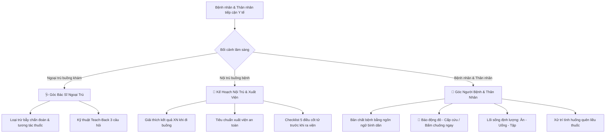

# 🗣️ CliniPortal — Kho Tư Vấn & Kịch Bản Lâm Sàng Ngoại Trú / Nội Trú (Master MOC)

> Cổng điều phối kịch bản giao tiếp, dặn dò và giáo dục người bệnh đa môi trường: **Buồng khám Ngoại trú (Outpatient)** & **Đầu giường Nội trú (Inpatient Bedside)**. Tích hợp đa góc nhìn trên cùng 1 tệp Markdown:
>
> - **🩺 Góc Bác Sĩ**: Chuyên môn, Dược động học, Cạm bẫy dùng thuốc & Kỹ thuật Teach-Back
> - **👤 Góc Người Bệnh**: Bản chất bệnh, Dấu hiệu đỏ cấp cứu, Lối sống định lượng & Xử trí sự cố dùng thuốc
> - **🏥 Kế Hoạch Nội Trú**: Giải thích cận lâm sàng, Tiêu chuẩn xuất viện an toàn & Checklist 5 điều trước khi ra viện

> [!TIP] 🌐 **TRA CỨU SIÊU TỐC TRÊN CLINIAPORTAL KNOWLEDGE VAULT WEB HUB**
> Tra cứu tức thì (< 10ms) với bộ lọc chuyên khoa, giao diện **Bảng Thông Báo Trung Tâm**, bộ chuyển đổi góc nhìn (Dual/Triplet Perspective), chế độ in tờ rơi bệnh nhân (Patient Leaflet) và sao chép lời dặn tại:
> 🔗 **[Mở Kho Tư Vấn trên Web Hub](file:///d:/Apps_ykhoa/src/content/knowledge-vault/index.html?kho=TV)** *(hoặc `http://localhost:3000/src/content/knowledge-vault/index.html?kho=TV`)*

---

## 🏷️ Quy Chuẩn Đặt Tên Tệp Kho Tư Vấn (Standardized File Naming Convention)

Để phục vụ kho dữ liệu mở rộng hàng trăm kịch bản bệnh học đa góc độ, mọi tệp trong Kho 2.6 tuân thủ cú pháp chuẩn hóa:

$$\mathbf{TV\_\langle TênBệnh\rangle\_\langle Context\rangle\_\langle Topic\rangle.md}$$

### 1. Bảng Định Nghĩa Các Trường Thành Phần

| Trường | Ý Nghĩa | Giá Trị Hợp Lệ | Mô Tả & Ví Dụ |
| :--- | :--- | :--- | :--- |
| **`TV`** | Tiền tố Kho Tư Vấn | `TV` | Cố định cho toàn bộ Kho 2.6 |
| **`TênBệnh`** | Tên bệnh lý tiếng Việt | Tên bệnh chuẩn y khoa | `Tăng huyết áp`, `Đái tháo đường type 2`, `Sốt xuất huyết Dengue` |
| **`Context`** | Bối cảnh điều trị lâm sàng | `Ngoai` `Noi` `CapCuu` `HauPhau` | • `Ngoai`: Buồng khám ngoại trú, kê đơn, tái khám định kỳ. • `Noi`: Nội trú buồng bệnh, đi buồng, chuẩn bị xuất viện. • `CapCuu`: Bàn tiếp nhận cấp cứu, xử trí dấu hiệu đỏ khẩn. • `HauPhau`: Tư vấn sau mổ, chăm sóc vết mổ và hồi phục. |
| **`Topic`** | Chủ đề / Nhóm câu hỏi | `P1` `QuenLieu` `TacDungPhu` `DauHieuDo` `CheDoAn` `QnA` | • `P1`: Kịch bản tổng quan toàn diện. • `QuenLieu`: Sự cố quên liều, uống quá liều, đi du lịch quên thuốc. • `TacDungPhu`: Giải tỏa lo ngại tác dụng không mong muốn. • `DauHieuDo`: Dấu hiệu cảnh báo nguy kịch cần nhập viện. • `CheDoAn`: Thực đơn định lượng chuyên biệt theo bệnh. • `QnA`: Bộ câu hỏi thường gặp của người bệnh/thân nhân. |

> [!NOTE] 💡 **Quy Tắc Tương Thích Ngược (Backward Compatibility)**:
> Các tệp khởi tạo giai đoạn pilot có định dạng `TV_<TênBệnh>_P1.md` được hệ thống catalog tự động nhận diện ngầm định là `Context: Ngoai` (ngoại trú) và `Topic: P1` (tổng quan) mà không cần đổi tên tệp.

---

## 🧭 Kiến Trúc Kịch Bản 3 Góc Nhìn (Multi-Perspective Framework)

---

## 🏛️ Danh Mục Kịch Bản Tư Vấn Lâm Sàng (Catalog)

### ❤️ 1. Tim Mạch

| Tên Kịch Bản | Context | Topic | ICD-10 | Tệp Ghi Chú | Trạng Thái |
| :--- | :---: | :---: | :---: | :--- | :---: |
| **Tăng huyết áp (Ngoại trú)** | `Ngoai` | `P1` | `I10-I15` | [[Tim mạch/TV_Tăng huyết áp_P1\|TV_Tăng huyết áp_P1]] | ✅ Sẵn sàng |
| **Tăng huyết áp (Nội trú)** | `Noi` | `P1` | `I10-I16` | [[Tim mạch/TV_Tăng huyết áp_Noi_P1\|TV_Tăng huyết áp_Noi_P1]] | ✅ Sẵn sàng |
| **Tăng huyết áp — Xử trí quên liều** | `Ngoai` | `QuenLieu` | `I10`, `T46.5` | [[Tim mạch/TV_Tăng huyết áp_Ngoai_QuenLieu\|TV_Tăng huyết áp_Ngoai_QuenLieu]] | ✅ Sẵn sàng |
| **Rối loạn lipid máu** | `Ngoai` | `P1` | `E78` | [[Tim mạch/TV_Rối loạn lipid máu_P1\|TV_Rối loạn lipid máu_P1]] | ⏳ Đang biên soạn |
| **Suy tim mạn nội & ngoại trú** | `Noi`/`Ngoai` | `P1` | `I50` | [[Tim mạch/TV_Suy tim_P1\|TV_Suy tim_P1]] | ⏳ Đang biên soạn |

### 🧬 2. Nội Tiết - Chuyển Hóa

| Tên Kịch Bản | Context | Topic | ICD-10 | Tệp Ghi Chú | Trạng Thái |
| :--- | :---: | :---: | :---: | :--- | :---: |
| **Đái tháo đường type 2 (Ngoại trú)** | `Ngoai` | `P1` | `E11` | [[Nội tiết - Chuyển hóa/TV_Đái tháo đường type 2_P1\|TV_Đái tháo đường type 2_P1]] | ✅ Sẵn sàng |
| **Gout (Ngoại trú)** | `Ngoai` | `P1` | `M10` | [[Nội tiết - Chuyển hóa/TV_Gout_P1\|TV_Gout_P1]] | ✅ Sẵn sàng |
| **Đái tháo đường — Xử trí hạ đường huyết** | `Ngoai` | `QnA` | `E11`, `E16.2` | [[Nội tiết - Chuyển hóa/TV_Đái tháo đường_Ngoai_HaDuongHuyet\|TV_Đái tháo đường_Ngoai_HaDuongHuyet]] | ⏳ Đang biên soạn |

### 🫄 3. Tiêu Hóa - Gan Mật

| Tên Kịch Bản | Context | Topic | ICD-10 | Tệp Ghi Chú | Trạng Thái |
| :--- | :---: | :---: | :---: | :--- | :---: |
| **Trào ngược dạ dày thực quản (GERD)** | `Ngoai` | `P1` | `K21` | [[Tiêu hóa - Gan mật/TV_Trào ngược dạ dày thực quản (GERD)_P1\|TV_Trào ngược dạ dày thực quản (GERD)_P1]] | ✅ Sẵn sàng |
| **Viêm gan B mạn tính** | `Ngoai` | `P1` | `B18.1` | [[Tiêu hóa - Gan mật/TV_Viêm gan B mạn tính_P1\|TV_Viêm gan B mạn tính_P1]] | ⏳ Đang biên soạn |

### 🦟 4. Truyền Nhiễm

| Tên Kịch Bản | Context | Topic | ICD-10 | Tệp Ghi Chú | Trạng Thái |
| :--- | :---: | :---: | :---: | :--- | :---: |
| **SXHD: Chẩn đoán & Phân độ người lớn** | `Ngoai` | `tong-quan` | `A90` | [[TV_SXHD_Chẩn đoán & Phân độ\|TV_SXHD_Chẩn đoán & Phân độ]] | ✅ Sẵn sàng |
| **SXHD: Phác đồ không Dấu hiệu cảnh báo** | `Ngoai` | `tong-quan` | `A90` | [[TV_SXHD_PDDT ko DHCB\|TV_SXHD_PDDT ko DHCB]] | ✅ Sẵn sàng |
| **SXHD: Phác đồ có Dấu hiệu cảnh báo** | `Noi` | `tong-quan` | `A91` | [[TV_SXHD_PDDT có DHCB\|TV_SXHD_PDDT có DHCB]] | ✅ Sẵn sàng |
| **SXHD: Phác đồ nặng thể Sốc (DSS/ICU)** | `Noi` | `tong-quan` | `A91` | [[TV_SXHD_PDDT nặng thể sốc\|TV_SXHD_PDDT nặng thể sốc]] | ✅ Sẵn sàng |

---

## ⚡ 5 Tiêu Chuẩn Vàng Giao Tiếp Buồng Bệnh & Buồng Khám

1. **Nguyên tắc "1 Bệnh - 3 Thông Điệp Cốt Lõi":** Bệnh nhân chỉ ghi nhớ tối đa 3 ý chính khi rời viện hoặc kết thúc khám.
2. **Nguyên tắc Định Lượng (Số hóa lời dặn):** Không nói "ăn nhạt", hãy nói "dưới 1 thìa cà phê muối/ngày (5g)". Không nói "uống nhiều nước", hãy nói "uống đủ 2 lít/ngày".
3. **Nguyên tắc An Toàn Thuốc Mốc 50%:** Nếu thời gian nhớ ra còn hơn một nửa khoảng cách đến liều kế tiếp $\rightarrow$ uống ngay; nếu còn dưới một nửa $\rightarrow$ bỏ qua liều đã quên, tuyệt đối không uống gấp đôi.
4. **Nguyên tắc Báo Động Đỏ Buồng Bệnh:** Cung cấp rõ danh sách dấu hiệu cần bấm chuông cấp cứu ngay (đau ngực, khó thở, méo miệng, huyết áp $\ge$ 180 mmHg).
5. **Nguyên tắc Kiểm Chứng Teach-Back:** Bác sĩ luôn kiểm tra lại mức độ tiếp thu trước khi cho xuất viện hoặc hoàn thành khám.
