# 🔬 SINH LÝ BỆNH & CƠ CHẾ BỆNH SINH HỘI CHỨNG VÀNH CẤP (ACUTE CORONARY SYNDROME)

<PathoQuickNav />

<!-- DẢI CHỈ SỐ NHANH (QUICK STATS STRIP) -->
<section class="stats-strip">
  <div class="stats-grid">
    <div class="stat-card">
      <div class="stat-val purple">55% - 60%</div>
      <div class="stat-lbl">Tỷ lệ HCVC do nứt vỡ mảng xơ vữa (Plaque Rupture / TCFA)</div>
    </div>
    <div class="stat-card">
      <div class="stat-val blue">30% - 40%</div>
      <div class="stat-lbl">Tỷ lệ HCVC do xói mòn mảng xơ vữa (Plaque Erosion / TLR2-NETs)</div>
    </div>
    <div class="stat-card">
      <div class="stat-val red">&lt; 65 µm</div>
      <div class="stat-lbl">Độ dày vỏ xơ mảng xơ vữa dễ tổn thương (TCFA)</div>
    </div>
    <div class="stat-card">
      <div class="stat-val green">UDMI-V 2026</div>
      <div class="stat-lbl">Phân loại NMCT mới: Primary, Secondary &amp; Procedure-Related</div>
    </div>
  </div>
</section>

---

## 1. Tổng Quan Hội Chứng Vành Cấp & Phân Loại Lâm Sàng (ECG - Troponin) {#sec-1}

### 1.1. Định Nghĩa & Bản Chất Sinh Lý Học

**Hội chứng vành cấp (Acute Coronary Syndrome - ACS)** là một thuật ngữ lâm sàng bao trùm một phổ các bệnh cảnh cấp tính xuất phát từ tình trạng **suy giảm đột ngột lưu lượng máu nuôi dưỡng cơ tim (thiếu máu cục bộ cơ tim cấp tính)**.

Quá trình bệnh lý thường khởi nguồn từ sự tích tụ âm thầm của **mảng xơ vữa động mạch (atherosclerosis)** trong lòng động mạch vành thượng tâm mạc qua nhiều năm tháng. Khi mảng xơ vữa không ổn định bị gián đoạn bề mặt (do nứt vỡ, xói mòn hoặc nốt vôi hóa đâm xuyên), nó sẽ kích hoạt dòng thác đông máu và hoạt hóa tiểu cầu, tạo thành **huyết khối (thrombus) cấp tính** làm hẹp nặng hoặc tắc nghẽn hoàn toàn lòng mạch.

$$\text{Cán cân Cung - Cầu Oxy cơ tim} \implies \Delta O_2 = \text{Cung cấp (Lưu lượng vành, } \text{Hb, } \text{PaO}_2) - \text{Nhu cầu (HR, } \text{Hậu tải, } \text{Sức co bóp)}$$

Khi sự mất cân bằng giữa cung và cầu oxy cơ tim diễn ra cấp tính và kéo dài, các tế bào cơ tim sẽ chuyển từ chuyển hóa hiếu khí sang kỵ khí, tích tụ axit lactic, suy kiệt ATP nội bào, rối loạn cân bằng ion màng tế bào, dẫn đến tổn thương cơ tim có thể hồi phục và tiến triển thành **hoại tử tế bào cơ tim không thể hồi phục (Nhồi máu cơ tim)** nếu không được tái tưới máu kịp thời.

```
                    [MẢNG XƠ VỮA ĐỘNG MẠCH VÀNH KHÔNG ỔN ĐỊNH]
                                        │
                                        ▼
             [GIÁN ĐOẠN BỀ MẶT: NỨT VỠ / XÓI MÒN / NỐT VÔI HÓA]
                                        │
                                        ▼
             [HOẠT HÓA TIỂU CẦU + DÒNG THÁC ĐÔNG MÁU NỘI MẠCH]
                                        │
                                        ▼
             [HÌNH THÀNH HUYẾT KHỐI CẤP TÍNH GÂY NGHẼN LÒNG MẠCH]
                                        │
             ┌──────────────────────────┴──────────────────────────┐
             ▼                                                     ▼
 [TẮC NGHẼN HOÀN TOÀN & LIÊN TỤC]                      [TẮC NGHẼN BÁN PHẦN / TẠM THỜI]
 - Thiếu máu xuyên thành (Transmural)                  - Thiếu máu dưới nội tâm mạc (Subendocardial)
 - ST chênh lên vòm trên ECG                           - ST chênh xuống / Sóng T âm / ECG bình thường
 - Troponin tim tăng rất cao                           - Troponin tăng (NSTEMI) hoặc bình thường (UA)
             │                                                     │
             ▼                                                     ▼
     [STEMI CẤP CỨU]                                       [NSTE-ACS: NSTEMI / UA]
```

---

### 1.2. Phân Loại Lâm Sàng Trên Điện Tâm Đồ (ECG) & Động Học Troponin

Trên thực hành lâm sàng, Hội chứng vành cấp được phân định thành **ba thể bệnh kinh điển** dựa trên sự kết hợp chặt chẽ giữa triệu chứng cơ năng (đau thắt ngực kiểu mạch vành), biến đổi điện tâm đồ 12 chuyển đạo và động học nồng độ chất chỉ điểm sinh học hoại tử cơ tim (Troponin tim độ nhạy cao - hs-cTn):

<div class="table-responsive">
  <table class="table-modern">
    <thead>
      <tr>
        <th>Thể Bệnh Lâm Sàng</th>
        <th>Bản Chất Huyết Khối &amp; Mạch Vành</th>
        <th>Biến Đổi Điện Tâm Đồ (ECG)</th>
        <th>Động Học Men Tim (hs-cTn)</th>
        <th>Vùng Cơ Tim Bị Tổn Thương</th>
      </tr>
    </thead>
    <tbody>
      <tr>
        <td><strong>Đau thắt ngực không ổn định (UA)</strong></td>
        <td>Huyết khối bán phần hoặc nứt vỡ mảng xơ vữa gây tắc nghẽn thoáng qua, chưa gây hoại tử tế bào cơ tim.</td>
        <td>ECG bình thường hoặc ST chênh xuống thoáng qua, sóng T âm/dẹt không đặc hiệu.</td>
        <td><strong>Troponin bình thường</strong> (&lt; bách phân vị thứ 99 URL), không có động học tăng/giảm.</td>
        <td>Thiếu máu cục bộ thoáng qua, không có vùng hoại tử cơ tim vĩnh viễn.</td>
      </tr>
      <tr>
        <td><strong>Nhồi máu cơ tim không ST chênh lên (NSTEMI)</strong></td>
        <td>Huyết khối tắc nghẽn bán phần (partially occlusive thrombus) hoặc thuyên tắc vi mạch đoạn xa.</td>
        <td><strong>ST chênh xuống (ST depression)</strong> và/hoặc <strong>sóng T đảo ngược (T-wave inversion)</strong> trên các chuyển đạo liên tiếp.</td>
        <td><strong>Troponin tăng động học</strong> (rise and/or fall) vượt quá bách phân vị thứ 99 URL.</td>
        <td>Tổn thương hoại tử khu trú ở lớp <strong>dưới nội tâm mạc (subendocardial necrosis)</strong>.</td>
      </tr>
      <tr>
        <td><strong>Nhồi máu cơ tim có ST chênh lên (STEMI)</strong></td>
        <td>Huyết khối đỏ giàu fibrin gây <strong>tắc nghẽn hoàn toàn và liên tục</strong> động mạch vành thủ phạm.</td>
        <td><strong>ST chênh lên vòm (ST-segment elevation)</strong> tại &ge; 2 chuyển đạo liên tiếp hoặc block nhánh trái mới xuất hiện.</td>
        <td><strong>Troponin tăng rất cao</strong>, xuất hiện sớm và duy trì động học kéo dài nhiều ngày.</td>
        <td>Tổn thương hoại tử <strong>xuyên thành cơ tim (transmural necrosis)</strong> toàn bộ bề dày thất.</td>
      </tr>
    </tbody>
  </table>
</div>

<figure class="physio-figure" style="display: flex; flex-direction: column; align-items: center; justify-content: center; text-align: center; margin: 2rem auto;">
  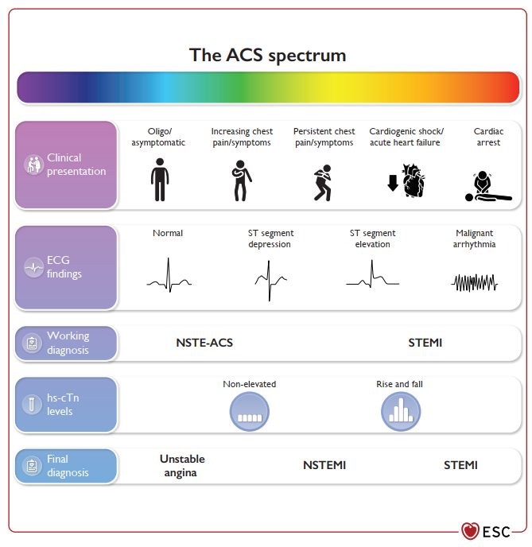
  <figcaption style="margin-top: 0.85rem; font-size: 0.88rem; color: var(--color-text-muted, #64748b); font-style: italic; text-align: center; max-width: 820px; line-height: 1.55;">
    <strong>Hình 1: Phổ Lâm Sàng, Điện Tâm Đồ &amp; Động Học Troponin Tim Trong Hội Chứng Vành Cấp.</strong> Mối tương quan chặt chẽ giữa mức độ biểu hiện đau ngực lâm sàng (từ đau ngực liên tục đến sốc tim), hình ảnh điện tâm đồ 12 chuyển đạo tương ứng và đường cong động học men tim hs-cTn để phân định 3 thể bệnh: Đau thắt ngực không ổn định (hs-cTn không tăng), NSTEMI (hs-cTn tăng/giảm động học) và STEMI (ST chênh lên kèm hs-cTn tăng cao). Nguồn: <em>ESC Guidelines for the Management of Acute Coronary Syndromes</em> (Figure 2, 2023).
  </figcaption>
</figure>

<figure class="physio-figure" style="display: flex; flex-direction: column; align-items: center; justify-content: center; text-align: center; margin: 2rem auto;">
  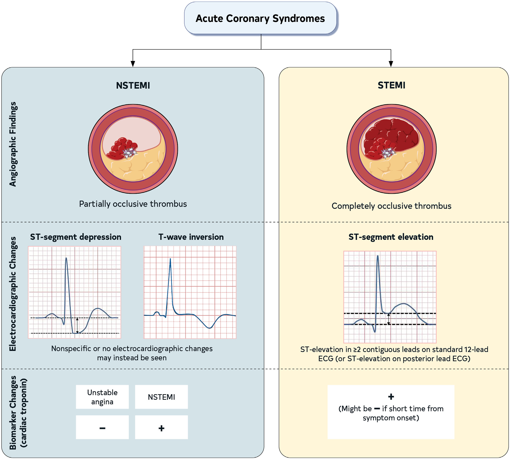
  <figcaption style="margin-top: 0.85rem; font-size: 0.88rem; color: var(--color-text-muted, #64748b); font-style: italic; text-align: center; max-width: 820px; line-height: 1.55;">
    <strong>Hình 2: Phân Loại Hội Chứng Vành Cấp Dựa Trên Đặc Điểm Huyết Khối &amp; Điện Tâm Đồ.</strong> Đối chiếu cơ chế bệnh học mạch máu: UA và NSTEMI gắn liền với huyết khối gây tắc nghẽn bán phần (Partially occlusive thrombus), tương ứng hình ảnh ST chênh xuống hoặc sóng T âm. STEMI liên quan trực tiếp đến huyết khối gây tắc nghẽn hoàn toàn lòng mạch (Completely occlusive thrombus), biểu hiện ST chênh lên vòm trên ít nhất 2 chuyển đạo liên tiếp. Nguồn: <em>ACC/AHA/ACEP/NAEMSP/SCAI Guidelines for ACS</em> (Figure 2, 2025).
  </figcaption>
</figure>

<figure class="physio-figure" style="display: flex; flex-direction: column; align-items: center; justify-content: center; text-align: center; margin: 2rem auto;">
  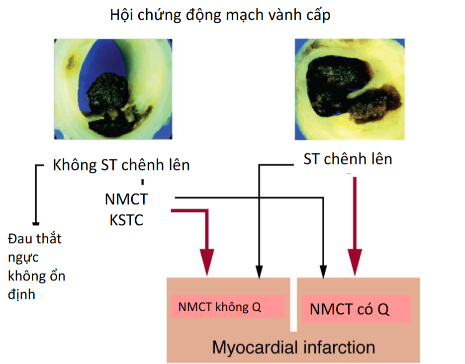
  <figcaption style="margin-top: 0.85rem; font-size: 0.88rem; color: var(--color-text-muted, #64748b); font-style: italic; text-align: center; max-width: 820px; line-height: 1.55;">
    <strong>Hình 3: Cây Phân Nhánh Sinh Lý Bệnh &amp; Định Nghĩa Hội Chứng Động Mạch Vành Cấp.</strong> Hai nhánh phân định lớn: (1) <em>Không ST chênh lên (NSTE-ACS):</em> gồm Đau thắt ngực không ổn định (UA) và Nhồi máu cơ tim không ST chênh lên (NSTEMI - có thể tiến triển thành NMCT không sóng Q dài hạn); (2) <em>ST chênh lên (STE-ACS):</em> thường tiến triển thành Nhồi máu cơ tim có sóng Q (QWMI) hoặc không sóng Q (NQMI). Nguồn: <em>Đại học Y khoa Phạm Ngọc Thạch</em> (Slide 2).
  </figcaption>
</figure>

---

## 2. Ba Cơ Chế Huyết Khối Xơ Vữa Tại Chỗ (Nứt Vỡ, Xói Mòn & Nốt Vôi Hóa) {#sec-2}

Nhờ sự tiến bộ vượt bậc của các phương tiện hình ảnh học nội mạch phân giải cao (OCT và IVUS), các nhà tim mạch học đã xác lập chính xác **ba cơ chế sinh lý bệnh tại chỗ** chịu trách nhiệm cho các biến cố huyết khối xơ vữa trong HCVC:

```
                       [CÁC CƠ CHẾ SINH HUYẾT KHỐI TẠI CHỖ TRONG HCVC]
                                              │
         ┌────────────────────────────────────┼────────────────────────────────────┐
         ▼                                    ▼                                    ▼
[NỨT VỠ MẢNG XƠ VỮA (55-60%)]       [XÓI MÒN MẢNG XƠ VỮA (30-40%)]        [NỐT VÔI HÓA (5-8%)]
- Vỏ xơ mỏng (TCFA &lt; 65 µm)          - Vỏ xơ dày, NGUYÊN VẸN               - Khối calci dạng hạt thô ráp
- Lõi hoại tử lipid &gt; 40%           - Rối loạn dòng chảy ➔ TLR2           - Lực cơ học uốn bẻ chu kỳ tim
- Đại thực bào tiết MMP-1,8,13       - Tróc nội mạc + Bạch cầu ➔ NETs      - Đâm xuyên qua lớp vỏ xơ
- Lộ Tissue Factor ➔ Huyết khối đỏ   - Huyết khối trắng giàu tiểu cầu       - Thất bại can thiệp PCI cao
```

---

### 2.1. Cơ Chế Thứ Nhất: Nứt Vỡ Mảng Xơ Vữa (Plaque Rupture)

**Nứt vỡ mảng xơ vữa (Plaque Rupture)** là cơ chế sinh bệnh phổ biến nhất, chịu trách nhiệm cho khoảng **$55\% - 60\%$** tổng số các trường hợp Hội chứng vành cấp, đặc biệt chiếm ưu thế tuyệt đối trong bệnh cảnh **STEMI (chiếm &gt; 60%)**.

1. **Cấu trúc mảng xơ vữa có nguy cơ cao (Thin-Capped Fibroatheroma - TCFA):**
   - **Lớp vỏ xơ cực kỳ mỏng:** Độ dày vỏ bao xơ bề mặt **$&lt; 65\ \mu\text{m}$**.
   - **Lõi hoại tử giàu lipid khổng lồ:** Chiếm **$&gt; 40\%$ thể tích** toàn bộ mảng xơ vữa.
   - **Thâm nhiễm dày đặc tế bào viêm:** Các đại thực bào ăn lipid (macrophage foam cells) tập trung đông đúc tại vùng vai (*shoulder region*) của mảng xơ vữa — nơi chịu ứng suất cơ học và lực kéo căng lớn nhất.
   - **Suy giảm tế bào cơ trơn mạch máu (VSMCs):** VSMCs là "nhà máy" duy nhất tổng hợp các sợi collagen interstitial (type I và type III) để gia cố độ bền cơ học cho vỏ xơ. Ở mảng TCFA, số lượng VSMCs bị suy giảm nghiêm trọng do hiện tượng chết theo chương trình (apoptosis) do cytokine viêm kích hoạt.

2. **Dòng thác phân hủy Ma trận Ngoại bào (ECM Degradation):**
   - Sự nứt vỡ xảy ra do mất cân bằng giữa tổng hợp và thoái hóa collagen.
   - Đại thực bào hoạt hóa tiết ồ ạt các enzyme tiêu protein thuộc họ **Matrix Metalloproteinases (MMPs)**, đặc biệt là collagenase: **MMP-1, MMP-8 và MMP-13**.
   - Các men này cắt đứt mạng lưới collagen nâng đỡ, làm vỏ xơ mỏng dần đến khi rách toạc dưới áp lực xung dòng máu.

3. **Hình thành huyết khối đỏ:**
   - Khi vỏ xơ nứt rách, **Yếu tố mô (Tissue Factor - TF)** và các tinh thể cholesterol từ lõi lipid tiếp xúc trực tiếp với máu tuần hoàn.
   - TF kết hợp với Yếu tố VIIa kích hoạt dòng thác đông máu ngoại sinh, chuyển Prothrombin thành Thrombin, biến Fibrinogen thành mạng lưới sợi Fibrin giam giữ hồng cầu, tạo thành **"Huyết khối đỏ" (Red Thrombus)** gây bít tắc hoàn toàn lòng mạch vành.

<figure class="physio-figure" style="display: flex; flex-direction: column; align-items: center; justify-content: center; text-align: center; margin: 2rem auto;">
  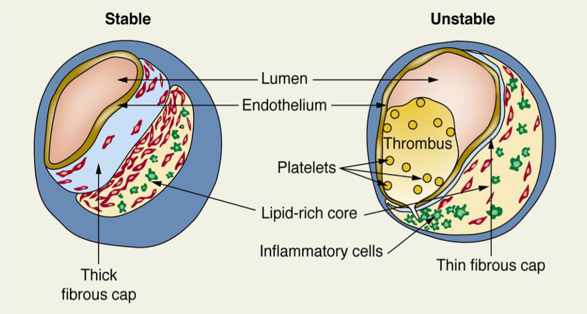
  <figcaption style="margin-top: 0.85rem; font-size: 0.88rem; color: var(--color-text-muted, #64748b); font-style: italic; text-align: center; max-width: 820px; line-height: 1.55;">
    <strong>Hình 4: Đối Chiếu Cấu Trúc Mảng Xơ Vữa Ổn Định &amp; Mảng Xơ Vữa Dễ Tổn Thương (Unstable Plaque).</strong> (Trái) <em>Mảng ổn định:</em> Lớp vỏ xơ dày dặn (Thick fibrous cap), lõi lipid nhỏ, không có thâm nhiễm viêm hay kết tập tiểu cầu. (Phải) <em>Mảng không ổn định (TCFA):</em> Vỏ xơ mỏng manh (&lt; 65 µm), lõi hoại tử lipid khổng lồ, thâm nhiễm dồi dào tế bào viêm (đại thực bào) tại vùng vai mảng, bề mặt vỏ rách vỡ kích hoạt hình thành huyết khối bám dính gây tắc nghẽn lòng mạch. Nguồn: <em>Tài liệu Giảng dạy Nội Tim mạch</em> (Slide 6).
  </figcaption>
</figure>

---

### 2.2. Cơ Chế Thứ Hai: Xói Mòn Mảng Xơ Vữa (Plaque Erosion)

**Xói mòn mảng xơ vữa (Plaque Erosion)** là cơ chế sinh bệnh quan trọng thứ hai, chiếm khoảng **$30\% - 40\%$** các trường hợp HCVC, đặc biệt chiếm ưu thế lớn trong bệnh cảnh **NSTEMI và Đau thắt ngực không ổn định (chiếm 60% - 80%)**.

1. **Đặc điểm cấu trúc đối lập hoàn toàn với Nứt vỡ:**
   - Xói mòn xảy ra trên các mảng xơ vữa có **lớp vỏ xơ dày và hoàn toàn NGUYÊN VẸN (Intact Fibrous Cap)**.
   - **Nghèo lipid** và hầu như **không có hoặc có rất ít tế bào viêm thâm nhiễm** (rất ít đại thực bào).
   - **Giàu tế bào cơ trơn mạch máu (VSMCs)** và chất nền ngoại bào proteoglycan, đặc biệt là **Hyaluronic Acid**.
   - Huyết khối hình thành do **sự chết và bong tróc (desquamation) của lớp tế bào nội mạc** bề mặt.

2. **Giả thuyết "Hai bước" (2-Hit Hypothesis) trong cơ chế phân tử:**
   - **Bước 1 (First Hit - Rối loạn dòng chảy &amp; Hoạt hóa TLR2):** Sự xáo trộn dòng chảy cơ học (flow perturbation) tạo ứng suất trượt bất thường kích hoạt thụ thể miễn dịch bẩm sinh **Toll-Like Receptor 2 (TLR2)** trên tế bào nội mạc. Tế bào nội mạc tiết **MMP-14** (hoạt hóa men **MMP-2**) để cắt đứt liên kết collagen type IV và laminin ở màng đáy. Đồng thời, enzyme **Myeloperoxidase (MPO)** sinh ra **axit hypochlorous (HOCl)** gây apoptosis tế bào nội mạc, làm bong tróc lớp nội mạc bộc lộ màng đáy.
   - **Bước 2 (Second Hit - Tuyển mộ bạch cầu &amp; NETosis):** Màng đáy lộ ra kích hoạt tiểu cầu bám dính thông qua thụ thể **CD44** (thụ thể của Hyaluronic acid). Tế bào nội mạc tiết **IL-8** chiêu mộ bạch cầu đa nhân trung tính. Sự tương tác giữa tiểu cầu và bạch cầu kích hoạt hiện tượng **NETosis**, giải phóng các **Bẫy ngoại bào bạch cầu trung tính (Neutrophil Extracellular Traps - NETs)** chứa các sợi DNA gắn histon và enzyme kháng khuẩn.
   - Mạng lưới NETs bắt giữ tiểu cầu và các phân tử kết dính, cô đặc enzyme MPO để tiếp tục phá hủy tế bào nội mạc lân cận, tạo thành **"Huyết khối trắng" (White Thrombus) giàu tiểu cầu**.

<figure class="physio-figure" style="display: flex; flex-direction: column; align-items: center; justify-content: center; text-align: center; margin: 2rem auto;">
  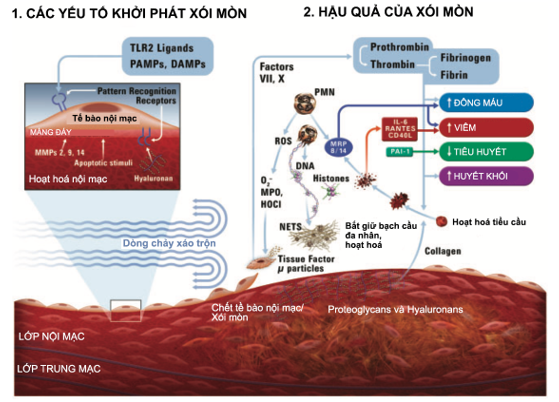
  <figcaption style="margin-top: 0.85rem; font-size: 0.88rem; color: var(--color-text-muted, #64748b); font-style: italic; text-align: center; max-width: 820px; line-height: 1.55;">
    <strong>Hình 5: Con Đường Phân Tử &amp; Miễn Dịch Bẩm Sinh Trong Xói Mòn Mảng Xơ Vữa.</strong> Tác nhân PAMPs/DAMPs phối hợp với rối loạn dòng chảy mạch máu kích hoạt thụ thể TLR2 trên tế bào nội mạc, thúc đẩy tiết MMP-14 hoạt hóa pro-MMP-2 giáng hóa màng đáy collagen IV. Men MPO giải phóng gốc oxy hóa mạnh HOCl gây chết tế bào nội mạc. Lớp màng đáy bộc lộ liên kết tiểu cầu qua CD44, kích thích bạch cầu trung tính phóng thích bẫy ngoại bào NETs bắt giữ tiểu cầu tạo huyết khối trắng. Nguồn: <em>Tạp chí Tim mạch học TP. Hồ Chí Minh</em> (Hình 2).
  </figcaption>
</figure>

---

### 2.3. Cơ Chế Thứ Ba: Nốt Vôi Hóa (Calcified Nodules - CN)

**Nốt vôi hóa (Calcified Nodules - CN)** là cơ chế ít gặp nhất nhưng lại phức tạp và nguy cơ cao nhất, chiếm khoảng **$5\% - 8\%$** các biến cố HCVC.

- **Bản chất cấu trúc:** Các nốt calci hóa dạng hạt nổi gồ lên, không đồng nhất, bao quanh bởi các sợi collagen cứng đâm xuyên trực tiếp qua lớp vỏ xơ và tế bào nội mạc để nhô vào lòng mạch vành.
- **Tác động cơ học chu kỳ tim:** Thường xảy ra ở những đoạn động mạch vành có độ cong gập lớn và chịu lực xoắn vặn liên tục theo nhịp đập của quả tim (điển hình là **đoạn gần đến đoạn giữa của Động mạch vành phải - RCA**).
- **Cơ chế:** Lực uốn bẻ cơ học làm vỡ vụn khối calci cứng trong lõi hoại tử, gây vỡ các vi mạch nuôi thành mạch (*vasa vasorum*), xuất huyết trong mảng xơ vữa đẩy nốt vôi chồi vào lòng mạch, phá vỡ vỏ xơ và kích hoạt huyết khối bám dính.
- **Hệ quả can thiệp:** Tổn thương do CN có tỷ lệ thất bại tại vị trí can thiệp (Target Lesion Failure - TLF) lên tới **$82.4\%$** sau đặt stent thông thường do khung stent không thể nở tròn đều trên nền calci cứng, đòi hỏi phải sử dụng các thiết bị sửa chữa mảng xơ vữa chuyên dụng (Mài mảng xơ vữa xoay học Rotablator hoặc Tán sỏi trong lòng mạch IVL).

---

### 2.4. Bảng So Sánh Đối Chiếu Toàn Diện Ba Cơ Chế Tại Chỗ

<div class="table-responsive">
  <table class="table-modern">
    <thead>
      <tr>
        <th>Đặc Tính Bệnh Học</th>
        <th>Nứt Vỡ Mảng Xơ Vữa (Plaque Rupture)</th>
        <th>Xói Mòn Mảng Xơ Vữa (Plaque Erosion)</th>
        <th>Nốt Vôi Hóa (Calcified Nodules)</th>
      </tr>
    </thead>
    <tbody>
      <tr>
        <td><strong>Tần suất trong HCVC</strong></td>
        <td><strong>55% - 60%</strong> (Chiếm ưu thế ở STEMI: 61.3%)</td>
        <td><strong>30% - 40%</strong> (Chiếm ưu thế ở NSTE-ACS: 61.5% - 84%)</td>
        <td><strong>5% - 8%</strong> (Hay gặp ở người rất cao tuổi, CKD)</td>
      </tr>
      <tr>
        <td><strong>Tình trạng Vỏ xơ</strong></td>
        <td>Bị rách vỡ, mỏng (&lt; 65 µm, TCFA)</td>
        <td><strong>Hoàn toàn nguyên vẹn (Intact)</strong></td>
        <td>Bị đâm thủng bởi khối calci gồ ghề</td>
      </tr>
      <tr>
        <td><strong>Thành phần Mảng xơ vữa</strong></td>
        <td>Lõi hoại tử lipid lớn (&gt; 40%), nhiều bọt bào</td>
        <td>Nghèo lipid, giàu tế bào cơ trơn (VSMCs), Hyaluronic acid</td>
        <td>Mảng vôi hóa phân mảnh, xơ cứng, xuất huyết nội mảng</td>
      </tr>
      <tr>
        <td><strong>Tế bào Viêm thâm nhiễm</strong></td>
        <td>Rất cao (Đại thực bào tiết MMP-1, 8, 13)</td>
        <td>Rất thấp (Bạch cầu trung tính giải phóng NETs)</td>
        <td>Thấp đến trung bình</td>
      </tr>
      <tr>
        <td><strong>Bản chất Huyết khối</strong></td>
        <td><strong>Huyết khối đỏ</strong> (Giàu Fibrin + Hồng cầu)</td>
        <td><strong>Huyết khối trắng</strong> (Giàu Tiểu cầu bám CD44)</td>
        <td>Huyết khối hỗn hợp tiểu cầu - fibrin</td>
      </tr>
      <tr>
        <td><strong>Đặc điểm Dân số học</strong></td>
        <td>Nam giới, lớn tuổi, nhiều yếu tố nguy cơ (THA, RLLP)</td>
        <td><strong>Nữ giới, người trẻ tuổi (&lt; 50 tuổi)</strong>, ít yếu tố nguy cơ</td>
        <td>Người cao tuổi, bệnh thận mạn (CKD), đái tháo đường lâu năm</td>
      </tr>
      <tr>
        <td><strong>Hình ảnh OCT đặc trưng</strong></td>
        <td>Mất liên tục vỏ xơ + khoang trống (cavity)</td>
        <td>Vỏ xơ nguyên vẹn + huyết khối bám bề mặt gồ ghề</td>
        <td>Khối calci đa diện nhô chồi lòng mạch gây rách vỏ</td>
      </tr>
      <tr>
        <td><strong>Chiến lược Điều trị EBM</strong></td>
        <td>PCI đặt stent quy chuẩn + DAPT + Statin liều cao</td>
        <td><strong>Có thể điều trị bảo tồn KHÔNG STENT</strong> (Nghiên cứu EROSION)</td>
        <td>Bắt buộc mài mảng xơ vữa (Atherectomy / IVL) trước PCI</td>
      </tr>
    </tbody>
  </table>
</div>

---

## 3. Chuyển Dịch Mô Hình: Khái Niệm "Bệnh Nhân Dễ Tổn Thương" (Vulnerable Patient) {#sec-3}

### 3.1. Giới Hạn Của Thuyết "Mảng Xơ Vữa Dễ Tổn Thương" Đơn Thuần

Trong nhiều thập kỷ, quan điểm cổ điển cho rằng sự hiện diện của một mảng xơ vữa vỏ mỏng (TCFA) là nguyên nhân duy nhất và trực tiếp dẫn đến biến cố HCVC. Tuy nhiên, các nghiên cứu theo dõi dọc bằng hình ảnh học nội mạch (như thử nghiệm **PROSPECT** theo dõi bằng IVUS trong 3.4 năm) đã phát hiện ra một nghịch lý:

$$\text{Tỷ lệ mảng TCFA thực sự tiến triển gây biến cố lâm sàng } &lt; 5\%$$

Đại đa số các mảng TCFA tự ổn định, tự lành qua các chu kỳ lắng đọng collagen mới hoặc biến đổi thành các mảng xơ vữa xơ hóa lành tính mà không gây ra bất kỳ triệu chứng nào. Điều này chứng minh rằng **sự hiện diện đơn thuần của một mảng xơ vữa không ổn định tại chỗ là điều kiện cần nhưng CHƯA ĐỦ** để kích hoạt một biến cố tắc nghẽn mạch vành cấp tính trên lâm sàng.

---

### 3.2. Bộ Ba Đặc Tính Của "Bệnh Nhân Dễ Tổn Thương" (Vulnerable Patient Triad)

Để phản ánh chính xác bản chất hệ thống của HCVC, y học tim mạch hiện đại đã chuyển dịch trọng tâm sang khái niệm **"Bệnh nhân dễ tổn thương" (Vulnerable Patient)** — nhìn nhận biến cố vành cấp là kết quả của sự cộng hưởng đồng thời giữa ba thành tố:

```
                            [BỆNH NHÂN DỄ TỔN THƯƠNG]
                                       │
         ┌─────────────────────────────┼─────────────────────────────┐
         ▼                             ▼                             ▼
[MẢNG XƠ VỮA DỄ TỔN THƯƠNG]    [DÒNG MÁU DỄ ĐÔNG]            [CƠ TIM DỄ TỔN THƯƠNG]
(Vulnerable Plaque)            (Vulnerable Blood)            (Vulnerable Myocardium)
- TCFA vỏ mỏng &lt; 65 µm        - Tăng hoạt tính tiểu cầu     - Nhạy cảm thiếu máu cục bộ
- Xói mòn mảng nội mạc         - Tăng các yếu tố đông máu    - Phì đại thất trái / Xơ hóa kẽ
- Nốt vôi hóa đâm xuyên        - Suy giảm tiêu sợi huyết     - Bất ổn định điện học ➔
- Viêm hoạt động (hs-CRP)      - Tăng dấu ấn MPO, PAI-1        Rung thất, đột tử do tim
```

1. **Mảng xơ vữa dễ tổn thương (Vulnerable Plaque):** Cấu trúc kém bền vững (TCFA, xói mòn, nốt vôi) dễ bị phá vỡ dưới tác động của stress dòng chảy.
2. **Máu dễ đông (Vulnerable Blood):** Trạng thái tăng đông hệ thống (hypercoagulable state) do mất cân bằng giữa hệ đông máu, kháng đông tự nhiên và tiêu sợi huyết (tăng nồng độ Fibrinogen, PAI-1, hs-CRP, hoạt hóa tiểu cầu toàn thân). Khi mảng xơ vữa rách ra, trạng thái máu dễ đông sẽ thúc đẩy cục huyết khối lan rộng nhanh chóng gây tắc nghẽn hoàn toàn thay vì tự giới hạn.
3. **Cơ tim dễ tổn thương (Vulnerable Myocardium):** Lớp cơ tim có sẵn tình trạng thiếu máu cục bộ mạn tính, phì đại thất trái hoặc xơ hóa kẽ tim, cực kỳ nhạy cảm và mất ổn định điện học khi lưu lượng vành sụt giảm đột ngột, dễ phát sinh các rối loạn nhịp thất chết người (Nhịp nhanh thất vô mạch, Rung thất) gây đột tử trước khi đến bệnh viện.

<figure class="physio-figure" style="display: flex; flex-direction: column; align-items: center; justify-content: center; text-align: center; margin: 2rem auto;">
  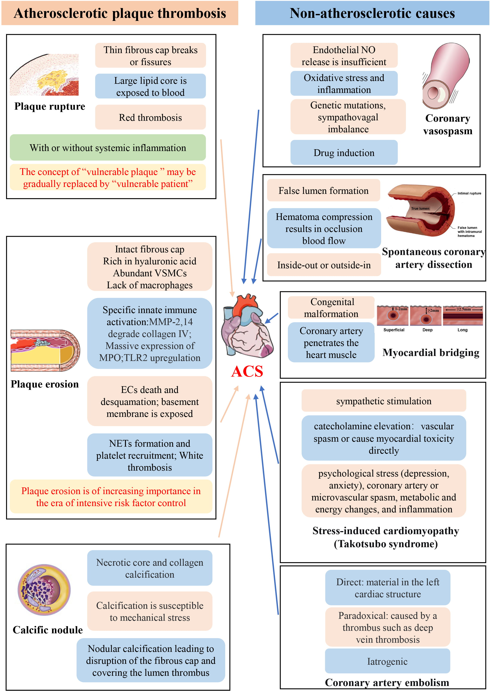
  <figcaption style="margin-top: 0.85rem; font-size: 0.88rem; color: var(--color-text-muted, #64748b); font-style: italic; text-align: center; max-width: 820px; line-height: 1.55;">
    <strong>Hình 6: Khái Niệm Chuyển Dịch "Bệnh Nhân Dễ Tổn Thương" (Vulnerable Patient Concept).</strong> Sơ đồ tổng hợp tương tác hệ thống giữa mảng xơ vữa không ổn định tại chỗ (Vulnerable plaque), tình trạng máu tăng đông toàn thân (Vulnerable blood) và sự nhạy cảm rối loạn nhịp của cơ tim (Vulnerable myocardium), dẫn đến kết cục lâm sàng biến cố mạch vành cấp hoặc đột tử do tim. Nguồn: <em>Reviews in Cardiovascular Medicine</em> (Figure 1, 2023).
  </figcaption>
</figure>

---

## 4. Phân Loại Mới Nhồi Máu Cơ Tim Theo Sinh Lý Bệnh (UDMI-V 2026) {#sec-4}

### 4.1. Bước Ngoặt Phân Loại Của Đồng Thuận Toàn Cầu Lần Thứ Năm

Đồng thuận toàn cầu lần thứ năm về Định nghĩa Nhồi máu cơ tim (**Fifth Universal Definition of Myocardial Infarction - UDMI-V 2026**) đã tạo nên một cuộc cách mạng trong phân loại: **chính thức bãi bỏ hệ thống đánh số Type 1 đến Type 5 phức tạp của UDMI-IV** để chuyển sang phân loại trực tiếp dựa trên **bản chất sinh lý bệnh học cốt lõi**:

<div class="table-responsive">
  <table class="table-modern">
    <thead>
      <tr>
        <th>Phân Nhóm UDMI-V 2026</th>
        <th>Đặc Điểm Sinh Lý Bệnh Cốt Lõi</th>
        <th>Cơ Chế Bệnh Sinh Chi Tiết</th>
        <th>Nguyên Tắc Xử Trí Lâm Sàng</th>
      </tr>
    </thead>
    <tbody>
      <tr>
        <td><strong>Nhồi máu cơ tim Nguyên phát (Primary MI)</strong></td>
        <td>Xuất hiện tự phát do <strong>bệnh lý cấp tính xảy ra ngay tại động mạch vành</strong> (Acute coronary pathology).</td>
        <td>
          - Bệnh lý huyết khối xơ vữa (Nứt vỡ, Xói mòn, Nốt vôi hóa).<br />
          - <strong>Bệnh lý vành cấp không xơ vữa:</strong> Bóc tách động mạch vành tự phát (SCAD), co thắt mạch vành cấp, thuyên tắc mạch vành, huyết khối trong stent muộn (&gt; 30 ngày).
        </td>
        <td>Chụp mạch vành xâm lấn (ICA), tái thông mạch máu cấp cứu (PCI/CABG) hoặc điều trị bảo tồn trúng đích cơ chế (EROSION/SCAD).</td>
      </tr>
      <tr>
        <td><strong>Nhồi máu cơ tim Thứ phát (Secondary MI)</strong></td>
        <td>Tổn thương hoại tử cơ tim do <strong>mất cân bằng cung - cầu oxy</strong> (Supply-Demand Mismatch) do bệnh toàn thân kích hoạt, hoàn toàn <strong>KHÔNG CÓ</strong> bệnh lý mạch vành cấp tính thực thể.</td>
        <td>
          - <em>Giảm cung cấp oxy:</em> Thiếu máu nặng, tụt huyết áp kéo dài, sốc, suy hô hấp thiếu oxy máu nặng.<br />
          - <em>Tăng nhu cầu oxy:</em> Cơn nhịp nhanh kéo dài (Rung nhĩ RVR, SVT), cơn tăng huyết áp ác tính.
        </td>
        <td><strong>Ưu tiên giải quyết bệnh nền toàn thân</strong> (truyền máu, nâng HA, cắt cơn nhịp nhanh). Tránh lạm dụng DAPT và can thiệp mạch vành khẩn cấp vô ích.</td>
      </tr>
      <tr>
        <td><strong>Nhồi máu cơ tim Liên quan Thủ thuật (Procedure-Related MI)</strong></td>
        <td>Tổn thương hoại tử cơ tim xảy ra do biến chứng trực tiếp trong vòng <strong>30 ngày</strong> sau can thiệp.</td>
        <td>
          - Biến chứng tắc nhánh bên, bóc tách vành do can thiệp, huyết khối cấp trong stent sau PCI.<br />
          - Thiếu máu cơ tim do tắc cầu nối, biến chứng phẫu thuật bắc cầu CABG.
        </td>
        <td>Đánh giá lại lưu thông cầu nối/stent, tối ưu hóa huyết động và bảo tồn cơ tim sau thủ thuật.</td>
      </tr>
    </tbody>
  </table>
</div>

---

### 4.2. Cơ Chế Mất Cân Bằng Cung - Cầu Oxy Trong Nhồi Máu Cơ Tim Thứ Phát

Để tránh chẩn đoán nhầm lẫn giữa Nhồi máu cơ tim Thứ phát (Secondary MI) với Tổn thương cơ tim cấp (Acute Myocardial Injury) không do thiếu máu cục bộ, UDMI-V 2026 đặt ra tiêu chuẩn chẩn đoán chặt chẽ:

$$\text{Secondary MI} = \text{Tăng/Giảm Troponin động học} + \text{Bằng chứng thiếu máu cơ tim (Triệu chứng/ECG)} + \text{Bệnh nền làm mất cân bằng cung-cầu}$$

<figure class="physio-figure" style="display: flex; flex-direction: column; align-items: center; justify-content: center; text-align: center; margin: 2rem auto;">
  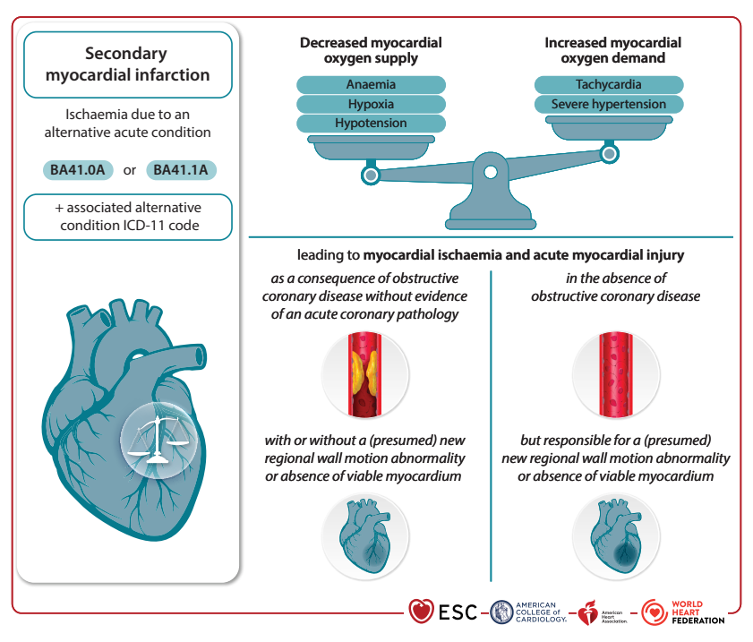
  <figcaption style="margin-top: 0.85rem; font-size: 0.88rem; color: var(--color-text-muted, #64748b); font-style: italic; text-align: center; max-width: 820px; line-height: 1.55;">
    <strong>Hình 7: Cơ Chế Mất Cân Bằng Cung - Cầu Oxy Trong Nhồi Máu Cơ Tim Thứ Phát (Secondary MI).</strong> Trạng thái cân bằng cung - cầu oxy bị phá vỡ bởi hai nhánh: (1) <em>Giảm cung cấp oxy:</em> Thiếu máu cấp (Anemia), Thiếu oxy máu (Hypoxia), Tụt huyết áp (Hypotension); (2) <em>Tăng nhu cầu oxy:</em> Nhịp tim nhanh (Tachycardia), Cơn tăng huyết áp ác tính (Severe hypertension), diễn ra trên nền hẹp mạch vành ổn định sẵn có hoặc cơ tim phì đại. Nguồn: <em>Fifth Universal Definition of Myocardial Infarction</em> (Figure 5, 2026).
  </figcaption>
</figure>

---

## 5. Hội Chứng Vành Cấp Không Do Xơ Vữa Động Mạch (Non-Atherosclerotic ACS) {#sec-5}

Nhóm nguyên nhân không do xơ vữa chiếm tỷ lệ đáng kể (đặc biệt ở người trẻ, phụ nữ và vận động viên), đòi hỏi chiến lược tiếp cận hoàn toàn chuyên biệt:

```
                  [CÁC NGUYÊN NHÂN HCVC KHÔNG DO XƠ VỮA ĐỘNG MẠCH]
                                          │
    ┌──────────────┬──────────────────────┼──────────────────────┬──────────────┐
    ▼              ▼                      ▼                      ▼              ▼
 [CO THẮT]      [SCAD]               [CẦU CƠ TIM]           [THUYÊN TẮC]   [TAKOTSUBO]
 - Giảm NO     - Lòng giả đè thật    - LAD ngầm trong cơ    - Trực tiếp    - Bão Catecholamine
 - Tăng RhoK   - Outside-In vasa     - Siết kỳ tâm thu      - Nghịch thường- Co thắt vi mạch
 - Test ACh    - Tránh đặt stent     - Tổn thương nội mạc   - PFO / Rung nhĩ- Choáng váng cơ tim
```

### 5.1. Co Thắt Động Mạch Vành (Coronary Vasospasm)
- **Sinh lý bệnh:** Tình trạng co thắt dữ dội, thoáng qua của động mạch vành thượng tâm mạc làm tắc nghẽn dòng máu. Bản chất do suy giảm sản xuất **Nitric Oxide (NO)** từ nội mạc, tăng phản ứng quá mức của tế bào cơ trơn mạch máu qua con đường **Rho-kinase**, và tăng trương lực giao cảm vào sáng sớm.
- **Kích thích:** Hút thuốc lá, rượu, ma túy co mạch (Cocaine, Amphetamines). Chẩn đoán xác định bằng nghiệm pháp kích thích Acetylcholine (ACh) hoặc Ergonovine trong phòng DSA.

### 5.2. Bóc Tách Động Mạch Vành Tự Phát (Spontaneous Coronary Artery Dissection - SCAD)
- **Sinh lý bệnh:** Rách thành mạch tự phát không do chấn thương/can thiệp, tạo **lòng giả (false lumen)** trong lớp áo giữa. Máu tụ tích tụ thành **khối máu tụ trong thành (intramural hematoma)** tăng dần thể tích đè bẹp lòng thật (true lumen).
- **Hai thuyết bệnh sinh:** (1) Thuyết *Inside-Out* (rách nội mạc tiên phát dòng máu áp lực cao chui vào); (2) Thuyết *Outside-In* (vỡ tự phát hệ vi mạch nuôi *vasa vasorum* trong lớp áo giữa).
- **Lâm sàng &amp; Điều trị:** Gặp chủ yếu ở phụ nữ trẻ (&lt; 50 tuổi), sau sinh, có liên quan loạn sản cơ sợi (FMD). **Khuyến cáo ưu tiên điều trị nội khoa bảo tồn tối ưu (tránh đặt stent vì nguy cơ làm rách rộng thêm lòng giả).**

### 5.3. Cầu Cơ Tim (Myocardial Bridging - MB)
- **Sinh lý bệnh:** Dị tật bẩm sinh khi một đoạn động mạch vành thượng tâm mạc (thường là LAD) đi sâu vào trong khối cơ tim. Trong thời kỳ tâm thu, khối cơ tim bóp nghẹt đoạn mạch bên dưới. Lực xoáy cơ học kéo dài gây chấn thương tế bào nội mạc mạn tính, giảm dự trữ lưu lượng vành (CFR) và thúc đẩy xơ vữa mạch đoạn trước cầu cơ.

### 5.4. Thuyên Tắc Động Mạch Vành (Coronary Artery Embolism)
- Chiếm $3\% - 5\%$ các ca HCVC. Phân loại theo nguồn gốc: (1) *Trực tiếp:* Cục máu đông từ nhĩ trái (Rung nhĩ), huyết khối thất trái, mảnh sùi van tim (IE); (2) *Nghịch thường (Paradoxical):* Huyết khối tĩnh mạch sâu qua lỗ bầu dục thông bằng (PFO) sang tim trái; (3) *Do can thiệp (Iatrogenic).*

### 5.5. Bệnh Cơ Tim Do Stress (Takotsubo Syndrome - TTS)
- **Sinh lý bệnh:** Khởi phát sau biến cố stress tâm lý/thể chất cực độ. Kích hoạt trục thần kinh nội tiết phóng thích **cơn bão Catecholamine khổng lồ**, gây co thắt lan tỏa mạng lưới vi tuần hoàn vành đồng thời gây độc trực tiếp (quá tải Canxi nội bào) làm choáng váng cơ tim (myocardial stunning) khu trú, biểu hiện phình hình cầu vùng mỏm thất trái (*apical ballooning*).

---

## 6. Hội Chứng Làm Việc MINOCA & Lưu Đồ Chẩn Đoán Đa Phương Tiện (CMR / OCT) {#sec-6}

### 6.1. Dịch Chuyển Khái Niệm: Từ "Nhồi Máu" Sang "Tổn Thương Cơ Tim"

Đồng thuận UDMI-V 2026 đã chính thức chuẩn hóa thuật ngữ **MINOCA** thành **"Myocardial Injury with Non-Obstructive Coronary Arteries"** (Tổn thương cơ tim với động mạch vành không tắc nghẽn), thay thế cho chữ "Infarction":

- **Bản chất khoa học:** Khi chụp mạch vành thấy không có hẹp $\ge 50\%$, MINOCA chỉ là một **chẩn đoán làm việc ban đầu (Working Diagnosis)**.
- **Thực tế lâm sàng:** Phần lớn bệnh nhân MINOCA sau đó được phát hiện nguyên nhân thực sự là bệnh lý ngoài mạch vành (như **Viêm cơ tim cấp - Myocarditis**, Hội chứng Takotsubo, Thuyên tắc phổi). Việc đổi tên giúp ngăn ngừa lạm dụng thuốc kháng kết tập tiểu cầu kép (DAPT) kéo dài và định hướng tìm căn nguyên gốc.

---

### 6.2. Quy Trình Chẩn Đoán Ba Pha Của ESC 2023

<figure class="physio-figure" style="display: flex; flex-direction: column; align-items: center; justify-content: center; text-align: center; margin: 2rem auto;">
  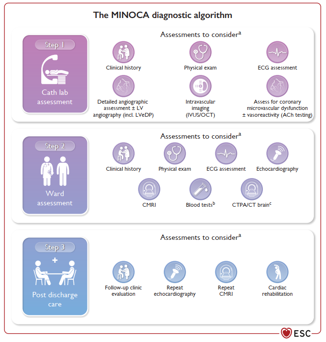
  <figcaption style="margin-top: 0.85rem; font-size: 0.88rem; color: var(--color-text-muted, #64748b); font-style: italic; text-align: center; max-width: 820px; line-height: 1.55;">
    <strong>Hình 8: Quy Trình Đánh Giá Bệnh Nhân Có Chẩn Đoán Lâm Sàng Làm Việc MINOCA.</strong> Quy trình 3 pha chuẩn hóa: (1) <em>Pha 1 (Phòng DSA):</em> Xem lại phim chụp, chụp buồng thất trái, thực hiện IVUS/OCT tìm mảng xơ vữa nứt/xói mòn ẩn hoặc SCAD, test Acetylcholine; (2) <em>Pha 2 (Buồng bệnh):</em> Siêu âm tim và bắt buộc chụp Cộng hưởng từ tim (CMR) trong vòng 2 tuần; (3) <em>Pha 3 (Xuất viện):</em> Điều trị nhắm trúng căn nguyên cuối cùng. Nguồn: <em>ESC Guidelines for ACS</em> (Figure 16, 2023).
  </figcaption>
</figure>

```
[CHỤP MẠCH VÀNH XÂM LẤN (ICA): HẸP &lt; 50%]
                   │
                   ▼ (Pha 1: Loại trừ sai sót tại phòng DSA)
[ĐÁNH GIÁ LẠI HÌNH ẢNH MẠCH VÀNH + CHỤP BUỒNG THẤT TRÁI]
                   │
                   ▼ (Pha 2: Khảo sát hình ảnh nội mạch)
[OCT / IVUS] ──► Phát hiện mảng nứt/xói mòn ẩn, SCAD, huyết khối nhỏ
                   │
                   ▼ (Pha 3: Tiêu chuẩn vàng phân biệt)
[CHỤP CỘNG HƯỞNG TỪ TIM (CMR) THỰC HIỆN SỚM &lt; 2 TUẦN]
                   ├── LGE Dưới nội tâm mạc / Xuyên thành ──► NMCT THỰC SỰ (Căn nguyên mạch vành)
                   ├── LGE Dưới màng ngoài tim / Lớp giữa ──► VIÊM CƠ TIM CẤP (Myocarditis)
                   └── Phù nề mỏm thất trái, KHÔNG CÓ LGE ──► HỘI CHỨNG TAKOTSUBO (TTS)
```

---

### 6.3. Tiêu Chuẩn Phân Biệt Hình Ảnh Học Nội Mạch (OCT & IVUS)

<figure class="physio-figure" style="display: flex; flex-direction: column; align-items: center; justify-content: center; text-align: center; margin: 2rem auto;">
  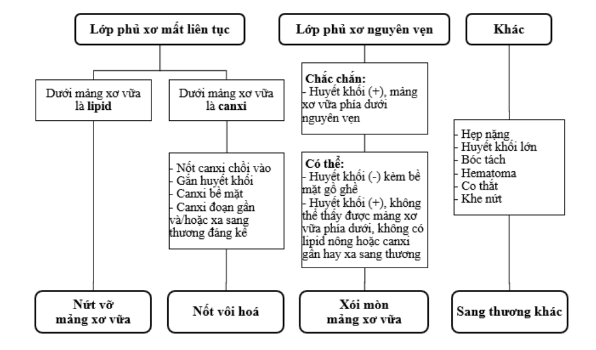
  <figcaption style="margin-top: 0.85rem; font-size: 0.88rem; color: var(--color-text-muted, #64748b); font-style: italic; text-align: center; max-width: 820px; line-height: 1.55;">
    <strong>Hình 9: Lưu Đồ Thuật Toán Phân Biệt Tổn Thương Thủ Phạm Trên OCT.</strong> Đánh giá tính toàn vẹn của vỏ xơ: Nếu vỏ xơ còn nguyên vẹn kèm huyết khối bề mặt ➔ Chẩn đoán xác định <em>Xói mòn mảng xơ vữa (Plaque erosion)</em>. Nếu vỏ xơ mất tính liên tục ➔ Phân biệt giữa <em>Nứt vỡ mảng xơ vữa (Plaque rupture)</em> (có khoang thông thương) và <em>Nốt vôi hóa (Calcified nodule)</em> (calci nhô chồi đâm thủng vỏ). Nguồn: <em>Tạp chí Tim mạch học TP. Hồ Chí Minh</em> (Hình 3).
  </figcaption>
</figure>

<figure class="physio-figure" style="display: flex; flex-direction: column; align-items: center; justify-content: center; text-align: center; margin: 2rem auto;">
  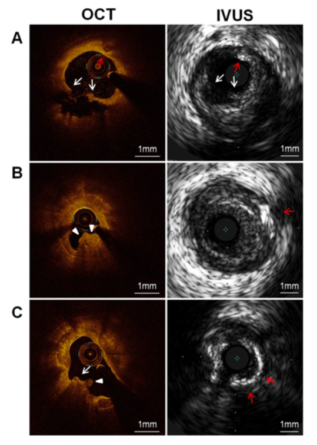
  <figcaption style="margin-top: 0.85rem; font-size: 0.88rem; color: var(--color-text-muted, #64748b); font-style: italic; text-align: center; max-width: 820px; line-height: 1.55;">
    <strong>Hình 10: Đối Chiếu Hình Ảnh Thực Tế Trên OCT &amp; IVUS.</strong> (A) <em>Nứt vỡ mảng xơ vữa:</em> OCT cho thấy điểm rách vỏ xơ (mũi tên trắng) mở vào lõi lipid lớn; (B) <em>Xói mòn mảng xơ vữa:</em> OCT thể hiện huyết khối trắng lớn (đầu mũi tên) bám trên vỏ xơ hoàn toàn nguyên vẹn; (C) <em>Nốt vôi hóa:</em> OCT hiển thị khối calci dạng vòm gồ chồi lên lòng mạch đi kèm huyết khối bám dính. Nguồn: <em>Tạp chí Tim mạch học TP. Hồ Chí Minh</em> (Hình 4).
  </figcaption>
</figure>

---

## 7. Sinh Lý Bệnh Vi Tuần Hoàn, Tổn Thương Tái Tưới Máu & Hiện Tượng No-Reflow {#sec-7}

### 7.1. Rối Loạn Chức Năng Vi Tuần Hoàn Vành (Coronary Microvascular Dysfunction - CMD)

Mạng lưới vi tuần hoàn vành (tiểu động mạch và mao mạch có đường kính $&lt; 500\ \mu\text{m}$) chiếm hơn **$90\%$ tổng kháng trở mạch vành**. Khi có rối loạn chức năng vi mạch:
- Giảm khả năng giãn mạch chủ động: **Dự trữ lưu lượng vành (Coronary Flow Reserve - CFR) sụt giảm $&lt; 2.0$**.
- Tăng kháng trở vi mạch tối thiểu: **Chỉ số kháng trở vi tuần hoàn (Index of Microcirculatory Resistance - IMR) $\ge 25$**.

---

### 7.2. Sinh Lý Bệnh Hiện Tượng No-Reflow & Tổn Thương Tái Tưới Máu (Reperfusion Injury)

Mặc dù tái thông động mạch vành thượng tâm mạc cấp cứu (dòng chảy TIMI 3) là chỉ định sống còn, quá trình dòng máu ùa về đột ngột lại gây ra một làn sóng tổn thương thứ phát nặng nề (**Tổn thương tái tưới máu - Ischemia/Reperfusion Injury**) dẫn đến hiện tượng **Không tái tưới máu mô (No-reflow)**:

1. **Bùng nổ gốc oxy hóa tự do (ROS Explosion) &amp; Quá tải Canxi:** Khi oxy trở lại, ty thể tế bào cơ tim bị tổn thương giải phóng ồ ạt ROS và Canxi tràn vào tế bào, mở các lỗ chuyển tiếp tính thấm ty thể (mPTP), gây chết tế bào cơ tim theo chương trình.
2. **Phù nề tế bào &amp; Co thắt vi mạch:** Tế bào nội mạc mao mạch và tế bào cơ tim phù nề phồng to, đè ép cơ học trực tiếp làm xẹp lòng các mao mạch xung quanh.
3. **Thuyên tắc vi mạch (Microembolization):** Các mảnh vỡ huyết khối và mảnh vụn mảng xơ vữa từ sang thương thượng tâm mạc bị vỡ dưới áp lực nong bóng/stent, trôi về hạ lưu làm bít tắc các vi mạch nhỏ.
4. **NETs &amp; Tắc nghẽn vi tuần hoàn (Microvascular Obstruction - MVO):** Bạch cầu trung tính tập trung đông đặc giải phóng bẫy ngoại bào NETs bắt giữ tiểu cầu, gây đông máu tại chỗ phá hủy hoàn toàn vi tuần hoàn mô.

---

### 7.3. Phân Độ Bốn Giai Đoạn Tổn Thương Mô Tim Trên CMR Theo CCS 2024

Hội Tim mạch Canada (CCS) cùng các chuyên gia quốc tế đã chuẩn hóa thang 4 giai đoạn tổn thương mô cơ tim sau tái tưới máu quan sát trên phim chụp Cộng hưởng từ tim (CMR):

<div class="table-responsive">
  <table class="table-modern">
    <thead>
      <tr>
        <th>Giai Đoạn (CCS 2024)</th>
        <th>Tên Giai Đoạn Tổn Thương</th>
        <th>Đặc Điểm Mô Học &amp; Vi Mạch</th>
        <th>Hình Ảnh Đặc Trưng Trên Phim CMR</th>
        <th>Ý Nghĩa Tiên Lượng Lâm Sàng</th>
      </tr>
    </thead>
    <tbody>
      <tr>
        <td><strong>Giai đoạn 1 (Stage 1)</strong></td>
        <td>Chỉ có Phù nề cơ tim (Oedema only)</td>
        <td>Tế bào cơ tim bị phù nề nhưng chưa hoại tử, hệ vi tuần hoàn hoàn toàn nguyên vẹn.</td>
        <td>Tăng tín hiệu trên bản đồ T2 map, <strong>LGE hoàn toàn âm tính</strong>.</td>
        <td>Khả năng hồi phục chức năng thất trái hoàn toàn sau vài tuần.</td>
      </tr>
      <tr>
        <td><strong>Giai đoạn 2 (Stage 2)</strong></td>
        <td>Hoại tử cơ tim (Myocardial necrosis)</td>
        <td>Tế bào cơ tim hoại tử nhưng màng đáy vi mạch còn nguyên vẹn, thuốc tương phản ngấm tốt.</td>
        <td><strong>Vùng bắt thuốc muộn màu trắng sáng đồng nhất (LGE dương tính)</strong>, không có lõi tối.</td>
        <td>Hình thành sẹo xơ hóa cố định, chức năng tim suy giảm nhẹ đến vừa.</td>
      </tr>
      <tr>
        <td><strong>Giai đoạn 3 (Stage 3)</strong></td>
        <td>Tắc nghẽn Vi tuần hoàn (MVO)</td>
        <td>Hệ mao mạch vi tuần hoàn bị phá hủy, thuốc tương phản không thể thấm vào vùng trung tâm.</td>
        <td><strong>Lõi tối màu (vùng đen) nằm bên trong</strong> vùng hoại tử trắng sáng của LGE.</td>
        <td>Yếu tố tiên lượng độc lập mạnh mẽ cho <strong>Suy tim và Tử vong tim mạch dài hạn</strong>.</td>
      </tr>
      <tr>
        <td><strong>Giai đoạn 4 (Stage 4)</strong></td>
        <td>Xuất huyết trong Cơ tim (IMH)</td>
        <td>Thành mao mạch vỡ nát hoàn toàn, hồng cầu và ion sắt tự do thoát mạch lắng đọng trong mô kẽ.</td>
        <td><strong>Tín hiệu giảm đậm độ đen đặc trên chuỗi xung T2*w</strong>.</td>
        <td>Sắt tự do gây độc tế bào kéo dài, thúc đẩy <strong>Tái cấu trúc thất trái bất lợi và Loạn nhịp thất</strong>.</td>
      </tr>
    </tbody>
  </table>
</div>

<figure class="physio-figure" style="display: flex; flex-direction: column; align-items: center; justify-content: center; text-align: center; margin: 2rem auto;">
  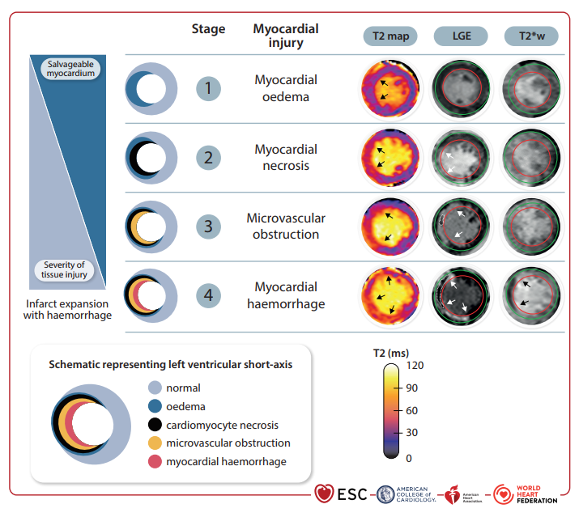
  <figcaption style="margin-top: 0.85rem; font-size: 0.88rem; color: var(--color-text-muted, #64748b); font-style: italic; text-align: center; max-width: 820px; line-height: 1.55;">
    <strong>Hình 11: Các Giai Đoạn Tổn Thương Mô Cơ Tim Trên Phim Chụp Cộng Hưởng Từ Tim (CMR).</strong> Bốn giai đoạn tiến triển theo phân độ CCS: <em>Stage 1</em> (Phù nề trên T2 map, LGE âm tính); <em>Stage 2</em> (Vùng bắt thuốc muộn màu trắng sáng đồng nhất LGE+); <em>Stage 3</em> (Lõi tối MVO nằm trong vùng LGE sáng); <em>Stage 4</em> (Vùng tối đen đặc trên chuỗi xung T2*w phản ánh xuất huyết nội cơ tim IMH do lắng đọng sắt tự do). Nguồn: <em>Fifth Universal Definition of Myocardial Infarction</em> (Figure 11, 2026).
  </figcaption>
</figure>

---

## 8. Ứng Dụng Lâm Sàng & Liệu Pháp Điều Trị Nhắm Đích Cơ Chế (Stentless / Kháng Viêm) {#sec-8}

Hiểu rõ cơ chế sinh lý bệnh học mạch vành đã giúp y học tim mạch hiện đại dịch chuyển từ điều trị can thiệp rập khuôn sang **các liệu pháp y học cá thể hóa nhắm trúng đích cơ chế**:

```
                       [CÁ THỂ HÓA ĐIỀU TRỊ DỰA TRÊN SINH LÝ BỆNH]
                                            │
         ┌──────────────────────────────────┴──────────────────────────────────┐
         ▼                                                                     ▼
[CHIẾN LƯỢC STENTLESS TRONG XÓI MÒN]                         [LIỆU PHÁP KHÁNG VIÊM HỆ THỐNG]
(Thử nghiệm EROSION &amp; EROSION III)                            (Thử nghiệm COLCOT &amp; LoDoCo2)
- Khẳng định vỏ xơ nguyên vẹn qua OCT                         - Đại thực bào tiết MMP-1,8,13 làm rách vỏ
- Hẹp &lt; 70% + Dòng chảy TIMI 3                                - Ứng dụng Colchicine liều thấp (0.5 mg/ngày)
- DAPT mạnh (Aspirin + Ticagrelor) + Heparin                  - Ức chế thể viêm NLRP3 và thoái biến vi ống
- 78.3% giảm &gt; 50% huyết khối sau 1 tháng                     - Giảm nồng độ hs-CRP, giảm tái phát MACE
- Tránh biến chứng huyết khối/tái hẹp stent                   - Ổn định bền vững vỏ xơ mảng xơ vữa
```

### 8.1. Chiến Lược Điều Trị Bảo Tồn Không Stent Đối Với Xói Mòn Mảng Xơ Vữa (Stentless Strategy)
- **Cơ sở sinh lý bệnh:** Khác với nứt vỡ mảng xơ vữa (mất cấu trúc vỏ xơ, lộ lõi hoại tử khổng lồ bắt buộc phải đặt stent để tái tạo lòng mạch), mảng xơ vữa xói mòn có **lớp vỏ xơ dày dặn nguyên vẹn, lòng mạch rộng và huyết khối chủ yếu là tiểu cầu**. Khi huyết khối tiêu đi, thành mạch có khả năng tự sửa chữa và tái phủ nội mạc tự nhiên.
- **Bằng chứng EBM (Nghiên cứu EROSION &amp; EROSION III):** Bệnh nhân NSTE-ACS do xói mòn mảng xơ vữa (xác định bằng OCT, hẹp $&lt; 70\%$, dòng chảy TIMI 3) được điều trị bảo tồn bằng Heparin 3 ngày kết hợp DAPT mạnh (Aspirin + Ticagrelor). Sau 1 tháng theo dõi bằng OCT: **$78.3\%$ bệnh nhân giảm được $&gt; 50\%$ thể tích huyết khối** và tỷ lệ biến cố tim mạch dài hạn tương đương hoặc tốt hơn nhóm đặt stent, đồng thời loại bỏ hoàn toàn nguy cơ huyết khối trong stent hay tái hẹp trong stent.

### 8.2. Liệu Pháp Chống Viêm Hệ Thống Nhắm Đích Đại Thực Bào & Thể Viêm NLRP3
- **Cơ sở sinh lý bệnh:** Phản ứng viêm là động cơ cốt lõi làm mất ổn định mảng xơ vữa.
- **Bằng chứng EBM (Nghiên cứu COLCOT và LoDoCo2):** Sử dụng **Colchicine liều thấp ($0.5\text{ mg/ngày}$)** giúp ức chế sự trùng hợp vi ống của bạch cầu, ngăn chặn sự hoạt hóa của thể viêm **NLRP3 Inflammasome**, làm giảm giải phóng các cytokine viêm và các men MMPs. Liệu pháp này giúp giảm đáng kể tỷ lệ tử vong do tim mạch, nhồi máu cơ tim tái phát và đột quỵ ở bệnh nhân sau hội chứng vành cấp nhờ cơ chế ổn định vỏ xơ và làm giảm nồng độ hs-CRP hệ thống.

---

## 9. Tài Liệu Tham Khảo EBM Chuẩn AMA {#sec-9}

<div class="citation-box">
  <ol style="margin: 0; padding-left: 1.25rem; line-height: 1.8; color: var(--color-text-muted, #475569); font-size: 0.88rem;">
    <li><strong>Byrne RA, Rossello X, Coughlan JJ, et al.</strong> 2023 ESC Guidelines for the management of acute coronary syndromes. <em>Eur Heart J</em>. 2023;44(38):3720-3826. doi:10.1093/eurheartj/ehad191.</li>
    <li><strong>Rao SV, Kirsch B, Al-Khatib SM, et al.</strong> 2025 ACC/AHA/ACEP/NAEMSP/SCAI Guideline for the management of patients with acute coronary syndromes. <em>J Am Coll Cardiol</em>. 2025;85(22):2135-2237. doi:10.1016/j.jacc.2025.03.001.</li>
    <li><strong>Thygesen K, Alpert JS, Jaffe AS, et al.</strong> Fifth Universal Definition of Myocardial Infarction (UDMI-V 2026). <em>Eur Heart J</em>. 2026;ehag101. doi:10.1093/eurheartj/ehag101.</li>
    <li><strong>Pathophysiological Mechanisms of Acute Coronary Syndrome: A Review.</strong> <em>Rev Cardiovasc Med</em>. 2023;24(4):112-126. doi:10.31083/j.rcm2023.04.112.</li>
    <li><strong>Mani A, Ojha V, Sivadasanpillai H, Sasidharan B, Ganapathi S, Valaparambil AK.</strong> Culprit lesion morphology on OCT in STEMI vs NSTEMI: a systematic review of 7526 patients. <em>J Saudi Heart Assoc</em>. 2023;35(1):40-49. doi:10.37616/2212-5043.1329.</li>
    <li><strong>Kumar A, Connelly K, Vora K, Bainey KR, Howarth A, Leipsic J, et al.</strong> The Canadian Cardiovascular Society classification of acute atherothrombotic myocardial infarction based on stages of tissue injury severity: an expert consensus statement. <em>Can J Cardiol</em>. 2024;40:1-14. doi:10.1016/j.cjca.2023.09.020.</li>
    <li><strong>Jia H, Dai J, Hou J, Xing L, Ma L, Liu H, et al.</strong> Effective anti-thrombotic therapy without stenting: intravascular optical coherence tomography-based management in plaque erosion (the EROSION study). <em>Eur Heart J</em>. 2017;38:792-800. doi:10.1093/eurheartj/ehw443.</li>
    <li><strong>Quillard T, Araujo HA, Franck G, Shvartz E, Sukhova G, Libby P.</strong> TLR2 and neutrophils potentiate endothelial stress, apoptosis and detachment: implications for superficial erosion. <em>Eur Heart J</em>. 2015;36:1394-1404. doi:10.1093/eurheartj/ehv044.</li>
    <li><strong>Tardif JC, Kouz S, Waters DD, et al.</strong> Efficacy and Safety of Low-Dose Colchicine after Myocardial Infarction (COLCOT). <em>N Engl J Med</em>. 2019;381(26):2497-2505. doi:10.1056/NEJMoa1912388.</li>
    <li><strong>Phạm Đặng Duy Quang, Nguyễn Thanh Hiền.</strong> Xói mòn mảng xơ vữa: Chẩn đoán mới và hướng điều trị tiềm năng trên bệnh nhân hội chứng vành cấp. <em>Tạp chí Tim mạch học TP. Hồ Chí Minh</em>. 2022;1-15.</li>
    <li><strong>Phạm Nguyễn Vinh.</strong> <em>Điều trị hội chứng động mạch vành cấp không ST chênh lên (HCĐMVC/KSTC)</em>. Tài liệu giảng dạy chuyên đề Nội Tim mạch, Đại học Y khoa Phạm Ngọc Thạch; 2011.</li>
  </ol>
</div>

<!-- HÀNG NÚT ĐIỀU HƯỚNG SPA -->
<div class="btn-row">
  <a href="#/basic-medical/co-che-benh-sinh" class="btn btn-primary">
    <i class="fa-solid fa-arrow-left"></i> Quay lại Mục Lục Cơ Chế Bệnh Sinh
  </a>
  <a href="#sec-1" class="btn">
    <i class="fa-solid fa-arrow-up"></i> Lên đầu trang
  </a>
</div>
