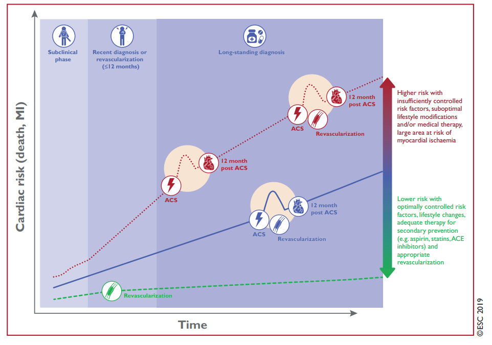
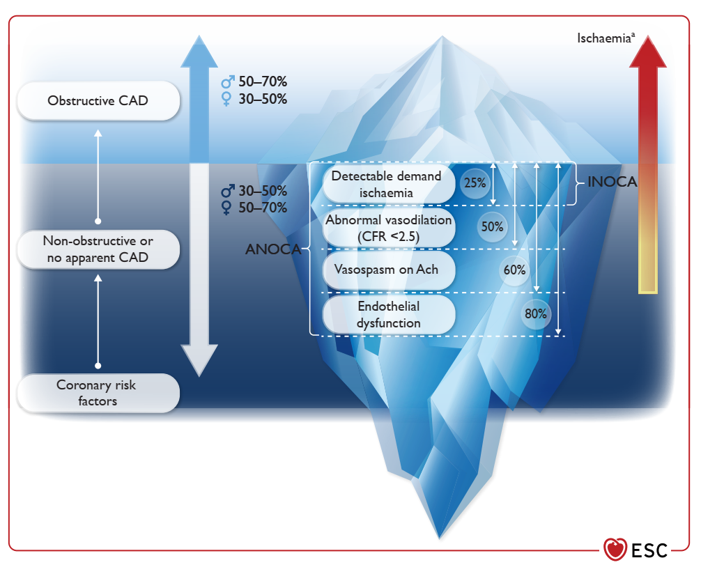
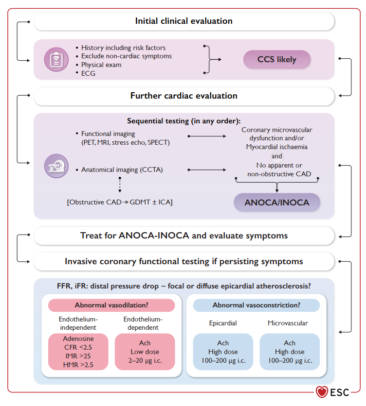
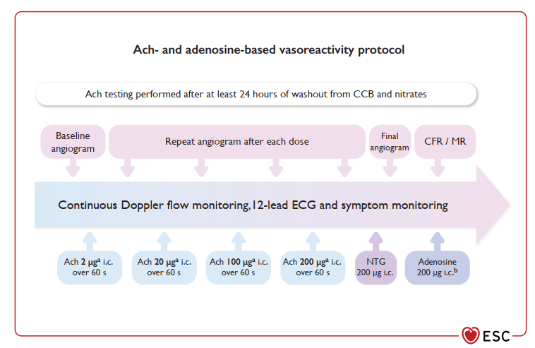

# 🔬 SINH LÝ BỆNH & CƠ CHẾ BỆNH SINH HỘI CHỨNG VÀNH MẠN (CHRONIC CORONARY SYNDROMES)

<PathoQuickNav />

<!-- DẢI CHỈ SỐ NHANH (QUICK STATS STRIP) -->
<section class="stats-strip">
  

    

      
ESC 2024 / 2025

      
Chuyển dịch mô hình: Cấu trúc &amp; Chức năng (Động mạch lớn + Vi tuần hoàn)

    

    

      
50% - 70% Nữ Giới

      
Tỷ lệ ANOCA / INOCA không có hẹp tắc nghẽn ĐMV thượng tâm mạc

    

    

      
CFR &lt; 2.5 / IMR &ge; 25

      
Ngưỡng chẩn đoán xâm lấn Rối loạn chức năng vi tuần hoàn (CMD)

    

    

      
Thử Nghiệm CorMicA

      
Điều trị trúng đích theo Endotype tối ưu hóa triệu chứng &amp; chất lượng sống

    

  

</section>

---

## 1. Chuyển Dịch Quan Niệm Sinh Lý Bệnh Của Hội Chứng Vành Mạn (ESC 2024) {#sec-1}

### 1.1. Định Nghĩa & Sự Chuyển Dịch Mô Hình Sinh Bệnh Học

**Hội chứng vành mạn (Chronic Coronary Syndromes - CCS)** được định nghĩa là một phổ các biểu hiện lâm sàng hoặc hội chứng phát sinh do các biến đổi về **cấu trúc và/hoặc chức năng** liên quan đến các bệnh lý mạn tính của động mạch vành và/hoặc hệ vi tuần hoàn vành. Những biến đổi này dẫn đến tình trạng **mất cân bằng thoáng qua, có thể đảo ngược, giữa nhu cầu oxy của cơ tim và khả năng cung cấp máu**, gây ra hiện tượng giảm tưới máu (thiếu máu cục bộ cơ tim).

Quá trình này thường khởi phát do các kích thích như gắng sức thể lực, căng thẳng cảm xúc, hoặc có thể xuất hiện lúc nghỉ ngơi. Mặc dù có thể duy trì trạng thái ổn định lâm sàng trong thời gian dài, CCS là một **tiến trình bệnh lý tiến triển liên tục và mang tính động**, có thể mất ổn định bất kỳ lúc nào để chuyển sang **Hội chứng vành cấp (ACS)** do nứt vỡ hoặc xói mòn mảng xơ vữa gây huyết khối tắc mạch.

  

    
<i class="fa-solid fa-route" style="color: var(--color-primary, #0284c7);"></i> SƠ ĐỒ LÂM SÀNG: SỰ CHUYỂN DỊCH QUAN NIỆM SINH LÝ BỆNH CCS (ESC 2024)

    Pure Orthogonal SVG
  

  

    <svg class="flowchart-svg" viewBox="0 0 880 340" width="880" height="340" xmlns="http://www.w3.org/2000/svg">
      <defs>
        <marker id="arrBlue" viewBox="0 0 10 10" refX="6" refY="5" markerWidth="6" markerHeight="6" orient="auto-start-reverse">
          <path d="M 0 1.5 L 8 5 L 0 8.5 z" fill="#0284c7"/>
        </marker>
        <marker id="arrGreen" viewBox="0 0 10 10" refX="6" refY="5" markerWidth="6" markerHeight="6" orient="auto-start-reverse">
          <path d="M 0 1.5 L 8 5 L 0 8.5 z" fill="#059669"/>
        </marker>
        <marker id="arrAmber" viewBox="0 0 10 10" refX="6" refY="5" markerWidth="6" markerHeight="6" orient="auto-start-reverse">
          <path d="M 0 1.5 L 8 5 L 0 8.5 z" fill="#d97706"/>
        </marker>
      </defs>

      <!-- Main Header -->
      <rect x="190" y="15" width="500" height="44" rx="8" fill="var(--blue-bg, #eff6ff)" stroke="var(--blue, #0284c7)" stroke-width="2"/>
      <text x="440" y="42" text-anchor="middle" font-family="'Plus Jakarta Sans', sans-serif" font-weight="700" font-size="13" fill="var(--color-primary, #0284c7)">MÔ HÌNH SINH BỆNH HỌC HỘI CHỨNG VÀNH MẠN (CCS)</text>

      <!-- Split Paths -->
      <path d="M 440 59 L 440 85 L 220 85 L 220 105" fill="none" stroke="var(--color-border, #cbd5e1)" stroke-width="1.8" marker-end="url(#arrAmber)"/>
      <path d="M 440 85 L 660 85 L 660 105" fill="none" stroke="#0284c7" stroke-width="1.8" marker-end="url(#arrBlue)"/>

      <!-- Left Column: Old Paradigm -->
      <rect x="30" y="105" width="380" height="200" rx="10" fill="var(--color-surface-2, #f8fafc)" stroke="var(--color-border, #cbd5e1)" stroke-width="1.5"/>
      <text x="220" y="132" text-anchor="middle" font-family="'Plus Jakarta Sans', sans-serif" font-weight="800" font-size="12" fill="var(--color-text-muted, #475569)">QUAN NIỆM CŨ (CƠ HỌC CỐ ĐỊNH)</text>
      <line x1="50" y1="145" x2="390" y2="145" stroke="var(--color-border, #cbd5e1)" stroke-width="1"/>
      <text x="50" y="170" text-anchor="start" font-family="'Plus Jakarta Sans', sans-serif" font-size="11" fill="var(--color-text, #0f172a)">• Coi hẹp cơ học cố định lòng mạch lớn (> 70%)</text>
      <text x="50" y="190" text-anchor="start" font-family="'Plus Jakarta Sans', sans-serif" font-size="11" fill="var(--color-text, #0f172a)">  là điều kiện bắt buộc (<tspan font-style="italic">sine qua non</tspan>) gây đau thắt ngực.</text>
      <text x="50" y="218" text-anchor="start" font-family="'Plus Jakarta Sans', sans-serif" font-size="11" fill="var(--color-text, #0f172a)">• Chỉ tập trung giải quyết tổn thương thượng tâm mạc.</text>
      <rect x="48" y="240" width="344" height="48" rx="6" fill="var(--amber-bg, #fffbeb)" stroke="var(--amber, #f59e0b)" stroke-width="1"/>
      <text x="220" y="260" text-anchor="middle" font-weight="700" font-size="11" fill="var(--amber, #d97706)">Bỏ sót cơ chế vi tuần hoàn &amp; co thắt</text>
      <text x="220" y="276" text-anchor="middle" font-size="10.5" fill="var(--color-text-muted, #64748b)">➔ Tỷ lệ đau thắt ngực dai dẳng sau tái thông cao</text>

      <!-- Right Column: Modern Paradigm -->
      <rect x="470" y="105" width="380" height="200" rx="10" fill="var(--blue-bg, #eff6ff)" stroke="var(--blue, #0284c7)" stroke-width="1.8"/>
      <text x="660" y="132" text-anchor="middle" font-family="'Plus Jakarta Sans', sans-serif" font-weight="800" font-size="12" fill="var(--color-primary, #0284c7)">QUAN NIỆM ĐỘNG HIỆN ĐẠI (ESC 2024)</text>
      <line x1="490" y1="145" x2="830" y2="145" stroke="var(--color-border, #cbd5e1)" stroke-width="1"/>
      <text x="490" y="170" text-anchor="start" font-family="'Plus Jakarta Sans', sans-serif" font-size="11" fill="var(--color-text, #0f172a)">• <tspan font-weight="700">Tầng mạch lớn:</tspan> Hẹp xơ vữa khu trú / lan tỏa,</text>
      <text x="490" y="188" text-anchor="start" font-family="'Plus Jakarta Sans', sans-serif" font-size="11" fill="var(--color-text, #0f172a)">  cầu cơ tim, co thắt động mạch thượng tâm mạc.</text>
      <text x="490" y="212" text-anchor="start" font-family="'Plus Jakarta Sans', sans-serif" font-size="11" fill="var(--color-text, #0f172a)">• <tspan font-weight="700">Tầng vi tuần hoàn:</tspan> Rối loạn chức năng vi mạch (CMD),</text>
      <text x="490" y="230" text-anchor="start" font-family="'Plus Jakarta Sans', sans-serif" font-size="11" fill="var(--color-text, #0f172a)">  giảm mật độ mao mạch, co thắt vi mạch (ANOCA/INOCA).</text>
      <rect x="488" y="246" width="344" height="42" rx="6" fill="rgba(16, 185, 129, 0.12)" stroke="var(--color-success, #10b981)" stroke-width="1"/>
      <text x="660" y="264" text-anchor="middle" font-weight="800" font-size="11" fill="var(--color-success, #10b981)">CÁ THỂ HÓA ĐIỀU TRỊ THEO ENDOTYPE</text>
      <text x="660" y="278" text-anchor="middle" font-size="10" fill="var(--color-text, #0f172a)">Đích tác động: Nội mạc, Vi mạch &amp; Cơ trơn mạch máu</text>
    </svg>
  

---

### 1.2. Hai Phân Khu Sinh Lý Của Cây Động Mạch Vành

Tuần hoàn động mạch vành được tổ chức thành 2 phân vùng sinh lý tương hỗ:

1. **Khoang Dẫn Truyền (Động Mạch Vành Thượng Tâm Mạc — Epicardial Macrovasculature):**
   - Bao gồm các thân động mạch vành chính (LAD, LCx, RCA) chạy trên bề mặt tim với đường kính **$&gt; 500\ \mu\text{m}$**.
   - Trong điều kiện bình thường, khoang này đóng vai trò như các ống dẫn có sức cản dòng chảy gần như bằng không ($&lt; 10\%$ tổng sức cản mạch vành).
   - Bệnh lý tại khoang này gồm: Hẹp xơ vữa khu trú (*focal stenosis*), xơ vữa lan tỏa không gây hẹp khít (*diffuse non-obstructive*), cầu cơ tim (*myocardial bridging*), phình mạch vành, và co thắt động mạch lớn thượng tâm mạc (*epicardial vasospasm*).

2. **Khoang Kháng Lực (Hệ Thống Vi Tuần Hoàn Vành — Coronary Microvasculature):**
   - Bao gồm các tiểu động mạch tiền mao mạch ($100 - 500\ \mu\text{m}$), tiểu động mạch kháng lực ($&lt; 100\ \mu\text{m}$) và mạng lưới mao mạch chạy sâu vào khối cơ tim.
   - Khoang này **quyết định trên $90\%$ tổng sức cản của toàn bộ hệ mạch vành** và chịu trách nhiệm chính trong việc tự điều hòa lưu lượng dòng chảy cơ tim phù hợp với nhu cầu oxy.
   - Bệnh lý tại khoang này gây ra **Rối loạn chức năng vi tuần hoàn vành (Coronary Microvascular Dysfunction - CMD)**, là nền tảng của hội chứng ANOCA và INOCA.

---

## 2. Thác Thiếu Máu Cục Bộ Cơ Tim (Myocardial Ischemic Cascade) & Chẩn Đoán Hình Ảnh {#sec-2}

Khi xuất hiện sự mất cân bằng giữa cung và cầu oxy cơ tim, tình trạng thiếu máu cục bộ sẽ diễn tiến tuần tự qua 4 giai đoạn sinh lý bệnh liên tục từ mức độ tế bào vi mô đến biểu hiện triệu chứng lâm sàng, được gọi là **Thác thiếu máu cục bộ cơ tim (Myocardial Ischemic Cascade)**:

  

    
<i class="fa-solid fa-route" style="color: var(--color-primary, #0284c7);"></i> SƠ ĐỒ LÂM SÀNG: THÁC THIẾU MÁU CỤC BỘ CƠ TIM &amp; CÁC PHƯƠNG PHÁP CHẨN ĐOÁN TƯƠNG ỨNG

    Pure Orthogonal SVG
  

  

    <svg class="flowchart-svg" viewBox="0 0 880 390" width="880" height="390" xmlns="http://www.w3.org/2000/svg">
      <defs>
        <marker id="arrUpBlue" viewBox="0 0 10 10" refX="6" refY="5" markerWidth="6" markerHeight="6" orient="auto-start-reverse">
          <path d="M 0 1.5 L 8 5 L 0 8.5 z" fill="#0284c7"/>
        </marker>
        <marker id="arrUpRed" viewBox="0 0 10 10" refX="6" refY="5" markerWidth="6" markerHeight="6" orient="auto-start-reverse">
          <path d="M 0 1.5 L 8 5 L 0 8.5 z" fill="#dc2626"/>
        </marker>
      </defs>

      <!-- Step 4: Angina (Top) -->
      <rect x="80" y="15" width="460" height="60" rx="8" fill="var(--red-bg, #fef2f2)" stroke="var(--red, #ef4444)" stroke-width="1.8"/>
      <text x="310" y="38" text-anchor="middle" font-family="'Plus Jakarta Sans', sans-serif" font-weight="800" font-size="12" fill="var(--red, #dc2626)">4. ĐAU THẮT NGỰC / TRIỆU CHỨNG LÂM SÀNG (ĐỈNH THÁC)</text>
      <text x="310" y="58" text-anchor="middle" font-size="11" fill="var(--color-text, #0f172a)">Tích tụ Adenosine, Lactate kích thích thụ cảm đau thần kinh cảm giác</text>
      <rect x="560" y="15" width="240" height="60" rx="8" fill="var(--color-surface-2, #f8fafc)" stroke="var(--color-border, #cbd5e1)" stroke-width="1"/>
      <text x="680" y="40" text-anchor="middle" font-weight="700" font-size="11" fill="var(--color-primary, #0284c7)">Đánh Giá Lâm Sàng &amp; ECG</text>
      <text x="680" y="58" text-anchor="middle" font-size="10.5" fill="var(--color-text-muted, #64748b)">ST chênh, sóng T âm, đau ngực</text>

      <line x1="310" y1="105" x2="310" y2="75" stroke="#dc2626" stroke-width="1.8" marker-end="url(#arrUpRed)"/>

      <!-- Step 3: Systolic Dysfunction -->
      <rect x="80" y="105" width="460" height="60" rx="8" fill="var(--amber-bg, #fffbeb)" stroke="var(--amber, #f59e0b)" stroke-width="1.5"/>
      <text x="310" y="128" text-anchor="middle" font-family="'Plus Jakarta Sans', sans-serif" font-weight="800" font-size="12" fill="var(--amber, #d97706)">3. RỐI LOẠN CHỨC NĂNG TÂM THU VÙNG (REGIONAL SYSTOLIC)</text>
      <text x="310" y="148" text-anchor="middle" font-size="11" fill="var(--color-text, #0f172a)">Giảm động, vô động hoặc vận động nghịch thường thành tim</text>
      <rect x="560" y="105" width="240" height="60" rx="8" fill="var(--color-surface-2, #f8fafc)" stroke="var(--color-border, #cbd5e1)" stroke-width="1"/>
      <text x="680" y="130" text-anchor="middle" font-weight="700" font-size="11" fill="var(--color-primary, #0284c7)">Siêu Âm Tim Gắng Sức</text>
      <text x="680" y="148" text-anchor="middle" font-size="10.5" fill="var(--color-text-muted, #64748b)">Stress Echo / Stress CMR</text>

      <line x1="310" y1="195" x2="310" y2="165" stroke="#0284c7" stroke-width="1.8" marker-end="url(#arrUpBlue)"/>

      <!-- Step 2: Diastolic Dysfunction -->
      <rect x="80" y="195" width="460" height="60" rx="8" fill="var(--color-surface-2, #f8fafc)" stroke="var(--color-border, #cbd5e1)" stroke-width="1.5"/>
      <text x="310" y="218" text-anchor="middle" font-family="'Plus Jakarta Sans', sans-serif" font-weight="800" font-size="12" fill="var(--color-text, #0f172a)">2. RỐI LOẠN CHỨC NĂNG TÂM TRƯƠNG (DIASTOLIC)</text>
      <text x="310" y="238" text-anchor="middle" font-size="11" fill="var(--color-text-muted, #475569)">Thiếu ATP làm giảm tách rời Actin-Myosin, giảm thư giãn cơ tim</text>
      <rect x="560" y="195" width="240" height="60" rx="8" fill="var(--color-surface-2, #f8fafc)" stroke="var(--color-border, #cbd5e1)" stroke-width="1"/>
      <text x="680" y="220" text-anchor="middle" font-weight="700" font-size="11" fill="var(--color-primary, #0284c7)">Doppler Mô Tim (TDI)</text>
      <text x="680" y="238" text-anchor="middle" font-size="10.5" fill="var(--color-text-muted, #64748b)">Tỷ lệ E/e' tăng, LVEDP tăng</text>

      <line x1="310" y1="285" x2="310" y2="255" stroke="#0284c7" stroke-width="1.8" marker-end="url(#arrUpBlue)"/>

      <!-- Step 1: Perfusion Abnormalities (Bottom) -->
      <rect x="80" y="285" width="460" height="60" rx="8" fill="var(--blue-bg, #eff6ff)" stroke="var(--blue, #0284c7)" stroke-width="1.8"/>
      <text x="310" y="308" text-anchor="middle" font-family="'Plus Jakarta Sans', sans-serif" font-weight="800" font-size="12" fill="var(--color-primary, #0284c7)">1. BẤT THƯỜNG TƯỚI MÁU CƠ TIM (PERFUSION — ĐÁY THÁC)</text>
      <text x="310" y="328" text-anchor="middle" font-size="11" fill="var(--color-text, #0f172a)">Thay đổi sớm nhất ở mức vi tuần hoàn &amp; tế bào khi mất cân bằng cung/cầu</text>
      <rect x="560" y="285" width="240" height="60" rx="8" fill="var(--blue-bg, #eff6ff)" stroke="var(--blue, #0284c7)" stroke-width="1.5"/>
      <text x="680" y="308" text-anchor="middle" font-weight="800" font-size="11" fill="var(--color-primary, #0284c7)">PET / SPECT / Stress MRI</text>
      <text x="680" y="328" text-anchor="middle" font-size="10.5" fill="var(--color-text, #0f172a)">Độ nhạy phát hiện vi mô cao nhất</text>

      <!-- Bottom Reference Line -->
      <text x="440" y="372" text-anchor="middle" font-size="11" font-weight="600" fill="var(--color-text-muted, #64748b)">Toàn bộ chuỗi sự kiện diễn ra trên nền tảng tổn thương cấu trúc khảo sát bằng Chụp Cắt Lớp CCTA / ICA</text>
    </svg>
  

1. **Bất thường tưới máu (Perfusion Abnormalities — Đáy thác):** Là thay đổi sớm nhất xảy ra ở mức độ tế bào cơ tim khi dòng máu vi mạch không đáp ứng đủ nhu cầu oxy. Được phát hiện với độ nhạy cao nhất bằng **PET, SPECT** hoặc **Stress Perfusion CMR**.
2. **Rối loạn chức năng tâm trương (Diastolic Dysfunction):** Tế bào cơ tim thiếu hụt năng lượng ATP làm suy giảm hoạt động bơm SERCA2a, cản trở sự tách rời sợi actin-myosin và làm giảm khả năng giãn nở của vùng cơ tim thiếu máu.
3. **Rối loạn chức năng tâm thu vùng (Regional Systolic Dysfunction):** Tiếp nối rối loạn tâm trương, lực co bóp của các sợi cơ tim vùng thiếu máu suy giảm rõ rệt, biểu hiện bằng hiện tượng giảm động (*hypokinesia*), vô động (*akinesia*) hoặc vận động nghịch thường trên **Siêu âm tim gắng sức (Stress Echo)** hoặc **Cộng hưởng từ tim (Stress CMR)**.
4. **Đau thắt ngực & Biến đổi ECG (Angina & Symptoms — Đỉnh thác):** Là biểu hiện muộn nhất của thác thiếu máu cục bộ, xuất hiện khi các chất chuyển hóa acid lactic và adenosine tích tụ kích hoạt các thụ cảm thể thần kinh cảm giác đau truyền về tủy sống và vỏ não.

---

## 3. Phổ Lâm Sàng 5 Thể Của CCS & Diễn Tiến Tự Nhiên Theo Thời Gian {#sec-3}

### 3.1. Phổ 5 Thể Lâm Sàng Của Hội Chứng Vành Mạn (ESC 2024)

  <table class="table-modern">
    <thead>
      <tr>
        <th>Phân Nhóm Lâm Sàng CCS</th>
        <th>Đặc Điểm Trình Diện Lâm Sàng</th>
        <th>Cơ Chế Sinh Lý Bệnh Cốt Lõi</th>
      </tr>
    </thead>
    <tbody>
      <tr>
        <td><strong>Thể A: ANOCA / INOCA</strong></td>
        <td>Đau thắt ngực hoặc có bằng chứng thiếu máu cơ tim trên nghiệm pháp gắng sức nhưng <strong>chụp mạch vành không có hẹp tắc nghẽn</strong> ($&lt; 50\%$ hoặc $\text{FFR} &gt; 0.80$).</td>
        <td>Rối loạn chức năng vi tuần hoàn (CMD) và/hoặc co thắt động mạch vành thượng tâm mạc/vi mạch.</td>
      </tr>
      <tr>
        <td><strong>Thể B: Đau thắt ngực do gắng sức</strong></td>
        <td>Cơn đau thắt ngực kinh điển khi gắng sức thể lực hoặc stress, giảm khi nghỉ ngơi hoặc ngậm Nitrate.</td>
        <td>Hẹp cơ học cố định do mảng xơ vữa động mạch vành thượng tâm mạc làm giới hạn lưu lượng dòng chảy.</td>
      </tr>
      <tr>
        <td><strong>Thể C: Không triệu chứng (Asymptomatic)</strong></td>
        <td>Người bệnh hoàn toàn không có triệu chứng cơ năng nhưng phát hiện xơ vữa vành trên CCTA hoặc thiếu máu cơ tim trên chẩn đoán hình ảnh chức năng.</td>
        <td>Thiếu máu cục bộ cơ tim thầm lặng (*Silent Ischemia*), thường gặp ở bệnh nhân đái tháo đường do bệnh lý thần kinh tự chủ.</td>
      </tr>
      <tr>
        <td><strong>Thể D: Giai đoạn ổn định sau ACS / Tái thông</strong></td>
        <td>Bệnh nhân trong giai đoạn theo dõi dài hạn sau biến cố hội chứng vành cấp hoặc sau can thiệp PCI / phẫu thuật CABG.</td>
        <td>Tiến trình xơ vữa tiếp diễn tại các vị trí mạch khác, tái hẹp trong stent (*in-stent restenosis*) hoặc tắc cầu nối (*graft failure*).</td>
      </tr>
      <tr>
        <td><strong>Thể E: Rối loạn chức năng thất trái / Suy tim</strong></td>
        <td>Trình diện với các triệu chứng của suy tim (khó thở, giảm khả năng gắng sức) có hoặc không kèm đau ngực.</td>
        <td>Bệnh cơ tim thiếu máu cục bộ mạn tính, cơ tim ngủ đông (*hibernating myocardium*) hoặc sẹo xơ hóa cơ tim sau nhồi máu cũ.</td>
      </tr>
    </tbody>
  </table>

---

### 3.2. Diễn Tiến Tự Nhiên & Biến Động Mức Độ Nguy Cơ Tim Mạch

Bệnh động mạch vành là một tiến trình sinh lý bệnh mạn tính liên tục. Mức độ nguy cơ tim mạch (tử vong do tim mạch, nhồi máu cơ tim) không cố định mà dao động tăng hoặc giảm theo thời gian:

<figure class="physio-figure" style="display: flex; flex-direction: column; align-items: center; justify-content: center; text-align: center; margin: 2rem auto;">
  
  <figcaption style="margin-top: 0.85rem; font-size: 0.88rem; color: var(--color-text-muted, #64748b); font-style: italic; text-align: center; max-width: 820px; line-height: 1.55;">
    <strong>Hình 1: Tiến Trình Tự Nhiên &amp; Sự Điều Hòa Nguy Cơ Tim Mạch Trong CCS.</strong> Đồ thị biểu diễn các pha tiến triển: Pha dưới lâm sàng ➔ Biến cố ACS ➔ Pha sau can thiệp tái thông ($\le 12\text{ tháng}$) ➔ Pha bệnh mạn tính lâu năm. Đường nét đứt phía trên biểu thị nguy cơ tăng vọt khi không kiểm soát yếu tố nguy cơ; đường nét liền phía dưới biểu thị mức nguy cơ được kéo giảm tối đa nhờ điều trị nội khoa tối ưu (Aspirin, Statin, Ức chế men chuyển) kết hợp tái thông hợp lý. Nguồn: <em>ESC Guidelines on Chronic Coronary Syndromes</em>.
  </figcaption>
</figure>

---

## 4. Hội Chứng ANOCA / INOCA: Dịch Tễ Giới Tính & Dữ Liệu Sổ Bộ ILIAS {#sec-4}

### 4.1. Khái Niệm & Sự Khác Biệt Theo Giới Tính

- **ANOCA (Angina with Non-Obstructive Coronary Arteries):** Đau thắt ngực không do tắc nghẽn động mạch vành thượng tâm mạc.
- **INOCA (Ischaemia with Non-Obstructive Coronary Arteries):** Thiếu máu cục bộ cơ tim không do tắc nghẽn động mạch vành thượng tâm mạc.

**Dịch tễ học theo giới tính:**
- ANOCA/INOCA gặp phổ biến vượt trội ở **phụ nữ**, chiếm **$50\% - 70\%$** số bệnh nhân nữ được chỉ định chụp mạch vành vì đau ngực, so với tỷ lệ **$30\% - 50\%$ ở nam giới**.
- Sự sụt giảm estrogen thời kỳ tiền mãn kinh làm mất đi yếu tố kích hoạt eNOS bảo vệ nội mạc tự nhiên, thúc đẩy rối loạn chức năng vi mạch và tăng tính phản ứng co thắt cơ trơn mạch máu.

---

### 4.2. Dữ Liệu Sổ Bộ Đa Trung Tâm Quốc Tế ILIAS (Figure 12 - ESC 2024)

<figure class="physio-figure" style="display: flex; flex-direction: column; align-items: center; justify-content: center; text-align: center; margin: 2rem auto;">
  
  <figcaption style="margin-top: 0.85rem; font-size: 0.88rem; color: var(--color-text-muted, #64748b); font-style: italic; text-align: center; max-width: 820px; line-height: 1.55;">
    <strong>Hình 2: Tỷ Lệ Phân Bố Sinh Lý Bệnh Học Ở Bệnh Nhân ANOCA/INOCA (ESC 2024).</strong> Dựa trên sổ bộ ILIAS: Trong số bệnh nhân đau ngực nghi do mạch vành, ANOCA chiếm tới $70\%$. Khi tiến hành thử nghiệm chức năng xâm lấn bằng Acetylcholine và Adenosine: Có tới $80\%$ biểu hiện Rối loạn chức năng nội mạc (Endothelial dysfunction), $60\%$ có nghiệm pháp co thắt dương tính (Vasospasm on Ach), và $50\%$ có Suy giảm khả năng giãn mạch (Abnormal vasodilation CFR &lt; 2.5). Nguồn: <em>ESC Guidelines on CCS</em> (Figure 12, 2024).
  </figcaption>
</figure>

---

## 5. Rối Loạn Chức Năng Vi Tuần Hoàn Vành (CMD) & 4 Chỉ Số Sinh Lý Mạch Xâm Lấn {#sec-5}

Rối loạn chức năng vi tuần hoàn vành (Coronary Microvascular Dysfunction - CMD) là hậu quả của các tổn thương **cấu trúc** (tái cấu trúc hướng tâm của tiểu động mạch, giảm mật độ mao mạch *capillary rarefaction*, xơ hóa quanh mạch, chèn ép từ ngoài do phì đại hoặc LVEDP tăng) và/hoặc các rối loạn **chức năng** (co thắt vi mạch, suy giảm khả năng giãn mạch không phụ thuộc nội mạc).

Bốn chỉ số sinh lý vi mạch xâm lấn được đo lường dưới tác động của **Adenosine** ($140\ \mu\text{g/kg/phút}$ i.v. hoặc $200\ \mu\text{g}$ i.c.) để giãn mạch cực đại:

  <table class="table-modern">
    <thead>
      <tr>
        <th>Chỉ Số Sinh Lý Vi Mạch</th>
        <th>Công Thức &amp; Nguyên Lý Đo Đạc</th>
        <th>Ngưỡng Chẩn Đoán Bất Thường</th>
        <th>Ý Nghĩa Sinh Lý Bệnh Học</th>
      </tr>
    </thead>
    <tbody>
      <tr>
        <td><strong>CFR</strong> <em>(Dự Trữ Lưu Lượng Vành)</em></td>
        <td>$$\text{CFR} = \frac{\text{Lưu lượng máu vành khi giãn cực đại}}{\text{Lưu lượng máu vành lúc nghỉ}}$$</td>
        <td><strong>$\text{CFR} &lt; 2.0$</strong> (pha loãng nhiệt bolus) hoặc <strong>$\text{CFR} &lt; 2.5$</strong> (Doppler / nhiệt liên tục)</td>
        <td>Đánh giá khả năng tăng tưới máu tối đa của toàn bộ cây mạch vành (cả mạch lớn thượng tâm mạc và vi tuần hoàn) khi nhu cầu oxy tăng.</td>
      </tr>
      <tr>
        <td><strong>IMR</strong> <em>(Chỉ Số Kháng Lực Vi Tuần Hoàn)</em></td>
        <td>$$\text{IMR} = P_d \times T_{mn}$$ ($P_d$: Áp lực ĐMV xa khi giãn cực đại; $T_{mn}$: Thời gian chuyển vận trung bình)</td>
        <td><strong>$\text{IMR} \ge 25$</strong></td>
        <td>Đo lường trực tiếp và chọn lọc trở kháng của hệ vi mạch vành, độc lập với mức độ hẹp của động mạch thượng tâm mạc. Phản ánh tổn thương cấu trúc vi mạch.</td>
      </tr>
      <tr>
        <td><strong>HMR</strong> <em>(Kháng Trở Vi Mạch Tăng Áp)</em></td>
        <td>$$\text{HMR} = \frac{P_d}{\text{Vận tốc dòng chảy Doppler xa}}$$</td>
        <td><strong>$\text{HMR} &gt; 2.5\text{ mmHg/cm/s}$</strong></td>
        <td>Đánh giá sức cản vi mạch dựa trên kết hợp áp lực và vận tốc dòng chảy Doppler ở trạng thái giãn mạch tối đa.</td>
      </tr>
      <tr>
        <td><strong>MRR</strong> <em>(Dự Trữ Kháng Trở Vi Mạch)</em></td>
        <td>$$\text{MRR} = \text{CFR} \times \frac{P_{a,\text{rest}}}{P_{a,\text{hyper}}} \times \frac{P_{d,\text{hyper}}}{P_{d,\text{rest}}}$$</td>
        <td><strong>$\text{MRR} &lt; 2.1$</strong> (nhiệt liên tục) hoặc <strong>$\text{MRR} &lt; 2.7$</strong></td>
        <td>Chỉ số mới giúp đánh giá chọn lọc chức năng vi tuần hoàn vành bằng cách chuẩn hóa loại trừ hoàn toàn ảnh hưởng của hẹp thượng tâm mạc.</td>
      </tr>
    </tbody>
  </table>

---

## 6. Thử Nghiệm Chức Năng Xâm Lấn (ICFT) & Tiêu Chuẩn Co Thắt COVADIS (Ach) {#sec-6}

### 6.1. Tiêu Chuẩn Chẩn Đoán Xác Định Co Thắt Mạch Vành Theo COVADIS

Thông qua thử nghiệm kích thích co thắt bằng **Acetylcholine (Ach)** truyền trong động mạch vành:

1. **Co thắt động mạch vành thượng tâm mạc (Epicardial Vasospasm):** Chẩn đoán xác định khi thỏa mãn **cả 3 tiêu chuẩn**:
   - Tái hiện cơn đau thắt ngực tương tự cơn đau tự phát của bệnh nhân.
   - Biến đổi điện tâm đồ (ECG) thiếu máu cục bộ cơ tim rõ rệt (ST chênh lên hoặc chênh xuống $\ge 0.1\text{ mV}$ hoặc xuất hiện sóng U âm mới ở $\ge 2$ chuyển đạo liên tiếp).
   - Co thắt khít động mạch thượng tâm mạc (lòng mạch co hẹp **$\ge 90\%$** so với đường kính sau khi dùng Nitroglycerin).
2. **Co thắt mạch vi tuần hoàn (Microvascular Spasm):**
   - Tái xuất hiện cơn đau ngực điển hình và có biến đổi ECG thiếu máu cơ tim.
   - Đồng thời **không có hiện tượng co thắt khít động mạch thượng tâm mạc** (đường kính mạch thượng tâm mạc giảm $&lt; 90\%$).

---

### 6.2. Phác Đồ Tiến Hành ICFT (Figures 13 & 14 - ESC 2024)

<figure class="physio-figure" style="display: flex; flex-direction: column; align-items: center; justify-content: center; text-align: center; margin: 2rem auto;">
  
  <figcaption style="margin-top: 0.85rem; font-size: 0.88rem; color: var(--color-text-muted, #64748b); font-style: italic; text-align: center; max-width: 820px; line-height: 1.55;">
    <strong>Hình 3: Lưu Đồ Chẩn Đoán Thử Nghiệm Chức Năng Mạch Vành Xâm Lấn (ICFT).</strong> Quy trình tích hợp đo đạc FFR/iFR để loại trừ hẹp thượng tâm mạc ➔ Thử nghiệm kích thích Acetylcholine để phát hiện co thắt ➔ Đo đạc CFR và IMR qua Adenosine để chẩn đoán CMD. Nguồn: <em>ESC Guidelines on CCS</em> (Figure 13, 2024).
  </figcaption>
</figure>

<figure class="physio-figure" style="display: flex; flex-direction: column; align-items: center; justify-content: center; text-align: center; margin: 2rem auto;">
  
  <figcaption style="margin-top: 0.85rem; font-size: 0.88rem; color: var(--color-text-muted, #64748b); font-style: italic; text-align: center; max-width: 820px; line-height: 1.55;">
    <strong>Hình 4: Phác Đồ Kích Thích Vận Mạch Bằng Acetylcholine (Ach Provocation Protocol).</strong> Bơm Acetylcholine vào động mạch vành theo liều tăng dần: Liều thấp ($2\ \mu\text{g} \rightarrow 20\ \mu\text{g}$) để đánh giá chức năng nội mạc; liều cao ($100\ \mu\text{g} \rightarrow 200\ \mu\text{g}$) trong 60 giây để kích thích co thắt. Hóa giải khẩn cấp bằng Nitroglycerin ($200\ \mu\text{g}$ i.c.). Nguồn: <em>ESC Guidelines on CCS</em> (Figure 14, 2024).
  </figcaption>
</figure>

---

## 7. Thử Nghiệm Bản Lề CorMicA & Tái Định Nghĩa Đau Ngực Kháng Trị (ESC 2025) {#sec-7}

### 7.1. Ý Nghĩa Của Thử Nghiệm Lâm Sàng Bản Lề CorMicA

Thử nghiệm lâm sàng ngẫu nhiên mù đôi **CorMicA (Coronary Microvascular Angina Trial)** là nghiên cứu bước ngoặt chứng minh tính ưu việt của chiến lược điều trị cá thể hóa trúng đích theo cơ chế sinh lý bệnh học phân nhóm (Endotypes):

- **Phân nhóm CMD (CFR &lt; 2.0 hoặc IMR &ge; 25, Ach âm tính):** Điều trị bằng **Thuốc chẹn Beta, ức chế men chuyển (ACE-I) và Statin liều cao** giúp phục hồi chức năng nội mô và kiểm soát nhịp tim.
- **Phân nhóm Co thắt mạch (Vasospasm on Ach dương tính):** Điều trị đầu tay bằng **Thuốc chẹn kênh Canxi (CCB - Dihydropyridine hoặc non-DHP)** phối hợp Nitrate kéo dài / Nicorandil. *Chống chỉ định dùng thuốc chẹn Beta đơn độc* do nguy cơ co mạch dội ngược qua thụ thể $\alpha_1$.
- **Phân nhóm Đau ngực không do tim:** Ngừng toàn bộ các thuốc tim mạch không cần thiết.

*Kết quả CorMicA cho thấy sau 6 tháng đến 1 năm, nhóm điều trị trúng đích cải thiện vượt trội về mức độ đau thắt ngực (thang điểm SAQ) và chất lượng cuộc sống (EQ-5D) so với nhóm điều trị kinh nghiệm.*

---

### 7.2. Tái Định Nghĩa Đau Ngực Kháng Trị (Refractory Angina) & Cầu Cơ Tim

Theo đồng thuận mới nhất của Hiệp hội Tim mạch Châu Âu (**ESC 2025 Consensus on Refractory Angina**), đau ngực kháng trị được tái định nghĩa rộng hơn:
- Bao trùm toàn bộ phổ bệnh nhân tiếp tục bị giới hạn chất lượng cuộc sống do đau ngực và có bằng chứng thiếu máu cục bộ cơ tim (**cho dù có hay không có tắc nghẽn mạch vành lớn**) dù đã tối ưu hóa điều trị nội khoa và can thiệp tái thông.
- **Sinh lý bệnh của Cầu cơ tim (Myocardial Bridging):** Đoạn động mạch vành (thường là LAD) đi ngầm trong lớp cơ tim bị bóp nghẹt trong kỳ tâm thu. Hiện tượng này làm mất năng lượng sóng gia tốc đầu tâm trương, làm suy giảm dòng chảy tưới máu vành, kết hợp với rối loạn chức năng nội mạc tại chỗ và tăng xu hướng co thắt vi mạch, trở thành một nguyên nhân quan trọng gây đau ngực kháng trị.

---

## 8. Chiến Lược Dược Lý Trúng Đích Theo Phân Nhóm Bệnh Học (Endotypes) {#sec-8}

  <table class="table-modern">
    <thead>
      <tr>
        <th>Phân Nhóm Bệnh Học (Endotype)</th>
        <th>Cơ Chế Sinh Bệnh Học Cốt Lõi</th>
        <th>Chiến Lược Dược Lý Trúng Đích EBM</th>
        <th>Lưu Ý &amp; Chống Chỉ Định</th>
      </tr>
    </thead>
    <tbody>
      <tr>
        <td><strong>Hẹp xơ vữa thượng tâm mạc cố định</strong></td>
        <td>Mảng xơ vữa làm giảm khẩu kính lòng mạch, hạn chế dòng chảy vành khi gắng sức.</td>
        <td><strong>Thuốc chẹn Beta / CCB non-DHP (Diltiazem, Verapamil):</strong> Giảm nhịp tim và sức co bóp (giảm cầu), kéo dài thời kỳ tâm trương (tăng cung). Phối hợp PCI/CABG khi điều trị nội khoa thất bại.</td>
        <td>Thêm Ranolazine hoặc Trimetazidine để tối ưu hóa chuyển hóa cơ tim.</td>
      </tr>
      <tr>
        <td><strong>Co thắt mạch vành thượng tâm mạc (VSA)</strong></td>
        <td>Tăng tính phản ứng của tế bào cơ trơn mạch máu (VSMC) và rối loạn chức năng nội mạc.</td>
        <td><strong>Thuốc chẹn kênh Canxi (CCBs - DHP như Amlodipine, Felodipine)</strong> làm nền tảng đầu tay + <strong>Nitrate tác dụng kéo dài / Nicorandil</strong>.</td>
        <td><strong>CHỐNG CHỈ ĐỊNH:</strong> Thuốc chẹn Beta không chọn lọc đơn độc (gây co thắt mạch dội ngược qua thụ thể $\alpha_1$).</td>
      </tr>
      <tr>
        <td><strong>Rối loạn chức năng vi tuần hoàn (CMD)</strong></td>
        <td>Suy giảm khả năng giãn vi mạch, xơ cứng mao mạch, giảm nồng độ Nitric Oxide (NO).</td>
        <td><strong>Ức chế men chuyển (ACE-I) + Statin liều cao:</strong> Phục hồi chức năng nội mô vi mạch. Kết hợp thuốc chẹn Beta hoặc CCB để kiểm soát triệu chứng gắng sức.</td>
        <td>Xem xét Ranolazine (ức chế dòng $I_{Na,\text{late}}$ giảm quá tải canxi) hoặc Ivabradine.</td>
      </tr>
      <tr>
        <td><strong>Cầu cơ tim (Myocardial Bridging)</strong></td>
        <td>Cơ tim co bóp ép cơ học lên động mạch trong kỳ tâm thu, giảm tưới máu tâm trương.</td>
        <td><strong>Thuốc chẹn Beta hoặc CCB non-DHP:</strong> Làm chậm nhịp tim, giảm lực co bóp cơ tim để giảm sức ép cơ học lên lòng mạch.</td>
        <td><strong>TRÁNH DÙNG:</strong> Thuốc giãn mạch Nitrate đơn thuần (làm tụt huyết áp và tăng phản xạ co bóp cơ tim ép chặt cầu cơ hơn).</td>
      </tr>
    </tbody>
  </table>

---

## 9. Tài Liệu Tham Khảo EBM Chuẩn AMA {#sec-9}

  <ol style="margin: 0; padding-left: 1.25rem; line-height: 1.8; color: var(--color-text-muted, #475569); font-size: 0.88rem;">
    <li><strong>Vrints C, Andreotti F, Koskinas KC, Rossello X, Adamo M, Ainslie J, Banning AP, Budaj A, et al.</strong> 2024 ESC Guidelines for the management of chronic coronary syndromes. <em>Eur Heart J</em>. 2024;45(36):3415-3537. doi:10.1093/eurheartj/ehae177.</li>
    <li><strong>Virani SS, Newby DE, Allen SV, et al.</strong> 2023 AHA/ACC/ACCP/ASPC/NLA/PCNA Guideline for the Management of Patients With Chronic Coronary Disease: A Report of the American Heart Association/American College of Cardiology Joint Committee on Clinical Practice Guidelines. <em>J Am Coll Cardiol</em>. 2023;82(9):e83-e185. doi:10.1016/j.jacc.2023.04.003.</li>
    <li><strong>de Silva R, Cheng K, Henry TD, Perera D, Taqueti VR, Abreu A, et al.</strong> Refractory angina: mechanisms and stratified treatment in obstructive and non-obstructive chronic myocardial ischaemic syndromes. <em>Eur Heart J</em>. 2025;46(38):3738-3757. doi:10.1093/eurheartj/ehaf284.</li>
    <li><strong>Ford TJ, Stanley B, Good R, Rocchiccioli P, McEntegart M, Watkins S, et al.</strong> Stratified medical therapy using invasive coronary function testing in angina: the CorMicA trial. <em>J Am Coll Cardiol</em>. 2018;72(22):2841-2855. doi:10.1016/j.jacc.2018.09.006.</li>
    <li><strong>Sulman D, Manzo-Silberman S.</strong> Role of cardiac imaging in chronic coronary syndromes. <em>EHJ Imp</em>. 2025;3(2):qyaf112. doi:10.1093/ehjimp/qyaf112.</li>
    <li><strong>Knuuti J, Wijns W, Saraste A, Capodanno D, Barbato E, Funck-Brentano C, et al.</strong> 2019 ESC Guidelines for the diagnosis and management of chronic coronary syndromes. <em>Eur Heart J</em>. 2020;41(3):407-477. doi:10.1093/eurheartj/ehz425.</li>
    <li><strong>Crea F, Camici PG, Bairey Merz CN.</strong> Coronary microvascular dysfunction: an update. <em>Eur Heart J</em>. 2014;35(17):1101-1111. doi:10.1093/eurheartj/eht513.</li>
    <li><strong>Beltrame JF, Crea F, Kaski JC, et al.</strong> International standardization of diagnostic criteria for vasospastic angina. <em>Eur Heart J</em>. 2017;38(13):978-985. doi:10.1093/eurheartj/ehv352.</li>
    <li><strong>Bộ Y tế Việt Nam.</strong> <em>Hướng dẫn chẩn đoán và điều trị bệnh tim thiếu máu cục bộ mạn tính</em>. Quyết định số 1842/QĐ-BYT; Hà Nội, 2020.</li>
  </ol>

<!-- HÀNG NÚT ĐIỀU HƯỚNG SPA -->

  <a href="#/basic-medical/co-che-benh-sinh" class="btn btn-primary">
    <i class="fa-solid fa-arrow-left"></i> Quay lại Mục Lục Cơ Chế Bệnh Sinh
  </a>
  <a href="#sec-1" class="btn">
    <i class="fa-solid fa-arrow-up"></i> Lên đầu trang
  </a>

