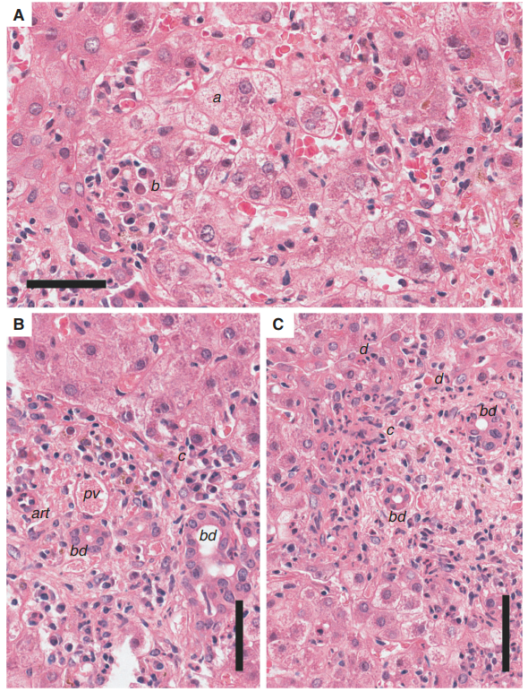
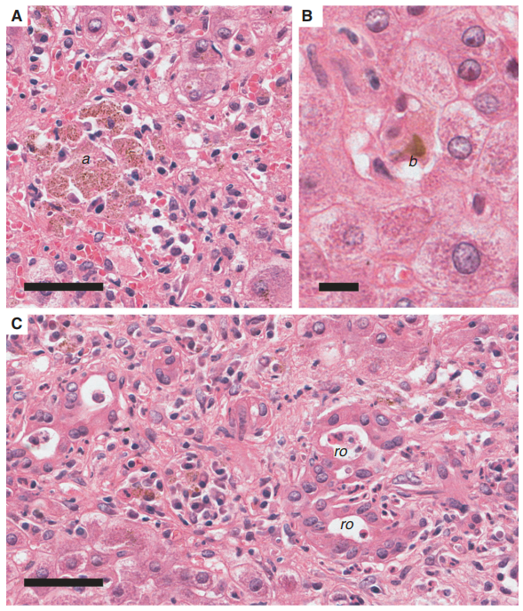
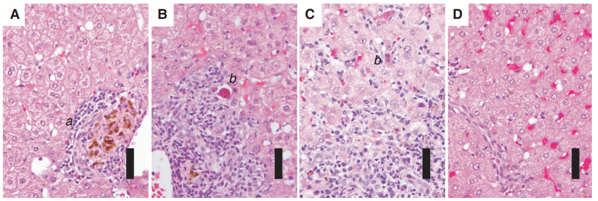
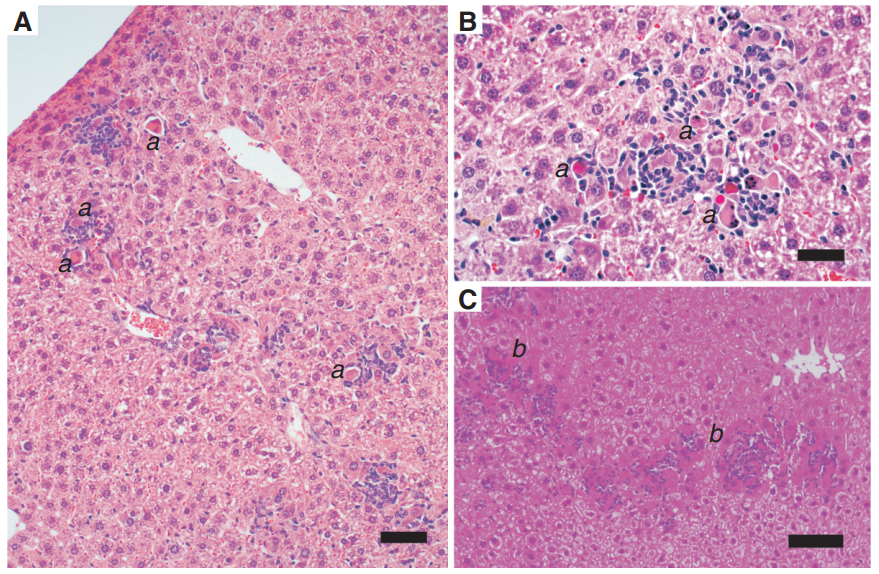

# 🔬 SINH LÝ BỆNH VIÊM GAN SIÊU VI A (HAV)

<PathoQuickNav />

{/* DẢI CHỈ SỐ NHANH (QUICK STATS STRIP) */}
<section class="stats-strip">
  

    

      
CCBS-19

      
Mã cơ chế • Tiêu Hóa &amp; Gan Mật

    

    

      
ssRNA (+) 7.5 kb

      
Picornaviridae • 1 Serotype • 7 Genotypes

    

    

      
Non-Cytopathic

      
MAVS-IRF3/7 Apoptosis • CTLs CD8+ Thâm Nhiễm

    

    

      
100% Cấp Tính

      
Tự giới hạn • Không mạn tính • Vắc-xin bất hoạt

    

  

</section>

---

## 1. Đặc Điểm Vi-rút Học, Genotype & Dạng eHAV
Vi-rút viêm gan A (**Hepatitis A Virus - HAV**) là một trong những tác nhân hàng đầu gây viêm gan vi-rút cấp tính trên toàn cầu, lây truyền chủ yếu qua con đường phân – miệng (*fecal-oral route*) do ăn uống thực phẩm hoặc nguồn nước ô nhiễm.

### Cấu Trúc Phân Tử & Phân Loại Genotype

- **Cấu trúc bộ gen:** HAV là vi-rút không vỏ bọc nguyên thủy, thuộc chi *Hepatovirus*, họ *Picornaviridae*. Bộ gen là một phân tử **RNA sợi đơn dương [ssRNA(+)]** dài khoảng 7,5 kb, đầu $5'$ gắn protein VPg (thay vì cấu trúc mũ cap thông thường) và đầu $3'$ có đuôi polyadenylated. Bộ gen mã hóa cho một polyprotein duy nhất được phân cắt bởi protease nội tại $3\text{C}^{\text{pro}}$ thành các protein cấu trúc capsid (VP1, VP2, VP3, VP4) và protein phi cấu trúc (2B, 2C, 3A, 3B, 3C, 3D polymerase).
- **Kháng nguyên bảo tồn:** Cấu trúc kháng nguyên bề mặt của HAV cực kỳ ổn định, trên toàn cầu **chỉ tồn tại 1 serotype duy nhất**. Do đó, miễn dịch thu được sau nhiễm trùng tự nhiên hoặc sau tiêm vắc-xin mang tính bảo vệ suốt đời chống lại tất cả các chủng HAV.
- **Phân loại 7 Genotypes:** Dựa trên phân tích trình tự vùng nối VP1/2A:
  - *Genotype nguồn gốc người (Human origin):* Gồm 4 genotype ký hiệu là **I, II, III và VII** (trong đó Genotype IA và IB chiếm ưu thế tại hầu hết các vụ dịch trên thế giới).
  - *Genotype nguồn gốc linh trưởng (Nonhuman primate origin):* Gồm 3 genotype ký hiệu là **IV, V và VI** phân lập từ khỉ đuôi dài (cynomolgus) và khỉ xanh châu Phi.

  

    
<i class="fa-solid fa-route" style="color: var(--color-primary, #0284c7);"></i> SƠ ĐỒ LÂM SÀNG: HỌ PICORNAVIRIDAE

    Pure Orthogonal SVG
  

  

    <svg class="flowchart-svg" viewBox="0 0 880 310" width="880" height="310" xmlns="http://www.w3.org/2000/svg">
      <defs>
        <marker id="arrBlue" viewBox="0 0 10 10" refX="6" refY="5" markerWidth="6" markerHeight="6" orient="auto-start-reverse">
          <path d="M 0 1.5 L 8 5 L 0 8.5 z" fill="#0284c7"/>
        </marker>
        <marker id="arrGreen" viewBox="0 0 10 10" refX="6" refY="5" markerWidth="6" markerHeight="6" orient="auto-start-reverse">
          <path d="M 0 1.5 L 8 5 L 0 8.5 z" fill="#059669"/>
        </marker>
        <marker id="arrAmber" viewBox="0 0 10 10" refX="6" refY="5" markerWidth="6" markerHeight="6" orient="auto-start-reverse">
          <path d="M 0 1.5 L 8 5 L 0 8.5 z" fill="#d97706"/>
        </marker>
        <marker id="arrRed" viewBox="0 0 10 10" refX="6" refY="5" markerWidth="6" markerHeight="6" orient="auto-start-reverse">
          <path d="M 0 1.5 L 8 5 L 0 8.5 z" fill="#dc2626"/>
        </marker>
      </defs>

      <rect x="30" y="20" width="250" height="90" rx="8" fill="var(--color-surface-2, #f8fafc)" stroke="var(--color-border, #cbd5e1)" stroke-width="1.5"/>
      <text x="155" y="42" text-anchor="middle" font-family="'Plus Jakarta Sans', sans-serif" font-weight="700" font-size="11.5" fill="var(--color-text, #0f172a)">HỌ PICORNAVIRIDAE</text>
      <line x1="45" y1="50" x2="265" y2="50" stroke="var(--color-border, #cbd5e1)" stroke-width="1"/>
      <text x="42" y="66" text-anchor="start" font-family="'Plus Jakarta Sans', sans-serif" font-size="10.5" fill="var(--color-text-muted, #475569)">• ┌────────────────────────</text>
      <rect x="315" y="20" width="250" height="90" rx="8" fill="var(--color-surface-2, #f8fafc)" stroke="var(--color-border, #cbd5e1)" stroke-width="1.5"/>
      <text x="440" y="42" text-anchor="middle" font-family="'Plus Jakarta Sans', sans-serif" font-weight="700" font-size="11.5" fill="var(--color-text, #0f172a)">CHI HEPATOVIRUS</text>
      <line x1="330" y1="50" x2="550" y2="50" stroke="var(--color-border, #cbd5e1)" stroke-width="1"/>
      <text x="327" y="66" text-anchor="start" font-family="'Plus Jakarta Sans', sans-serif" font-size="10.5" fill="var(--color-text-muted, #475569)">• ─────────────────────┴────────────</text>
      <rect x="600" y="20" width="250" height="90" rx="8" fill="var(--color-surface-2, #f8fafc)" stroke="var(--color-border, #cbd5e1)" stroke-width="1.5"/>
      <text x="725" y="42" text-anchor="middle" font-family="'Plus Jakarta Sans', sans-serif" font-weight="700" font-size="11.5" fill="var(--color-text, #0f172a)">1 SEROTYPE DUY NHẤT</text>
      <line x1="615" y1="50" x2="835" y2="50" stroke="var(--color-border, #cbd5e1)" stroke-width="1"/>
      <text x="612" y="66" text-anchor="start" font-family="'Plus Jakarta Sans', sans-serif" font-size="10.5" fill="var(--color-text-muted, #475569)">• ─────────────────────────────────┐</text>
      {/* Bifurcation Path */}
      <path d="M 440 110 L 440 124 L 235 124 L 235 138" fill="none" stroke="var(--color-border, #cbd5e1)" stroke-width="1.8" marker-end="url(#arrBlue)"/>
      <path d="M 440 124 L 645 124 L 645 138" fill="none" stroke="var(--color-border, #cbd5e1)" stroke-width="1.8" marker-end="url(#arrBlue)"/>
      {/* Left Column: GENOTYPES NGUỒN GỐC NGƯỜI */}
      <rect x="40" y="138" width="390" height="134" rx="10" fill="var(--color-surface-2, #f8fafc)" stroke="var(--color-border, #cbd5e1)" stroke-width="1.5"/>
      <text x="235" y="160" text-anchor="middle" font-family="'Plus Jakarta Sans', sans-serif" font-weight="800" font-size="12" fill="var(--color-text, #0f172a)">GENOTYPES NGUỒN GỐC NGƯỜI</text>
      <line x1="60" y1="174" x2="410" y2="174" stroke="var(--color-border, #cbd5e1)" stroke-width="1"/>
      <text x="60" y="190" text-anchor="start" font-family="'Plus Jakarta Sans', sans-serif" font-size="11" fill="var(--color-text-muted, #475569)">• ├── Genotype I (IA, IB: Chiếm &gt;80%</text>
      <text x="60" y="208" text-anchor="start" font-family="'Plus Jakarta Sans', sans-serif" font-size="11" fill="var(--color-text-muted, #475569)">• toàn cầu)</text>
      <text x="60" y="226" text-anchor="start" font-family="'Plus Jakarta Sans', sans-serif" font-size="11" fill="var(--color-text-muted, #475569)">• ├── Genotype II (IIA, IIB)</text>
      <text x="60" y="244" text-anchor="start" font-family="'Plus Jakarta Sans', sans-serif" font-size="11" fill="var(--color-text-muted, #475569)">• ├── Genotype III (IIIA, IIIB)</text>
      <text x="60" y="262" text-anchor="start" font-family="'Plus Jakarta Sans', sans-serif" font-size="11" fill="var(--color-text-muted, #475569)">• └── Gen</text>
      {/* Right Column: GENOTYPES LINH TRƯỞNG */}
      <rect x="450" y="138" width="390" height="134" rx="10" fill="var(--color-surface-2, #f8fafc)" stroke="var(--color-border, #cbd5e1)" stroke-width="1.5"/>
      <text x="645" y="160" text-anchor="middle" font-family="'Plus Jakarta Sans', sans-serif" font-weight="800" font-size="12" fill="var(--color-text, #0f172a)">GENOTYPES LINH TRƯỞNG</text>
      <line x1="470" y1="174" x2="820" y2="174" stroke="var(--color-border, #cbd5e1)" stroke-width="1"/>
      <text x="470" y="190" text-anchor="start" font-family="'Plus Jakarta Sans', sans-serif" font-size="11" fill="var(--color-text-muted, #475569)">• ├── Genotype IV</text>
      <text x="470" y="208" text-anchor="start" font-family="'Plus Jakarta Sans', sans-serif" font-size="11" fill="var(--color-text-muted, #475569)">• ├── Genotype V</text>
      <text x="470" y="226" text-anchor="start" font-family="'Plus Jakarta Sans', sans-serif" font-size="11" fill="var(--color-text-muted, #475569)">• └── Genotype VI</text>
      <text x="470" y="244" text-anchor="start" font-family="'Plus Jakarta Sans', sans-serif" font-size="11" fill="var(--color-text-muted, #475569)">• otype VII</text>
    </svg>
  

### Hiện Tượng Bán Vỏ Bọc Màng Tế Bào (Quasi-enveloped HAV - eHAV)

Một phát hiện mang tính cách mạng trong sinh học vi-rút hiện đại là HAV tồn tại dưới **hai trạng thái vật lý hoàn toàn khác biệt** trong cơ thể:

1. **Hạt virion trần không màng (Naked virions):** Tồn tại trong phân và môi trường ngoại cảnh. Hạt capsid trần có độ bền cơ học và hóa học phi thường, đề kháng với acid dạ dày (pH &lt; 2), muối mật và nhiệt độ lên tới $60^\circ\text{C}$ trong nhiều giờ.
2. **Hạt virion bán vỏ bọc màng (Quasi-enveloped virions - eHAV):** Lưu hành trong máu và tuần hoàn hệ thống. Khi nảy chồi ra khỏi tế bào gan, các hạt capsid VZV được bọc kín bên trong một màng kép phospholipid có nguồn gốc từ màng nội thể (*endosomal multivesicular bodies*). Lớp vỏ lipid giả này giúp hạt virion **hoàn toàn vô hình trước các kháng thể trung hòa dịch thể**, giúp virus tự do lưu hành và lan tỏa trong máu mà không bị bắt giữ bởi hệ miễn dịch. Khi eHAV bài tiết qua đường mật vào tá tràng, muối mật sẽ hòa tan lớp màng lipid, hoàn nguyên lại virion trần bền vững để thải qua phân.

---

## 2. Cơ Chế Miễn Dịch Bệnh Học Gây Hủy Hoại Gan
### Bản Chất Không Trực Tiếp Độc Tế Bào (Non-cytopathic Nature)

Đặc trưng sinh lý bệnh trung tâm của HAV là vi-rút này **hoàn toàn không trực tiếp gây độc tế bào gan (non-cytopathic)**:

- Trong suốt giai đoạn ủ bệnh kéo dài từ **15 đến 45 ngày (trung bình 28 ngày)**, HAV nhân lên mạnh mẽ với tốc độ lũy thừa trong bào tương tế bào gan. Hàng tỷ hạt virion được bài tiết vào đường mật và máu mỗi ngày mà **hoàn toàn không gây viêm, không làm biến đổi hình thái tế bào và men gan ALT hoàn toàn bình thường**.
- Sự tổn thương tế bào gan, hoại tử nhu mô và bùng phát triệu chứng lâm sàng (vàng da, sốt, tăng men gan) chỉ thực sự xuất hiện khi **hệ thống miễn dịch của vật chủ nhận diện và phát động tấn công**.

  

    
<i class="fa-solid fa-route" style="color: var(--color-primary, #0284c7);"></i> SƠ ĐỒ LÂM SÀNG: HAV NHÂN LÊN TRONG TẾ BÀO GAN

    Pure Orthogonal SVG
  

  

    <svg class="flowchart-svg" viewBox="0 0 880 376" width="880" height="376" xmlns="http://www.w3.org/2000/svg">
      <defs>
        <marker id="arrBlue" viewBox="0 0 10 10" refX="6" refY="5" markerWidth="6" markerHeight="6" orient="auto-start-reverse">
          <path d="M 0 1.5 L 8 5 L 0 8.5 z" fill="#0284c7"/>
        </marker>
        <marker id="arrGreen" viewBox="0 0 10 10" refX="6" refY="5" markerWidth="6" markerHeight="6" orient="auto-start-reverse">
          <path d="M 0 1.5 L 8 5 L 0 8.5 z" fill="#059669"/>
        </marker>
        <marker id="arrAmber" viewBox="0 0 10 10" refX="6" refY="5" markerWidth="6" markerHeight="6" orient="auto-start-reverse">
          <path d="M 0 1.5 L 8 5 L 0 8.5 z" fill="#d97706"/>
        </marker>
        <marker id="arrRed" viewBox="0 0 10 10" refX="6" refY="5" markerWidth="6" markerHeight="6" orient="auto-start-reverse">
          <path d="M 0 1.5 L 8 5 L 0 8.5 z" fill="#dc2626"/>
        </marker>
      </defs>

      {/* Single Node: HAV NHÂN LÊN TRONG TẾ BÀO GAN */}
      <rect x="250" y="20" width="380" height="46" rx="10" fill="var(--color-surface-2, #f8fafc)" stroke="var(--color-border, #cbd5e1)" stroke-width="1.8"/>
      <text x="440" y="42" text-anchor="middle" font-family="'Plus Jakarta Sans', sans-serif" font-weight="800" font-size="12" fill="var(--color-text, #0f172a)">HAV NHÂN LÊN TRONG TẾ BÀO GAN</text>
      <line x1="440" y1="66" x2="440" y2="94" stroke="#0284c7" stroke-width="1.8" marker-end="url(#arrBlue)"/>
      {/* Single Node: KÍCH HOẠT HỆ MIỄN DỊCH VẬT CHỦ */}
      <rect x="250" y="94" width="380" height="46" rx="10" fill="var(--amber-bg, #fffbeb)" stroke="var(--amber, #f59e0b)" stroke-width="1.8"/>
      <text x="440" y="116" text-anchor="middle" font-family="'Plus Jakarta Sans', sans-serif" font-weight="800" font-size="12" fill="var(--amber, #d97706)">KÍCH HOẠT HỆ MIỄN DỊCH VẬT CHỦ</text>
      {/* Bifurcation Path */}
      <path d="M 440 140 L 440 154 L 235 154 L 235 168" fill="none" stroke="var(--red, #ef4444)" stroke-width="1.8" marker-end="url(#arrRed)"/>
      <path d="M 440 154 L 645 154 L 645 168" fill="none" stroke="var(--red, #ef4444)" stroke-width="1.8" marker-end="url(#arrRed)"/>
      {/* Left Column: CON ĐƯỜNG MIỄN DỊCH BẨM SINH */}
      <rect x="40" y="168" width="390" height="170" rx="10" fill="var(--red-bg, #fef2f2)" stroke="var(--red, #ef4444)" stroke-width="1.5"/>
      <text x="235" y="190" text-anchor="middle" font-family="'Plus Jakarta Sans', sans-serif" font-weight="800" font-size="12" fill="var(--red, #dc2626)">CON ĐƯỜNG MIỄN DỊCH BẨM SINH</text>
      <line x1="60" y1="204" x2="410" y2="204" stroke="var(--color-border, #cbd5e1)" stroke-width="1"/>
      <text x="60" y="220" text-anchor="start" font-family="'Plus Jakarta Sans', sans-serif" font-size="11" fill="var(--color-text, #0f172a)">• (Cell-intrinsic Apoptosis)</text>
      <text x="60" y="238" text-anchor="start" font-family="'Plus Jakarta Sans', sans-serif" font-size="11" fill="var(--color-text, #0f172a)">• Cảm biến RNA nhận diện sợi kép</text>
      <text x="60" y="256" text-anchor="start" font-family="'Plus Jakarta Sans', sans-serif" font-size="11" fill="var(--color-text, #0f172a)">• Kích hoạt trục MAVS - IRF3/IRF7</text>
      <text x="60" y="274" text-anchor="start" font-family="'Plus Jakarta Sans', sans-serif" font-size="11" fill="var(--color-text, #0f172a)">• Cảm ứng gen ISGs proapoptotic</text>
      <text x="60" y="292" text-anchor="start" font-family="'Plus Jakarta Sans', sans-serif" font-size="11" fill="var(--color-text, #0f172a)">• Tế bào gan tự kích hoạt tự chết</text>
      {/* Right Column: CON ĐƯỜNG MIỄN DỊCH THÍCH ỨNG */}
      <rect x="450" y="168" width="390" height="170" rx="10" fill="var(--red-bg, #fef2f2)" stroke="var(--red, #ef4444)" stroke-width="1.5"/>
      <text x="645" y="190" text-anchor="middle" font-family="'Plus Jakarta Sans', sans-serif" font-weight="800" font-size="12" fill="var(--red, #dc2626)">CON ĐƯỜNG MIỄN DỊCH THÍCH ỨNG</text>
      <line x1="470" y1="204" x2="820" y2="204" stroke="var(--color-border, #cbd5e1)" stroke-width="1"/>
      <text x="470" y="220" text-anchor="start" font-family="'Plus Jakarta Sans', sans-serif" font-size="11" fill="var(--color-text, #0f172a)">• (Adaptive Immunopathology)</text>
      <text x="470" y="238" text-anchor="start" font-family="'Plus Jakarta Sans', sans-serif" font-size="11" fill="var(--color-text, #0f172a)">• Tế bào T CD8+ gây độc (CTLs) thâm</text>
      <text x="470" y="256" text-anchor="start" font-family="'Plus Jakarta Sans', sans-serif" font-size="11" fill="var(--color-text, #0f172a)">• nhiễm</text>
      <text x="470" y="274" text-anchor="start" font-family="'Plus Jakarta Sans', sans-serif" font-size="11" fill="var(--color-text, #0f172a)">• Nhận diện kháng nguyên HAV qua MHC-I</text>
      <text x="470" y="292" text-anchor="start" font-family="'Plus Jakarta Sans', sans-serif" font-size="11" fill="var(--color-text, #0f172a)">• Tiết Perforin, Granzyme &amp; Fas/FasL</text>
      <text x="470" y="310" text-anchor="start" font-family="'Plus Jakarta Sans', sans-serif" font-size="11" fill="var(--color-text, #0f172a)">• Tiêu diệt tế bào gan nhiễm ➔ Bùng phát</text>
      <text x="470" y="328" text-anchor="start" font-family="'Plus Jakarta Sans', sans-serif" font-size="11" fill="var(--color-text, #0f172a)">• ALT!</text>
    </svg>
  

### 1. Con Đường Chết Chương Trình Nội Bào Bẩm Sinh (Cell-intrinsic Apoptosis)

Nghiên cứu trên mô hình chuột knockout thụ thể Interferon type I ($Ifnar1^{-/-}$) đã chứng minh rằng tế bào gan có thể tự kích hoạt chu trình chết theo chương trình độc lập với tế bào lympho T:

- Trong quá trình sao chép của HAV, các phân tử RNA trung gian tạo ra tín hiệu báo động trong bào tương tế bào gan.
- Tín hiệu này kích hoạt phân tử tiếp hợp màng ngoài ty thể **MAVS (Mitochondrial Antiviral Signaling Protein)** và các yếu tố phiên mã **IRF3 và IRF7**.
- Sự kích hoạt trục MAVS–IRF3/7 trực tiếp cảm ứng biểu hiện các **gen kích thích interferon có hoạt tính thúc đẩy chết theo chương trình (proapoptotic ISGs)**.
- Các protein này làm suy sụp điện thế màng ty thể, giải phóng cytochrome C và kích hoạt caspase-3, đẩy tế bào gan nhiễm virus vào chu trình **tự chết theo chương trình (cell-intrinsic apoptosis)** ngay cả khi không có sự hiện diện của tế bào T gây độc.

### 2. Phản Ứng Hủy Tế Bào Do Miễn Dịch Thích Ứng (Adaptive Immunopathology)

- Ở người có hệ miễn dịch bình thường, quá trình thanh thải HAV phụ thuộc quyết định vào các tế bào **T CD8+ gây độc (Cytotoxic T Lymphocytes - CTLs)** và **T CD4+ hỗ trợ** đặc hiệu kháng nguyên HAV.
- Các tế bào CTLs thâm nhiễm ồ ạt vào nhu mô gan, nhận diện các đoạn peptide của protein capsid HAV trình diện trên phân tử MHC Class I của tế bào gan.
- CTLs kích hoạt quá trình ly giải tế bào gan nhiễm thông qua hai cơ chế: giải phóng các bọc hạt chứa **perforin/granzyme B** gây thủng màng và kích hoạt con đường thụ thể tử vong **Fas/FasL**.
- Quá trình hủy hoại hàng loạt tế bào gan này giải phóng ồ ạt enzyme nội bào vào máu, làm nồng độ men gan **ALT và AST tăng vọt từ 1.000 đến trên 5.000 U/L** trên lâm sàng.

---

## 3. 6 Đặc Điểm Mô Bệnh Học Kinh Điển & Bệnh Học So Sánh
Trên tiêu bản sinh thiết gan nhuộm Hematoxylin &amp; Eosin (H&amp;E), viêm gan A cấp tính thể hiện 6 đặc trưng mô học tổn thương nổi bật:

1. **Phình to tế bào gan (Hepatocellular Ballooning) &amp; Lộn xộn tiểu thùy (Lobular Disarray):** Tế bào gan ngậm nước trương phồng to gấp 2–3 lần bình thường, bào tương sáng màu có dạng ren mảnh (*lacy appearance*). Sự phình to kết hợp với các ổ hoại tử tế bào gan rải rác làm phá vỡ hoàn toàn cấu trúc sắp xếp song song của các bè gan Remak bình thường.
2. **Thâm nhiễm phong phú Tương bào (Plasma Cells) — Dấu ấn chẩn đoán phân biệt:** Đây là đặc điểm mô học độc đáo nhất của HAV so với các viêm gan siêu vi khác (HBV, HCV, HEV). Sự hiện diện dày đặc của tương bào trong vùng thâm nhiễm viêm tạo ra hình thái mô bệnh học **chồng lấp sâu sắc với Viêm gan tự miễn (Autoimmune Hepatitis - AIH)**, bắt buộc phải định danh phân biệt bằng xét nghiệm huyết thanh IgM anti-HAV.
3. **Tổn thương khoảng cửa &amp; Hoại tử mảnh (Piecemeal Necrosis / Interface Hepatitis):** Phản ứng viêm tập trung rất mạnh ở vùng quanh khoảng cửa (*periportal*). Các tế bào lympho và tương bào phá vỡ màng giới hạn (*limiting plate*), xâm lấn vào nhu mô gan kế cận và tiêu diệt các tế bào gan rìa khoảng cửa.
4. **Thể ưa acid (Acidophilic / Councilman Bodies):** Các tế bào gan bị apoptosis co cụm lại thành hình cầu nhỏ, bào tương bắt màu hồng sẫm (*deeply eosinophilic*), nhân đông ngưng tụ hoặc tiêu biến. Các mảnh vỡ tế bào gan này nhanh chóng bị thực bào bởi các tế bào **Kupffer tăng sản** (bào tương chứa đầy sắc tố hemosiderin và lipofuscin).
5. **Ứ mật tiểu thùy (Cholestasis) &amp; Cấu trúc Hoa hồng (Rosettes):** Nút mật đặc (*bile plugs*) bít kín lòng các vi quản mật vùng trung tâm tiểu thùy gan. Khi ứ mật nặng kéo dài, các tế bào gan xung quanh tự sắp xếp lại thành cấu trúc hình ống tròn giả tuyến gọi là **cấu trúc hoa hồng (pseudoglandular rosettes)** vây quanh một quản mật giãn.
6. **Hoại tử diện rộng &amp; Phản ứng ống mật (Ductular Reaction):** Ở thể viêm gan tối cấp (fulminant hepatitis), hoại tử lan rộng toàn bộ tiểu thùy kích hoạt các tế bào gốc tiền thân vùng quanh khoảng cửa tăng sinh tạo thành các chuỗi ống mật nhỏ (*ductular reaction*) nhằm tái tạo mô gan. *Lưu ý: Do HAV không bao giờ gây nhiễm mạn tính, hiện tượng xơ hóa gan (fibrosis) không bao giờ xuất hiện.*

<figure class="physio-figure" style="display: flex; flex-direction: column; align-items: center; justify-content: center; text-align: center; margin: 1.75rem auto;">
  
  <figcaption style="margin-top: 0.75rem; font-size: 0.88rem; color: var(--color-text-muted, #64748b); font-style: italic; text-align: center; max-width: 800px;">
    <strong>Hình 1: Mô bệnh học Gan Người Nhiễm HAV Cấp (H&amp;E).</strong> (A) Mất trật tự tiểu thùy (Lobular disarray) do tế bào gan phình to (a), bào tương dạng ren, kèm thâm nhiễm dày đặc tương bào (b). (B) Phản ứng viêm khoảng cửa phá vỡ màng giới hạn gây Hoại tử mảnh (c). (C) Hoại tử mảnh (c) kế cận các tế bào gan đang bị apoptotic (d). Nguồn: Cullen &amp; Lemon (Cold Spring Harbor Perspect Med, 2019).
  </figcaption>
</figure>

<figure class="physio-figure" style="display: flex; flex-direction: column; align-items: center; justify-content: center; text-align: center; margin: 1.75rem auto;">
  
  <figcaption style="margin-top: 0.75rem; font-size: 0.88rem; color: var(--color-text-muted, #64748b); font-style: italic; text-align: center; max-width: 800px;">
    <strong>Hình 2: Hiện tượng Ứ mật &amp; Đại thực bào Hemosiderin Trong Nhiễm HAV Cấp.</strong> (A) Tích tụ các đám đại thực bào lớn sẫm màu chứa sắc tố hemosiderin (a). (B) Nút mật đặc (bile plugs - b) bít kín lòng vi quản mật trung tâm tiểu thùy. (C) Các tế bào gan sắp xếp thành cấu trúc hình hoa hồng (rosettes - ro) vây quanh vi quản mật bị giãn do ứ mật nặng. Nguồn: Cullen &amp; Lemon (2019).
  </figcaption>
</figure>

### Bệnh Học Đối Chiếu Trên Các Mô Hình Thực Nghiệm

- **Mô hình Tinh tinh (Chimpanzee - *Pan troglodytes*):** Sinh thiết gan tuần tự cho thấy mối tương quan động học hoàn hảo: tuần 0–2 (ALT bình thường, mô học bình thường); tuần 3 (ALT = 319 U/L, viêm khoảng cửa tăng vọt, hoại tử mảnh); tuần 4 — đỉnh viêm (ALT = 392 U/L, hoại tử nhu mô lan tỏa, lộn xộn tiểu thùy nặng); tuần 10 (ALT = 35 U/L, cấu trúc gan phục hồi hoàn nguyên 100%).
- **Mô hình Khỉ đêm (Owl monkey - *Aotus trivirgatus*):** Tổn thương sưng phồng tế bào gan xuất hiện rất sớm, thâm nhiễm lympho khoảng cửa mức độ vừa và tăng sản mạnh mẽ tế bào Kupffer dọn dẹp tế bào chết ở giai đoạn muộn.
- **Mô hình Chuột Knockout $Ifnar1^{-/-}$:** Khẳng định khi mất tín hiệu Interferon-I, HAV vẫn kích hoạt apoptosis tế bào gan tự phát qua trục MAVS-IRF3/7 tạo các ổ hoại tử rải rác trong nhu mô mà hoàn toàn không có viêm khoảng cửa.

<figure class="physio-figure" style="display: flex; flex-direction: column; align-items: center; justify-content: center; text-align: center; margin: 1.75rem auto;">
  
  <figcaption style="margin-top: 0.75rem; font-size: 0.88rem; color: var(--color-text-muted, #64748b); font-style: italic; text-align: center; max-width: 800px;">
    <strong>Hình 3: Diễn Tiến Mô Bệnh Học Tuần Tự Ở Tinh Tinh Nhiễm HAV.</strong> (A) Trước nhiễm (ALT = 25 U/L): gan bình thường. (B) Tuần 3 (ALT = 319 U/L): viêm khoảng cửa và hoại tử mảnh xuất hiện. (C) Tuần 4 - Đỉnh viêm (ALT = 392 U/L): lộn xộn tiểu thùy dữ dội, tế bào gan phồng to toàn bộ. (D) Tuần 10 (ALT = 35 U/L): hồi phục hoàn toàn. Nguồn: Cullen &amp; Lemon (2019).
  </figcaption>
</figure>

<figure class="physio-figure" style="display: flex; flex-direction: column; align-items: center; justify-content: center; text-align: center; margin: 1.75rem auto;">
  
  <figcaption style="margin-top: 0.75rem; font-size: 0.88rem; color: var(--color-text-muted, #64748b); font-style: italic; text-align: center; max-width: 800px;">
    <strong>Hình 4: Viêm Gan A Ở Chuột Thiếu Hụt Thụ Thể Interferon Type I (Ifnar1-/-).</strong> Tiêu bản chứng minh virus HAV kích hoạt con đường chết chương trình nội bào tự phát (cell-intrinsic apoptosis - a, b) thu hút tế bào viêm bao quanh tế bào chết mà không cần sự tham gia của tế bào T hay phản ứng viêm khoảng cửa. Nguồn: Cullen &amp; Lemon (2019).
  </figcaption>
</figure>

---

## 4. Tương Quan Lâm Sàng, Động Học Huyết Thanh & Phác Đồ EBM
### Động Học Các Chỉ Dấu Huyết Thanh Học (Serological Kinetics)

  

    
<i class="fa-solid fa-route" style="color: var(--color-primary, #0284c7);"></i> SƠ ĐỒ LÂM SÀNG: PHƠI NHIỄM PHÂN - MIỆNG

    Pure Orthogonal SVG
  

  

    <svg class="flowchart-svg" viewBox="0 0 880 208" width="880" height="208" xmlns="http://www.w3.org/2000/svg">
      <defs>
        <marker id="arrBlue" viewBox="0 0 10 10" refX="6" refY="5" markerWidth="6" markerHeight="6" orient="auto-start-reverse">
          <path d="M 0 1.5 L 8 5 L 0 8.5 z" fill="#0284c7"/>
        </marker>
        <marker id="arrGreen" viewBox="0 0 10 10" refX="6" refY="5" markerWidth="6" markerHeight="6" orient="auto-start-reverse">
          <path d="M 0 1.5 L 8 5 L 0 8.5 z" fill="#059669"/>
        </marker>
        <marker id="arrAmber" viewBox="0 0 10 10" refX="6" refY="5" markerWidth="6" markerHeight="6" orient="auto-start-reverse">
          <path d="M 0 1.5 L 8 5 L 0 8.5 z" fill="#d97706"/>
        </marker>
        <marker id="arrRed" viewBox="0 0 10 10" refX="6" refY="5" markerWidth="6" markerHeight="6" orient="auto-start-reverse">
          <path d="M 0 1.5 L 8 5 L 0 8.5 z" fill="#dc2626"/>
        </marker>
      </defs>

      {/* Single Node: PHƠI NHIỄM PHÂN - MIỆNG */}
      <rect x="169.25" y="20" width="541.5" height="150" rx="10" fill="var(--red-bg, #fef2f2)" stroke="var(--red, #ef4444)" stroke-width="1.8"/>
      <text x="440" y="42" text-anchor="middle" font-family="'Plus Jakarta Sans', sans-serif" font-weight="800" font-size="12" fill="var(--red, #dc2626)">PHƠI NHIỄM PHÂN - MIỆNG</text>
      <text x="193.25" y="64" text-anchor="start" font-family="'Plus Jakarta Sans', sans-serif" font-size="11" fill="var(--color-text, #0f172a)">• ├──► Tuần 1 - 2: Bắt đầu bài tiết HAV trong phân (Fecal</text>
      <text x="193.25" y="82" text-anchor="start" font-family="'Plus Jakarta Sans', sans-serif" font-size="11" fill="var(--color-text, #0f172a)">• shedding đạt đỉnh trước khi tăng men gan).</text>
      <text x="193.25" y="100" text-anchor="start" font-family="'Plus Jakarta Sans', sans-serif" font-size="11" fill="var(--color-text, #0f172a)">• ├──► Tuần 3 - 4: Xuất hiện đợt nhiễm eHAV trong máu</text>
      <text x="193.25" y="118" text-anchor="start" font-family="'Plus Jakarta Sans', sans-serif" font-size="11" fill="var(--color-text, #0f172a)">• (Viremia) ➔ Khởi phát ALT/AST bùng phát vọt đỉnh.</text>
      <text x="193.25" y="136" text-anchor="start" font-family="'Plus Jakarta Sans', sans-serif" font-size="11" fill="var(--color-text, #0f172a)">• ├──► Tuần 4: Kháng thể IgM anti-HAV xuất hiện đồng thời với</text>
      <text x="193.25" y="154" text-anchor="start" font-family="'Plus Jakarta Sans', sans-serif" font-size="11" fill="var(--color-text, #0f172a)">• triệu chứng lâm sàng (Dấu ấn chẩn đoán xác định cấp).</text>
    </svg>
  

### Các Thể Lâm Sàng Đặc Biệt Của Viêm Gan A

1. **Thể viêm gan cấp điển hình (Typical Acute Hepatitis):** Chiếm đa số, trải qua 4 giai đoạn: Ủ bệnh (2–6 tuần) $\rightarrow$ Tiền triệu (sốt, mệt, buồn nôn, chán ăn) $\rightarrow$ Hoàng đảm (vàng mắt, vàng da, tiểu sẫm màu, phân bạc màu, ALT tăng cao) $\rightarrow$ Hồi phục (sau 2–4 tuần).
2. **Thể ứ mật kéo dài (Cholestatic Hepatitis A):** Chiếm ~5% ca bệnh, đặc trưng bởi tình trạng vàng da đậm và ngứa dữ dội kéo dài nhiều tháng (bilirubin huyết thanh $> 10 - 20\text{ mg/dL}$), mô học thể hiện rõ các nút mật và cấu trúc rosette, đáp ứng tốt với điều trị hỗ trợ và phục hồi hoàn toàn mà không để lại di chứng.
3. **Thể tái phát (Relapsing Hepatitis A):** Chiếm 3% – 20%, sau khi đợt viêm gan đầu tiên thoái lui hoàn toàn, bệnh nhân bùng phát đợt viêm gan thứ hai sau 1–3 tháng do sự kích hoạt lại đáp ứng miễn dịch. Đợt tái phát thường nhẹ hơn và luôn tự khỏi.
4. **Thể tối cấp (Fulminant Hepatitis A):** Cực kỳ hiếm gặp (&lt;0.5%), nhưng nguy cơ tăng cao ở người lớn tuổi hoặc người có sẵn bệnh gan mạn tính nền (như viêm gan B, C, xơ gan, MASLD). Gây bệnh não gan trong vòng 8 tuần kể từ khi khởi phát triệu chứng.

### Chiến Lược Dự Phòng & Phác Đồ Can Thiệp EBM

- **Vắc-xin Viêm Gan A (Inactivated HAV Vaccine):** Là biện pháp dự phòng chủ động hiệu quả nhất (hiệu quả bảo vệ $>95-100\%$). Phác đồ chuẩn gồm 2 mũi tiêm bắp cách nhau 6 – 12 tháng (ví dụ: *Havrix, Avaxim, Epaxal*).
- **Dự phòng sau phơi nhiễm (Post-exposure Prophylaxis - PEP):** Cần tiến hành càng sớm càng tốt **trong vòng 2 tuần (14 ngày)** sau khi tiếp xúc với nguồn lây:
  - *Người khỏe mạnh từ 12 tháng đến 40 tuổi:* Ưu tiên tiêm **1 liều vắc-xin HAV**.
  - *Người &gt;40 tuổi, trẻ &lt;12 tháng, người suy giảm miễn dịch hoặc bệnh gan mạn tính:* Ưu tiên sử dụng **Globulin miễn dịch chuẩn (Immune Globulin - IG)** liều $0.1\text{ mL/kg}$ tiêm bắp (hoặc phối hợp đồng thời IG + Vắc-xin).

---

## 5. Tài Liệu Tham Khảo Y Văn AMA

  <h3 style="color: var(--color-primary, #0284c7); font-size: 1.1rem; font-weight: 800; margin-bottom: 1rem; display: flex; align-items: center; gap: 8px;">
    <i class="fa-solid fa-book-bookmark"></i> Danh Mục Tài Liệu Tham Khảo Quốc Tế Chuẩn AMA
  </h3>
  <ol style="margin: 0; padding-left: 1.25rem; line-height: 1.8; color: var(--color-text, #334155); font-size: 0.88rem;">
    <li>Cullen JM, Lemon SM. Comparative Pathology of Hepatitis A Virus and Hepatitis E Virus Infection. <em>Cold Spring Harb Perspect Med</em>. 2019;9(9):a033456. doi:10.1101/cshperspect.a033456</li>
    <li>Shin EC, Jeong SH. Natural history, clinical manifestations, and pathogenesis of hepatitis A. <em>Cold Spring Harb Perspect Med</em>. 2018;8(9):a031708. doi:10.1101/cshperspect.a031708</li>
    <li>Feng Z, Hensley L, McKnight KL, et al. A pathogenic picornavirus acquires an envelope by hijacking cellular membranes. <em>Nature</em>. 2013;496(7445):367-371. doi:10.1038/nature12029</li>
    <li>Lemon SM, Ott JJ, Van Damme P, Shouval D. Type A viral hepatitis: a summary and update on the molecular virology, epidemiology, pathogenesis and prevention. <em>J Hepatol</em>. 2018;68(1):167-184.</li>
    <li>World Health Organization. <em>Hepatitis A Vaccines: WHO Position Paper, October 2022</em>. Wkly Epidemiol Rec. 2022;97(40):493-512.</li>
    <li>Advisory Committee on Immunization Practices (ACIP). Prevention of Hepatitis A Virus Infection in the United States: Recommendations of the Advisory Committee on Immunization Practices, 2020. <em>MMWR Recomm Rep</em>. 2020;69(5):1-38.</li>
  </ol>

{/* HÀNG NÚT ĐIỀU HƯỚNG SPA */}

  <a href="#/basic-medical/co-che-benh-sinh" class="btn btn-primary" style="display: inline-flex; align-items: center; gap: 8px; padding: 0.6rem 1.2rem; border-radius: 8px; font-weight: 700;">
    <i class="fa-solid fa-arrow-left"></i> Quay lại Mục Lục Cơ Chế Bệnh Sinh
  </a>
  <a href="#sec-1" class="btn btn-outline" style="display: inline-flex; align-items: center; gap: 8px; padding: 0.6rem 1.2rem; border-radius: 8px; font-weight: 700;">
    <i class="fa-solid fa-arrow-up"></i> Lên đầu trang
  </a>

