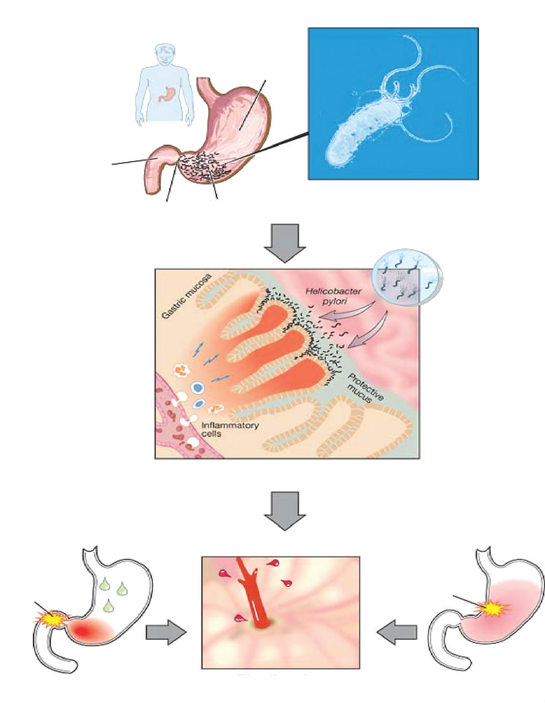
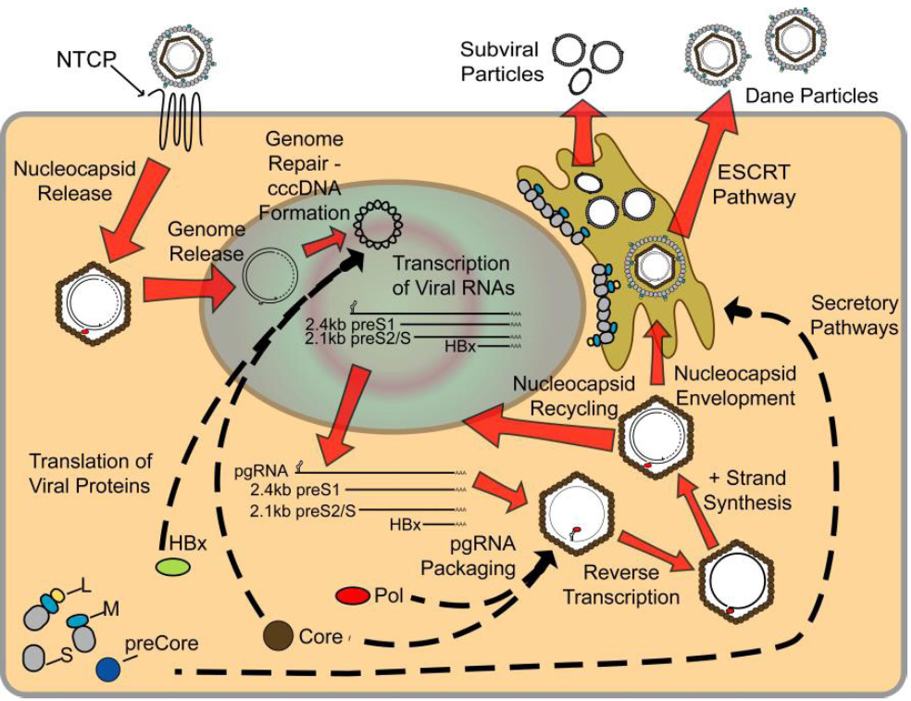
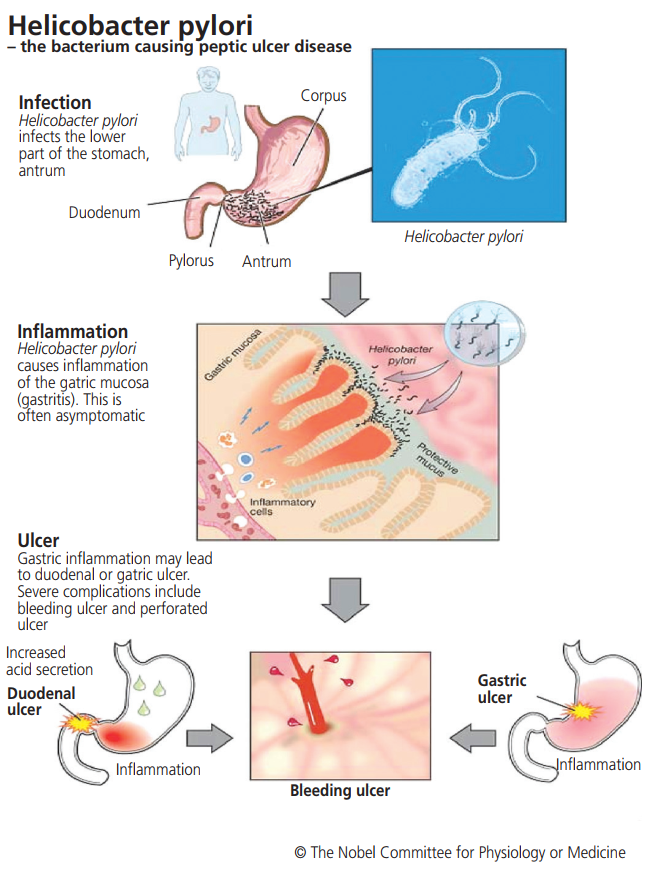
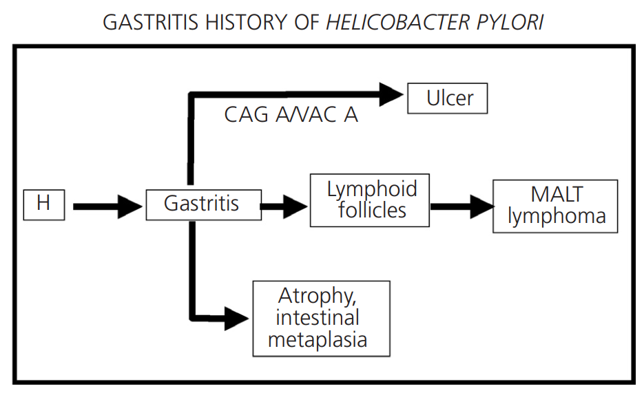
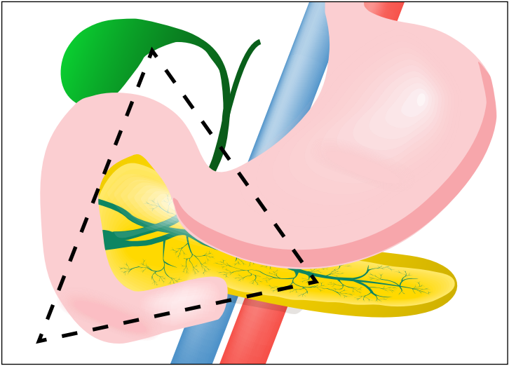

# 🔬 SINH LÝ BỆNH VIÊM GAN SIÊU VI B (HBV)

<PathoQuickNav />

<!-- DẢI CHỈ SỐ NHANH (QUICK STATS STRIP) -->
<section class="stats-strip">
  <div class="stats-grid">
    <div class="stat-card">
      <div class="stat-val purple">CCBS-20</div>
      <div class="stat-lbl">Mã cơ chế • Tiêu Hóa &amp; Gan Mật</div>
    </div>
    <div class="stat-card">
      <div class="stat-val blue">rcDNA 3.2 kb</div>
      <div class="stat-lbl">Hepadnaviridae • 4 Overlapping ORFs • cccDNA</div>
    </div>
    <div class="stat-card">
      <div class="stat-val amber">Non-Cytopathic</div>
      <div class="stat-lbl">CTLs CD8+ Thâm Nhiễm • Deaminase APOBEC3A/3B</div>
    </div>
    <div class="stat-card">
      <div class="stat-val red">Sinh Ung Thư HCC</div>
      <div class="stat-lbl">Tích Hợp DNA • Độc tính HBx • Phân hủy Smc5/6</div>
    </div>
  </div>
</section>

---

## 1. Cấu Trúc Virion, Bộ Gen rcDNA & Tiểu Thể Mồi Nhử SVPs {#sec-1}

Vi-rút viêm gan B (**Hepatitis B Virus - HBV**) thuộc họ *Hepadnaviridae*, là một trong những tác nhân gây bệnh mạn tính nguy hiểm nhất ở người với hơn 250 triệu người mang mầm bệnh trên thế giới.

### Cấu Trúc Bộ Gen Bán Kép rcDNA

Bộ gen của HBV là một phân tử **DNA vòng, lỏng lẻo, bán kép (Relaxed Circular DNA - rcDNA) dài 3,2 kb**. Đầu $5'$ của chuỗi âm ($-$) liên kết cộng hóa trị với protein Polymerase của virus, trong khi chuỗi dương ($+$) bị khuyết một đoạn dài có độ dài biến thiên (chỉ hoàn thiện khoảng 50% – 70% chiều dài).

Bộ gen chứa **4 khung đọc mở gối chồng lên nhau (Overlapping ORFs)** tối ưu hóa dung lượng di truyền:

1. **ORF PreC/C:** Mã hóa cho protein tiền lõi (HBeAg — kháng nguyên hòa tan bài tiết ra ngoài tế bào) và protein lõi (HBcAg — protein cấu trúc lắp ráp vỏ capsid 120 dimer).
2. **ORF P:** Khung đọc lớn nhất (chiếm ~80% bộ gen), mã hóa cho enzym Polymerase đa chức năng gồm 4 miền: Terminal Protein (TP làm mồi gắn chuỗi âm), Spacer, Reverse Transcriptase (RT sao chép ngược) và RNase H (phân hủy RNA khuôn mẫu).
3. **ORF PreS/S:** Mã hóa cho 3 protein vỏ bề mặt: Large (L-HBsAg chứa miền preS1/preS2/S), Middle (M-HBsAg chứa preS2/S), và Small (S-HBsAg chứa miền S).
4. **ORF X:** Mã hóa cho **protein phi cấu trúc HBx (16.5 kDa)** — nhân tố điều hòa phiên mã đa năng đóng vai trò trung tâm trong sự nhân lên của virus và cơ chế sinh ung thư gan.

```diagram
[BỘ GEN HBV 3.2 kb rcDNA] ──► [4 KHUNG ĐỌC MỞ OVERLAPPING]
                                       │
        ┌──────────────────────────────┼──────────────────────────────┬──────────────────────────────┐
        ▼                              ▼                              ▼                              ▼
 [ORF PreC/C]                       [ORF P]                      [ORF PreS/S]                     [ORF X]
  ├── HBeAg (Tiết ra máu)            ├── Terminal Protein (TP)     ├── L-HBsAg (Miền preS1)        └── Protein HBx
  └── HBcAg (Vỏ Capsid)              ├── Reverse Transcriptase     ├── M-HBsAg                      (Điều hòa & Sinh ung)
                                     └── RNase H                   └── S-HBsAg (Gai bề mặt)
```

### 3 Loại Tiểu Thể Lưu Hành & "Mồi Nhử Miễn Dịch" (Immune Decoy)

Tế bào gan nhiễm HBV sản sinh và bài tiết vào tuần hoàn 3 loại hạt tiểu thể:

- **Hạt Dane (Dane particles - 42 nm):** Là virion hoàn chỉnh có khả năng lây nhiễm, gồm vỏ lipid chứa HBsAg bao bọc lõi nucleocapsid chứa rcDNA và enzym Polymerase.
- **Tiểu thể phụ hình cầu (Spherical SVPs - 25 nm) &amp; Hình ống (Filamentous SVPs - 22 nm):** Chỉ cấu tạo từ S-HBsAg và một lượng nhỏ M-HBsAg rỗng, không chứa nucleocapsid hay vật chất di truyền. Các tiểu thể SVPs này được tiết ra với **nồng độ khổng lồ gấp 10.000 đến 100.000 lần hạt Dane**, hoạt động như một **"mồi nhử miễn dịch" (immune decoy)** để đánh lạc hướng và bão hòa toàn bộ các kháng thể trung hòa dịch thể của vật chủ, tạo điều kiện cho hạt Dane lây nhiễm thuận lợi.

<figure class="physio-figure" style="display: flex; flex-direction: column; align-items: center; justify-content: center; text-align: center; margin: 1.75rem auto;">
  
  <figcaption style="margin-top: 0.75rem; font-size: 0.88rem; color: var(--color-text-muted, #64748b); font-style: italic; text-align: center; max-width: 800px;">
    <strong>Hình 1: Đặc Điểm Sinh Học Phân Tử của HBV (Molecular Biology of HBV).</strong> (A) Bộ gen rcDNA bán kép gắn protein Polymerase và mồi RNA đầu 5'. (B) 4 khung đọc mở chồng lấp PreC/C, P, PreS/S và X. (C) Cấu trúc cắt ngang của virion hoàn chỉnh hạt Dane (42 nm) và các tiểu thể phụ subviral particles. Nguồn: Lamontagne, Bagga, Bouchard (Hepatoma Res, 2016).
  </figcaption>
</figure>

---

## 2. Chu Kỳ Tế Bào, 7 Bước Sửa Chữa cccDNA & Tích Hợp Gen {#sec-2}

### Quá Trình Xâm Nhập & Nhập Bào Qua Thụ Thể NTCP

1. **Bám dính &amp; Tương tác thụ thể:** Miền preS1 của L-HBsAg gắn kết với **Heparan Sulfate Proteoglycans (HSPG)** trên bề mặt tế bào gan, sau đó tương tác ái lực cao với thụ thể đặc hiệu **NTCP (Sodium-Taurocholate Cotransporting Polypeptide)** cùng sự hỗ trợ của đồng thụ thể **EGFR**.
2. **Nhập bào &amp; Vận chuyển nhân:** Virus xâm nhập theo con đường nội thực bào qua trung gian Clathrin, hòa màng lipid giải phóng nucleocapsid vào bào tương. Nucleocapsid di chuyển dọc vi ống đến lỗ màng nhân, rã vỏ và bơm rcDNA vào trong nhân tế bào gan.

<figure class="physio-figure" style="display: flex; flex-direction: column; align-items: center; justify-content: center; text-align: center; margin: 1.75rem auto;">
  
  <figcaption style="margin-top: 0.75rem; font-size: 0.88rem; color: var(--color-text-muted, #64748b); font-style: italic; text-align: center; max-width: 800px;">
    <strong>Hình 2 (Figure 2 | Life Cycle of HBV): Toàn Bộ Vòng Đời Sinh Học của HBV.</strong> Xâm nhập qua thụ thể NTCP ➔ vận chuyển rcDNA vào nhân ➔ sửa chữa thành cccDNA minichromosome ➔ phiên mã pgRNA và subgenomic RNAs ➔ đóng gói capsid và phiên mã ngược bên trong capsid ➔ tái quay vòng vào nhân duy trì cccDNA hoặc bọc vỏ xuất bào qua con đường ESCRT. Nguồn: Lamontagne et al. (2016).
  </figcaption>
</figure>

### Cơ Chế 7 Bước Sinh Tổng Hợp cccDNA (rcDNA-to-cccDNA Pathway)

Quá trình chuyển đổi rcDNA bán kép thành DNA vòng khép kín cộng hóa trị (**covalently closed circular DNA - cccDNA**) hoàn toàn do hệ thống enzyme sửa chữa DNA của tế bào chủ thực hiện:

```diagram
[rcDNA TRONG NHÂN]
        │
        ├──► 1. Tách Polymerase (Deproteination): TDP2 cắt bỏ protein Polymerase đầu 5' mạch âm (-)
        │
        ├──► 2. Loại bỏ mồi RNA: Cắt bỏ mồi RNA đầu 5' mạch dương (+)
        │
        ├──► 3. Cắt Flap r thừa: FEN1 cắt bỏ trình tự lặp lại dư thừa ở đầu tận
        │
        ├──► 4. Sửa chữa chuỗi dương: DNA Polymerase (κ, α, δ) + Topoisomerase điền đầy mạch đơn
        │
        ├──► 5 & 6. Đóng kín mạch kép: DNA Ligase 1 & 3 hàn gắn các mối nối thành vòng khép kín
        │
        └──► 7. Đóng gói Chromatin (Chromatinization): Liên kết Histone H3/H4, HBcAg và HBx
               tạo thành cccDNA Minichromosome siêu bền vững!
```

cccDNA tồn tại như một **nhiễm sắc thể thu nhỏ (minichromosome)** độc lập trong nhân tế bào gan, làm khuôn mẫu vĩnh viễn cho RNA Polymerase II của tế bào chủ phiên mã ra toàn bộ các bản sao RNA virus:
- **pgRNA (3,5 kb):** Vừa dịch mã ra HBcAg và Polymerase, vừa làm khuôn mẫu phiên mã ngược tạo rcDNA thế hệ mới.
- **Precore mRNA (3,5 kb):** Dịch mã ra HBeAg.
- **Subgenomic mRNAs (2,4 kb, 2,1 kb, 0,7 kb):** Dịch mã ra L-, M-, S-HBsAg và HBx.

<figure class="physio-figure" style="display: flex; flex-direction: column; align-items: center; justify-content: center; text-align: center; margin: 1.75rem auto;">
  
  <figcaption style="margin-top: 0.75rem; font-size: 0.88rem; color: var(--color-text-muted, #64748b); font-style: italic; text-align: center; max-width: 800px;">
    <strong>Hình 3: Cơ Chế Phân Tử Hình Thành cccDNA (The Formation of HBV cccDNA).</strong> Minh họa chi tiết 7 bước: tách TDP2, cắt mồi RNA, FEN1 cắt Flap r, điền đầy DNA polymerase tế bào chủ, gắn DNA ligase 1/3 và chromatinization với histone H3/H4 tạo minichromosome. Nguồn: Xia &amp; Guo (Antiviral Res, 2020).
  </figcaption>
</figure>

### Sự Tích Hợp HBV DNA Vào Bộ Gen Người (HBV Integration)

Trong quá trình sao chép ngược, khoảng 10% các sản phẩm tạo ra là **DNA sợi đôi thẳng (dsLDNA)**. Phân tử này chèn ngẫu nhiên và tích hợp vĩnh viễn vào bộ gen tế bào gan người tại các vị trí đứt gãy DNA kép:
- DNA tích hợp bị mất promoter lõi nên không thể tạo pgRNA để sinh virion hoàn chỉnh, nhưng vẫn bảo tồn promoter PreS/S.
- Do đó, DNA tích hợp hoạt động như một **nhà máy sản xuất HBsAg liên tục**. Điều này giải thích tại sao ở giai đoạn mạn tính muộn (kể cả khi HBV DNA âm tính và cccDNA đã cạn kiệt), nồng độ HBsAg trong máu bệnh nhân vẫn duy trì ở mức cao.

---

## 3. Miễn Dịch Bệnh Học: Con Đường APOBEC3 & Suy Kiệt Tế Bào T {#sec-3}

### Bản Chất Không Trực Tiếp Độc Tế Bào & 2 Con Đường Thanh Thải Của T-Cell

Tương tự HAV, HBV là vi-rút **hoàn toàn không trực tiếp gây độc tế bào (non-cytopathic)**. Tình trạng hủy hoại tế bào gan là do phản ứng miễn dịch của cơ thể:

1. **Con đường hủy tế bào (Cytolytic Clearance):** Tế bào **CD8+ CTLs** nhận diện kháng nguyên HBcAg/HBsAg qua MHC Class I, giải phóng perforin/granzyme hoặc qua Fas/FasL gây hoại tử tế bào gan, bùng phát men gan ALT/AST.
2. **Con đường không hủy tế bào (Non-cytolytic Clearance) qua Deaminase APOBEC3 — Cơ chế bảo tồn mô gan:** Tế bào T giải phóng **IFN-$\gamma$ và TNF-$\alpha$**, kích hoạt tế bào gan biểu hiện các enzym **cytidine deaminase APOBEC3A và APOBEC3B**. Các enzym này đi vào nhân tế bào, khử amin các gốc cytosine trên cccDNA thành uracil ($C \rightarrow U$), dẫn đến sự phân hủy đặc hiệu cccDNA bằng enzym nuclease nội bào mà **hoàn toàn không làm chết hoặc hủy hoại tế bào gan**.

```diagram
[TẾ BÀO T CD8+ ĐẶC HIỆU HBV]
              │
      ┌───────┴────────────────────────────────────────┐
      ▼                                                ▼
[CON ĐƯỜNG HỦY TẾ BÀO]                          [CON ĐƯỜNG KHÔNG HỦY TẾ BÀO (APOBEC3)]
(Cytolytic Clearance)                           (Non-cytolytic cccDNA Decay)
  • Tiết Perforin & Granzyme B                    • Tiết IFN-γ và TNF-α
  • Hoạt hóa Fas / FasL                           • Cảm ứng Deaminase APOBEC3A & APOBEC3B
  • Gây hoại tử tế bào gan                        • Khử amin C ➔ U trên cccDNA minichromosome
  • Tăng vọt men gan ALT/AST                      • Tiêu hủy cccDNA mà KHÔNG GIẾT TẾ BÀO GAN!
```

### Cơ Chế Cạn Kiệt Miễn Dịch (T-Cell Exhaustion) Trong Nhiễm Mạn

Trong nhiễm HBV mạn tính, sự phơi nhiễm liên tục với tải lượng kháng nguyên HBsAg và HBeAg khổng lồ trong nhiều thập kỷ dẫn đến **suy kiệt tế bào T (T-cell exhaustion)**: tế bào T bị giảm số lượng, mất khả năng tăng sinh và tăng biểu hiện các thụ thể ức chế miễn dịch **PD-1, CTLA-4, Tim-3, LAG-3**. Đồng thời, HBeAg bài tiết qua máu đóng vai trò dung nạp miễn dịch tế bào T ngay từ thời kỳ chu sinh.

---

## 4. 4 Pha Diễn Tiến Tự Nhiên Chuẩn EASL 2025 & BYT 2026 {#sec-4}

<div class="table-responsive">
  <table class="table-modern">
    <thead>
      <tr>
        <th>Thông Số</th>
        <th>Pha 1: Nhiễm HBV Mạn HBeAg (+)<br /><em>(Dung nạp miễn dịch)</em></th>
        <th>Pha 2: Viêm Gan B Mạn HBeAg (+)<br /><em>(Thải trừ miễn dịch)</em></th>
        <th>Pha 3: Nhiễm HBV Mạn HBeAg (-)<br /><em>(Người mang không hoạt động)</em></th>
        <th>Pha 4: Viêm Gan B Mạn HBeAg (-)<br /><em>(Tái hoạt động)</em></th>
      </tr>
    </thead>
    <tbody>
      <tr>
        <td><strong>HBeAg / Anti-HBe</strong></td>
        <td><span class="val-high">HBeAg (+)</span> / Anti-HBe (-)</td>
        <td><span class="val-high">HBeAg (+)</span> / Anti-HBe (-)</td>
        <td>HBeAg (-) / <span class="val-low">Anti-HBe (+)</span></td>
        <td>HBeAg (-) / Anti-HBe (+/-)</td>
      </tr>
      <tr>
        <td><strong>Tải lượng HBV DNA</strong></td>
        <td><strong>Rất cao</strong> ($&gt; 10^7\text{ IU/mL}$)</td>
        <td><strong>Cao dao động</strong> ($10^4 - 10^7\text{ IU/mL}$)</td>
        <td><strong>Thấp / Âm</strong> ($&lt; 2.000\text{ IU/mL}$)</td>
        <td><strong>Dao động</strong> ($&gt; 2.000\text{ IU/mL}$)</td>
      </tr>
      <tr>
        <td><strong>Men gan ALT</strong></td>
        <td><strong>Bình thường liên tục</strong></td>
        <td><strong>Tăng cao / Dao động từng đợt</strong></td>
        <td><strong>Bình thường liên tục</strong></td>
        <td><strong>Tăng cao / Dao động</strong></td>
      </tr>
      <tr>
        <td><strong>Mô bệnh học gan</strong></td>
        <td>Viêm/xơ hóa tối thiểu</td>
        <td>Viêm hoại tử &amp; xơ hóa tiến triển</td>
        <td>Không viêm / xơ hóa nhẹ</td>
        <td>Viêm hoại tử &amp; xơ hóa tiến triển nặng</td>
      </tr>
      <tr>
        <td><strong>Bản chất cơ chế</strong></td>
        <td>Hệ miễn dịch dung nạp virus; không tấn công tế bào gan.</td>
        <td>Hệ miễn dịch tấn công dọn virus; gây hủy hoại gan dữ dội.</td>
        <td>Kiểm soát miễn dịch hiệu quả; virus ngừng sao chép tích cực.</td>
        <td>Đột biến <strong>Precore (G1896A)</strong> hoặc <strong>BCP (A1762T/G1764A)</strong> làm mất HBeAg nhưng virus vẫn nhân lên âm thầm!</td>
      </tr>
    </tbody>
  </table>
</div>
<p style="font-size: 0.85rem; color: var(--color-text-muted, #64748b); font-style: italic; margin-top: 0.5rem;">
  *Phân loại 4 pha cập nhật chuẩn hóa theo Đồng thuận EASL 2025 và Hướng dẫn Quyết định số 1740/QĐ-BYT (16/06/2026) của Bộ Y tế Việt Nam.*
</p>

- **Viêm gan B thể ẩn (Occult HBV Infection - OBI):** HBsAg âm tính nhưng phát hiện được HBV DNA nồng độ thấp trong máu hoặc mô gan ($&lt;200\text{ IU/mL}$). cccDNA vẫn tồn tại âm thầm trong nhân tế bào gan và có nguy cơ tái hoạt bùng phát tối cấp khi dùng thuốc ức chế miễn dịch hoặc hóa trị ung thư (anti-CD20 Rituximab).

<figure class="physio-figure" style="display: flex; flex-direction: column; align-items: center; justify-content: center; text-align: center; margin: 1.75rem auto;">
  
  <figcaption style="margin-top: 0.75rem; font-size: 0.88rem; color: var(--color-text-muted, #64748b); font-style: italic; text-align: center; max-width: 800px;">
    <strong>Hình 4: Diễn Tiến Tự Nhiên Nhiễm HBV Mạn Tính (The Natural History of HBV Infection).</strong> Thể hiện các ngả rẽ từ nhiễm cấp sang nhiễm mạn: Pha dung nạp miễn dịch (Immune Tolerant) ➔ Pha thải trừ miễn dịch (Immune Clearance) ➔ Pha người mang không hoạt động (Inactive Carrier) ➔ Tái hoạt động (Reactivation) ➔ Tiến triển đến Xơ gan (Cirrhosis) và Ung thư gan (HCC). Nguồn: Lamontagne et al. (2016).
  </figcaption>
</figure>

---

## 5. Sinh Bệnh Học Xơ Gan & Ung Thư Biểu Mô Tế Bào Gan (HCC) {#sec-5}

### Cơ Chế Sinh Xơ Hóa Gan (Fibrogenesis)

Hoại tử tế bào gan kéo dài kích hoạt đại thực bào giải phóng **TGF-$\beta$**, kích thích **tế bào hình sao (Hepatic Stellate Cells - HSCs)** trong khoang Disse chuyển dạng thành nguyên bào sợi cơ (*myofibroblasts*), tăng cường tổng hợp và lắng đọng sợi collagen type I/III, làm xơ hóa khoảng cửa, hình thành các nốt tái sinh và dẫn tới **xơ gan và tăng áp lực tĩnh mạch cửa**.

### 3 Trục Sinh Ung Thư Biểu Mô Tế Bào Gan (HBV-associated HCC)

HBV là virus sinh ung thư trực tiếp ngay cả khi bệnh nhân **chưa bị xơ gan** thông qua 3 cơ chế phối hợp:

```diagram
[NHIỄM HBV MẠN TÍNH]
        │
        ├──► TRỤC 1: VIÊM MẠN & STRESS OXY HÓA (ROS)
        │      • Chu kỳ hoại tử - tái sinh liên tục ➔ Tích lũy đột biến ngẫu nhiên.
        │
        ├──► TRỤC 2: TÍCH HỢP HBV DNA VÀO BỘ GEN NGƯỜI
        │      • Đột biến chèn gen đè nén khối u / Kích hoạt oncogene (c-myc).
        │      • Gây mất ổn định nhiễm sắc thể và nhân dòng vô tính ác tính.
        │
        └──► TRỤC 3: ĐỘC TÍNH SINH UNG TRỰC TIẾP CỦA PROTEIN HBx
               ├── Phân hủy phức hợp hạn chế Smc5/6 qua CUL4-DDB1 ligase.
               ├── Giữ chu kỳ tế bào ở pha G1/S ➔ Tăng tích lũy đứt gãy DNA.
               ├── Kích hoạt các con đường sinh tồn Ras/MAPK, PI3K/Akt, NF-κB.
               └── Bất hoạt trực tiếp protein đè nén khối u p53!
```

<figure class="physio-figure" style="display: flex; flex-direction: column; align-items: center; justify-content: center; text-align: center; margin: 1.75rem auto;">
  
  <figcaption style="margin-top: 0.75rem; font-size: 0.88rem; color: var(--color-text-muted, #64748b); font-style: italic; text-align: center; max-width: 800px;">
    <strong>Hình 5: Cơ Chế Sinh Ung Thư Tế Bào Gan Liên Quan HBV (HBV-induced Hepatocarcinogenesis).</strong> Tương tác đa chiều giữa viêm hoại tử mạn tính, tích hợp DNA và độc tính phân tử đa năng của protein HBx bất hoạt p53 và Smc5/6. Nguồn: Lamontagne et al. (Hepatoma Res, 2016).
  </figcaption>
</figure>

---

## 6. Tài Liệu Tham Khảo Y Văn AMA {#sec-6}

<div class="ref-section" style="background: var(--color-surface-2, #f8fafc); border: 1px solid var(--color-border, #cbd5e1); border-radius: 12px; padding: 1.5rem; margin-top: 1.5rem;">
  <h3 style="color: var(--color-primary, #0284c7); font-size: 1.1rem; font-weight: 800; margin-bottom: 1rem; display: flex; align-items: center; gap: 8px;">
    <i class="fa-solid fa-book-bookmark"></i> Danh Mục Tài Liệu Tham Khảo Quốc Tế Chuẩn AMA
  </h3>
  <ol style="margin: 0; padding-left: 1.25rem; line-height: 1.8; color: var(--color-text, #334155); font-size: 0.88rem;">
    <li>Lamontagne RJ, Bagga S, Bouchard MJ. Hepatitis B virus molecular biology and pathogenesis. <em>Hepatoma Res</em>. 2016;2:163-186. doi:10.20517/2394-5079.2016.05</li>
    <li>Xia Y, Guo H. Hepatitis B Virus cccDNA: Formation, Regulation and Therapeutic Potential. <em>Antiviral Res</em>. 2020;180:104824. doi:10.1016/j.antiviral.2020.104824</li>
    <li>European Association for the Study of the Liver. EASL 2025 Clinical Practice Guidelines on the management of chronic hepatitis B virus infection. <em>J Hepatol</em>. 2025;82(5):812-856.</li>
    <li>Bộ Y tế Việt Nam. <em>Hướng dẫn chẩn đoán, điều trị viêm gan vi rút B</em> (Ban hành kèm theo Quyết định số 1740/QĐ-BYT ngày 16/06/2026 của Bộ trưởng Bộ Y tế). Hà Nội: Bộ Y tế; 2026.</li>
    <li>Lucifora J, Xia Y, Reisinger F, et al. Specific and nonhepatotoxic degradation of nuclear hepatitis B virus cccDNA. <em>Science</em>. 2014;343(6176):1221-1228. doi:10.1126/science.1243462</li>
    <li>Decorsiere A, Mueller H, van Breugel PC, et al. Hepatitis B virus X protein identifies the Smc5/6 complex as a host restriction factor. <em>Nature</em>. 2016;531(7594):386-389. doi:10.1038/nature17170</li>
    <li>World Health Organization. <em>Guidelines for the Prevention, Diagnosis and Treatment of Chronic Hepatitis B Infection</em>. Geneva: World Health Organization; 2024.</li>
  </ol>
</div>

<!-- HÀNG NÚT ĐIỀU HƯỚNG SPA -->
<div class="btn-row" style="display: flex; gap: 1rem; justify-content: space-between; margin-top: 2rem; flex-wrap: wrap;">
  <a href="#/basic-medical/co-che-benh-sinh" class="btn btn-primary" style="display: inline-flex; align-items: center; gap: 8px; padding: 0.6rem 1.2rem; border-radius: 8px; font-weight: 700;">
    <i class="fa-solid fa-arrow-left"></i> Quay lại Mục Lục Cơ Chế Bệnh Sinh
  </a>
  <a href="#sec-1" class="btn btn-outline" style="display: inline-flex; align-items: center; gap: 8px; padding: 0.6rem 1.2rem; border-radius: 8px; font-weight: 700;">
    <i class="fa-solid fa-arrow-up"></i> Lên đầu trang
  </a>
</div>
