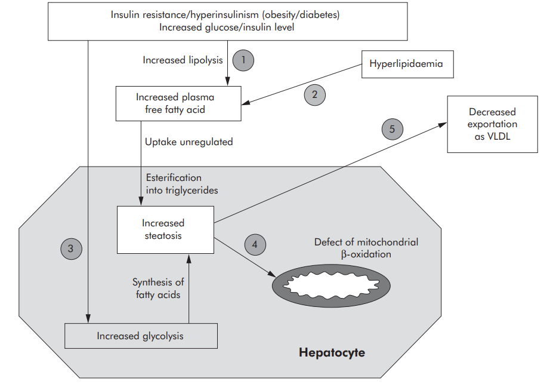
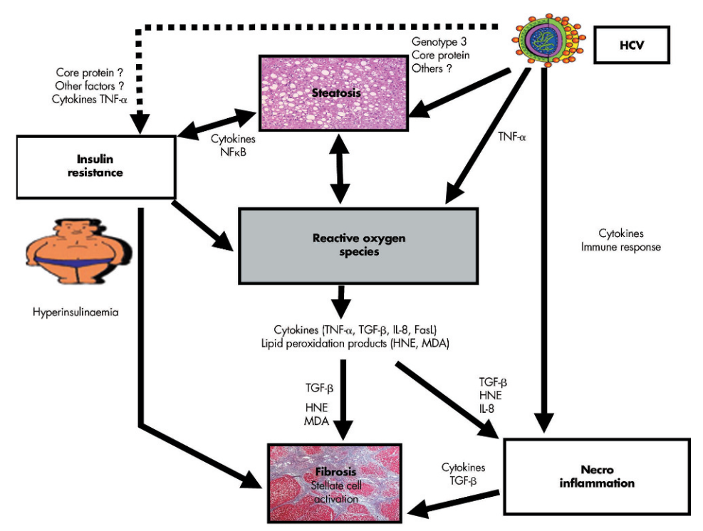

# 🔬 SINH LÝ BỆNH VIÊM GAN SIÊU VI C (HCV)

<PathoQuickNav />

<!-- DẢI CHỈ SỐ NHANH (QUICK STATS STRIP) -->
<section class="stats-strip">
  

    

      
CCBS-21

      
Mã cơ chế • Tiêu Hóa &amp; Gan Mật

    

    

      
ssRNA (+) 9.6 kb

      
Flaviviridae • 6 Genotypes • NS3/4A Protease

    

    

      
Steatosis &amp; IR

      
Core/NS5A ức chế MTP • Bất hoạt IRS-1/2 • ROS

    

    

      
SVR &gt; 95%

      
DAAs trực đích • Vết sẹo phân tử T-cell • BYT 2024

    

  

</section>

---

## 1. Cấu Trúc Flaviviridae & Chu Kỳ Tế Bào Đa Thụ Thể {#sec-1}

Vi-rút viêm gan C (**Hepatitis C Virus - HCV**) là một thành viên có màng bọc thuộc chi *Hepacivirus*, họ *Flaviviridae*. Khác với HBV, HCV là một vi-rút RNA thuần túy và chu kỳ sao chép diễn ra hoàn toàn trong bào tương mà không bao giờ xâm nhập vào nhân hay tích hợp vào bộ gen người.

### Cấu Trúc Di Truyền & 6 Kiểu Gen Chính

- **Bộ gen:** Phân tử **RNA sợi đơn dương [ssRNA(+)]** dài 9,6 kb, mang cấu trúc **IRES (Internal Ribosome Entry Site)** ở đầu $5'$ cho phép gắn kết trực tiếp với ribosome tế bào chủ để dịch mã mà không cần mũ cap.
- **Xử lý Polyprotein:** Quá trình dịch mã tạo ra một chuỗi polyprotein đơn dài khoảng 3.000 axit amin, được phân cắt bởi signal peptidase tế bào chủ và protease của virus (**NS2 và NS3/4A**) thành:
  - *3 protein cấu trúc:* Core (tạo nucleocapsid), E1 và E2 (glycoprotein vỏ ngoài).
  - *7 protein phi cấu trúc:* p7 (kênh ion viroid), NS2, NS3 (protease/helicase), NS4A (cofactor), NS4B (tạo màng sao chép membranous web), NS5A (phosphoprotein liên kết lipid và sao chép), và NS5B (RNA-dependent RNA polymerase).
- **Tính đa dạng Quasispecies:** Enzym NS5B thiếu hoạt tính đọc sửa (proofreading), tạo ra tần suất đột biến cực cao ($10^{-3}$ đột biến/nucleotide/năm). Trong cơ thể người bệnh luôn tồn tại một quần thể các biến thể virus liên tục tiến hóa gọi là **quasispecies**, giúp HCV né tránh kháng thể và thúc đẩy **70% – 85% trường hợp chuyển sang nhiễm trùng mạn tính**.
- **6 Genotypes:** Phân bố toàn cầu thành Genotype 1 đến 6. Tại Việt Nam, **Genotype 1 (1a, 1b)** và **Genotype 6 (6a, 6e)** chiếm ưu thế tuyệt đối (&gt;90% ca bệnh).

### Con Đường Xâm Nhập Đa Thụ Thể & Chu Trình Sao Chép Bào Tương

Quá trình xâm nhập của HCV vào tế bào gan là một chuỗi phối hợp phức tạp nhất trong số các virus truyền nhiễm:

1. **Bám dính ban đầu:** Phức hợp lipoprotein bọc ngoài virus tương tác với **HSPG** và thụ thể dọn dẹp **SR-BI (Scavenger Receptor Class B Type I)** cùng thụ thể **LDLR**.
2. **Gắn kết thụ thể màng:** Glycoprotein E2 gắn đặc hiệu vào thụ thể **CD81** trên màng tế bào gan.
3. **Tiếp cận liên kết vòng bịt (Tight Junctions):** Phức hợp virus–CD81 di chuyển về phía liên kết vòng bịt, tương tác với **Claudin-1 (CLDN1)** và **Occludin (OCLN)**, kích hoạt quá trình nội thực bào qua trung gian Clathrin.
4. **Màng lưới sao chép (Membranous Web):** Protein NS4B tái cấu trúc màng lưới nội chất thành một hệ thống túi màng bảo vệ (*membranous web*). Tại đây, phức hợp NS5A-NS5B sao chép RNA thông qua sợi trung gian RNA âm ($-$).
5. **Lắp ráp & Xuất bào gắn liền Lipid:** Hạt virus lắp ráp tại bề mặt các giọt mỡ (*lipid droplets*), đóng gói cùng các apolipoprotein (ApoE, ApoB) tạo thành hạt tiểu thể giả lipoprotein tỷ trọng thấp (**LVP - Lipo-Viro-Particles**) trước khi bài tiết ra ngoài.

---

## 2. Sinh Bệnh Học Mỡ Hóa Gan Do Virus (Viral Steatosis) {#sec-2}

Tình trạng tích lũy mỡ trong tế bào gan (**Steatosis**) là một đặc trưng mô bệnh học nổi bật của viêm gan C mạn tính (xuất hiện ở trên 50% bệnh nhân). Mỡ hóa gan trong HCV gồm 2 nguồn gốc sinh bệnh học:

  

    
<i class="fa-solid fa-route" style="color: var(--color-primary, #0284c7);"></i> SƠ ĐỒ LÂM SÀNG: NHIỄM HCV MẠN TÍNH

    Pure Orthogonal SVG
  

  

    <svg class="flowchart-svg" viewBox="0 0 880 226" width="880" height="226" xmlns="http://www.w3.org/2000/svg">
      <defs>
        <marker id="arrBlue" viewBox="0 0 10 10" refX="6" refY="5" markerWidth="6" markerHeight="6" orient="auto-start-reverse">
          <path d="M 0 1.5 L 8 5 L 0 8.5 z" fill="#0284c7"/>
        </marker>
        <marker id="arrGreen" viewBox="0 0 10 10" refX="6" refY="5" markerWidth="6" markerHeight="6" orient="auto-start-reverse">
          <path d="M 0 1.5 L 8 5 L 0 8.5 z" fill="#059669"/>
        </marker>
        <marker id="arrAmber" viewBox="0 0 10 10" refX="6" refY="5" markerWidth="6" markerHeight="6" orient="auto-start-reverse">
          <path d="M 0 1.5 L 8 5 L 0 8.5 z" fill="#d97706"/>
        </marker>
        <marker id="arrRed" viewBox="0 0 10 10" refX="6" refY="5" markerWidth="6" markerHeight="6" orient="auto-start-reverse">
          <path d="M 0 1.5 L 8 5 L 0 8.5 z" fill="#dc2626"/>
        </marker>
      </defs>

      <!-- Single Node: NHIỄM HCV MẠN TÍNH -->
      <rect x="173.5" y="20" width="533" height="168" rx="10" fill="var(--amber-bg, #fffbeb)" stroke="var(--amber, #f59e0b)" stroke-width="1.8"/>
      <text x="440" y="42" text-anchor="middle" font-family="'Plus Jakarta Sans', sans-serif" font-weight="800" font-size="12" fill="var(--amber, #d97706)">NHIỄM HCV MẠN TÍNH</text>
      <text x="197.5" y="64" text-anchor="start" font-family="'Plus Jakarta Sans', sans-serif" font-size="11" fill="var(--color-text, #0f172a)">• ├──► 1. TÁC ĐỘNG TRỰC TIẾP CỦA PROTEIN VIRUS (Đặc biệt</text>
      <text x="197.5" y="82" text-anchor="start" font-family="'Plus Jakarta Sans', sans-serif" font-size="11" fill="var(--color-text, #0f172a)">• Genotype 3a)</text>
      <text x="197.5" y="100" text-anchor="start" font-family="'Plus Jakarta Sans', sans-serif" font-size="11" fill="var(--color-text, #0f172a)">• ├──► 2. TĂNG HẤP THU &amp; TỔNG HỢP AXIT BÉO (De Novo</text>
      <text x="197.5" y="118" text-anchor="start" font-family="'Plus Jakarta Sans', sans-serif" font-size="11" fill="var(--color-text, #0f172a)">• Lipogenesis)</text>
      <text x="197.5" y="136" text-anchor="start" font-family="'Plus Jakarta Sans', sans-serif" font-size="11" fill="var(--color-text, #0f172a)">• Protein Core gây tổn thương màng ty thể ➔ Giảm β-oxy hóa</text>
      <text x="197.5" y="154" text-anchor="start" font-family="'Plus Jakarta Sans', sans-serif" font-size="11" fill="var(--color-text, #0f172a)">• axit béo.</text>
      <text x="197.5" y="172" text-anchor="start" font-family="'Plus Jakarta Sans', sans-serif" font-size="11" fill="var(--color-text, #0f172a)">• Bùng phát các gốc oxy hóa tự do ROS ➔ Hủy hoại tế bào gan!</text>
    </svg>
  

1. **Ức chế con đường bài tiết VLDL qua enzyme MTP:** Protein Core của HCV ức chế trực tiếp hoạt tính của **Microsomal Triglyceride Transfer Protein (MTP)** — enzyme then chốt trong việc gắn kết triglyceride với Apolipoprotein B để đóng gói và bài tiết VLDL ra ngoài tế bào. Hậu quả là triglyceride bị ứ đọng và tích tụ ồ ạt trong bào tương tế bào gan.
2. **Đặc tính độc quyền của Genotype 3a:** Protein Core của HCV genotype 3a chứa các đột biến axit amin đặc hiệu tại miền DII (domain II), làm tăng ái lực gắn kết với lipid droplets gấp nhiều lần so với genotype 1b, gây ra tình trạng mỡ hóa hạt lớn (*macrovesicular steatosis*) rất nặng nề.
3. **Suy thoái ty thể & Giảm $\beta$-oxy hóa:** Protein Core xâm nhập màng trong ty thể, ức chế phức hợp I của chuỗi hô hấp tế bào, làm giảm tốc độ $\beta$-oxy hóa axit béo, khiến lượng chất béo nạp vào (*input*) vượt xa khả năng tiêu thụ (*output*).

<figure class="physio-figure" style="display: flex; flex-direction: column; align-items: center; justify-content: center; text-align: center; margin: 1.75rem auto;">
  
  <figcaption style="margin-top: 0.75rem; font-size: 0.88rem; color: var(--color-text-muted, #64748b); font-style: italic; text-align: center; max-width: 800px;">
    <strong>Hình 1 (Figure 1 | Pathophysiology of Steatosis): Cơ Chế Mỡ Hóa Gan Do HCV.</strong> Mất cân bằng giữa luồng nạp vào (Input: tăng hấp thu axit béo do đề kháng insulin [1,2], tăng đường phân tổng hợp de novo lipogenesis [3]) và luồng tiêu thụ/xuất khẩu (Output: giảm beta-oxy hóa ty thể [4], ức chế đóng gói VLDL [5]). Nguồn: Asselah, Rubbia-Brandt, Marcellin, Negro (Gut, 2006).
  </figcaption>
</figure>

---

## 3. Cơ Chế Đề Kháng Insulin & Vòng Xoắn Bệnh Lý {#sec-3}

Viêm gan C mạn tính là một bệnh lý có tính chất chuyển hóa toàn thân. Bệnh nhân nhiễm HCV có nguy cơ mắc Đái tháo đường týp 2 cao gấp 3 – 4 lần người bình thường do cơ chế **đề kháng insulin trực tiếp**:

- **Bất hoạt cơ chất thụ thể Insulin (IRS-1 &amp; IRS-2):** Nhiễm HCV kích hoạt các tế bào Kupffer và tế bào gan tiết ra lượng lớn cytokine tiền viêm **TNF-$\alpha$** và **SOCS-3 (Suppressor of Cytokine Signaling 3)**.
- **Chặn đứng con đường PI3K/Akt:** TNF-$\alpha$ và protein Core kích hoạt sự phosphoryl hóa serine bất thường trên phân tử **IRS-1 (Insulin Receptor Substrate 1)** và **IRS-2**, ngăn cản quá trình phosphoryl hóa tyrosine sinh lý. Điều này làm bất hoạt hoàn toàn phức hợp truyền tín hiệu PI3K/Akt/GLUT4, khiến tế bào gan mất khả năng thu nạp và sử dụng glucose khi có insulin.
- **Vòng xoắn bệnh lý (Vicious Cycle):** Đề kháng insulin $\rightarrow$ Tăng phân giải lipid mô mỡ $\rightarrow$ Tăng tràn ngập axit béo vào gan $\rightarrow$ Trầm trọng thêm mỡ hóa gan (Steatosis) $\rightarrow$ Tăng sản sinh ROS ty thể $\rightarrow$ Tăng tiết TNF-$\alpha$ $\rightarrow$ Đề kháng insulin nặng nề hơn!

---

## 4. Dòng Thác Xơ Hóa Gan & Kích Hoạt Tế Bào Hình Sao {#sec-4}

Quá trình chuyển đổi từ mỡ hóa gan và viêm gan mạn tính sang **xơ gan (Cirrhosis)** diễn ra qua một mạng lưới tương tác phân tử đa chiều:

  

    
<i class="fa-solid fa-route" style="color: var(--color-primary, #0284c7);"></i> SƠ ĐỒ LÂM SÀNG: STRESS OXY HÓA (ROS) DO TY THỂ &amp; HCV

    Pure Orthogonal SVG
  

  

    <svg class="flowchart-svg" viewBox="0 0 880 446" width="880" height="446" xmlns="http://www.w3.org/2000/svg">
      <defs>
        <marker id="arrBlue" viewBox="0 0 10 10" refX="6" refY="5" markerWidth="6" markerHeight="6" orient="auto-start-reverse">
          <path d="M 0 1.5 L 8 5 L 0 8.5 z" fill="#0284c7"/>
        </marker>
        <marker id="arrGreen" viewBox="0 0 10 10" refX="6" refY="5" markerWidth="6" markerHeight="6" orient="auto-start-reverse">
          <path d="M 0 1.5 L 8 5 L 0 8.5 z" fill="#059669"/>
        </marker>
        <marker id="arrAmber" viewBox="0 0 10 10" refX="6" refY="5" markerWidth="6" markerHeight="6" orient="auto-start-reverse">
          <path d="M 0 1.5 L 8 5 L 0 8.5 z" fill="#d97706"/>
        </marker>
        <marker id="arrRed" viewBox="0 0 10 10" refX="6" refY="5" markerWidth="6" markerHeight="6" orient="auto-start-reverse">
          <path d="M 0 1.5 L 8 5 L 0 8.5 z" fill="#dc2626"/>
        </marker>
      </defs>

      <!-- Single Node: STRESS OXY HÓA (ROS) DO TY THỂ -->
      <rect x="240" y="20" width="400" height="60" rx="10" fill="var(--color-surface-2, #f8fafc)" stroke="var(--color-border, #cbd5e1)" stroke-width="1.8"/>
      <text x="440" y="42" text-anchor="middle" font-family="'Plus Jakarta Sans', sans-serif" font-weight="800" font-size="12" fill="var(--color-text, #0f172a)">STRESS OXY HÓA (ROS) DO TY THỂ &amp; HCV</text>
      <text x="264" y="64" text-anchor="start" font-family="'Plus Jakarta Sans', sans-serif" font-size="11" fill="var(--color-text-muted, #475569)">• ├──► OXY HÓA LIPID (Lipid Peroxidation)</text>
      <line x1="440" y1="80" x2="440" y2="108" stroke="#0284c7" stroke-width="1.8" marker-end="url(#arrBlue)"/>
      <!-- Single Node: HÓA HƯỚNG ĐỘNG BẠCH CẦU TRUNG  -->
      <rect x="205" y="108" width="470" height="78" rx="10" fill="var(--amber-bg, #fffbeb)" stroke="var(--amber, #f59e0b)" stroke-width="1.8"/>
      <text x="440" y="130" text-anchor="middle" font-family="'Plus Jakarta Sans', sans-serif" font-weight="800" font-size="12" fill="var(--amber, #d97706)">HÓA HƯỚNG ĐỘNG BẠCH CẦU TRUNG TÍNH &amp; LYMPHO</text>
      <text x="229" y="152" text-anchor="start" font-family="'Plus Jakarta Sans', sans-serif" font-size="11" fill="var(--color-text, #0f172a)">• ├── TGF-β1 (Yếu tố kích thích mạnh nhất)</text>
      <text x="229" y="170" text-anchor="start" font-family="'Plus Jakarta Sans', sans-serif" font-size="11" fill="var(--color-text, #0f172a)">• ├── MDA &amp; 4-HNE</text>
      <line x1="440" y1="186" x2="440" y2="214" stroke="#0284c7" stroke-width="1.8" marker-end="url(#arrBlue)"/>
      <!-- Single Node: HSCs BIẾN ĐỔI THÀNH NGUYÊN BÀO -->
      <rect x="150" y="214" width="580" height="46" rx="10" fill="var(--color-surface-2, #f8fafc)" stroke="var(--color-border, #cbd5e1)" stroke-width="1.8"/>
      <text x="440" y="236" text-anchor="middle" font-family="'Plus Jakarta Sans', sans-serif" font-weight="800" font-size="12" fill="var(--color-text, #0f172a)">HSCs BIẾN ĐỔI THÀNH NGUYÊN BÀO SỢI CƠ (Myofibroblasts)</text>
      <line x1="440" y1="260" x2="440" y2="288" stroke="#0284c7" stroke-width="1.8" marker-end="url(#arrBlue)"/>
      <!-- Single Node: TỔNG HỢP &amp; LẮNG ĐỌNG COLLAGEN  -->
      <rect x="145" y="288" width="590" height="46" rx="10" fill="rgba(16, 185, 129, 0.08)" stroke="var(--color-success, #10b981)" stroke-width="1.8"/>
      <text x="440" y="310" text-anchor="middle" font-family="'Plus Jakarta Sans', sans-serif" font-weight="800" font-size="12" fill="var(--color-success, #10b981)">TỔNG HỢP &amp; LẮNG ĐỌNG COLLAGEN TYPE I/III KHÔNG HỒI PHỤC</text>
      <line x1="440" y1="334" x2="440" y2="362" stroke="#0284c7" stroke-width="1.8" marker-end="url(#arrBlue)"/>
      <!-- Single Node: XƠ HÓA GAN TIẾN TRIỂN ➔ XƠ GAN -->
      <rect x="210" y="362" width="460" height="46" rx="10" fill="var(--amber-bg, #fffbeb)" stroke="var(--amber, #f59e0b)" stroke-width="1.8"/>
      <text x="440" y="384" text-anchor="middle" font-family="'Plus Jakarta Sans', sans-serif" font-weight="800" font-size="12" fill="var(--amber, #d97706)">XƠ HÓA GAN TIẾN TRIỂN ➔ XƠ GAN (CIRRHOSIS)</text>
    </svg>
  

1. **Quá trình oxy hóa lipid (Lipid Peroxidation):** Các gốc ROS tấn công các axit béo chưa bão hòa trên màng tế bào gan, giải phóng các sản phẩm aldehyde cực độc là **Malondialdehyde (MDA)** và **4-Hydroxynonenal (4-HNE)**.
2. **Kích hoạt tế bào hình sao (HSCs):** Các phân tử **MDA, 4-HNE** và cytokine **TGF-$\beta 1$** kích hoạt trực tiếp các tế bào hình sao gan trong khoang Disse chuyển dạng thành nguyên bào sợi cơ (*myofibroblasts*), tăng tổng hợp chất nền ngoại bào và collagen.
3. **Tác động profibrogenic trực tiếp của Insulin:** Tình trạng tăng insulin máu bù trừ tác động lên thụ thể insulin trên màng HSCs, kích thích sản sinh **CTGF (Connective Tissue Growth Factor)**, trực tiếp gia tăng tích tụ sợi xơ độc lập với phản ứng viêm.

<figure class="physio-figure" style="display: flex; flex-direction: column; align-items: center; justify-content: center; text-align: center; margin: 1.75rem auto;">
  
  <figcaption style="margin-top: 0.75rem; font-size: 0.88rem; color: var(--color-text-muted, #64748b); font-style: italic; text-align: center; max-width: 800px;">
    <strong>Hình 2 (Figure 2 | Pathogenesis of Liver Fibrosis in Chronic Hepatitis C): Mạng Lưới Xơ Hóa Gan Do HCV.</strong> Mối liên hệ tương hỗ giữa nhiễm HCV, mỡ hóa gan, đề kháng insulin, stress oxy hóa ROS, sản phẩm oxy hóa lipid MDA/HNE và sự hoạt hóa tế bào hình sao (Stellate cells) dẫn đến xơ hóa gan (Fibrosis). Nguồn: Asselah et al. (Gut, 2006).
  </figcaption>
</figure>

---

## 5. Miễn Dịch Tế Bào, Vết Sẹo Phân Tử & Phác Đồ DAA {#sec-5}

### Suy Kiệt Tế Bào T & Khái Niệm "Vết Sẹo Phân Tử" (Molecular Scar)

- **Cạn kiệt miễn dịch:** Sự hiện diện liên tục của kháng nguyên virus trong nhiều năm khiến các tế bào **CD8+ CTLs đặc hiệu HCV rơi vào trạng thái suy kiệt (T-cell exhaustion)**, mất khả năng tăng sinh và tăng biểu hiện thụ thể ức chế **PD-1**.
- **Vết sẹo phân tử (Molecular Scar / Scar of Exhaustion):** Nghiên cứu miễn dịch học đột phá cho thấy: Ngay cả khi virus HCV đã được tiêu diệt hoàn toàn khỏi cơ thể nhờ các thuốc kháng virus tác động trực tiếp (DAAs), **các tế bào T CD8+ vẫn lưu giữ một "vết sẹo biểu sinh" (epigenetic scar) vĩnh viễn** trong cấu trúc nhiễm sắc thể của chúng. Vết sẹo này ngăn cản tế bào T phục hồi chức năng bảo vệ miễn dịch hoàn toàn, giải thích vì sao bệnh nhân đã đạt SVR vẫn có nguy cơ bị tái nhiễm nếu tái phơi nhiễm HCV và vẫn cần tầm soát ung thư gan HCC định kỳ nếu đã có xơ hóa gan F3–F4 trước điều trị.

### Kỷ Nguyên Thuốc Kháng Virus Tác Động Trực Tiếp (DAAs) Chuẩn Bộ Y Tế 2024

Các thuốc **Direct-Acting Antivirals (DAAs)** đã tạo ra một cuộc cách mạng trong điều trị HCV với tỷ lệ đáp ứng virus bền vững (**SVR12/24 $\ge 95\% - 99\%$**) mà không cần sử dụng Interferon:

- **Thuốc ức chế NS3/4A Protease (-previr):** *Glecaprevir, Voxilaprevir, Grazoprevir* (chặn phân cắt polyprotein).
- **Thuốc ức chế NS5A (-asvir):** *Velpatasvir, Pibrentasvir, Ledipasvir, Daclatasvir* (phá vỡ phức hợp sao chép và lắp ráp virus).
- **Thuốc ức chế NS5B Polymerase (-buvir):** *Sofosbuvir* (tương tự nucleotide gây dừng chuỗi sao chép RNA).
- **Phác đồ Toàn Kiểu Gen (Pangenotypic Regimens):**
  1. **Sofosbuvir / Velpatasvir (400 mg / 100 mg)** uống 1 viên/ngày trong 12 tuần (chỉ định cho mọi kiểu gen từ 1 đến 6, áp dụng cho cả người không xơ gan và xơ gan còn bù).
  2. **Glecaprevir / Pibrentasvir (300 mg / 120 mg)** uống 1 lần/ngày trong 8 tuần (cho bệnh nhân chưa điều trị, không xơ gan).

---

## 6. Tài Liệu Tham Khảo Y Văn AMA {#sec-6}

  <h3 style="color: var(--color-primary, #0284c7); font-size: 1.1rem; font-weight: 800; margin-bottom: 1rem; display: flex; align-items: center; gap: 8px;">
    <i class="fa-solid fa-book-bookmark"></i> Danh Mục Tài Liệu Tham Khảo Quốc Tế Chuẩn AMA
  </h3>
  <ol style="margin: 0; padding-left: 1.25rem; line-height: 1.8; color: var(--color-text, #334155); font-size: 0.88rem;">
    <li>Asselah T, Rubbia-Brandt L, Marcellin P, Negro F. Steatosis in chronic hepatitis C: why does it really matter? <em>Gut</em>. 2006;55(1):123-130. doi:10.1136/gut.2005.069757</li>
    <li>Bộ Y tế Việt Nam. <em>Hướng dẫn chẩn đoán và điều trị bệnh viêm gan vi rút C</em> (Ban hành kèm theo Quyết định số 2855/QĐ-BYT ngày 25/09/2024 của Bộ trưởng Bộ Y tế). Hà Nội: Bộ Y tế; 2024.</li>
    <li>European Association for the Study of the Liver. EASL recommendations on treatment of hepatitis C: Final update of the series. <em>J Hepatol</em>. 2020;73(5):1170-1218.</li>
    <li>Wieland D, Kemming J, Schuch A, et al. T cell vigor hits the scar: Epigenetic and transcriptional memory of exhaustion in resolved hepatitis C. <em>Science</em>. 2017;358(6365):eaao6950.</li>
    <li>World Health Organization. <em>Updated Recommendations on Treatment of Hepatitis C Virus Infection</em>. Geneva: World Health Organization; 2022.</li>
    <li>Krishnan T, Puri MS. Systematic review of hepatitis C virus (HCV). <em>Paripex Indian J Res</em>. 2026;15(5):31-33.</li>
  </ol>

<!-- HÀNG NÚT ĐIỀU HƯỚNG SPA -->

  <a href="#/basic-medical/co-che-benh-sinh" class="btn btn-primary" style="display: inline-flex; align-items: center; gap: 8px; padding: 0.6rem 1.2rem; border-radius: 8px; font-weight: 700;">
    <i class="fa-solid fa-arrow-left"></i> Quay lại Mục Lục Cơ Chế Bệnh Sinh
  </a>
  <a href="#sec-1" class="btn btn-outline" style="display: inline-flex; align-items: center; gap: 8px; padding: 0.6rem 1.2rem; border-radius: 8px; font-weight: 700;">
    <i class="fa-solid fa-arrow-up"></i> Lên đầu trang
  </a>

