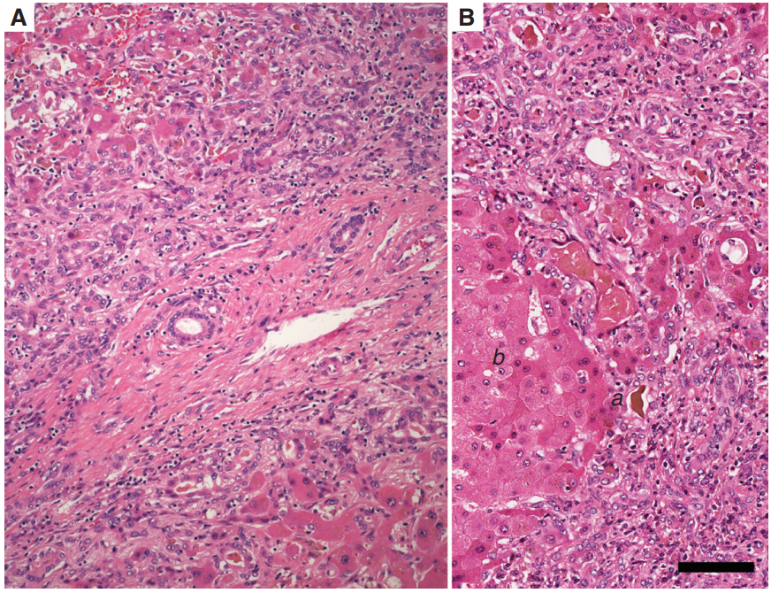
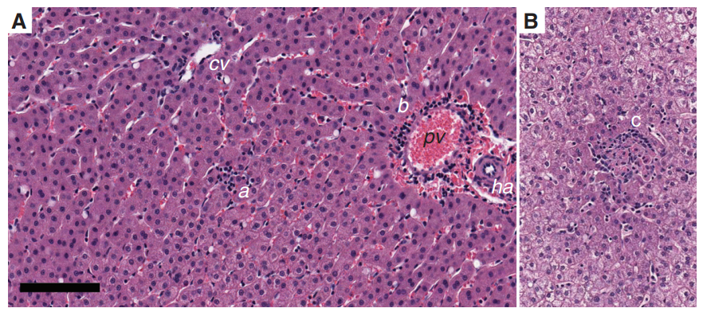
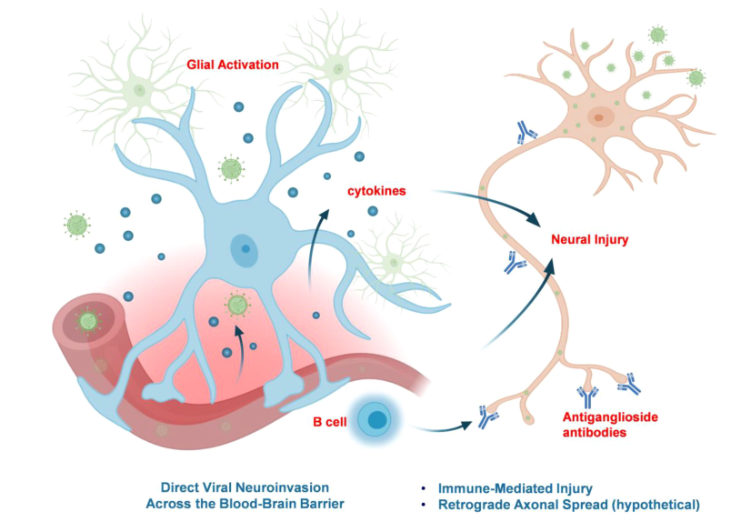

# 🔬 SINH LÝ BỆNH VIÊM GAN SIÊU VI E (HEV)

<PathoQuickNav />

<!-- DẢI CHỈ SỐ NHANH (QUICK STATS STRIP) -->
<section class="stats-strip">
  

    

      
CCBS-22

      
Mã cơ chế • Tiêu Hóa &amp; Thần Kinh

    

    

      
ssRNA (+) 7.2 kb

      
Hepeviridae • 3 ORFs • 8 Genotypes (One Health)

    

    

      
Tử Vong 25% Thai Kỳ

      
Suy gan cấp T3 • Hyper-reactive Th1/CTLs • DIC

    

    

      
Tổn Thương TK 30%

      
GBS • Teo cơ NA • Phá vỡ BBB • Viêm tủy cắt ngang

    

  

</section>

---

## 1. Cấu Trúc Hepeviridae & Dịch Tễ Học One Health {#sec-1}

Vi-rút viêm gan E (**Hepatitis E Virus - HEV**) thuộc phân họ *Orthohepevirinae*, họ *Hepeviridae*, loài *Paslahepevirus balayani*. HEV là nguyên nhân gây ra hơn 20 triệu ca nhiễm trùng và khoảng 70.000 ca tử vong mỗi năm trên thế giới.

### Cấu Trúc Bộ Gen & Trạng Thái Vỏ Bọc Kép Độc Đáo

- **Bộ gen:** Phân tử **RNA sợi đơn dương [ssRNA(+)]** dài khoảng 7,2 kb, đầu $5'$ có mũ cap và đầu $3'$ có đuôi polyadenylated. Bộ gen chứa **3 khung đọc mở (ORFs) gối chồng bán phần lên nhau**:
  - **ORF1 (5 kb):** Khung đọc lớn nhất, mã hóa polyprotein phi cấu trúc gồm các miền methyltransferase, papain-like cysteine protease, RNA helicase và RNA-dependent RNA polymerase (RdRP) chịu trách nhiệm sao chép virus.
  - **ORF2 (2 kb):** Mã hóa cho **protein vỏ capsid (ORF2p)** tạo nên cấu trúc hạt virus đối xứng 20 mặt.
  - **ORF3 (0.3 kb):** Mã hóa một phosphoprotein nhỏ (13 kDa) định vị màng, có vai trò bắt buộc trong việc nảy chồi và giải phóng hạt virion ra khỏi tế bào gan.
- **Trạng thái hạt kép (Quasi-enveloped HEV - eHEV):** Tương tự HAV, hạt HEV thải qua phân là **hạt trần không màng (non-enveloped)** chịu được acid dạ dày và muối mật. Trong khi đó, hạt HEV lưu hành trong máu được bao bọc bởi màng lipid xuất phát từ thể đa túi tế bào chủ (**quasi-enveloped eHEV**), giúp che giấu protein capsid ORF2 để trốn tránh kháng thể trung hòa dịch thể.

### Khung Phân Loại "Một Sức Khỏe" (One Health Framework)

  

    
<i class="fa-solid fa-route" style="color: var(--color-primary, #0284c7);"></i> SƠ ĐỒ LÂM SÀNG: HỌ HEPEVIRIDAE

    Pure Orthogonal SVG
  

  

    <svg class="flowchart-svg" viewBox="0 0 880 364" width="880" height="364" xmlns="http://www.w3.org/2000/svg">
      <defs>
        <marker id="arrBlue" viewBox="0 0 10 10" refX="6" refY="5" markerWidth="6" markerHeight="6" orient="auto-start-reverse">
          <path d="M 0 1.5 L 8 5 L 0 8.5 z" fill="#0284c7"/>
        </marker>
        <marker id="arrGreen" viewBox="0 0 10 10" refX="6" refY="5" markerWidth="6" markerHeight="6" orient="auto-start-reverse">
          <path d="M 0 1.5 L 8 5 L 0 8.5 z" fill="#059669"/>
        </marker>
        <marker id="arrAmber" viewBox="0 0 10 10" refX="6" refY="5" markerWidth="6" markerHeight="6" orient="auto-start-reverse">
          <path d="M 0 1.5 L 8 5 L 0 8.5 z" fill="#d97706"/>
        </marker>
        <marker id="arrRed" viewBox="0 0 10 10" refX="6" refY="5" markerWidth="6" markerHeight="6" orient="auto-start-reverse">
          <path d="M 0 1.5 L 8 5 L 0 8.5 z" fill="#dc2626"/>
        </marker>
      </defs>

      <!-- Left Column: HỌ HEPEVIRIDAE -->
      <rect x="40" y="20" width="390" height="90" rx="10" fill="var(--color-surface-2, #f8fafc)" stroke="var(--color-border, #cbd5e1)" stroke-width="1.5"/>
      <text x="235" y="42" text-anchor="middle" font-family="'Plus Jakarta Sans', sans-serif" font-weight="800" font-size="12" fill="var(--color-text, #0f172a)">HỌ HEPEVIRIDAE</text>
      <line x1="60" y1="56" x2="410" y2="56" stroke="var(--color-border, #cbd5e1)" stroke-width="1"/>
      <text x="60" y="72" text-anchor="start" font-family="'Plus Jakarta Sans', sans-serif" font-size="11" fill="var(--color-text-muted, #475569)">• ┌───────────────────</text>
      <!-- Right Column: LOÀI PASLAHEPEVIRUS BALAYANI -->
      <rect x="450" y="20" width="390" height="90" rx="10" fill="var(--color-surface-2, #f8fafc)" stroke="var(--color-border, #cbd5e1)" stroke-width="1.5"/>
      <text x="645" y="42" text-anchor="middle" font-family="'Plus Jakarta Sans', sans-serif" font-weight="800" font-size="12" fill="var(--color-text, #0f172a)">LOÀI PASLAHEPEVIRUS BALAYANI</text>
      <line x1="470" y1="56" x2="820" y2="56" stroke="var(--color-border, #cbd5e1)" stroke-width="1"/>
      <text x="470" y="72" text-anchor="start" font-family="'Plus Jakarta Sans', sans-serif" font-size="11" fill="var(--color-text-muted, #475569)">• ────┴───────────────────────┐</text>
      <!-- Bifurcation Path -->
      <path d="M 440 110 L 440 124 L 235 124 L 235 138" fill="none" stroke="var(--red, #ef4444)" stroke-width="1.8" marker-end="url(#arrRed)"/>
      <path d="M 440 124 L 645 124 L 645 138" fill="none" stroke="var(--amber, #f59e0b)" stroke-width="1.8" marker-end="url(#arrAmber)"/>
      <!-- Left Column: NHÓM GIỚI HẠN Ở NGƯỜI -->
      <rect x="40" y="138" width="390" height="188" rx="10" fill="var(--red-bg, #fef2f2)" stroke="var(--red, #ef4444)" stroke-width="1.5"/>
      <text x="235" y="160" text-anchor="middle" font-family="'Plus Jakarta Sans', sans-serif" font-weight="800" font-size="12" fill="var(--red, #dc2626)">NHÓM GIỚI HẠN Ở NGƯỜI</text>
      <line x1="60" y1="174" x2="410" y2="174" stroke="var(--color-border, #cbd5e1)" stroke-width="1"/>
      <text x="60" y="190" text-anchor="start" font-family="'Plus Jakarta Sans', sans-serif" font-size="11" fill="var(--color-text, #0f172a)">• ├── HEV-1 (Châu Á, Châu Phi)</text>
      <text x="60" y="208" text-anchor="start" font-family="'Plus Jakarta Sans', sans-serif" font-size="11" fill="var(--color-text, #0f172a)">• ├── HEV-2 (Mexico, Châu Phi)</text>
      <text x="60" y="226" text-anchor="start" font-family="'Plus Jakarta Sans', sans-serif" font-size="11" fill="var(--color-text, #0f172a)">• └── Lây qua nguồn nước ô nhiễm</text>
      <text x="60" y="244" text-anchor="start" font-family="'Plus Jakarta Sans', sans-serif" font-size="11" fill="var(--color-text, #0f172a)">• (Gây dịch lớn &amp; Tỷ lệ tử vong thai kỳ</text>
      <!-- Right Column: NHÓM LÂY TRUYỀN TỪ ĐỘNG VẬT (Z -->
      <rect x="450" y="138" width="390" height="188" rx="10" fill="var(--amber-bg, #fffbeb)" stroke="var(--amber, #f59e0b)" stroke-width="1.5"/>
      <text x="645" y="160" text-anchor="middle" font-family="'Plus Jakarta Sans', sans-serif" font-weight="800" font-size="12" fill="var(--amber, #d97706)">NHÓM LÂY TRUYỀN TỪ ĐỘNG VẬT</text>
      <text x="645" y="178" text-anchor="middle" font-family="'Plus Jakarta Sans', sans-serif" font-weight="800" font-size="12" fill="var(--amber, #d97706)">(ZOONOTIC)</text>
      <line x1="470" y1="192" x2="820" y2="192" stroke="var(--color-border, #cbd5e1)" stroke-width="1"/>
      <text x="470" y="208" text-anchor="start" font-family="'Plus Jakarta Sans', sans-serif" font-size="11" fill="var(--color-text, #0f172a)">• ├── HEV-3 &amp; HEV-4 (Lợn nhà, Lợn rừng,</text>
      <text x="470" y="226" text-anchor="start" font-family="'Plus Jakarta Sans', sans-serif" font-size="11" fill="var(--color-text, #0f172a)">• Nai)</text>
      <text x="470" y="244" text-anchor="start" font-family="'Plus Jakarta Sans', sans-serif" font-size="11" fill="var(--color-text, #0f172a)">• └── Gây ca tản phát &amp; Viêm gan mạn ở</text>
      <text x="470" y="262" text-anchor="start" font-family="'Plus Jakarta Sans', sans-serif" font-size="11" fill="var(--color-text, #0f172a)">• người suy giảm MD!</text>
      <text x="470" y="280" text-anchor="start" font-family="'Plus Jakarta Sans', sans-serif" font-size="11" fill="var(--color-text, #0f172a)">• ├── HEV-7 &amp; HEV-8 (Lạc đà một bướu)</text>
      <text x="470" y="298" text-anchor="start" font-family="'Plus Jakarta Sans', sans-serif" font-size="11" fill="var(--color-text, #0f172a)">• cao!)└── Rocahepevirus ratti (HEV-C1 -</text>
      <text x="470" y="316" text-anchor="start" font-family="'Plus Jakarta Sans', sans-serif" font-size="11" fill="var(--color-text, #0f172a)">• Chuột)</text>
    </svg>
  

1. **HEV-1 và HEV-2 (Giới hạn ở người):** Lây truyền qua **đường phân – miệng từ nguồn nước ô nhiễm**, gây ra các vụ dịch bùng phát khổng lồ tại các nước đang phát triển (Ấn Độ, Bangladesh, Châu Phi). Nhóm này có tỷ lệ biến chứng suy gan cấp và tử vong đặc biệt cao ở phụ nữ mang thai.
2. **HEV-3 và HEV-4 (Lây truyền từ động vật - Zoonotic):** Duy trì tự nhiên trong ổ chứa **lợn nhà, lợn rừng và nai**. Lây sang người qua đường tiêu thụ thịt/gan lợn chưa nấu chín kỹ hoặc tiếp xúc nghề nghiệp. Nhóm này chiếm ưu thế ở các nước phát triển (Châu Âu, Bắc Mỹ, Nhật Bản) và có khả năng **gây viêm gan mạn tính ở người suy giảm miễn dịch**.
3. **Rocahepevirus ratti (HEV-C1):** Chủng phân lập từ chuột cống, gần đây đã được xác nhận lây truyền sang người gây viêm gan cấp nặng và viêm màng não tử vong ở bệnh nhân ghép tạng.

---

## 2. Mô Bệnh Học Gan Độc Đáo & Thể Mạn Tính Ở Người Ghép Tạng {#sec-2}

### Bản Chất Không Độc Tế Bào & Động Học Lây Nhiễm

- **Thời gian ủ bệnh:** Dao động từ **15 đến 75 ngày (trung bình 36 ngày)**.
- **Động học:** Sự thải virus qua phân (*fecal shedding*) và nồng độ RNA virus trong máu (*viremia*) đạt đỉnh đồng thời vào cuối thời gian ủ bệnh, trước khi xuất hiện triệu chứng lâm sàng.
- **Bản chất tổn thương:** HEV là vi-rút **hoàn toàn không trực tiếp gây độc tế bào gan (non-cytopathic)**. Tình trạng hoại tử tế bào gan và bùng phát men gan ALT là do phản ứng miễn dịch tế bào của vật chủ (CD8+ CTLs và tế bào NK) tấn công tiêu diệt tế bào gan nhiễm.

### 4 Dấu Ấn Mô Bệnh Học Độc Đáo Của Viêm Gan E

1. **Thâm nhiễm Bạch cầu trung tính (Neutrophils) — Điểm chốt phân biệt:** Khác biệt hoàn toàn với HAV, HBV, HCV (chỉ có ưu thế lympho bào), trong các ổ viêm nhu mô và khoảng cửa của gan nhiễm HEV luôn ghi nhận một lượng đáng kể **bạch cầu trung tính**.
2. **Ứ mật tiểu thùy & Tuyến giả (Pseudoglandular Cholestasis):** Các nút mật (*bile plugs*) bít kín lòng vi quản mật bị giãn rộng vùng trung tâm tiểu thùy gan, các tế bào gan xung quanh sắp xếp thành cấu trúc **hình tuyến giả (pseudoglandular rosettes)** vây quanh hồ mật nhỏ (*bile lake*).
3. **Phản ứng ống mật (Ductular Reaction) dữ dội:** Ở các ca bệnh nặng hoặc tối cấp, sự hoại tử diện rộng nhu mô kích phát các tế bào tiền thân quanh khoảng cửa tăng sinh tạo thành vô số các ống mật nhỏ phân nhánh.
4. **Viêm gan mạn tính ở người suy giảm miễn dịch (Chronic Hepatitis E):**
   - Được định nghĩa khi HEV RNA tồn tại liên tục trong máu hoặc phân $> 6\text{ tháng}$.
   - Hầu như chỉ xảy ra với **HEV Genotype 3** trên các đối tượng: bệnh nhân ghép tạng đặc (ghép thận, gan, tim) đang dùng thuốc ức chế miễn dịch (Tacrolimus, Cyclosporine), bệnh nhân ung thư máu hoặc nhiễm HIV/AIDS có $CD4 &lt; 200\text{ cells/}\mu\text{L}$.
   - Trên sinh thiết gan: Viêm gan hoại tử hoạt động liên tục, hoại tử mảnh, và hình thành dải xơ cầu nối tiến triển thần tốc thành **Xơ gan (Cirrhosis) chỉ trong vòng 2 – 3 năm** nếu không được can thiệp điều trị.

<figure class="physio-figure" style="display: flex; flex-direction: column; align-items: center; justify-content: center; text-align: center; margin: 1.75rem auto;">
  
  <figcaption style="margin-top: 0.75rem; font-size: 0.88rem; color: var(--color-text-muted, #64748b); font-style: italic; text-align: center; max-width: 800px;">
    <strong>Hình 1 (Figure 6): Mô Bệnh Học Gan Người Nhiễm HEV Cấp Nặng.</strong> (A) Phản ứng ống mật (Ductular reaction) dữ dội quanh khoảng cửa với sự tăng sinh các tiểu quản mật lót bởi biểu mô ưa kiềm nhạt thâm nhập nhu mô gan bị lộn xộn; các nút mật đặc nổi bật trong vi quản mật giãn. (B) Phóng đại lớn thể hiện ứ mật nghiêm trọng tạo hồ mật (Bile lake) và các tế bào gan bị không bào hóa nhẹ. Nguồn: Cullen &amp; Lemon (Cold Spring Harb Perspect Med, 2019).
  </figcaption>
</figure>

<figure class="physio-figure" style="display: flex; flex-direction: column; align-items: center; justify-content: center; text-align: center; margin: 1.75rem auto;">
  
  <figcaption style="margin-top: 0.75rem; font-size: 0.88rem; color: var(--color-text-muted, #64748b); font-style: italic; text-align: center; max-width: 800px;">
    <strong>Hình 2 (Figure 7): Tiêu Bản Gan Khỉ Rhesus Nhiễm HEV Thực Nghiệm.</strong> (A) Cấu trúc tiểu thùy cơ bản được bảo tồn, ghi nhận các ổ thâm nhiễm lympho rải rác nhu mô (a) và viêm nhẹ khoảng cửa (b). (B) Phóng đại lớn một ổ thâm nhiễm lympho bào nhu mô vây quanh và tiêu diệt trực tiếp các tế bào gan hoại tử. Nguồn: Cullen &amp; Lemon (2019).
  </figcaption>
</figure>

---

## 3. Cơ Chế Bão Miễn Dịch Gây Tử Vong Cao Ở Thai Phụ {#sec-3}

Đặc tính lâm sàng nguy hiểm và bi kịch nhất của viêm gan E là tỷ lệ tử vong cực cao ở **phụ nữ mang thai, đặc biệt trong tam cá nguyệt thứ ba (Tam cá nguyệt 3)**:

  

    
<i class="fa-solid fa-route" style="color: var(--color-primary, #0284c7);"></i> SƠ ĐỒ LÂM SÀNG: PHỤ NỮ MANG THAI NHIỄM HEV GENOTYPE 1 (Tam cá nguyệt 3)

    Pure Orthogonal SVG
  

  

    <svg class="flowchart-svg" viewBox="0 0 880 624" width="880" height="624" xmlns="http://www.w3.org/2000/svg">
      <defs>
        <marker id="arrBlue" viewBox="0 0 10 10" refX="6" refY="5" markerWidth="6" markerHeight="6" orient="auto-start-reverse">
          <path d="M 0 1.5 L 8 5 L 0 8.5 z" fill="#0284c7"/>
        </marker>
        <marker id="arrGreen" viewBox="0 0 10 10" refX="6" refY="5" markerWidth="6" markerHeight="6" orient="auto-start-reverse">
          <path d="M 0 1.5 L 8 5 L 0 8.5 z" fill="#059669"/>
        </marker>
        <marker id="arrAmber" viewBox="0 0 10 10" refX="6" refY="5" markerWidth="6" markerHeight="6" orient="auto-start-reverse">
          <path d="M 0 1.5 L 8 5 L 0 8.5 z" fill="#d97706"/>
        </marker>
        <marker id="arrRed" viewBox="0 0 10 10" refX="6" refY="5" markerWidth="6" markerHeight="6" orient="auto-start-reverse">
          <path d="M 0 1.5 L 8 5 L 0 8.5 z" fill="#dc2626"/>
        </marker>
      </defs>

      <!-- Single Node: PHỤ NỮ MANG THAI NHIỄM HEV GEN -->
      <rect x="145" y="20" width="590" height="46" rx="10" fill="var(--color-surface-2, #f8fafc)" stroke="var(--color-border, #cbd5e1)" stroke-width="1.8"/>
      <text x="440" y="42" text-anchor="middle" font-family="'Plus Jakarta Sans', sans-serif" font-weight="800" font-size="12" fill="var(--color-text, #0f172a)">PHỤ NỮ MANG THAI NHIỄM HEV GENOTYPE 1 (Tam cá nguyệt 3)</text>
      <line x1="440" y1="66" x2="440" y2="94" stroke="#0284c7" stroke-width="1.8" marker-end="url(#arrBlue)"/>
      <!-- Single Node: MÔI TRƯỜNG NỘI TIẾT THAI KỲ -->
      <rect x="169.25" y="94" width="541.5" height="78" rx="10" fill="var(--amber-bg, #fffbeb)" stroke="var(--amber, #f59e0b)" stroke-width="1.8"/>
      <text x="440" y="116" text-anchor="middle" font-family="'Plus Jakarta Sans', sans-serif" font-weight="800" font-size="12" fill="var(--amber, #d97706)">MÔI TRƯỜNG NỘI TIẾT THAI KỲ</text>
      <text x="193.25" y="138" text-anchor="start" font-family="'Plus Jakarta Sans', sans-serif" font-size="11" fill="var(--color-text, #0f172a)">• (Estrogen &amp; Progesterone tăng cao ➔ Ức chế Th1, chuyển dịch</text>
      <text x="193.25" y="156" text-anchor="start" font-family="'Plus Jakarta Sans', sans-serif" font-size="11" fill="var(--color-text, #0f172a)">• Th2)</text>
      <line x1="440" y1="172" x2="440" y2="200" stroke="#0284c7" stroke-width="1.8" marker-end="url(#arrBlue)"/>
      <!-- Single Node: SUY GIẢM MIỄN DỊCH TẾ BÀO TẠM  -->
      <rect x="203.25" y="200" width="473.5" height="60" rx="10" fill="var(--amber-bg, #fffbeb)" stroke="var(--amber, #f59e0b)" stroke-width="1.8"/>
      <text x="440" y="222" text-anchor="middle" font-family="'Plus Jakarta Sans', sans-serif" font-weight="800" font-size="12" fill="var(--amber, #d97706)">SUY GIẢM MIỄN DỊCH TẾ BÀO TẠM THỜI</text>
      <text x="227.25" y="244" text-anchor="start" font-family="'Plus Jakarta Sans', sans-serif" font-size="11" fill="var(--color-text, #0f172a)">• (HEV nhân lên ồ ạt với tải lượng cực cao trong gan)</text>
      <line x1="440" y1="260" x2="440" y2="288" stroke="#0284c7" stroke-width="1.8" marker-end="url(#arrBlue)"/>
      <!-- Single Node: HỆ MIỄN DỊCH KHỞI ĐỘNG ĐÁP ỨNG -->
      <rect x="190" y="288" width="500" height="46" rx="10" fill="var(--color-surface-2, #f8fafc)" stroke="var(--color-border, #cbd5e1)" stroke-width="1.8"/>
      <text x="440" y="310" text-anchor="middle" font-family="'Plus Jakarta Sans', sans-serif" font-weight="800" font-size="12" fill="var(--color-text, #0f172a)">HỆ MIỄN DỊCH KHỞI ĐỘNG ĐÁP ỨNG TH1 / CTLs MUỘN</text>
      <line x1="440" y1="334" x2="440" y2="362" stroke="#0284c7" stroke-width="1.8" marker-end="url(#arrBlue)"/>
      <!-- Single Node: BÃO PHẢN ỨNG VIÊM SIÊU HỦY HOẠ -->
      <rect x="150" y="362" width="580" height="150" rx="10" fill="var(--red-bg, #fef2f2)" stroke="var(--red, #ef4444)" stroke-width="1.8"/>
      <text x="440" y="384" text-anchor="middle" font-family="'Plus Jakarta Sans', sans-serif" font-weight="800" font-size="12" fill="var(--red, #dc2626)">BÃO PHẢN ỨNG VIÊM SIÊU HỦY HOẠI (Hyper-reactive Immune</text>
      <text x="440" y="402" text-anchor="middle" font-family="'Plus Jakarta Sans', sans-serif" font-weight="600" font-size="12" fill="var(--red, #dc2626)">Response)</text>
      <text x="174" y="424" text-anchor="start" font-family="'Plus Jakarta Sans', sans-serif" font-size="11" fill="var(--color-text, #0f172a)">• ├── Hoại tử diện rộng toàn bộ nhu mô gan (Massive Hepatic</text>
      <text x="174" y="442" text-anchor="start" font-family="'Plus Jakarta Sans', sans-serif" font-size="11" fill="var(--color-text, #0f172a)">• Necrosis)</text>
      <text x="174" y="460" text-anchor="start" font-family="'Plus Jakarta Sans', sans-serif" font-size="11" fill="var(--color-text, #0f172a)">• ├── Giải phóng bão cytokine (TNF-α, IFN-γ, IL-6)</text>
      <text x="174" y="478" text-anchor="start" font-family="'Plus Jakarta Sans', sans-serif" font-size="11" fill="var(--color-text, #0f172a)">• ├── Suy gan cấp tối cấp (Acute Liver Failure - ALF) &amp; Bệnh</text>
      <text x="174" y="496" text-anchor="start" font-family="'Plus Jakarta Sans', sans-serif" font-size="11" fill="var(--color-text, #0f172a)">• não gan</text>
      <line x1="440" y1="512" x2="440" y2="540" stroke="#0284c7" stroke-width="1.8" marker-end="url(#arrBlue)"/>
      <!-- Single Node: TỶ LỆ TỬ VONG SẢN PHỤ LÊN TỚI  -->
      <rect x="145" y="540" width="590" height="46" rx="10" fill="var(--red-bg, #fef2f2)" stroke="var(--red, #ef4444)" stroke-width="1.8"/>
      <text x="440" y="562" text-anchor="middle" font-family="'Plus Jakarta Sans', sans-serif" font-weight="800" font-size="12" fill="var(--red, #dc2626)">TỶ LỆ TỬ VONG SẢN PHỤ LÊN TỚI 15% - 25% (Đỉnh điểm 31%)</text>
    </svg>
  

- **Gánh nặng tử vong:** Trong các vụ dịch do HEV-1, tỷ lệ tử vong ở phụ nữ mang thai dao động từ **15% đến 25%**, thậm chí lên tới **31,1%** ở các trại tị nạn.
- **Cơ chế miễn dịch — nội tiết học:**
  - Nồng độ cao Estrogen và Progesterone trong tam cá nguyệt 3 ức chế miễn dịch qua trung gian tế bào Th1 để dung nạp thai nhi, làm giảm khả năng khống chế virus, cho phép HEV nhân lên với tải lượng khổng lồ.
  - Khi cơ thể cố gắng dọn sạch lượng kháng nguyên khổng lồ này, nó kích phát một **phản ứng miễn dịch tế bào T siêu hủy hoại (Hyper-reactive immune response)**, gây hoại tử toàn bộ nhu mô gan, dẫn đến suy gan cấp, bệnh não gan và tử vong.
- **Biến chứng sản khoa &amp; Lây truyền dọc (Vertical Transmission):** Tỷ lệ lây truyền mẹ–con đạt **50% – 100%** ở sản phụ có HEV-RNA dương tính, gây sẩy thai, sinh non, thai chết lưu và tử vong sơ sinh trong 48 giờ sau sinh do suy gan cấp sơ sinh.

---

## 4. Sinh Lý Bệnh Hướng Thần Kinh & Biểu Hiện Ngoài Gan {#sec-4}

Biến chứng ngoài gan phổ biến nhất của HEV là **tổn thương hệ thần kinh (HEV-associated Neurological Injury)**, xảy ra ở **5% đến 30%** bệnh nhân.

### Sự Phân Ly Lâm Sàng Độc Đáo (Clinical Dissociation)

Các hội chứng thần kinh liên quan đến HEV thường xuất hiện ở những bệnh nhân **hoàn toàn không có vàng da (anicteric)** và có men gan bình thường hoặc chỉ tăng nhẹ, dẫn tới tỷ lệ bỏ sót chẩn đoán rất cao nếu không nghĩ đến HEV.

### 2 Con Đường Sinh Bệnh Học Thần Kinh Song Song

  

    
<i class="fa-solid fa-route" style="color: var(--color-primary, #0284c7);"></i> SƠ ĐỒ LÂM SÀNG: NHIỄM TRÙNG HEV TRONG CƠ THỂ

    Pure Orthogonal SVG
  

  

    <svg class="flowchart-svg" viewBox="0 0 880 410" width="880" height="410" xmlns="http://www.w3.org/2000/svg">
      <defs>
        <marker id="arrBlue" viewBox="0 0 10 10" refX="6" refY="5" markerWidth="6" markerHeight="6" orient="auto-start-reverse">
          <path d="M 0 1.5 L 8 5 L 0 8.5 z" fill="#0284c7"/>
        </marker>
        <marker id="arrGreen" viewBox="0 0 10 10" refX="6" refY="5" markerWidth="6" markerHeight="6" orient="auto-start-reverse">
          <path d="M 0 1.5 L 8 5 L 0 8.5 z" fill="#059669"/>
        </marker>
        <marker id="arrAmber" viewBox="0 0 10 10" refX="6" refY="5" markerWidth="6" markerHeight="6" orient="auto-start-reverse">
          <path d="M 0 1.5 L 8 5 L 0 8.5 z" fill="#d97706"/>
        </marker>
        <marker id="arrRed" viewBox="0 0 10 10" refX="6" refY="5" markerWidth="6" markerHeight="6" orient="auto-start-reverse">
          <path d="M 0 1.5 L 8 5 L 0 8.5 z" fill="#dc2626"/>
        </marker>
      </defs>

      <!-- Single Node: NHIỄM TRÙNG HEV TRONG CƠ THỂ -->
      <rect x="250" y="20" width="380" height="46" rx="10" fill="var(--color-surface-2, #f8fafc)" stroke="var(--color-border, #cbd5e1)" stroke-width="1.8"/>
      <text x="440" y="42" text-anchor="middle" font-family="'Plus Jakarta Sans', sans-serif" font-weight="800" font-size="12" fill="var(--color-text, #0f172a)">NHIỄM TRÙNG HEV TRONG CƠ THỂ</text>
      <!-- Bifurcation Path -->
      <path d="M 440 66 L 440 80 L 235 80 L 235 94" fill="none" stroke="var(--amber, #f59e0b)" stroke-width="1.8" marker-end="url(#arrAmber)"/>
      <path d="M 440 80 L 645 80 L 645 94" fill="none" stroke="var(--red, #ef4444)" stroke-width="1.8" marker-end="url(#arrRed)"/>
      <!-- Left Column: CON ĐƯỜNG 1: XÂM NHẬP TRỰC TIẾ -->
      <rect x="40" y="94" width="390" height="278" rx="10" fill="var(--amber-bg, #fffbeb)" stroke="var(--amber, #f59e0b)" stroke-width="1.5"/>
      <text x="235" y="116" text-anchor="middle" font-family="'Plus Jakarta Sans', sans-serif" font-weight="800" font-size="12" fill="var(--amber, #d97706)">CON ĐƯỜNG 1: XÂM NHẬP TRỰC TIẾP</text>
      <text x="235" y="134" text-anchor="middle" font-family="'Plus Jakarta Sans', sans-serif" font-weight="800" font-size="12" fill="var(--amber, #d97706)">QUA BBB</text>
      <line x1="60" y1="148" x2="410" y2="148" stroke="var(--color-border, #cbd5e1)" stroke-width="1"/>
      <text x="60" y="164" text-anchor="start" font-family="'Plus Jakarta Sans', sans-serif" font-size="11" fill="var(--color-text, #0f172a)">• ├── Tấn công nội mạc vi mạch não</text>
      <text x="60" y="182" text-anchor="start" font-family="'Plus Jakarta Sans', sans-serif" font-size="11" fill="var(--color-text, #0f172a)">• ├── Ức chế protein liên kết chặt ZO-1,</text>
      <text x="60" y="200" text-anchor="start" font-family="'Plus Jakarta Sans', sans-serif" font-size="11" fill="var(--color-text, #0f172a)">• Occludin, Claudin-5 ➔ Thủng BBB!</text>
      <text x="60" y="218" text-anchor="start" font-family="'Plus Jakarta Sans', sans-serif" font-size="11" fill="var(--color-text, #0f172a)">• ├── Virus vào dịch não tủy (CSF</text>
      <text x="60" y="236" text-anchor="start" font-family="'Plus Jakarta Sans', sans-serif" font-size="11" fill="var(--color-text, #0f172a)">• quasispecie</text>
      <text x="60" y="254" text-anchor="start" font-family="'Plus Jakarta Sans', sans-serif" font-size="11" fill="var(--color-text, #0f172a)">• ├── Nhiễm trực tiếp Neurons</text>
      <text x="60" y="272" text-anchor="start" font-family="'Plus Jakarta Sans', sans-serif" font-size="11" fill="var(--color-text, #0f172a)">• Glutamatergic</text>
      <text x="60" y="290" text-anchor="start" font-family="'Plus Jakarta Sans', sans-serif" font-size="11" fill="var(--color-text, #0f172a)">• └── Gây Viêm Não, Viêm Màng Não, Viêm</text>
      <text x="60" y="308" text-anchor="start" font-family="'Plus Jakarta Sans', sans-serif" font-size="11" fill="var(--color-text, #0f172a)">• Tủy Cắt Ngan</text>
      <!-- Right Column: CON ĐƯỜNG 2: TỰ MIỄN DỊCH QUA  -->
      <rect x="450" y="94" width="390" height="278" rx="10" fill="var(--red-bg, #fef2f2)" stroke="var(--red, #ef4444)" stroke-width="1.5"/>
      <text x="645" y="116" text-anchor="middle" font-family="'Plus Jakarta Sans', sans-serif" font-weight="800" font-size="12" fill="var(--red, #dc2626)">CON ĐƯỜNG 2: TỰ MIỄN DỊCH QUA</text>
      <text x="645" y="134" text-anchor="middle" font-family="'Plus Jakarta Sans', sans-serif" font-weight="800" font-size="12" fill="var(--red, #dc2626)">TRUNG GIAN KHÁNG THỂ</text>
      <line x1="470" y1="148" x2="820" y2="148" stroke="var(--color-border, #cbd5e1)" stroke-width="1"/>
      <text x="470" y="164" text-anchor="start" font-family="'Plus Jakarta Sans', sans-serif" font-size="11" fill="var(--color-text, #0f172a)">• ├── Hiện tượng bắt chước phân tử</text>
      <text x="470" y="182" text-anchor="start" font-family="'Plus Jakarta Sans', sans-serif" font-size="11" fill="var(--color-text, #0f172a)">• (Molecular Mimicry)</text>
      <text x="470" y="200" text-anchor="start" font-family="'Plus Jakarta Sans', sans-serif" font-size="11" fill="var(--color-text, #0f172a)">• ├── Tạo tự kháng thể kháng Ganglioside</text>
      <text x="470" y="218" text-anchor="start" font-family="'Plus Jakarta Sans', sans-serif" font-size="11" fill="var(--color-text, #0f172a)">• (Anti-GM1/GM2)</text>
      <text x="470" y="236" text-anchor="start" font-family="'Plus Jakarta Sans', sans-serif" font-size="11" fill="var(--color-text, #0f172a)">• └── Phá hủy bao Myelin sợi thần kinh</text>
      <text x="470" y="254" text-anchor="start" font-family="'Plus Jakarta Sans', sans-serif" font-size="11" fill="var(--color-text, #0f172a)">• ngoại vi</text>
      <text x="470" y="272" text-anchor="start" font-family="'Plus Jakarta Sans', sans-serif" font-size="11" fill="var(--color-text, #0f172a)">• s) └── Protein capsid ORF2 tự do lưu</text>
      <text x="470" y="290" text-anchor="start" font-family="'Plus Jakarta Sans', sans-serif" font-size="11" fill="var(--color-text, #0f172a)">• hành</text>
      <text x="470" y="308" text-anchor="start" font-family="'Plus Jakarta Sans', sans-serif" font-size="11" fill="var(--color-text, #0f172a)">• tạo phức hợp miễn dịch lắng đọng gây</text>
      <text x="470" y="326" text-anchor="start" font-family="'Plus Jakarta Sans', sans-serif" font-size="11" fill="var(--color-text, #0f172a)">• viêm mạch</text>
      <text x="470" y="344" text-anchor="start" font-family="'Plus Jakarta Sans', sans-serif" font-size="11" fill="var(--color-text, #0f172a)">• g!└── Gây Hội Chứng Guillain-Barré</text>
      <text x="470" y="362" text-anchor="start" font-family="'Plus Jakarta Sans', sans-serif" font-size="11" fill="var(--color-text, #0f172a)">• (GBS) &amp; Teo Cơ NA!</text>
    </svg>
  

1. **Con đường Xâm nhập trực tiếp &amp; Phá vỡ hàng rào máu não (BBB):** HEV tấn công tế bào nội mạc vi mạch não, **ức chế biểu hiện các protein liên kết chặt (ZO-1, Occludin, Claudin-5)** làm thủng hàng rào máu não. Virus xâm nhập dịch não tủy, nhân lên độc lập (*compartmentalized CNS replication*) bên trong các **neuron tiết glutamate và dopamine**, gây co ngắn sợi trục thần kinh, hoạt hóa vi đệm và gây **Viêm não, Viêm màng não, Viêm tủy cắt ngang (Acute Transverse Myelitis)**.
2. **Con đường Tự miễn dịch &amp; Bắt chước phân tử (Molecular Mimicry):** Kích hoạt tế bào B sản sinh tự kháng thể **kháng Ganglioside (Anti-GM1 và Anti-GM2)** tấn công bao myelin sợi thần kinh ngoại biên, gây ra **Hội chứng Guillain-Barré (GBS)** và **Teo cơ đau dây thần kinh (Neuralgic Amyotrophy - NA / Hội chứng Parsonage-Turner)**. Đồng thời, lượng lớn protein capsid ORF2 tự do không mang gen (*genome-free ORF2*) tạo phức hợp miễn dịch lưu hành gây **Viêm cầu thận màng (Glomerulonephritis)** và **Xuất huyết giảm tiểu cầu huyết khối (TTP)**.

<figure class="physio-figure" style="display: flex; flex-direction: column; align-items: center; justify-content: center; text-align: center; margin: 1.75rem auto;">
  
  <figcaption style="margin-top: 0.75rem; font-size: 0.88rem; color: var(--color-text-muted, #64748b); font-style: italic; text-align: center; max-width: 800px;">
    <strong>Hình 3 (Figure 3 | HEV-associated Neuropathogenesis): Cơ Chế Tổn Thương Thần Kinh Do HEV.</strong> Nhánh trái: Xâm nhập trực tiếp qua BBB thông qua giảm điều hòa ZO-1/Occludin/Claudin-5, nhân lên trong neuron và tế bào đệm. Nhánh phải: Cơ chế tự miễn dịch tạo kháng thể kháng Ganglioside (anti-GM1/GM2) gây GBS và hội chứng teo cơ NA. Nguồn: Guo et al. (Front Cell Infect Microbiol, 2026).
  </figcaption>
</figure>

---

## 5. Chẩn Đoán Huyết Thanh, Phác Đồ EBM & Vắc-Xin {#sec-5}

### Bilan Chẩn Đoán Huyết Thanh & Sinh Học Phân Tử

- **Nhiễm HEV Cấp tính:** Chẩn đoán xác định dựa vào **IgM anti-HEV (+)** trong huyết thanh và/hoặc phát hiện **HEV RNA (+)** bằng kỹ thuật RT-PCR trong máu hoặc phân.
- **Nhiễm HEV Mạn tính ở người suy giảm miễn dịch:** Kháng thể IgM và IgG anti-HEV thường âm tính giả do suy giảm miễn dịch; do đó **bắt buộc phải xét nghiệm HEV RNA định lượng bằng RT-PCR** để chẩn đoán xác định và theo dõi điều trị.

### Phác Đồ Điều Trị Dược Lý EBM

1. **Viêm gan E cấp tính:** Phần lớn tự giới hạn, chỉ cần điều trị hỗ trợ. Tuy nhiên, ở phụ nữ mang thai bị suy gan cấp hoặc bệnh nhân viêm gan cấp nặng, cần chuyển ngay đến đơn vị hồi sức tích cực (ICU) và cân nhắc lọc máu/thay huyết tương hoặc ghép gan khẩn cấp.
2. **Viêm gan E mạn tính ở bệnh nhân ghép tạng (Khuyến cáo EASL):**
   - **Bước 1 — Giảm liều thuốc ức chế miễn dịch:** Giảm liều các thuốc ức chế Calcineurin (Tacrolimus, Cyclosporine) giúp khoảng 30% bệnh nhân tự thanh thải được virus.
   - **Bước 2 — Đơn trị liệu Ribavirin:** Nếu HEV RNA vẫn dương tính sau khi giảm ức chế miễn dịch, chỉ định **Ribavirin uống (liều 600 – 1.000 mg/ngày)** kéo dài trong **3 tháng**. Tỷ lệ đạt đáp ứng virus bền vững (SVR) đạt trên 85% – 90%.
   - **Chống chỉ định tuyệt đối:** Ribavirin chống chỉ định tuyệt đối ở phụ nữ mang thai do nguy cơ gây quái thai (*teratogenicity*).

### Vắc-Xin Phòng Ngừa HEV

- **Vắc-xin Hecolin (Xiamen Innovax, Trung Quốc):** Là vắc-xin tái tổ hợp chứa protein vỏ capsid ORF2 của HEV genotype 1. Thử nghiệm lâm sàng pha III trên &gt;100.000 người chứng minh hiệu quả bảo vệ đạt **100% đối với viêm gan E có triệu chứng** và duy trì hiệu quả bảo vệ cao trên 4,5 năm. Vắc-xin đã được cấp phép tại Trung Quốc và Pakistan, đặc biệt có giá trị trong việc kiểm soát các ổ dịch bùng phát tại các vùng lưu hành cao.

---

## 6. Tài Liệu Tham Khảo Y Văn AMA {#sec-6}

  <h3 style="color: var(--color-primary, #0284c7); font-size: 1.1rem; font-weight: 800; margin-bottom: 1rem; display: flex; align-items: center; gap: 8px;">
    <i class="fa-solid fa-book-bookmark"></i> Danh Mục Tài Liệu Tham Khảo Quốc Tế Chuẩn AMA
  </h3>
  <ol style="margin: 0; padding-left: 1.25rem; line-height: 1.8; color: var(--color-text, #334155); font-size: 0.88rem;">
    <li>Cullen JM, Lemon SM. Comparative Pathology of Hepatitis A Virus and Hepatitis E Virus Infection. <em>Cold Spring Harb Perspect Med</em>. 2019;9(9):a033456. doi:10.1101/cshperspect.a033456</li>
    <li>Guo Z, Tian Y, Cheng M, et al. Hepatitis E virus-associated neurological injury and neurotropic cellular mechanisms. <em>Front Cell Infect Microbiol</em>. 2026;16:1810452. doi:10.3389/fcimb.2026.1810452</li>
    <li>Kamar N, Izopet J, Pavio N, et al. Hepatitis E virus infection. <em>Nat Rev Dis Primers</em>. 2017;3:17086. doi:10.1038/nrdp.2017.86</li>
    <li>European Association for the Study of the Liver. EASL Clinical Practice Guidelines on hepatitis E virus infection. <em>J Hepatol</em>. 2018;68(6):1252-1271. doi:10.1016/j.jhep.2018.03.005</li>
    <li>World Health Organization. <em>Waterborne Outbreaks of Hepatitis E: Recognition, Investigation and Control</em>. Geneva: World Health Organization; 2014.</li>
    <li>Patterson J, Maria N, Cheng V, et al. Aetiology and burden of viral-induced acute liver failure: a systematic review. <em>BMJ Open</em>. 2020;10(9):e037473. doi:10.1136/bmjopen-2020-037473</li>
  </ol>

<!-- HÀNG NÚT ĐIỀU HƯỚNG SPA -->

  <a href="#/basic-medical/co-che-benh-sinh" class="btn btn-primary" style="display: inline-flex; align-items: center; gap: 8px; padding: 0.6rem 1.2rem; border-radius: 8px; font-weight: 700;">
    <i class="fa-solid fa-arrow-left"></i> Quay lại Mục Lục Cơ Chế Bệnh Sinh
  </a>
  <a href="#sec-1" class="btn btn-outline" style="display: inline-flex; align-items: center; gap: 8px; padding: 0.6rem 1.2rem; border-radius: 8px; font-weight: 700;">
    <i class="fa-solid fa-arrow-up"></i> Lên đầu trang
  </a>

