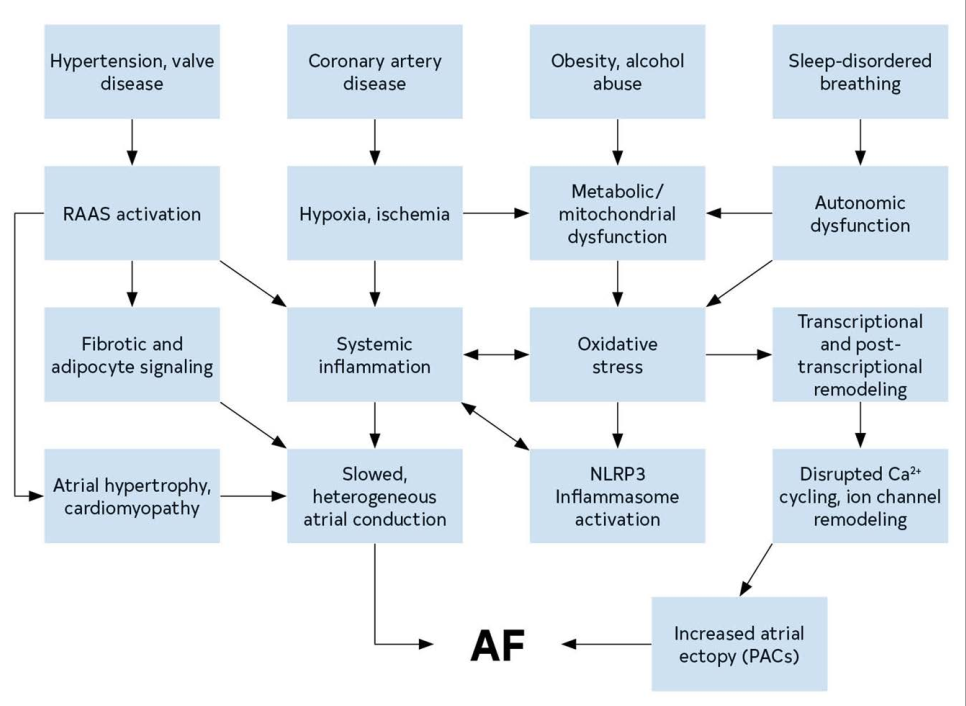
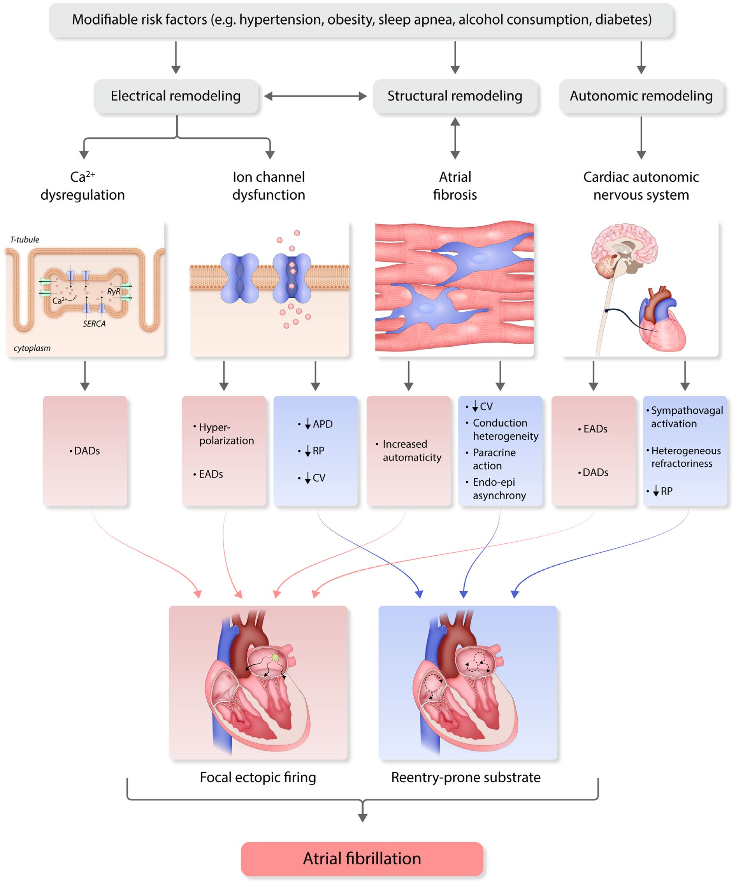
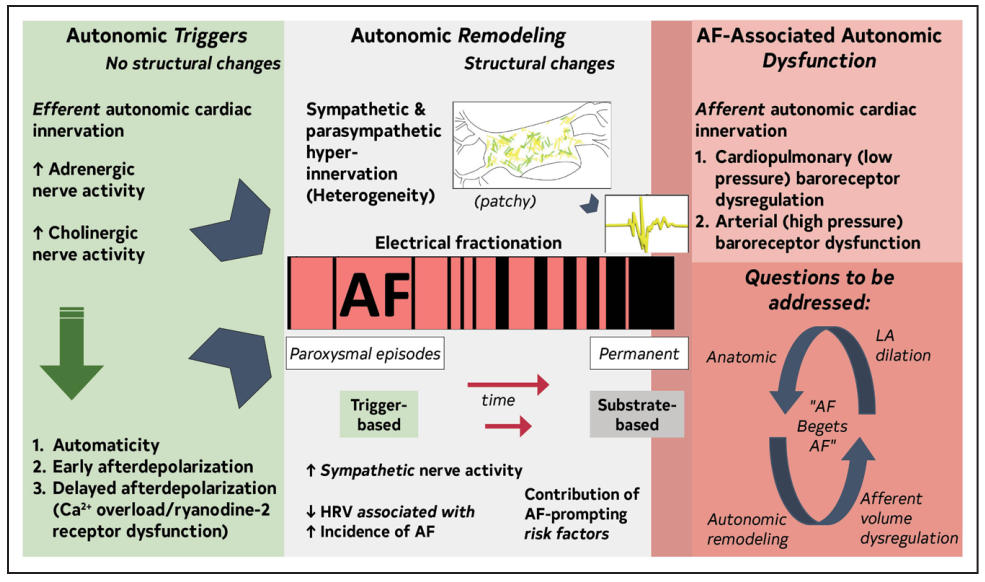

# 🔬 SINH LÝ BỆNH & CƠ CHẾ BỆNH SINH RUNG NHĨ (ATRIAL FIBRILLATION)

<PathoQuickNav />

{/* DẢI CHỈ SỐ NHANH (QUICK STATS STRIP) */}
<section class="stats-strip">
  

    

      
300 - 500 bpm

      
Tần số khử cực điện học tâm nhĩ hỗn loạn (Sóng f)

    

    

      
λ = ERP × CV

      
Bước sóng dẫn truyền quyết định kích thước vòng vào lại

    

    

      
30% - 50%

      
Tỷ lệ mới mắc POAF sau phẫu thuật tim mạch mở

    

    

      
17% vs 32%

      
Giảm POAF ngoạn mục nhờ Mở màng tim sau PLP (PALACS)

    

  

</section>

---

## 1. Định Nghĩa, Tiêu Chuẩn Điện Tâm Đồ & Phân Loại Lâm Sàng
**Rung nhĩ (Atrial Fibrillation - AF)** là tình trạng rối loạn nhịp tim nhanh trên thất phổ biến nhất trên lâm sàng, đặc trưng bởi sự kích hoạt điện học tâm nhĩ hỗn loạn, nhanh vô tổ chức dẫn đến suy giảm hoặc mất hoàn toàn chức năng co bóp cơ học hiệu quả của cơ tâm nhĩ.

  

    
<i class="fa-solid fa-route" style="color: var(--color-primary, #0284c7);"></i> SƠ ĐỒ LÂM SÀNG: ĐẶC TRƯNG SINH LÝ BỆNH RUNG NHĨ

    Pure Orthogonal SVG
  

  

    <svg class="flowchart-svg" viewBox="0 0 880 222" width="880" height="222" xmlns="http://www.w3.org/2000/svg">
      <defs>
        <marker id="arrBlue" viewBox="0 0 10 10" refX="6" refY="5" markerWidth="6" markerHeight="6" orient="auto-start-reverse">
          <path d="M 0 1.5 L 8 5 L 0 8.5 z" fill="#0284c7"/>
        </marker>
        <marker id="arrGreen" viewBox="0 0 10 10" refX="6" refY="5" markerWidth="6" markerHeight="6" orient="auto-start-reverse">
          <path d="M 0 1.5 L 8 5 L 0 8.5 z" fill="#059669"/>
        </marker>
        <marker id="arrAmber" viewBox="0 0 10 10" refX="6" refY="5" markerWidth="6" markerHeight="6" orient="auto-start-reverse">
          <path d="M 0 1.5 L 8 5 L 0 8.5 z" fill="#d97706"/>
        </marker>
        <marker id="arrRed" viewBox="0 0 10 10" refX="6" refY="5" markerWidth="6" markerHeight="6" orient="auto-start-reverse">
          <path d="M 0 1.5 L 8 5 L 0 8.5 z" fill="#dc2626"/>
        </marker>
      </defs>

      {/* Single Node: ĐẶC TRƯNG SINH LÝ BỆNH RUNG NH */}
      <rect x="250" y="20" width="380" height="46" rx="10" fill="var(--blue-bg, #eff6ff)" stroke="var(--blue, #0284c7)" stroke-width="1.8"/>
      <text x="440" y="42" text-anchor="middle" font-family="'Plus Jakarta Sans', sans-serif" font-weight="800" font-size="12" fill="var(--color-primary, #0284c7)">ĐẶC TRƯNG SINH LÝ BỆNH RUNG NHĨ</text>
      <path d="M 440 66 L 440 80 L 155 80 L 155 94" fill="none" stroke="var(--color-border, #cbd5e1)" stroke-width="1.8" marker-end="url(#arrBlue)"/>
      <path d="M 440 80 L 440 80 L 440 94" fill="none" stroke="var(--amber, #f59e0b)" stroke-width="1.8" marker-end="url(#arrAmber)"/>
      <path d="M 440 80 L 725 80 L 725 94" fill="none" stroke="var(--red, #ef4444)" stroke-width="1.8" marker-end="url(#arrRed)"/>
      <rect x="30" y="94" width="250" height="90" rx="8" fill="var(--color-surface-2, #f8fafc)" stroke="var(--color-border, #cbd5e1)" stroke-width="1.5"/>
      <text x="155" y="116" text-anchor="middle" font-family="'Plus Jakarta Sans', sans-serif" font-weight="700" font-size="11.5" fill="var(--color-text, #0f172a)">MẤT ĐỒNG BỘ ĐIỆN HỌC</text>
      <line x1="45" y1="124" x2="265" y2="124" stroke="var(--color-border, #cbd5e1)" stroke-width="1"/>
      <text x="42" y="140" text-anchor="start" font-family="'Plus Jakarta Sans', sans-serif" font-size="10.5" fill="var(--color-text-muted, #475569)">• Sóng P biến mất</text>
      <text x="42" y="158" text-anchor="start" font-family="'Plus Jakarta Sans', sans-serif" font-size="10.5" fill="var(--color-text-muted, #475569)">• Sóng f lăn tăn hỗn loạn</text>
      <text x="42" y="176" text-anchor="start" font-family="'Plus Jakarta Sans', sans-serif" font-size="10.5" fill="var(--color-text-muted, #475569)">• Đáp ứng thất không đều  -</text>
      <rect x="315" y="94" width="250" height="90" rx="8" fill="var(--amber-bg, #fffbeb)" stroke="var(--amber, #f59e0b)" stroke-width="1.5"/>
      <text x="440" y="116" text-anchor="middle" font-family="'Plus Jakarta Sans', sans-serif" font-weight="700" font-size="11.5" fill="var(--amber, #d97706)">MẤT CO BÓP CƠ HỌC</text>
      <line x1="330" y1="124" x2="550" y2="124" stroke="var(--color-border, #cbd5e1)" stroke-width="1"/>
      <text x="327" y="140" text-anchor="start" font-family="'Plus Jakarta Sans', sans-serif" font-size="10.5" fill="var(--color-text, #0f172a)">• Mất nhát bóp nhĩ</text>
      <text x="327" y="158" text-anchor="start" font-family="'Plus Jakarta Sans', sans-serif" font-size="10.5" fill="var(--color-text, #0f172a)">• (Atrial kick 20-30%)   -</text>
      <text x="327" y="176" text-anchor="start" font-family="'Plus Jakarta Sans', sans-serif" font-size="10.5" fill="var(--color-text, #0f172a)">• Tăng áp lực nhĩ trái   - T</text>
      <rect x="600" y="94" width="250" height="90" rx="8" fill="var(--red-bg, #fef2f2)" stroke="var(--red, #ef4444)" stroke-width="1.5"/>
      <text x="725" y="116" text-anchor="middle" font-family="'Plus Jakarta Sans', sans-serif" font-weight="700" font-size="11.5" fill="var(--red, #dc2626)">Ứ TRỆ HUYẾT ĐỘNG TIỂU NHĨ</text>
      <line x1="615" y1="124" x2="835" y2="124" stroke="var(--color-border, #cbd5e1)" stroke-width="1"/>
      <text x="612" y="140" text-anchor="start" font-family="'Plus Jakarta Sans', sans-serif" font-size="10.5" fill="var(--color-text, #0f172a)">• Dòng chảy cuộn xoáy chậm</text>
      <text x="612" y="158" text-anchor="start" font-family="'Plus Jakarta Sans', sans-serif" font-size="10.5" fill="var(--color-text, #0f172a)">• Nguy cơ huyết khối tắc mạch</text>
      <text x="612" y="176" text-anchor="start" font-family="'Plus Jakarta Sans', sans-serif" font-size="10.5" fill="var(--color-text, #0f172a)">• ăng gấp 5 lần nguy cơ đột quỵ</text>
    </svg>
  

### 1.1. Tiêu Chuẩn Điện Tâm Đồ (ECG) Xác Định Rung Nhĩ

Trên điện tâm đồ bề mặt (12 chuyển đạo, nhiều chuyển đạo hoặc đơn chuyển đạo liên tục $\ge 30\text{ giây}$), rung nhĩ được xác nhận khi hội đủ 3 đặc điểm điện học kinh điển:

1. **Mất hoàn toàn sóng P xoang sinh lý:** Thay thế bằng các dao động điện thế bề mặt hỗn loạn, không đồng dạng gọi là **sóng rung nhĩ (sóng f - fibrillatory waves)** với tần số dao động cực nhanh từ $300\text{ đến } 500\text{ chu kỳ/phút}$.
2. **Khoảng cách R–R hoàn toàn không đều (Loạn nhịp hoàn toàn):** Xuất hiện khi chức năng dẫn truyền nút nhĩ thất (AV node) còn nguyên vẹn. Nút nhĩ thất hoạt động như một "bộ lọc sinh lý", chỉ cho phép một phần các xung động nhĩ dẫn truyền xuống thất theo cơ chế trơ và dẫn truyền che lấp (concealed conduction).
3. **Phức bộ QRS thường có hình dạng thanh mảnh (QRS hẹp):** Trừ các trường hợp có block nhánh sẵn có, dẫn truyền lệch hướng liên quan đến tần số (Aberrant conduction / Hiện tượng Ashman), hoặc dẫn truyền qua đường phụ tiền kích thích (Hội chứng Wolff-Parkinson-White kết hợp rung nhĩ).

  <strong>💎 Định nghĩa Lâm Sàng Hiện Đại (ESC 2024 & ACC/AHA 2023):</strong>
  
Chẩn đoán xác định rung nhĩ lâm sàng bắt buộc phải có bằng chứng ghi nhận trên băng ghi điện tâm đồ chuẩn 12 chuyển đạo hoặc điện tâm đồ một chuyển đạo kéo dài $\ge 30\text{ giây}$ được xác nhận bởi bác sĩ chuyên khoa. Các thiết bị đeo thông minh (Smartwatches, Patch) phát hiện rung nhĩ qua thuật toán PPG hoặc AI chỉ được xem là "Nghi ngờ rung nhĩ" và bắt buộc phải ghi ECG xác thực trước khi khởi trị kháng đông dài hạn.

---

### 1.2. Phân Loại Rung Nhĩ Theo Tiến Trình Thời Gian

Rung nhĩ là một bệnh lý tiến triển mạn tính với xu hướng chuyển tiếp từ các đợt kịch phát ngắn sang trạng thái dai dẳng không hồi phục. Dựa trên mô hình diễn tiến thời gian và chiến lược điều trị, rung nhĩ được phân thành 4 thể chính:

  <table class="table-modern">
    <thead>
      <tr>
        <th>Thể Rung Nhĩ</th>
        <th>Thời Gian Tồn Tại Cơn</th>
        <th>Đặc Điểm Cơ Chế & Khả Năng Đảo Nhịp</th>
      </tr>
    </thead>
    <tbody>
      <tr>
        <td><strong>Rung nhĩ kịch phát (Paroxysmal AF)</strong></td>
        <td>$\le 7\text{ ngày}$ (đa số tự dứt trong vòng $48\text{ giờ}$)</td>
        <td>Chủ yếu do <strong>ổ khởi kích (triggers)</strong> từ tĩnh mạch phổi trên nền chất nền nhĩ tương đối ít xơ hóa. Khả năng đáp ứng chuyển nhịp xoang rất cao.</td>
      </tr>
      <tr>
        <td><strong>Rung nhĩ dai dẳng (Persistent AF)</strong></td>
        <td>Kéo dài liên tục $&gt; 7\text{ ngày}$</td>
        <td>Cơn không thể tự dứt, bắt buộc can thiệp y khoa (chuyển nhịp bằng thuốc chống loạn nhịp hoặc sốc điện đồng bộ) để khôi phục nhịp xoang. Chất nền nhĩ bắt đầu tái cấu trúc.</td>
      </tr>
      <tr>
        <td><strong>Rung nhĩ dai dẳng kéo dài (Long-standing Persistent)</strong></td>
        <td>Kéo dài liên tục $&gt; 12\text{ tháng}$</td>
        <td>Tâm nhĩ đã xơ hóa nặng và tái cấu trúc điện học sâu sắc. Chiến lược kiểm soát nhịp (rhythm control / triệt đốt catheter) vẫn đang được chủ động theo đuổi.</td>
      </tr>
      <tr>
        <td><strong>Rung nhĩ vĩnh viễn (Permanent AF)</strong></td>
        <td>Tồn tại liên tục, không giới hạn thời gian</td>
        <td>Đại diện cho một <strong>quyết định điều trị đồng thuận</strong> giữa người bệnh và bác sĩ lâm sàng nhằm chấp nhận sự hiện diện của rung nhĩ và ngừng tất cả nỗ lực chuyển/duy trì nhịp xoang, chuyển sang chiến lược kiểm soát tần số thất và chống đông suốt đời.</td>
      </tr>
    </tbody>
  </table>

  <strong>⚠️ Loại Bỏ Thuật Ngữ Cũ "Rung Nhĩ Đơn Độc" & "Rung Nhĩ Do Bệnh Van Tim":</strong>
  
Các hiệp hội tim mạch hàng đầu (ESC 2024, ACC/AHA 2023) đã chính thức <strong>loại bỏ thuật ngữ "Rung nhĩ đơn độc" (Lone AF)</strong> vì sự hiểu biết sâu sắc về sinh lý bệnh học đã chứng minh mọi bệnh nhân rung nhĩ đều tiềm ẩn các biến đổi vi cấu trúc (viêm, mỡ hóa, đột biến kênh ion). Đồng thời, thuật ngữ "Valvular AF" đã được thu hẹp định nghĩa chính xác thành: <em>Rung nhĩ đi kèm Hẹp van hai lá mức độ vừa - nặng do thấp tim</em> hoặc <em>Mang van tim cơ học nhân tạo</em> (đây là 2 nhóm duy nhất bắt buộc dùng kháng Vitamin K Warfarin, chống chỉ định DOACs).

---

## 2. Cơ Chế Khởi Phát: Ổ Ngoại Vị Tĩnh Mạch Phổi & Tế Bào Học
Rung nhĩ được khởi động khi có sự xuất hiện của các **ổ khởi kích (triggers)**, hoạt động dựa trên cơ chế tăng tính tự động (enhanced automaticity) hoặc hoạt động khởi kích do các sau khử cực (triggered activity).

  

    
<i class="fa-solid fa-route" style="color: var(--color-primary, #0284c7);"></i> SƠ ĐỒ LÂM SÀNG: TÂM NHĨ TRÁI &amp; 4 TĨNH MẠCH PHỔI

    Pure Orthogonal SVG
  

  

    <svg class="flowchart-svg" viewBox="0 0 880 432" width="880" height="432" xmlns="http://www.w3.org/2000/svg">
      <defs>
        <marker id="arrBlue" viewBox="0 0 10 10" refX="6" refY="5" markerWidth="6" markerHeight="6" orient="auto-start-reverse">
          <path d="M 0 1.5 L 8 5 L 0 8.5 z" fill="#0284c7"/>
        </marker>
        <marker id="arrGreen" viewBox="0 0 10 10" refX="6" refY="5" markerWidth="6" markerHeight="6" orient="auto-start-reverse">
          <path d="M 0 1.5 L 8 5 L 0 8.5 z" fill="#059669"/>
        </marker>
        <marker id="arrAmber" viewBox="0 0 10 10" refX="6" refY="5" markerWidth="6" markerHeight="6" orient="auto-start-reverse">
          <path d="M 0 1.5 L 8 5 L 0 8.5 z" fill="#d97706"/>
        </marker>
        <marker id="arrRed" viewBox="0 0 10 10" refX="6" refY="5" markerWidth="6" markerHeight="6" orient="auto-start-reverse">
          <path d="M 0 1.5 L 8 5 L 0 8.5 z" fill="#dc2626"/>
        </marker>
      </defs>

      {/* Single Node: TÂM NHĨ TRÁI &amp; 4 TĨNH MẠCH PHỔ */}
      <rect x="250" y="20" width="380" height="46" rx="10" fill="var(--color-surface-2, #f8fafc)" stroke="var(--color-border, #cbd5e1)" stroke-width="1.8"/>
      <text x="440" y="42" text-anchor="middle" font-family="'Plus Jakarta Sans', sans-serif" font-weight="800" font-size="12" fill="var(--color-text, #0f172a)">TÂM NHĨ TRÁI &amp; 4 TĨNH MẠCH PHỔI</text>
      {/* Bifurcation Path */}
      <path d="M 440 66 L 440 80 L 235 80 L 235 94" fill="none" stroke="var(--amber, #f59e0b)" stroke-width="1.8" marker-end="url(#arrAmber)"/>
      <path d="M 440 80 L 645 80 L 645 94" fill="none" stroke="var(--color-border, #cbd5e1)" stroke-width="1.8" marker-end="url(#arrBlue)"/>
      {/* Left Column: BAO CƠ TĨNH MẠCH PHỔI (PV SLEE */}
      <rect x="40" y="94" width="390" height="152" rx="10" fill="var(--amber-bg, #fffbeb)" stroke="var(--amber, #f59e0b)" stroke-width="1.5"/>
      <text x="235" y="116" text-anchor="middle" font-family="'Plus Jakarta Sans', sans-serif" font-weight="800" font-size="12" fill="var(--amber, #d97706)">BAO CƠ TĨNH MẠCH PHỔI (PV SLEEVES)</text>
      <line x1="60" y1="130" x2="410" y2="130" stroke="var(--color-border, #cbd5e1)" stroke-width="1"/>
      <text x="60" y="146" text-anchor="start" font-family="'Plus Jakarta Sans', sans-serif" font-size="11" fill="var(--color-text, #0f172a)">• Điện thế nghỉ kém âm hơn (~ -70 mV)</text>
      <text x="60" y="164" text-anchor="start" font-family="'Plus Jakarta Sans', sans-serif" font-size="11" fill="var(--color-text, #0f172a)">• Phân tán sợi cơ đan chéo (Anisotropic)</text>
      <text x="60" y="182" text-anchor="start" font-family="'Plus Jakarta Sans', sans-serif" font-size="11" fill="var(--color-text, #0f172a)">• Dòng IK1 thấp ➔ Giảm dự trữ tái cực</text>
      <text x="60" y="200" text-anchor="start" font-family="'Plus Jakarta Sans', sans-serif" font-size="11" fill="var(--color-text, #0f172a)">• Kênh ion nhạy cảm sức căng (SACs)</text>
      <text x="60" y="218" text-anchor="start" font-family="'Plus Jakarta Sans', sans-serif" font-size="11" fill="var(--color-text, #0f172a)">• └──────────────────────</text>
      {/* Right Column: CÁC Ổ KHỞI KÍCH NGOÀI TM PHỔI  */}
      <rect x="450" y="94" width="390" height="152" rx="10" fill="var(--color-surface-2, #f8fafc)" stroke="var(--color-border, #cbd5e1)" stroke-width="1.5"/>
      <text x="645" y="116" text-anchor="middle" font-family="'Plus Jakarta Sans', sans-serif" font-weight="800" font-size="12" fill="var(--color-text, #0f172a)">CÁC Ổ KHỞI KÍCH NGOÀI TM PHỔI</text>
      <text x="645" y="134" text-anchor="middle" font-family="'Plus Jakarta Sans', sans-serif" font-weight="800" font-size="12" fill="var(--color-text, #0f172a)">(NON-PV)</text>
      <line x1="470" y1="148" x2="820" y2="148" stroke="var(--color-border, #cbd5e1)" stroke-width="1"/>
      <text x="470" y="164" text-anchor="start" font-family="'Plus Jakarta Sans', sans-serif" font-size="11" fill="var(--color-text-muted, #475569)">• Tĩnh mạch chủ trên (SVC)</text>
      <text x="470" y="182" text-anchor="start" font-family="'Plus Jakarta Sans', sans-serif" font-size="11" fill="var(--color-text-muted, #475569)">• Dây chằng / Tĩnh mạch Marshall (VoM)</text>
      <text x="470" y="200" text-anchor="start" font-family="'Plus Jakarta Sans', sans-serif" font-size="11" fill="var(--color-text-muted, #475569)">• Tiểu nhĩ trái (LAA)</text>
      <text x="470" y="218" text-anchor="start" font-family="'Plus Jakarta Sans', sans-serif" font-size="11" fill="var(--color-text-muted, #475569)">• Vách liên nhĩ &amp; Xoang vành (CS)</text>
      <text x="470" y="236" text-anchor="start" font-family="'Plus Jakarta Sans', sans-serif" font-size="11" fill="var(--color-text-muted, #475569)">• ────────┬──────────────────────────────┘</text>
      <line x1="440" y1="246" x2="440" y2="274" stroke="#0284c7" stroke-width="1.8" marker-end="url(#arrBlue)"/>
      {/* Single Node: PHÁT XUNG NGOẠI VỊ KHU TRÚ (PA */}
      <rect x="250" y="274" width="380" height="46" rx="10" fill="var(--color-surface-2, #f8fafc)" stroke="var(--color-border, #cbd5e1)" stroke-width="1.8"/>
      <text x="440" y="296" text-anchor="middle" font-family="'Plus Jakarta Sans', sans-serif" font-weight="800" font-size="12" fill="var(--color-text, #0f172a)">PHÁT XUNG NGOẠI VỊ KHU TRÚ (PACs)</text>
      <line x1="440" y1="320" x2="440" y2="348" stroke="#0284c7" stroke-width="1.8" marker-end="url(#arrBlue)"/>
      {/* Single Node: BÙNG PHÁT CƠN RUNG NHĨ */}
      <rect x="250" y="348" width="380" height="46" rx="10" fill="var(--color-surface-2, #f8fafc)" stroke="var(--color-border, #cbd5e1)" stroke-width="1.8"/>
      <text x="440" y="370" text-anchor="middle" font-family="'Plus Jakarta Sans', sans-serif" font-weight="800" font-size="12" fill="var(--color-text, #0f172a)">BÙNG PHÁT CƠN RUNG NHĨ</text>
    </svg>
  

### 2.1. Phát Hiện Đột Phá Về Bao Cơ Tĩnh Mạch Phổi (Haïssaguerre 1998)

Nghiên cứu mang tính lịch sử của Giáo sư Michel Haïssaguerre và cộng sự tại Đại học Bordeaux (đăng trên *New England Journal of Medicine* năm 1998) đã chứng minh rằng **$&gt; 90\%$ các cơn rung nhĩ kịch phát được khởi kích bởi các ổ ngoại vị xuất phát từ các bao cơ tim (myocardial sleeves)** bao quanh thành của 4 tĩnh mạch phổi đổ vào tâm nhĩ trái.

Các bao cơ này có nguồn gốc phôi thai học từ xoang tĩnh mạch, sở hữu những đặc tính giải phẫu và điện sinh lý vô cùng độc đáo:

- **Điện thế màng lúc nghỉ phân cực kém âm hơn:** Điện thế màng lúc nghỉ ($V_{\text{rest}}$) của tế bào cơ vùng tĩnh mạch phổi nằm ở mức xấp xỉ $-70\text{ mV}$ (so với $-85\text{ mV}$ ở tế bào cơ tâm nhĩ làm việc). Mức điện thế này nằm sát với ngưỡng kích hoạt điện thế hoạt động, làm tế bào cực kỳ dễ khử cực tự phát.
- **Kênh ion hoạt hóa bằng sức căng (Stretch-Activated Channels - SACs):** Khi có tình trạng quá tải thể tích hoặc tăng áp lực thủy tĩnh trong nhĩ trái, thành tĩnh mạch phổi bị căng giãn cơ học, trực tiếp mở các kênh SACs tạo dòng ion khử cực màng.
- **Cấu trúc sợi cơ đan chéo bất đồng hướng (Cross Myofiber Orientation):** Tại vùng phễu nối (ostium) giữa tĩnh mạch phổi và nhĩ trái, các dải cơ sắp xếp đan chéo phức tạp, tạo ra ranh giới dẫn truyền bất đồng hướng (anisotropic conduction). Hiện tượng này gây chậm dẫn truyền cục bộ và tạo điều kiện lý tưởng cho các vi vòng vào lại (micro-reentry) hình thành quanh lỗ tĩnh mạch phổi.

---

### 2.2. Đặc Tính Dòng Ion Tại Tế Bào Cơ Tĩnh Mạch Phổi

Nghiên cứu điện sinh lý học màng tế bào (Patch-clamp) cho thấy sự phân bố kênh ion tại cơ tĩnh mạch phổi có sự khác biệt sâu sắc so với cơ tâm nhĩ thông thường:

1. **Dòng Kali chỉnh lưu nhập trong ($I_{K1}$) thấp hơn đáng kể:** Kênh $I_{K1}$ chịu trách nhiệm duy trì điện thế màng lúc nghỉ và ổn định pha tái cực cuối. Sự sụt giảm $I_{K1}$ làm suy yếu **dự trữ tái cực (repolarization reserve)**, khiến tế bào dễ bị mất ổn định điện thế màng.
2. **Dòng Canxi type L ($I_{Ca,L}$) thấp và dòng Kali chỉnh lưu trì hoãn ($I_{Kr}, I_{Kur}$) cao:** Khiến thời gian điện thế hoạt động (Action Potential Duration - APD) của tế bào cơ tĩnh mạch phổi ngắn hơn rất nhiều so với cơ nhĩ lân cận, tạo ra sự chênh lệch thời kỳ trơ rõ rệt tại vùng tiếp giáp.

---

### 2.3. Các Ổ Khởi Kích Ngoài Tĩnh Mạch Phổi (Non-PV Triggers)

Mặc dù tĩnh mạch phổi là nguồn khởi kích chủ đạo, khoảng $10 - 20\%$ bệnh nhân (đặc biệt là bệnh nhân tái phát sau triệt đốt, bệnh nhân nữ hoặc lớn tuổi) có các trigger xuất phát từ cấu trúc giải phẫu khác:

- **Tĩnh mạch chủ trên (Superior Vena Cava - SVC):** Chứa các dải cơ bao quanh tương tự tĩnh mạch phổi, thường là nguồn trigger nhĩ phải hàng đầu.
- **Dây chằng và Tĩnh mạch Marshall (Ligament / Vein of Marshall - VoM):** Là tàn tích phôi thai của tĩnh mạch chủ trên trái, chứa các bó cơ Marshall kết nối trực tiếp với nhĩ trái và mạng lưới thần kinh tự chủ phong phú. Triệt đốt cồn qua tĩnh mạch Marshall (ethanol infusion) hiện là kỹ thuật can thiệp đột phá.
- **Tiểu nhĩ trái (Left Atrial Appendage - LAA):** Vừa là nguồn khởi phát loạn nhịp khu trú, vừa là nơi hình thành $&gt; 90\%$ huyết khối trong rung nhĩ không do bệnh van tim.
- **Vách liên nhĩ (Interatrial Septum) và Xoang vành (Coronary Sinus - CS).**

<figure class="physio-figure" style="display: flex; flex-direction: column; align-items: center; justify-content: center; text-align: center; margin: 2rem auto;">
  
  <figcaption style="margin-top: 0.85rem; font-size: 0.88rem; color: var(--color-text-muted, #64748b); font-style: italic; text-align: center; max-width: 820px; line-height: 1.55;">
    <strong>Hình 1: Chuỗi Con Đường Bệnh Sinh Dẫn Đến Rung Nhĩ (Mechanisms &amp; Pathways Leading to AF).</strong> Sơ đồ tổng hợp các tầng bệnh sinh: Yếu tố nguy cơ &amp; Bệnh đồng mắc (THA, Bệnh van tim, Mạch vành, Béo phì, Rượu, OSA) ➔ Các con đường trung gian (RAAS, thiếu oxy/thiếu máu nhĩ, rối loạn ty thể, rối loạn thần kinh tự chủ, mỡ hóa EAT, viêm mạn tính, stress oxy hóa) ➔ Tái cấu trúc cơ tim nhĩ, dẫn truyền chậm không đồng nhất, kích hoạt thể viêm NLRP3 &amp; Rối loạn chu kỳ Canxi ➔ Phối hợp đồng thời Tăng ngoại vị nhĩ (Triggers/PACs) và Kiến tạo Chất nền dễ vào lại (Substrate) ➔ Khởi phát &amp; Duy trì Rung nhĩ (AF). Nguồn: <em>2023 ACC/AHA/ACCP/HRS AF Guideline</em> (Figure 7).
  </figcaption>
</figure>

---

## 3. Rối Loạn Điều Hòa Canxi Tế Bào & Hoạt Động Khởi Kích (DADs/EADs)
Rối loạn cân bằng nội môi Canxi nội bào là cơ chế tế bào học cốt lõi thúc đẩy **hoạt động khởi kích (triggered activity)** thông qua các hiện tượng sau khử cực muộn (Delayed Afterdepolarizations - DADs) và sau khử cực sớm (Early Afterdepolarizations - EADs).

  

    
<i class="fa-solid fa-route" style="color: var(--color-primary, #0284c7);"></i> SƠ ĐỒ LÂM SÀNG: QUÁ TẢI CANXI LƯỚI NỘI CHẤT (SR)

    Pure Orthogonal SVG
  

  

    <svg class="flowchart-svg" viewBox="0 0 880 694" width="880" height="694" xmlns="http://www.w3.org/2000/svg">
      <defs>
        <marker id="arrBlue" viewBox="0 0 10 10" refX="6" refY="5" markerWidth="6" markerHeight="6" orient="auto-start-reverse">
          <path d="M 0 1.5 L 8 5 L 0 8.5 z" fill="#0284c7"/>
        </marker>
        <marker id="arrGreen" viewBox="0 0 10 10" refX="6" refY="5" markerWidth="6" markerHeight="6" orient="auto-start-reverse">
          <path d="M 0 1.5 L 8 5 L 0 8.5 z" fill="#059669"/>
        </marker>
        <marker id="arrAmber" viewBox="0 0 10 10" refX="6" refY="5" markerWidth="6" markerHeight="6" orient="auto-start-reverse">
          <path d="M 0 1.5 L 8 5 L 0 8.5 z" fill="#d97706"/>
        </marker>
        <marker id="arrRed" viewBox="0 0 10 10" refX="6" refY="5" markerWidth="6" markerHeight="6" orient="auto-start-reverse">
          <path d="M 0 1.5 L 8 5 L 0 8.5 z" fill="#dc2626"/>
        </marker>
      </defs>

      {/* Left Column: QUÁ TẢI CANXI LƯỚI NỘI CHẤT (S */}
      <rect x="40" y="20" width="390" height="90" rx="10" fill="var(--color-surface-2, #f8fafc)" stroke="var(--color-border, #cbd5e1)" stroke-width="1.5"/>
      <text x="235" y="42" text-anchor="middle" font-family="'Plus Jakarta Sans', sans-serif" font-weight="800" font-size="12" fill="var(--color-text, #0f172a)">QUÁ TẢI CANXI LƯỚI NỘI CHẤT (SR)</text>
      <line x1="60" y1="56" x2="410" y2="56" stroke="var(--color-border, #cbd5e1)" stroke-width="1"/>
      {/* Right Column: STRESS OXY HÓA / HOẠT HÓA CaMK */}
      <rect x="450" y="20" width="390" height="90" rx="10" fill="var(--color-surface-2, #f8fafc)" stroke="var(--color-border, #cbd5e1)" stroke-width="1.5"/>
      <text x="645" y="42" text-anchor="middle" font-family="'Plus Jakarta Sans', sans-serif" font-weight="800" font-size="12" fill="var(--color-text, #0f172a)">STRESS OXY HÓA / HOẠT HÓA CaMKII</text>
      <line x1="470" y1="56" x2="820" y2="56" stroke="var(--color-border, #cbd5e1)" stroke-width="1"/>
      <line x1="440" y1="110" x2="440" y2="138" stroke="#0284c7" stroke-width="1.8" marker-end="url(#arrBlue)"/>
      {/* Single Node: HYPERPHOSPHORYLATION THỤ THỂ R */}
      <rect x="250" y="138" width="380" height="46" rx="10" fill="var(--color-surface-2, #f8fafc)" stroke="var(--color-border, #cbd5e1)" stroke-width="1.8"/>
      <text x="440" y="160" text-anchor="middle" font-family="'Plus Jakarta Sans', sans-serif" font-weight="800" font-size="12" fill="var(--color-text, #0f172a)">HYPERPHOSPHORYLATION THỤ THỂ RyR2</text>
      <line x1="440" y1="184" x2="440" y2="212" stroke="#0284c7" stroke-width="1.8" marker-end="url(#arrBlue)"/>
      {/* Single Node: RÒ RỈ CANXI TỰ PHÁT TRONG TÂM  */}
      <rect x="240" y="212" width="400" height="46" rx="10" fill="var(--color-surface-2, #f8fafc)" stroke="var(--color-border, #cbd5e1)" stroke-width="1.8"/>
      <text x="440" y="234" text-anchor="middle" font-family="'Plus Jakarta Sans', sans-serif" font-weight="800" font-size="12" fill="var(--color-text, #0f172a)">RÒ RỈ CANXI TỰ PHÁT TRONG TÂM TRƯƠNG</text>
      <line x1="440" y1="258" x2="440" y2="286" stroke="#0284c7" stroke-width="1.8" marker-end="url(#arrBlue)"/>
      {/* Single Node: TĂNG NỒNG ĐỘ Ca2+ TRONG BÀO TƯ */}
      <rect x="250" y="286" width="380" height="46" rx="10" fill="var(--amber-bg, #fffbeb)" stroke="var(--amber, #f59e0b)" stroke-width="1.8"/>
      <text x="440" y="308" text-anchor="middle" font-family="'Plus Jakarta Sans', sans-serif" font-weight="800" font-size="12" fill="var(--amber, #d97706)">TĂNG NỒNG ĐỘ Ca2+ TRONG BÀO TƯƠNG</text>
      <line x1="440" y1="332" x2="440" y2="360" stroke="#0284c7" stroke-width="1.8" marker-end="url(#arrBlue)"/>
      {/* Single Node: KÍCH HOẠT BƠM TRAO ĐỔI Na+-Ca2 */}
      <rect x="220.25000000000003" y="360" width="439.49999999999994" height="60" rx="10" fill="var(--amber-bg, #fffbeb)" stroke="var(--amber, #f59e0b)" stroke-width="1.8"/>
      <text x="440" y="382" text-anchor="middle" font-family="'Plus Jakarta Sans', sans-serif" font-weight="800" font-size="12" fill="var(--amber, #d97706)">KÍCH HOẠT BƠM TRAO ĐỔI Na+-Ca2+ (NCX)</text>
      <text x="244.25000000000003" y="404" text-anchor="start" font-family="'Plus Jakarta Sans', sans-serif" font-size="11" fill="var(--color-text, #0f172a)">• (Đẩy 1 Ca2+ ra ngoài ⟷ Hấp thu 3 Na+ vào trong)</text>
      <line x1="440" y1="420" x2="440" y2="448" stroke="#0284c7" stroke-width="1.8" marker-end="url(#arrBlue)"/>
      {/* Single Node: DÒNG ĐIỆN HƯỚNG TRONG SINH ĐIỆ */}
      <rect x="230" y="448" width="420" height="46" rx="10" fill="var(--color-surface-2, #f8fafc)" stroke="var(--color-border, #cbd5e1)" stroke-width="1.8"/>
      <text x="440" y="470" text-anchor="middle" font-family="'Plus Jakarta Sans', sans-serif" font-weight="800" font-size="12" fill="var(--color-text, #0f172a)">DÒNG ĐIỆN HƯỚNG TRONG SINH ĐIỆN (INCX)</text>
      <line x1="440" y1="494" x2="440" y2="522" stroke="#0284c7" stroke-width="1.8" marker-end="url(#arrBlue)"/>
      {/* Single Node: SÓNG SAU KHỬ CỰC MUỘN (DADs) */}
      <rect x="250" y="522" width="380" height="60" rx="10" fill="var(--amber-bg, #fffbeb)" stroke="var(--amber, #f59e0b)" stroke-width="1.8"/>
      <text x="440" y="544" text-anchor="middle" font-family="'Plus Jakarta Sans', sans-serif" font-weight="800" font-size="12" fill="var(--amber, #d97706)">SÓNG SAU KHỬ CỰC MUỘN (DADs)</text>
      <text x="274" y="566" text-anchor="start" font-family="'Plus Jakarta Sans', sans-serif" font-size="11" fill="var(--color-text, #0f172a)">• ▼ (Đạt ngưỡng kích hoạt INa)</text>
      <line x1="440" y1="582" x2="440" y2="610" stroke="#0284c7" stroke-width="1.8" marker-end="url(#arrBlue)"/>
      {/* Single Node: NGOẠI TÂM THU NHĨ (PACs) ➔ RUN */}
      <rect x="245" y="610" width="390" height="46" rx="10" fill="var(--color-surface-2, #f8fafc)" stroke="var(--color-border, #cbd5e1)" stroke-width="1.8"/>
      <text x="440" y="632" text-anchor="middle" font-family="'Plus Jakarta Sans', sans-serif" font-weight="800" font-size="12" fill="var(--color-text, #0f172a)">NGOẠI TÂM THU NHĨ (PACs) ➔ RUNG NHĨ</text>
    </svg>
  

### 3.1. Cơ Chế Phân Tử: Quá Tải SR & Rò Rỉ Canxi Qua RyR2

1. **Thụ thể Ryanodine Type 2 (RyR2):** Là kênh phóng thích Canxi chủ lực từ mạng lưới nội chất (Sarcoplasmic Reticulum - SR) vào bào tương trong pha co bóp.
2. **Vai trò của CaMKII (Calcium/Calmodulin-Dependent Protein Kinase II):** Tình trạng stress oxy hóa, tăng tần số kích thích và hoạt hóa thụ thể giao cảm làm tăng phosphoryl hóa quá mức (hyperphosphorylation) thụ thể RyR2 tại vị trí Ser2814. Sự biến đổi này làm mất ổn định phức hợp RyR2-Calstabin2 (FKBP12.6), khiến kênh RyR2 bị "hở" và tự do rò rỉ $Ca^{2+}$ vào bào tương ngay trong thời kỳ tâm trương ($Ca^{2+}\text{ leak}$).

---

### 3.2. Bơm Trao Đổi Natri - Canxi (NCX) & Hình Thành Sau Khử Cực Muộn (DADs)

Lượng $Ca^{2+}$ rò rỉ bất thường trong bào tương buộc tế bào phải kích hoạt cơ chế đào thải khẩn cấp thông qua **bơm trao đổi $Na^+-Ca^{2+}$ (NCX1)** trên màng tế bào:

$$\text{Tỷ lệ trao đổi NCX} = \frac{3\text{ Na}^+\text{ (vào bào tương)}}{1\text{ Ca}^{2+}\text{ (ra ngoại bào)}}$$

Do mỗi chu kỳ bơm vận chuyển $3\text{ ion } Na^+$ mang điện tích dương vào trong tế bào để đổi lấy $1\text{ ion } Ca^{2+}$ ra ngoài, NCX tạo ra một **dòng điện hướng trong sinh điện (electrogenic inward current - $I_{NCX}$)**.

Dòng điện $I_{NCX}$ làm khử cực màng tế bào một phần trong pha 4 (thời kỳ tâm trương), tạo nên các sóng dao động điện thế gọi là **Sau khử cực muộn (DADs)**. Khi biên độ của DADs đạt tới ngưỡng hoạt hóa của kênh Natri nhanh ($I_{Na} \approx -60\text{ mV}$), nó sẽ kích hoạt một điện thế hoạt động tự phát, biểu hiện trên lâm sàng là các nhát ngoại tâm thu nhĩ (PACs) - trigger trực tiếp bùng phát cơn rung nhĩ.

---

### 3.3. Hiện Tượng Luân Chuyển Điện Thế Hoạt Động (AP Alternans)

Sự mất ổn định trong chu kỳ nạp và giải phóng Canxi của mạng lưới nội chất (thông qua bơm SERCA2a điều hòa bởi Phospholamban và Sarcolipin) dẫn đến hiện tượng biên độ Canxi nội bào dao động xen kẽ giữa các nhịp tim (Calcium transient alternans). Hiện tượng này gây ra **luân chuyển thời gian điện thế hoạt động (Action potential alternans)**, làm tăng tính không đồng nhất về điện sinh lý giữa các vùng mô cơ tim nhĩ, tạo điều kiện cho block dẫn truyền chức năng và bẫy các vòng vào lại.

---

## 4. Cơ Chế Duy Trì: Chất Nền Vào Lại & Bước Sóng Dẫn Truyền ($\lambda$)
Khi rung nhĩ đã được kích hoạt bởi các ổ ngoại vị, sự tự duy trì bền bỉ của nó đòi hỏi phải có một **chất nền (substrate)** tâm nhĩ thuận lợi để hỗ trợ các vòng vào lại (reentry).

  

    
<i class="fa-solid fa-route" style="color: var(--color-primary, #0284c7);"></i> SƠ ĐỒ LÂM SÀNG: CHẤT NỀN DUY TRÌ RUNG NHĨ

    Pure Orthogonal SVG
  

  

    <svg class="flowchart-svg" viewBox="0 0 880 222" width="880" height="222" xmlns="http://www.w3.org/2000/svg">
      <defs>
        <marker id="arrBlue" viewBox="0 0 10 10" refX="6" refY="5" markerWidth="6" markerHeight="6" orient="auto-start-reverse">
          <path d="M 0 1.5 L 8 5 L 0 8.5 z" fill="#0284c7"/>
        </marker>
        <marker id="arrGreen" viewBox="0 0 10 10" refX="6" refY="5" markerWidth="6" markerHeight="6" orient="auto-start-reverse">
          <path d="M 0 1.5 L 8 5 L 0 8.5 z" fill="#059669"/>
        </marker>
        <marker id="arrAmber" viewBox="0 0 10 10" refX="6" refY="5" markerWidth="6" markerHeight="6" orient="auto-start-reverse">
          <path d="M 0 1.5 L 8 5 L 0 8.5 z" fill="#d97706"/>
        </marker>
        <marker id="arrRed" viewBox="0 0 10 10" refX="6" refY="5" markerWidth="6" markerHeight="6" orient="auto-start-reverse">
          <path d="M 0 1.5 L 8 5 L 0 8.5 z" fill="#dc2626"/>
        </marker>
      </defs>

      {/* Single Node: CHẤT NỀN DUY TRÌ RUNG NHĨ */}
      <rect x="250" y="20" width="380" height="46" rx="10" fill="var(--color-surface-2, #f8fafc)" stroke="var(--color-border, #cbd5e1)" stroke-width="1.8"/>
      <text x="440" y="42" text-anchor="middle" font-family="'Plus Jakarta Sans', sans-serif" font-weight="800" font-size="12" fill="var(--color-text, #0f172a)">CHẤT NỀN DUY TRÌ RUNG NHĨ</text>
      <path d="M 440 66 L 440 80 L 155 80 L 155 94" fill="none" stroke="var(--blue, #0284c7)" stroke-width="1.8" marker-end="url(#arrBlue)"/>
      <path d="M 440 80 L 440 80 L 440 94" fill="none" stroke="var(--color-border, #cbd5e1)" stroke-width="1.8" marker-end="url(#arrBlue)"/>
      <path d="M 440 80 L 725 80 L 725 94" fill="none" stroke="var(--color-success, #10b981)" stroke-width="1.8" marker-end="url(#arrGreen)"/>
      <rect x="30" y="94" width="250" height="90" rx="8" fill="var(--blue-bg, #eff6ff)" stroke="var(--blue, #0284c7)" stroke-width="1.5"/>
      <text x="155" y="116" text-anchor="middle" font-family="'Plus Jakarta Sans', sans-serif" font-weight="700" font-size="11.5" fill="var(--color-primary, #0284c7)">BƯỚC SÓNG DẪN TRUYỀN THU HẸP</text>
      <line x1="45" y1="124" x2="265" y2="124" stroke="var(--color-border, #cbd5e1)" stroke-width="1"/>
      <text x="42" y="140" text-anchor="start" font-family="'Plus Jakarta Sans', sans-serif" font-size="10.5" fill="var(--color-text, #0f172a)">• λ = ERP × CV</text>
      <text x="42" y="158" text-anchor="start" font-family="'Plus Jakarta Sans', sans-serif" font-size="10.5" fill="var(--color-text, #0f172a)">• ERP rút ngắn cực hạn (↓ ICa,L)</text>
      <text x="42" y="176" text-anchor="start" font-family="'Plus Jakarta Sans', sans-serif" font-size="10.5" fill="var(--color-text, #0f172a)">• CV chậm do xơ hóa mô kẽ</text>
      <rect x="315" y="94" width="250" height="90" rx="8" fill="var(--color-surface-2, #f8fafc)" stroke="var(--color-border, #cbd5e1)" stroke-width="1.5"/>
      <text x="440" y="116" text-anchor="middle" font-family="'Plus Jakarta Sans', sans-serif" font-weight="700" font-size="11.5" fill="var(--color-text, #0f172a)">THUYẾT NHIỀU VÒNG SÓNG</text>
      <line x1="330" y1="124" x2="550" y2="124" stroke="var(--color-border, #cbd5e1)" stroke-width="1"/>
      <text x="327" y="140" text-anchor="start" font-family="'Plus Jakarta Sans', sans-serif" font-size="10.5" fill="var(--color-text-muted, #475569)">• 4 đến 6 vòng sóng hỗn loạn</text>
      <text x="327" y="158" text-anchor="start" font-family="'Plus Jakarta Sans', sans-serif" font-size="10.5" fill="var(--color-text-muted, #475569)">• Liên tục va chạm &amp; phân tách</text>
      <text x="327" y="176" text-anchor="start" font-family="'Plus Jakarta Sans', sans-serif" font-size="10.5" fill="var(--color-text-muted, #475569)">• Buồng nhĩ giãn chứa nhiều vòng</text>
      <rect x="600" y="94" width="250" height="90" rx="8" fill="rgba(16, 185, 129, 0.08)" stroke="var(--color-success, #10b981)" stroke-width="1.5"/>
      <text x="725" y="116" text-anchor="middle" font-family="'Plus Jakarta Sans', sans-serif" font-weight="700" font-size="11.5" fill="var(--color-success, #10b981)">SÓNG XOẮN ỐC (ROTORS)</text>
      <line x1="615" y1="124" x2="835" y2="124" stroke="var(--color-border, #cbd5e1)" stroke-width="1"/>
      <text x="612" y="140" text-anchor="start" font-family="'Plus Jakarta Sans', sans-serif" font-size="10.5" fill="var(--color-text, #0f172a)">• Nguồn dẫn nhịp xoay vòng cực nhanh</text>
      <text x="612" y="158" text-anchor="start" font-family="'Plus Jakarta Sans', sans-serif" font-size="10.5" fill="var(--color-text, #0f172a)">• Phân rã dẫn truyền ra ngoại vi</text>
      <text x="612" y="176" text-anchor="start" font-family="'Plus Jakarta Sans', sans-serif" font-size="10.5" fill="var(--color-text, #0f172a)">• Vùng ranh giới mô xơ - mô lành</text>
    </svg>
  

### 4.1. Phương Trình Bước Sóng Dẫn Truyền (Wavelength - $\lambda$)

Trong điện sinh lý học tim mạch, khả năng hình thành và duy trì một vòng vào lại được chi phối bởi **Bước sóng dẫn truyền ($\lambda$)**:

$$\lambda = \text{ERP} \times \text{CV}$$

*Trong đó:*
- $\text{ERP}$ (*Effective Refractory Period*): Thời kỳ trơ hiệu quả của cơ tim nhĩ (đơn vị: ms).
- $\text{CV}$ (*Conduction Velocity*): Vận tốc dẫn truyền xung động điện học (đơn vị: mm/ms hoặc m/s).
- $\lambda$ (*Wavelength*): Chiều dài đoạn mô cơ tim bị chiếm giữ bởi xung động điện học trong thời kỳ trơ (đơn vị: mm).

  <strong>📐 Ý Nghĩa Sinh Lý Bệnh Của Bước Sóng $\lambda$:</strong>
  
Để một vòng vào lại có thể tồn tại liên tục mà không tự triệt tiêu, chu vi của đường dẫn truyền giải phẫu/chức năng phải <strong>lớn hơn bước sóng dẫn truyền ($\text{Chu vi} \ge \lambda$)</strong>. Trong rung nhĩ, quá trình tái cấu trúc điện học làm giảm mạnh ERP, kết hợp với xơ hóa làm giảm CV, khiến bước sóng $\lambda$ bị <strong>thu hẹp cực hạn</strong>. Nhờ bước sóng siêu ngắn này, một tâm nhĩ có cùng kích thước (hoặc bị giãn rộng) có thể chứa đựng cùng lúc rất nhiều vi vòng vào lại độc lập.

---

### 4.2. Thuyết Nhiều Vòng Sóng Vào Lại (Multi-Wavelet Reentry)

Được đề xuất bởi Garrey, phát triển bởi Moe và chứng minh trên thực nghiệm bản đồ điện học bởi Allessie và cộng sự, lý thuyết này khẳng định rung nhĩ được duy trì bởi sự tồn tại đồng thời của nhiều vòng sóng dẫn truyền tự do trong tâm nhĩ.

- Các vòng sóng này liên tục lan truyền, va chạm vào nhau, tự triệt tiêu hoặc phân nhánh thành các vòng sóng con khi gặp các chướng ngại vật giải phẫu (lỗ tĩnh mạch phổi, van nhĩ thất) hoặc chướng ngại chức năng (vùng trơ không đồng nhất).
- **Ngưỡng tới hạn:** Cần sự hiện diện đồng thời của ít nhất **4 đến 6 vòng sóng hoạt động liên tục** để rung nhĩ tự duy trì mà không tự kết thúc. Sự giãn buồng nhĩ trái làm tăng diện tích bề mặt, trực tiếp làm tăng số lượng vòng sóng có thể dung nạp.

---

### 4.3. Thuyết Sóng Xoắn Ốc (Rotors / Spiral Waves) & Dẫn Truyền Phân Rã

Nghiên cứu bản đồ điện học quang học (Optical Mapping) độ phân giải cao cho thấy rung nhĩ còn được duy trì bởi các cấu trúc có tính tổ chức cao gọi là **Rotor (sóng xoắn ốc)**:

1. **Tâm xoay của Rotor (Core):** Là một vùng mô cực nhỏ không bị kích thích, quanh đó sóng khử cực xoay vòng với tần số cực cao ($&gt; 10 - 15\text{ Hz}$).
2. **Dẫn truyền phân rã (Fibrillatory Conduction):** Khi các xung động tần số siêu cao phát ra từ tâm Rotor lan truyền ra mô cơ tim nhĩ xung quanh, chúng gặp phải các dải xơ hóa và vùng trơ không đồng nhất, dẫn đến hiện tượng phân mảnh thành các sóng hỗn loạn vô tổ chức.

---

### 4.4. Phân Ly Dẫn Truyền Nội Mạc - Ngoại Mạc (Endo-Epi Dissociation)

Mặc dù thành tâm nhĩ tương đối mỏng ($1 - 3\text{ mm}$), sự thâm nhiễm của các sợi xơ collagen mô kẽ tạo ra các vách ngăn điện học chia cắt lớp nội mạc (màng trong tim) và ngoại mạc (màng ngoài tim).

Sự phân ly dẫn truyền 3 chiều (3D Transmural Dissociation) này cho phép các xung động điện học dẫn truyền zig-zag xuyên thành, làm tăng gấp đôi diện tích bề mặt hiệu dụng có khả năng chứa các vòng vào lại, củng cố tính trơ và biến rung nhĩ trở nên bất trị với các thuốc chống loạn nhịp thông thường.

<figure class="physio-figure" style="display: flex; flex-direction: column; align-items: center; justify-content: center; text-align: center; margin: 2rem auto;">
  
  <figcaption style="margin-top: 0.85rem; font-size: 0.88rem; color: var(--color-text-muted, #64748b); font-style: italic; text-align: center; max-width: 820px; line-height: 1.55;">
    <strong>Hình 2: Các Cơ Chế Sinh Lý Bệnh Học Của Rung Nhĩ Đồng Quy Qua 3 Con Đường Tái Cấu Trúc (Pathophysiological Mechanisms of AF).</strong> (1) <em>Tái cấu trúc điện học:</em> Rối loạn Canxi (rò rỉ RyR2, giảm SERCA), tăng phân cực màng nghỉ, rút ngắn APD/ERP, tạo DADs/EADs, tăng tính tự động ➔ Phát xung ngoại vị khu trú (Triggers) và Chất nền vào lại (Substrate). (2) <em>Tái cấu trúc cấu trúc:</em> Xơ hóa tâm nhĩ, giảm vận tốc dẫn truyền CV, bất đồng bộ nội mạc - ngoại mạc ➔ Chất nền vào lại (Substrate). (3) <em>Tái cấu trúc thần kinh tự chủ:</em> Kích hoạt giao cảm - phế vị, tăng phân tán trơ ➔ Thúc đẩy cả Trigger và Substrate. Nguồn: <em>2024 EHRA/HRS/APHRS/LAHRS Expert Consensus Statement on Catheter and Surgical Ablation of AF</em> (Figure 1 - Tzeis S et al., <em>Journal of Arrhythmia</em> 2024).
  </figcaption>
</figure>

---

## 5. Điều Hòa Thần Kinh Tự Chủ & Tương Tác Giao Cảm - Phế Vị
Hệ thần kinh tự chủ tim bao gồm các sợi giao cảm, phó giao cảm và mạng lưới **hạch thần kinh nội tim (Ganglionated Plexi - GP)** phân bố đậm đặc tại lớp mỡ ngoại màng tim quanh các lỗ tĩnh mạch phổi đóng vai trò "nhạc trưởng" điều hòa cả pha khởi phát và duy trì rung nhĩ.

  

    
<i class="fa-solid fa-route" style="color: var(--color-primary, #0284c7);"></i> SƠ ĐỒ LÂM SÀNG: KÍCH HOẠT HỆ THẦN KINH TỰ CHỦ

    Pure Orthogonal SVG
  

  

    <svg class="flowchart-svg" viewBox="0 0 880 532" width="880" height="532" xmlns="http://www.w3.org/2000/svg">
      <defs>
        <marker id="arrBlue" viewBox="0 0 10 10" refX="6" refY="5" markerWidth="6" markerHeight="6" orient="auto-start-reverse">
          <path d="M 0 1.5 L 8 5 L 0 8.5 z" fill="#0284c7"/>
        </marker>
        <marker id="arrGreen" viewBox="0 0 10 10" refX="6" refY="5" markerWidth="6" markerHeight="6" orient="auto-start-reverse">
          <path d="M 0 1.5 L 8 5 L 0 8.5 z" fill="#059669"/>
        </marker>
        <marker id="arrAmber" viewBox="0 0 10 10" refX="6" refY="5" markerWidth="6" markerHeight="6" orient="auto-start-reverse">
          <path d="M 0 1.5 L 8 5 L 0 8.5 z" fill="#d97706"/>
        </marker>
        <marker id="arrRed" viewBox="0 0 10 10" refX="6" refY="5" markerWidth="6" markerHeight="6" orient="auto-start-reverse">
          <path d="M 0 1.5 L 8 5 L 0 8.5 z" fill="#dc2626"/>
        </marker>
      </defs>

      {/* Single Node: KÍCH HOẠT HỆ THẦN KINH TỰ CHỦ */}
      <rect x="250" y="20" width="380" height="46" rx="10" fill="var(--amber-bg, #fffbeb)" stroke="var(--amber, #f59e0b)" stroke-width="1.8"/>
      <text x="440" y="42" text-anchor="middle" font-family="'Plus Jakarta Sans', sans-serif" font-weight="800" font-size="12" fill="var(--amber, #d97706)">KÍCH HOẠT HỆ THẦN KINH TỰ CHỦ</text>
      {/* Bifurcation Path */}
      <path d="M 440 66 L 440 80 L 235 80 L 235 94" fill="none" stroke="var(--amber, #f59e0b)" stroke-width="1.8" marker-end="url(#arrAmber)"/>
      <path d="M 440 80 L 645 80 L 645 94" fill="none" stroke="var(--amber, #f59e0b)" stroke-width="1.8" marker-end="url(#arrAmber)"/>
      {/* Left Column: HỆ GIAO CẢM (SYMPATHETIC) */}
      <rect x="40" y="94" width="390" height="134" rx="10" fill="var(--amber-bg, #fffbeb)" stroke="var(--amber, #f59e0b)" stroke-width="1.5"/>
      <text x="235" y="116" text-anchor="middle" font-family="'Plus Jakarta Sans', sans-serif" font-weight="800" font-size="12" fill="var(--amber, #d97706)">HỆ GIAO CẢM (SYMPATHETIC)</text>
      <line x1="60" y1="130" x2="410" y2="130" stroke="var(--color-border, #cbd5e1)" stroke-width="1"/>
      <text x="60" y="146" text-anchor="start" font-family="'Plus Jakarta Sans', sans-serif" font-size="11" fill="var(--color-text, #0f172a)">• Thụ thể β1/β2-adrenergic</text>
      <text x="60" y="164" text-anchor="start" font-family="'Plus Jakarta Sans', sans-serif" font-size="11" fill="var(--color-text, #0f172a)">• Tăng cAMP ➔ PKA / CaMKII</text>
      <text x="60" y="182" text-anchor="start" font-family="'Plus Jakarta Sans', sans-serif" font-size="11" fill="var(--color-text, #0f172a)">• Tăng dòng ICa,L &amp; rò rỉ Ca2+ SR</text>
      <text x="60" y="200" text-anchor="start" font-family="'Plus Jakarta Sans', sans-serif" font-size="11" fill="var(--color-text, #0f172a)">• Tạo sau khử cực muộn (DADs)</text>
      {/* Right Column: HỆ PHÓ GIAO CẢM (VAGAL / DÂY X */}
      <rect x="450" y="94" width="390" height="134" rx="10" fill="var(--amber-bg, #fffbeb)" stroke="var(--amber, #f59e0b)" stroke-width="1.5"/>
      <text x="645" y="116" text-anchor="middle" font-family="'Plus Jakarta Sans', sans-serif" font-weight="800" font-size="12" fill="var(--amber, #d97706)">HỆ PHÓ GIAO CẢM (VAGAL / DÂY X)</text>
      <line x1="470" y1="130" x2="820" y2="130" stroke="var(--color-border, #cbd5e1)" stroke-width="1"/>
      <text x="470" y="146" text-anchor="start" font-family="'Plus Jakarta Sans', sans-serif" font-size="11" fill="var(--color-text, #0f172a)">• Thụ thể Muscarinic M2</text>
      <text x="470" y="164" text-anchor="start" font-family="'Plus Jakarta Sans', sans-serif" font-size="11" fill="var(--color-text, #0f172a)">• Hoạt hóa dòng Kali IKACh</text>
      <text x="470" y="182" text-anchor="start" font-family="'Plus Jakarta Sans', sans-serif" font-size="11" fill="var(--color-text, #0f172a)">• Tăng dòng K+ đi ra ➔ Tăng phân cực</text>
      <text x="470" y="200" text-anchor="start" font-family="'Plus Jakarta Sans', sans-serif" font-size="11" fill="var(--color-text, #0f172a)">• màng</text>
      <text x="470" y="218" text-anchor="start" font-family="'Plus Jakarta Sans', sans-serif" font-size="11" fill="var(--color-text, #0f172a)">• Rút ngắn cực hạn APD &amp; ERP</text>
      {/* Bifurcation Path */}
      <path d="M 440 228 L 440 242 L 235 242 L 235 256" fill="none" stroke="var(--color-border, #cbd5e1)" stroke-width="1.8" marker-end="url(#arrBlue)"/>
      <path d="M 440 242 L 645 242 L 645 256" fill="none" stroke="var(--color-border, #cbd5e1)" stroke-width="1.8" marker-end="url(#arrBlue)"/>
      {/* Left Column: CUNG CẤP TRIGGER (MỒI LỬA) */}
      <rect x="40" y="256" width="390" height="90" rx="10" fill="var(--color-surface-2, #f8fafc)" stroke="var(--color-border, #cbd5e1)" stroke-width="1.5"/>
      <text x="235" y="278" text-anchor="middle" font-family="'Plus Jakarta Sans', sans-serif" font-weight="800" font-size="12" fill="var(--color-text, #0f172a)">CUNG CẤP TRIGGER (MỒI LỬA)</text>
      <line x1="60" y1="292" x2="410" y2="292" stroke="var(--color-border, #cbd5e1)" stroke-width="1"/>
      <text x="60" y="308" text-anchor="start" font-family="'Plus Jakarta Sans', sans-serif" font-size="11" fill="var(--color-text-muted, #475569)">• └─────────────────────────</text>
      {/* Right Column: KIẾN TẠO SUBSTRATE (CHẤT NỀN) */}
      <rect x="450" y="256" width="390" height="90" rx="10" fill="var(--color-surface-2, #f8fafc)" stroke="var(--color-border, #cbd5e1)" stroke-width="1.5"/>
      <text x="645" y="278" text-anchor="middle" font-family="'Plus Jakarta Sans', sans-serif" font-weight="800" font-size="12" fill="var(--color-text, #0f172a)">KIẾN TẠO SUBSTRATE (CHẤT NỀN)</text>
      <line x1="470" y1="292" x2="820" y2="292" stroke="var(--color-border, #cbd5e1)" stroke-width="1"/>
      <text x="470" y="308" text-anchor="start" font-family="'Plus Jakarta Sans', sans-serif" font-size="11" fill="var(--color-text-muted, #475569)">• ──────┬───────────────────────────────┘</text>
      <line x1="440" y1="346" x2="440" y2="374" stroke="#0284c7" stroke-width="1.8" marker-end="url(#arrBlue)"/>
      {/* Single Node: ĐỒNG KÍCH HOẠT GIAO CẢM - PHẾ  */}
      <rect x="250" y="374" width="380" height="46" rx="10" fill="var(--amber-bg, #fffbeb)" stroke="var(--amber, #f59e0b)" stroke-width="1.8"/>
      <text x="440" y="396" text-anchor="middle" font-family="'Plus Jakarta Sans', sans-serif" font-weight="800" font-size="12" fill="var(--amber, #d97706)">ĐỒNG KÍCH HOẠT GIAO CẢM - PHẾ VỊ</text>
      <line x1="440" y1="420" x2="440" y2="448" stroke="#0284c7" stroke-width="1.8" marker-end="url(#arrBlue)"/>
      {/* Single Node: BÙNG PHÁT CƠN RUNG NHĨ */}
      <rect x="250" y="448" width="380" height="46" rx="10" fill="var(--color-surface-2, #f8fafc)" stroke="var(--color-border, #cbd5e1)" stroke-width="1.8"/>
      <text x="440" y="470" text-anchor="middle" font-family="'Plus Jakarta Sans', sans-serif" font-weight="800" font-size="12" fill="var(--color-text, #0f172a)">BÙNG PHÁT CƠN RUNG NHĨ</text>
    </svg>
  

### 5.1. Hệ Giao Cảm Cung Cấp Trigger (Mồi Lửa)

Kích thích giao cảm giải phóng Noradrenaline gắn vào thụ thể $\beta_1$ và $\beta_2$-adrenergic trên màng tế bào cơ tim nhĩ:

- Hoạt hóa Adenylate Cyclase làm tăng nồng độ AMP vòng (cAMP) nội bào, kích hoạt Protein Kinase A (PKA).
- PKA tăng phosphoryl hóa kênh Canxi type L ($I_{Ca,L}$) và thụ thể RyR2, làm tăng nạp Canxi vào SR và thúc đẩy rò rỉ Canxi tâm trương.
- Hệ quả: Thúc đẩy mạnh mẽ các hiện tượng DADs và EADs, gia tăng tính tự động bất thường của các ổ ngoại vị tĩnh mạch phổi.

---

### 5.2. Hệ Phó Giao Cảm Kiến Tạo Substrate (Chất Nền Vào Lại)

Kích thích dây thần kinh phế vị (dây X) giải phóng Acetylcholine (ACh) gắn vào thụ thể Muscarinic $M_2$:

- Hoạt hóa trực tiếp dòng Kali chỉnh lưu nhập trong nhạy cảm với Acetylcholine ($I_{KACh}$).
- Dòng $I_{KACh}$ làm tăng lượng ion $K^+$ đi ra ngoài tế bào trong pha tái cực, gây ra hiện tượng **tăng phân cực màng tế bào lúc nghỉ** và **rút ngắn cực hạn thời gian điện thế hoạt động (APD) cũng như thời kỳ trơ hiệu quả (ERP)**.
- Do sự phân bố của các tận cùng phó giao cảm trong tâm nhĩ có tính bất đồng nhất rất cao, kích thích phó giao cảm làm tăng độ phân tán thời kỳ trơ (spatial dispersion of refractoriness), tạo điều kiện cho block dẫn truyền chức năng hình thành.

---

### 5.3. Sự Đồng Kích Hoạt Giao Cảm - Phế Vị (Sympathovagal Co-activation)

Trong thực tế lâm sàng, sự biến động đột ngột hoặc đồng kích hoạt của cả hai hệ thống giao cảm và phó giao cảm là "kíp nổ" kinh điển bùng phát rung nhĩ (ví dụ: sau bữa ăn no nhiều rượu bia, stress tâm lý dữ dội, hoặc các cơn ngưng thở khi ngủ tắc nghẽn - OSA):

$$\text{Hệ Giao Cảm (Tạo Triggers/DADs)} + \text{Hệ Phó Giao Cảm (Rút ngắn ERP/Thu hẹp }\lambda\text{)} \Longrightarrow \text{Khởi phát Rung Nhĩ Cấp}$$

<figure class="physio-figure" style="display: flex; flex-direction: column; align-items: center; justify-content: center; text-align: center; margin: 2rem auto;">
  
  <figcaption style="margin-top: 0.85rem; font-size: 0.88rem; color: var(--color-text-muted, #64748b); font-style: italic; text-align: center; max-width: 820px; line-height: 1.55;">
    <strong>Hình 3: Vai Trò Của Hệ Thần Kinh Tự Chủ (ANS) Trong Tiến Trình Tự Duy Trì Rung Nhĩ.</strong> Tiến trình 3 giai đoạn: (1) <em>Giai đoạn Tiền rung nhĩ (Pre-AF)</em>: Yếu tố nguy cơ gây rối loạn thần kinh tự chủ tim, giảm HRV, tăng nguy cơ AF mới mắc; (2) <em>Giai đoạn Kịch phát (Trigger-based)</em>: Biến động đột ngột hoặc đồng kích hoạt giao cảm - phế vị kích hoạt ngoại vị nhĩ tĩnh mạch phổi; (3) <em>Giai đoạn Dai dẳng &amp; Vĩnh viễn (Substrate-based - AF begets AF)</em>: Rung nhĩ kéo dài gây tăng sinh thần kinh dị thường, phân tách điện học, giãn nhĩ trái, hỏng phản xạ Baroreceptor thể tích tim phổi gây cường giao cảm mạn tính tự củng cố. Nguồn: <em>2023 ACC/AHA/ACCP/HRS AF Guideline</em> (Figure 8).
  </figcaption>
</figure>

---

## 6. Tái Cấu Trúc Cấu Trúc, Xơ Hóa Nhĩ & Mô Mỡ Thượng Tâm Mạc (EAT)
Sự chuyển biến từ rung nhĩ kịch phát sang rung nhĩ dai dẳng là kết quả của quá trình **tái cấu trúc cấu trúc (structural remodeling)** mạn tính, trong đó xơ hóa cơ tâm nhĩ và thâm nhiễm mô mỡ thượng tâm mạc đóng vai trò trung tâm.

  

    
<i class="fa-solid fa-route" style="color: var(--color-primary, #0284c7);"></i> SƠ ĐỒ LÂM SÀNG: CÁC YẾU TỐ NGUY CƠ &amp; BỆNH ĐỒNG MẮC

    Pure Orthogonal SVG
  

  

    <svg class="flowchart-svg" viewBox="0 0 880 442" width="880" height="442" xmlns="http://www.w3.org/2000/svg">
      <defs>
        <marker id="arrBlue" viewBox="0 0 10 10" refX="6" refY="5" markerWidth="6" markerHeight="6" orient="auto-start-reverse">
          <path d="M 0 1.5 L 8 5 L 0 8.5 z" fill="#0284c7"/>
        </marker>
        <marker id="arrGreen" viewBox="0 0 10 10" refX="6" refY="5" markerWidth="6" markerHeight="6" orient="auto-start-reverse">
          <path d="M 0 1.5 L 8 5 L 0 8.5 z" fill="#059669"/>
        </marker>
        <marker id="arrAmber" viewBox="0 0 10 10" refX="6" refY="5" markerWidth="6" markerHeight="6" orient="auto-start-reverse">
          <path d="M 0 1.5 L 8 5 L 0 8.5 z" fill="#d97706"/>
        </marker>
        <marker id="arrRed" viewBox="0 0 10 10" refX="6" refY="5" markerWidth="6" markerHeight="6" orient="auto-start-reverse">
          <path d="M 0 1.5 L 8 5 L 0 8.5 z" fill="#dc2626"/>
        </marker>
      </defs>

      {/* Single Node: CÁC YẾU TỐ NGUY CƠ &amp; BỆNH ĐỒNG */}
      <rect x="220.25000000000003" y="20" width="439.49999999999994" height="60" rx="10" fill="var(--red-bg, #fef2f2)" stroke="var(--red, #ef4444)" stroke-width="1.8"/>
      <text x="440" y="42" text-anchor="middle" font-family="'Plus Jakarta Sans', sans-serif" font-weight="800" font-size="12" fill="var(--red, #dc2626)">CÁC YẾU TỐ NGUY CƠ &amp; BỆNH ĐỒNG MẮC</text>
      <text x="244.25000000000003" y="64" text-anchor="start" font-family="'Plus Jakarta Sans', sans-serif" font-size="11" fill="var(--color-text, #0f172a)">• (THA, Béo phì, ĐTĐ, OSA, Bệnh van tim, Suy tim)</text>
      <path d="M 440 80 L 440 94 L 155 94 L 155 108" fill="none" stroke="var(--amber, #f59e0b)" stroke-width="1.8" marker-end="url(#arrAmber)"/>
      <path d="M 440 94 L 440 94 L 440 108" fill="none" stroke="var(--amber, #f59e0b)" stroke-width="1.8" marker-end="url(#arrAmber)"/>
      <path d="M 440 94 L 725 94 L 725 108" fill="none" stroke="var(--color-border, #cbd5e1)" stroke-width="1.8" marker-end="url(#arrBlue)"/>
      <rect x="30" y="108" width="250" height="98" rx="8" fill="var(--amber-bg, #fffbeb)" stroke="var(--amber, #f59e0b)" stroke-width="1.5"/>
      <text x="155" y="130" text-anchor="middle" font-family="'Plus Jakarta Sans', sans-serif" font-weight="700" font-size="11.5" fill="var(--amber, #d97706)">HOẠT HÓA HỆ RAAS</text>
      <line x1="45" y1="138" x2="265" y2="138" stroke="var(--color-border, #cbd5e1)" stroke-width="1"/>
      <text x="42" y="154" text-anchor="start" font-family="'Plus Jakarta Sans', sans-serif" font-size="10.5" fill="var(--color-text, #0f172a)">• Angiotensin II qua AT1</text>
      <text x="42" y="172" text-anchor="start" font-family="'Plus Jakarta Sans', sans-serif" font-size="10.5" fill="var(--color-text, #0f172a)">• Hoạt hóa Myofibroblasts</text>
      <text x="42" y="190" text-anchor="start" font-family="'Plus Jakarta Sans', sans-serif" font-size="10.5" fill="var(--color-text, #0f172a)">• Tăng tổng hợp Collagen I/III</text>
      <text x="42" y="208" text-anchor="start" font-family="'Plus Jakarta Sans', sans-serif" font-size="10.5" fill="var(--color-text, #0f172a)">• └────────────</text>
      <rect x="315" y="108" width="250" height="98" rx="8" fill="var(--amber-bg, #fffbeb)" stroke="var(--amber, #f59e0b)" stroke-width="1.5"/>
      <text x="440" y="130" text-anchor="middle" font-family="'Plus Jakarta Sans', sans-serif" font-weight="700" font-size="11.5" fill="var(--amber, #d97706)">STRESS OXY HÓA &amp; VIÊM</text>
      <line x1="330" y1="138" x2="550" y2="138" stroke="var(--color-border, #cbd5e1)" stroke-width="1"/>
      <text x="327" y="154" text-anchor="start" font-family="'Plus Jakarta Sans', sans-serif" font-size="10.5" fill="var(--color-text, #0f172a)">• ROS kích hoạt CaMKII / JNK2</text>
      <text x="327" y="172" text-anchor="start" font-family="'Plus Jakarta Sans', sans-serif" font-size="10.5" fill="var(--color-text, #0f172a)">• Hoạt hóa thể viêm NLRP3</text>
      <text x="327" y="190" text-anchor="start" font-family="'Plus Jakarta Sans', sans-serif" font-size="10.5" fill="var(--color-text, #0f172a)">• Bạch cầu tiết Myeloperoxidas</text>
      <text x="327" y="208" text-anchor="start" font-family="'Plus Jakarta Sans', sans-serif" font-size="10.5" fill="var(--color-text, #0f172a)">• ───────────────────┼──────</text>
      <rect x="600" y="108" width="250" height="98" rx="8" fill="var(--color-surface-2, #f8fafc)" stroke="var(--color-border, #cbd5e1)" stroke-width="1.5"/>
      <text x="725" y="130" text-anchor="middle" font-family="'Plus Jakarta Sans', sans-serif" font-weight="700" font-size="11.5" fill="var(--color-text, #0f172a)">MÔ MỠ THƯỢNG TÂM MẠC (EAT)</text>
      <line x1="615" y1="138" x2="835" y2="138" stroke="var(--color-border, #cbd5e1)" stroke-width="1"/>
      <text x="612" y="154" text-anchor="start" font-family="'Plus Jakarta Sans', sans-serif" font-size="10.5" fill="var(--color-text-muted, #475569)">• Thâm nhiễm vật lý tế bào mỡ</text>
      <text x="612" y="172" text-anchor="start" font-family="'Plus Jakarta Sans', sans-serif" font-size="10.5" fill="var(--color-text-muted, #475569)">• Tiết IL-1β, IL-6, TNF-α cận tiết</text>
      <text x="612" y="190" text-anchor="start" font-family="'Plus Jakarta Sans', sans-serif" font-size="10.5" fill="var(--color-text-muted, #475569)">• e   - Độc mỡ &amp; xơ hóa ngoại tâm mạc</text>
      <text x="612" y="208" text-anchor="start" font-family="'Plus Jakarta Sans', sans-serif" font-size="10.5" fill="var(--color-text-muted, #475569)">• ─────────────────────────┘</text>
      <line x1="440" y1="206" x2="440" y2="234" stroke="#0284c7" stroke-width="1.8" marker-end="url(#arrBlue)"/>
      {/* Single Node: XƠ HÓA MÔ KẼ TÂM NHĨ LAN TỎA */}
      <rect x="250" y="234" width="380" height="96" rx="10" fill="var(--amber-bg, #fffbeb)" stroke="var(--amber, #f59e0b)" stroke-width="1.8"/>
      <text x="440" y="256" text-anchor="middle" font-family="'Plus Jakarta Sans', sans-serif" font-weight="800" font-size="12" fill="var(--amber, #d97706)">XƠ HÓA MÔ KẼ TÂM NHĨ LAN TỎA</text>
      <text x="274" y="278" text-anchor="start" font-family="'Plus Jakarta Sans', sans-serif" font-size="11" fill="var(--color-text, #0f172a)">• Giảm vận tốc dẫn truyền (↓ CV)</text>
      <text x="274" y="296" text-anchor="start" font-family="'Plus Jakarta Sans', sans-serif" font-size="11" fill="var(--color-text, #0f172a)">• Mất kết nối khe Connexin 40 / Cx43</text>
      <text x="274" y="314" text-anchor="start" font-family="'Plus Jakarta Sans', sans-serif" font-size="11" fill="var(--color-text, #0f172a)">• Dẫn truyền zig-zag &amp; block vi thể</text>
      <line x1="440" y1="330" x2="440" y2="358" stroke="#0284c7" stroke-width="1.8" marker-end="url(#arrBlue)"/>
      {/* Single Node: CHẤT NỀN VÀO LẠI BỀN VỮNG VĨNH */}
      <rect x="245" y="358" width="390" height="46" rx="10" fill="var(--color-surface-2, #f8fafc)" stroke="var(--color-border, #cbd5e1)" stroke-width="1.8"/>
      <text x="440" y="380" text-anchor="middle" font-family="'Plus Jakarta Sans', sans-serif" font-weight="800" font-size="12" fill="var(--color-text, #0f172a)">CHẤT NỀN VÀO LẠI BỀN VỮNG VĨNH VIỄN</text>
    </svg>
  

### 6.1. Cơ Chế Xơ Hóa Mô Kẽ & Phá Vỡ Liên Kết Khe (Gap Junctions)

1. **Chuyển dạng nguyên bào sợi:** Dưới tác động của sức căng cơ học và các tín hiệu hóa học, các nguyên bào sợi nhĩ (atrial fibroblasts) chuyển dạng thành **nguyên bào sợi cơ (myofibroblasts)** có khả năng co rút và bài tiết chất nền ngoại bào cực mạnh.
2. **Lắng đọng Collagen Type I và III:** Sự tích tụ collagen quá mức tạo thành các dải xơ bao bọc và cô lập vật lý các bó sợi cơ tim kế cận.
3. **Tái cấu trúc Connexin 40 & 43:** Sự suy giảm biểu hiện và phân bố lệch lạc ra màng bên (lateralization) của các protein kênh liên kết khe **Connexin 40 (Cx40)** và **Connexin 43 (Cx43)** làm mất khả năng đồng bộ điện học giữa các tế bào, bắt buộc xung động phải dẫn truyền ngoằn ngoèo (zig-zag conduction), làm giảm sâu sắc vận tốc dẫn truyền ($CV$).

---

### 6.2. Hoạt Hóa Hệ RAAS & Thể Viêm NLRP3 (NLRP3 Inflammasome)

- **Angiotensin II & Aldosterone:** Gắn vào thụ thể $AT_1$ và thụ thể Mineralocorticoid trên nguyên bào sợi, kích hoạt dòng thác tín hiệu SMAD2/3 và MAPK/ERK thúc đẩy tổng hợp collagen và xơ hóa mô kẽ.
- **Stress Oxy Hóa & Thể Viêm NLRP3:** Nồng độ gốc tự do (ROS) tăng cao kích hoạt phức hợp thể viêm NLRP3 trong tế bào cơ tim nhĩ, dẫn đến hoạt hóa Caspase-1 và giải phóng ồ ạt các cytokine tiền viêm **Interleukin-1$\beta$ ($IL-1\beta$)** và **Interleukin-18 ($IL-18$)**, trực tiếp thúc đẩy quá trình chết tế bào theo chương trình (pyroptosis) và xơ hóa nhĩ.

---

### 6.3. Vai Trò Bệnh Sinh Của Mô Mỡ Thượng Tâm Mạc (Epicardial Adipose Tissue - EAT)

Mô mỡ thượng tâm mạc (EAT) nằm xen kẽ giữa lá tạng màng ngoài tim và bề mặt cơ tim, đặc biệt dày lên ở rãnh nhĩ thất và xung quanh các tĩnh mạch phổi ở bệnh nhân béo phì và hội chứng chuyển hóa:

1. **Thâm nhiễm mỡ trực tiếp (Fatty Infiltration):** Các tế bào mỡ (adipocytes) từ EAT len lỏi trực tiếp vào thành cơ tim nhĩ, tạo thành các chướng ngại vật giải phẫu chia cắt các bó cơ, làm chậm dẫn truyền và gây mất đồng bộ điện học nội mạc - ngoại mạc.
2. **Tác động nội tiết / cận tiết (Paracrine Signaling):** EAT ở bệnh nhân rung nhĩ có kiểu hình viêm hoạt động mạnh, tiết trực tiếp lượng lớn **$IL-1\beta$, IL-6, TNF-$\alpha$, Resistin, Activin A** và **Myeloperoxidase (MPO)** vào lớp cơ tim kế cận, thúc đẩy xơ hóa khu trú và mất ổn định điện học.

---

## 7. Sinh Lý Bệnh Rung Nhĩ Sau Phẫu Thuật (POAF) & Dự Phòng Cơ Học
**Rung nhĩ sau phẫu thuật (Postoperative Atrial Fibrillation - POAF)** là biến chứng rối loạn nhịp phổ biến nhất sau phẫu thuật tim mạch và lồng ngực, gây kéo dài thời gian nằm viện, tăng gấp đôi nguy cơ đột quỵ và làm gia tăng chi phí y tế.

  

    
<i class="fa-solid fa-route" style="color: var(--color-primary, #0284c7);"></i> SƠ ĐỒ LÂM SÀNG: PHẪU THUẬT TIM MẠCH CÓ TUẦN HOÀN NGOÀI CƠ THỂ (CPB)

    Pure Orthogonal SVG
  

  

    <svg class="flowchart-svg" viewBox="0 0 880 378" width="880" height="378" xmlns="http://www.w3.org/2000/svg">
      <defs>
        <marker id="arrBlue" viewBox="0 0 10 10" refX="6" refY="5" markerWidth="6" markerHeight="6" orient="auto-start-reverse">
          <path d="M 0 1.5 L 8 5 L 0 8.5 z" fill="#0284c7"/>
        </marker>
        <marker id="arrGreen" viewBox="0 0 10 10" refX="6" refY="5" markerWidth="6" markerHeight="6" orient="auto-start-reverse">
          <path d="M 0 1.5 L 8 5 L 0 8.5 z" fill="#059669"/>
        </marker>
        <marker id="arrAmber" viewBox="0 0 10 10" refX="6" refY="5" markerWidth="6" markerHeight="6" orient="auto-start-reverse">
          <path d="M 0 1.5 L 8 5 L 0 8.5 z" fill="#d97706"/>
        </marker>
        <marker id="arrRed" viewBox="0 0 10 10" refX="6" refY="5" markerWidth="6" markerHeight="6" orient="auto-start-reverse">
          <path d="M 0 1.5 L 8 5 L 0 8.5 z" fill="#dc2626"/>
        </marker>
      </defs>

      {/* Single Node: PHẪU THUẬT TIM MẠCH CÓ TUẦN HO */}
      <rect x="165" y="20" width="550" height="46" rx="10" fill="var(--color-surface-2, #f8fafc)" stroke="var(--color-border, #cbd5e1)" stroke-width="1.8"/>
      <text x="440" y="42" text-anchor="middle" font-family="'Plus Jakarta Sans', sans-serif" font-weight="800" font-size="12" fill="var(--color-text, #0f172a)">PHẪU THUẬT TIM MẠCH CÓ TUẦN HOÀN NGOÀI CƠ THỂ (CPB)</text>
      <path d="M 440 66 L 440 80 L 155 80 L 155 94" fill="none" stroke="var(--color-border, #cbd5e1)" stroke-width="1.8" marker-end="url(#arrBlue)"/>
      <path d="M 440 80 L 440 80 L 440 94" fill="none" stroke="var(--color-border, #cbd5e1)" stroke-width="1.8" marker-end="url(#arrBlue)"/>
      <path d="M 440 80 L 725 80 L 725 94" fill="none" stroke="var(--color-border, #cbd5e1)" stroke-width="1.8" marker-end="url(#arrBlue)"/>
      <rect x="30" y="94" width="250" height="98" rx="8" fill="var(--color-surface-2, #f8fafc)" stroke="var(--color-border, #cbd5e1)" stroke-width="1.5"/>
      <text x="155" y="116" text-anchor="middle" font-family="'Plus Jakarta Sans', sans-serif" font-weight="700" font-size="11.5" fill="var(--color-text, #0f172a)">TỔN THƯƠNG CƠ HỌC TRỰC TIẾP</text>
      <line x1="45" y1="124" x2="265" y2="124" stroke="var(--color-border, #cbd5e1)" stroke-width="1"/>
      <text x="42" y="140" text-anchor="start" font-family="'Plus Jakarta Sans', sans-serif" font-size="10.5" fill="var(--color-text-muted, #475569)">• Mở tâm nhĩ, đặt canun</text>
      <text x="42" y="158" text-anchor="start" font-family="'Plus Jakarta Sans', sans-serif" font-size="10.5" fill="var(--color-text-muted, #475569)">• Co kéo mô kề van hai lá</text>
      <text x="42" y="176" text-anchor="start" font-family="'Plus Jakarta Sans', sans-serif" font-size="10.5" fill="var(--color-text-muted, #475569)">• Mất tính liên tục giải phẫu</text>
      <text x="42" y="194" text-anchor="start" font-family="'Plus Jakarta Sans', sans-serif" font-size="10.5" fill="var(--color-text-muted, #475569)">• └────────────────</text>
      <rect x="315" y="94" width="250" height="98" rx="8" fill="var(--color-surface-2, #f8fafc)" stroke="var(--color-border, #cbd5e1)" stroke-width="1.5"/>
      <text x="440" y="116" text-anchor="middle" font-family="'Plus Jakarta Sans', sans-serif" font-weight="700" font-size="11.5" fill="var(--color-text, #0f172a)">VIÊM MÀNG NGOÀI TIM VÔ TRÙNG</text>
      <line x1="330" y1="124" x2="550" y2="124" stroke="var(--color-border, #cbd5e1)" stroke-width="1"/>
      <text x="327" y="140" text-anchor="start" font-family="'Plus Jakarta Sans', sans-serif" font-size="10.5" fill="var(--color-text-muted, #475569)">• Đỉnh CRP ngày 2 đến ngày 4</text>
      <text x="327" y="158" text-anchor="start" font-family="'Plus Jakarta Sans', sans-serif" font-size="10.5" fill="var(--color-text-muted, #475569)">• Máu đọng khoang màng tim</text>
      <text x="327" y="176" text-anchor="start" font-family="'Plus Jakarta Sans', sans-serif" font-size="10.5" fill="var(--color-text-muted, #475569)">• Mất Cx40/43 lớp thượng tâm mạc</text>
      <text x="327" y="194" text-anchor="start" font-family="'Plus Jakarta Sans', sans-serif" font-size="10.5" fill="var(--color-text-muted, #475569)">• ──────────────────┼───────</text>
      <rect x="600" y="94" width="250" height="98" rx="8" fill="var(--color-surface-2, #f8fafc)" stroke="var(--color-border, #cbd5e1)" stroke-width="1.5"/>
      <text x="725" y="116" text-anchor="middle" font-family="'Plus Jakarta Sans', sans-serif" font-weight="700" font-size="11.5" fill="var(--color-text, #0f172a)">THIẾU MÁU - TÁI TƯỚI MÁU</text>
      <line x1="615" y1="124" x2="835" y2="124" stroke="var(--color-border, #cbd5e1)" stroke-width="1"/>
      <text x="612" y="140" text-anchor="start" font-family="'Plus Jakarta Sans', sans-serif" font-size="10.5" fill="var(--color-text-muted, #475569)">• Liệt tim (Cardioplegia)</text>
      <text x="612" y="158" text-anchor="start" font-family="'Plus Jakarta Sans', sans-serif" font-size="10.5" fill="var(--color-text-muted, #475569)">• (Shed)   - Quá tải Canxi nội bào</text>
      <text x="612" y="176" text-anchor="start" font-family="'Plus Jakarta Sans', sans-serif" font-size="10.5" fill="var(--color-text-muted, #475569)">• Cơn bão Catecholamine sau mổ</text>
      <text x="612" y="194" text-anchor="start" font-family="'Plus Jakarta Sans', sans-serif" font-size="10.5" fill="var(--color-text-muted, #475569)">• ───────────────────────────┘</text>
      <line x1="440" y1="192" x2="440" y2="220" stroke="#0284c7" stroke-width="1.8" marker-end="url(#arrBlue)"/>
      {/* Single Node: KÍCH HOẠT ĐỒNG THỜI TRIGGER &amp;  */}
      <rect x="225" y="220" width="430" height="46" rx="10" fill="var(--amber-bg, #fffbeb)" stroke="var(--amber, #f59e0b)" stroke-width="1.8"/>
      <text x="440" y="242" text-anchor="middle" font-family="'Plus Jakarta Sans', sans-serif" font-weight="800" font-size="12" fill="var(--amber, #d97706)">KÍCH HOẠT ĐỒNG THỜI TRIGGER &amp; SUBSTRATE</text>
      <line x1="440" y1="266" x2="440" y2="294" stroke="#0284c7" stroke-width="1.8" marker-end="url(#arrBlue)"/>
      {/* Single Node: BÙNG PHÁT RUNG NHĨ CẤP (POAF) */}
      <rect x="250" y="294" width="380" height="46" rx="10" fill="var(--color-surface-2, #f8fafc)" stroke="var(--color-border, #cbd5e1)" stroke-width="1.8"/>
      <text x="440" y="316" text-anchor="middle" font-family="'Plus Jakarta Sans', sans-serif" font-weight="800" font-size="12" fill="var(--color-text, #0f172a)">BÙNG PHÁT RUNG NHĨ CẤP (POAF)</text>
    </svg>
  

### 7.1. Dịch Tễ Học POAF Theo Loại Phẫu Thuật

Tỷ lệ mới mắc POAF có sự khác biệt rõ rệt tùy theo mức độ xâm lấn và can thiệp trực tiếp vào mô cơ tim:

  <table class="table-modern">
    <thead>
      <tr>
        <th>Loại Hình Phẫu Thuật</th>
        <th>Tỷ Lệ Mới Mắc POAF (%)</th>
        <th>Đặc Điểm Sinh Lý Bệnh Chính</th>
      </tr>
    </thead>
    <tbody>
      <tr>
        <td><strong>Phẫu thuật Tim mạch mở (Chung)</strong></td>
        <td><strong>30% - 50%</strong></td>
        <td>Tổn thương cơ học nhĩ trực tiếp, phản ứng viêm toàn thân nặng, máu đọng khoang màng tim.</td>
      </tr>
      <tr>
        <td>• Phẫu thuật Van tim (Valve Surgery)</td>
        <td>40% - 50%</td>
        <td>Co kéo trực tiếp mô nhĩ kề vòng van, tăng áp lực và xơ hóa nhĩ trái có sẵn từ trước mổ.</td>
      </tr>
      <tr>
        <td>• Phẫu thuật Bắc cầu Vành (CABG đơn thuần)</td>
        <td>~20% - 30%</td>
        <td>Thiếu máu cơ tim nhĩ cục bộ trong lúc chạy máy CPB, cường giao cảm phản ứng sau mổ.</td>
      </tr>
      <tr>
        <td>• Phẫu thuật Động mạch chủ ngực</td>
        <td>~30%</td>
        <td>Kẹp quai động mạch chủ, phản ứng viêm nội mạc và kích ứng cơ học màng tim.</td>
      </tr>
      <tr>
        <td>• Ghép Tim (Heart Transplantation)</td>
        <td>~4% (Rất thấp)</td>
        <td>Tim hiến tặng bị <strong>cắt đứt hoàn toàn phân bố thần kinh tự chủ (denervation)</strong>, chứng minh vai trò tối quan trọng của hệ thần kinh tự chủ trong POAF.</td>
      </tr>
      <tr>
        <td><strong>Phẫu thuật Lồng ngực (Thoracic Surgery)</strong></td>
        <td><strong>~15% (Chung)</strong></td>
        <td>Xâm lấn khoang màng phổi, kích thích cơ học dây phế vị và tĩnh mạch phổi.</td>
      </tr>
      <tr>
        <td>• Cắt phổi toàn bộ (Pneumonectomy)</td>
        <td>~30%</td>
        <td>Cắt cụt giường mao mạch phổi, gây tăng áp lực cấp tính và quá tải thể tích lên nhĩ phải.</td>
      </tr>
      <tr>
        <td><strong>Phẫu thuật Ngoài lồng ngực</strong></td>
        <td>0.4% - 15%</td>
        <td>Stress phẫu thuật, mất máu/dịch, rối loạn điện giải và cường giao cảm phản ứng.</td>
      </tr>
    </tbody>
  </table>

---

### 7.2. Các Cơ Chế Bệnh Sinh Đặc Thù Của POAF

1. **Viêm màng ngoài tim vô trùng (Sterile Pericarditis):** Phản ứng viêm bùng phát mạnh tại khoang màng tim sau mổ, với đỉnh nồng độ CRP máu trùng khớp hoàn hảo với đỉnh điểm xuất hiện POAF (**từ ngày thứ 2 đến ngày thứ 4 sau phẫu thuật**). Tình trạng viêm gây mất tế bào cơ tim lớp màng ngoài và làm sụt giảm mạnh biểu hiện Connexin 40/43.
2. **Máu đọng khoang màng tim (Shed Mediastinal Blood):** Máu đọng không được dẫn lưu triệt để sẽ bị oxy hóa nhanh chóng, giải phóng ion sắt tự do ($Fe^{2+}/Fe^{3+}$), thúc đẩy phản ứng Fenton sinh ra các gốc tự do cực độc, kích ứng trực tiếp lên lớp cơ tim màng ngoài của nhĩ trái.
3. **Giải phóng $IL-1\beta$ từ mô mỡ thượng tâm mạc (EAT):** Mỡ EAT ở bệnh nhân phẫu thuật tim tiết ra nồng độ $IL-1\beta$ cao gấp nhiều lần, ức chế tốc độ dẫn truyền và làm phân tán thời kỳ trơ.
4. **Tổn thương thiếu máu - tái tưới máu & Cơn bão Catecholamine:** Quá trình kẹp động mạch chủ và dùng dung dịch liệt tim gây thiếu máu tạm thời, sau đó mở kẹp gây quá tải Canxi và tạo DADs. Cơn bão catecholamine do stress sau mổ đóng vai trò trigger khởi kích.

---

### 7.3. Đột Phá Dự Phòng Cơ Học: Mở Màng Ngoài Tim Sau (Posterior Left Pericardiotomy - PLP)

Hiểu rõ cơ chế do máu đọng và viêm màng ngoài tim vô trùng đã dẫn đến một giải pháp can thiệp cơ học mang tính cách mạng:

  

    
<i class="fa-solid fa-route" style="color: var(--color-primary, #0284c7);"></i> SƠ ĐỒ LÂM SÀNG: RẠCH MỞ MÀNG NGOÀI TIM SAU BÊN TRÁI (PLP)

    Pure Orthogonal SVG
  

  

    <svg class="flowchart-svg" viewBox="0 0 880 368" width="880" height="368" xmlns="http://www.w3.org/2000/svg">
      <defs>
        <marker id="arrBlue" viewBox="0 0 10 10" refX="6" refY="5" markerWidth="6" markerHeight="6" orient="auto-start-reverse">
          <path d="M 0 1.5 L 8 5 L 0 8.5 z" fill="#0284c7"/>
        </marker>
        <marker id="arrGreen" viewBox="0 0 10 10" refX="6" refY="5" markerWidth="6" markerHeight="6" orient="auto-start-reverse">
          <path d="M 0 1.5 L 8 5 L 0 8.5 z" fill="#059669"/>
        </marker>
        <marker id="arrAmber" viewBox="0 0 10 10" refX="6" refY="5" markerWidth="6" markerHeight="6" orient="auto-start-reverse">
          <path d="M 0 1.5 L 8 5 L 0 8.5 z" fill="#d97706"/>
        </marker>
        <marker id="arrRed" viewBox="0 0 10 10" refX="6" refY="5" markerWidth="6" markerHeight="6" orient="auto-start-reverse">
          <path d="M 0 1.5 L 8 5 L 0 8.5 z" fill="#dc2626"/>
        </marker>
      </defs>

      {/* Single Node: RẠCH MỞ MÀNG NGOÀI TIM SAU BÊN */}
      <rect x="215" y="20" width="450" height="46" rx="10" fill="var(--color-surface-2, #f8fafc)" stroke="var(--color-border, #cbd5e1)" stroke-width="1.8"/>
      <text x="440" y="42" text-anchor="middle" font-family="'Plus Jakarta Sans', sans-serif" font-weight="800" font-size="12" fill="var(--color-text, #0f172a)">RẠCH MỞ MÀNG NGOÀI TIM SAU BÊN TRÁI (PLP)</text>
      <line x1="440" y1="66" x2="440" y2="94" stroke="#0284c7" stroke-width="1.8" marker-end="url(#arrBlue)"/>
      {/* Single Node: DẪN LƯU TOÀN BỘ MÁU ĐỌNG &amp; DỊC */}
      <rect x="155" y="94" width="570" height="60" rx="10" fill="var(--color-surface-2, #f8fafc)" stroke="var(--color-border, #cbd5e1)" stroke-width="1.8"/>
      <text x="440" y="116" text-anchor="middle" font-family="'Plus Jakarta Sans', sans-serif" font-weight="800" font-size="12" fill="var(--color-text, #0f172a)">DẪN LƯU TOÀN BỘ MÁU ĐỌNG &amp; DỊCH VIÊM SANG KHOANG MÀNG</text>
      <text x="440" y="134" text-anchor="middle" font-family="'Plus Jakarta Sans', sans-serif" font-weight="600" font-size="12" fill="var(--color-text, #0f172a)">PHỔI TRÁI</text>
      <line x1="440" y1="154" x2="440" y2="182" stroke="#0284c7" stroke-width="1.8" marker-end="url(#arrBlue)"/>
      {/* Single Node: TRIỆT TIÊU TRIGGER VIÊM MÀNG T */}
      <rect x="155" y="182" width="570" height="60" rx="10" fill="var(--color-surface-2, #f8fafc)" stroke="var(--color-border, #cbd5e1)" stroke-width="1.8"/>
      <text x="440" y="204" text-anchor="middle" font-family="'Plus Jakarta Sans', sans-serif" font-weight="800" font-size="12" fill="var(--color-text, #0f172a)">TRIỆT TIÊU TRIGGER VIÊM MÀNG TIM VÔ TRÙNG &amp; TRÀN DỊCH</text>
      <text x="440" y="222" text-anchor="middle" font-family="'Plus Jakarta Sans', sans-serif" font-weight="600" font-size="12" fill="var(--color-text, #0f172a)">CHÈN ÉP NHĨ</text>
      <line x1="440" y1="242" x2="440" y2="270" stroke="#0284c7" stroke-width="1.8" marker-end="url(#arrBlue)"/>
      {/* Single Node: GIẢM TỶ LỆ POAF TỪ 32% XUỐNG 1 */}
      <rect x="155" y="270" width="570" height="60" rx="10" fill="var(--amber-bg, #fffbeb)" stroke="var(--amber, #f59e0b)" stroke-width="1.8"/>
      <text x="440" y="292" text-anchor="middle" font-family="'Plus Jakarta Sans', sans-serif" font-weight="800" font-size="12" fill="var(--amber, #d97706)">GIẢM TỶ LỆ POAF TỪ 32% XUỐNG 17% (THỬ NGHIỆM LÂM SÀNG</text>
      <text x="440" y="310" text-anchor="middle" font-family="'Plus Jakarta Sans', sans-serif" font-weight="600" font-size="12" fill="var(--amber, #d97706)">PALACS)</text>
    </svg>
  

  <strong>💎 Bằng Chứng EBM Từ Thử Nghiệm Lâm Sàng Ngẫu Nhiên PALACS (Lancet / EHJ):</strong>
  
Thử nghiệm lâm sàng ngẫu nhiên có đối chứng PALACS đã chứng minh kỹ thuật <strong>Mở màng ngoài tim sau bên trái (Posterior Left Pericardiotomy - PLP)</strong> — một đường rạch giải phẫu đơn giản dài $4 - 5\text{ cm}$ phía sau thần kinh hoành trái trước khi đóng ngực — giúp giảm tỷ lệ xuất hiện POAF một cách ngoạn mục từ <strong>32% xuống còn 17%</strong> (Tỷ số số chênh $\text{OR} = 0.44; P = 0.0007$), đồng thời giảm hoàn toàn biến chứng tràn dịch màng tim muộn chèn ép tim.

---

## 8. Bệnh Cơ Tim Nhĩ & Vòng Xoáy Bệnh Lý "AF Begets AF"
Nguyên lý kinh điển **"Rung nhĩ tự duy trì rung nhĩ" (AF begets AF)** của Wijffels và cộng sự mô tả xu hướng tự củng cố và tiến triển không thể đảo ngược của bệnh lý này nếu không được can thiệp khôi phục nhịp xoang sớm.

  

    
<i class="fa-solid fa-route" style="color: var(--color-primary, #0284c7);"></i> SƠ ĐỒ LÂM SÀNG: CƠN RUNG NHĨ KHỞI PHÁT

    Pure Orthogonal SVG
  

  

    <svg class="flowchart-svg" viewBox="0 0 880 546" width="880" height="546" xmlns="http://www.w3.org/2000/svg">
      <defs>
        <marker id="arrBlue" viewBox="0 0 10 10" refX="6" refY="5" markerWidth="6" markerHeight="6" orient="auto-start-reverse">
          <path d="M 0 1.5 L 8 5 L 0 8.5 z" fill="#0284c7"/>
        </marker>
        <marker id="arrGreen" viewBox="0 0 10 10" refX="6" refY="5" markerWidth="6" markerHeight="6" orient="auto-start-reverse">
          <path d="M 0 1.5 L 8 5 L 0 8.5 z" fill="#059669"/>
        </marker>
        <marker id="arrAmber" viewBox="0 0 10 10" refX="6" refY="5" markerWidth="6" markerHeight="6" orient="auto-start-reverse">
          <path d="M 0 1.5 L 8 5 L 0 8.5 z" fill="#d97706"/>
        </marker>
        <marker id="arrRed" viewBox="0 0 10 10" refX="6" refY="5" markerWidth="6" markerHeight="6" orient="auto-start-reverse">
          <path d="M 0 1.5 L 8 5 L 0 8.5 z" fill="#dc2626"/>
        </marker>
      </defs>

      {/* Single Node: CƠN RUNG NHĨ KHỞI PHÁT */}
      <rect x="250" y="20" width="380" height="60" rx="10" fill="var(--color-surface-2, #f8fafc)" stroke="var(--color-border, #cbd5e1)" stroke-width="1.8"/>
      <text x="440" y="42" text-anchor="middle" font-family="'Plus Jakarta Sans', sans-serif" font-weight="800" font-size="12" fill="var(--color-text, #0f172a)">CƠN RUNG NHĨ KHỞI PHÁT</text>
      <text x="274" y="64" text-anchor="start" font-family="'Plus Jakarta Sans', sans-serif" font-size="11" fill="var(--color-text-muted, #475569)">• ▼ (Vài ngày đầu)</text>
      <line x1="440" y1="80" x2="440" y2="108" stroke="#0284c7" stroke-width="1.8" marker-end="url(#arrBlue)"/>
      {/* Single Node: TÁI CẤU TRÚC ĐIỆN HỌC CẤP TÍNH */}
      <rect x="237.25" y="108" width="405.5" height="114" rx="10" fill="rgba(16, 185, 129, 0.08)" stroke="var(--color-success, #10b981)" stroke-width="1.8"/>
      <text x="440" y="130" text-anchor="middle" font-family="'Plus Jakarta Sans', sans-serif" font-weight="800" font-size="12" fill="var(--color-success, #10b981)">TÁI CẤU TRÚC ĐIỆN HỌC CẤP TÍNH</text>
      <text x="261.25" y="152" text-anchor="start" font-family="'Plus Jakarta Sans', sans-serif" font-size="11" fill="var(--color-text, #0f172a)">• Giảm dòng Canxi ICa,L (Tự bảo vệ tế bào)</text>
      <text x="261.25" y="170" text-anchor="start" font-family="'Plus Jakarta Sans', sans-serif" font-size="11" fill="var(--color-text, #0f172a)">• Tăng hoạt dòng Kali IK1</text>
      <text x="261.25" y="188" text-anchor="start" font-family="'Plus Jakarta Sans', sans-serif" font-size="11" fill="var(--color-text, #0f172a)">• Rút ngắn cực hạn APD &amp; ERP</text>
      <text x="261.25" y="206" text-anchor="start" font-family="'Plus Jakarta Sans', sans-serif" font-size="11" fill="var(--color-text, #0f172a)">• Thu hẹp bước sóng dẫn truyền (λ = ERP × CV)</text>
      <line x1="440" y1="222" x2="440" y2="250" stroke="#0284c7" stroke-width="1.8" marker-end="url(#arrBlue)"/>
      {/* Single Node: TÂM NHĨ CHỨA ĐƯỢNG NHIỀU VÒNG  */}
      <rect x="235" y="250" width="410" height="60" rx="10" fill="var(--color-surface-2, #f8fafc)" stroke="var(--color-border, #cbd5e1)" stroke-width="1.8"/>
      <text x="440" y="272" text-anchor="middle" font-family="'Plus Jakarta Sans', sans-serif" font-weight="800" font-size="12" fill="var(--color-text, #0f172a)">TÂM NHĨ CHỨA ĐƯỢNG NHIỀU VÒNG VÀO LẠI</text>
      <text x="259" y="294" text-anchor="start" font-family="'Plus Jakarta Sans', sans-serif" font-size="11" fill="var(--color-text-muted, #475569)">• ▼ (Sau 6 đến 12 tháng)</text>
      <line x1="440" y1="310" x2="440" y2="338" stroke="#0284c7" stroke-width="1.8" marker-end="url(#arrBlue)"/>
      {/* Single Node: TÁI CẤU TRÚC CẤU TRÚC MUỘN */}
      <rect x="250" y="338" width="380" height="96" rx="10" fill="rgba(16, 185, 129, 0.08)" stroke="var(--color-success, #10b981)" stroke-width="1.8"/>
      <text x="440" y="360" text-anchor="middle" font-family="'Plus Jakarta Sans', sans-serif" font-weight="800" font-size="12" fill="var(--color-success, #10b981)">TÁI CẤU TRÚC CẤU TRÚC MUỘN</text>
      <text x="274" y="382" text-anchor="start" font-family="'Plus Jakarta Sans', sans-serif" font-size="11" fill="var(--color-text, #0f172a)">• Quá tải cơ học ➔ Hoạt hóa Myofibroblasts</text>
      <text x="274" y="400" text-anchor="start" font-family="'Plus Jakarta Sans', sans-serif" font-size="11" fill="var(--color-text, #0f172a)">• Xơ hóa mô kẽ lan tỏa không hồi phục</text>
      <text x="274" y="418" text-anchor="start" font-family="'Plus Jakarta Sans', sans-serif" font-size="11" fill="var(--color-text, #0f172a)">• Giãn buồng nhĩ trái &amp; Hỏng Baroreceptor</text>
      <line x1="440" y1="434" x2="440" y2="462" stroke="#0284c7" stroke-width="1.8" marker-end="url(#arrBlue)"/>
      {/* Single Node: RUNG NHĨ DAI DẲNG &amp; VĨNH VIỄN  */}
      <rect x="235" y="462" width="410" height="46" rx="10" fill="var(--color-surface-2, #f8fafc)" stroke="var(--color-border, #cbd5e1)" stroke-width="1.8"/>
      <text x="440" y="484" text-anchor="middle" font-family="'Plus Jakarta Sans', sans-serif" font-weight="800" font-size="12" fill="var(--color-text, #0f172a)">RUNG NHĨ DAI DẲNG &amp; VĨNH VIỄN BẤT TRỊ</text>
    </svg>
  

### 8.1. Khái Niệm Bệnh Cơ Tim Nhĩ (Atrial Cardiomyopathy)

**Bệnh cơ tim nhĩ (Atrial Cardiomyopathy)** được định nghĩa là một phức hợp biến đổi về cấu trúc, mô học, điện học hoặc khả năng co bóp của tâm nhĩ có khả năng dẫn đến các biểu hiện lâm sàng liên quan.

Bệnh cơ tim nhĩ đóng vai trò là **"mảnh đất chung" (common soil)** liên kết chặt chẽ hai chiều giữa **Suy tim (đặc biệt là Suy tim phân suất tống máu bảo tồn - HFpEF)** và **Rung nhĩ**:

- Suy tim làm tăng áp lực đổ đầy thất trái $\rightarrow$ tăng áp lực nhĩ trái $\rightarrow$ giãn nhĩ và xơ hóa $\rightarrow$ khởi phát rung nhĩ.
- Rung nhĩ làm mất nhát bóp nhĩ ($20 - 30\%$ cung lượng tim), đáp ứng thất nhanh không đều $\rightarrow$ suy giảm chức năng tim và làm trầm trọng thêm suy tim.

---

### 8.2. Diễn Tiến Thời Gian 2 Pha: Từ Điện Học Đến Cấu Trúc

  <table class="table-modern">
    <thead>
      <tr>
        <th>Đặc Tính So Sánh</th>
        <th>Pha 1: Tái Cấu Trúc Điện Học (Electrical)</th>
        <th>Pha 2: Tái Cấu Trúc Cấu Trúc (Structural)</th>
      </tr>
    </thead>
    <tbody>
      <tr>
        <td><strong>Thời gian biểu hiện</strong></td>
        <td>Rất nhanh: <strong>Trong vài giờ đến vài ngày đầu</strong></td>
        <td>Chậm: <strong>Sau vài tháng đến nhiều năm ($6 - 12\text{ tháng}$)</strong></td>
      </tr>
      <tr>
        <td><strong>Cơ chế phân tử cốt lõi</strong></td>
        <td>Giảm biểu hiện kênh Canxi ($I_{Ca,L}$), tăng dòng Kali ($I_{K1}$, $I_{KACh}$).</td>
        <td>Chuyển dạng Myofibroblast, tăng tổng hợp Collagen I/III, thâm nhiễm mỡ EAT.</td>
      </tr>
      <tr>
        <td><strong>Hệ quả điện sinh lý</strong></td>
        <td>Rút ngắn cực hạn APD và ERP, thu hẹp bước sóng dẫn truyền $\lambda$.</td>
        <td>Giảm vận tốc dẫn truyền $CV$, phân ly điện học nội mạc - ngoại mạc 3D.</td>
      </tr>
      <tr>
        <td><strong>Khả năng hồi phục (Reversibility)</strong></td>
        <td><strong>Hoàn toàn có thể đảo ngược</strong> nếu khôi phục nhịp xoang sớm.</td>
        <td><strong>Rất khó đảo ngược hoặc tổn thương vĩnh viễn</strong> do mô xơ thực thể.</td>
      </tr>
    </tbody>
  </table>

---

### 8.3. Vòng Xoắn Tự Củng Cố Của Thần Kinh Tự Chủ & Baroreceptor

Rung nhĩ kéo dài gây giãn buồng nhĩ trái, làm căng giãn và tổn thương các thụ thể áp lực thể tích tim phổi (**Cardiopulmonary Baroreceptor Dysregulation**):

1. Mất kiểm soát ức chế hướng tâm dẫn đến **tăng hoạt tính thần kinh giao cảm mạn tính toàn thân**.
2. Hệ giao cảm tăng cường phóng thích Catecholamine liên tục, kích thích các ổ ngoại vị tĩnh mạch phổi (Triggers).
3. Các triggers này tiếp tục bắn phá lên chất nền nhĩ đã bị xơ hóa (Substrate), khép kín vòng xoáy bệnh lý tự duy trì mạn tính, biến rung nhĩ trở thành bệnh lý tiến triển không thể đảo ngược nếu không có chiến lược can thiệp nhịp tích cực sớm.

---

## 9. Tài Liệu Tham Khảo EBM Chuẩn AMA

  <ol style="margin: 0; padding-left: 1.25rem; line-height: 1.8; color: var(--color-text-muted, #475569); font-size: 0.88rem;">
    <li><strong>Joglar JA, Chung MK, Armbruster AL, et al.</strong> 2023 ACC/AHA/ACCP/HRS guideline for the diagnosis and management of atrial fibrillation: a report of the American College of Cardiology/American Heart Association Joint Committee on Clinical Practice Guidelines. <em>Circulation</em>. 2024;149(1):e1-e156. doi:10.1161/CIR.0000000000001193.</li>
    <li><strong>Tzeis S, Gerstenfeld EP, Kalman JM, et al.</strong> 2024 European Heart Rhythm Association/Heart Rhythm Society/Asia Pacific Heart Rhythm Society/Latin American Heart Rhythm Society expert consensus statement on catheter and surgical ablation of atrial fibrillation. <em>Journal of Arrhythmia</em>. 2024;40(6):1217-1354. doi:10.1002/joa3.13082.</li>
    <li><strong>Van Gelder IC, Kotecha D, Bunting KV, et al.</strong> 2024 ESC guidelines for the management of atrial fibrillation developed in collaboration with the European Association for Cardio-Thoracic Surgery (EACTS). <em>European Heart Journal</em>. 2024;45(36):3314-3414. doi:10.1093/eurheartj/ehae176.</li>
    <li><strong>Gaudino M, Di Franco A, Rong LQ, Piccini J, Mack M.</strong> Postoperative atrial fibrillation: from mechanisms to treatment. <em>European Heart Journal</em>. 2023;44(12):1020-1039. doi:10.1093/eurheartj/ehad019.</li>
    <li><strong>Haïssaguerre M, Jaïs P, Shah DC, et al.</strong> Spontaneous initiation of atrial fibrillation by ectopic beats originating in the pulmonary veins. <em>N Engl J Med</em>. 1998;339(10):659-666. doi:10.1056/NEJM199809033391003.</li>
    <li><strong>Wijffels MC, Kirchhof CJ, Dorland R, Allessie MA.</strong> Atrial fibrillation begets atrial fibrillation: a study in awake chronically instrumented goats. <em>Circulation</em>. 1995;92(7):1954-1968. doi:10.1161/01.cir.92.7.1954.</li>
  </ol>

{/* HÀNG NÚT ĐIỀU HƯỚNG SPA */}

  <a href="#/basic-medical/co-che-benh-sinh" class="btn btn-primary">
    <i class="fa-solid fa-arrow-left"></i> Quay lại Mục Lục Cơ Chế Bệnh Sinh
  </a>
  <a href="#sec-1" class="btn">
    <i class="fa-solid fa-arrow-up"></i> Lên đầu trang
  </a>

