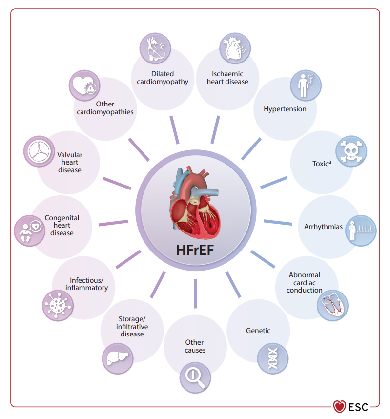
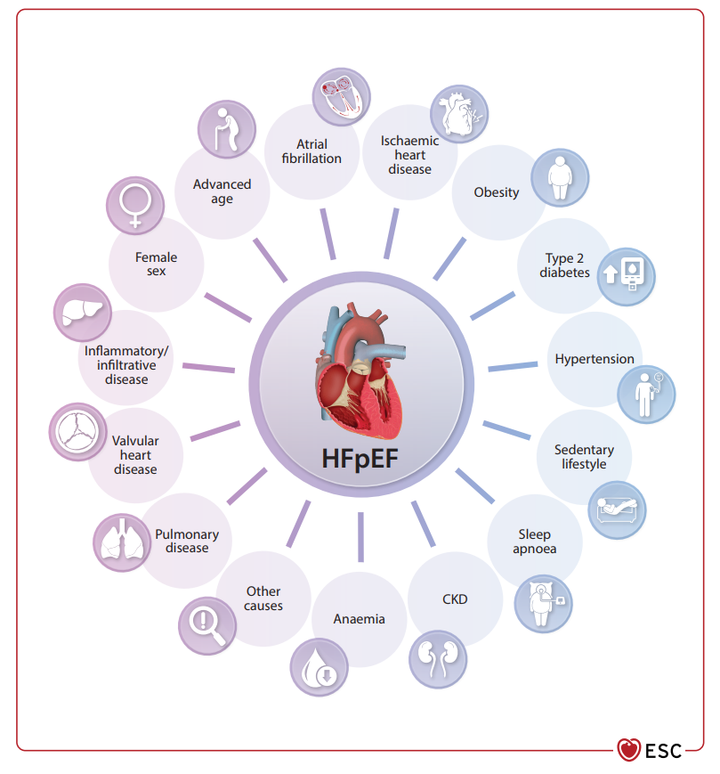
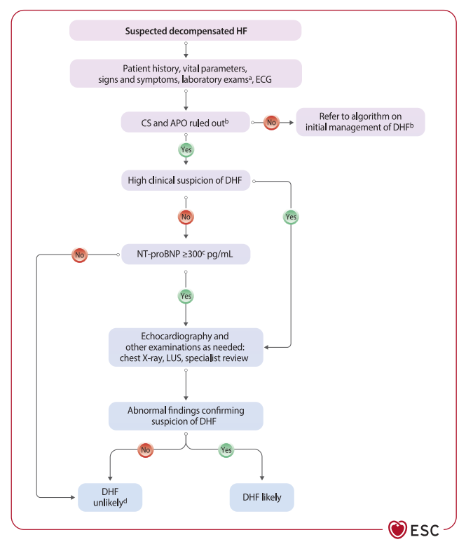
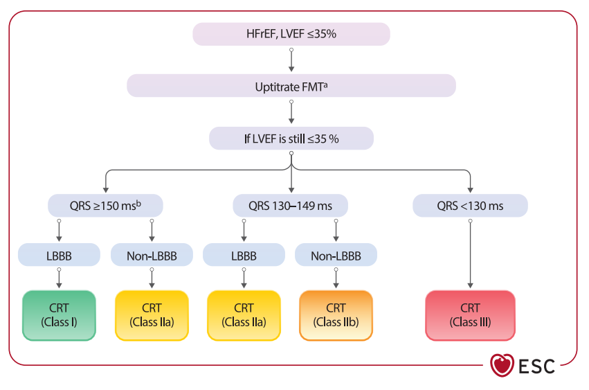

# 🔬 SINH LÝ BỆNH & CƠ CHẾ BỆNH SINH SUY TIM (HEART FAILURE)

<PathoQuickNav />

<!-- DẢI CHỈ SỐ NHANH (QUICK STATS STRIP) -->
<section class="stats-strip">
  <div class="stats-grid">
    <div class="stat-card">
      <div class="stat-val purple">Universal Def 2026</div>
      <div class="stat-lbl">Tăng áp lực đổ đầy và/hoặc Giảm cung lượng tim</div>
    </div>
    <div class="stat-card">
      <div class="stat-val blue">LVEF &lt; 50% vs &ge; 50%</div>
      <div class="stat-lbl">Tái cấu trúc Lệch tâm (HFrEF) vs Đồng tâm (HFpEF)</div>
    </div>
    <div class="stat-card">
      <div class="stat-val red">&gt; 80% Nhập Viện</div>
      <div class="stat-lbl">Sung huyết cấp: Quá tải thể tích vs Tái phân bố dịch</div>
    </div>
    <div class="stat-card">
      <div class="stat-val green">Tứ Trụ + SGLT2i</div>
      <div class="stat-lbl">Phục hồi Autophagy, đảo ngược tái cấu trúc &amp; rút dịch mô kẽ</div>
    </div>
  </div>
</section>

---

## 1. Đại Cương Huyết Động & Định Nghĩa Suy Tim (Universal Definition 2026) {#sec-1}

### 1.1. Bản Chất Rối Loạn Huyết Động Học Cốt Lõi

**Suy tim (Heart Failure - HF)** là một hội chứng lâm sàng phức tạp đặc trưng bởi các triệu chứng cơ năng (khó thở, mệt mỏi, phù ngoại vi) và dấu hiệu thực thể (tĩnh mạch cổ nổi, ran ẩm ở phổi, tiếng tim T3) gây ra bởi các **bất thường về cấu trúc và/hoặc chức năng của tim**.

Theo sự đồng thuận toàn cầu (**Second Universal Definition of Heart Failure 2026** của AHA/ACC/ESC/WHF), suy tim được định nghĩa dựa trên hai bất thường huyết động học căn bản:

1. **Tăng áp lực đổ đầy trong các buồng tim (Elevated Intracardiac Filling Pressures):** Tăng áp lực cuối tâm trương thất trái (LVEDP), tăng áp lực nhĩ trái (LAP) và tăng áp lực mao mạch phổi bít (PCWP).
2. **Giảm cung lượng tim (Inadequate Cardiac Output - CO):** Cung lượng tim không đủ đáp ứng nhu cầu chuyển hóa oxy của các mô cơ quan khi nghỉ ngơi hoặc chỉ duy trì được khi áp lực đổ đầy tăng vọt bệnh lý.

```
                    [CÁC TÁC NHÂN TỔN THƯƠNG BAN ĐẦU]
    (Bệnh Mạch Vành, Tăng Huyết Áp, Độc Chất, Viêm Cơ Tim, Bệnh Chuyển Hóa)
                                  │
                                  ▼
             [BẤT THƯỜNG CẤU TRÚC VÀ/HOẶC CHỨC NĂNG TIM]
                                  │
                                  ▼
      ┌────────────────────────────────────────────────────────────┐
      │            RỐI LOẠN HUYẾT ĐỘNG HỌC CĂN BẢN                 │
      │ 1. Tăng áp lực đổ đầy buồng tim (LVEDP, PCWP tăng)         │
      │ 2. Giảm cung lượng tim (CO) tương đối hoặc tuyệt đối       │
      └───────────────────────────┬────────────────────────────────┘
                                  │
                                  ▼
            [KÍCH HOẠT DÒNG THÁC THẦN KINH - THỂ DỊCH BÙ TRỪ]
              ├── Hệ Thần Kinh Giao Cảm (SNS: Norepinephrine)
              ├── Hệ Renin - Angiotensin - Aldosterone (RAAS)
              └── Hệ Peptide Bài Niệu (BNP / NT-proBNP)
                                  │
                                  ▼ (Vòng xoắn bệnh lý kéo dài)
      ┌────────────────────────────────────────────────────────────┐
      │     TÁI CẤU TRÚC CƠ TIM BỆNH LÝ & TIẾN TRIỂN SUY TIM       │
      │ - HFrEF: Tái cấu trúc lệch tâm, giãn buồng, suy co bóp     │
      │ - HFpEF: Viêm hệ thống vi mạch, xơ hóa, tăng độ cứng thất  │
      └────────────────────────────────────────────────────────────┘
```

---

### 1.2. Phân Định Phổ Phân Suất Tống Máu (LVEF)

<div class="table-responsive">
  <table class="table-modern">
    <thead>
      <tr>
        <th>Phân Nhóm Kiểu Hình</th>
        <th>Phân Suất Tống Máu (LVEF)</th>
        <th>Bản Chất Rối Loạn Sinh Lý Bệnh Cốt Lõi</th>
        <th>Đặc Điểm Cơ Học Cơ Tim</th>
      </tr>
    </thead>
    <tbody>
      <tr>
        <td><strong>HFrEF</strong><br /><em>(EF Giảm)</em></td>
        <td>$\text{LVEF } &lt; 50\%$<br /><em>(hoặc $&lt; 40\%$ theo tiêu chí cũ)</em></td>
        <td><strong>Suy giảm khả năng co bóp tâm thu (Systolic Dysfunction)</strong>: Mất tế bào cơ tim hàng loạt, buồng thất trái giãn rộng, tăng thể tích cuối tâm thu (LVESV).</td>
        <td>Giảm thể tích nhát bóp (SV), giảm sức căng dọc toàn bộ thất trái (GLS) nghiêm trọng, tái cấu trúc lệch tâm.</td>
      </tr>
      <tr>
        <td><strong>HFmrEF</strong><br /><em>(EF Giảm Nhẹ)</em></td>
        <td>$\text{LVEF } 40\% - 49\%$</td>
        <td><strong>Vùng chuyển tiếp sinh lý bệnh học</strong>: Mang đặc điểm hỗn hợp giữa tổn thương co bóp mức độ vừa và rối loạn đổ đầy tâm trương.</td>
        <td>Đáp ứng rất tốt với các liệu pháp đảo ngược tái cấu trúc tương tự HFrEF.</td>
      </tr>
      <tr>
        <td><strong>HFpEF</strong><br /><em>(EF Bảo Tồn)</em></td>
        <td>$\text{LVEF } \ge 50\%$</td>
        <td><strong>Suy giảm khả năng thư giãn và đổ đầy tâm trương (Diastolic Dysfunction)</strong>: Tâm thất dày, cứng, tăng áp lực đổ đầy thất trái khi nghỉ hoặc gắng sức.</td>
        <td>Cung lượng tim nghỉ có thể bình thường, nhưng thất trái không thể giãn để nhận máu khi gắng sức; suy giảm sức căng dọc GLS tiềm ẩn.</td>
      </tr>
    </tbody>
  </table>
</div>

---

## 2. Cơ Chế Bệnh Sinh & Tái Cấu Trúc Cơ Tim Trong HFrEF (LVEF &lt; 50%) {#sec-2}

### 2.1. Quá Trình Mất Mát Tế Bào & Tái Cấu Trúc Lệch Tâm (Eccentric Remodeling)

Trong **HFrEF**, tổn thương tiên phát là sự suy giảm nghiêm trọng khả năng co bóp tống máu của thất trái:

1. **Mất mát tế bào cơ tim (Cardiomyocyte Loss):** Khởi phát sau hoại tử tế bào cơ tim do nhồi máu cơ tim (IHD/CAD), thiếu máu cục bộ cơ tim mạn tính, viêm cơ tim cấp, đột biến gen protein cấu trúc sarcomere (TTN, LMNA), hoặc ngộ độc thuốc/hóa trị liệu ung thư (Anthracycline, Trastuzumab).
2. **Tái cấu trúc lệch tâm (Eccentric Hypertrophy / Remodeling):** Để bù đắp lượng tế bào cơ tim bị mất và cố gắng duy trì thể tích nhát bóp ($SV = EDV - ESV$), các tế bào cơ tim còn sống sót buộc phải kéo dài kích thước thông qua việc lắp ráp các đơn vị co cơ (sarcomeres) nối tiếp nhau theo chiều dọc (**sarcomeres in series**). Hậu quả là buồng thất trái bị giãn to ra hình cầu, thành cơ tim trở nên mỏng tương đối so với bán kính buồng tim.
3. **Gia tăng sức căng thành tim theo Định luật Laplace:**

$$\sigma = \frac{P \times r}{2h}$$

*Trong đó:* $\sigma$ là sức căng thành cơ tim (wall stress), $P$ là áp lực trong buồng thất, $r$ là bán kính buồng tim, và $h$ là bề dày thành cơ tim.

Khi buồng thất giãn rộng ($r$ tăng) và thành thất bị kéo mỏng ($h$ giảm), sức căng thành thất $\sigma$ tăng vọt cả trong kỳ tâm thu lẫn tâm trương. Điều này làm tăng nhu cầu tiêu thụ oxy cơ tim, làm thiếu máu cục bộ dưới nội tâm mạc, thúc đẩy tế bào cơ tim chết theo chương trình (**Apoptosis**) và khép kín vòng xoắn suy kiệt chức năng co bóp.

<figure class="physio-figure" style="display: flex; flex-direction: column; align-items: center; justify-content: center; text-align: center; margin: 2rem auto;">
  
  <figcaption style="margin-top: 0.85rem; font-size: 0.88rem; color: var(--color-text-muted, #64748b); font-style: italic; text-align: center; max-width: 820px; line-height: 1.55;">
    <strong>Hình 1: Các Nhóm Nguyên Nhân Gây HFrEF (Khuyến Cáo ESC 2026).</strong> Phân tầng 6 nhóm nguyên nhân thực thể chính: Bệnh mạch vành thiếu máu cục bộ (IHD/CAD), Tăng huyết áp, Bệnh van tim, Rối loạn nhịp và bệnh lý hệ dẫn truyền, Bệnh cơ tim (di truyền/mắc phải), và Nhóm nhiễm độc cơ tim (do rượu bia, độc chất hoặc phác đồ hóa trị liệu ung thư). Nguồn: <em>ESC Guidelines for the management of heart failure</em> (Figure 5, 2026).
  </figcaption>
</figure>

---

### 2.2. Bảng Phân Cấp Nguyên Nhân Gây Suy Tim Tâm Thu (LVEF Giảm)

<div class="table-responsive">
  <table class="table-modern">
    <thead>
      <tr>
        <th>Nhóm Bệnh Căn Nguyên</th>
        <th>Cơ Chế Bệnh Sinh Trực Tiếp</th>
        <th>Bệnh Lý Lâm Sàng Điển Hình</th>
      </tr>
    </thead>
    <tbody>
      <tr>
        <td><strong>Bệnh động mạch vành (CAD / IHD)</strong></td>
        <td>Thiếu máu cục bộ và hoại tử làm mất tế bào cơ tim chức năng, thay thế bằng sẹo xơ hóa.</td>
        <td>Nhồi máu cơ tim cấp/cũ, bệnh cơ tim thiếu máu cục bộ mạn tính.</td>
      </tr>
      <tr>
        <td><strong>Tăng tải áp lực mạn tính (Pressure Overload)</strong></td>
        <td>Tăng hậu tải kéo dài buộc tâm thất tăng sức căng thành co bóp, lâu dần dẫn đến kiệt quệ co bóp và giãn thất.</td>
        <td>Tăng huyết áp không kiểm soát, hẹp van động mạch chủ, hẹp eo động mạch chủ.</td>
      </tr>
      <tr>
        <td><strong>Tăng tải thể tích mạn tính (Volume Overload)</strong></td>
        <td>Tăng tiền tải liên tục làm giãn buồng tim quá mức, trượt các sợi actin-myosin vượt khỏi đường cong Frank-Starling tối ưu.</td>
        <td>Hở van hai lá nặng, hở van động mạch chủ, thông liên thất (VSD), còn ống động mạch (PDA).</td>
      </tr>
      <tr>
        <td><strong>Bệnh cơ tim giãn (DCM)</strong></td>
        <td>Đột biến gen protein cấu trúc (Titin, Lamin A/C) hoặc tổn thương tự miễn phá hủy sợi cơ tim.</td>
        <td>Bệnh cơ tim giãn vô căn, bệnh cơ tim chu sinh, viêm cơ tim do virus (Coxsackie, Adenovirus, Parvovirus B19).</td>
      </tr>
      <tr>
        <td><strong>Độc chất &amp; Chuyển hóa</strong></td>
        <td>Ức chế hô hấp tế bào ty thể, phá hủy cấu trúc protein và gây ngộ độc tế bào cơ tim trực tiếp.</td>
        <td>Hóa trị ung thư (Doxorubicin, Trastuzumab), lạm dụng rượu bia, bệnh cơ tim do tiểu đường.</td>
      </tr>
      <tr>
        <td><strong>Rối loạn nhịp tim mạn tính (Tachycardiomyopathy)</strong></td>
        <td>Tần số thất quá nhanh kéo dài làm cạn kiệt nguồn dự trữ năng lượng ATP và rối loạn điều hòa canxi.</td>
        <td>Rung nhĩ đáp ứng thất nhanh kéo dài, nhịp nhanh trên thất dai dẳng, ngoại tâm thu thất dày đặc ($&gt; 15 - 20\%$).</td>
      </tr>
    </tbody>
  </table>
</div>

---

## 3. Cơ Chế Bệnh Sinh HFpEF: Viêm Hệ Thống, Rối Loạn Vi Mạch & Độc Tính Chuyển Hóa {#sec-3}

Trái ngược với HFrEF, cơ chế bệnh sinh của **HFpEF** (LVEF $\ge 50\%$) không nằm ở khả năng tống máu mà nằm ở **sự suy giảm khả năng thư giãn và đổ đầy của tâm thất trái (Diastolic Dysfunction)** dưới áp lực thấp. Thất trái trở nên dày, xơ cứng, làm đường cong áp lực - thể tích tâm trương bị đẩy dịch chuyển lên trên và sang trái:

```
[BỆNH LÝ ĐỒNG MẮC CHUYỂN HÓA: BÉO PHÌ, ĐÁI THÁO ĐƯỜNG TYPE 2, THA, CKD]
                                  │
                                  ▼
[HỘI CHỨNG VIÊM HỆ THỐNG MẠN TÍNH MỨC ĐỘ THẤP (SYSTEMIC INFLAMMATION)]
                                  │
                                  ▼
[TẾ BÀO NỘI MÔ VI MẠCH VÀNH BỊ TỔN THƯƠNG ➔ GIẢM SINH KHẢ DỤNG NITRIC OXIDE (NO)]
                                  │
                                  ▼
[SUY GIẢM CON ĐƯỜNG sGC - cGMP - PROTEIN KINASE G (PKG)]
                                  │
         ┌────────────────────────┴────────────────────────┐
         ▼                                                 ▼
[GIẢM PHOSPHORYLATION TITIN]                   [TĂNG TIẾT TGF-β1 TỪ ĐẠI THỰC BÀO]
- Sợi Titin bị cứng như lò xo sắt               - Biệt hóa nguyên bào sợi thành myofibroblast
- Tăng độ cứng nội tại tế bào cơ tim           - Lắng đọng Collagen type I & III vào mô kẽ
         │                                                 │
         └────────────────────────┬────────────────────────┘
                                  │
                                  ▼
[TĂNG ĐỘ CỨNG TÂM THẤT TRÁI & SUY GIẢM ĐỔ ĐẦY TÂM TRƯƠNG (DIASTOLIC DYSFUNCTION)]
                                  │
                                  ▼
[ÁP LỰC ĐỔ ĐẦY TĂNG VỌT KHI GẮNG SỨC (LVEDP & PCWP TĂNG) ➔ SUNG HUYẾT PHỔI]
```

---

### 3.1. Rối Loạn Chức Năng Nội Mạc Vi Mạch & Protein Khổng Lồ Titin

- **Suy giảm sinh khả dụng Nitric Oxide (NO):** Viêm hệ thống làm tăng các gốc oxy hóa tự do (ROS), oxy hóa và làm mất hoạt tính của enzyme eNOS tại tế bào nội mô vi mạch vành. Sự thiếu hụt NO làm suy giảm hoạt động của Guanylyl Cyclase hòa tan (sGC), dẫn đến sụt giảm nồng độ **cGMP** và giảm hoạt tính của **Protein Kinase G (PKG)**.
- **Biến đổi độ đàn hồi của Titin:** Titin là một protein khổng lồ đóng vai trò như chiếc lò xo phân tử tạo nên độ đàn hồi tâm trương của sợi cơ tim. Khi trục NO-cGMP-PKG bị suy giảm, protein Titin bị giảm phosphoryl hóa (**hypophosphorylation**), khiến sợi titin chuyển từ trạng thái mềm dẻo sang trạng thái cứng ngắc, trực tiếp làm tăng độ cứng nội tại của tế bào cơ tim.
- **Xơ hóa mô kẽ cơ tim (Myocardial Interstitial Fibrosis):** Tế bào viêm kích hoạt đại thực bào tiết ra **TGF-$\beta 1$**, kích thích nguyên bào sợi tăng sinh và tổng hợp quá mức các sợi **Collagen tuýp I** (cứng và thô) và **tuýp III**, làm xơ cứng khoảng kẽ cơ tim.

---

### 3.2. Kiểu Hình Chuyển Hóa - Béo Phì & Vai Trò Mô Mỡ Thượng Tâm Mạc (EAT)

Ở bệnh nhân béo phì và đái tháo đường, lớp **Mô mỡ thượng tâm mạc (Epicardial Adipose Tissue - EAT)** phát triển dày bất thường:
1. **Độc tính Adipokine tại chỗ:** Mô mỡ này giải phóng trực tiếp các cytokine gây viêm (TNF-$\alpha$, IL-6, Leptin) thấm thẳng vào cơ tim liền kề.
2. **Gò bó cơ học (Mechanical Restraint):** Thể tích khối mỡ thượng tâm mạc tăng cao bên trong khoang màng ngoài tim tạo ra một lực ép cơ học liên tục bao quanh tim, cản trở trực tiếp sự giãn nở tâm trương của cả hai tâm thất.
3. **Độc tính Gluco-Metabolic trong Đái tháo đường:** Sự tích tụ các sản phẩm glycat hóa bền vững (**AGEs**) tạo liên kết chéo collagen làm xơ cứng thành tim, đồng thời ép buộc cơ tim sử dụng hoàn toàn acid béo làm năng lượng gây "đói năng lượng" tế bào.

<figure class="physio-figure" style="display: flex; flex-direction: column; align-items: center; justify-content: center; text-align: center; margin: 2rem auto;">
  
  <figcaption style="margin-top: 0.85rem; font-size: 0.88rem; color: var(--color-text-muted, #64748b); font-style: italic; text-align: center; max-width: 820px; line-height: 1.55;">
    <strong>Hình 2: Mạng Lưới Đa Yếu Tố Nguy Cơ Thúc Đẩy HFpEF (ESC 2026).</strong> Bệnh sinh HFpEF là sự tương tác phức tạp giữa các yếu tố không thể thay đổi (Tuổi cao, Giới nữ), Rung nhĩ, Bệnh mạch vành, và các bệnh lý đồng mắc chuyển hóa viêm hệ thống (Béo phì, Đái tháo đường type 2, Tăng huyết áp, Lối sống tĩnh tại, Ngưng thở khi ngủ OSA, Bệnh thận mạn CKD, Thiếu máu, Bệnh phổi). Nguồn: <em>ESC Guidelines for the management of heart failure</em> (Figure 6, 2026).
  </figcaption>
</figure>

---

## 4. Hệ Thống Thần Kinh - Thể Dịch & Vai Trò Phản Điều Hòa Của Peptide Bài Niệu {#sec-4}

Khi cung lượng tim suy giảm hoặc áp lực thành tim tăng cao, cơ thể kích hoạt ba hệ thống nội tiết chính:

```
                            [GIẢM CUNG LƯỢNG TIM & TĂNG ÁP LỰC THÀNH TIM]
                                                 │
         ┌───────────────────────────────────────┼───────────────────────────────────────┐
         ▼                                       ▼                                       ▼
[HỆ THẦN KINH GIAO CẢM (SNS)]            [HỆ RAAS & ALDOSTERONE]                 [HỆ PEPTIDE BÀI NIỆU (NP)]
1. Tiết Norepinephrine tăng vọt          1. Tiết Renin ➔ Angiotensin II          1. Căng thành tim ➔ Tiết ProBNP
2. Co mạch hệ thống (Tăng hậu tải)       2. Co mạch mạnh mẽ (Tăng hậu tải)       2. Cắt thành BNP và NT-proBNP
3. Tăng nhịp tim & Thể tích nhát bóp     3. Tiết Aldosterone giữ muối nước       3. Giãn mạch, bài tiết Natri
4. GÂY ĐỘC TRỰC TIẾP CƠ TIM              4. GÂY XƠ HÓA KHOẢNG KẼ TIM (sST2)      4. Ức chế ngược hệ RAAS & SNS
         │                                       │                                       │
         ▼                                       ▼                                       ▼
[TÁI CẤU TRÚC BỆNH LÝ & LOẠN NHỊP]       [QUÁ TẢI THỂ TÍCH & XƠ HÓA]             [BỊ PHÂN HỦY BỞI NEPRILYSIN]
         │                                       │                                       │
         └───────────────────────────────────────┼───────────────────────────────────────┘
                                                 │
                                                 ▼
             [VÒNG XOẮN SUY TIM TIẾN TRIỂN ➔ ĐÍCH NHẮM CỦA TỨ TRỤ ARNI, BB, MRA]
```

1. **Hệ Thần kinh Giao cảm (SNS):**
   - Sự sụt giảm huyết áp động mạch kích hoạt thụ thể áp lực xoang cảnh và quai động mạch chủ, làm tăng phóng thích Norepinephrine từ đầu tận thần kinh giao cảm và tủy thượng thận.
   - Ban đầu giúp tăng nhịp tim và sức co bóp để duy trì cung lượng tim; tuy nhiên kích thích giao cảm mạn tính làm **down-regulation (giảm mật độ) thụ thể $\beta_1$-adrenergic**, gây độc trực tiếp tế bào cơ tim do quá tải canxi nội bào, thúc đẩy apoptosis và kích hoạt loạn nhịp thất chết người.
2. **Hệ Renin - Angiotensin - Aldosterone (RAAS):**
   - Giảm tưới máu tế bào cạnh cầu thận kích thích tiết Renin $\rightarrow$ Chuyển Angiotensinogen thành Angiotensin I $\rightarrow$ Enzyme ACE chuyển thành **Angiotensin II**.
   - Angiotensin II gây co thắt động mạch hệ thống dữ dội (tăng hậu tải) và kích thích vỏ thượng thận tiết **Aldosterone**.
   - Aldosterone tác động lên thụ thể Mineralocorticoid ở ống thận để giữ muối và nước (gây sung huyết), đồng thời tác động trực tiếp lên nguyên bào sợi cơ tim kích hoạt tổng hợp Collagen type I và III, làm xơ hóa khoảng kẽ (thể hiện qua sự gia tăng của dấu ấn **sST2**) và xơ cứng mạch máu.
3. **Hệ thống Peptide Bài niệu (Natriuretic Peptides - BNP / NT-proBNP):**
   - Sự căng giãn thành tim do quá tải thể tích hoặc áp lực kích thích tế bào cơ tâm thất tổng hợp tiền chất Pre-proBNP $\rightarrow$ ProBNP ($1 - 108$).
   - Enzyme Furin hoặc Corin phân cắt ProBNP thành hai mảnh:
     * **BNP ($77 - 108$):** Dạng peptide có hoạt tính sinh học, thời gian bán hủy ngắn ($\sim 20\text{ phút}$), gắn vào thụ thể NPR-A làm tăng cGMP gây giãn mạch, bài tiết muối nước qua thận và ức chế ngược hệ RAAS/SNS.
     * **NT-proBNP ($1 - 76$):** Dạng mảnh tận N không có hoạt tính sinh học, thời gian bán hủy dài hơn ($\sim 60 - 90\text{ phút}$), thải trừ chủ yếu qua thận, là dấu ấn sinh học có độ nhạy rất cao trong chẩn đoán và tiên lượng suy tim.
   - Trong suy tim mạn, cơ chế bù trừ có lợi của BNP bị lấn át hoàn toàn bởi hệ RAAS và enzyme **Neprilysin** nội sinh liên tục phân hủy BNP. Thuốc **ARNI (Sacubitril/Valsartan)** ức chế neprilysin để bảo tồn nồng độ BNP có lợi song hành với việc chẹn thụ thể $AT_1$, cắt đứt vòng xoắn bệnh lý thần kinh - thể dịch.

---

## 5. Cơ Chế Tế Bào: Rối Loạn Ty Thể, Đói Năng Lượng & Hệ Thống Autophagy {#sec-5}

### 5.1. Rối Loạn Ty Thể & Trạng Thái "Đói Năng Lượng" (Energy Starvation)

Tế bào cơ tim bình thường tiêu thụ lượng ATP khổng lồ ($6\text{ kg ATP/ngày}$), với $90\%$ năng lượng được cung cấp bởi **quá trình $\beta$-oxy hóa acid béo tại ty thể**. 

Trong suy tim, ty thể bị tổn thương cấu trúc màng trong và chuỗi hô hấp tế bào:
- **Chuyển dịch cơ chất năng lượng bất lợi:** Tế bào cơ tim suy giảm khả năng oxy hóa acid béo và buộc phải chuyển sang con đường đường phân (Glycolysis), vốn chỉ tạo ra lượng ATP rất hạn chế.
- **Suy kiệt bơm canxi SERCA2a:** Tình trạng "đói năng lượng" ATP mạn tính làm suy yếu hoạt động của bơm $Ca^{2+}$-ATPase tại màng lưới nội sinh chất (**SERCA2a**). Hậu quả là ion $Ca^{2+}$ bị ứ đọng lại trong bào tương trong kỳ tâm trương, cản trở sự tách rời của các cầu nối actin-myosin và làm suy giảm khả năng thư giãn của cơ tim.
- **Stress oxy hóa:** Ty thể tổn thương rò rỉ ồ ạt các gốc tự do oxy hóa (ROS), gây tổn thương lipid màng tế bào và kích hoạt thể viêm NLRP3.

---

### 5.2. Rối Loạn Hệ Thống Tự Thực (Autophagy-Lysosome) & Cơ Chế Đột Phá Của SGLT2i

Quá trình **tự thực (Autophagy)** là cơ chế dọn dẹp tế bào tối quan trọng, giúp cô lập và phân hủy các ty thể bị hỏng (mitophagy) và các protein cuộn gập sai lỗi:
- Trong suy tim và bệnh cơ tim đái tháo đường, hệ thống tự thực bị đình trệ, dẫn đến sự tích tụ "rác thải tế bào", kích hoạt dòng thác chết tế bào theo chương trình (Apoptosis).
- **Cơ chế tác động mức độ phân tử của thuốc ức chế SGLT2 (SGLT2i - Dapagliflozin, Empagliflozin):**
  1. **Kích hoạt trục AMPK-mTOR:** SGLT2i kích hoạt kinase cảm biến năng lượng **AMPK** và ức chế phức hợp **mTOR**, phục hồi lại hoạt động tự thực để dọn dẹp tế bào cơ tim.
  2. **Ức chế enzym GSK-3$\beta$:** Ngăn chặn tình trạng phì đại và xơ hóa cơ tim trong bệnh cơ tim chuyển hóa.
  3. **Cung cấp nhiên liệu "Siêu sạch" (Ketone bodies):** SGLT2i làm tăng nhẹ nồng độ thể Ceton ($\beta$-hydroxybutyrate) trong máu. Thể ceton được ty thể cơ tim tiêu thụ trực tiếp với hiệu suất sinh năng lượng cao hơn và tiêu tốn ít oxy hơn so với acid béo, giải tỏa trạng thái "đói năng lượng" của cơ tim suy.
  4. **Rút dịch chọn lọc từ khoảng kẽ:** Khác với lợi tiểu quai rút dịch chủ yếu từ lòng mạch (dễ gây tụt huyết áp), SGLT2i rút dịch chọn lọc từ khoảng kẽ (interstitial fluid) giúp giảm sung huyết mô mà bảo tồn thể tích tuần hoàn nội mạch.

---

## 6. Sinh Lý Bệnh Sung Huyết Cấp: Quá Tải Thể Tích vs. Tái Phân Bố Dịch {#sec-6}

Hơn $80\%$ trường hợp nhập viện vì suy tim mất bù cấp (ADHF) biểu hiện với hội chứng sung huyết. Sinh lý bệnh hiện đại chia sung huyết thành hai cơ chế hoàn toàn đối lập:

<div class="table-responsive">
  <table class="table-modern">
    <thead>
      <tr>
        <th>Đặc Tính Sinh Lý Bệnh</th>
        <th>Sung Huyết Do Quá Tải Thể Tích Thực Sự (Volume Overload)</th>
        <th>Sung Huyết Do Tái Phân Bố Dịch Đột Ngột (Fluid Redistribution)</th>
      </tr>
    </thead>
    <tbody>
      <tr>
        <td><strong>Cơ chế sinh bệnh học cốt lõi</strong></td>
        <td>Tích tụ từ từ Natri và nước toàn cơ thể qua nhiều ngày/tuần do giảm tưới máu thận và kích hoạt kéo dài hệ RAAS.</td>
        <td><strong>Không tăng thể tích dịch toàn cơ thể</strong>. Kích hoạt giao cảm bùng phát làm <strong>co thắt hệ tĩnh mạch tạng</strong> (nơi chứa $> 60\%$ thể tích máu), đẩy ngược máu ồ ạt về phổi.</td>
      </tr>
      <tr>
        <td><strong>Yếu tố khởi kích</strong></td>
        <td>Ăn mặn, không tuân thủ dùng thuốc lợi tiểu, suy thận tiến triển mạn tính.</td>
        <td>Cơn tăng huyết áp cấp cứu, stress tâm lý, thiếu máu cục bộ cơ tim cấp, rối loạn nhịp.</td>
      </tr>
      <tr>
        <td><strong>Tốc độ khởi phát lâm sàng</strong></td>
        <td>Tiến triển bán cấp (Subacute) qua nhiều ngày đến nhiều tuần.</td>
        <td><strong>Khởi phát tối cấp (Hyperacute) chỉ trong vài phút đến vài giờ</strong>.</td>
      </tr>
      <tr>
        <td><strong>Biểu hiện lâm sàng</strong></td>
        <td>Tăng cân nhanh, phù chi dưới toàn thân, cổ trướng, tĩnh mạch cổ nổi rõ rệt, ran ẩm đáy phổi.</td>
        <td><strong>Phù phổi cấp tối cấp (Flash Pulmonary Edema)</strong>, khó thở dữ dội, thở nhanh, rales ẩm dâng nhanh nhưng <strong>hoàn toàn không có phù ngoại vi</strong>. Thường gặp ở nữ lớn tuổi, HFpEF.</td>
      </tr>
      <tr>
        <td><strong>Đặc điểm huyết động</strong></td>
        <td>Thể tích tuần hoàn toàn bộ tăng cao, huyết áp bình thường hoặc tăng nhẹ.</td>
        <td>Thể tích máu toàn bộ bình thường, nhưng huyết áp tăng rất cao, áp lực đổ đầy thất trái và PCWP tăng vọt.</td>
      </tr>
      <tr>
        <td><strong>Chiến lược điều trị tối ưu (EBM)</strong></td>
        <td><strong>Lợi tiểu quai tiêm tĩnh mạch (Furosemide) liều cao</strong> để thải trừ lượng muối nước dư thừa ra ngoài cơ thể.</td>
        <td><strong>Thuốc giãn mạch tĩnh mạch/động mạch (Nitroglycerin) đường tĩnh mạch</strong> làm chủ chốt để giãn hệ mạch tạng đưa máu về hồ chứa; hạn chế lợi tiểu liều cao.</td>
      </tr>
    </tbody>
  </table>
</div>

---

### 6.1. Bảng Dấu Hiệu Lâm Sàng & Cận Lâm Sàng Của Sung Huyết vs Giảm Tưới Máu (ESC 2026)

<div class="table-responsive">
  <table class="table-modern">
    <thead>
      <tr>
        <th>Sung Huyết Tim Trái (Left-sided Congestion)</th>
        <th>Sung Huyết Tim Phải (Right-sided Congestion)</th>
        <th>Giảm Tưới Máu Ngoại Vi (Hypoperfusion)</th>
      </tr>
    </thead>
    <tbody>
      <tr>
        <td>
          - Khó thở khi gắng sức / khi nằm (Orthopnoea)<br />
          - Khó thở kịch phát về đêm (PND)<br />
          - Thở nhanh ($&gt; 25\text{ lần/phút}$)<br />
          - Ho khan, ho ra bọt hồng<br />
          - Ran ẩm ở phổi (Rales / Crepitations)<br />
          - Tiếng tim T3 (Gallop rhythm)<br />
          - Tràn dịch màng phổi hai bên<br />
          - Tăng vọt Peptide bài niệu (BNP, NT-proBNP)
        </td>
        <td>
          - Phù ngoại vi (mắt cá chân, cẳng chân, vùng cùng cụt)<br />
          - Căng tức bụng, khó tiêu do phù ruột<br />
          - Gan to đau, phản hồi gan - tĩnh mạch cổ (+)<br />
          - Tĩnh mạch cổ nổi tự nhiên ở tư thế $45^\circ$<br />
          - Cổ trướng (Ascites)<br />
          - Tăng Bilirubin, men gan (AST/ALT), ALP, GGT<br />
          - Tăng Creatinine do sung huyết tĩnh mạch thận
        </td>
        <td>
          - Chi lạnh, ẩm (Cold, sweaty extremities)<br />
          - Da tái, nhợt nhạt hoặc vân tím (Mottling)<br />
          - Chóng mặt, mơ hồ, lẫn lộn ý thức<br />
          - Thiểu niệu ($\text{Nước tiểu} &lt; 0.5\text{ mL/kg/h}$)<br />
          - Huyết áp kẹt, tụt huyết áp ($\text{HA tâm thu} &lt; 90\text{ mmHg}$)<br />
          - Tăng Lactate huyết thanh ($&gt; 2.0\text{ mmol/L}$)<br />
          - Nhiễm toan chuyển hóa
        </td>
      </tr>
    </tbody>
  </table>
</div>

---

## 7. Quy Trình Tiếp Cận Chẩn Đoán & Kiểm Soát Sung Huyết Cá Thể Hóa (ESC 2026) {#sec-7}

### 7.1. Lưu Đồ Tiếp Cận Chẩn Đoán Suy Tim Mất Bù Tại Giường (Figure 11 - ESC 2026)

<figure class="physio-figure" style="display: flex; flex-direction: column; align-items: center; justify-content: center; text-align: center; margin: 2rem auto;">
  
  <figcaption style="margin-top: 0.85rem; font-size: 0.88rem; color: var(--color-text-muted, #64748b); font-style: italic; text-align: center; max-width: 820px; line-height: 1.55;">
    <strong>Hình 3: Lưu Đồ Tiếp Cận Chẩn Đoán Suy Tim Mất Bù (ESC 2026).</strong> Quy trình ưu tiên đánh giá hai tình trạng đe dọa tính mạng: Sốc tim (CS) và Phù phổi cấp (APO) để kích hoạt hồi sức ngay lập tức. Ở bệnh nhân ổn định, đo nồng độ NT-proBNP (với ngưỡng loại trừ $&lt; 300\text{ pg/mL}$) và siêu âm tim tại giường là các công cụ then chốt xác định chẩn đoán. Nguồn: <em>ESC Guidelines for the management of heart failure</em> (Figure 11, 2026).
  </figcaption>
</figure>

---

### 7.2. Phác Đồ Lợi Tiểu Cá Thể Hóa Theo eGFR Ở Bệnh Nhân Kèm Bệnh Thận Mạn (ESC 2026 / ehag098)

Ở bệnh nhân suy tim mất bù đồng mắc bệnh thận mạn (CKD), sự suy giảm số lượng nephron chức năng và hiện tượng ứ trệ tĩnh mạch thận làm giảm bài tiết thuốc vào lòng ống lượn, dẫn đến hiện tượng **đề kháng lợi tiểu (diuretic resistance)**:

<figure class="physio-figure" style="display: flex; flex-direction: column; align-items: center; justify-content: center; text-align: center; margin: 2rem auto;">
  
  <figcaption style="margin-top: 0.85rem; font-size: 0.88rem; color: var(--color-text-muted, #64748b); font-style: italic; text-align: center; max-width: 820px; line-height: 1.55;">
    <strong>Hình 4: Kiểm Soát Sung Huyết Theo Mức Lọc Cầu Thận eGFR Trong Suy Tim Mất Bù Kèm CKD (ESC 2026).</strong> Hướng dẫn định liều Furosemide tĩnh mạch khởi đầu dựa trên eGFR: $\text{eGFR} &lt; 30\text{ mL/min}$ dùng $160\text{ mg}$; $\text{eGFR } 30 - 44$ dùng $120\text{ mg}$; $\text{eGFR} \ge 45$ dùng $80\text{ mg}$. Đánh giá đáp ứng Natri niệu điểm (spot uNa) ở giờ thứ 2: Nếu $\text{uNa} &lt; 70\text{ mmol/L}$, lập tức gấp đôi liều lợi tiểu quai và phối hợp sớm các nhóm lợi tiểu bổ trợ (SGLT2i, Acetazolamide) để vượt qua đề kháng. Nguồn: <em>ESC Guidelines on CVD in CKD</em> (Figure 10, 2026).
  </figcaption>
</figure>

---

## 8. Cơ Sở Sinh Lý Học Của Các Liệu Pháp Điều Trị Trúng Đích Hiện Đại {#sec-8}

### 8.1. "Tứ Trụ" Điều Trị HFrEF & Đảo Ngược Tái Cấu Trúc (Reverse Remodeling)

Sự phối hợp sớm 4 nhóm thuốc trụ cột tác động hiệp đồng vào 4 con đường sinh bệnh học cốt lõi:

```
┌────────────────────────────────────────────────────────────────────────────────────────┐
│                        "TỨ TRỤ" ĐIỀU TRỊ SUY TIM HFrEF HIỆN ĐẠI                        │
├────────────────────────────┬─────────────────────────────┬─────────────────────────────┤
│ Nhóm Thuốc Trụ Cột         │ Đích Tác Động Sinh Học      │ Hiệu Quả Sinh Lý & Lâm Sàng │
├────────────────────────────┼─────────────────────────────┼─────────────────────────────┤
│ 1. ARNI                    │ - Ức chế Neprilysin         │ - Tăng nồng độ BNP/ANP      │
│    (Sacubitril/Valsartan)  │ - Chẹn Thụ thể AT1 của      │ - Giãn mạch, thải Natri     │
│                            │   Angiotensin II            │ - ĐẢO NGƯỢC TÁI CẤU TRÚC    │
├────────────────────────────┼─────────────────────────────┼─────────────────────────────┤
│ 2. Thuốc Chẹn Beta         │ - Chẹn Thụ thể β1-adrenergic│ - Giảm nhịp tim, giảm tiêu  │
│    (Carvedilol, Bisoprolol,│   tại màng tế bào cơ tim    │   thụ oxy cơ tim            │
│     Metoprolol succinate)  │                             │ - Ngăn ngừa đột tử loạn nhịp│
├────────────────────────────┼─────────────────────────────┼─────────────────────────────┤
│ 3. Kháng Thụ Thể MRA       │ - Đối kháng Aldosterone tại │ - Ngăn lắng đọng Collagen   │
│    (Spironolactone,        │   thụ thể Mineralocorticoid │ - Giảm xơ hóa khoảng kẽ     │
│     Eplerenone, Finerenone)│                             │ - Giữ Kali máu ổn định      │
├────────────────────────────┼─────────────────────────────┼─────────────────────────────┤
│ 4. Thuốc Ức Chế SGLT2      │ - Kích hoạt AMPK / Ức chế   │ - Khôi phục Autophagy dọn rác│
│    (Dapagliflozin,         │   mTOR & GSK-3β             │ - Cung cấp thể ceton năng   │
│     Empagliflozin)         │ - Lợi niệu natri thẩm thấu  │   lượng sạch cho ty thể     │
│                            │   tại ống lượn gần          │ - Rút dịch chọn lọc mô kẽ   │
└────────────────────────────┴─────────────────────────────┴─────────────────────────────┘
```

---

### 8.2. Kỷ Nguyên Mới Điều Trị HFpEF Kiểu Hình Béo Phì & Toàn Bộ Phổ EF

- **SGLT2i trên toàn bộ phổ EF:** Là nhóm thuốc duy nhất được chứng minh giảm tử vong tim mạch và nhập viện vì suy tim trên cả HFrEF, HFmrEF và HFpEF (Khuyến cáo Class 1A của ESC 2026).
- **Thuốc Đồng Vận Thụ Thể GLP-1 (Semaglutide, Tirzepatide):** Ở bệnh nhân HFpEF có béo phì ($\text{BMI} \ge 30\text{ kg/m}^2$), GLP-1RA giúp giảm mạnh thể tích lớp mỡ thượng tâm mạc (EAT), giải phóng sự gò bó cơ học đối với màng ngoài tim, dập tắt phản ứng viêm hệ thống và cải thiện vượt trội khả năng gắng sức.

---

### 8.3. Bảng Đối Soánh Toàn Diện Giữa HFrEF và HFpEF

<div class="table-responsive">
  <table class="table-modern">
    <thead>
      <tr>
        <th>Tiêu Chí Sinh Lý Bệnh</th>
        <th>Suy Tim EF Giảm (HFrEF)</th>
        <th>Suy Tim EF Bảo Tồn (HFpEF)</th>
      </tr>
    </thead>
    <tbody>
      <tr>
        <td><strong>Cơ chế khởi phát</strong></td>
        <td>Mất tế bào cơ tim thực thể (Nhồi máu cơ tim, độc chất hóa trị, viêm cơ tim).</td>
        <td>Hội chứng viêm mạn tính hệ thống mức độ thấp (Béo phì, ĐTĐ type 2, THA, CKD).</td>
      </tr>
      <tr>
        <td><strong>Cấu trúc thất trái</strong></td>
        <td>Giãn rộng buồng thất, <strong>Tái cấu trúc lệch tâm (Eccentric Remodeling)</strong>, thành tim mỏng tương đối.</td>
        <td>Phì đại thành tim, <strong>Tái cấu trúc đồng tâm (Concentric Remodeling)</strong>, buồng thất nhỏ hoặc bình thường.</td>
      </tr>
      <tr>
        <td><strong>Rối loạn cơ học chính</strong></td>
        <td>Suy giảm khả năng co bóp tống máu tâm thu (Giảm LVEF, giảm SV).</td>
        <td>Tăng độ cứng thành thất, suy rối loạn thư giãn và đổ đầy tâm trương (Tăng LVEDP khi gắng sức).</td>
      </tr>
      <tr>
        <td><strong>Biểu hiện huyết động</strong></td>
        <td>Cung lượng tim (CO) giảm rõ rệt cả khi nghỉ ngơi và khi gắng sức.</td>
        <td>Cung lượng tim khi nghỉ có thể bảo tồn, nhưng áp lực mao mạch phổi bít tăng vọt khi gắng sức.</td>
      </tr>
      <tr>
        <td><strong>Cơ chế tế bào vi mô</strong></td>
        <td>Apoptosis tế bào cơ tim, đứt gãy sợi actin-myosin, quá tải canxi nội bào.</td>
        <td>Rối loạn vi mạch vành, giảm NO-cGMP-PKG, <strong>giảm phosphorylation protein Titin</strong>, lắng đọng mỡ EAT.</td>
      </tr>
      <tr>
        <td><strong>Đáp ứng điều trị chuẩn</strong></td>
        <td>Đáp ứng ngoạn mục với <strong>Tứ trụ</strong> (ARNI, Chẹn beta, MRA, SGLT2i) giúp đảo ngược tái cấu trúc.</td>
        <td><strong>SGLT2i</strong> là nền tảng cốt lõi (Class 1); phối hợp <strong>GLP-1RA</strong> cho kiểu hình béo phì và kiểm soát bệnh đồng mắc.</td>
      </tr>
    </tbody>
  </table>
</div>

---

## 9. Tài Liệu Tham Khảo EBM Chuẩn AMA {#sec-9}

<div class="citation-box">
  <ol style="margin: 0; padding-left: 1.25rem; line-height: 1.8; color: var(--color-text-muted, #475569); font-size: 0.88rem;">
    <li><strong>Task Force for the 2026 ESC Guidelines for the management of heart failure.</strong> 2026 ESC Guidelines for the management of heart failure. <em>Eur Heart J</em>. Published online August 30, 2026. doi:10.1093/eurheartj/ehag100.</li>
    <li><strong>Task Force for the 2026 ESC Guidelines for the management of cardiovascular disease in patients with chronic kidney disease.</strong> 2026 ESC Guidelines for the management of cardiovascular disease in patients with chronic kidney disease. <em>Eur Heart J</em>. Published online August 30, 2026. doi:10.1093/eurheartj/ehag098.</li>
    <li><strong>Walsh MN, Kober L, Sliwa K, et al.</strong> AHA/ACC/ESC/WHF Expert Consensus Document: Second Universal Definition of Heart Failure (2026). <em>Circulation</em>. 2026;153:e00-e00. doi:10.1161/CIR.0000000000001455.</li>
    <li><strong>Vilceleanu BV, Popescu AM, Cecoltan S, Ionita IT, Dumitrescu SI, Munteanu AE.</strong> Diagnostic and Modern definition and treatment of HFpEF - what is valid in 2025 and what to expect in 2026. <em>R. J. Mil. Med.</em> 2026;CXXIX(2):173-182. doi:10.55453/rjmm.2026.129.2.6.</li>
    <li><strong>Grossman J, Kalayeh B, Hocum B.</strong> Management Updates in Heart Failure With Mildly Reduced or Preserved Ejection Fraction. <em>Am J Manag Care</em>. 2026;32(suppl 6):S87-S94. doi:10.37765/ajmc.2026.89948.</li>
    <li><strong>Wu et al.</strong> Sodium-glucose cotransporter-2 inhibitors vs. active comparators in patients with heart failure and end-stage kidney disease. <em>Frontiers in Cardiovascular Medicine</em>. 2026;13:1652863. doi:10.3389/fcvm.2026.1652863.</li>
    <li><strong>Zhang ML, Huang ZY, Wang CC, Xu YD.</strong> Short-term renal and cardiac outcomes of combined ARNI and SGLT2 therapy in AHF patients: a prospective single-arm interventional study. <em>Front Cardiovasc Med</em>. 2026;13:1815471. doi:10.3389/fcvm.2026.1815471.</li>
    <li><strong>Bộ Y tế Việt Nam.</strong> <em>Hướng dẫn chẩn đoán và điều trị suy tim cấp và mạn</em>. Quyết định số 1857/QĐ-BYT; Hà Nội, 2022.</li>
    <li><strong>Hội Tim mạch Quốc gia Việt Nam.</strong> <em>Khuyến cáo của Hội Tim mạch Quốc gia Việt Nam về chẩn đoán và điều trị suy tim: Cập nhật 2017</em>. Phan Thiết, 2017.</li>
  </ol>
</div>

<!-- HÀNG NÚT ĐIỀU HƯỚNG SPA -->
<div class="btn-row">
  <a href="#/basic-medical/co-che-benh-sinh" class="btn btn-primary">
    <i class="fa-solid fa-arrow-left"></i> Quay lại Mục Lục Cơ Chế Bệnh Sinh
  </a>
  <a href="#sec-1" class="btn">
    <i class="fa-solid fa-arrow-up"></i> Lên đầu trang
  </a>
</div>
