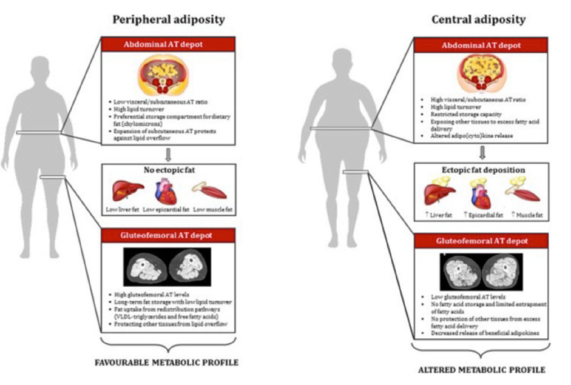
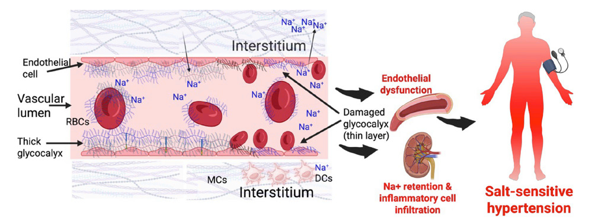
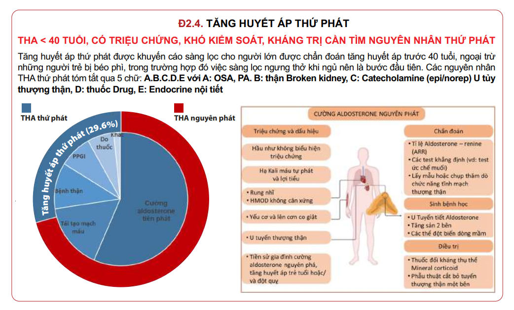
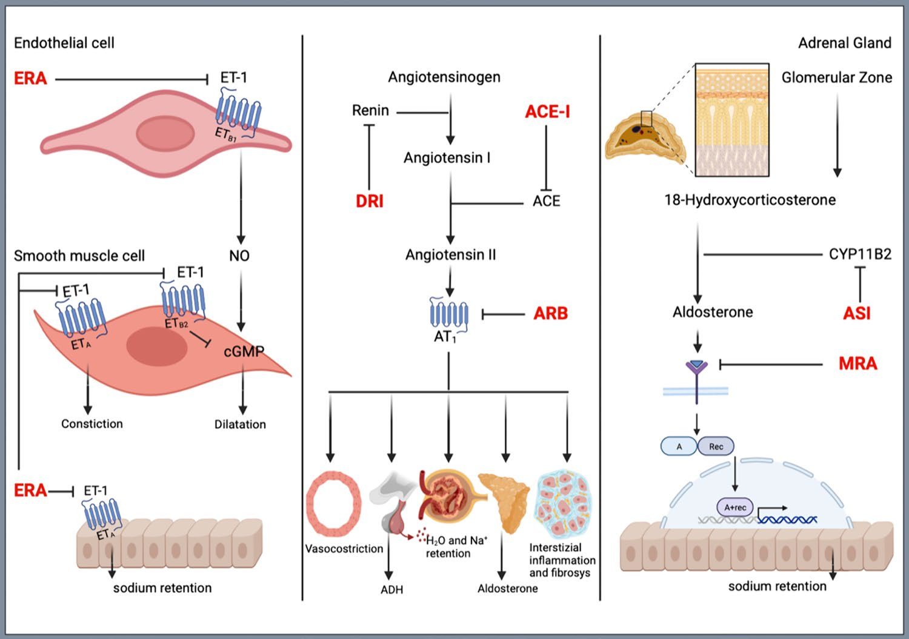
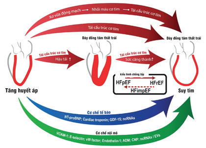

# 🔬 SINH LÝ BỆNH & CƠ CHẾ BỆNH SINH TĂNG HUYẾT ÁP (HYPERTENSION)

<PathoQuickNav />

{/* DẢI CHỈ SỐ NHANH (QUICK STATS STRIP) */}
<section class="stats-strip">
  

    

      
BP = CO × SVR

      
Phương trình huyết động quyết định áp lực động mạch hệ thống

    

    

      
65% - 75%

      
Tỷ lệ nguy cơ THA nguyên phát do béo phì và mỡ tạng bụng

    

    

      
50% Bệnh Nhân

      
Tỷ lệ có kiểu hình nhạy cảm muối (SSBP) và tổn thương Glycocalyx

    

    

      
&lt; 130 mmHg

      
Mục tiêu SBP Class 1 (LoE A) AHA/ACC 2025 ngừa sa sút trí tuệ

    

  

</section>

---

## 1. Huyết Động Học Cơ Bản & Tiến Trình Biến Đổi Theo Tuổi Tác
Huyết áp động mạch là một thang đo liên tục của nguy cơ tim mạch, phản ánh lực đẩy của dòng máu tác động lên thành động mạch trong suốt chu kỳ tim. Về mặt vật lý sinh học, huyết áp được quyết định bởi phương trình cơ bản:

$$\text{BP (Huyết áp)} = \text{CO (Cung lượng tim)} \times \text{SVR (Sức cản mạch máu ngoại vi)}$$

$$\text{CO} = \text{SV (Thể tích nhát bóp)} \times \text{HR (Tần số tim)}$$

  

    
<i class="fa-solid fa-route" style="color: var(--color-primary, #0284c7);"></i> SƠ ĐỒ LÂM SÀNG: PHƯƠNG TRÌNH HUYẾT ĐỘNG HỌC

    Pure Orthogonal SVG
  

  

    <svg class="flowchart-svg" viewBox="0 0 880 284" width="880" height="284" xmlns="http://www.w3.org/2000/svg">
      <defs>
        <marker id="arrBlue" viewBox="0 0 10 10" refX="6" refY="5" markerWidth="6" markerHeight="6" orient="auto-start-reverse">
          <path d="M 0 1.5 L 8 5 L 0 8.5 z" fill="#0284c7"/>
        </marker>
        <marker id="arrGreen" viewBox="0 0 10 10" refX="6" refY="5" markerWidth="6" markerHeight="6" orient="auto-start-reverse">
          <path d="M 0 1.5 L 8 5 L 0 8.5 z" fill="#059669"/>
        </marker>
        <marker id="arrAmber" viewBox="0 0 10 10" refX="6" refY="5" markerWidth="6" markerHeight="6" orient="auto-start-reverse">
          <path d="M 0 1.5 L 8 5 L 0 8.5 z" fill="#d97706"/>
        </marker>
        <marker id="arrRed" viewBox="0 0 10 10" refX="6" refY="5" markerWidth="6" markerHeight="6" orient="auto-start-reverse">
          <path d="M 0 1.5 L 8 5 L 0 8.5 z" fill="#dc2626"/>
        </marker>
      </defs>

      {/* Single Node: PHƯƠNG TRÌNH HUYẾT ĐỘNG HỌC */}
      <rect x="250" y="20" width="380" height="46" rx="10" fill="var(--blue-bg, #eff6ff)" stroke="var(--blue, #0284c7)" stroke-width="1.8"/>
      <text x="440" y="42" text-anchor="middle" font-family="'Plus Jakarta Sans', sans-serif" font-weight="800" font-size="12" fill="var(--color-primary, #0284c7)">PHƯƠNG TRÌNH HUYẾT ĐỘNG HỌC</text>
      {/* Bifurcation Path */}
      <path d="M 440 66 L 440 80 L 235 80 L 235 94" fill="none" stroke="var(--color-border, #cbd5e1)" stroke-width="1.8" marker-end="url(#arrBlue)"/>
      <path d="M 440 80 L 645 80 L 645 94" fill="none" stroke="var(--color-border, #cbd5e1)" stroke-width="1.8" marker-end="url(#arrBlue)"/>
      {/* Left Column: CUNG LƯỢNG TIM (CO) */}
      <rect x="40" y="94" width="390" height="152" rx="10" fill="var(--color-surface-2, #f8fafc)" stroke="var(--color-border, #cbd5e1)" stroke-width="1.5"/>
      <text x="235" y="116" text-anchor="middle" font-family="'Plus Jakarta Sans', sans-serif" font-weight="800" font-size="12" fill="var(--color-text, #0f172a)">CUNG LƯỢNG TIM (CO)</text>
      <line x1="60" y1="130" x2="410" y2="130" stroke="var(--color-border, #cbd5e1)" stroke-width="1"/>
      <text x="60" y="146" text-anchor="start" font-family="'Plus Jakarta Sans', sans-serif" font-size="11" fill="var(--color-text-muted, #475569)">• Tiền tải &amp; Thể tích dịch ngoại bào</text>
      <text x="60" y="164" text-anchor="start" font-family="'Plus Jakarta Sans', sans-serif" font-size="11" fill="var(--color-text-muted, #475569)">• Sức co bóp cơ tim &amp; Tần số tim</text>
      <text x="60" y="182" text-anchor="start" font-family="'Plus Jakarta Sans', sans-serif" font-size="11" fill="var(--color-text-muted, #475569)">• Hoạt tính thần kinh tự chủ giao cảm</text>
      {/* Right Column: SỨC CẢN NGOẠI VI (SVR) */}
      <rect x="450" y="94" width="390" height="152" rx="10" fill="var(--color-surface-2, #f8fafc)" stroke="var(--color-border, #cbd5e1)" stroke-width="1.5"/>
      <text x="645" y="116" text-anchor="middle" font-family="'Plus Jakarta Sans', sans-serif" font-weight="800" font-size="12" fill="var(--color-text, #0f172a)">SỨC CẢN NGOẠI VI (SVR)</text>
      <line x1="470" y1="130" x2="820" y2="130" stroke="var(--color-border, #cbd5e1)" stroke-width="1"/>
      <text x="470" y="146" text-anchor="start" font-family="'Plus Jakarta Sans', sans-serif" font-size="11" fill="var(--color-text-muted, #475569)">• Bán kính tiểu động mạch (Luật</text>
      <text x="470" y="164" text-anchor="start" font-family="'Plus Jakarta Sans', sans-serif" font-size="11" fill="var(--color-text-muted, #475569)">• Poiseuille r^4)</text>
      <text x="470" y="182" text-anchor="start" font-family="'Plus Jakarta Sans', sans-serif" font-size="11" fill="var(--color-text-muted, #475569)">• Trương lực co mạch giao cảm &amp;</text>
      <text x="470" y="200" text-anchor="start" font-family="'Plus Jakarta Sans', sans-serif" font-size="11" fill="var(--color-text-muted, #475569)">• Endothelin-1</text>
      <text x="470" y="218" text-anchor="start" font-family="'Plus Jakarta Sans', sans-serif" font-size="11" fill="var(--color-text-muted, #475569)">• Trạng thái phì đại &amp; xơ cứng thành</text>
      <text x="470" y="236" text-anchor="start" font-family="'Plus Jakarta Sans', sans-serif" font-size="11" fill="var(--color-text-muted, #475569)">• mạch</text>
    </svg>
  

### 1.1. Sự Biến Đổi Tự Nhiên Của Huyết Áp Theo Tuổi Tác

Tiến trình biến đổi của huyết áp qua các giai đoạn cuộc đời có sự phân hóa sâu sắc giữa huyết áp tâm thu và huyết áp tâm trương:

  <table class="table-modern">
    <thead>
      <tr>
        <th>Thành Phần Huyết Áp</th>
        <th>Quy Luật Tiến Triển Theo Tuổi</th>
        <th>Cơ Chế Bệnh Sinh & Kiểu Hình Lâm Sàng</th>
      </tr>
    </thead>
    <tbody>
      <tr>
        <td><strong>Huyết áp tâm thu (HATT / SBP)</strong></td>
        <td>Tăng dần đều đặn, liên tục từ tuổi thanh xuân cho đến cuối đời.</td>
        <td>Hậu quả của quá trình lão hóa mạch máu: lắng đọng collagen, thoái hóa và đứt gãy sợi đàn hồi elastin, làm giảm tính đàn hồi (compliance) và tăng độ cứng động mạch chủ ➔ <strong>Tăng huyết áp tâm thu đơn độc ở người cao tuổi</strong>.</td>
      </tr>
      <tr>
        <td><strong>Huyết áp tâm trương (HATTr / DBP)</strong></td>
        <td>Tăng dần đến khoảng $50\text{ tuổi}$, đi ngang trong 1 thập kỷ, sau đó bắt đầu giảm dần.</td>
        <td>Chi phối bởi sức cản của các tiểu động mạch đề kháng. Sau tuổi 50, sự xơ cứng các động mạch lớn làm mất hiệu ứng đệm gió (Windkessel effect), làm máu chảy nhanh về ngoại vi trong thì tâm thu khiến áp lực tâm trương sụt giảm ➔ <strong>Tăng áp lực kẹp (Pulse Pressure rộng)</strong>.</td>
      </tr>
    </tbody>
  </table>

---

### 1.2. Mối Tương Quan Nguy Cơ Tích Lũy & Tính Không Đảo Ngược

- **Nguy cơ tim mạch liên tục:** Bắt đầu từ mức huyết áp $115/75\text{ mmHg}$, nguy cơ tử vong do đột quỵ não hoặc nhồi máu cơ tim sẽ **tăng gấp đôi với mỗi mức tăng $20/10\text{ mmHg}$** của huyết áp.
- **Tổn thương cấu trúc không thể đảo ngược hoàn toàn:** Mặc dù điều trị hạ áp tích cực có thể đưa huyết áp về mức mục tiêu, nhiều biến đổi cấu trúc mạch máu và mô học cơ quan đích như **xơ cứng động mạch (arterial stiffness), xơ hóa cầu thận (glomerulosclerosis), phì đại thất trái (LVH) và tổn thương chất trắng ở não (cerebral white matter lesions)** có xu hướng tồn tại vĩnh viễn và để lại di chứng lâu dài.

---

## 2. Sinh Lý Bệnh Tăng Huyết Áp Do Béo Phì & Kiểu Hình Mô Mỡ
Béo phì và tăng cân là động lực dịch tễ học hàng đầu, chịu trách nhiệm cho khoảng **$65\% - 75\%$** các trường hợp tăng huyết áp nguyên phát trong cộng đồng thông qua sự tương tác đa chiều giữa thần kinh, thể dịch, nội tiết và cơ học.

### 2.1. Kiểu Hình Phân Bố Mô Mỡ & Sự Tích Tụ Mỡ Lạc Chỗ

Không phải mọi mô mỡ đều có tác động chuyển hóa giống nhau:
- **Mỡ ngoại vi dưới da (Peripheral adiposity):** Tích tụ chủ yếu ở vùng đùi - mông (Gluteofemoral depot), có tốc độ quay vòng lipid chậm, đóng vai trò như kho lưu trữ an toàn bảo vệ cơ thể khỏi tình trạng tràn ngập lipid tự do (lipid overflow).
- **Mỡ tạng trung tâm (Central / Abdominal adiposity):** Tích tụ sâu trong khoang bụng và quanh các cơ quan tạng. Khi khả năng lưu trữ của kho mỡ dưới da bị quá tải, axit béo tự do tràn vào tuần hoàn và lắng đọng tại các cơ quan không chuyên biệt (**Ectopic fat deposition**): gan (*fatty liver*), cơ tim & khoang màng ngoài tim (*epicardial fat*), cơ vân, và quanh thận (*perirenal fat*), khởi phát phản ứng viêm mạn tính và đề kháng insulin.

<figure class="physio-figure" style="display: flex; flex-direction: column; align-items: center; justify-content: center; text-align: center; margin: 2rem auto;">
  
  <figcaption style="margin-top: 0.85rem; font-size: 0.88rem; color: var(--color-text-muted, #64748b); font-style: italic; text-align: center; max-width: 820px; line-height: 1.55;">
    <strong>Hình 1: Hai Kiểu Hình Phân Bố Mô Mỡ &amp; Tác Động Chuyển Hóa Mạch Máu.</strong> (Trái) <em>Kiểu hình mỡ ngoại vi (Peripheral adiposity):</em> Ưu thế kho mỡ đùi - mông bảo vệ cơ thể, không có lắng đọng mỡ lạc chỗ (Favourable profile). (Phải) <em>Kiểu hình mỡ tạng trung tâm (Central adiposity):</em> Quá tải kho mỡ bụng, giải phóng ồ ạt cytokine viêm, lắng đọng mỡ lạc chỗ ở gan, màng ngoài tim và thận, thúc đẩy đề kháng insulin, tăng hoạt giao cảm và tăng huyết áp (Altered profile). Nguồn: <em>Hypertension News - July 2025</em> (Figure 1).
  </figcaption>
</figure>

---

### 2.2. Đề Kháng Insulin & Cường Giao Cảm Bù Trừ

Tình trạng béo phì gây kháng insulin ở các mô chuyển hóa (cơ vân, gan), dẫn đến tăng tiết insulin bù trừ từ tế bào beta đảo tụy.

Nồng độ insulin máu tăng cao tác động lên hệ thần kinh trung ương (vùng dưới đồi), gây **kích thích giao cảm chọn lọc (sympatho-excitation)**, biểu hiện qua sự gia tăng hoạt tính thần kinh giao cảm cơ (Muscle Sympathetic Nerve Activity - MSNA), làm co mạch đề kháng ngoại vi và tăng huyết áp.

---

### 2.3. Kích Hoạt Hệ RAAS Hệ Thống & Nội Tại Mô Mỡ

Người béo phì luôn ở trạng thái quá tải thể tích tuần hoàn và giữ muối — những yếu tố sinh lý thông thường sẽ ức chế tiết renin. Tuy nhiên, bệnh nhân béo phì lại có nồng độ Renin, Angiotensinogen, men chuyển ACE và Aldosterone tăng cao nghịch lý do:

1. **Trục tương tác hai chiều SNS - RAAS:** Hệ giao cảm kích thích trực tiếp tế bào cạnh cầu thận tiết renin qua thụ thể $\beta_1$, và Angiotensin II quay lại tăng cường trương lực giao cảm trung ương.
2. **Hệ RAAS nội tại của mô mỡ (Adipose RAAS):** Các tế bào mỡ (đặc biệt là mô mỡ tạng và mỡ quanh thận) có khả năng tự tổng hợp cục bộ angiotensinogen, enzyme chuyển đổi và Angiotensin II độc lập với hệ thống tuần hoàn chung.

---

### 2.4. Chèn Ép Cơ Học Nhu Mô Thận Bởi Mỡ Quanh Thận (Perirenal Fat)

Sự tích tụ mỡ tạng sau màng bụng và mỡ quanh thận gây ra **sự đè ép vật lý cơ học (mechanical compression)** trực tiếp lên nhu mô thận:

- Gia tăng áp lực kẽ vùng tủy thận, đè ép lên các quai Henle và hệ mạch thẳng *vasa recta*, làm chậm dòng máu chảy qua tủy thận.
- Giảm lượng natri vận chuyển đến vùng vết đặc (*macula densa*) ở ống lượn xa.
- Vết đặc phát tín hiệu bù trừ kích thích tế bào cạnh cầu thận **tăng bài tiết Renin**, thiết lập một vòng xoáy bệnh lý gây tăng áp lực lọc cầu thận, xơ hóa nephron và giữ muối nước mạn tính.

---

### 2.5. Con Đường Trục Leptin - Melanocortin

Leptin do mô mỡ tiết ra tăng cao tỷ lệ thuận với khối lượng mỡ cơ thể. Ở người béo phì, dù có tình trạng đề kháng với tác dụng gây chán ăn của leptin, **tác dụng kích thích thần kinh giao cảm của leptin qua thụ thể melanocortin (MC4R) tại vùng dưới đồi vẫn được bảo tồn hoàn toàn**, thúc đẩy giữ natri ở ống thận và co mạch kéo dài.

---

## 3. Cơ Chế Nhạy Cảm Muối, Bộ Đệm Glycocalyx & Đáp Ứng IPROS
**Nhạy cảm muối của huyết áp (Salt Sensitivity of Blood Pressure - SSBP)** là hiện tượng trị số huyết áp thay đổi song hành trực tiếp với lượng natri nạp vào, ảnh hưởng đến khoảng **$50\%$ bệnh nhân tăng huyết áp** và **$25\%$ người có huyết áp bình thường**.

  

    
<i class="fa-solid fa-route" style="color: var(--color-primary, #0284c7);"></i> SƠ ĐỒ LÂM SÀNG: CHẾ ĐỘ ĂN NHIỀU MUỐI (HIGH SODIUM)

    Pure Orthogonal SVG
  

  

    <svg class="flowchart-svg" viewBox="0 0 880 516" width="880" height="516" xmlns="http://www.w3.org/2000/svg">
      <defs>
        <marker id="arrBlue" viewBox="0 0 10 10" refX="6" refY="5" markerWidth="6" markerHeight="6" orient="auto-start-reverse">
          <path d="M 0 1.5 L 8 5 L 0 8.5 z" fill="#0284c7"/>
        </marker>
        <marker id="arrGreen" viewBox="0 0 10 10" refX="6" refY="5" markerWidth="6" markerHeight="6" orient="auto-start-reverse">
          <path d="M 0 1.5 L 8 5 L 0 8.5 z" fill="#059669"/>
        </marker>
        <marker id="arrAmber" viewBox="0 0 10 10" refX="6" refY="5" markerWidth="6" markerHeight="6" orient="auto-start-reverse">
          <path d="M 0 1.5 L 8 5 L 0 8.5 z" fill="#d97706"/>
        </marker>
        <marker id="arrRed" viewBox="0 0 10 10" refX="6" refY="5" markerWidth="6" markerHeight="6" orient="auto-start-reverse">
          <path d="M 0 1.5 L 8 5 L 0 8.5 z" fill="#dc2626"/>
        </marker>
      </defs>

      {/* Single Node: CHẾ ĐỘ ĂN NHIỀU MUỐI (HIGH SOD */}
      <rect x="250" y="20" width="380" height="46" rx="10" fill="var(--color-surface-2, #f8fafc)" stroke="var(--color-border, #cbd5e1)" stroke-width="1.8"/>
      <text x="440" y="42" text-anchor="middle" font-family="'Plus Jakarta Sans', sans-serif" font-weight="800" font-size="12" fill="var(--color-text, #0f172a)">CHẾ ĐỘ ĂN NHIỀU MUỐI (HIGH SODIUM)</text>
      <line x1="440" y1="66" x2="440" y2="94" stroke="#0284c7" stroke-width="1.8" marker-end="url(#arrBlue)"/>
      {/* Single Node: QUÁ TẢI KHẢ NĂNG ĐỆM CỦA LỚP G */}
      <rect x="145" y="94" width="590" height="60" rx="10" fill="var(--color-surface-2, #f8fafc)" stroke="var(--color-border, #cbd5e1)" stroke-width="1.8"/>
      <text x="440" y="116" text-anchor="middle" font-family="'Plus Jakarta Sans', sans-serif" font-weight="800" font-size="12" fill="var(--color-text, #0f172a)">QUÁ TẢI KHẢ NĂNG ĐỆM CỦA LỚP GLYCOCALYX (HỒNG CẦU &amp; NỘI</text>
      <text x="440" y="134" text-anchor="middle" font-family="'Plus Jakarta Sans', sans-serif" font-weight="600" font-size="12" fill="var(--color-text, #0f172a)">MẠC)</text>
      <line x1="440" y1="154" x2="440" y2="182" stroke="#0284c7" stroke-width="1.8" marker-end="url(#arrBlue)"/>
      {/* Single Node: MỎNG VÀ HỦY HOẠI LỚP BÀN CHẢI  */}
      <rect x="155" y="182" width="570" height="46" rx="10" fill="var(--color-surface-2, #f8fafc)" stroke="var(--color-border, #cbd5e1)" stroke-width="1.8"/>
      <text x="440" y="204" text-anchor="middle" font-family="'Plus Jakarta Sans', sans-serif" font-weight="800" font-size="12" fill="var(--color-text, #0f172a)">MỎNG VÀ HỦY HOẠI LỚP BÀN CHẢI GLYCOCALYX TÍCH ĐIỆN ÂM</text>
      <line x1="440" y1="228" x2="440" y2="256" stroke="#0284c7" stroke-width="1.8" marker-end="url(#arrBlue)"/>
      {/* Single Node: ION Na+ TỰ DO THÂM NHẬP TRỰC T */}
      <rect x="160" y="256" width="560" height="46" rx="10" fill="var(--color-surface-2, #f8fafc)" stroke="var(--color-border, #cbd5e1)" stroke-width="1.8"/>
      <text x="440" y="278" text-anchor="middle" font-family="'Plus Jakarta Sans', sans-serif" font-weight="800" font-size="12" fill="var(--color-text, #0f172a)">ION Na+ TỰ DO THÂM NHẬP TRỰC TIẾP VÀO THÀNH MẠCH MÁU</text>
      <line x1="440" y1="302" x2="440" y2="330" stroke="#0284c7" stroke-width="1.8" marker-end="url(#arrBlue)"/>
      {/* Single Node: ỨC CHẾ GIẢI PHÓNG NITRIC OXIDE */}
      <rect x="160" y="330" width="560" height="60" rx="10" fill="var(--amber-bg, #fffbeb)" stroke="var(--amber, #f59e0b)" stroke-width="1.8"/>
      <text x="440" y="352" text-anchor="middle" font-family="'Plus Jakarta Sans', sans-serif" font-weight="800" font-size="12" fill="var(--amber, #d97706)">ỨC CHẾ GIẢI PHÓNG NITRIC OXIDE (NO) + KÍCH HOẠT VIÊM</text>
      <text x="440" y="370" text-anchor="middle" font-family="'Plus Jakarta Sans', sans-serif" font-weight="600" font-size="12" fill="var(--amber, #d97706)">MẠCH</text>
      <line x1="440" y1="390" x2="440" y2="418" stroke="#0284c7" stroke-width="1.8" marker-end="url(#arrBlue)"/>
      {/* Single Node: ĐÁP ỨNG TĂNG ÁP TỨC THÌ VỚI MU */}
      <rect x="145" y="418" width="590" height="60" rx="10" fill="var(--amber-bg, #fffbeb)" stroke="var(--amber, #f59e0b)" stroke-width="1.8"/>
      <text x="440" y="440" text-anchor="middle" font-family="'Plus Jakarta Sans', sans-serif" font-weight="800" font-size="12" fill="var(--amber, #d97706)">ĐÁP ỨNG TĂNG ÁP TỨC THÌ VỚI MUỐI (IPROS) &amp; XƠ CỨNG ĐỘNG</text>
      <text x="440" y="458" text-anchor="middle" font-family="'Plus Jakarta Sans', sans-serif" font-weight="600" font-size="12" fill="var(--amber, #d97706)">MẠCH</text>
    </svg>
  

### 3.1. Lớp Glycocalyx Hồng Cầu & Nội Mạc Mạch Máu Như Bộ Đệm Natri

Phát hiện sinh lý bệnh học đột phá đã chứng minh vai trò của lớp **Glycocalyx** (lớp màng glycoprotein tích điện âm phủ trên bề mặt tế bào nội mạc và hồng cầu):

- **Trạng thái bình thường:** Lớp glycocalyx dày dặn, tích điện âm mạnh đóng vai trò như một **bộ đệm natri sinh học (sodium buffer)**. Các ion $Na^+$ tích điện dương khi vào máu sẽ bị gắn kết tạm thời và an toàn vào lớp đệm này, ngăn không cho natri tiếp xúc và thâm nhập sâu vào thành mạch.
- **Trạng thái ăn mặn kéo dài:** Lượng muối dư thừa làm quá tải và hủy hoại cấu trúc glycocalyx. Khi màng đệm bị mỏng đi, các ion $Na^+$ thâm nhập trực tiếp vào tế bào nội mạc, làm xơ cứng tế bào, ức chế enzyme eNOS làm giảm giải phóng **Nitric Oxide (NO)**, dẫn đến rối loạn chức năng nội mạc và co thắt mạch.

<figure class="physio-figure" style="display: flex; flex-direction: column; align-items: center; justify-content: center; text-align: center; margin: 2rem auto;">
  
  <figcaption style="margin-top: 0.85rem; font-size: 0.88rem; color: var(--color-text-muted, #64748b); font-style: italic; text-align: center; max-width: 820px; line-height: 1.55;">
    <strong>Hình 2: Cơ Chế Lớp Glycocalyx Hồng Cầu &amp; Nội Mạc Hoạt Động Như Bộ Đệm Natri.</strong> (Trái) <em>Trạng thái bình thường (Moderate sodium)</em>: Lớp glycocalyx dày tích điện âm (bàn chải xanh) bắt giữ an toàn các ion $Na^+$, bảo vệ tế bào nội mạc. (Phải) <em>Trạng thái ăn mặn kéo dài (High-salt state)</em>: Glycocalyx bị phá hủy và mỏng đi, giải phóng ion $Na^+$ tự do thâm nhập qua màng nội mạc vào thành mạch, kích hoạt viêm mạch và gây co thắt tăng huyết áp. Nguồn: <em>Hypertension News - July 2025</em> (Figure 2).
  </figcaption>
</figure>

---

### 3.2. Đáp Ứng Tăng Áp Lực Tức Thì Với Muối (IPROS)

Ở những cá nhân có đặc tính nhạy cảm muối, một bữa ăn mặn duy nhất có thể kích hoạt **Đáp ứng tăng áp lực tức thì (Immediate Pressor Response to Oral Salt - IPROS)**:

$$\text{Huyết áp động mạch trung bình (MAP) tăng vọt } \ge 10\text{ mmHg trong vòng 30 phút sau ăn và kéo dài 2 giờ.}$$

Các đợt tăng vọt huyết áp lặp đi lặp lại sau mỗi bữa ăn mặn gây tổn thương vi mạch tích lũy và thúc đẩy tổn thương cơ quan đích sớm.

---

### 3.3. Vai Trò Đối Kháng Sinh Lý Của Kali & Magie

- **Kali ($K^+$):** Kích thích bơm $Na^+/K^+$-ATPase nội mạc, tăng tổng hợp Nitric Oxide (NO) gây giãn mạch, tăng bài niệu natri ở thận, đồng thời ức chế NADPH oxidase để giảm stress oxy hóa.
- **Magie ($Mg^{2+}$):** Đóng vai trò như một chất chẹn kênh Canxi tự nhiên trên tế bào cơ trơn mạch máu, ngăn co thắt cơ trơn và hỗ trợ kiểm soát huyết áp.

---

## 4. Da — Cơ Quan Nội Tiết & "Hệ Thống Thận Thu Nhỏ Tại Da"
Những nghiên cứu công bố trên *Nature Communications (2025)* và *Hypertension (2024)* đã khẳng định da là một **cơ quan nội tiết độc lập** tham gia trực tiếp vào việc điều hòa huyết áp hệ thống:

  

    
<i class="fa-solid fa-route" style="color: var(--color-primary, #0284c7);"></i> SƠ ĐỒ LÂM SÀNG: DA NHƯ CƠ QUAN NỘI TIẾT VẬN MẠCH

    Pure Orthogonal SVG
  

  

    <svg class="flowchart-svg" viewBox="0 0 880 222" width="880" height="222" xmlns="http://www.w3.org/2000/svg">
      <defs>
        <marker id="arrBlue" viewBox="0 0 10 10" refX="6" refY="5" markerWidth="6" markerHeight="6" orient="auto-start-reverse">
          <path d="M 0 1.5 L 8 5 L 0 8.5 z" fill="#0284c7"/>
        </marker>
        <marker id="arrGreen" viewBox="0 0 10 10" refX="6" refY="5" markerWidth="6" markerHeight="6" orient="auto-start-reverse">
          <path d="M 0 1.5 L 8 5 L 0 8.5 z" fill="#059669"/>
        </marker>
        <marker id="arrAmber" viewBox="0 0 10 10" refX="6" refY="5" markerWidth="6" markerHeight="6" orient="auto-start-reverse">
          <path d="M 0 1.5 L 8 5 L 0 8.5 z" fill="#d97706"/>
        </marker>
        <marker id="arrRed" viewBox="0 0 10 10" refX="6" refY="5" markerWidth="6" markerHeight="6" orient="auto-start-reverse">
          <path d="M 0 1.5 L 8 5 L 0 8.5 z" fill="#dc2626"/>
        </marker>
      </defs>

      {/* Single Node: DA NHƯ CƠ QUAN NỘI TIẾT VẬN MẠ */}
      <rect x="250" y="20" width="380" height="46" rx="10" fill="var(--color-surface-2, #f8fafc)" stroke="var(--color-border, #cbd5e1)" stroke-width="1.8"/>
      <text x="440" y="42" text-anchor="middle" font-family="'Plus Jakarta Sans', sans-serif" font-weight="800" font-size="12" fill="var(--color-text, #0f172a)">DA NHƯ CƠ QUAN NỘI TIẾT VẬN MẠCH</text>
      <path d="M 440 66 L 440 80 L 155 80 L 155 94" fill="none" stroke="var(--color-border, #cbd5e1)" stroke-width="1.8" marker-end="url(#arrBlue)"/>
      <path d="M 440 80 L 440 80 L 440 94" fill="none" stroke="var(--red, #ef4444)" stroke-width="1.8" marker-end="url(#arrRed)"/>
      <path d="M 440 80 L 725 80 L 725 94" fill="none" stroke="var(--color-border, #cbd5e1)" stroke-width="1.8" marker-end="url(#arrBlue)"/>
      <rect x="30" y="94" width="250" height="90" rx="8" fill="var(--color-surface-2, #f8fafc)" stroke="var(--color-border, #cbd5e1)" stroke-width="1.5"/>
      <text x="155" y="116" text-anchor="middle" font-family="'Plus Jakarta Sans', sans-serif" font-weight="700" font-size="11.5" fill="var(--color-text, #0f172a)">TỔNG HỢP HORMONE TẠI CHỖ</text>
      <line x1="45" y1="124" x2="265" y2="124" stroke="var(--color-border, #cbd5e1)" stroke-width="1"/>
      <text x="42" y="140" text-anchor="start" font-family="'Plus Jakarta Sans', sans-serif" font-size="10.5" fill="var(--color-text-muted, #475569)">• Tế bào sừng &amp; Fibroblasts</text>
      <text x="42" y="158" text-anchor="start" font-family="'Plus Jakarta Sans', sans-serif" font-size="10.5" fill="var(--color-text-muted, #475569)">• Tự tiết Ang II, Aldosterone</text>
      <text x="42" y="176" text-anchor="start" font-family="'Plus Jakarta Sans', sans-serif" font-size="10.5" fill="var(--color-text-muted, #475569)">• Catecholamine, Bradykinin</text>
      <rect x="315" y="94" width="250" height="90" rx="8" fill="var(--red-bg, #fef2f2)" stroke="var(--red, #ef4444)" stroke-width="1.5"/>
      <text x="440" y="116" text-anchor="middle" font-family="'Plus Jakarta Sans', sans-serif" font-weight="700" font-size="11.5" fill="var(--red, #dc2626)">BẢO TỒN NƯỚC QUA DA</text>
      <line x1="330" y1="124" x2="550" y2="124" stroke="var(--color-border, #cbd5e1)" stroke-width="1"/>
      <text x="327" y="140" text-anchor="start" font-family="'Plus Jakarta Sans', sans-serif" font-size="10.5" fill="var(--color-text, #0f172a)">• Co mạch đề kháng ở da</text>
      <text x="327" y="158" text-anchor="start" font-family="'Plus Jakarta Sans', sans-serif" font-size="10.5" fill="var(--color-text, #0f172a)">• ,    - Giảm mất nước thượng b</text>
      <text x="327" y="176" text-anchor="start" font-family="'Plus Jakarta Sans', sans-serif" font-size="10.5" fill="var(--color-text, #0f172a)">• Giữ dịch ngoại bào quá mức</text>
      <rect x="600" y="94" width="250" height="90" rx="8" fill="var(--color-surface-2, #f8fafc)" stroke="var(--color-border, #cbd5e1)" stroke-width="1.5"/>
      <text x="725" y="116" text-anchor="middle" font-family="'Plus Jakarta Sans', sans-serif" font-weight="700" font-size="11.5" fill="var(--color-text, #0f172a)">TUYẾN MỒ HÔI: THẬN THU NHỎ</text>
      <line x1="615" y1="124" x2="835" y2="124" stroke="var(--color-border, #cbd5e1)" stroke-width="1"/>
      <text x="612" y="140" text-anchor="start" font-family="'Plus Jakarta Sans', sans-serif" font-size="10.5" fill="var(--color-text-muted, #475569)">• Biểu hiện kênh ENaC</text>
      <text x="612" y="158" text-anchor="start" font-family="'Plus Jakarta Sans', sans-serif" font-size="10.5" fill="var(--color-text-muted, #475569)">• ì         - Bơm Na+/K+-ATPase</text>
      <text x="612" y="176" text-anchor="start" font-family="'Plus Jakarta Sans', sans-serif" font-size="10.5" fill="var(--color-text-muted, #475569)">• Tái hấp thu Na+ dưới tác dụng MR</text>
    </svg>
  

### 4.1. Tự Tổng Hợp Các Hormone Vận Mạch Tại Chỗ

Tế bào sừng (*keratinocytes*) và nguyên bào sợi trung bì sở hữu đầy đủ hệ thống enzyme để tự tổng hợp: **Angiotensin II, Aldosterone, Catecholamine, Substance P và Bradykinin** với nồng độ tại chỗ độc lập hoàn toàn với nồng độ trong máu.

Sự thiếu hụt protein liên kết thụ thể Angiotensin II đặc hiệu ở tế bào sừng kích hoạt hệ RAAS tại da, gây co thắt mạng lưới tiểu động mạch da và làm tăng huyết áp hệ thống.

---

### 4.2. Tuyến Mồ Hôi Như Những "Hệ Thống Thận Thu Nhỏ Tại Da" (Cutaneous Mini-Kidneys)

Ống xa của tuyến mồ hôi có cấu trúc và chức năng tương đồng sinh học đáng kinh ngạc với tế bào ống góp của thận:
- Biểu hiện đầy đủ kênh natri biểu mô **ENaC** và bơm **$Na^+/K^+$-ATPase**.
- Chịu sự điều hòa trực tiếp của thụ thể Mineralocorticoid (MR) và thụ thể Angiotensin II tại da.
- **Mối tương quan nghịch:** Nồng độ natri trong mồ hôi càng thấp phản ánh hoạt động tái hấp thu $Na^+$ của các "thận mini" này càng mạnh, dẫn đến giữ muối nước và làm tăng huyết áp.

---

## 5. Viêm Mạn Tính Hệ Thống, Thể Viêm NLRP3 & Tương Tác Miễn Dịch
Tăng huyết áp được thúc đẩy trực tiếp bởi tình trạng **viêm mạn tính mức độ thấp (low-grade chronic inflammation)** và sự thâm nhiễm tế bào miễn dịch tại mạch máu, thận, tim và não:

  

    
<i class="fa-solid fa-route" style="color: var(--color-primary, #0284c7);"></i> SƠ ĐỒ LÂM SÀNG: KÍCH THÍCH BAN ĐẦU: CƯỜNG GIAO CẢM, ĂN MẶN, ANG II

    Pure Orthogonal SVG
  

  

    <svg class="flowchart-svg" viewBox="0 0 880 456" width="880" height="456" xmlns="http://www.w3.org/2000/svg">
      <defs>
        <marker id="arrBlue" viewBox="0 0 10 10" refX="6" refY="5" markerWidth="6" markerHeight="6" orient="auto-start-reverse">
          <path d="M 0 1.5 L 8 5 L 0 8.5 z" fill="#0284c7"/>
        </marker>
        <marker id="arrGreen" viewBox="0 0 10 10" refX="6" refY="5" markerWidth="6" markerHeight="6" orient="auto-start-reverse">
          <path d="M 0 1.5 L 8 5 L 0 8.5 z" fill="#059669"/>
        </marker>
        <marker id="arrAmber" viewBox="0 0 10 10" refX="6" refY="5" markerWidth="6" markerHeight="6" orient="auto-start-reverse">
          <path d="M 0 1.5 L 8 5 L 0 8.5 z" fill="#d97706"/>
        </marker>
        <marker id="arrRed" viewBox="0 0 10 10" refX="6" refY="5" markerWidth="6" markerHeight="6" orient="auto-start-reverse">
          <path d="M 0 1.5 L 8 5 L 0 8.5 z" fill="#dc2626"/>
        </marker>
      </defs>

      {/* Single Node: KÍCH THÍCH BAN ĐẦU: CƯỜNG GIAO */}
      <rect x="170" y="20" width="540" height="46" rx="10" fill="var(--color-surface-2, #f8fafc)" stroke="var(--color-border, #cbd5e1)" stroke-width="1.8"/>
      <text x="440" y="42" text-anchor="middle" font-family="'Plus Jakarta Sans', sans-serif" font-weight="800" font-size="12" fill="var(--color-text, #0f172a)">KÍCH THÍCH BAN ĐẦU: CƯỜNG GIAO CẢM, ĂN MẶN, ANG II</text>
      <line x1="440" y1="66" x2="440" y2="94" stroke="#0284c7" stroke-width="1.8" marker-end="url(#arrBlue)"/>
      {/* Single Node: LÁCH &amp; CƠ QUAN LYMPHO PHÓNG TH */}
      <rect x="170" y="94" width="540" height="60" rx="10" fill="var(--color-surface-2, #f8fafc)" stroke="var(--color-border, #cbd5e1)" stroke-width="1.8"/>
      <text x="440" y="116" text-anchor="middle" font-family="'Plus Jakarta Sans', sans-serif" font-weight="800" font-size="12" fill="var(--color-text, #0f172a)">LÁCH &amp; CƠ QUAN LYMPHO PHÓNG THÍCH TẾ BÀO MIỄN DỊCH</text>
      <text x="440" y="134" text-anchor="middle" font-family="'Plus Jakarta Sans', sans-serif" font-weight="600" font-size="12" fill="var(--color-text, #0f172a)">(TH17, CD8+, ĐẠI THỰC BÀO)</text>
      <line x1="440" y1="154" x2="440" y2="182" stroke="#0284c7" stroke-width="1.8" marker-end="url(#arrBlue)"/>
      {/* Single Node: THÂM NHIỄM VÀO THÀNH MẠCH (LỚP */}
      <rect x="155" y="182" width="570" height="60" rx="10" fill="var(--color-surface-2, #f8fafc)" stroke="var(--color-border, #cbd5e1)" stroke-width="1.8"/>
      <text x="440" y="204" text-anchor="middle" font-family="'Plus Jakarta Sans', sans-serif" font-weight="800" font-size="12" fill="var(--color-text, #0f172a)">THÂM NHIỄM VÀO THÀNH MẠCH (LỚP MỠ QUANH MẠCH) &amp; MÔ KẼ</text>
      <text x="440" y="222" text-anchor="middle" font-family="'Plus Jakarta Sans', sans-serif" font-weight="600" font-size="12" fill="var(--color-text, #0f172a)">THẬN</text>
      <line x1="440" y1="242" x2="440" y2="270" stroke="#0284c7" stroke-width="1.8" marker-end="url(#arrBlue)"/>
      {/* Single Node: GIẢI PHÓNG CYTOKINES: IL-17, I */}
      <rect x="150" y="270" width="580" height="60" rx="10" fill="var(--color-surface-2, #f8fafc)" stroke="var(--color-border, #cbd5e1)" stroke-width="1.8"/>
      <text x="440" y="292" text-anchor="middle" font-family="'Plus Jakarta Sans', sans-serif" font-weight="800" font-size="12" fill="var(--color-text, #0f172a)">GIẢI PHÓNG CYTOKINES: IL-17, IFN-γ, TNF-α, IL-6 &amp; HOẠT</text>
      <text x="440" y="310" text-anchor="middle" font-family="'Plus Jakarta Sans', sans-serif" font-weight="600" font-size="12" fill="var(--color-text, #0f172a)">HÓA THỂ VIÊM NLRP3 ➔ IL-1β</text>
      <line x1="440" y1="330" x2="440" y2="358" stroke="#0284c7" stroke-width="1.8" marker-end="url(#arrBlue)"/>
      {/* Single Node: STRESS OXY HÓA MẠCH MÁU + TĂNG */}
      <rect x="160" y="358" width="560" height="60" rx="10" fill="var(--amber-bg, #fffbeb)" stroke="var(--amber, #f59e0b)" stroke-width="1.8"/>
      <text x="440" y="380" text-anchor="middle" font-family="'Plus Jakarta Sans', sans-serif" font-weight="800" font-size="12" fill="var(--amber, #d97706)">STRESS OXY HÓA MẠCH MÁU + TĂNG TÁI HẤP THU NATRI ỐNG</text>
      <text x="440" y="398" text-anchor="middle" font-family="'Plus Jakarta Sans', sans-serif" font-weight="600" font-size="12" fill="var(--amber, #d97706)">THẬN ➔ TĂNG HUYẾT ÁP TIẾN TRIỂN</text>
    </svg>
  

### 5.1. Thâm Nhiễm Tế Bào Miễn Dịch & Vai Trò Của Cytokine Tiền Viêm

- **Tế bào T CD8+ và TH17:** Thâm nhiễm vào lớp mỡ quanh mạch (*perivascular adipose tissue - PVAT*) và mô kẽ thận, giải phóng **IL-17 và IFN-$\gamma$**, gây rối loạn chức năng nội mạc thông qua kích hoạt enzyme NADPH oxidase sinh ra các gốc tự do ROS.
- **Thể viêm NLRP3 (NLRP3 Inflammasome) & IL-1$\beta$:** Hoạt hóa thể viêm NLRP3 trong tế bào biểu mô ống thận và đại thực bào làm tăng giải phóng **Interleukin-1$\beta$ ($IL-1\beta$)**, trực tiếp kích thích tăng tái hấp thu natri ở ống thận.
- **NETosis:** Bạch cầu trung tính giải phóng các bẫy ngoại bào (Neutrophil Extracellular Traps - NETs), trực tiếp gây viêm và xơ cứng thành mạch.

---

## 6. Sinh Lý Bệnh Tăng Huyết Áp Thứ Phát (PA, RVH, OSA)
Tăng huyết áp thứ phát chiếm khoảng **$5\% - 25\%$** các trường hợp tăng huyết áp ở người lớn. Việc phát hiện sớm giúp điều trị triệt căn nguyên nhân và ngăn ngừa tổn thương cơ quan đích nặng nề:

  

    
<i class="fa-solid fa-route" style="color: var(--color-primary, #0284c7);"></i> SƠ ĐỒ LÂM SÀNG: TĂNG HUYẾT ÁP THỨ PHÁT

    Pure Orthogonal SVG
  

  

    <svg class="flowchart-svg" viewBox="0 0 880 222" width="880" height="222" xmlns="http://www.w3.org/2000/svg">
      <defs>
        <marker id="arrBlue" viewBox="0 0 10 10" refX="6" refY="5" markerWidth="6" markerHeight="6" orient="auto-start-reverse">
          <path d="M 0 1.5 L 8 5 L 0 8.5 z" fill="#0284c7"/>
        </marker>
        <marker id="arrGreen" viewBox="0 0 10 10" refX="6" refY="5" markerWidth="6" markerHeight="6" orient="auto-start-reverse">
          <path d="M 0 1.5 L 8 5 L 0 8.5 z" fill="#059669"/>
        </marker>
        <marker id="arrAmber" viewBox="0 0 10 10" refX="6" refY="5" markerWidth="6" markerHeight="6" orient="auto-start-reverse">
          <path d="M 0 1.5 L 8 5 L 0 8.5 z" fill="#d97706"/>
        </marker>
        <marker id="arrRed" viewBox="0 0 10 10" refX="6" refY="5" markerWidth="6" markerHeight="6" orient="auto-start-reverse">
          <path d="M 0 1.5 L 8 5 L 0 8.5 z" fill="#dc2626"/>
        </marker>
      </defs>

      {/* Single Node: TĂNG HUYẾT ÁP THỨ PHÁT */}
      <rect x="250" y="20" width="380" height="46" rx="10" fill="var(--amber-bg, #fffbeb)" stroke="var(--amber, #f59e0b)" stroke-width="1.8"/>
      <text x="440" y="42" text-anchor="middle" font-family="'Plus Jakarta Sans', sans-serif" font-weight="800" font-size="12" fill="var(--amber, #d97706)">TĂNG HUYẾT ÁP THỨ PHÁT</text>
      <path d="M 440 66 L 440 80 L 155 80 L 155 94" fill="none" stroke="var(--amber, #f59e0b)" stroke-width="1.8" marker-end="url(#arrAmber)"/>
      <path d="M 440 80 L 440 80 L 440 94" fill="none" stroke="var(--color-border, #cbd5e1)" stroke-width="1.8" marker-end="url(#arrBlue)"/>
      <path d="M 440 80 L 725 80 L 725 94" fill="none" stroke="var(--color-border, #cbd5e1)" stroke-width="1.8" marker-end="url(#arrBlue)"/>
      <rect x="30" y="94" width="250" height="90" rx="8" fill="var(--amber-bg, #fffbeb)" stroke="var(--amber, #f59e0b)" stroke-width="1.5"/>
      <text x="155" y="116" text-anchor="middle" font-family="'Plus Jakarta Sans', sans-serif" font-weight="700" font-size="11.5" fill="var(--amber, #d97706)">CƯỜNG ALDOSTERONE NGUYÊN PHÁT</text>
      <line x1="45" y1="124" x2="265" y2="124" stroke="var(--color-border, #cbd5e1)" stroke-width="1"/>
      <text x="42" y="140" text-anchor="start" font-family="'Plus Jakarta Sans', sans-serif" font-size="10.5" fill="var(--color-text, #0f172a)">• Tiết Aldosterone tự trị</text>
      <text x="42" y="158" text-anchor="start" font-family="'Plus Jakarta Sans', sans-serif" font-size="10.5" fill="var(--color-text, #0f172a)">• Giữ Na+, thải K+ qua ENaC</text>
      <text x="42" y="176" text-anchor="start" font-family="'Plus Jakarta Sans', sans-serif" font-size="10.5" fill="var(--color-text, #0f172a)">• Renin huyết tương bị ức chế</text>
      <rect x="315" y="94" width="250" height="90" rx="8" fill="var(--color-surface-2, #f8fafc)" stroke="var(--color-border, #cbd5e1)" stroke-width="1.5"/>
      <text x="440" y="116" text-anchor="middle" font-family="'Plus Jakarta Sans', sans-serif" font-weight="700" font-size="11.5" fill="var(--color-text, #0f172a)">HẸP ĐỘNG MẠCH THẬN (RVH)</text>
      <line x1="330" y1="124" x2="550" y2="124" stroke="var(--color-border, #cbd5e1)" stroke-width="1"/>
      <text x="327" y="140" text-anchor="start" font-family="'Plus Jakarta Sans', sans-serif" font-size="10.5" fill="var(--color-text-muted, #475569)">• Xơ vữa (90%) / FMD (10%)</text>
      <text x="327" y="158" text-anchor="start" font-family="'Plus Jakarta Sans', sans-serif" font-size="10.5" fill="var(--color-text-muted, #475569)">• Thiếu máu thận ➔ ↑ Renin</text>
      <text x="327" y="176" text-anchor="start" font-family="'Plus Jakarta Sans', sans-serif" font-size="10.5" fill="var(--color-text-muted, #475569)">• Mô hình Goldblatt 1 kẹp/2kẹp</text>
      <rect x="600" y="94" width="250" height="90" rx="8" fill="var(--color-surface-2, #f8fafc)" stroke="var(--color-border, #cbd5e1)" stroke-width="1.5"/>
      <text x="725" y="116" text-anchor="middle" font-family="'Plus Jakarta Sans', sans-serif" font-weight="700" font-size="11.5" fill="var(--color-text, #0f172a)">HỘI CHỨNG NGƯNG THỞ KHI NGỦ (OSA)</text>
      <line x1="615" y1="124" x2="835" y2="124" stroke="var(--color-border, #cbd5e1)" stroke-width="1"/>
      <text x="612" y="140" text-anchor="start" font-family="'Plus Jakarta Sans', sans-serif" font-size="10.5" fill="var(--color-text-muted, #475569)">• Thiếu oxy gián đoạn (CIH)</text>
      <text x="612" y="158" text-anchor="start" font-family="'Plus Jakarta Sans', sans-serif" font-size="10.5" fill="var(--color-text-muted, #475569)">• Cường giao cảm cực độ ban đêm</text>
      <text x="612" y="176" text-anchor="start" font-family="'Plus Jakarta Sans', sans-serif" font-size="10.5" fill="var(--color-text-muted, #475569)">• Mất trũng huyết áp (Non-dipper)</text>
    </svg>
  

### 6.1. Cường Aldosterone Nguyên Phát (Primary Aldosteronism - PA)

- **Dịch tễ & Tầm soát:** Chiếm $5\% - 10\%$ bệnh nhân tăng huyết áp nói chung và lên tới $20\%$ bệnh nhân tăng huyết áp kháng trị. **AHA/ACC 2025 khuyến cáo tầm soát PA (qua tỉ số Aldosterone/Renin - ARR) cho tất cả bệnh nhân THA giai đoạn 2 hoặc THA kháng trị, bất kể có hạ Kali máu hay không** (vì $> 50\%$ bệnh nhân PA có Kali máu bình thường).
- **Cơ chế phân tử:** U tuyến vỏ thượng thận (*aldosteronoma*) hoặc tăng sản vỏ thượng thận hai bên tiết aldosterone tự trị:
  1. Gắn vào thụ thể Mineralocorticoid (MR) ở ống lượn xa và ống góp.
  2. Tăng biểu hiện kênh **ENaC** và bơm **$Na^+/K^+$-ATPase**, tăng giữ $Na^+$ và nước, tăng đào thải $K^+$ và $H^+$.
  3. Quá tải thể tích ức chế tiết Renin ($\text{Renin activity} < 1\text{ ng/mL/h}$).
- **Độc tính mô học độc lập với huyết áp:** Aldosterone gây độc trực tiếp lên tim mạch: tăng gấp **2,0 lần nguy cơ suy tim, 2,8 lần đột quỵ, 1,7 lần bệnh vành và 4,0 lần rung nhĩ** so với THA nguyên phát cùng trị số huyết áp.

<figure class="physio-figure" style="display: flex; flex-direction: column; align-items: center; justify-content: center; text-align: center; margin: 2rem auto;">
  
  <figcaption style="margin-top: 0.85rem; font-size: 0.88rem; color: var(--color-text-muted, #64748b); font-style: italic; text-align: center; max-width: 820px; line-height: 1.55;">
    <strong>Hình 3: Quy Trình Tiếp Cận &amp; Sinh Bệnh Học Cường Aldosterone Nguyên Phát (PA).</strong> Manh mối lâm sàng: THA khởi phát sớm (&lt; 40 tuổi), hạ Kali máu tự phát/sau lợi tiểu, THA kháng trị, tổn thương cơ quan đích không cân xứng, u tuyến thượng thận tình cờ. Sàng lọc ban đầu bằng tỉ số ARR. Bệnh sinh do U tuyến tiết aldosterone một bên (Conn) hoặc Tăng sản hai bên vỏ thượng thận. Điều trị đặc hiệu bằng thuốc đối kháng MR (Spironolactone, Eplerenone) hoặc phẫu thuật nội soi cắt tuyến thượng thận. Nguồn: <em>Đồng thuận VSH/VNHA 2024</em> (Hình 12).
  </figcaption>
</figure>

---

### 6.2. Hẹp Động Mạch Thận (Renovascular Hypertension - RVH)

Nguyên nhân do Xơ vữa động mạch thận (ARAS, chiếm 90% ở người lớn tuổi) hoặc Loạn sản cơ sợi (FMD, chiếm 10% ở phụ nữ trẻ):

- **Mô hình Goldblatt 2 thận 1 kẹp:** Thận bị hẹp giảm áp lực tưới máu ➔ Tăng tiết Renin ➔ Tạo Angiotensin II gây co mạch hệ thống và tiết Aldosterone. Thận đối bên lành lặn tăng áp lực tưới máu sẽ kích hoạt **bài niệu natri do áp lực (pressure natriuresis)** để thải bớt dịch, duy trì thể THA phụ thuộc renin cao.
- **Mô hình Goldblatt 1 thận 1 kẹp (Hẹp 2 bên hoặc hẹp trên thận độc nhất):** Không có thận lành để bài niệu áp lực ➔ Giữ muối nước nghiêm trọng ➔ THA phụ thuộc thể tích.
- **Dấu hiệu cảnh báo lâm sàng:** Phù phổi cấp tái diễn chớp nhoáng (*Flash pulmonary edema*) hoặc **suy thận cấp (Creatinine tăng $> 30\%$ hoặc eGFR giảm rõ rệt)** ngay sau khi khởi trị thuốc ức chế men chuyển ACEi hoặc chẹn thụ thể ARB (do làm giãn tiểu động mạch đi, làm sụt áp lực lọc cầu thận).

---

### 6.3. Hội Chứng Ngưng Thở Khi Ngủ Do Tắc Nghẽn (OSA)

- Gặp ở $25\% - 50\%$ bệnh nhân THA và lên tới $70\% - 80\%$ bệnh nhân THA kháng trị.
- **Cơ chế:** Xẹp đường thở lặp đi lặp lại ➔ Thiếu oxy máu gián đoạn (*Chronic Intermittent Hypoxia - CIH*) và tăng $CO_2$ máu ➔ Kích thích hóa cảm thụ quan xoang cảnh ➔ Phóng thích Catecholamine ồ ạt từ hệ giao cảm suốt đêm.
- **Hệ quả:** Làm đảo lộn nhịp sinh học huyết áp, gây **mất trũng huyết áp ban đêm (Non-dipper)** hoặc tăng vọt huyết áp nghịch đảo ban đêm (**Reverse-dipper**), làm tăng gấp 3 lần nguy cơ đột quỵ và sa sút trí tuệ.

---

## 7. Tăng Huyết Áp Kháng Trị & Các Đích Tác Động Phân Tử Mới
**Tăng huyết áp kháng trị (Resistant Hypertension - RHTN)** là tình trạng huyết áp không đạt mục tiêu kiểm soát dù đã phối hợp tối ưu **3 nhóm thuốc hạ áp khác nhau** ở liều tối đa dung nạp (bắt buộc gồm: 1 thuốc ức chế RAAS + 1 thuốc CCB Dihydropyridine + 1 thuốc lợi tiểu giống Thiazide).

### 7.1. Phân Biệt Kháng Trị Thực Sự (True RHTN) & Giả Kháng Trị (Pseudoresistance)

  <table class="table-modern">
    <thead>
      <tr>
        <th>Yếu Tố Gây Giả Kháng Trị</th>
        <th>Cơ Chế Tác Động & Sai Lệch Trị Số</th>
        <th>Biện Pháp Khắc Phục Chuẩn EBM</th>
      </tr>
    </thead>
    <tbody>
      <tr>
        <td><strong>Kém tuân thủ điều trị (Non-adherence)</strong></td>
        <td>Chiếm tới $50\%$ số ca huyết áp không kiểm soát được do quên uống thuốc, sợ tác dụng phụ hoặc chế độ uống phức tạp.</td>
        <td>Sử dụng viên phối hợp liều cố định (Single Pill Combination - SPC), đo nồng độ thuốc trong nước tiểu hoặc giám sát uống thuốc trực tiếp.</td>
      </tr>
      <tr>
        <td><strong>Hiệu ứng áo choàng trắng (White-coat effect)</strong></td>
        <td>Tăng hoạt giao cảm phản ứng khi gặp nhân viên y tế làm huyết áp phòng khám tăng cao, trong khi huyết áp ở nhà bình thường.</td>
        <td>Bắt buộc đo huyết áp lưu động 24 giờ (ABPM) hoặc theo dõi huyết áp tại nhà (HBPM) chuẩn 7 ngày.</td>
      </tr>
      <tr>
        <td><strong>Kỹ thuật đo sai lệch</strong></td>
        <td>Bao quấn quá nhỏ (tăng $5 - 20\text{ mmHg}$), bàng quang đầy (tăng $4 - 33\text{ mmHg}$), nói chuyện khi đo (tăng $4 - 19\text{ mmHg}$).</td>
        <td>Chuẩn hóa quy trình đo huyết áp tự động không có nhân viên y tế (AOBP) theo khuyến cáo AHA 2025.</td>
      </tr>
      <tr>
        <td><strong>Tương tác thuốc dùng kèm</strong></td>
        <td>NSAIDs (ức chế prostaglandin giãn mạch tại thận), Corticosteroid (giữ muối nước), Thuốc thông mũi cường giao cảm, Cam thảo.</td>
        <td>Rà soát toàn bộ đơn thuốc và ngừng các thuốc làm tăng huyết áp nếu có thể.</td>
      </tr>
    </tbody>
  </table>

---

### 7.2. Cơ Chế Sinh Lý Bệnh Cốt Lõi & Bằng Chứng EBM Của Thuốc Hàng Thứ 4

1. **Quá tải thể tích dịch nội mạch tiềm ẩn:** Là cơ chế phổ biến nhất ở bệnh nhân THA kháng trị thực sự.
2. **Ưu thế tuyệt đối của Spironolactone (Thuốc hàng thứ 4):** Thử nghiệm lâm sàng kinh điển **PATHWAY-2** (Lancet), **DENERVHTA** và **ReHOT** đã chứng minh **Spironolactone ($25 - 50\text{ mg/ngày}$)** có hiệu quả hạ áp vượt trội hơn hẳn so với việc tăng liều chẹn beta (Bisoprolol), chẹn alpha (Doxazosin) hoặc Clonidine, nhờ khả năng đối kháng tình trạng thừa Aldosterone tương đối và ức chế giữ muối nước tại ống lượn xa.

<figure class="physio-figure" style="display: flex; flex-direction: column; align-items: center; justify-content: center; text-align: center; margin: 2rem auto;">
  
  <figcaption style="margin-top: 0.85rem; font-size: 0.88rem; color: var(--color-text-muted, #64748b); font-style: italic; text-align: center; max-width: 820px; line-height: 1.55;">
    <strong>Hình 4: Các Con Đường Phân Tử Cốt Lõi &amp; Đích Tác Động Của Thuốc Điều Trị Tăng Huyết Áp Mới.</strong> Sơ đồ minh họa 3 con đường sinh học chính: (1) <em>Trục RAAS</em> (ACEi, ARB, nsMRA Finerenone); (2) <em>Hệ Endothelin-1</em> (Thuốc đối kháng thụ thể kép $ET_A/ET_B$ Aprocitentan); (3) <em>Enzyme Aldosterone Synthase CYP11B2</em> (Thuốc ức chế chọn lọc tổng hợp aldosterone Baxdrostat, Lorundrostat). Nguồn: <em>New Drug Strategies for Treating Resistant Hypertension</em> (Figure 1, 2024).
  </figcaption>
</figure>

---

## 8. Tổn Thương Cơ Quan Đích Do Tăng Huyết Áp (HMOD: Tim, Não, Thận, Mắt)
Tăng huyết áp kéo dài truyền tải áp lực cơ học cao và sức căng thành mạch liên tục lên hệ vi tuần hoàn, gây tổn thương cơ quan đích (**Hypertension-Mediated Organ Damage - HMOD**):

  

    
<i class="fa-solid fa-route" style="color: var(--color-primary, #0284c7);"></i> SƠ ĐỒ LÂM SÀNG: TỔN THƯƠNG CƠ QUAN ĐÍCH DO TĂNG HUYẾT ÁP (HMOD)

    Pure Orthogonal SVG
  

  

    <svg class="flowchart-svg" viewBox="0 0 880 280" width="880" height="280" xmlns="http://www.w3.org/2000/svg">
      <defs>
        <marker id="arrBlue" viewBox="0 0 10 10" refX="6" refY="5" markerWidth="6" markerHeight="6" orient="auto-start-reverse">
          <path d="M 0 1.5 L 8 5 L 0 8.5 z" fill="#0284c7"/>
        </marker>
        <marker id="arrGreen" viewBox="0 0 10 10" refX="6" refY="5" markerWidth="6" markerHeight="6" orient="auto-start-reverse">
          <path d="M 0 1.5 L 8 5 L 0 8.5 z" fill="#059669"/>
        </marker>
        <marker id="arrAmber" viewBox="0 0 10 10" refX="6" refY="5" markerWidth="6" markerHeight="6" orient="auto-start-reverse">
          <path d="M 0 1.5 L 8 5 L 0 8.5 z" fill="#d97706"/>
        </marker>
        <marker id="arrRed" viewBox="0 0 10 10" refX="6" refY="5" markerWidth="6" markerHeight="6" orient="auto-start-reverse">
          <path d="M 0 1.5 L 8 5 L 0 8.5 z" fill="#dc2626"/>
        </marker>
      </defs>

      {/* Single Node: TỔN THƯƠNG CƠ QUAN ĐÍCH DO TĂN */}
      <rect x="165" y="20" width="550" height="222" rx="10" fill="var(--red-bg, #fef2f2)" stroke="var(--red, #ef4444)" stroke-width="1.8"/>
      <text x="440" y="42" text-anchor="middle" font-family="'Plus Jakarta Sans', sans-serif" font-weight="800" font-size="12" fill="var(--red, #dc2626)">TỔN THƯƠNG CƠ QUAN ĐÍCH DO TĂNG HUYẾT ÁP (HMOD)</text>
      <text x="189" y="64" text-anchor="start" font-family="'Plus Jakarta Sans', sans-serif" font-size="11" fill="var(--color-text, #0f172a)">• [TIM MẠCH] [NÃO BỘ] [THẬN] [MẮT / VÕNG MẠC]</text>
      <text x="189" y="82" text-anchor="start" font-family="'Plus Jakarta Sans', sans-serif" font-size="11" fill="var(--color-text, #0f172a)">• Phì đại đồng tâm LVH - Xuất huyết não (vi phình) - Xơ cứng</text>
      <text x="189" y="100" text-anchor="start" font-family="'Plus Jakarta Sans', sans-serif" font-size="11" fill="var(--color-text, #0f172a)">• mạch nhập - Co nhỏ tiểu ĐM</text>
      <text x="189" y="118" text-anchor="start" font-family="'Plus Jakarta Sans', sans-serif" font-size="11" fill="var(--color-text, #0f172a)">• Rối loạn tâm trương ➔ - Nhồi máu não (xơ vữa) - Tăng áp lực</text>
      <text x="189" y="136" text-anchor="start" font-family="'Plus Jakarta Sans', sans-serif" font-size="11" fill="var(--color-text, #0f172a)">• lọc - Xuất huyết ngọn lửa</text>
      <text x="189" y="154" text-anchor="start" font-family="'Plus Jakarta Sans', sans-serif" font-size="11" fill="var(--color-text, #0f172a)">• Tiến triển HFpEF - Dịch chuyển tự điều hòa - Albumin niệu</text>
      <text x="189" y="172" text-anchor="start" font-family="'Plus Jakarta Sans', sans-serif" font-size="11" fill="var(--color-text, #0f172a)">• tiến - Xuất tiết bông</text>
      <text x="189" y="190" text-anchor="start" font-family="'Plus Jakarta Sans', sans-serif" font-size="11" fill="var(--color-text, #0f172a)">• Bệnh vi mạch vành ➔ - Tổn thương chất trắng ➔ triển suy thận</text>
      <text x="189" y="208" text-anchor="start" font-family="'Plus Jakarta Sans', sans-serif" font-size="11" fill="var(--color-text, #0f172a)">• - Phù gai thị</text>
      <text x="189" y="226" text-anchor="start" font-family="'Plus Jakarta Sans', sans-serif" font-size="11" fill="var(--color-text, #0f172a)">• Tiến triển HFrEF           Sa sút trí tuệ mạch máu</text>
    </svg>
  

### 8.1. Tim Mạch: Hai Nhánh Cơ Chế Tiến Triển Đến Suy Tim (HFpEF & HFrEF)

1. **Nhánh Cơ học Trực tiếp (Phì đại đồng tâm ➔ HFpEF):** Hậu tải tăng cao kích thích tế bào cơ tim phì đại làm dày thành thất trái theo định luật Laplace (**Phì đại đồng tâm - Concentric LVH**). Aldosterone và Ang II kích thích nguyên bào sợi tăng tổng hợp collagen gây xơ hóa kẽ tim, làm cơ tim mất khả năng thư giãn tâm trương ($E/e' > 14$, $LAV/BSA > 34\text{ mL/m}^2$) ➔ **Suy tim phân suất tống máu bảo tồn (HFpEF)**.
2. **Nhánh Xơ vữa & Vi mạch vành (Tái cấu trúc lập dị ➔ HFrEF):** Áp lực cao gây tổn thương nội mạc, thúc đẩy xơ vữa mạch vành và rối loạn chức năng vi tuần hoàn vành, dẫn đến thiếu máu cục bộ cơ tim thầm lặng hoặc nhồi máu cơ tim, hoại tử cơ tim, giãn buồng thất trái ➔ **Suy tim phân suất tống máu giảm (HFrEF)**.

<figure class="physio-figure" style="display: flex; flex-direction: column; align-items: center; justify-content: center; text-align: center; margin: 2rem auto;">
  
  <figcaption style="margin-top: 0.85rem; font-size: 0.88rem; color: var(--color-text-muted, #64748b); font-style: italic; text-align: center; max-width: 820px; line-height: 1.55;">
    <strong>Hình 5: Hai Nhánh Bệnh Sinh Tiến Triển Từ Tăng Huyết Áp Dẫn Đến Suy Tim (HFpEF &amp; HFrEF).</strong> (Trái) <em>Nhánh cơ học:</em> Tăng hậu tải ➔ Phì đại đồng tâm &amp; Xơ hóa kẽ ➔ Rối loạn tâm trương ➔ HFpEF. (Phải) <em>Nhánh xơ vữa &amp; vi mạch:</em> Thiếu máu cục bộ / Nhồi máu cơ tim ➔ Mất tế bào cơ tim ➔ Tái cấu trúc giãn thất trái ➔ HFrEF. Sơ đồ đồng thời chỉ ra các dấu ấn sinh học chủ chốt: NT-proBNP, Troponin tim, GDF-15, Endothelin-1, VCAM-1 và các túi ngoại bào (EVs). Nguồn: <em>Tạp chí Y Dược học Phạm Ngọc Thạch</em> (Hình 3, 2024).
  </figcaption>
</figure>

---

### 8.2. Não Bộ: Đột Quỵ, Tự Điều Hòa Dòng Máu & Sa Sút Trí Tuệ

- **Đột quỵ xuất huyết não (ICH):** Thoái hóa kính (*lipohyalinosis*) và hoại tử sợi cơ trơn ở thành các tiểu động mạch xuyên nhỏ sâu trong não tạo nên các **vi phình mạch Charcot-Bouchard**, dễ vỡ khi huyết áp tăng vọt đột ngột.
- **Đột quỵ nhồi máu não (Ischemic Stroke):** Lực xé (*shear stress*) làm nứt vỡ mảng xơ vữa động mạch cảnh và động mạch não lớn, kích hoạt huyết khối tắc mạch.
- **Dịch chuyển đường cong tự điều hòa não (Cerebral Autoregulation):** Người tăng huyết áp mạn tính có đường cong tự điều hòa dịch chuyển sang phải ($MAP > 120 - 160\text{ mmHg}$). Việc hạ huyết áp quá nhanh và sâu ban đầu trong cấp cứu đột quỵ thiếu máu có thể gây thiếu máu nghiêm trọng vùng rìa tổn thương (*ischemic penumbra*).
- **Sa sút trí tuệ mạch máu & Alzheimer (Đột phá AHA/ACC 2025):** Tổn thương chất trắng (*White Matter Lesions - WML*) và phá hủy hàng rào máu não đẩy nhanh tích tụ protein $\beta$-amyloid. **AHA/ACC 2025 khẳng định mục tiêu SBP $< 130\text{ mmHg}$ đạt Class 1 (LoE A) để bảo vệ nhận thức và ngăn ngừa sa sút trí tuệ.**

---

### 8.3. Thận: Xơ Cứng Mạch Thận & Albumin Niệu

- Áp lực cao gây thoái hóa hyaline ở thành tiểu động mạch vào (*afferent arteriole*), làm hẹp lòng mạch, giảm tưới máu cầu thận, xơ hóa cầu thận tiến triển (**Benign Nephrosclerosis**).
- Tăng áp lực lọc mao mạch cầu thận làm rách màng lọc, thoát **Albumin ra nước tiểu ($\text{Albumin niệu } \ge 30\text{ mg/g}$)**. Tái hấp thu quá mức albumin tại ống thận kích hoạt phản ứng viêm và xơ hóa mô kẽ tủy thận, đẩy nhanh tiến trình suy thận giai đoạn cuối.

---

### 8.4. Mắt: Ba Giai Đoạn Bệnh Võng Mạc Do Tăng Huyết Áp

1. **Giai đoạn co thắt mạch (Vasoconstrictive):** Co nhỏ tiểu động mạch võng mạc tự động, tạo hình ảnh "dây đồng" (*copper wiring*) hoặc "dây bạc" (*silver wiring*).
2. **Giai đoạn xuất tiết (Exudative):** Phá hủy hàng rào máu - võng mạc, tạo các đám xuất huyết hình ngọn lửa (*flame-shaped hemorrhages*), xuất tiết cứng (*hard exudates*) và nốt xuất tiết bông (*cotton-wool spots* do nhồi máu lớp sợi thần kinh).
3. **Giai đoạn phù gai thị (Papilledema):** Phù đĩa thị giác — dấu hiệu báo động đỏ của cơn tăng huyết áp cấp cứu/ác tính, đe dọa mất thị lực vĩnh viễn và đột quỵ nếu không can thiệp hạ áp tĩnh mạch kịp thời.

---

## 9. Tài Liệu Tham Khảo EBM Chuẩn AMA

  <ol style="margin: 0; padding-left: 1.25rem; line-height: 1.8; color: var(--color-text-muted, #475569); font-size: 0.88rem;">
    <li><strong>Jones DW, Ferdinand KC, Taler SJ, et al.</strong> 2025 AHA/ACC/AANP/AAPA/ABC/ACCP/ACPM/AGS/AMA/ASPC/NMA/PCNA/SGIM Guideline for the Prevention, Detection, Evaluation, and Management of High Blood Pressure in Adults: A Report of the American College of Cardiology/American Heart Association Joint Committee on Clinical Practice Guidelines. <em>Hypertension</em>. 2025;82(10):e212-e316. doi:10.1161/HYP.0000000000000249.</li>
    <li><strong>Unger T, Borghi C, Charchar F, et al.</strong> 2020 International Society of Hypertension Global Hypertension Practice Guidelines. <em>Hypertension</em>. 2020;75(6):1334-1357. doi:10.1161/HYPERTENSIONAHA.120.2453.</li>
    <li><strong>Mancia G, Kreutz R, Brunström M, et al.</strong> 2023 ESH Guidelines for the management of arterial hypertension: The Task Force for the management of arterial hypertension of the European Society of Hypertension. <em>J Hypertens</em>. 2023;41(12):1874-2071. doi:10.1097/HJH.0000000000003480.</li>
    <li><strong>McEvoy J, McCarthy CP, Bruno RM, et al.</strong> 2024 ESC Guidelines for the management of elevated blood pressure and hypertension: Developed by the task force on the management of elevated blood pressure and hypertension of the European Society of Cardiology (ESC). <em>Eur Heart J</em>. 2024;45(38):3912-4018. doi:10.1093/eurheartj/ehae178.</li>
    <li><strong>Phân hội Tăng huyết áp - Hội Tim mạch học Việt Nam (VSH/VNHA).</strong> Đồng thuận 2024 về chiến lược thực hành lâm sàng quản lý tăng huyết áp tại Việt Nam. <em>dong-thuan-tang-huyet-ap-2024-vnras.pdf</em>. 2024;1-29.</li>
    <li><strong>Phan Thái Hảo.</strong> Điều trị tăng huyết áp ở bệnh nhân có bệnh đồng mắc. <em>Tạp chí Y Dược học Phạm Ngọc Thạch</em>. 2024;3(1):29-36. doi:10.59715/pntjmp.3.1.3.</li>
    <li><strong>Taguchi S, Azushima K, Kitada K, et al.</strong> Keratinocyte-specific angiotensin II receptor-associated protein deficiency exacerbates angiotensin II-dependent hypertension via activation of the skin renin-angiotensin system. <em>Nat Commun</em>. 2025;16(1):4789. doi:10.1038/s41467-025-4789.</li>
    <li><strong>Kitada K, Nishiyama A.</strong> Potential Role of the Skin in Hypertension Risk Through Water Conservation. <em>Hypertension</em>. 2024;81(3):468-475. doi:10.1161/HYPERTENSIONAHA.124.21592.</li>
    <li><strong>Afolabi J, Laffer CL, Beasley HK, et al.</strong> Salt Sensitivity of Blood Pressure. <em>Circ Res</em>. 2024;134:1234-1239. doi:10.1161/CIRCRESAHA.123.322982.</li>
    <li><strong>Tocci G, Nardoianni G, Volpe M, et al.</strong> New Drug Strategies for Treating Resistant Hypertension: A Systematic Review. <em>High Blood Press Cardiovasc Prev</em>. 2024;33(2):100-112. doi:10.1007/s40292-024-00634-4.</li>
    <li><strong>Oliveras A, Armario P, Clarà A, et al.</strong> Spironolactone versus sympathetic renal denervation to treat true resistant hypertension: results from the DENERVHTA study a randomized controlled trial. <em>J Hypertens</em>. 2016;34(9):1863-1871. doi:10.1097/HJH.0000000000001025.</li>
    <li><strong>Krieger EM, Drager LF, Giorgi DM, et al.</strong> Spironolactone versus clonidine as a fourth drug therapy for resistant hypertension: the ReHOT randomized clinical trial. <em>Hypertension</em>. 2018;71(4):681-690. doi:10.1161/HYPERTENSIONAHA.117.10662.</li>
    <li><strong>He FJ, Li J, MacGregor GA.</strong> Effect of modest salt reduction on blood pressure, hormones, and lipids: a systematic review and meta-analysis. <em>BMJ</em>. 2013;346:f1325. doi:10.1136/bmj.f1325.</li>
    <li><strong>World Health Organization.</strong> <em>Global report on hypertension: the race against a silent killer</em>. Geneva: World Health Organization; 2023.</li>
  </ol>

{/* HÀNG NÚT ĐIỀU HƯỚNG SPA */}

  <a href="#/basic-medical/co-che-benh-sinh" class="btn btn-primary">
    <i class="fa-solid fa-arrow-left"></i> Quay lại Mục Lục Cơ Chế Bệnh Sinh
  </a>
  <a href="#sec-1" class="btn">
    <i class="fa-solid fa-arrow-up"></i> Lên đầu trang
  </a>

