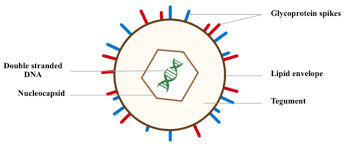
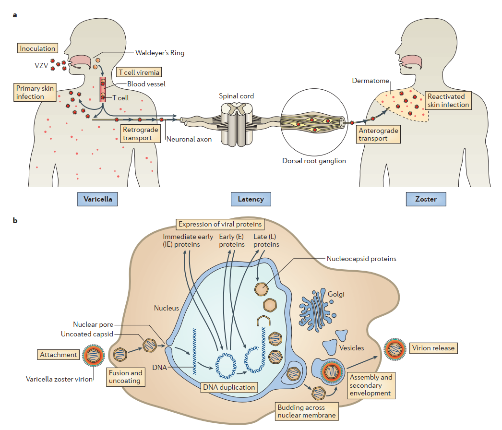
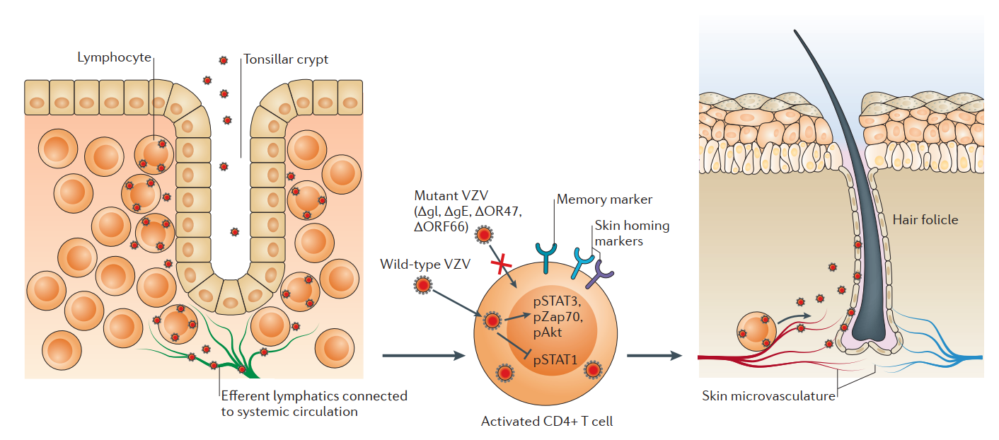
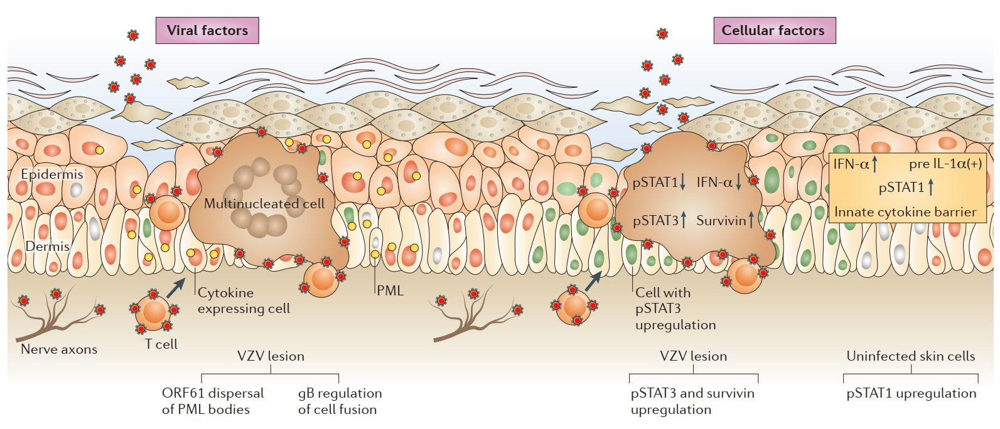
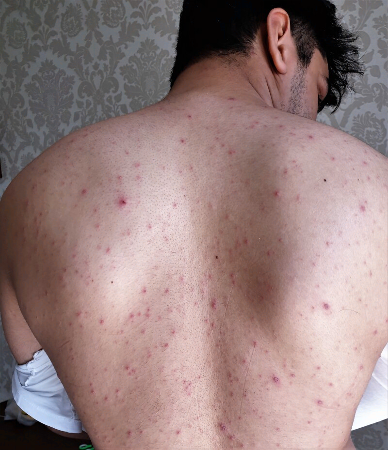
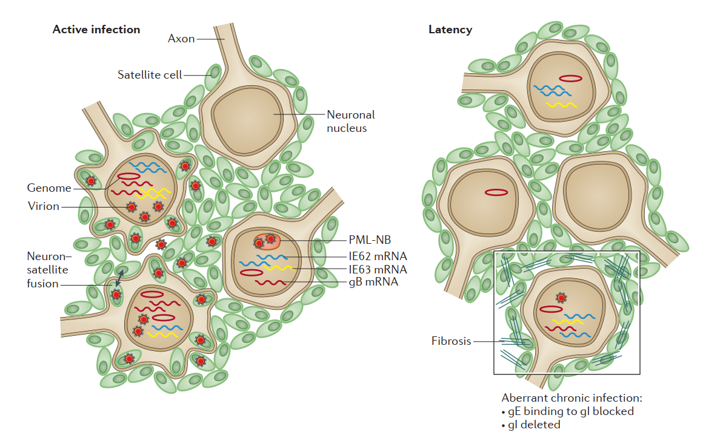
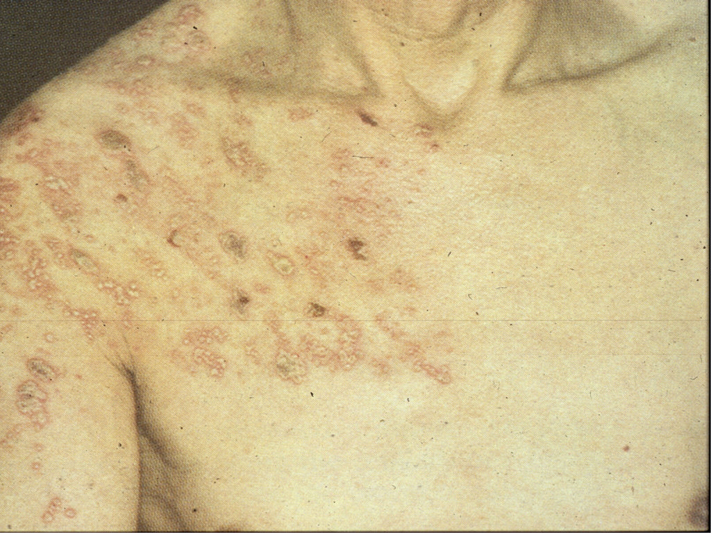
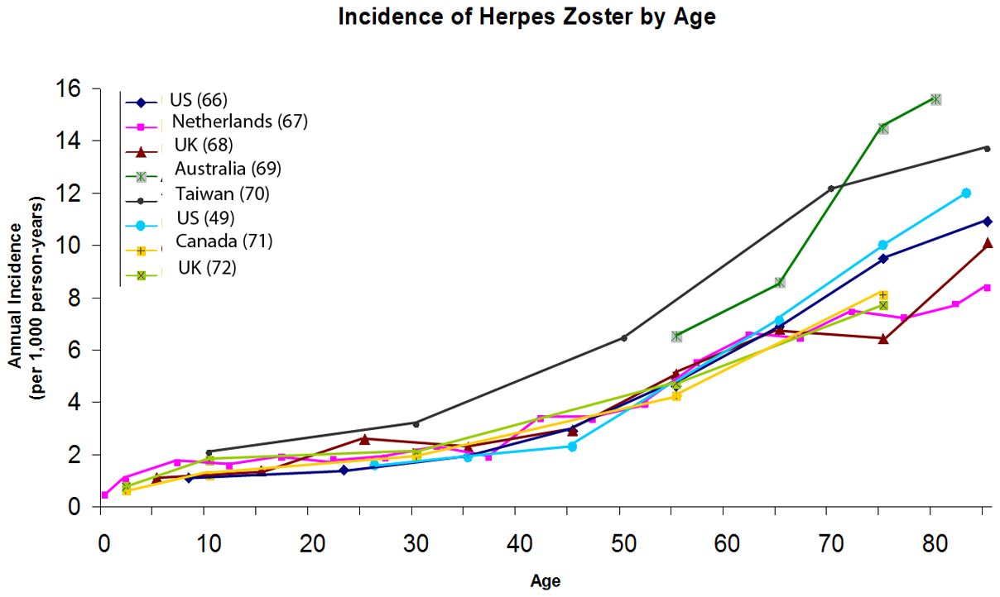

# 🔬 SINH LÝ BỆNH THỦY ĐẬU & HERPES ZOSTER (VZV)

<PathoQuickNav />

<!-- DẢI CHỈ SỐ NHANH (QUICK STATS STRIP) -->
<section class="stats-strip">
  

    

      
CCBS-49

      
Mã cơ chế • Truyền Nhiễm &amp; Thần Kinh

    

    

      
125 kbp DNA

      
71 ORFs • Vỏ lipid 7 Glycoproteins • Không có gD

    

    

      
Hướng T &amp; Da &amp; TK

      
CLA+/CCR4+ T-cell • Giảm M6PR • DRG Latency

    

    

      
Phòng Ngừa &amp; PEP

      
Vắc-xin Oka 2 liều • Shingrix 97% • VZIG/Preemptive

    

  

</section>

---

## 1. Cấu Trúc Virion VZV & Vòng Đời Tế Bào {#sec-1}

Varicella Zoster Virus (VZV), danh pháp quốc tế chính thức là **Human alphaherpesvirus 3**, là một trong 9 herpesvirus gây bệnh trên người, thuộc phân họ *Alphaherpesvirinae*, họ *Herpesviridae*, chi *Varicellovirus*. VZV là tác nhân gây ra hai thực thể bệnh học lâm sàng khác biệt: **Thủy đậu (Varicella / Chickenpox)** trong đợt nhiễm trùng tiên phát toàn thân và **Zona (Herpes Zoster / Shingles)** khi virus tái hoạt động từ trạng thái ẩn nấp suốt đời trong hệ thần kinh cảm giác.

### Đặc Điểm Sinh Học & Cấu Trúc Hạt Virus (Virion)

Hạt virus VZV trưởng thành có **dạng hình cầu**, đường kính dao động từ **180 – 200 nm**, được cấu thành từ 4 thành phần đồng tâm từ trong ra ngoài:

1. **Lõi bộ gen (Genomic Core):** Phân tử **DNA sợi kép tuyến tính (dsDNA)** dài khoảng **125.000 cặp base (125 kbp)**. Bộ gen chứa **ít nhất 71 khung đọc mở (ORFs)** mã hóa cho các protein cấu trúc, enzyme sao chép và các protein điều hòa. Bộ gen có tính ổn định di truyền cao, phân chia thành 5 vùng lặp lại ngắn (**R1 đến R5**), tạo nên các dấu ấn phân lập đặc thù cho từng chủng virus địa lý.
2. **Vỏ Nucleocapsid:** Cấu trúc đối xứng **20 mặt (icosahedral)** với đường kính ~100 nm, tạo thành từ **162 capsomeres** hình ngũ giác và lục giác, được mã hóa bởi các gen *orf20, orf21, orf23, orf33, orf40* và *orf41*.
3. **Chất đệm (Tegument):** Lớp protein vô định hình nằm giữa capsid và màng vỏ lipid. Tegument chứa các **protein điều hòa phiên mã cực sớm (Immediate-Early)** then chốt như **IE62** (mã hóa bởi *orf62/orf71*), **IE63** (*orf63/orf70*), phức hợp *orf9–orf12*, cùng hai protein kinase đặc hiệu của virus là **ORF47** và **ORF66**.
4. **Vỏ bọc ngoài (Lipid Envelope):** Màng kép phospholipid có nguồn gốc từ màng nội bào tế bào chủ (mạng lưới trans-Golgi), trên bề mặt gắn các **gai glycoprotein dài ~8 nm**. Có 7 glycoprotein bề mặt đã được xác định: **gB, gC, gE, gH, gI, gK, gL**. Trong đó, phức hợp lõi **gB + gH/gL** chịu trách nhiệm chính trong việc hòa màng tế bào. *Khác biệt căn bản với HSV-1: VZV không có glycoprotein tương đương gD và không sử dụng thụ thể HVEM/Nectin-1.*

<figure class="physio-figure" style="display: flex; flex-direction: column; align-items: center; justify-content: center; text-align: center; margin: 1.75rem auto;">
  
  <figcaption style="margin-top: 0.75rem; font-size: 0.88rem; color: var(--color-text-muted, #64748b); font-style: italic; text-align: center; max-width: 800px;">
    <strong>Hình 1 (Figure 1): Cấu trúc của Varicella Zoster Virus (Structure of VZV).</strong> Minh họa 4 lớp cấu trúc: Lõi DNA sợi kép (Double stranded DNA), vỏ Nucleocapsid đối xứng 20 mặt, chất đệm protein Tegument chứa IE62/IE63 và vỏ bọc ngoài Lipid Envelope gắn các gai Glycoprotein (gB, gE, gH, gI, gL). Nguồn: Han (2017) / Iheukwumere et al. (2025).
  </figcaption>
</figure>

### Vòng Đời Sinh Học & Chu Trình Nhân Lên Ở Cấp Độ Tế Bào

Quá trình xâm nhập và nhân lên của VZV tại tế bào đích tuân theo một chu trình nghiêm ngặt gồm 6 bước:

  

    
<i class="fa-solid fa-route" style="color: var(--color-primary, #0284c7);"></i> SƠ ĐỒ LÂM SÀNG: VZV XÂM NHẬP

    Pure Orthogonal SVG
  

  

    <svg class="flowchart-svg" viewBox="0 0 880 190" width="880" height="190" xmlns="http://www.w3.org/2000/svg">
      <defs>
        <marker id="arrBlue" viewBox="0 0 10 10" refX="6" refY="5" markerWidth="6" markerHeight="6" orient="auto-start-reverse">
          <path d="M 0 1.5 L 8 5 L 0 8.5 z" fill="#0284c7"/>
        </marker>
        <marker id="arrGreen" viewBox="0 0 10 10" refX="6" refY="5" markerWidth="6" markerHeight="6" orient="auto-start-reverse">
          <path d="M 0 1.5 L 8 5 L 0 8.5 z" fill="#059669"/>
        </marker>
        <marker id="arrAmber" viewBox="0 0 10 10" refX="6" refY="5" markerWidth="6" markerHeight="6" orient="auto-start-reverse">
          <path d="M 0 1.5 L 8 5 L 0 8.5 z" fill="#d97706"/>
        </marker>
        <marker id="arrRed" viewBox="0 0 10 10" refX="6" refY="5" markerWidth="6" markerHeight="6" orient="auto-start-reverse">
          <path d="M 0 1.5 L 8 5 L 0 8.5 z" fill="#dc2626"/>
        </marker>
      </defs>

      <!-- Single Node: [VZV XÂM NHẬP] ──► [BÁM MÀNG &amp; -->
      <rect x="155" y="20" width="570" height="132" rx="10" fill="var(--color-surface-2, #f8fafc)" stroke="var(--color-border, #cbd5e1)" stroke-width="1.8"/>
      <text x="440" y="42" text-anchor="middle" font-family="'Plus Jakarta Sans', sans-serif" font-weight="800" font-size="12" fill="var(--color-text, #0f172a)">[VZV XÂM NHẬP] ──► [BÁM MÀNG &amp; HÒA MÀNG] ──► [BƠM DNA</text>
      <text x="440" y="60" text-anchor="middle" font-family="'Plus Jakarta Sans', sans-serif" font-weight="600" font-size="12" fill="var(--color-text, #0f172a)">QUA LỖ NHÂN] ──► [PHIÊN MÃ IE ➔ E ➔ L] ──► [ĐÓNG GÓI</text>
      <text x="440" y="78" text-anchor="middle" font-family="'Plus Jakarta Sans', sans-serif" font-weight="600" font-size="12" fill="var(--color-text, #0f172a)">CAPSID] ──► [TẠO VỎ TẠI TRANS-GOLGI &amp; XUẤT BÀO]</text>
      <text x="179" y="100" text-anchor="start" font-family="'Plus Jakarta Sans', sans-serif" font-size="11" fill="var(--color-text-muted, #475569)">• (Khí dung / Tiếp xúc) (gB + gH/gL gắn IDE / HS) (Capsid cập</text>
      <text x="179" y="118" text-anchor="start" font-family="'Plus Jakarta Sans', sans-serif" font-size="11" fill="var(--color-text-muted, #475569)">• bến) (IE62/IE63 hoạt hóa) (Lắp ráp trong nhân) (TGN bao bọc</text>
      <text x="179" y="136" text-anchor="start" font-family="'Plus Jakarta Sans', sans-serif" font-size="11" fill="var(--color-text-muted, #475569)">• / Post-Golgi)</text>
    </svg>
  

1. **Bám màng (Attachment):** Glycoprotein vỏ virus gắn kết với **Heparan Sulfate Proteoglycans (HSPGs)** trên bề mặt tế bào chủ và tương tác với thụ thể xâm nhập đặc hiệu là **Enzyme phân hủy Insulin (Insulin-Degrading Enzyme - IDE)**.
2. **Hòa màng (Membrane Fusion):** Phức hợp lõi **gB + gH/gL** (với sự hỗ trợ của **gE/gI**) trung gian cho sự hòa màng giữa vỏ virus và màng sinh chất, giải phóng nucleocapsid và protein tegument vào tế bào chất.
3. **Vận chuyển nhân & Giải phóng bộ gen:** Nucleocapsid không vỏ di chuyển dọc theo hệ thống vi ống tế bào đến **lỗ nhân (nuclear pore)**, bơm DNA bộ gen vào trong nhân tế bào ký chủ. DNA lập tức tròn hóa thành cấu trúc episome.
4. **Dòng thác phiên mã 3 pha có trật tự:**
   - **Pha cực sớm (Immediate-Early - IE):** Tổng hợp các protein điều hòa **IE62, IE63, ORF61**. Protein IE62 đóng vai trò là yếu tố hoạt hóa phiên mã toàn diện (transactivator) mạnh mẽ nhất.
   - **Pha sớm (Early - E):** Tổng hợp các enzyme sao chép bộ gen bao gồm DNA polymerase virus (mã hóa bởi *orf28*), Thymidine Kinase (*orf36*), Uracil DNA glycosylase (*orf59*) và protein gắn DNA sợi đơn (*orf29*).
   - **Pha muộn (Late - L):** Tổng hợp các protein cấu trúc capsid và các glycoprotein vỏ ngoài (*orf31/gB, orf68/gE, orf37/gH, orf67/gI, orf60/gL*).
5. **Lắp ráp capsid & Nảy chồi sơ cấp (Primary Envelopment):** Các capsid rỗng được lắp ráp trong nhân, nạp bộ gen DNA mới nhân đôi, sau đó nảy chồi qua màng nhân trong (inner nuclear membrane) để đi vào khoang quanh nhân (perinuclear space), nhận lớp vỏ sơ cấp tạm thời.
6. **Tạo vỏ thứ cấp (Secondary Envelopment) & Xuất bào:** Capsid đi vào tế bào chất, mất lớp màng tạm thời và trải qua quá trình tạo vỏ bọc thứ cấp hoàn chỉnh tại **mạng lưới trans-Golgi (TGN)**. Tại đây, hạt virus nhận đầy đủ protein chất đệm và glycoprotein vỏ, được đóng gói vào các túi post-Golgi để vận chuyển ra màng tế bào và phóng thích.

<figure class="physio-figure" style="display: flex; flex-direction: column; align-items: center; justify-content: center; text-align: center; margin: 1.75rem auto;">
  
  <figcaption style="margin-top: 0.75rem; font-size: 0.88rem; color: var(--color-text-muted, #64748b); font-style: italic; text-align: center; max-width: 800px;">
    <strong>Hình 2 (Figure 1 | VZV Life Cycle and Replication): Vòng đời và Sự nhân lên của VZV.</strong> Sơ đồ a: Quá trình VZV xâm nhập qua đường hô hấp trên ➔ nhân lên tại amidan (vòng Waldeyer) ➔ nhiễm tế bào T và gây virus huyết (T-cell viremia) ➔ biểu mô da (Thủy đậu) ➔ vận chuyển ngược sợi trục (Retrograde transport) về nhân hạch rễ sau (DRG Latency) ➔ tái hoạt vận chuyển xuôi sợi trục (Anterograde transport) gây Zona. Sơ đồ b: Các bước phân tử bám màng, hòa màng, phiên mã gen IE/E/L, nảy chồi màng nhân và tạo vỏ bọc thứ cấp tại TGN. Nguồn: Zerboni, Sen, Oliver, Arvin (Nature Reviews Microbiology, 2014).
  </figcaption>
</figure>

---

## 2. Sinh Bệnh Học Toàn Thân, Hướng Tế Bào T & Hướng Da {#sec-2}

### Động Học Lây Truyền & Dòng Thác Virus Huyết (Viremia Cascade)

VZV là tác nhân truyền nhiễm lây lan mạnh mẽ bậc nhất qua đường hô hấp với hệ số lây nhiễm cơ bản $R_0 \approx 10 - 12$. Diễn tiến bệnh sinh từ lúc phơi nhiễm đến khi xuất hiện triệu chứng toàn thân trải qua chuỗi 4 giai đoạn nối tiếp:

  

    
<i class="fa-solid fa-route" style="color: var(--color-primary, #0284c7);"></i> SƠ ĐỒ LÂM SÀNG: PHƠI NHIỄM KHÍ DUNG

    Pure Orthogonal SVG
  

  

    <svg class="flowchart-svg" viewBox="0 0 880 606" width="880" height="606" xmlns="http://www.w3.org/2000/svg">
      <defs>
        <marker id="arrBlue" viewBox="0 0 10 10" refX="6" refY="5" markerWidth="6" markerHeight="6" orient="auto-start-reverse">
          <path d="M 0 1.5 L 8 5 L 0 8.5 z" fill="#0284c7"/>
        </marker>
        <marker id="arrGreen" viewBox="0 0 10 10" refX="6" refY="5" markerWidth="6" markerHeight="6" orient="auto-start-reverse">
          <path d="M 0 1.5 L 8 5 L 0 8.5 z" fill="#059669"/>
        </marker>
        <marker id="arrAmber" viewBox="0 0 10 10" refX="6" refY="5" markerWidth="6" markerHeight="6" orient="auto-start-reverse">
          <path d="M 0 1.5 L 8 5 L 0 8.5 z" fill="#d97706"/>
        </marker>
        <marker id="arrRed" viewBox="0 0 10 10" refX="6" refY="5" markerWidth="6" markerHeight="6" orient="auto-start-reverse">
          <path d="M 0 1.5 L 8 5 L 0 8.5 z" fill="#dc2626"/>
        </marker>
      </defs>

      <!-- Single Node: PHƠI NHIỄM KHÍ DUNG -->
      <rect x="250" y="20" width="380" height="46" rx="10" fill="var(--color-surface-2, #f8fafc)" stroke="var(--color-border, #cbd5e1)" stroke-width="1.8"/>
      <text x="440" y="42" text-anchor="middle" font-family="'Plus Jakarta Sans', sans-serif" font-weight="800" font-size="12" fill="var(--color-text, #0f172a)">PHƠI NHIỄM KHÍ DUNG</text>
      <line x1="440" y1="66" x2="440" y2="94" stroke="#0284c7" stroke-width="1.8" marker-end="url(#arrBlue)"/>
      <!-- Single Node: NHÂN LÊN NIÊM MẠC HÔ HẤP TRÊN -->
      <rect x="250" y="94" width="380" height="46" rx="10" fill="var(--color-surface-2, #f8fafc)" stroke="var(--color-border, #cbd5e1)" stroke-width="1.8"/>
      <text x="440" y="116" text-anchor="middle" font-family="'Plus Jakarta Sans', sans-serif" font-weight="800" font-size="12" fill="var(--color-text, #0f172a)">NHÂN LÊN NIÊM MẠC HÔ HẤP TRÊN</text>
      <!-- Bifurcation Path -->
      <path d="M 440 140 L 440 154 L 235 154 L 235 168" fill="none" stroke="var(--color-border, #cbd5e1)" stroke-width="1.8" marker-end="url(#arrBlue)"/>
      <path d="M 440 154 L 645 154 L 645 168" fill="none" stroke="var(--color-border, #cbd5e1)" stroke-width="1.8" marker-end="url(#arrBlue)"/>
      <!-- Left Column: LÂY NHIỄM AMIDAN / VÒNG WALDEY -->
      <rect x="40" y="168" width="390" height="90" rx="10" fill="var(--color-surface-2, #f8fafc)" stroke="var(--color-border, #cbd5e1)" stroke-width="1.5"/>
      <text x="235" y="190" text-anchor="middle" font-family="'Plus Jakarta Sans', sans-serif" font-weight="800" font-size="12" fill="var(--color-text, #0f172a)">LÂY NHIỄM AMIDAN / VÒNG WALDEYER</text>
      <line x1="60" y1="204" x2="410" y2="204" stroke="var(--color-border, #cbd5e1)" stroke-width="1"/>
      <!-- Right Column: CHUYỂN GIAO SANG TẾ BÀO T -->
      <rect x="450" y="168" width="390" height="90" rx="10" fill="var(--color-surface-2, #f8fafc)" stroke="var(--color-border, #cbd5e1)" stroke-width="1.5"/>
      <text x="645" y="190" text-anchor="middle" font-family="'Plus Jakarta Sans', sans-serif" font-weight="800" font-size="12" fill="var(--color-text, #0f172a)">CHUYỂN GIAO SANG TẾ BÀO T</text>
      <line x1="470" y1="204" x2="820" y2="204" stroke="var(--color-border, #cbd5e1)" stroke-width="1"/>
      <!-- Bifurcation Path -->
      <path d="M 440 258 L 440 272 L 235 272 L 235 286" fill="none" stroke="var(--color-border, #cbd5e1)" stroke-width="1.8" marker-end="url(#arrBlue)"/>
      <path d="M 440 272 L 645 272 L 645 286" fill="none" stroke="var(--color-border, #cbd5e1)" stroke-width="1.8" marker-end="url(#arrBlue)"/>
      <!-- Left Column: NHIỄM VIRUS HUYẾT TIÊN PHÁT -->
      <rect x="40" y="286" width="390" height="90" rx="10" fill="var(--color-surface-2, #f8fafc)" stroke="var(--color-border, #cbd5e1)" stroke-width="1.5"/>
      <text x="235" y="308" text-anchor="middle" font-family="'Plus Jakarta Sans', sans-serif" font-weight="800" font-size="12" fill="var(--color-text, #0f172a)">NHIỄM VIRUS HUYẾT TIÊN PHÁT</text>
      <line x1="60" y1="322" x2="410" y2="322" stroke="var(--color-border, #cbd5e1)" stroke-width="1"/>
      <!-- Right Column: GAN, LÁCH, HỆ LƯỚI NỘI MÔ -->
      <rect x="450" y="286" width="390" height="90" rx="10" fill="var(--color-surface-2, #f8fafc)" stroke="var(--color-border, #cbd5e1)" stroke-width="1.5"/>
      <text x="645" y="308" text-anchor="middle" font-family="'Plus Jakarta Sans', sans-serif" font-weight="800" font-size="12" fill="var(--color-text, #0f172a)">GAN, LÁCH, HỆ LƯỚI NỘI MÔ</text>
      <line x1="470" y1="322" x2="820" y2="322" stroke="var(--color-border, #cbd5e1)" stroke-width="1"/>
      <!-- Bifurcation Path -->
      <path d="M 440 376 L 440 390 L 235 390 L 235 404" fill="none" stroke="var(--color-border, #cbd5e1)" stroke-width="1.8" marker-end="url(#arrBlue)"/>
      <path d="M 440 390 L 645 390 L 645 404" fill="none" stroke="var(--color-border, #cbd5e1)" stroke-width="1.8" marker-end="url(#arrBlue)"/>
      <!-- Left Column: NHIỄM VIRUS HUYẾT THỨ PHÁT -->
      <rect x="40" y="404" width="390" height="90" rx="10" fill="var(--color-surface-2, #f8fafc)" stroke="var(--color-border, #cbd5e1)" stroke-width="1.5"/>
      <text x="235" y="426" text-anchor="middle" font-family="'Plus Jakarta Sans', sans-serif" font-weight="800" font-size="12" fill="var(--color-text, #0f172a)">NHIỄM VIRUS HUYẾT THỨ PHÁT</text>
      <line x1="60" y1="440" x2="410" y2="440" stroke="var(--color-border, #cbd5e1)" stroke-width="1"/>
      <!-- Right Column: BIỂU BÌ DA TOÀN THÂN -->
      <rect x="450" y="404" width="390" height="90" rx="10" fill="var(--color-surface-2, #f8fafc)" stroke="var(--color-border, #cbd5e1)" stroke-width="1.5"/>
      <text x="645" y="426" text-anchor="middle" font-family="'Plus Jakarta Sans', sans-serif" font-weight="800" font-size="12" fill="var(--color-text, #0f172a)">BIỂU BÌ DA TOÀN THÂN</text>
      <line x1="470" y1="440" x2="820" y2="440" stroke="var(--color-border, #cbd5e1)" stroke-width="1"/>
      <line x1="440" y1="494" x2="440" y2="522" stroke="#0284c7" stroke-width="1.8" marker-end="url(#arrBlue)"/>
      <!-- Single Node: PHÁT BAN THỦY ĐẬU ĐA LỨA TUỔI -->
      <rect x="250" y="522" width="380" height="46" rx="10" fill="var(--color-surface-2, #f8fafc)" stroke="var(--color-border, #cbd5e1)" stroke-width="1.8"/>
      <text x="440" y="544" text-anchor="middle" font-family="'Plus Jakarta Sans', sans-serif" font-weight="800" font-size="12" fill="var(--color-text, #0f172a)">PHÁT BAN THỦY ĐẬU ĐA LỨA TUỔI</text>
    </svg>
  

1. **Nhân lên ban đầu tại biểu mô hô hấp (Ngày 0 – 2):** Hạt virus trong khí dung hoặc giọt bắn bám dính vào niêm mạc tỵ hầu hoặc kết mạc mắt, nhân lên cục bộ tại tế bào biểu mô đường hô hấp trên.
2. **Lan đến mô lympho vùng & Chuyển giao sang T-cell (Ngày 2 – 4):** Virus xâm nhập các tế bào tua (dendritic cells, gồm tế bào Langerhans và plasmacytoid DC) ở niêm mạc. Các tế bào DC này di chuyển đến mô bạch huyết hầu họng — đặc biệt là **vòng bạch huyết Waldeyer ở amidan**. Tại đây, DC chuyển giao virus sang các tế bào lympho T.
3. **Nhiễm virus huyết tiên phát (Primary Viremia, Ngày 4 – 6):** Sự giải phóng virus từ amidan và hạch lympho vùng vào hệ tuần hoàn tạo ra đợt virus huyết đầu tiên. Lượng virus này theo dòng máu đến gieo rắc và nhân lên tại các **cơ quan hệ lưới nội mô** như gan, lách, tủy xương. Giai đoạn này người bệnh hoàn toàn không có triệu chứng lâm sàng.
4. **Nhiễm virus huyết thứ phát (Secondary Viremia, Ngày 10 – 12):** Sau khoảng một tuần nhân lên mạnh mẽ trong nhu mô các tạng nội tạng, một lượng lớn virus tái tràn ngập vào tuần hoàn hệ thống. Đợt virus huyết thứ phát này chịu trách nhiệm đưa virus đến toàn bộ mạng lưới vi mạch dưới da và các bề mặt niêm mạc, khởi phát sốt cao, mệt mỏi và phát ban bùng phát sau thời gian ủ bệnh trung bình **14 – 16 ngày**.

### Đặc Tính Hướng Tế Bào T (T Cell Tropism) & Cơ Chế Di Chuyển Hướng Da

Khác với nhiều loại virus tự do lưu hành trong huyết tương, trong đợt nhiễm virus huyết, **100% VZV di chuyển dưới dạng liên kết chặt chẽ với tế bào (Cell-associated viremia)** nằm bên trong các tế bào **T CD3+ (bao gồm cả phân nhóm CD4+ và CD8+)**:

- **Ái tính tế bào T nhớ hoạt hóa:** VZV có ái tính đặc biệt cao với tế bào T CD4+ mang kiểu hình tế bào nhớ hoạt hóa. Quá trình lây nhiễm phụ thuộc cốt lõi vào **đầu N độc nhất của glycoprotein gE**, **gI**, và hai kinase virus **ORF47, ORF66**.
- **Biểu hiện các dấu ấn hướng da (Skin Homing Markers):** Khi bị nhiễm VZV, tế bào T được tái lập trình để biểu hiện mạnh mẽ các thụ thể định hướng di chuyển về da bao gồm **CLA (Cutaneous Leukocyte Antigen)** và chemokine receptor **CCR4**. Các thụ thể này hoạt động như một hệ thống định vị GPS, dẫn đường cho tế bào T nhiễm virus bám dính vào tế bào nội mô mao mạch da.
- **Tín hiệu sống sót & Trốn tránh chết theo chương trình:** VZV hoạt hóa mạnh mẽ con đường tín hiệu **STAT3 (pSTAT3)** và protein chống chết tế bào **survivin**, đồng thời kích hoạt **pZap70** và **pAkt**. Cơ chế này bảo vệ tế bào T bị nhiễm không bị rơi vào chu trình apoptosis trong suốt hành trình 10 – 14 ngày di chuyển trong máu. Đồng thời, virus ức chế **STAT1 (pSTAT1)** để vô hiệu hóa đáp ứng kháng virus của Interferon.
- **Không kích hoạt hòa màng T-T:** VZV kiểm soát nghiêm ngặt để **không gây hòa màng giữa các tế bào T với nhau**, giúp tế bào T giữ nguyên kích thước đơn lẻ, duy trì khả năng di chuyển linh hoạt và thực hiện quá trình **di chuyển xuyên mạch (diapedesis)** qua các vi mạch phong phú quanh nang lông (hair follicles) để giải phóng hạt virus trực tiếp vào mô biểu bì da.

<figure class="physio-figure" style="display: flex; flex-direction: column; align-items: center; justify-content: center; text-align: center; margin: 1.75rem auto;">
  
  <figcaption style="margin-top: 0.75rem; font-size: 0.88rem; color: var(--color-text-muted, #64748b); font-style: italic; text-align: center; max-width: 800px;">
    <strong>Hình 3 (Figure 2 | VZV T cell tropism): Hướng tế bào T của VZV.</strong> Bên trái: Tế bào T di chuyển qua biểu mô hốc amidan bị lây nhiễm VZV từ biểu mô hô hấp. Ở giữa: Tế bào T CD4+ biểu hiện CLA và CCR4; VZV kích hoạt pSTAT3/survivin và pAkt để chống chết tế bào, khóa pSTAT1 để kháng IFN. Bên phải: Tế bào T nhiễm VZV thực hiện di chuyển xuyên mạch (diapedesis) tại vi mạch quanh nang lông da để gieo rắc virus vào biểu mô da. Nguồn: Zerboni et al. (Nature Reviews Microbiology, 2014).
  </figcaption>
</figure>

### Hướng Da (Skin Tropism), Cơ Chế Thoát Mạch Virus Tự Do & Hình Thành Mụn Nước

Khi tiếp cận lớp biểu bì, virus lây nhiễm các tế bào sừng (keratinocytes) ở lớp đáy và nguyên bào sợi ở trung bì, kích phát chuỗi phản ứng mô bệnh học đặc trưng:

1. **Hòa màng tế bào & Tạo hợp bào đa nhân (Syncytia / Polykaryocytes):** Phức hợp hòa màng lõi gB và gH/gL kích hoạt sự hòa nhập màng sinh chất giữa các tế bào sừng liền kề, tạo thành các **tế bào khổng lồ đa nhân (multinucleated giant cells)** chứa hàng chục nhân.
2. **Kiểm soát hòa màng qua motif ITIM ở đuôi gB:** Đuôi tế bào chất của glycoprotein gB chứa một motif **ITIM (Immunoreceptor Tyrosine-based Inhibition Motif)**. Khi gốc Tyrosine 881 (Y881) được phosphoryl hóa, nó điều hòa ức chế mức độ hòa màng vừa đủ. Nếu sự phosphoryl hóa này bị khiếm khuyết, hiện tượng siêu hòa màng bất thường (hyperfusion) sẽ phá hủy tế bào sừng quá sớm, làm sụt giảm sản lượng hạt virus trưởng thành.
3. **Cơ chế thoát mạch virus tự do (Cell-free Egress) qua thụ thể M6PR:**
   - Trong nuôi cấy in vitro, VZV liên kết cực chặt với tế bào vì hạt virus mới lắp ráp bị **thụ thể Mannose-6-Phosphate (M6PR)** dẫn đường vào endosome muộn để phân hủy bởi enzyme lysosome.
   - Tuy nhiên, trong quá trình biệt hóa tự nhiên của các tế bào sừng ở lớp nông thượng bì da, **thụ thể M6PR bị giảm điều hòa (downregulation) triệt để**.
   - Sự vắng mặt của M6PR bảo vệ hạt virus không bị phân hủy, cho phép VZV lắp ráp vỏ bọc hoàn chỉnh và giải phóng một lượng khổng lồ **virus tự do không liên kết tế bào (cell-free virus) vào dịch mụn nước**. Đây chính là nguồn lây truyền khí dung và tiếp xúc cực kỳ nguy hiểm của thủy đậu.
4. **Vô hiệu hóa miễn dịch bẩm sinh tại da:**
   - Các tế bào chưa nhiễm xung quanh nốt tổn thương tiết **Interferon-alpha (IFN-α)** và **Interferon-beta (IFN-β)** nhằm dựng lên một **hàng rào cytokine bẩm sinh (innate cytokine barrier)** cô lập ổ virus.
   - Để phá vỡ hàng rào này: Protein **ORF61** sử dụng các motif tương tác SUMO (SIMs) để liên kết và phá hủy hoàn toàn cấu trúc **thể nhân PML (PML-NBs / ND10)** — vốn là các lồng protein giam giữ virus trong nhân; protein **IE62** và **ORF47** ức chế phosphoryl hóa IRF3 để chặn sinh IFN-β; **IE63** ức chế phosphoryl hóa eIF2; và **ORF66** ngăn chặn hoạt hóa STAT1.
5. **Đặc điểm giải phẫu bệnh & Diễn tiến lâm sàng "Giọt sương trên cánh hoa hồng":**
   - Dưới kính hiển vi: Hiện tượng **thoái hóa phồng (ballooning degeneration)** của tế bào keratin, hiện tượng **tiêu gai (acantholysis)** làm rời rạc các tế bào sừng trong khoang dịch, chất nhiễm sắc rìa nhân tích tụ và các **thể bao hàm ưa acid trong nhân (Cowdry type A intranuclear inclusions)**.
   - Tổn thương lâm sàng tiến triển thần tốc qua các giai đoạn: **Dát đỏ (macules) ➔ Sẩn (papules) ➔ Mụn nước (vesicles) ➔ Mụn mủ (pustules) ➔ Đóng vảy mài (crusts/scabs)** trong vòng 24 – 48 giờ. Phát ban xuất hiện nhiều đợt kế tiếp nhau, tạo nên hình ảnh **tổn thương đa lứa tuổi cùng tồn tại đồng thời** trên một vùng da.

<figure class="physio-figure" style="display: flex; flex-direction: column; align-items: center; justify-content: center; text-align: center; margin: 1.75rem auto;">
  
  <figcaption style="margin-top: 0.75rem; font-size: 0.88rem; color: var(--color-text-muted, #64748b); font-style: italic; text-align: center; max-width: 800px;">
    <strong>Hình 4 (Figure 3 | VZV skin tropism): Hướng da của VZV.</strong> Bên trái: Các yếu tố virus (ORF61 phá hủy thể nhân PML-NBs, đuôi gB điều hòa hòa màng polykaryocytes, giảm M6PR giải phóng cell-free virus). Bên phải: Tế bào nhiễm kích hoạt pSTAT3/survivin chống apoptosis; các tế bào biểu mô xung quanh tạo hàng rào cytokine bẩm sinh (IFN-α, pSTAT1, pre-IL-1α, PML-NBs). Nguồn: Zerboni et al. (Nature Reviews Microbiology, 2014).
  </figcaption>
</figure>

<figure class="physio-figure" style="display: flex; flex-direction: column; align-items: center; justify-content: center; text-align: center; margin: 1.75rem auto;">
  
  <figcaption style="margin-top: 0.75rem; font-size: 0.88rem; color: var(--color-text-muted, #64748b); font-style: italic; text-align: center; max-width: 800px;">
    <strong>Hình 5: Phát ban Thủy đậu Lâm sàng (Varicella Rash).</strong> Hình ảnh ghi nhận tổn thương dạng đa hình thái và đa lứa tuổi xuất hiện đồng thời trên vùng lưng: dát đỏ, sẩn, mụn nước nông chứa dịch trong hình "giọt sương trên cánh hoa hồng", mụn mủ và các tổn thương đã vỡ đóng vảy tiết mài nâu. Nguồn: Syed HA, StatPearls (2024).
  </figcaption>
</figure>

---

## 3. Hướng Thần Kinh, Trạng Thái Ẩn Nấp & Tái Hoạt Zona {#sec-3}

### Vận Chuyển Ngược Chiều Sợi Trục & Thiết Lập Ẩn Nấp (Latency)

Trong giai đoạn mụn nước bùng phát ở da, lượng virus tự do dồi dào trong khoang dịch mụn nước tiếp xúc trực tiếp với các đầu tận cùng sợi thần kinh cảm giác (sensory nerve terminals) phân bố tại nhú bì và thượng bì:

1. **Xâm nhập tận cùng thần kinh qua Filopodia:** Hạt virus bám dính vào màng tế bào thần kinh, cởi bỏ lớp vỏ lipid và đưa nucleocapsid vào sợi trục thần kinh cảm giác.
2. **Vận chuyển ngược chiều sợi trục (Retrograde Axonal Transport):** Nucleocapsid liên kết với phức hợp động cơ phân tử Dynein, di chuyển ngược dòng dọc theo sợi trục thần kinh cảm giác sọ não hoặc tủy sống về phía thân tế bào (soma) nằm trong **hạch rễ sau (Dorsal Root Ganglia - DRG)** hoặc **hạch sinh ba (Trigeminal Ganglia - TG)**. Virus cũng có thể xâm nhập hạch cảm giác trực tiếp qua đường máu do tế bào T vận chuyển (viremia).
3. **Cấu trúc bộ gen ẩn nấp (Circular Episome):** Khi đến thân neuron, capsid bơm DNA vào nhân. Bộ gen DNA của VZV tròn hóa thành một **phân tử DNA episome vòng độc lập**, không tích hợp vào nhiễm sắc thể người, liên kết chặt chẽ với protein histone tế bào chủ.
4. **Vị trí cư trú độc quyền trong Neuron:** Bằng kỹ thuật vi phẫu cắt laser (Laser-Capture Microdissection - LCM) kết hợp nested-PCR, khoa học hiện đại đã chứng minh **neuron là vị trí độc quyền** chứa DNA VZV ẩn nấp (chiếm 4% – 5% tổng số neuron hạch). Tải lượng DNA ẩn nấp đạt trung bình **5 – 50 bản sao DNA/neuron**, thấp hơn nhiều so với HSV-1.

<figure class="physio-figure" style="display: flex; flex-direction: column; align-items: center; justify-content: center; text-align: center; margin: 1.75rem auto;">
  
  <figcaption style="margin-top: 0.75rem; font-size: 0.88rem; color: var(--color-text-muted, #64748b); font-style: italic; text-align: center; max-width: 800px;">
    <strong>Hình 6 (Figure 4 | VZV neurotropism in DRG xenografts): Hướng thần kinh của VZV trong hạch rễ sau.</strong> Bên trái: Pha hoạt động (Active infection) — sao chép gen lytic (gB, IE62), nhân đôi DNA, hòa màng neuron - tế bào vệ tinh tạo hợp bào. Bên phải: Pha ẩn nấp (Latency) — DNA tồn tại dạng episome trong nhân neuron, khóa gen muộn gB, chỉ phiên mã VLT và IE63. Khung viền đen: Nhiễm trùng mạn tính bất thường (Aberrant infection) khi đột biến gE-gI gây hủy hoại hạch kéo dài. Nguồn: Zerboni et al. (Nature Reviews Microbiology, 2014).
  </figcaption>
</figure>

### Cơ Chế Biểu Sinh & Phân Tử Duy Trì Sự Im Lặng Của Hệ Gen

Sự duy trì trạng thái ẩn nấp suốt đời của VZV được kiểm soát chặt chẽ bởi 4 cơ chế phân tử độc đáo:

- **Điều hòa biểu tơ di truyền (Epigenetic Silencing):** Promoters của các gen lytic chu kỳ tan (như gen muộn ORF14, ORF36) bị đóng gói dưới dạng **heterochromatin đóng** không acetyl hóa, ngăn chặn RNA polymerase II tiếp cận. Ngược lại, promoter của gen ẩn nấp (ORF63) duy trì dạng **euchromatin mở (acetylated H3K9)**.
- **Bản phiên mã liên quan ẩn nấp VLT (VZV Latency-associated Transcript):** VLT là một bản phiên mã phân đoạn (spliced transcript) nằm **ngược chiều (antisense)** với gen hoạt hóa lytic cực sớm ORF61. VLT ức chế dịch mã ORF61, dập tắt mầm mống khởi động chu kỳ nhân lên lytic.
- **Biểu hiện phong phú của IE63 (ORF63p):** mRNA của ORF63 là bản phiên mã phong phú nhất trong hạch cảm giác người mang virus ẩn nấp. Protein **IE63 hoạt động như một nhân tố chống chết tế bào thần kinh mạnh mẽ**, bảo vệ neuron không bị apoptosis khi thiếu hụt yếu tố tăng trưởng thần kinh NGF.
- **Cô lập protein điều hòa ngoài bào tương (Cytoplasmic Sequestration):** Trong pha ẩn nấp, các protein điều hòa chủ chốt **IE62, IE63, ORF21 và ORF29 bị giữ lại và khu trú hoàn toàn trong tế bào chất của neuron**. Protein kinase **ORF66** thực hiện phosphoryl hóa IE62 để ngăn chặn sự di chuyển của IE62 vào nhân. Khi bị cô lập ngoài nhân, IE62 không thể kích hoạt các promoter lytic, giữ hệ gen trong trạng thái yên lặng tuyệt đối.

### Bảng Đối Chiếu So Sánh Toàn Diện: VZV vs. HSV-1

  <table class="table-modern">
    <thead>
      <tr>
        <th style="width: 25%;">Đặc Tính Sinh Học</th>
        <th style="width: 38%; color: #0284c7;">Varicella Zoster Virus (VZV)</th>
        <th style="width: 37%; color: #64748b;">Herpes Simplex Virus 1 (HSV-1)</th>
      </tr>
    </thead>
    <tbody>
      <tr>
        <td><strong>Nhiễm trùng tiên phát</strong></td>
        <td><strong>Lan tỏa toàn thân</strong> (Disseminated) với sốt và phát ban mụn nước khắp cơ thể.</td>
        <td><strong>Khu trú tại chỗ</strong> (Localized) như niêm mạc miệng, môi hoặc sinh dục.</td>
      </tr>
      <tr>
        <td><strong>Đường xâm nhập hạch</strong></td>
        <td>Qua cả <strong>đường máu (viremia)</strong> và vận chuyển ngược sợi trục từ da.</td>
        <td>Gần như duy nhất qua vận chuyển ngược sợi trục từ vết loét tại chỗ.</td>
      </tr>
      <tr>
        <td><strong>Phân bố giải phẫu hạch</strong></td>
        <td><strong>Toàn bộ trục thần kinh</strong> (hạch sọ, hạch rễ sau cổ, ngực, thắt lưng, hạch tự chủ).</td>
        <td>Giới hạn chủ yếu ở hạch vùng đầu mặt (đặc biệt là hạch sinh ba - TG).</td>
      </tr>
      <tr>
        <td><strong>Tần suất tái hoạt lâm sàng</strong></td>
        <td>Thường chỉ xảy ra <strong>1 lần duy nhất trong đời</strong> ở người có miễn dịch bình thường.</td>
        <td>Thường xuyên tái phát <strong>nhiều lần</strong> (Multiple reactivations).</td>
      </tr>
      <tr>
        <td><strong>Ảnh hưởng của tuổi tác</strong></td>
        <td>Tần suất tăng vọt theo tuổi do <strong>lão hóa miễn dịch tế bào (Immunosenescence)</strong>.</td>
        <td>Tần suất tái phát có xu hướng <strong>giảm dần theo tuổi</strong>.</td>
      </tr>
      <tr>
        <td><strong>Tái hoạt không triệu chứng</strong></td>
        <td><strong>Hoàn toàn không xảy ra</strong>; luôn đi kèm đau thần kinh và/hoặc phát ban.</td>
        <td>Xảy ra rất thường xuyên (thải virus qua nước bọt/dịch tiết không triệu chứng).</td>
      </tr>
      <tr>
        <td><strong>Phân bố khi tái hoạt</strong></td>
        <td>Giới hạn sắc nét theo <strong>khoanh da (Dermatome)</strong> một bên cơ thể.</td>
        <td>Tổn thương khu biệt tại đầu tận sợi thần kinh (ví dụ: vết loét mép môi).</td>
      </tr>
      <tr>
        <td><strong>Yếu tố kích hoạt tái hoạt</strong></td>
        <td>Suy giảm miễn dịch qua trung gian tế bào (T-cell CMI) toàn thân.</td>
        <td>Kích thích vật lý tại chỗ: ánh sáng tia cực tím (UV), sốt, chấn thương mô.</td>
      </tr>
      <tr>
        <td><strong>Phiên mã trong pha ẩn nấp</strong></td>
        <td>Biểu hiện phong phú: <strong>VLT, IE63, IE62, ORF21, ORF29, ORF66</strong>.</td>
        <td>Cực kỳ giới hạn: <strong>Chỉ biểu hiện duy nhất LAT RNA</strong> (không có protein).</td>
      </tr>
      <tr>
        <td><strong>Tế bào T CD8+ tuần tra hạch</strong></td>
        <td><strong>Không có</strong> tế bào T tuần tra quanh neuron nhiễm; giảm bộc lộ MHC Class I.</td>
        <td><strong>Có vòng tế bào T CD8+ hoạt hóa ("corona")</strong> vây quanh giám sát neuron.</td>
      </tr>
      <tr>
        <td><strong>Hòa màng trong hạch</strong></td>
        <td><strong>Có hòa màng</strong> neuron - tế bào vệ tinh tạo hợp bào, gây viêm hoại tử hạch nặng.</td>
        <td><strong>Không có</strong> hiện tượng hòa màng tế bào trong hạch thần kinh.</td>
      </tr>
    </tbody>
  </table>

  *Bảng đối chiếu tổng hợp chuẩn hóa theo dữ liệu y văn của Jeffrey I. Cohen (Human Herpesviruses, Cambridge University Press, 2007) &amp; Zerboni et al. (Nature Reviews Microbiology, 2014).*

### Sinh Bệnh Học Tái Hoạt Động (Reactivation) & Herpes Zoster (Zona)

Khi miễn dịch qua trung gian tế bào (T-cell CMI) toàn thân suy giảm xuống dưới ngưỡng bảo vệ:

1. **Phá vỡ phong tỏa biểu sinh & Tổng hợp VLT-ORF63:** Cấu trúc heterochromatin bị mở, bản phiên mã lai **VLT-ORF63** được tổng hợp, protein E3 ligase **ORF61** được biểu hiện trở lại, giải phóng IE62 và ORF29 di chuyển từ tế bào chất vào lại trong nhân.
2. **Viêm hạch hoại tử (Ganglionitis) & Tạo hợp bào Neuron-Tế bào vệ tinh:** Virus nhân lên ồ ạt trong nhân neuron và lan sang các **tế bào vệ tinh (satellite glial cells)** bao quanh. VZV kích hoạt sự hòa màng trực tiếp giữa neuron và tế bào vệ tinh tạo thành **các hợp bào đa nhân neuron-tế bào vệ tinh**, gây phản ứng viêm hoại tử hạch cấp tính dữ dội, thoái hóa sợi trục và xơ hóa hạch.
3. **Vận chuyển xuôi chiều sợi trục (Anterograde Axonal Transport):** Hạt virus mới lắp ráp di chuyển xuôi dòng sợi trục cảm giác hướng ra ngoại vi, phóng thích tại các đầu mút thần kinh ở da, xâm nhập tế bào sừng gây tổn thương mụn nước bọc trong quầng hồng ban giới hạn nghiêm ngặt theo **khoanh da (dermatome)** chi phối bởi hạch thần kinh bị ảnh hưởng (không bao giờ vượt quá đường giữa cơ thể).

<figure class="physio-figure" style="display: flex; flex-direction: column; align-items: center; justify-content: center; text-align: center; margin: 1.75rem auto;">
  
  <figcaption style="margin-top: 0.75rem; font-size: 0.88rem; color: var(--color-text-muted, #64748b); font-style: italic; text-align: center; max-width: 800px;">
    <strong>Hình 7: Mụn nước Zona Phân bố Theo Khoanh Da (Herpes Zoster Right C5 Dermatome).</strong> Các chùm mụn nước căng trên nền hồng ban phân bố chạy dọc dải khoanh da do rễ thần kinh cổ C5 bên phải chi phối. Tổn thương dừng lại sắc nét ngay tại đường giữa cơ thể, phản ánh sự tái hoạt động khu trú tại một hạch cảm giác tủy sống đơn độc. Nguồn: Frazer &amp; Levin (Current Opinion in Virology, 2011).
  </figcaption>
</figure>

<figure class="physio-figure" style="display: flex; flex-direction: column; align-items: center; justify-content: center; text-align: center; margin: 1.75rem auto;">
  
  <figcaption style="margin-top: 0.75rem; font-size: 0.88rem; color: var(--color-text-muted, #64748b); font-style: italic; text-align: center; max-width: 800px;">
    <strong>Hình 8: Tỷ Lệ Mắc Zona Hàng Năm Theo Nhóm Tuổi (Annual Incidence of Herpes Zoster by Age).</strong> Dữ liệu dịch tễ từ Hoa Kỳ, Hà Lan, Anh, Úc và Đài Loan cho thấy tỷ lệ mắc bệnh rất thấp ở trẻ em (&lt;1–2 ca/1.000 người-năm), tăng dần sau tuổi 40 và bùng phát dốc đứng sau tuổi 60, vượt quá 10–14 ca/1.000 người-năm ở người &gt;80 tuổi tương ứng với quá trình lão hóa miễn dịch tế bào (Immunosenescence). Nguồn: Frazer &amp; Levin (2011).
  </figcaption>
</figure>

### Cơ Chế Bệnh Sinh Đau Dây Thần Kinh Sau Zona (Postherpetic Neuralgia - PHN)

Đau dây thần kinh sau zona (PHN) được định nghĩa là **cơn đau thần kinh kéo dài $\ge 3$ tháng** sau khi tổn thương da Zona đã lành hoàn toàn. Bệnh sinh gồm 3 cơ chế phối hợp:

1. **Hủy hoại sợi thần kinh & Khử myelin:** Viêm hạch hoại tử cấp phá hủy thân neuron và sợi trục, gây mất các sợi dẫn truyền cảm giác có bao myelin lớn (sợi Aβ ức chế đau), làm mất cân bằng kiểm soát cổng cảm giác đau ở tủy sống.
2. **Nhạy cảm hóa ngoại vi (Peripheral Sensitization) & Kênh Natri Nav1.8:** Các đầu tận cảm giác tổn thương còn sót lại bị giảm ngưỡng kích hoạt điện thế màng và tự động phát xung tự phát (spontaneous firing). Các chủng VZV phân lập từ bệnh nhân PHN làm **tăng vọt mật độ dòng điện qua kênh natri Nav1.8** trên màng neuron cảm giác, gây đau rát bỏng liên tục (burning pain) và đau nhói từng cơn (stabbing pain).
3. **Nhạy cảm hóa trung ương (Central Sensitization):** Sự bắn xung liên tục từ ngoại vi kích thích quá mức neuron sừng sau tủy sống (tế bào lớp II), làm biến đổi tính hưng phấn synap. Các kích thích cơ học vô hại (như gió thổi, áo cọ xát vào da) bị khuếch đại thành tín hiệu đau dữ dội, gây hiện tượng **Allodynia** (đau do kích thích không đau) và **Hyperalgesia** (tăng cảm giác đau).

### Các Biến Chứng Thần Kinh Nặng Nề Khác Do VZV Tái Hoạt

- **Bệnh lý mạch máu do VZV (VZV Vasculopathy) & Đột quỵ (Stroke):** VZV là herpesvirus duy nhất gây viêm mạch máu não trực tiếp. Virus di chuyển dọc theo các nhánh thần kinh cảm giác quanh mạch để xâm nhập thành động mạch não lớn và nhỏ, nhân lên trong tế bào nội mô gây viêm mạch hoại tử, dày nội mạc, tắc lòng mạch dẫn đến **nhồi máu não** hoặc suy yếu thành mạch gây **phình vỡ xuất huyết não**.
- **Hội chứng Ramsay Hunt (Herpes Zoster Oticus):** Xảy ra khi VZV tái hoạt tại **hạch gối (geniculate ganglion)** của dây thần kinh sọ VII, gây tam chứng: liệt mặt ngoại biên một bên, mụn nước đau đớn ở ống tai ngoài/vành tai/màng nhĩ, kèm ù tai, giảm thính lực và chóng mặt (ảnh hưởng dây VIII lân cận).
- **Zoster Sine Herpete (ZSH):** Tái hoạt VZV gây đau dây thần kinh theo khoang da hoặc biến chứng thần kinh trung ương nhưng **hoàn toàn không có phát ban ngoài da**. Chẩn đoán xác định bằng PCR DNA VZV hoặc kháng thể IgG kháng VZV trong dịch não tủy (CSF).
- **Viêm tủy cắt ngang (Myelitis) & Viêm não - màng não:** Virus lan tràn ngược dòng từ hạch rễ sau vào tủy sống hoặc nhu mô não, gây yếu liệt chi, rối loạn cơ vòng hoặc hôn mê co giật.

---

## 4. Chiến Lược Vắc-Xin & Dự Phòng Sau Phơi Nhiễm (PEP) {#sec-4}

### Vắc-Xin Thủy Đậu Trẻ Em (Varicella Vaccine)

Tất cả các vắc-xin thủy đậu lưu hành hiện nay đều là **vắc-xin sống giảm độc lực (Live Attenuated Vaccines)** sử dụng **chủng Oka** (phân lập bởi GS. Michiaki Takahashi năm 1974):

- **Dạng bào chế:**
  - **Đơn giá (Monovalent):** *Varivax* (Oka/Merck, $\ge 1.350\text{ PFU}$) và *Varilrix* (Oka-RIT/GSK, $\ge 2.000\text{ PFU}$).
  - **Phối hợp (MMRV):** *ProQuad* (Merck, $\ge 9.772\text{ PFU}$) và *Priorix-Tetra* (GSK). Tải lượng kháng nguyên VZV trong vắc-xin phối hợp được nâng cao để bù trừ hiện tượng nhiễu loạn miễn dịch giữa 4 thành phần sởi - quai bị - rubella - thủy đậu.
- **Chỉ dấu miễn dịch bảo vệ:** Hiệu giá kháng thể gpELISA $\ge 5\text{ gpELISA units/mL}$ sau 6 tuần tiêm chủng, hoặc hiệu giá FAMA (Fluorescent Antibody to Membrane Antigen) $> 1:4$ tương quan với khả năng bảo vệ thành công trước virus hoang dại.
- **So sánh phác đồ 1 liều vs. 2 liều:**
  - **Phác đồ 1 liều:** Hiệu quả bảo vệ trung bình ~80% đối với mọi thể bệnh, nhưng đạt hiệu quả rất cao (95% – 100%) trong việc ngăn ngừa thể trung bình đến nặng và tử vong. Tuy nhiên, có **9% – 14% thất bại vắc-xin nguyên phát (Primary vaccine failure)**, dẫn đến các ca **thủy đậu bùng phát (Breakthrough Varicella)** nhẹ (&lt;50 nốt ban, chủ yếu dát sẩn, sốt nhẹ hoặc không sốt).
  - **Phác đồ 2 liều (Chuẩn WHO &amp; ACIP):** Liều 1 lúc 12 – 15 tháng tuổi, liều 2 lúc 4 – 6 tuổi. Phác đồ 2 liều nâng hiệu quả bảo vệ lên **93% – 98.3%** với mọi thể thủy đậu và **100% đối với thể nặng**, loại bỏ hoàn toàn các ổ dịch bùng phát kéo dài.

  <table class="table-modern">
    <thead>
      <tr>
        <th>Chủng Loại Vắc-xin Đơn Giá</th>
        <th>Phòng ngừa mọi thể thủy đậu</th>
        <th>Phòng ngừa thể trung bình &amp; nặng</th>
        <th>Phòng ngừa thể nặng</th>
      </tr>
    </thead>
    <tbody>
      <tr>
        <td><strong>Varivax</strong> <em>(Oka/Merck)</em></td>
        <td><strong>Trung vị: 83%</strong> (44% - 100%)</td>
        <td><strong>Trung vị: 96.5%</strong> (86% - 100%)</td>
        <td><strong>Trung vị: 100%</strong> (97% - 100%)</td>
      </tr>
      <tr>
        <td><strong>Varilrix</strong> <em>(Oka-RIT)</em></td>
        <td><strong>Trung vị: 76%</strong> (20% - 92%)</td>
        <td><strong>Trung vị: 95.0%</strong> (80% - 100%)</td>
        <td><strong>Trung vị: 100%</strong></td>
      </tr>
      <tr>
        <td><strong>Okavax</strong> <em>(Biken)</em></td>
        <td><strong>90%</strong></td>
        <td><strong>100%</strong></td>
        <td><strong>100%</strong></td>
      </tr>
      <tr>
        <td><strong>Tổng hợp chung các loại</strong></td>
        <td><strong>Trung vị: 80%</strong> (60% - 100%)</td>
        <td><strong>Trung vị: 99.5%</strong> (86% - 100%)</td>
        <td><strong>Trung vị: 100%</strong> (85% - 100%)</td>
      </tr>
    </tbody>
  </table>

  *Dữ liệu trích xuất từ Báo cáo của Nhóm Chuyên gia Tư vấn Chiến lược về Tiêm chủng (SAGE Working Group on Varicella, WHO, 2014).*

### Tính An Toàn & Lây Truyền Virus Chủng Vắc-Xin

- **Co giật do sốt với MMRV:** Tiêm liều đầu tiên MMRV ở trẻ 12 – 23 tháng làm tăng nhẹ nguy cơ co giật do sốt từ ngày 7 đến 10 sau tiêm (thêm **1 ca co giật cho mỗi 2.300 – 2.700 liều MMRV**) so với tiêm riêng rẽ 2 mũi MMR + Varicella. Nguy cơ này không xuất hiện ở liều 2.
- **Lây truyền thứ phát (Secondary Transmission):** Cực kỳ hiếm gặp (chỉ có 11 ca PCR xác nhận trên &gt;130 triệu liều tại Mỹ). Điều kiện bắt buộc để lây truyền là **người tiêm vắc-xin phải xuất hiện phát ban mụn nước sau tiêm**.
- **Nguy cơ Zona sau tiêm vắc-xin:** Chủng vắc-xin Oka có thể thiết lập ẩn nấp tại DRG, nhưng **nguy cơ mắc Zona ở người đã tiêm vắc-xin thấp hơn từ 4 đến 12 lần** so với người từng nhiễm virus hoang dại tự nhiên.

### Vắc-Xin Dự Phòng Zona: So Sánh Zostavax vs. Shingrix

  <table class="table-modern">
    <thead>
      <tr>
        <th style="width: 25%;">Đặc Tính</th>
        <th style="width: 37%;">Zostavax (Merck)</th>
        <th style="width: 38%; color: #059669;">Shingrix (GSK) — Gold Standard</th>
      </tr>
    </thead>
    <tbody>
      <tr>
        <td><strong>Cấu trúc sinh học</strong></td>
        <td>Virus sống giảm độc lực chủng Oka (Tải lượng virus cao gấp 14 lần *Varivax*).</td>
        <td><strong>Kháng nguyên tiểu đơn vị Glycoprotein E (gE) tái tổ hợp</strong> + Hệ chất bổ trợ <strong>AS01B</strong>.</td>
      </tr>
      <tr>
        <td><strong>Phác đồ tiêm</strong></td>
        <td>1 liều đơn, tiêm dưới da.</td>
        <td><strong>2 liều cách nhau 2 – 6 tháng</strong>, tiêm bắp.</td>
      </tr>
      <tr>
        <td><strong>Hiệu quả phòng Zona</strong></td>
        <td>Giảm <strong>51.3%</strong> tổng thể (Hiệu quả tụt dốc còn <strong>18%</strong> ở người $\ge 80$ tuổi).</td>
        <td><strong>Giảm 97.2%</strong> ở người $\ge 50$ tuổi; duy trì <strong>91.3% ở người $\ge 70$ tuổi</strong>.</td>
      </tr>
      <tr>
        <td><strong>Hiệu quả phòng PHN</strong></td>
        <td>Giảm 66.5% nguy cơ đau thần kinh sau Zona.</td>
        <td><strong>Giảm 91.2% – 100%</strong> nguy cơ đau thần kinh sau Zona.</td>
      </tr>
      <tr>
        <td><strong>Độ bền miễn dịch</strong></td>
        <td>Giảm dần rõ rệt sau 5 – 7 năm (Waning immunity).</td>
        <td>Duy trì hiệu quả bảo vệ cao <strong>trên 10 năm</strong>.</td>
      </tr>
      <tr>
        <td><strong>Chỉ định trên người suy giảm miễn dịch</strong></td>
        <td>Chống chỉ định tuyệt đối (Nguy cơ nhiễm trùng lan tỏa do virus sống).</td>
        <td>An toàn tuyệt đối &amp; Được khuyến cáo ưu tiên (Vắc-xin bất hoạt tái tổ hợp).</td>
      </tr>
    </tbody>
  </table>

### Dịch Tễ Học Tiêm Chủng WHO: Quy Tắc Ngưỡng Bao Phủ 80% & Dịch Chuyển Tuổi

  

    
<i class="fa-solid fa-route" style="color: var(--color-primary, #0284c7);"></i> SƠ ĐỒ LÂM SÀNG: ĐỘ BAO PHỦ VẮC-XIN CỘNG ĐỒNG

    Pure Orthogonal SVG
  

  

    <svg class="flowchart-svg" viewBox="0 0 880 298" width="880" height="298" xmlns="http://www.w3.org/2000/svg">
      <defs>
        <marker id="arrBlue" viewBox="0 0 10 10" refX="6" refY="5" markerWidth="6" markerHeight="6" orient="auto-start-reverse">
          <path d="M 0 1.5 L 8 5 L 0 8.5 z" fill="#0284c7"/>
        </marker>
        <marker id="arrGreen" viewBox="0 0 10 10" refX="6" refY="5" markerWidth="6" markerHeight="6" orient="auto-start-reverse">
          <path d="M 0 1.5 L 8 5 L 0 8.5 z" fill="#059669"/>
        </marker>
        <marker id="arrAmber" viewBox="0 0 10 10" refX="6" refY="5" markerWidth="6" markerHeight="6" orient="auto-start-reverse">
          <path d="M 0 1.5 L 8 5 L 0 8.5 z" fill="#d97706"/>
        </marker>
        <marker id="arrRed" viewBox="0 0 10 10" refX="6" refY="5" markerWidth="6" markerHeight="6" orient="auto-start-reverse">
          <path d="M 0 1.5 L 8 5 L 0 8.5 z" fill="#dc2626"/>
        </marker>
      </defs>

      <!-- Single Node: ĐỘ BAO PHỦ VẮC-XIN CỘNG ĐỒNG -->
      <rect x="199.00000000000003" y="20" width="481.99999999999994" height="60" rx="10" fill="var(--color-surface-2, #f8fafc)" stroke="var(--color-border, #cbd5e1)" stroke-width="1.8"/>
      <text x="440" y="42" text-anchor="middle" font-family="'Plus Jakarta Sans', sans-serif" font-weight="800" font-size="12" fill="var(--color-text, #0f172a)">ĐỘ BAO PHỦ VẮC-XIN CỘNG ĐỒNG</text>
      <text x="223.00000000000003" y="64" text-anchor="start" font-family="'Plus Jakarta Sans', sans-serif" font-size="11" fill="var(--color-text-muted, #475569)">• ├──► &lt; 20%: Chưa đủ tạo tác động dịch tễ học rõ rệt.</text>
      <line x1="440" y1="80" x2="440" y2="108" stroke="#0284c7" stroke-width="1.8" marker-end="url(#arrBlue)"/>
      <!-- Single Node: VÙNG NGUY HIỂM: DỊCH CHUYỂN TU -->
      <rect x="200" y="108" width="480" height="46" rx="10" fill="var(--red-bg, #fef2f2)" stroke="var(--red, #ef4444)" stroke-width="1.8"/>
      <text x="440" y="130" text-anchor="middle" font-family="'Plus Jakarta Sans', sans-serif" font-weight="800" font-size="12" fill="var(--red, #dc2626)">VÙNG NGUY HIỂM: DỊCH CHUYỂN TUỔI (Age Shift)</text>
      <line x1="440" y1="154" x2="440" y2="182" stroke="#0284c7" stroke-width="1.8" marker-end="url(#arrBlue)"/>
      <!-- Single Node: MỤC TIÊU BẮT BUỘC -->
      <rect x="165" y="182" width="550" height="78" rx="10" fill="var(--red-bg, #fef2f2)" stroke="var(--red, #ef4444)" stroke-width="1.8"/>
      <text x="440" y="204" text-anchor="middle" font-family="'Plus Jakarta Sans', sans-serif" font-weight="800" font-size="12" fill="var(--red, #dc2626)">MỤC TIÊU BẮT BUỘC</text>
      <text x="189" y="226" text-anchor="start" font-family="'Plus Jakarta Sans', sans-serif" font-size="11" fill="var(--color-text, #0f172a)">• Cắt đứt chuỗi lây truyền cộng đồng bền vững (Herd Immunity).</text>
      <text x="189" y="244" text-anchor="start" font-family="'Plus Jakarta Sans', sans-serif" font-size="11" fill="var(--color-text, #0f172a)">• Giảm triệt để số ca mắc và tử vong ở mọi lứa tuổi.</text>
    </svg>
  

- **Thuyết kích thích miễn dịch ngoại sinh (Exogenous Boosting Hypothesis):** Tiếp xúc định kỳ với trẻ em bị thủy đậu đóng vai trò như một "mũi tiêm nhắc lại tự nhiên" củng cố T-cell CMI cho người lớn. Tiêm chủng trẻ em phổ cập có thể làm tăng nhẹ ca Zona người lớn trong 10 – 30 năm đầu, nhưng về lâu dài (&gt;50 năm) khi thế hệ tiêm chủng vắc-xin thay thế hoàn toàn thế hệ nhiễm virus tự nhiên, tỷ lệ mắc Zona sẽ giảm sâu trên toàn cầu.

### Lưu Đồ Xử Trí Dự Phòng Sau Phơi Nhiễm (Post-Exposure Prophylaxis - PEP)

Khi một người tiếp xúc trực tiếp với bệnh nhân thủy đậu hoặc zona, kích hoạt quy trình đánh giá và can thiệp PEP khẩn cấp:

  

    
<i class="fa-solid fa-route" style="color: var(--color-primary, #0284c7);"></i> SƠ ĐỒ LÂM SÀNG: PHƠI NHIỄM VỚI BỆNH NHÂN THỦY ĐẬU / ZONA

    Pure Orthogonal SVG
  

  

    <svg class="flowchart-svg" viewBox="0 0 880 1018" width="880" height="1018" xmlns="http://www.w3.org/2000/svg">
      <defs>
        <marker id="arrBlue" viewBox="0 0 10 10" refX="6" refY="5" markerWidth="6" markerHeight="6" orient="auto-start-reverse">
          <path d="M 0 1.5 L 8 5 L 0 8.5 z" fill="#0284c7"/>
        </marker>
        <marker id="arrGreen" viewBox="0 0 10 10" refX="6" refY="5" markerWidth="6" markerHeight="6" orient="auto-start-reverse">
          <path d="M 0 1.5 L 8 5 L 0 8.5 z" fill="#059669"/>
        </marker>
        <marker id="arrAmber" viewBox="0 0 10 10" refX="6" refY="5" markerWidth="6" markerHeight="6" orient="auto-start-reverse">
          <path d="M 0 1.5 L 8 5 L 0 8.5 z" fill="#d97706"/>
        </marker>
        <marker id="arrRed" viewBox="0 0 10 10" refX="6" refY="5" markerWidth="6" markerHeight="6" orient="auto-start-reverse">
          <path d="M 0 1.5 L 8 5 L 0 8.5 z" fill="#dc2626"/>
        </marker>
      </defs>

      <!-- Single Node: PHƠI NHIỄM VỚI BỆNH NHÂN THỦY  -->
      <rect x="220" y="20" width="440" height="46" rx="10" fill="var(--color-surface-2, #f8fafc)" stroke="var(--color-border, #cbd5e1)" stroke-width="1.8"/>
      <text x="440" y="42" text-anchor="middle" font-family="'Plus Jakarta Sans', sans-serif" font-weight="800" font-size="12" fill="var(--color-text, #0f172a)">PHƠI NHIỄM VỚI BỆNH NHÂN THỦY ĐẬU / ZONA</text>
      <line x1="440" y1="66" x2="440" y2="94" stroke="#0284c7" stroke-width="1.8" marker-end="url(#arrBlue)"/>
      <!-- Single Node: ĐÁNH GIÁ BẰNG CHỨNG MIỄN DỊCH -->
      <rect x="177.75" y="94" width="524.5" height="60" rx="10" fill="var(--red-bg, #fef2f2)" stroke="var(--red, #ef4444)" stroke-width="1.8"/>
      <text x="440" y="116" text-anchor="middle" font-family="'Plus Jakarta Sans', sans-serif" font-weight="800" font-size="12" fill="var(--red, #dc2626)">ĐÁNH GIÁ BẰNG CHỨNG MIỄN DỊCH</text>
      <text x="201.75" y="138" text-anchor="start" font-family="'Plus Jakarta Sans', sans-serif" font-size="11" fill="var(--color-text, #0f172a)">• (Đã tiêm đủ 2 mũi / Kháng thể (+) / Tiền sử mắc xác định)</text>
      <!-- Bifurcation Path -->
      <path d="M 440 154 L 440 168 L 235 168 L 235 182" fill="none" stroke="var(--color-border, #cbd5e1)" stroke-width="1.8" marker-end="url(#arrBlue)"/>
      <path d="M 440 168 L 645 168 L 645 182" fill="none" stroke="var(--color-border, #cbd5e1)" stroke-width="1.8" marker-end="url(#arrBlue)"/>
      <!-- Left Column: CÓ -->
      <rect x="40" y="182" width="390" height="90" rx="10" fill="var(--color-surface-2, #f8fafc)" stroke="var(--color-border, #cbd5e1)" stroke-width="1.5"/>
      <text x="235" y="204" text-anchor="middle" font-family="'Plus Jakarta Sans', sans-serif" font-weight="800" font-size="12" fill="var(--color-text, #0f172a)">CÓ</text>
      <line x1="60" y1="218" x2="410" y2="218" stroke="var(--color-border, #cbd5e1)" stroke-width="1"/>
      <!-- Right Column: KHÔNG -->
      <rect x="450" y="182" width="390" height="90" rx="10" fill="var(--color-surface-2, #f8fafc)" stroke="var(--color-border, #cbd5e1)" stroke-width="1.5"/>
      <text x="645" y="204" text-anchor="middle" font-family="'Plus Jakarta Sans', sans-serif" font-weight="800" font-size="12" fill="var(--color-text, #0f172a)">KHÔNG</text>
      <line x1="470" y1="218" x2="820" y2="218" stroke="var(--color-border, #cbd5e1)" stroke-width="1"/>
      <line x1="440" y1="272" x2="440" y2="300" stroke="#0284c7" stroke-width="1.8" marker-end="url(#arrBlue)"/>
      <!-- Single Node: KHÔNG CẦN PEP -->
      <rect x="250" y="300" width="380" height="46" rx="10" fill="var(--color-surface-2, #f8fafc)" stroke="var(--color-border, #cbd5e1)" stroke-width="1.8"/>
      <text x="440" y="322" text-anchor="middle" font-family="'Plus Jakarta Sans', sans-serif" font-weight="800" font-size="12" fill="var(--color-text, #0f172a)">KHÔNG CẦN PEP</text>
      <line x1="440" y1="346" x2="440" y2="374" stroke="#0284c7" stroke-width="1.8" marker-end="url(#arrBlue)"/>
      <!-- Single Node: PHÂN TẦNG ĐỐI TƯỢNG NGUY CƠ -->
      <rect x="250" y="374" width="380" height="46" rx="10" fill="var(--color-surface-2, #f8fafc)" stroke="var(--color-border, #cbd5e1)" stroke-width="1.8"/>
      <text x="440" y="396" text-anchor="middle" font-family="'Plus Jakarta Sans', sans-serif" font-weight="800" font-size="12" fill="var(--color-text, #0f172a)">PHÂN TẦNG ĐỐI TƯỢNG NGUY CƠ</text>
      <path d="M 440 420 L 440 434 L 155 434 L 155 448" fill="none" stroke="var(--color-border, #cbd5e1)" stroke-width="1.8" marker-end="url(#arrBlue)"/>
      <path d="M 440 434 L 440 434 L 440 448" fill="none" stroke="var(--color-border, #cbd5e1)" stroke-width="1.8" marker-end="url(#arrBlue)"/>
      <path d="M 440 434 L 725 434 L 725 448" fill="none" stroke="var(--red, #ef4444)" stroke-width="1.8" marker-end="url(#arrRed)"/>
      <rect x="30" y="448" width="250" height="90" rx="8" fill="var(--color-surface-2, #f8fafc)" stroke="var(--color-border, #cbd5e1)" stroke-width="1.5"/>
      <text x="155" y="470" text-anchor="middle" font-family="'Plus Jakarta Sans', sans-serif" font-weight="700" font-size="11.5" fill="var(--color-text, #0f172a)">NGƯỜI KHỎE MẠNH ≥ 12 THÁNG</text>
      <line x1="45" y1="478" x2="265" y2="478" stroke="var(--color-border, #cbd5e1)" stroke-width="1"/>
      <rect x="315" y="448" width="250" height="90" rx="8" fill="var(--color-surface-2, #f8fafc)" stroke="var(--color-border, #cbd5e1)" stroke-width="1.5"/>
      <text x="440" y="470" text-anchor="middle" font-family="'Plus Jakarta Sans', sans-serif" font-weight="700" font-size="11.5" fill="var(--color-text, #0f172a)">TRẺ NHỎ KHỎE MẠNH &lt; 12 THÁNG</text>
      <line x1="330" y1="478" x2="550" y2="478" stroke="var(--color-border, #cbd5e1)" stroke-width="1"/>
      <text x="327" y="494" text-anchor="start" font-family="'Plus Jakarta Sans', sans-serif" font-size="10.5" fill="var(--color-text-muted, #475569)">• P</text>
      <rect x="600" y="448" width="250" height="90" rx="8" fill="var(--red-bg, #fef2f2)" stroke="var(--red, #ef4444)" stroke-width="1.5"/>
      <text x="725" y="470" text-anchor="middle" font-family="'Plus Jakarta Sans', sans-serif" font-weight="700" font-size="11.5" fill="var(--red, #dc2626)">NHÓM NGUY CƠ CAO (CHỐNG CHỈ ĐỊNH VẮC-XIN SỐNG)</text>
      <line x1="615" y1="478" x2="835" y2="478" stroke="var(--color-border, #cbd5e1)" stroke-width="1"/>
      <text x="612" y="494" text-anchor="start" font-family="'Plus Jakarta Sans', sans-serif" font-size="10.5" fill="var(--color-text, #0f172a)">• hụ nữ mang thai chưa có miễn dịch</text>
      <!-- Bifurcation Path -->
      <path d="M 440 538 L 440 552 L 235 552 L 235 566" fill="none" stroke="var(--color-border, #cbd5e1)" stroke-width="1.8" marker-end="url(#arrBlue)"/>
      <path d="M 440 552 L 645 552 L 645 566" fill="none" stroke="var(--color-border, #cbd5e1)" stroke-width="1.8" marker-end="url(#arrBlue)"/>
      <!-- Left Column: TIÊM VẮC-XIN THỦY ĐẬU -->
      <rect x="40" y="566" width="390" height="98" rx="10" fill="var(--color-surface-2, #f8fafc)" stroke="var(--color-border, #cbd5e1)" stroke-width="1.5"/>
      <text x="235" y="588" text-anchor="middle" font-family="'Plus Jakarta Sans', sans-serif" font-weight="800" font-size="12" fill="var(--color-text, #0f172a)">TIÊM VẮC-XIN THỦY ĐẬU</text>
      <line x1="60" y1="602" x2="410" y2="602" stroke="var(--color-border, #cbd5e1)" stroke-width="1"/>
      <text x="60" y="618" text-anchor="start" font-family="'Plus Jakarta Sans', sans-serif" font-size="11" fill="var(--color-text-muted, #475569)">• (Tối ưu trong 72h, (Không tiêm</text>
      <text x="60" y="636" text-anchor="start" font-family="'Plus Jakarta Sans', sans-serif" font-size="11" fill="var(--color-text-muted, #475569)">• vắc-xin)</text>
      <text x="60" y="654" text-anchor="start" font-family="'Plus Jakarta Sans', sans-serif" font-size="11" fill="var(--color-text-muted, #475569)">• dùng được đến 120h/5 ngày)</text>
      <!-- Right Column: THEO DÕI LÂM SÀNG -->
      <rect x="450" y="566" width="390" height="98" rx="10" fill="var(--color-surface-2, #f8fafc)" stroke="var(--color-border, #cbd5e1)" stroke-width="1.5"/>
      <text x="645" y="588" text-anchor="middle" font-family="'Plus Jakarta Sans', sans-serif" font-weight="800" font-size="12" fill="var(--color-text, #0f172a)">THEO DÕI LÂM SÀNG</text>
      <line x1="470" y1="602" x2="820" y2="602" stroke="var(--color-border, #cbd5e1)" stroke-width="1"/>
      <text x="470" y="618" text-anchor="start" font-family="'Plus Jakarta Sans', sans-serif" font-size="11" fill="var(--color-text-muted, #475569)">• Trẻ sơ sinh mẹ mắc thủy đậu sát sinh</text>
      <text x="470" y="636" text-anchor="start" font-family="'Plus Jakarta Sans', sans-serif" font-size="11" fill="var(--color-text-muted, #475569)">• (-5 đến +2 ngày)</text>
      <text x="470" y="654" text-anchor="start" font-family="'Plus Jakarta Sans', sans-serif" font-size="11" fill="var(--color-text-muted, #475569)">• Trẻ sinh non nằm viện nguy cơ cao</text>
      <line x1="440" y1="664" x2="440" y2="692" stroke="#0284c7" stroke-width="1.8" marker-end="url(#arrBlue)"/>
      <!-- Single Node: ĐÁNH GIÁ KHẢ NĂNG TIẾP CẬN THU -->
      <rect x="250" y="692" width="380" height="46" rx="10" fill="var(--blue-bg, #eff6ff)" stroke="var(--blue, #0284c7)" stroke-width="1.8"/>
      <text x="440" y="714" text-anchor="middle" font-family="'Plus Jakarta Sans', sans-serif" font-weight="800" font-size="12" fill="var(--color-primary, #0284c7)">ĐÁNH GIÁ KHẢ NĂNG TIẾP CẬN THUỐC</text>
      <path d="M 440 738 L 440 752 L 155 752 L 155 766" fill="none" stroke="var(--color-border, #cbd5e1)" stroke-width="1.8" marker-end="url(#arrBlue)"/>
      <path d="M 440 752 L 440 752 L 440 766" fill="none" stroke="var(--color-border, #cbd5e1)" stroke-width="1.8" marker-end="url(#arrBlue)"/>
      <path d="M 440 752 L 725 752 L 725 766" fill="none" stroke="var(--color-border, #cbd5e1)" stroke-width="1.8" marker-end="url(#arrBlue)"/>
      <rect x="30" y="766" width="250" height="90" rx="8" fill="var(--color-surface-2, #f8fafc)" stroke="var(--color-border, #cbd5e1)" stroke-width="1.5"/>
      <text x="155" y="788" text-anchor="middle" font-family="'Plus Jakarta Sans', sans-serif" font-weight="700" font-size="11.5" fill="var(--color-text, #0f172a)">ƯU TIÊN 1: VZIG</text>
      <line x1="45" y1="796" x2="265" y2="796" stroke="var(--color-border, #cbd5e1)" stroke-width="1"/>
      <text x="42" y="812" text-anchor="start" font-family="'Plus Jakarta Sans', sans-serif" font-size="10.5" fill="var(--color-text-muted, #475569)">• (Tiêm bắp trong 96h</text>
      <text x="42" y="830" text-anchor="start" font-family="'Plus Jakarta Sans', sans-serif" font-size="10.5" fill="var(--color-text-muted, #475569)">• dùng được</text>
      <rect x="315" y="766" width="250" height="90" rx="8" fill="var(--color-surface-2, #f8fafc)" stroke="var(--color-border, #cbd5e1)" stroke-width="1.5"/>
      <text x="440" y="788" text-anchor="middle" font-family="'Plus Jakarta Sans', sans-serif" font-weight="700" font-size="11.5" fill="var(--color-text, #0f172a)">ƯU TIÊN 2: IVIG</text>
      <line x1="330" y1="796" x2="550" y2="796" stroke="var(--color-border, #cbd5e1)" stroke-width="1"/>
      <text x="327" y="812" text-anchor="start" font-family="'Plus Jakarta Sans', sans-serif" font-size="10.5" fill="var(--color-text-muted, #475569)">• ,          (Khi không có VZIG)</text>
      <text x="327" y="830" text-anchor="start" font-family="'Plus Jakarta Sans', sans-serif" font-size="10.5" fill="var(--color-text-muted, #475569)">• đến 10 ngày)                 │</text>
      <rect x="600" y="766" width="250" height="90" rx="8" fill="var(--color-surface-2, #f8fafc)" stroke="var(--color-border, #cbd5e1)" stroke-width="1.5"/>
      <text x="725" y="788" text-anchor="middle" font-family="'Plus Jakarta Sans', sans-serif" font-weight="700" font-size="11.5" fill="var(--color-text, #0f172a)">ƯU TIÊN 3: PREEMPTIVE ANTIVIRAL</text>
      <line x1="615" y1="796" x2="835" y2="796" stroke="var(--color-border, #cbd5e1)" stroke-width="1"/>
      <text x="612" y="812" text-anchor="start" font-family="'Plus Jakarta Sans', sans-serif" font-size="10.5" fill="var(--color-text-muted, #475569)">• (Khi không có VZIG &amp; IVIG hoặc quá 10 ngày)</text>
      <line x1="440" y1="856" x2="440" y2="884" stroke="#0284c7" stroke-width="1.8" marker-end="url(#arrBlue)"/>
      <!-- Single Node: ACYCLOVIR HOẶC VALACYCLOVIR -->
      <rect x="165" y="884" width="550" height="96" rx="10" fill="var(--color-surface-2, #f8fafc)" stroke="var(--color-border, #cbd5e1)" stroke-width="1.8"/>
      <text x="440" y="906" text-anchor="middle" font-family="'Plus Jakarta Sans', sans-serif" font-weight="800" font-size="12" fill="var(--color-text, #0f172a)">ACYCLOVIR HOẶC VALACYCLOVIR</text>
      <text x="189" y="928" text-anchor="start" font-family="'Plus Jakarta Sans', sans-serif" font-size="11" fill="var(--color-text-muted, #475569)">• Liều 125 U / 10 kg truyền TM duy nhất (Bắt đầu từ ngày thứ 7</text>
      <text x="189" y="946" text-anchor="start" font-family="'Plus Jakarta Sans', sans-serif" font-size="11" fill="var(--color-text-muted, #475569)">• - 10 sau phơi nhiễm,</text>
      <text x="189" y="964" text-anchor="start" font-family="'Plus Jakarta Sans', sans-serif" font-size="11" fill="var(--color-text-muted, #475569)">• (Tối đa 625 U / 5 lọ) kéo dài liên tục trong 7 ngày)</text>
    </svg>
  

1. **Active PEP bằng Vắc-xin Thủy đậu:** Chỉ định cho người khỏe mạnh $\ge 12$ tháng tuổi chưa có miễn dịch. Hiệu quả bảo vệ cao nhất khi tiêm **trong vòng 72 giờ (3 ngày)** và vẫn có hiệu lực làm nhẹ bệnh nếu tiêm trong vòng **120 giờ (5 ngày)** sau phơi nhiễm.
2. **Passive PEP bằng Kháng thể Miễn dịch Thụ động (VZIG / IVIG):**
   - **Chỉ định:** Phụ nữ có thai chưa miễn dịch; Người suy giảm miễn dịch nặng; Trẻ sơ sinh có mẹ khởi phát thủy đậu trong vòng **5 ngày trước sinh đến 48 giờ sau sinh**; Trẻ sinh non $\ge 28$ tuần mẹ chưa miễn dịch hoặc trẻ sinh non &lt;28 tuần (&le;1.000g) bất kể tình trạng mẹ.
   - **Chế phẩm &amp; Liều lượng:** **Varicella Zoster Immune Globulin (VZIG / VariZIG)** tiêm bắp liều **125 Units cho mỗi 10 kg thể trọng** (tối đa 625 Units). Tiêm càng sớm càng tốt trong vòng 96 giờ, mở rộng hiệu lực bảo vệ **lên đến 10 ngày sau phơi nhiễm**. Bảo vệ thụ động kéo dài ~3 tuần. *Lưu ý: Thời gian ủ bệnh và khả năng lây truyền ở người nhận VZIG bị kéo dài từ ngày thứ 8 đến ngày thứ 28.* Nếu không có sẵn VZIG, thay thế bằng **IVIG 400 – 500 mg/kg** truyền tĩnh mạch 1 lần.
3. **Preemptive Antiviral Therapy (Điều trị đón đầu bằng Thuốc Kháng Virus):**
   - Áp dụng khi không có VZIG/IVIG hoặc đã quá thời gian vàng tiêm phòng.
   - **Nguyên lý động học:** Không dùng thuốc ngay lập tức sau phơi nhiễm (vì tải lượng virus quá thấp). Thuốc được bắt đầu uống **từ ngày thứ 7 đến ngày thứ 10 sau phơi nhiễm và kéo dài liên tục 7 ngày** (nhắm đúng đỉnh nhiễm virus huyết tiên phát, triệt tiêu virus trước khi lan tỏa đến da).
   - **Phác đồ:** **Acyclovir uống 800 mg x 4 lần/ngày** (trẻ em: 20 mg/kg x 4 lần/ngày, tối đa 800 mg/liều) hoặc **Valacyclovir uống 1.000 mg x 3 lần/ngày** (trẻ em $\ge 3$ tháng: 20 mg/kg x 3 lần/ngày, tối đa 1.000 mg/liều).

---

## 5. Trích Dẫn Y Văn AMA & Liên Kết Đa Chuyên Khoa {#sec-5}

  <h3 style="color: var(--color-primary, #0284c7); font-size: 1.1rem; font-weight: 800; margin-bottom: 1rem; display: flex; align-items: center; gap: 8px;">
    <i class="fa-solid fa-book-bookmark"></i> Danh Mục Tài Liệu Tham Khảo Quốc Tế Chuẩn AMA
  </h3>
  <ol style="margin: 0; padding-left: 1.25rem; line-height: 1.8; color: var(--color-text, #334155); font-size: 0.88rem;">
    <li>Zerboni L, Sen N, Oliver SL, Arvin AM. Molecular mechanisms of varicella zoster virus pathogenesis. <em>Nat Rev Microbiol</em>. 2014;12(3):197-210. doi:10.1038/nrmicro3215</li>
    <li>Cohen JI. Chapter 38: VZV: molecular basis of persistence (latency and reactivation). In: Arvin A, Campadelli-Fiume G, Mocarski E, et al., eds. <em>Human Herpesviruses: Biology, Therapy, and Immunoprophylaxis</em>. Cambridge: Cambridge University Press; 2007.</li>
    <li>World Health Organization. Varicella and herpes zoster vaccines: WHO position paper, June 2014. <em>Wkly Epidemiol Rec</em>. 2014;89(25):265-288.</li>
    <li>SAGE Working Group on Varicella and Herpes Zoster Vaccines. Background Paper on Varicella Vaccine. Geneva: World Health Organization; 2014.</li>
    <li>Frazer IH, Levin MJ. Modern Vaccines: Vaccines to manage persistent latent infections - Shingles. <em>Curr Opin Virol</em>. 2011;1(5):372-378.</li>
    <li>Frazer IH, Levin MJ. Paradigm shifting vaccines: prophylactic vaccines against latent varicella-zoster virus infection and against HPV-associated cancer. <em>Curr Opin Virol</em>. 2011;1(4):268-279.</li>
    <li>Kennedy PGE. The Spectrum of Neurological Manifestations of Varicella-Zoster Virus Reactivation. <em>Viruses</em>. 2023;15(8):1663.</li>
    <li>Mallick-Searle T, Snodgrass B, Brant JM. Postherpetic neuralgia: epidemiology, pathophysiology, and pain management pharmacology. <em>J Multidiscip Healthc</em>. 2016;9:447-458.</li>
    <li>Iheukwumere IH, Iheukwumere CM, Unaeze BC, et al. Varicella Zoster Virus Infection: Molecular Insights, Clinical Spectrum, and Advances in the Prevention and Management of Chickenpox and Shingles. <em>Health Sci Res Int</em>. 2025;1(1):16-24.</li>
    <li>Eshleman E, Shahzad A, Cohrs RJ. Varicella zoster virus latency. <em>Future Virol</em>. 2011;6(3):341-355.</li>
    <li>American Academy of Pediatrics. Varicella-Zoster Virus Infections. In: Kimberlin DW, Barnett ED, Lynfield R, Sawyer MH, eds. <em>Red Book: 2021-2024 Report of the Committee on Infectious Diseases</em>. 32nd ed. Itasca, IL: AAP; 2021:831-845.</li>
    <li>Royal College of Obstetricians and Gynaecologists. Chickenpox in Pregnancy (Green-top Guideline No. 13). London: RCOG/UKHSA; 2024.</li>
    <li>Chicago Department of Public Health. <em>Clinical Guidelines for Management of Healthcare Personnel Exposed to Varicella</em>. Chicago, IL: CDPH; 2022.</li>
    <li>European Centre for Disease Prevention and Control. <em>Varicella vaccination in the European Union</em>. Stockholm: ECDC; 2015.</li>
    <li>StatPearls. Varicella-Zoster Virus (Chickenpox). Treasure Island (FL): StatPearls Publishing; 2024.</li>
  </ol>

<!-- HÀNG NÚT ĐIỀU HƯỚNG SPA -->

  <a href="#/basic-medical/co-che-benh-sinh" class="btn btn-primary" style="display: inline-flex; align-items: center; gap: 8px; padding: 0.6rem 1.2rem; border-radius: 8px; font-weight: 700;">
    <i class="fa-solid fa-arrow-left"></i> Quay lại Mục Lục Cơ Chế Bệnh Sinh
  </a>
  <a href="#sec-1" class="btn btn-outline" style="display: inline-flex; align-items: center; gap: 8px; padding: 0.6rem 1.2rem; border-radius: 8px; font-weight: 700;">
    <i class="fa-solid fa-arrow-up"></i> Lên đầu trang
  </a>

