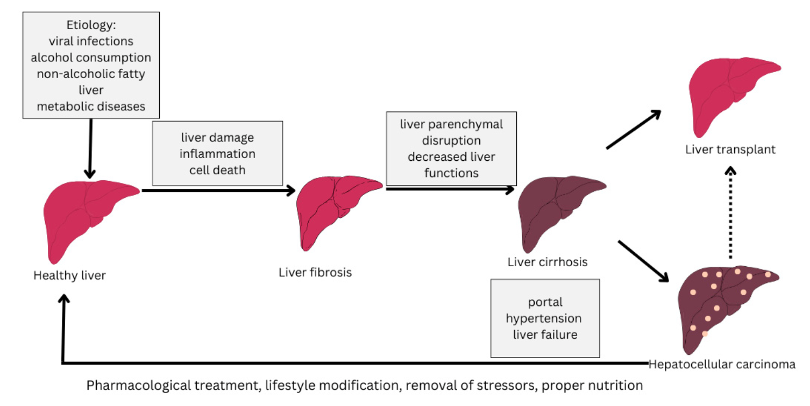
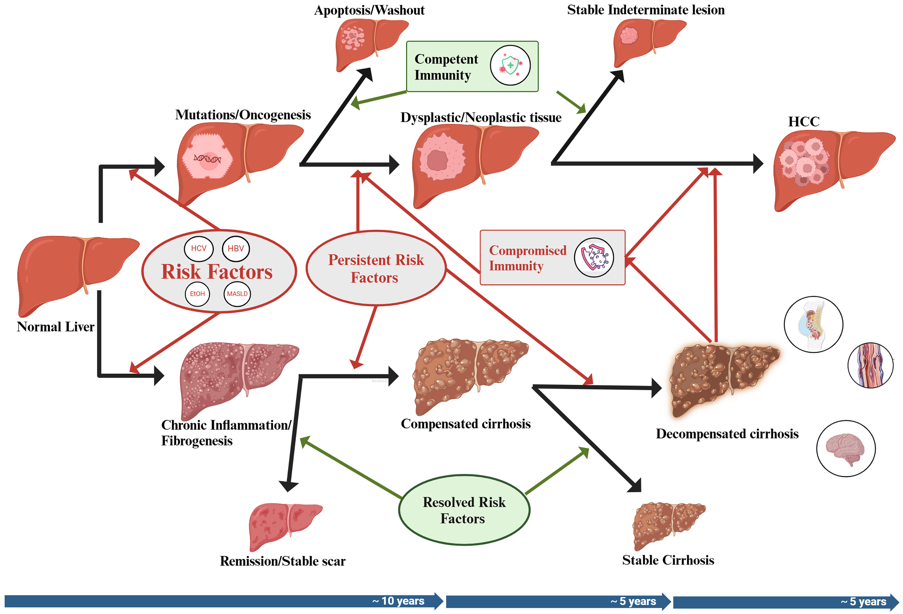
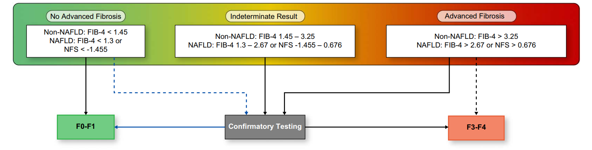

# 🔬 SINH LÝ BỆNH & CƠ CHẾ BỆNH SINH XƠ GAN (LIVER CIRRHOSIS)

<PathoQuickNav />

<!-- DẢI CHỈ SỐ NHANH (QUICK STATS STRIP) -->
<section class="stats-strip">
  <div class="stats-grid">
    <div class="stat-card">
      <div class="stat-val purple">&gt; 12 Năm ➔ 1.5 - 2 Năm</div>
      <div class="stat-lbl">Thời gian sống trung vị từ Giai đoạn Còn bù ➔ Mất bù</div>
    </div>
    <div class="stat-card">
      <div class="stat-val blue">&ge; 10 mmHg (CSPH)</div>
      <div class="stat-lbl">Ngưỡng áp lực tĩnh mạch cửa có ý nghĩa lâm sàng (AASLD 2024)</div>
    </div>
    <div class="stat-card">
      <div class="stat-val red">&ge; 250 cells/µL</div>
      <div class="stat-lbl">Ngưỡng bạch cầu đa nhân trung tính dịch cổ trướng chẩn đoán SBP</div>
    </div>
    <div class="stat-card">
      <div class="stat-val green">ADQI-ICA 2024</div>
      <div class="stat-lbl">Phân loại mới: HRS-AKI &amp; HRS-NAKI (Co thắt mạch + Viêm mô)</div>
    </div>
  </div>
</section>

---

## 1. Tiến Trình Tự Nhiên & Phân Giai Đoạn Lâm Sàng (cACLD / AASLD 2024) {#sec-1}

### 1.1. Bản Chất Giải Phẫu Bệnh & Hai Giai Đoạn Lâm Sàng Kinh Điển

**Xơ gan (Liver Cirrhosis)** là giai đoạn tiến triển muộn của tất cả các bệnh gan mạn tính (CLD). Về mặt mô bệnh học, xơ gan được đặc trưng bởi sự hình thành lan tỏa các **nốt tái tạo tế bào gan (regenerative nodules)** được bao quanh bởi các **dải vách xơ (fibrotic septa)** dày đặc, dẫn đến sự phá hủy hoàn toàn cấu trúc tiểu thùy gan bình thường, làm biến đổi sâu sắc mạng vi mạch xoang gan và gia tăng độ cứng nhu mô gan.

Tiến trình tự nhiên của bệnh gan mạn tính diễn tiến qua hai giai đoạn lâm sàng lớn với tiên lượng hoàn toàn khác biệt:

```
                    [CÁC YẾU TỐ NGUY CƠ TIẾP DIỄN]
    (Virus Viêm Gan B/C, Tiêu Thụ Rượu, MASLD/MASH, Bệnh Tự Miễn/Ứ Mật)
                                  │
                                  ▼
           [VIÊM MẠN TÍNH & TẠO XƠ TIẾN TRIỂN (FIBROGENESIS)]
                                  │
                                  ▼
     ┌────────────────────────────────────────────────────────────┐
     │           XƠ GAN CÒN BÙ (COMPENSATED CIRRHOSIS)            │
     │ - Không triệu chứng lâm sàng rõ rệt                        │
     │ - Chức năng tổng hợp của gan còn duy trì                   │
     │ - Áp lực tĩnh mạch cửa: HVPG 5 - 10 mmHg                   │
     │ - Thời gian sống trung vị: > 12 năm                        │
     └────────────────────────────┬───────────────────────────────┘
                                  │
                                  ▼ (Tốc độ chuyển đổi 5% - 7% mỗi năm)
     ┌────────────────────────────────────────────────────────────┐
     │           XƠ GAN MẤT BÙ (DECOMPENSATED CIRRHOSIS)          │
     │ - Xuất hiện biến chứng: Cổ trướng, Xuất huyết vỡ giãn, HE  │
     │ - Bệnh lý hệ thống đa cơ quan + Rối loạn huyết động nặng   │
     │ - Áp lực tĩnh mạch cửa: HVPG ≥ 10 - 12 mmHg (CSPH)         │
     │ - Thời gian sống trung vị: Rút ngắn còn 1.5 - 2 năm        │
     └────────────────────────────┬───────────────────────────────┘
                                  │
                                  ▼ (Mất bù tiến triển: SBP, HRS, Vàng da)
     ┌────────────────────────────────────────────────────────────┐
     │      SUY GAN GIAI ĐOẠN CUỐI & NGUY CƠ UNG THƯ GAN (HCC)    │
     │ - Tử vong do suy đa tạng hoặc xuất huyết tiêu hóa ồ ạt    │
     │ - Chỉ định sống còn: GHÉP GAN (LIVER TRANSPLANTATION)      │
     └────────────────────────────────────────────────────────────┘
```

1. **Giai đoạn Xơ gan Còn bù (Compensated Cirrhosis):**
   - Người bệnh hoàn toàn không có triệu chứng cơ năng hoặc chỉ mệt mỏi nhẹ không đặc hiệu.
   - Chức năng tổng hợp albumin, yếu tố đông máu và chuyển hóa bilirubin của gan vẫn được bảo tồn ở mức đủ đáp ứng nhu cầu nội môi.
   - **Tiên lượng:** Thời gian sống trung vị (median survival) rất khả quan, thường **$&gt; 12\text{ năm}$**.

2. **Giai đoạn Xơ gan Mất bù (Decompensated Cirrhosis):**
   - Đánh dấu bằng sự xuất hiện của ít nhất một trong ba biến chứng chỉ điểm kinh điển: **Cổ trướng (Ascites)**, **Xuất huyết tiêu hóa do vỡ giãn tĩnh mạch thực quản - dạ dày (Variceal Hemorrhage)**, hoặc **Bệnh não gan (Hepatic Encephalopathy)**.
   - Tốc độ chuyển từ còn bù sang mất bù diễn ra trung bình **$5\% - 7\%$ mỗi năm** (hoặc $5\% - 12\%$ tùy mức độ kiểm soát căn nguyên). Trong đó, cổ trướng là biến chứng mất bù đầu tiên phổ biến nhất (xuất hiện ở $5\% - 10\%$ bệnh nhân còn bù mỗi năm).
   - **Tiên lượng:** Khi đã xuất hiện sự kiện mất bù, bệnh gan chuyển thành một hội chứng suy giảm chức năng đa cơ quan mang tính hệ thống. Thời gian sống trung vị sụt giảm nghiêm trọng, **chỉ còn khoảng $1.5 - 2\text{ năm}$**. Bệnh nhân xuất hiện các biến cố liên tiếp (cổ trướng kháng trị, viêm phúc mạc nhiễm khuẩn tự phát SBP, hội chứng gan thận HRS) được xếp vào nhóm **"Mất bù tiến triển" (Further decompensation)** với tỷ lệ tử vong trong 2 năm lên tới trên $40\% - 60\%$.

<figure class="physio-figure" style="display: flex; flex-direction: column; align-items: center; justify-content: center; text-align: center; margin: 2rem auto;">
  
  <figcaption style="margin-top: 0.85rem; font-size: 0.88rem; color: var(--color-text-muted, #64748b); font-style: italic; text-align: center; max-width: 820px; line-height: 1.55;">
    <strong>Hình 1: Tiến Trình Tự Nhiên &amp; Động Lực Học Của Xơ Gan.</strong> Quá trình tiến triển tuần tự: Nguyên nhân căn nguyên (Virus, Rượu, MASLD, Rối loạn chuyển hóa) ➔ Tổn thương tế bào gan &amp; Viêm hoại tử ➔ Xơ hóa nhu mô gan ➔ Xơ gan với hai nhánh biến chứng cốt lõi là Tăng áp lực tĩnh mạch cửa (Portal hypertension) và Suy chức năng gan (Liver failure), dẫn đến Cổ trướng, Bệnh não gan, Xuất huyết tiêu hóa, và Ung thư biểu mô tế bào gan (HCC). Nguồn: <em>Diseases</em> (Amaritei et al., 2025).
  </figcaption>
</figure>

<figure class="physio-figure" style="display: flex; flex-direction: column; align-items: center; justify-content: center; text-align: center; margin: 2rem auto;">
  
  <figcaption style="margin-top: 0.85rem; font-size: 0.88rem; color: var(--color-text-muted, #64748b); font-style: italic; text-align: center; max-width: 820px; line-height: 1.55;">
    <strong>Hình 2: Đường Dẫn Khái Niệm Từ Bệnh Gan Mạn Tính Đến Xơ Gan &amp; HCC.</strong> Tác nhân gây tổn thương kéo dài thúc đẩy tạo xơ tiến triển đến xơ gan còn bù. Nếu loại bỏ nguyên nhân sớm, xơ hóa có thể thoái lui (Stable scar); nếu tiếp diễn, bệnh tiến triển thành xơ gan mất bù. Tình trạng suy giảm giám sát miễn dịch (Compromised Immunity / CAIDS) tạo điều kiện cho các tổn thương loạn sản tiến triển thành Ung thư biểu mô tế bào gan (HCC). Nguồn: <em>Hepatoma Research</em> (Alsudaney et al., 2025).
  </figcaption>
</figure>

---

### 1.2. Phân Tầng Giai Đoạn Lâm Sàng & Chẩn Đoán Không Xâm Lấn cACLD (AASLD 2024)

Hướng dẫn thực hành lâm sàng của Hiệp hội Nghiên cứu Bệnh Gan Hoa Kỳ (**AASLD 2024 Practice Guidance**) đã chuẩn hóa hệ thống phân tầng bệnh lý gan mạn tính tiến triển còn bù (**Compensated Advanced Chronic Liver Disease - cACLD**) dựa trên sự kết hợp giữa đo độ cứng của gan (Liver Stiffness Measurement - LSM qua FibroScan) và số lượng tiểu cầu:

<div class="table-responsive">
  <table class="table-modern">
    <thead>
      <tr>
        <th>Giai Đoạn cACLD (AASLD 2024)</th>
        <th>Tiêu Chuẩn Không Xâm Lấn (LSM &amp; Tiểu Cầu)</th>
        <th>Đặc Điểm Huyết Động Học Mạch Cửa (HVPG)</th>
        <th>Phân Tầng Nguy Cơ &amp; Hướng Xử Trí</th>
      </tr>
    </thead>
    <tbody>
      <tr>
        <td><strong>Loại trừ cACLD (No cACLD)</strong></td>
        <td>$\text{LSM} &lt; 10\text{ kPa}$</td>
        <td>$\text{HVPG } 1 - 5\text{ mmHg}$ (Huyết động hoàn toàn bình thường)</td>
        <td>Nguy cơ xơ gan và mất bù cực thấp. Theo dõi định kỳ hàng năm.</td>
      </tr>
      <tr>
        <td><strong>Nghi ngờ cACLD (Possible cACLD)</strong></td>
        <td>$\text{LSM } 10 - 15\text{ kPa}$</td>
        <td>$\text{HVPG } 5 - 10\text{ mmHg}$ (Tăng áp cửa mức độ dưới lâm sàng)</td>
        <td>Xơ hóa F3 - F4 (vách xơ mỏng), nguy cơ mất bù thấp. Chưa có giãn tĩnh mạch thực quản.</td>
      </tr>
      <tr>
        <td><strong>Xác định cACLD + Nghi ngờ CSPH</strong></td>
        <td>$\text{LSM } 15 - 20\text{ kPa}$ kèm $\text{Tiểu cầu} &lt; 110\text{ G/L}$</td>
        <td>$\text{HVPG } \ge 10\text{ mmHg}$ (Tăng áp cửa có ý nghĩa lâm sàng - CSPH)</td>
        <td>Nguy cơ mất bù cao. Bắt đầu xuất hiện các nhánh tuần hoàn bàng hệ.</td>
      </tr>
      <tr>
        <td><strong>Xác định cACLD + Chắc chắn CSPH</strong></td>
        <td>$\text{LSM } 20 - 25\text{ kPa}$ kèm $\text{Tiểu cầu} &lt; 150\text{ G/L}$ hoặc $\text{LSM} &gt; 25\text{ kPa}$</td>
        <td>$\text{HVPG } \ge 10 - 12\text{ mmHg}$ (CSPH rõ rệt)</td>
        <td><strong>Khởi trị thuốc chẹn Beta không chọn lọc (NSBB - Carvedilol)</strong> để dự phòng tiên phát mất bù mà không cần nội soi tầm soát bắt buộc.</td>
      </tr>
      <tr>
        <td><strong>Xơ gan Mất bù (Decompensated)</strong></td>
        <td>Xuất hiện Cổ trướng, Xuất huyết tiêu hóa hoặc Bệnh não gan</td>
        <td>$\text{HVPG } &gt; 10\text{ mmHg}$, thường vượt ngưỡng $\mathbf{&gt; 20\text{ mmHg}}$</td>
        <td>Nguy cơ tử vong dốc đứng. Đánh giá chỉ định ghép gan và xử trí biến chứng khẩn cấp.</td>
      </tr>
    </tbody>
  </table>
</div>

<figure class="physio-figure" style="display: flex; flex-direction: column; align-items: center; justify-content: center; text-align: center; margin: 2rem auto;">
  
  <figcaption style="margin-top: 0.85rem; font-size: 0.88rem; color: var(--color-text-muted, #64748b); font-style: italic; text-align: center; max-width: 820px; line-height: 1.55;">
    <strong>Hình 3: Phân Loại Giai Đoạn Lâm Sàng &amp; Định Danh Không Xâm Lấn cACLD (AASLD 2024).</strong> Đối chiếu hai trục song song: Trục lâm sàng phân định các mức độ từ Không xơ gan ➔ Xơ gan còn bù (nguy cơ thấp vs cao) ➔ Xơ gan mất bù (mất bù lần đầu vs mất bù tiến triển); Trục không xâm lấn ứng dụng độ cứng gan (LSM) và số lượng tiểu cầu để chẩn đoán xác định Tăng áp cửa có ý nghĩa lâm sàng (CSPH) nhằm chỉ định điều trị Carvedilol kịp thời. Nguồn: <em>AASLD Practice Guidance on Portal Hypertension</em> (Figure 1, 2024).
  </figcaption>
</figure>

---

## 2. Cơ Chế Tế Bào Của Quá Trình Tạo Xơ Gan (Fibrogenesis & HSCs) {#sec-2}

Xơ hóa gan là một đáp ứng tạo sẹo bệnh lý liên tục, phát sinh từ sự mất cân bằng giữa quá trình tổng hợp, lắng đọng và thoái hóa các protein chất nền ngoại bào (Extracellular Matrix - ECM). Quá trình này được điều phối bởi mạng lưới tương tác đa chiều giữa tế bào nhu mô và các tế bào không nhu mô gan:

```
[TỔN THƯƠNG TẾ BÀO GAN (HEPATOCYTES) DO VIRUS / RƯỢU / LIPID / AXIT MẬT]
                                  │
                                  ▼
[APOPTOSIS & HOẠI TỬ TẾ BÀO ➔ GIẢI PHÓNG ROS & PHÂN TỬ DAMPs]
                                  │
                                  ▼
[HOẠT HÓA TẾ BÀO KUPFFER (KCs) ➔ TIẾT CHEMOKINE CCL2 & TGF-β1, TNF-α]
                                  │
                                  ▼ (Chiêu mộ Monocyte từ máu ngoại vi)
[CHUYỂN BIỆT HÓA TẾ BÀO HÌNH SAO GAN (HSCs) ➔ NGUYÊN BÀO SỢI CƠ (MYOFIBROBLASTS)]
                                  │
                                  ▼
[TĂNG SINH & SẢN XUẤT Ồ ẠT COLLAGEN TYPE I & TYPE III VÀO KHOẢNG DISSE]
                                  │
                                  ▼
[MAO MẠCH HÓA XOANG GAN (SINUSOIDAL CAPILLARIZATION) & MẤT CỬA SỔ NỘI MÔ LSECs]
                                  │
                                  ▼
[HÀNG RÀO NGĂN CÁCH TRAO ĐỔI CHẤT ➔ THIẾU OXY TẾ BÀO GAN & TĂNG SỨC CẢN NỘI GAN]
```

---

### 2.1. Bốn Bước Sinh Học Tế Bào Cốt Lõi Trong Quá Trình Tạo Xơ

1. **Tổn thương tế bào nhu mô gan (Hepatocytes) và giải phóng tín hiệu nguy hiểm:**
   - Các tác nhân gây độc tấn công tế bào gan, gây stress lưới nội chất, rối loạn chức năng ty thể và thúc đẩy tế bào chết theo chương trình (apoptosis) hoặc hoại tử lytic.
   - Tế bào gan bị hủy hoại giải phóng các **Gốc tự do oxy hóa (ROS)** và các **Mẫu phân tử liên kết với tổn thương (Damage-Associated Molecular Patterns - DAMPs)** như HMGB1, DNA ty thể, và ATP vào khoảng gian bào.

2. **Hoạt hóa Tế bào Kupffer (KCs) và chiêu mộ bạch cầu đơn nhân:**
   - Các đại thực bào thường trú tại gan (Kupffer cells) nhận diện DAMPs và ROS qua các thụ thể TLR (Toll-like Receptors).
   - Tế bào Kupffer hoạt hóa tiết ra các cytokine tiền viêm mạnh mẽ (**TNF-$\alpha$, IL-1$\beta$, IL-6**) và đặc biệt là chemokine **CCL2 (MCP-1)**.
   - CCL2 hoạt động như một chất hóa hướng động cực mạnh, chiêu mộ ồ ạt các bạch cầu đơn nhân (monocytes mang thụ thể CCR2) từ tuần hoàn ngoại vi vào nhu mô gan, khuếch đại dòng thác viêm tại chỗ.

3. **Hoạt hóa Tế bào Hình sao Gan (Hepatic Stellate Cells - HSCs) — Tâm điểm tạo xơ:**
   - **Trạng thái yên lặng (Quiescent HSCs):** Ở gan khỏe mạnh, HSCs nằm trong khoảng không Disse (giữa tế bào nội mô xoang gan và tế bào gan), đóng vai trò chính là cơ quan lưu trữ hơn $80\%$ lượng Vitamin A (retinoid) của cơ thể dưới dạng các giọt mỡ nội bào.
   - **Trạng thái hoạt hóa (Activated HSCs):** Dưới tác động kích thích liên tục của **TGF-$\beta 1$** (yếu tố xơ hóa mạnh nhất), PDGF, ROS và DAMPs, các tế bào hình sao mất đi giọt lipid Vitamin A và trải qua quá trình **chuyển biệt hóa kiểu hình (transdifferentiation)** trở thành các **nguyên bào sợi cơ (myofibroblasts)** có khả năng co thắt mạnh mẽ.
   - Các nguyên bào sợi cơ này tăng sinh và bài tiết một lượng khổng lồ các protein chất nền ngoại bào (ECM), chủ yếu là **Collagen tuýp I và tuýp III**, fibronectin và laminin vào khoảng không Disse.

4. **Mao mạch hóa xoang gan (Sinusoidal Capillarization) & Mất cửa sổ nội mô:**
   - Bình thường, tế bào nội mô xoang gan (LSECs) có cấu trúc đặc biệt với hàng ngàn lỗ thủng nhỏ (fenestrae) và không có màng đáy liên tục, cho phép huyết tương và các chất dinh dưỡng tự do thẩm thấu qua lại giữa lòng xoang gan và tế bào gan.
   - Khi collagen tích tụ dày đặc trong khoảng Disse, các LSECs bị mất đi các cửa sổ nội mô (**sinusoidal defenestration**) và hình thành một màng nền xơ hóa liên tục bên dưới, gọi là **hiện tượng mao mạch hóa xoang gan**.
   - Hiện tượng này tạo thành một hàng rào vật lý dày đặc cản trở sự trao đổi oxy và dưỡng chất, khiến tế bào gan rơi vào tình trạng thiếu máu nuôi mạn tính, thúc đẩy hoại tử tế bào gan thứ phát và khép kín vòng xoắn bệnh lý tạo xơ.

---

### 2.2. Sự Khác Biệt Về Mô Hình Phân Bố Xơ Hóa Theo Căn Nguyên

<div class="table-responsive">
  <table class="table-modern">
    <thead>
      <tr>
        <th>Nhóm Bệnh Căn Nguyên</th>
        <th>Vị Trí Khởi Phát Xơ Hóa Ban Đầu</th>
        <th>Mô Hình Phân Bố Mô Bệnh Học</th>
        <th>Tiến Trình Tạo Cầu Xơ (Bridging Fibrosis)</th>
      </tr>
    </thead>
    <tbody>
      <tr>
        <td><strong>Bệnh gan do Rượu (ALD) &amp; Gan nhiễm mỡ chuyển hóa (MASLD/MASH)</strong></td>
        <td><strong>Vùng 3 (Vùng trung tâm tiểu thùy - Centrilobular zone)</strong></td>
        <td>Xơ hóa quanh xoang gan và quanh tế bào gan dạng lưới thép (Perisinusoidal / Pericellular / Chicken-wire pattern).</td>
        <td>Tiến triển nối liền tĩnh mạch trung tâm tiểu thùy với tĩnh mạch trung tâm (Central-to-central bridging).</td>
      </tr>
      <tr>
        <td><strong>Viêm gan Virus (HBV, HCV) &amp; Viêm gan Tự miễn (AIH)</strong></td>
        <td><strong>Vùng 1 (Khoảng cửa - Portal triads)</strong></td>
        <td>Viêm hoại tử mối nối (Interface hepatitis) và xơ hóa xuất phát từ khoảng cửa (Portal-based fibrosis).</td>
        <td>Hình thành các dải xơ cầu nối khoảng cửa - khoảng cửa (Portal-to-portal) và khoảng cửa - trung tâm (Portal-to-central).</td>
      </tr>
      <tr>
        <td><strong>Bệnh đường mật mạn tính (PBC, PSC)</strong></td>
        <td>Biểu mô đường mật và khoảng cửa</td>
        <td>Xơ hóa dạng vỏ hành quanh ống mật (Periductal onion-skin fibrosis) và xơ hóa khoảng cửa tiến triển.</td>
        <td>Cầu xơ nối các khoảng cửa rộng lớn, bảo tồn tĩnh mạch trung tâm cho đến giai đoạn muộn.</td>
      </tr>
    </tbody>
  </table>
</div>

---

## 3. Sinh Lý Bệnh Tăng Áp Lực Tĩnh Mạch Cửa (Định Luật Ohm ΔP = Q × R) {#sec-3}

Tăng áp lực tĩnh mạch cửa (Portal Hypertension - PH) là hệ quả trực tiếp của xơ gan và là động lực huyết động cốt lõi thúc đẩy toàn bộ các biến chứng mất bù nặng nề.

Về mặt vật lý sinh học dòng chảy, áp lực tĩnh mạch cửa tuân theo **định luật Ohm**:

$$\Delta P = Q \times R$$

*Trong đó:*
- $\Delta P$: Độ chênh lệch áp lực tĩnh mạch cửa (HVPG = Áp lực tĩnh mạch gan bít WHVP $-$ Áp lực tĩnh mạch gan tự do FHVP).
- $R$: Sức cản đối với dòng máu đi qua gan (Intrahepatic vascular resistance).
- $Q$: Lưu lượng dòng máu tạng đổ về hệ tĩnh mạch cửa (Portal venous inflow).

```
                            [TĂNG ÁP LỰC TĨNH MẠCH CỬA (ΔP = Q × R)]
                                               │
         ┌─────────────────────────────────────┴─────────────────────────────────────┐
         ▼                                                                           ▼
[TĂNG SỨC CẢN NỘI GAN (R)]                                                [TĂNG DÒNG MÁU TẠNG (Q)]
(Yếu tố Khởi Phát Sơ Khởi)                                                (Yếu tố Duy Trì & Khuếch Đại)
1. Thành phần Cấu trúc Cố định (70%):                                     1. Áp lực cửa tăng ➔ Lực căng trượt (Shear stress)
   - Dải xơ khoảng Disse bóp nghẹt xoang gan                                2. Nội mô mạch tạng tiết quá mức Nitric Oxide (NO)
   - Nốt tái tạo chèn ép tĩnh mạch gan nhỏ                                3. Giãn tiểu động mạch tạng diện rộng
   - Vi huyết khối nội mạch & Triệt tiêu nhu mô                           4. Dòng máu ùa về tĩnh mạch cửa tăng vọt (Q tăng)
2. Thành phần Động Co Thắt (30%):                                         5. Giảm thể tích động mạch hiệu dụng (EABV)
   - Co rút tế bào hình sao (HSCs) & Tế bào cơ trơn                        6. Kích hoạt SNS, RAAS, ADH ➔ Tuần hoàn tăng động
   - Thiếu hụt NO nội gan (Giảm hoạt tính eNOS gan)
   - Tăng các chất co mạch: Endothelin-1, Ang II, TXA2
```

---

### 3.1. Sự Gia Tăng Sức Cản Nội Gan (R) — Khởi Đầu Của Tăng Áp Cửa

Sức cản nội gan gia tăng là sự kết hợp của hai thành phần:

1. **Thành phần Cấu trúc Cố định (Mechanical / Fixed Component — chiếm 70%):**
   - Sự biến dạng giải phẫu do các dải xơ và nốt tái tạo tế bào gan chèn ép cơ học vào mạng lưới xoang gan và các tiểu tĩnh mạch gan sau xoang.
   - Hiện tượng tắc nghẽn các nhánh mạch máu nhỏ do vi huyết khối hình thành tại chỗ và xẹp cấu trúc nhu mô (Parenchymal extinction).

2. **Thành phần Động Co thắt Chủ động (Dynamic Component — chiếm 30%):**
   - **Nghịch lý Nitric Oxide tại Gan:** Ở gan xơ, các tế bào nội mô xoang gan (LSECs) bị suy giảm biểu hiện và giảm hoạt tính của enzyme **eNOS**, dẫn đến sự **sụt giảm nghiêm trọng nồng độ Nitric Oxide (NO) nội sinh trong gan**.
   - Tế bào hình sao gan (HSCs) đã hoạt hóa và tế bào cơ trơn mạch máu bị mất đi tác dụng giãn mạch của NO, đồng thời tăng đáp ứng nhạy cảm với các chất co mạch nội gan tăng cao như **Endothelin-1 (ET-1), Angiotensin II, Norepinephrine, Thromboxane A2**.
   - Thành phần động này có tính chất thuận nghịch và là mục tiêu can thiệp của các thuốc hạ áp lực tĩnh mạch cửa (như thuốc chẹn Beta không chọn lọc Carvedilol, thuốc chẹn thụ thể Angiotensin).

---

### 3.2. Giãn Mạch Tạng & Trạng Thái Tuần Hoàn Tăng Động (Hyperdynamic Circulation)

Khi sức cản nội gan tăng cao, cơ thể khởi phát phản ứng mạch máu bù trừ nhưng mang lại hậu quả bệnh lý nghiêm trọng:

- **Giãn động mạch tạng qua trung gian NO ngoại vi:** Áp lực cửa tăng cao tạo ra một lực căng trượt (shear stress) kéo dài lên tế bào nội mô của các động mạch và tiểu động mạch nuôi ruột, mạc treo và lách. Lực căng này kích hoạt enzyme eNOS tại hệ mạch mạc treo sản xuất và phóng thích một lượng khổng lồ **Nitric Oxide (NO), Prostacyclin, Carbon Monoxide (CO) và Endocannabinoids**.
- **Tăng lưu lượng dòng máu cửa ($Q$):** Các tiểu động mạch tạng giãn rộng cực độ làm giảm mạnh sức cản mạch máu tạng, khiến một lượng máu khổng lồ từ hệ động mạch ùa vào hệ tĩnh mạch cửa ($Q$ tăng vọt). Hiện tượng này tiếp tục đẩy áp lực tĩnh mạch cửa lên cao, duy trì tình trạng tăng áp cửa ngay cả khi các nhánh bàng hệ đã mở ra.
- **Giảm thể tích tuần hoàn động mạch hiệu dụng (Effective Arterial Blood Volume - EABV):** Lượng máu ứ đọng phần lớn trong các hồ máu tạng bị giãn nở khiến lượng máu lưu thông thực sự trong hệ thống động mạch trung tâm cấp máu cho não, thận và tim bị suy giảm sâu sắc (thiếu dịch nội mạch tương đối).
- **Kích hoạt phản xạ thần kinh - thể dịch:** Cơ quan thụ cảm áp lực nhận diện tình trạng tụt EABV, lập tức kích hoạt bù trừ 3 hệ thống:
  1. **Hệ thần kinh giao cảm (SNS):** Tăng nhịp tim và tăng thể tích nhát bóp, thiết lập **trạng thái tuần hoàn tăng động (Hyperdynamic Circulation)** với cung lượng tim tăng cao nhưng huyết áp động mạch trung bình (MAP) có xu hướng tụt.
  2. **Hệ Renin-Angiotensin-Aldosterone (RAAS):** Tiết Renin $\rightarrow$ Angiotensin II (co mạch) và Aldosterone (tăng tái hấp thu $Na^+$ ở ống thận).
  3. **Hormone kháng niệu (ADH / Vasopressin):** Tiết theo cơ chế phi thẩm thấu, kích hoạt kênh Aquaporin-2 ở ống góp để giữ nước tự do.

---

### 3.3. Bảng Phân Loại Tăng Áp Cửa Theo Giải Phẫu & Huyết Động Học

<div class="table-responsive">
  <table class="table-modern">
    <thead>
      <tr>
        <th>Vị Trí Tắc Nghẽn</th>
        <th>Bệnh Lý Căn Nguyên Điển Hình</th>
        <th>Áp Lực Gan Bít (WHVP)</th>
        <th>Áp Lực Gan Tự Do (FHVP)</th>
        <th>Chênh Áp Tĩnh Mạch Gan (HVPG)</th>
      </tr>
    </thead>
    <tbody>
      <tr>
        <td><strong>Trước gan (Prehepatic)</strong></td>
        <td>Huyết khối tĩnh mạch cửa (PVT), Huyết khối tĩnh mạch lách, Rò động - tĩnh mạch tạng.</td>
        <td>Bình thường</td>
        <td>Bình thường</td>
        <td><strong>Bình thường ($&lt; 5\text{ mmHg}$)</strong> (Áp lực cửa tăng trước vị trí đo)</td>
      </tr>
      <tr>
        <td><strong>Tại gan - Trước xoang (Presinusoidal)</strong></td>
        <td>Bệnh sán máng (Schistosomiasis), Xơ đường mật nguyên phát (PBC), Bệnh mạch máu xoang cửa (PSVD / NCPH).</td>
        <td>Bình thường hoặc Tăng nhẹ</td>
        <td>Bình thường</td>
        <td><strong>Bình thường hoặc Tăng nhẹ ($&lt; 10\text{ mmHg}$)</strong></td>
      </tr>
      <tr>
        <td><strong>Tại gan - Tại xoang (Sinusoidal)</strong></td>
        <td><strong>Xơ gan (tất cả các nguyên nhân: Virus, Rượu, MASLD)</strong>, Viêm gan do rượu nặng.</td>
        <td><strong>Tăng rất cao</strong></td>
        <td>Bình thường</td>
        <td><strong>Tăng rất cao ($\ge 10 - 20\text{ mmHg}$)</strong> (HVPG phản ánh chính xác áp lực cửa)</td>
      </tr>
      <tr>
        <td><strong>Tại gan - Sau xoang (Postsinusoidal)</strong></td>
        <td>Hội chứng tắc nghẽn xoang gan (SOS / VOD), Tổn thương mạch máu do xạ trị hoặc hóa chất.</td>
        <td>Tăng cao</td>
        <td>Bình thường / Tăng</td>
        <td>Tăng cao</td>
      </tr>
      <tr>
        <td><strong>Sau gan (Posthepatic)</strong></td>
        <td>Hội chứng Budd-Chiari (tắc tĩnh mạch gan), Hẹp/Tắc tĩnh mạch chủ dưới (IVC), Viêm màng ngoài tim co thắt, Suy tim phải nặng.</td>
        <td>Tăng rất cao</td>
        <td>Tăng rất cao</td>
        <td><strong>Bình thường hoặc Tăng nhẹ</strong> (Do cả WHVP và FHVP cùng tăng song hành)</td>
      </tr>
    </tbody>
  </table>
</div>

---

## 4. Cơ Chế Bệnh Sinh Hình Thành Cổ Trướng & Rối Loạn Hạ Natri Máu {#sec-4}

### 4.1. Thuyết Giãn Mạch Ngoại Vi Trong Hình Thành Cổ Trướng (Ascites)

Cổ trướng là sự tích tụ dịch bất thường trong khoang phúc mạc. Sinh bệnh học của cổ trướng được giải thích hoàn chỉnh nhất qua **Thuyết giãn mạch ngoại vi (Peripheral Arterial Vasodilation Hypothesis)**:

$$\text{Cổ Trướng} = \text{Tăng áp lực thủy tĩnh xoang gan/tạng} + \text{Giảm áp lực keo huyết tương (Hạ Albumin)} + \text{Giữ muối nước do suy giảm EABV}$$

```
[TĂNG ÁP LỰC CỬA (HVPG ≥ 10 mmHg) + GIÃN ĐỘNG MẠCH TẠNG (NO NGOẠI VI)]
                               │
                               ▼
     [SỤT GIẢM THỂ TÍCH TUẦN HOÀN ĐỘNG MẠCH HIỆU DỤNG (EABV)]
                               │
                               ▼
     [KÍCH HOẠT PHẢN ỨNG THẦN KINH - THỂ DỊCH HƯỚNG THẬN]
        ├── Hệ RAAS ➔ Aldosterone ➔ Tăng tái hấp thu Natri tại ống lượn xa
        ├── Hệ Giao Cảm SNS ➔ Co mạch thận ➔ Tái hấp thu Natri tại ống lượn gần
        └── Tuyến Yên ➔ Tiết ADH phi thẩm thấu ➔ Aquaporin-2 giữ nước tự do
                               │
                               ▼
     [QUÁ TẢI THỂ TÍCH DỊCH NGOẠI BÀO + THOÁT DỊCH LỌC VÀO KHOANG DISSE]
                               │
                               ▼
     [VƯỢT QUÁ KHẢ NĂNG DẪN LƯU CỦA ỐNG NGỰC & HỆ BẠCH HUYẾT (> 900 mL/ngày)]
                               │
                               ▼
     [DỊCH RỈ QUA BỀ MẶT GAN VÀ LỚP PHÚC MẠC VÀO Ổ BỤNG ➔ HÌNH THÀNH CỔ TRƯỚNG]
```

1. **Gia tăng sản xuất dịch bạch huyết tại gan:** Áp lực thủy tĩnh trong các xoang gan tăng cao làm dịch huyết tương thoát nhanh chóng vào khoảng Disse. Lưu lượng dịch bạch huyết qua ống ngực tăng gấp 20 - 30 lần bình thường (có thể đạt 8 - 10 lít/ngày).
2. **Thoát dịch màng bụng khi vượt ngưỡng đệm:** Khi lượng dịch lọc vượt quá khả năng dẫn lưu tối đa của hệ bạch huyết phúc mạc (bình thường phúc mạc hấp thu tối đa $\sim 900\text{ mL/ngày}$), dịch giàu protein sẽ rỉ trực tiếp qua bao Glisson của gan và bề mặt phúc mạc tạng tích tụ vào khoang ổ bụng.
3. **Giảm áp lực keo huyết tương:** Tình trạng suy chức năng gan làm giảm tổng hợp Albumin ($\text{Albumin máu} &lt; 30\text{ g/L}$), làm suy yếu lực giữ nước của lòng mạch, thúc đẩy dịch thoát ra ngoài mô kẽ và ổ bụng.

---

### 4.2. Sinh Lý Bệnh Của Rối Loạn Hạ Natri Máu (Hyponatremia)

Hạ natri máu ($\text{Na}^+ &lt; 135\text{ mmol/L}$, đặc biệt nặng khi $&lt; 130\text{ mmol/L}$) gặp ở $30\% - 35\%$ bệnh nhân xơ gan cổ trướng, chia thành 2 thể cơ chế đối lập:

<div class="table-responsive">
  <table class="table-modern">
    <thead>
      <tr>
        <th>Tiêu Chí Đối Chiếu</th>
        <th>Hạ Natri Máu Tăng Thể Tích / Loãng (Hypervolemic Hyponatremia)</th>
        <th>Hạ Natri Máu Giảm Thể Tích (Hypovolemic Hyponatremia)</th>
      </tr>
    </thead>
    <tbody>
      <tr>
        <td><strong>Tần suất xuất hiện</strong></td>
        <td><strong>Phổ biến nhất (&gt; 90% các ca hạ Natri trong xơ gan)</strong></td>
        <td>Ít gặp hơn (thường do biến chứng điều trị hoặc mất dịch)</td>
      </tr>
      <tr>
        <td><strong>Cơ chế sinh lý bệnh</strong></td>
        <td>Giảm EABV trầm trọng kích hoạt giải phóng <strong>ADH phi áp lực thẩm thấu</strong>. Kênh Aquaporin-2 tại ống góp tái hấp thu nước tự do vượt trội so với lượng muối tái hấp thu $\rightarrow$ Pha loãng nồng độ Natri huyết thanh.</td>
        <td>Mất muối thực sự vượt quá mất nước qua thận hoặc đường tiêu hóa $\rightarrow$ Suy giảm đồng thời cả thể tích dịch ngoại bào và nội mạch.</td>
      </tr>
      <tr>
        <td><strong>Yếu tố khởi kích</strong></td>
        <td>Tiến triển tự nhiên của xơ gan mất bù, cổ trướng trơ, nhiễm trùng SBP.</td>
        <td>Lạm dụng thuốc lợi tiểu quai (Furosemide), tiêu chảy do Lactulose quá liều, nôn ói, chọc tháo dịch cổ trướng không bù Albumin.</td>
      </tr>
      <tr>
        <td><strong>Đặc điểm lâm sàng</strong></td>
        <td><strong>Bệnh nhân có ứ trệ dịch rõ: Phù toàn thân, Cổ trướng căng to</strong>, tăng cân giả tạo do ứ nước.</td>
        <td><strong>Không có phù ngoại vi</strong>, cổ trướng xẹp, da niêm khô, sụt cân nhanh, tụt huyết áp tư thế, Creatinine máu tăng do giảm tưới máu.</td>
      </tr>
      <tr>
        <td><strong>Nguyên tắc xử trí EBM</strong></td>
        <td><strong>Hạn chế nước tự do ($&lt; 1000\text{ mL/ngày}$)</strong>, ngưng lợi tiểu nếu $\text{Na}^+ &lt; 125\text{ mmol/L}$, truyền Albumin liều cao.</td>
        <td><strong>Ngừng ngay thuốc lợi tiểu</strong>, bù thể tích lòng mạch bằng dung dịch muối đẳng trương ($0.9\%\text{ NaCl}$) hoặc Albumin.</td>
      </tr>
    </tbody>
  </table>
</div>

---

## 5. Hội Chứng Gan Thận (HRS-AKI / HRS-NAKI) & Tổn Thương Thận Cấp {#sec-5}

### 5.1. Cơ Chế Co Thắt Mạch Thận Cực Độ & Thuyết Viêm Mô Ty Thể

**Hội chứng gan thận (Hepatorenal Syndrome - HRS)** là đỉnh điểm của sự rối loạn tuần hoàn hệ thống và suy sụp chức năng thận ở bệnh nhân xơ gan mất bù. Sinh lý bệnh hiện đại nhìn nhận HRS là kết quả của **sự cộng hưởng giữa hai con đường: Huyết động học và Viêm hệ thống**:

```
                              [BỆNH CẢNH XƠ GAN MẤT BÙ TIẾN TRIỂN]
                                                │
         ┌──────────────────────────────────────┴──────────────────────────────────────┐
         ▼                                                                             ▼
[CON ĐƯỜNG HUYẾT ĐỘNG HỌC]                                                    [CON ĐƯỜNG VIÊM HỆ THỐNG]
- Giãn mạch tạng cực độ ➔ EABV sụt giảm báo động                               - Rò rỉ niêm mạc ruột ➔ Chuyển vị PAMPs (LPS)
- Hoạt hóa tối đa trục co mạch SNS và RAAS                                     - Tế bào gan hoại tử phóng thích DAMPs
- Mạch tạng trơ với chất co mạch do thừa NO                                    - Bão Cytokine: TNF-α, IL-6, IL-1β, ROS
- Hệ mạch thận cực kỳ nhạy cảm với Ang II, NE                                  - Nhiễm độc ty thể biểu mô ống thận (ATI)
- Co thắt dữ dội tiểu động mạch nhập & xuất                                    - Đình trệ tái hấp thu NaCl tại ống lượn gần
- Lưu lượng máu thận sụt giảm nghiêm trọng                                      - Tăng NaCl đến Macula Densa ➔ Phản hồi cầu - ống
                 │                                                                             │
                 └──────────────────────────────────────┬──────────────────────────────────────┘
                                                        │
                                                        ▼
                    [SUY SỤP TỐC ĐỘ LỌC CẦU THẬN (GFR) ➔ HỘI CHỨNG GAN THẬN (HRS-AKI)]
```

1. **Co thắt mạch thận cực độ (Extreme Renal Vasoconstriction):** Nồng độ Angiotensin II, Norepinephrine và Vasopressin tăng vọt trong máu gây co thắt nghẹt thở các tiểu động mạch nhập và xuất của cầu thận, làm giảm tưới máu vỏ thận nghiêm trọng.
2. **Nhiễm độc ty thể tế bào ống thận (Mitochondrial Dysfunction):** Cytokine viêm (TNF-$\alpha$) và các gốc tự do ROS tấn công trực tiếp vào biểu mô ống lượn gần, gây rối loạn chức năng chuỗi hô hấp tế bào ty thể. Tế bào ống thận chuyển sang trạng thái "ngủ đông bảo tồn", ngừng tái hấp thu chủ động muối khoáng.
3. **Phản hồi Cầu - Ống thận (Tubuloglomerular Feedback):** Do ống lượn gần giảm tái hấp thu, một lượng lớn ion $Na^+$ và $Cl^-$ trôi xuống vùng vết đặc (*Macula Densa*). Vết đặc phát tín hiệu co thắt tiểu động mạch vào cầu thận mạnh hơn nữa, đẩy GFR sụt giảm hoàn toàn.

---

### 5.2. Phân Loại Mới Theo Đồng Thuận ADQI-ICA (2024)

<div class="table-responsive">
  <table class="table-modern">
    <thead>
      <tr>
        <th>Thuật Ngữ Mới (ADQI-ICA)</th>
        <th>Thuật Ngữ Cũ Tương Ứng</th>
        <th>Tiêu Chuẩn Chẩn Đoán Cốt Lõi (EBM 2024)</th>
        <th>Đặc Điểm Tiến Triển &amp; Tiên Lượng</th>
      </tr>
    </thead>
    <tbody>
      <tr>
        <td><strong>HRS-AKI</strong> *(Hepatorenal Syndrome - Acute Kidney Injury)*</td>
        <td>HRS Tuýp 1 (Type 1 HRS)</td>
        <td>
          1. Thỏa tiêu chuẩn AKI: Creatinine tăng $\ge 0.3\text{ mg/dL}$ trong 48h hoặc tăng $\ge 50\%$ so với nền trong 7 ngày.<br />
          2. <strong>Không đáp ứng sau 48 giờ</strong> ngừng lợi tiểu và bù thể tích bằng <strong>Albumin $1\text{ g/kg/ngày}$ (tối đa $100\text{ g/ngày}$</strong>.<br />
          3. Không có sốc, không dùng thuốc độc thận gần đây.<br />
          4. Không có tổn thương thực thể thận (Protein niệu $&lt; 500\text{ mg/ngày}$, cặn lắng nước tiểu sạch $&lt; 50$ hồng cầu/vi trường, siêu âm thận bình thường).
        </td>
        <td>Tiến triển tối cấp tính, thường bùng phát sau SBP hoặc xuất huyết tiêu hóa. Nếu không điều trị thuốc co mạch (Terlipressin + Albumin), tử vong $> 80\%$ trong vòng 2 tuần.</td>
      </tr>
      <tr>
        <td><strong>HRS-NAKI</strong> *(Hepatorenal Syndrome - Non-AKI)*</td>
        <td>HRS Tuýp 2 (Type 2 HRS)</td>
        <td>
          - $\text{eGFR} &lt; 60\text{ mL/phút/1.73m}^2$ kéo dài:
          * <em>HRS-AKD (Bệnh thận cấp):</em> Thời gian kéo dài $&lt; 3\text{ tháng}$.
          * <em>HRS-CKD (Bệnh thận mạn):</em> Thời gian kéo dài $\ge 3\text{ tháng}$.<br />
          - Thỏa mãn các tiêu chuẩn loại trừ tổn thương thực thể của HRS.
        </td>
        <td>Tiến triển bán cấp hoặc mạn tính âm thầm, đồng hành cùng tình trạng cổ trướng kháng trị (Refractory ascites).</td>
      </tr>
    </tbody>
  </table>
</div>

---

## 6. Chuyển Vị Vi Khuẩn, Hội Chứng CAIDS & Viêm Phúc Mạc Nhiễm Khuẩn Tự Phát {#sec-6}

### 6.1. Hội Chứng Ruột Rò Rỉ (Leaky Gut) & Liệt Miễn Dịch (CAIDS)

Tình trạng tăng áp lực tĩnh mạch cửa gây ứ trệ tuần hoàn tĩnh mạch ruột kéo dài, dẫn đến hai biến đổi bệnh sinh then chốt:

```
[Ứ TRỆ MẠCH MÁU MẠC TREO ➔ PHÙ NỀ NIÊM MẠC RUỘT & THIẾU OXY TẠI CHỖ]
                                  │
                                  ▼
[PHÁ HỦY CÁC PROTEIN LIÊN KẾT CHẶT (TIGHT JUNCTIONS: OCCLUDIN, ZO-1)]
                                  │
                                  ▼
[LOẠN KHUẨN ĐƯỜNG RUỘT: TĂNG SINH VI KHUẨN GRAM ÂM HIẾU KHÍ (E. COLI)]
                                  │
                                  ▼
[CHUYỂN VỊ VI KHUẨN (BACTERIAL TRANSLOCATION) VÀO HẠCH MẠC TREO ➔ VÀO MÁU]
                                  │
                                  ▼
[HỘI CHỨNG RỐI LOẠN MIỄN DỊCH DO XƠ GAN (CAIDS / IMMUNE PARALYSIS)]
   ├── Shunt Cửa - Chủ bypass qua gan khiến máu chứa vi khuẩn không được lọc
   ├── Suy giảm tổng hợp các protein bổ thể (C3, C4) từ gan xơ
   └── Kiệt quệ miễn dịch: Bạch cầu trung tính mất khả năng thực bào và diệt khuẩn
```

---

### 6.2. Cơ Chế Hình Thành Viêm Phúc Mạc Nhiễm Khuẩn Tự Phát (SBP)

**Viêm phúc mạc nhiễm khuẩn tự phát (Spontaneous Bacterial Peritonitis - SBP)** là tình trạng nhiễm trùng dịch cổ trướng nguyên phát mà không có ổ nhiễm trùng ngoại khoa trong xoang bụng:

1. **Chuyển vị và Vãng khuẩn huyết:** Vi khuẩn Gram âm từ lòng ruột vượt qua hàng rào biểu mô bị rò rỉ vào hệ bạch huyết mạc treo $\rightarrow$ Ống ngực $\rightarrow$ Đi vào tuần hoàn hệ thống gây vãng khuẩn huyết thoáng qua.
2. **Xâm nhập dịch cổ trướng nghèo protein:** Vi khuẩn theo dòng máu đến phúc mạc và rơi vào khoang màng bụng. Ở bệnh nhân xơ gan tiến triển, dịch cổ trướng có nồng độ protein toàn phần rất thấp ($&lt; 1.5\text{ g/dL}$) và hoạt tính bổ thể/opsonin hóa suy kiệt, tạo môi trường nuôi cấy lý tưởng cho vi khuẩn nhân bản không bị kiểm soát.
3. **Phản ứng viêm di chuyển bạch cầu:** Độc tố vi khuẩn kích hoạt phản ứng viêm tại chỗ, chiêu mộ ồ ạt bạch cầu đa nhân trung tính từ máu vào khoang màng bụng.
4. **Tiêu chuẩn vàng chẩn đoán EBM:**
   $$\text{Chẩn đoán xác định SBP khi: } \mathbf{\text{Bạch cầu đa nhân trung tính (PMN) trong dịch cổ trướng } \ge 250\text{ cells/}\mu\text{L} \ (\text{hoặc } \ge 0.25 \times 10^9/\text{L})}$$
   *(Bất kể kết quả cấy dịch cổ trướng âm tính hay dương tính, bắt buộc khởi trị kháng sinh Cephalosporin thế hệ 3 tĩnh mạch ngay lập tức kết hợp truyền Albumin ngày 1 và ngày 3 để phòng ngừa HRS-AKI).*

---

## 7. Bệnh Não Gan (Phù Tế Bào Chiêm Tinh) & Teo Cơ Xơ Gan (Sarcopenia) {#sec-7}

### 7.1. Chuyển Hóa Amoniac ($NH_3$) & Cơ Chế Phù Tế Bào Chiêm Tinh (Astrocyte Swelling)

Bệnh não gan (Hepatic Encephalopathy - HE) là hội chứng suy giảm chức năng thần kinh - tâm thần do sự tích tụ các độc chất chuyển hóa thần kinh trong tuần hoàn hệ thống:

```
[VI KHUẨN ĐƯỜNG RUỘT PHÂN HỦY ĐẠM ➔ SẢN SINH LƯỢNG LỚN AMONIAC (NH3)]
                                  │
                                  ▼
[SUY GAN + SHUNT CỬA - CHỦ: NH3 KHÔNG ĐƯỢC CHUYỂN THÀNH URE ĐỂ THẢI TRỪ]
                                  │
                                  ▼
[NH3 VƯỢT QUA HÀNG RÀO MÁU NÃO VÀO NHU MÔ NÃO BỘ]
                                  │
                                  ▼
[TẾ BÀO CHIÊM TINH (ASTROCYTES) DÙNG GLUTAMATE KẾT HỢP NH3 TẠO GLUTAMINE]
                                  │
                                  ▼
[GLUTAMINE TÍCH TỤ NỘI BÀO HOẠT ĐỘNG NHƯ CHẤT HÚT THẨM THẤU CỰC MẠNH]
                                  │
                                  ▼
[KÉO NƯỚC VÀO NỘI BÀO ➔ PHÙ TẾ BÀO CHIÊM TINH (ASTROCYTE SWELLING)]
                                  │
                                  ▼
[RỐI LOẠN DẪN TRUYỀN THẦN KINH + TĂNG HOẠT TÍNH HỆ GABA/BENZODIAZEPINE]
                                  │
                                  ▼
[BIỂU HIỆN LÂM SÀNG: MẤT ĐỊNH HƯỚNG, RUN VẨY (ASTERIXIS), HÔN MÊ GAN]
```

1. **Chu trình Amoniac tại Não:** Amoniac tự do ($NH_3$) không tích điện dễ dàng khuếch tán qua hàng rào máu não. Do não bộ không có chu trình ure, các **tế bào chiêm tinh (Astrocytes)** là cấu trúc duy nhất giải độc $NH_3$ bằng enzyme *Glutamine Synthetase*, kết hợp Glutamate với $NH_3$ tạo thành **Glutamine**.
2. **Hậu quả của tích tụ Glutamine:** Nồng độ Glutamine nội bào tăng cao hoạt động như một chất hoạt hóa thẩm thấu, kéo nước vào trong tế bào chiêm tinh gây **phù nề tế bào chiêm tinh (Astrocyte swelling)**, stress oxy hóa ty thể và làm thay đổi mật độ thụ thể dẫn truyền thần kinh ức chế GABA.
3. **Hiệp đồng với Viêm thần kinh (Neuroinflammation):** Khi bệnh nhân có nhiễm trùng (SBP, viêm phổi) hoặc xuất huyết, các cytokine viêm ngoại vi (TNF-$\alpha$, IL-6) kích hoạt tế bào microglia tại não, biến đổi bệnh não gan tiềm ẩn (Covert HE) thành **Bệnh não gan rõ rệt (Overt HE)**.

---

### 7.2. Teo Cơ Xơ Gan (Sarcopenia) & Chuyển Hóa Đói Kịch Phát (Starvation Metabolism)

- **Mất khả năng dự trữ Glycogen:** Gan xơ hóa bị suy kiệt hoàn toàn kho dự trữ glycogen. Chỉ sau một đêm nhịn ăn khi ngủ, cơ thể bệnh nhân xơ gan đã rơi vào trạng thái chuyển hóa đói tương đương với một người bình thường **nhịn ăn liên tục 3 ngày**.
- **Dị hóa đạm cơ vân (Muscle Proteolysis):** Cơ thể buộc phải phân giải protein từ cơ bắp thành các axit amin chuỗi nhánh (BCAA) để làm cơ chất tân tạo đường (Gluconeogenesis) tại gan. Tiến trình dị hóa cơ diễn ra liên tục dẫn đến **suy dinh dưỡng teo cơ mạn tính (Sarcopenia)**.
- **Mất cơ quan giải độc Amoniac thứ hai:** Cơ xương chứa một lượng lớn enzyme *glutamine synthetase* đóng vai trò như bộ đệm giải độc $NH_3$ hỗ trợ cho gan. Tình trạng teo cơ làm mất đi cơ chế bảo vệ này, khiến nồng độ $NH_3$ trong máu tăng vọt và thúc đẩy bệnh não gan tiến triển.

---

## 8. Biến Chứng Phổi - Tim Mạch (HPS, PPHT, CCM) & Ung Thư Hóa HCC {#sec-8}

### 8.1. Hội Chứng Gan Phổi (HPS) vs Tăng Áp Lực Động Mạch Phổi Do Cửa (PPHT)

<div class="table-responsive">
  <table class="table-modern">
    <thead>
      <tr>
        <th>Đặc Điểm Sinh Lý Bệnh</th>
        <th>Hội Chứng Gan Phổi (HPS)</th>
        <th>Tăng Áp Động Mạch Phổi Do Cửa (PPHT)</th>
      </tr>
    </thead>
    <tbody>
      <tr>
        <td><strong>Bản chất thay đổi mạch phổi</strong></td>
        <td><strong>Giãn mạch máu phế nang bất thường (IPVD)</strong> và tăng sinh mao mạch phổi mới (Angiogenesis).</td>
        <td><strong>Co thắt mạch máu phổi chủ động</strong>, phì đại cơ trơn và xơ hóa dày nội mạc động mạch phổi.</td>
      </tr>
      <tr>
        <td><strong>Cơ chế phân tử cốt lõi</strong></td>
        <td>Tăng giải phóng **Nitric Oxide (NO)** và **Carbon Monoxide (CO)** (qua thụ thể $ET_B$ trên nội mô phổi) + VEGF-A từ monocyte.</td>
        <td>Tăng các chất co mạch mạnh mẽ như **Endothelin-1** (qua thụ thể $ET_A$ trên cơ trơn mạch phổi) + Giảm tổng hợp Prostacyclin.</td>
      </tr>
      <tr>
        <td><strong>Đường kính mao mạch phổi</strong></td>
        <td>Giãn rộng bất thường từ $8\ \mu\text{m}$ lên đến **$100 - 500\ \mu\text{m}$**.</td>
        <td>Hẹp lòng và tắc nghẽn các động mạch phổi kích thước nhỏ và vừa.</td>
      </tr>
      <tr>
        <td><strong>Hậu quả huyết động &amp; Hô hấp</strong></td>
        <td>Bất tương hợp V/Q và shunt chức năng $\rightarrow$ <strong>Giảm oxy máu động mạch nghiêm trọng</strong>.</td>
        <td>Tăng sức cản mạch máu phổi ($PVR &gt; 2\text{ Wood units}$, $mPAP &gt; 20\text{ mmHg}$) $\rightarrow$ <strong>Phì đại và Suy tim phải</strong>.</td>
      </tr>
      <tr>
        <td><strong>Triệu chứng lâm sàng đặc trưng</strong></td>
        <td>
          - <strong>Platypnea:</strong> Khó thở tăng lên khi chuyển từ tư thế nằm sang ngồi.<br />
          - <strong>Orthodeoxia:</strong> $PaO_2$ giảm $&gt; 10\%$ (hoặc $&gt; 4\text{ mmHg}$) khi ngồi dậy.
        </td>
        <td>Khó thở khi gắng sức, đau ngực kiểu thiếu máu cơ tim phải, ngất khi gắng sức, dấu hiệu suy tim phải (tĩnh mạch cổ nổi, phù chân).</td>
      </tr>
      <tr>
        <td><strong>Tiêu chuẩn chẩn đoán hình ảnh</strong></td>
        <td>Siêu âm tim có cản âm (Contrast Echocardiography): Bọt khí xuất hiện ở buồng tim trái muộn sau **3 - 6 chu kỳ tim**.</td>
        <td>Siêu âm tim Doppler ước tính áp lực động mạch phổi $\rightarrow$ Chụp thông tim phải (Right Heart Catheterization) đo trực tiếp $mPAP &gt; 20\text{ mmHg}$.</td>
      </tr>
    </tbody>
  </table>
</div>

---

### 8.2. Bệnh Cơ Tim Do Xơ Gan (Cirrhotic Cardiomyopathy - CCM)

Bệnh cơ tim do xơ gan là tình trạng rối loạn chức năng tim mạn tính tiềm ẩn:
- **Rối loạn chức năng tâm trương:** Xơ hóa kẽ tim và lắng đọng collagen làm giảm tính đàn hồi thất trái, giảm khả năng đổ đầy tâm trương ($E/e' &gt; 14$).
- **Suy giảm đáp ứng tâm thu trước stress:** Khi nghỉ ngơi cung lượng tim có vẻ tăng cao (do tuần hoàn tăng động), nhưng khi bị stress (nhiễm trùng, phẫu thuật TIPS, ghép gan), tim không thể tăng co bóp tương xứng do giảm mật độ và trơ thụ thể $\beta$-adrenergic.
- **Kéo dài khoảng QT:** Biến đổi kênh ion Kali màng tế bào cơ tim làm chậm quá trình tái cực thất, dễ phát sinh loạn nhịp thất chết người.

---

### 8.3. Cơ Chế Ung Thư Hóa Tế Bào Gan (Hepatocellular Carcinoma - HCC)

Xơ gan là nền tảng khởi phát cho **$&gt; 80\%$** các trường hợp ung thư biểu mô tế bào gan (HCC) thông qua 3 cơ chế tích lũy:
1. **Đột biến gen tích lũy trong môi trường viêm:** Đột biến vùng khởi động **TERT promoter (chiếm &gt; 60% HCC)** giúp tế bào gan tổn thương duy trì chiều dài telomere và phân chia bất tử; kết hợp đột biến gen ức chế khối u **TP53** và con đường Wnt/$\beta$-catenin.
2. **Chuyển đổi Biểu mô - Trung mô (EMT):** Tế bào biểu mô gan mất cực tính và liên kết liên bào (E-cadherin), chuyển sang kiểu hình trung mô có tính xâm lấn và kháng thuốc.
3. **Trốn thoát miễn dịch qua Kiệt quệ Tế bào T (T-cell Exhaustion):** Tế bào T CD8+ bị kích thích liên tục trong môi trường xơ gan sẽ biểu hiện tăng vọt các thụ thể ức chế chốt kiểm soát miễn dịch (**PD-1, CTLA-4, LAG-3, TIM-3**). Tế bào tiền ung thư biểu hiện PD-L1 để vô hiệu hóa tế bào T, trốn thoát khỏi sự giám sát miễn dịch để tự do phát triển thành khối u ác tính.

---

## 9. Tài Liệu Tham Khảo EBM Chuẩn AMA {#sec-9}

<div class="citation-box">
  <ol style="margin: 0; padding-left: 1.25rem; line-height: 1.8; color: var(--color-text-muted, #475569); font-size: 0.88rem;">
    <li><strong>Kaplan DE, Ripoll C, Thiele M, et al; AASLD Practice Metrics Committee.</strong> AASLD Practice Guidance on risk stratification and management of portal hypertension and varices in cirrhosis. <em>Hepatology</em>. 2024;79(5):1180-1211. doi:10.1097/HEP.0000000000000612.</li>
    <li><strong>European Association for the Study of the Liver.</strong> EASL Clinical Practice Guidelines for the management of patients with decompensated cirrhosis. <em>J Hepatol</em>. 2018;69(2):406-460. doi:10.1016/j.jhep.2018.03.024.</li>
    <li><strong>Nadim MK, Kellum JA, Forni L, et al.</strong> Acute kidney injury in patients with Cirrhosis: Acute Disease Quality Initiative (ADQI) and International Club of Ascites (ICA) joint multidisciplinary consensus meeting. <em>J Hepatol</em>. 2024;80(4):591-608. doi:10.1016/j.jhep.2023.12.011.</li>
    <li><strong>Alsudaney M, Ayoub W, Kosari K, et al.</strong> Pathophysiology of liver cirrhosis and risk correlation between immune status and the pathogenesis of hepatocellular carcinoma. <em>Hepatoma Res</em>. 2025;11:7. doi:10.20517/2394-5079.2024.141.</li>
    <li><strong>Aithal GP, Palaniyappan N, China L, et al.</strong> Guidelines on the management of ascites in cirrhosis. <em>Gut</em>. 2021;70(1):9-29. doi:10.1136/gutjnl-2020-321790.</li>
    <li><strong>Amaritei V, Gheorghita R-E, Caliman Sturdza OA.</strong> Nutritional Management in Liver Cirrhosis: A Combined Systematic Review and Observational Study. <em>Diseases</em>. 2025;13(9):278. doi:10.3390/diseases13090278.</li>
    <li><strong>European Association for the Study of the Liver.</strong> EASL Clinical Practice Guidelines on the management of hepatic encephalopathy. <em>J Hepatol</em>. 2022;77(3):807-824. doi:10.1016/j.jhep.2022.06.001.</li>
    <li><strong>Premkumar M, Kamath PS, Reiberger T, Reddy KR.</strong> Recompensation in decompensated cirrhosis. <em>Lancet Gastroenterol Hepatol</em>. 2025;10(4):343-354. doi:10.1016/S2468-1253(24)00437-0.</li>
    <li><strong>Bernardi M, Moreau R, Angeli P, Schnabl B, Arroyo V.</strong> Mechanisms of decompensation and organ failure in cirrhosis: From peripheral arterial vasodilation to systemic inflammation hypothesis. <em>J Hepatol</em>. 2015;63(5):1272-1284. doi:10.1016/j.jhep.2015.07.014.</li>
    <li><strong>Zulkifly S, Hasan I.</strong> Non-Cirrhotic Portal Hypertension: An Update of Diagnosis and Management. <em>Indonesian Journal of Gastroenterology, Hepatology and Digestive Endoscopy</em>. 2023;24(2):143-151. doi:10.24871/2422023143-151.</li>
    <li><strong>Schrier RW, Arroyo V, Bernardi M, Epstein M, Henriksen JH, Rodes J.</strong> Peripheral arterial vasodilation hypothesis: a proposal for the initiation of renal sodium and water retention in cirrhosis. <em>Hepatology</em>. 1988;8(5):1151-1157. doi:10.1002/hep.1840080532.</li>
  </ol>
</div>

<!-- HÀNG NÚT ĐIỀU HƯỚNG SPA -->
<div class="btn-row">
  <a href="#/basic-medical/co-che-benh-sinh" class="btn btn-primary">
    <i class="fa-solid fa-arrow-left"></i> Quay lại Mục Lục Cơ Chế Bệnh Sinh
  </a>
  <a href="#sec-1" class="btn">
    <i class="fa-solid fa-arrow-up"></i> Lên đầu trang
  </a>
</div>
