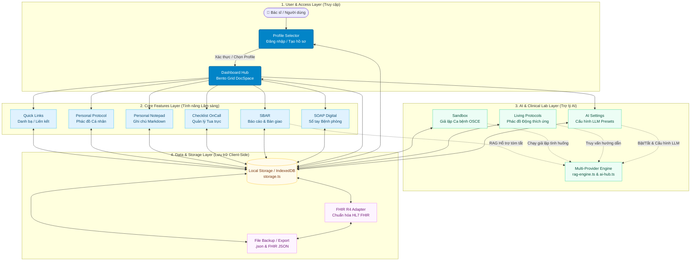

# Sơ đồ Vận hành Hệ sinh thái DocSpace

> **DocSpace Architecture & Operational Blueprint**: Không gian làm việc cá nhân hóa, trợ lý lâm sàng AI và sổ tay bệnh phòng kỹ thuật số dành cho Bác sĩ trên nền tảng **CliniPortal**.
> **Môi trường hoạt động**: Client-Side 100% Offline-First, LocalStorage & IndexedDB, hỗ trợ kết nối Multi-Provider LLM API.

---

## 1. Flowchart Tổng thể (Architecture Flowchart)

---

## 2. Các Lớp Kiến trúc (Architecture Layers)

### 2.1. User & Access Layer
- **Profile Selector (`src/content/docspace/core/storage.ts`, `src/content/docspace/docspace-view.ts`)**: Mọi dữ liệu lâm sàng được phân lập an toàn theo từng Hồ sơ Bác sĩ (`dsp_active_profile`). Người dùng có thể tạo nhiều hồ sơ tương ứng các khoa/bệnh viện khác nhau.
- **Dashboard Hub**: Màn hình Bento Grid hiển thị số lượng hồ sơ SOAP, ca trực OnCall đang chạy, phác đồ thường dùng và thanh điều hướng nhanh.

### 2.2. Core Features Layer (Các tính năng lâm sàng)
Tất cả các tính năng cốt lõi nằm tại `src/content/docspace/features/`:
1. **SOAP Digital (`soap-view.ts`)**: Ghi chép diễn tiến bệnh phòng theo chuẩn y khoa quốc tế:
   - **S (Subjective)**: Bệnh sử, triệu chứng cơ năng.
   - **O (Objective)**: Khám lâm sàng, sinh hiệu, kết quả cận lâm sàng.
   - **A (Assessment)**: Chẩn đoán sơ bộ, phân tầng nguy cơ, chẩn đoán phân biệt.
   - **P (Plan)**: Kế hoạch điều trị thuốc, chỉ định xét nghiệm, dặn dò dinh dưỡng/chăm sóc.
2. **SBAR (`sbar-view.ts`)**: Chuẩn hóa thông tin bàn giao ca trực và hội chẩn (Situation - Background - Assessment - Recommendation), giảm thiểu sai sót y khoa.
3. **OnCall Checklist (`oncall-view.ts`)**: Bảng kiểm công việc trong tua trực (theo dõi sinh hiệu bệnh nặng, kiểm tra đường huyết mao mạch, giờ tiêm kháng sinh, đọc kết quả xét nghiệm cấp).
4. **Personal Notepad (`notepad-view.ts`)**: Sổ tay ghi chép cá nhân với trình soạn thảo Markdown trực quan.
5. **Personal Protocol (`protocol-view.ts`)**: Nơi bác sĩ tùy biến và lưu trữ phác đồ điều trị theo kinh nghiệm và phân tuyến bệnh viện.
6. **Quick Links (`links-view.ts`)**: Danh mục đường dẫn tra cứu nhanh (Dược thư quốc gia, UpToDate, PubMed, Cổng BYT...).

### 2.3. AI & Clinical Lab Layer (Trợ lý AI Lâm sàng)
Mô-đun `src/content/docspace/ai/` xử lý kết nối linh hoạt:
- **Multi-Provider LLM Engine**: Hỗ trợ 1-Click kết nối các dịch vụ AI miễn phí/chuyên dụng:
  - **Google Gemini API** (Context lớn, xử lý y văn sâu).
  - **Groq API** (Tốc độ phản hồi cực nhanh, $\approx 500\text{ tokens/s}$).
  - **OpenRouter & SambaNova API** (Hỗ trợ đa dạng mô hình Llama 3, DeepSeek, Mistral).
  - **Local LLM** (Ollama, LM Studio) chạy nội bộ không gửi dữ liệu ra ngoài Internet, đảm bảo 100% quyền riêng tư bệnh nhân.
- **Multi-Provider Fallback Engine**: Tự động chuyển đổi provider dự phòng khi gặp sự cố mạng hoặc hết quota (HTTP 429).
- **Living Protocols (`src/content/docspace/data/living-protocol-templates/`)**: Phác đồ điều trị có khả năng tự động đối chiếu thông tin bệnh nhân đầu vào để gợi ý liều dùng tối ưu.
- **Clinical Sandbox**: Môi trường diễn tập ca bệnh mô phỏng hỗ trợ bác sĩ trẻ và sinh viên luyện kỹ năng hỏi bệnh và biện luận.

### 2.4. Data & Storage Layer
Tập trung tại `src/content/docspace/core/storage.ts`:
- **Local Storage / IndexedDB**: Không yêu cầu máy chủ backend. Dữ liệu bảo mật 100% trên thiết bị cá nhân.
- **Auto-Save Engine (`quick-save.ts`)**: Tự động lưu tức thì sau mỗi thao tác nhập liệu của bác sĩ.
- **FHIR R4 Interoperability (`fhir-adapter.ts`)**: Bộ chuyển đổi tương thích tiêu chuẩn y tế quốc tế HL7 FHIR R4 (Practitioner, Encounter, Condition, ClinicalImpression, Bundle), cho phép xuất dữ liệu đồng bộ với hệ thống HIS/EMR của bệnh viện.
- **Export & Import**: Sao lưu toàn diện dưới dạng `.json` hoặc file FHIR Bundle chuẩn hóa.

---

## 3. Quy Trình Vận Hành Tiêu Chuẩn (SOP)

1. **Khởi động**: Truy cập route `#/docspace`. Hệ thống kiểm tra hồ sơ `dsp_active_profile`.
2. **Xác thực**: Nếu chưa có hồ sơ, hiển thị màn hình **Profile Selector** để tạo hoặc chọn bác sĩ phụ trách.
3. **Điều hướng**: Màn hình Bento Hub tải dữ liệu tổng quan, mở thanh công cụ bên trái.
4. **Tác nghiệp lâm sàng**: Bác sĩ tạo hồ sơ SOAP hoặc SBAR. Khi nhập liệu, `quick-save` lưu dữ liệu thời gian thực.
5. **Sao lưu định kỳ**: Bác sĩ bấm nút **Export Backup** để tải tệp mã hóa JSON về máy tính cá nhân.
