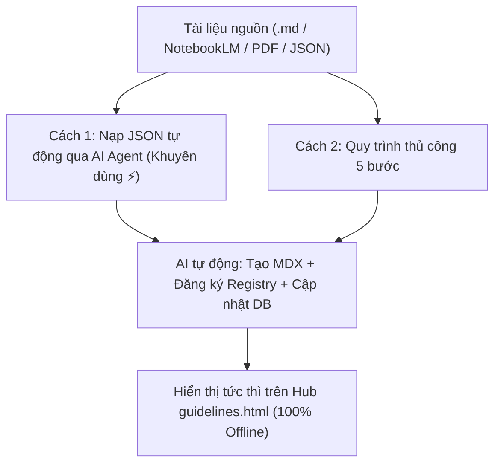

# 📚 HƯỚNG DẪN NẠP GUIDELINES & NGHIÊN CỨU LÂM SÀNG (CHẾ ĐỘ KHO LƯU TRỮ NỘI BỘ)

> **Tài liệu chuẩn hóa quy trình nạp, lưu trữ và quản lý tài liệu Hướng dẫn điều trị (Clinical Guidelines) & Nghiên cứu Y học chứng cứ (EBM Studies) theo mô hình Kho Lưu Trữ Cục Bộ (Local Project Registry) của CliniPortal 2.0.**
> **Không phụ thuộc vào Supabase Cloud — 100% Offline-First — Toàn vẹn dữ liệu nội bộ dự án.**

---

## 🏛️ 1. TỔNG QUAN KIẾN TRÚC KHO LƯU TRỮ MỚI

Trước đây, hệ thống hỗ trợ kết nối đám mây Supabase. Từ phiên bản CliniPortal 2.0, hệ thống đã được **chuyển đổi hoàn toàn sang kiến trúc Kho Lưu Trữ Tĩnh Cục Bộ (Local Static Registry)**:

```
src/content/ebm/guidelines/
├── kho-guidelines/                      # 📁 105+ bài tóm tắt nội dung chi tiết dạng Astro MDX Native
│   ├── images/                          # Thư mục ảnh minh họa, figure, flowchart đã trích xuất
│   │   ├── <slug>-fig1.png
│   │   └── <slug>-fig2.png
│   └── <slug>.mdx                       # Bài viết chuyên sâu (<year>-<org>-<topic>.mdx)
│
├── js/
│   ├── kho-guidelines-registry.ts       # 🏛️ KHO METADATA TĨNH TRUNG TÂM (KHO_GUIDELINES_STATIC: Study[])
│   ├── guidelinesdata.ts                # ⚙️ Master Metadata (SAMPLE_STUDIES = KHO_GUIDELINES_STATIC, Chuyên khoa, ICD-10)
│   ├── guideline-sync.ts                # 🔄 Engine nạp dữ liệu, chống trùng lặp & lưu trữ LocalStorage
│   ├── guideline-table.ts               # 📋 Render bảng tra cứu, thẻ compact & bộ lọc
│   └── guidelines.ts                    # 🚀 Controller khởi động trang Hub
│
├── guidelines.html                      # 🖥️ Giao diện trang Hub tra cứu độc lập (HTML Shell)
├── guidelines-view.ts                   # 🌐 Giao diện SPA View (Hash Router CliniPortal: #/ebm/guidelines)
└── guidelines-db.json                   # 📦 Bản sao lưu CSDL chuẩn JSON (Dùng xuất / nhập dữ liệu dự phòng)
```

### 🎯 Luồng Dữ Liệu Tự Động (Data Flow)

1. **Khởi chạy**: `guideline-sync.ts` thực thi hàm `loadStudies()`.
2. **Nạp nguồn tĩnh**: Đọc toàn bộ danh sách tài liệu chuẩn từ `kho-guidelines-registry.ts` (`KHO_GUIDELINES_STATIC`) thông qua `guidelinesdata.ts` (`SAMPLE_STUDIES`).
3. **Hợp nhất tùy biến**: Đọc thêm các bản ghi tùy biến người dùng tạo cục bộ trong `localStorage` (`cliniportal_custom_studies`).
4. **Khử trùng lặp & Loại trừ**: Tự động loại bỏ các bản ghi trùng lặp và các bài mà người dùng đã bấm xóa trên máy (`cliniportal_deleted_study_ids`).
5. **Hiển thị**: Lưu vào `window.studies` và cung cấp tức thời cho Bảng tra cứu, Bento Grid, CDSS và Multi-Compare Matrix.

---

## ⚡ 2. QUY TRÌNH 5 BƯỚC NẠP GUIDELINE / NGHIÊN CỨU MỚI

Khi bạn có một tài liệu hướng dẫn lâm sàng mới (từ NotebookLM, Bộ Y tế, ESC, AHA, KDIGO, PubMed, tệp Markdown tóm tắt...):



> [!TIP]
> **⚡ QUY TRÌNH 2 GIAI ĐOẠN HOÀN HẢO TỪ NOTEBOOKLM (KHUYÊN DÙNG NHẤT):**
> Để đạt chất lượng bài học xuất bản y khoa cao nhất (Editorial-grade) mà không tốn công sức, Bác sĩ có thể áp dụng quy trình 2 giai đoạn:
>
> * **GIAI ĐOẠN 1 — Tạo khung siêu tốc qua JSON**:
>   1. NotebookLM xuất file/đoạn mã JSON metadata tổng quan.
>   2. Gửi JSON cho AI $\rightarrow$ AI tạo ngay khung bài MDX, đăng ký vào `kho-guidelines-registry.ts` và CSDL. Bài viết xuất hiện tức thì trên Hub.
>
> * **GIAI ĐOẠN 2 — Nâng cấp chất lượng chuyên sâu từ bài soạn chi tiết (.md + hình ảnh)**:
>   1. Gửi các file tóm tắt chi tiết do Bác sĩ hoặc NotebookLM soạn thảo (`P1.md`, `P2.md`...) kèm hình ảnh đính kèm (sơ đồ, infographic, bảng dữ liệu).
>   2. AI Agent sẽ tự động:
>      * Sao chép và tối ưu hóa hình ảnh vào thư mục `kho-guidelines/images/<slug>-<name>.png`.
>      * Tích hợp sâu các cơ chế sinh học, FAQ lâm sàng, bảng tương tác dược động học và sơ đồ chuyển hóa.
>      * Chuẩn hóa hệ thống trích dẫn y văn chuẩn AMA.
>      * Nâng cấp file `.mdx` đạt chất lượng bài giảng/tài liệu tham khảo chuyên gia cao cấp nhất!

---

### BƯỚC 1: Xác Định Slug & Chuyên Khoa

- **Quy chuẩn đặt tên Slug & ID**: Dùng 100% chữ thường, ASCII, gạch nối kebab-case:
  $$\text{Slug} = \text{<năm>}-\text{<tổ-chức/tạp-chí>}-\text{<bệnh-hoặc-chủ-đề>}$$
  * *Ví dụ*: `2026-apasl-viem-gan-b`, `2024-byt-vgsvc`, `2025-aha-acc-hypertension`
* **Mã chuyên khoa chuẩn (`specialty`)**:
  * `cardio`: Tim mạch
  * `pulmo`: Hô hấp
  * `gi`: Tiêu hóa - Gan mật
  * `endo`: Nội tiết - ĐTĐ
  * `neuro`: Thần kinh
  * `infect`: Truyền nhiễm
  * `renal`: Thận học
  * `rheum`: Cơ xương khớp
  * `hema`: Huyết học
  * `onco`: Ung thư
  * `pedia`: Nhi khoa
  * `obgyn`: Sản phụ khoa
  * `icu`: Hồi sức tích cực
  * `derma`: Da liễu
  * `ent`: Tai Mũi Họng
  * `nutri`: Dinh dưỡng lâm sàng

---

### BƯỚC 2: Soạn Thảo File Tóm Tắt MDX Native

Tạo tệp tại: `src/content/ebm/guidelines/kho-guidelines/<slug>.mdx`

Cấu trúc chuẩn theo **Skill `guideline-summary-module`**:

```mdx
---
title: "Khuyến cáo APASL 2026: Tối ưu hóa điều trị Viêm gan B mạn"
slug: "2026-apasl-viem-gan-b"
code: "GDL-2026-APASL-HBV"
organization: "APASL (Hội Gan mật Châu Á - Thái Bình Dương)"
year: "2026"
category: "guidelines"
status: "published"
version: "3.0.0"
updatedAt: "2026-09-16"
cor: "I"
loe: "A"
specialty: "gi"
conditionKey: "hepatitis-b"
icd10: ["B18.1", "B18.0"]
sourceUrl: "https://doi.org/10.1007/s12072-026-xxxxx"
---

<div class="guideline-article">
  <!-- STATS STRIP -->
  <div class="stats-strip">
    <div class="stat-card">
      <div class="stat-num">Class I</div>
      <div class="stat-desc">Mức khuyến cáo mạnh nhất</div>
    </div>
    <div class="stat-card">
      <div class="stat-num">Level A</div>
      <div class="stat-desc">Chứng cứ từ nhiều RCT</div>
    </div>
  </div>

  <!-- NỘI DUNG CHÍNH (Pillars, Phác đồ, Bảng liều, Cảnh báo...) -->
  <section class="sec-card" id="sec-1">
    <div class="sec-hdr">
      <h2>1. Chỉ Định Điều Trị Cốt Lõi</h2>
    </div>
    <div class="sec-body">
      <p>Nội dung chi tiết...</p>
    </div>
  </section>
</div>
```

> [!TIP]
> **Xử lý hình ảnh**: Nếu file nguồn có hình ảnh figure/lưu đồ, hãy lưu vào `src/content/ebm/guidelines/kho-guidelines/images/<slug>-fig1.png` và nhúng bằng thẻ `<div class="fig-card">-fig1.png" /></div>`.

---

### BƯỚC 3: Đăng Ký Metadata Vào Kho Lưu Trữ Cục Bộ

Mở file `src/content/ebm/guidelines/js/kho-guidelines-registry.ts` và thêm bản ghi mới vào mảng `KHO_GUIDELINES_STATIC`:

```typescript
export const KHO_GUIDELINES_STATIC: Study[] = [
  // ... các nghiên cứu hiện tại ...
  {
    id: '2026-apasl-viem-gan-b',
    title: 'Khuyến Cáo APASL 2026: Tối Ưu Hóa Điều Trị Viêm Gan B Mạn Tính & Mục Tiêu Thanh Lọc HBsAg',
    titleEn: 'APASL 2026 Clinical Practice Guidelines on the Management of Chronic Hepatitis B',
    sourceType: 'intl-guideline', // 'intl-study' | 'intl-guideline' | 'vn-moh' | 'vn-association'
    specialty: 'gi',
    specialty2: 'infect',          // Tùy chọn nếu liên quan 2 chuyên khoa
    design: 'guideline',           // 'guideline' | 'rct' | 'meta' | 'cohort' | 'review'
    impact: 'practice-changing',   // 'practice-changing' | 'informative' | 'early-signal'
    year: 2026,
    organization: 'APASL',
    journal: 'Hepatol Int',
    file: '2026-apasl-viem-gan-b.mdx',
    conditionKey: 'hepatitis-b',
    icd10: ['B18.1', 'B18.0'],
    drug: 'Tenofovir alafenamide (TAF), Entecavir, Peg-IFN alfa-2a',
    intervention: 'TAF 25mg/ngày hoặc ETV 0.5mg/ngày',
    primaryEndpoint: 'Ức chế HBV DNA âm tính, ALT bình thường hóa, mất HBsAg',
    keyResults: 'Tỷ lệ ức chế virus đạt 94.2% sau 48 tuần; mất HBsAg 3.5% khi phối hợp Peg-IFN',
    summary: 'Ưu tiên hàng đầu dùng thuốc NUC có hàng rào kháng thuốc cao (TAF/ETV). Mở rộng chỉ định điều trị cho nhóm F2 trở lên bất kể ALT.',
    detailedConclusion: 'Chi tiết kết luận lâm sàng...',
    impactFactor: 6.8,
    quartile: 'Q1',
    sjr: 1.85,
    hIndex: 82,
    asianData: true,               // Đặt true nếu nghiên cứu trên dân số Châu Á
    bookmarked: false
  },
];
```

---

### BƯỚC 4: Kiểm Tra Chống Trùng Lặp & Cú Pháp

1. **Kiểm tra cú pháp HTML/JSX thẻ**:

   ```bash
   node tools/scratch/check_tags.js src/content/ebm/guidelines/kho-guidelines/<slug>.mdx
   ```

2. **Kiểm tra trùng lặp tự động**:
   * Đảm bảo `id` và `file` không trùng với bất kỳ bản ghi nào khác trong `kho-guidelines-registry.ts`.
   * Hệ thống có sẵn hàm kiểm tra tương đồng tiêu đề và năm công bố để ngăn ngừa trùng bài.

---

### BƯỚC 5: Kiểm Tra Trực Quan Trên Web Hub

Mở trình duyệt truy cập:
* `src/content/ebm/guidelines/guidelines.html`
* Hoặc SPA router `#/ebm/guidelines`

**Dấu hiệu thành công**:
* Huy hiệu góc trên hiển thị: `Kho lưu trữ: Local` (chấm xanh lá).
* Bài viết mới xuất hiện ngay trên đầu danh sách bảng, có đầy đủ icon chuyên khoa, IF tạp chí, nút đọc tóm tắt và nút so sánh.
* Bấm vào tên bài hoặc nút "Đọc tóm tắt" mở chính xác nội dung trong `kho-guidelines/<slug>.mdx`.

---

## 📥 3. PHƯƠNG THỨC NẠP NHANH HÀNG LOẠT (SMART JSON IMPORT)

Ngoài việc chỉnh sửa mã nguồn trực tiếp, CliniPortal hỗ trợ công cụ nạp nhanh giao diện:

1. Mở `guidelines.html` hoặc màn hình Guidelines trên CliniPortal.
2. Bấm vào nút **📥 Nhập dữ liệu JSON** trên thanh công cụ bên trái.
3. Dán chuỗi JSON hoặc kéo thả file `.json`.

### Cấu Trúc Mảng JSON Hỗ Trợ

```json
[
  {
    "id": "2026-nejm-trial-xyz",
    "title": "NEJM 2026: Hiệu quả của Thuốc X trên Bệnh Y",
    "sourceType": "intl-study",
    "specialty": "cardio",
    "design": "rct",
    "impact": "practice-changing",
    "year": 2026,
    "organization": "NEJM",
    "journal": "N Engl J Med",
    "drug": "Thuốc X 10mg",
    "keyResults": "HR 0.72 (95% CI 0.61-0.85; p<0.001)",
    "summary": "Giảm 28% biến cố gộp tim mạch chính.",
    "sampleSize": 8500,
    "icd10": ["I50", "I50.9"]
  }
]
```

> [!NOTE]
> Bộ nạp Smart JSON tự động làm sạch ký tự markdown thừa (` ```json `), tự sửa lỗi dấu ngoặc và tự động chạy thuật toán đối soát trùng lặp (`batchCheckDuplicates`) để hỏi người dùng trước khi ghi đè.
> Dữ liệu nạp qua modal sẽ được lưu ngay vào `localStorage` của trình duyệt.

---

## 💾 4. SAO LƯU & XUẤT DỮ LIỆU DỰ PHÒNG

* **File CSDL dự phòng tĩnh**: File `src/content/ebm/guidelines/guidelines-db.json` đóng vai trò là snapshot sao lưu dữ liệu nghiên cứu dạng JSON thuần.
* **Xuất dữ liệu tùy biến của bạn**:
  Khi chạy trên trình duyệt, mở Console (F12) và chạy lệnh:

  ```javascript
  console.log(JSON.stringify(window.studies, null, 2));
  ```

  Bạn có thể copy toàn bộ dữ liệu này để lưu trữ hoặc chia sẻ cho các máy trạm khác.

---

## ❓ 5. BẢNG TRA CỨU GIÁ TRỊ TRƯỜNG CHUẨN (SCHEMA DICTIONARY)

| Trường (Field) | Kiểu dữ liệu | Bắt buộc | Giá trị hợp lệ / Ví dụ |
| --- | --- | :---: | --- |
| `id` | `string` | ✅ | Kebab-case duy nhất: `2026-esc-heart-failure` |
| `title` | `string` | ✅ | Tiêu đề tiếng Việt chuẩn y khoa |
| `titleEn` | `string` | ❌ | Tiêu đề tiếng Anh nguyên bản |
| `sourceType` | `string` | ✅ | `'intl-study'` \| `'intl-guideline'` \| `'vn-moh'` \| `'vn-association'` |
| `specialty` | `string` | ✅ | `cardio`, `pulmo`, `gi`, `endo`, `neuro`, `infect`, `renal`, `icu`... |
| `specialty2` | `string` | ❌ | Chuyên khoa phụ liên quan |
| `design` | `string` | ✅ | `'rct'` \| `'meta'` \| `'cohort'` \| `'guideline'` \| `'review'` |
| `impact` | `string` | ✅ | `'practice-changing'` \| `'informative'` \| `'early-signal'` |
| `year` | `number` | ✅ | Số nguyên: `2026`, `2025`, `2024` |
| `organization` | `string` | ✅ | Tên tổ chức/hội: `'BYT'`, `'VNHA'`, `'ESC'`, `'AHA'`, `'NEJM'` |
| `file` | `string` | ❌ | Tên file bài viết: `'2026-apasl-viem-gan-b.mdx'` |
| `conditionKey` | `string` | ❌ | Khóa nhóm bệnh: `'heart-failure'`, `'hepatitis-b'`, `'copd'` |
| `icd10` | `string[]` | ❌ | Mảng mã ICD-10: `['I50', 'I50.9']` |
| `drug` | `string` | ❌ | Danh sách hoạt chất/thuốc can thiệp |
| `keyResults` | `string` | ❌ | Chuỗi kết quả (Tự động nhận diện vẽ biểu đồ SVG Forest/Column) |
| `impactFactor` | `number` | ❌ | Chỉ số IF của tạp chí: `158.5`, `6.8` |
| `quartile` | `string` | ❌ | Phân hạng Scimago: `'Q1'`, `'Q2'`, `'Q3'`, `'Q4'`, `'MOH'` |
| `asianData` | `boolean` | ❌ | `true` nếu có dữ liệu phân nhóm người Châu Á |

---

*Tài liệu được cập nhật tự động theo chuẩn CliniPortal 2.0 — Kho lưu trữ EBM cục bộ.*
