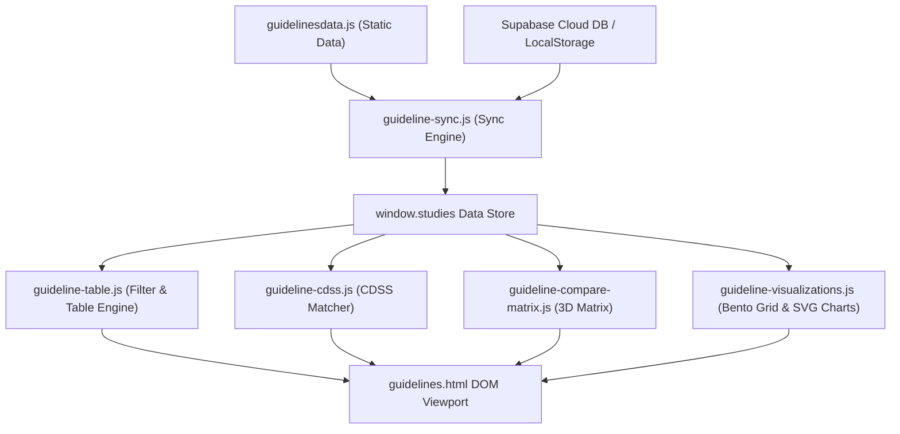

# 🗺️ PROJECT MAP — Kho Guidelines & Nghiên Cứu Lâm Sàng CliniPortal

> **Tài liệu Bản đồ Kiến trúc (Architecture Map)** dành cho Kỹ thuật viên và AI Agent khi làm việc, bảo trì, hoặc phát triển mở rộng phân hệ Kho Guidelines Y học chứng cứ.

---

## 🏛️ 1. Tổng Quan Kiến Trúc Dự Án

Kho Guidelines CliniPortal được phát triển theo tiêu chuẩn **Pure HTML5 + Vanilla CSS3 + ES6+ JavaScript (KHÔNG framework ngoài)**, bảo đảm khả năng chạy mượt mà trên thiết bị y tế bệnh viện offline hoặc local server.

```text
src/content/ebm/guidelines/
├── guidelines.html                          # Main Viewport & UI Layout Shell
├── guidelines.css                           # Master CSS Entry Point (@import architecture)
├── guidelines.js                            # Main Application Controller (< 220 dòng)
├── guidelinesdata.js                        # Data Registry (60+ EBM Guidelines & RCTs)
│
├── css/                                     # Phân hệ Mô-đun CSS nhỏ
│   ├── guidelines-base.css                  # Design Tokens, Reset, Topnav, Sidebar & App Shell
│   ├── guidelines-components.css            # Filter Pills, Search Bar, Command Palette & Badges
│   ├── guidelines-table.css                 # Data Tables, Compact Cards, Timeline & Forest Plot SVGs
│   └── guidelines-modals.css                # Overlays, Case CDSS Modal, Multi-Compare & Floating Bar
│
├── js/                                      # Phân hệ Mô-đun JS chuyên biệt
│   ├── guideline-sync.js                    # LocalStorage & Supabase Realtime Sync Engine
│   ├── guideline-table.js                   # Render Bảng, Thẻ Compact & Filter Pills Engine
│   ├── guideline-modals.js                  # Modals Thêm/Sửa & ICD-10 Registry Management
│   ├── guideline-visualizations.js          # Bento Grid, Evidence Map SVG & Treemap Renderer
│   ├── guideline-evidence-analytics.js      # Evidence Analytics & NNT Calculator Engine
│   ├── guideline-cmd-palette.js             # Command Palette (Ctrl+K) Snippet Search
│   ├── guideline-cdss.js                    # CDSS Dosing Matcher & EBM Note Clipboard Export
│   ├── guideline-compare-matrix.js          # Multi-Guideline 3D Compare Matrix & Floating Bar
│   ├── guideline-tools.js                   # Unified Bridge Export Hub
│   └── drug-linker.js                       # Auto-Linking Thuốc vào Kho Dược lý
│
└── kho-guidelines/                          # Thư mục lưu 50+ bài viết tóm tắt HTML chi tiết
```

---

## 📊 2. Ma Trận Phân Vai Chức Năng (Responsibility Matrix)

| Mô-đun / Tập tin | Loại | Vai trò & Trách nhiệm chính | Export APIs |
|---|---|---|---|
| `guidelines.html` | HTML | Khung giao diện chính (App Shell, Bento Grid, Tables, Modals) | HTML Elements IDs |
| `guidelines.css` | CSS | Master Style Entry Point nạp 4 mô-đun CSS bằng `@import` | Style rules |
| `guidelines.js` | JS | Entry Controller điều phối `DOMContentLoaded` & Resize listener | `window.toggleSidebar`, `window.calculateNNT` |
| `guidelinesdata.js` | JS | Kho dữ liệu chuẩn quốc tế & Bộ Y Tế Việt Nam | `window.studies`, `window.CLINICAL_CONDITIONS` |
| `js/guideline-sync.js` | JS | Đồng bộ dữ liệu 2 chiều với LocalStorage & Supabase DB | `window.initSupabase`, `window.dbSaveStudy`, `window.loadStudies` |
| `js/guideline-table.js` | JS | Lọc và Render Bảng bài báo, Thẻ Compact, Tabs Switcher | `window.renderTable`, `window.setFilter`, `window.switchTab` |
| `js/guideline-modals.js` | JS | Xử lý Modal Thêm/Sửa, Nhập JSON & Cấu hình ICD-10 Registry | `window.openAddModal`, `window.openConditionSettingsModal` |
| `js/guideline-visualizations.js` | JS | Vẽ Bento Grid, Đồng hồ Gauge SVG & Bubble Evidence Map | `window.renderVisualizations` |
| `js/guideline-evidence-analytics.js` | JS | Tính toán Thống kê bằng cấp EBM & Công cụ NNT | `window.renderAnalytics` |
| `js/guideline-cmd-palette.js` | JS | Khởi tạo Command Palette (Ctrl+K) tra cứu nhanh Snippet | `window.openCommandPalette`, `window.handleCmdInput` |
| `js/guideline-cdss.js` | JS | CDSS Dosing Matcher phân tích case & Export EBM Note Clipboard | `window.openCaseModal`, `window.handleCaseAnalysis`, `window.copyEbmClinicalNote` |
| `js/guideline-compare-matrix.js` | JS | Ma trận đối sánh 3D Multi-Compare Matrix & Floating Bar | `window.addToCompare`, `window.openMultiCompareModal`, `window.renderMultiCompareTable` |
| `js/guideline-tools.js` | JS | Unified Namespace Export Bridge cho hệ thống công cụ | `window.GuidelineTools` |

---

## 🔄 3. Luồng Chuyển Động Dữ Liệu (Data & Execution Flow)



---

## 📝 4. Hướng Dẫn Dành Cho Kỹ Thuật Viên & AI Agent

1. **Khi muốn sửa Giao diện CSS**:
   - Thay vì sửa `guidelines.css`, hãy mở đúng mô-đun trong `css/` (Ví dụ: sửa Bảng mở `guidelines-table.css`, sửa Modal mở `guidelines-modals.css`).
2. **Khi muốn thêm Tính năng JS mới**:
   - Tạo file JS mới trong thư mục `js/` theo tên `guideline-[tên_chức_năng].js`.
   - Đăng ký file mới vào `guidelines.html` ngay trước `guidelines.js`.
   - Gắn các hàm gọi từ HTML inline (`onclick="..."`) vào đối tượng `window.*`.
3. **Khi thêm Bài tóm tắt Hướng dẫn mới**:
   - Thêm bản ghi mới vào file `guidelinesdata.js`.
   - Đặt bài viết tóm tắt HTML vào thư mục `kho-guidelines/` theo chuẩn cấp thư mục level 4 (`../../../../`).
