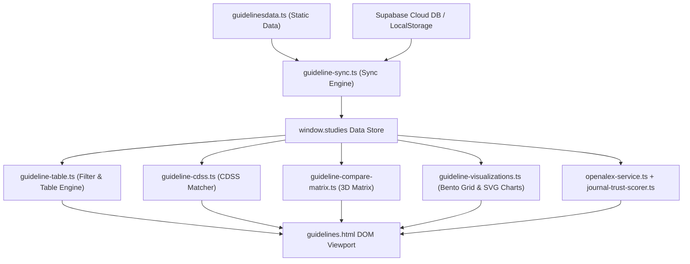

# 🗺️ PROJECT MAP — Kho Guidelines & Nghiên Cứu Lâm Sàng CliniPortal

> **Tài liệu Bản đồ Kiến trúc (Architecture Map)**: Dành cho Kỹ thuật viên và AI Agent khi làm việc, bảo trì hoặc mở rộng phân hệ Kho Guidelines Y học chứng cứ.

---

## 🏛️ 1. Tổng Quan Kiến Trúc Dự Án

Kho Guidelines CliniPortal được phát triển theo tiêu chuẩn **Pure HTML5 + Vanilla CSS3 + Modular TypeScript (KHÔNG framework ngoài)**, bảo đảm khả năng chạy mượt mà trên thiết bị y tế bệnh viện offline hoặc local server.

```text
src/content/ebm/guidelines/
├── guidelines.html                          # Main Viewport & UI Layout Shell
├── guidelines.css                           # Master CSS Entry Point (@import architecture)
├── guidelines.ts                            # Main Application Controller (TypeScript)
├── guidelinesdata.ts                        # Data Registry & Types (60+ EBM Guidelines & RCTs)
├── guidelines-types.ts                      # Core Type Definitions & Unified Global Window Interface
├── guidelines-view.ts                       # SPA View Native Integration cho CliniPortal Core
│
├── css/                                     # Phân hệ Mô-đun CSS nhỏ
│   ├── guidelines-base.css                  # Design Tokens, Reset, Topnav, Sidebar & App Shell
│   ├── guidelines-components.css            # Filter Pills, Search Bar, Command Palette & Badges
│   ├── guidelines-table.css                 # Data Tables, Compact Cards, Timeline & Forest Plot SVGs
│   └── guidelines-modals.css                # Overlays, Case CDSS Modal, Multi-Compare & Floating Bar
│
├── js/                                      # Phân hệ Mô-đun TypeScript chuyên biệt
│   ├── guideline-sync.ts                    # LocalStorage & Supabase Realtime Sync Engine (2 chiều)
│   ├── guideline-table.ts                   # Render Bảng, Thẻ Compact & Filter Pills Engine
│   ├── guideline-modals.ts                  # Modals Thêm/Sửa & ICD-10 Registry Management
│   ├── guideline-visualizations.ts          # Bento Grid, Evidence Map SVG & Treemap Renderer
│   ├── guideline-evidence-analytics.ts      # Evidence Analytics & NNT Calculator Engine
│   ├── guideline-cmd-palette.ts             # Command Palette (Ctrl+K) Snippet Search
│   ├── guideline-cdss.ts                    # CDSS Dosing Matcher & EBM Note Clipboard Export
│   ├── guideline-compare-matrix.ts          # Multi-Guideline 3D Compare Matrix & Floating Bar
│   ├── guideline-tools.ts                   # Unified Bridge Export Hub
│   ├── guideline-charts-engine.ts           # SVG Forest Plot, Column, H-Bar, Donut chart generators
│   ├── guideline-journal-badge.ts           # Journal quality badge injection
│   ├── openalex-service.ts                  # OpenAlex API live journal lookup
│   ├── journal-trust-scorer.ts              # Weighted Trust Score calculation (0-100)
│   ├── journal-quality-analyzer.ts          # Journal comparison & quality analyzer controller
│   └── drug-linker.ts                       # Auto-Linking Thuốc vào Kho Dược lý
│
├── data/
│   └── predatory-blacklist.ts               # Beall's list & predatory journal risk audit engine
│
└── kho-guidelines/                          # Thư mục lưu 50+ bài viết tóm tắt HTML chi tiết
```

---

## 📊 2. Ma Trận Phân Vai Chức Năng (Responsibility Matrix)

| Mô-đun / Tập tin | Loại | Vai trò & Trách nhiệm chính | Export APIs |
|---|---|---|---|
| `guidelines.html` | HTML | Khung giao diện chính (App Shell, Bento Grid, Tables, Modals) | HTML Elements IDs |
| `guidelines.css` | CSS | Master Style Entry Point nạp các mô-đun CSS | Style rules |
| `guidelines.ts` | TS | Entry Controller điều phối `DOMContentLoaded` & Resize listener | `window.toggleSidebar`, `window.calculateNNT` |
| `guidelinesdata.ts` | TS | Kho dữ liệu chuẩn quốc tế & Bộ Y Tế Việt Nam | `window.studies`, `window.CLINICAL_CONDITIONS` |
| `guidelines-types.ts` | TS | Hệ thống Interface & Type Definitions trung tâm | `Study`, `FilterState`, `SupabaseConfig` |
| `guidelines-view.ts` | TS | SPA View Component tích hợp vào Router của CliniPortal | `GuidelinesView` |
| `js/guideline-sync.ts` | TS | Đồng bộ dữ liệu 2 chiều với LocalStorage & Supabase DB | `window.initSupabase`, `window.dbSaveStudy`, `window.loadStudies` |
| `js/guideline-table.ts` | TS | Lọc và Render Bảng bài báo, Thẻ Compact, Tabs Switcher | `window.renderTable`, `window.setFilter`, `window.switchTab` |
| `js/guideline-modals.ts` | TS | Xử lý Modal Thêm/Sửa, Nhập JSON & Cấu hình ICD-10 Registry | `window.openAddModal`, `window.openConditionSettingsModal` |
| `js/guideline-visualizations.ts` | TS | Vẽ Bento Grid, Đồng hồ Gauge SVG & Bubble Evidence Map | `window.renderVisualizations` |
| `js/guideline-evidence-analytics.ts` | TS | Tính toán Thống kê bằng cấp EBM & Công cụ NNT | `window.renderAnalytics` |
| `js/guideline-cmd-palette.ts` | TS | Khởi tạo Command Palette (Ctrl+K) tra cứu nhanh Snippet | `window.openCommandPalette`, `window.handleCmdInput` |
| `js/guideline-cdss.ts` | TS | CDSS Dosing Matcher phân tích case & Export EBM Note Clipboard | `window.openCaseModal`, `window.handleCaseAnalysis`, `window.copyEbmClinicalNote` |
| `js/guideline-compare-matrix.ts` | TS | Ma trận đối sánh Multi-Compare Matrix & Floating Bar | `window.addToCompare`, `window.openMultiCompareModal`, `window.renderMultiCompareTable` |
| `js/guideline-tools.ts` | TS | Unified Namespace Export Bridge cho hệ thống công cụ | `window.GuidelineTools` |
| `js/openalex-service.ts` | TS | Tra cứu dữ liệu OpenAlex API cho chỉ số tạp chí live | `window.searchOpenAlexJournals` |
| `js/journal-trust-scorer.ts` | TS | Đánh giá Trust Score theo trọng số (0-100) | `window.calculateJournalTrustScore` |
| `js/journal-quality-analyzer.ts` | TS | Modal so sánh và phân tích chuyên sâu chất lượng tạp chí | `window.openJournalQualityModal` |
| `data/predatory-blacklist.ts` | TS | Danh sách đen Beall's list & kiểm toán rủi ro tạp chí | `window.auditPredatoryRisk` |

---

## 🔄 3. Luồng Chuyển Động Dữ Liệu (Data & Execution Flow)



---

## 📝 4. Hướng Dẫn Dành Cho Kỹ Thuật Viên & AI Agent

1. **Khi muốn sửa Giao diện CSS**:
   - Thay vì sửa `guidelines.css`, hãy mở đúng mô-đun trong `css/` (Ví dụ: sửa Bảng mở `guidelines-table.css`, sửa Modal mở `guidelines-modals.css`).
2. **Khi muốn thêm Tính năng TypeScript mới**:
   - Tạo file `.ts` mới trong thư mục `js/` theo tiền tố `guideline-[tên_chức_năng].ts`.
   - Gắn các hàm gọi từ HTML inline (`onclick="..."`) vào đối tượng `window.*` hoặc export qua `guideline-tools.ts`.
3. **Khi thêm Bài tóm tắt Hướng dẫn mới**:
   - Thêm bản ghi mới vào mảng `SAMPLE_STUDIES` trong `guidelinesdata.ts`.
   - Đặt bài viết tóm tắt HTML vào thư mục `kho-guidelines/` theo chuẩn cấp thư mục level 4 (`../../../../`).
