

  

    

      
4 Nhóm Sinh Bệnh Học

      
Phát triển bẩm sinh, Viêm nhiễm trùng, Tân sản ác tính &amp; Chấn thương can thiệp

    

    

      
16 Hình Ảnh Điển Hình

      
Toàn bộ hình ảnh ca lâm sàng thực tế và sơ đồ thuật toán tiếp cận phân tầng từ AJR

    

    

      
Dấu Hiệu Chấm Trung Tâm

      
Central dot sign đặc trưng khẳng định Bệnh Caroli (thông thương với đường mật)

    

    

      
BCA Hóa Ác 20%

      
Tỷ lệ thoái hóa ác tính thành BCAC; chỉ định phẫu thuật cắt bỏ triệt để bắt buộc

    

  

  

    

      
🩻

      

        
Nhận Diện Hình Thái (Morphology First)

        
Phân tách rõ ràng nang đơn thuần (thành mỏng, dịch trong) với nang phức tạp (thành dày, vách ngăn, nốt sùi ngấm thuốc) trên CT/MRI.

      

    

    

      
🎯

      

        
Dấu Hiệu Hình Ảnh Đặc Trưng (Imaging Pearls)

        
Nắm vững dấu hiệu mục tiêu kép (áp xe), chấm trung tâm (Caroli), nang con ngoại vi (sán chó), mắt bò (nấm) và mô đệm buồng trứng (BCA).

      

    

    

      
⚡

      

        
Lưu Đồ Thuật Toán Phân Tầng Quyết Định

        
Ứng dụng thuật toán Fig. 16 kết hợp số lượng nang, tính chất ngấm thuốc và tiền sử bệnh nhân để đưa ra chẩn đoán xác định nhanh chóng.

      

    

  

  <a href="#sec-dat-van-de-phan-loai" class="quickmenu-item active">1. Tổng Quan &amp; Table 1</a>
  <a href="#sec-ton-thuong-phat-trien" class="quickmenu-item">2. Nang Phát Triển (Fig 1-5)</a>
  <a href="#sec-ton-thuong-viem-nhiem" class="quickmenu-item">3. Nang Viêm Nhiễm (Fig 6-9)</a>
  <a href="#sec-chan-thuong-va-sau-mo" class="quickmenu-item">4. Chấn Thương &amp; Sau Mổ (Fig 14)</a>
  <a href="#sec-luu-do-thuat-toan-fig16" class="quickmenu-item">5. Thuật Toán Fig. 16</a>
  <a href="#sec-ton-thuong-tan-san" class="quickmenu-item">6. Nang Tân Sản (Fig 10-12)</a>
  <a href="#sec-ton-thuong-khac-va-gia-nang" class="quickmenu-item">7. Giả Nang &amp; UES (Fig 13, 15)</a>
  <a href="#sec-cheat-sheet-mcq" class="quickmenu-item">8. Cheat-Sheet &amp; 5 MCQ</a>

  <!-- ==================== SECTION 1 ==================== -->
  

    

      📋
      <h2 class="sec-title">1. Đặt Vấn Đề, Nguyên Tắc Tiếp Cận Hình Ảnh &amp; Bảng Tổng Quan 14 Bệnh Lý (Table 1)</h2>
    

    

      

        💡
        

          <strong>Công Trình Nghiên Cứu Tổng Quan AJR 2014 (Borhani, Wiant &amp; Heller):</strong>
          Tổn thương dạng nang ở gan (cystic hepatic lesions) xuất hiện vô cùng thường xuyên trong thực hành chẩn đoán hình ảnh và cấp cứu ngoại khoa. Phổ chẩn đoán kéo dài từ những dị tật bẩm sinh lành tính hoàn toàn vô hại (nang đơn thuần) cho đến các bệnh lý nhiễm trùng nguy kịch (áp xe gan, nang sán chó) và các khối u tân sản ác tính đe dọa tính mạng (ung thư biểu mô tuyến nang đường mật, ung thư biểu mô tế bào gan dạng nang hoặc di căn).
        

      

      
3 Tiêu Chí Cốt Lõi Để Định Hướng Chẩn Đoán

      

        

          

          

            
1️⃣

            
Số Lượng Tổn Thương

          

          

            Phân định rõ: Tổn thương đơn độc hoặc một vài nang (từ 1 đến 10 nang) so với Vô số tổn thương nang phân bố lan tỏa khắp hai thùy gan (&gt; 10 nang).
          

          
Đơn độc vs Vô số nang

        

        

          

          

            
2️⃣

            
Hình Thái Cấu Trúc Nang

          

          

            Thể nang đơn thuần (Simple: thành mỏng không thấy, dịch trong, không ngấm thuốc) vs Thể nang phức tạp (Complex: thành dày, vách ngăn bên trong, nốt sùi, vôi hóa).
          

          
Đơn thuần vs Phức tạp

        

        

          

          

            
3️⃣

            
Tính Chất Ngấm Thuốc &amp; Lâm Sàng

          

          

            Sự hiện diện của thành phần đặc tăng tưới máu, viền ngấm thuốc kép; đối chiếu với tiền sử ung thư, sốt nhiễm trùng, chấn thương, tiền sử gia đình hoặc vùng dịch tễ.
          

          
Ngấm thuốc &amp; Bệnh sử

        

      

      
Bảng Tổng Quan Đặc Điểm Hình Ảnh &amp; Lâm Sàng (Table 1 AJR)

      

        <table class="regimen-table">
          <thead>
            <tr>
              <th style="width: 25%;">Nhóm Bệnh &amp; Thực Thể</th>
              <th style="width: 45%;">Đặc Điểm Hình Ảnh Mấu Chốt</th>
              <th style="width: 30%;">Dữ Liệu Lâm Sàng Quan Trọng</th>
            </tr>
          </thead>
          <tbody>
            <tr>
              <td class="source-cell"><strong>Nang đơn thuần</strong> (Simple cyst)</td>
              <td>Nang đơn độc/vài nang, thành mỏng không thấy, dịch trong (0-15 HU), không ngấm thuốc sau tiêm.</td>
              <td>Chiếm 2,5% dân số; thường phát hiện tình cờ, không triệu chứng.</td>
            </tr>
            <tr>
              <td class="source-cell"><strong>Hamartoma đường mật</strong> (von Meyenburg complex)</td>
              <td>Vô số nang nhỏ (&lt; 15 mm), hình dạng không đều, rải rác dưới bao gan, không thông với đường mật.</td>
              <td>Tổn thương bẩm sinh lành tính; ổn định qua nhiều năm theo dõi.</td>
            </tr>
            <tr>
              <td class="source-cell"><strong>Bệnh Caroli</strong> (Caroli disease)</td>
              <td>Nhiều nang lớn nhỏ thông thương trực tiếp với đường mật; có <strong>Dấu hiệu chấm trung tâm (Central dot sign)</strong>.</td>
              <td>Biến chứng viêm đường mật tái diễn, sỏi mật, nguy cơ tiến triển thành ung thư đường mật.</td>
            </tr>
            <tr>
              <td class="source-cell"><strong>Bệnh gan đa nang</strong> (Polycystic liver disease)</td>
              <td>Vô số nang kích thước lớn chiếm toàn bộ nhu mô gan; phân bố cả ngoại vi và khoảng cửa.</td>
              <td>Di truyền trội; 50% có kèm theo bệnh thận đa nang (ADPKD).</td>
            </tr>
            <tr>
              <td class="source-cell"><strong>Nang ruột trước có lông chuyển</strong> (Ciliated foregut cyst)</td>
              <td>Vị trí kinh điển ở vùng dưới bao gan hạ phân thùy IV; tỷ trọng cao do giàu protein.</td>
              <td>Dị tật ruột trước hiếm gặp; có nguy cơ biến đổi ác tính thành ung thư tế bào vảy.</td>
            </tr>
            <tr>
              <td class="source-cell"><strong>Áp xe gan do vi khuẩn</strong> (Pyogenic abscess)</td>
              <td>Nang phức hợp có <strong>Dấu hiệu mục tiêu kép (Double-target sign)</strong>: thành ngấm thuốc bao quanh bởi viền phù nề.</td>
              <td>Sốt, rét run, tăng bạch cầu; tác nhân hay gặp là *K. pneumoniae*, *E. coli*.</td>
            </tr>
            <tr>
              <td class="source-cell"><strong>Áp xe gan do amip</strong> (Amebic abscess)</td>
              <td>Nang dịch đơn độc lớn ở thùy phải, thành dày 3-15 mm, có dấu hiệu mục tiêu kép.</td>
              <td>Đến từ vùng dịch tễ; nam giới ưu thế gấp 7-10 lần; huyết thanh amip (+).</td>
            </tr>
            <tr>
              <td class="source-cell"><strong>Nang sán chó</strong> (Hydatid cyst)</td>
              <td>Nang mẹ lớn chứa <strong>nhiều nang con ở ngoại vi (Daughter cysts)</strong>; vôi hóa viền thành nang.</td>
              <td>Nhiễm *Echinococcus granulosus*; tiếp xúc cừu/chó; nguy cơ sốc phản vệ khi vỡ.</td>
            </tr>
            <tr>
              <td class="source-cell"><strong>Vi áp xe do nấm</strong> (Fungal microabscesses)</td>
              <td>Vô số nang nhỏ (&lt; 2 cm) khắp gan và lách; dấu hiệu <strong>Mắt bò (Bull's eye)</strong>.</td>
              <td>Bệnh nhân suy giảm miễn dịch nặng, AIDS hoặc sốt giảm bạch cầu trung tính.</td>
            </tr>
            <tr>
              <td class="source-cell"><strong>Nang giả tụy trong gan</strong> (Intrahepatic pseudocyst)</td>
              <td>Ổ tụ dịch thành mỏng ngấm thuốc nhẹ, thường ở thùy phải gan.</td>
              <td>Tiền sử hoặc đang có đợt viêm tụy cấp; amylase/lipase máu tăng cao.</td>
            </tr>
            <tr>
              <td class="source-cell"><strong>U tuyến nang đường mật</strong> (BCA / BCAC)</td>
              <td>Nang lớn đa thùy có vách ngăn mỏng; BCAC có nốt đặc sùi ngấm thuốc mạnh và giãn đường mật.</td>
              <td>90% gặp ở nữ giới trung niên; chứa mô đệm buồng trứng; BCA hóa ác 20%.</td>
            </tr>
            <tr>
              <td class="source-cell"><strong>Ung thư tế bào gan dạng nang</strong> (Cystic HCC)</td>
              <td>Khối nang giả lớn hoại tử trung tâm trên nền gan xơ; có thành phần đặc ngấm thuốc động mạch/thải thuốc.</td>
              <td>Nền xơ gan, viêm gan B/C, tăng alpha-fetoprotein (AFP); dễ nhầm với áp xe.</td>
            </tr>
            <tr>
              <td class="source-cell"><strong>Nang di căn gan</strong> (Cystic metastases)</td>
              <td>Nhiều ổ nang phức hợp thành dày mấp mô; hoại tử dạng nang hoặc bản chất nhầy.</td>
              <td>Tiền sử ung thư nguyên phát ngoài gan: u nội tiết (NET), GIST, ung thư đại trực tràng nhầy.</td>
            </tr>
            <tr>
              <td class="source-cell"><strong>Nang quanh đường mật</strong> (Peribiliary cysts)</td>
              <td>Nhiều nang nhỏ (&lt; 10 mm) dạng chuỗi phân bố đối xứng hai bên nhánh tĩnh mạch cửa ở rốn gan.</td>
              <td>Gặp ở bệnh nhân xơ gan nặng, tăng áp lực tĩnh mạch cửa hoặc ADPKD.</td>
            </tr>
          </tbody>
        </table>
      

    

  

  <!-- ==================== SECTION 2 ==================== -->
  

    

      🧬
      <h2 class="sec-title">2. Nhóm Tổn Thương Phát Triển: Nang Đơn Thuần, Hamartoma, Caroli, PLD &amp; Nang Ruột Trước (Fig 1-5)</h2>
    

    

      <!-- FIG 1 & FIG 2 -->
      

        

          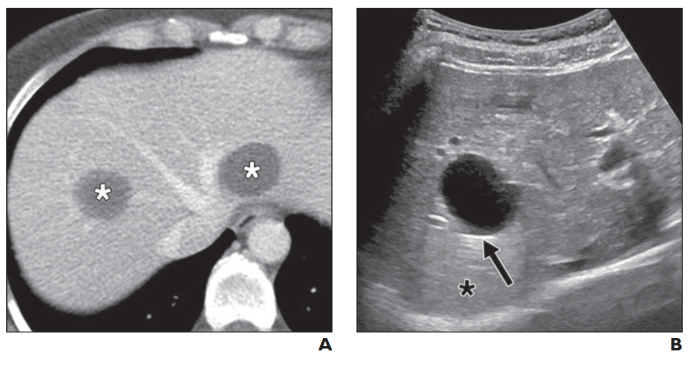
          

            
Figure 1. Nang Gan Đơn Thuần (Simple Hepatic Cyst)

            (A) CT cản quang: Tổn thương nang đơn thuần giảm tỷ trọng dịch nước ở gan trái (dấu sao); (B) Siêu âm: Trống âm, bờ rõ, tăng âm thành sau sắc nét (mũi tên).
          

        

        

          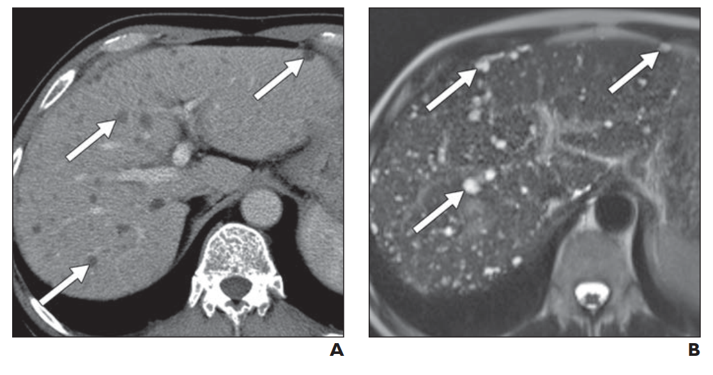
          

            
Figure 2. Hamartoma Đường Mật (von Meyenburg Complex)

            (A) CT cản quang &amp; (B) MRI T2W: Vô số tổn thương nang nhỏ không đều (&lt; 15 mm, mũi tên) phân bố rải rác dưới bao gan, không thông thương với cây đường mật.
          

        

      

      <!-- FIG 3 & FIG 4 -->
      

        

          
          

            
Figure 3. Bệnh Caroli (Caroli Disease - Central Dot Sign)

            CT cản quang biểu diễn các nang giãn thông thương với đường mật; mũi tên chỉ rõ <strong>Dấu hiệu chấm trung tâm (Central dot sign)</strong> - nhánh tĩnh mạch cửa ngấm thuốc chạy xuyên tâm nang.
          

        

        

          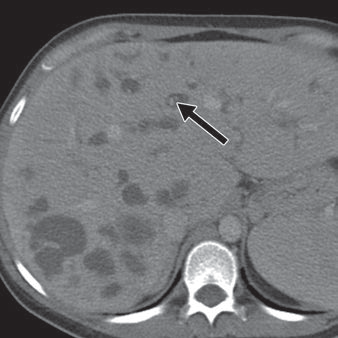
          

            
Figure 4. Bệnh Gan Đa Nang Di Truyền (Polycystic Liver Disease)

            CT cản quang mặt cắt đứng ngang (Coronal): Vô số nang dịch kích thước lớn nhỏ khác nhau phân bố dày đặc ở cả nhu mô gan (mũi tên đen) và hai bên thận (mũi tên trắng, ADPKD).
          

        

      

      <!-- FIG 5 -->
      

        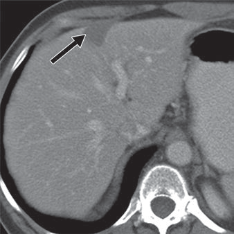
        

          
Figure 5. Nang Nhân Đôi Ruột Trước Có Lông Chuyển (Ciliated Foregut Cyst)

          CT cản quang: Khối hình chêm giảm tỷ trọng nằm sát bao gan ở hạ phân thùy IV (mũi tên). Tỷ trọng trên CT tương đối cao (50 HU) do chứa dịch nhầy giàu protein; có nguy cơ hóa ác thành ung thư biểu mô tế bào vảy.
        

      

    

  

  <!-- ==================== SECTION 3 ==================== -->
  

    

      🦠
      <h2 class="sec-title">3. Nhóm Tổn Thương Viêm &amp; Nhiễm Trùng: Áp Xe Vi Khuẩn, Amip, Nang Sán Chó &amp; Nấm (Fig 6-9)</h2>
    

    

      <!-- FIG 6 & FIG 7 -->
      

        

          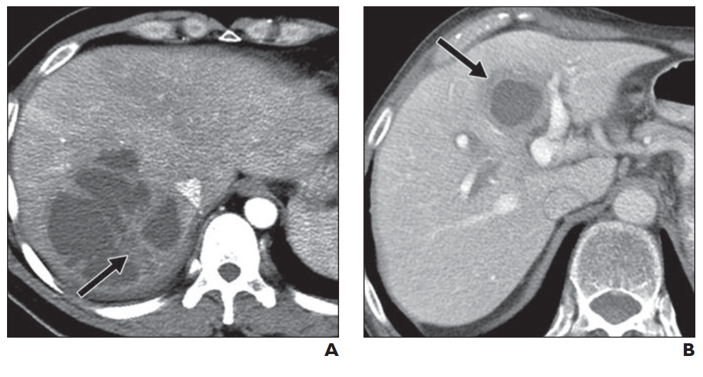
          

            
Figure 6. Áp Xe Gan Do Vi Khuẩn (Pyogenic Liver Abscess)

            (A) Nang phức hợp dạng chùm ở BN nhiễm *E. coli* và *K. pneumoniae*; (B) Nang phức hợp thành dày ngấm thuốc, bao quanh bởi viền nhu mô gan phù nề (Dấu hiệu mục tiêu kép - Double-target sign).
          

        

        

          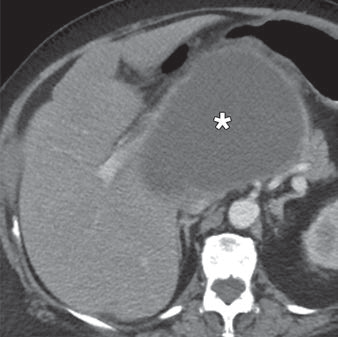
          

            
Figure 7. Áp Xe Gan Do Amip (*Entamoeba histolytica*)

            CT cản quang ở bệnh nhân đi du lịch Trung Phi về: Ổ khuyết dịch lớn đơn thùy (dấu sao) nằm ở thùy đuôi của gan; nam giới gặp nhiều gấp 7-10 lần nữ giới.
          

        

      

      <!-- FIG 8 & FIG 9 -->
      

        

          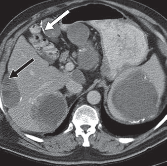
          

            
Figure 8. Nang Sán Chó Gan (Hydatid Cyst - *Echinococcus*)

            CT cản quang: Nhiều tổn thương nang ở gan và lách; mũi tên trắng chỉ vôi hóa dày thành nang; mũi tên đen chỉ các nang con nhỏ (Daughter cysts) phân bố ở ngoại vi nang mẹ.
          

        

        

          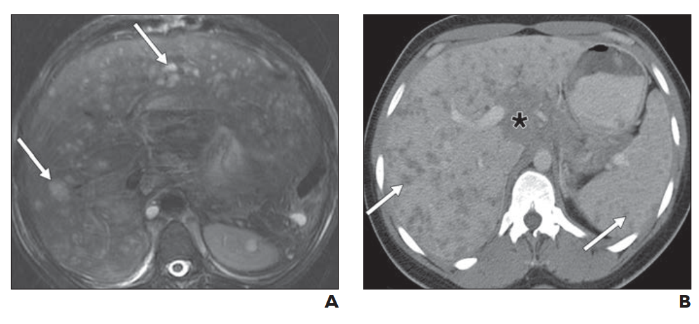
          

            
Figure 9. Vi Áp Xe Do Nấm &amp; Tổn Thương Giả Nấm

            (A) MRI T2W ở BN AIDS: Vô số nốt vi áp xe nhỏ tăng tín hiệu do *Candida* khắp gan và lách (Dấu hiệu mắt bò); (B) CT ở BN Sarcoidosis: Các u hạt đặc giảm tỷ trọng giả nang kèm hạch mạc treo (dấu sao).
          

        

      

    

  

  <!-- ==================== SECTION 4 ==================== -->
  

    

      🩹
      <h2 class="sec-title">4. Tổn Thương Do Chấn Thương Hoặc Can Thiệp: Biloma, Seroma, Hematoma &amp; Nang Giả Tụy (Fig 14)</h2>
    

    

      

        

          

          
Phân Biệt Biloma, Seroma &amp; Hematoma 💉

          

            <ul class="clin-card-list">
              <li>Hình thành sau chấn thương hoặc sau mổ cắt gan, ghép gan, sinh thiết gan.</li>
              <li><strong>Seroma &amp; Biloma:</strong> Ổ dịch thành mỏng ngấm thuốc nhẹ; cần làm MRCP tương phản từ gan mật hoặc xạ hình mật để tìm rò rỉ khẳng định Biloma.</li>
              <li><strong>Hematoma:</strong> Tỷ trọng/tín hiệu biến thiên theo tuổi của sản phẩm máu thoái hóa; chuỗi xung gradient-echo T2* nhạy nhất phát hiện hemosiderin.</li>
            </ul>
          

        

        

          

          
Nang Giả Tụy Trong Gan (Intrahepatic Pseudocyst) 🧪

          

            <ul class="clin-card-list">
              <li>Biến chứng hiếm gặp của viêm tụy cấp do rượu ở nam giới trẻ tuổi.</li>
              <li>Dịch tụy hoạt hóa từ hậu cung mạc nối luồn theo dây chằng vị gan / gan tá tràng vào nhu mô gan, gây hoại tử hóa lỏng tạo bao xơ giả.</li>
              <li>Chẩn đoán dựa trên tiền sử viêm tụy cấp và sự tăng cao amylase/lipase máu.</li>
            </ul>
          

        

      

      <!-- FIG 14 -->
      

        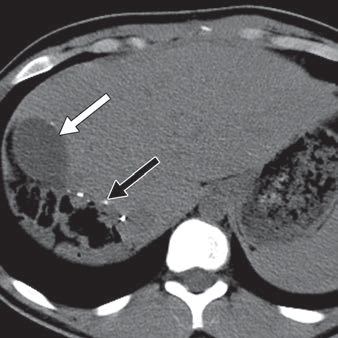
        

          
Figure 14. Nang Dịch Thanh Tơ (Seroma) Sau Mổ Ở Người Hiến Gan

          CT không cản quang của phụ nữ 20 tuổi hiến gan: Ổ tụ dịch đơn thuần thành mỏng (mũi tên trắng) sát diện cắt thùy gan (mũi tên đen); tổn thương tự hấp thu hoàn toàn sau vài tuần mà không cần can thiệp.
        

      

    

  

  <!-- ==================== SECTION 5 ==================== -->
  

    

      🌿
      <h2 class="sec-title">5. Lưu Đồ Thuật Toán Chẩn Đoán Phân Tầng Hệ Thống (Fig. 16) - Thiết Kế Trực Quan</h2>
    

    

      <!-- HÌNH ẢNH GỐC FIG 16 -->
      

        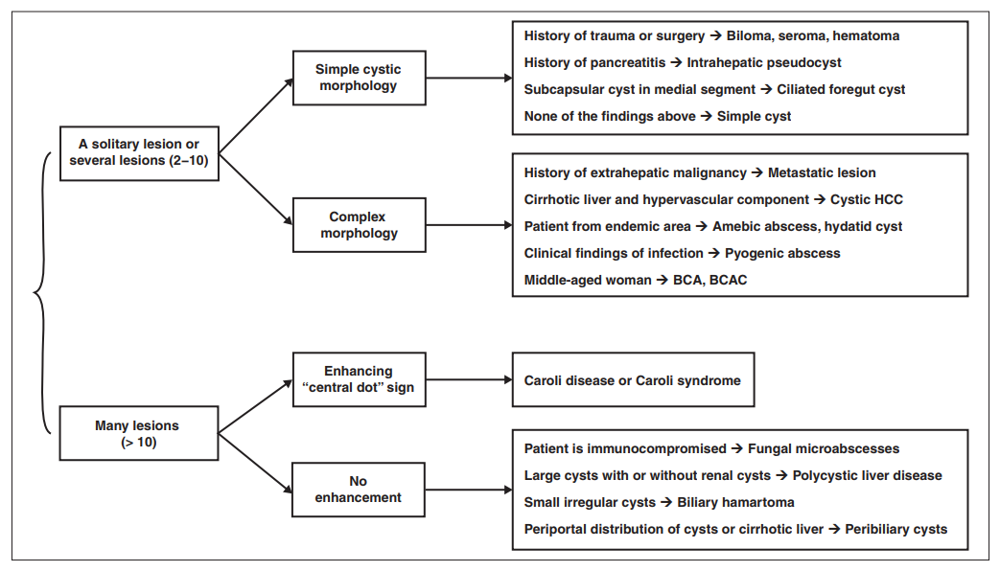
        

          
Figure 16. Sơ Đồ Gốc AJR: Lưu Đồ Đơn Giản Hóa Phân Tầng Chẩn Đoán Nang Gan

          Sơ đồ thuật toán phân tầng toàn diện từ bài báo gốc AJR 2014 của Borhani và cộng sự.
        

      

      <!-- CODE VISUAL FLOWCHART TÁI HIỆN CHÍNH XÁC THIẾT KẾ FIG 16 (VIỆT HÓA CHUYÊN NGÀNH) -->
      

        
        

          

            <i class="fa-solid fa-diagram-project"></i> LƯU ĐỒ THUẬT TOÁN TIẾP CẬN CHẨN ĐOÁN TỔN THƯƠNG NANG GAN (AJR 2014)
          

          

            (Bản thiết kế trực quan hóa chuẩn y khoa tương thích 100% với Figure 16)
          

        

        <!-- 2 NHÁNH LỚN -->
        

          <!-- ================= NHÁNH A: 1 HOẶC VÀI NANG ================= -->
          

            

              📌 NHÁNH A: TỔN THƯƠNG ĐƠN ĐỘC HOẶC MỘT VÀI NANG (1 ĐẾN 10 NANG)
            

            

              
              <!-- PHÂN NHÁNH A1: NANG ĐƠN THUẦN -->
              

                

                  💧 Cấu Trúc Nang Đơn Thuần (Simple Morphology)
                

                

                  • <strong>Có tiền sử chấn thương hoặc mổ gan gần đây:</strong> 
                  👉 Biloma, Seroma, hoặc Hematoma 
                  • <strong>Có tiền sử hoặc đang bị đợt viêm tụy cấp:</strong> 
                  👉 Nang giả tụy trong gan (Intrahepatic Pseudocyst) 
                  • <strong>Nang sát bao gan ở hạ phân thùy IV (phân thùy giữa):</strong> 
                  👉 Nang ruột trước có lông chuyển (Ciliated Foregut Cyst) 
                  • <strong>Không có các yếu tố lâm sàng đặc biệt trên:</strong> 
                  👉 Nang gan đơn thuần (Simple Hepatic Cyst)
                

              

              <!-- PHÂN NHÁNH A2: NANG PHỨC TẠP -->
              

                

                  ⚠️ Cấu Trúc Nang Phức Tạp (Thành dày, vách ngăn, nốt sùi)
                

                

                  • <strong>Tiền sử ung thư ngoài gan (NET, GIST, ruột nhầy):</strong> 
                  👉 Nang di căn gan (Cystic Metastasis) 
                  • <strong>Gan xơ + Thành phần đặc ngấm thuốc động mạch, thải thuốc:</strong> 
                  👉 Ung thư biểu mô tế bào gan thể nang (Cystic HCC) 
                  • <strong>Vùng dịch tễ hoặc tiền sử tiếp xúc cừu / chó:</strong> 
                  👉 Áp xe amip HOẶC Nang sán chó (Hydatid Cyst) 
                  • <strong>Biểu hiện hội chứng nhiễm trùng (sốt, bạch cầu cao):</strong> 
                  👉 Áp xe gan do vi khuẩn (Pyogenic Abscess) 
                  • <strong>Nữ trung niên, không có nhiễm trùng hay ác tính:</strong> 
                  👉 U tuyến nang (BCA) / K biểu mô tuyến nang (BCAC)
                

              

            

          

          <!-- ================= NHÁNH B: VÔ SỐ NANG LAN TỎA ================= -->
          

            

              📌 NHÁNH B: VÔ SỐ TỔN THƯƠNG NANG PHÂN BỐ LAN TỎA KHẮP GAN (&gt; 10 NANG)
            

            

              <!-- PHÂN NHÁNH B1: CÓ NGẤM THUỐC MẠCH MÁU -->
              

                

                  🔴 Có Ngấm Thuốc Mạch Máu: "Central Dot Sign"
                

                

                  • <strong>Dấu hiệu chấm trung tâm (Central dot sign):</strong> Nhánh tĩnh mạch cửa ngấm thuốc chạy xuyên tâm nang giãn thông thương với đường mật. 
                  👉 Bệnh Caroli (Caroli Disease) HOẶC Hội chứng Caroli 
                  <em>Nguy cơ: Viêm đường mật tái phát, sỏi mật và ung thư đường mật.</em>
                

              

              <!-- PHÂN NHÁNH B2: HOÀN TOÀN KHÔNG NGẤM THUỐC -->
              

                

                  ⚪ Hoàn Toàn Không Có Thành Phần Ngấm Thuốc Sau Tiêm
                

                

                  • <strong>Bệnh nhân suy giảm miễn dịch nặng / sốt giảm bạch cầu:</strong> 
                  👉 Vi áp xe nấm gan lách (Fungal Microabscesses - Candida) 
                  • <strong>Nang lớn rải rác + Có kèm theo nang ở cả hai thận:</strong> 
                  👉 Bệnh gan đa nang di truyền (Polycystic Liver Disease - PLD) 
                  • <strong>Vô số nang nhỏ không đều (&lt; 15 mm) ổn định qua nhiều năm:</strong> 
                  👉 Hamartoma đường mật (Biliary Hamartoma / von Meyenburg) 
                  • <strong>Nang nhỏ (&lt; 10 mm) dọc khoảng cửa rốn gan trên nền gan xơ:</strong> 
                  👉 Nang quanh đường mật (Peribiliary Cysts)
                

              

            

          

        

      

    

  

  <!-- ==================== SECTION 6 ==================== -->
  

    

      🎗️
      <h2 class="sec-title">6. Nhóm Tổn Thương Tân Sản: U Tuyến Nang (BCA/BCAC), Cystic HCC &amp; Di Căn Nang (Fig 10-12)</h2>
    

    

      <!-- FIG 10 -->
      

        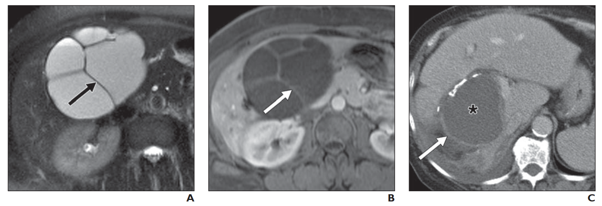
        

          
Figure 10. U Tuyến Nang Đường Mật (BCA) &amp; Ung Thư Tuyến Nang (BCAC)

          (A, B) BCA ở nữ 43 tuổi: Khối nang khổng lồ ở gan trái có vách ngăn mỏng tăng tín hiệu T2W và ngấm thuốc tương phản từ rõ rệt (mũi tên), giải phẫu bệnh có lớp mô đệm kiểu buồng trứng; (C) BCAC tái phát ở nữ 73 tuổi: Thành nang dày không đều ngấm thuốc cản quang dạng viền rất mạnh (mũi tên).
        

      

      <!-- FIG 11 & FIG 12 -->
      

        

          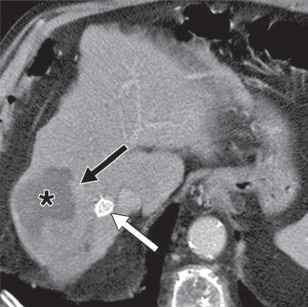
          

            
Figure 11. Ung Thư Biểu Mô Tế Bào Gan Thể Nang (Cystic HCC)

            CT pha động mạch ở BN nam 56 tuổi xơ gan do viêm gan C: Khối nang phức hợp lớn hoại tử trung tâm (dấu sao), có <strong>thành phần đặc tăng ngấm thuốc rất mạnh ở ngoại vi</strong> (mũi tên đen) và có stent thông cửa chủ TIPS (mũi tên trắng). Dễ bị chẩn đoán nhầm với áp xe gan!
          

        

        

          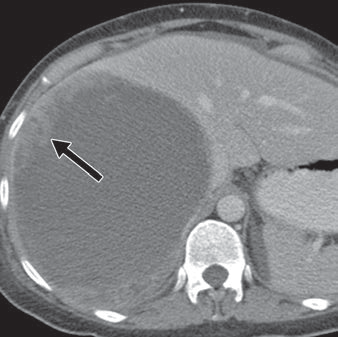
          

            
Figure 12. Nang Di Căn Gan Từ Ung Thư Ngoài Gan (Cystic Metastasis)

            CT cản quang ở nữ 40 tuổi có tiền sử Sarcoma sau phúc mạc: Khối nang phức hợp lớn ở gan (dấu sao) với thành dày và <strong>các nốt đặc sùi tăng ngấm thuốc rõ rệt ở ngoại vi</strong> (mũi tên), hình thái di căn điển hình.
          

        

      

    

  

  <!-- ==================== SECTION 7 ==================== -->
  

    

      🎭
      <h2 class="sec-title">7. Nhóm Tổn Thương Khác &amp; Giả Nang: Nang Quanh Mật, UES Trẻ Em, Phình Mạch Giả (Fig 13, 15)</h2>
    

    

      <!-- FIG 13 -->
      

        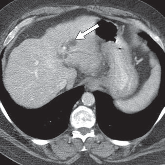
        

          
Figure 13. Nang Quanh Đường Mật Ở Bệnh Nhân Xơ Gan (Peribiliary Cysts)

          (A) CT cản quang &amp; (B) MRCP dựng hình đường mật: Vô số nang nhỏ (&lt; 10 mm) phân bố dọc theo các khoảng cửa lớn ở rốn gan trên nền gan xơ mấp mô (mũi tên). Nang phân bố đối xứng hai bên tĩnh mạch cửa, không làm giãn tắc đường mật thực sự.
        

      

      <!-- FIG 15 -->
      

        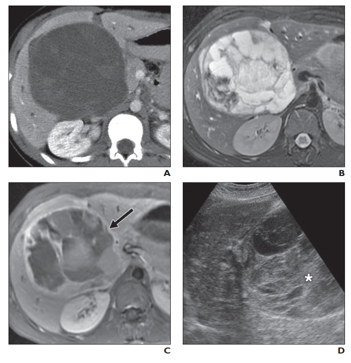
        

          
Figure 15. Nghịch Lý Hình Ảnh: Sarcoma Phôi Thai Chưa Biệt Hóa (UES) Ở Bé Gái 14 Tuổi

          (A) CT cản quang &amp; (B, C) MRI T2W/T1W: Khối khổng lồ thùy phải, giảm tỷ trọng dịch nang (dấu sao), có vách ngăn ngấm thuốc muộn giống tổn thương dạng nang; (D) Siêu âm: Bộc lộ bản chất <strong>khối u đặc đồng nhất tăng âm</strong> (dấu sao) do chất nền myxoid giàu protein phản hồi sóng âm mạnh!
        

      

      
Các Cạm Bẫy Giả Nang Khác Cần Lưu Ý

      

        

          

          
Phình Mạch Giả Trong Gan (Pseudoaneurysm) ⚠️

          

            
• Biến chứng mạch máu sau chấn thương hoặc can thiệp gan mật; trông giống nang dịch đơn thuần trên CT/US không thuốc.

            
• <strong>Dấu hiệu quyết định:</strong> Siêu âm Doppler màu thấy dòng xoáy <em>âm dương (yin-yang sign)</em> và phổ động mạch; CT cản quang pha động mạch ngấm thuốc đồng thì với động mạch chủ.

            
• Bắt buộc can thiệp nút mạch cấp cứu vì nguy cơ vỡ xuất huyết tử vong.

          

        

        

          

          
Nhiễm Mỡ Gan Khu Trú Dạng Nốt (Focal Steatosis) 🟡

          

            
• Lắng đọng mỡ khu trú làm giảm tỷ trọng trên CT không thuốc (xuống 0-15 HU) dễ nhầm với nang nhỏ.

            
• Siêu âm cho thấy tính chất u đặc tăng âm; CT cản quang ngấm thuốc bình thường không chèn ép mạch máu; MRI chuỗi xung in-phase và out-of-phase khẳng định mỡ nội bào.

          

        

      

    

  

  <!-- ==================== SECTION 8 ==================== -->
  

    

      ⚡
      <h2 class="sec-title">8. Cheat-Sheet Dấu Hiệu Hình Ảnh Mấu Chốt, 5 Câu Hỏi Trắc Nghiệm &amp; Tài Liệu AMA</h2>
    

    

      
Cheat-Sheet Tra Cứu Nhanh Dấu Hiệu Hình Ảnh Nang Gan (AJR 2014)

      

        ⚡
        

          • <strong>Nang đơn thuần:</strong> Thành mỏng vô hình, dịch trong (0-15 HU), tăng âm thành sau, không ngấm thuốc. 
          • <strong>Hamartoma đường mật:</strong> Vô số nang nhỏ &lt; 15 mm, không đều, dưới bao gan, không thông đường mật. 
          • <strong>Bệnh Caroli:</strong> Nang thông cây mật + <strong>Central dot sign</strong> (nhánh TM cửa xuyên tâm nang). 
          • <strong>Nang ruột trước:</strong> Dưới bao gan hạ phân thùy IV, tỷ trọng cao (dịch nhầy), nguy cơ K tế bào vảy. 
          • <strong>Áp xe vi khuẩn:</strong> <strong>Double-target sign</strong> (thành ngấm thuốc + viền phù nề ngoại vi). 
          • <strong>Áp xe amip:</strong> Thùy phải sát bao gan, đơn độc, nam giới &gt; nữ giới 7-10 lần, huyết thanh amip (+). 
          • <strong>Nang sán chó:</strong> Nang mẹ lớn chứa <strong>Daughter cysts</strong> ở ngoại vi + vôi hóa viền vỏ nang. 
          • <strong>Vi áp xe nấm:</strong> Vô số nang &lt; 2 cm ở gan và lách; dấu hiệu <strong>Bull's eye</strong> hoặc bánh xe trong bánh xe. 
          • <strong>BCA / BCAC:</strong> 90% ở nữ trung niên, đa thùy vách mỏng, mô đệm buồng trứng; BCAC có nốt sùi ngấm thuốc mạnh. 
          • <strong>Cystic HCC:</strong> Khối hoại tử dạng nang trên nền xơ gan, thành phần đặc ngấm thuốc động mạch và thải thuốc. 
          • <strong>Nang di căn:</strong> Tiền sử u nguyên phát (NET, GIST, ruột nhầy); nhiều ổ nang phức hợp thành dày mấp mô. 
          • <strong>UES (Trẻ em):</strong> Nghịch lý hình ảnh: Dạng nang trên CT/MRI nhưng là u đặc trên Siêu âm.
        

      

      
5 Câu Hỏi Trắc Nghiệm Tự Lượng Giá Lâm Sàng (MCQ Quiz)

      

        
Câu 1: Dấu hiệu hình ảnh "Chấm trung tâm" (Central dot sign) trên phim chụp CT cản quang hoặc MRI có giá trị chẩn đoán đặc trưng cho bệnh lý nang gan nào dưới đây?

        

          
A. Nang gan đơn thuần bội nhiễm

          
B. Bệnh Caroli (giãn đường mật dạng túi trong gan bẩm sinh)

          
C. Áp xe gan do vi khuẩn Klebsiella pneumoniae

          
D. Hamartoma đường mật (phức hợp von Meyenburg)

        

        

          <strong>Giải thích:</strong> Dấu hiệu chấm trung tâm (central dot sign) trên CT cản quang/MRI là hình ảnh một nhánh tĩnh mạch cửa tăng ngấm thuốc chạy xuyên tâm qua khoang nang giãn thông thương với đường mật, đặc trưng tuyệt đối cho Bệnh Caroli.
        

      

      

        
Câu 2: Đặc điểm mô học kinh điển nào là tiêu chuẩn vàng giúp phân biệt U tuyến nang đường mật (Biliary Cystadenoma - BCA) với các tổn thương nang khác và giải thích vì sao u này có tỷ lệ áp đảo ở nữ giới (9:1)?

        

          
A. Sự hiện diện của các thể vôi hóa hình cầu dạng cát (psammoma bodies)

          
B. Lớp biểu mô lát tầng sừng hóa chứa nhiều lông chuyển

          
C. Sự hiện diện của lớp mô đệm kiểu buồng trứng (ovarian-type stroma) nằm dưới biểu mô tuyến

          
D. Lòng nang chứa đầy ấu trùng sán dây Echinococcus

        

        

          <strong>Giải thích:</strong> BCA có đặc điểm mô bệnh học kinh điển là lớp mô đệm kiểu buồng trứng (ovarian-type stroma) bên dưới biểu mô tuyến, giải thích lý do u hầu như chỉ gặp ở phụ nữ trung niên (nữ:nam = 9:1).
        

      

      

        
Câu 3: Một bệnh nhân nam 62 tuổi có tiền sử xơ gan do viêm gan C nhập viện vì đau hạ sườn phải và sốt. CT cản quang thấy một khối dạng nang phức hợp lớn ở gan phải hoại tử trung tâm, phần thành và vách dày mấp mô ngấm thuốc rất mạnh ở pha động mạch và thải thuốc ở pha tĩnh mạch cửa. Nồng độ AFP huyết thanh tăng vọt 1.500 ng/mL. Chẩn đoán phù hợp nhất là gì?

        

          
A. Ung thư biểu mô tế bào gan dạng nang hoại tử (Cystic HCC)

          
B. Nang sán chó vỡ bội nhiễm

          
C. Nang gan đơn thuần xuất huyết

          
D. Nang quanh đường mật

        

        

          <strong>Giải thích:</strong> Khối u dạng nang phức hợp hoại tử trên nền gan xơ, có thành phần đặc tăng tưới máu động mạch và thải thuốc tĩnh mạch (washout) điển hình kèm AFP tăng cao khẳng định chẩn đoán Ung thư biểu mô tế bào gan thể nang (Cystic HCC), một thể rất dễ nhầm với áp xe gan.
        

      

      

        
Câu 4: Khối u gan ác tính nào ở trẻ em (thường từ 6 - 10 tuổi) biểu hiện một "nghịch lý hình ảnh" kinh điển: trông giống một nang dịch đa thùy lớn trên CT/MRI nhưng lại là một khối u đặc tăng âm đồng nhất trên Siêu âm?

        

          
A. Ung thư nguyên bào gan (Hepatoblastoma)

          
B. U máu thể hang khổng lồ

          
C. Nang nhân đôi ruột trước có lông chuyển

          
D. Sarcoma phôi thai chưa biệt hóa (Undifferentiated Embryonal Sarcoma - UES)

        

        

          <strong>Giải thích:</strong> UES ở trẻ em có chất nền myxoid giàu nước và protein cao, tạo ra nghịch lý hình ảnh: tỷ trọng thấp giống dịch nang trên CT/MRI nhưng lại phản hồi sóng âm cực mạnh tạo hình ảnh u đặc trên Siêu âm.
        

      

      

        
Câu 5: Dấu hiệu hình ảnh nào trên CT/MRI giúp định hướng chẩn đoán chính xác Nang sán chó gan (Hydatid cyst) do nhiễm *Echinococcus granulosus*?

        

          
A. Thành nang mỏng không ngấm thuốc, dịch trong đồng nhất

          
B. Một nang mẹ lớn chứa nhiều nang con nhỏ (daughter cysts) phân bố ở ngoại vi kèm vôi hóa viền thành nang

          
C. Hình ảnh dòng xoáy âm dương trên Doppler màu

          
D. Nang nằm ở hạ phân thùy IV dưới bao gan

        

        

          <strong>Giải thích:</strong> Nang sán chó đặc trưng bởi sự xuất hiện của các nang con nhỏ (daughter cysts) phân bố ở ngoại vi bên trong nang mẹ, thường đi kèm vôi hóa dày ở vỏ nang mẹ.
        

      

      
Danh Mục Tài Liệu Tham Khảo Chuẩn AMA

      

        <strong>Tài liệu gốc chính thức:</strong>
        <ol style="margin-left: 1.5rem; margin-top: 0.5rem; line-height: 1.8;">
          <li>Borhani AA, Wiant A, Heller MT. Cystic hepatic lesions: a review and an algorithmic approach. <em>AJR Am J Roentgenol</em>. 2014;203(6):1192-1204. doi:10.2214/AJR.13.12386.</li>
          <li>Mortelé KJ, Ros PR. Cystic focal liver lesions in the adult: differential diagnosis at CT and MR imaging. <em>Radiology</em>. 2001;220(2):295-304. doi:10.1148/radiology.220.2.r01au08295.</li>
          <li>Mavilia MG, Pakala T, Molina M, Wu GY. Differentiating cystic liver lesions: a review of imaging modalities, diagnosis and management. <em>J Clin Transl Hepatol</em>. 2018;6(2):208-216. doi:10.14218/JCTH.2017.00069.</li>
        </ol>
      

    

  

<!-- BOTTOM NAV -->

  

    <a href="#/ebm/kho-guidelines" class="btn btn-primary">
      <i class="fa-solid fa-arrow-left"></i> Quay lại Kho Guidelines
    </a>
    <a href="#sec-dat-van-de-phan-loai" class="btn">
      <i class="fa-solid fa-arrow-up"></i> Lên đầu trang
    </a>
  

