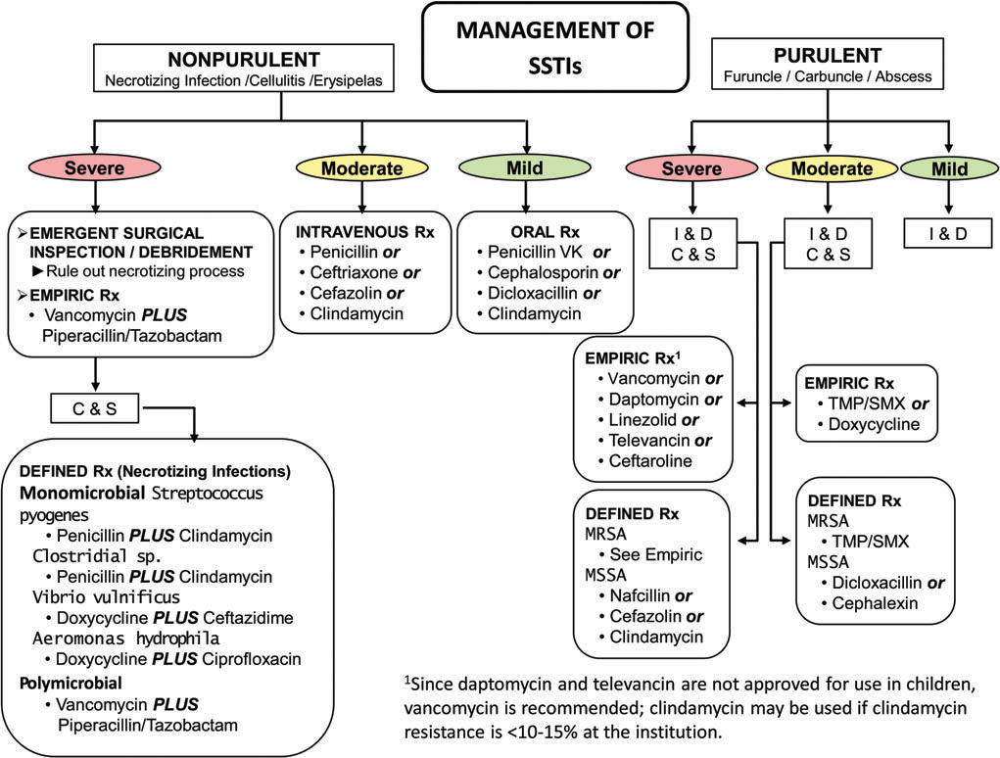
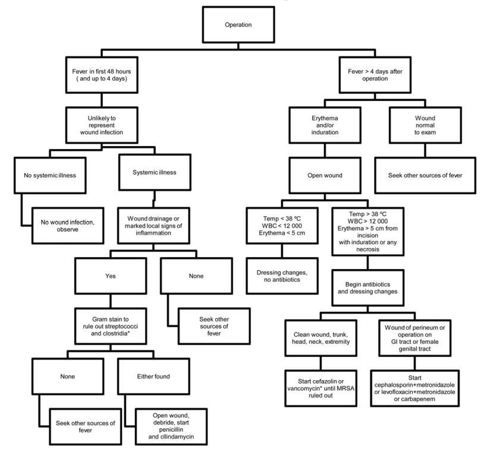

  

    

      
Có Mủ vs Không Mủ

      
Phân đôi tiếp cận điều trị: Áp xe do Tụ cầu vs Viêm mô tế bào do Liên cầu

    

    

      
I&amp;D Là Cốt Lõi

      
Áp xe nhẹ chỉ cần rạch dẫn lưu tốt; vết mổ bắt buộc cắt chỉ dẫn lưu trước

    

    

      
Clindamycin Kháng Độc Tố

      
Phối hợp bắt buộc với Penicillin trong hoại tử do liên cầu (hiệu ứng Eagle)

    

    

      
Prednisone 40mg/7d

      
Cân nhắc steroid bổ trợ giảm viêm mô tế bào ở người không đái tháo đường

    

  

  

    

      
⚖️

      

        
Phân Tầng Tam Cấp SIRS (Nhẹ - Vừa - Nặng)

        
Định hình quyết định điều trị ngoại trú vs nhập viện; phân định rõ vai trò của I&amp;D đơn thuần vs kháng sinh uống vs kháng sinh tĩnh mạch phổ rộng.

      

    

    

      
🚨

      

        
Khẩn Cấp Ngoại Khoa &amp; Kháng Độc Tố

        
Phẫu thuật thám sát cắt lọc cấp cứu là nguyên tắc sống còn trong viêm cân mạc hoại tử; dùng kháng sinh ức chế tổng hợp protein diệt độc tố vi khuẩn.

      

    

    

      
🛡️

      

        
Dự Phòng Toàn Diện &amp; Bảo Vệ Cơ Địa Yếu

        
Xử trí vết cắn dự phòng sớm bằng Amoxicillin-Clavulanate; Penicillin dự phòng cho thể tái phát; tầm soát nấm/vi trùng cơ hội ở bệnh nhân sốt giảm bạch cầu.

      

    

  

  

    <a href="#sec-tong-quan-phan-loai-grade" class="quickmenu-item active">1. Tổng Quan &amp; GRADE</a>
    <a href="#sec-luu-do-ssti-chinh" class="quickmenu-item">2. Lưu Đồ SSTI (Figure 1)</a>
    <a href="#sec-choc-lo-khang-sinh-tu-cau" class="quickmenu-item">3. Chốc Lở &amp; Tụ Cầu (Table 2)</a>
    <a href="#sec-nhiem-trung-vet-mo-ssi" class="quickmenu-item">4. Nhiễm Trùng Vết Mổ (Figure 2)</a>
    <a href="#sec-hoai-tu-viem-co-mu" class="quickmenu-item">5. Hoại Tử &amp; Viêm Cơ Mủ (Table 4)</a>
    <a href="#sec-vet-can-phong-tai-phat" class="quickmenu-item">6. Vết Cắn &amp; Phòng Tái Phát</a>
    <a href="#sec-suy-giam-mien-dich-steroid" class="quickmenu-item">7. Suy Giảm Miễn Dịch &amp; Steroid</a>
    <a href="#sec-nhiem-trung-dac-biet-mcq" class="quickmenu-item">8. Bệnh Đặc Biệt &amp; 5 MCQ</a>
  

  {/* ==================== SECTION 1 ==================== */}
  

    

      📜
      <h2 class="sec-title">1. Tổng Quan, Hệ Thống Phân Loại SSTI &amp; Phương Pháp Luận GRADE (Table 1)</h2>
    

    

      

        💡
        

          <strong>Cột Mốc Lịch Sử Của Hướng Dẫn Lâm Sàng IDSA 2014 (Clinical Infectious Diseases):</strong>
          Được xuất bản bởi Hiệp hội Bệnh truyền nhiễm Hoa Kỳ (IDSA), hướng dẫn thực hành năm 2014 (Stevens et al.) là văn kiện bản lề định hình toàn bộ cách tiếp cận nhiễm trùng da và mô mềm trên phạm vi toàn cầu. Điểm cách mạng lớn nhất là việc <strong>phân đôi hoàn toàn SSTI thành hai nhánh: Nhiễm trùng có mủ (Purulent) và Không mủ (Non-purulent)</strong>, từ đó giải quyết triệt để tình trạng lạm dụng kháng sinh bao phủ MRSA không cần thiết cho viêm mô tế bào đơn thuần.
        

      

      
Phương Pháp Luận GRADE Đánh Giá Bằng Chứng &amp; Khuyến Cáo (Table 1 IDSA)

      

        <table class="regimen-table">
          <thead>
            <tr>
              <th style="width: 25%;">Sức Mạnh Khuyến Cáo &amp; Mức Bằng Chứng</th>
              <th style="width: 25%;">Cân Bằng Lợi Ích / Tác Hại</th>
              <th style="width: 25%;">Chất Lượng Phương Pháp Luận</th>
              <th style="width: 25%;">Ý Nghĩa Áp Dụng Lâm Sàng</th>
            </tr>
          </thead>
          <tbody>
            <tr>
              <td class="source-cell">Mạnh, Cao (Strong, High)</td>
              <td>Lợi ích vượt trội rõ rệt tác hại.</td>
              <td>Thử nghiệm RCTs thực hiện tốt, kết quả nhất quán.</td>
              <td>Áp dụng cho hầu hết bệnh nhân; nghiên cứu mới khó làm thay đổi kết luận.</td>
            </tr>
            <tr>
              <td class="source-cell">Mạnh, TB (Strong, Moderate)</td>
              <td>Lợi ích vượt trội rõ rệt tác hại.</td>
              <td>RCTs có giới hạn phương pháp hoặc nghiên cứu quan sát mạnh.</td>
              <td>Áp dụng cho đa số bệnh nhân; nghiên cứu mới có thể tác động.</td>
            </tr>
            <tr>
              <td class="source-cell">Mạnh, Thấp (Strong, Low)</td>
              <td>Lợi ích vượt trội rõ rệt tác hại.</td>
              <td>Nghiên cứu quan sát, RCTs có sai sót hoặc bằng chứng gián tiếp.</td>
              <td>Có thể thay đổi khi có bằng chứng chất lượng cao hơn.</td>
            </tr>
            <tr>
              <td class="source-cell">Yếu, Cao/TB (Weak, High/Mod)</td>
              <td>Lợi ích và tác hại cân bằng sít sao.</td>
              <td>Bằng chứng nhất quán từ RCTs hoặc nghiên cứu quan sát.</td>
              <td>Hành động tối ưu phụ thuộc vào cá thể hóa hoàn cảnh và giá trị bệnh nhân.</td>
            </tr>
            <tr>
              <td class="source-cell">Yếu, Thấp/Rất thấp</td>
              <td>Còn mơ hồ lớn về lợi ích/tác hại.</td>
              <td>Quan sát lâm sàng không hệ thống hoặc bằng chứng rất gián tiếp.</td>
              <td>Các giải pháp khác có giá trị tương đương; ước tính hiệu quả không chắc chắn.</td>
            </tr>
          </tbody>
        </table>
      

    

  

  {/* ==================== SECTION 2 ==================== */}
  

    

      🔬
      <h2 class="sec-title">2. Lưu Đồ Quản Lý SSTI Có Mủ &amp; Không Mủ: Figure 1 &amp; Code Trực Quan</h2>
    

    

      {/* FIGURE 1 CARD */}
      

        
        

          
Figure 1. Lưu Đồ Phân Loại &amp; Quản Lý SSTI Có Mủ &amp; Không Mủ (IDSA 2014)

          Lưu đồ bản lề chia tách hai nhánh bệnh lý song song (Có mủ do Tụ cầu vs Không mủ do Liên cầu) với 3 mức độ nặng: Nhẹ (Mild), Trung bình (Moderate) và Nặng (Severe).
        

      

      <FlowchartViewer 
        title="Lưu Đồ Phân Tầng Xử Trí SSTI Có Mủ & Không Mủ (IDSA 2014 Figure 1)"
        code={`flowchart TD
          SSTI([Nhiễm trùng da và mô mềm SSTI | start | badge: Khám ban đầu])
          TYPE{Phân loại lâm sàng: Có mủ hay Không mủ? | question}
          
          PUR[Nhiễm trùng có mủ (Purulent) | danger | subtitle: Áp xe, nhọt - Chủ yếu Tụ cầu S. aureus]
          NONPUR[Nhiễm trùng không mủ (Non-purulent) | action | subtitle: Viêm mô tế bào, quầng - Chủ yếu Liên cầu]
          
          PUR_MILD[Nhẹ: Áp xe đơn thuần | success | subtitle: Rạch và dẫn lưu I&D - Không cần kháng sinh]
          PUR_MOD{Trung bình: Kèm SIRS? | question | subtitle: T > 38°C, HR > 90, WBC > 12k}
          PUR_MOD_RX[I&D + Cấy mủ + Kháng sinh uống | warning | subtitle: TMP-SMX hoặc Doxycycline (phủ MRSA)]
          PUR_SEV[Nặng: Thất bại I&D hoặc suy giảm MD | danger | badge: Nhập viện IV | subtitle: Vancomycin, Daptomycin hoặc Linezolid]
          
          NON_MILD[Nhẹ: Viêm mô tế bào khu trú | success | subtitle: Kháng sinh uống: Penicillin VK, Cephalexin]
          NON_MOD{Trung bình: Kèm SIRS toàn thân? | question}
          NON_MOD_RX[Nhập viện dùng kháng sinh IV | warning | subtitle: Cefazolin, Ceftriaxone, Penicillin G]
          NON_SEV[Nặng: Hoại tử mô sâu hoặc sốc | danger | badge: Khẩn cấp ngoại | subtitle: Thám sát cắt lọc khẩn + Vanco + Pip-Tazo]

          SSTI --> TYPE
          TYPE ==>|Có mủ / Áp xe| PUR
          TYPE -->|Không mủ / Viêm mô tế bào| NONPUR
          
          PUR --> PUR_MILD
          PUR --> PUR_MOD
          PUR_MOD ==>|Có SIRS| PUR_MOD_RX
          PUR ==>|Thất bại/Suy giảm MD| PUR_SEV
          
          NONPUR --> NON_MILD
          NONPUR --> NON_MOD
          NON_MOD ==>|Có SIRS| NON_MOD_RX
          NONPUR ==>|Dấu hiệu hoại tử/Sốc| NON_SEV
        `}
      />

      {/* VISUAL DIAGRAM CODE: TÁI HIỆN CODE LƯU ĐỒ FIGURE 1 */}
      

        

          <i class="fa-solid fa-diagram-project"></i> Sơ Đồ Thuật Toán Tái Hiện Bằng Code: Phân Tầng Xử Trí SSTI (IDSA 2014)
        

        

          {/* NHÁNH CÓ MỦ */}
          

            

              🩸 NHIỄM TRÙNG CÓ MỦ (PURULENT SSTIs) 
              Áp xe da, nhọt, hậu bối (Chủ yếu do Tụ cầu vàng S. aureus)
            

            

              <strong style="color: #16a34a;">🟢 NHẸ (Mild):</strong> Áp xe đơn thuần, không có dấu hiệu toàn thân. 
              👉 <strong>Rạch và dẫn lưu (I&amp;D) đơn thuần</strong>. Không cần kháng sinh.
            

            

              <strong style="color: #d97706;">🟡 TRUNG BÌNH (Moderate):</strong> Có mủ kèm dấu hiệu đáp ứng viêm toàn thân (SIRS). 
              👉 <strong>I&amp;D + Cấy mủ &amp; Kháng sinh đồ</strong>. 
              • Kháng sinh kinh nghiệm uống: <strong>TMP-SMX</strong> hoặc <strong>Doxycycline</strong>. 
              • Đích MRSA: Tiếp tục TMP-SMX. Đích MSSA: Đổi sang <strong>Dicloxacillin</strong> hoặc <strong>Cephalexin</strong>.
            

            

              <strong style="color: #dc2626;">🔴 NẶNG (Severe):</strong> Thất bại I&amp;D + kháng sinh uống, hoặc SIRS nặng, hoặc suy giảm miễn dịch. 
              👉 <strong>I&amp;D + Cấy mủ + Nhập viện dùng kháng sinh tĩnh mạch (IV)</strong>. 
              • Kháng sinh kinh nghiệm IV: <strong>Vancomycin</strong>, Daptomycin, Linezolid, Telavancin, hoặc Ceftaroline. 
              • Đích MSSA: Đổi sang <strong>Nafcillin</strong>, <strong>Cefazolin</strong>, hoặc Clindamycin.
            

          

          {/* NHÁNH KHÔNG MỦ */}
          

            

              🧠 NHIỄM TRÙNG KHÔNG MỦ (NON-PURULENT SSTIs) 
              Viêm mô tế bào, hồng ban, hoại tử (Chủ yếu do Liên cầu Streptococcus)
            

            

              <strong style="color: #16a34a;">🟢 NHẸ (Mild):</strong> Viêm mô tế bào/hồng ban khu trú, không có mủ, không có SIRS. 
              👉 <strong>Kháng sinh đường uống ngoại trú:</strong> <strong>Penicillin VK</strong>, <strong>Cephalexin</strong>, Dicloxacillin, hoặc Clindamycin.
            

            

              <strong style="color: #d97706;">🟡 TRUNG BÌNH (Moderate):</strong> Viêm mô tế bào/hồng ban đi kèm dấu hiệu SIRS. 
              👉 <strong>Nhập viện điều trị kháng sinh truyền tĩnh mạch:</strong> <strong>Penicillin G</strong>, <strong>Ceftriaxone</strong>, <strong>Cefazolin</strong>, hoặc Clindamycin.
            

            

              <strong style="color: #dc2626;">🔴 NẶNG (Severe):</strong> Thất bại kháng sinh uống, bọng nước, hoại tử mô sâu, tụt huyết áp. 
              👉 <strong>HỘI CHẨN NGOẠI KHOA CẤP CỨU</strong> thám sát và cắt lọc hoại tử khẩn cấp. 
              • Kháng sinh kinh nghiệm IV: Phối hợp <strong>Vancomycin + Piperacillin-Tazobactam</strong>. 
              • Đích Liên cầu A: <strong>Penicillin + Clindamycin</strong> (ức chế ngoại độc tố).
            

          

        

        

          ⚠️ <strong>TIÊU CHUẨN ĐÁNH GIÁ ĐÁP ỨNG VIÊM TOÀN THÂN (SIRS):</strong> Có từ 2 dấu hiệu trở lên: Nhiệt độ &gt; 38°C hoặc &lt; 36°C; Nhịp tim &gt; 90 lần/phút; Nhịp thở &gt; 24 lần/phút; Bạch cầu máu &gt; 12.000 /µL hoặc &lt; 400 /µL (hoặc bạch cầu non bands ≥ 10%).
        

      

    

  

  {/* ==================== SECTION 3 ==================== */}
  

    

      💊
      <h2 class="sec-title">3. Chốc Lở, Chốc Loét &amp; Bảng Liều Kháng Sinh Tụ Cầu / Liên Cầu (Table 2)</h2>
    

    

      
Đánh Giá &amp; Điều Trị Chốc Lở (Impetigo) &amp; Chốc Loét (Ecthyma)

      

        

          

          
Chốc Lở Nhẹ / Thương Tổn Khu Trú 🧴

          

            
• <strong>Điều trị tại chỗ:</strong> Sử dụng thuốc mỡ bôi ngoài da.

            
• <strong>Mupirocin 2%</strong> hoặc <strong>Retapamulin 1%</strong> bôi 2 lần/ngày (BID) trong vòng <strong>5 ngày</strong> (Khuyến cáo mạnh, bằng chứng cao).

            
• Tránh lạm dụng kháng sinh uống nếu tổn thương nhỏ và ít.

          

        

        

          

          
Chốc Lở Lan Rộng / Chốc Loét (Ecthyma) 💊

          

            
• <strong>Điều trị toàn thân:</strong> Chỉ định kháng sinh đường uống trong <strong>7 ngày</strong> (Khuyến cáo mạnh, bằng chứng cao).

            
• Nhạy methicillin (MSSA): <strong>Dicloxacillin</strong> (250mg QID) hoặc <strong>Cephalexin</strong> (250mg QID).

            
• Nghi ngờ/xác định MRSA: <strong>TMP-SMX</strong>, <strong>Doxycycline</strong>, hoặc <strong>Clindamycin</strong>.

          

        

      

      
Liệu Pháp Kháng Sinh Điều Trị Nhiễm Trùng Da Do Tụ Cầu &amp; Liên Cầu (Table 2 IDSA)

      

        <table class="regimen-table">
          <thead>
            <tr>
              <th style="width: 25%;">Nhóm Bệnh &amp; Tác Nhân</th>
              <th style="width: 35%;">Kháng Sinh Đường Uống (PO)</th>
              <th style="width: 40%;">Kháng Sinh Truyền Tĩnh Mạch (IV)</th>
            </tr>
          </thead>
          <tbody>
            <tr>
              <td class="source-cell"><strong>Chốc lở / Chốc loét</strong></td>
              <td>
                • Dicloxacillin 250 mg QID 
                • Cephalexin 250 mg QID 
                • Clindamycin 300 - 450 mg TID/QID 
                • Amoxicillin-Clavulanate 875/125 mg BID
              </td>
              <td>(Thường điều trị ngoại trú đường uống hoặc tại chỗ).</td>
            </tr>
            <tr>
              <td class="source-cell">Tụ cầu nhạy methicillin (MSSA)</td>
              <td>
                • <strong>Dicloxacillin</strong> 500 mg QID (ưu tiên) 
                • <strong>Cephalexin</strong> 500 mg QID (thuận tiện dung nạp) 
                • Clindamycin 300 - 450 mg TID
              </td>
              <td>
                • <strong>Nafcillin hoặc Oxacillin</strong> 1 - 2 g IV mỗi 4 giờ (lựa chọn hàng đầu) 
                • <strong>Cefazolin</strong> 1 g IV mỗi 8 giờ (dị ứng penicillin nhẹ) 
                • Clindamycin 600 mg IV mỗi 8 giờ
              </td>
            </tr>
            <tr>
              <td class="source-cell">Tụ cầu kháng methicillin (MRSA)</td>
              <td>
                • <strong>TMP-SMX DS</strong> (800/160 mg) 1-2 viên BID 
                • <strong>Doxycycline / Minocycline</strong> 100 mg BID 
                • <strong>Linezolid</strong> 600 mg BID (sinh khả dụng 100%) 
                • Clindamycin 300 - 450 mg TID
              </td>
              <td>
                • <strong>Vancomycin</strong> 15 - 20 mg/kg IV mỗi 8-12h (hàng đầu; mục tiêu đáy 15-20 µg/mL) 
                • <strong>Daptomycin</strong> 4 mg/kg IV mỗi 24 giờ 
                • <strong>Linezolid</strong> 600 mg IV mỗi 12 giờ 
                • <strong>Ceftaroline</strong> 600 mg IV mỗi 12 giờ
              </td>
            </tr>
          </tbody>
        </table>
      

    

  

  {/* ==================== SECTION 4 ==================== */}
  

    

      ✂️
      <h2 class="sec-title">4. Nhiễm Trùng Vết Mổ (SSIs): Lưu Đồ Figure 2 &amp; Bảng Phác Đồ (Table 3)</h2>
    

    

      

        ⚠️
        

          <strong>Nguyên Tắc Cốt Lõi Về Xử Trí Nhiễm Trùng Vết Mổ (SSIs):</strong>
           • <strong>Can thiệp ngoại khoa là bắt buộc:</strong> Cắt chỉ khâu, mở vết mổ và dẫn lưu dịch mủ là can thiệp nền tảng quan trọng nhất.
           • <strong>Không dùng kháng sinh thường quy:</strong> Nếu đã dẫn lưu tốt và vết mổ không lan rộng, không cần dùng kháng sinh.
           • <strong>Chỉ định dùng kháng sinh toàn thân:</strong> Khi có ít nhất 1 trong các tiêu chuẩn sau: (1) Hồng ban/chai cứng lan rộng <strong>&gt; 5 cm</strong> từ mép vết mổ; (2) Nhiệt độ <strong>&gt; 38.5°C</strong>; (3) Nhịp tim <strong>&gt; 110 lần/phút</strong>; (4) Bạch cầu <strong>&gt; 12.000 /µL</strong>.
        

      

      {/* FIGURE 2 CARD */}
      

        
        

          
Figure 2. Lưu Đồ Quản Lý &amp; Điều Trị Nhiễm Trùng Vết Mổ (IDSA 2014)

          Thuật toán phân biệt sốt sớm (&lt; 48 giờ sau mổ) nghi ngờ Liên cầu/Clostridium vs sốt muộn (&gt; 4 ngày sau mổ) và phân tầng can thiệp theo mức độ hồng ban quanh mép mổ.
        

      

      <FlowchartViewer 
        title="Lưu Đồ Xử Trí Sốt Sau Mổ & Nhiễm Trùng Vết Mổ SSIs (IDSA 2014 Figure 2)"
        code={`flowchart TD
          SSI([Sốt hoặc nghi ngờ nhiễm trùng sau phẫu thuật | start])
          TIME{Thời điểm khởi phát sốt sau mổ? | question}
          
          EARLY[Sốt sớm trong vòng 48h đầu | warning | subtitle: Đánh giá vết mổ kỹ lưỡng]
          LATE[Sốt muộn > 4 ngày sau mổ | action | subtitle: Khám vết mổ tìm sưng đỏ/chảy dịch]
          
          E_NORM[Vết mổ bình thường | success | subtitle: Tìm nguyên nhân ngoài vết mổ: Xẹp phổi, phản ứng viêm]
          E_ABN{Vết mổ có dịch mủ hoặc hoại tử? | question}
          E_SURG[Mở vết mổ khẩn + Penicillin + Clindamycin | danger | badge: Khẩn cấp | subtitle: Nhuộm Gram tìm Streptococcus nhóm A hoặc Clostridium]
          
          L_CHECK{Dấu hiệu viêm mép mổ & toàn thân? | question}
          L_MILD[Hồng ban < 5cm & T < 38.5 & WBC < 12k | success | subtitle: Cắt chỉ mở dẫn lưu - KHÔNG CẦN KHÁNG SINH]
          L_SEV[Hồng ban > 5cm hoặc sốt cao > 38.5 | danger | badge: Cần kháng sinh | subtitle: Mở dẫn lưu + Kháng sinh toàn thân IV theo vị trí mổ]

          SSI --> TIME
          TIME -->|<= 48 giờ| EARLY
          TIME -->|> 4 ngày| LATE
          
          EARLY --> E_NORM
          EARLY --> E_ABN
          E_ABN ==>|Dương tính Gram| E_SURG
          
          LATE --> L_CHECK
          L_CHECK -->|Nhẹ / Khu trú| L_MILD
          L_CHECK ==>|Nặng / Lan rộng| L_SEV
        `}
      />

      {/* VISUAL DIAGRAM CODE: TÁI HIỆN CODE LƯU ĐỒ FIGURE 2 */}
      

        

          <i class="fa-solid fa-diagram-project"></i> Sơ Đồ Thuật Toán Tái Hiện Bằng Code: Xử Trí Sốt Sau Phẫu Thuật &amp; Nhiễm Trùng Vết Mổ
        

        

          {/* SỐT SỚM */}
          

            
⏱️ SỐT TRONG VÒNG 48 GIỜ ĐẦU SAU MỔ

            

              • Rất ít khả năng do nhiễm trùng vết mổ. 
              • Nếu vết mổ bình thường: Tìm nguyên nhân sốt khác (xẹp phổi, phản ứng viêm). 
              • Nếu vết mổ chảy dịch/viêm đỏ: Nhuộm Gram dịch mổ tìm <strong>Liên cầu (Streptococcus)</strong> hoặc <strong>Clostridium</strong>. 
              &nbsp;&nbsp;+ <em>Dương tính:</em> Mở vết mổ khẩn cấp, cắt lọc hoại tử + dùng ngay <strong>Penicillin + Clindamycin</strong>. 
              &nbsp;&nbsp;+ <em>Âm tính:</em> Tiếp tục tìm nguồn sốt ngoài vết mổ.
            

          

          {/* SỐT MUỘN */}
          

            
📅 SỐT XUẤT HIỆN MUỘN (&gt; 4 NGÀY SAU MỔ)

            

              • Khám kỹ vết mổ tìm hồng ban hoặc chai cứng: 
              &nbsp;&nbsp;+ <strong>Nhóm Nhẹ (T &lt; 38.5°C, WBC &lt; 12k, hồng ban &lt; 5 cm):</strong> Mở vết mổ dẫn lưu, thay băng tại chỗ; <strong>KHÔNG CẦN KHÁNG SINH</strong>. 
              &nbsp;&nbsp;+ <strong>Nhóm Nặng (T &gt; 38.5°C, WBC &gt; 12k, hồng ban &gt; 5 cm hoặc hoại tử):</strong> Mở dẫn lưu + bắt đầu <strong>kháng sinh toàn thân</strong>. 
              &nbsp;&nbsp;&nbsp;&nbsp;👉 Phẫu thuật sạch thân mình/chi: <strong>Cefazolin</strong> (hoặc Vancomycin nếu nghi MRSA). 
              &nbsp;&nbsp;&nbsp;&nbsp;👉 Phẫu thuật tiêu hóa/tiết niệu/sinh dục: <strong>Cephalosporin + Metronidazole</strong> hoặc Carbapenem.
            

          

        

      

      
Kháng Sinh Điều Trị Nhiễm Trùng Vết Mổ Nông (Table 3 IDSA)

      

        <table class="regimen-table">
          <thead>
            <tr>
              <th style="width: 30%;">Vị Trí Phẫu Thuật Ban Đầu</th>
              <th style="width: 35%;">Phác Đồ Đơn Trị Liệu (IV)</th>
              <th style="width: 35%;">Phác Đồ Phối Hợp Kháng Sinh</th>
            </tr>
          </thead>
          <tbody>
            <tr>
              <td class="source-cell"><strong>Đường ruột, sinh dục, tiết niệu</strong></td>
              <td>
                • Piperacillin-Tazobactam 3.375g q6h IV 
                • Meropenem 1g q8h IV 
                • Ertapenem 1g q24h IV
              </td>
              <td>
                • Ceftriaxone 1g q24h + Metronidazole 500mg q8h 
                • Ciprofloxacin 400mg q12h + Metronidazole 500mg q8h 
                • Levofloxacin 750mg q24h + Metronidazole 500mg q8h
              </td>
            </tr>
            <tr>
              <td class="source-cell"><strong>Thân mình, chi (xa nách/tầng sinh môn)</strong></td>
              <td>
                • Cefazolin 1g q8h IV 
                • Oxacillin/Nafcillin 2g q6h IV 
                • Cephalexin 500mg QID PO 
                • Vancomycin 15 mg/kg q12h IV (nếu nghi MRSA)
              </td>
              <td>Bổ sung Vancomycin hoặc Daptomycin nếu bệnh nhân có nguy cơ cao khư trú hoặc nhiễm MRSA.</td>
            </tr>
            <tr>
              <td class="source-cell"><strong>Vùng nách hoặc tầng sinh môn</strong></td>
              <td>N/A (Bắt buộc phối hợp phủ trực khuẩn Gram âm và kỵ khí)</td>
              <td>Metronidazole 500mg q8h IV phối hợp với: • Ciprofloxacin 400mg q12h IV • Levofloxacin 750mg q24h IV • Ceftriaxone 1g q24h IV</td>
            </tr>
          </tbody>
        </table>
      

    

  

  {/* ==================== SECTION 5 ==================== */}
  

    

      ☣️
      <h2 class="sec-title">5. Nhiễm Trùng Hoại Tử Mô Sâu &amp; Viêm Cơ Mủ (Pyomyositis): Table 4</h2>
    

    

      

        🚨
        

          <strong>Cấp Cứu Tối Khẩn: Viêm Cân Mạc Hoại Tử (Necrotizing Fasciitis)</strong>
           • <strong>Cắt lọc ngoại khoa khẩn cấp (Surgical Debridement):</strong> Không được trì hoãn phẫu thuật để chờ kết quả xét nghiệm hay chụp phim.
           • <strong>Kháng sinh kinh nghiệm phổ rộng:</strong> <strong>Vancomycin hoặc Linezolid</strong> PHỐI HỢP VỚI <strong>Piperacillin-Tazobactam hoặc Carbapenem</strong> (Meropenem/Imipenem).
           • <strong>Oxy cao áp (HBO):</strong> <em>Không khuyến cáo thường quy</em> do chưa chứng minh được lợi ích vượt trội và làm chậm trễ hồi sức phẫu thuật.
        

      

      
Phác Đồ Điều Trị Đích Cho Nhiễm Trùng Hoại Tử Theo Tác Nhân (Table 4 IDSA)

      

        <table class="regimen-table">
          <thead>
            <tr>
              <th style="width: 25%;">Tác Nhân Gây Bệnh</th>
              <th style="width: 35%;">Phác Đồ Kháng Sinh Hàng Đầu (IV)</th>
              <th style="width: 40%;">Lưu Ý Sinh Lý Bệnh &amp; Thay Thế Khi Dị Ứng Penicillin</th>
            </tr>
          </thead>
          <tbody>
            <tr>
              <td class="source-cell">Liên cầu khuẩn nhóm A (S. pyogenes)</td>
              <td><strong>Penicillin G</strong> (2-4 triệu ĐV q4-6h) + <strong>Clindamycin</strong> (600-900mg q8h IV)</td>
              <td>
                <strong style="color: #dc2626;">HIỆU ỨNG EAGLE &amp; KHÁNG ĐỘC TỐ:</strong> Clindamycin ức chế tổng hợp protein ribosom, triệt tiêu sản sinh ngoại độc tố liên cầu (SpeA/B/C) độc lập với pha phát triển vi khuẩn. 
                <em>Dị ứng penicillin:</em> Vancomycin, Linezolid hoặc Daptomycin.
              </td>
            </tr>
            <tr>
              <td class="source-cell">Hoại tử cơ do Clostridium (Gas Gangrene)</td>
              <td><strong>Penicillin G</strong> (2-4 triệu ĐV q4-6h) + <strong>Clindamycin</strong> (600-900mg q8h IV)</td>
              <td>Clindamycin ức chế độc tố alpha-toxin gây tan máu và sốc hoại tử tế bào cơ. Cắt lọc triệt để mô cơ hoại tử sinh hơi.</td>
            </tr>
            <tr>
              <td class="source-cell"><strong>Vibrio vulnificus</strong> (nước mặn/hải sản)</td>
              <td><strong>Doxycycline</strong> (100mg BID) + <strong>Ceftriaxone</strong> (1-2g q24h) hoặc Ceftazidime</td>
              <td>Thường gặp ở bệnh nhân có bệnh gan mạn tính/xơ gan, ăn hàu sống hoặc vết thương tiếp xúc nước biển.</td>
            </tr>
            <tr>
              <td class="source-cell"><strong>Aeromonas hydrophila</strong> (nước ngọt)</td>
              <td><strong>Doxycycline</strong> (100mg BID) + <strong>Ciprofloxacin</strong> (400mg q12h) hoặc Ceftriaxone</td>
              <td>Gặp sau chấn thương xây xước tiếp xúc với bùn đất, sông suối nước ngọt.</td>
            </tr>
            <tr>
              <td class="source-cell"><strong>Nhiễm trùng đa khuẩn (Polymicrobial)</strong></td>
              <td><strong>Vancomycin</strong> + <strong>Piperacillin-Tazobactam</strong></td>
              <td>Dị ứng penicillin: Metronidazole + Ciprofloxacin/Aminoglycoside + Vancomycin.</td>
            </tr>
          </tbody>
        </table>
      

      
Viêm Cơ Mủ (Pyomyositis)

      

        

          

          
Chẩn Đoán &amp; Dẫn Lưu 🧲

          

            
• <strong>Chụp cộng hưởng từ (MRI):</strong> Phương pháp chẩn đoán hình ảnh lựa chọn hàng đầu.

            
• Bắt buộc cấy máu và cấy mủ ổ áp xe cơ.

            
• Dẫn lưu mủ sớm qua da (dưới hướng dẫn siêu âm/CT) hoặc phẫu thuật mở.

          

        

        

          

          
Kháng Sinh &amp; Thời Gian Điều Trị ⏱️

          

            
• Khởi đầu kinh nghiệm: <strong>Vancomycin truyền tĩnh mạch</strong>.

            
• Nếu phân lập được MSSA: Đổi sang <strong>Cefazolin</strong> hoặc Nafcillin.

            
• Chuyển sang kháng sinh uống khi lâm sàng cải thiện và cấy máu âm tính. Tổng thời gian điều trị khuyến cáo: <strong>2 đến 3 tuần</strong>.

          

        

      

    

  

  {/* ==================== SECTION 6 ==================== */}
  

    

      🐾
      <h2 class="sec-title">6. Vết Thương Do Động Vật / Người Cắn (Table 5) &amp; Phòng Ngừa SSTI Tái Phát</h2>
    

    

      
Xử Trí Vết Thương Do Động Vật (Chó, Mèo) Hoặc Con Người Cắn

      

        

          

          

            
🛡️

            
Kháng Sinh Dự Phòng Sớm (Preemptive 3 - 5 Ngày)

          

          

            Chỉ định dự phòng kháng sinh sớm 3 - 5 ngày cho vết cắn chưa có biểu hiện nhiễm trùng nếu có yếu tố nguy cơ: <strong>suy giảm miễn dịch, cắt lách, bệnh gan mạn tính, phù nề tại chỗ, vết cắn ở bàn tay hoặc mặt, hoặc nghi ngờ tổn thương màng xương/bao khớp</strong>.
          

          
Dự phòng 3 - 5 ngày

        

        

          

          

            
💊

            
Kháng Sinh Lựa Chọn Hàng Đầu: Amoxicillin-Clavulanate

          

          

            Phải bao phủ được <em>Pasteurella multocida</em> (chó/mèo) hoặc <em>Eikenella corrodens</em> (người) cùng vi khuẩn kỵ khí vùng miệng. <strong>Amoxicillin-Clavulanate 875/125 mg uống mỗi 12 giờ</strong> là lựa chọn số 1. Truyền tĩnh mạch: Ampicillin-Sulbactam 1.5 - 3.0g q6-8h.
          

          
Ưu tiên Augmentin / Unasyn

        

      

      

        💡
        

          <strong>Quy Tắc Đóng Vết Thương &amp; Vắc-xin Phòng Ngừa:</strong>
           • <strong>Không khâu đóng kín vết thương sơ khởi (No Primary Closure):</strong> Để hở vết thương dẫn lưu tự nhiên. Ngoại lệ: Vết thương vùng mặt có thể khâu đóng sơ khởi sau khi tưới rửa áp lực lớn và dùng kháng sinh dự phòng.
           • <strong>Phòng ngừa uốn ván:</strong> Tiêm giải độc tố uốn ván (ưu tiên Tdap) nếu mũi tiêm gần nhất &gt; 10 năm. Đánh giá chỉ định tiêm phòng dại theo dịch tễ địa phương.
        

      

      
Chiến Lược Phòng Ngừa SSTI Tái Phát (Recurrent SSTI)

      

        

          

          
Áp Xe Tái Phát (Tụ Cầu) 🧼

          

            <ul class="clin-card-list">
              <li>Loại trừ nguyên nhân cơ học: nang lông tuyến bã vùng cụt, viêm tuyến mồ hôi mủ, dị vật.</li>
              <li>Cấy mủ và điều trị kháng sinh đích ngắn ngày (<strong>5 - 10 ngày</strong>).</li>
              <li><strong>Khử khuẩn 5 ngày:</strong> Mỡ Mupirocin 2% tra mũi BID + tắm Chlorhexidine 4% hàng ngày + giặt khăn tắm sạch.</li>
              <li>Tầm soát rối loạn bạch cầu trung tính nếu tái phát từ nhỏ.</li>
            </ul>
          

        

        

          

          
Viêm Mô Tế Bào Tái Phát (Liên Cầu) 💊

          

            <ul class="clin-card-list">
              <li>Kiểm soát tối đa yếu tố nền: phù chi dưới, béo phì, chàm, suy tĩnh mạch, nấm kẽ ngón chân.</li>
              <li>Nếu tái phát <strong>≥ 3 đến 4 đợt / năm</strong> dù đã kiểm soát tốt yếu tố thuận lợi:</li>
              <li>👉 <strong>Penicillin VK 250 mg uống 2 lần/ngày (BID)</strong> kéo dài từ <strong>4 đến 52 tuần</strong> (hoặc Benzathine Penicillin G tiêm bắp mỗi 2 - 4 tuần).</li>
            </ul>
          

        

      

    

  

  {/* ==================== SECTION 7 ==================== */}
  

    

      🛡️
      <h2 class="sec-title">7. Corticosteroid Bổ Trợ &amp; SSTI Ở Bệnh Nhân Suy Giảm Miễn Dịch (Table 6, 7)</h2>
    

    

      
Liệu Pháp Kháng Viêm Corticosteroid Bổ Trợ Trong Viêm Mô Tế Bào

      

        ⭐
        

          <strong>Khuyến Cáo Số 19 Của IDSA (Weak, Moderate Evidence):</strong>
          Xem xét bổ sung corticosteroid đường toàn thân: <strong>Prednisone 40 mg uống hàng ngày trong vòng 7 ngày</strong> ở những bệnh nhân <strong>người lớn KHÔNG BỊ ĐÁI THÁO ĐƯỜNG</strong> bị viêm mô tế bào.
           • <em>Lợi ích:</em> Giảm phản ứng viêm mô kẽ quá mức, đẩy nhanh tốc độ thoái lui của hồng ban, sưng nề và rút ngắn thời gian nằm viện.
           • <strong style="color: #dc2626;">Chống chỉ định:</strong> Bệnh nhân đái tháo đường, nghi ngờ hoại tử mô sâu hoặc suy giảm miễn dịch nặng.
        

      

      
SSTI Ở Bệnh Nhân Sốt Giảm Bạch Cầu Trung Tính (Fever &amp; Neutropenia)

      

        

          

          
Phác Đồ Kháng Sinh Khởi Đầu 💉

          

            
• Nhập viện cấp cứu, dùng ngay kháng sinh tĩnh mạch phổ rộng bao phủ đồng thời trực khuẩn mủ xanh (*P. aeruginosa*) và MRSA:

            
👉 <strong>Vancomycin + Cefepime</strong> (hoặc Meropenem/Imipenem hoặc Piperacillin-Tazobactam).

            
• Thời gian điều trị chuẩn: <strong>7 đến 14 ngày</strong>.

            
• Hoãn rạch dẫn lưu áp xe cho đến khi mức bạch cầu trung tính hồi phục.

          

        

        

          

          
Sốt Kéo Dài / Tái Diễn (Sau 4 - 7 Ngày) 🍄

          

            
• <strong>Bắt buộc bổ sung thuốc chống nấm theo kinh nghiệm:</strong>

            
• <em>Candida spp.:</em> Dùng nhóm <strong>Echinocandin</strong> (Caspofungin, Micafungin, Anidulafungin).

            
• <em>Aspergillus ngoài da:</em> <strong>Voriconazole</strong> (điều trị 6 đến 12 tuần).

            
• <em>Mucorales:</em> <strong>Liposomal Amphotericin B</strong> hoặc Posaconazole.

          

        

      

      
Liều Chuẩn Thuốc Kháng Nấm &amp; Thuốc Chống Đa Kháng (Table 6 &amp; Table 7 IDSA)

      

        <table class="regimen-table">
          <thead>
            <tr>
              <th style="width: 25%;">Tên Thuốc</th>
              <th style="width: 35%;">Liều Dùng Khuyến Cáo</th>
              <th style="width: 40%;">Nhận Xét Lâm Sàng Cốt Lõi</th>
            </tr>
          </thead>
          <tbody>
            <tr>
              <td class="source-cell"><strong>Voriconazole</strong></td>
              <td>Tải 6 mg/kg IV q12h x 2 liều, sau đó 4 mg/kg q12h (Uống: 200mg q12h)</td>
              <td>Lựa chọn hàng đầu cho nấm Aspergillus. Theo dõi nồng độ thuốc trong máu; thận trọng tích lũy cyclodextrin khi suy thận.</td>
            </tr>
            <tr>
              <td class="source-cell"><strong>Liposomal Amphotericin B</strong></td>
              <td>3 - 5 mg/kg/ngày IV</td>
              <td>Hoạt tính mạnh trên nấm Mucorales/Rhizopus; không có tác dụng trên loài <em>Fusarium</em>.</td>
            </tr>
            <tr>
              <td class="source-cell"><strong>Vancomycin</strong></td>
              <td>15 - 20 mg/kg IV mỗi 8-12 giờ</td>
              <td>Duy trì nồng độ đáy huyết thanh (trough) từ <strong>15 - 20 µg/mL</strong> trong nhiễm trùng nặng.</td>
            </tr>
            <tr>
              <td class="source-cell"><strong>Daptomycin</strong></td>
              <td>4 - 6 mg/kg/ngày IV</td>
              <td>Bao phủ tốt cầu khuẩn ruột kháng vancomycin (VRE) và MRSA. Theo dõi nồng độ CPK hàng tuần.</td>
            </tr>
            <tr>
              <td class="source-cell"><strong>Colistin</strong></td>
              <td>Tải 5 mg/kg, sau đó duy trì 2.5 mg/kg mỗi 12 giờ</td>
              <td>Dành cho trực khuẩn Gram âm đa kháng; độc tính cao trên thận; không có tác dụng trên Gram dương và kỵ khí.</td>
            </tr>
          </tbody>
        </table>
      

    

  

  {/* ==================== SECTION 8 ==================== */}
  

    

      🔬
      <h2 class="sec-title">8. Nhiễm Trùng Da Đặc Biệt (Than, Mèo Cào...), Cheat-Sheet &amp; 5 MCQ</h2>
    

    

      
Phác Đồ Cho Các Bệnh Nhiễm Trùng Da Đặc Thù &amp; Dịch Tễ

      

        <table class="regimen-table">
          <thead>
            <tr>
              <th style="width: 25%;">Bệnh Lý &amp; Tác Nhân</th>
              <th style="width: 35%;">Phác Đồ Kháng Sinh Khuyến Cáo</th>
              <th style="width: 40%;">Thời Gian &amp; Lưu Ý Dịch Tễ</th>
            </tr>
          </thead>
          <tbody>
            <tr>
              <td class="source-cell"><strong>Bệnh Than ngoài da</strong> (<em>Bacillus anthracis</em>)</td>
              <td>
                • Thể tự nhiên: <strong>Penicillin V</strong> 500mg QID PO (7 - 10 ngày). 
                • Thể khủng bố sinh học: <strong>Ciprofloxacin</strong> 500mg BID hoặc <strong>Levofloxacin</strong> 500mg daily.
              </td>
              <td>Thể khủng bố sinh học bắt buộc điều trị <strong>60 ngày</strong> do nguy cơ hít phải bào tử dạng khí dung.</td>
            </tr>
            <tr>
              <td class="source-cell"><strong>Bệnh Mèo cào</strong> (<em>Bartonella henselae</em>)</td>
              <td><strong>Azithromycin</strong> uống trong <strong>5 ngày</strong>: • &gt; 45 kg: 500 mg Ngày 1, sau đó 250 mg/ngày (Ngày 2-5). • &lt; 45 kg: 10 mg/kg Ngày 1, sau đó 5 mg/kg/ngày.</td>
              <td>Giúp rút ngắn thời gian sưng viêm hạch bạch huyết vùng.</td>
            </tr>
            <tr>
              <td class="source-cell"><strong>Bệnh Dạng hồng ban</strong> (<em>Erysipelothrix rhusiopathiae</em>)</td>
              <td><strong>Penicillin V</strong> 500mg QID PO hoặc <strong>Amoxicillin</strong> 500mg TID PO trong <strong>7 đến 10 ngày</strong>.</td>
              <td>Thường gặp ở người chế biến thịt gia súc, thủy hải sản sau khi bị đâm gai/xương.</td>
            </tr>
            <tr>
              <td class="source-cell"><strong>Dịch hạch thể hạch</strong> (<em>Yersinia pestis</em>)</td>
              <td><strong>Streptomycin</strong> 15 mg/kg IM mỗi 12 giờ HOẶC <strong>Doxycycline</strong> 100 mg BID (thay thế: Gentamicin).</td>
              <td>Lây qua vết cắn bọ chét từ loài gặm nhấm; chẩn đoán bằng cấy dịch chọc hút hạch sưng mủ (buboes).</td>
            </tr>
            <tr>
              <td class="source-cell"><strong>Bệnh Tularemia</strong> (<em>Francisella tularensis</em>)</td>
              <td>• Nặng: <strong>Streptomycin</strong> 15 mg/kg IM q12h hoặc Gentamicin. • Nhẹ: <strong>Doxycycline</strong> 100 mg BID hoặc Tetracycline.</td>
              <td><strong style="color: #dc2626;">CẢNH BÁO BSL-3:</strong> Bắt buộc báo trước cho phòng xét nghiệm vi sinh vì nguy cơ lây nhiễm phòng lab cực cao.</td>
            </tr>
          </tbody>
        </table>
      

      
Cheat-Sheet Tóm Tắt Khung Xử Trí IDSA 2014

      

        ⚡
        

          • <strong>Áp xe da nhẹ:</strong> Chỉ rạch dẫn lưu (I&amp;D); KHÔNG cần kháng sinh. 
          • <strong>Áp xe da trung bình/nặng:</strong> I&amp;D + TMP-SMX / Doxycycline (uống) hoặc Vancomycin (tĩnh mạch). 
          • <strong>Viêm mô tế bào nhẹ:</strong> Cephalexin / Penicillin VK 500mg QID uống. 
          • <strong>Nhiễm trùng vết mổ:</strong> Cắt chỉ dẫn lưu; chỉ dùng kháng sinh nếu hồng ban &gt; 5cm hoặc có sốt &gt; 38.5°C. 
          • <strong>Viêm cân mạc hoại tử do Liên cầu A:</strong> Mổ khẩn + Penicillin + Clindamycin (hiệu ứng Eagle). 
          • <strong>Vết cắn động vật/người:</strong> Amoxicillin-Clavulanate 875/125mg BID; không khâu kín (trừ mặt). 
          • <strong>Viêm mô tế bào tái phát:</strong> Penicillin VK 250mg BID dự phòng dài hạn.
        

      

      
5 Câu Hỏi Trắc Nghiệm Tự Lượng Giá Lâm Sàng (MCQ Quiz)

      

        
Câu 1: Theo lưu đồ phân tầng IDSA 2014 (Figure 1), thái độ xử trí phù hợp nhất đối với một ổ áp xe da đơn thuần mức độ nhẹ (không kèm theo sốt, không có dấu hiệu SIRS) là gì?

        

          
A. Rạch và dẫn lưu (I&amp;D) đơn thuần, chưa cần chỉ định dùng kháng sinh

          
B. Kê đơn kháng sinh Vancomycin truyền tĩnh mạch

          
C. Kê đơn kháng sinh Cephalexin uống trong 10 ngày mà không cần rạch mủ

          
D. Tiêm bắp Penicillin G liều duy nhất

        

        

          <strong>Giải thích:</strong> Theo IDSA 2014, áp xe da mức độ nhẹ chỉ cần can thiệp rạch và dẫn lưu (I&amp;D) cơ học sạch mủ là đủ để khỏi bệnh; không có chỉ định dùng kháng sinh thường quy.
        

      

      

        
Câu 2: Trong phác đồ điều trị viêm cân mạc hoại tử do Liên cầu khuẩn tan huyết beta nhóm A (S. pyogenes), vai trò của việc bắt buộc phối hợp Clindamycin cùng với Penicillin liều cao là gì?

        

          
A. Nhằm bao phủ trực khuẩn Gram âm đường ruột

          
B. Tăng cường khả năng thẩm thấu vào dịch não tủy

          
C. Ức chế quá trình tổng hợp protein của vi khuẩn để triệt tiêu sinh ngoại độc tố (hiệu ứng Eagle)

          
D. Giảm tác dụng phụ gây suy thận của Penicillin

        

        

          <strong>Giải thích:</strong> Penicillin mất tác dụng khi mật độ vi khuẩn quá cao ở pha tĩnh (hiệu ứng Eagle). Clindamycin gắn vào tiểu đơn vị 50S của ribosom, ức chế mạnh mẽ sự sinh tổng hợp ngoại độc tố gây sốc nhiễm độc của liên cầu độc lập với pha phát triển của vi khuẩn.
        

      

      

        
Câu 3: Một bệnh nhân sau mổ ruột thừa 5 ngày xuất hiện sốt nhẹ 37.8°C, mép vết mổ viêm đỏ nhẹ dưới 2 cm, bạch cầu máu 9.500 /µL, không có mủ chảy ra. Hướng xử trí đúng theo IDSA 2014 là gì?

        

          
A. Khởi đầu ngay truyền tĩnh mạch Piperacillin-Tazobactam

          
B. Chỉ cần thay băng, chăm sóc vết thương tại chỗ và KHÔNG dùng kháng sinh toàn thân

          
C. Cho uống Ciprofloxacin kết hợp Metronidazole trong 14 ngày

          
D. Đưa ngay vào phòng mổ để cắt lọc diện rộng

        

        

          <strong>Giải thích:</strong> Theo lưu đồ nhiễm trùng vết mổ IDSA (Figure 2), ở nhóm nhẹ (hồng ban &lt; 5cm, nhiệt độ &lt; 38.5°C, WBC &lt; 12.000 /µL), chỉ cần mở dẫn lưu nếu có dịch và thay băng tại chỗ, không có chỉ định dùng kháng sinh toàn thân.
        

      

      

        
Câu 4: Kháng sinh đường uống nào là lựa chọn hàng đầu để điều trị vết thương do chó hoặc mèo cắn nhằm bao phủ cả vi khuẩn hiếu khí (Pasteurella multocida) và vi khuẩn kỵ khí?

        

          
A. Cephalexin

          
B. Clindamycin đơn trị liệu

          
C. Ciprofloxacin đơn trị liệu

          
D. Amoxicillin-Clavulanate

        

        

          <strong>Giải thích:</strong> Amoxicillin-Clavulanate (875/125 mg uống BID) là lựa chọn số 1 cho vết cắn động vật/người nhờ bao phủ tốt cả tụ cầu, liên cầu, kỵ khí và vi khuẩn đặc thù Pasteurella multocida (Clindamycin và Cephalexin bỏ sót Pasteurella).
        

      

      

        
Câu 5: Đối với bệnh nhân người lớn không mắc đái tháo đường bị viêm mô tế bào có phản ứng sưng đỏ viêm tại chỗ nặng, hướng dẫn IDSA 2014 khuyến cáo cân nhắc liệu pháp bổ trợ nào?

        

          
A. Prednisone 40 mg uống hàng ngày trong 7 ngày

          
B. Liệu pháp oxy cao áp (HBO) trong 10 ngày

          
C. Truyền Immunoglobulin (IVIG) liều cao

          
D. Bôi mỡ Retapamulin 1% toàn thân

        

        

          <strong>Giải thích:</strong> Khuyến cáo số 19 của IDSA 2014 gợi ý có thể xem xét bổ sung Prednisone 40 mg/ngày trong 7 ngày ở bệnh nhân viêm mô tế bào không đái tháo đường để giảm phù nề viêm và rút ngắn thời gian nằm viện.
        

      

      
Danh Mục Tài Liệu Tham Khảo Chuẩn AMA

      

        <strong>Tài liệu gốc chính thức:</strong>
        <ol style="margin-left: 1.5rem; margin-top: 0.5rem; line-height: 1.8;">
          <li>Stevens DL, Bisno AL, Chambers HF, et al. Practice guidelines for the diagnosis and management of skin and soft tissue infections: 2014 update by the Infectious Diseases Society of America. <em>Clin Infect Dis</em>. 2014;59(2):147-159. doi:10.1093/cid/ciu444.</li>
          <li>Guyatt GH, Oxman AD, Kunz R, et al. Going from evidence to recommendations. <em>BMJ</em>. 2008;336(7652):1049-1051. doi:10.1136/bmj.39493.646875.AE.</li>
          <li>Stevens DL, Bryant AE. Severe group A streptococcal infections. In: Ferretti JJ, Stevens DL, Fischetti VA, eds. <em>Streptococcus pyogenes: Basic Biology to Clinical Manifestations</em>. Oklahoma City: University of Oklahoma Health Sciences Center; 2016.</li>
          <li>Liu C, Bayer A, Cosgrove SE, et al. Clinical practice guidelines by the Infectious Diseases Society of America for the treatment of methicillin-resistant Staphylococcus aureus infections in adults and children. <em>Clin Infect Dis</em>. 2011;52(3):e18-55. doi:10.1093/cid/ciq146.</li>
        </ol>
      

    

  

{/* BOTTOM NAV */}

  

    <a href="#/ebm/kho-guidelines" class="btn btn-primary">
      <i class="fa-solid fa-arrow-left"></i> Quay lại Kho Guidelines
    </a>
    <a href="#sec-tong-quan-phan-loai-grade" class="btn">
      <i class="fa-solid fa-arrow-up"></i> Lên đầu trang
    </a>
  

