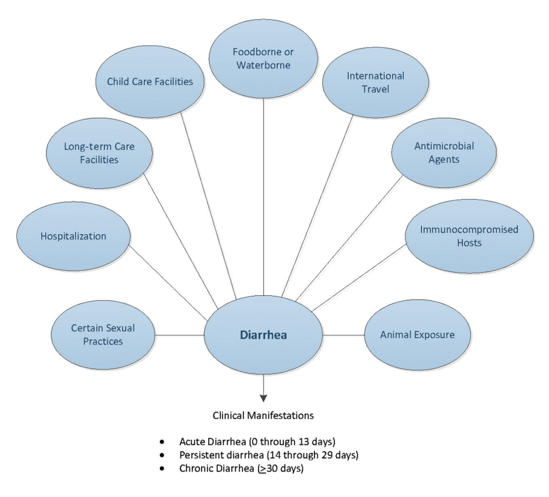
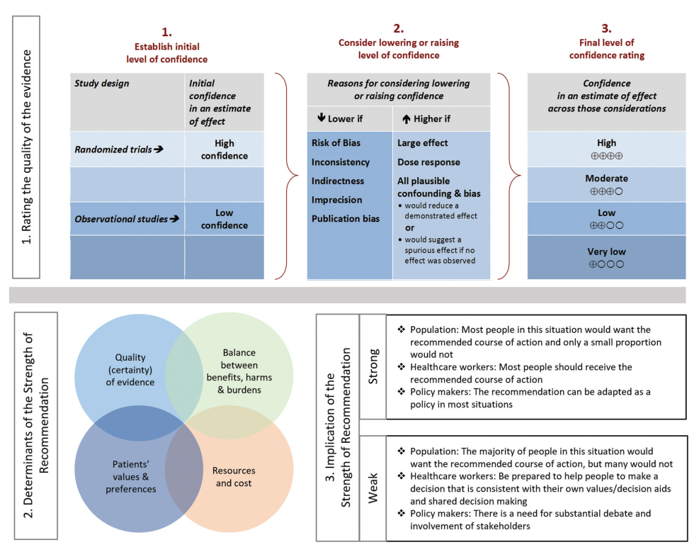

  

    

      
Reduced ORS

      
Lựa chọn đầu tay bù dịch đường uống độ thẩm thấu giảm ở mọi lứa tuổi

    

    

      
CẤM Kháng Sinh STEC

      
Tránh kích hoạt bacteriophage giải phóng Shiga toxin gây hội chứng HUS

    

    

      
CẤM Loperamide &lt; 18T

      
Chống chỉ định ở trẻ em, tiêu chảy phân máu hoặc có sốt cao

    

    

      
Khung Chuẩn GRADE

      
Phân cấp chất lượng bằng chứng và xác định mức độ khuyến cáo rõ ràng

    

  

  

    

      
💧

      

        
Bù Dịch &amp; Dinh Dưỡng Sớm (Rehydration First)

        
ORS độ thẩm thấu giảm là nền tảng cốt lõi cứu mạng; tiếp tục duy trì bú mẹ liên tục và tái lập chế độ ăn bình thường ngay sau khi bù đủ dịch, tránh kiêng khem quá mức.

      

    

    

      
🔬

      

        
Chẩn Đoán Vi Sinh Trúng Đích (Targeted Diagnostics)

        
Chỉ định cấy phân / NAAT cho tiêu chảy phân máu, sốt cao, nhiễm khuẩn huyết; bắt buộc sàng lọc STEC phân biệt O157:H7 và độc tố Shiga 1/2; nuôi cấy kiểm chứng để làm kháng sinh đồ.

      

    

    

      
🛡️

      

        
Cá Thể Hóa &amp; An Toàn Tuyệt Đối (Prudent Management)

        
Hạn chế lạm dụng kháng sinh kinh nghiệm; cấm kháng sinh khi nghi ngờ STEC để tránh HUS; cấm Loperamide ở trẻ nhỏ và tiêu chảy xâm lấn nhằm ngừa ứ đọng độc tố và phình đại tràng.

      

    

  

  

    <a href="#sec-phan-loai-dich-te" class="quickmenu-item active">1. Phân Loại &amp; Dịch Tễ</a>
    <a href="#sec-lam-sang-luu-do" class="quickmenu-item">2. Lâm Sàng &amp; Lưu Đồ (Fig 1)</a>
    <a href="#sec-chi-dinh-xet-nghiem" class="quickmenu-item">3. Chỉ Định Xét Nghiệm</a>
    <a href="#sec-bu-dich-dinh-duong" class="quickmenu-item">4. Liệu Pháp Bù Dịch</a>
    <a href="#sec-khang-sinh-stec" class="quickmenu-item">5. Kháng Sinh &amp; Cảnh Báo STEC</a>
    <a href="#sec-thuoc-ho-tro-du-phong-grade" class="quickmenu-item">6. Thuốc Hỗ Trợ &amp; GRADE (Fig 2)</a>
    <a href="#sec-trich-dan-y-van" class="quickmenu-item">7. Y Văn &amp; Tra Cứu</a>
  

  {/* SECTION 1 */}
  

    

      

        ⏱️
        <h2 class="sec-title">1. Phân Loại Thời Gian Tiêu Chảy &amp; Khai Thác Yếu Tố Dịch Tễ Phơi Nhiễm</h2>
      

      Epidemiology &amp; Exposure
    

    

      

        
💡

        

          Nguyên Tắc Tiếp Cận Ban Đầu: Đánh Giá Mất Nước &amp; Phân Nhóm Thời Gian
          Mọi bệnh nhân ở tất cả các lứa tuổi bị tiêu chảy cấp đều phải được <strong>đánh giá tình trạng mất nước (dehydration)</strong> đầu tiên, vì mất nước nặng là yếu tố hàng đầu gây tử vong ở trẻ nhỏ và người cao tuổi. Quá trình đánh giá bắt buộc phải phân loại dựa trên mốc thời gian:
          <ul style="margin-top: 0.5rem; margin-left: 1.25rem;">
            <li><strong>Tiêu chảy cấp tính (Acute Diarrhea):</strong> Triệu chứng kéo dài <strong>dưới 14 ngày</strong> (từ 0 đến 13 ngày).</li>
            <li><strong>Tiêu chảy kéo dài (Persistent Diarrhea):</strong> Triệu chứng kéo dài từ <strong>14 đến 29 ngày</strong>.</li>
            <li><strong>Tiêu chảy mạn tính (Chronic Diarrhea):</strong> Triệu chứng kéo dài từ <strong>30 ngày trở lên</strong>.</li>
          </ul>
        

      

      
Bảng 1: Các Phương Thức Lây Truyền Của Vi Sinh Vật Đường Ruột &amp; Hướng Dẫn Tham Chiếu (Table 1 IDSA 2017)

      

        <table class="data-table">
          <thead>
            <tr>
              <th style="width: 30%;">Phương Thức Lây Truyền / Bối Cảnh</th>
              <th style="width: 45%;">Tài Liệu Hướng Dẫn Tham Chiếu</th>
              <th style="width: 25%;">Cơ Quan Ban Hành</th>
            </tr>
          </thead>
          <tbody>
            <tr>
              <td><strong>Du lịch quốc tế (International travel)</strong></td>
              <td>• Expert Review of the Evidence Base for Prevention of Travelers' Diarrhea • Medical Considerations Before Travel / The Yellow Book</td>
              <td>DuPont et al / Freedman et al / CDC</td>
            </tr>
            <tr>
              <td><strong>Ký chủ suy giảm miễn dịch (Immunocompromised hosts)</strong></td>
              <td>• Guidelines for the Prevention and Treatment of Opportunistic Infections in HIV-Infected Adults, Adolescents &amp; Children</td>
              <td>CDC / NIH / HIVMA / IDSA</td>
            </tr>
            <tr>
              <td><strong>Lây truyền qua thực phẩm &amp; nguồn nước (Food &amp; Water)</strong></td>
              <td>• Surveillance for Foodborne Disease Outbreaks • Food Safety &amp; Healthy Water Guidelines</td>
              <td>CDC</td>
            </tr>
            <tr>
              <td><strong>Tiêu chảy do kháng sinh (<em>C. difficile</em>)</strong></td>
              <td>• Clinical Practice Guidelines for <em>Clostridium difficile</em> Infection in Adults and Children (Update)</td>
              <td>IDSA / SHEA</td>
            </tr>
            <tr>
              <td><strong>Cơ sở chăm sóc y tế (Healthcare-associated)</strong></td>
              <td>• Healthcare-Associated Infections Guidelines</td>
              <td>CDC</td>
            </tr>
            <tr>
              <td><strong>Nhà trẻ &amp; Cơ sở chăm sóc trẻ em (Child care)</strong></td>
              <td>• Caring for Our Children: Health &amp; Safety Standards • Managing Infectious Diseases in Child Care &amp; Schools</td>
              <td>AAP / APHA / NRC</td>
            </tr>
            <tr>
              <td><strong>Cơ sở chăm sóc dài hạn (Long-term care)</strong></td>
              <td>• Infection Prevention and Control in Long-term Care Facilities</td>
              <td>CDC / SHEA / APIC</td>
            </tr>
            <tr>
              <td><strong>Bệnh lây truyền từ động vật (Zoonoses)</strong></td>
              <td>• Animals in Public Settings / One Health Initiative</td>
              <td>CDC / Pickering / Rubin</td>
            </tr>
          </tbody>
        </table>
      

      
Bảng 2: Mối Liên Quan Sinh Lý Giữa Yếu Tố Phơi Nhiễm / Cơ Địa &amp; Tác Nhân Gây Bệnh (Table 2 IDSA 2017)

      

        <table class="data-table">
          <thead>
            <tr>
              <th style="width: 32%;">Hoàn Cảnh Phơi Nhiễm / Tình Trạng Cơ Địa</th>
              <th style="width: 68%;">Các Tác Nhân Gây Bệnh Đường Ruột Liên Quan Phổ Biến</th>
            </tr>
          </thead>
          <tbody>
            <tr>
              <td><strong>Khách sạn, tàu du lịch, nhà hàng, tiệc tập thể</strong></td>
              <td><em>Norovirus</em>, <em>Salmonella</em> không thương hàn, <em>Clostridium perfringens</em>, <em>Bacillus cereus</em>, <em>Staphylococcus aureus</em>, <em>Campylobacter</em> spp, ETEC, STEC, <em>Listeria</em>, <em>Shigella</em>, <em>Cyclospora cayetanensis</em>, <em>Cryptosporidium</em> spp.</td>
            </tr>
            <tr>
              <td><strong>Sữa tươi chưa tiệt trùng &amp; sản phẩm từ sữa</strong></td>
              <td><em>Salmonella</em>, <em>Campylobacter</em>, <em>Yersinia enterocolitica</em>, độc tố <em>S. aureus</em>, <em>Cryptosporidium</em>, STEC; ít gặp hơn: <em>Listeria</em>, <em>Brucella</em> (phô mai dê), <em>M. bovis</em>, <em>Coxiella burnetii</em>.</td>
            </tr>
            <tr>
              <td><strong>Thịt hoặc gia cầm chưa nấu chín kỹ</strong></td>
              <td>STEC (thịt bò tái), <em>C. perfringens</em> (thịt bò/gia cầm), <em>Salmonella</em> / <em>Campylobacter</em> (gia cầm), <em>Yersinia</em> (thịt lợn, lòng lợn), <em>Trichinella</em> (thịt thú rừng/thịt lợn).</td>
            </tr>
            <tr>
              <td><strong>Trái cây, rau mầm, rau sống, nước ép tươi</strong></td>
              <td>STEC, <em>Salmonella</em> không thương hàn, <em>Cyclospora</em>, <em>Cryptosporidium</em>, <em>Norovirus</em>, <em>Hepatitis A</em>, <em>Listeria monocytogenes</em>.</td>
            </tr>
            <tr>
              <td><strong>Trứng sống hoặc lòng đào</strong></td>
              <td><em>Salmonella enterica</em>, <em>Shigella</em> (trong salad trứng).</td>
            </tr>
            <tr>
              <td><strong>Hải sản có vỏ sống (hàu, sò, vẹm)</strong></td>
              <td>Các loài <em>Vibrio</em> (<em>V. vulnificus, V. parahaemolyticus</em>), <em>Norovirus</em>, <em>Hepatitis A</em>, <em>Plesiomonas</em>.</td>
            </tr>
            <tr>
              <td><strong>Bơi / Uống nước ngọt tự nhiên (sông, hồ)</strong></td>
              <td><em>Campylobacter</em>, <em>Cryptosporidium</em>, <em>Giardia lamblia</em>, <em>Shigella</em>, <em>Salmonella</em>, STEC, <em>Plesiomonas shigelloides</em>.</td>
            </tr>
            <tr>
              <td><strong>Hồ bơi công cộng xử lý Clo</strong></td>
              <td><em>Cryptosporidium</em> (u nang kháng clo rất cao khi nồng độ khử trùng không đạt chuẩn).</td>
            </tr>
            <tr>
              <td><strong>Bệnh viện, cơ sở điều dưỡng, nhà tù</strong></td>
              <td><em>Norovirus</em>, <em>Clostridioides difficile</em>, <em>Shigella</em>, <em>Cryptosporidium</em>, <em>Giardia</em>, STEC, <em>Rotavirus</em>.</td>
            </tr>
            <tr>
              <td><strong>Nhà trẻ / Mẫu giáo</strong></td>
              <td><em>Rotavirus</em>, <em>Cryptosporidium</em>, <em>Giardia</em>, <em>Shigella</em>, STEC.</td>
            </tr>
            <tr>
              <td><strong>Sử dụng kháng sinh gần đây</strong></td>
              <td><em>C. difficile</em>, <em>Salmonella</em> kháng đa thuốc.</td>
            </tr>
            <tr>
              <td><strong>Du lịch đến quốc gia nghèo tài nguyên</strong></td>
              <td>EAEC, ETEC, EIEC, <em>Shigella</em>, <em>Salmonella</em> Typhi / non-typhoidal, <em>Campylobacter</em>, <em>Vibrio cholerae</em>, <em>Entamoeba histolytica</em>, <em>Giardia</em>, <em>Cyclospora</em>, <em>Cryptosporidium</em>.</td>
            </tr>
            <tr>
              <td><strong>Tiếp xúc động vật nuôi bị tiêu chảy</strong></td>
              <td><em>Campylobacter</em>, <em>Yersinia</em>; Tiếp xúc bò sát/gia cầm non: <em>Salmonella</em>; Tham quan sở thú tương tác: STEC, <em>Cryptosporidium</em>.</td>
            </tr>
            <tr>
              <td><strong>Yếu tố tuổi tác</strong></td>
              <td>• 6–18 tháng: <em>Rotavirus</em>. • Sơ sinh &lt;3 tháng &amp; Người lớn &gt;50 tuổi có xơ vữa mạch: <em>Salmonella</em> không thương hàn. • 1–7 tuổi: <em>Shigella</em>. • Người trẻ tuổi: <em>Campylobacter</em>.</td>
            </tr>
            <tr>
              <td><strong>Suy giảm miễn dịch / Bệnh lý nền</strong></td>
              <td>• Ứ sắt (Hemochromatosis): <em>Y. enterocolitica</em>, <em>Salmonella</em>. • AIDS / Ức chế miễn dịch: <em>Cryptosporidium</em>, <em>Microsporidia</em>, <em>Cystoisospora</em>, <em>MAC</em>, <em>CMV</em>. • Quan hệ tình dục qua đường hậu môn: <em>Shigella</em>, <em>Salmonella</em>, <em>Campylobacter</em>, <em>E. histolytica</em>, <em>Giardia</em>.</td>
            </tr>
          </tbody>
        </table>
      

    

  

  {/* SECTION 2 */}
  

    

      

        🩺
        <h2 class="sec-title">2. Biểu Hiện Lâm Sàng Định Hướng &amp; Lưu Đồ Đánh Giá Toàn Diện (Figure 1)</h2>
      

      Clinical Presentations &amp; Algorithm
    

    

      
Bảng 3: Các Biểu Hiện Lâm Sàng Gợi Ý Căn Nguyên Gây Bệnh Tiêu Chảy Nhiễm Trùng (Table 3 IDSA 2017)

      

        <table class="data-table">
          <thead>
            <tr>
              <th style="width: 32%;">Hội Chứng Lâm Sàng Điển Hình</th>
              <th style="width: 68%;">Căn Nguyên Gợi Ý Phổ Biến &amp; Ý Nghĩa Lâm Sàng</th>
            </tr>
          </thead>
          <tbody>
            <tr>
              <td>Phân máu đại thể (Bloody stools)</td>
              <td><strong>STEC</strong>, <em>Shigella</em>, <em>Salmonella</em>, <em>Campylobacter</em>, <em>Entamoeba histolytica</em>, <em>Vibrio</em> không gây tả, <em>Yersinia</em>, <em>Plesiomonas</em>.</td>
            </tr>
            <tr>
              <td>Đau bụng dữ dội + Phân máu + KHÔNG sốt / sốt nhẹ</td>
              <td><strong>Shiga toxin-producing <em>E. coli</em> (STEC)</strong> điển hình (bệnh nhân thường không sốt lúc khởi phát), <em>Salmonella</em>, <em>Shigella</em>, <em>Campylobacter</em>, <em>Y. enterocolitica</em>.</td>
            </tr>
            <tr>
              <td>Đau hố chậu phải kéo dài + Sốt</td>
              <td><strong><em>Yersinia enterocolitica</em></strong> và <em>Y. pseudotuberculosis</em> (gây viêm hạch mạc treo kích thích đau giống hệt viêm ruột thừa cấp).</td>
            </tr>
            <tr>
              <td>Nôn mửa dữ dội, khởi phát nhanh &le; 24 giờ</td>
              <td>Ngộ độc độc tố ruột của <strong><em>Staphylococcus aureus</em></strong> hoặc <strong><em>Bacillus cereus</em></strong> (thể nôn, ủ bệnh ngắn 1–6 giờ sau ăn).</td>
            </tr>
            <tr>
              <td>Tiêu chảy kèm đau quặn bụng 1–2 ngày</td>
              <td>Ngộ độc độc tố của <strong><em>Clostridium perfringens</em></strong> hoặc <strong><em>Bacillus cereus</em></strong> (thể tiêu chảy, ủ bệnh 8–16 giờ).</td>
            </tr>
            <tr>
              <td>Nôn mửa + Tiêu chảy không máu &le; 2–3 ngày</td>
              <td><strong><em>Norovirus</em></strong> (nguyên nhân hàng đầu gây bùng phát dịch nôn mửa tiêu chảy mùa đông ở mọi lứa tuổi, ~40% có sốt nhẹ &lt;24h).</td>
            </tr>
            <tr>
              <td>Tiêu chảy kéo dài / mạn tính (&ge; 14 ngày)</td>
              <td>Ký sinh trùng đường ruột: <em>Cryptosporidium</em>, <em>Giardia lamblia</em>, <em>Cyclospora cayetanensis</em>, <em>Cystoisospora belli</em>, <em>Entamoeba histolytica</em>.</td>
            </tr>
            <tr>
              <td>Tiêu chảy nước mạn tính kéo dài hàng năm</td>
              <td>Tiêu chảy Brainerd (Brainerd diarrhea); Hội chứng ruột kích thích hậu nhiễm trùng (Postinfectious IBS).</td>
            </tr>
          </tbody>
        </table>
      

      
Figure 1: Lưu Đồ Tiếp Cận Đánh Giá Người Bệnh Tiêu Chảy Nhiễm Trùng (IDSA 2017)

      

        
        

          
Figure 1. Considerations when evaluating people with infectious diarrhea (IDSA 2017 Guidelines)

          Lưu đồ tiếp cận đa chiều kết hợp giữa: <strong>(1) Phân loại thời gian</strong> (Cấp &lt;14 ngày, Kéo dài 14–29 ngày, Mạn tính &ge;30 ngày) song hành cùng <strong>(2) 9 khía cạnh dịch tễ phơi nhiễm</strong> (Nhà trẻ, Điều dưỡng, Nhập viện, Nước/Thực phẩm, Du lịch, Kháng sinh, Ký chủ suy giảm miễn dịch, Quan hệ tình dục, Tiếp xúc động vật) và <strong>(3) Biểu hiện lâm sàng</strong> để đưa ra quyết định chỉ định cận lâm sàng chính xác.
        

      

      <FlowchartViewer 
        title="Lưu Đồ Tiếp Cận Lâm Sàng & Phân Tầng Xét Nghiệm Tiêu Chảy Nhiễm Trùng (IDSA 2017)"
        code={`flowchart TD
          START([Bệnh nhân Tiêu Chảy | start | badge: IDSA 2017])
          DURATION{Phân loại thời gian diễn tiến? | question}

          ACUTE[Tiêu chảy cấp tính < 14 ngày | action | subtitle: Thường do vi khuẩn hoặc virus]
          PERSIST[Tiêu chảy kéo dài 14 - 29 ngày | warning | subtitle: Nghi ngờ ký sinh trùng hoặc vi khuẩn dai dẳng]
          CHRONIC[Tiêu chảy mạn tính >= 30 ngày | action | subtitle: Tầm soát ký sinh trùng, IBD, celiac, Brainerd]

          SYM_CHK{Đánh giá biểu hiện lâm sàng & mức độ nặng | question}

          WATERY[Tiêu chảy toàn nước tự giới hạn | success | subtitle: Thường do Norovirus/Rotavirus/ETEC]
          WATERY_RX[Bù dịch Reduced ORS + Dinh dưỡng sớm | success | subtitle: KHÔNG CẦN XÉT NGHIỆM PHÂN THƯỜNG QUY]

          BLOODY[Tiêu chảy phân máu hoặc sốt cao | danger | badge: Cảnh báo | subtitle: STEC, Shigella, Salmonella, Campylobacter, C. diff]
          TEST_STOOL[Chỉ định xét nghiệm phân chuyên sâu | warning | subtitle: Cấy phân, Shiga toxin EIA, NAAT đa mồi, Độc tố C. diff]

          STEC_WARN{Kết quả Shiga toxin (+) hoặc nghi STEC? | question}
          NO_ABX[CHỐNG CHỈ ĐỊNH KHÁNG SINH TUYỆT ĐỐI 🚫 | danger | badge: Ngừa HUS | subtitle: Bù dịch tĩnh mạch tích cực, theo dõi sát tiểu cầu và chức năng thận]
          ABX_TARGET[Xem xét kháng sinh trúng đích theo kháng sinh đồ | action | subtitle: Azithromycin hoặc Ciprofloxacin (trừ khi nhiễm STEC)]

          START --> DURATION
          DURATION -->|< 14 ngày| ACUTE
          DURATION -->|14-29 ngày| PERSIST
          DURATION -->|>= 30 ngày| CHRONIC

          ACUTE --> SYM_CHK
          PERSIST ==> TEST_STOOL
          CHRONIC ==> TEST_STOOL

          SYM_CHK -->|Phân nước, không sốt, không máu| WATERY
          SYM_CHK ==>|Phân máu / Sốt >= 38.5 / Đau dữ dội| BLOODY

          WATERY --> WATERY_RX
          BLOODY ==> TEST_STOOL

          TEST_STOOL --> STEC_WARN
          STEC_WARN ==>|Shiga toxin (+)| NO_ABX
          STEC_WARN -->|Tác nhân khác (Shigella, Salmonella...)| ABX_TARGET
        `}
      />

    

  

  {/* SECTION 3 */}
  

    

      

        🔬
        <h2 class="sec-title">3. Chỉ Định Xét Nghiệm Phân, Cấy Máu, Panel Đa Mồi NAAT &amp; Thăm Dò Khác</h2>
      

      Laboratory &amp; Diagnostics
    

    

      

        

          

          
Chỉ Định Xét Nghiệm Phân (Stool Testing) 💩

          

            <ul class="clin-card-list">
              <li><strong>Không xét nghiệm thường quy:</strong> Không chỉ định cấy phân cho tiêu chảy cấp nước tự giới hạn ở người khỏe mạnh.</li>
              <li><strong>Chỉ định bắt buộc khi:</strong> Tiêu chảy kèm <strong>sốt</strong>, phân có <strong>máu hoặc chất nhầy</strong>, đau bụng dữ dội, dấu hiệu <strong>nhiễm khuẩn huyết (sepsis)</strong>, hoặc tiêu chảy kéo dài &ge; 14 ngày.</li>
              <li><strong>Panel tác nhân cơ bản:</strong> <em>Salmonella, Shigella, Campylobacter, Yersinia, C. difficile</em> và STEC.</li>
              <li><strong>Quy chuẩn STEC:</strong> Bắt buộc dùng phương pháp phát hiện Shiga toxin (hoặc gen độc tố), phân biệt chủng <strong>O157:H7</strong> (trên thạch Sorbitol-MacConkey) và định type <strong>Shiga toxin 1 vs Shiga toxin 2</strong> (độc lực cao hơn).</li>
              <li><strong>Mẫu bệnh phẩm:</strong> Ưu tiên mẫu phân lỏng thực sự; chỉ dùng tăm bông trực tràng khi không lấy được phân và chỉ cho xét nghiệm vi khuẩn (cấm dùng tăm bông cho virus, ký sinh trùng và độc tố <em>C. difficile</em>).</li>
            </ul>
          

        

        

          

          
Chỉ Định Cấy Máu (Blood Cultures) 🩸

          

            <ul class="clin-card-list">
              <li><strong>1. Trẻ nhỏ &lt; 3 tháng tuổi</strong> bị tiêu chảy cấp.</li>
              <li><strong>2. Dấu hiệu nhiễm khuẩn huyết (Septicemia)</strong> hoặc nghi ngờ sốt thương hàn / phó thương hàn (Enteric fever).</li>
              <li><strong>3. Biểu hiện nhiễm trùng hệ thống</strong> ngoài đường tiêu hóa.</li>
              <li><strong>4. Bệnh nhân suy giảm miễn dịch</strong> (AIDS, ung thư, ghép tạng, đang dùng ức chế miễn dịch).</li>
              <li><strong>5. Bệnh lý nền nguy cơ cao</strong> (như bệnh thiếu máu tán huyết bẩm sinh).</li>
              <li><strong>6. Sốt không rõ nguyên nhân</strong> sau khi du lịch đến vùng dịch tễ thương hàn.</li>
            </ul>
          

        

      

      

        

          

          

            
🧬

            
Panel Đa Mồi Khuếch Đại Axit Nucleic (NAAT)

          

          

            <ul style="margin-left: 1rem; line-height: 1.7;">
              <li><strong>Độ nhạy vượt trội:</strong> Phát hiện đồng thời hàng chục tác nhân virus, vi khuẩn, ký sinh trùng trong vài giờ.</li>
              <li><strong>Thận trọng phiên giải:</strong> NAAT phát hiện DNA/RNA chứ <strong>không chứng minh vi khuẩn còn sống hay đang hoạt động</strong>. Cần đối chiếu sát bệnh cảnh lâm sàng.</li>
              <li><strong>Bắt buộc nuôi cấy kiểm chứng:</strong> Các mẫu NAAT dương tính với vi khuẩn vẫn phải nuôi cấy lại để phục vụ <strong>kháng sinh đồ</strong> và giám sát dịch tễ học.</li>
            </ul>
          

          
Công Nghệ Phân Tử Hiện Đại

        

        

          

          

            
⚠️

            
Xét Nghiệm Không Vi Sinh &amp; Cảnh Báo

          

          

            <ul style="margin-left: 1rem; line-height: 1.7;">
              <li><strong>Bạch cầu phân &amp; Lactoferrin:</strong> <strong>KHÔNG khuyến cáo</strong> sử dụng thường quy vì không giúp phân biệt căn nguyên chính xác.</li>
              <li><strong>Công thức máu ngoại vi:</strong> Không dùng để xác định nguyên nhân tiêu chảy; nhưng <strong>bắt buộc theo dõi sát Hb, Tiểu cầu, Creatinine máu và mảnh vỡ hồng cầu (schistocytes)</strong> ở bệnh nhân nhiễm STEC để phát hiện sớm biến chứng HUS.</li>
              <li><strong>Nội soi đại trực tràng / Hút dịch tá tràng:</strong> Chỉ định chọn lọc khi nghi ngờ viêm đại tràng nặng, AIDS, hoặc cấy phân âm tính nhiều lần.</li>
            </ul>
          

          
Tránh Lạm Dụng Cận Lâm Sàng

        

      

    

  

  {/* SECTION 4 */}
  

    

      

        💧
        <h2 class="sec-title">4. Liệu Pháp Bù Dịch (Rehydration Therapy) &amp; Chế Độ Dinh Dưỡng Theo Lứa Tuổi</h2>
      

      Fluid Therapy &amp; Nutrition
    

    

      

        <table class="data-table">
          <thead>
            <tr>
              <th style="width: 25%;">Phương Thức Bù Dịch</th>
              <th style="width: 35%;">Chỉ Định Lâm Sàng</th>
              <th style="width: 40%;">Nguyên Tắc Sinh Lý Học &amp; Hướng Dẫn Thực Hành</th>
            </tr>
          </thead>
          <tbody>
            <tr>
              <td>Reduced Osmolarity ORS (Đường uống)</td>
              <td><strong>Lựa chọn hàng đầu</strong> cho mọi bệnh nhân mất nước từ nhẹ đến trung bình do bất kỳ căn nguyên nào.</td>
              <td>ORS độ thẩm thấu giảm (245 mOsm/L) tối ưu hóa đồng vận chuyển Na-Glucose qua niêm mạc ruột non mà không gây tiêu chảy thẩm thấu ngược như dung dịch ưu trương.</td>
            </tr>
            <tr>
              <td>ORS qua Ống thông dạ dày (Nasogastric Tube)</td>
              <td>Bệnh nhân mất nước trung bình nhưng <strong>nôn liên tục</strong> không uống được, hoặc trẻ quá yếu/từ chối uống nhưng tri giác còn tỉnh.</td>
              <td>Truyền nhỏ giọt ORS tốc độ chậm qua sonde dạ dày giúp hấp thu hiệu quả, hạn chế phải can thiệp đường truyền tĩnh mạch xâm lấn.</td>
            </tr>
            <tr>
              <td>Truyền Tĩnh Mạch Đẳng Trương (IV Fluids)</td>
              <td><strong>Mất nước nặng, sốc giảm thể tích</strong>, thay đổi ý thức, tắc ruột (ileus), hoặc thất bại hoàn toàn với bù dịch đường uống.</td>
              <td>Sử dụng dịch đẳng trương <strong>Lactated Ringer's</strong> hoặc <strong>NaCl 0.9%</strong>. Ở BN có toan ceton do nhịn đói (ketonemia), truyền dịch ban đầu giúp cải thiện toan hóa để tiếp tục dung nạp ORS. Ngừng IV chuyển sang ORS ngay khi sinh hiệu ổn định và bệnh nhân tỉnh táo.</td>
            </tr>
          </tbody>
        </table>
      

      

        
🍼

        

          Chế Độ Dinh Dưỡng Trong Đợt Tiêu Chảy Cấp
          <ul style="margin-top: 0.25rem; margin-left: 1.25rem;">
            <li><strong>Trẻ bú mẹ:</strong> Bắt buộc <strong>tiếp tục cho bú mẹ hoàn toàn và liên tục</strong> trong suốt đợt tiêu chảy. Không được ngừng bú mẹ để thay bằng dung dịch khác.</li>
            <li><strong>Trẻ ăn dặm &amp; Người lớn:</strong> Quay trở lại chế độ ăn thông thường phù hợp lứa tuổi ngay trong hoặc sau khi bù đủ dịch. <strong>Tuyệt đối tránh nhịn ăn hoặc kiêng khem nghiêm ngặt</strong> vì dinh dưỡng sớm thúc đẩy tế bào biểu mô ruột tái tạo và phục hồi chức năng hấp thu nhanh hơn.</li>
          </ul>
        

      

    

  

  {/* SECTION 5 */}
  

    

      

        💊
        <h2 class="sec-title">5. Kháng Sinh Kinh Nghiệm, Điều Trị Trúng Đích &amp; Cảnh Báo Tuyệt Đối STEC/HUS</h2>
      

      Antimicrobial Stewardship &amp; STEC Warning
    

    

      

        
🚫

        

          CẢNH BÁO ĐỎ: CHỐNG CHỈ ĐỊNH TUYỆT ĐỐI KHÁNG SINH TRONG NHIỄM STEC
          <strong>Tránh hoàn toàn việc sử dụng kháng sinh</strong> cho bệnh nhân nghi ngờ hoặc xác định nhiễm <strong>STEC O157</strong> hoặc các chủng STEC sinh độc tố Shiga 2.
            
          <strong>Cơ chế bệnh sinh kích hoạt Hội chứng Tán huyết Tăng Ure máu (HUS):</strong>
           Gen mã hóa độc tố Shiga nằm trên bộ gen của <em>bacteriophage</em> tích hợp trong vi khuẩn STEC. Khi tiếp xúc với kháng sinh (đặc biệt là Fluoroquinolones, Beta-lactams gây tổn thương DNA hoặc ức chế vách tế bào), phản ứng SOS của vi khuẩn được kích hoạt &rarr; bacteriophage chuyển sang chu kỳ sinh tan (lytic cycle) &rarr; nhân bản ồ ạt và giải phóng một lượng khổng lồ <strong>độc tố Shiga (Stx1, Stx2)</strong> vào lòng ruột và máu &rarr; Shiga toxin gắn vào thụ thể Gb3 trên tế bào nội mô mao mạch cầu thận &rarr; hoại tử nội mô, kết tập tiểu cầu vi mạch, thiếu máu tán huyết vi mạch, giảm tiểu cầu tiêu thụ và <strong>suy thận cấp đe dọa tính mạng (HUS)</strong>.
        

      

      
Nguyên Tắc Điều Trị Kháng Sinh Theo Kinh Nghiệm (Empiric Therapy)

      

        <table class="regimen-table">
          <thead>
            <tr>
              <th style="width: 25%;">Tình Huống Lâm Sàng</th>
              <th style="width: 40%;">Khuyến Cáo Kháng Sinh Kinh Nghiệm IDSA</th>
              <th style="width: 35%;">Phác Đồ &amp; Lưu Ý</th>
            </tr>
          </thead>
          <tbody>
            <tr>
              <td class="source-cell">
                Tiêu chảy phân máu thường quy
              </td>
              <td><strong>KHÔNG khuyến cáo dùng kháng sinh kinh nghiệm</strong> ở trẻ em và người lớn có miễn dịch bình thường trong khi chờ kết quả xét nghiệm vi sinh.</td>
              <td>Đa số tự giới hạn; tránh kích hoạt biến chứng HUS nếu căn nguyên là STEC.</td>
            </tr>
            <tr>
              <td class="source-cell">
                Ngoại Lệ 1: Trẻ sơ sinh &lt; 3 tháng tuổi
              </td>
              <td>Chỉ định kháng sinh kinh nghiệm sớm khi nghi ngờ căn nguyên vi khuẩn đường ruột xâm lấn.</td>
              <td><strong>Cephalosporin thế hệ 3 (Ceftriaxone IV)</strong> hoặc <strong>Azithromycin</strong>.</td>
            </tr>
            <tr>
              <td class="source-cell">
                Ngoại Lệ 2: Hội chứng Lỵ trực trùng nặng
              </td>
              <td>Sốt cao, đau quặn bụng, mót rặn, tiêu phân máu nhầy lượng ít nhiều lần nghi do <em>Shigella</em>.</td>
              <td>• Người lớn: <strong>Fluoroquinolone (Ciprofloxacin)</strong> hoặc <strong>Azithromycin</strong>. • Trẻ em: <strong>Azithromycin</strong> hoặc <strong>Ceftriaxone</strong>.</td>
            </tr>
            <tr>
              <td class="source-cell">
                Ngoại Lệ 3: Du lịch quốc tế kèm sốt &ge; 38.5°C
              </td>
              <td>Bệnh nhân du lịch trở về bị sốt cao kèm dấu hiệu nhiễm trùng huyết hoặc nhiễm trùng nặng.</td>
              <td><strong>Azithromycin</strong> (lựa chọn ưu tiên cho vùng Đông Nam Á có tỷ lệ kháng Quinolone cao của <em>Campylobacter</em>).</td>
            </tr>
            <tr>
              <td class="source-cell">
                Sốt Thương Hàn (Enteric Fever / Sepsis)
              </td>
              <td>Sốt cao kéo dài, lách to, độc thần kinh, nghi ngờ nhiễm khuẩn huyết do <em>S. Typhi / Paratyphi</em>.</td>
              <td>Cấy máu + Cấy phân ngay &rarr; Khởi trị ngay <strong>Kháng sinh phổ rộng đường tĩnh mạch</strong> (Ceftriaxone / Azithromycin / Carbapenem tùy dịch tễ) &rarr; Thu hẹp theo kháng sinh đồ.</td>
            </tr>
          </tbody>
        </table>
      

      
Quản Lý Người Lành Mang Trùng Không Triệu Chứng (Asymptomatic Carriers)

      

        

          

          
Nhóm Nguy Cơ Thấp ✅

          

            
Người không triệu chứng, vệ sinh cá nhân tốt, không tiếp xúc nhóm đối tượng nhạy cảm: <strong>KHÔNG CẦN điều trị kháng sinh</strong> (ngoại trừ người mang trùng <em>Salmonella enterica serovar Typhi</em> cần điều trị để tiệt căn mầm bệnh trong cộng đồng).

          

        

        

          

          
Nhóm Nguy Cơ Cao ⚠️

          

            
Nhân viên y tế, nhân viên nhà trẻ/mẫu giáo, người chăm sóc viện dưỡng lão, nhân viên chế biến thức ăn: <strong>Bắt buộc quản lý và cách ly / điều trị nghiêm ngặt</strong> theo quy định của cơ quan Y tế Dự phòng địa phương cho đến khi cấy phân âm tính.

          

        

      

    

  

  {/* SECTION 6 */}
  

    

      

        🛡️
        <h2 class="sec-title">6. Liệu Pháp Hỗ Trợ, Dự Phòng Vắc-Xin &amp; Phương Pháp Đánh Giá Chứng Cứ GRADE (Figure 2)</h2>
      

      Ancillary Drugs, Prevention &amp; GRADE
    

    

      
Các Thuốc Điều Trị Hỗ Trợ Triệu Chứng (Ancillary Management)

      

        <table class="data-table">
          <thead>
            <tr>
              <th style="width: 25%;">Thuốc / Liệu Pháp</th>
              <th style="width: 35%;">Chỉ Định &amp; Lưu Ý Lâm Sàng</th>
              <th style="width: 40%;">Chống Chỉ Định &amp; Cảnh Báo An Toàn</th>
            </tr>
          </thead>
          <tbody>
            <tr>
              <td>Thuốc giảm nhu động ruột (Loperamide)</td>
              <td>Chỉ cân nhắc ở <strong>người lớn có hệ miễn dịch bình thường</strong> bị tiêu chảy nước cấp tính mức độ nhẹ đến trung bình đã được bù đủ nước.</td>
              <td><strong>CHỐNG CHỈ ĐỊNH TUYỆT ĐỐI Ở TRẺ EM &lt; 18 TUỔI</strong> (nguy cơ liệt ruột, ức chế hô hấp thần kinh) và <strong>mọi lứa tuổi bị tiêu chảy phân máu hoặc có sốt cao</strong> (ngăn cản đào thải độc tố, tăng nguy cơ <strong>phình đại tràng nhiễm độc - toxic megacolon</strong>).</td>
            </tr>
            <tr>
              <td>Thuốc chống nôn (Ondansetron)</td>
              <td>Cân nhắc cho <strong>trẻ &gt; 4 tuổi và vị thành niên</strong> bị nôn ói nhiều để giúp dung nạp ORS đường uống, giảm tỷ lệ phải truyền dịch tĩnh mạch.</td>
              <td>Không dùng thường quy cho trẻ nhỏ &lt; 4 tuổi nếu không có chỉ định chuyên khoa.</td>
            </tr>
            <tr>
              <td>Bổ sung Kẽm (Zinc)</td>
              <td>Rút ngắn thời gian tiêu chảy ở trẻ em từ <strong>6 tháng đến 5 tuổi</strong> tại các vùng có nguy cơ thiếu kẽm cao hoặc trẻ có suy dinh dưỡng.</td>
              <td>Không khuyến cáo thường quy cho trẻ em có dinh dưỡng đầy đủ ở các nước phát triển.</td>
            </tr>
            <tr>
              <td>Chế phẩm Probiotics</td>
              <td>Có thể cân nhắc để giảm mức độ nặng và rút ngắn thời gian tiêu chảy ở người lớn và trẻ em có miễn dịch bình thường.</td>
              <td>Lựa chọn chủng vi sinh vật và liều lượng dựa trên bằng chứng lâm sàng RCTs đã được công bố.</td>
            </tr>
          </tbody>
        </table>
      

      
Biện Pháp Dự Phòng Y Tế Công Cộng &amp; Vắc-Xin

      

        

          

          

            
🧼

            
Vệ Sinh Tay &amp; An Toàn Thực Phẩm

          

          

            <ul style="margin-left: 1rem; line-height: 1.7;">
              <li><strong>Rửa tay bằng xà phòng và nước:</strong> Biện pháp phòng bệnh số 1 sau khi đi vệ sinh, thay tã, tiếp xúc thú nuôi và trước khi ăn.</li>
              <li><strong>Đặc thù <em>C. difficile</em>:</strong> Bắt buộc rửa tay bằng xà phòng và nước vì <strong>cồn không diệt được bào tử <em>C. diff</em></strong>.</li>
              <li><strong>An toàn thực phẩm:</strong> Ăn chín, uống sôi, tách biệt dụng cụ thực phẩm sống/chín.</li>
              <li><strong>Cách ly nguồn lây:</strong> Người đang tiêu chảy cấm bơi lội công cộng và cấm quan hệ tình dục.</li>
            </ul>
          

          
Kiểm Soát Nhiễm Khuẩn

        

        

          

          

            
💉

            
Chương Trình Vắc-Xin Phòng Bệnh

          

          

            <ul style="margin-left: 1rem; line-height: 1.7;">
              <li><strong>Vắc-xin Rotavirus:</strong> Tiêm phòng đầy đủ cho toàn bộ trẻ sơ sinh không có chống chỉ định.</li>
              <li><strong>Vắc-xin Thương hàn (Typhoid):</strong> Dạng uống hoặc tiêm cho người du lịch đến vùng dịch, nhân viên lab và người sống chung với người mang trùng <em>S. Typhi</em>.</li>
              <li><strong>Vắc-xin Tả (Cholera):</strong> Vắc-xin sống giảm độc lực dạng uống (1 liều duy nhất) cho người 18–64 tuổi du lịch vùng dịch tả.</li>
            </ul>
          

          
Miễn Dịch Chủ Động

        

      

      
Figure 2: Phương Pháp Đánh Giá Bằng Chứng &amp; Xây Dựng Khuyến Cáo GRADE (IDSA 2017)

      

        
        

          
Figure 2. Grading of Recommendations Assessment, Development and Evaluation (GRADE) approach (IDSA 2017 Guidelines)

          Quy trình 4 bước khoa học của phương pháp GRADE: <strong>(1) Thiết lập độ tin cậy ban đầu</strong> (RCT &rarr; Cao, Quan sát &rarr; Thấp) &rarr; <strong>(2) Cân nhắc hạ bậc</strong> (nguy cơ sai lệch, không nhất quán, gián tiếp, không chính xác, sai lệch xuất bản) hoặc <strong>tăng bậc</strong> (hiệu ứng lớn, liều-đáp ứng) &rarr; <strong>(3) Phân hạng chất lượng chứng cứ cuối cùng</strong> (High, Moderate, Low, Very Low) &rarr; <strong>(4) Quyết định mức độ khuyến cáo</strong> (Strong vs Weak) dựa trên cán cân lợi ích/tác hại, giá trị bệnh nhân và chi phí y tế.
        

      

    

  

  {/* SECTION 7 */}
  

    

      

        📚
        <h2 class="sec-title">7. Tài Liệu Tham Khảo Chuẩn AMA &amp; Bảng Viết Tắt Y Khoa</h2>
      

      References &amp; Glossary
    

    

      

        <strong>Tài liệu gốc (AMA Citation):</strong>
         Shane AL, Mody RK, Crump JA, Tarr PI, Steiner TS, Kotloff K, Langley JM, Wanke C, Warren CA, Cheng AC, Cantey J, Pickering LK. <em>2017 Infectious Diseases Society of America Clinical Practice Guidelines for the Diagnosis and Management of Infectious Diarrhea</em>. <strong>Clinical Infectious Diseases</strong>. 2017;65(12):1963-1973. doi:10.1093/cid/cix959.
      

      
Bảng Viết Tắt Y Khoa Chuẩn (Glossary)

      

        <table class="data-table">
          <thead>
            <tr>
              <th style="width: 20%;">Viết Tắt</th>
              <th style="width: 40%;">Thuật Ngữ Tiếng Anh</th>
              <th style="width: 40%;">Ý Nghĩa Lâm Sàng</th>
            </tr>
          </thead>
          <tbody>
            <tr>
              <td><strong>AAD</strong></td>
              <td>Antibiotic-Associated Diarrhea</td>
              <td>Tiêu chảy do kháng sinh</td>
            </tr>
            <tr>
              <td><strong>CDI</strong></td>
              <td><em>Clostridioides difficile</em> Infection</td>
              <td>Nhiễm trùng đại tràng do <em>C. difficile</em></td>
            </tr>
            <tr>
              <td><strong>EAEC / ETEC / EIEC</strong></td>
              <td>Enteroaggregative / Enterotoxigenic / Enteroinvasive <em>E. coli</em></td>
              <td>Các nhóm <em>E. coli</em> gây bệnh đường ruột</td>
            </tr>
            <tr>
              <td><strong>GRADE</strong></td>
              <td>Grading of Recommendations Assessment, Development and Evaluation</td>
              <td>Hệ thống phân cấp đánh giá chất lượng chứng cứ và khuyến cáo</td>
            </tr>
            <tr>
              <td><strong>HUS</strong></td>
              <td>Hemolytic Uremic Syndrome</td>
              <td>Hội chứng tán huyết tăng ure máu</td>
            </tr>
            <tr>
              <td><strong>IDSA</strong></td>
              <td>Infectious Diseases Society of America</td>
              <td>Hiệp hội Bệnh truyền nhiễm Hoa Kỳ</td>
            </tr>
            <tr>
              <td><strong>NAAT</strong></td>
              <td>Nucleic Acid Amplification Test</td>
              <td>Xét nghiệm khuếch đại axit nucleic (PCR / RT-PCR)</td>
            </tr>
            <tr>
              <td><strong>NNT</strong></td>
              <td>Number Needed to Treat</td>
              <td>Số bệnh nhân cần điều trị để ngừa 1 biến cố</td>
            </tr>
            <tr>
              <td><strong>ORS</strong></td>
              <td>Oral Rehydration Salts / Solution</td>
              <td>Dung dịch bù nước và điện giải đường uống</td>
            </tr>
            <tr>
              <td><strong>STEC</strong></td>
              <td>Shiga Toxin-producing <em>Escherichia coli</em></td>
              <td>Vi khuẩn <em>E. coli</em> sinh độc tố Shiga</td>
            </tr>
            <tr>
              <td><strong>Stx1 / Stx2</strong></td>
              <td>Shiga Toxin 1 / Shiga Toxin 2</td>
              <td>Các type ngoại độc tố Shiga</td>
            </tr>
            <tr>
              <td><strong>WBC</strong></td>
              <td>White Blood Cell</td>
              <td>Bạch cầu máu / phân</td>
            </tr>
          </tbody>
        </table>
      

    

  

{/* BOTTOM NAVIGATION */}

  

    <a href="#/ebm/kho-guidelines" class="btn btn-primary" style="text-decoration: none;">
      <i class="fa-solid fa-arrow-left"></i> Quay lại Kho Guidelines
    </a>
    <a href="#sec-phan-loai-dich-te" class="btn" style="text-decoration: none;">
      <i class="fa-solid fa-arrow-up"></i> Lên đầu trang
    </a>
  

