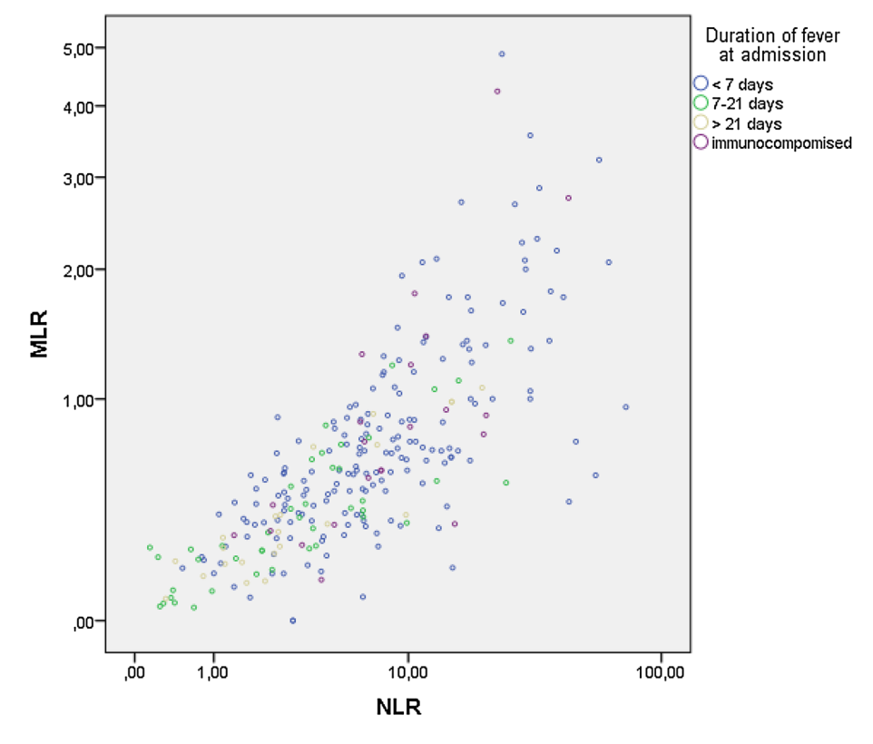
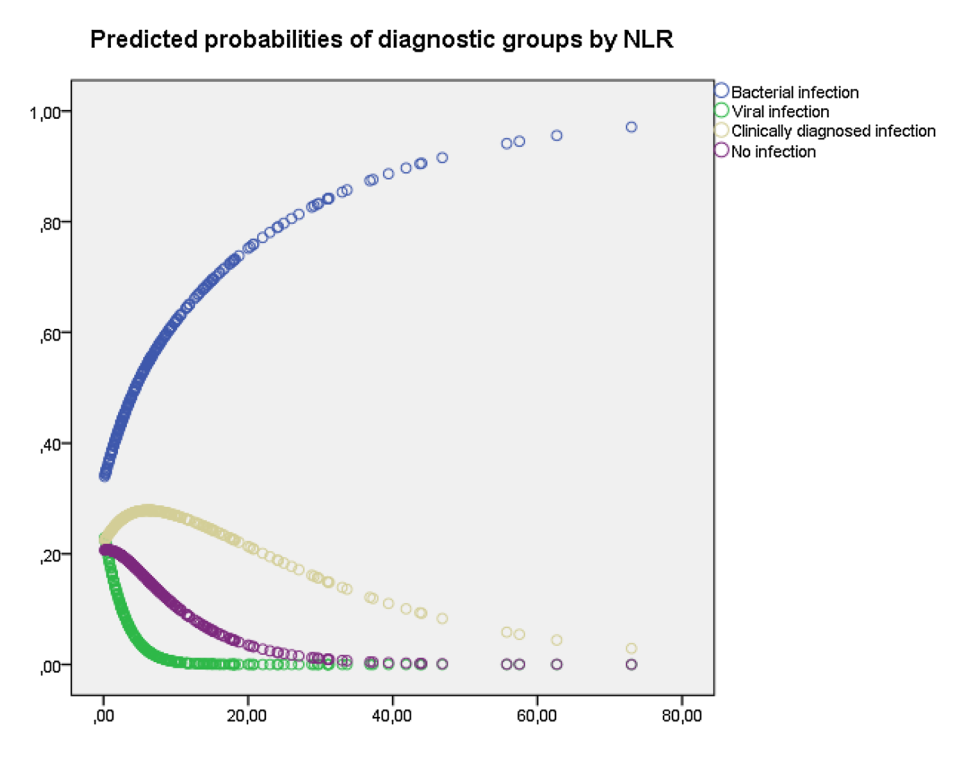
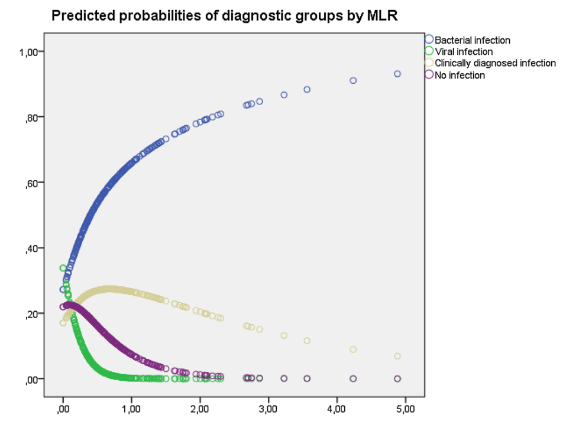
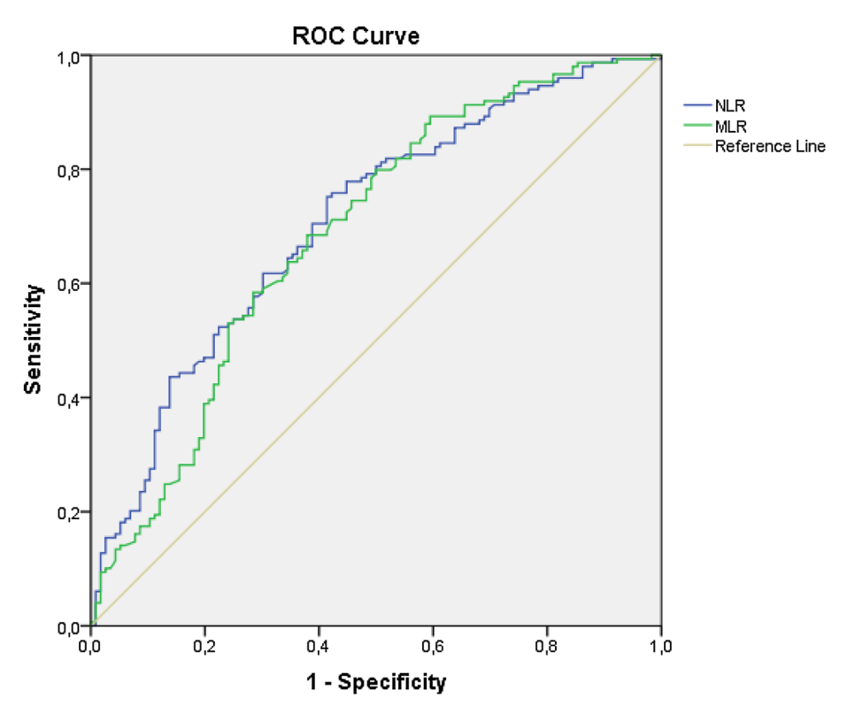

  <i class="fa-solid fa-magnifying-glass-chart"></i> Prospective Cohort Follow-up
  <i class="fa-solid fa-newspaper"></i> Infection 2017 (Springer)
  <i class="fa-solid fa-flask-vial"></i> NLR &amp; MLR Hematologic Biomarkers
  <i class="fa-solid fa-triangle-exclamation"></i> Septicemia Early Indicator

<section class="stats-strip theme-trial">
  

    

      
15.69 vs 8.42

      
NLR Septicemia tăng vọt so với nhiễm khuẩn khác (p = 0.006)

    

    

      
p = 0.559 &amp; 0.615

      
WBC &amp; CRP hoàn toàn thất bại không phân biệt được Septicemia

    

    

      
0.708 &amp; 0.688

      
AUC của NLR &amp; MLR trong chẩn đoán xác định nhiễm vi khuẩn

    

    

      
NLR = 33 → 85%

      
Xác suất mắc nhiễm khuẩn tăng mạnh theo mô hình hồi quy đa thức

    

  

</section>

  

    

      
⚡

      

        
Khắc Phục Điểm Mù Của WBC &amp; CRP

        
Ở bệnh nhân sốt &lt; 7 ngày, tổng bạch cầu và CRP không phân biệt được nhiễm trùng huyết nặng với nhiễm khuẩn thông thường, trong khi NLR phân định chính xác nhờ hiện tượng giảm lympho bào máu cấp tính.

      

    

    

      
🎯

      

        
Phân Tách Vi Khuẩn vs Vi Rút Tức Thì

        
Nhiễm vi khuẩn làm tăng cao NLR (trung vị 7.94) và MLR (0.70), trong khi nhiễm vi rút ức chế tỷ số này xuống mức rất thấp (NLR 0.63, MLR 0.14), hỗ trợ giảm thiểu lạm dụng kháng sinh không cần thiết.

      

    

    

      
📈

      

        
Cửa Sổ Vàng Thời Gian Sốt &lt; 7 Ngày

        
NLR và MLR phản ánh trung thực nhất đáp ứng viêm cấp tính trong 7 ngày đầu khởi phát sốt; sau 7 ngày các tỷ số này suy giảm tự nhiên do tái phân bố tế bào miễn dịch.

      

    

  

  

    <a href="#sec-tongquan" class="quickmenu-item active">1. Tổng Quan &amp; PICO</a>
    <a href="#sec-sinhly-benhsinh" class="quickmenu-item">2. Cơ Sở Sinh Lý</a>
    <a href="#sec-diem-nghen" class="quickmenu-item">3. Điểm Nghẽn Lâm Sàng</a>
    <a href="#sec-thietke-mau" class="quickmenu-item">4. Thiết Kế Mẫu</a>
    <a href="#sec-so-sanh-nlr-mlr" class="quickmenu-item">5. So Sánh Bệnh Lý (Table 1)</a>
    <a href="#sec-tuong-quan-fig1" class="quickmenu-item">6. Tương Quan (Figure 1)</a>
    <a href="#sec-thoi-gian-sot" class="quickmenu-item">7. Thời Gian Sốt (Table 2)</a>
    <a href="#sec-septicemia-table3" class="quickmenu-item">8. Nhiễm Trùng Huyết (Table 3)</a>
    <a href="#sec-hoi-quy-nlr" class="quickmenu-item">9. Hồi Quy NLR (Table 4)</a>
    <a href="#sec-hoi-quy-mlr" class="quickmenu-item">10. Hồi Quy MLR (Table 5)</a>
    <a href="#sec-xac-suat-fig23" class="quickmenu-item">11. Xác Suất (Figures 2 &amp; 3)</a>
    <a href="#sec-roc-fig4" class="quickmenu-item">12. Đường Cong ROC (Figure 4)</a>
    <a href="#sec-doi-chieu-gurol" class="quickmenu-item">13. Đối Chiếu Y Văn</a>
    <a href="#sec-luodo-thuat-toan" class="quickmenu-item">14. Thuật Toán Xử Trí</a>
    <a href="#sec-rob-appraisal" class="quickmenu-item">15. Thẩm Định Sai Lệch</a>
    <a href="#sec-phan-quyet-pearls" class="quickmenu-item">16. Phán Quyết &amp; Y Văn</a>
  

  <!-- ==================== PHÂN MỤC 1 ==================== -->
  

    

      📑
      <h2 class="sec-title">1. Thông Tin Nghiên Cứu, Tóm Tắt Một Câu &amp; Khung Thiết Kế PICO</h2>
    

    

      
      

        
<i class="fa-solid fa-bolt"></i> Tóm Tắt Một Câu Cốt Lõi:

        
Ở bệnh nhân người lớn nhập viện vì sốt chưa rõ nguyên nhân, tỷ lệ bạch cầu trung tính/lympho (NLR) và monocyte/lympho (MLR) từ công thức máu cơ bản là <strong>công cụ chẩn đoán phân biệt nhanh chóng, chi phí bằng không</strong> giữa nhiễm vi khuẩn và nhiễm vi rút/phi nhiễm trùng; đồng thời <strong>vượt trội hơn hẳn tổng bạch cầu (WBC) và CRP trong phát hiện nhiễm trùng huyết (septicemia)</strong> ở giai đoạn sốt dưới 7 ngày.

      

      

        
<strong>Tạp chí / Xuất bản:</strong> Infection (Springer) 2017; 45(3): 299–307

        
<strong>DOI:</strong> <a href="https://doi.org/10.1007/s15010-016-0972-1" target="_blank" rel="noopener noreferrer">10.1007/s15010-016-0972-1</a>

        
<strong>Tác giả:</strong> Stig S. Nilssen, R. Mo, Geir Egil Eide, Arne Naess, Halvor Sjursen

        
<strong>Đơn vị thực hiện:</strong> Bệnh viện Đại học Haukeland &amp; Đại học Bergen, Na Uy

        
<strong>Thiết kế nghiên cứu:</strong> Nghiên cứu quan sát thuần tập theo dõi tiến cứu đến khi có chẩn đoán xác định (n = 299)

        
<strong>Hệ thống phân tích máu:</strong> Abbott Cell-Dyn 4000 &amp; Siemens Advia 120

      

      <h3 style="margin-top: 1.5rem; font-size: 1.05rem; color: var(--color-primary);">
        <i class="fa-solid fa-flask-vial"></i> Khung Thiết Kế Nghiên Cứu Theo Chuẩn PICO Bento Grid
      </h3>
      

        

          <i class="fa-solid fa-user-group"></i> Population (Quần thể nghiên cứu)
          
299 bệnh nhân người lớn (≥ 18 tuổi) nhập viện vì sốt nhưng chưa có chẩn đoán xác định nguyên nhân tại Bệnh viện Đại học Haukeland (loại trừ bệnh nhân bạch cầu cấp).

        

        

          <i class="fa-solid fa-syringe"></i> Intervention / Index Test (Chỉ số đánh giá)
          
Chỉ số tỷ lệ bạch cầu trung tính/lympho (NLR) và monocyte/lympho (MLR) được tính toán tự động từ công thức máu toàn phần (CBC) lúc nhập viện.

        

        

          <i class="fa-solid fa-vial"></i> Comparison (So sánh / Tiêu chuẩn đối chiếu)
          
So sánh với các chỉ số truyền thống: Tổng số bạch cầu (WBC), số lượng trung tính tuyệt đối, CRP; đối chiếu giữa các nhóm nguyên nhân (Vi khuẩn, Vi rút, Nhiễm trùng lâm sàng, Phi nhiễm trùng).

        

        

          <i class="fa-solid fa-trophy"></i> Outcomes (Kết cục đánh giá)
          
Độ chính xác chẩn đoán nhiễm khuẩn (AUROC), mô hình hồi quy đa thức dự báo xác suất, khả năng nhận diện nhiễm trùng huyết (septicemia) và tương tác với thời gian sốt.

        

      

    

  

  <!-- ==================== PHÂN MỤC 2 ==================== -->
  

    

      🔬
      <h2 class="sec-title">2. Cơ Sở Sinh Lý &amp; Miễn Dịch Học Đáp Ứng Tế Bào Máu Trong Sốt</h2>
    

    

      
      
Mối liên quan kinh điển giữa nhiễm vi khuẩn với tình trạng <strong>tăng bạch cầu trung tính (neutrophil leukocytosis)</strong> và giữa nhiễm vi rút với tình trạng <strong>tăng lympho bào (lymphocytosis)</strong> đã được xác lập từ lâu trong y học lâm sàng. Tuy nhiên, việc chỉ nhìn vào số lượng tuyệt đối từng dòng tế bào đơn lẻ thường bỏ sót sự mất cân bằng động học giữa hai nhánh miễn dịch bẩm sinh và thích ứng.

      

        

          
<i class="fa-solid fa-bacteria"></i> Đáp Ứng Trong Nhiễm Vi Khuẩn Cấp Tính

          
Khi vi khuẩn xâm nhập hệ thống, các cytokine tiền viêm (IL-1β, TNF-α, IL-6, G-CSF) kích hoạt tủy xương phóng thích ồ ạt bạch cầu trung tính ra máu ngoại vi và kéo dài thời gian sống của chúng bằng cách ức chế apoptosis. Đồng thời, phản ứng viêm hệ thống gây ra hiện tượng <strong>chết theo chương trình (apoptosis) cấp tính của lympho bào T và B</strong> kết hợp với sự dịch chuyển ồ ạt lympho bào từ máu vào các hạch lympho và mô viêm. Hậu quả kép này đẩy chỉ số <strong>NLR tăng vọt</strong>.

        

        

          
<i class="fa-solid fa-virus"></i> Đáp Ứng Trong Nhiễm Vi Rút

          
Trái ngược với vi khuẩn, vi rút kích hoạt chủ yếu thụ thể TLR nội bào và kích thích sản sinh interferon type I (IFN-α/β) cùng IL-15. Quá trình này thúc đẩy sự tăng sinh mạnh mẽ của tế bào lympho T gây độc (CD8+ CTL) và tế bào NK, đồng thời gây ức chế tủy xương nhẹ hoặc làm giảm trung tính tạm thời. Kết quả là <strong>chỉ số NLR và MLR sụt giảm sâu xuống dưới ngưỡng bình thường</strong>.

        

      

      

        
<i class="fa-solid fa-triangle-exclamation"></i> Cơ Chế Đột Phá Trong Nhiễm Trùng Huyết (Septicemia)

        
Ở bệnh nhân nhiễm trùng huyết, hiện tượng suy giảm miễn dịch sớm đặc trưng bởi <strong>tình trạng suy kiệt và sụt giảm số lượng lympho bào lưu hành cực độ (median sụt giảm xuống còn 0.7 × 10⁹/L)</strong>. Trong khi đó, số lượng bạch cầu trung tính tuyệt đối có thể dao động rất rộng (tăng, bình thường, hoặc thậm chí giảm do kiệt quệ tủy). Tỷ lệ NLR chính là "kính hiển vi toán học" phóng đại sự tương phản này, biến nó thành dấu ấn cảnh báo nhạy bén nhất.

      

    

  

  <!-- ==================== PHÂN MỤC 3 ==================== -->
  

    

      ⚠️
      <h2 class="sec-title">3. Bối Cảnh Y Học &amp; Ma Trận Điểm Nghẽn Lâm Sàng (Pain Points Matrix)</h2>
    

    

      
      
Khi tiếp nhận bệnh nhân sốt nhập viện cấp cứu mà chưa rõ ổ nhiễm trùng, bác sĩ lâm sàng thường đối diện với áp lực lớn trong việc quyết định có nên sử dụng kháng sinh phổ rộng ngay lập tức hay không:

      

        <table class="data-table">
          <thead>
            <tr>
              <th style="min-width: 160px;">Điểm Nghẽn Lâm Sàng</th>
              <th>Biểu Hiện Thực Tế</th>
              <th>Cơ Chế Bệnh Sinh / Giải Thích</th>
              <th>Khắc Phục Bởi NLR &amp; MLR</th>
            </tr>
          </thead>
          <tbody>
            <tr>
              <td><strong>CRP tăng chậm trong 24–48h đầu</strong></td>
              <td>Bệnh nhân sốt ngày 1–2 có CRP còn thấp hoặc chỉ tăng nhẹ dù ổ nhiễm khuẩn huyết đã khởi phát.</td>
              <td>CRP do gan tổng hợp dưới kích thích của IL-6, cần 24–48 giờ mới đạt đỉnh nồng độ trong máu.</td>
              <td>NLR thay đổi ngay trong vòng vài giờ do huy động bạch cầu từ kho dự trữ biên tủy xương.</td>
            </tr>
            <tr>
              <td><strong>WBC và Neutrophil không phân biệt được Sepsis</strong></td>
              <td>Số lượng bạch cầu ở bệnh nhân nhiễm khuẩn huyết (11.4 × 10⁹/L) không khác biệt so với viêm mô tế bào hay viêm đường tiết niệu dưới (13.1 × 10⁹/L).</td>
              <td>Tủy xương có thể bị ức chế hoặc trung tính bị dồn vào nội mạc mạch máu tổn thương làm số lượng tuyệt đối không tăng.</td>
              <td>NLR tăng vọt lên median 15.69 do số lượng lympho bào giảm sâu độc lập (p = 0.006).</td>
            </tr>
            <tr>
              <td><strong>Lạm dụng kháng sinh cho sốt do vi rút</strong></td>
              <td>Bệnh nhân sốt cao, rét run, đau đầu dễ bị chỉ định kháng sinh kinh nghiệm dù nguyên nhân là vi rút (EBV, CMV, Adenovirus).</td>
              <td>Triệu chứng lâm sàng giai đoạn sớm của nhiễm vi rút và vi khuẩn chồng lấp nặng nề.</td>
              <td>NLR &lt; 1.0 và MLR &lt; 0.20 có độ đặc hiệu rất cao định hướng căn nguyên vi rút, giúp tự tin trì hoãn kháng sinh.</td>
            </tr>
            <tr>
              <td><strong>Chẩn đoán nhầm bệnh tự miễn / ung thư</strong></td>
              <td>Bệnh nhân Lupus, viêm khớp dạng thấp, lymphoma sốt kéo dài có CRP tăng rất cao gây nhầm lẫn nhiễm khuẩn.</td>
              <td>Phản ứng viêm mạn tính và tự kháng thể kích thích tế bào gan sản sinh protein pha cấp.</td>
              <td>NLR ở nhóm không nhiễm trùng chỉ tăng nhẹ (median 3.78 vs 7.94 của vi khuẩn), hỗ trợ loại trừ nhiễm khuẩn cấp.</td>
            </tr>
          </tbody>
        </table>
      

    

  

  <!-- ==================== PHÂN MỤC 4 ==================== -->
  

    

      🧪
      <h2 class="sec-title">4. Thiết Kế Mẫu, Thu Thập Dữ Liệu &amp; Phương Pháp Thống Kê</h2>
    

    

      
      <h4>Cơ Cấu Quần Thể Bệnh Nhân Nghiên Cứu (N = 299)</h4>
      
Nghiên cứu thu thập liên tiếp các bệnh nhân nhập viện tại khoa Truyền nhiễm, Bệnh viện Đại học Haukeland vì lý do sốt nhưng chưa có chẩn đoán xác định căn nguyên tại thời điểm nhập viện. Chẩn đoán cuối cùng được xác lập sau quá trình theo dõi lâm sàng, cận lâm sàng toàn diện:

      

        

          <h5 style="color: var(--color-danger); margin-bottom: 0.5rem;"><i class="fa-solid fa-bacteria"></i> Nhóm Nhiễm Khuẩn Xác Nhận (n = 150)</h5>
          <ul style="margin: 0; padding-left: 1.25rem; font-size: 0.9rem;">
            <li>Viêm phổi (Pneumonia): <strong>69 ca</strong></li>
            <li>Nhiễm trùng đường tiết niệu (UTI): <strong>30 ca</strong></li>
            <li>Nhiễm trùng huyết (Septicemia - Cấy máu dương tính): <strong>27 ca</strong></li>
            <li>Nhiễm khuẩn khác (Viêm mô tế bào, áp xe, v.v.): <strong>24 ca</strong></li>
            <li><em>Tiêu chuẩn:</em> Có bằng chứng vi sinh, huyết thanh hoặc hình ảnh học rõ ràng.</li>
          </ul>
        

        

          <h5 style="color: var(--color-primary); margin-bottom: 0.5rem;"><i class="fa-solid fa-virus"></i> Các Nhóm Chẩn Đoán Khác (n = 149)</h5>
          <ul style="margin: 0; padding-left: 1.25rem; font-size: 0.9rem;">
            <li><strong>Nhiễm vi rút xác nhận (n = 14):</strong> Trong đó 9 ca tăng bạch cầu đơn nhân nhiễm trùng (Infectious Mononucleosis).</li>
            <li><strong>Nhiễm trùng chẩn đoán lâm sàng (n = 66):</strong> Biểu hiện điển hình nhưng không bắt được vi sinh/hình ảnh.</li>
            <li><strong>Không nhiễm trùng (n = 29):</strong> 8 ca bệnh tự miễn, 5 ca ung thư/ác tính.</li>
            <li><strong>Không xác định nguyên nhân:</strong> 12 ca.</li>
            <li><strong>Bệnh nhân suy giảm miễn dịch (ghép tạng / HIV):</strong> 26 ca.</li>
          </ul>
        

      

      <h4>Phương Pháp Đo Lường &amp; Xử Lý Thống Kê</h4>
      <ul>
        <li><strong>Thiết bị đo công thức máu:</strong> Hệ thống tự động Cell-Dyn 4000 (Abbott Diagnostics) và Advia 120 (Siemens Healthcare Diagnostics).</li>
        <li><strong>Xử lý đa cộng tuyến (Multicollinearity):</strong> Do NLR và MLR có mối tương quan rất mạnh với nhau (Pearson R = 0.63, Spearman rho = 0.78, p &lt; 0.001), khi đưa đồng thời vào mô hình hồi quy đa biến sẽ triệt tiêu ý nghĩa thống kê của nhau. Vì vậy, nhóm tác giả xây dựng <strong>hai mô hình hồi quy đa thức độc lập riêng biệt cho NLR và MLR</strong>.</li>
        <li><strong>Mô hình hồi quy đa thức (Multinomial Logistic Regression):</strong> Đánh giá khả năng phân loại đồng thời 4 nhóm bệnh lý (Nhiễm khuẩn, Vi rút, Nhiễm trùng lâm sàng so với nhóm Không nhiễm trùng làm tham chiếu), hiệu chỉnh theo tuổi, giới, nhiệt độ, thời gian sốt, WBC và CRP.</li>
        <li><strong>Đánh giá tương tác:</strong> Kiểm định tương tác nhân giữa chỉ số NLR/MLR với phân nhóm thời gian sốt trước nhập viện (&lt; 7 ngày vs 7–21 ngày).</li>
      </ul>

    

  

  <!-- ==================== PHÂN MỤC 5 ==================== -->
  

    

      📊
      <h2 class="sec-title">5. So Sánh NLR &amp; MLR Giữa Các Nhóm Bệnh Lý (Table 1)</h2>
    

    

      
      
Bảng 1 đối chiếu phân bố trị số NLR và MLR trên 266 bệnh nhân sốt nhập viện thuộc 4 nhóm chẩn đoán chính (lấy nhóm không nhiễm trùng làm nhóm tham chiếu đối chứng):

      

        <table class="data-table">
          <thead>
            <tr>
              <th>Nhóm Chẩn Đoán</th>
              <th>Số Ca (n)</th>
              <th>NLR (Mean ± SE)</th>
              <th>NLR Median (Q1 – Q3)</th>
              <th>MLR (Mean ± SE)</th>
              <th>MLR Median (Q1 – Q3)</th>
              <th>Giá Trị p (vs Ref)</th>
            </tr>
          </thead>
          <tbody>
            <tr style="background: rgba(220, 38, 38, 0.06);">
              <td><strong>Nhiễm Vi Khuẩn (Bacterial)</strong></td>
              <td>150</td>
              <td>12.23 ± 0.98</td>
              <td><strong>7.94</strong> (4.47 – 15.02)</td>
              <td>0.89 ± 0.06</td>
              <td><strong>0.70</strong> (0.43 – 1.03)</td>
              <td>p &lt; 0.001 (cả NLR &amp; MLR)</td>
            </tr>
            <tr style="background: rgba(2, 132, 199, 0.06);">
              <td><strong>Nhiễm Vi Rút (Viral)</strong></td>
              <td>14</td>
              <td>2.41 ± 0.75</td>
              <td><strong>0.63</strong> (0.31 – 3.98)</td>
              <td>0.25 ± 0.09</td>
              <td><strong>0.14</strong> (0.05 – 0.30)</td>
              <td>p = 0.010 (NLR) p = 0.005 (MLR)</td>
            </tr>
            <tr>
              <td><strong>Nhiễm Trùng Lâm Sàng (Clinical)</strong></td>
              <td>66</td>
              <td>7.87 ± 1.33</td>
              <td><strong>4.27</strong> (2.45 – 8.60)</td>
              <td>0.71 ± 0.08</td>
              <td><strong>0.52</strong> (0.31 – 0.90)</td>
              <td>p = 0.313 (NLR) p = 0.017 (MLR)</td>
            </tr>
            <tr style="background: rgba(100, 116, 139, 0.08);">
              <td><strong>Không Nhiễm Trùng (Reference)</strong></td>
              <td>36</td>
              <td>5.02 ± 0.67</td>
              <td><strong>3.78</strong> (2.00 – 7.07)</td>
              <td>0.46 ± 0.06</td>
              <td><strong>0.35</strong> (0.20 – 0.60)</td>
              <td><em>Nhóm tham chiếu</em></td>
            </tr>
          </tbody>
        </table>
      

      

        <i class="fa-solid fa-lightbulb"></i> <strong>Nhận xét cốt lõi từ Table 1:</strong>
        Chỉ số NLR ở nhóm nhiễm khuẩn (7.94) cao gấp hơn 2 lần so với nhóm không nhiễm trùng (3.78) và gấp hơn 12 lần so với nhóm nhiễm vi rút (0.63). Đặc biệt, ở nhóm vi rút, giá trị MLR sụt giảm cực sâu xuống mức 0.14. Đây là cơ sở then chốt để phân tách vi rút và vi khuẩn ngay tại phòng cấp cứu.
      

    

  

  <!-- ==================== PHÂN MỤC 6 ==================== -->
  

    

      📈
      <h2 class="sec-title">6. Mối Tương Quan NLR - MLR &amp; Biểu Đồ Phân Tán (Figure 1)</h2>
    

    

      
      
Phân tích tương quan chứng minh mối đồng thuận sinh học mật thiết giữa hai tỷ số tế bào máu:

      <ul>
        <li><strong>Hệ số tương quan tuyến tính Pearson:</strong> R = 0.63 (p &lt; 0.001).</li>
        <li><strong>Hệ số tương quan hạng Spearman:</strong> rho = 0.78 (p &lt; 0.001).</li>
      </ul>

      

        
        

          <strong>Figure 1.</strong> Biểu đồ phân tán trên thang log10 thể hiện tương quan chặt chẽ giữa MLR và NLR trên 265 bệnh nhân sốt nhập viện chưa rõ nguyên nhân. Các điểm biểu diễn được phân loại theo thời gian sốt (&lt; 7 ngày, 7–21 ngày, &gt; 21 ngày và suy giảm miễn dịch).
        

      

      
Đồ thị phân tán khẳng định cả hai chỉ số đều tịnh tiến đồng thời: Khi NLR tăng thì MLR cũng gia tăng tương ứng. Tuy nhiên, ở các bệnh nhân sốt dưới 7 ngày, các điểm dữ liệu tập trung dày đặc ở góc phần tư trên bên phải (cả NLR và MLR đều cao vượt trội), trong khi nhóm sốt kéo dài có xu hướng dịch chuyển dần về vùng trung gian.

    

  

  <!-- ==================== PHÂN MỤC 7 ==================== -->
  

    

      ⏱️
      <h2 class="sec-title">7. Tác Động Của Thời Gian Sốt &amp; Cửa Sổ Vàng &lt; 7 Ngày (Table 2)</h2>
    

    

      
      
Thời gian sốt trước khi nhập viện là một biến số can thiệp quan trọng làm thay đổi động học bạch cầu máu ngoại vi. Bảng 2 phân tích 131 bệnh nhân sốt do nhiễm vi khuẩn được chia theo thời gian khởi phát:

      

        <table class="data-table">
          <thead>
            <tr>
              <th>Chỉ Số Đánh Giá</th>
              <th>Sốt Dưới 7 Ngày (&lt; 7 days, n = 110)</th>
              <th>Sốt Kéo Dài 7–21 Ngày (7–21 days, n = 21)</th>
              <th>Mức Độ Chênh Lệch</th>
              <th>Giá Trị p</th>
            </tr>
          </thead>
          <tbody>
            <tr>
              <td><strong>NLR (Mean ± SE)</strong></td>
              <td>13.29 ± 1.23</td>
              <td>7.21 ± 1.63</td>
              <td>Giảm gần 50% ở nhóm sốt muộn</td>
              <td rowspan="2">p = 0.005</td>
            </tr>
            <tr>
              <td><strong>NLR Median (Q1 – Q3)</strong></td>
              <td><strong>8.43</strong> (4.72 – 15.69)</td>
              <td><strong>4.33</strong> (2.73 – 8.87)</td>
              <td>Chênh lệch 4.10 đơn vị</td>
            </tr>
            <tr>
              <td><strong>MLR (Mean ± SE)</strong></td>
              <td>0.97 ± 0.07</td>
              <td>0.51 ± 0.08</td>
              <td>Giảm gần 50%</td>
              <td rowspan="2">p = 0.001</td>
            </tr>
            <tr>
              <td><strong>MLR Median (Q1 – Q3)</strong></td>
              <td><strong>0.71</strong> (0.45 – 1.09)</td>
              <td><strong>0.41</strong> (0.28 – 0.69)</td>
              <td>Chênh lệch 0.30 đơn vị</td>
            </tr>
          </tbody>
        </table>
      

      

        
<i class="fa-solid fa-hourglass-half"></i> Ý Nghĩa Lâm Sàng Của Cửa Sổ &lt; 7 Ngày

        
Phản ứng bùng nổ trung tính và giảm lympho bào máu mạnh mẽ nhất trong giai đoạn cấp tính (&lt; 7 ngày). Khi sốt kéo dài qua tuần thứ hai (7–21 ngày), cơ thể dần thích nghi hoặc chuyển sang giai đoạn bán cấp, tủy xương giảm phóng thích trung tính và lympho bào tái tạo một phần, khiến giá trị NLR và MLR suy giảm tự nhiên dù nhiễm khuẩn vẫn còn tồn tại.

      

    

  

  <!-- ==================== PHÂN MỤC 8 ==================== -->
  

    

      🩸
      <h2 class="sec-title">8. Khả Năng Nhận Diện Nhiễm Trùng Huyết Vượt Trội (Table 3)</h2>
    

    

      
      
Đây là phát hiện <strong>quan trọng nhất và có giá trị thực chiến lâm sàng cao nhất</strong> của công trình nghiên cứu: Khi đối đầu trực tiếp giữa bệnh nhân nhiễm trùng huyết (septicemia, n = 18) và các dạng nhiễm khuẩn khác gộp lại (pneumonia n=50, viêm đài bể thận n=7, viêm bàng quang n=15, nhiễm khuẩn khác n=19; tổng n = 109) ở nhóm sốt dưới 7 ngày:

      

        <table class="data-table">
          <thead>
            <tr>
              <th>Thông Số Cận Lâm Sàng</th>
              <th>Nhiễm Trùng Huyết (Septicemia, n = 18)</th>
              <th>Nhiễm Khuẩn Khác Gộp (Others, n = 109)</th>
              <th>Giá Trị p</th>
              <th>Kết Luận Lâm Sàng</th>
            </tr>
          </thead>
          <tbody>
            <tr style="background: rgba(16, 185, 129, 0.08);">
              <td><strong>NLR Median (Mean ± SE)</strong></td>
              <td><strong>15.69</strong> (23.17 ± 5.04)</td>
              <td><strong>8.42</strong> (13.24 ± 1.25)</td>
              <td>p = 0.006</td>
              <td>Tăng gấp đôi ở Septicemia (Ý nghĩa rất cao)</td>
            </tr>
            <tr>
              <td><strong>MLR Median (Mean ± SE)</strong></td>
              <td><strong>1.21</strong> (1.40 ± 0.22)</td>
              <td><strong>0.71</strong> (0.91 ± 0.07)</td>
              <td>p = 0.073</td>
              <td>Xu hướng tăng ở Septicemia</td>
            </tr>
            <tr style="background: rgba(220, 38, 38, 0.08);">
              <td><strong>Tổng Bạch Cầu (WBC, ×10⁹/L)</strong></td>
              <td><strong>11.4</strong> (13.1 ± 1.3)</td>
              <td><strong>13.1</strong> (14.2 ± 0.5)</td>
              <td>p = 0.559</td>
              <td>Hoàn toàn thất bại - Không phân biệt được</td>
            </tr>
            <tr style="background: rgba(220, 38, 38, 0.08);">
              <td><strong>Bạch Cầu Trung Tính (Neutrophils, ×10⁹/L)</strong></td>
              <td><strong>10.3</strong> (11.5 ± 1.3)</td>
              <td><strong>10.5</strong> (11.9 ± 0.5)</td>
              <td>p = 0.677</td>
              <td>Hoàn toàn thất bại - Không phân biệt được</td>
            </tr>
            <tr style="background: rgba(16, 185, 129, 0.08);">
              <td><strong>Bạch Cầu Lympho (Lymphocytes, ×10⁹/L)</strong></td>
              <td><strong>0.7</strong> (0.8 ± 0.1)</td>
              <td><strong>1.3</strong> (1.4 ± 0.1)</td>
              <td>p &lt; 0.001</td>
              <td>Giảm sâu có ý nghĩa quyết định</td>
            </tr>
            <tr>
              <td><strong>Bạch Cầu Monocyte (Monocytes, ×10⁹/L)</strong></td>
              <td><strong>0.7</strong> (0.9 ± 0.1)</td>
              <td><strong>1.0</strong> (1.0 ± 0.0)</td>
              <td>p = 0.078</td>
              <td>Xu hướng giảm nhẹ ở Septicemia</td>
            </tr>
            <tr style="background: rgba(220, 38, 38, 0.08);">
              <td><strong>C-Reactive Protein (CRP, mg/L)</strong></td>
              <td><strong>125.5</strong> (151.7 ± 25.0)</td>
              <td><strong>135.0</strong> (144.1 ± 9.6)</td>
              <td>p = 0.615</td>
              <td>Hoàn toàn thất bại - Trùng lắp nồng độ</td>
            </tr>
          </tbody>
        </table>
      

      

        
<i class="fa-solid fa-circle-exclamation"></i> Giải Phẫu Thất Bại Của WBC &amp; CRP

        
Bảng 3 chỉ ra một sự thật lâm sàng đáng kinh ngạc: Bệnh nhân nhiễm khuẩn huyết nặng có mức CRP trung vị là <strong>125.5 mg/L</strong>, thậm chí còn thấp hơn mức trung vị <strong>135.0 mg/L</strong> của các bệnh nhân nhiễm khuẩn khu trú khác (p = 0.615). Tương tự, tổng số bạch cầu trung vị là <strong>11.4 vs 13.1 × 10⁹/L</strong> (p = 0.559). Nếu bác sĩ chỉ nhìn vào số lượng bạch cầu và nồng độ CRP, họ sẽ <strong>không thể nào nhận diện được bệnh nhân nào đang rơi vào nhiễm khuẩn huyết</strong>. Trong khi đó, chỉ số NLR đã chỉ điểm chính xác với mức tăng gần gấp đôi (15.69 vs 8.42) nhờ hiện tượng sụt giảm lympho bào máu nghiêm trọng (0.7 vs 1.3 × 10⁹/L).

      

    

  

  <!-- ==================== PHÂN MỤC 9 ==================== -->
  

    

      🔢
      <h2 class="sec-title">9. Mô Hình Hồi Quy Đa Thức Đa Biến Của NLR (Table 4)</h2>
    

    

      
      
Mô hình hồi quy đa thức đa biến trên 265 bệnh nhân sốt nhập viện (sau khi loại trừ 34 bệnh nhân thiếu dữ liệu), đánh giá tác động độc lập của NLR lên các nhóm chẩn đoán cuối cùng, lấy nhóm không nhiễm trùng làm tham chiếu:

      

        <table class="data-table">
          <thead>
            <tr>
              <th>Biến Số Hiệu Chỉnh</th>
              <th>Nhiễm Vi Khuẩn (OR, 95% CI)</th>
              <th>Nhiễm Vi Rút (OR, 95% CI)</th>
              <th>Chẩn Đoán Lâm Sàng (OR, 95% CI)</th>
              <th>LR Test p-value</th>
            </tr>
          </thead>
          <tbody>
            <tr>
              <td><strong>Tuổi (mỗi 10 năm)</strong></td>
              <td>1.15 (0.94 – 1.41)</td>
              <td>0.92 (0.60 – 1.41)</td>
              <td>1.00 (0.80 – 1.23)</td>
              <td>p = 0.194</td>
            </tr>
            <tr>
              <td><strong>Giới tính Nữ (vs Nam)</strong></td>
              <td>1.74 (0.69 – 4.35)</td>
              <td>1.24 (0.22 – 6.86)</td>
              <td>1.06 (0.41 – 2.74)</td>
              <td>p = 0.436</td>
            </tr>
            <tr>
              <td><strong>Thời gian sốt 7–21 ngày (vs &lt;7d)</strong></td>
              <td>0.79 (0.17 – 3.67)</td>
              <td>0.31 (0.01 – 8.89)</td>
              <td>1.05 (0.22 – 5.09)</td>
              <td rowspan="2">p = 0.020</td>
            </tr>
            <tr>
              <td><strong>Thời gian sốt &gt;21 ngày (vs &lt;7d)</strong></td>
              <td>0.15 (0.02 – 1.06)</td>
              <td>0.00 (0.00 – 0.00)</td>
              <td>0.24 (0.04 – 1.63)</td>
            </tr>
            <tr style="background: rgba(16, 185, 129, 0.06);">
              <td><strong>Nhiệt độ cơ thể (mỗi 1°C)</strong></td>
              <td><strong>1.99</strong> (1.27 – 3.10)</td>
              <td>2.35 (0.98 – 5.63)</td>
              <td>1.69 (1.06 – 2.69)</td>
              <td>p = 0.001</td>
            </tr>
            <tr style="background: rgba(16, 185, 129, 0.06);">
              <td><strong>Tổng số WBC (mỗi 1 ×10⁹/L)</strong></td>
              <td><strong>1.08</strong> (0.98 – 1.20)</td>
              <td>1.03 (0.86 – 1.23)</td>
              <td>0.98 (0.88 – 1.09)</td>
              <td>p = 0.015</td>
            </tr>
            <tr style="background: rgba(16, 185, 129, 0.06);">
              <td><strong>Nhóm CRP &gt; 100 mg/L (vs 0–10)</strong></td>
              <td><strong>4.92</strong> (1.09 – 22.24)</td>
              <td>0.89 (0.06 – 13.91)</td>
              <td>1.39 (0.28 – 6.89)</td>
              <td rowspan="2">p = 0.001</td>
            </tr>
            <tr>
              <td><strong>Nhóm CRP 11–100 mg/L (vs 0–10)</strong></td>
              <td>1.52 (0.38 – 5.97)</td>
              <td>1.06 (0.12 – 9.07)</td>
              <td>1.07 (0.26 – 4.41)</td>
            </tr>
            <tr style="background: rgba(2, 132, 199, 0.08);">
              <td><strong>NLR × Sốt &lt; 7 ngày</strong></td>
              <td><strong>1.02</strong> (0.93 – 1.11)</td>
              <td>0.68 (0.42 – 1.11)</td>
              <td>0.99 (0.90 – 1.09)</td>
              <td rowspan="3">Interaction p = 0.005 Overall p &lt; 0.001</td>
            </tr>
            <tr>
              <td><strong>NLR × Sốt 7–21 ngày</strong></td>
              <td>0.98 (0.79 – 1.21)</td>
              <td>0.48 (0.13 – 1.76)</td>
              <td>0.96 (0.76 – 1.21)</td>
            </tr>
            <tr>
              <td><strong>NLR × Sốt &gt; 21 ngày</strong></td>
              <td>1.12 (0.84 – 1.50)</td>
              <td>0.00 (0.00 – 0.00)</td>
              <td>1.09 (0.81 – 1.48)</td>
            </tr>
          </tbody>
        </table>
      

    

  

  <!-- ==================== PHÂN MỤC 10 ==================== -->
  

    

      🧮
      <h2 class="sec-title">10. Mô Hình Hồi Quy Đa Thức Đa Biến Của MLR (Table 5)</h2>
    

    

      
      
Mô hình hồi quy đa thức đa biến trên 264 bệnh nhân đánh giá giá trị độc lập của tỷ lệ Monocyte/Lympho (MLR):

      

        <table class="data-table">
          <thead>
            <tr>
              <th>Biến Số Hiệu Chỉnh</th>
              <th>Nhiễm Vi Khuẩn (OR, 95% CI)</th>
              <th>Nhiễm Vi Rút (OR, 95% CI)</th>
              <th>Chẩn Đoán Lâm Sàng (OR, 95% CI)</th>
              <th>LR Test p-value</th>
            </tr>
          </thead>
          <tbody>
            <tr>
              <td><strong>Tuổi (mỗi 10 năm)</strong></td>
              <td>1.17 (0.96 – 1.44)</td>
              <td>1.03 (0.63 – 1.66)</td>
              <td>1.01 (0.82 – 1.25)</td>
              <td>p = 0.190</td>
            </tr>
            <tr>
              <td><strong>Giới tính Nữ (vs Nam)</strong></td>
              <td>1.79 (0.70 – 4.54)</td>
              <td>0.49 (0.08 – 3.12)</td>
              <td>1.02 (0.38 – 2.70)</td>
              <td>p = 0.223</td>
            </tr>
            <tr style="background: rgba(16, 185, 129, 0.06);">
              <td><strong>Nhiệt độ cơ thể (mỗi 1°C)</strong></td>
              <td><strong>1.94</strong> (1.23 – 3.06)</td>
              <td><strong>4.61</strong> (1.76 – 12.04)</td>
              <td>1.69 (1.05 – 2.72)</td>
              <td>p = 0.002</td>
            </tr>
            <tr style="background: rgba(16, 185, 129, 0.06);">
              <td><strong>Tổng số WBC (mỗi 1 ×10⁹/L)</strong></td>
              <td><strong>1.08</strong> (0.99 – 1.17)</td>
              <td>1.00 (0.83 – 1.20)</td>
              <td>0.97 (0.89 – 1.07)</td>
              <td>p = 0.003</td>
            </tr>
            <tr style="background: rgba(16, 185, 129, 0.06);">
              <td><strong>Nhóm CRP &gt; 100 mg/L (vs 0–10)</strong></td>
              <td><strong>4.35</strong> (0.92 – 20.54)</td>
              <td>0.93 (0.05 – 15.86)</td>
              <td>1.25 (0.24 – 6.43)</td>
              <td rowspan="2">p = 0.001</td>
            </tr>
            <tr>
              <td><strong>Nhóm CRP 11–100 mg/L (vs 0–10)</strong></td>
              <td>1.45 (0.37 – 5.74)</td>
              <td>1.68 (0.19 – 14.93)</td>
              <td>1.03 (0.25 – 4.29)</td>
            </tr>
            <tr style="background: rgba(2, 132, 199, 0.08);">
              <td><strong>MLR × Sốt &lt; 7 ngày</strong></td>
              <td>0.41 (0.03 – 6.14)</td>
              <td><strong>0.00</strong> (0.00 – 0.34)</td>
              <td>0.67 (0.04 – 10.97)</td>
              <td rowspan="2">Interaction p = 0.001 Overall p &lt; 0.001</td>
            </tr>
            <tr>
              <td><strong>MLR × Suy giảm miễn dịch</strong></td>
              <td>1.08 (0.13 – 8.87)</td>
              <td>0.00 (0.00 – 0.00)</td>
              <td>1.20 (0.13 – 10.87)</td>
            </tr>
          </tbody>
        </table>
      

    

  

  <!-- ==================== PHÂN MỤC 11 ==================== -->
  

    

      📉
      <h2 class="sec-title">11. Đồ Thị Dự Báo Xác Suất Lâm Sàng (Figures 2 &amp; 3)</h2>
    

    

      
      
Từ mô hình hồi quy đa thức, nhóm tác giả đã xây dựng đồ thị đường cong xác suất dự báo chẩn đoán nguyên nhân sốt cho từng bệnh nhân dựa trên trị số NLR và MLR:

      

        

          
          

            <strong>Figure 2.</strong> Đường cong xác suất dự báo theo chỉ số NLR. Đường cong nhiễm vi khuẩn tăng vọt theo NLR, trong khi đường vi rút tiệm cận 0.
          

        

        

          
          

            <strong>Figure 3.</strong> Đường cong xác suất dự báo theo chỉ số MLR, thể hiện hình thái tương đồng cao với mô hình NLR.
          

        

      

      <h4>Các Mốc Xác Suất Định Lượng Dùng Trong Thực Hành</h4>
      

        <table class="data-table">
          <thead>
            <tr>
              <th>Chỉ Số Đo Được</th>
              <th>Xác Suất Nhiễm Vi Khuẩn</th>
              <th>Xác Suất Nhiễm Vi Rút</th>
              <th>Xác Suất Không Nhiễm Trùng</th>
              <th>Hành Động Lâm Sàng Gợi Ý</th>
            </tr>
          </thead>
          <tbody>
            <tr style="background: rgba(2, 132, 199, 0.06);">
              <td><strong>NLR &lt; 1.0 (hoặc MLR &lt; 0.20)</strong></td>
              <td>&lt; 5%</td>
              <td><strong>&gt; 75%</strong></td>
              <td>15% – 20%</td>
              <td>Tự tin trì hoãn kháng sinh; xét nghiệm huyết thanh / PCR vi rút.</td>
            </tr>
            <tr>
              <td><strong>NLR = 9 (hoặc MLR = 1.0)</strong></td>
              <td><strong>60%</strong> (0.60)</td>
              <td><strong>1%</strong> (0.01)</td>
              <td>39%</td>
              <td>Định hướng cao nhiễm khuẩn; tìm ổ nhiễm trùng và cân nhắc kháng sinh.</td>
            </tr>
            <tr style="background: rgba(220, 38, 38, 0.06);">
              <td><strong>NLR = 33 (hoặc MLR = 2.0)</strong></td>
              <td><strong>85%</strong> (0.85)</td>
              <td><strong>&lt; 1%</strong> (&lt; 0.01)</td>
              <td>14%</td>
              <td>Nguy cơ nhiễm khuẩn cực cao; khởi động kháng sinh khẩn cấp.</td>
            </tr>
            <tr style="background: rgba(220, 38, 38, 0.12);">
              <td><strong>NLR &gt; 15.0 ở sốt &lt; 7 ngày</strong></td>
              <td><strong>&gt; 90%</strong></td>
              <td>~ 0%</td>
              <td>~ 5%</td>
              <td><strong>Báo động đỏ Nhiễm trùng huyết</strong>; cấy máu và kháng sinh trong 1 giờ.</td>
            </tr>
          </tbody>
        </table>
      

    

  

  <!-- ==================== PHÂN MỤC 12 ==================== -->
  

    

      🎯
      <h2 class="sec-title">12. Phân Tích Đường Cong ROC &amp; Diện Tích AUC (Figure 4)</h2>
    

    

      
      
Đường cong ROC (Receiver Operating Characteristic) đánh giá khả năng phân biệt nhiễm vi khuẩn trên 265 bệnh nhân sốt nhập viện chưa có chẩn đoán nguyên nhân ban đầu:

      

        
        

          <strong>Figure 4.</strong> Đường cong ROC chẩn đoán nhiễm vi khuẩn của NLR và MLR trên 265 bệnh nhân sốt nhập viện chưa rõ nguyên nhân.
        

      

      

        

          
AUC (NLR) = 0.708

          

            Khoảng tin cậy 95%: 0.640 – 0.776. Thể hiện năng lực chẩn đoán phân biệt tốt đối với căn nguyên vi khuẩn từ công thức máu đơn giản.
          

        

        

          
AUC (MLR) = 0.688

          

            Khoảng tin cậy 95%: 0.619 – 0.757. Năng lực phân biệt tương đương với NLR nhưng bổ trợ thêm thông tin về động học monocyte.
          

        

      

    

  

  <!-- ==================== PHÂN MỤC 13 ==================== -->
  

    

      ⚖️
      <h2 class="sec-title">13. Đối Chiếu Nghiên Cứu Quốc Tế &amp; Ngưỡng Cắt Gürol et al.</h2>
    

    

      
      
Nhóm tác giả Nilssen et al. đã tiến hành đối chiếu kết quả của mình với các công trình nghiên cứu nổi tiếng trên thế giới về dấu ấn tế bào máu:

      <h4>1. Hệ Thống Ngưỡng Cắt Chuẩn Hóa Của Gürol et al. (2015)</h4>
      
Nghiên cứu của Gürol và cộng sự trên 1.468 bệnh nhân nghi ngờ nhiễm trùng huyết sử dụng Procalcitonin làm mốc tham chiếu đã đề xuất bảng phân tầng ngưỡng cắt NLR rất tương thích với nghiên cứu này:

      

        <table class="data-table">
          <thead>
            <tr>
              <th>Khoảng Ngưỡng Cắt NLR</th>
              <th>Mức Độ Bệnh Lý (Gürol et al.)</th>
              <th>Độ Tương Thích Với Nilssen et al. 2017</th>
              <th>Ý Nghĩa Quyết Định</th>
            </tr>
          </thead>
          <tbody>
            <tr>
              <td><strong>NLR &lt; 5.0</strong></td>
              <td>Bình thường hoặc Vi rút / Không nhiễm trùng</td>
              <td>Hoàn toàn tương đồng (Nhóm vi rút median 0.63, Không nhiễm trùng median 3.78)</td>
              <td>Không có chỉ định dùng kháng sinh khẩn.</td>
            </tr>
            <tr>
              <td><strong>NLR 5.0 – 10.0</strong></td>
              <td>Nhiễm trùng cục bộ (Local infection)</td>
              <td>Trùng khớp với nhóm nhiễm khuẩn chung (NLR median 7.94; viêm phổi, UTI cục bộ)</td>
              <td>Đánh giá ổ nhiễm, cấy bệnh phẩm tại chỗ, kháng sinh uống/tiêm thường quy.</td>
            </tr>
            <tr>
              <td><strong>NLR 10.0 – 13.0</strong></td>
              <td>Nhiễm trùng hệ thống (Systemic infection)</td>
              <td>Vùng chuyển tiếp của đáp ứng viêm toàn thân</td>
              <td>Cảnh báo nguy cơ xâm nhập mạch máu; chỉ định nhập viện.</td>
            </tr>
            <tr style="background: rgba(220, 38, 38, 0.08);">
              <td><strong>NLR 13.0 – 15.0</strong></td>
              <td>Nhiễm trùng huyết (Septicemia)</td>
              <td rowspan="2"><strong>Trùng khớp hoàn hảo:</strong> NLR median của Septicemia trong nghiên cứu này đạt <strong>15.69</strong></td>
              <td>Cấy máu tối thiểu 2 bộ; bắt đầu kháng sinh tĩnh mạch ngay.</td>
            </tr>
            <tr style="background: rgba(220, 38, 38, 0.12);">
              <td><strong>NLR ≥ 15.0</strong></td>
              <td>Sốc nhiễm trùng (Septic shock)</td>
              <td>Báo động đỏ ICU; kích hoạt gói hồi sức Sepsis Hour-1 Bundle.</td>
            </tr>
          </tbody>
        </table>
      

      <h4>2. Đối Chiếu Với Các Nghiên Cứu Khác</h4>
      <ul>
        <li><strong>Lowsby et al. (2015):</strong> Khẳng định tại khoa Cấp cứu, NLR vượt trội hơn hẳn các dấu ấn cổ điển (WBC, Neutrophils, CRP) trong phát hiện nhiễm khuẩn đường máu sớm, hoàn toàn đồng thuận với kết luận của Nilssen et al.</li>
        <li><strong>Riché et al. (2015):</strong> Ghi nhận hiện tượng đảo ngược của NLR giữa tử vong sớm và tử vong muộn trong sốc nhiễm trùng: Ở giai đoạn muộn, bệnh nhân tử vong do suy giảm miễn dịch kiệt quệ với sự sụt giảm cả trung tính.</li>
        <li><strong>Nuutila et al. (BI-INDEX) &amp; Blot et al. (Leukocyte Score):</strong> Các tác giả này xây dựng các chỉ số kết hợp đa dòng tế bào máu. Tuy nhiên, các chỉ số này đòi hỏi kỹ thuật đo dòng tế bào huỳnh quang phức tạp, trong khi <strong>NLR và MLR có sẵn trên 100% các máy huyết học tự động thông thường</strong> mà không phát sinh thêm bất kỳ chi phí nào.</li>
      </ul>

    

  

  <!-- ==================== PHÂN MỤC 14 ==================== -->
  

    

      🧭
      <h2 class="sec-title">14. Lưu Đồ Cây Quyết Định Xử Trí Kháng Sinh Ban Đầu</h2>
    

    

      
      
Dựa trên tổng hợp kết quả của nghiên cứu Nilssen et al. 2017 và hệ thống ngưỡng cắt của Gürol et al., lưu đồ thuật toán phân luồng xử trí bệnh nhân sốt nhập viện được thiết lập như sau:

      

        <pre><code>                    ┌────────────────────────────────────────────────────────┐
                    │ BỆNH NHÂN NHẬP VIỆN DO SỐT CHƯA RÕ NGUYÊN NHÂN        │
                    │ (Fever of Unknown Cause at Hospital Admittance)        │
                    └───────────────────────────┬────────────────────────────┘
                                                │
                                                ▼
                    ┌────────────────────────────────────────────────────────┐
                    │ THU THẬP CÔNG THỨC MÁU KHẨN (CBC) &amp; ĐÁNH GIÁ THỜI GIAN │
                    │ ├── Trích xuất tự động: NLR &amp; MLR                      │
                    │ └── Hỏi bệnh sử: Thời gian sốt &lt; 7 ngày hay ≥ 7 ngày   │
                    └───────────────────────────┬────────────────────────────┘
                                                │
                 ┌──────────────────────────────┼──────────────────────────────┐
                 ▼                              ▼                              ▼
  ┌──────────────────────────────┐ ┌──────────────────────────────┐ ┌──────────────────────────────┐
  │      NLR &lt; 3.0 / MLR &lt; 0.35  │ │ NLR 3.0–9.0 / MLR 0.35–0.70  │ │     NLR &gt; 9.0 / MLR &gt; 0.70   │
  └──────────────┬───────────────┘ └──────────────┬───────────────┘ └──────────────┬───────────────┘
                 │                                │                                │
                 ▼                                ▼                                ▼
  ┌──────────────────────────────┐ ┌──────────────────────────────┐ ┌──────────────────────────────┐
  │ ĐỊNH HƯỚNG NHIỄM VI RÚT CAO  │ │ VÙNG TRANH CHẤP / BÁN CẤP    │ │ ĐỊNH HƯỚNG NHIỄM VI KHUẨN RÕ │
  │ (Đặc biệt khi NLR &lt; 1.0)     │ │ ├── Nếu Sốt &lt; 7 ngày:        │ │ (Xác suất vi khuẩn &gt; 60–85%) │
  │                              │ │     Nghiêng về nhiễm khuẩn   │ │                              │
  │ • TRÁNH DÙNG KHÁNG SINH      │ │ ├── Nếu Sốt 7–21 ngày:       │ │ • Cần tìm ổ nhiễm khuẩn      │
  │   KHÔNG CẦN THIẾT            │ │     NLR giảm tự nhiên        │ │ • Xét nghiệm vi sinh đích    │
  │ • Làm PCR / Test nhanh vi rút│ │ └── Tìm nguyên nhân phi      │ │ • Khởi động kháng sinh phù   │
  │ • Theo dõi sát lâm sàng      │ │     nhiễm trùng (Tự miễn/K)  │ │   hợp nguồn nghi ngờ         │
  └──────────────────────────────┘ └──────────────────────────────┘ └──────────────┬───────────────┘
                                                                                   │
                                                                                   ▼
                                                               ┌──────────────────────────────────────┐
                                                               │ Ở BỆNH NHÂN SỐT &lt; 7 NGÀY CÓ:         │
                                                               │ ├── NLR &gt; 13.0 – 15.0+               │
                                                               │ └── Lymphocytes &lt; 0.8 × 10⁹/L        │
                                                               └───────────────────┬──────────────────┘
                                                                                   │
                                                                                   ▼
                                                               ┌──────────────────────────────────────┐
                                                               │ 🚨 BÁO ĐỘNG ĐỎ NHIỄM TRÙNG HUYẾT!   │
                                                               │ (Dù WBC &amp; CRP có thể bình thường!)   │
                                                               │ ├── Cấy máu khẩn tối thiểu 2 vị trí  │
                                                               │ ├── Đo Lactate máu &amp; Sinh hiệu       │
                                                               │ └── Khởi động KHÁNG SINH PHỔ RỘNG    │
                                                               │     ngay trong 1 giờ đầu (Hour-1)    │
                                                               └──────────────────────────────────────┘</code></pre>
      

    

  

  <!-- ==================== PHÂN MỤC 15 ==================== -->
  

    

      🛡️
      <h2 class="sec-title">15. Thẩm Định Phương Pháp Luận &amp; Hạn Chế Được Nhóm Tác Giả Thừa Nhận</h2>
    

    

      
      <h4>1. Đánh Giá Nguy Cơ Sai Lệch (Methodology Critical Appraisal)</h4>
      

        

          
<i class="fa-solid fa-shield-halved"></i> Đánh Giá Nghiên Cứu Quan Sát Chuẩn ROBINS-I / QUADAS-2

          <i class="fa-solid fa-circle-check"></i> Rủi Ro Sai Lệch Tổng Thể: TRUNG BÌNH THẤP
        

        

          

            
Lựa Chọn Bệnh Nhân

            
Nguy cơ thấp

            
Thu thập liên tiếp bệnh nhân nhập viện vì sốt chưa rõ nguyên nhân; tiêu chuẩn chọn mẫu rõ ràng.

          

          

            
Chỉ Số Đánh Giá (Index Test)

            
Nguy cơ thấp

            
Đo khách quan bằng máy đếm tế bào tự động chuẩn hóa, không phụ thuộc người đọc.

          

          

            
Tiêu Chuẩn Vàng (Reference)

            
Nguy cơ trung bình

            
Nhóm nhiễm trùng chẩn đoán lâm sàng (n = 66) không có xác nhận vi sinh tạo nguy cơ sai lệch phân loại.

          

          

            
Phân Tích Thống Kê

            
Nguy cơ thấp

            
Mô hình hồi quy đa thức tách riêng xử lý triệt để hiện tượng đa cộng tuyến giữa NLR và MLR.

          

        

      

      <h4 style="margin-top: 1.5rem;">2. Bảng Tổng Hợp Các Hạn Chế Được Chính Tác Giả Thừa Nhận</h4>
      

        <table class="data-table">
          <thead>
            <tr>
              <th>Hạn Chế Cốt Lõi (Limitations)</th>
              <th>Chi Tiết Trong Nghiên Cứu</th>
              <th>Tác Động Đến Ứng Dụng Lâm Sàng</th>
            </tr>
          </thead>
          <tbody>
            <tr>
              <td><strong>Cỡ mẫu nhóm vi rút còn nhỏ</strong></td>
              <td>Chỉ có 14 bệnh nhân nhiễm vi rút được xác nhận (trong đó 9 ca là bệnh tăng bạch cầu đơn nhân nhiễm trùng - EBV).</td>
              <td>Cần thận trọng khi ngoại suy cho toàn bộ các chủng vi rút đường hô hấp hoặc tiêu hóa khác.</td>
            </tr>
            <tr>
              <td><strong>Thiết kế đơn trung tâm</strong></td>
              <td>Nghiên cứu tiến hành tại một bệnh viện đại học duy nhất tại Na Uy.</td>
              <td>Mô hình dịch tễ học và phổ vi khuẩn có thể khác biệt so với các quốc gia nhiệt đới đang phát triển.</td>
            </tr>
            <tr>
              <td><strong>Không đặc hiệu tuyệt đối cho nhiễm trùng</strong></td>
              <td>Tăng NLR và MLR cũng xuất hiện ở các bệnh lý không nhiễm trùng như ung thư, bệnh tim mạch, COPD hoặc tự miễn.</td>
              <td>NLR không thể dùng đơn độc để khẳng định nhiễm trùng mà bắt buộc phải gắn với bệnh cảnh sốt cấp tính.</td>
            </tr>
            <tr>
              <td><strong>Không thay thế được quyết định lâm sàng hoàn chỉnh</strong></td>
              <td>Dù NLR vượt trội hơn WBC và CRP trong phát hiện septicemia, tác giả nhấn mạnh chỉ số này <strong>không đủ để tự mình đưa ra quyết định điều trị</strong>.</td>
              <td>Bắt buộc phải kết hợp đánh giá toàn diện: Triệu chứng cơ năng, khám thực thể, ổ nhiễm trùng nghi ngờ và huyết động.</td>
            </tr>
          </tbody>
        </table>
      

    

  

  <!-- ==================== PHÂN MỤC 16 ==================== -->
  

    

      ⚖️
      <h2 class="sec-title">16. Phán Quyết Lâm Sàng, Hạt Ngọc Thực Chiến &amp; Danh Mục Y Văn AMA</h2>
    

    

      
      

        
<i class="fa-solid fa-gavel"></i> PHÁN QUYẾT LÂM SÀNG: PRACTICE-CHANGING BIOMARKER

        <h4>Dấu Ấn Cận Lâm Sàng Giá Trị Cao — Khắc Phục Lỗ Hổng Nguy Hiểm Của Công Thức Máu Truyền Thống</h4>
        
Nghiên cứu của Nilssen và cộng sự (Infection 2017) đã tái định hình cách bác sĩ đọc công thức máu ở bệnh nhân sốt cấp tính: Không bao giờ được phép chỉ nhìn vào tổng số bạch cầu hay số lượng trung tính tuyệt đối. Tỷ lệ NLR và MLR là công cụ toán học đơn giản, không tốn thêm một đồng chi phí nào nhưng lại có khả năng bóc tách nhiễm trùng huyết và phân biệt vi khuẩn - vi rút vượt trội hơn cả CRP.

        

          
<strong>Ứng dụng tại khoa Cấp cứu:</strong> Tính ngay NLR khi có kết quả CBC; nếu NLR &gt; 13–15 ở bệnh nhân sốt &lt; 7 ngày, phải lập tức cảnh giác với nhiễm trùng huyết dù WBC và CRP chưa tăng.

          
<strong>Chiến lược quản lý kháng sinh:</strong> NLR &lt; 1.0 và MLR &lt; 0.20 là điểm tựa an toàn để trì hoãn kháng sinh và tìm kiếm căn nguyên vi rút.

        

      

      <h4><i class="fa-solid fa-gem" style="color: #0284c7;"></i> Bốn Hạt Ngọc Lâm Sàng Thực Chiến (Takeaway Pearls)</h4>
      

        

          <strong>1. Tìm kiếm hiện tượng Giảm Lympho (Lymphopenia):</strong> Chìa khóa tăng vọt của NLR trong nhiễm khuẩn huyết không phải là số lượng trung tính tăng cao mà là <strong>tình trạng suy kiệt lympho bào máu (&lt; 0.8 × 10⁹/L)</strong>.
        

        

          <strong>2. Luôn hỏi thời gian sốt trước nhập viện:</strong> NLR có giá trị nhất trong <strong>7 ngày đầu</strong>. Sau 7 ngày, NLR giảm tự nhiên và mất đi độ nhạy ban đầu dù bệnh nhân vẫn đang nhiễm khuẩn nặng.
        

        

          <strong>3. Cảnh giác với CRP "bình thường giả tạo":</strong> Ở bệnh nhân sốt trong 24 giờ đầu, CRP chưa kịp tổng hợp từ gan nhưng NLR đã phản ánh ngay đáp ứng viêm tủy xương.
        

        

          <strong>4. Không chọn một trong hai (NLR vs MLR):</strong> NLR và MLR có tính tương quan cao (rho = 0.78); có thể dùng thay thế nhau tùy hệ thống máy xét nghiệm, nhưng không nên cộng dồn trong cùng một phương trình.
        

      

      

        
<i class="fa-solid fa-quote-left"></i> Trích Dẫn Y Văn Gốc (AMA Format)

        
Nilssen SS, Mo R, Eide GE, Naess A, Sjursen H. Role of neutrophil to lymphocyte and monocyte to lymphocyte ratios in the diagnosis of bacterial infection in patients with fever. <em>Infection</em>. 2017;45(3):299-307. doi:10.1007/s15010-016-0972-1.

      

      <h4 style="margin-top: 1.25rem;"><i class="fa-solid fa-book-medical"></i> Danh Mục Tài Liệu Tham Khảo (Chuẩn AMA)</h4>
      <ol class="reference-list" style="padding-left: 1.25rem; font-size: 0.9rem; line-height: 1.6;">
        <li>Nilssen SS, Mo R, Eide GE, Naess A, Sjursen H. Role of neutrophil to lymphocyte and monocyte to lymphocyte ratios in the diagnosis of bacterial infection in patients with fever. <em>Infection</em>. 2017;45(3):299-307. doi:10.1007/s15010-016-0972-1.</li>
        <li>Naess A, Mo R, Nilssen SS, Eide GE, Sjursen H. Infections in patients hospitalized for fever as related to duration and other predictors at admittance. <em>Infection</em>. 2014;42(3):485-492. doi:10.1007/s15010-014-0610-6.</li>
        <li>Gürol G, Ciftci IH, Terzi HA, Atasoy AR, Ozbek A, Köroglu M. Are there standardized cutoff values for neutrophil-lymphocyte ratios in bacteremia or sepsis? <em>J Microbiol Biotechnol</em>. 2015;25(4):521-525. doi:10.4014/jmb.1408.08060.</li>
        <li>Lowsby R, Gomes C, Jarman I, et al. Neutrophil to lymphocyte count ratio as an early indicator of blood stream infection in the emergency department. <em>Emerg Med J</em>. 2015;32(7):515-519. doi:10.1136/emermed-2014-204071.</li>
        <li>Riché F, Gayat E, Barthélémy R, Le Dorze M, Matéo J, Payen D. Reversal of neutrophil-to-lymphocyte count ratio in early versus late death from septic shock. <em>Crit Care</em>. 2015;19(1):439. doi:10.1186/s13054-015-1144-x.</li>
        <li>De Jager CPC, Wever PC, Gemen EFA, et al. The neutrophil-lymphocyte count ratio in patients with community-acquired pneumonia. <em>PLoS One</em>. 2012;7(10):e46561. doi:10.1371/journal.pone.0046561.</li>
        <li>Nuutila J, Jalava-Karvinen P, Hohenthal U, et al. Bacterial infection (BI)-INDEX: an improved and simplified rapid flow cytometric bacterial infection marker. <em>Diagn Microbiol Infect Dis</em>. 2014;78(2):116-126. doi:10.1016/j.diagmicrobio.2013.11.002.</li>
        <li>Cunha BA, Connolly JJ, Irshad N. The clinical usefulness of lymphocyte:monocyte ratios in differentiating influenza from viral non-influenza-like illnesses in hospitalized adults during the 2015 influenza A (H3N2) epidemic. <em>Eur J Clin Microbiol Infect Dis</em>. 2015;34(12):2403-2411. doi:10.1007/s10096-015-2495-2.</li>
      </ol>

    

  

