

  

    

      
&lt; 200 cp/mL

      
Ngưỡng K=K (Không phát hiện = Không lây truyền)

    

    

      
TLD (DTG)

      
Phác đồ Bậc 1 ưu tiên hàng đầu toàn dân

    

    

      
72 Giờ Vàng

      
Thời gian vàng khởi động can thiệp PEP (28 ngày)

    

    

      
96% Ức Chế

      
Tỷ lệ người bệnh đạt tải lượng vi-rút &lt; 1.000 cp/mL tại VN

    

  

  

    

      
⚡

      

        
Điều Trị Sớm Toàn Dân (Same-Day ART)

        
Khởi động ARV ngay trong ngày hoặc trong vòng 7 ngày cho mọi người nhiễm HIV không phụ thuộc CD4, đưa Dolutegravir (DTG) làm trụ cột phác đồ bậc 1.

      

    

    

      
🛡️

      

        
Dự Phòng Kép Toàn Diện (PrEP &amp; PEP)

        
Mở rộng PrEP đường uống hàng ngày và ED-PrEP 2+1+1 cho MSM; can thiệp PEP khẩn cấp 3 thuốc thế hệ mới trong 72 giờ sau phơi nhiễm.

      

    

    

      
🔬

      

        
Quản Lý Lâm Sàng &amp; NTCH Toàn Diện

        
Kiểm soát đồng nhiễm Lao, HBV, HCV; chuẩn hóa điều trị PCP, Nấm Cryptococcus, Talaromyces; thuật toán hóa 14 hội chứng lâm sàng người lớn &amp; trẻ em.

      

    

  

  

    <a href="#sec-phaply-tongquan" class="quickmenu-item active">1. Pháp Lý &amp; K=K</a>
    <a href="#sec-5cs-chandoan" class="quickmenu-item">2. 5Cs &amp; Chẩn Đoán</a>
    <a href="#sec-arv-khoidong-bac1" class="quickmenu-item">3. Khởi Động ARV Bậc 1</a>
    <a href="#sec-arv-thatbai-bac2" class="quickmenu-item">4. Thất Bại &amp; Bậc 2</a>
    <a href="#sec-lao-pmtct" class="quickmenu-item">5. Lao &amp; PMTCT</a>
    <a href="#sec-prep-pep" class="quickmenu-item">6. PrEP &amp; PEP</a>
    <a href="#sec-duphong-lao-ntch" class="quickmenu-item">7. Dự Phòng TPT &amp; CTX</a>
    <a href="#sec-dieutri-ntch" class="quickmenu-item">8. Điều Trị NTCH</a>
    <a href="#sec-dongnhiem-hbv-hcv" class="quickmenu-item">9. Đồng Nhiễm HBV/HCV</a>
    <a href="#sec-ncd-doctinh" class="quickmenu-item">10. NCDs &amp; Độc Tính</a>
    <a href="#sec-vithanhnien-boclo" class="quickmenu-item">11. Vị Thành Niên</a>
    <a href="#sec-hoichung-nguoilon" class="quickmenu-item">12. Hội Chứng Người Lớn</a>
    <a href="#sec-hoichung-treem" class="quickmenu-item">13. Hội Chứng Trẻ Em</a>
  

  {/* PHẦN 1: PHÁP LÝ & BỐI CẢNH */}
  

    

      
<i class="fa-solid fa-scale-balanced"></i>

      <h2 class="sec-title">1. Căn Cứ Pháp Lý, Mục Tiêu 90-90-90 &amp; Thông Điệp K=K</h2>
    

    

      
      

        
<i class="fa-solid fa-file-contract"></i>

        

          <strong>Quyết Định Pháp Lý Ban Hành:</strong>
          Tài liệu chuyên môn <em>"Hướng dẫn Điều trị và chăm sóc HIV/AIDS"</em> được ban hành chính thức kèm theo <strong>Quyết định số 5456/QĐ-BYT</strong> ngày <strong>20 tháng 11 năm 2019</strong> của Bộ trưởng Bộ Y tế Việt Nam. Quyết định đánh dấu bước chuyển mình mang tính lịch sử: đưa thuốc ức chế tích hợp <strong>Dolutegravir (DTG)</strong> vào hàng đầu phác đồ bậc một quốc gia, triển khai rộng khắp thông điệp <strong>K=K (Không phát hiện = Không lây truyền)</strong> và mở rộng dịch vụ PrEP, PEP trên toàn quốc.
        

      

      

        

          

          

            
<i class="fa-solid fa-bullseye"></i>

            
Mục Tiêu Thiên Niên Kỷ 90-90-90

          

          

            <ul style="margin-left: 1rem; line-height: 1.7;">
              <li><strong>90% người nhiễm HIV:</strong> Biết được tình trạng nhiễm HIV của mình thông qua mở rộng xét nghiệm tại cơ sở và cộng đồng.</li>
              <li><strong>90% người chẩn đoán:</strong> Được tiếp cận điều trị thuốc kháng vi-rút (ARV) sớm, an toàn và bền vững.</li>
              <li><strong>90% người điều trị ARV:</strong> Đạt mức tải lượng vi-rút dưới ngưỡng ức chế (&lt; 1.000 bản sao/mL) để duy trì sức khỏe và ngăn chặn lây nhiễm.</li>
            </ul>
          

          
Mục Tiêu Quốc Gia

        

        

          

          

            
<i class="fa-solid fa-shield-virus"></i>

            
Thông Điệp Khoa Học K=K (U=U)

          

          

            
<strong>Không phát hiện = Không lây truyền (Undetectable = Untransmittable):</strong>

            <ul style="margin-left: 1rem; line-height: 1.7;">
              <li>Khi người nhiễm HIV duy trì tải lượng vi-rút <strong>&lt; 200 bản sao/mL</strong> máu, <strong>hoàn toàn không có nguy cơ lây truyền HIV sang bạn tình qua đường tình dục</strong>.</li>
              <li>Dữ liệu giám sát dịch tễ học tại Việt Nam ghi nhận <strong>96%</strong> người bệnh điều trị đạt mức ức chế (&lt; 1.000 bản sao/mL) và <strong>95%</strong> đạt dưới ngưỡng phát hiện (&lt; 200 bản sao/mL).</li>
              <li>K=K là bằng chứng khoa học vững chắc giúp giảm kỳ thị, nâng cao chất lượng sống và khuyến khích người bệnh tuân thủ ARV.</li>
            </ul>
          

          
Bằng Chứng EBM Mức A

        

      

    

  

  {/* PHẦN 2: 5CS & CHẨN ĐOÁN */}
  

    

      
<i class="fa-solid fa-check-double"></i>

      <h2 class="sec-title">2. 5 Nguyên Tắc Vàng (5Cs), Chiến Lược III &amp; Quy Trình NAT Trẻ Em</h2>
    

    

      
      
<i class="fa-solid fa-hand-holding-heart"></i> 1. 5 Nguyên Tắc Cốt Lõi Khi Cung Cấp Dịch Vụ Xét Nghiệm HIV (5Cs)

      

        

          
1. Đồng Thuận (Consent)

          
Khách hàng được thông báo và hoàn toàn tự nguyện đồng ý làm xét nghiệm; có quyền từ chối sau khi đã được nhân viên y tế giải thích cặn kẽ lợi ích.

        

        

          
2. Bảo Mật (Confidentiality)

          
Bảo đảm giữ bí mật tuyệt đối thông tin cá nhân và kết quả xét nghiệm theo đúng Luật Phòng, chống nhiễm vi rút gây ra hội chứng suy giảm miễn dịch mắc phải ở người (HIV/AIDS).

        

        

          
3. Tư Vấn (Counselling)

          
Cung cấp đầy đủ thông tin trước xét nghiệm và giải thích rõ ràng kết quả sau xét nghiệm, hướng dẫn các biện pháp phòng ngừa và kế hoạch điều trị.

        

        

          
4. Chính Xác (Correct)

          
Tuân thủ nghiêm ngặt quy trình kỹ thuật, kiểm chuẩn chất lượng sinh phẩm để đảm bảo kết quả chính xác, tránh hiện tượng dương tính giả hoặc âm tính giả.

        

        

          
5. Kết Nối (Connection)

          
Kết nối chuyển gửi tức thì người có kết quả HIV dương tính sang cơ sở điều trị ARV; người có kết quả âm tính nhưng có nguy cơ cao được chuyển gửi sang dịch vụ PrEP.

        

      

      
<i class="fa-solid fa-vial-circle-check"></i> 2. Tiêu Chuẩn Chẩn Đoán Khẳng Định Nhiễm HIV Theo Độ Tuổi

      

        <table class="regimen-table">
          <thead>
            <tr>
              <th style="width:25%">Đối tượng</th>
              <th style="width:35%">Phương pháp &amp; Kỹ thuật xét nghiệm</th>
              <th style="width:40%">Tiêu chuẩn chẩn đoán xác định</th>
            </tr>
          </thead>
          <tbody>
            <tr>
              <td class="source-cell"><strong>Người lớn &amp; Trẻ ≥ 18 tháng tuổi</strong></td>
              <td>Xét nghiệm huyết thanh học phát hiện kháng thể kháng HIV theo <strong>Chiến lược III</strong> của Bộ Y tế.</td>
              <td>Mẫu huyết thanh có <strong>kết quả phản ứng với cả 3 loại sinh phẩm</strong> xét nghiệm khác nhau về nguyên lý hoặc cách chuẩn bị kháng nguyên. Chỉ phòng xét nghiệm được Bộ Y tế cấp phép mới có quyền khẳng định.</td>
            </tr>
            <tr>
              <td class="source-cell"><strong>Trẻ dưới 18 tháng tuổi</strong></td>
              <td>Xét nghiệm sinh học phân tử <strong>NAT / PCR</strong> phát hiện HIV-DNA hoặc HIV-RNA từ giọt máu khô (DBS) hoặc máu toàn phần EDTA.</td>
              <td>Khẳng định nhiễm HIV khi mẫu máu có <strong>kết quả NAT (+)</strong>. Do kháng thể IgG của mẹ truyền qua nhau thai có thể tồn tại đến 18 tháng tuổi, xét nghiệm kháng thể đơn thuần không dùng để khẳng định nhiễm HIV ở trẻ dưới 18 tháng.</td>
            </tr>
          </tbody>
        </table>
      

      

        
<i class="fa-solid fa-baby"></i>

        

          <strong>Lịch Trình Xét Nghiệm NAT/PCR Cho Trẻ Sinh Ra Từ Mẹ Nhiễm HIV:</strong>
          <ul style="margin-left: 1rem; margin-top: 0.35rem; line-height: 1.65;">
            <li><strong>Lúc 0–2 ngày tuổi:</strong> Chỉ định khi trẻ có nguy cơ cao lây truyền từ mẹ (mẹ không điều trị ARV, điều trị &lt; 4 tuần trước sinh, hoặc tải lượng HIV &gt; 1.000 bản sao/mL) hoặc dùng phác đồ dự phòng 3 thuốc.</li>
            <li><strong>Lúc 4–6 tuần tuổi (hoặc lần khám đầu tiên):</strong> Thực hiện xét nghiệm NAT cho tất cả trẻ phơi nhiễm.</li>
            <li><strong>Lúc 9 tháng tuổi:</strong> Làm lại NAT nếu xét nghiệm trước đó âm tính nhưng trẻ vẫn bú mẹ hoặc có dấu hiệu lâm sàng nghi ngờ.</li>
            <li><strong>Sau khi cai sữa 3 tháng:</strong> Làm xét nghiệm huyết thanh học nếu trẻ &ge; 18 tháng hoặc làm NAT nếu trẻ &lt; 18 tháng để xác định tình trạng nhiễm cuối cùng.</li>
          </ul>
        

      

      
<i class="fa-solid fa-diagram-project"></i> Sơ đồ 1: Quy Trình Kết Nối Chuyển Gửi Xét Nghiệm, Chăm Sóc &amp; Điều Trị HIV

      
      

        

          
Bước 1: Tiếp Cận &amp; Cung Cấp Thông Tin

          
Tiếp cận các quần thể có hành vi nguy cơ cao (MSM, phụ nữ bán dâm, tiêm chích ma túy, bạn tình người nhiễm HIV) &rarr; Tư vấn trước xét nghiệm theo nguyên tắc 5Cs.

        

        

          
Bước 2: Thực Hiện Xét Nghiệm Sàng Lọc / Khẳng Định

          
Thực hiện xét nghiệm sàng lọc tại cộng đồng hoặc cơ sở y tế. Nếu có phản ứng, chuyển mẫu đến phòng xét nghiệm khẳng định (3 sinh phẩm / NAT).

        

        

          
Bước 3A: Kết Quả HIV Dương Tính (+)

          
Tư vấn hỗ trợ tâm lý sau xét nghiệm &rarr; Kết nối ngay trong ngày đến cơ sở chăm sóc điều trị ARV (Same-day ART) &rarr; Tư vấn tuân thủ điều trị và thông báo cho bạn tình.

        

        

          
Bước 3B: Kết Quả HIV Âm Tính (-)

          
Tư vấn duy trì hành vi an toàn &rarr; Đánh giá nguy cơ tiếp diễn &rarr; Chuyển gửi tiếp cận ngay dịch vụ dự phòng trước phơi nhiễm (PrEP), cấp phát bao cao su và chất bôi trơn.

        

      

    

  

  {/* PHẦN 3: ARV BẬC 1 */}
  

    

      
<i class="fa-solid fa-pills"></i>

      <h2 class="sec-title">3. Khởi Động ARV (Same-Day ART) &amp; Phác Đồ Bậc 1 Ưu Tiên (TLD)</h2>
    

    

      
      

        
<i class="fa-solid fa-bolt"></i>

        

          <strong>Tiêu Chuẩn Khởi Động ARV Toàn Dân &amp; Điều Trị Trong Ngày (Same-Day ART):</strong>
          <ul style="margin-left: 1rem; margin-top: 0.35rem; line-height: 1.65;">
            <li><strong>Chỉ định:</strong> Khởi động điều trị ARV cho <strong>tất cả người nhiễm HIV</strong> không phụ thuộc vào số lượng tế bào CD4 hay giai đoạn lâm sàng.</li>
            <li><strong>Thời điểm:</strong> Khuyến khích điều trị ARV <strong>ngay trong ngày chẩn đoán xác định</strong> (Same-day ART) hoặc trong vòng <strong>7 ngày</strong> nếu người bệnh sẵn sàng và không có chống chỉ định lâm sàng (loại trừ viêm màng não do nấm Cryptococcus hoặc Lao màng não chưa ổn định).</li>
            <li><strong>Mục tiêu:</strong> Nhanh chóng ức chế tải lượng vi-rút, bảo tồn hệ miễn dịch, giảm tỷ lệ tử vong và triệt tiêu nguy cơ lây truyền theo thông điệp K=K.</li>
          </ul>
        

      

      
<i class="fa-solid fa-list-check"></i> Bảng 1: Các Phác Đồ ARV Bậc Một Cho Người Lớn &amp; Trẻ Em (BYT 2019)

      

        <table class="regimen-table">
          <thead>
            <tr>
              <th style="width:25%">Nhóm đối tượng</th>
              <th style="width:35%">Phác đồ Ưu tiên (Preferred)</th>
              <th style="width:40%">Phác đồ Thay thế &amp; Lưu ý lâm sàng</th>
            </tr>
          </thead>
          <tbody>
            <tr>
              <td class="source-cell">
                Ưu Tiên Số 1
                <strong>Người lớn, Thai phụ &amp; Trẻ &ge; 10 tuổi (&ge; 30 kg)</strong>
              </td>
              <td>
                <strong>TDF + 3TC (hoặc FTC) + DTG</strong> 
                (Viên kết hợp liều cố định TLD uống 1 viên/ngày vào buổi tối)
              </td>
              <td>
                <em>Phác đồ thay thế:</em> TDF + 3TC + EFV 400 mg (hoặc 600 mg). 
                <em>Phác đồ đặc biệt:</em> AZT + 3TC + DTG (khi suy thận eGFR &lt; 50 mL/phút); ABC + 3TC + DTG (khi không dung nạp TDF và HLA-B*5701 âm tính). 
                <strong>Lưu ý thai kỳ:</strong> Phụ nữ mang thai &gt; 12 tuần chỉ định phác đồ chứa DTG an toàn. Phụ nữ mang thai trong 3 tháng đầu cần tư vấn nguy cơ dị tật ống thần kinh (tỷ lệ rất thấp 0.3%) để lựa chọn DTG hoặc EFV.
              </td>
            </tr>
            <tr>
              <td class="source-cell">
                Nhi Khoa
                <strong>Trẻ em từ 6 đến &lt; 10 tuổi (&ge; 15 kg)</strong>
              </td>
              <td>
                <strong>ABC + 3TC + DTG</strong> 
                (DTG viên 50mg cho trẻ &ge; 20kg; viên nhai/phân tán theo cân nặng)
              </td>
              <td>
                <em>Thay thế:</em> ABC + 3TC + LPV/r (viên nén phân tán hoặc cốm nhai). 
                <em>Lưu ý:</em> Không khuyến cáo dùng TDF cho trẻ &lt; 10 tuổi do ảnh hưởng đến khoáng hóa xương đang phát triển.
              </td>
            </tr>
            <tr>
              <td class="source-cell">
                Nhi Khoa
                <strong>Trẻ em từ 4 tuần đến &lt; 6 tuổi</strong>
              </td>
              <td>
                <strong>ABC + 3TC + LPV/r</strong> 
                (Dung dịch uống hoặc cốm ngậm chia 2 lần/ngày)
              </td>
              <td>
                <em>Thay thế:</em> AZT + 3TC + LPV/r (hoặc NVP nếu không có LPV/r). 
                <em>Lưu ý:</em> LPV/r dạng siro có chứa cồn và propylene glycol, không dùng cho trẻ sinh non dưới 42 tuần tuổi chỉnh thai.
              </td>
            </tr>
            <tr>
              <td class="source-cell">
                Sơ Sinh
                <strong>Trẻ sơ sinh (&lt; 4 tuần tuổi)</strong>
              </td>
              <td>
                <strong>AZT + 3TC + RAL (Raltegravir)</strong>
              </td>
              <td>
                <em>Thay thế:</em> AZT + 3TC + NVP. 
                <em>Lưu ý:</em> Chuyển sang LPV/r khi trẻ đủ 4 tuần tuổi và cân nặng &ge; 3 kg.
              </td>
            </tr>
          </tbody>
        </table>
      

      

        
<i class="fa-solid fa-clock-rotate-left"></i>

        

          <strong>Theo Dõi Hiệu Quả Điều Trị ARV &amp; Tải Lượng HIV:</strong>
          Đo tải lượng HIV huyết tương định kỳ vào thời điểm <strong>6 tháng</strong> và <strong>12 tháng</strong> sau khi bắt đầu ARV, sau đó xét nghiệm <strong>12 tháng/lần</strong> nếu tải lượng ổn định dưới ngưỡng ức chế. Mục tiêu là đạt tải lượng vi-rút &lt; 200 bản sao/mL (K=K).
        

      

    

  

  {/* PHẦN 4: THẤT BẠI ARV & BẬC 2 */}
  

    

      
<i class="fa-solid fa-triangle-exclamation"></i>

      <h2 class="sec-title">4. Tiêu Chuẩn Thất Bại Điều Trị ARV &amp; Phác Đồ Bậc Hai</h2>
    

    

      
      
<i class="fa-solid fa-stethoscope"></i> Bảng 7: Tiêu Chuẩn Chẩn Đoán 3 Dạng Thất Bại Điều Trị ARV

      

        <table class="regimen-table">
          <thead>
            <tr>
              <th style="width:20%">Dạng thất bại</th>
              <th style="width:40%">Tiêu chuẩn chẩn đoán theo BYT 2019</th>
              <th style="width:40%">Đánh giá &amp; Ý nghĩa lâm sàng</th>
            </tr>
          </thead>
          <tbody>
            <tr>
              <td class="source-cell">Vi Rút Học <strong>Thất bại Vi rút học</strong></td>
              <td><strong>Tải lượng HIV &ge; 1.000 bản sao/mL</strong> ở 2 lần xét nghiệm liên tiếp cách nhau 3 tháng, kèm theo có ít nhất 1 đợt tư vấn hỗ trợ tăng cường tuân thủ (EAC).</td>
              <td>Là tiêu chuẩn vàng và xuất hiện sớm nhất trước khi có suy giảm miễn dịch hoặc tiến triển lâm sàng. Cần kiểm tra kỹ tuân thủ, tương tác thuốc và đột biến kháng thuốc.</td>
            </tr>
            <tr>
              <td class="source-cell">Miễn Dịch <strong>Thất bại Miễn dịch</strong></td>
              <td>Tế bào CD4 giảm xuống bằng hoặc dưới mức ban đầu trước điều trị, HOẶC giảm &ge; 50% so với mức đỉnh trong điều trị, HOẶC CD4 liên tục &lt; 100 cells/mm³ sau 12 tháng điều trị ARV.</td>
              <td>Xuất hiện sau thất bại vi rút học. Cần loại trừ các yếu tố tạm thời gây giảm CD4 (nhiễm trùng cấp, corticoid). Bắt buộc làm tải lượng HIV để khẳng định.</td>
            </tr>
            <tr>
              <td class="source-cell">Lâm Sàng <strong>Thất bại Lâm sàng</strong></td>
              <td>Xuất hiện mới hoặc tái phát các bệnh lý thuộc <strong>Giai đoạn lâm sàng 4</strong> (người lớn) hoặc Giai đoạn lâm sàng 3 và 4 (trẻ em) sau ít nhất 6 tháng điều trị ARV có tuân thủ.</td>
              <td>Cần phân biệt cẩn thận với Hội chứng viêm phục hồi miễn dịch (IRIS) thường xuất hiện trong 3 tháng đầu sau khởi động ARV.</td>
            </tr>
          </tbody>
        </table>
      

      
<i class="fa-solid fa-diagram-project"></i> Sơ đồ 2: Lưu Đồ Chẩn Đoán &amp; Xử Trí Thất Bại Điều Trị ARV

      

        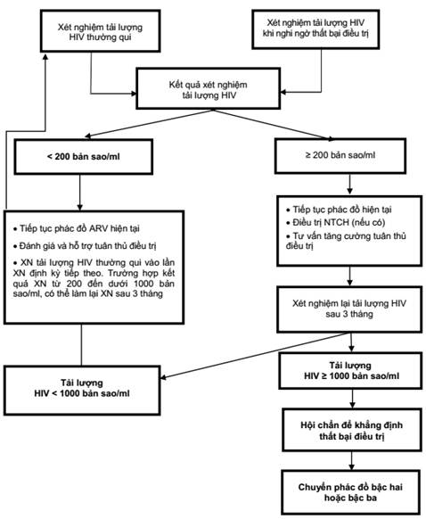
        

          
Figure 1. Sơ Đồ Thuật Toán Chẩn Đoán &amp; Xử Trí Thất Bại ARV (QĐ 5456/QĐ-BYT Trang 32)

          Lưu đồ hướng dẫn từng bước xét nghiệm tải lượng HIV định kỳ hoặc khi nghi ngờ, quy trình can thiệp tăng cường tuân thủ điều trị (EAC) trong 3 tháng và chỉ định chuyển sang phác đồ Bậc hai.
        

      

      {/* Code Visual Flowchart */}
      

        

          
1. Tải Lượng HIV Lần 1

          

            &bull; <strong>&lt; 200 bản sao/mL:</strong> Đáp ứng tốt, duy trì phác đồ, xét nghiệm định kỳ hàng năm. 
            &bull; <strong>200 – 999 bản sao/mL:</strong> Cảnh báo tải lượng thấp, tư vấn tuân thủ, xét nghiệm lại sau 6 tháng. 
            &bull; <strong>&ge; 1.000 bản sao/mL:</strong> Nghi ngờ thất bại &rarr; Chuyển sang can thiệp EAC.
          

        

        

          
2. Can Thiệp EAC (3 Tháng)

          

            Tiến hành ít nhất 3 phiên <strong>Tư vấn tăng cường tuân thủ điều trị (EAC)</strong> cách nhau mỗi tháng một lần. Rà soát tương tác thuốc, liều dùng, tác dụng phụ và hỗ trợ tâm lý xã hội.
          

        

        

          
3. Tải Lượng HIV Lần 2 (Sau EAC)

          

            &bull; <strong>&lt; 1.000 bản sao/mL:</strong> Tuân thủ kém trước đó nay đã phục hồi, tiếp tục phác đồ cũ. 
            &bull; <strong>&ge; 1.000 bản sao/mL:</strong> Khẳng định <strong>Thất bại Vi rút học</strong> &rarr; Hội chẩn hội đồng chuyên môn đổi sang <strong>Phác đồ Bậc hai</strong> ngay lập tức.
          

        

      

      
<i class="fa-solid fa-retweet"></i> Bảng 8: Các Phác Đồ ARV Bậc Hai Cho Người Lớn &amp; Trẻ Vị Thành Niên

      

        <table class="regimen-table">
          <thead>
            <tr>
              <th style="width:30%">Phác đồ Bậc một bị thất bại</th>
              <th style="width:35%">Phác đồ Bậc hai Ưu tiên</th>
              <th style="width:35%">Phác đồ Bậc hai Thay thế</th>
            </tr>
          </thead>
          <tbody>
            <tr>
              <td class="source-cell"><strong>TDF + 3TC (FTC) + DTG</strong></td>
              <td><strong>AZT + 3TC + LPV/r</strong> (hoặc ATV/r)</td>
              <td>AZT + 3TC + DRV/r (Darunavir/ritonavir)</td>
            </tr>
            <tr>
              <td class="source-cell"><strong>TDF + 3TC + EFV (hoặc NVP)</strong></td>
              <td><strong>AZT + 3TC + DTG</strong></td>
              <td>AZT + 3TC + LPV/r (hoặc ATV/r / DRV/r)</td>
            </tr>
            <tr>
              <td class="source-cell"><strong>AZT + 3TC + EFV (hoặc NVP)</strong></td>
              <td><strong>TDF + 3TC + DTG</strong></td>
              <td>TDF + 3TC + LPV/r (hoặc ATV/r / DRV/r)</td>
            </tr>
          </tbody>
        </table>
      

    

  

  {/* PHẦN 5: LAO & PMTCT */}
  

    

      
<i class="fa-solid fa-person-breastfeeding"></i>

      <h2 class="sec-title">5. Quản Lý Đồng Nhiễm Lao/HIV &amp; Dự Phòng Lây Truyền Mẹ Con (PMTCT)</h2>
    

    

      
      
<i class="fa-solid fa-lungs"></i> 1. Quản Lý Lâm Sàng Đồng Nhiễm Lao và HIV

      

        

          

          

            
<i class="fa-solid fa-stopwatch"></i>

            
Thời Điểm Khởi Động ARV Ở Bệnh Nhân Lao

          

          

            <ul style="margin-left: 1rem; line-height: 1.7;">
              <li><strong>Nguyên tắc:</strong> Khởi động điều trị thuốc chống Lao trước, đánh giá dung nạp trong <strong>2 đến 8 tuần</strong> rồi bắt đầu điều trị ARV.</li>
              <li><strong>Trường hợp suy giảm miễn dịch nặng (CD4 &lt; 50 cells/mm³):</strong> Bắt buộc khởi động ARV sớm <strong>trong vòng 2 tuần</strong> sau khi bắt đầu điều trị Lao để ngăn ngừa tử vong.</li>
              <li><strong>Lao màng não:</strong> Trì hoãn ARV ít nhất <strong>4 đến 8 tuần</strong> sau khi bắt đầu phác đồ chống Lao có Corticoid nhằm hạn chế phản ứng IRIS nội sọ gây tử vong.</li>
            </ul>
          

          
Thời Điểm Cốt Tử

        

        

          

          

            
<i class="fa-solid fa-capsules"></i>

            
Tương Tác Giữa Rifampicin &amp; Thuốc ARV

          

          

            <ul style="margin-left: 1rem; line-height: 1.7;">
              <li>Rifampicin gây cảm ứng mạnh men gan CYP3A4 và UGT1A1, làm giảm mạnh nồng độ Dolutegravir và Protease Inhibitors.</li>
              <li><strong>Khi dùng TDF + 3TC + DTG (TLD) chung với Rifampicin:</strong> <strong>Bắt buộc bổ sung thêm 01 viên DTG 50mg</strong> cách liều TLD 12 giờ (tổng liều DTG là 50 mg x 2 lần/ngày). Tiếp tục liều bổ sung này cho đến 2 tuần sau khi ngừng Rifampicin.</li>
              <li><strong>Nếu dùng EFV:</strong> Duy trì liều chuẩn EFV 600 mg/ngày (không cần tăng liều).</li>
              <li><strong>Nếu dùng LPV/r:</strong> Cần tăng gấp đôi liều LPV/r hoặc dùng Ritonavir liều siêu tăng cường có theo dõi men gan chặt chẽ.</li>
            </ul>
          

          
Hiệu Chỉnh Liều DTG

        

      

      
<i class="fa-solid fa-baby-carriage"></i> 2. Dự Phòng Lây Truyền Từ Mẹ Sang Con (PMTCT - Bảng 5 &amp; 6)

      

        <table class="regimen-table">
          <thead>
            <tr>
              <th style="width:25%">Phân tầng nguy cơ lây truyền ở mẹ</th>
              <th style="width:25%">Hình thức nuôi dưỡng trẻ</th>
              <th style="width:50%">Phác đồ ARV dự phòng cho trẻ sơ sinh &amp; Thời gian</th>
            </tr>
          </thead>
          <tbody>
            <tr>
              <td class="source-cell">
                Nguy Cơ Thấp 
                Mẹ đã điều trị ARV &gt; 4 tuần trước sinh VÀ tải lượng HIV &lt; 200 bản sao/mL.
              </td>
              <td>Bú sữa thay thế HOẶC Bú mẹ hoàn toàn</td>
              <td>
                <strong>Nevirapine (NVP) x 6 tuần liên tục</strong> tính từ lúc sinh. 
                <em>Liều uống mỗi ngày theo cân nặng sơ sinh:</em> 
                &bull; &lt; 2.0 kg: 2 mg/kg/ngày. 
                &bull; 2.0 – 2.4 kg: 10 mg/ngày (1 mL siro 10mg/mL). 
                &bull; &ge; 2.5 kg: 15 mg/ngày (1.5 mL siro).
              </td>
            </tr>
            <tr>
              <td class="source-cell">
                Nguy Cơ Cao 
                Mẹ không điều trị ARV, điều trị &lt; 4 tuần trước sinh, HOẶC tải lượng HIV &gt; 200 bản sao/mL (hoặc không rõ).
              </td>
              <td><strong>Bú sữa thay thế hoàn toàn</strong> (Không bú mẹ)</td>
              <td>
                <strong>Phác đồ 2 thuốc: Nevirapine (NVP) + Zidovudine (AZT) trong 6 tuần liên tục</strong> từ khi sinh. 
                <em>Liều AZT uống 2 lần/ngày theo tuổi thai và cân nặng:</em> 
                &bull; Trẻ đủ tháng (&ge; 35 tuần): 4 mg/kg/liều x 2 lần/ngày. 
                &bull; Trẻ non tháng (&lt; 35 tuần): 2 mg/kg/liều x 2 lần/ngày.
              </td>
            </tr>
            <tr>
              <td class="source-cell">
                Nguy Cơ Cao 
                Mẹ có nguy cơ cao nhưng quyết định nuôi con bằng sữa mẹ.
              </td>
              <td><strong>Nuôi con bằng sữa mẹ hoàn toàn</strong></td>
              <td>
                <strong>Phác đồ 2 thuốc: Nevirapine (NVP) + Zidovudine (AZT) kéo dài 12 tuần liên tục</strong> từ khi sinh. Duy trì NVP đơn trị liệu cho đến khi cai sữa hoàn toàn và mẹ đạt tải lượng &lt; 200 cp/mL.
              </td>
            </tr>
          </tbody>
        </table>
      

    

  

  {/* PHẦN 6: PREP & PEP */}
  

    

      
<i class="fa-solid fa-shield-halved"></i>

      <h2 class="sec-title">6. Dự Phòng Lây Nhiễm: PrEP Đường Uống &amp; PEP 72 Giờ Vàng</h2>
    

    

      
      
<i class="fa-solid fa-shield-virus"></i> 1. Dự Phòng Trước Phơi Nhiễm (PrEP Đường Uống)

      

        

          

          

            
<i class="fa-solid fa-calendar-day"></i>

            
PrEP Đường Uống Hằng Ngày (Daily PrEP)

          

          

            <ul style="margin-left: 1rem; line-height: 1.7;">
              <li><strong>Thuốc sử dụng:</strong> Viên kết hợp TDF/FTC (300/200mg) hoặc TDF/3TC (300/300mg) uống 1 viên/ngày.</li>
              <li><strong>Chỉ định:</strong> Cho mọi đối tượng có nguy cơ cao (nam QHTD đồng giới, người chuyển giới nữ, phụ nữ bán dâm, người tiêm chích ma túy, bạn tình âm tính của người nhiễm HIV có tải lượng &ge; 200 bản sao/mL).</li>
              <li><strong>Thời gian đạt nồng độ bảo vệ tối đa:</strong> 7 ngày đối với quan hệ qua đường hậu môn; 21 ngày đối với quan hệ qua đường âm đạo và máu.</li>
              <li><strong>Theo dõi:</strong> Xét nghiệm HIV trước khi kê đơn, sau 1 tháng và định kỳ 3 tháng/lần; theo dõi Creatinine/eGFR mỗi 6 tháng.</li>
            </ul>
          

          
Hiệu Quả 97%

        

        

          

          

            
<i class="fa-solid fa-person-burst"></i>

            
PrEP Theo Tình Huống (ED-PrEP / 2+1+1)

          

          

            <ul style="margin-left: 1rem; line-height: 1.7;">
              <li><strong>Chỉ định chuyên biệt:</strong> Chỉ áp dụng cho <strong>nam quan hệ tình dục đồng giới (MSM)</strong> có tần suất quan hệ tình dục ít (&lt; 2 lần/tuần) và có kế hoạch quan hệ trước.</li>
              <li><strong>Công thức 2+1+1:</strong> 
                &bull; <strong>Liều nạp:</strong> Uống <strong>2 viên</strong> TDF/FTC cùng lúc trước khi quan hệ từ <strong>2 đến 24 giờ</strong>. 
                &bull; <strong>Liều thứ 2:</strong> Uống <strong>1 viên</strong> sau liều nạp đúng 24 giờ. 
                &bull; <strong>Liều thứ 3:</strong> Uống <strong>1 viên</strong> sau liều thứ hai đúng 24 giờ.
              </li>
              <li><strong>Nếu tiếp tục quan hệ những ngày tiếp theo:</strong> Uống mỗi ngày 1 viên cho đến 2 ngày sau lần quan hệ cuối cùng.</li>
              <li><strong>Chống chỉ định ED-PrEP:</strong> Phụ nữ, người chuyển giới nữ có dùng estrogen, người tiêm chích ma túy, người viêm gan B mạn tính (HBsAg dương tính).</li>
            </ul>
          

          
Công Thức 2+1+1

        

      

      
<i class="fa-solid fa-kit-medical"></i> 2. Dự Phòng Sau Phơi Nhiễm (PEP Trong 72 Giờ Vàng)

      

        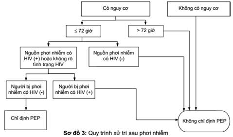
        

          
Figure 2. Sơ Đồ 3 &amp; Bảng 13: Quy Trình Xử Trí Sau Phơi Nhiễm &amp; Phác Đồ PEP (QĐ 5456/QĐ-BYT Trang 53)

          Quy trình 7 bước xử trí tai nạn rủi ro nghề nghiệp hoặc phơi nhiễm cộng đồng, phân loại tổn thương và phác đồ điều trị PEP 3 thuốc trong 28 ngày.
        

      

      

        <table class="regimen-table">
          <thead>
            <tr>
              <th style="width:20%">Yếu tố</th>
              <th style="width:40%">Nội dung quy chuẩn theo BYT 2019</th>
              <th style="width:40%">Lưu ý thực hành khẩn cấp</th>
            </tr>
          </thead>
          <tbody>
            <tr>
              <td class="source-cell"><strong>Thời gian vàng</strong></td>
              <td>Khởi động điều trị PEP <strong>càng sớm càng tốt trong vòng 24 giờ đầu</strong>, và tuyệt đối không muộn hơn <strong>72 giờ</strong> sau thời điểm phơi nhiễm.</td>
              <td>Sau 72 giờ, vi-rút đã tích hợp vào tế bào đích và hạch lympho, hiệu quả bảo vệ của PEP giảm sút nghiêm trọng và không còn được khuyến cáo.</td>
            </tr>
            <tr>
              <td class="source-cell"><strong>Thời gian điều trị</strong></td>
              <td>Uống thuốc liên tục trong đủ <strong>28 ngày (4 tuần)</strong>.</td>
              <td>Tư vấn hỗ trợ tuân thủ điều trị để phòng ngừa bỏ thuốc do tác dụng phụ (buồn nôn, mệt mỏi).</td>
            </tr>
            <tr>
              <td class="source-cell">Phác Đồ Ưu Tiên</td>
              <td><strong>TDF + 3TC (hoặc FTC) + DTG (TLD)</strong> uống 1 viên/ngày.</td>
              <td>Phác đồ thế hệ mới dung nạp rất tốt, ít tác dụng phụ thần kinh so với phác đồ cũ chứa EFV.</td>
            </tr>
            <tr>
              <td class="source-cell">Phác Đồ Thay Thế</td>
              <td>TDF + 3TC + LPV/r (hoặc EFV 600 mg). Phác đồ cho trẻ em: AZT/ABC + 3TC + LPV/r (hoặc RAL).</td>
              <td>Áp dụng khi bệnh nhân có tiền sử dị ứng, suy thận hoặc nghi ngờ nguồn phơi nhiễm kháng DTG.</td>
            </tr>
          </tbody>
        </table>
      

    

  

  {/* PHẦN 7: DỰ PHÒNG LAO & CTX */}
  

    

      
<i class="fa-solid fa-capsules"></i>

      <h2 class="sec-title">7. Dự Phòng Lao Tiềm Ẩn (TPT) &amp; Co-trimoxazole (CTX)</h2>
    

    

      
      
<i class="fa-solid fa-shield-halved"></i> 1. Điều Trị Dự Phòng Lao Tiềm Ẩn (TPT)

      

        

          

          

            
<i class="fa-solid fa-stethoscope"></i>

            
Sàng Lọc 4 Triệu Chứng Bệnh Lao

          

          

            
Tại mỗi lần tái khám, tất cả người nhiễm HIV bắt buộc được sàng lọc lâm sàng 4 triệu chứng:

            <ul style="margin-left: 1rem; line-height: 1.7;">
              <li><strong>1. Ho:</strong> Ho bất kể thời gian bao lâu (có đờm hoặc ho khan).</li>
              <li><strong>2. Sốt:</strong> Sốt nhẹ về chiều hoặc sốt cao dai dẳng.</li>
              <li><strong>3. Sụt cân:</strong> Sụt cân không rõ nguyên nhân.</li>
              <li><strong>4. Đổ mồ hôi đêm:</strong> Vã mồ hôi ướt đẫm áo ban đêm.</li>
            </ul>
            
<em>Xử trí:</em> Nếu có bất kỳ dấu hiệu nào &rarr; Làm xét nghiệm X-quang phổi và GeneXpert MTB/RIF để tìm Lao hoạt động. Nếu âm tính với cả 4 triệu chứng &rarr; Chỉ định điều trị dự phòng Lao (TPT).

          

          
Bộ 4 Dấu Hiệu

        

        

          

          

            
<i class="fa-solid fa-prescription-bottle-medical"></i>

            
Các Phác Đồ TPT Được BYT 2019 Khuyến Cáo

          

          

            <ul style="margin-left: 1rem; line-height: 1.7;">
              <li><strong>Phác đồ 3HP (Ưu tiên):</strong> Isoniazid (INH) 900 mg + Rifapentine 900 mg uống <strong>1 lần/tuần trong đủ 12 tuần</strong> (tổng cộng 12 liều có giám sát DOT). Bổ sung Vitamin B6 25–50 mg/tuần.</li>
              <li><strong>Phác đồ 6H / 9H (Kinh điển):</strong> Isoniazid (INH) 300 mg/ngày (10 mg/kg/ngày ở trẻ em) uống hằng ngày trong <strong>6 tháng</strong> (hoặc 9 tháng) kèm Vitamin B6 25 mg/ngày.</li>
              <li><strong>Phác đồ 1HP (Thử nghiệm):</strong> INH + Rifapentine hàng ngày trong 1 tháng (28 ngày).</li>
            </ul>
          

          
3HP Ưu Tiên

        

      

      
<i class="fa-solid fa-table-list"></i> 2. Bảng 15: Tiêu Chuẩn Bắt Đầu &amp; Ngừng Dự Phòng Bằng Co-trimoxazole (CTX)

      

        <table class="regimen-table">
          <thead>
            <tr>
              <th style="width:25%">Đối tượng</th>
              <th style="width:30%">Tiêu chuẩn bắt đầu dự phòng CTX</th>
              <th style="width:25%">Liều dùng khuyến cáo</th>
              <th style="width:20%">Tiêu chuẩn ngừng CTX</th>
            </tr>
          </thead>
          <tbody>
            <tr>
              <td class="source-cell"><strong>Người lớn &amp; Trẻ &ge; 5 tuổi</strong></td>
              <td>
                &bull; Số lượng tế bào <strong>CD4 &le; 350 cells/mm³</strong>; HOẶC 
                &bull; Thuộc <strong>Giai đoạn lâm sàng 3 hoặc 4</strong> (bất kể số CD4).
              </td>
              <td><strong>960 mg/ngày</strong> (01 viên nén đôi DS: 800mg SMX + 160mg TMP) uống 1 lần vào buổi sáng.</td>
              <td>Khi điều trị ARV <strong>&ge; 12 tháng</strong>, lâm sàng ổn định VÀ <strong>CD4 &gt; 350 cells/mm³</strong> (hoặc tải lượng HIV &lt; 200 copies/mL).</td>
            </tr>
            <tr>
              <td class="source-cell"><strong>Trẻ em &lt; 5 tuổi nhiễm HIV</strong></td>
              <td>Tất cả trẻ em nhiễm HIV dưới 5 tuổi không phụ thuộc giai đoạn lâm sàng hay số lượng CD4.</td>
              <td>Theo cân nặng (viên nén 120mg hoặc 480mg chia theo biểu liều).</td>
              <td>Ngừng dự phòng khi trẻ <strong>đủ 5 tuổi</strong> VÀ CD4 &gt; 350 cells/mm³.</td>
            </tr>
            <tr>
              <td class="source-cell"><strong>Trẻ phơi nhiễm HIV</strong></td>
              <td>Tất cả trẻ sinh ra từ mẹ nhiễm HIV, bắt đầu từ <strong>4 đến 6 tuần tuổi</strong>.</td>
              <td>Theo cân nặng.</td>
              <td>Ngừng khi có kết quả xét nghiệm <strong>loại trừ hoàn toàn tình trạng nhiễm HIV</strong>.</td>
            </tr>
          </tbody>
        </table>
      

    

  

  {/* PHẦN 8: ĐIỀU TRỊ NTCH & STIS */}
  

    

      
<i class="fa-solid fa-virus-covid"></i>

      <h2 class="sec-title">8. Chẩn Đoán &amp; Điều Trị Các Bệnh Nhiễm Trùng Cơ Hội &amp; STIs Cốt Lõi</h2>
    

    

      
      

        <table class="regimen-table">
          <thead>
            <tr>
              <th style="width:20%">Bệnh lý NTCH</th>
              <th style="width:30%">Đặc điểm lâm sàng &amp; Chẩn đoán</th>
              <th style="width:35%">Phác đồ Điều trị Ưu tiên (Liều &amp; Thời gian)</th>
              <th style="width:15%">Dự phòng thứ phát</th>
            </tr>
          </thead>
          <tbody>
            <tr>
              <td class="source-cell">
                Hô Hấp Cấp 
                <strong>Viêm phổi PCP</strong> 
                <em>(P. jirovecii)</em>
              </td>
              <td>Ho khan, khó thở tiến triển tăng dần 1–2 tuần, sốt, thở nhanh. X-quang phổi thâm nhiễm kẽ hai bên hình cánh bướm. Khí máu có hạ oxy máu.</td>
              <td>
                <strong>Co-trimoxazole (TMP-SMX):</strong> Liều tính theo TMP 15–20 mg/kg/ngày chia 3 lần uống hoặc truyền tĩnh mạch x <strong>21 ngày</strong>. 
                <em>Phối hợp Corticoid (khi PaO2 &lt; 70 mmHg hoặc SpO2 &lt; 90%):</em> Prednisone 40mg x 2 lần/ngày x 5 ngày &rarr; 40mg x 1 lần/ngày x 5 ngày &rarr; 20mg x 1 lần/ngày x 11 ngày.
              </td>
              <td>CTX 960 mg/ngày đến khi CD4 &gt; 200 cells/mm³ duy trì &ge; 6 tháng.</td>
            </tr>
            <tr>
              <td class="source-cell">
                Thần Kinh Cấp 
                <strong>Nấm Cryptococcus</strong> 
                <em>(Viêm màng não)</em>
              </td>
              <td>Đau đầu dữ dội, sốt, sợ ánh sáng, cổ cứng, rối loạn tri giác. DNT: nhuộm mực tàu thấy nấm men có bao dày, test kháng nguyên CrAg DNT (+), áp lực mở DNT tăng cao (&gt; 250 mmH2O).</td>
              <td>
                <strong>Phác đồ tấn công (2 tuần):</strong> 
                &bull; <em>Tuần 1:</em> <strong>Amphotericin B deoxycholate 1 mg/kg/ngày IV + Flucytosine 100 mg/kg/ngày</strong> chia 4 lần. 
                &bull; <em>Tuần 2:</em> <strong>Fluconazole 1.200 mg/ngày</strong> (hoặc 800mg/ngày). 
                &bull; <em>Củng cố (8 tuần):</em> Fluconazole 800 mg/ngày. 
                &bull; <em>Kiểm soát áp lực nội sọ:</em> Bắt buộc chọc tháo DNT 15–20 mL hàng ngày đến khi áp lực &lt; 200 mmH2O. Chống chỉ định Mannitol và Corticoid. 
                <strong>Thời điểm ARV:</strong> Trì hoãn ARV <strong>4–6 tuần</strong> sau khi bắt đầu điều trị kháng nấm.
              </td>
              <td>Fluconazole 200 mg/ngày đến khi CD4 &gt; 200 cells/mm³ duy trì &ge; 6 tháng.</td>
            </tr>
            <tr>
              <td class="source-cell">
                Toàn Thân 
                <strong>Nấm Talaromyces</strong> 
                <em>(T. marneffei)</em>
              </td>
              <td>Sốt kéo dài, sụt cân, thiếu máu nặng, gan lách to, hạch to. <strong>Tổn thương da đặc trưng: sẩn hoại tử rốn trung tâm</strong> ở mặt và ngực. Soi/cấy máu, da thấy nấm men phân nhánh hình xúc xích.</td>
              <td>
                &bull; <strong>Tấn công (2 tuần):</strong> Amphotericin B 0.7–1.0 mg/kg/ngày truyền tĩnh mạch. 
                &bull; <strong>Củng cố (10 tuần):</strong> Itraconazole viên nang 200 mg x 2 lần/ngày (uống sau bữa ăn nhiều mỡ hoặc dùng chung nước uống có ga axit).
              </td>
              <td>Itraconazole 200 mg/ngày đến khi CD4 &gt; 100 cells/mm³ &ge; 6 tháng.</td>
            </tr>
            <tr>
              <td class="source-cell">
                Thần Kinh Khu Trú 
                <strong>Toxoplasma não</strong> 
                <em>(T. gondii)</em>
              </td>
              <td>Sốt, đau đầu, co giật, liệt nửa người hoặc liệt dây thần kinh sọ. CT/MRI não có nhiều tổn thương khối choán chỗ ngấm thuốc dạng viền nhẫn (ring-enhancing lesions) kèm phù não xung quanh.</td>
              <td>
                <strong>Co-trimoxazole (TMP-SMX):</strong> Liều tính theo TMP 10 mg/kg/ngày chia 2 lần uống hoặc truyền tĩnh mạch trong <strong>6 tuần liên tục</strong>. 
                Nếu có hiệu ứng choán chỗ đè đẩy đường giữa: bổ sung Dexamethasone ngắn ngày.
              </td>
              <td>CTX 960 mg/ngày đến khi CD4 &gt; 200 cells/mm³ &ge; 6 tháng.</td>
            </tr>
            <tr>
              <td class="source-cell">
                Tiêu Hóa / Toàn Thân 
                <strong>Bệnh do Nấm Candida</strong>
              </td>
              <td>
                &bull; <em>Miệng:</em> Mảng trắng xốp dễ bong để lại nền đỏ rớm máu. 
                &bull; <em>Thực quản:</em> Nuốt đau, nóng rát sau xương ức, nghẹn thức ăn. 
                &bull; <em>Sinh dục:</em> Ngứa rát, khí hư trắng vón cục.
              </td>
              <td>
                &bull; <em>Candida miệng:</em> Fluconazole 100–200 mg/ngày x 7–14 ngày. 
                &bull; <em>Candida thực quản:</em> Fluconazole 200–300 mg/ngày x 14–21 ngày. 
                &bull; <em>Candida âm đạo:</em> Fluconazole 150 mg uống liều duy nhất.
              </td>
              <td>Không khuyến cáo dự phòng thứ phát thường quy.</td>
            </tr>
            <tr>
              <td class="source-cell">
                Nhiễm Trùng Muộn 
                <strong>Bệnh do MAC</strong> 
                <em>(M. avium complex)</em>
              </td>
              <td>Sốt cao kéo dài, sụt cân nặng, vã mồ hôi đêm, tiêu chảy, đau bụng, thiếu máu nặng ở bệnh nhân có CD4 &lt; 50 cells/mm³. Không đáp ứng với phác đồ chống Lao sau 2–4 tuần.</td>
              <td>
                <strong>Phác đồ kết hợp ít nhất 2 thuốc x &ge; 12 tháng:</strong> 
                <strong>Clarithromycin 500 mg x 2 lần/ngày + Ethambutol 15 mg/kg/ngày</strong>. 
                (Có thể phối hợp thêm Rifabutin 300 mg/ngày nếu bệnh nặng).
              </td>
              <td>Duy trì Clarithromycin + Ethambutol đến khi CD4 &gt; 100 cells/mm³ &ge; 6 tháng.</td>
            </tr>
            <tr>
              <td class="source-cell">
                Thị Giác 
                <strong>Viêm võng mạc CMV</strong> 
                <em>(Cytomegalovirus)</em>
              </td>
              <td>Nhìn mờ, có chấm đen ruồi bay, mất thị trường nhanh chóng, xuất huyết hoại tử võng mạc (hình ảnh sốt cà chua và phô mai) khi CD4 &lt; 50 cells/mm³.</td>
              <td>
                <strong>Phác đồ tấn công (2–3 tuần):</strong> 
                <strong>Tiêm nội nhãn Ganciclovir 2 mg x 2 lần/tuần KẾT HỢP Valganciclovir uống 900 mg x 2 lần/ngày trong 14–21 ngày</strong>. 
                <em>Viêm đại tràng/thực quản CMV:</em> Ganciclovir IV 5 mg/kg mỗi 12 giờ x 14–21 ngày.
              </td>
              <td>Valganciclovir 900 mg/ngày đến khi CD4 &gt; 100 cells/mm³ &ge; 6 tháng.</td>
            </tr>
            <tr>
              <td class="source-cell">
                Ngoại Ban / Loét 
                <strong>HSV &amp; Zona (VZV)</strong>
              </td>
              <td>Mụn nước mọc thành chùm vỡ loét đau đớn ở môi, sinh dục, hậu môn kéo dài &gt; 1 tháng (HSV). Mụn nước theo khoanh tủy thần kinh bì (Zona).</td>
              <td>
                &bull; <em>HSV da niêm:</em> Acyclovir 400 mg x 3 lần/ngày x 7–10 ngày. 
                &bull; <em>Zona thần kinh:</em> Acyclovir 800 mg x 5 lần/ngày x 7–10 ngày. 
                &bull; <em>Viêm não do HSV:</em> Acyclovir IV 10 mg/kg mỗi 8 giờ x 14–21 ngày.
              </td>
              <td>Acyclovir 400 mg x 2 lần/ngày khi tái phát &ge; 6 lần/năm.</td>
            </tr>
            <tr>
              <td class="source-cell">
                Lây Qua Tình Dục 
                <strong>Bệnh Lây Qua Đường Tình Dục (STIs)</strong>
              </td>
              <td>
                &bull; <em>Giang mai:</em> Săn loét không đau (thời kỳ 1), ban sẩn lòng bàn tay chân (thời kỳ 2). 
                &bull; <em>Lậu &amp; Chlamydia:</em> Tiểu buốt, mủ niệu đạo hoặc khí hư cổ tử cung.
              </td>
              <td>
                &bull; <em>Giang mai sớm:</em> Benzathine Penicillin G 2.4 triệu ĐV tiêm bắp liều duy nhất. 
                &bull; <em>Giang mai muộn/ẩn:</em> Benzathine Penicillin G 2.4 triệu ĐV tiêm bắp 1 lần/tuần x 3 tuần. 
                &bull; <em>Lậu cầu:</em> Ceftriaxone 250 mg tiêm bắp + Azithromycin 1g uống liều duy nhất. 
                &bull; <em>Chlamydia:</em> Azithromycin 1g liều duy nhất hoặc Doxycycline 100 mg x 2 lần/ngày x 7 ngày.
              </td>
              <td>Điều trị đồng thời cả bạn tình; xét nghiệm lại sau 3 tháng.</td>
            </tr>
          </tbody>
        </table>
      

    

  

  {/* PHẦN 9: ĐỒNG NHIỄM HBV/HCV */}
  

    

      
<i class="fa-solid fa-dna"></i>

      <h2 class="sec-title">9. Đồng Nhiễm Viêm Gan Vi-rút (HBV/HIV &amp; HCV/HIV) &amp; Tương Tác DAAs</h2>
    

    

      
      
<i class="fa-solid fa-virus"></i> 1. Đồng Nhiễm Viêm Gan B (HBV/HIV)

      

        

          

          

            
<i class="fa-solid fa-flask-vial"></i>

            
Sàng Lọc &amp; Phác Đồ Điều Trị HBV/HIV

          

          

            <ul style="margin-left: 1rem; line-height: 1.7;">
              <li><strong>Sàng lọc:</strong> Tất cả người nhiễm HIV bắt buộc xét nghiệm <strong>HBsAg</strong>. Nếu HBsAg âm tính, chỉ định tiêm vắc xin phòng viêm gan B theo phác đồ liều gấp đôi (40 mcg) cho người có CD4 thấp.</li>
              <li><strong>Phác đồ ARV bắt buộc:</strong> Phải chọn phác đồ có chứa <strong>đồng thời 2 thuốc kháng nucleoside có hoạt tính ức chế cả HIV và HBV: TDF + 3TC (hoặc FTC) kết hợp DTG</strong>.</li>
              <li><strong>Cảnh báo bùng phát viêm gan cấp (Hepatic Flare):</strong> Tuyệt đối không được tự ý ngừng hoặc bỏ TDF/3TC vì nguy cơ bùng phát viêm gan B cấp tính dẫn đến suy gan tối cấp đe dọa tính mạng.</li>
              <li><strong>Khi suy thận (eGFR &lt; 50 mL/phút):</strong> Chuyển sang Tenofovir Alafenamide (TAF) 25 mg/ngày kết hợp 3TC chỉnh liều và DTG, hoặc phối hợp Entecavir nếu không có TAF.</li>
            </ul>
          

          
Bắt Buộc TDF + 3TC/FTC

        

        

          

          

            
<i class="fa-solid fa-capsules"></i>

            
Đồng Nhiễm Viêm Gan C (HCV/HIV) &amp; Thuốc DAAs

          

          

            <ul style="margin-left: 1rem; line-height: 1.7;">
              <li><strong>Sàng lọc:</strong> Xét nghiệm kháng thể <strong>Anti-HCV</strong> hàng năm. Nếu dương tính, làm xét nghiệm <strong>HCV-RNA</strong> đo tải lượng để xác định nhiễm HCV mạn tính.</li>
              <li><strong>Nguyên tắc điều trị:</strong> Sử dụng thuốc kháng vi-rút tác dụng trực tiếp (DAAs) đường uống trong <strong>12 tuần</strong>. Ưu tiên các phác đồ toàn kiểu gen (Pan-genotypic): <strong>Sofosbuvir/Velpatasvir (SOF/VEL)</strong> hoặc <strong>Sofosbuvir + Daclatasvir (SOF + DCV)</strong>.</li>
              <li>Tỷ lệ đạt đáp ứng vi-rút bền vững (SVR12 khỏi bệnh hoàn toàn) ở người đồng nhiễm HCV/HIV tương đương người nhiễm HCV đơn thuần (&gt; 95–98%).</li>
            </ul>
          

          
SVR12 &gt; 95%

        

      

      
<i class="fa-solid fa-shuffle"></i> 2. Phụ Lục 12: Bảng Tương Tác Giữa Thuốc DAAs Trị Viêm Gan C và Thuốc ARV

      

        <table class="regimen-table">
          <thead>
            <tr>
              <th style="width:25%">Phác đồ ARV đang dùng</th>
              <th style="width:35%">Phác đồ DAAs Viêm gan C phù hợp</th>
              <th style="width:40%">Tương tác thuốc &amp; Lưu ý hiệu chỉnh liều</th>
            </tr>
          </thead>
          <tbody>
            <tr>
              <td class="source-cell"><strong>TDF + 3TC + DTG (TLD)</strong></td>
              <td>
                <strong>Sofosbuvir / Velpatasvir (SOF/VEL)</strong> 
                HOẶC <strong>Sofosbuvir + Daclatasvir (SOF + DCV)</strong>
              </td>
              <td>
                Phác đồ tương thích tối ưu, không có tương tác bất lợi đáng kể. Không cần chỉnh liều Daclatasvir (dùng liều chuẩn 60 mg/ngày). Cần theo dõi chức năng thận do dùng đồng thời TDF với Velpatasvir có thể làm tăng nhẹ nồng độ TDF.
              </td>
            </tr>
            <tr>
              <td class="source-cell">Cần Chỉnh Liều <strong>TDF + 3TC + EFV</strong></td>
              <td><strong>Sofosbuvir + Daclatasvir (SOF + DCV)</strong></td>
              <td>
                <strong>BẮT BUỘC TĂNG LIỀU Daclatasvir lên 90 mg/ngày</strong> (viên 60mg + viên 30mg) do Efavirenz gây cảm ứng CYP3A4 làm giảm nồng độ DCV. 
                <strong>CHỐNG CHỈ ĐỊNH DÙNG SOF/VEL</strong> chung với Efavirenz vì EFV làm giảm nghiêm trọng nồng độ Velpatasvir dẫn đến thất bại điều trị.
              </td>
            </tr>
            <tr>
              <td class="source-cell">Cấm Phối Hợp <strong>AZT + 3TC + LPV/r</strong></td>
              <td>Sofosbuvir + Daclatasvir (SOF + DCV)</td>
              <td>
                <strong>CHỐNG CHỈ ĐỊNH TUYỆT ĐỐI DÙNG Ribavirin chung với Zidovudine (AZT)</strong> do nguy cơ ức chế tủy xương gây thiếu máu tán huyết và thiếu máu nặng đe dọa tính mạng. Nếu cần dùng Ribavirin, bắt buộc đổi AZT sang TDF.
              </td>
            </tr>
          </tbody>
        </table>
      

    

  

  {/* PHẦN 10: NCDS & ĐỘC TÍNH */}
  

    

      
<i class="fa-solid fa-heart-pulse"></i>

      <h2 class="sec-title">10. Kiểm Soát Bệnh Không Lây Nhiễm &amp; Độc Tính Thuốc ARV</h2>
    

    

      
      
<i class="fa-solid fa-chart-simple"></i> 1. Đánh Giá Xơ Gan (Child-Pugh) &amp; Hiệu Chỉnh Liều ARV Khi Suy Gan

      

        <table class="regimen-table">
          <thead>
            <tr>
              <th style="width:25%">Chỉ số lâm sàng &amp; Cận lâm sàng</th>
              <th style="width:25%">1 Điểm</th>
              <th style="width:25%">2 Điểm</th>
              <th style="width:25%">3 Điểm</th>
            </tr>
          </thead>
          <tbody>
            <tr>
              <td class="source-cell"><strong>Bilirubin toàn phần (µmol/L)</strong></td>
              <td>&lt; 34 (&lt; 2.0 mg/dL)</td>
              <td>34 – 50 (2.0 – 3.0 mg/dL)</td>
              <td>&gt; 50 (&gt; 3.0 mg/dL)</td>
            </tr>
            <tr>
              <td class="source-cell"><strong>Albumin huyết thanh (g/L)</strong></td>
              <td>&gt; 35 (&gt; 3.5 g/dL)</td>
              <td>28 – 35 (2.8 – 3.5 g/dL)</td>
              <td>&lt; 28 (&lt; 2.8 g/dL)</td>
            </tr>
            <tr>
              <td class="source-cell"><strong>INR (hoặc Tỷ lệ Prothrombin %)</strong></td>
              <td>&lt; 1.7 (&gt; 50%)</td>
              <td>1.7 – 2.2 (30 – 50%)</td>
              <td>&gt; 2.2 (&lt; 30%)</td>
            </tr>
            <tr>
              <td class="source-cell"><strong>Cổ trướng (Cổ trướng trên lâm sàng/SA)</strong></td>
              <td>Không có</td>
              <td>Nhẹ đến Vừa (đáp ứng lợi tiểu)</td>
              <td>Nhiều / Kháng trị với lợi tiểu</td>
            </tr>
            <tr>
              <td class="source-cell"><strong>Bệnh não gan (Hôn mê gan)</strong></td>
              <td>Không có</td>
              <td>Độ 1 – 2 (lú lẫn nhẹ, mất ngủ)</td>
              <td>Độ 3 – 4 (ngủ lịm, hôn mê sâu)</td>
            </tr>
          </tbody>
        </table>
      

      

        
<i class="fa-solid fa-triangle-exclamation"></i>

        

          <strong>Phân Độ Child-Pugh &amp; Chống Chỉ Định Thuốc ARV:</strong>
          <ul style="margin-left: 1rem; margin-top: 0.35rem; line-height: 1.65;">
            <li><strong>Child-Pugh A (5–6 điểm):</strong> Suy gan nhẹ &rarr; Điều chỉnh liều Abacavir (ABC) giảm còn 200 mg x 2 lần/ngày. Các thuốc khác dùng liều thông thường.</li>
            <li><strong>Child-Pugh B (7–9 điểm):</strong> Suy gan vừa &rarr; <strong>Chống chỉ định dùng Abacavir (ABC) và Nevirapine (NVP)</strong>. Thận trọng với Efavirenz và Protease Inhibitors.</li>
            <li><strong>Child-Pugh C (10–15 điểm):</strong> Suy gan nặng &rarr; <strong>Chống chỉ định ABC, NVP, EFV và tất cả các thuốc PIs (LPV/r, ATV/r)</strong>. Ưu tiên phác đồ TDF + 3TC + DTG có theo dõi sát men gan và chức năng đông máu.</li>
          </ul>
        

      

      
<i class="fa-solid fa-triangle-exclamation"></i> 2. Phụ Lục 10: Tóm Tắt Độc Tính Chính &amp; Cách Xử Trí Các Thuốc ARV

      

        <table class="regimen-table">
          <thead>
            <tr>
              <th style="width:20%">Thuốc ARV</th>
              <th style="width:40%">Độc tính chính &amp; Tác dụng không mong muốn</th>
              <th style="width:40%">Yếu tố nguy cơ &amp; Hướng xử trí lâm sàng</th>
            </tr>
          </thead>
          <tbody>
            <tr>
              <td class="source-cell"><strong>Tenofovir (TDF)</strong></td>
              <td>Độc tính trên ống lượn gần thận (Hội chứng Fanconi, suy thận cấp/mạn), giảm mật độ khoáng của xương (loãng xương, nhuyễn xương).</td>
              <td>Theo dõi Creatinine máu, eGFR và Protein niệu mỗi 6 tháng. Nếu eGFR &lt; 50 mL/phút: giảm liều/giãn cách liều TDF (300mg mỗi 48h khi eGFR 30-49) hoặc chuyển sang TAF / ABC.</td>
            </tr>
            <tr>
              <td class="source-cell">Huyết Học <strong>Zidovudine (AZT)</strong></td>
              <td><strong>Thiếu máu nặng, giảm bạch cầu hạt nặng</strong> (suy tủy xương), teo mô mỡ dưới da, toan toan chuyển hóa lactic, buồn nôn nhiều.</td>
              <td>Kiểm tra CTM định kỳ. <strong>Chống chỉ định khởi đầu AZT khi Hb &lt; 8 g/dL hoặc bạch cầu hạt &lt; 750/µL</strong>. Nếu thiếu máu tiến triển: ngừng AZT và thay bằng TDF hoặc ABC.</td>
            </tr>
            <tr>
              <td class="source-cell">Quá Mẫn <strong>Abacavir (ABC)</strong></td>
              <td><strong>Hội chứng quá mẫn Abacavir nguy hiểm tính mạng</strong> (sốt, ban da, mệt mỏi, triệu chứng hô hấp và tiêu hóa tăng dần sau mỗi lần uống).</td>
              <td><strong>Bắt buộc xét nghiệm gen HLA-B*5701 trước khi kê đơn ABC</strong>. Chống chỉ định tuyệt đối nếu gen (+). Nếu nghi ngờ quá mẫn lâm sàng, ngừng ABC vĩnh viễn và KHÔNG BAO GIỜ được cho dùng lại.</td>
            </tr>
            <tr>
              <td class="source-cell"><strong>Dolutegravir (DTG)</strong></td>
              <td>Tăng cân, rối loạn giấc ngủ (mất ngủ, đau đầu nhẹ), nguy cơ dị tật ống thần kinh thai nhi (trong 3 tháng đầu thai kỳ).</td>
              <td>Thuốc dung nạp rất tốt. Tư vấn dinh dưỡng và vận động tránh tăng cân quá mức. Phụ nữ mang thai &lt; 12 tuần cần tư vấn lựa chọn giữa DTG và EFV. Tăng liều gấp đôi khi dùng cùng Rifampicin.</td>
            </tr>
            <tr>
              <td class="source-cell">Thần Kinh <strong>Efavirenz (EFV)</strong></td>
              <td><strong>Độc tính thần kinh trung ương</strong> (chóng mặt, mất ngủ, ác mộng, trầm cảm, ý tưởng tự sát), phát ban da, tăng men gan, dị tật thai nhi.</td>
              <td>Uống vào buổi tối trước khi đi ngủ lúc bụng đói. Thường tự hết sau 2–4 tuần. Nếu trầm cảm nặng hoặc triệu chứng tâm thần dai dẳng: chuyển sang DTG.</td>
            </tr>
            <tr>
              <td class="source-cell">Độc Gan <strong>Nevirapine (NVP)</strong></td>
              <td><strong>Độc tính gan nặng hoại tử tế bào gan</strong>, phản ứng dị ứng da nghiêm trọng (Hội chứng Stevens-Johnson, TEN).</td>
              <td><strong>Chống chỉ định khởi đầu NVP ở phụ nữ có CD4 &gt; 250 cells/mm³ hoặc nam giới có CD4 &gt; 400 cells/mm³</strong>. Theo dõi sát ALT/AST trong 18 tuần đầu.</td>
            </tr>
            <tr>
              <td class="source-cell"><strong>Lopinavir/r (LPV/r)</strong></td>
              <td>Tiêu chảy, buồn nôn, rối loạn phân bố mỡ (bụng to, gù trâu), <strong>rối loạn lipid máu nặng</strong> (tăng triglycerid, LDL-C), kéo dài khoảng PR/QT.</td>
              <td>Theo dõi lipid máu và điện tim. Không dùng chung với Simvastatin/Lovastatin (nguy cơ tiêu cơ vân). Uống thuốc cùng bữa ăn để tăng hấp thu và giảm kích ứng dạ dày.</td>
            </tr>
          </tbody>
        </table>
      

    

  

  {/* PHẦN 11: VỊ THÀNH NIÊN */}
  

    

      
<i class="fa-solid fa-children"></i>

      <h2 class="sec-title">11. Quản Lý Vị Thành Niên &amp; Quy Trình Bộc Lộ Tình Trạng Bệnh</h2>
    

    

      
      
<i class="fa-solid fa-comments"></i> 1. Quy Trình Bộc Lộ Tình Trạng Nhiễm HIV Cho Trẻ Em (Theo Lứa Tuổi)

      

        

          

          

            
<i class="fa-solid fa-child"></i>

            
Giai Đoạn 1: Bộc Lộ Một Phần (Từ 6 Tuổi)

          

          

            <ul style="margin-left: 1rem; line-height: 1.7;">
              <li><strong>Mục tiêu:</strong> Xây dựng thói quen tự uống thuốc và hiểu về sức khỏe cơ bản của bản thân mà không gây sốc tâm lý.</li>
              <li><strong>Nội dung:</strong> Giải thích cho trẻ biết cơ thể có "những chú bộ đội bạch cầu" bảo vệ nhưng đang bị vi khuẩn/vi-rút làm suy yếu, cần uống thuốc hằng ngày đúng giờ để tăng sức đề kháng.</li>
              <li><strong>Nguyên tắc:</strong> <strong>TUYỆT ĐỐI KHÔNG DÙNG TỪ "HIV" HAY "AIDS"</strong> ở giai đoạn này để tránh trẻ bị mặc cảm, sợ hãi hoặc vô tình tiết lộ ra ngoài gây kỳ thị.</li>
            </ul>
          

          
Từ 6 Tuổi Trở Lên

        

        

          

          

            
<i class="fa-solid fa-user-graduate"></i>

            
Giai Đoạn 2: Bộc Lộ Toàn Phần (10–12 Tuổi)

          

          

            <ul style="margin-left: 1rem; line-height: 1.7;">
              <li><strong>Thời điểm:</strong> Khi trẻ đạt 10 đến 12 tuổi, có nhận thức tâm lý trưởng thành và chuẩn bị bước vào giai đoạn dậy thì.</li>
              <li><strong>Nội dung:</strong> Thông báo chính thức tên bệnh "Nhiễm HIV", giải thích cơ chế lây truyền từ mẹ sang con từ lúc sinh (giải tỏa cảm giác tội lỗi của trẻ), nhấn mạnh vai trò của thuốc ARV giúp người nhiễm sống khỏe mạnh lâu dài như người bình thường.</li>
              <li><strong>Kỹ năng:</strong> Hướng dẫn trẻ về quyền bảo mật thông tin, tư vấn sức khỏe sinh sản, tình dục an toàn và phòng ngừa lây nhiễm cho người khác.</li>
            </ul>
          

          
Bộc Lộ Hoàn Toàn 10–12T

        

      

      
<i class="fa-solid fa-arrow-right-arrow-left"></i> 2. Chuyển Tiếp Sang Dịch Vụ Chăm Sóc Sức Khỏe Người Lớn

      

        
<i class="fa-solid fa-person-walking-arrow-right"></i>

        

          <strong>Quy Trình Chuyển Tiếp Trẻ Vị Thành Niên (15–19 Tuổi):</strong>
          Kế hoạch chuyển tiếp cần được chuẩn bị trước <strong>2 đến 3 năm</strong>. Tiêu chuẩn chuyển tiếp thành công bao gồm: trẻ đã được bộc lộ tình trạng bệnh hoàn toàn; tự quản lý việc nhận thuốc và uống thuốc đúng giờ; hiểu rõ về bảo hiểm y tế; có kiến thức phòng tránh mang thai ngoài ý muốn và các bệnh lây truyền qua đường tình dục. Quá trình bàn giao giữa cơ sở Nhi và cơ sở Người lớn phải có sự đồng thuận của trẻ và người chăm sóc.
        

      

    

  

  {/* PHẦN 12: HỘI CHỨNG LÂM SÀNG NGƯỜI LỚN */}
  

    

      
<i class="fa-solid fa-stethoscope"></i>

      <h2 class="sec-title">12. Thuật Toán Tiếp Cận 9 Hội Chứng Lâm Sàng Ở Người Lớn Nhiễm HIV</h2>
    

    

      
      
Chương V trong Hướng dẫn BYT 2019 chuẩn hóa toàn bộ lưu đồ thuật toán tiếp cận theo định hướng triệu chứng, giúp bác sĩ lâm sàng nhanh chóng chẩn đoán phân biệt và đưa ra can thiệp kịp thời.

      {/* 1. SỐT KÉO DÀI */}
      
<i class="fa-solid fa-temperature-arrow-up"></i> 1. Tiếp Cận Hội Chứng Sốt Kéo Dài Ở Người Lớn

      
      

        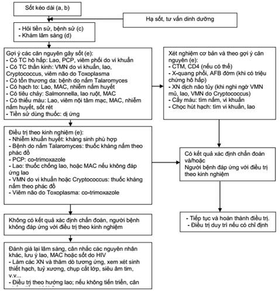
        

          
Figure 3. Thuật Toán Tiếp Cận Hội Chứng Sốt Kéo Dài Ở Người Lớn (Trang 65)

          Định nghĩa sốt kéo dài (&gt; 38.5°C kéo dài &gt; 14 ngày). Quy trình phân tầng: Lao, Nấm Talaromyces, Cryptococcus, Nhiễm trùng huyết Salmonella, MAC và sốt do thuốc.
        

      

      

        

          
Căn Nguyên Hàng Đầu

          

            &bull; <strong>Bệnh Lao (TB/HIV):</strong> Nguyên nhân phổ biến nhất (Lao phổi, Lao màng bụng, Lao hạch, Lao kê). 
            &bull; <strong>Nấm toàn thân:</strong> <em>Talaromyces marneffei</em>, <em>Cryptococcus neoformans</em>. 
            &bull; <strong>Nhiễm trùng huyết:</strong> <em>Salmonella</em> không thương hàn, tụ cầu, vi khuẩn Gram âm. 
            &bull; <strong>Sốt do thuốc:</strong> Co-trimoxazole, Nevirapine, Abacavir.
          

        

        

          
Bộ Xét Nghiệm Cốt Lõi

          

            &bull; CTM, Tế bào CD4, Men gan, Creatinine. 
            &bull; X-quang phổi thẳng, Siêu âm bụng tìm hạch mạc treo/áp-xe gan lách. 
            &bull; GeneXpert MTB/RIF đờm/dịch màng phổi/máu. 
            &bull; Cấy máu tìm vi khuẩn và nấm (2 vị trí). 
            &bull; Test kháng nguyên CrAg huyết thanh; soi cạo tổn thương da (nếu có).
          

        

      

      {/* 2. HÔ HẤP */}
      
<i class="fa-solid fa-lungs"></i> 2. Tiếp Cận Triệu Chứng Hô Hấp (Ho, Khó Thở) Ở Người Lớn

      

        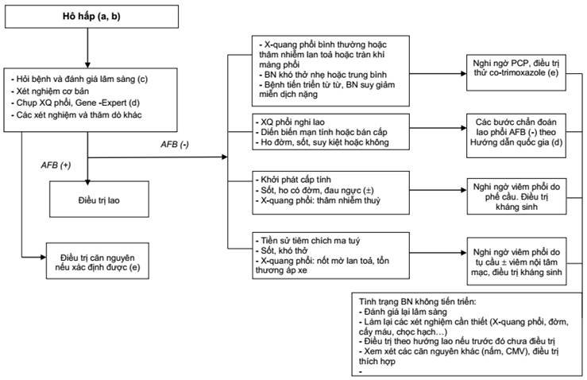
        

          
Figure 4. Thuật Toán Tiếp Cận Triệu Chứng Hô Hấp Ở Người Lớn (Trang 67)

          Phân biệt cấp tính vs mạn tính: Viêm phổi vi khuẩn cấp, Viêm phổi PCP thâm nhiễm kẽ cánh bướm lan tỏa, Lao phổi và U lympho.
        

      

      {/* 3. THẦN KINH */}
      
<i class="fa-solid fa-brain"></i> 3. Tiếp Cận Biểu Hiện Thần Kinh Ở Người Lớn (Đau Đầu, Rối Loạn Tri Giác, Liệt Khu Trú)

      

        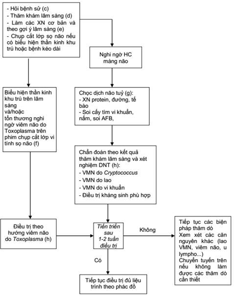
        

          
Figure 5. Thuật Toán Tiếp Cận Bệnh Lý Thần Kinh Ở Người Lớn (Trang 69)

          Phân nhánh hội chứng màng não (Chọc DNT làm mực tàu, CrAg, GeneXpert) vs Dấu thần kinh khu trú (Chụp CT/MRI sọ não tìm tổn thương khối Toxoplasma ngấm thuốc viền nhẫn).
        

      

      {/* 4. TIÊU CHẢY MẠN TÍNH */}
      
<i class="fa-solid fa-toilet"></i> 4. Tiếp Cận Hội Chứng Tiêu Chảy Mạn Tính Ở Người Lớn

      

        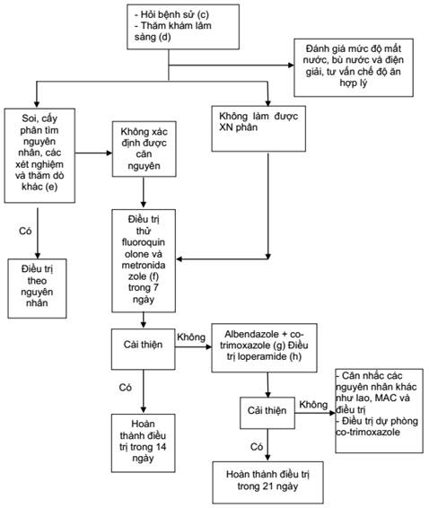
        

          
Figure 6. Thuật Toán Tiếp Cận Tiêu Chảy Mạn Tính Ở Người Lớn (Trang 72)

          Định nghĩa đi phân lỏng &ge; 3 lần/ngày kéo dài &gt; 14 ngày. Quy trình soi phân tìm KST (Kinyoun cải tiến tìm Cryptosporidium, Isospora), cấy phân và điều trị bậc thang.
        

      

      {/* 5. HẠCH TO */}
      
<i class="fa-solid fa-circle-nodes"></i> 5. Tiếp Cận Hội Chứng Hạch To Ở Người Lớn

      

        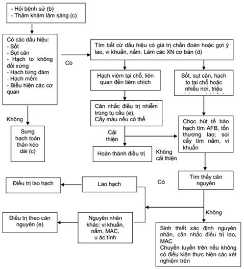
        

          
Figure 7. Thuật Toán Tiếp Cận Hội Chứng Hạch To Ở Người Lớn (Trang 75)

          Phân biệt Bệnh lý hạch toàn thân dai dẳng (PGL không đau) vs Hạch bệnh lý. Chỉ định chọc hút kim nhỏ (FNAC) làm tế bào học, GeneXpert, soi cấy và sinh thiết hạch.
        

      

      {/* 6. NUỐT ĐAU */}
      
<i class="fa-solid fa-utensils"></i> 6. Tiếp Cận Hội Chứng Nuốt Đau (Viêm Thực Quản)

      

        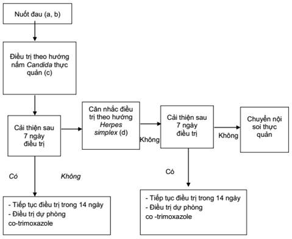
        

          
Figure 8. Thuật Toán Tiếp Cận Hội Chứng Nuốt Đau / Viêm Thực Quản

          Quy trình 3 bước: Điều trị thử Fluconazole (200-300mg/ngày) x 7 ngày &rarr; Nếu không đỡ điều trị Acyclovir x 7 ngày &rarr; Không đỡ chuyển nội soi thực quản sinh thiết tìm CMV, loét áp-tơ, u ác tính.
        

      

      {/* 7. THIẾU MÁU */}
      
<i class="fa-solid fa-droplet"></i> 7. Tiếp Cận Hội Chứng Thiếu Máu Ở Người Lớn

      

        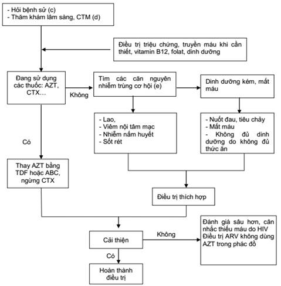
        

          
Figure 9. Thuật Toán Tiếp Cận Hội Chứng Thiếu Máu Ở Người Lớn

          Định nghĩa Hb &lt; 120 g/L (nam) và &lt; 100 g/L (nữ). Rà soát thuốc (AZT, CTX), đánh giá MCV (hồng cầu nhỏ vs to), tìm NTCH, tủy đồ và chuyển đổi phác đồ ARV.
        

      

      {/* 8. DA NIÊM MẠC */}
      
<i class="fa-solid fa-hand-dots"></i> 8. Tiếp Cận Hội Chứng Tổn Thương Da và Niêm Mạc

      

        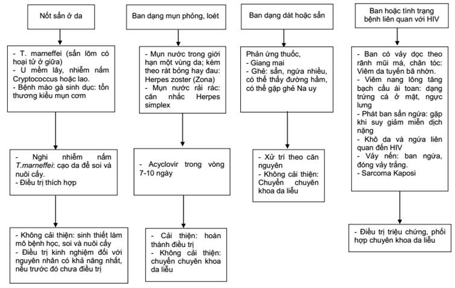
        

          
Figure 10. Thuật Toán Tiếp Cận Tổn Thương Da &amp; Niêm Mạc Ở Người Lớn

          Phân loại dạng tổn thương: Sẩn rốn hoại tử (Talaromyces, Cryptococcus, Molluscum), mụn nước (Zona, HSV), dát sẩn dị ứng thuốc, PPE và Kaposi Sarcoma.
        

      

      {/* 9. SUY MÒN */}
      
<i class="fa-solid fa-weight-scale"></i> 9. Tiếp Cận Hội Chứng Suy Mòn Do HIV (HIV Wasting Syndrome)

      

        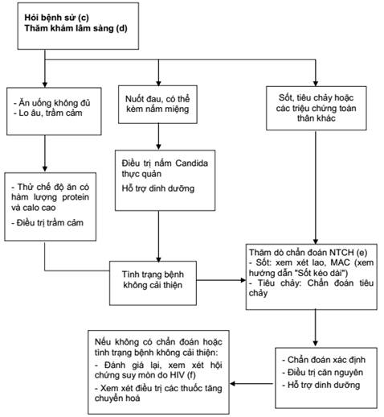
        

          
Figure 11. Thuật Toán Tiếp Cận Hội Chứng Suy Mòn (Wasting Syndrome)

          Tiêu chuẩn chẩn đoán: sụt cân &gt; 10% trọng lượng cơ thể kèm sốt kéo dài &gt; 30 ngày HOẶC tiêu chảy mạn &gt; 30 ngày. Xử trí dinh dưỡng và khởi động ARV TLD lập tức.
        

      

    

  

  {/* PHẦN 13: HỘI CHỨNG LÂM SÀNG TRẺ EM */}
  

    

      
<i class="fa-solid fa-baby"></i>

      <h2 class="sec-title">13. Thuật Toán Tiếp Cận 5 Hội Chứng Lâm Sàng Đặc Thù Ở Trẻ Em</h2>
    

    

      
      {/* 1. SỐT KÉO DÀI Ở TRẺ */}
      
<i class="fa-solid fa-temperature-arrow-up"></i> 1. Hội Chứng Sốt Kéo Dài Ở Trẻ Em Nhiễm HIV

      

        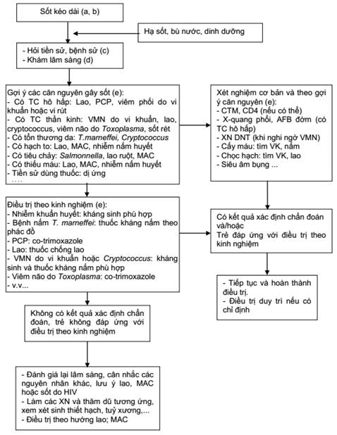
        

          
Figure 12. Thuật Toán Tiếp Cận Sốt Kéo Dài Ở Trẻ Em Nhiễm HIV

          Sốt &gt; 37.5°C kéo dài &gt; 14 ngày. Thăm khám toàn diện cơ quan, soi đáy mắt, cấy máu, GeneXpert dịch dạ dày, chọc DNT và chọc hạch tìm Lao, MAC, Nấm, Salmonella.
        

      

      {/* 2. HÔ HẤP & LIP */}
      
<i class="fa-solid fa-lungs-virus"></i> 2. Biểu Hiện Hô Hấp &amp; Viêm Phổi Kẽ Thâm Nhiễm Lympho Bào (LIP)

      

        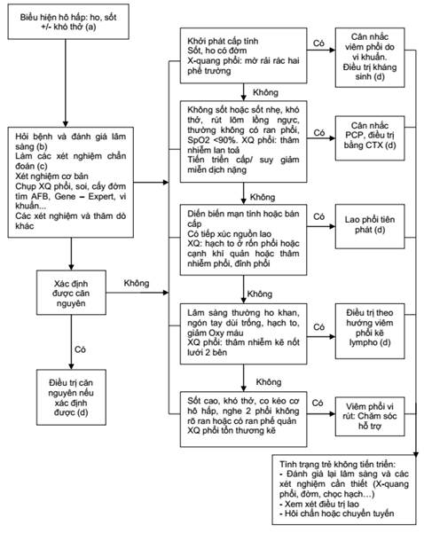
        

          
Figure 13. Thuật Toán Tiếp Cận Triệu Chứng Hô Hấp &amp; Bệnh Phổi Kẽ LIP Ở Trẻ Em

          Phân biệt Viêm phổi vi khuẩn cấp, PCP (rất nặng ở trẻ &lt; 1 tuổi) vs Viêm phổi kẽ thâm nhiễm lympho bào (LIP - ngón tay dùi trống, phì đại tuyến mang tai, thâm nhiễm nốt lưới 2 bên, KHÔNG SỐT, đáp ứng tốt với ARV và Corticoid).
        

      

      {/* 3. THẦN KINH & BỆNH NÃO HIV */}
      
<i class="fa-solid fa-brain"></i> 3. Biểu Hiện Thần Kinh &amp; Bệnh Lý Não Do HIV Ở Trẻ Em

      

        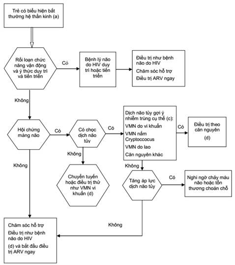
        

          
Figure 14. Thuật Toán Tiếp Cận Biểu Hiện Thần Kinh &amp; Bệnh Lý Não Do HIV (HIV Encephalopathy)

          Phân loại Bệnh lý não tiến triển (mất mốc phát triển tâm thần vận động) vs Não duy trì. Chọc DNT loại trừ nhiễm trùng cấp (Lao màng não, Cryptococcus). Khởi động ARV ngay lập tức là biện pháp điều trị căn nguyên duy nhất.
        

      

      {/* 4. TIÊU CHẢY KÉO DÀI TRẺ EM */}
      
<i class="fa-solid fa-toilet-paper"></i> 4. Tiếp Cận Tiêu Chảy Kéo Dài Ở Trẻ Em

      

        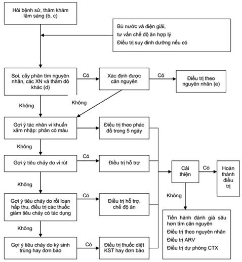
        

          
Figure 15. Thuật Toán Tiếp Cận Tiêu Chảy Kéo Dài Ở Trẻ Em (&gt; 14 Ngày)

          Phân loại 4 nhóm: Vi khuẩn xâm nhập (phân máu &rarr; Kháng sinh), KST/Đơn bào Cryptosporidium/Isospora (soi phân nhuộm ZN cải tiến &rarr; Albendazole + CTX), Rối loạn hấp thu &rarr; Bù kẽm, tránh lactose, và Lao ruột/MAC.
        

      

      {/* 5. CÒI CỌC CHẬM PHÁT TRIỂN */}
      
<i class="fa-solid fa-person-arrow-down-to-line"></i> 5. Còi Cọc Và Chậm Phát Triển Thể Chất Ở Trẻ Em

      

        

          
Phân Độ Mức Độ Nặng

          

            &bull; <strong>Mức độ trung bình:</strong> Trọng lượng theo tuổi/chiều cao bằng 60–80% chuẩn. 
            &bull; <strong>Mức độ nặng:</strong> Trọng lượng &le; 60% chuẩn HOẶC có phù dinh dưỡng (Kwashiorkor) kèm theo.
          

        

        

          
Quy Trình Xử Trí Can Thiệp

          

            &bull; Đánh giá khẩu phần ăn &rarr; Thử nghiệm chế độ ăn giàu năng lượng + Vitamin trong 7 ngày. 
            &bull; Kiểm tra và điều trị nấm miệng <em>Candida</em>, loét miệng HSV làm trẻ không ăn được. 
            &bull; Nếu có sốt hoặc tiêu chảy kéo dài &rarr; Tầm soát Lao, MAC, KST ruột. 
            &bull; Khởi động điều trị ARV càng sớm càng tốt để đảo ngược quá trình suy dinh dưỡng do HIV.
          

        

      

    

  

  {/* CITATION BOX */}
  

    <strong>Tài liệu tham khảo chính thức (Chuẩn AMA):</strong>
    <ol style="margin-left: 1.25rem; margin-top: 0.5rem; line-height: 1.7;">
      <li>Bộ Y tế Việt Nam. <em>Hướng dẫn Điều trị và Chăm sóc HIV/AIDS</em> (Ban hành kèm theo Quyết định số 5456/QĐ-BYT ngày 20 tháng 11 năm 2019 của Bộ trưởng Bộ Y tế). Hà Nội: Bộ Y tế; 2019.</li>
      <li>World Health Organization. <em>Consolidated Guidelines on the Use of Antiretroviral Drugs for Treating and Preventing HIV Infection: Recommendations for a Public Health Approach</em>. 2nd ed. Geneva: World Health Organization; 2016.</li>
      <li>Cục Phòng, chống HIV/AIDS - Bộ Y tế. <em>Báo cáo công tác phòng, chống HIV/AIDS toàn quốc năm 2019</em>. Hà Nội: Cục Phòng, chống HIV/AIDS; 2019.</li>
      <li>Panel on Antiretroviral Guidelines for Adults and Adolescents. <em>Guidelines for the Use of Antiretroviral Agents in Adults and Adolescents Living with HIV</em>. Department of Health and Human Services; 2019.</li>
    </ol>
  

{/* BOTTOM NAVIGATION */}

  

    <a href="#/ebm/kho-guidelines" class="btn btn-primary">
      <i class="fa-solid fa-arrow-left"></i> Quay lại Kho Guidelines
    </a>
    <a href="#sec-phaply-tongquan" class="btn">
      <i class="fa-solid fa-arrow-up"></i> Lên đầu trang
    </a>
  

