

    

      

        
28 CQ + 1 FRQ

        
29 Khuyến cáo lâm sàng GRADE toàn diện

      

      

        
100%

        
Tỷ lệ đồng thuận tuyệt đối của Hội đồng JSGE

      

      

        
OR 0.28

        
Vonoprazan tiệt trừ H. pylori bước 1 vượt trội (p &lt; 0.00001)

      

      

        
RR 0.26

        
PPI phối hợp DAPT giảm 74% nguy cơ xuất huyết (p = 0.0002)

      

    

  

  
  

    
    

      

        

          <i class="fa-solid fa-calculator"></i>
          JSGE 2020: Bộ Công Cụ Tư Vấn Phân Tầng &amp; Ra Quyết Định Lâm Sàng (CDSS)
        

        Hỗ Trợ Quyết Định Tức Thì
      

      

        <button class="cdss-tab-btn active">1. Thuốc Chống Huyết Khối Khi Chảy Máu</button>
        <button class="cdss-tab-btn">2. Phân Tầng Dự Phòng NSAIDs</button>
        <button class="cdss-tab-btn">3. Phân Tầng Dự Phòng Aspirin (LDA)</button>
        <button class="cdss-tab-btn">4. Lựa Chọn Phác Đồ H. pylori</button>
      

      
      

        

          

            <label for="antithromboticType">Nhóm thuốc chống huyết khối đang dùng:</label>
            <select id="antithromboticType" class="form-control-mini">
              <option value="aspirin-mono">Aspirin đơn trị liệu (Nguy cơ huyết khối cao)</option>
              <option value="non-aspirin-antiplatelet">Kháng tiểu cầu khác (Clopidogrel, Ticagrelor, Prasugrel)</option>
              <option value="dapt">Kháng tiểu cầu kép (DAPT: Aspirin + P2Y12)</option>
              <option value="warfarin">Thuốc kháng Vitamin K (Warfarin)</option>
              <option value="doac">Thuốc chống đông đường uống trực tiếp (DOACs)</option>
              <option value="warfarin-antiplatelet">Phối hợp Warfarin + Kháng tiểu cầu</option>
            </select>
          

          

            <label for="thromboticRisk">Nguy cơ biến cố huyết khối tắc mạch của bệnh nhân:</label>
            <select id="thromboticRisk" class="form-control-mini">
              <option value="high">Nguy cơ cao (Stent mạch vành gần đây, đột quỵ thiếu máu não gần, van nhân tạo)</option>
              <option value="low">Nguy cơ thấp / Trung bình (Dự phòng tiên phát, biến cố xa)</option>
            </select>
          

          

            <label for="hemostasisStatus">Tình trạng can thiệp nội soi cầm máu:</label>
            <select id="hemostasisStatus" class="form-control-mini">
              <option value="confirmed">Đã xác nhận cầm máu thành công qua nội soi</option>
              <option value="pending">Chuẩn bị nội soi can thiệp cầm máu</option>
              <option value="failed">Thất bại can thiệp nội soi cầm máu</option>
            </select>
          

        

        

          
        

      

      
      

        

          

            <label for="nsaidUlcerHistory">Tiền sử loét dạ dày - tá tràng:</label>
            <select id="nsaidUlcerHistory" class="form-control-mini">
              <option value="none">Không có tiền sử loét (Ulcer history -)</option>
              <option value="ulcer-non-bleed">Có tiền sử loét (Không có biến chứng chảy máu)</option>
              <option value="ulcer-bleed">Có tiền sử loét biến chứng CHẢY MÁU</option>
            </select>
          

          

            <label for="nsaidAgeCoMeds">Tuổi và thuốc dùng kèm:</label>
            <select id="nsaidAgeCoMeds" class="form-control-mini">
              <option value="standard">Người trẻ / Không dùng kèm thuốc nguy cơ cao</option>
              <option value="elderly">Người cao tuổi (&amp;ge; 65 tuổi) hoặc có bệnh lý nền nặng</option>
              <option value="plus-steroid-anticoag">Dùng kèm Glucocorticoids hoặc Thuốc chống đông</option>
              <option value="plus-lda">Dùng kèm Aspirin liều thấp (LDA)</option>
            </select>
          

          

            <label for="nsaidHpStatus">Tình trạng nhiễm H. pylori &amp; kinh nghiệm dùng NSAIDs:</label>
            <select id="nsaidHpStatus" class="form-control-mini">
              <option value="naive-hp-pos">Chưa từng dùng NSAIDs (NSAID-naïve) &amp; H. pylori (+)</option>
              <option value="naive-hp-neg">Chưa từng dùng NSAIDs &amp; H. pylori (-)</option>
              <option value="chronic-user">Đang sử dụng NSAIDs dài hạn (> 3 tháng)</option>
            </select>
          

        

        

          
        

      

      
      

        

          

            <label for="ldaUlcerHistory">Tiền sử loét / Xuất huyết liên quan LDA:</label>
            <select id="ldaUlcerHistory" class="form-control-mini">
              <option value="none">Không có tiền sử loét (Dự phòng tiên phát)</option>
              <option value="ulcer-non-bleed">Có tiền sử loét không chảy máu</option>
              <option value="ulcer-bleed">Có tiền sử loét BIẾN CHỨNG CHẢY MÁU</option>
            </select>
          

          

            <label for="ldaCoNsaid">Phối hợp thêm thuốc NSAIDs khác:</label>
            <select id="ldaCoNsaid" class="form-control-mini">
              <option value="no">Không dùng kèm NSAIDs</option>
              <option value="yes">Bắt buộc phối hợp thêm NSAIDs</option>
            </select>
          

          

            <label for="ldaHpStatus">Tình trạng xét nghiệm H. pylori:</label>
            <select id="ldaHpStatus" class="form-control-mini">
              <option value="positive">Dương tính với H. pylori (+)</option>
              <option value="negative">Âm tính với H. pylori (-)</option>
              <option value="unknown">Chưa làm xét nghiệm</option>
            </select>
          

        

        

          
        

      

      
      

        

          

            <label for="hpLine">Bước điều trị tiệt trừ:</label>
            <select id="hpLine" class="form-control-mini">
              <option value="line-1">Bước 1 (First-line / Khởi đầu)</option>
              <option value="line-2">Bước 2 (Second-line / Cứu vãn khi thất bại bước 1)</option>
              <option value="line-3">Bước 3 (Third-line / Kháng thuốc bước 1 và 2)</option>
            </select>
          

          

            <label for="hpClariResistance">Tỷ lệ kháng Clarithromycin tại khu vực:</label>
            <select id="hpClariResistance" class="form-control-mini">
              <option value="high">Cao (> 15%, ví dụ Nhật Bản, Việt Nam)</option>
              <option value="low">Thấp (&amp;le; 15%)</option>
            </select>
          

          

            <label for="hpPcabAvail">Tình trạng sẵn có của Vonoprazan (P-CAB):</label>
            <select id="hpPcabAvail" class="form-control-mini">
              <option value="available">Có sẵn Vonoprazan (VPZ 20mg)</option>
              <option value="ppi-only">Chỉ có sẵn PPI tiêu chuẩn (Esomeprazole, Rabeprazole...)</option>
            </select>
          

        

        

          
        

      

    

    
    

      
<i class="fa-solid fa-diagram-project" style="color: var(--accent);"></i> <h2 class="sec-title">Lưu Đồ Thuật Toán Tiếp Cận &amp; Điều Trị Bệnh Loét Dạ Dày - Tá Tràng (JSGE 2020)</h2>

      

        
Sơ đồ phác đồ trực quan hóa toàn bộ lộ trình ra quyết định lâm sàng theo Hướng dẫn JSGE 2020: phân luồng cấp cứu biến chứng (Thủng, Hẹp, Xuất huyết), tiếp cận loét theo căn nguyên (NSAIDs, <em>H. pylori</em>, Vô căn, Mỏm cắt) và chiến lược duy trì phòng ngừa tái phát.

        

          <svg viewBox="0 0 920 540" xmlns="http://www.w3.org/2000/svg" font-family="'Plus Jakarta Sans', 'Inter', sans-serif">
            <defs>
              &lt;marker id="arrow" viewBox="0 0 10 10" refX="6" refY="5" markerWidth="6" markerHeight="6" orient="auto-start-reverse">
                <path d="M 0 1.5 L 8 5 L 0 8.5 z" fill="var(--text-faint)"/>
              &lt;/marker>
              &lt;marker id="arrow-blue" viewBox="0 0 10 10" refX="6" refY="5" markerWidth="6" markerHeight="6" orient="auto-start-reverse">
                <path d="M 0 1.5 L 8 5 L 0 8.5 z" fill="#2563eb"/>
              &lt;/marker>
              &lt;marker id="arrow-red" viewBox="0 0 10 10" refX="6" refY="5" markerWidth="6" markerHeight="6" orient="auto-start-reverse">
                <path d="M 0 1.5 L 8 5 L 0 8.5 z" fill="#dc2626"/>
              &lt;/marker>
            </defs>

            
            <rect x="330" y="20" width="260" height="48" rx="10" fill="var(--surface-2)" stroke="var(--accent)" stroke-width="2"/>
            <text x="460" y="42" font-size="13" font-weight="700" fill="var(--text)" text-anchor="middle">BỆNH NHÂN LOÉT DẠ DÀY - TÁ TRÀNG</text>
            <text x="460" y="56" font-size="10.5" fill="var(--text-muted)" text-anchor="middle">Đánh giá ban đầu &amp; Khảo sát biến chứng</text>

            
            <path d="M 460 68 L 460 105" stroke="var(--text-faint)" stroke-width="1.8" fill="none" marker-end="url(#arrow)"/>

            
            
            <rect x="40" y="115" width="220" height="58" rx="10" fill="var(--red-bg)" stroke="var(--red-light)" stroke-width="1.5"/>
            <text x="150" y="137" font-size="12" font-weight="700" fill="#991b1b" text-anchor="middle">THỦNG HOẶC HẸP MÔN VỊ</text>
            <text x="150" y="155" font-size="10.5" fill="var(--text-muted)" text-anchor="middle">Phẫu thuật / Điều trị bảo tồn</text>

            
            <rect x="340" y="115" width="240" height="58" rx="10" fill="var(--red-bg)" stroke="#dc2626" stroke-width="2"/>
            <text x="460" y="137" font-size="12" font-weight="700" fill="#991b1b" text-anchor="middle">LOÉT BIẾN CHỨNG XUẤT HUYẾT</text>
            <text x="460" y="155" font-size="10.5" fill="var(--text-muted)" text-anchor="middle">Nội soi can thiệp cầm máu</text>

            
            <rect x="650" y="115" width="230" height="58" rx="10" fill="var(--green-bg)" stroke="var(--green-light)" stroke-width="1.5"/>
            <text x="765" y="137" font-size="12" font-weight="700" fill="#065f46" text-anchor="middle">KHÔNG CÓ BIẾN CHỨNG</text>
            <text x="765" y="155" font-size="10.5" fill="var(--text-muted)" text-anchor="middle">Điều trị nội khoa tức thì</text>

            
            <path d="M 460 90 L 150 90 L 150 115" stroke="var(--text-faint)" stroke-width="1.5" fill="none" marker-end="url(#arrow)"/>
            <path d="M 460 90 L 765 90 L 765 115" stroke="var(--text-faint)" stroke-width="1.5" fill="none" marker-end="url(#arrow)"/>

            
            <path d="M 460 173 L 460 210" stroke="var(--text-faint)" stroke-width="1.5" fill="none" marker-end="url(#arrow)"/>
            <rect x="330" y="210" width="260" height="54" rx="10" fill="var(--surface-2)" stroke="var(--border)" stroke-width="1.5"/>
            <text x="460" y="231" font-size="11.5" font-weight="700" fill="var(--text)" text-anchor="middle">PPI Liều Chuẩn + Xem xét IVR/TAE</text>
            <text x="460" y="249" font-size="10" fill="var(--text-muted)" text-anchor="middle">Duy trì Aspirin nếu nguy cơ huyết khối cao</text>

            
            <path d="M 460 264 L 460 300" stroke="var(--text-faint)" stroke-width="1.5" fill="none"/>
            <path d="M 765 173 L 765 300 L 140 300" stroke="var(--text-faint)" stroke-width="1.5" fill="none"/>

            
            
            <path d="M 140 300 L 140 330" stroke="var(--text-faint)" stroke-width="1.5" fill="none" marker-end="url(#arrow)"/>
            <rect x="30" y="330" width="200" height="175" rx="10" fill="var(--surface)" stroke="var(--orange)" stroke-width="1.5"/>
            <rect x="30" y="330" width="200" height="30" rx="10" fill="var(--orange-bg)"/>
            <text x="130" y="350" font-size="11.5" font-weight="700" fill="#92400e" text-anchor="middle">1. LOÉT DO NSAIDs</text>
            <text x="42" y="380" font-size="10.5" font-weight="700" fill="var(--text)">• Ngừng NSAIDs + PPI/VPZ</text>
            <text x="42" y="400" font-size="10" fill="var(--text-muted)">• Nếu bắt buộc dùng tiếp:</text>
            <text x="50" y="418" font-size="10" fill="#2563eb">• Ưu tiên PPI hàng đầu</text>
            <text x="42" y="438" font-size="10" fill="var(--text-muted)">• Bệnh nhân có tiền sử loét:</text>
            <text x="50" y="456" font-size="10" fill="#059669">• Celecoxib + PPI</text>
            <text x="42" y="478" font-size="10" fill="var(--text-muted)">• Tiệt trừ H. pylori nếu naïve</text>

            
            <path d="M 360 300 L 360 330" stroke="var(--text-faint)" stroke-width="1.5" fill="none" marker-end="url(#arrow)"/>
            <rect x="250" y="330" width="205" height="175" rx="10" fill="var(--surface)" stroke="var(--green)" stroke-width="1.5"/>
            <rect x="250" y="330" width="205" height="30" rx="10" fill="var(--green-bg)"/>
            <text x="352" y="350" font-size="11.5" font-weight="700" fill="#065f46" text-anchor="middle">2. NHIỄM H. PYLORI (+)</text>
            <text x="262" y="380" font-size="10.5" font-weight="700" fill="#065f46">• Bước 1: VPZ + Amox + Clari</text>
            <text x="270" y="398" font-size="10" fill="var(--text-muted)">(Hoặc Amox + Metro)</text>
            <text x="262" y="420" font-size="10.5" font-weight="700" fill="#2563eb">• Bước 2: PAM (VPZ/PPI +</text>
            <text x="270" y="438" font-size="10" fill="var(--text-muted)">Amox + Metronidazole)</text>
            <text x="262" y="460" font-size="10.5" font-weight="700" fill="#d97706">• Bước 3: Chứa Sitafloxacin</text>
            <text x="262" y="482" font-size="10" fill="var(--text-muted)">• Thử lại UBT sau 4-8 tuần</text>

            
            <path d="M 580 300 L 580 330" stroke="var(--text-faint)" stroke-width="1.5" fill="none" marker-end="url(#arrow)"/>
            <rect x="475" y="330" width="205" height="175" rx="10" fill="var(--surface)" stroke="var(--blue)" stroke-width="1.5"/>
            <rect x="475" y="330" width="205" height="30" rx="10" fill="var(--blue-bg)"/>
            <text x="577" y="350" font-size="11.5" font-weight="700" fill="#1e40af" text-anchor="middle">3. DÙNG ASPIRIN (LDA)</text>
            <text x="487" y="380" font-size="10.5" font-weight="700" fill="var(--text)">• TIẾP TỤC LDA + PPI</text>
            <text x="487" y="400" font-size="10" fill="var(--text-muted)">• Dự phòng chảy máu:</text>
            <text x="495" y="418" font-size="10" fill="#059669">• PPI hoặc Vonoprazan</text>
            <text x="487" y="438" font-size="10" fill="var(--text-muted)">• Tiền sử chảy máu loét:</text>
            <text x="495" y="456" font-size="10" fill="#2563eb">• Tiệt trừ HP + Duy trì PPI</text>
            <text x="487" y="478" font-size="10" fill="var(--text-muted)">• Nếu phối hợp NSAIDs:</text>
            <text x="495" y="494" font-size="10" fill="#991b1b">• Celecoxib + PPI</text>

            
            <path d="M 800 300 L 800 330" stroke="var(--text-faint)" stroke-width="1.5" fill="none" marker-end="url(#arrow)"/>
            <rect x="700" y="330" width="195" height="175" rx="10" fill="var(--surface)" stroke="var(--purple)" stroke-width="1.5"/>
            <rect x="700" y="330" width="195" height="30" rx="10" fill="var(--purple-bg)"/>
            <text x="797" y="350" font-size="11.5" font-weight="700" fill="#5b21b6" text-anchor="middle">4. THỂ ĐẶC BIỆT</text>
            <text x="710" y="380" font-size="10" font-weight="700" fill="var(--text)">• Loét vô căn (Idiopathic):</text>
            <text x="718" y="398" font-size="9.5" fill="var(--text-muted)">PPI dài hạn / Duy trì H2RA</text>
            <text x="710" y="420" font-size="10" font-weight="700" fill="var(--text)">• Loét mỏm cắt sau mổ:</text>
            <text x="718" y="438" font-size="9.5" fill="var(--text-muted)">Khởi trị ngay bằng PPI</text>
            <text x="710" y="460" font-size="10" font-weight="700" fill="var(--text)">• Loét do thiếu máu:</text>
            <text x="718" y="478" font-size="9.5" fill="var(--text-muted)">PPI/Misoprostol + Chụp mạch</text>
          </svg>
        

      

    

    
    

      
<i class="fa-solid fa-microscope" style="color: var(--blue);"></i> <h2 class="sec-title">1. Phương Pháp Luận Xây Dựng Hướng Dẫn Lâm Sàng JSGE 2020</h2>

      

        

          
<i class="fa-solid fa-circle-info"></i>

          

            <strong>Quy chuẩn GRADE và Tiêu chuẩn Đồng thuận của JSGE</strong>
            Hướng dẫn Thực hành Lâm sàng dựa trên Bằng chứng cho Bệnh Loét Dạ dày - Tá tràng năm 2020 của Hiệp hội Tiêu hóa Nhật Bản (JSGE) được biên soạn theo phương pháp luận chuẩn hóa quốc tế GRADE (Grading of Recommendations Assessment, Development and Evaluation), thu thập dữ liệu y văn từ năm 1983 đến cuối năm 2018 từ Medline, Cochrane Library và Igaku Chuo Zasshi.
          

        

        

          

            
Chất Lượng Bằng Chứng (GRADE) 4 Mức Độ

            

              <ul style="list-style: none; padding-left: 0;">
                <li style="margin-bottom: 0.4rem;"><strong>A (Cao - High):</strong> Rất tự tin rằng hiệu quả thực tế nằm sát với ước tính hiệu quả.</li>
                <li style="margin-bottom: 0.4rem;"><strong>B (Trung bình - Moderate):</strong> Tự tin vừa phải; nghiên cứu tương lai có thể ảnh hưởng đến ước tính.</li>
                <li style="margin-bottom: 0.4rem;"><strong>C (Thấp - Low):</strong> Mức độ tự tin hạn chế; nghiên cứu tiếp theo có khả năng thay đổi kết luận.</li>
<ul style="margin-left: 1.25rem; margin-bottom: 1rem; line-height: 1.65;">
                <li><strong>D (Rất thấp - Very Low):</strong> Rất ít tự tin vào ước tính kết quả lâm sàng hiện tại.</li>
              </ul>
            

          

          

            
Sức Mạnh Khuyến Cáo &amp; Đồng Thuận &amp;ge; 70% Bỏ Phiếu

            

              <ul style="list-style: none; padding-left: 0;">
                <li style="margin-bottom: 0.4rem;"><strong>Khuyến cáo mạnh (Strong Recommendation):</strong> Lợi ích lâm sàng vượt trội rõ rệt so với nguy cơ hoặc ngược lại; áp dụng cho hầu hết bệnh nhân.</li>
                <li style="margin-bottom: 0.4rem;"><strong>Khuyến cáo yếu / Gợi ý (Weak/Suggested):</strong> Cần cân nhắc cá thể hóa dựa trên giá trị và nguyện vọng của người bệnh.</li>
<ul style="margin-left: 1.25rem; margin-bottom: 1rem; line-height: 1.65;">
                <li><strong>Tiêu chuẩn Đồng thuận:</strong> Bắt buộc đạt <strong>&amp;ge; 70% số phiếu tán thành</strong> từ Hội đồng chuyên gia JSGE. Trong bản 2020, 100% các khuyến nghị đều đạt đồng thuận tuyệt đối.</li>
              </ul>
            

          

        

      

    

    
    

      
<i class="fa-solid fa-droplet" style="color: var(--red);"></i> <h2 class="sec-title">2. Quản Lý Loét Xuất Huyết &amp; Bệnh Nhân Dùng Thuốc Chống Huyết Khối (CQ-1 &amp;rarr; CQ-4)</h2>

      

        
Bệnh nhân loét dạ dày - tá tràng xuất huyết (PUB) đang điều trị thuốc chống huyết khối đặt ra bài toán cân bằng khắt khe giữa nguy cơ tử vong do biến cố tắc mạch/nhồi máu cơ tim khi ngưng thuốc và nguy cơ tái xuất huyết tiêu hóa nếu tiếp tục điều trị.

        
        

          

            
CQ-1 Xử Trí Không Nội Soi Với Bệnh Nhân Loét Xuất Huyết Đang Dùng Thuốc Chống Đông / Kháng Tiểu Cầu

            

              Khuyến cáo Mạnh / Yếu (Tùy tình huống)
              Đồng thuận 100%
            

          

          

            <ul>
<ul style="margin-left: 1.25rem; margin-bottom: 1rem; line-height: 1.65;">
              <li><strong>Tiếp tục Aspirin đơn trị:</strong> <strong>Khuyến cáo tiếp tục duy trì sử dụng aspirin</strong> ở những bệnh nhân có nguy cơ cao xảy ra biến cố huyết khối tắc mạch. <em>(Khuyến cáo mạnh, Bằng chứng B)</em>.</li>
              <li><strong>Chuyển đổi kháng tiểu cầu sang Aspirin:</strong> <strong>Gợi ý chuyển đổi các thuốc kháng tiểu cầu khác (P2Y12) sang aspirin</strong> ở bệnh nhân nguy cơ huyết khối cao. <em>(Khuyến cáo yếu, Bằng chứng D)</em>.</li>
              <li><strong>Tạm ngưng kháng tiểu cầu:</strong> <strong>Gợi ý tạm ngưng sử dụng các thuốc kháng tiểu cầu</strong>, ngoại trừ những trường hợp có nguy cơ tắc mạch cao. <em>(Khuyến cáo yếu, Bằng chứng D)</em>.</li>
              <li><strong>Xử trí Warfarin:</strong> <strong>Khuyến cáo tạm ngưng sử dụng warfarin</strong> nếu thực sự cần thiết chuẩn bị nội soi can thiệp cầm máu. Khi ngừng warfarin, <strong>gợi ý sử dụng heparin bắc cầu</strong> hoặc nhanh chóng dùng lại warfarin ngay khi cầm máu ổn định. <em>(Khuyến cáo mạnh, Bằng chứng C)</em>.</li>
              <li><strong>Dùng lại DOACs:</strong> <strong>Gợi ý sử dụng lại các thuốc chống đông đường uống trực tiếp (DOACs) sớm (trong vòng 1 - 2 ngày)</strong> sau khi xác nhận cầm máu thành công qua nội soi. <em>(Khuyến cáo yếu, Bằng chứng D)</em>.</li>
              <li><strong>Phối hợp Kháng tiểu cầu và Warfarin:</strong> <strong>Gợi ý chuyển đổi kháng tiểu cầu sang aspirin hoặc cilostazol</strong>, đồng thời duy trì warfarin có kiểm soát PT-INR chặt chẽ, hoặc chuyển sang heparin. <em>(Khuyến cáo yếu, Bằng chứng D)</em>.</li>
              <li><strong>Liệu pháp Kháng tiểu cầu kép (DAPT):</strong> Ở bệnh nhân đang dùng DAPT, <strong>khuyến cáo tiếp tục duy trì đơn trị liệu aspirin</strong>. <em>(Khuyến cáo mạnh, Bằng chứng D)</em>.</li>
            </ul>
          

          

            <i class="fa-solid fa-stethoscope"></i> Cốt lõi lâm sàng: Việc tiếp tục aspirin giúp giảm tỷ lệ tử vong chung liên quan đến biến cố tim mạch mà không làm tăng đáng kể tử vong do xuất huyết.
            GRADE B / C / D
          

        

        
        

          

            
CQ-2 Vai Trò Của X-quang Can Thiệp - Nút Mạch (IVR / TAE) Trong Xuất Huyết Kháng Trị

            

              Khuyến cáo Yếu
              Bằng chứng C
              Đồng thuận 100%
            

          

          

            Ở những bệnh nhân loét dạ dày - tá tràng xuất huyết nặng, kháng trị với các biện pháp can thiệp qua nội soi, <strong>phương pháp can thiệp mạch qua da - nút mạch chọn lọc (Interventional Radiology - IVR / Transcatheter Arterial Embolization - TAE) được gợi ý lựa chọn</strong> nhờ tính an toàn cao và hạn chế xâm lấn. Dữ liệu phân tích gộp cho thấy tuy IVR có tỷ lệ tái chảy máu cao hơn phẫu thuật mở cấp cứu, nhưng không có sự khác biệt có ý nghĩa về tỷ lệ tử vong, nhu cầu can thiệp bổ sung hay biến chứng chung.
          

        

        
        

          

            
CQ-3 Sử Dụng Thuốc Kháng Tiết Acid (PPI) Sau Can Thiệp Nội Soi Cầm Máu

            

              Khuyến cáo Mạnh
              Bằng chứng A
              Đồng thuận 100%
            

          

          

            <strong>Khuyến cáo mạnh mẽ sử dụng thuốc ức chế bơm proton (PPI) sau can thiệp nội soi cầm máu thành công</strong> nhằm giảm tỷ lệ tái xuất huyết, giảm nhu cầu truyền máu, rút ngắn ngày nằm viện và giảm tỷ lệ phải phẫu thuật cấp cứu.
            

              
<i class="fa-solid fa-triangle-exclamation"></i>

              

                <strong>Lưu ý về liều lượng &amp; đường dùng PPI theo JSGE 2020:</strong>
                Phân tích gộp chỉ ra liệu pháp PPI liều cao (high-dose) truyền tĩnh mạch liên tục <em>không cho thấy hiệu quả vượt trội hơn</em> so với PPI liều tiêu chuẩn (non-high-dose) về tỷ lệ tái chảy máu hay tử vong. Đồng thời không có sự khác biệt có ý nghĩa lâm sàng giữa PPI đường uống và đường tĩnh mạch. Tuy nhiên, PPI tĩnh mạch vượt trội hoàn toàn so với thuốc kháng thụ thể histamine-2 (H2RA).
              

            

          

        

        
        

          

            
CQ-4 Dự Phòng Xuất Huyết Tiêu Hóa Ở Bệnh Nhân Sử Dụng Thuốc Chống Huyết Khối

            

              Khuyến cáo Mạnh / Yếu
              Đồng thuận 100%
            

          

          

            <ul>
<ul style="margin-left: 1.25rem; margin-bottom: 1rem; line-height: 1.65;">
              <li><strong>Bệnh nhân dùng Kháng tiểu cầu kép (DAPT):</strong> <strong>Khuyến cáo phối hợp sử dụng PPI</strong> để dự phòng biến chứng xuất huyết tiêu hóa trên (UGIB). <em>(Khuyến cáo mạnh, Bằng chứng A)</em>.</li>
              <li><strong>Bệnh nhân dùng Warfarin:</strong> <strong>Gợi ý phối hợp sử dụng PPI</strong> để dự phòng xuất huyết ở bệnh nhân điều trị bằng warfarin có kết hợp thêm kháng tiểu cầu hoặc NSAIDs. <em>(Khuyến cáo yếu, Bằng chứng C)</em>.</li>
            </ul>
          

        

        
        

          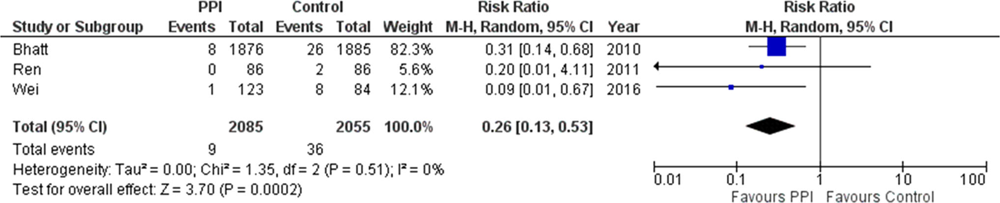
          

            
Figure 1. Forest plots of proton pump inhibitors (PPIs) against control for upper gastrointestinal bleeding preventive effect in dual antiplatelet therapy (DAPT)

            Biểu đồ Forest plot phân tích gộp từ 3 thử nghiệm lâm sàng ngẫu nhiên có đối chứng (Bhatt 2010 - thử nghiệm COGENT, Ren 2011, Wei 2016) so sánh hiệu quả dự phòng xuất huyết tiêu hóa trên giữa nhóm phối hợp PPI và nhóm chứng ở bệnh nhân dùng DAPT. Kết quả chứng minh phối hợp PPI giúp giảm mạnh và có ý nghĩa thống kê nguy cơ xuất huyết tiêu hóa trên với <strong>Tỷ số nguy cơ gộp (Risk Ratio - RR) đạt 0.26 (95% CI: 0.13 - 0.53, P = 0.0002)</strong>.
          

        

      

    

    
    

      
<i class="fa-solid fa-bacterium" style="color: var(--green);"></i> <h2 class="sec-title">3. Liệu Pháp Tiệt Trừ Helicobacter pylori &amp; Điều Trị Không Tiệt Trừ (CQ-5 &amp;rarr; CQ-10)</h2>

      

        
Mức độ và thời gian ức chế acid dạ dày là yếu tố quyết định hàng đầu tỷ lệ thành công của liệu pháp kháng sinh tiệt trừ <em>H. pylori</em>. JSGE 2020 đánh dấu bước ngoặt lớn với sự xuất hiện của chất ức chế acid cạnh tranh kali (P-CAB, Vonoprazan).

        
        

          

            
CQ-5 Phác Đồ Tiệt Trừ Bước 1 (First-Line Eradication Therapy)

            

              Khuyến cáo Mạnh
              Bằng chứng A
              Đồng thuận 100%
            

          

          

            <ul>
<ul style="margin-left: 1.25rem; margin-bottom: 1rem; line-height: 1.65;">
              <li><strong>Phác đồ chứa Vonoprazan (P-CAB):</strong> <strong>Khuyến cáo sử dụng phác đồ 3 thuốc chứa Vonoprazan (VPZ 20mg x 2 lần/ngày)</strong> phối hợp Amoxicillin (750mg-1000mg x 2 lần/ngày) và Clarithromycin (200mg-400mg x 2 lần/ngày) trong 7 ngày làm phác đồ đầu tay nhờ đạt tỷ lệ tiệt trừ vi khuẩn vượt trội rõ rệt so với phác đồ chứa PPI thông thường. <em>(Khuyến cáo mạnh, Bằng chứng A)</em>.</li>
              <li><strong>Khi kháng Clarithromycin cao (> 15%):</strong> Phối hợp <strong>Amoxicillin + Metronidazole</strong> được khuyến cáo mạnh mẽ.</li>
              <li><strong>Nếu sử dụng PPI:</strong> Gợi ý áp dụng liệu pháp nối tiếp (sequential therapy) hoặc phác đồ 4 thuốc đồng thời (concomitant quadruple therapy) để tối ưu hóa tỷ lệ tiệt trừ so với phác đồ 3 thuốc tiêu chuẩn. <em>(Khuyến cáo yếu, Bằng chứng A)</em>.</li>
            </ul>
          

        

        
        

          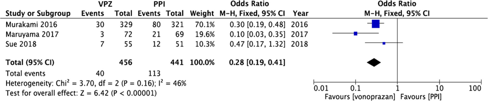
          

            
Figure 2. Forest plots of eradication rates of first-line therapy between vonoprazan-containing triple therapy and proton pump inhibitor (PPI)-containing triple therapy in RCTs

            Biểu đồ phân tích gộp từ 3 thử nghiệm lâm sàng ngẫu nhiên có đối chứng (Murakami 2016, Maruyama 2017, Sue 2018) so sánh giữa phác đồ 3 thuốc chứa VPZ và phác đồ chứa PPI ở bước 1. Kết quả khẳng định phác đồ chứa VPZ đạt hiệu quả tiệt trừ vi khuẩn cao vượt trội và có ý nghĩa thống kê rất mạnh so với PPI, với <strong>Tỷ số chênh (Odds Ratio - OR) đạt 0.28 (95% CI: 0.19 - 0.41, P &lt; 0.00001)</strong>.
          

        

        
        

          

            
CQ-6 Phác Đồ Tiệt Trừ Cứu Vãn Bước 2 (Second-Line Salvage Therapy)

            

              Khuyến cáo Mạnh
              Bằng chứng A
              Đồng thuận 100%
            

          

          

            <strong>Khuyến cáo phác đồ 3 thuốc phối hợp PPI hoặc VPZ, Amoxicillin và Metronidazole (PAM)</strong> trong 7 ngày làm liệu pháp cứu vãn bước 2 sau khi thất bại với phác đồ bước 1.
          

        

        
        

          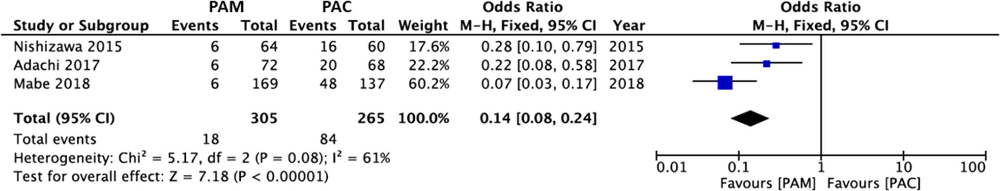
          

            
Figure 3. Forest plots of eradication rates of second-line therapy between PAM and PAC therapy in RCTs in Japan

            Phân tích gộp từ các thử nghiệm ngẫu nhiên tại Nhật Bản (Nishizawa 2015, Adachi 2017, Mabe 2018) so sánh giữa phác đồ PAM (chứa Metronidazole) và phác đồ PAC (chứa Clarithromycin) ở bước 2. Phác đồ PAM đạt tỷ lệ tiệt trừ cao hơn hẳn PAC, với <strong>Tỷ số chênh (Odds Ratio - OR) đạt 0.14 (95% CI: 0.08 - 0.24, P &lt; 0.00001)</strong>.
          

        

        
        

          

            
CQ-7: Phác Đồ Tiệt Trừ Bước 3 Yếu - Bằng chứng B

            

              Gợi ý phác đồ 3 thuốc phối hợp <strong>PPI + Sitafloxacin + Metronidazole</strong> HOẶC <strong>PPI + Sitafloxacin + Amoxicillin</strong>. Dữ liệu ghi nhận tỷ lệ tiệt trừ đạt từ 70.0% đến 90.9%. Do tỷ lệ chưa đạt mức tối ưu lý tưởng, phác đồ này chỉ dừng ở mức độ gợi ý.
            

          

          

            
CQ-8: Điều Trị Duy Trì Sau Tiệt Trừ Yếu - Bằng chứng D

            

              Khi nguyên nhân gây tái phát loét sau tiệt trừ thành công <em>H. pylori</em> không rõ ràng (loét vô căn/idiopathic ulcers), <strong>gợi ý điều trị duy trì kéo dài bằng PPI hoặc H2RA</strong> để ngăn ngừa tái phát.
            

          

          

            
CQ-9: Điều Trị Ban Đầu Loét Dạ Dày Mạnh - Bằng chứng A

            

              <strong>Khuyến cáo lựa chọn PPI hoặc P-CAB (Vonoprazan)</strong> làm thuốc hàng đầu. Lựa chọn thay thế bước 1: H2RAs <em>(Mạnh, B)</em>. Thay thế bước 2: Pirenzepine, Sucralfate hoặc Misoprostol <em>(Yếu, B)</em>.
            

          

          

            
CQ-10: Điều Trị Ban Đầu Loét Tá Tràng Mạnh - Bằng chứng A

            

              <strong>Khuyến cáo lựa chọn PPI hoặc P-CAB</strong> làm thuốc hàng đầu. Nếu không thể dùng PPI/P-CAB: Khuyến cáo dùng H2RAs <em>(Mạnh, B)</em>; Thay thế bước 2: Pirenzepine, Sucralfate hoặc Misoprostol <em>(Yếu, B)</em>.
            

          

        

      

    

    
    

      
<i class="fa-solid fa-pills" style="color: var(--orange);"></i> <h2 class="sec-title">4. Sinh Lý Bệnh, Điều Trị &amp; Dự Phòng Loét Do Thuốc NSAIDs (CQ-11 &amp;rarr; CQ-17)</h2>

      

        
Thuốc kháng viêm không steroid không chọn lọc (nonselective NSAIDs) phá hủy hàng rào chất nhầy và biểu mô bảo vệ dạ dày tá tràng qua ức chế COX-1 làm cạn kiệt prostaglandin sinh lý.

        
        

          

            
CQ-11 Nguyên Tắc Điều Trị Loét Dạ Dày - Tá Tràng Do NSAIDs

            

              Khuyến cáo Mạnh
              Bằng chứng A
              Đồng thuận 100%
            

          

          

            <ul>
<ul style="margin-left: 1.25rem; margin-bottom: 1rem; line-height: 1.65;">
              <li><strong>Ngừng thuốc NSAIDs:</strong> Khi xuất hiện ổ loét, khuyến cáo hàng đầu là <strong>ngừng sử dụng NSAIDs và bắt đầu điều trị bằng các thuốc chống loét (PPI hoặc P-CAB)</strong>.</li>
              <li><strong>Trường hợp bắt buộc phải tiếp tục sử dụng NSAIDs:</strong> Nếu bệnh lý cơ xương khớp/tim mạch bắt buộc tiếp tục dùng NSAIDs, <strong>thuốc ức chế bơm proton (PPIs) được khuyến cáo là lựa chọn số 1</strong> để làm liền ổ loét. Tỷ lệ liền sẹo loét sau 8 tuần ở nhóm dùng PPI vượt trội hoàn toàn so với H2RA hoặc chất đồng đẳng prostaglandin.</li>
            </ul>
          

        

        
        

          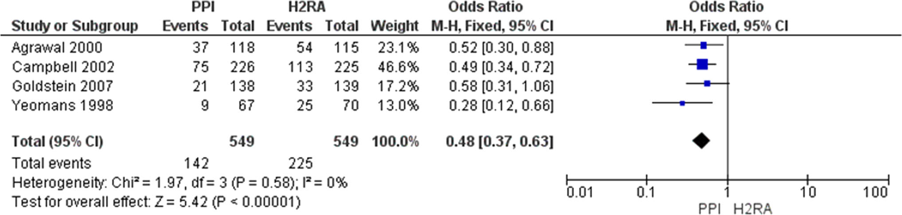
          

            
Figure 4. Meta-analysis of comparison of ulcer curative effect between PPI and H2RA under the NSAIDs continuation

            Phân tích gộp từ 4 thử nghiệm lâm sàng ngẫu nhiên có đối chứng (Agrawal 2000, Campbell 2002, Goldstein 2007, Yeomans 1998). Tỷ lệ liền sẹo loét dạ dày tá tràng sau 8 tuần ở nhóm điều trị bằng PPI cao hơn rõ rệt và có ý nghĩa thống kê so với H2RA khi vẫn tiếp tục dùng NSAID, với <strong>Tỷ số chênh gộp (Odds Ratio - OR) đạt 0.48 (95% CI: 0.37 - 0.63, P &lt; 0.00001)</strong>.
          

        

        
        

          

            
CQ-12: Tiệt Trừ H. pylori Khi Dùng NSAIDs Mạnh - Bằng chứng A

            

              <strong>Khuyến cáo tiệt trừ H. pylori</strong> ở bệnh nhân <em>chưa từng dùng NSAIDs (NSAID-naïve)</em> chuẩn bị bắt đầu dùng thuốc. Tuy nhiên, ở bệnh nhân <em>đã dùng NSAIDs dài hạn</em>, tiệt trừ đơn thuần không đủ để dự phòng loét tái phát mà bắt buộc phải duy trì PPI.
            

          

          

            
CQ-13: Dự Phòng Tiên Phát Loét NSAIDs Mạnh - Bằng chứng A

            

              Đối với bệnh nhân sử dụng NSAIDs kéo dài hơn 3 tháng và không có tiền sử loét, <strong>khuyến cáo sử dụng PPI để dự phòng tiên phát tổn thương niêm mạc</strong>. PPI thể hiện hiệu quả bảo vệ mạnh hơn rõ rệt so với H2RA liều thông thường.
            

          

          

            
CQ-14: Dự Phòng Thứ Phát (Có Tiền Sử Loét) Mạnh - Bằng chứng A

            

              <strong>Tiền sử loét không chảy máu:</strong> Khuyến cáo dùng PPI hoặc gợi ý Vonoprazan (VPZ). 
              <strong>Tiền sử loét biến chứng chảy máu:</strong> Khuyến cáo phối hợp <strong>thuốc ức chế chọn lọc COX-2 (Celecoxib) + thuốc PPI</strong>.
            

          

          

            
CQ-15: Người Cao Tuổi &amp; Bệnh Nền Nặng Mạnh - Bằng chứng B

            

              <strong>Khuyến cáo sử dụng PPI</strong> để dự phòng ở bệnh nhân cao tuổi (&amp;ge; 65 tuổi) hoặc có bệnh nền nặng. Nếu dùng kèm glucocorticoids hoặc thuốc chống đông, <strong>chuyển đổi sang thuốc ức chế chọn lọc COX-2</strong> được khuyến cáo.
            

          

          

            
CQ-16: Lợi Thế Của Thuốc Chọn Lọc COX-2 Mạnh - Bằng chứng A

            

              <strong>Khuyến cáo lựa chọn thuốc ức chế chọn lọc COX-2</strong> thay thế cho NSAIDs không chọn lọc để làm giảm đáng kể nguy cơ hình thành loét dạ dày, loét tá tràng và các biến chứng chảy máu tiêu hóa nặng.
            

          

          

            
CQ-17: Dự Phòng Khi Đang Dùng COX-2 Mạnh - Bằng chứng B

            

              <strong>Có tiền sử loét hoặc chảy máu:</strong> Khuyến cáo phối hợp thêm PPI. 
              <strong>Không có tiền sử loét:</strong> Không cần thiết phải sử dụng thêm thuốc dự phòng.
            

          

        

        
        

          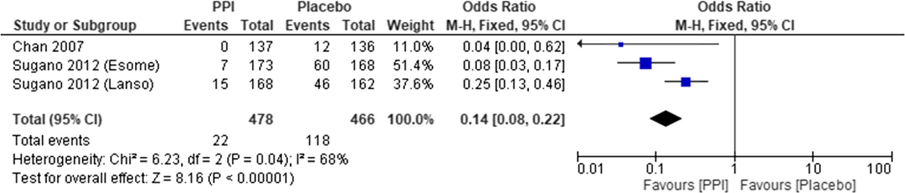
          

            
Figure 5. Meta-analysis of preventive effect in the secondary prevention of NSAIDs ulcer

            Phân tích gộp từ 3 RCTs (Chan 2007, Sugano 2012 Esomeprazole, Sugano 2012 Lansoprazole) cho thấy tỷ lệ tái phát loét ở nhóm duy trì PPI thấp hơn rõ rệt so với giả dược ở bệnh nhân có tiền sử loét phải dùng NSAID dài hạn, với <strong>Tỷ số chênh gộp (Odds Ratio) đạt 0.14 (95% CI: 0.08 - 0.22, P &lt; 0.00001)</strong>.
          

        

        
        

          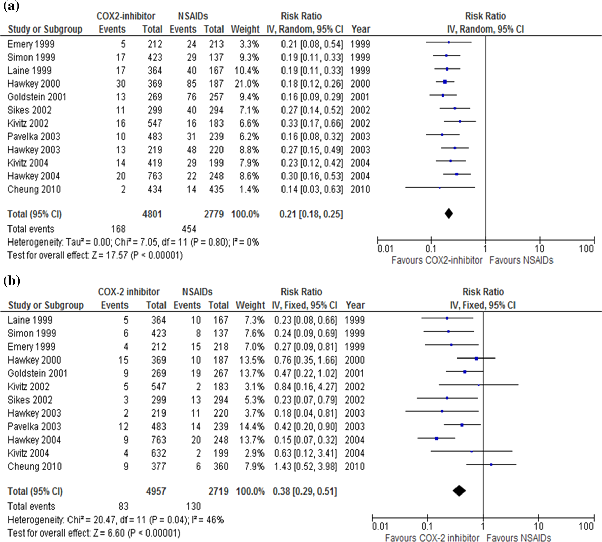
          

            
Figure 6. Forest plots of peptic ulcer risk between COX-2 selective inhibitor and NSAID therapy (a: gastric ulcer, b: duodenal ulcer)

            Phân tích gộp từ 12 thử nghiệm lâm sàng ngẫu nhiên đối đầu trực tiếp chứng minh: <strong>(a) Loét dạ dày:</strong> Thuốc ức chế chọn lọc COX-2 giảm mạnh nguy cơ loét so với NSAIDs không chọn lọc với <strong>RR = 0.21 (95% CI: 0.18 - 0.25, P &lt; 0.00001)</strong>; <strong>(b) Loét tá tràng:</strong> Nguy cơ cũng giảm mạnh với <strong>RR = 0.38 (95% CI: 0.29 - 0.51, P &lt; 0.00001)</strong>.
          

        

        
        

          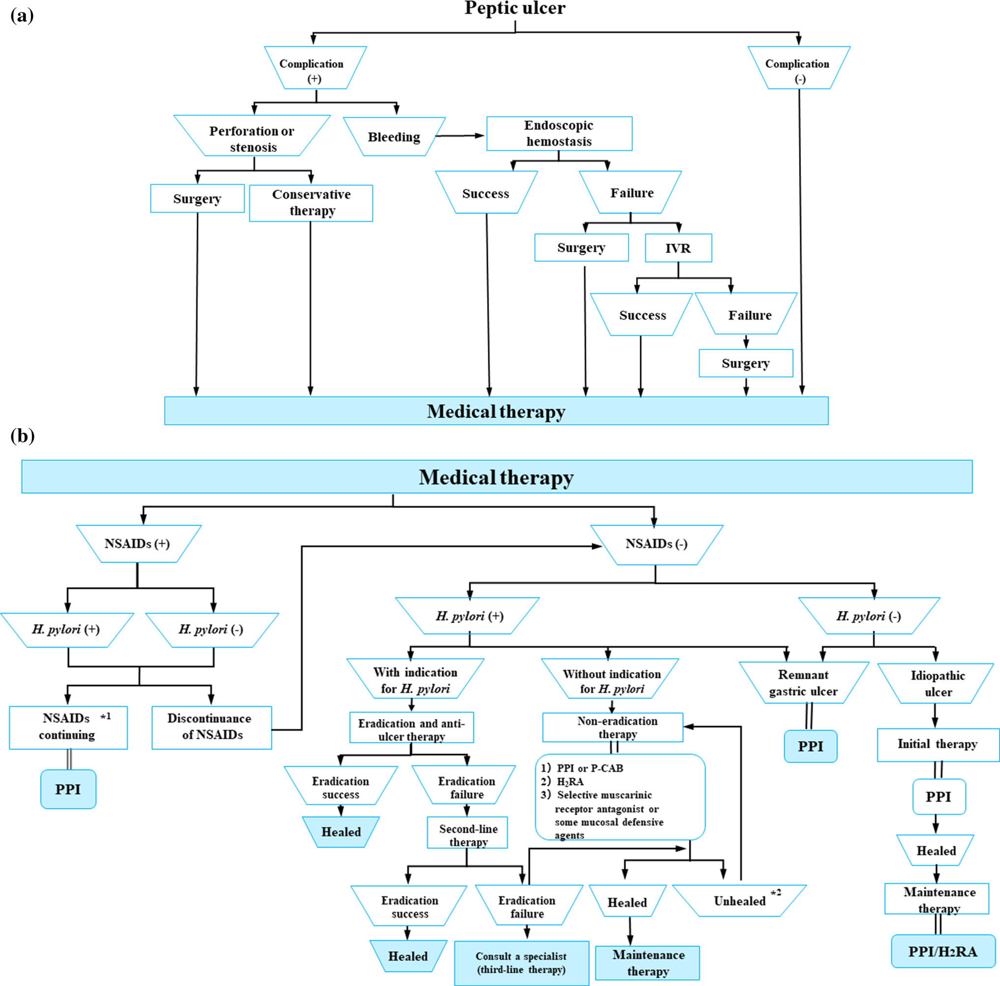
          

            
Figure 9. Algorithm for the treatment of peptic ulcer disease (Official JSGE 2020)

            Lưu đồ thuật toán chính thức của JSGE 2020 về điều trị bệnh loét dạ dày - tá tràng: (Fig 9a) Xử trí biến chứng trước (thủng/hẹp môn vị điều trị ngoại khoa hoặc bảo tồn; loét xuất huyết can thiệp nội soi cầm máu, nếu thất bại tiến hành nút mạch IVR hoặc phẫu thuật; nếu không có biến chứng tiến hành điều trị nội khoa ngay lập tức); (Fig 9b) Phân luồng điều trị nội khoa theo căn nguyên (loét do NSAIDs ngừng thuốc + chống loét, nếu không ngừng được thì dùng PPI; loét không do NSAIDs xét nghiệm <em>H. pylori</em> để tiệt trừ bước 1/2/3; loét không tiệt trừ điều trị tấn công + duy trì; loét mỏm cắt dùng PPI; loét vô căn dùng PPI tiếp nối điều trị duy trì).
          

        

        
        

          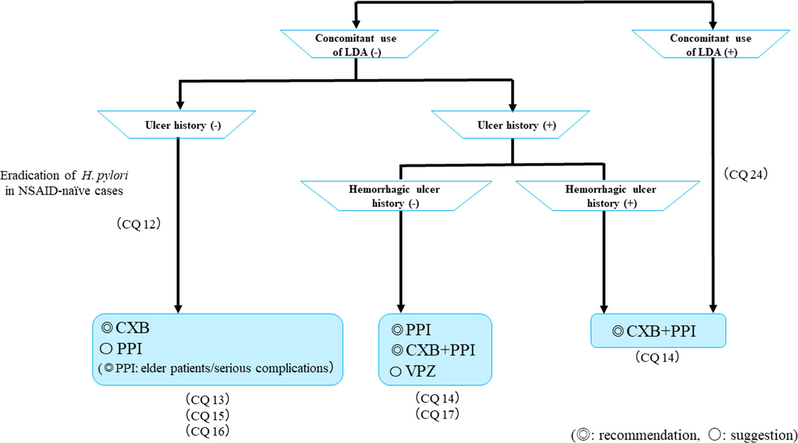
          

            
Figure 10. Algorithm for the prevention of NSAID-induced ulcers (Official JSGE 2020)

            Lưu đồ phân tầng và lựa chọn thuốc dự phòng loét khi điều trị bằng NSAIDs: <strong>Không có tiền sử loét (Ulcer history -):</strong> Lựa chọn Celecoxib (CXB) hoặc gợi ý PPI (bắt buộc PPI cho người già hoặc bệnh nặng; tiệt trừ HP nếu chưa từng dùng NSAID); <strong>Có tiền sử loét không chảy máu (Ulcer history +):</strong> Dùng PPI &amp;plusmn; CXB, hoặc Vonoprazan (VPZ); <strong>Có tiền sử loét chảy máu (Hemorrhagic ulcer +):</strong> Phối hợp CXB + PPI; <strong>Phối hợp NSAID + Aspirin liều thấp (LDA):</strong> Phối hợp CXB + PPI.
          

        

      

    

    
    

      
<i class="fa-solid fa-heart-pulse" style="color: var(--teal);"></i> <h2 class="sec-title">5. Sinh Lý Bệnh &amp; Dự Phòng Loét Do Aspirin Liều Thấp (LDA) (CQ-18 &amp;rarr; CQ-25)</h2>

      

        
Aspirin liều thấp (LDA, 75 - 100 mg/ngày) ức chế không hồi phục enzyme COX-1 tiểu cầu, làm suy giảm dòng máu nuôi niêm mạc và gia tăng nguy cơ loét cũng như chảy máu tiêu hóa nghiêm trọng.

        
        

          

            
CQ-18 Nguyên Tắc Điều Trị Loét Xuất Hiện Trong Khi Đang Dùng Aspirin Liều Thấp (LDA)

            

              Khuyến cáo Mạnh
              Bằng chứng B
              Đồng thuận 100%
            

          

          

            <strong>Khuyến cáo phối hợp sử dụng PPI đồng thời với việc TIẾP TỤC duy trì liệu pháp LDA</strong> đối với các ổ loét xuất hiện trong quá trình dùng thuốc (sau khi đã can thiệp cầm máu nội soi ổn định). Việc tiếp tục duy trì LDA giúp giảm đáng kể tỷ lệ tử vong chung liên quan đến các biến cố huyết khối tim mạch và mạch máu não, trong khi PPI đảm bảo tốc độ liền sẹo ổ loét mà không làm tăng nguy cơ chảy máu tái phát.
          

        

        
        

          

            
CQ-19: Dự Phòng Loét Do LDA Nói Chung Mạnh - Bằng chứng A

            

              <strong>Khuyến cáo sử dụng PPIs hoặc H2RAs</strong> để làm giảm tỷ lệ xuất hiện loét do LDA. Phân tích gộp độc lập của JSGE cho thấy không có sự khác biệt có ý nghĩa thống kê về tỷ lệ ngăn ngừa loét nói chung giữa hai nhóm này.
            

          

          

            
CQ-20: Dự Phòng Biến Chứng CHẢY MÁU Do LDA Mạnh - Bằng chứng A

            

              <strong>Khuyến cáo lựa chọn PPIs hoặc Vonoprazan (VPZ)</strong> để dự phòng nguy cơ xuất huyết tiêu hóa do LDA. PPIs vượt trội rõ rệt so với H2RAs trong việc ngăn ngừa biến chứng chảy máu. Vonoprazan (10mg, 20mg) không kém hơn (non-inferior) lansoprazole 15mg.
            

          

          

            
CQ-21: Vai Trò Tiệt Trừ H. pylori Khi Dùng LDA Mạnh - Bằng chứng A

            

              Đối với bệnh nhân nhiễm <em>H. pylori</em> có tiền sử chảy máu do loét liên quan LDA, <strong>khuyến cáo phối hợp liệu pháp tiệt trừ vi khuẩn cùng với việc duy trì sử dụng thuốc PPI</strong> để giảm tối đa tái phát xuất huyết. Tiệt trừ đơn thuần không đảm bảo an toàn.
            

          

          

            
CQ-22 &amp; CQ-23: Dự Phòng Tiên Phát &amp; Thứ Phát Mạnh - Bằng chứng A

            

              <strong>Dự phòng thứ phát (có tiền sử loét):</strong> Khuyến cáo PPI hoặc VPZ hàng đầu; H2RA chỉ xếp mức gợi ý <em>(Yếu, B)</em>. 
              <strong>Dự phòng tiên phát (chưa có tiền sử loét):</strong> Khuyến cáo sử dụng PPI <em>(Mạnh, A)</em>.
            

          

          

            
CQ-24 &amp; CQ-25: Phối Hợp Đồng Thời Aspirin (LDA) và Thuốc NSAIDs Mạnh - Bằng chứng B

            

              Khi bệnh nhân bắt buộc phải sử dụng đồng thời cả LDA và NSAIDs, <strong>khuyến cáo lựa chọn thuốc ức chế chọn lọc COX-2 (Celecoxib) phối hợp với một thuốc PPI</strong> để giảm thiểu tối đa nguy cơ tổn thương niêm mạc và xuất huyết so với việc dùng NSAIDs không chọn lọc + LDA.
            

          

        

        
        

          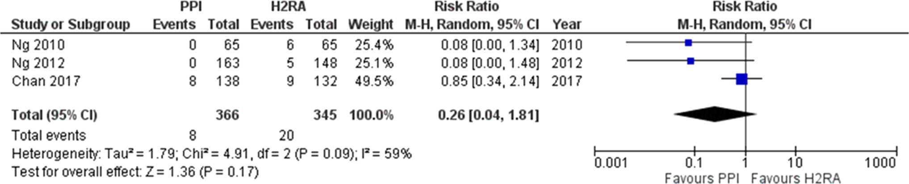
          

            
Figure 7. Effects of proton pump inhibitors (PPIs) and histamine 2-receptor antagonists (H2RAs) in preventing upper GI ulcers related to low dose aspirin (LDA)

            Phân tích gộp từ 3 nghiên cứu ngẫu nhiên (Ng 2010, Ng 2012, Chan 2017) cho thấy <strong>không có sự khác biệt có ý nghĩa thống kê</strong> về hiệu quả ngăn ngừa hình thành ổ loét dạ dày - tá tràng nói chung giữa nhóm PPI và nhóm H2RA ở bệnh nhân điều trị bằng LDA, với <strong>Tỷ số nguy cơ gộp (Risk Ratio - RR) đạt 0.26 (95% CI: 0.04 - 1.81, P = 0.17)</strong>.
          

        

        
        

          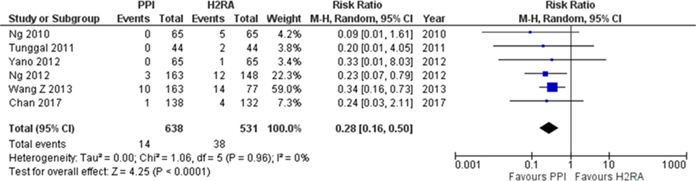
          

            
Figure 8. Effects of proton pump inhibitors (PPIs) and histamine 2-receptor antagonists (H2RAs) in preventing upper GI ulcer bleeding related to low dose aspirin (LDA)

            Phân tích gộp từ 6 RCTs (Ng 2010, Tunggal 2011, Yano 2012, Ng 2012, Wang Z 2013, Chan 2017). Kết quả chứng minh <strong>PPIs vượt trội rõ rệt và có ý nghĩa thống kê so với H2RAs trong việc ngăn ngừa biến chứng CHẢY MÁU tiêu hóa do LDA</strong> với <strong>Tỷ số nguy cơ gộp đạt 0.28 (95% CI: 0.16 - 0.50, P &lt; 0.0001)</strong>.
          

        

        
        

          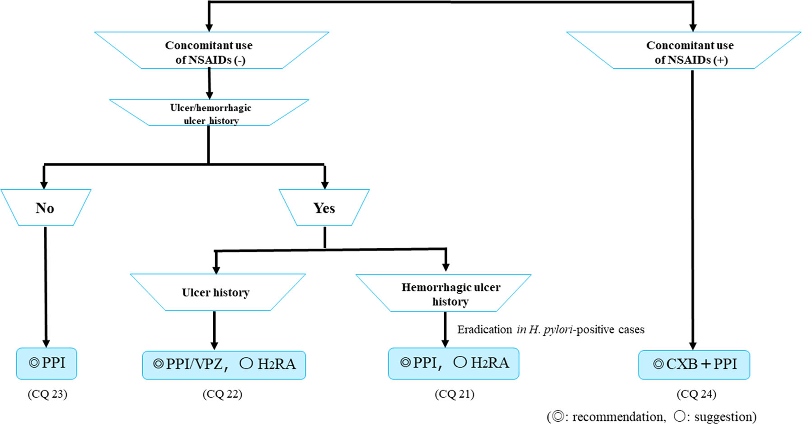
          

            
Figure 11. Algorithm for the prevention of LDA-related ulcers (Official JSGE 2020)

            Lưu đồ thuật toán chính thức của JSGE 2020 về dự phòng loét khi điều trị bằng LDA: <strong>Không có tiền sử loét (Ulcer/hemorrhagic history -):</strong> Khuyến cáo sử dụng PPI; <strong>Có tiền sử loét không chảy máu (Ulcer history):</strong> Khuyến cáo PPI hoặc Vonoprazan (VPZ), gợi ý cân nhắc H2RA; <strong>Có tiền sử loét biến chứng chảy máu (Hemorrhagic ulcer history):</strong> Khuyến cáo dùng PPI, tiệt trừ <em>H. pylori</em> nếu dương tính; <strong>Phối hợp LDA và NSAIDs:</strong> Khuyến cáo dùng Celecoxib + PPI.
          

        

      

    

    
    

      
<i class="fa-solid fa-hospital-user" style="color: var(--purple);"></i> <h2 class="sec-title">6. Xử Trí Loét Vô Căn, Loét Mỏm Cắt Dạ Dày, Phẫu Thuật &amp; Thiếu Máu Cục Bộ (CQ-26 &amp;rarr; CQ-28, FRQ-1)</h2>

      

        
        

          

            
CQ-26 Điều Trị &amp; Dự Phòng Loét Dạ Dày - Tá Tràng Vô Căn (Idiopathic Ulcers)

            

              Khuyến cáo Yếu
              Bằng chứng D
              Đồng thuận 100%
            

          

          

            <ul>
<ul style="margin-left: 1.25rem; margin-bottom: 1rem; line-height: 1.65;">
              <li><strong>Định nghĩa:</strong> Loét vô căn là những ổ loét xuất hiện ở bệnh nhân <strong>âm tính với H. pylori và hoàn toàn không sử dụng NSAIDs hay aspirin</strong>.</li>
              <li><strong>Điều trị ban đầu:</strong> Gợi ý sử dụng <strong>PPIs làm liệu pháp điều trị ban đầu</strong>. <em>Lưu ý sinh lý bệnh:</em> Loét vô căn thường kháng trị và khó liền sẹo hơn loét do <em>H. pylori</em> (tỷ lệ liền sẹo sau 12 tuần PPI chỉ đạt 77.4% so với 95.0% ở loét do <em>H. pylori</em>).</li>
              <li><strong>Dự phòng tái phát:</strong> Do loét vô căn có tỷ lệ tái phát tích lũy rất cao (lên tới 42.3% trong vòng 7 năm nếu không điều trị dự phòng), <strong>gợi ý điều trị duy trì kéo dài bằng PPIs hoặc H2RAs</strong> để ngăn ngừa tái phát chảy máu.</li>
            </ul>
          

        

        
        

          

            
CQ-27 Điều Trị Loét Dạ Dày Còn Lại Sau Phẫu Thuật Cắt Đoạn (Remnant Gastric Ulcers)

            

              Khuyến cáo Mạnh
              Bằng chứng A
              Đồng thuận 100%
            

          

          

            <strong>Khuyến cáo sử dụng PPI làm liệu pháp nội khoa hàng đầu</strong> cho bệnh nhân bị loét ở phần dạ dày còn lại sau phẫu thuật cắt đoạn. Nghiên cứu so sánh ghi nhận Omeprazole đạt tốc độ và tỷ lệ liền sẹo ổ loét dạ dày còn lại cao vượt trội sau 2 tuần điều trị (đạt 66.7%) so với Cimetidine (43.3%), Sucralfate (22.2%), Colloidal Bismuth (22.2%), và Misoprostol (16.7%). Việc tiệt trừ <em>H. pylori</em> được khuyến khích nhằm cải thiện cấu trúc mô học niêm mạc.
          

        

        
        

          

            
CQ-28 Tiệt Trừ H. pylori Sau Phẫu Thuật Khâu Lỗ Thủng Ổ Loét

            

              Khuyến cáo Mạnh
              Bằng chứng A
              Đồng thuận 100%
            

          

          

            Đối với bệnh nhân bị thủng ổ loét tá tràng đã được phẫu thuật xử trí bằng phương pháp khâu đơn thuần hoặc khâu bọc mạc nối lớn (omental patch), <strong>khuyến cáo thực hiện tiệt trừ H. pylori sớm sau mổ nếu xét nghiệm vi khuẩn dương tính</strong>. Việc tiệt trừ sớm giúp đẩy nhanh tốc độ liền sẹo ở tuần thứ 8 và ngăn ngừa hiệu quả nguy cơ tái phát loét sau phẫu thuật bảo tồn dạ dày.
          

        

        
        

          

            
FRQ-1 Sinh Lý Bệnh &amp; Điều Trị Loét Tá Tràng Do Thiếu Máu Cục Bộ (Ischemic Duodenal Ulcer)

            

              Khuyến cáo Nghiên Cứu Tương Lai
              Bằng chứng D
              Đồng thuận 100%
            

          

          

            <ul>
<ul style="margin-left: 1.25rem; margin-bottom: 1rem; line-height: 1.65;">
              <li><strong>Cơ chế bệnh sinh:</strong> • <em>Nguyên nhân cấp tính:</em> Thường xảy ra sau thủ thuật can thiệp mạch (như nút mạch hóa dầu - TACE điều trị ung thư gan, hoặc nút mạch cầm máu dạ dày tá tràng) gây thuyên tắc mạch nuôi dưỡng, hoặc do huyết khối hệ thống. • <em>Nguyên nhân mạn tính:</em> Xuất hiện ở bệnh nhân xơ vữa động mạch gây hẹp nặng động mạch thân tạng (celiac artery) hoặc động mạch mạc treo tràng trên (SMA).</li>
              <li><strong>Hình ảnh nội soi đặc trưng:</strong> Xuất hiện các <strong>ổ loét dọc (longitudinal ulcers)</strong>, niêm mạc xung quanh phù nề, xung huyết đỏ sẫm do thiếu máu nuôi.</li>
              <li><strong>Tiếp cận điều trị bảo tồn:</strong> <strong>Gợi ý sử dụng PPIs hoặc Misoprostol</strong> phối hợp nhịn ăn nuôi dưỡng tĩnh mạch. Do vùng hành tá tràng phía sau tiếp xúc với dịch mật và dịch tụy kiềm, Misoprostol có vai trò bảo vệ niêm mạc đặc biệt quan trọng. Bắt buộc chụp mạch hoặc MSCT bụng để khảo sát tái thông mạch hoặc phẫu thuật nếu có hoại tử tiến triển.</li>
            </ul>
          

        

        
        <h3 class="sec-subtitle"><i class="fa-solid fa-table-list"></i> Bảng Phân Loại &amp; Liều Lượng Các Thuốc Điều Trị PUD Chuẩn Theo JSGE 2020</h3>
        

          <table class="med-table">
            <thead>
              <tr>
                <th>Nhóm Thuốc</th>
                <th>Tên Hoạt Chất</th>
                <th>Liều Dùng Tiêu Chuẩn (JSGE)</th>
                <th>Chỉ Định &amp; Ưu Thế Lâm Sàng Vượt Trội</th>
              </tr>
            </thead>
            <tbody>
              <tr>
                <td><strong>P-CAB</strong> Đột Phá</td>
                <td><strong>Vonoprazan</strong> (Takecab)</td>
                <td>20 mg x 2 lần/ngày (Tiệt trừ HP) 10 - 20 mg x 1 lần/ngày (Dự phòng loét)</td>
                <td>Ức chế acid nhanh, mạnh, không phụ thuộc bữa ăn/CYP2C19. Tiệt trừ <em>H. pylori</em> bước 1 vượt trội (OR 0.28); dự phòng loét NSAID/LDA non-inferior so với PPI.</td>
              </tr>
              <tr>
                <td><strong>PPIs</strong> Hàng Đầu</td>
                <td>Esomeprazole, Rabeprazole, Lansoprazole, Omeprazole</td>
                <td>Liều chuẩn x 1-2 lần/ngày (PO/IV)</td>
                <td>Lựa chọn số 1 điều trị loét dạ dày tá tràng không tiệt trừ, loét do NSAIDs, dự phòng chảy máu do LDA, loét mỏm cắt dạ dày và sau can thiệp nội soi cầm máu.</td>
              </tr>
              <tr>
                <td><strong>H2RAs</strong> Thay Thế</td>
                <td>Famotidine, Nizatidine, Cimetidine</td>
                <td>Famotidine 20 mg x 2 lần/ngày</td>
                <td>Lựa chọn thay thế bước 1 khi không dung nạp PPI/P-CAB; điều trị duy trì ngừa tái phát loét vô căn. Kém hiệu quả hơn PPI trong dự phòng chảy máu do LDA.</td>
              </tr>
              <tr>
                <td><strong>COX-2 Chọn Lọc</strong> Bảo Vệ Dạ Dày</td>
                <td><strong>Celecoxib</strong> (Celebrex)</td>
                <td>100 - 200 mg x 1-2 lần/ngày</td>
                <td>Thay thế NSAIDs không chọn lọc. Giảm 79% loét dạ dày (RR 0.21) và 62% loét tá tràng (RR 0.38). Bắt buộc phối hợp PPI ở bệnh nhân có tiền sử loét/chảy máu.</td>
              </tr>
              <tr>
                <td><strong>Kháng Sinh</strong> Tiệt Trừ HP</td>
                <td>Amoxicillin, Clarithromycin, Metronidazole, Sitafloxacin</td>
                <td>Theo phác đồ 7 ngày chuẩn Nhật Bản</td>
                <td>Bước 1: VPZ + Amox + Clari (hoặc Metro); Bước 2: PAM (PPI/VPZ + Amox + Metro); Bước 3: Phác đồ chứa Sitafloxacin.</td>
              </tr>
              <tr>
                <td><strong>Bảo Vệ Niêm Mạc</strong> Bổ Trợ</td>
                <td><strong>Misoprostol</strong>, Sucralfate, Pirenzepine</td>
                <td>Misoprostol 200 mcg x 3-4 lần/ngày</td>
                <td>Đồng đẳng Prostaglandin E1; ưu tiên lựa chọn trong loét tá tràng do thiếu máu cục bộ (Ischemic ulcer) và thay thế khi chống chỉ định kháng tiết acid.</td>
              </tr>
            </tbody>
          </table>
        

        
        <h3 class="sec-subtitle"><i class="fa-solid fa-quote-left"></i> Trích Dẫn Y Văn Chuẩn AMA &amp; Liên Kết Tra Cứu</h3>
        

          Kamada T, Satoh K, Itoh T, Ito M, Iwamoto J, Okimoto T, Kanno T, Sugimoto M, Chiba T, Nomura S, Mabe K, Murakami K, Yoshino J, Shimosegawa T; Guidelines Committee for Peptic Ulcer Disease, Japanese Society of Gastroenterology. <strong>Evidence-based clinical practice guidelines for peptic ulcer disease 2020</strong>. <em>J Gastroenterol</em>. 2021;56(4):303-322. doi:10.1007/s00535-021-01769-0.
        

        

          <a href="https://doi.org/10.1007/s00535-021-01769-0" target="_blank" rel="noopener noreferrer" class="btn btn-primary">
            <i class="fa-solid fa-arrow-up-right-from-square"></i> Xem Bài Gốc DOI: 10.1007/s00535-021-01769-0
          </a>
          <a href="https://pubmed.ncbi.nlm.nih.gov/33620583/" target="_blank" rel="noopener noreferrer" class="btn">
            <i class="fa-solid fa-book-bookmark"></i> PubMed PMID: 33620583
          </a>
          <a href="#/ebm/kho-guidelines" class="btn">
            <i class="fa-solid fa-list-check"></i> Trở Về Danh Sách Kho Guidelines
          </a>
        

      

    

  

