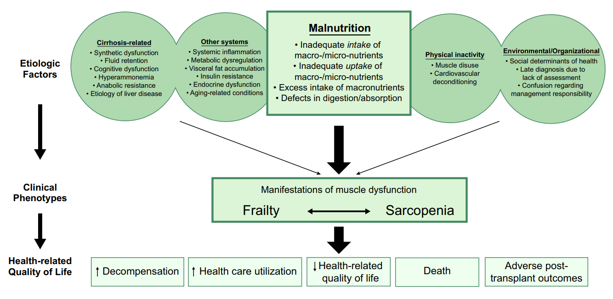
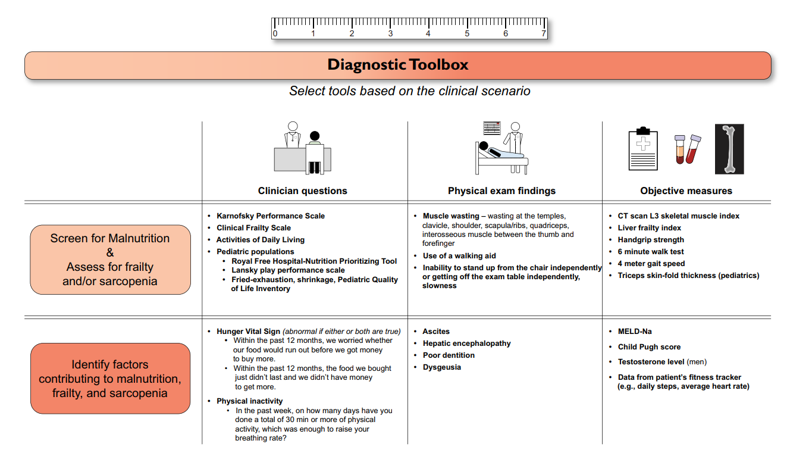
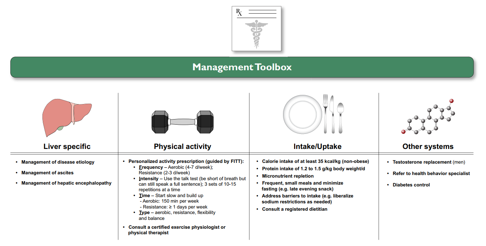

  

    

      
35 kcal &amp; 1.2-1.5g đạm

      
Mục tiêu dinh dưỡng/kg cân nặng khô/ngày — Không hạn chế đạm trong bệnh não gan

    

    

      
LFI &ge; 4.4

      
Ngưỡng Liver Frailty Index xác định suy yếu nặng (Lực bóp tay + Ghế + Thăng bằng)

    

    

      
LES Bữa Phụ Đêm

      
Can thiệp bắt buộc đảo ngược hiện tượng 'Nhịn đói tăng tốc' (1 đêm = 72h dị hóa)

    

    

      
CẤM MỞ PEG

      
Chống chỉ định tuyệt đối mở dạ dày qua da (PEG) khi có cổ trướng do nguy cơ tử vong

    

  

  

    

      
⚖️

      

        
Tam Giác Tương Hỗ: Dinh Dưỡng — Suy Yếu — Teo Cơ

        
Phân định rõ định nghĩa vận hành: Suy dinh dưỡng (mất cân bằng nạp/sử dụng), Suy yếu (giảm lực co bóp cơ - LFI) và Teo cơ (mất khối lượng cơ - CT SMI L3). Cả ba liên kết vòng lặp thúc đẩy mất bù xơ gan và tử vong.

      

    

    

      
🥗

      

        
Đơn Thuốc Dinh Dưỡng &amp; Xóa Bỏ Quan Niệm Kiêng Đạm

        
Đích năng lượng 35 kcal/kg cân nặng khô, đạm 1.2–1.5 g/kg (tuyệt đối không kiêng đạm trong HE), chia 4–6 bữa/ngày kèm Bữa phụ đêm muộn (LES) giàu carb phức hợp + protein và nới lỏng hạn chế muối để tăng khẩu vị.

      

    

    

      
🏃‍♂️

      

        
Chương Trình F.I.T.T &amp; Hồi Sức Cơ Lực Đa Ngành

        
Kết hợp Aerobic 4–7 ngày/tuần (Talk Test, 150–300 phút/tuần) và Kháng lực 2–3 ngày/tuần sau khi ổn định biến chứng gan nền; bổ sung vi chất hệ thống (A, D, E, K, B1, Kẽm) và cân nhắc Testosterone ở nam giới giảm nặng.

      

    

  

  

    <a href="#sec-dinh-nghia-3-tru-cot" class="quickmenu-item active">1. Định nghĩa 3 Trụ cột &amp; Fig 1</a>
    <a href="#sec-sinh-ly-benh-5-dong-luc" class="quickmenu-item">2. 5 Động lực Sinh lý bệnh</a>
    <a href="#sec-cong-cu-danh-gia" class="quickmenu-item">3. Công cụ LFI &amp; CT-SMI</a>
    <a href="#sec-can-thiep-dinh-duong" class="quickmenu-item">4. Đơn thuốc Dinh dưỡng &amp; LES</a>
    <a href="#sec-phac-do-tap-luyen-fitt" class="quickmenu-item">5. Tập luyện F.I.T.T &amp; An toàn</a>
    <a href="#sec-bu-vi-chat-hormone" class="quickmenu-item">6. Testosterone &amp; Bù Vi chất</a>
    <a href="#sec-hop-cong-cu-toolbox" class="quickmenu-item">7. Toolbox Fig 4 &amp; Khuyến cáo</a>
    <a href="#sec-tai-lieu-tham-khao" class="quickmenu-item">8. Tài liệu tham khảo</a>
  

  <!-- ==================== SECTION 1 ==================== -->
  

    

      🏛️
      <h2 class="sec-title">1. Định Nghĩa Chuẩn Hóa &amp; Mối Quan Hệ Tương Hỗ Giữa Dinh Dưỡng, Suy Yếu và Teo Cơ</h2>
    

    

      

        💡
        

          <strong>Tầm quan trọng của Hướng dẫn Thực hành Lâm sàng AASLD 2021</strong>
          

            Xơ gan là một bệnh lý mạn tính gây tổn hại sâu sắc đến cấu trúc và chuyển hóa toàn thân. AASLD 2021 là hướng dẫn chính thức đầu tiên chuẩn hóa toàn diện bộ ba hội chứng lâm sàng có mối quan hệ tương hỗ chặt chẽ: <strong>Suy dinh dưỡng (Malnutrition)</strong>, <strong>Suy yếu (Frailty)</strong>, và <strong>Teo cơ (Sarcopenia)</strong>, phân định rõ ràng giữa định nghĩa lý thuyết và định nghĩa vận hành thực tế tại phòng khám.
          

        

      

      <!-- TABLE 1: THEORETICAL VS OPERATIONAL DEFINITIONS -->
      <h3 style="margin-top: 1.25rem; margin-bottom: 0.75rem; font-size: 1.15rem; color: var(--color-primary);">
        <i class="fa-solid fa-table"></i> Bảng Đối Chiếu 1: Định Nghĩa Lý Thuyết &amp; Vận Hành Lâm Sàng (Table 1 AASLD)
      </h3>

      

        <table class="regimen-table">
          <thead>
            <tr>
              <th style="width: 22%;">Khái niệm (Construct)</th>
              <th style="width: 38%;">Định nghĩa Lý thuyết (Theoretical Definitions)</th>
              <th style="width: 40%;">Định nghĩa Vận hành Lâm sàng (Operational Definitions)</th>
            </tr>
          </thead>
          <tbody>
            <tr>
              <td class="source-cell">
                Đầu vào &amp; Sử dụng
                <strong>Suy Dinh Dưỡng</strong> 
                <small style="color: var(--color-text-muted);">(Malnutrition)</small>
              </td>
              <td>Một hội chứng lâm sàng phát sinh từ sự thiếu hụt hoặc dư thừa lượng chất dinh dưỡng nạp vào, sự mất cân bằng các dưỡng chất thiết yếu hoặc suy giảm khả năng sử dụng chất dinh dưỡng của cơ thể.</td>
              <td>Sự mất cân bằng dinh dưỡng gây ra các tác động bất lợi có thể đo lường được đối với mô, hình thái cơ thể (kích thước, thành phần cơ - mỡ) hoặc chức năng và kết cục lâm sàng. Trải dài từ thiếu cân đến béo phì suy dinh dưỡng (sarcopenic obesity).</td>
            </tr>
            <tr>
              <td class="source-cell">
                Chức năng co bóp
                <strong>Suy Yếu</strong> 
                <small style="color: var(--color-text-muted);">(Frailty)</small>
              </td>
              <td>Trạng thái lâm sàng của việc suy giảm dự trữ sinh lý và tăng tính dễ bị tổn thương trước các tác nhân gây căng thẳng (stressors) y tế, có nguồn gốc sâu xa từ ngành lão khoa.</td>
              <td>Biểu hiện kiểu hình của tình trạng suy giảm chức năng co bóp của cơ (muscle contractile function), biểu hiện qua giảm chức năng thể chất, giảm hiệu suất vận động và tàn tật.</td>
            </tr>
            <tr>
              <td class="source-cell">
                Khối lượng cơ
                <strong>Teo Cơ</strong> 
                <small style="color: var(--color-text-muted);">(Sarcopenia)</small>
              </td>
              <td>Rối loạn cơ xương tiến triển và lan tỏa, đi kèm với tăng khả năng xảy ra các biến cố bất lợi bao gồm té ngã, gãy xương, tàn tật và tử vong.</td>
              <td>Biểu hiện kiểu hình của tình trạng sụt giảm / mất khối lượng cơ (loss of muscle mass) được định lượng khách quan bằng các phương pháp chẩn đoán hình ảnh.</td>
            </tr>
          </tbody>
        </table>
      

      <!-- FIGURE 1 EMBED -->
      

        
        

          
Figure 1. Các Yếu Tố Thúc Đẩy &amp; Mối Quan Hệ Tương Hỗ Giữa Dinh Dưỡng, Suy Yếu và Teo Cơ (AASLD 2021)

          Sơ đồ tích hợp các con đường sinh lý bệnh dẫn đến suy dinh dưỡng, suy yếu và teo cơ ở bệnh nhân xơ gan. Các yếu tố liên quan đến bệnh gan (giảm chức năng tổng hợp, ứ dịch, tăng amoniac máu) kết hợp phản ứng viêm hệ thống mạn tính và suy giảm hormone đồng hóa làm rối loạn nạp/sử dụng dinh dưỡng. Trạng thái tĩnh tại lười vận động thúc đẩy chuyển dịch sang kiểu hình suy yếu (giảm lực cơ) và teo cơ (mất khối cơ). Hai kiểu hình này tương tác vòng lặp đóng dẫn tới tăng biến cố mất bù, nhập viện, suy giảm chất lượng sống và tử vong.
        

      

    

  

  <!-- ==================== SECTION 2 ==================== -->
  

    

      🔬
      <h2 class="sec-title">2. 5 Nhóm Động Lực Sinh Lý Bệnh Thúc Đẩy Suy Yếu &amp; Teo Cơ Trong Xơ Gan</h2>
    

    

      

        <!-- GROUP 1: MALNUTRITION -->
        

          

          

            
🥗

            
1. Suy Dinh Dưỡng &amp; Nhịn Đói Tăng Tốc (Accelerated Starvation)

          

          

            <ul style="margin-left: 1rem; line-height: 1.7;">
              <li><strong>Giảm nạp đa lượng:</strong> Chán ăn, no sớm do cổ trướng chèn ép, buồn nôn, rối loạn vị giác, nhịn ăn làm thủ thuật (NPO), kiêng muối quá mức làm thức ăn nhạt nhẽo.</li>
              <li><strong>Hiện tượng 'Nhịn đói tăng tốc':</strong> Do cạn kiệt dự trữ glycogen tại gan xơ, <em>chỉ sau 1 đêm nhịn đói (10-12h), cơ thể đã chuyển sang dị hóa lipid và ly giải protein cơ xương tương đương 72 giờ nhịn đói ở người khỏe mạnh</em>.</li>
              <li><strong>Kém hấp thu &amp; Tăng chuyển hóa:</strong> Giảm muối mật làm kém hấp thu mỡ và vitamin tan trong dầu (A, D, E, K); tăng chuyển hóa (Hypermetabolism) xuất hiện ở ≥ 15% bệnh nhân.</li>
            </ul>
          

          
1 đêm nhịn đói = 72 giờ dị hóa cơ

        

        <!-- GROUP 2: LIVER-MUSCLE AXIS & AMMONIA -->
        

          

          

            
⚡

            
2. Trục Gan - Cơ (Liver-Muscle Axis) &amp; Độc Tính Amoniac

          

          

            <ul style="margin-left: 1rem; line-height: 1.7;">
              <li><strong>Độc tính cơ của Amoniac (Myotoxicity):</strong> Shunt cửa - chủ và suy gan làm tăng $NH_3$ máu. Amoniac ngấm vào cơ ức chế tổng hợp protein, kích hoạt tự thực bào (autophagy) và gây rối loạn ty thể cơ xương.</li>
              <li><strong>Cạn kiệt BCAAs:</strong> Axit amin chuỗi nhánh (Leucine, Isoleucine, Valine) bị tiêu thụ cạn kiệt để tổng hợp Glutamine nhằm giải độc amoniac tại cơ, đẩy cơ vào trạng thái teo mòn.</li>
              <li><strong>Đặc thù căn nguyên:</strong> Xơ gan do rượu có tỷ lệ teo cơ cao nhất (lên tới 80% ở giai đoạn mất bù); ứ mật kích hoạt thụ thể TGR5 tại cơ gây teo cơ.</li>
            </ul>
          

          
Amoniac là chất độc trực tiếp đối với mô cơ

        

        <!-- GROUP 3: SYSTEMIC INFLAMMATION & HORMONES -->
        

          

          

            
🧪

            
3. Viêm Hệ Thống Mạn Tính &amp; Suy Giảm Hormone Đồng Hóa

          

          

            <ul style="margin-left: 1rem; line-height: 1.7;">
              <li><strong>Ruột rò rỉ &amp; Nội độc tố LPS:</strong> Vi khuẩn và LPS qua hàng rào ruột suy yếu vào máu, kích hoạt giải phóng liên tục TNF-alpha, IL-1, IL-6 và CRP, đẩy mạnh con đường ubiquitin-proteasome hủy hoại protein cơ.</li>
              <li><strong>Thiếu hụt Testosterone tự do:</strong> Suy giảm chức năng tổng hợp và tăng thơm hóa (aromatization) thành estrogen ở mô mỡ ở nam giới xơ gan tương quan trực tiếp với mức độ teo cơ nặng.</li>
            </ul>
          

          
Viêm mạn tính kích hoạt tiêu hủy protein cơ

        

        <!-- GROUP 4 & 5: INACTIVITY & SOCIAL -->
        

          

          

            
🚶‍♂️

            
4 &amp; 5. Lối Sống Tĩnh Tại &amp; Rào Cản Kinh Tế - Xã Hội

          

          

            <ul style="margin-left: 1rem; line-height: 1.7;">
              <li><strong>Hành vi tĩnh tại (Sedentary Behavior):</strong> Bệnh nhân xơ gan chờ ghép dành trung bình tới <strong>76% thời gian thức ở trạng thái tĩnh tại</strong> và chỉ đi ~3.000 bước/ngày, gây teo cơ do không sử dụng (muscle disuse atrophy).</li>
              <li><strong>Rào cản xã hội:</strong> Mất an ninh lương thực, hạn chế kinh tế và thiếu kiến thức dinh dưỡng cản trở việc tiếp cận nguồn đạm chất lượng cao và phục hồi chức năng.</li>
            </ul>
          

          
76% thời gian thức ngồi tĩnh tại

        

      

    

  

  <!-- ==================== SECTION 3 ==================== -->
  

    

      📊
      <h2 class="sec-title">3. Các Công Cụ Đánh Giá Suy Yếu (LFI) &amp; Đo Khối Lượng Cơ (CT-SMI L3)</h2>
    

    

      <!-- LFI SUPER HIGHLIGHT -->
      

        🌟
        

          <strong>Chỉ Số Suy Yếu Gan (Liver Frailty Index - LFI) — Công Cụ Khách Quan Đặc Hiệu Xơ Gan Đầu Tay</strong>
          

            LFI là công cụ được AASLD khuyến cáo ưu tiên hàng đầu, tích hợp 3 nghiệm pháp thực thể đo lường chức năng co bóp cơ:
          

          

            

              <strong>1. Lực bóp cơ tay (Handgrip):</strong> Đo bằng lực kế cầm tay (kg), lấy giá trị trung bình 3 lần đo tay thuận.
            

            

              <strong>2. Đứng lên ngồi xuống (Chair stands):</strong> Thời gian (giây) hoàn thành 5 lần đứng - ngồi liên tục không dùng tay.
            

            

              <strong>3. Thăng bằng (Balance testing):</strong> Giữ thăng bằng ở 3 tư thế (chụm chân, bán nối gót, nối gót tandem) trong 10 giây.
            

          

          

            Phân tầng điểm cắt lâm sàng LFI:
            LFI &lt; 3.2: Khỏe mạnh (Robust) | 
            LFI 3.2 – 4.3: Tiền suy yếu (Prefrail) | 
            LFI &ge; 4.4: Suy yếu nặng (Frail)
          

        

      

      <!-- TABLE 2: FRAILTY TOOLS -->
      <h3 style="margin-top: 1.5rem; margin-bottom: 0.75rem; font-size: 1.15rem; color: var(--color-primary);">
        <i class="fa-solid fa-list-check"></i> Bảng Đối Chiếu 2: Các Công Cụ Đánh Giá Suy Yếu Đã Được Kiểm Chứng Trong Xơ Gan (Table 2)
      </h3>

      

        <table class="regimen-table">
          <thead>
            <tr>
              <th style="width: 20%;">Công cụ (Tool)</th>
              <th style="width: 15%;">Bối cảnh &amp; Thời gian</th>
              <th style="width: 15%;">Thiết bị cần</th>
              <th style="width: 25%;">Thành phần đo lường</th>
              <th style="width: 25%;">Đặc điểm lâm sàng &amp; Giá trị dự báo</th>
            </tr>
          </thead>
          <tbody>
            <tr>
              <td class="source-cell"><strong>Liver Frailty Index (LFI)</strong></td>
              <td>Nội trú &amp; Ngoại trú (~ 3 phút)</td>
              <td>Lực kế tay, đồng hồ, ghế</td>
              <td>Lực bóp tay + Đứng lên ngồi xuống 5 lần + Thăng bằng 3 tư thế</td>
              <td><strong>Chuẩn vàng suy yếu xơ gan;</strong> dự báo mất bù, hủy ghép và tử vong danh sách chờ.</td>
            </tr>
            <tr>
              <td class="source-cell"><strong>Clinical Frailty Scale (CFS)</strong></td>
              <td>Nội trú &amp; Ngoại trú (&lt; 1 phút)</td>
              <td>Không có</td>
              <td>Đánh giá suy yếu toàn thể tại giường</td>
              <td>Bác sĩ đánh giá trực quan từ 1 (rất khỏe) đến 9 (cuối đời); dự báo nhập viện ngoài ý muốn.</td>
            </tr>
            <tr>
              <td class="source-cell"><strong>Activities of Daily Living (ADLs)</strong></td>
              <td>Nội trú &amp; Ngoại trú (2 - 3 phút)</td>
              <td>Bảng câu hỏi</td>
              <td>Khả năng tự chủ 6 hoạt động sinh hoạt cơ bản</td>
              <td>Khuyết tật ≥ 3 ADLs dự báo mạnh mẽ tử vong trong vòng 90 ngày.</td>
            </tr>
            <tr>
              <td class="source-cell"><strong>Karnofsky Performance (KPS)</strong></td>
              <td>Nội trú &amp; Ngoại trú (&lt; 1 phút)</td>
              <td>Không có</td>
              <td>Mức độ hoạt động thể chất (10–100)</td>
              <td>Điểm số &lt; 50 dự báo tiên lượng sống còn rất kém trước và sau ghép.</td>
            </tr>
            <tr>
              <td class="source-cell"><strong>Lansky Scale</strong></td>
              <td>Nhi khoa 1–17 tuổi (&lt; 1 phút)</td>
              <td>Bảng câu hỏi</td>
              <td>Trạng thái chức năng &amp; vui chơi ở trẻ em</td>
              <td>Chuyên biệt cho bệnh nhi mắc bệnh gan mạn tính.</td>
            </tr>
          </tbody>
        </table>
      

      <!-- TABLE 3: SARCOPENIA TOOLS -->
      <h3 style="margin-top: 1.5rem; margin-bottom: 0.75rem; font-size: 1.15rem; color: var(--color-primary);">
        <i class="fa-solid fa-bone"></i> Bảng Đối Chiếu 3: Các Phương Pháp Đo Khối Lượng Cơ Trong Bệnh Gan Giai Đoạn Cuối (Table 3)
      </h3>

      

        <table class="regimen-table">
          <thead>
            <tr>
              <th style="width: 22%;">Phương pháp</th>
              <th style="width: 38%;">Ưu điểm cốt lõi &amp; Tiêu chuẩn chẩn đoán</th>
              <th style="width: 40%;">Nhược điểm &amp; Khuyến cáo AASLD</th>
            </tr>
          </thead>
          <tbody>
            <tr>
              <td class="source-cell">
                Tiêu chuẩn vàng
                <strong>Chụp Cắt Lớp Vi Tính (CT Scan L3 - SMI)</strong>
              </td>
              <td>
                <ul style="margin: 0; padding-left: 1.1rem; line-height: 1.6;">
                  <li><strong>Độ chính xác cao nhất:</strong> Đo tổng diện tích cơ tại đốt sống thắt lưng L3.</li>
                  <li><strong>Chỉ số cơ xương (SMI):</strong> Diện tích cơ tại L3 (cm²) / Chiều cao² (m²).</li>
                  <li><strong>Điểm cắt teo cơ:</strong> SMI &lt; 50 cm²/m² (Nam) và SMI &lt; 39 cm²/m² (Nữ).</li>
                  <li>Đánh giá được cả độ thoái hóa mỡ của cơ (Myosteatosis).</li>
                </ul>
              </td>
              <td>
                

                  ⚠️
                  

                    <strong>CẢNH BÁO AASLD:</strong> Phơi nhiễm tia xạ; <strong>CẤM chụp CT chỉ để đo cơ</strong>. Tận dụng các phim CT sẵn có (tầm soát HCC, trước TIPS/ghép) để phân tích phần mềm.
                  

                

              </td>
            </tr>
            <tr>
              <td class="source-cell">
                Tại giường
                <strong>Kháng Trở Điện Sinh Học (BIA)</strong>
              </td>
              <td>
                <ul style="margin: 0; padding-left: 1.1rem; line-height: 1.6;">
                  <li>Nhanh chóng, không xâm lấn, thực hiện lặp lại tại giường.</li>
                  <li><strong>Góc pha (Phase angle):</strong> Rất nhạy và ít bị ảnh hưởng bởi dịch ứ đọng.</li>
                </ul>
              </td>
              <td>Ước tính khối cơ tổng thể bị sai lệch khi có cổ trướng căng hoặc phù chân to.</td>
            </tr>
            <tr>
              <td class="source-cell">
                Hạn chế
                <strong>DEXA &amp; Đo Nhân Trắc (MAMC/TSF)</strong>
              </td>
              <td>Chi phí thấp, sẵn có.</td>
              <td>Bị nhiễu nghiêm trọng bởi tình trạng ứ dịch và không phân biệt được mỡ - cơ ở người béo phì teo cơ.</td>
            </tr>
          </tbody>
        </table>
      

    

  

  <!-- ==================== SECTION 4 ==================== -->
  

    

      🍲
      <h2 class="sec-title">4. Đơn Thuốc Dinh Dưỡng Cá Thể Hóa, Bữa Phụ Đêm Muộn (LES) &amp; Quản Lý Nội Trú/ICU</h2>
    

    

      <!-- NUTRITION PRESCRIPTION GRID -->
      

        

          

          

            
⚡

            
Mục Tiêu Năng Lượng (Energy Intake) Theo Cân Nặng Khô

          

          

            <ul style="margin-left: 1rem; line-height: 1.7;">
              <li><strong>Chuẩn vàng:</strong> Đo nhiệt lượng kế gián tiếp lúc nghỉ (REE).</li>
              <li><strong>Không béo phì:</strong> 35 kcal/kg cân nặng khô/ngày.</li>
              <li><strong>Béo phì (BMI ≥ 30):</strong> 25–35 kcal/kg/ngày (BMI 30–40) hoặc 20–25 kcal/kg/ngày (BMI ≥ 40).</li>
              <li><strong>Cách tính Cân nặng khô:</strong> Trừ 5% (cổ trướng nhẹ), 10% (vừa), 15% (nặng), cộng thêm 5% nếu có phù chân đến gối.</li>
            </ul>
          

          
Đích năng lượng 35 kcal/kg cân nặng khô

        

        

          

          

            
🥩

            
Mục Tiêu Đạm (Protein Intake) &amp; An Toàn Bệnh Não Gan

          

          

            <ul style="margin-left: 1rem; line-height: 1.7;">
              <li><strong>Mục tiêu đạm:</strong> 1.2 – 1.5 g/kg cân nặng lý tưởng/ngày.</li>
              <li><strong>TUYỆT ĐỐI KHÔNG HẠN CHẾ ĐẠM TRONG NÃO GAN:</strong> Kiêng đạm làm tăng phân hủy cơ, giải phóng thêm amoniac khiến HE nặng hơn. Duy trì 1.2 g/kg/ngày là an toàn.</li>
              <li><strong>Nguồn đạm:</strong> Ưu tiên đạm thực vật và sữa (ít sinh amoniac); không bắt buộc kiêng thịt đỏ nếu là nguồn ăn chính.</li>
            </ul>
          

          
CẤM kiêng đạm ở bệnh nhân não gan

        

      

      <!-- LES HIGHLIGHT BOX -->
      

        🌙
        

          <strong>Bữa Phụ Đêm Muộn (Late-Evening Snack - LES) — Trụ Cột Đảo Ngược Dị Hóa Cơ</strong>
          

            Do bệnh nhân xơ gan rơi vào trạng thái <em>"Nhịn đói tăng tốc"</em>, khoảng cách giữa các bữa ăn khi thức không được quá <strong>3–4 giờ</strong> (chia 4–6 bữa/ngày). <strong>Bữa phụ đêm muộn (LES)</strong> giàu carbohydrate phức hợp và protein (như 200ml sữa, sữa chua, bánh mì ngũ cốc, thanh protein ăn ngay trước khi ngủ) giúp rút ngắn thời gian nhịn đói qua đêm, cải thiện rõ rệt tổng lượng protein toàn thân và khối cơ xương trên mọi phân nhóm Child-Pugh.
          

        

      

      <!-- INPATIENT & ICU PROTOCOL -->
      <h3 style="margin-top: 1.5rem; margin-bottom: 0.75rem; font-size: 1.15rem; color: var(--color-primary);">
        <i class="fa-solid fa-hospital"></i> Phác Đồ Can Thiệp Dinh Dưỡng Nội Trú &amp; ICU Bậc Thang
      </h3>

      

        <table class="regimen-table">
          <thead>
            <tr>
              <th style="width: 25%;">Bậc can thiệp</th>
              <th style="width: 40%;">Chỉ định &amp; Mục tiêu lâm sàng</th>
              <th style="width: 35%;">Lưu ý an toàn &amp; Chống chỉ định</th>
            </tr>
          </thead>
          <tbody>
            <tr>
              <td class="source-cell">Bậc 1 Dinh Dưỡng Miệng (Oral)</td>
              <td>Lựa chọn đầu tay. Mục tiêu tối thiểu <strong>≥ 22 kcal/kg/ngày</strong> ở viêm gan rượu cấp giúp giảm 67% tử vong. Nới lỏng hạn chế muối để kích thích vị giác.</td>
              <td>Khám dinh dưỡng trong 24h đầu nhập viện bằng công cụ RFH-NPT.</td>
            </tr>
            <tr>
              <td class="source-cell">Bậc 2 Sonde Dạ Dày (EN)</td>
              <td>Chỉ định sớm trong <strong>48–72 giờ</strong> nếu dinh dưỡng miệng không đạt đích calo. Ưu tiên sonde mũi - dạ dày nhỏ giọt liên tục.</td>
              <td>
                • Giãn tĩnh mạch thực quản <strong>KHÔNG</strong> chống chỉ định đặt sonde mũi. 
                • CHỐNG CHỈ ĐỊNH TUYỆT ĐỐI MỞ DẠ DÀY QUA DA (PEG) khi có cổ trướng vì nguy cơ rò dịch, viêm phúc mạc và tử vong cao.
              </td>
            </tr>
            <tr>
              <td class="source-cell">Bậc 3 Nuôi Tĩnh Mạch (PN)</td>
              <td>Biện pháp cuối cùng khi đường tiêu hóa hoàn toàn không dung nạp hoặc tắc ruột.</td>
              <td>Nguy cơ cao nhiễm trùng huyết qua catheter và rối loạn đường huyết; cần giám sát cực kỳ chặt chẽ.</td>
            </tr>
            <tr>
              <td class="source-cell">ICU Đích Dinh Dưỡng ICU</td>
              <td>Đích đạm cao vượt trội từ <strong>1.2 đến 2.0 g/kg cân nặng khô/ngày</strong> để bù trừ tình trạng dị hóa dữ dội.</td>
              <td>Giảm thiểu tối đa thời gian nhịn ăn (NPO); cho phép ăn bữa phụ sáng sớm nếu thủ thuật làm buổi chiều.</td>
            </tr>
          </tbody>
        </table>
      

    

  

  <!-- ==================== SECTION 5 ==================== -->
  

    

      🏃
      <h2 class="sec-title">5. Phác Đồ Tập Luyện Thể Chất Cá Thể Hóa Dựa Trên Khung F.I.T.T &amp; An Toàn</h2>
    

    

      

        Can thiệp thể chất là bắt buộc để khôi phục chức năng co bóp cơ (cải thiện suy yếu) và kích thích tăng sinh khối cơ (cải thiện teo cơ). AASLD khuyến nghị xây dựng chương trình tập luyện cá thể hóa dựa trên nguyên tắc <strong>F.I.T.T</strong>:
      

      

        

          

          

            
📅

            
Frequency (Tần suất)

          

          

            <ul style="margin-left: 1rem; line-height: 1.7;">
              <li><strong>Tập Aerobic (Hiếu khí):</strong> Thực hiện từ <strong>4 đến 7 ngày/tuần</strong>.</li>
              <li><strong>Tập Kháng lực (Cơ lực):</strong> Thực hiện từ <strong>2 đến 3 ngày/tuần</strong> (cách ngày).</li>
            </ul>
          

          
Aerobic 4–7 ngày &amp; Kháng lực 2–3 ngày

        

        

          

          

            
🔥

            
Intensity (Cường độ)

          

          

            <ul style="margin-left: 1rem; line-height: 1.7;">
              <li><strong>Aerobic theo Talk Test:</strong> Tập ở mức cảm thấy thở dốc nhưng <em>vẫn có thể nói trọn vẹn một câu</em> mà không phải dừng lại thở hụt hơi.</li>
              <li><strong>Kháng lực:</strong> Bắt đầu với <strong>3 hiệp x 10–15 lần lặp lại</strong> với tạ nhẹ hoặc dây kháng lực.</li>
            </ul>
          

          
Cường độ vừa phải theo Talk Test

        

        

          

          

            
⏱️

            
Time (Thời gian)

          

          

            <ul style="margin-left: 1rem; line-height: 1.7;">
              <li>Nguyên tắc cốt lõi: <em>"Bắt đầu chậm, tiến triển dần" (Start slow, go slow)</em>.</li>
              <li><strong>Đích nhắm tổng thể:</strong> Đạt từ <strong>150 đến 300 phút tập hiếu khí cường độ trung bình mỗi tuần</strong>.</li>
            </ul>
          

          
Đích 150–300 phút/tuần

        

        

          

          

            
🤸

            
Type (Loại hình bài tập)

          

          

            <ul style="margin-left: 1rem; line-height: 1.7;">
              <li>Phối hợp <strong>Aerobic</strong> (đi bộ nhanh, đạp xe tại chỗ) + <strong>Kháng lực</strong> (tạ tay, dây thun).</li>
              <li>Bổ sung bài tập <strong>Thăng bằng và Linh hoạt</strong> để chủ động phòng ngừa biến cố té ngã.</li>
            </ul>
          

          
Đa mô thức: Hiếu khí + Kháng lực + Thăng bằng

        

      

      

        💡
        

          <strong>Lưu Ý An Toàn Bắt Buộc Trước Khi Khởi Động Chương Trình Tập:</strong>
          <ul style="margin-top: 0.35rem; margin-left: 1.25rem; line-height: 1.6;">
            <li>Phải tối ưu hóa kiểm soát cổ trướng, điều trị dự phòng giãn tĩnh mạch thực quản (NSBB/EVL) và kiểm soát bệnh não gan trước.</li>
            <li>Hiện tượng tăng amoniac máu do cơ co bóp khi tập luyện <strong>không gây ra đợt cấp của bệnh não gan (HE)</strong> ở bệnh nhân xơ gan ổn định.</li>
            <li>Khuyến khích sử dụng đồng hồ thông minh (smartwatch) theo dõi số bước chân hàng ngày và nhịp tim.</li>
          </ul>
        

      

    

  

  <!-- ==================== SECTION 6 ==================== -->
  

    

      💊
      <h2 class="sec-title">6. Liệu Pháp Hormone &amp; Bảng Phác Đồ Bù Vi Chất Dinh Dưỡng Toàn Diện (Table 4)</h2>
    

    

      

        

          

          

            
♂️

            
Liệu Pháp Thay Thế Testosterone Ở Nam Giới Xơ Gan

          

          

            <ul style="margin-left: 1rem; line-height: 1.7;">
              <li><strong>Chỉ định:</strong> Cân nhắc ở nam giới xơ gan có nồng độ testosterone máu thấp (Testosterone toàn phần &lt; 12 nmol/L hoặc tự do &lt; 230 pmol/L) để cải thiện khối lượng cơ và mật độ xương.</li>
              <li><strong>Chống chỉ định tuyệt đối:</strong> Tiền sử hoặc đang mắc <strong>Ung thư biểu mô tế bào gan (HCC)</strong>, ung thư tiền liệt tuyến, hoặc tiền sử <strong>huyết khối tĩnh mạch/thrombophilia</strong>.</li>
            </ul>
          

          
Chống chỉ định tuyệt đối khi có HCC / Huyết khối

        

        

          

          

            
🌿

            
Tầm Soát Vi Chất Dinh Dưỡng Định Kỳ Hàng Năm

          

          

            
Do tình trạng giảm bài tiết muối mật và kém hấp thu tại ruột, thiếu hụt vi chất xuất hiện ở hầu hết bệnh nhân xơ gan tiến triển. Khuyến cáo tầm soát vi chất <strong>ít nhất 1 lần/năm</strong> và điều trị bù đắp sớm.

          

          
Tầm soát vi chất định kỳ ≥ 1 lần/năm

        

      

      <!-- TABLE 4: MICRONUTRIENT SUPPLEMENTATION -->
      <h3 style="margin-top: 1.5rem; margin-bottom: 0.75rem; font-size: 1.15rem; color: var(--color-primary);">
        <i class="fa-solid fa-table-cells"></i> Bảng Đối Chiếu 4: Phác Đồ Bù Vi Chất Dinh Dưỡng Trong Xơ Gan (Table 4 AASLD)
      </h3>

      

        <table class="regimen-table">
          <thead>
            <tr>
              <th style="width: 18%;">Vi chất thiếu hụt</th>
              <th style="width: 30%;">Triệu chứng lâm sàng điển hình</th>
              <th style="width: 27%;">Phác đồ bù &amp; Liều lượng</th>
              <th style="width: 25%;">Lưu ý giám sát &amp; Cơ chế</th>
            </tr>
          </thead>
          <tbody>
            <tr>
              <td class="source-cell"><strong>Vitamin A</strong></td>
              <td>Quáng gà, khô mắt, sừng hóa da, chậm lành vết thương.</td>
              <td><strong>2,000 – 200,000 IU/ngày</strong> uống trong 4–8 tuần tùy mức độ nặng.</td>
              <td>Bổ sung thêm Kẽm nếu không đáp ứng; tránh quá liều gây độc gan.</td>
            </tr>
            <tr>
              <td class="source-cell"><strong>Vitamin D</strong></td>
              <td>Đau xương, yếu cơ gốc chi, loãng xương, hạ canxi máu.</td>
              <td>Tấn công: <strong>50,000 IU/tuần</strong> trong 8 tuần. Duy trì: <strong>1,500 – 2,000 IU/ngày</strong>.</td>
              <td>Đích 25-OH Vitamin D &gt; 30 ng/mL. Bổ sung kèm Canxi.</td>
            </tr>
            <tr>
              <td class="source-cell"><strong>Vitamin E</strong></td>
              <td>Thiếu máu tán huyết, thất điều vận động, mất phản xạ gân xương.</td>
              <td><strong>α-Tocopherol acetate 400 – 800 IU/ngày</strong> uống.</td>
              <td>Tránh liều quá cao đối kháng Vitamin A làm chậm lành sẹo.</td>
            </tr>
            <tr>
              <td class="source-cell"><strong>Vitamin K</strong></td>
              <td>Kéo dài INR/PT, bầm tím, xuất huyết tự phát.</td>
              <td><strong>Phytonadione 1 – 10 mg</strong> uống, tiêm dưới da hoặc tĩnh mạch.</td>
              <td>Gan không dự trữ Vitamin K lâu dài, thiếu hụt rất nhanh khi ứ mật.</td>
            </tr>
            <tr>
              <td class="source-cell"><strong>Thiamine (B1)</strong></td>
              <td>Hội chứng Wernicke-Korsakoff (lú lẫn, liệt vận nhãn, thất điều), bệnh Beriberi.</td>
              <td>Cấp tính/Wernicke: <strong>500 mg IV x 3 lần/ngày</strong> trong 2 ngày; sau đó <strong>250 mg IV x 3 lần/ngày</strong> 3–5 ngày. Duy trì: <strong>100 mg/ngày</strong> uống.</td>
              <td>Điều trị kinh nghiệm sớm ở mọi bệnh nhân xơ gan do rượu có rối loạn nhận thức.</td>
            </tr>
            <tr>
              <td class="source-cell"><strong>Kẽm (Zinc)</strong></td>
              <td>Rụng tóc, chậm lành vết thương, rối loạn vị giác, nặng thêm não gan (HE).</td>
              <td><strong>30 – 50 mg kẽm nguyên tố/ngày</strong> (Kẽm sulfate 220 mg x 2 lần/ngày).</td>
              <td>Đồng yếu tố chu trình ure tại gan; giúp chuyển hóa amoniac và hấp thu Vitamin A.</td>
            </tr>
          </tbody>
        </table>
      

    

  

  <!-- ==================== SECTION 7 ==================== -->
  

    

      🧰
      <h2 class="sec-title">7. Hộp Công Cụ Chẩn Đoán &amp; Xử Trí Tích Hợp (Figure 4) &amp; Khuyến Cáo Thực Hành Cốt Lõi</h2>
    

    

      <!-- FIGURES 4A & 4B EMBED -->
      

        

          
          
        

        

          
Figure 4. Hộp Công Cụ Chẩn Đoán (Diagnostic Toolbox) &amp; Xử Trí (Management Toolbox) Trong Xơ Gan (AASLD 2021)

          Tổng hợp quy trình tiếp cận lâm sàng: <strong>Diagnostic Toolbox</strong> (Trái) tích hợp câu hỏi sàng lọc chủ quan tại giường, dấu hiệu teo cơ thực thể, và các phép đo khách quan (LFI, CT-SMI). <strong>Management Toolbox</strong> (Phải) định hướng can thiệp theo 3 trục: Dinh dưỡng đường tiêu hóa (35 kcal/kg, 1.2–1.5g protein, LES, bù vi chất), Chương trình tập luyện F.I.T.T tăng cường cơ lực, và Điều chỉnh nội khoa (tối ưu hóa biến chứng gan nền, testosterone).
        

      

      <!-- 3-TIER PREVENTION MODEL -->
      <h3 style="margin-top: 1.5rem; margin-bottom: 0.75rem; font-size: 1.15rem; color: var(--color-primary);">
        <i class="fa-solid fa-shield"></i> Mô Hình 3 Cấp Độ Phòng Ngừa &amp; Tần Suất Đánh Giá Lại
      </h3>

      

        

          

          

            
1️⃣

            
Phòng Ngừa Cấp 1 (Primary Prevention)

          

          

            
Áp dụng cho mọi bệnh nhân xơ gan mới chẩn đoán. Sàng lọc dinh dưỡng bằng <strong>RFH-NPT</strong> và suy yếu bằng <strong>LFI</strong>. Giáo dục duy trì dinh dưỡng và vận động.

          

          
Sàng lọc cho 100% bệnh nhân mới

        

        

          

          

            
2️⃣

            
Phòng Ngừa Cấp 2 (Secondary Prevention)

          

          

            
Kích hoạt khi LFI ≥ 3.2 hoặc RFH-NPT trung bình/cao. Tìm yếu tố thúc đẩy (chán ăn, cổ trướng, HE ẩn, thiếu testosterone) và khởi động đơn thuốc dinh dưỡng/tập luyện cá thể hóa.

          

          
Kích hoạt can thiệp khi LFI ≥ 3.2

        

        

          

          

            
3️⃣

            
Phòng Ngừa Cấp 3 (Tertiary Prevention)

          

          

            
Áp dụng khi suy yếu/teo cơ tiếp tục xấu đi. Phối hợp đa ngành chuyên sâu (Bác sĩ gan mật, Dinh dưỡng lâm sàng, Chuyên gia phục hồi chức năng thể chất).

          

          
Phối hợp can thiệp đa chuyên khoa

        

      

      <!-- CORE STATEMENTS -->
      

        📋
        

          <strong>Tóm Tắt 6 Tuyên Bố Hướng Dẫn Thực Hành Chính Thức của AASLD 2021:</strong>
          <ol style="margin-top: 0.5rem; margin-left: 1.25rem; line-height: 1.7;">
            <li><strong>Khuyến nghị 1:</strong> Đánh giá suy yếu bằng công cụ chuẩn hóa cho 100% bệnh nhân xơ gan tại thời điểm chẩn đoán và theo dõi dọc.</li>
            <li><strong>Khuyến nghị 2:</strong> Tần suất đánh giá lại: <strong>Hàng năm</strong> cho xơ gan còn bù; <strong>mỗi 8–12 tuần (hoặc 3–6 tháng)</strong> cho xơ gan mất bù hoặc đang can thiệp tích cực.</li>
            <li><strong>Khuyến nghị 3:</strong> Tư vấn rõ ràng cho người bệnh và người chăm sóc về hậu quả bất lợi của suy yếu ngay cả khi kết quả đánh giá ban đầu bình thường.</li>
            <li><strong>Khuyến nghị 4:</strong> Sử dụng chỉ số cơ xương <strong>SMI trên CT L3</strong> làm phương pháp đo khối lượng cơ nhất quán và khả năng lặp lại cao nhất.</li>
            <li><strong>Khuyến nghị 5:</strong> Không chụp CT chỉ để đo cơ. Lồng ghép định lượng cơ khi chụp CT vì chỉ định lâm sàng khác hoặc ở bệnh nhân không thể test thực thể (hôn mê, ICU, trẻ nhỏ).</li>
            <li><strong>Khuyến nghị 6:</strong> Lựa chọn công cụ linh hoạt theo bối cảnh lâm sàng (LFI ưu việt cho ngoại trú theo dõi dọc; đo khối cơ ưu việt cho ICU và bệnh nhi).</li>
          </ol>
        

      

    

  

  <!-- ==================== SECTION 8 ==================== -->
  

    

      📚
      <h2 class="sec-title">8. Danh Mục Tài Liệu Tham Khảo Y Văn Chuẩn AMA</h2>
    

    

      

        <strong>Tài liệu gốc &amp; Các thử nghiệm then chốt trích dẫn chuẩn AMA:</strong>
        <ol style="margin-top: 0.75rem; margin-left: 1.5rem; font-size: 0.92rem;">
          <li>Lai JC, Tandon P, Bernal W, Tapper EB, Ekong U, Dasarathy S, Carey EJ. Malnutrition, Frailty, and Sarcopenia in Patients With Cirrhosis: 2021 Practice Guidance by the American Association for the Study of Liver Diseases. <em>Hepatology</em>. 2021;74(3):1611-1644. doi:10.1002/hep.32049.</li>
          <li>Plank LD, Gane EJ, Peng S, Muthu C, Mathur S, Gillanders L, Apte MV, McCall JL. Nocturnal nutritional supplementation improves total body protein status of patients with liver cirrhosis: a randomized 12-month trial. <em>Hepatology</em>. 2008;48(2):557-566. doi:10.1002/hep.22367.</li>
          <li>Sinclair M, Grossmann M, Hoermann R, Angus PW, Gow PJ. Testosterone therapy increases muscle mass in men with cirrhosis and low testosterone: a randomised controlled trial. <em>J Hepatol</em>. 2016;65(5):906-913. doi:10.1002/jhep.2016.06.007.</li>
          <li>Román E, García-Galcerán C, Torrades T, Herrera S, Marín A, Doñate M, et al. Effects of an exercise programme on functional capacity, body composition and risk of falls in patients with cirrhosis: a randomized clinical trial. <em>PLoS One</em>. 2016;11(3):e0151652. doi:10.1371/journal.pone.0151652.</li>
          <li>Córdoba J, López-Hellín J, Planas M, Sabín P, Sanpedro F, Castro F, et al. Normal protein diet for episodic hepatic encephalopathy: results of a randomized study. <em>J Hepatol</em>. 2004;41(1):38-43. doi:10.1016/j.jhep.2004.03.023.</li>
          <li>Carey EJ, Lai JC, Wang CW, et al; LFC Consortium. A multicenter study to define sarcopenia in patients with end-stage liver disease. <em>Liver Transpl</em>. 2017;23(5):625-633. doi:10.1002/lt.24750.</li>
          <li>Tandon P, Tangri N, Thomas L, et al. A rapid bedside screen to predict unplanned hospitalization and death in outpatients with cirrhosis: a prospective evaluation of the Clinical Frailty Scale. <em>Am J Gastroenterol</em>. 2016;111(12):1759-1767. doi:10.1038/ajg.2016.303.</li>
        </ol>
      

    

  

<!-- BOTTOM NAV -->

  

    <a href="#/ebm/kho-guidelines" class="btn btn-primary">
      <i class="fa-solid fa-arrow-left"></i> Quay lại Kho Guidelines
    </a>
    <a href="#sec-dinh-nghia-3-tru-cot" class="btn">
      <i class="fa-solid fa-arrow-up"></i> Lên đầu trang
    </a>
  

