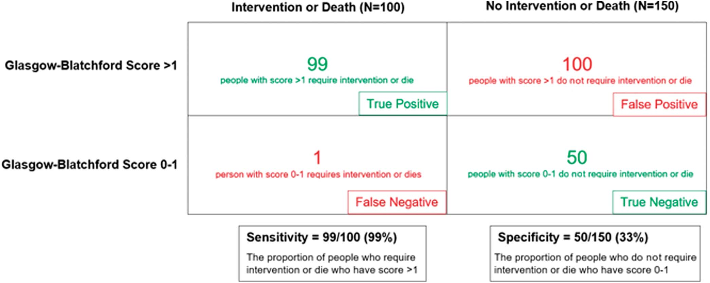

    

      

        
GBS 0–1

        
Ngưỡng xuất viện ngoại trú an toàn (Độ nhạy 99%, Âm tính giả ≤ 1%)

      

      

        
Hb &lt; 7 g/dL

        
Ngưỡng truyền máu giới hạn (Giảm 44% tử vong so với ngưỡng 9 g/dL)

      

      

        
&amp;le; 24 giờ

        
Thời điểm vàng nội soi (Không soi cực khẩn &lt; 6h khi chưa ổn định)

      

      

        
72h + 11 ngày

        
Phác đồ PPI liều cao 3 ngày + PPI liều gấp đôi (twice-daily) đến ngày 14

      

    

  

  
  

    
    
    
    <section class="sec-card" id="sec-1">
      
<i class="fa-solid fa-calculator sec-hdr-icon" style="color: var(--blue);"></i> <h2 class="sec-title">1. Phân Tầng Nguy Cơ Ban Đầu &amp; Nhận Diện Nhóm Nguy Cơ Cực Thấp (GBS 0–1)</h2>

      

        
        

          

            
Khuyến cáo Phân tầng Nguy cơ Cấp cứu &amp; Định nghĩa Nguy cơ Cực thấp

            

              Strong Recommendation
              Moderate-Quality Evidence
            

          

          

            Ở những bệnh nhân nhập viện cấp cứu vì xuất huyết tiêu hóa trên cấp tính (UGIB), ACG khuyến cáo sử dụng <strong>Thang điểm Glasgow-Blatchford (GBS)</strong> để phân tầng nguy cơ ban đầu. Bệnh nhân có điểm <strong>GBS = 0–1</strong> được xác định thuộc nhóm <strong>nguy cơ cực kỳ thấp (very low risk)</strong> và có thể xuất viện sớm để theo dõi ngoại trú an toàn mà không cần nhập viện theo dõi nội trú thường quy.
          

          

            <strong>Cơ sở bằng chứng:</strong> Định nghĩa nhóm nguy cơ cực thấp yêu cầu tỷ lệ <em>âm tính giả (false negative) &amp;le; 1%</em> đối với các kết cục can thiệp tại viện (truyền máu, can thiệp cầm máu nội soi/ngoại khoa/TAE) hoặc tử vong trong vòng 30 ngày. Điểm GBS = 0–1 duy trì độ nhạy 99% (95% CI 97%–98%) với độ đặc hiệu 27%–40%, giúp khoảng 19%–24% bệnh nhân UGIB có thể xuất viện an toàn.
          

        

        

          

            
Độ nhạy &amp; Độ đặc hiệu của GBS <i class="fa-solid fa-chart-line" style="color: var(--accent);"></i>

            

              <ul>
                <li><strong>GBS = 0:</strong> Độ nhạy cực cao (99% – 100%) nhưng độ đặc hiệu rất kém (8% – 22%), bỏ sót nhiều bệnh nhân an toàn có thể ngoại trú.</li>
                <li><strong>GBS = 0–1:</strong> Độ nhạy 99%, cải thiện độ đặc hiệu lên 27% – 40%. Là ngưỡng cân bằng tối ưu giữa an toàn lâm sàng và giảm tải viện phí.</li>
                <li><strong>Mô hình AI (Shung ML):</strong> Đạt độ nhạy 99% – 100% với độ đặc hiệu vượt trội GBS, đang chờ kiểm chứng đa trung tâm.</li>
              </ul>
            

          

          

            
Cá thể hóa Quyết định Xuất viện <i class="fa-solid fa-user-shield" style="color: var(--teal);"></i>

            

              Quyết định cho xuất viện ngoại trú dựa trên GBS = 0–1 bắt buộc phải kết hợp đánh giá thực tế:
              <ul>
                <li>Tuổi tác và các bệnh lý nội khoa đồng mắc nặng.</li>
                <li>Tính đáng tin cậy và sự thấu hiểu của bệnh nhân.</li>
                <li>Sự hỗ trợ từ gia đình, xã hội và khoảng cách địa lý.</li>
                <li>Khả năng tái tiếp cận cấp cứu nhanh chóng nếu có dấu hiệu tái phát.</li>
              </ul>
            

          

        

        
        

          

            

              <i class="fa-solid fa-stethoscope"></i>
              Công cụ CDSS: Tính Thang Điểm Glasgow-Blatchford (GBS) Tương Tác
            

            Interactive Tool
          

          

            

              <label for="gbsBun">Nồng độ Urea Nitơ máu (BUN - mg/dL):</label>
              <select id="gbsBun" class="form-control-mini">
                <option value="0">&lt; 18.2 mg/dL (0 điểm)</option>
                <option value="2">18.2 – &lt; 22.4 mg/dL (2 điểm)</option>
                <option value="3">22.4 – &lt; 28.0 mg/dL (3 điểm)</option>
                <option value="4">28.0 – &lt; 70.0 mg/dL (4 điểm)</option>
                <option value="6">&amp;ge; 70.0 mg/dL (6 điểm)</option>
              </select>
            

            

              <label for="gbsHb">Giới tính &amp; Nồng độ Hemoglobin (g/dL):</label>
              <select id="gbsHb" class="form-control-mini">
                <option value="0">Hb bình thường (&amp;ge; 13 Nam / &amp;ge; 12 Nữ) (0 điểm)</option>
                <option value="1">Hb 12.0 – &lt; 13.0 Nam / 10.0 – &lt; 12.0 Nữ (1 điểm)</option>
                <option value="3">Hb 10.0 – 12.0 Nam (3 điểm)</option>
                <option value="6">Hb &lt; 10.0 g/dL (Chung cho Nam &amp; Nữ) (6 điểm)</option>
              </select>
            

            

              <label for="gbsSbp">Huyết áp tâm thu (SBP - mmHg):</label>
              <select id="gbsSbp" class="form-control-mini">
                <option value="0">&amp;ge; 110 mmHg (0 điểm)</option>
                <option value="1">100 – 109 mmHg (1 điểm)</option>
                <option value="2">90 – 99 mmHg (2 điểm)</option>
                <option value="3">&lt; 90 mmHg (3 điểm)</option>
              </select>
            

          

          
Các triệu chứng &amp; Tiền sử bệnh đồng mắc:

          

            <label class="cdss-chip">
              <input type="checkbox" id="gbsPulse" value="1" />
              Nhịp tim &amp;ge; 100 lần/phút (+1)
            </label>
            <label class="cdss-chip">
              <input type="checkbox" id="gbsMelena" value="1" />
              Đi cầu phân đen (+1)
            </label>
            <label class="cdss-chip">
              <input type="checkbox" id="gbsSyncope" value="2" />
              Ngất (Syncope) (+2)
            </label>
            <label class="cdss-chip">
              <input type="checkbox" id="gbsLiver" value="2" />
              Bệnh gan đồng mắc (+2)
            </label>
            <label class="cdss-chip">
              <input type="checkbox" id="gbsHeart" value="2" />
              Suy tim đồng mắc (+2)
            </label>
          

          

            

              <i class="fa-solid fa-circle-check" style="color: var(--green);"></i>
              Điểm GBS: 0 điểm – Nguy cơ Cực Thấp (Very Low Risk)
            

            

              <strong>Khuyến nghị lâm sàng ACG:</strong> Bệnh nhân có điểm GBS = 0–1 đạt tỷ lệ âm tính giả &amp;le; 1% đối với nguy cơ tử vong hoặc cần can thiệp y tế. Xem xét cho xuất viện sớm và theo dõi điều trị ngoại trú an toàn nếu sinh hiệu ổn định và bệnh nhân có điều kiện chăm sóc tại nhà.
            

          

        

        
        

          
          

            
Figure 1. Bảng phân tích độ nhạy và độ đặc hiệu của ngưỡng GBS = 1 trên 250 bệnh nhân UGIB giả định

            
<strong>Phân tích cơ chế lâm sàng:</strong>

            <ul style="margin-left: 1.25rem; margin-top: 0.35rem;">
              <li><strong>Nhóm cần can thiệp lâm sàng hoặc tử vong (N = 100):</strong> 99 người có GBS &gt; 1 (Dương tính thật) và chỉ 1 người có GBS = 0–1 (Âm tính giả). <strong>Độ nhạy (Sensitivity) đạt 99% (99/100)</strong>.</li>
              <li><strong>Nhóm không cần can thiệp hoặc tử vong (N = 150):</strong> 100 người có GBS &gt; 1 (Dương tính giả) và 50 người có GBS = 0–1 (Âm tính thật). <strong>Độ đặc hiệu (Specificity) đạt 33% (50/150)</strong>, tỷ lệ dương tính giả là 67%. Do độ đặc hiệu thấp, phần lớn bệnh nhân thực tế không cần can thiệp vẫn bị giữ lại nhập viện, thúc đẩy nhu cầu phát triển các mô hình phân tầng trí tuệ nhân tạo (AI) mới.</li>
            </ul>
          

        

        
        
<i class="fa-solid fa-table-list"></i> Table 2. Chi tiết các yếu tố tính điểm Glasgow-Blatchford (GBS)

        

          <table class="med-table">
            <thead>
              <tr>
                <th style="width: 65%;">Yếu tố nguy cơ tại thời điểm tiếp nhận cấp cứu</th>
                <th style="width: 35%; text-align: center;">Điểm số tương ứng</th>
              </tr>
            </thead>
            <tbody>
              <tr>
                <td><strong>Nồng độ Urea Nitơ máu (BUN)</strong>  &amp;bull; 18.2 đến &lt; 22.4 mg/dL  &amp;bull; 22.4 đến &lt; 28.0 mg/dL  &amp;bull; 28.0 đến &lt; 70.0 mg/dL  &amp;bull; &amp;ge; 70.0 mg/dL</td>
                <td style="text-align: center; vertical-align: middle;">2 điểm  3 điểm  4 điểm  <strong>6 điểm</strong></td>
              </tr>
              <tr>
                <td><strong>Nồng độ Hemoglobin (Hb)</strong>  &amp;bull; 12.0 đến &lt; 13.0 g/dL (Nam); 10.0 đến &lt; 12.0 g/dL (Nữ)  &amp;bull; 10.0 đến 12.0 g/dL (Nam)  &amp;bull; &lt; 10.0 g/dL (Chung cho cả Nam và Nữ)</td>
                <td style="text-align: center; vertical-align: middle;">1 điểm  3 điểm  <strong>6 điểm</strong></td>
              </tr>
              <tr>
                <td><strong>Huyết áp tâm thu (SBP)</strong>  &amp;bull; 100 – 109 mmHg  &amp;bull; 90 – 99 mmHg  &amp;bull; &lt; 90 mmHg</td>
                <td style="text-align: center; vertical-align: middle;">1 điểm  2 điểm  <strong>3 điểm</strong></td>
              </tr>
              <tr>
                <td><strong>Các thông số &amp; Tiền sử lâm sàng</strong>  &amp;bull; Nhịp tim &amp;ge; 100 lần/phút  &amp;bull; Đi cầu phân đen (Melena)  &amp;bull; Ngất (Syncope)  &amp;bull; Tiền sử bệnh gan (Hepatic disease)  &amp;bull; Tiền sử suy tim (Cardiac failure)</td>
                <td style="text-align: center; vertical-align: middle;">1 điểm  1 điểm  2 điểm  2 điểm  2 điểm</td>
              </tr>
            </tbody>
          </table>
        

      

    </section>

    
    
    
    <section class="sec-card" id="sec-2">
      
<i class="fa-solid fa-droplet sec-hdr-icon" style="color: var(--red);"></i> <h2 class="sec-title">2. Chiến Lược Truyền Máu Giới Hạn &amp; Điều Trị Tiền Nội Soi</h2>

      

        
        

          

            
Chiến lược Truyền Khối Hồng Cầu Giới Hạn (Restrictive RBC Transfusion)

            

              Strong Recommendation
              Moderate-Quality Evidence
            

          

          

            ACG khuyến cáo áp dụng <strong>chiến lược truyền máu giới hạn (restrictive transfusion policy)</strong> cho bệnh nhân xuất huyết tiêu hóa trên: Chỉ truyền khối hồng cầu khi nồng độ <strong>Hemoglobin (Hb) &lt; 7 g/dL</strong> nhằm đưa đích duy trì Hb đạt từ <strong>7 đến 9 g/dL</strong>.
          

          

            <strong>Bằng chứng thử nghiệm RCT (Villanueva et al., N = 899):</strong> Ngưỡng restrictive 7 g/dL so với liberal 9 g/dL giúp giảm tỷ lệ tử vong 45 ngày (5% so với 9%, P = 0.02), giảm tỷ lệ tái chảy máu (10% so với 16%, P = 0.01), giảm phản ứng truyền máu và biến chứng tim mạch.
          

        

        

          
<i class="fa-solid fa-triangle-exclamation"></i>

          

            <strong>3 Ngoại lệ Lâm sàng cần điều chỉnh Ngưỡng Truyền máu:</strong>
            <ol style="margin-left: 1.25rem; margin-top: 0.35rem;">
              <li><strong>Bệnh nhân đang tụt huyết áp / Sốc mất máu:</strong> Hiện tượng cô đặc máu khiến Hb đo được cao giả tạo ban đầu và sụt nhanh sau bù dịch. <em>Hợp lý khi truyền máu sớm trước khi Hb chạm ngưỡng 7 g/dL</em>.</li>
              <li><strong>Bệnh nhân có bệnh lý tim mạch ổn định kèm theo:</strong> Khuyến cáo duy trì ngưỡng truyền máu cao hơn là <strong>Hb &lt; 8 g/dL</strong>.</li>
              <li><strong>Hội chứng mạch vành cấp (Acute Coronary Syndrome - ACS):</strong> Cân nhắc duy trì <strong>ngưỡng Hb &gt; 8 g/dL</strong> do nguy cơ thiếu máu cục bộ cơ tim tăng cao nếu áp dụng chiến lược quá giới hạn.</li>
            </ol>
          

        

        
<i class="fa-solid fa-capsules"></i> Điều trị Nội khoa Tiền nội soi (Pre-endoscopic Medical Therapy)

        
        

          

            
Erythromycin Tăng Động Cơ Học Conditional Rec

            

              <ul>
                <li><strong>Cơ chế:</strong> Đồng vận motilin, kích thích co bóp dạ dày tống máu và cục đông xuống tá tràng, làm sạch tầm nhìn nội soi.</li>
                <li><strong>Phác đồ chuẩn:</strong> Erythromycin 250 mg IV truyền tĩnh mạch trong 5–30 phút, thực hiện trước nội soi <strong>20 đến 90 phút</strong>.</li>
                <li><strong>Lợi ích Meta-analysis (8 RCTs):</strong> Giảm nhu cầu soi lại lần 2 (OR = 0.51, 95% CI 0.34–0.77), rút ngắn nằm viện 1.75 ngày.</li>
                <li><strong>Cảnh báo:</strong> Nguy cơ kéo dài khoảng QT, xoắn đỉnh. Thận trọng ở bệnh nhân tim mạch hoặc dùng thuốc ức chế CYP3A4. Metoclopramide không được ACG hỗ trợ sử dụng.</li>
              </ul>
            

          

          

            
Thuốc Ức chế Toan (PPI Tiền Nội Soi) Neutral Statement

            

              <ul>
                <li><strong>Tuyên bố ACG:</strong> ACG <em>không khuyến cáo ủng hộ cũng như chống lại</em> việc dùng PPI trước nội soi.</li>
                <li><strong>Bằng chứng RCT (Lau et al.):</strong> Dùng PPI liều nạp 80 mg + truyền 8 mg/h trước soi <strong>không làm giảm</strong> tỷ lệ tử vong 30 ngày (2.5% vs 2.2%) hay tái chảy máu (3.5% vs 2.5%).</li>
                <li><strong>Lợi ích duy nhất:</strong> Giảm tỷ lệ stigmata nguy cơ cao tại thời điểm soi (19.1% vs 28.4%, P = 0.007), từ đó giảm tỷ lệ phải can thiệp cầm máu nội soi.</li>
                <li><strong>Chỉ định hợp lý:</strong> Cân nhắc khi nội soi bị trì hoãn lâu hoặc không có sẵn bác sĩ can thiệp khẩn cấp.</li>
              </ul>
            

          

        

        
        
<i class="fa-solid fa-chart-column"></i> Table 4. Kết quả phân tích gộp về hiệu quả của Erythromycin trước nội soi

        

          <table class="med-table">
            <thead>
              <tr>
                <th>Chỉ số kết cục lâm sàng</th>
                <th style="text-align: center;">Số lượng RCTs (Cỡ mẫu N)</th>
                <th style="text-align: center;">Tỷ số nguy cơ / Chênh lệch trung bình (95% CI)</th>
                <th>Ý nghĩa lâm sàng</th>
              </tr>
            </thead>
            <tbody>
              <tr>
                <td><strong>Chảy máu tiếp diễn (Further bleeding)</strong></td>
                <td style="text-align: center;">1 RCT (N = 29)</td>
                <td style="text-align: center;">RR = 0.54 (0.05 – 5.28)</td>
                <td>Không có ý nghĩa thống kê</td>
              </tr>
              <tr>
                <td><strong>Tử vong (Mortality)</strong></td>
                <td style="text-align: center;">3 RCTs (N = 278)</td>
                <td style="text-align: center;">RR = 0.81 (0.41 – 1.60)</td>
                <td>Không giảm trực tiếp tử vong</td>
              </tr>
              <tr style="background: var(--green-bg);">
                <td><strong>Nhu cầu nội soi lại lần 2 (Second-look endoscopy)</strong></td>
                <td style="text-align: center;">8 RCTs (N = 598)</td>
                <td style="text-align: center;"><strong>OR = 0.51 (0.34 – 0.77)</strong></td>
                <td>Giảm 49% nguy cơ soi lại</td>
              </tr>
              <tr style="background: var(--green-bg);">
                <td><strong>Số ngày nằm viện (Hospital days)</strong></td>
                <td style="text-align: center;">5 RCTs (N = 375)</td>
                <td style="text-align: center;"><strong>MD = -1.75 ngày (-2.43 đến -1.06)</strong></td>
                <td>Rút ngắn gần 2 ngày nằm viện</td>
              </tr>
              <tr>
                <td><strong>Lượng máu truyền (Units of RBC transfused)</strong></td>
                <td style="text-align: center;">6 RCTs (N = 544)</td>
                <td style="text-align: center;">MD = -1.06 đơn vị (-2.24 đến 0.13)</td>
                <td>Độ không đồng nhất cao (I² = 89%)</td>
              </tr>
            </tbody>
          </table>
        

      

    </section>

    
    
    
    <section class="sec-card" id="sec-3">
      
<i class="fa-solid fa-clock sec-hdr-icon" style="color: var(--green);"></i> <h2 class="sec-title">3. Thời Điểm Tối Ưu Nội Soi &amp; Lưu Đồ Tiếp Cận Toàn Diện</h2>

      

        
        

          

            
Thời điểm Thực hiện Nội soi Tiêu hóa Trên

            

              Strong Recommendation
              Moderate-Quality Evidence
            

          

          

            Bệnh nhân nhập viện vì xuất huyết tiêu hóa trên cấp tính nên được <strong>thực hiện nội soi trong vòng 24 giờ kể từ lúc nhập viện</strong>. ACG <strong>KHÔNG khuyến cáo nội soi quá sớm (&lt; 6 giờ)</strong> khi bệnh nhân chưa được hồi sức huyết động đầy đủ.
          

          

            <strong>Cơ sở y văn:</strong> Thử nghiệm lâm sàng trên 516 bệnh nhân nguy cơ cao (GBS &amp;ge; 12) so sánh nội soi &lt; 6h với 6–24h cho thấy nội soi cực khẩn không giúp giảm tái chảy máu (10.9% vs 7.8%) hay tử vong 30 ngày (8.9% vs 6.6%). Nghiên cứu đoàn hệ Đan Mạch chỉ ra rằng soi quá sớm khi chưa ổn định huyết động làm tăng tỷ lệ tử vong.
          

        

        

          
<i class="fa-solid fa-heart-pulse"></i>

          

            <strong>Nguyên Tắc Lâm Sàng Cốt Lõi:</strong>
            Hồi sức tích cực, ổn định huyết động (duy trì MAP &amp;ge; 65 mmHg) và kiểm soát các bệnh lý nội khoa cấp tính đồng mắc luôn luôn là ưu tiên hàng đầu và phải được thực hiện trước khi đưa bệnh nhân vào phòng nội soi.
          

        

        
        
<i class="fa-solid fa-diagram-project"></i> Figure 2. Lưu đồ Xử trí Tiếp cận UGIB từ Cấp cứu đến Sau Nội soi (Editorial SVG Studio)

        

          <svg viewBox="0 0 840 520" fill="none" xmlns="http://www.w3.org/2000/svg">
            
            <rect x="270" y="20" width="300" height="50" rx="10" fill="#0284c7" stroke="#0369a1" stroke-width="2"/>
            <text x="420" y="45" fill="#ffffff" font-family="'Plus Jakarta Sans', sans-serif" font-size="13" text-anchor="middle" dominant-baseline="middle">
              <tspan font-weight="700">TIẾP NHẬN BỆNH NHÂN XUẤT HUYẾT TIÊU HÓA TRÊN</tspan>
            </text>

            
            <line x1="420" y1="70" x2="420" y2="105" stroke="#94a3b8" stroke-width="2" stroke-dasharray="4 4"/>
            <polygon points="416,105 424,105 420,112" fill="#94a3b8"/>

            
            <rect x="250" y="112" width="340" height="52" rx="10" fill="#f8fafc" stroke="#0284c7" stroke-width="2"/>
            <text x="420" y="132" fill="#0f172a" font-family="'Plus Jakarta Sans', sans-serif" font-size="12" text-anchor="middle">
              <tspan font-weight="700">ĐÁNH GIÁ NGUY CƠ BAN ĐẦU QUA THANG ĐIỂM GBS</tspan>
            </text>
            <text x="420" y="150" fill="#64748b" font-family="'Inter', sans-serif" font-size="11" text-anchor="middle">
              BUN, Hb, Huyết áp tâm thu, Nhịp tim, Phân đen, Ngất, Bệnh gan, Suy tim
            </text>

            
            <path d="M 320 164 L 320 195 L 160 195 L 160 220" stroke="#059669" stroke-width="2" fill="none"/>
            <polygon points="156,220 164,220 160,227" fill="#059669"/>
            <rect x="180" y="180" width="80" height="22" rx="4" fill="#dcfce7"/>
            <text x="220" y="195" fill="#15803d" font-family="'JetBrains Mono', monospace" font-size="11" font-weight="700" text-anchor="middle">GBS = 0–1</text>

            
            <rect x="40" y="227" width="240" height="75" rx="10" fill="#f0fdf4" stroke="#059669" stroke-width="2"/>
            <text x="160" y="250" fill="#065f46" font-family="'Plus Jakarta Sans', sans-serif" font-size="12" text-anchor="middle">
              <tspan font-weight="700">NGUY CƠ CỰC THẤP (&amp;le; 1%)</tspan>
            </text>
            <text x="160" y="270" fill="#047857" font-family="'Inter', sans-serif" font-size="11" text-anchor="middle">
              Xuất viện sớm an toàn
            </text>
            <text x="160" y="288" fill="#475569" font-family="'Inter', sans-serif" font-size="10.5" text-anchor="middle">
              Theo dõi và điều trị ngoại trú
            </text>

            
            <path d="M 520 164 L 520 195 L 640 195 L 640 220" stroke="#dc2626" stroke-width="2" fill="none"/>
            <polygon points="636,220 644,220 640,227" fill="#dc2626"/>
            <rect x="540" y="180" width="80" height="22" rx="4" fill="#fee2e2"/>
            <text x="580" y="195" fill="#b91c1c" font-family="'JetBrains Mono', monospace" font-size="11" font-weight="700" text-anchor="middle">GBS &amp;ge; 2</text>

            
            <rect x="500" y="227" width="280" height="95" rx="10" fill="#fef2f2" stroke="#dc2626" stroke-width="2"/>
            <text x="640" y="247" fill="#991b1b" font-family="'Plus Jakarta Sans', sans-serif" font-size="12" text-anchor="middle">
              <tspan font-weight="700">NHẬP VIỆN &amp; HỒI SỨC TIỀN NỘI SOI</tspan>
            </text>
            <text x="640" y="267" fill="#475569" font-family="'Inter', sans-serif" font-size="11" text-anchor="middle">
              &amp;bull; Truyền máu nếu Hb &lt; 7 g/dL (Đích 7–9 g/dL)
            </text>
            <text x="640" y="285" fill="#475569" font-family="'Inter', sans-serif" font-size="11" text-anchor="middle">
              &amp;bull; Erythromycin 250mg IV trước soi 30–90p
            </text>
            <text x="640" y="303" fill="#475569" font-family="'Inter', sans-serif" font-size="11" text-anchor="middle">
              &amp;bull; PPI tiền nội soi (nếu trì hoãn soi lâu)
            </text>

            
            <line x1="640" y1="322" x2="640" y2="355" stroke="#94a3b8" stroke-width="2"/>
            <polygon points="636,355 644,355 640,362" fill="#94a3b8"/>

            
            <rect x="490" y="362" width="300" height="45" rx="10" fill="#eff6ff" stroke="#2563eb" stroke-width="2"/>
            <text x="640" y="385" fill="#1e40af" font-family="'Plus Jakarta Sans', sans-serif" font-size="12" text-anchor="middle">
              <tspan font-weight="700">NỘI SOI TIÊU HÓA TRONG VÒNG 24 GIỜ</tspan>
            </text>
            <text x="640" y="399" fill="#3b82f6" font-family="'Inter', sans-serif" font-size="10.5" text-anchor="middle">
              Sau khi đã hồi sức huyết động ổn định
            </text>

            
            <path d="M 560 407 L 560 440 L 420 440 L 420 455" stroke="#059669" stroke-width="2" fill="none"/>
            <polygon points="416,455 424,455 420,462" fill="#059669"/>

            <path d="M 720 407 L 720 440 L 720 455" stroke="#dc2626" stroke-width="2" fill="none"/>
            <polygon points="716,455 724,455 720,462" fill="#dc2626"/>

            
            <rect x="300" y="462" width="240" height="50" rx="8" fill="#f0fdf4" stroke="#059669" stroke-width="1.5"/>
            <text x="420" y="481" fill="#065f46" font-family="'Plus Jakarta Sans', sans-serif" font-size="11" text-anchor="middle">
              <tspan font-weight="700">TỔN THƯƠNG NGUY CƠ THẤP</tspan>
            </text>
            <text x="420" y="498" fill="#475569" font-family="'Inter', sans-serif" font-size="10" text-anchor="middle">
              Đáy sạch (FIII), Vết sắc tố (FIIc) &amp;rarr; PPI chuẩn, xuất viện sớm
            </text>

            
            <rect x="590" y="462" width="240" height="50" rx="8" fill="#fef2f2" stroke="#dc2626" stroke-width="1.5"/>
            <text x="710" y="481" fill="#991b1b" font-family="'Plus Jakarta Sans', sans-serif" font-size="11" text-anchor="middle">
              <tspan font-weight="700">TỔN THƯƠNG NGUY CƠ CAO</tspan>
            </text>
            <text x="710" y="498" fill="#475569" font-family="'Inter', sans-serif" font-size="10" text-anchor="middle">
              Phun tia (FIa), Rỉ máu (FIb), Mạch lộ (FIIa) &amp;rarr; Can thiệp + PPI 72h
            </text>
          </svg>
        

      

    </section>

    
    
    
    <section class="sec-card" id="sec-4">
      
<i class="fa-solid fa-microscope sec-hdr-icon" style="color: var(--purple);"></i> <h2 class="sec-title">4. Kỹ Thuật Can Thiệp Nội Soi Cầm Máu Cho Loét Nguy Cơ Cao</h2>

      

        
        

          

            
Chỉ định Can thiệp Cầm máu Nội soi Bắt buộc

            

              Strong Recommendation
              Moderate-Quality Evidence
            

          

          

            Thực hiện can thiệp nội soi cầm máu cho các ổ loét có:
            <ul style="margin-left: 1.25rem; margin-top: 0.35rem;">
              <li><strong>Chảy máu phun thành tia hoạt động (Spurting bleeding - Forrest Ia)</strong></li>
              <li><strong>Chảy máu rỉ rả hoạt động (Oozing bleeding - Forrest Ib)</strong></li>
              <li><strong>Mạch máu lộ không chảy máu (Nonbleeding visible vessels - Forrest IIa)</strong></li>
            </ul>
          

          

            <strong>Bằng chứng phân tích gộp (19 RCTs):</strong> Can thiệp nội soi giảm mạnh tỷ lệ tiếp tục chảy máu ở loét chảy máu hoạt động (RR = 0.29; 95% CI 0.20–0.43) và ở loét có mạch lộ (RR = 0.49; 95% CI 0.40–0.59).
          

        

        

          

            
Khuyến cáo Chống Mạnh mẽ: CẤM DÙNG EPINEPHRINE ĐƠN TRỊ LIỆU

            

              Strong Recommendation AGAINST
              Moderate-Quality Evidence
            

          

          

            ACG <strong>khuyến cáo mạnh mẽ KHÔNG ĐƯỢC sử dụng tiêm epinephrine đơn trị liệu</strong> để cầm máu loét dạ dày - tá tràng. Tiêm epinephrine (pha loãng 1:10,000, liều 0.5–2.0 mL mỗi mũi) chỉ có vai trò làm co mạch tạm thời và làm sạch trường quan sát; <strong>bắt buộc phải phối hợp với liệu pháp thứ hai</strong> (nhiệt tiếp xúc, kẹp clip hoặc tiêm cồn tuyệt đối).
          

          

            <strong>Bằng chứng (7 RCTs):</strong> Phối hợp Epinephrine + Liệu pháp thứ hai giúp giảm 66% nguy cơ tái chảy máu so với Epinephrine đơn trị (RR = 0.34, 95% CI 0.23–0.50).
          

        

        
<i class="fa-solid fa-wrench"></i> Chi tiết Kỹ thuật Các Công cụ Can thiệp Nội soi Cầm máu

        

          

            
1. Thiết bị Tiếp xúc Nhiệt (Thermal Contact) Strong Rec

            

              <ul>
                <li><strong>Đông điện lưỡng cực (Bipolar):</strong> Sử dụng đầu dò lớn 3.2 mm, ấn áp lực mạnh trực tiếp lên lòng mạch, công suất 15 W, áp dụng 8–10 giây.</li>
                <li><strong>Đầu dò nhiệt (Heater probe):</strong> Năng lượng 30 J mỗi lần phát nhiệt kết hợp ép mạnh lên mạch máu.</li>
                <li><strong>Hiệu quả (15 RCTs):</strong> Giảm tái chảy máu (RR = 0.44, 95% CI 0.36–0.54) và giảm tử vong (RR = 0.58, 95% CI 0.34–0.98).</li>
              </ul>
            

          

          

            
2. Tiêm Cồn Tuyệt Đối (Absolute Ethanol) Strong Rec

            

              <ul>
                <li><strong>Kỹ thuật tiêm:</strong> Sử dụng các liều cực nhỏ từ <strong>0.1 – 0.2 mL</strong> cho mỗi mũi tiêm quanh mạch máu tổn thương.</li>
                <li><strong>Giới hạn an toàn:</strong> Tổng thể tích tối đa không quá <strong>1 – 2 mL</strong> để tránh biến chứng hoại tử sâu xuyên thành hoặc thủng tá tràng.</li>
                <li><strong>Hiệu quả (3 RCTs):</strong> Giảm tái chảy máu (RR = 0.56) và giảm tử vong (RR = 0.18, 95% CI 0.05–0.68). Polidocanol đơn độc không khuyến cáo.</li>
              </ul>
            

          

          

            
3. Kẹp Clip Cơ học (Through-The-Scope) Conditional Rec

            

              <ul>
                <li><strong>Cơ chế:</strong> Kẹp trực tiếp khóa lòng mạch tổn thương hoặc kẹp 2 bên đáy ổ loét khép kín miệng mạch.</li>
                <li><strong>Ưu điểm:</strong> Không gây tổn thương bỏng nhiệt mô xung quanh, cực kỳ an toàn khi can thiệp ở thành mỏng tá tràng.</li>
                <li><strong>So với Epinephrine đơn trị (2 RCTs):</strong> Giảm 80% tái chảy máu (RR = 0.20, 95% CI 0.07–0.56).</li>
              </ul>
            

          

          

            
4. Công nghệ Cầm máu Mới &amp; Cứu vãn Conditional Rec

            

              <ul>
                <li><strong>Đông huyết tương Argon (APC):</strong> Lưu lượng khí 1–2 L/phút, công suất 40–70 W, cách niêm mạc 2–10 mm. Cần hút khói liên tục.</li>
                <li><strong>Đông điện đơn cực mềm (Soft Coag):</strong> Kìm kẹp mạch máu ở điện áp thấp &amp;le; 200V, năng lượng 50–80 W trong 1–2 giây.</li>
                <li><strong>Keo xịt TC-325:</strong> Phun bột khoáng cách tổn thương 1–2 cm theo đợt 1–2s; dùng làm liệu pháp cứu vãn cho tổn thương lan tỏa/khó tiếp cận.</li>
                <li><strong>Kẹp OTSC (Over-the-scope clips):</strong> Kẹp kích thước lớn ôm trọn mô xơ chai sâu; ưu tiên cho trường hợp tái xuất huyết.</li>
              </ul>
            

          

        

        

          
<i class="fa-solid fa-circle-question"></i>

          

            <strong>Xử trí Loét có Cục Máu Đông Bám Dính (Forrest IIb - Adherent Clot):</strong>
            ACG <em>không đưa ra khuyến cáo ủng hộ hay chống lại</em> việc bóc cục đông để can thiệp nội soi. Tại các nước phương Tây, việc xịt rửa mạnh (vigorous irrigation) và bóc can thiệp thường được áp dụng, trong khi các nghiên cứu tại châu Á cho thấy dùng PPI liều cao đơn thuần không bóc cục đông vẫn đạt tỷ lệ tái chảy máu bằng 0%.
          

        

        
        
<i class="fa-solid fa-table"></i> Table 7. Phân tích gộp hiệu quả các phương pháp nội soi cầm máu so với không can thiệp hoặc đối đầu

        

          <table class="med-table">
            <thead>
              <tr>
                <th>Liệu pháp can thiệp</th>
                <th>Liệu pháp so sánh</th>
                <th style="text-align: center;">Số RCTs</th>
                <th style="text-align: center;">Tái chảy máu - RR (95% CI)</th>
                <th style="text-align: center;">Tử vong - RR (95% CI)</th>
              </tr>
            </thead>
            <tbody>
              <tr style="background: var(--surface-2); font-weight: 700;">
                <td colspan="5"><i class="fa-solid fa-code-compare"></i> CAN THIỆP NỘI SOI VS KHÔNG CAN THIỆP</td>
              </tr>
              <tr>
                <td>Tiếp xúc nhiệt (Bipolar / Heater probe)</td>
                <td>Không can thiệp</td>
                <td style="text-align: center;">15</td>
                <td style="text-align: center;"><strong>0.44 (0.36 – 0.54)</strong></td>
                <td style="text-align: center;"><strong>0.58 (0.34 – 0.98)</strong></td>
              </tr>
              <tr>
                <td>Tiêm cồn tuyệt đối (Absolute ethanol)</td>
                <td>Không can thiệp</td>
                <td style="text-align: center;">3</td>
                <td style="text-align: center;"><strong>0.56 (0.38 – 0.83)</strong></td>
                <td style="text-align: center;"><strong>0.18 (0.05 – 0.68)</strong></td>
              </tr>
              <tr>
                <td>Tiêm Epinephrine + Polidocanol</td>
                <td>Không can thiệp</td>
                <td style="text-align: center;">6</td>
                <td style="text-align: center;">0.60 (0.36 – 1.00)</td>
                <td style="text-align: center;">0.80 (0.40 – 1.61)</td>
              </tr>
              <tr style="background: var(--surface-2); font-weight: 700;">
                <td colspan="5"><i class="fa-solid fa-code-compare"></i> SO SÁNH ĐỐI ĐẦU GIỮA CÁC LIỆU PHÁP</td>
              </tr>
              <tr>
                <td>Tiếp xúc nhiệt (Bipolar/Heater probe)</td>
                <td>Tiêm cồn tuyệt đối (Ethanol)</td>
                <td style="text-align: center;">5</td>
                <td style="text-align: center;">0.69 (0.47 – 1.01)</td>
                <td style="text-align: center;">1.60 (0.57 – 4.52)</td>
              </tr>
              <tr style="background: var(--green-bg);">
                <td>Kẹp Clip cơ học</td>
                <td>Tiêm Epinephrine đơn trị</td>
                <td style="text-align: center;">2</td>
                <td style="text-align: center;"><strong>0.20 (0.07 – 0.56)</strong></td>
                <td style="text-align: center;">2.11 (0.60 – 7.44)</td>
              </tr>
              <tr>
                <td>Kẹp Clip cơ học</td>
                <td>Tiếp xúc nhiệt (Bipolar/Heater)</td>
                <td style="text-align: center;">4</td>
                <td style="text-align: center;">1.31 (0.36 – 4.75)</td>
                <td style="text-align: center;">1.16 (0.38 – 3.52)</td>
              </tr>
              <tr style="background: var(--green-bg);">
                <td>Tiêm Epinephrine + Liệu pháp thứ hai</td>
                <td>Tiêm Epinephrine đơn trị</td>
                <td style="text-align: center;">7</td>
                <td style="text-align: center;"><strong>0.34 (0.23 – 0.50)</strong></td>
                <td style="text-align: center;">0.52 (0.23 – 1.16)</td>
              </tr>
              <tr>
                <td>Argon plasma coagulation (APC) &amp;plusmn; Epi</td>
                <td>Tiêm Epinephrine + Liệu pháp thứ 2</td>
                <td style="text-align: center;">3</td>
                <td style="text-align: center;">0.82 (0.21 – 3.19)</td>
                <td style="text-align: center;">0.85 (0.30 – 2.33)</td>
              </tr>
            </tbody>
          </table>
        

      

    </section>

    
    
    
    <section class="sec-card" id="sec-5">
      
<i class="fa-solid fa-pills sec-hdr-icon" style="color: var(--teal);"></i> <h2 class="sec-title">5. Phác Đồ Kháng Tiết Acid (PPI) Sau Can Thiệp Nội Soi</h2>

      

        
        

          

            
Phác đồ PPI Liều cao trong 72 giờ đầu sau Nội soi

            

              Strong Recommendation
              High-Quality Evidence
            

          

          

            Ở bệnh nhân có ổ loét nguy cơ cao (đã can thiệp nội soi cầm máu thành công), ACG khuyến cáo sử dụng <strong>PPI liều cao liên tục hoặc ngắt quãng trong vòng 3 ngày (72 giờ)</strong>.
            

              Truyền liên tục: 80 mg IV bolus &amp;rarr; 8 mg/giờ trong 72h
              Dùng ngắt quãng: 40 mg uống hoặc IV mỗi 6–12 giờ (Tổng 80–160 mg/ngày)
            

          

          

            <strong>Bằng chứng chất lượng cao:</strong> Phác đồ PPI ngắt quãng (uống hoặc tiêm tĩnh mạch) mang lại hiệu quả nâng pH dạ dày và kiểm soát tái chảy máu <em>tương đương hoàn toàn</em> với phác đồ truyền tĩnh mạch liên tục, đồng thời giúp giảm đáng kể chi phí điều trị và tiện lợi trong chăm sóc.
          

        

        

          

            
Điều trị Duy trì PPI Liều gấp đôi (Twice-daily) từ Ngày thứ 4 đến Ngày 14

            

              Conditional Recommendation
              Moderate-Quality Evidence
            

          

          

            Đối với bệnh nhân có ổ loét nguy cơ cao, sau khi hoàn thành 3 ngày PPI liều cao tại viện, khuyến cáo tiếp tục sử dụng <strong>PPI đường uống liều gấp đôi (twice-daily, ví dụ Esomeprazole 40 mg &amp;times; 2 lần/ngày) từ ngày thứ 4 cho đến hết ngày thứ 14 (hết tuần thứ 2)</strong>. Sau ngày 14, chuyển về liều PPI tiêu chuẩn 1 lần/ngày.
          

          

            <strong>Bằng chứng RCT:</strong> Duy trì PPI liều gấp đôi (twice-daily) trong 11 ngày tiếp theo giúp giảm đáng kể tỷ lệ tái chảy máu ở mốc 28 ngày (10.8% so với 28.7%, absolute difference = -18%) ở nhóm bệnh nhân có điểm nguy cơ Rockall cao.
          

        

        
        
<i class="fa-solid fa-table-cells-large"></i> Figure 3. Ma trận Phối hợp Can thiệp Nội soi &amp; Phác đồ PPI theo Phân loại Forrest

        

          <table class="med-table">
            <thead>
              <tr>
                <th style="width: 22%;">Phân loại Forrest &amp; Hình thái đáy loét</th>
                <th style="width: 18%; text-align: center;">Nguy cơ tái xuất huyết tự nhiên</th>
                <th style="width: 25%;">Chỉ định Can thiệp Nội soi</th>
                <th style="width: 35%;">Phác đồ Điều trị Nội khoa PPI</th>
              </tr>
            </thead>
            <tbody>
              <tr style="background: var(--red-bg);">
                <td><strong>Forrest Ia</strong>  Chảy máu phun thành tia (Spurting)</td>
                <td style="text-align: center; font-weight: 700; color: #991b1b;">80% – 90%</td>
                <td>Bắt buộc can thiệp  Nhiệt + Clip hoặc Cồn + Clip / Soft Coag</td>
                <td>PPI liều cao 72h (IV liên tục hoặc ngắt quãng)  Tiếp nối PPI liều gấp đôi uống đến ngày 14</td>
              </tr>
              <tr style="background: var(--red-bg);">
                <td><strong>Forrest Ib</strong>  Chảy máu rỉ rả hoạt động (Oozing)</td>
                <td style="text-align: center; font-weight: 700; color: #991b1b;">50% – 60%</td>
                <td>Bắt buộc can thiệp  Nhiệt / Clip / Soft Coag / APC</td>
                <td>PPI liều cao 72h (IV liên tục hoặc ngắt quãng)  Tiếp nối PPI liều gấp đôi uống đến ngày 14</td>
              </tr>
              <tr style="background: var(--orange-bg);">
                <td><strong>Forrest IIa</strong>  Mạch máu lộ không chảy máu (Visible vessel)</td>
                <td style="text-align: center; font-weight: 700; color: #92400e;">40% – 50%</td>
                <td>Bắt buộc can thiệp  Nhiệt tiếp xúc hoặc Kẹp Clip trực tiếp</td>
                <td>PPI liều cao 72h (IV liên tục hoặc ngắt quãng)  Tiếp nối PPI liều gấp đôi uống đến ngày 14</td>
              </tr>
              <tr style="background: var(--surface-2);">
                <td><strong>Forrest IIb</strong>  Cục máu đông bám dính (Adherent clot)</td>
                <td style="text-align: center; font-weight: 600;">25% – 35%</td>
                <td>Trung lập  Xịt rửa bóc can thiệp HOẶC không bóc</td>
                <td>PPI liều cao 72h  Nếu bóc can thiệp: dùng PPI 72h + 11 ngày duy trì</td>
              </tr>
              <tr style="background: var(--green-bg);">
                <td><strong>Forrest IIc</strong>  Vết sắc tố phẳng (Flat pigmented spot)</td>
                <td style="text-align: center; font-weight: 600; color: #065f46;">7% – 10%</td>
                <td>Không can thiệp</td>
                <td>PPI chuẩn 1 lần/ngày đường uống  Xem xét xuất viện sớm</td>
              </tr>
              <tr style="background: var(--green-bg);">
                <td><strong>Forrest III</strong>  Đáy loét sạch (Clean base ulcer)</td>
                <td style="text-align: center; font-weight: 600; color: #065f46;">3% – 5%</td>
                <td>Không can thiệp</td>
                <td>PPI chuẩn 1 lần/ngày đường uống  Cho xuất viện sớm theo dõi ngoại trú</td>
              </tr>
            </tbody>
          </table>
        

      

    </section>

    
    
    
    <section class="sec-card" id="sec-6">
      
<i class="fa-solid fa-triangle-exclamation sec-hdr-icon" style="color: var(--orange);"></i> <h2 class="sec-title">6. Xử Trí Tái Xuất Huyết &amp; Thất Bại Điều Trị Nội Soi</h2>

      

        
        

          

            
Xử trí Tái Xuất Huyết (Recurrent Bleeding): Ưu tiên Nội soi lại lần 2

            

              Strong Recommendation
              Moderate-Quality Evidence
            

          

          

            Khi bệnh nhân có biểu hiện tái chảy máu sau khi đã can thiệp nội soi cầm máu thành công ban đầu, ACG khuyến cáo <strong>ưu tiên thực hiện nội soi lại lần 2 và tiến hành can thiệp lặp lại (repeat endoscopy)</strong> hơn là chuyển mổ mở cấp cứu hoặc can thiệp mạch ngay lập tức.
          

          

            <strong>Bằng chứng thử nghiệm RCT:</strong> Can thiệp nội soi lần 2 kiểm soát chảy máu thành công ở khoảng 75% trường hợp và đi kèm với tỷ lệ biến chứng nặng thấp hơn đáng kể so với phẫu thuật cấp cứu (14.6% so với 36.4%, absolute difference = -22%).
          

        

        

          
<i class="fa-solid fa-fire"></i>

          

            <strong>Lưu Ý An Toàn Quan Trọng Khi Nội Soi Lần 2:</strong>
            Việc sử dụng liên tiếp các thiết bị nhiệt tiếp xúc (như heater probe/bipolar) trong 2 lần nội soi gần nhau làm tăng mạnh nguy cơ <strong>thủng dạ dày - tá tràng do hoại tử nhiệt xuyên thành</strong>. Bác sĩ nội soi được khuyến cáo chuyển sang các phương pháp cơ học (kẹp Clip hoặc OTSC) ở lần can thiệp thứ hai.
          

        

        

          

            
Thất bại Can thiệp Nội soi: Ưu tiên Nút mạch TAE qua da hơn Phẫu thuật Mở

            

              Strong Recommendation
              Moderate-Quality Evidence
            

          

          

            Đối với bệnh nhân chảy máu loét dạ dày - tá tràng thất bại hoàn toàn với nội soi (không cầm được máu hoặc tái chảy máu nặng sau 2 lần soi can thiệp), ACG khuyến cáo <strong>ưu tiên can thiệp mạch qua da - nút mạch chọn lọc (Transcatheter Arterial Embolization - TAE)</strong> hơn là phẫu thuật mở cấp cứu.
          

          

            <strong>So sánh TAE vs Phẫu thuật:</strong> TAE có tỷ lệ tử vong 30 ngày tương đương phẫu thuật, tỷ lệ biến chứng nặng thấp hơn rõ rệt (8.3% ở TAE so với 32.2% ở phẫu thuật, OR = 0.45) và rút ngắn một nửa thời gian nằm viện trung vị (8 ngày vs 16 ngày). Tuy nhiên, tỷ lệ tái chảy máu sau TAE cao hơn phẫu thuật (OR 2.44–2.48).
          

        

        
        
<i class="fa-solid fa-table"></i> Table 8. Thử nghiệm ngẫu nhiên so sánh can thiệp nội soi lặp lại (lần 2) vs phẫu thuật ngoại khoa

        

          <table class="med-table">
            <thead>
              <tr>
                <th>Chỉ số kết cục lâm sàng</th>
                <th style="text-align: center;">Nội soi lại lần 2 (N = 48)</th>
                <th style="text-align: center;">Phẫu thuật ngoại khoa (N = 44)</th>
                <th style="text-align: center;">Chênh lệch tuyệt đối (95% CI)</th>
              </tr>
            </thead>
            <tbody>
              <tr>
                <td><strong>Tái chảy máu tiếp diễn (Further bleeding)</strong></td>
                <td style="text-align: center;">11 (22.9%)</td>
                <td style="text-align: center;">3 (6.8%)</td>
                <td style="text-align: center;">16% (2% đến 30%)</td>
              </tr>
              <tr>
                <td><strong>Tử vong 30 ngày (Death)</strong></td>
                <td style="text-align: center;">5 (10.4%)</td>
                <td style="text-align: center;">8 (18.2%)</td>
                <td style="text-align: center;">-8% (-22% đến 7%)</td>
              </tr>
              <tr>
                <td><strong>Nhu cầu phẫu thuật cứu vãn (Salvage surgery)</strong></td>
                <td style="text-align: center;">13 (27.1%)</td>
                <td style="text-align: center;">4 (9.1%)</td>
                <td style="text-align: center;">18% (3% đến 33%)</td>
              </tr>
              <tr style="background: var(--green-bg);">
                <td><strong>Biến chứng nặng (Complications)</strong></td>
                <td style="text-align: center;"><strong>7 (14.6%)</strong></td>
                <td style="text-align: center;"><strong>16 (36.4%)</strong></td>
                <td style="text-align: center;"><strong>-22% (-39% đến -4%)</strong></td>
              </tr>
              <tr>
                <td><strong>Số ngày nằm viện (Hospital days - trung vị, khoảng)</strong></td>
                <td style="text-align: center;">10 ngày (2 – 111)</td>
                <td style="text-align: center;">11 ngày (4 – 42)</td>
                <td style="text-align: center;">Không báo cáo p</td>
              </tr>
            </tbody>
          </table>
        

        
<em>Ghi chú:</em> Biến chứng nặng bao gồm suy hô hấp, nhồi máu cơ tim, loạn nhịp, đột quỵ, viêm phổi, toác vết mổ, suy thận cấp. Phần lớn biến chứng ở nhóm nội soi chỉ xảy ra sau khi phải chuyển sang mổ cứu vãn do nội soi lần 2 thất bại.

        
        
<i class="fa-solid fa-quote-left"></i> Trích Dẫn Y Văn Chuẩn AMA

        

          Laine L, Barkun AN, Saltzman JR, Martel M, Leontiadis GI. ACG Clinical Guideline: Upper Gastrointestinal and Ulcer Bleeding. <em>Am J Gastroenterol</em>. 2021;116(5):899-917. doi:10.14309/ajg.0000000000001245.
        

        

          <a href="#/ebm/kho-guidelines" class="btn btn-primary"><i class="fa-solid fa-arrow-left"></i> Về Kho Guidelines</a>
          <button class="btn"><i class="fa-solid fa-file-pdf"></i> In / Lưu PDF Bản Tóm Tắt</button>
          <a href="https://doi.org/10.14309/ajg.0000000000001245" target="_blank" rel="noopener noreferrer" class="btn"><i class="fa-solid fa-arrow-up-right-from-square"></i> Xem Bài Gốc tại Tạp chí AJG</a>
        

      

    </section>

  

  
