

  

    

      
3 Giai Đoạn

      
Sốt (D1–3) → Nguy hiểm (D3–7: Thoát huyết tương, sốc, xuất huyết) → Hồi phục (D7–10)

    

    

      
3 Phân Độ

      
SXHD thông thường → SXHD có dấu hiệu cảnh báo (DHCB) → SXHD nặng (Sốc, XH nặng, Suy tạng)

    

    

      
Giảm Dịch Bậc Thang

      
Bù dịch tinh thể giảm dần: 6–7 → 5 → 3 → 1.5 ml/kg/h; Ngừng sau 24–48h phòng quá tải dịch

    

    

      
Sốc Nặng M=0, HA=0

      
Bolus cấp cứu 20 ml/kg/15p (trẻ em) hoặc 15 ml/kg/15p (người lớn) + Chuyển sớm Cao phân tử

    

  

  

    

      
🎯

      

        
1. Nhận Diện DHCB &amp; Phân Nhóm

        
7 dấu hiệu cảnh báo lâm sàng &amp; cận lâm sàng; phân 3 nhóm xử trí: Nhóm A (ngoại trú), Nhóm B (nội trú), Nhóm C (hồi sức tích cực ICU).

      

    

    

      
💧

      

        
2. Bù Dịch Bậc Thang &amp; Cân Nặng Hiệu Chỉnh

        
Phác đồ dịch truyền phân hóa theo lứa tuổi (trẻ nhỏ, thiếu niên, người lớn); áp dụng bảng cân nặng hiệu chỉnh CDC 2014 cho trẻ thừa cân béo phì.

      

    

    

      
⚡

      

        
3. Chống Sốc Đa Tầng &amp; Động Học Hct

        
Xử trí sốc và sốc nguy kịch; chuyển Cao phân tử (Dextran 40/70, HES) khi Hct ≥ 40% hoặc truyền máu khẩn khi Hct ≤ 35% nghi ngờ xuất huyết nội.

      

    

    

      
🛡️

      

        
4. Suy Tạng, Can Thiệp Giảm Áp &amp; Điều Dưỡng

        
Phác đồ NAC suy gan, chống phù não thể não; chọc hút màng bụng bàng quang &gt; 27 cmH₂O; đặt PICC Seldinger khuỷu tay; quy trình tư vấn HKKK.

      

    

  

  

    <a href="#sec-1" class="quickmenu-item active">1. Sinh Lý Bệnh (Fig 1)</a>
    <a href="#sec-2" class="quickmenu-item">2. Chẩn Đoán &amp; Phân Nhóm (Fig 2)</a>
    <a href="#sec-3" class="quickmenu-item">3. Bù Dịch DHCB (Fig 3, 4, 5)</a>
    <a href="#sec-4" class="quickmenu-item">4. Phác Đồ Chống Sốc (Fig 6, 7, 8, 9)</a>
    <a href="#sec-5" class="quickmenu-item">5. Sốc Trơ Dịch, CVP &amp; Vận Mạch (Fig 10)</a>
    <a href="#sec-6" class="quickmenu-item">6. Xuất Huyết &amp; Máu (Fig 11, 12)</a>
    <a href="#sec-7" class="quickmenu-item">7. Xử Trí Suy Tạng (Fig 13)</a>
    <a href="#sec-8" class="quickmenu-item">8. Đối Tượng Đặc Biệt</a>
    <a href="#sec-9" class="quickmenu-item">9. Hồi Sức Hô Hấp &amp; Giảm Áp</a>
    <a href="#sec-10" class="quickmenu-item">10. Kỹ Thuật Lâm Sàng (Fig 14, 15)</a>
    <a href="#sec-11" class="quickmenu-item">11. Dinh Dưỡng, HKKK &amp; Hội Chẩn</a>
    <a href="#sec-12" class="quickmenu-item">12. CDSS Tính Dịch</a>
    <a href="#sec-13" class="quickmenu-item">13. Tài Liệu Tham Khảo</a>
  

  <!-- ====================================================================== -->
  <!-- SECTION 1: ĐẠI CƯƠNG, SINH LÝ BỆNH & 3 GIAI ĐOẠN (FIG 1)             -->
  <!-- ====================================================================== -->
  

    

      🔬
      <h2 class="sec-title">Phần 1: Đại Cương, Sinh Lý Bệnh Cốt Lõi &amp; Động Học 3 Giai Đoạn Lâm Sàng</h2>
      Tiêu Chuẩn BYT 2023
    

    

      
Đại Cương Về Bệnh Sốt Xuất Huyết Dengue

      

        Sốt xuất huyết Dengue (SXHD) là bệnh truyền nhiễm cấp tính gây dịch do vi rút Dengue gây nên. Vi rút Dengue thuộc chi <em>Flavivirus</em>, họ <em>Flaviviridae</em>, bao gồm <strong>4 typ huyết thanh: DEN-1, DEN-2, DEN-3 và DEN-4</strong>. Vi rút lây truyền từ người bệnh sang người lành thông qua muỗi đốt, trong đó <strong>muỗi <em>Aedes aegypti</em> (muỗi vằn) là vector truyền bệnh chủ yếu</strong>. Bệnh xảy ra quanh năm, bùng phát mạnh vào mùa mưa và gặp ở cả trẻ sơ sinh, trẻ nhỏ lẫn người lớn.
      

      

        Đặc điểm sinh lý bệnh học cốt lõi của SXHD là <strong>sốt, xuất huyết và thoát huyết tương do tăng tính thấm thành mạch</strong>. Hiện tượng thoát huyết tương dẫn đến cô đặc máu, giảm thể tích lòng mạch tuần hoàn hiệu dụng, gây <strong>sốc giảm thể tích tuần hoàn, toan chuyển hóa mất bù, rối loạn đông máu tiêu thụ và suy đa tạng</strong>. Nếu không được phát hiện sớm và bù dịch đúng phác đồ, tỷ lệ tử vong có thể lên tới 1–5%.
      

      
Tiến Trình Động Học Qua 3 Giai Đoạn Lâm Sàng Liên Tiếp

      

        Bệnh diễn biến nhanh chóng qua 3 giai đoạn: <strong>Giai đoạn sốt</strong>, <strong>Giai đoạn nguy hiểm</strong>, và <strong>Giai đoạn hồi phục</strong>:
      

      

        <table class="table-modern">
          <thead>
            <tr>
              <th style="width: 20%;">Giai Đoạn Lâm Sàng</th>
              <th style="width: 40%;">Đặc Điểm Lâm Sàng &amp; Dấu Hiệu Cảnh Báo</th>
              <th style="width: 40%;">Động Học Cận Lâm Sàng &amp; Nguy Cơ Chính</th>
            </tr>
          </thead>
          <tbody>
            <tr>
              <td>
                <strong style="color: #0284c7;">1. Giai Đoạn Sốt</strong> 
                Ngày 1 – Ngày 3
              </td>
              <td>
                • Sốt cao đột ngột, liên tục 39–40°C, kém đáp ứng với thuốc hạ sốt thông thường. 
                • Nhiễm độc vi rút toàn thân: Nhức đầu dữ dội, đau hốc mắt, đau mỏi cơ khớp, da xung huyết. 
                • Nghiệm pháp dây thắt (Lacet) dương tính (+). 
                • Có thể có chấm xuất huyết dưới da rải rác, chảy máu chân răng hoặc chảy máu mũi nhẹ.
              </td>
              <td>
                • Dung tích hồng cầu (Hematocrit - Hct) bình thường. 
                • Số lượng tiểu cầu bình thường hoặc giảm nhẹ nhưng còn <strong>&gt; 100.000/mm³</strong>. 
                • Bạch cầu máu thường giảm sớm. 
                • <strong>Tải lượng vi rút Dengue &amp; Kháng nguyên NS1 dương tính cao nhất</strong> trong 5 ngày đầu.
              </td>
            </tr>
            <tr>
              <td>
                <strong style="color: #dc2626;">2. Giai Đoạn Nguy Hiểm</strong> 
                Ngày 3 – Ngày 7
              </td>
              <td>
                • Người bệnh có thể <strong>còn sốt hoặc đã hạ sốt</strong>. 
                • <strong>Thoát huyết tương cấp tính (kéo dài 24–48 giờ):</strong> Tràn dịch màng phổi, màng bụng, phù nề mi mắt. 
                • <strong>Dấu hiệu cảnh báo nguy hiểm:</strong> Đau bụng nhiều liên tục (vùng gan), nôn ói nhiều, lừ đừ, li bì, gan to &gt; 2cm dưới bờ sườn. 
                • <strong>Sốc giảm thể tích:</strong> Vật vã, bứt rứt, lạnh đầu chi, mạch nhanh nhỏ, huyết áp kẹt (hiệu áp ≤ 20 mmHg) hoặc tụt huyết áp, tiểu ít. 
                • <strong>Xuất huyết nặng:</strong> Xuất huyết niêm mạc, XHTH (nôn ra máu, tiêu phân đen), xuất huyết âm đạo nặng, xuất huyết nội tạng. 
                • <strong>Suy tạng nặng:</strong> Suy gan cấp (AST, ALT ≥ 1000 U/L), suy thận cấp, rối loạn tri giác (thể não), viêm cơ tim.
              </td>
              <td>
                • <strong>Cô đặc máu:</strong> Hct tăng &gt; 20% so với giá trị ban đầu của người bệnh hoặc giá trị trung bình dân số. 
                • <strong>Tiểu cầu giảm sâu dưới 100.000/mm³</strong> (có thể tụt &lt; 20.000–50.000/mm³). 
                • Men gan AST, ALT tăng cao; rối loạn đông máu nội mạch (aPTT kéo dài, Fibrinogen giảm). 
                • Siêu âm/X-quang: Tràn dịch màng phổi (thường bên phải), tràn dịch màng bụng, dày thành túi mật.
              </td>
            </tr>
            <tr>
              <td>
                <strong style="color: #059669;">3. Giai Đoạn Hồi Phục</strong> 
                Ngày 7 – Ngày 10
              </td>
              <td>
                • Người bệnh hết sốt hoàn toàn, toàn trạng tốt lên rõ rệt, tỉnh táo, thèm ăn, huyết động ổn định, tiểu nhiều. 
                • Có thể xuất hiện phát ban dạng hồi phục (ban đỏ có các đảo da lành màu trắng) hoặc cảm giác ngứa ngoài da. 
                • Nhịp tim có thể chậm sinh lý. 
                • <strong>CẢNH BÁO QUAN TRỌNG:</strong> Hiện tượng dịch tái hấp thu ngược vào lòng mạch; nếu tiếp tục truyền dịch sẽ gây <strong>suy hô hấp do quá tải thể tích và phù phổi cấp</strong>!
              </td>
              <td>
                • Hct trở về bình thường hoặc thấp hơn do hiện tượng <strong>pha loãng máu sinh lý</strong> khi dịch tái hấp thu. 
                • Số lượng bạch cầu máu tăng lên sớm sau khi hạ sốt. 
                • Số lượng tiểu cầu hồi phục dần về bình thường (thường muộn hơn bạch cầu). 
                • Men gan AST, ALT có khuynh hướng giảm dần.
              </td>
            </tr>
          </tbody>
        </table>
      

      <!-- FIGURE 1 EMBEDDED CARD -->
      

        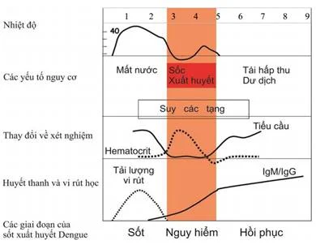
        

          
Figure 1. Sơ Đồ Các Giai Đoạn Lâm Sàng Của Sốt Xuất Huyết Dengue (QĐ 2760/QĐ-BYT)

          Sơ đồ động học 3 giai đoạn của bệnh theo trục thời gian (từ Ngày 1 đến Ngày 9): Mô tả diễn biến đường cong nhiệt độ cơ thể; các nguy cơ lâm sàng chính (mất nước, sốc thoát huyết tương, xuất huyết nội tạng, suy đa tạng, hiện tượng tái hấp thu dịch quá tải); động học cận lâm sàng (Hct tăng cao và tiểu cầu tụt dốc trong giai đoạn nguy hiểm Ngày 3–7); và động học kháng nguyên NS1, kháng thể IgM/IgG.
        

      

      

        ⚠️
        

          <strong>Cạm Bẫy Lâm Sàng Sống Còn:</strong> 
          Thời điểm bệnh nhân <strong>hạ sốt (Ngày thứ 3 đến thứ 6) KHÔNG PHẢI là dấu hiệu khỏi bệnh</strong>! Đây chính là lúc người bệnh bước vào <strong>Giai đoạn Nguy hiểm</strong>. Đa số các trường hợp sốc giảm thể tích tuần hoàn, xuất huyết ồ ạt và tử vong đều xảy ra trong cửa sổ thời gian 24–48 giờ này. Bác sĩ và gia đình tuyệt đối không được chủ quan hạ sốt là khỏi.
        

      

    

  

  <!-- ====================================================================== -->
  <!-- SECTION 2: CHẨN ĐOÁN CĂN NGUYÊN, PHÂN ĐỘ & PHÂN NHÓM TUYẾN (FIG 2)   -->
  <!-- ====================================================================== -->
  

    

      📑
      <h2 class="sec-title">Phần 2: Chẩn Đoán Căn Nguyên, Phân Độ Lâm Sàng &amp; Cây Phân Nhóm Tuyến Điều Trị</h2>
      Phân Tuyến &amp; Tiêu Chuẩn
    

    

      
Chiến Lược Xét Nghiệm Căn Nguyên Vi Rút Theo Ngày Bệnh

      

        

          

          

            
🔬

            
Kháng Nguyên Dengue NS1 (Test Nhanh)

          

          

            <ul style="margin-left: 1rem; line-height: 1.7;">
              <li><strong>Thời điểm chỉ định:</strong> Từ Ngày 1 đến Ngày 7 của bệnh.</li>
              <li><strong>Độ nhạy tối ưu:</strong> Cao nhất trong <strong>5 ngày đầu tiên</strong> của giai đoạn sốt.</li>
              <li>Âm tính không loại trừ hoàn toàn SXHD nếu lâm sàng và dịch tễ điển hình.</li>
            </ul>
          

          
Ưu Tiên Pha Sốt Cấp

        

        

          

          

            
🩸

            
Kháng Thể IgM &amp; IgG (ELISA / Test Nhanh)

          

          

            <ul style="margin-left: 1rem; line-height: 1.7;">
              <li><strong>Thời điểm chỉ định:</strong> Từ <strong>Ngày thứ 5 trở đi</strong> của bệnh.</li>
              <li>Đặc biệt có giá trị khi NS1 âm tính nhưng lâm sàng nghi ngờ SXHD.</li>
              <li>IgM (+) xác nhận nhiễm cấp; IgG tăng hiệu giá 4 lần phân biệt nhiễm thứ phát.</li>
            </ul>
          

          
Ưu Tiên Từ Ngày Thứ 5

        

        

          

          

            
🧬

            
RT-PCR &amp; Phân Lập Vi Rút

          

          

            <ul style="margin-left: 1rem; line-height: 1.7;">
              <li>Thực hiện lấy mẫu máu trong pha sốt (trước Ngày 5).</li>
              <li>Xác định chính xác typ huyết thanh (DEN-1, DEN-2, DEN-3, DEN-4) phục vụ giám sát dịch tễ học và các ca bệnh nặng phức tạp.</li>
            </ul>
          

          
Giám Sát Chuyên Sâu

        

      

      
Bảng Phân Độ Lâm Sàng Sốt Xuất Huyết Dengue (Phụ Lục 2 BYT 2023)

      

        <table class="table-modern">
          <thead>
            <tr>
              <th style="width: 22%;">Phân Độ Lâm Sàng</th>
              <th style="width: 78%;">Tiêu Chuẩn Lâm Sàng &amp; Cận Lâm Sàng Chi Tiết</th>
            </tr>
          </thead>
          <tbody>
            <tr>
              <td>
                <strong style="color: #0284c7;">1. Sốt Xuất Huyết Dengue</strong> 
                Thể Thông Thường
              </td>
              <td>
                • Sốt cấp tính ≤ 7 ngày tại vùng dịch tễ kèm <strong>ít nhất 2 trong các dấu hiệu</strong>: Buồn nôn/nôn; phát ban; đau cơ/đau khớp, nhức 2 hố mắt; xuất huyết da hoặc nghiệm pháp dây thắt (Lacet) (+). 
                • Cận lâm sàng: Hematocrit bình thường hoặc tăng nhẹ; số lượng bạch cầu và tiểu cầu bình thường hoặc giảm nhẹ.
              </td>
            </tr>
            <tr>
              <td>
                <strong style="color: #d97706;">2. SXHD Có Dấu Hiệu Cảnh Báo (DHCB)</strong> 
                Chỉ Định Nhập Viện Nội Trú
              </td>
              <td>
                Có <strong>ít nhất 1 trong 7 dấu hiệu cảnh báo</strong> sau đây: 
                <strong>1. Tri giác:</strong> Vật vã, lừ đừ, li bì, mệt mỏi bứt rứt. 
                <strong>2. Tiêu hóa:</strong> Đau bụng nhiều liên tục hoặc tăng cảm giác đau vùng gan. 
                <strong>3. Nôn ói:</strong> Nôn ói nhiều (≥ 3 lần/1 giờ hoặc ≥ 4 lần/6 giờ). 
                <strong>4. Xuất huyết:</strong> Xuất huyết niêm mạc tự nhiên (chảy máu chân răng, mũi, nôn ra máu, tiêu phân đen/máu, xuất huyết âm đạo hoặc tiểu máu). 
                <strong>5. Thăm khám:</strong> Gan to &gt; 2cm dưới bờ sườn. 
                <strong>6. Tiết niệu:</strong> Lượng nước tiểu giảm, tiểu ít (&lt; 0.5 ml/kg/giờ). 
                <strong>7. Cận lâm sàng:</strong> Dung tích hồng cầu (Hct) tăng cao kèm theo số lượng tiểu cầu giảm nhanh chóng; men gan AST hoặc ALT ≥ 400 U/L; siêu âm hoặc X-quang phát hiện có tràn dịch màng phổi, màng bụng.
              </td>
            </tr>
            <tr>
              <td>
                <strong style="color: #dc2626;">3. Sốt Xuất Huyết Dengue Nặng</strong> 
                Chỉ Định Nhập Hồi Sức Tích Cực (ICU)
              </td>
              <td>
                Có <strong>ít nhất 1 trong 3 biểu hiện nặng</strong> sau đây: 
                • <strong>1. Thoát huyết tương nặng:</strong> Dẫn đến <em>Sốc SXHD</em> (mạch nhanh nhỏ, HA kẹt hoặc tụt); <em>Sốc SXHD nặng</em> (mạch không bắt được, HA không đo được); hoặc ứ dịch mô kẽ/tràn dịch màng phổi gây suy hô hấp cấp. 
                • <strong>2. Xuất huyết nặng:</strong> Xuất huyết đường tiêu hóa ồ ạt, nôn ra máu tươi, tiêu phân máu đỏ tươi, xuất huyết âm đạo nặng, xuất huyết trong cơ và mô mềm, xuất huyết phổi hoặc xuất huyết não. 
                • <strong>3. Suy tạng nặng:</strong> Tổn thương gan nặng/suy gan cấp (men gan AST hoặc ALT ≥ 1000 U/L); tổn thương thần kinh trung ương (thể não: rối loạn tri giác, co giật, hôn mê); tổn thương tim (viêm cơ tim, suy tim cấp) hoặc tổn thương thận cấp (AKI).
              </td>
            </tr>
          </tbody>
        </table>
      

      
Sơ Đồ Phân Nhóm Tuyến Điều Trị Người Bệnh (Phụ Lục 3 BYT 2023)

      

        Quy định xử trí phân tuyến ngay khi tiếp nhận ca bệnh nghi ngờ SXHD nhằm tránh tình trạng chuyển viện trễ gây tử vong hoặc quá tải bệnh viện tuyến trên:
      

      <!-- FIGURE 2 EMBEDDED CARD -->
      

        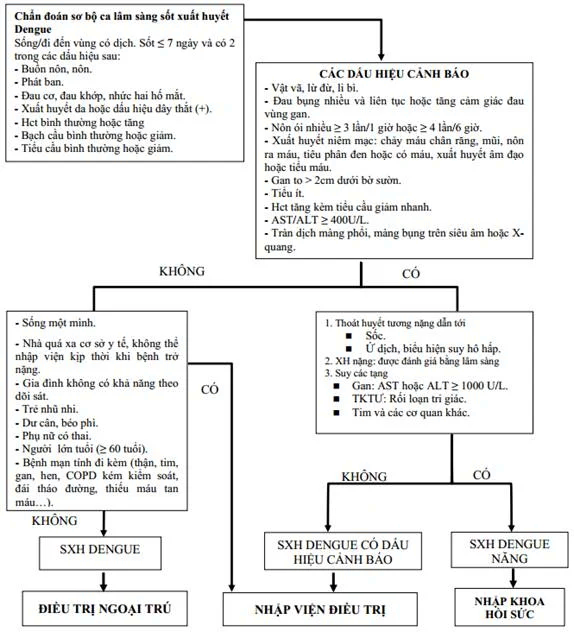
        

          
Figure 2. Sơ Đồ Phân Nhóm Điều Trị Người Bệnh Sốt Xuất Huyết Dengue (QĐ 2760/QĐ-BYT)

          Cây quyết định phân loại tiếp nhận người bệnh: Nhánh SXHD nặng → Chuyển vào Khoa Hồi sức tích cực (Nhóm C); Nhánh SXHD có DHCB HOẶC SXHD kèm yếu tố cơ địa nguy cơ cao → Nhập viện điều trị nội trú (Nhóm B); Nhánh SXHD thông thường không có DHCB và không có yếu tố nguy cơ → Theo dõi và điều trị ngoại trú (Nhóm A).
        

      

      

        

          

            
A

            

          

          

            

              
Nhóm A: Điều Trị Ngoại Trú Có Theo Dõi Hàng Ngày

              Tuyến Cơ Sở
            

            

              Áp dụng cho bệnh nhân SXHD thể thông thường, <strong>không có dấu hiệu cảnh báo</strong> và <strong>không có yếu tố cơ địa nguy cơ</strong>. Hướng dẫn nghỉ ngơi, bù dịch đường uống (Oresol, nước hoa quả), hạ sốt bằng Paracetamol đơn chất (10–15 mg/kg mỗi 4–6h, tối đa 60 mg/kg/ngày). <strong>Tuyệt đối không dùng Aspirin, Ibuprofen</strong>. Tái khám và kiểm tra công thức máu, Hct mỗi ngày cho đến khi hết sốt ít nhất 48 giờ.
            

          

        

        

          

            
B

            

          

          

            

              
Nhóm B: Nhập Viện Điều Trị Nội Trú Tại Khoa Truyền Nhiễm / Nhi / Nội

              Nhập Viện Nội Trú
            

            

              Áp dụng cho: (1) Bệnh nhân <strong>SXHD có dấu hiệu cảnh báo</strong>; HOẶC (2) Bệnh nhân SXHD thể thông thường nhưng có <strong>yếu tố cơ địa nguy cơ cao</strong>:
              <ul style="margin-left: 1.25rem; margin-top: 4px; line-height: 1.6;">
                <li>Sống một mình, nhà quá xa cơ sở y tế không thể cấp cứu kịp thời khi trở nặng.</li>
                <li>Gia đình không có khả năng theo dõi sát diễn biến của người bệnh.</li>
                <li>Trẻ nhũ nhi (≤ 12 tháng tuổi), người béo phì hoặc thừa cân.</li>
                <li>Phụ nữ có thai, người cao tuổi (≥ 60 tuổi).</li>
                <li>Có bệnh lý mạn tính đi kèm: Bệnh tim mạch, bệnh phổi mạn (COPD, hen), suy thận, xơ gan, đái tháo đường, Thalassemia hoặc các bệnh huyết học tan máu.</li>
              </ul>
            

          

        

        

          

            
C

            

          

          

            

              
Nhóm C: Cấp Cứu Khẩn Cấp &amp; Nhập Khoa Hồi Sức Tích Cực (ICU)

              Cấp Cứu ICU
            

            

              Chỉ định bắt buộc cho tất cả bệnh nhân <strong>SXHD Nặng</strong>: Sốc SXHD, Sốc nguy kịch (mạch không bắt được, HA không đo được), xuất huyết nội tạng nặng, suy gan cấp, suy thận cấp, tổn thương thể não hoặc suy hô hấp do tràn dịch đa màng.
            

          

        

      

    

  

  <!-- ====================================================================== -->
  <!-- SECTION 3: BÙ DỊCH SXHD CÓ DẤU HIỆU CẢNH BÁO (FIG 3, 4, 5)           -->
  <!-- ====================================================================== -->
  

    

      💧
      <h2 class="sec-title">Phần 3: Phác Đồ Bù Dịch Tĩnh Mạch SXHD Có Dấu Hiệu Cảnh Báo (DHCB)</h2>
      Phác Đồ Bậc Thang
    

    

      
Nguyên Tắc Bù Dịch Điện Giải Đẳng Trương

      

        Dịch truyền tĩnh mạch chỉ định khi bệnh nhân nôn ói nhiều, không uống được, mệt lả, có dấu mất nước rõ rệt hoặc Hematocrit (Hct) tăng cao. Dung dịch lựa chọn hàng đầu là <strong>dịch điện giải đẳng trương: Ringer lactate, Ringer acetate hoặc NaCl 0.9%</strong>.
      

      <!-- SUB-SECTION 3.1: TRẺ EM -->
      
<i class="fa-solid fa-child"></i> 1. Phác Đồ Bù Dịch Ở Trẻ Em (&lt; 16 Tuổi)

      

        Bắt đầu truyền điện giải tốc độ <strong>6–7 ml/kg/giờ trong 1–3 giờ đầu</strong>, sau đó giảm xuống <strong>5 ml/kg/giờ trong 2–4 giờ tiếp theo</strong>. Theo dõi sát lâm sàng và xét nghiệm Hct mỗi 2–4 giờ:
      

      

        

          

            <i class="fa-solid fa-circle-check"></i> Nhánh Đáp Ứng Tốt (Lâm sàng &amp; Hct cải thiện)
          

          

            Nếu mạch rõ, HA ổn định, Hct giảm và nước tiểu <strong>≥ 0.5–1 ml/kg/giờ</strong> → Giảm tốc độ truyền xuống <strong>3 ml/kg/giờ trong 2–4 giờ</strong>. Nếu lâm sàng tiếp tục cải thiện ổn định, xem xét <strong>ngừng truyền dịch sau 24–48 giờ</strong>.
          

        

        

          

            <i class="fa-solid fa-triangle-exclamation"></i> Nhánh Không Đáp Ứng / Xấu Đi
          

          

            Nếu mạch nhanh, HA kẹt hoặc tụt, Hct tăng cao trở lại: Kiểm tra và điều chỉnh toan máu, xuất huyết, hạ đường huyết, hạ calci. 
            • Nếu tổng dịch truyền <strong>&gt; 60 ml/kg</strong> → Chuyển sang truyền <strong>Cao phân tử (CPT) 10–20 ml/kg/giờ trong 1 giờ</strong> và xử trí theo phác đồ sốc. 
            • Nếu tổng dịch truyền <strong>≤ 60 ml/kg</strong> → Tăng dịch tinh thể lên <strong>10–20 ml/kg/giờ trong 1 giờ</strong> và xử trí theo phác đồ sốc.
          

        

      

      <!-- FIGURE 3 EMBEDDED CARD -->
      

        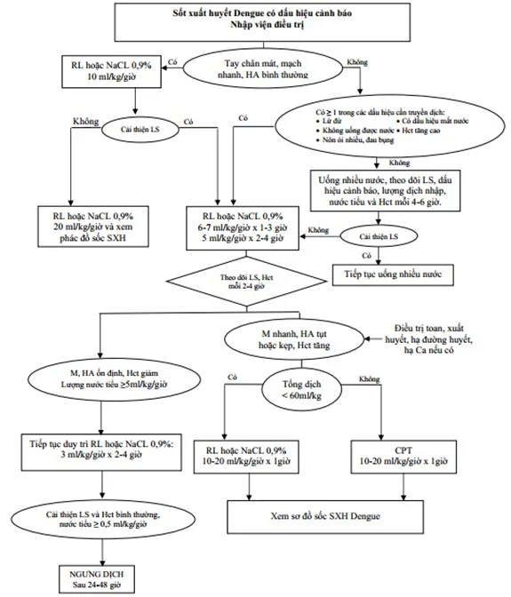
        

          
Figure 3. Sơ Đồ Xử Trí SXHD Có Dấu Hiệu Cảnh Báo Ở Trẻ Em (Phụ Lục 4 BYT 2023)

          Thuật toán bù dịch chi tiết cho bệnh nhi: Phân nhánh tay chân mát, mạch nhanh (bù 10 ml/kg/h) vs có chỉ định truyền dịch (bù 6–7 ml/kg/h x 1–3h → 5 ml/kg/h x 2–4h); lộ trình giảm dịch xuống 3 ml/kg/h và ngưng dịch sau 24–48h; quy tắc nâng liều hoặc chuyển Cao phân tử khi tổng dịch vượt 60 ml/kg.
        

      

      <!-- SUB-SECTION 3.2: THIẾU NIÊN -->
      
<i class="fa-solid fa-user-group"></i> 2. Phác Đồ Bù Dịch Ở Trẻ Thiếu Niên (13 – 16 Tuổi)

      

        Trẻ thiếu niên có đặc điểm sinh lý chuyển tiếp giữa trẻ em và người lớn: Hiện tượng thoát huyết tương thường ít rầm rộ hơn trẻ nhỏ nhưng diện tích da và thể tích phân bố lớn hơn. Do đó, <strong>thời gian duy trì ở mỗi nấc tốc độ dịch truyền chỉ bằng 1/2 so với trẻ em</strong> nhằm ngăn ngừa biến chứng quá tải tuần hoàn:
      

      <!-- FIGURE 4 EMBEDDED CARD -->
      

        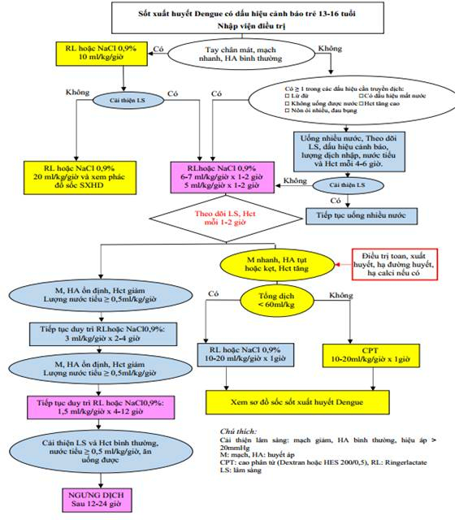
        

          
Figure 4. Sơ Đồ Xử Trí SXHD Có Dấu Hiệu Cảnh Báo Ở Trẻ Thiếu Niên (Phụ Lục 5 BYT 2023)

          Thuật toán tối ưu cho lứa tuổi 13–16 tuổi: Bù dịch tinh thể giảm dần nhanh chóng (6–7 ml/kg/h → 5 ml/kg/h → 3 ml/kg/h) với thời gian rút ngắn một nửa, bổ sung nấc truyền duy trì tối thiểu 1.5 ml/kg/h trong 4–12 giờ trước khi ngưng dịch sau 12–24 giờ.
        

      

      <!-- SUB-SECTION 3.3: NGƯỜI LỚN -->
      
<i class="fa-solid fa-person"></i> 3. Phác Đồ Bù Dịch Ở Người Lớn (≥ 16 Tuổi)

      

        Ở người lớn, chỉ định truyền dịch khi nôn nhiều, không uống được, có biểu hiện mất nước hoặc Hct tăng cao. Tốc độ bù khởi đầu bằng <strong>dịch điện giải 6 ml/kg/giờ trong 1–2 giờ</strong>, sau đó giảm xuống <strong>3 ml/kg/giờ trong 2–4 giờ</strong>.
      

      

        <table class="table-modern">
          <thead>
            <tr>
              <th style="width: 25%;">Tốc Độ Bù Dịch</th>
              <th style="width: 35%;">Thời Gian &amp; Đánh Giá</th>
              <th style="width: 40%;">Hướng Xử Trí Tiếp Theo</th>
            </tr>
          </thead>
          <tbody>
            <tr>
              <td><strong>Bậc 1: 6 ml/kg/giờ</strong></td>
              <td>Truyền trong <strong>1–2 giờ đầu</strong></td>
              <td>Nếu Hct giảm, sinh hiệu ổn định → Chuyển Bậc 2.</td>
            </tr>
            <tr>
              <td><strong>Bậc 2: 3 ml/kg/giờ</strong></td>
              <td>Truyền trong <strong>2–4 giờ tiếp theo</strong></td>
              <td>Nếu mạch, HA ổn định, nước tiểu ≥ 0.5 ml/kg/h → Chuyển Bậc 3.</td>
            </tr>
            <tr>
              <td><strong>Bậc 3: 1.5 ml/kg/giờ</strong></td>
              <td>Truyền duy trì trong <strong>6–18 giờ</strong></td>
              <td><strong>Ngừng truyền dịch hoàn toàn sau 12–24 giờ</strong> khi người bệnh tự uống được.</td>
            </tr>
            <tr>
              <td>Khi Xuất Hiện Sốc</td>
              <td>Mạch nhanh nhẹ, HA kẹt hoặc tụt, Hct tăng cao</td>
              <td><strong>Chống sốc ngay bằng dịch Cao phân tử 10–15 ml/kg/giờ</strong> trong 1 giờ đầu.</td>
            </tr>
          </tbody>
        </table>
      

      <!-- FIGURE 5 EMBEDDED CARD -->
      

        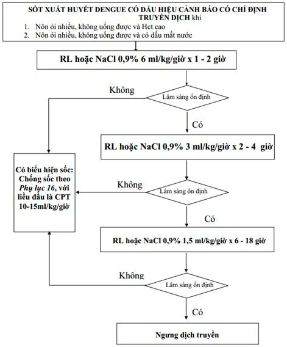
        

          
Figure 5. Sơ Đồ Xử Trí SXHD Có Dấu Hiệu Cảnh Báo Ở Người Lớn (Phụ Lục 6 BYT 2023)

          Lộ trình bù dịch tĩnh mạch cho người lớn: Khởi đầu 6 ml/kg/h (1–2h) → 3 ml/kg/h (2–4h) → 1.5 ml/kg/h (6–18h); ngưng dịch sớm sau 12–24h; chỉ định chuyển Cao phân tử 10–15 ml/kg/h khi có dấu hiệu tiến triển vào sốc.
        

      

    

  

  <!-- ====================================================================== -->
  <!-- SECTION 4: PHÁC ĐỒ CHỐNG SỐC & SỐC NẶNG (FIG 6, 7, 8, 9)              -->
  <!-- ====================================================================== -->
  

    

      ⚡
      <h2 class="sec-title">Phần 4: Phác Đồ Chống Sốc SXHD &amp; Sốc Nặng Nguy Kịch (M = 0, HA = 0)</h2>
      Hồi Sức Cấp Cứu
    

    

      
Chống Sốc Ở Trẻ Em (&lt; 16 Tuổi)

      

        <strong>Giờ đầu tiên:</strong> Truyền dịch điện giải (Ringer lactate hoặc NaCl 0.9%) tốc độ <strong>20 ml/kg/giờ trong 1 giờ</strong> (nếu tụt huyết áp nặng: truyền 20 ml/kg trong vòng 30 phút). Đánh giá lại lâm sàng và đo Hct sau 1 giờ:
      

      

        

          

            ✓ Cải Thiện Lâm Sàng (Ra sốc, mạch rõ, HA lên)
          

          

            Giảm dần tốc độ dịch điện giải theo bậc: 
            <strong>10 ml/kg/giờ trong 1–2 giờ</strong> → <strong>7.5 ml/kg/giờ trong 1–2 giờ</strong> → <strong>5 ml/kg/giờ trong 3–4 giờ</strong> → <strong>3 ml/kg/giờ trong 4–6 giờ</strong>. Xem xét ngừng dịch hoàn toàn sau 24–48 giờ.
          

        

        

          

            ✗ Không Cải Thiện (Sốc kéo dài / Tái sốc)
          

          

            Đánh giá ngay động học Hct: 
            • <strong>Nếu Hct còn tăng cao hoặc ≥ 40%:</strong> Chuyển sang <strong>Cao phân tử (Dextran 40/70 hoặc HES 200) tốc độ 10–20 ml/kg/giờ trong 1 giờ</strong>. 
            • <strong>Nếu Hct giảm thấp hoặc ≤ 35% (nghi ngờ xuất huyết nội):</strong> Truyền ngay <strong>Hồng cầu lắng 5–10 ml/kg</strong> hoặc Máu toàn phần 10–20 ml/kg.
          

        

      

      <!-- FIGURE 6 EMBEDDED CARD -->
      

        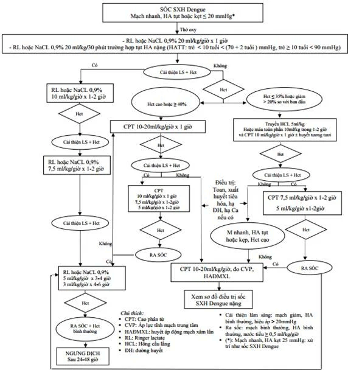
        

          
Figure 6. Sơ Đồ Truyền Dịch Trong Sốc Sốt Xuất Huyết Dengue Ở Trẻ Em (Phụ Lục 8 BYT 2023)

          Thuật toán chống sốc hoàn chỉnh ở trẻ em: Bắt đầu điện giải 20 ml/kg/h x 1h; rẽ nhánh xử trí tinh tế theo động học Hct (Hct ≥ 40% dùng Cao phân tử vs Hct ≤ 35% truyền máu cấp cứu); bậc thang giảm dịch chi tiết đến khi ngưng truyền an toàn.
        

      

      <!-- FIGURE 7 EMBEDDED CARD: SỐC NẶNG TRẺ EM -->
      
<i class="fa-solid fa-skull-crossbones" style="color: #dc2626;"></i> Sốc SXHD Nặng Ở Trẻ Em (Mạch = 0, Huyết Áp = 0 Hoặc Hiệu Áp ≤ 10 mmHg)

      

        Tình huống tối khẩn cấp đe dọa tính mạng: Cho trẻ nằm đầu phẳng, thở oxy lưu lượng cao qua mask. <strong>Dùng bơm tiêm to bơm trực tiếp vào tĩnh mạch dịch điện giải với liều 20 ml/kg trong vòng 15 phút</strong>. Sau đó đánh giá lại tức thì:
      

      

        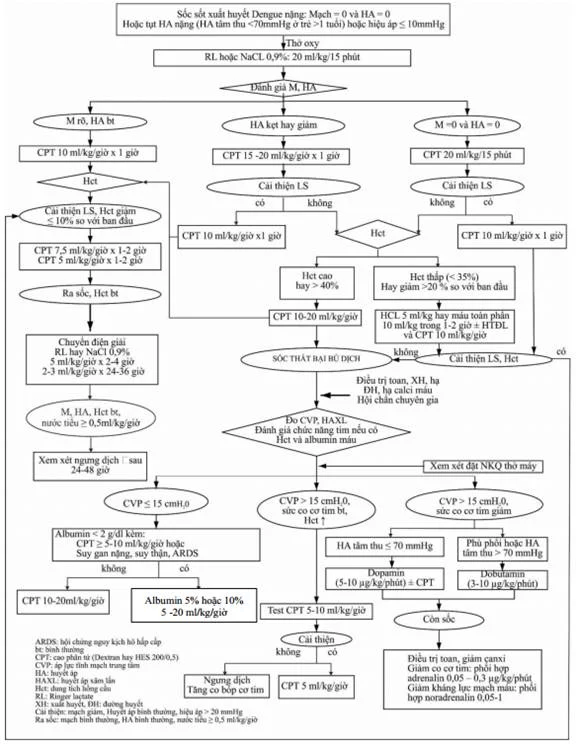
        

          
Figure 7. Sơ Đồ Truyền Dịch Trong Sốc SXHD Nặng Ở Trẻ Em (Phụ Lục 12 BYT 2023)

          Xử trí tối khẩn cấp khi mạch bằng 0, HA bằng 0: Bơm tĩnh mạch trực tiếp dịch điện giải 20 ml/kg/15 phút; nếu mạch rõ chuyển CPT 10 ml/kg/h; nếu chưa cải thiện dùng CPT 15–20 ml/kg/h hoặc bolus CPT 20 ml/kg/15 phút; chỉ định đặt nội khí quản, đo CVP, HA động mạch xâm lấn và phối hợp Albumin khi CPT tích lũy ≥ 60 ml/kg.
        

      

      <!-- SUB-SECTION 4.2: NGƯỜI LỚN -->
      
<i class="fa-solid fa-person-burst"></i> Chống Sốc Ở Người Lớn (≥ 16 Tuổi)

      

        <strong>Giờ đầu tiên:</strong> Truyền dịch điện giải <strong>15 ml/kg/giờ trong 1 giờ</strong>. Đánh giá lại:
         • <em>Nếu cải thiện:</em> Giảm dần dịch tinh thể: <strong>10 ml/kg/h x 2h</strong> → <strong>6 ml/kg/h x 2h</strong> → <strong>3 ml/kg/h x 5–7h</strong> → <strong>1.5 ml/kg/h x 12h</strong> rồi ngừng truyền.
         • <em>Nếu không cải thiện:</em> Đo Hct: Hct giảm &gt; 20% hoặc Hct &lt; 35% → Truyền máu khẩn; Hct tăng hoặc không đổi → Chuyển <strong>Cao phân tử 10–15 ml/kg/giờ trong 1 giờ</strong>.
      

      <!-- FIGURE 8 & FIGURE 9 EMBEDDED CARDS -->
      

        

          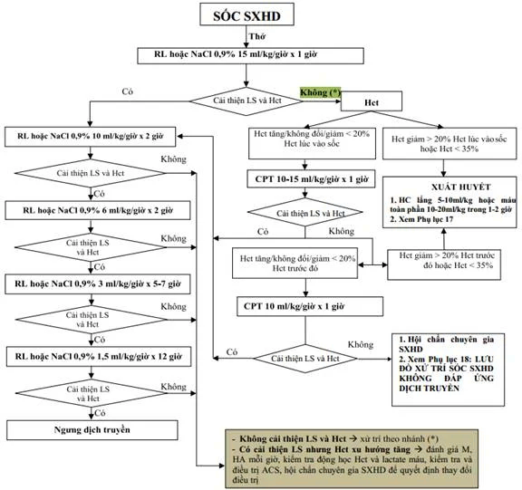
          

            
Figure 8. Sơ Đồ Chống Sốc SXHD Ở Người Lớn (Phụ Lục 16.1 BYT 2023)

            Phác đồ khởi đầu điện giải 15 ml/kg/h x 1h; rẽ nhánh theo dõi Hct và lactate mỗi giờ; giảm dịch từng bậc đến ngưng truyền.
          

        

        

          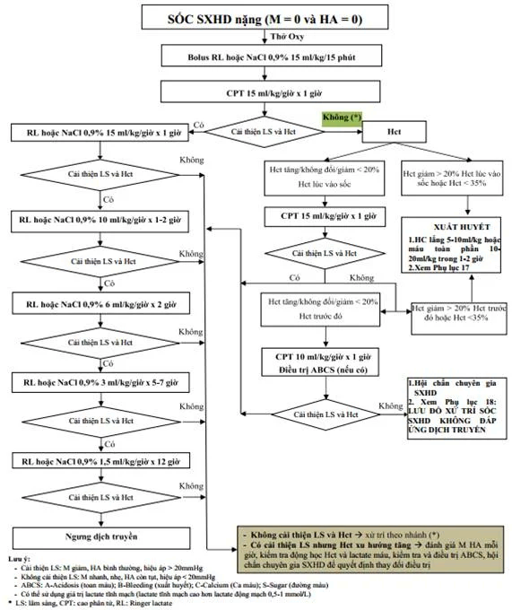
          

            
Figure 9. Sơ Đồ Chống Sốc SXHD Nặng Ở Người Lớn (Phụ Lục 16.2 BYT 2023)

            Xử trí sốc mất mạch (M=0, HA=0): Bolus nhanh tinh thể 15 ml/kg trong 15 phút, sau đó truyền CPT 15 ml/kg/h trong 1 giờ.
          

        

      

      
<i class="fa-solid fa-weight-scale"></i> Bảng Tra Cứu Cân Nặng Hiệu Chỉnh Ở Trẻ Dư Cân, Béo Phì (Phụ Lục 9 BYT 2023 / CDC 2014)

      

        Ở trẻ em dư cân hoặc béo phì, thể tích mô mỡ lớn nhưng tuần hoàn mao mạch ít. Nếu tính lượng dịch chống sốc theo cân nặng thực tế sẽ gây <strong>quá liều thể tích dịch nghiêm trọng dẫn đến phù phổi cấp và tràn dịch màng phổi chèn ép</strong>. Bắt buộc tra cứu <strong>cân nặng hiệu chỉnh (kg)</strong> theo lứa tuổi và giới tính:
      

      

        <table class="table-modern">
          <thead>
            <tr>
              <th style="width: 20%; text-align: center;">Độ Tuổi (Năm)</th>
              <th style="width: 40%; text-align: center; color: #0284c7;">Cân Nặng Hiệu Chỉnh Bé Nam (kg)</th>
              <th style="width: 40%; text-align: center; color: #e11d48;">Cân Nặng Hiệu Chỉnh Bé Nữ (kg)</th>
            </tr>
          </thead>
          <tbody>
            <tr><td style="text-align: center;"><strong>2 Tuổi</strong></td><td style="text-align: center; font-weight: 700;">13 kg</td><td style="text-align: center; font-weight: 700;">12 kg</td></tr>
            <tr><td style="text-align: center;"><strong>3 Tuổi</strong></td><td style="text-align: center; font-weight: 700;">14 kg</td><td style="text-align: center; font-weight: 700;">14 kg</td></tr>
            <tr><td style="text-align: center;"><strong>4 Tuổi</strong></td><td style="text-align: center; font-weight: 700;">16 kg</td><td style="text-align: center; font-weight: 700;">16 kg</td></tr>
            <tr><td style="text-align: center;"><strong>5 Tuổi</strong></td><td style="text-align: center; font-weight: 700;">18 kg</td><td style="text-align: center; font-weight: 700;">18 kg</td></tr>
            <tr><td style="text-align: center;"><strong>6 Tuổi</strong></td><td style="text-align: center; font-weight: 700;">21 kg</td><td style="text-align: center; font-weight: 700;">20 kg</td></tr>
            <tr><td style="text-align: center;"><strong>7 Tuổi</strong></td><td style="text-align: center; font-weight: 700;">23 kg</td><td style="text-align: center; font-weight: 700;">23 kg</td></tr>
            <tr><td style="text-align: center;"><strong>8 Tuổi</strong></td><td style="text-align: center; font-weight: 700;">26 kg</td><td style="text-align: center; font-weight: 700;">26 kg</td></tr>
            <tr><td style="text-align: center;"><strong>9 Tuổi</strong></td><td style="text-align: center; font-weight: 700;">29 kg</td><td style="text-align: center; font-weight: 700;">29 kg</td></tr>
            <tr><td style="text-align: center;"><strong>10 Tuổi</strong></td><td style="text-align: center; font-weight: 700;">32 kg</td><td style="text-align: center; font-weight: 700;">33 kg</td></tr>
            <tr><td style="text-align: center;"><strong>11 Tuổi</strong></td><td style="text-align: center; font-weight: 700;">36 kg</td><td style="text-align: center; font-weight: 700;">37 kg</td></tr>
            <tr><td style="text-align: center;"><strong>12 Tuổi</strong></td><td style="text-align: center; font-weight: 700;">40 kg</td><td style="text-align: center; font-weight: 700;">42 kg</td></tr>
            <tr><td style="text-align: center;"><strong>13 Tuổi</strong></td><td style="text-align: center; font-weight: 700;">45 kg</td><td style="text-align: center; font-weight: 700;">46 kg</td></tr>
            <tr><td style="text-align: center;"><strong>14 Tuổi</strong></td><td style="text-align: center; font-weight: 700;">51 kg</td><td style="text-align: center; font-weight: 700;">49 kg</td></tr>
            <tr><td style="text-align: center;"><strong>15 Tuổi</strong></td><td style="text-align: center; font-weight: 700;">56 kg</td><td style="text-align: center; font-weight: 700;">52 kg</td></tr>
            <tr><td style="text-align: center;"><strong>16 Tuổi</strong></td><td style="text-align: center; font-weight: 700;">61 kg</td><td style="text-align: center; font-weight: 700;">54 kg</td></tr>
          </tbody>
        </table>
      

    

  

  <!-- ====================================================================== -->
  <!-- SECTION 5: SỐC KHÔNG ĐÁP ỨNG, ĐO CVP & THUỐC VẬN MẠCH (FIG 10)       -->
  <!-- ====================================================================== -->
  

    

      📈
      <h2 class="sec-title">Phần 5: Sốc Trơ Dịch Truyền, Quy Trình Đo CVP &amp; Sử Dụng Thuốc Vận Mạch</h2>
      Huyết Động Nâng Cao
    

    

      
Chỉ Định Đo Áp Lực Tĩnh Mạch Trung Tâm (CVP) &amp; Kỹ Thuật

      

        Đo CVP được chỉ định khi: Sốc kéo dài, tái sốc, sốc không đáp ứng với tổng lượng bù dịch ≥ 60 ml/kg; có biểu hiện quá tải dịch hoặc nghi ngờ quá tải; sốc trên bệnh nhân có bệnh tim, phổi, thận mạn tính hoặc trẻ nhũ nhi béo phì.
      

      

        🛑
        

          <strong>Quy Tắc Vàng An Toàn Thủ Thuật Trong SXHD:</strong> 
          Bắt buộc đặt catheter tĩnh mạch trung tâm qua <strong>Tĩnh mạch nền ở khuỷu tay (PICC)</strong> bằng phương pháp Seldinger cải tiến dưới hướng dẫn siêu âm. <strong>TUYỆT ĐỐI KHÔNG đặt qua tĩnh mạch cảnh trong hoặc tĩnh mạch dưới đòn</strong> vì nguy cơ xuất huyết tạo khối máu tụ chèn ép đường thở không thể băng ép cầm máu!
        

      

      
Sử Dụng Thuốc Vận Mạch &amp; Tăng Co Bóp Cơ Tim

      

        Thuốc vận mạch chỉ được chỉ định khi <strong>đã bù đủ thể tích lòng mạch mà huyết áp vẫn chưa đạt và áp lực tĩnh mạch trung tâm đã trên 10 cmH₂O</strong> (hoặc IVC căng to suốt chu kỳ thở trên siêu âm):
      

      

        

          

          

            
💊

            
1. Dopamin (Lựa Chọn Đầu Tay)

          

          

            <ul style="margin-left: 1rem; line-height: 1.7;">
              <li><strong>Chỉ định:</strong> Lựa chọn đầu tiên trong sốc SXHD kéo dài ở trẻ em.</li>
              <li><strong>Liều dùng:</strong> <strong>5 – 10 µg/kg/phút</strong>.</li>
              <li><strong>Công thức pha bơm tiêm điện 50ml:</strong> <em>Tổng liều Dopamin (mg) = 3 × Cân nặng (kg)</em> pha trong Glucose 5% hoặc NaCl 0.9% vừa đủ 50ml; khi đó <strong>tốc độ bơm tiêm (ml/giờ) = liều truyền (µg/kg/phút)</strong>.</li>
            </ul>
          

          
Vận Mạch Hàng Đầu

        

        

          

          

            
🫀

            
2. Dobutamin (Khi Có Suy Tim / Quá Tải)

          

          

            <ul style="margin-left: 1rem; line-height: 1.7;">
              <li><strong>Chỉ định:</strong> Sốc kèm suy giảm sức co bóp cơ tim, có biểu hiện quá tải tuần hoàn hoặc thất bại với Dopamin.</li>
              <li><strong>Liều dùng:</strong> <strong>3 – 10 µg/kg/phút</strong> (pha tương tự công thức Dopamin).</li>
            </ul>
          

          
Tăng Co Bóp Cơ Tim

        

        

          

          

            
⚡

            
3. Noradrenaline &amp; Adrenaline

          

          

            <ul style="margin-left: 1rem; line-height: 1.7;">
              <li><strong>Noradrenaline:</strong> <strong>0.05 – 1.0 µg/kg/phút</strong> khi có sốc giãn mạch (giảm sức cản mạch ngoại vi, hiệu áp rộng).</li>
              <li><strong>Adrenaline:</strong> <strong>0.05 – 0.3 µg/kg/phút</strong> khi sốc kháng trị có suy giảm nặng lực co bóp cơ tim.</li>
            </ul>
          

          
Sốc Kháng Trị

        

      

      <!-- FIGURE 10 EMBEDDED CARD -->
      

        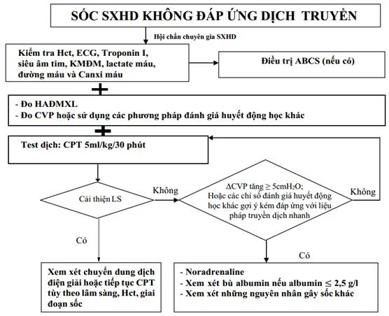
        

          
Figure 10. Lưu Đồ Xử Trí Sốc SXHD Không Đáp Ứng Dịch Truyền (Phụ Lục 18 BYT 2023)

          Quy trình tiếp cận sốc trơ: Hội chẩn khẩn cấp, đặt HA động mạch xâm lấn, đo CVP, làm khí máu và lactate; thực hiện test dịch Cao phân tử 5 ml/kg trong 30 phút; nếu CVP tăng vọt ≥ 5 cmH₂O hoặc kém đáp ứng → Dùng Noradrenaline và xem xét phối hợp bù Albumin 5%–20%.
        

      

      
Bảng Điều Kiện Chuyển Đổi Giữa Cao Phân Tử &amp; Dịch Điện Giải (Phụ Lục 10 BYT 2023)

      

        <table class="table-modern">
          <thead>
            <tr>
              <th style="width: 50%; color: #047857;">Chuyển Từ Cao Phân Tử (CPT) Sang Điện Giải</th>
              <th style="width: 50%; color: #b45309;">Chuyển Ngược Lại Từ Điện Giải Sang Cao Phân Tử</th>
            </tr>
          </thead>
          <tbody>
            <tr>
              <td>
                Được thực hiện khi thỏa mãn <strong>đồng thời các điều kiện</strong>: 
                1. Cao phân tử đang duy trì ở tốc độ <strong>5 ml/kg/giờ</strong> trong 1–2 giờ liên tục. 
                2. Người bệnh tỉnh táo, tiếp xúc tốt. 
                3. Huyết động ổn định: Mạch rõ, HA bình thường theo tuổi, chi ấm, thời gian đổ đầy mao mạch (CRT) &lt; 2 giây. 
                4. Nước tiểu đạt <strong>≥ 0.5–1 ml/kg/giờ</strong>. 
                5. Hct giảm ổn định về mức bình thường.
              </td>
              <td>
                Chỉ định chuyển ngược lại sang CPT khi: 
                1. Bệnh nhân có biểu hiện <strong>tái sốc</strong> (mạch nhanh nhỏ, HA kẹt hoặc tụt). 
                2. HOẶC Dung tích hồng cầu (Hct) <strong>tăng cao trở lại (&gt; 10% so với trị số ngay trước đó)</strong> kèm theo huyết động học không ổn định mặc dù đang được truyền dịch điện giải đúng liều.
              </td>
            </tr>
          </tbody>
        </table>
      

    

  

  <!-- ====================================================================== -->
  <!-- SECTION 6: XỬ TRÍ XUẤT HUYẾT NẶNG & CHẾ PHẨM MÁU (FIG 11, 12)        -->
  <!-- ====================================================================== -->
  

    

      🩸
      <h2 class="sec-title">Phần 6: Xử Trí Xuất Huyết Nặng, Xuất Huyết Tiêu Hóa &amp; Chỉ Định Chế Phẩm Máu</h2>
      Huyết Học &amp; Cầm Máu
    

    

      
Chỉ Định Truyền Máu &amp; Các Chế Phẩm Máu (Phụ Lục 17 BYT 2023)

      <!-- FIGURE 11 EMBEDDED CARD -->
      

        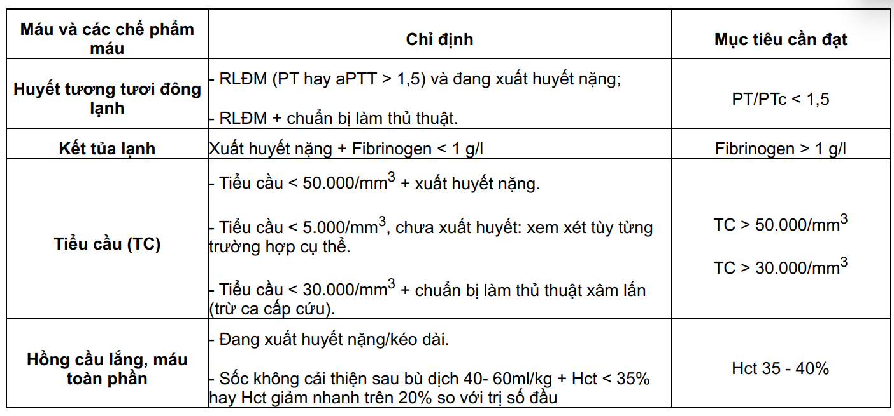
        

          
Figure 11. Bảng Chỉ Định Truyền Máu &amp; Chế Phẩm Máu Trong Sốc SXHD (Phụ Lục 17 BYT 2023)

          Ngưỡng xét nghiệm và chỉ định nghiêm ngặt: Hồng cầu lắng (Hct ≤ 35% hoặc giảm nhanh &gt; 20%), Huyết tương tươi đông lạnh (INR &gt; 1.5, PT &gt; 2 lần), Kết tủa lạnh (Fibrinogen &lt; 1 g/L), Khối tiểu cầu (tiểu cầu &lt; 50.000/mm³ có XH nặng hoặc &lt; 5.000/mm³ dự phòng).
        

      

      

        <table class="table-modern">
          <thead>
            <tr>
              <th style="width: 25%;">Chế Phẩm Máu</th>
              <th style="width: 45%;">Chỉ Định Nghiêm Ngặt</th>
              <th style="width: 30%;">Liều Lượng &amp; Mục Tiêu</th>
            </tr>
          </thead>
          <tbody>
            <tr>
              <td><strong>Hồng Cầu Lắng (HCL)</strong> (Hoặc Máu toàn phần mới)</td>
              <td>
                • <strong>Hct ≤ 35%</strong> kèm theo sốc thất bại hoặc kém đáp ứng sau khi đã bù dịch ≥ 40 ml/kg. 
                • Hct giảm nhanh <strong>&gt; 20%</strong> so với ban đầu kèm theo tình trạng sốc không cải thiện. 
                • <strong>Hct ≤ 40%</strong> kèm theo đang xuất huyết nặng ồ ạt trên lâm sàng.
              </td>
              <td>
                • HCL: <strong>5 – 10 ml/kg</strong> truyền trong 1–2 giờ. 
                • Máu toàn phần: <strong>10 – 20 ml/kg</strong>. 
                • Mục tiêu: Nâng Hct lên 40–45%.
              </td>
            </tr>
            <tr>
              <td><strong>Huyết Tương Tươi Đông Lạnh (FFP)</strong></td>
              <td>
                Rối loạn đông máu nặng (PT kéo dài &gt; 2 lần bình thường hoặc <strong>INR &gt; 1.5</strong>) kèm ít nhất một trong các tiêu chuẩn: 
                1. Đang có xuất huyết nặng. 
                2. Có chỉ định chọc hút màng bụng/màng phổi. 
                3. Đang truyền máu khối lượng lớn (≥ 1/2 thể tích máu).
              </td>
              <td>
                • Liều: <strong>10 – 20 ml/kg</strong> truyền trong 2–4 giờ. 
                • Mục tiêu: Đưa INR &lt; 1.5 và PT &lt; 1.5 lần.
              </td>
            </tr>
            <tr>
              <td><strong>Tủa Lạnh (Cryoprecipitate)</strong></td>
              <td>
                Đang có xuất huyết nặng kèm theo nồng độ <strong>Fibrinogen &lt; 1.0 g/L (100 mg/dL)</strong>.
              </td>
              <td>
                • Liều: <strong>1 túi / 6 kg cân nặng</strong> (mỗi túi chứa ~150 mg Fibrinogen). 
                • Mục tiêu: Nâng Fibrinogen &gt; 1.5 g/L.
              </td>
            </tr>
            <tr>
              <td><strong>Khối Tiểu Cầu</strong></td>
              <td>
                • Tiểu cầu <strong>&lt; 5.000/mm³</strong> (kể cả chưa xuất huyết trên lâm sàng). 
                • Tiểu cầu <strong>&lt; 50.000/mm³</strong> kèm theo đang có xuất huyết nặng hoặc chuẩn bị làm thủ thuật xâm lấn (chọc màng bụng/phổi).
              </td>
              <td>
                • <strong>1 đơn vị tiểu cầu đậm đặc / 5 kg</strong>; HOẶC <strong>1 đơn vị gạn tách (Apheris) / 10 kg</strong>. 
                • Mục tiêu: Tiểu cầu &gt; 50.000/mm³.
              </td>
            </tr>
          </tbody>
        </table>
      

      <!-- FIGURE 12 EMBEDDED CARD: XHTH TRÊN -->
      
<i class="fa-solid fa-notes-medical"></i> Xử Trí Xuất Huyết Tiêu Hóa Trên &amp; Chỉ Định Nội Soi Cầm Máu

      

        Bệnh nhân xuất huyết tiêu hóa nặng bắt buộc phải <strong>nhịn ăn hoàn toàn bằng đường miệng</strong>, đặt 2 đường truyền tĩnh mạch lớn và dùng ngay thuốc ức chế bơm proton (PPI) liều cao:
      

      

        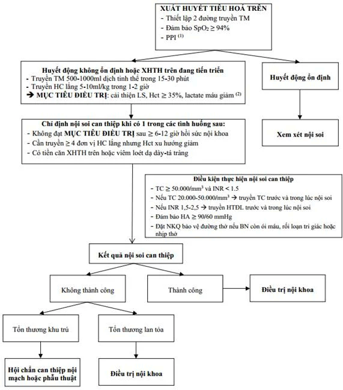
        

          
Figure 12. Lưu Đồ Xử Trí Xuất Huyết Tiêu Hóa Trên Ở Bệnh Nhân SXHD (Phụ Lục 17 BYT 2023)

          Thuật toán: Nhịn ăn uống, thiết lập 2 đường truyền tĩnh mạch lớn; Omeprazole/Esomeprazole/Pantoprazole bolus 80 mg TM, sau đó duy trì 40 mg mỗi 12 giờ; điều kiện an toàn để nội soi can thiệp cầm máu (Tiểu cầu ≥ 50.000/mm³, INR &lt; 1.5; nếu TC 20.000–50.000/mm³ bắt buộc truyền tiểu cầu trước và trong khi nội soi).
        

      

    

  

  <!-- ====================================================================== -->
  <!-- SECTION 7: XỬ TRÍ SUY TẠNG NẶNG (FIG 13)                              -->
  <!-- ====================================================================== -->
  

    

      ⚠️
      <h2 class="sec-title">Phần 7: Xử Trí Suy Tạng Nặng (Suy Gan Cấp, SXHD Thể Não, AKI &amp; Quá Tải Dịch)</h2>
      Hồi Sức Đa Tạng
    

    

      <!-- 7.1 SUY GAN CẤP -->
      
<i class="fa-solid fa-liver"></i> 1. Tổn Thương Gan &amp; Suy Gan Cấp (AST, ALT ≥ 1000 U/L)

      

        Tổn thương gan trong SXHD chia làm 3 mức: Nhẹ (AST/ALT 120–&lt; 400 U/L); Trung bình (400–&lt; 1000 U/L); Nặng/Suy gan cấp (<strong>AST hoặc ALT ≥ 1000 U/L</strong>). Khi có tổn thương gan từ mức trung bình: <strong>TUYỆT ĐỐI KHÔNG dùng Paracetamol và KHÔNG dùng dung dịch Ringer lactate</strong> (do gan giảm khả năng chuyển hóa lactate thành bicarbonate gây tăng toan lactic). Dung dịch thay thế là <strong>NaCl 0.9% hoặc Ringer acetate</strong>.
      

      <!-- FIGURE 13 EMBEDDED CARD -->
      

        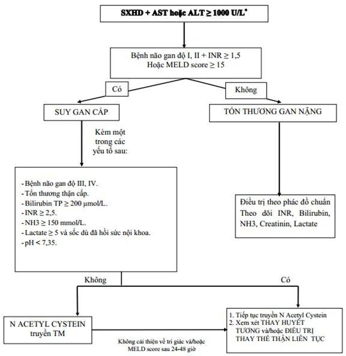
        

          
Figure 13. Lưu Đồ Xử Trí Suy Gan Cấp Ở Bệnh Nhân SXHD Nặng (Phụ Lục 26 BYT 2023)

          Chẩn đoán khi có bệnh não gan độ I–II kèm INR ≥ 1.5 hoặc MELD ≥ 15; chỉ định truyền N-Acetylcystein đường tĩnh mạch; theo dõi tri giác sau 24–48 giờ; xem xét chỉ định Thay huyết tương (PE) và/hoặc Lọc máu liên tục (CRRT / CVVHDF).
        

      

      

        

          <i class="fa-solid fa-circle-check"></i> PHÁC ĐỒ N-ACETYLCYSTEIN (NAC) TĨNH MẠCH TRONG SUY GAN CẤP
          <i class="fa-solid fa-layer-group"></i> BYT 2023 Chuẩn Hóa
        

        

          • <strong>Liều tấn công:</strong> <strong>150 mg/kg</strong> pha trong Glucose 5% truyền tĩnh mạch trong 1 giờ. 
          • <strong>Liều duy trì 1:</strong> <strong>50 mg/kg</strong> truyền trong 4 giờ tiếp theo. 
          • <strong>Liều duy trì 2:</strong> <strong>100 mg/kg</strong> truyền trong 16 giờ tiếp theo. 
          • <strong>Duy trì liên tục:</strong> <strong>6.25 mg/kg/giờ</strong> trong 48–72 giờ cho đến khi men gan và chức năng đông máu cải thiện.
        

      

      <!-- 7.2 SXHD THỂ NÃO -->
      
<i class="fa-solid fa-brain"></i> 2. Sốt Xuất Huyết Dengue Thể Não (Tổn Thương Thần Kinh Trung Ương)

      

        Bệnh nhân có biểu hiện co giật, lơ mơ, hôn mê, đồng tử co dãn không đều hoặc dấu hiệu tăng áp lực nội sọ:
      

      <ul style="margin-left: 1.25rem; line-height: 1.7;">
        <li>Cho nằm đầu cao 30°, thở oxy, đặt nội khí quản bảo vệ đường thở nếu GCS ≤ 8 điểm.</li>
        <li><strong>Cắt cơn co giật:</strong> <strong>Diazepam 0.2 mg/kg tiêm TM chậm</strong> (hoặc bơm hậu môn 0.5 mg/kg); nếu thất bại lặp lại liều 2 sau 10 phút (tối đa 3 liều). Nếu vẫn kháng trị: dùng <strong>Phenobarbital 10–20 mg/kg</strong> truyền tĩnh mạch trong 15–30 phút.</li>
        <li><strong>Chống phù não hạ áp lực nội sọ:</strong> Truyền nhanh <strong>Mannitol 20% liều 0.5 g/kg trong 30 phút</strong>, nhắc lại mỗi 8 giờ; có thể phối hợp xen kẽ với <strong>Natri clorua 3% liều 4 ml/kg truyền trong 30 phút</strong>.</li>
      </ul>

      <!-- 7.3 QUÁ TẢI DỊCH & PHÙ PHỔI -->
      
<i class="fa-solid fa-water"></i> 3. Quá Tải Dịch Tuần Hoàn &amp; Phù Phổi Cấp (Ngày 6 – Ngày 8)

      

        🛑
        

          <strong>Xử Trí Cấp Cứu Khi Quá Tải Dịch:</strong> 
          Khi bệnh nhân ho đột ngột, thở nhanh khó thở co kéo, tĩnh mạch cổ nổi, phổi có ran ẩm lan nhanh, khạc bọt hồng (Hct thường giảm thấp do pha loãng máu): 
          1. <strong>NGỪNG TRUYỀN DỊCH TĨNH MẠCH NGAY LẬP TỨC!</strong> 
          2. Cho ngồi đầu cao 90°, thở oxy lưu lượng cao hoặc NCPAP / đặt nội khí quản thở máy PEEP cao. 
          3. <strong>Furosemide liều 0.5 – 1.0 mg/kg tiêm tĩnh mạch chậm</strong> (chỉ dùng khi huyết áp ổn định). 
          4. Nếu huyết động không ổn định hoặc có suy tim: Truyền Dobutamin 5–10 µg/kg/phút để nâng đỡ cơ tim.
        

      

    

  

  <!-- ====================================================================== -->
  <!-- SECTION 8: ĐỐI TƯỢNG ĐẶC BIỆT                                          -->
  <!-- ====================================================================== -->
  

    

      🤰
      <h2 class="sec-title">Phần 8: Hồi Sức SXHD Trên Các Đối Tượng Đặc Biệt (Thai Phụ, Thalassemia, Nhũ Nhi)</h2>
      Cơ Địa Nguy Cơ
    

    

      

        

          

          

            
🤰

            
1. Phụ Nữ Có Thai (PNCT)

          

          

            <ul style="margin-left: 1rem; line-height: 1.7;">
              <li><strong>Sinh lý học 3 tháng cuối:</strong> Thai phụ có nhịp tim nhanh hơn, huyết áp thấp hơn và Hct giảm sinh lý (Hct bình thường chỉ từ <strong>28–40%</strong>). Chẩn đoán cô đặc máu khi <strong>Hct tăng &gt; 10% hoặc Hct &gt; 38–40%</strong>.</li>
              <li>PNCT 3 tháng cuối bắt buộc tính dịch truyền theo <strong>cân nặng hiệu chỉnh</strong>.</li>
              <li><strong>Can thiệp sản khoa:</strong> Tuyệt đối <strong>TRÌ HOÃN chuyển dạ hoặc mổ lấy thai trong giai đoạn nguy hiểm (Ngày 3–6)</strong> vì nguy cơ băng huyết tử vong cực cao. Nếu bắt buộc sinh: Truyền tiểu cầu trước sinh 6 giờ duy trì <strong>tiểu cầu &gt; 50.000/mm³ (sinh thường)</strong> hoặc <strong>&gt; 75.000/mm³ (mổ lấy thai)</strong>.</li>
            </ul>
          

          
Tuyệt Đối Hoãn Mổ Ngày 3–6

        

        

          

          

            
🩸

            
2. Bệnh Nhân Thalassemia

          

          

            <ul style="margin-left: 1rem; line-height: 1.7;">
              <li>Có Hct nền rất thấp: Hiện tượng cô đặc máu được tính khi <strong>Hct hiện tại tăng &gt; 20% so với Hct nền của chính bệnh nhân</strong>.</li>
              <li>Dễ bị quá tải sắt gây suy tim và suy gan nặng hơn.</li>
              <li><strong>Dịch truyền:</strong> Tránh dùng Ringer lactate, ưu tiên dùng <strong>NaCl 0.9% hoặc Ringer acetate</strong>.</li>
              <li>Truyền máu sớm để duy trì Hct ổn định trong khoảng <strong>25% – 30%</strong>.</li>
            </ul>
          

          
Truyền Máu Sớm Hct 25–30%

        

        

          

          

            
👶

            
3. Trẻ Nhũ Nhi (≤ 12 Tháng Tuổi)

          

          

            <ul style="margin-left: 1rem; line-height: 1.7;">
              <li>Dấu hiệu sốc rất kín đáo và dễ bị bỏ sót; Hct nền sinh lý thấp (30–35%).</li>
              <li>Nguy cơ quá tải dịch và phù phổi cực cao.</li>
              <li>Rất khó đặt catheter tĩnh mạch trung tâm để đo CVP; khuyến cáo <strong>sử dụng siêu âm tại giường khảo sát sự biến thiên đường kính tĩnh mạch chủ dưới (IVC collapsibility index)</strong> để đánh giá thể tích lòng mạch.</li>
            </ul>
          

          
Siêu Âm IVC Đánh Giá Dịch

        

      

    

  

  <!-- ====================================================================== -->
  <!-- SECTION 9: HỒI SỨC HÔ HẤP & CAN THIỆP GIẢM ÁP                         -->
  <!-- ====================================================================== -->
  

    

      🫁
      <h2 class="sec-title">Phần 9: Hồi Sức Hô Hấp Chuyên Sâu &amp; Quy Trình Can Thiệp Giảm Chèn Ép Khoang</h2>
      Kỹ Thuật Can Thiệp
    

    

      
1. Liệu Pháp Hỗ Trợ Hô Hấp Phân Tầng

      

        Suy hô hấp trong SXHD phát sinh từ toan chuyển hóa nặng, quá tải dịch tuần hoàn, ARDS, hoặc chèn ép cơ học do tràn dịch đa màng. Áp dụng bậc thang hỗ trợ hô hấp:
      

      

        <table class="table-modern">
          <thead>
            <tr>
              <th style="width: 25%;">Phương Thức Thở</th>
              <th style="width: 40%;">Chỉ Định Lâm Sàng</th>
              <th style="width: 35%;">Cài Đặt Thông Số Chuẩn</th>
            </tr>
          </thead>
          <tbody>
            <tr>
              <td><strong>1. Oxy Gọng Kính (Canula)</strong></td>
              <td>Chỉ định cho 100% bệnh nhân sốc SXHD hoặc có SpO₂ &lt; 95%.</td>
              <td>Tốc độ dòng <strong>1 – 6 lít/phút</strong> để duy trì SpO₂ ≥ 95%.</td>
            </tr>
            <tr>
              <td><strong>2. Thở Áp Lực Dương Liên Tục (NCPAP)</strong></td>
              <td>Thất bại với thở oxy canula (thở co kéo, thở nhanh, SpO₂ &lt; 92%).</td>
              <td>Áp lực ban đầu <strong>4 – 6 cmH₂O</strong>, FiO₂ 40–60%; tăng tối đa đến <strong>10 cmH₂O</strong> và FiO₂ 100%. (Tránh dùng khi hôn mê sâu).</td>
            </tr>
            <tr>
              <td><strong>3. Đặt Nội Khí Quản &amp; Thở Máy Xâm Lấn</strong></td>
              <td>
                • Thất bại với thở NCPAP đã kết hợp chọc hút dẫn lưu dịch. 
                • Phù phổi cấp quá tải dịch thất bại với NCPAP và vận mạch. 
                • Hội chứng ARDS nặng hoặc thể não hôn mê sâu (GCS ≤ 8). 
                • Suy hô hấp kèm men gan tăng vọt &gt; 1000 U/L.
              </td>
              <td>Chiến lược thông khí bảo vệ phổi: Vt 6 ml/kg IBW, duy trì áp lực cao nguyên Pplat ≤ 30 cmH₂O.</td>
            </tr>
          </tbody>
        </table>
      

      
2. Quy Trình Chọc Hút Màng Bụng &amp; Màng Phổi Giảm Chèn Ép Khoang

      

        ⚠️
        

          <strong>Nguyên Tắc An Toàn Tối Cao:</strong> 
          Bệnh nhân SXHD nặng có rối loạn đông máu và giảm tiểu cầu nặng. Chọc dò khoang màng bụng hoặc màng phổi tiềm ẩn nguy cơ xuất huyết ồ ạt không cầm được. <strong>Bắt buộc truyền bù Khối tiểu cầu (nâng &gt; 50.000/mm³) và Huyết tương tươi đông lạnh (nâng INR &lt; 1.5) TRƯỚC KHI thực hiện thủ thuật</strong>!
        

      

      

        

          

            <i class="fa-solid fa-syringe"></i> Chọc Hút - Dẫn Lưu Màng Bụng
          

          

            • <strong>Chỉ định:</strong> Suy hô hấp thất bại với NCPAP kèm tràn dịch màng bụng lượng lớn, cơ hoành nâng cao bất động trên siêu âm, kèm áp lực ổ bụng (đo qua bàng quang) <strong>&gt; 27 cmH₂O</strong> (hoặc &gt; 34 cmH₂O ở bệnh nhân đang thở máy). 
            • <strong>Vị trí chọc:</strong> Đường giữa bụng, dưới rốn <strong>2 – 3 cm</strong>. 
            • <strong>Kỹ thuật:</strong> Dùng kim luồn <strong>16 – 18G</strong> đâm vuông góc mặt da; rút nòng kim, luồn sâu catheter vào khoang phúc mạc và nối vào <strong>hệ thống túi dẫn lưu kín</strong> để dịch chảy chậm rãi.
          

        

        

          

            <i class="fa-solid fa-lungs"></i> Chọc Hút Màng Phổi Giảm Áp
          

          

            • <strong>Chỉ định:</strong> Tràn dịch màng phổi lượng lớn gây suy hô hấp cấp, mất phế âm một bên, X-quang mờ &gt; 1/2 phế trường. 
            • <strong>Vị trí chọc:</strong> Khoang liên sườn <strong>4 – 5 đường nách giữa</strong>, chọc sát <strong>bờ trên xương sườn dưới</strong> (để tránh bó mạch thần kinh liên sườn nằm ở bờ dưới). 
            • <strong>Kỹ thuật:</strong> Dùng kim luồn <strong>18 – 20G</strong> hút giải áp chậm qua khóa ba chia. 
            • <strong>CẤM TUYỆT ĐỐI:</strong> <em>Không được đặt ống dẫn lưu màng phổi liên tục</em> vì sẽ gây tràn máu màng phổi nặng tử vong!
          

        

      

    

  

  <!-- ====================================================================== -->
  <!-- SECTION 10: QUY TRÌNH KỸ THUẬT LÂM SÀNG & ĐIỀU DƯỠNG (FIG 14, 15)     -->
  <!-- ====================================================================== -->
  

    

      🩺
      <h2 class="sec-title">Phần 10: Quy Trình Kỹ Thuật Lâm Sàng Tại Giường &amp; Can Thiệp Chăm Sóc Điều Dưỡng</h2>
      Kỹ Thuật Thực Hành
    

    

      

        <table class="table-modern">
          <thead>
            <tr>
              <th style="width: 25%;">Quy Trình Kỹ Thuật</th>
              <th style="width: 45%;">Các Bước Thực Hiện Quy Chuẩn BYT 2023</th>
              <th style="width: 30%;">Tiêu Chuẩn Đánh Giá &amp; Cảnh Báo</th>
            </tr>
          </thead>
          <tbody>
            <tr>
              <td><strong>1. Nghiệm Pháp Dây Thắt (Lacet)</strong></td>
              <td>
                1. Đo huyết áp, tính HATB: (HA_{TB} = (HA_{max} + HA_{min}) / 2). 
                2. Bơm băng quấn duy trì đúng mức HATB liên tục trong <strong>5 phút</strong>. 
                3. Xả băng quấn, chờ 2 phút cho da hồi phục. 
                4. Đếm số chấm xuất huyết trong khung diện tích <strong>2.5 × 2.5 cm (6.25 cm²)</strong> ở mặt trước cẳng tay.
              </td>
              <td>
                • <strong>Dương tính:</strong> Khi có <strong>&gt; 20 chấm xuất huyết / 6.25 cm²</strong>. 
                • <em>Chống chỉ định:</em> Không làm khi đã có xuất huyết tự nhiên hoặc bệnh nhân đang sốc.
              </td>
            </tr>
            <tr>
              <td><strong>2. Đo Hct Tại Chỗ Bằng Máy Quay Ly Tâm</strong></td>
              <td>
                1. Chích máu ngón tay bằng lancet (để tự chảy, không nặn ép). 
                2. Hút máu vào ống mao quản tráng heparin. 
                3. Trám kín 2 đầu bằng sáp chuyên dụng. 
                4. Đặt ống đối xứng trong máy ly tâm, quay <strong>5 phút</strong>. 
                5. Đọc kết quả bằng đĩa đo chuyên dụng (tỷ lệ cột hồng cầu lắng so với máu toàn phần).
              </td>
              <td>
                • Giúp điều chỉnh tốc độ dịch truyền ngay tại giường không cần đợi xét nghiệm lab. 
                • Đánh giá mức độ cô đặc máu (tăng &gt; 20%).
              </td>
            </tr>
            <tr>
              <td><strong>3. Thiết Lập Đường Truyền Ngoại Vi An Toàn</strong></td>
              <td>
                • Bắt buộc dùng <strong>kim luồn cỡ 20 – 22G</strong> để đảm bảo tốc độ bù dịch lớn không đứt quãng. 
                • Chọn tĩnh mạch cẳng tay, mu bàn tay; tránh vị trí khớp gấp gập gãy ống.
              </td>
              <td>
                • <strong>Cấm tiêm chích tĩnh mạch đùi hoặc tĩnh mạch cổ</strong> ở bệnh nhân SXHD nặng do nguy cơ tạo khối máu tụ chèn ép không băng ép được.
              </td>
            </tr>
            <tr>
              <td><strong>4. Đặt PICC Seldinger Cải Tiến</strong></td>
              <td>
                1. Siêu âm định vị <strong>tĩnh mạch nền ở khuỷu tay</strong>. 
                2. Đâm kim luồn 22G một góc 30° dưới hướng dẫn siêu âm. 
                3. Luồn guidewire 4F đầu cong J sâu 5–10 cm (theo dõi ECG). 
                4. Rạch da nhẹ, nong rộng qua dây dẫn bằng catheter 20G → 18G → 16G. 
                5. Luồn catheter chuyên dụng, khâu cố định và chụp X-quang/siêu âm kiểm tra vị trí đầu catheter.
              </td>
              <td>
                • Kỹ thuật vàng đo CVP và truyền vận mạch tuyệt đối an toàn, tránh biến chứng tràn máu màng phổi.
              </td>
            </tr>
          </tbody>
        </table>
      

      <!-- FIGURE 14 & FIGURE 15 EMBEDDED CARDS -->
      

        

          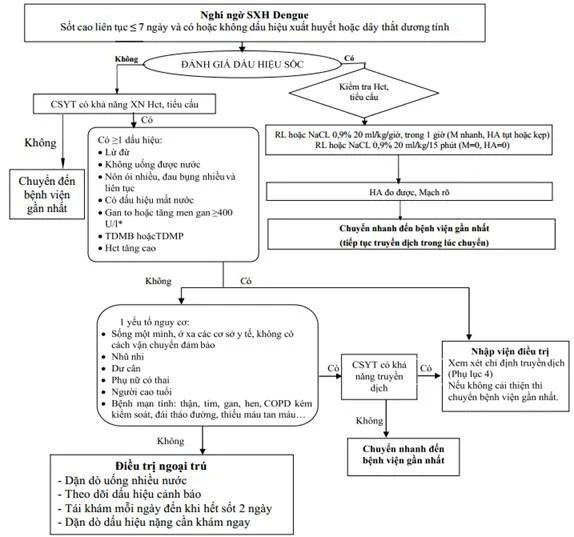
          

            
Figure 14. Lưu Đồ Xử Trí SXHD Ở Tuyến Cơ Sở Khi Có Dịch (Phụ Lục 21 BYT 2023)

            Phân luồng trạm y tế: Đánh giá có/không có khả năng xét nghiệm Hct và truyền dịch; chỉ định chuyển tuyến an toàn hoặc bù dịch cấp cứu trước khi chuyển viện.
          

        

        

          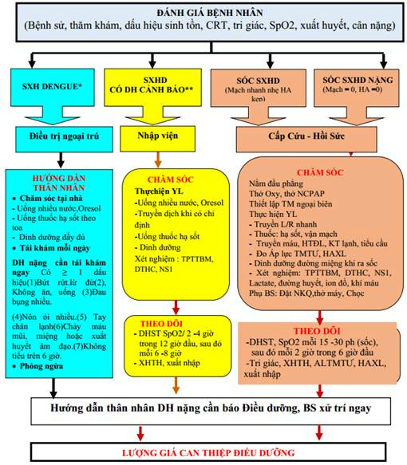
          

            
Figure 15. Lưu Đồ Chăm Sóc Bệnh Nhi SXHD Của Điều Dưỡng (Phụ Lục 22 BYT 2023)

            Quy trình điều dưỡng tiếp nhận, phân loại 3 nhánh chăm sóc (ngoại trú, nội trú DHCB, hồi sức cấp cứu sốc); hướng dẫn theo dõi sinh hiệu và phát hiện sớm biến chứng.
          

        

      

      
<i class="fa-solid fa-list-check"></i> Bảng Lượng Giá Can Thiệp Điều Dưỡng Phòng Ngừa Biến Chứng (Phụ Lục 22 BYT 2023)

      

        <table class="table-modern">
          <thead>
            <tr>
              <th style="width: 20%;">Nguy Cơ Lâm Sàng</th>
              <th style="width: 30%;">Can Thiệp Điều Dưỡng Chủ Chốt</th>
              <th style="width: 25%;">Cơ Sở Lý Giải Khoa Học</th>
              <th style="width: 25%;">Tiêu Chuẩn Lượng Giá Đạt Yêu Cầu</th>
            </tr>
          </thead>
          <tbody>
            <tr>
              <td><strong>Giảm thể tích tuần hoàn do thoát huyết tương</strong></td>
              <td>• Hướng dẫn uống nhiều Oresol, nước hoa quả. • Tránh nước màu đỏ, nâu. • Theo dõi sát lượng nước uống và nôn. • Báo bác sĩ khi Hct &gt; 41%.</td>
              <td>• Bù đắp thể tích lòng mạch bị thất thoát do tăng tính thấm thành mạch. • Tránh nhầm lẫn dịch nôn với XHTH. • Hct tăng cao phản ánh cô đặc máu tiến triển.</td>
              <td>Bệnh nhi tỉnh táo, chi ấm, mạch rõ, HA ổn định trong giới hạn tuổi, lượng nước tiểu <strong>≥ 0.5 ml/kg/giờ</strong>.</td>
            </tr>
            <tr>
              <td><strong>Xuất huyết da, niêm mạc do giảm tiểu cầu</strong></td>
              <td>• Chỉ lấy máu xét nghiệm tại tĩnh mạch chi (tránh TM đùi). • Ép chặt vị trí tiêm từ <strong>1–2 phút</strong> sau lấy máu. • Tuyệt đối <strong>không tiêm bắp</strong>.</td>
              <td>• Tránh tạo khối máu tụ lớn gây chèn ép mạch máu chi dưới. • Tiêm bắp ở bệnh nhân giảm tiểu cầu dễ gây tụ máu trong cơ và nhiễm trùng.</td>
              <td>Không xuất hiện thêm các vết bầm máu mới, không chảy máu nơi tiêm chích sau khi làm thủ thuật.</td>
            </tr>
            <tr>
              <td><strong>Dư dịch, quá tải tuần hoàn khi bù dịch nhanh</strong></td>
              <td>• Thực hiện chính xác tốc độ truyền theo y lệnh (dùng máy truyền dịch). • Theo dõi sát: ho đột ngột, khó thở, tĩnh mạch cổ nổi. • Phụ bác sĩ đo áp lực CVP.</td>
              <td>• Đảm bảo lượng dịch nhập vừa đủ ra sốc, tránh quá mức gây phù phổi. • CVP &gt; 12 cmH₂O cảnh báo nguy cơ quá tải tuần hoàn hệ thống.</td>
              <td>Bệnh nhi hết khó thở, phế trường phổi trong, không có ran ẩm, CVP duy trì ở mức an toàn.</td>
            </tr>
          </tbody>
        </table>
      

      
<i class="fa-solid fa-heart-pulse"></i> Phân Tầng Nhịp Tim &amp; Huyết Áp Sinh Lý Theo Lứa Tuổi Trẻ Em (Phụ Lục 22 BYT 2023)

      

        <table class="table-modern">
          <thead>
            <tr>
              <th style="width: 35%; text-align: center;">Nhóm Tuổi Bệnh Nhi</th>
              <th style="width: 35%; text-align: center; color: #0284c7;">Nhịp Tim Sinh Lý Bình Thường (Lần/phút)</th>
              <th style="width: 30%; text-align: center; color: #10b981;">Huyết Áp Tâm Thu Tối Thiểu (mmHg)</th>
            </tr>
          </thead>
          <tbody>
            <tr>
              <td style="text-align: center;"><strong>Trẻ nhũ nhi (&lt; 1 tuổi)</strong></td>
              <td style="text-align: center; font-weight: 700;">110 – 160 lần/phút</td>
              <td style="text-align: center; font-weight: 700;">70 – 90 mmHg</td>
            </tr>
            <tr>
              <td style="text-align: center;"><strong>Trẻ nhỏ (2 – 5 tuổi)</strong></td>
              <td style="text-align: center; font-weight: 700;">95 – 140 lần/phút</td>
              <td style="text-align: center; font-weight: 700;">80 – 100 mmHg</td>
            </tr>
            <tr>
              <td style="text-align: center;"><strong>Trẻ lớn (5 – 12 tuổi)</strong></td>
              <td style="text-align: center; font-weight: 700;">80 – 120 lần/phút</td>
              <td style="text-align: center; font-weight: 700;">90 – 110 mmHg</td>
            </tr>
            <tr>
              <td style="text-align: center;"><strong>Trẻ vị thành niên (&gt; 12 tuổi)</strong></td>
              <td style="text-align: center; font-weight: 700;">60 – 100 lần/phút</td>
              <td style="text-align: center; font-weight: 700;">100 – 120 mmHg</td>
            </tr>
          </tbody>
        </table>
      

    

  

  <!-- ====================================================================== -->
  <!-- SECTION 11: DINH DƯỠNG, HKKK & HỘI CHẨN CẤP CỨU                       -->
  <!-- ====================================================================== -->
  

    

      🥗
      <h2 class="sec-title">Phần 11: Chế Độ Dinh Dưỡng Phục Hồi, Quy Trình Tư Vấn HKKK &amp; Tiêu Chuẩn Hội Chẩn</h2>
      Chăm Sóc Toàn Diện
    

    

      
1. Chế Độ Dinh Dưỡng Phân Tầng Theo Thể Biến Chứng

      

        Bệnh nhân SXHD có tình trạng tăng dị hóa mạnh mẽ, nhu cầu năng lượng tăng thêm <strong>20% đến 60%</strong> so với bình thường. Khẩu phần ăn cần lỏng, mềm, giàu đạm sinh học cao, chia nhỏ thành nhiều bữa (<strong>6–8 bữa ở trẻ em, 4–6 bữa ở người lớn</strong>):
      

      

        

          

          

            
🩸

            
Xuất Huyết Tiêu Hóa Nặng

          

          

            <strong>Nhịn ăn hoàn toàn đường miệng</strong>. Nuôi dưỡng tĩnh mạch hoàn toàn (Glucose 10%, Acid amin 10%). Khi xuất huyết ổn định: Cho ăn lại bằng nước đường lạnh trong 24 giờ đầu, sau đó chuyển dần sang cháo súp nguội lỏng.
          

        

        

          

          

            
🧪

            
Suy Gan Cấp

          

          

            Đạm duy trì 1.1–1.3 g/kg/ngày, hạn chế lipid &lt; 15% tổng năng lượng. Nếu có <strong>hôn mê gan (bệnh não gan): Giảm đạm xuống 0.3–0.6 g/kg/ngày</strong> và lipid &lt; 10% để giảm tạo amoniac (NH₃).
          

        

        

          

          

            
🧠

            
SXHD Thể Não (Hôn Mê)

          

          

            Nuôi ăn qua ống thông dạ dày. <strong>BẮT BUỘC ĐẶT SONDE DẠ DÀY QUA ĐƯỜNG MIỆNG</strong> (tuyệt đối không đặt qua đường mũi vì nguy cơ xuất huyết niêm mạc mũi do giảm tiểu cầu).
          

        

      

      
2. Quy Trình 4 Bước Tư Vấn "HKKK" Dành Cho Điều Dưỡng

      

        

          

H

          

            

H – Hỏi Thân Nhân Người Bệnh

            
Dùng câu hỏi mở tìm hiểu hiểu biết của gia đình về cách chăm sóc, bù nước và nhận biết dấu hiệu nặng của bệnh.

          

        

        

          

K

          

            

K – Khen Ngợi Hành Vi Đúng

            
Động viên, khích lệ những việc làm chăm sóc đúng của thân nhân (như cho uống nhiều nước, đưa đi khám sớm).

          

        

        

          

K

          

            

K – Khuyên Bảo &amp; Uốn Nắn

            
Sửa chữa quan niệm sai lầm (như kiêng cữ quá mức, tự ý dùng kháng sinh/aspirin, chích lể); dặn dò 7 dấu hiệu nguy hiểm cần tái khám khẩn cấp.

          

        

        

          

K

          

            

K – Kiểm Tra Lại Tiếp Thu

            
Hỏi lại thân nhân các nội dung cốt lõi vừa tư vấn để đảm bảo gia đình đã nắm chính xác và có thể tự thực hiện tại nhà.

          

        

      

      
3. Tiêu Chuẩn Kích Hoạt Hội Chẩn Khẩn Cấp Với Tuyến Trên

      

        📞
        

          <strong>Chỉ Định Hội Chẩn Khẩn Cấp Tuyến Trên Hoặc Chuyển Tuyến An Toàn:</strong> 
          1. Sốc kéo dài thất bại với dịch Cao phân tử có liều tích lũy <strong>&gt; 100 ml/kg</strong> và đã phối hợp nhiều thuốc vận mạch. 
          2. Bệnh nhân bị <strong>tái sốc từ 2 lần trở lên</strong>. 
          3. Suy hô hấp cấp nặng thất bại với thở máy xâm lấn hoặc hội chứng ARDS. 
          4. Suy gan cấp, suy thận cấp vô niệu hoặc thể não hôn mê sâu co giật kháng trị. 
          5. Xuất huyết nặng mất kiểm soát dù đã truyền lượng lớn máu và chế phẩm máu. 
          6. Có chỉ định can thiệp lọc máu liên tục (CRRT) hoặc thay huyết tương (PE).
        

      

    

  

      <!-- ====================================================================== -->
  <!-- SECTION 12: BỘ CÔNG CỤ CDSS TÍNH TOÁN DỊCH TRUYỀN & CHỐNG SỐC         -->
  <!-- ====================================================================== -->
  

    

      💻
      <h2 class="sec-title">Phần 12: Bộ Công Cụ CDSS Tính Toán Dịch Truyền &amp; Lập Kế Hoạch Chai Dịch Từng Cữ</h2>
      CDSS Tương Tác
    

    

      

        Hệ thống Hỗ trợ Quyết định Lâm sàng (CDSS) phân định theo <strong>3 đối tượng</strong> (Người lớn, Trẻ em, Thiếu niên), <strong>3 phân độ</strong> (DHCB, Sốc, Sốc nặng M=0 HA=0), tự động áp dụng <em>Cân nặng hiệu chỉnh CDC 2014</em> và lập <strong>Bảng Kế Hoạch &amp; Theo Dõi Chai Dịch Truyền Từng Cữ (Fluid Bottle Logistics Schedule)</strong> giúp nhân viên y tế theo dõi chính xác từng mốc giờ, lượng dịch treo tại cọc, lượng dịch thực truyền và lượng dịch dư chuyển tiếp:
      

      

        

          

            <i class="fa-solid fa-calculator"></i> CDSS: Máy Tính Dịch Truyền &amp; Lập Bảng Cọc Dịch SXHD Chuẩn BYT 2023
          

          
            <i class="fa-solid fa-clock-rotate-left"></i> Chuẩn Hóa Logistics Cọc Dịch
          
        

        <!-- Quick Presets Toolbar -->
        

          
            <i class="fa-solid fa-bolt" style="color: #f59e0b;"></i> Ca Mẫu Lâm Sàng:
          
          <button type="button" id="btn-preset-adult-shock" style="padding: 4px 10px; font-size: 0.8rem; font-weight: 600; border-radius: 6px; border: 1px solid #0284c7; background: rgba(2, 132, 199, 0.08); color: #0284c7; cursor: pointer;">
            Người lớn Sốc (46 kg, 11h20)
          </button>
          <button type="button" id="btn-preset-child-shock" style="padding: 4px 10px; font-size: 0.8rem; font-weight: 600; border-radius: 6px; border: 1px solid #10b981; background: rgba(16, 185, 129, 0.08); color: #047857; cursor: pointer;">
            Trẻ 8 tuổi béo phì Sốc (38 kg → CDC 26 kg)
          </button>
          <button type="button" id="btn-preset-teen-warning" style="padding: 4px 10px; font-size: 0.8rem; font-weight: 600; border-radius: 6px; border: 1px solid #8b5cf6; background: rgba(139, 92, 246, 0.08); color: #7c3aed; cursor: pointer;">
            Thiếu niên 14 tuổi DHCB (50 kg)
          </button>
          <button type="button" id="btn-preset-adult-severe" style="padding: 4px 10px; font-size: 0.8rem; font-weight: 600; border-radius: 6px; border: 1px solid #dc2626; background: rgba(220, 38, 38, 0.08); color: #dc2626; cursor: pointer;">
            Người lớn Sốc nặng M=0 HA=0 (55 kg)
          </button>
        

        <!-- Input Parameters Grid -->
        

          

            <label style="display: block; font-size: 0.8rem; font-weight: 700; margin-bottom: 4px;">
              <i class="fa-solid fa-users" style="color: #0284c7;"></i> Đối Tượng Bệnh Nhân:
            </label>
            <select id="select-dengue-group" style="width: 100%; padding: 0.55rem 0.75rem; border-radius: 8px; border: 1.5px solid var(--color-border, #cbd5e1); font-weight: 700; font-size: 0.92rem; background: var(--color-surface, #fff); color: var(--color-text, #1e293b);">
              <option value="adult" selected>Người lớn (≥ 16 tuổi)</option>
              <option value="child">Trẻ em (&lt; 13 tuổi)</option>
              <option value="teen">Trẻ thiếu niên (13–16 tuổi)</option>
            </select>
          

          

            <label style="display: block; font-size: 0.8rem; font-weight: 700; margin-bottom: 4px;">
              <i class="fa-solid fa-heart-pulse" style="color: #ef4444;"></i> Phân Độ Lâm Sàng:
            </label>
            <select id="select-dengue-stage" style="width: 100%; padding: 0.55rem 0.75rem; border-radius: 8px; border: 1.5px solid var(--color-border, #cbd5e1); font-weight: 700; font-size: 0.92rem; background: var(--color-surface, #fff); color: var(--color-text, #1e293b);">
              <option value="shock" selected>Sốc SXHD (Mạch nhanh nhỏ, HA kẹt/tụt)</option>
              <option value="warning">SXHD có Dấu hiệu cảnh báo (DHCB)</option>
              <option value="severe_shock">Sốc SXHD nặng (Mạch = 0, Huyết áp = 0)</option>
            </select>
          

          

            <label style="display: block; font-size: 0.8rem; font-weight: 700; margin-bottom: 4px;">
              <i class="fa-solid fa-clock" style="color: #f59e0b;"></i> Mốc Giờ Bắt Đầu Truyền:
            </label>
            <input type="text" id="input-dengue-time" value="11:20" placeholder="11:20" style="width: 100%; padding: 0.55rem 0.75rem; border-radius: 8px; border: 1.5px solid var(--color-border, #cbd5e1); font-weight: 700; font-size: 0.92rem; background: var(--color-surface, #fff); color: var(--color-text, #1e293b);" />
          

          

            <label style="display: block; font-size: 0.8rem; font-weight: 700; margin-bottom: 4px;">
              <i class="fa-solid fa-weight-scale" style="color: #10b981;"></i> Cân Nặng Thực Tế (kg):
            </label>
            <input type="number" id="input-dengue-weight" value="46" min="3" max="150" step="0.5" style="width: 100%; padding: 0.55rem 0.75rem; border-radius: 8px; border: 1.5px solid var(--color-border, #cbd5e1); font-weight: 700; font-size: 0.92rem; background: var(--color-surface, #fff); color: var(--color-text, #1e293b);" />
          

          

            <label style="display: block; font-size: 0.8rem; font-weight: 700; margin-bottom: 4px;">
              <i class="fa-solid fa-cake-candles" style="color: #8b5cf6;"></i> Độ Tuổi (Năm):
            </label>
            <input type="number" id="input-dengue-age" value="25" min="0" max="99" style="width: 100%; padding: 0.55rem 0.75rem; border-radius: 8px; border: 1.5px solid var(--color-border, #cbd5e1); font-weight: 700; font-size: 0.92rem; background: var(--color-surface, #fff); color: var(--color-text, #1e293b);" />
          

          

            <label style="display: block; font-size: 0.8rem; font-weight: 700; margin-bottom: 4px;">
              <i class="fa-solid fa-venus-mars" style="color: #ec4899;"></i> Giới Tính:
            </label>
            <select id="select-dengue-gender" style="width: 100%; padding: 0.55rem 0.75rem; border-radius: 8px; border: 1.5px solid var(--color-border, #cbd5e1); font-weight: 700; font-size: 0.92rem; background: var(--color-surface, #fff); color: var(--color-text, #1e293b);">
              <option value="male" selected>Nam</option>
              <option value="female">Nữ</option>
            </select>
          

          

            <label style="display: block; font-size: 0.8rem; font-weight: 700; margin-bottom: 4px;">
              <i class="fa-solid fa-bottle-droplet" style="color: #06b6d4;"></i> Quy Cách Chai Dịch:
            </label>
            <select id="select-bottle-size" style="width: 100%; padding: 0.55rem 0.75rem; border-radius: 8px; border: 1.5px solid var(--color-border, #cbd5e1); font-weight: 700; font-size: 0.92rem; background: var(--color-surface, #fff); color: var(--color-text, #1e293b);">
              <option value="500" selected>Chai 500 ml (Chuẩn BV / BYT)</option>
              <option value="250">Chai 250 ml</option>
            </select>
          

        

        

          <button type="button" id="btn-calc-dengue" style="padding: 0.65rem 1.4rem; border-radius: 8px; background: #0284c7; color: #fff; font-weight: 800; font-size: 0.92rem; border: none; cursor: pointer; display: inline-flex; align-items: center; gap: 8px; box-shadow: 0 2px 6px rgba(2, 132, 199, 0.35);">
            <i class="fa-solid fa-calculator"></i> Tính Toán &amp; Lập Bảng Kế Hoạch Cọc Dịch
          </button>
          <button type="button" id="btn-copy-dengue-table" style="padding: 0.65rem 1.25rem; border-radius: 8px; background: var(--color-surface, #fff); color: var(--color-text, #334155); font-weight: 700; font-size: 0.88rem; border: 1.5px solid var(--color-border, #cbd5e1); cursor: pointer; display: inline-flex; align-items: center; gap: 6px;">
            <i class="fa-solid fa-copy"></i> Sao Chép Bảng Bàn Giao Cữ
          </button>
        

        <!-- Render Target Box -->
        

          <!-- Dynamic Results Content will be injected here -->
        

      

    

  

  <!-- ====================================================================== -->
  <!-- SECTION 13: TÀI LIỆU THAM KHẢO CHUẨN AMA                               -->
  <!-- ====================================================================== -->
  

    

      📚
      <h2 class="sec-title">Phần 13: Tài Liệu Tham Khảo EBM (Chuẩn Định Dạng AMA)</h2>
      Evidence Base
    

    

      
      

        <strong>Văn bản pháp quy &amp; Hướng dẫn chuyên môn cốt lõi (AMA Format):</strong> 
        1. <strong>Bộ Y tế Việt Nam.</strong> <em>Hướng dẫn chẩn đoán, điều trị Sốt xuất huyết Dengue</em>. Ban hành kèm theo Quyết định số 2760/QĐ-BYT ngày 04 tháng 7 năm 2023 của Bộ trưởng Bộ Y tế. Hà Nội: Bộ Y tế; 2023. 
        2. <strong>World Health Organization.</strong> <em>Dengue: Guidelines for Diagnosis, Treatment, Prevention and Control</em>. New edition. Geneva: World Health Organization; 2009. 
        3. <strong>Centers for Disease Control and Prevention (CDC).</strong> Adjusted body weight calculation tables for pediatric fluid resuscitation in critical care. <em>CDC MMWR Recomm Rep</em>. 2014;63(RR-03):1-24. 
        4. <strong>Wills BA, Nguyen MD, Ha TL, et al.</strong> Comparison of three fluid solutions for resuscitation in dengue shock syndrome. <em>N Engl J Med</em>. 2005;353(9):877-889. doi:10.1056/NEJMoa044057. 
        5. <strong>Dung NM, Day NP, Tam DT, et al.</strong> Fluid replacement in dengue shock syndrome: a randomized, double-blind comparison of four intravenous-fluid regimens. <em>Clin Infect Dis</em>. 1999;29(4):787-794.
      

      

        <h4 style="font-family: 'Plus Jakarta Sans', sans-serif; font-size: 0.95rem; font-weight: 700; margin-bottom: 0.75rem;">🌐 Khám Phá Thêm Trong Hệ Sinh Thái CliniPortal:</h4>
        

          <a href="#/ebm/kho-guidelines" class="btn btn-primary">
            <i class="fa-solid fa-arrow-left"></i> Quay lại Kho Guidelines
          </a>
          <a href="#sec-1" class="btn">
            <i class="fa-solid fa-arrow-up"></i> Lên đầu trang
          </a>
        

      

    

  

<!-- SCRIPT CDSS EMBEDDED TỰ ĐỘNG TƯƠNG TÁC -->

