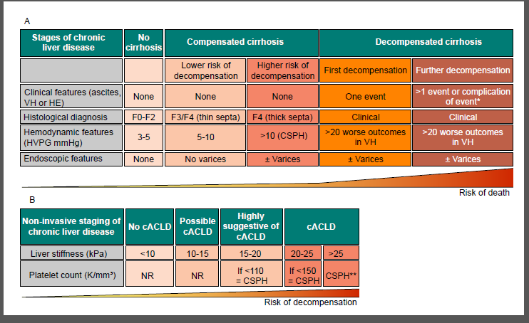
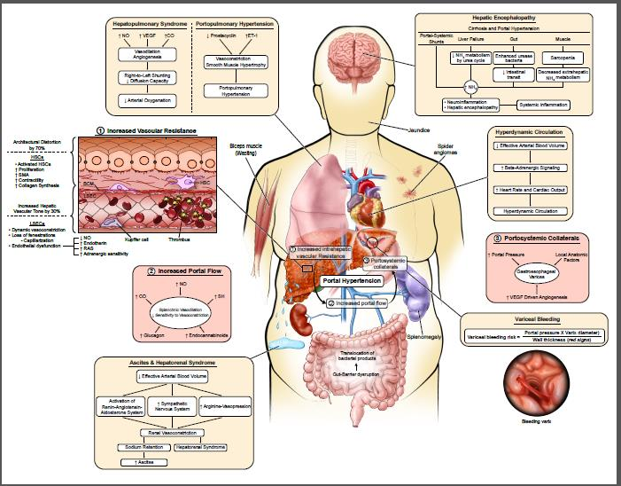
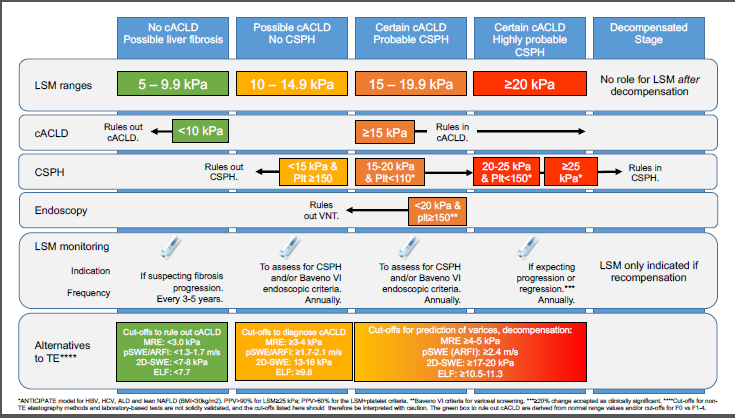
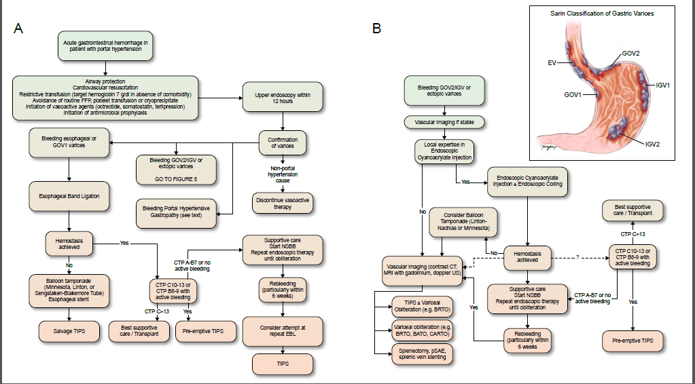

  

    

      
&gt; 12 năm vs &lt; 1.5 năm

      
Thời gian sống trung vị: Xơ gan còn bù vs Xơ gan mất bù

    

    

      
Carvedilol

      
NSBB ưu tiên hàng đầu — Cơ chế kép giảm sức cản nội gan &amp; ngừa cổ trướng

    

    

      
HVPG &ge; 10 mmHg

      
Ngưỡng CSPH — Xác chẩn không xâm lấn bằng LSM &ge; 25 kPa hoặc Baveno VI

    

    

      
24 - 72 giờ

      
Cửa sổ vàng đặt Preemptive TIPS cho AVH nguy cơ cao (Child C / Child B có chảy máu)

    

  

  

    

      
🔄

      

        
Chuyển Dịch Mô Hình: cACLD &amp; CSPH

        
Không chờ đợi sinh thiết gan hay búi giãn lớn. Khởi trị sớm Carvedilol ngay khi xác định có CSPH (qua LSM và tiểu cầu) nhằm ngăn ngừa đợt mất bù đầu tiên (đặc biệt là cổ trướng).

      

    

    

      
🎯

      

        
Chiến Lược Tránh Nội Soi An Toàn

        
Bệnh nhân đã dùng NSBB không cần nội soi sàng lọc. Áp dụng tiêu chuẩn Baveno VI (LSM &lt; 20 kPa và Tiểu cầu &ge; 150 K/mm³) để loại bỏ nội soi không cần thiết với tỷ lệ bỏ sót búi giãn nguy cơ cao &lt; 5%.

      

    

    

      
⚡

      

        
Gói Hồi Sức AVH &amp; Preemptive TIPS

        
Hồi sức truyền máu hạn chế (đích Hb 7-8 g/dL), thuốc co mạch tạng + Ceftriaxone ngay từ cấp cứu, thắt EVL trong 12h, và kích hoạt Preemptive TIPS sớm trong 24-72h cho ca nguy cơ cao.

      

    

  

  

    <a href="#sec-tongquan-cacld" class="quickmenu-item active">1. cACLD &amp; Giai đoạn</a>
    <a href="#sec-sinhlybenh-dichtacdong" class="quickmenu-item">2. Sinh lý bệnh &amp; Đích</a>
    <a href="#sec-hvpg-quytrinh12buoc" class="quickmenu-item">3. Đo HVPG 12 bước</a>
    <a href="#sec-nilda-baveno-vi" class="quickmenu-item">4. NILDA &amp; Baveno VI</a>
    <a href="#sec-nsbb-duphongtienphat" class="quickmenu-item">5. Phác đồ Carvedilol</a>
    <a href="#sec-xuathuyetcap-avh" class="quickmenu-item">6. Cấp cứu AVH &amp; TIPS</a>
    <a href="#sec-duphongthuphat-phinhvi-phg" class="quickmenu-item">7. Thứ phát, Phình vị &amp; PHG</a>
    <a href="#sec-thuocmoi-tuonglai" class="quickmenu-item">8. Thuốc mới &amp; Tương lai</a>
  

  <!-- ==================== SECTION 1 ==================== -->
  

    
🏛️ <h2 class="sec-title">1. Tổng Quan, Khái Niệm cACLD &amp; Các Giai Đoạn Tiến Triển Của Xơ Gan</h2>

    

      

        💡
        

          <strong>3 Cập Nhật Mang Tính Bước Ngoặt của AASLD 2024 So Với 2017 (Box 1)</strong>
          <ul style="margin-top: 0.5rem; margin-left: 1.25rem; line-height: 1.6;">
            <li><strong>Công nhận chính thức cACLD</strong> (Compensated Advanced Chronic Liver Disease): Thay thế yêu cầu sinh thiết gan bắt buộc bằng các công cụ đo độ cứng gan không xâm lấn.</li>
            <li><strong>Quy chuẩn hóa NILDA để chẩn đoán CSPH</strong>: Sử dụng kết hợp độ cứng gan (LSM) và số lượng tiểu cầu để phân tầng nguy cơ trực tiếp tại phòng khám.</li>
            <li><strong>Chuyển dịch mô hình điều trị</strong>: Khởi trị sớm <strong>Carvedilol</strong> ngay khi có CSPH để ngăn ngừa đợt mất bù đầu tiên (chủ yếu là cổ trướng), không chờ đợi đến khi xuất hiện búi giãn tĩnh mạch lớn.</li>
          </ul>
        

      

      

        
        

          
Figure 1. The Stages of Cirrhosis and Advanced Chronic Liver Disease (cACLD)

          Sơ đồ đối chiếu song song hai trục phân loại của AASLD 2024: Trục (A) mô tả các giai đoạn lâm sàng, áp lực tĩnh mạch gan (HVPG) và nguy cơ tử vong tăng vọt (đường đứt nét tím); Trục (B) chuẩn hóa phân giai đoạn không xâm lấn bằng Độ cứng gan (LSM) và Tiểu cầu.
        

      

      

        

          

          

            
🟢

            
Xơ Gan Còn Bù (Compensated)

          

          

            <ul style="margin-left: 1rem; line-height: 1.7;">
              <li><strong>Thời gian sống trung vị</strong>: <strong>&gt; 12 năm</strong>.</li>
              <li><strong>Nhóm nguy cơ thấp (HVPG 5-10 mmHg)</strong>: Chưa có CSPH, không có giãn tĩnh mạch, nguy cơ mất bù thấp. Mục tiêu là điều trị căn nguyên và thay đổi lối sống.</li>
              <li><strong>Nhóm nguy cơ cao (HVPG &ge; 10 mmHg - CSPH)</strong>: Đã xuất hiện CSPH, có hoặc chưa có giãn tĩnh mạch. Nguy cơ mất bù cao $\rightarrow$ <strong>Chỉ định khởi trị Carvedilol ngay</strong>.</li>
            </ul>
          

          
Sống trung vị &gt; 12 năm — Mục tiêu: Ngừa mất bù đầu tiên

        

        

          

          

            
🔴

            
Xơ Gan Mất Bù (Decompensated)

          

          

            <ul style="margin-left: 1rem; line-height: 1.7;">
              <li><strong>Thời gian sống trung vị</strong>: Sụt giảm nghiêm trọng xuống <strong>&lt; 1.5 năm</strong>.</li>
              <li><strong>Mất bù lần đầu (First Decompensation)</strong>: Đánh dấu bởi 1 trong 3 biến cố chính: <strong>Cổ trướng rõ rệt</strong>, <strong>Xuất huyết vỡ giãn tĩnh mạch</strong>, hoặc <strong>Bệnh não gan rõ rệt</strong>.</li>
              <li><strong>Mất bù tiến triển (Further Decompensation)</strong>: Xuất hiện thêm biến chứng thứ hai (cổ trướng kháng trị, HRS, SBP, vàng da nặng), nguy cơ tử vong rất cao $\rightarrow$ Đánh giá ghép gan.</li>
            </ul>
          

          
Sống trung vị &lt; 1.5 năm — Tử vong tăng vọt

        

      

    

  

  <!-- ==================== SECTION 2 ==================== -->
  

    
🔬 <h2 class="sec-title">2. Cơ Chế Sinh Lý Bệnh &amp; Các Đích Tác Động Dược Lý Của Tăng Áp Cửa</h2>

    

      
Theo định luật Ohm huyết động học, áp lực tĩnh mạch cửa tỷ lệ thuận với lưu lượng dòng máu tạng đổ về gan ($Q$) và sức cản của mạch máu trong gan ($R$): <code>P = Q × R</code>.

      

        
        

          
Figure 2. Pathophysiology of Portal Hypertension and Related Complications

          Sơ đồ liên hoàn bệnh sinh: Tăng sức cản nội gan (cấu trúc 70% + co thắt 30%) khởi phát tăng áp cửa; khi vượt ngưỡng CSPH (HVPG &ge; 10 mmHg) kích hoạt giãn mạch tạng qua NO, giảm thể tích động mạch hiệu dụng, gây tuần hoàn tăng động, cổ trướng, hội chứng gan thận, và kích hoạt VEGF tạo mạch bàng hệ giãn tĩnh mạch thực quản (vỡ khi HVPG &ge; 12 mmHg).
        

      

      <h3 style="margin-top: 1.75rem; margin-bottom: 0.75rem; color: var(--color-primary);"><i class="fa-solid fa-sitemap"></i> Phân Loại Tăng Áp Lực Tĩnh Mạch Cửa Theo Giải Phẫu (Table 1)</h3>

      

        <table class="regimen-table">
          <thead>
            <tr>
              <th style="width: 25%;">Phân Loại Vị Trí</th>
              <th style="width: 35%;">Vị Trí Sức Cản Chính</th>
              <th style="width: 40%;">Bệnh Lý &amp; Ví Dụ Điển Hình</th>
            </tr>
          </thead>
          <tbody>
            <tr>
              <td class="source-cell"><strong>Trước gan</strong> <em>(Prehepatic PH)</em></td>
              <td>Tĩnh mạch cửa và các nhánh chính trước khi vào gan</td>
              <td>- Huyết khối tĩnh mạch cửa (PVT) - Huyết khối tĩnh mạch lách (Sinistral PH do viêm tụy)</td>
            </tr>
            <tr>
              <td class="source-cell"><strong>Tại gan — Trước xoang</strong> <em>(Intrahepatic Presinusoidal)</em></td>
              <td>Khoảng cửa (Portal triads)</td>
              <td>- Bệnh sán máng (Schistosomiasis) - Bệnh xơ đường mật tiến triển (PBC, PSC giai đoạn sớm) - Bệnh mạch máu xoang cửa (PSVD) / Xơ hóa tĩnh mạch cửa không xơ gan</td>
            </tr>
            <tr>
              <td class="source-cell"><strong>Tại gan — Tại xoang</strong> <em>(Intrahepatic Sinusoidal)</em></td>
              <td>Hệ thống xoang gan</td>
              <td>- <strong>Xơ gan (mọi nguyên nhân: Rượu, MASLD/MASH, HBV, HCV, Tự miễn)</strong> - Viêm gan do rượu cấp / Viêm gan nhiễm mỡ nặng</td>
            </tr>
            <tr>
              <td class="source-cell"><strong>Tại gan — Sau xoang</strong> <em>(Intrahepatic Postsinusoidal)</em></td>
              <td>Tĩnh mạch trung tâm tiểu thùy</td>
              <td>- Hội chứng tắc nghẽn xoang gan (Sinusoidal Obstruction Syndrome - SOS / VOD)</td>
            </tr>
            <tr>
              <td class="source-cell"><strong>Sau gan</strong> <em>(Posthepatic PH)</em></td>
              <td>Tĩnh mạch gan, tĩnh mạch chủ dưới (IVC), tim phải</td>
              <td>- Hội chứng Budd-Chiari (tắc tĩnh mạch gan) - Viêm màng ngoài tim co thắt, suy tim sung huyết nặng</td>
            </tr>
          </tbody>
        </table>
      

      <h3 style="margin-top: 1.75rem; margin-bottom: 0.75rem; color: var(--color-primary);"><i class="fa-solid fa-bullseye"></i> Các Đích Tác Động Điều Trị Trong Tăng Áp Cửa (Table 2)</h3>

      

        <table class="regimen-table">
          <thead>
            <tr>
              <th style="width: 30%;">Mục Tiêu Tác Động (Target)</th>
              <th style="width: 70%;">Phương Pháp Can Thiệp / Phác Đồ Dược Lý</th>
            </tr>
          </thead>
          <tbody>
            <tr>
              <td class="source-cell"><strong>Căn nguyên xơ gan</strong></td>
              <td>- Thuốc kháng virus (HBV, HCV), ức chế miễn dịch (AIH), kiêng rượu tuyệt đối. - Lối sống: tập thể dục nhịp điệu vừa sức, duy trì BMI 18-29 kg/m², bổ sung đạm &gt; 1 g/kg/ngày, ăn bữa phụ muộn giàu protein.</td>
            </tr>
            <tr>
              <td class="source-cell"><strong>Giảm sức cản nội gan (R)</strong></td>
              <td>- Can thiệp tạo thông cửa chủ trong gan qua tĩnh mạch cảnh (TIPS). - <strong>Carvedilol</strong> (nhờ hoạt tính chẹn alpha-1 và phóng thích NO nội gan làm giãn mạch xoang).</td>
            </tr>
            <tr>
              <td class="source-cell"><strong>Rối loạn nội mô xoang (LSEC)</strong></td>
              <td>- <strong>Nhóm Statins (Simvastatin, Atorvastatin)</strong>: phục hồi hoạt tính enzyme eNOS, tăng tổng hợp NO nội gan, cải thiện vi tuần hoàn gan.</td>
            </tr>
            <tr>
              <td class="source-cell"><strong>Giãn mạch tạng (Q tăng)</strong></td>
              <td>- <strong>NSBB (Carvedilol, Propranolol, Nadolol)</strong>: ức chế beta-2 gây co mạch tạng thụ động. - <strong>Thuốc co mạch tạng cấp</strong>: Somatostatin, Octreotide, Terlipressin.</td>
            </tr>
            <tr>
              <td class="source-cell"><strong>Trục Gan — Ruột</strong></td>
              <td>- Rifaximin, men vi sinh: giảm chuyển vị vi khuẩn, giảm nội độc tố LPS tuần hoàn. - NSBB / Carvedilol: rút ngắn thời gian vận chuyển ruột, bảo vệ hàng rào niêm mạc.</td>
            </tr>
            <tr>
              <td class="source-cell"><strong>Búi giãn bàng hệ (Varices)</strong></td>
              <td>- Thắt đai tĩnh mạch thực quản (EVL), tiêm keo sinh học Cyanoacrylate (ECI). - Can thiệp mạch can thiệp: Nút búi giãn qua da (BRTO, PARTO, CARTO), Stent thực quản (SEMS), bóng chèn.</td>
            </tr>
          </tbody>
        </table>
      

    

  

  <!-- ==================== SECTION 3 ==================== -->
  

    
🩺 <h2 class="sec-title">3. Tiêu Chuẩn Vàng Đo Áp Lực Tĩnh Mạch Gan (HVPG) &amp; Quy Trình 12 Bước</h2>

    

      

        📏
        

          <strong>Định Nghĩa &amp; Các Mốc Giá Trị HVPG Lâm Sàng</strong>
          <code>HVPG = WHVP (Áp lực bít) - FHVP (Áp lực tự do)</code>
           
          &bull; <strong>1 - 5 mmHg</strong>: Trị số bình thường.
           
          &bull; <strong>&gt; 5 mmHg</strong>: Tăng áp lực tĩnh mạch cửa.
           
          &bull; <strong>&ge; 10 mmHg</strong>: <strong>Tăng áp cửa có ý nghĩa lâm sàng (CSPH)</strong> — Ngưỡng khởi phát biến chứng mất bù (cổ trướng, giãn tĩnh mạch).
           
          &bull; <strong>&ge; 12 mmHg</strong>: Ngưỡng tối thiểu để búi giãn tĩnh mạch có thể vỡ gây xuất huyết cấp.
           
          &bull; <strong>&gt; 20 mmHg</strong>: Tiên lượng nguy cơ thất bại cầm máu và tử vong rất cao trong xuất huyết cấp.
        

      

      <h3 style="margin-top: 1.5rem; margin-bottom: 0.75rem; color: var(--color-primary);"><i class="fa-solid fa-route"></i> So Sánh Các Đường Tiếp Cận Trong Đo HVPG (Box 2 - Mục 1)</h3>

      

        <table class="regimen-table">
          <thead>
            <tr>
              <th style="width: 25%;">Đường Tiếp Cận</th>
              <th style="width: 25%;">Ưu Điểm (Pros)</th>
              <th style="width: 25%;">Nhược Điểm (Cons)</th>
              <th style="width: 25%;">Khuyến Nghị Sử Dụng</th>
            </tr>
          </thead>
          <tbody>
            <tr>
              <td class="source-cell">Ưu tiên số 1 <strong>Tĩnh mạch cổ</strong> <em>(Transjugular)</em></td>
              <td>- Thủ thuật nhanh chóng. - Cho phép làm đồng thời <strong>sinh thiết gan qua đường tĩnh mạch cổ (TJLB)</strong>.</td>
              <td>Nguy cơ nhỏ gây rối loạn nhịp tim thoáng qua khi catheter qua buồng tim phải.</td>
              <td><strong>Đường tiếp cận chuẩn được ưu tiên hàng đầu</strong> tại hầu hết các trung tâm can thiệp mạch gan trên thế giới.</td>
            </tr>
            <tr>
              <td class="source-cell"><strong>Tĩnh mạch đùi</strong> <em>(Transfemoral)</em></td>
              <td>Không đi qua buồng tim nên hoàn toàn không có nguy cơ loạn nhịp.</td>
              <td>Không thể thực hiện đồng thời sinh thiết gan.</td>
              <td>Lựa chọn thay thế khi tĩnh mạch cổ bị tắc nghẽn, huyết khối hoặc có chống chỉ định.</td>
            </tr>
            <tr>
              <td class="source-cell"><strong>Tĩnh mạch khuỷu</strong> <em>(Antecubital)</em></td>
              <td>Ít xâm lấn hơn cho bệnh nhân.</td>
              <td>Catheter đi qua tim, không làm được sinh thiết gan, thao tác khó.</td>
              <td>Rất hiếm khi sử dụng trong thực hành lâm sàng thường quy.</td>
            </tr>
          </tbody>
        </table>
      

      <h3 style="margin-top: 1.75rem; margin-bottom: 0.75rem; color: var(--color-primary);"><i class="fa-solid fa-list-check"></i> Quy Trình 12 Bước Đo HVPG Chuẩn Xác — "ABCs of HVPG" (Box 2)</h3>

      

        

          

          

            
1-4

            
Chuẩn Bị &amp; Hiệu Chuẩn Hệ Thống

          

          

            <ul style="margin-left: 1rem; line-height: 1.6;">
              <li><strong>Bước 1 (Thang đo)</strong>: Chọn thang 0-40 hoặc 0-50 mmHg; tốc độ ghi thấp 1 - 7.5 mm/giây.</li>
              <li><strong>Bước 2 (Hiệu chuẩn)</strong>: Đặt mức áp lực Zero ngang đường nách giữa của bệnh nhân.</li>
              <li><strong>Bước 3 (Catheter)</strong>: Bắt buộc dùng catheter có bóng ở đầu (balloon-tipped) đường kính 10 - 12 mm.</li>
              <li><strong>Bước 4 (Mốc chuẩn)</strong>: In thang đo hiệu chuẩn và mốc zero trước khi đo.</li>
            </ul>
          

          
Thiết lập thông số kỹ thuật chuẩn hóa

        

        

          

          

            
5-8

            
Kỹ Thuật Đo Đạc Thực Tế

          

          

            <ul style="margin-left: 1rem; line-height: 1.6;">
              <li><strong>Bước 5 (Bệnh nhân)</strong>: Không gian yên tĩnh, thở đều, không nói chuyện/ho/ngủ ngáy.</li>
              <li><strong>Bước 6 (Tiền mê)</strong>: <strong>TRÁNH Fentanyl &amp; Propofol</strong> (ảnh hưởng huyết động tạng); chỉ dùng Midazolam liều thấp (0.02 mg/kg).</li>
              <li><strong>Bước 7 (Đo FHVP)</strong>: Đầu catheter cách lỗ đổ IVC 2 - 4 cm, ghi liên tục 15 - 20 giây.</li>
              <li><strong>Bước 8 (Đo WHVP)</strong>: Bơm bóng bít kín (bơm cản quang kiểm tra không rò), ghi liên tục &ge; 1 phút, đọc trị số ở 20-30 giây ổn định cuối.</li>
            </ul>
          

          
Tránh an thần sâu — Ghi WHVP tối thiểu 1 phút

        

        

          

          

            
9-12

            
Kiểm Định &amp; Loại Trừ Tắc Sau Gan

          

          

            <ul style="margin-left: 1rem; line-height: 1.6;">
              <li><strong>Bước 9 (Lọc nhiễu)</strong>: Hủy bỏ các đoạn sóng lẫn nhiễu do ho, thở sâu, cử động.</li>
              <li><strong>Bước 10 (Đo lặp 3 lần)</strong>: Đo lặp lại 3 lần cho cả WHVP và FHVP; độ chênh giữa các lần phải <strong>&le; 2 mmHg</strong>.</li>
              <li><strong>Bước 11 (Đo áp lực IVC)</strong>: Đo áp lực IVC tại mức lỗ đổ tĩnh mạch gan và trong nhĩ phải.</li>
              <li><strong>Bước 12 (Phát hiện tắc sau gan)</strong>: Bình thường FHVP gần bằng áp lực IVC. Nếu <strong>FHVP vượt IVC &ge; 2 mmHg</strong> $\rightarrow$ Chụp cản quang tìm tắc sau gan (màng ngăn IVC, huyết khối).</li>
            </ul>
          

          
Đo lặp 3 lần chênh &le; 2 mmHg — Đối chiếu IVC

        

      

    

  

  <!-- ==================== SECTION 4 ==================== -->
  

    
📊 <h2 class="sec-title">4. Chẩn Đoán Không Xâm Lấn (NILDA) &amp; Tiêu Chuẩn Baveno VI</h2>

    

      
AASLD 2024 quy chuẩn hóa việc phối hợp giữa Độ cứng gan (LSM đo bằng FibroScan/TE) và Số lượng tiểu cầu để phân tầng nguy cơ và chỉ định nội soi:

      

        
        

          
Figure 3. Noninvasive Staging and Management Algorithm for cACLD

          Lưu đồ tiếp cận từng bước: Phân loại cACLD dựa trên LSM (&lt;10 kPa loại trừ, 10-15 nghi ngờ, &ge;15 xác chẩn), phân tầng CSPH kết hợp số lượng tiểu cầu, và áp dụng tiêu chuẩn Baveno VI để quyết định tránh nội soi sàng lọc hay khởi trị NSBB.
        

      

      

        

          

          

            
🎯

            
Tiêu Chuẩn Xác Chẩn CSPH Không Xâm Lấn

          

          

            
Bệnh nhân được chẩn đoán xác định có CSPH khi thỏa mãn một trong các tiêu chí:

            <ul style="margin-left: 1rem; line-height: 1.7;">
              <li><strong>LSM &ge; 25 kPa</strong> (bất kể số lượng tiểu cầu).</li>
              <li><strong>LSM 20 - 24.9 kPa</strong> VÀ <strong>Tiểu cầu &lt; 150 K/mm³</strong>.</li>
              <li><strong>LSM 15 - 19.9 kPa</strong> VÀ <strong>Tiểu cầu &lt; 110 K/mm³</strong>.</li>
              <li><em>Loại trừ CSPH</em> khi: <strong>LSM &lt; 15 kPa</strong> VÀ <strong>Tiểu cầu &ge; 150 K/mm³</strong>.</li>
            </ul>
          

          
Chỉ định khởi trị Carvedilol ngay không cần đo HVPG

        

        

          

          

            
🛡️

            
Tiêu Chuẩn Baveno VI Tránh Nội Soi

          

          

            
Áp dụng cho bệnh nhân cACLD đáp ứng đồng thời cả 2 điều kiện:

            <ul style="margin-left: 1rem; line-height: 1.7;">
              <li><strong>LSM &lt; 20 kPa</strong> (đo bằng TE/FibroScan).</li>
              <li><strong>Số lượng tiểu cầu &ge; 150 K/mm³</strong> (150 × 10⁹/L).</li>
              <li><strong>Ý nghĩa</strong>: Nguy cơ có búi giãn tĩnh mạch nguy cơ cao <strong>&lt; 5%</strong> $\rightarrow$ <strong>Tránh nội soi sàng lọc an toàn</strong>.</li>
              <li><strong>Theo dõi</strong>: Kiểm tra lại LSM và tiểu cầu định kỳ hàng năm (biến động LSM &ge; 20% là có ý nghĩa).</li>
            </ul>
          

          
Tránh nội soi an toàn — Tiết kiệm chi phí y tế

        

      

    

  

  <!-- ==================== SECTION 5 ==================== -->
  

    
💊 <h2 class="sec-title">5. Phác Đồ Thuốc Chẹn Beta Không Chọn Lọc (NSBB) &amp; Dự Phòng Tiên Phát</h2>

    

      

        🌟
        

          <strong>Tại Sao Carvedilol Là Lựa Chọn Ưu Tiên Hàng Đầu Của AASLD 2024?</strong>
          Khác với Propranolol và Nadolol chỉ gây co mạch tạng thụ động (chẹn $\beta_1 + \beta_2$), <strong>Carvedilol sở hữu cơ chế kép đột phá</strong>: vừa là NSBB vừa có <strong>hoạt tính chẹn thụ thể $\alpha_1$-adrenergic nội sinh và giải phóng NO nội gan</strong>. Nhờ đó, Carvedilol làm <strong>giãn mạch xoang gan chủ động, giảm trực tiếp sức cản nội gan (R)</strong>, mang lại hiệu quả hạ HVPG vượt trội, tỷ lệ đáp ứng huyết động cao hơn (75% vs 50%), giảm tỷ lệ hình thành cổ trướng và cải thiện sống còn.
        

      

      <h3 style="margin-top: 1.5rem; margin-bottom: 0.75rem; color: var(--color-primary);"><i class="fa-solid fa-tablets"></i> Bảng So Sánh Các Thuốc Chẹn Beta Không Chọn Lọc (Table 3)</h3>

      

        <table class="regimen-table">
          <thead>
            <tr>
              <th style="width: 18%;">Dược Phẩm</th>
              <th style="width: 20%;">Liều Khởi Đầu &amp; Chỉnh Liều</th>
              <th style="width: 18%;">Liều Duy Trì Tối Đa</th>
              <th style="width: 22%;">Cơ Chế &amp; Điểm Đột Phá</th>
              <th style="width: 22%;">Đích Điều Trị &amp; Lưu Ý</th>
            </tr>
          </thead>
          <tbody>
            <tr>
              <td class="source-cell">Ưu tiên số 1 <strong>Carvedilol</strong></td>
              <td>- <strong>Khởi đầu</strong>: <strong>6.25 mg/ngày</strong> uống trước ngủ trong 2 ngày đầu. - <strong>Tăng liều</strong>: <strong>12.5 mg/ngày</strong> (1 lần hoặc chia 2 lần 6.25 mg) từ ngày thứ 3.</td>
              <td>- Duy trì: <strong>6.25 - 12.5 mg/ngày</strong>. - Tối đa 25 mg/ngày (nếu có THA đồng mắc).</td>
              <td>Cơ chế kép: Chẹn $\beta_1+\beta_2$ + Chẹn $\alpha_1$ + Giải phóng NO nội gan $\rightarrow$ <strong>Giảm sức cản nội gan (R)</strong>.</td>
              <td>- <strong>Không cần chỉnh liều theo tần số tim</strong>. - Duy trì Huyết áp tâm thu (SBP) &ge; 90 mmHg. - Dung nạp tốt hơn, giảm hình thành cổ trướng.</td>
            </tr>
            <tr>
              <td class="source-cell"><strong>Propranolol</strong></td>
              <td>- Khởi đầu: 20 - 40 mg × 2 lần/ngày. - Tăng dần liều mỗi 2 - 3 ngày.</td>
              <td>- Không cổ trướng: 320 mg/ngày. - Có cổ trướng: 160 mg/ngày.</td>
              <td>Chẹn $\beta_1$ (giảm cung lượng tim) + Chẹn $\beta_2$ (co mạch tạng thụ động).</td>
              <td>- Tần số tim đích: <strong>55 - 60 nhịp/phút</strong>. - Duy trì SBP &ge; 90 mmHg.</td>
            </tr>
            <tr>
              <td class="source-cell"><strong>Nadolol</strong></td>
              <td>- Khởi đầu: 20 - 40 mg × 1 lần/ngày uống trước khi đi ngủ.</td>
              <td>- Không cổ trướng: 160 mg/ngày. - Có cổ trướng: 80 mg/ngày.</td>
              <td>Chẹn $\beta_1$ + $\beta_2$ truyền thống (tương tự Propranolol).</td>
              <td>- Tần số tim đích: <strong>55 - 60 nhịp/phút</strong>. - Duy trì SBP &ge; 90 mmHg.</td>
            </tr>
          </tbody>
        </table>
      

      

        

          

          

            
🚫

            
Chống Chỉ Định Của NSBB (Box 3)

          

          

            
<strong>Chống chỉ định tuyệt đối</strong>:

            <ul style="margin-left: 1rem; line-height: 1.6;">
              <li>Hen phế quản nặng (Asthma).</li>
              <li>Block nhĩ thất độ II hoặc độ III (chưa đặt máy tạo nhịp).</li>
              <li>Hội chứng suy nút xoang, Nhịp chậm xoang nặng (&lt; 50 bpm).</li>
            </ul>
            
<strong>Chống chỉ định tương đối</strong>: COPD, bệnh mạch máu ngoại vi, vảy nến, ĐTĐ phụ thuộc Insulin hay hạ đường huyết, hội chứng Raynaud.

          

          
Chống chỉ định tuyệt đối: Hen &amp; Block nhĩ thất cao độ

        

        

          

          

            
📋

            
8 Khuyến Nghị Thực Hành Tiên Phát Cốt Lõi

          

          

            <ul style="margin-left: 1rem; line-height: 1.6;">
              <li><strong>1.</strong> Carvedilol là NSBB được khuyến nghị ưu tiên hàng đầu.</li>
              <li><strong>2.</strong> Liều Carvedilol khuyến nghị: 6.25 - 12.5 mg/ngày.</li>
              <li><strong>3.</strong> Không dùng NSBB cho bệnh nhân còn bù chưa có CSPH (HVPG 6-9).</li>
              <li><strong>4.</strong> Khởi trị NSBB sớm ngay khi xác chẩn có CSPH để ngừa cổ trướng.</li>
              <li><strong>5.</strong> Bệnh nhân đã dùng NSBB không cần nội soi dạ dày sàng lọc.</li>
              <li><strong>6.</strong> Nếu chống chỉ định NSBB: Nội soi mỗi 2 năm (bệnh chưa kiểm soát) hoặc mỗi 3 năm (bệnh đã ổn định).</li>
              <li><strong>7.</strong> Búi giãn nguy cơ cao khi chống chỉ định NSBB: Thắt EVL mỗi 2-4 tuần (ưu tiên 4 tuần).</li>
              <li><strong>8.</strong> Không dùng TIPS để dự phòng tiên phát ở bệnh nhân còn bù.</li>
            </ul>
          

          
AASLD Guidance Statements 2024

        

      

    

  

  <!-- ==================== SECTION 6 ==================== -->
  

    
🚑 <h2 class="sec-title">6. Cấp Cứu Xuất Huyết Do Vỡ Giãn Tĩnh Mạch Cấp Tính (AVH) &amp; Preemptive TIPS</h2>

    

      
Xuất huyết vỡ giãn tĩnh mạch là cấp cứu tối khẩn cấp với tỷ lệ tử vong 6 tuần từ 10% đến 15%. Quy trình xử trí chuẩn 2024 tích hợp hồi sức hạn chế, dược lý sớm, can thiệp nội soi trong 12h và đặt TIPS chủ động trong 24-72h:

      

        
        

          
Figure 4. Algorithm for the Management of Acute Variceal Hemorrhage (AVH)

          Lưu đồ thuật toán xử trí toàn diện AVH của AASLD 2024: Phân nhánh theo nguồn chảy máu (Thực quản/GOV1 vs Phình vị GOV2/IGV1), các bước hồi sức ban đầu, chỉ định Preemptive TIPS trong 24-72h cho nhóm nguy cơ cao, xử trí cầu nối (SEMS/Bóng chèn) và TIPS giải cứu (Salvage TIPS).
        

      

      

        

          

          

            
🩸

            
Gói Hồi Sức Ban Đầu (Resuscitation Bundle)

          

          

            <ul style="margin-left: 1rem; line-height: 1.7;">
              <li><strong>Bảo vệ đường thở</strong>: Đặt nội khí quản chủ động nếu rối loạn ý thức, nôn máu ồ ạt; rút ống càng sớm càng tốt sau cầm máu.</li>
              <li><strong>Tránh đặt sonde dạ dày thường quy</strong>: Làm tăng nguy cơ viêm phổi hít sặc.</li>
              <li><strong>Truyền máu hạn chế (Restrictive)</strong>: Chỉ truyền hồng cầu khi <strong>Hb &lt; 7 g/dL, duy trì đích Hb 7 - 8 g/dL</strong>. Tránh truyền quá mức làm tăng áp lực cửa dội ngược.</li>
              <li><strong>TRÁNH truyền FFP &amp; Tiểu cầu theo máy móc</strong>: INR không phản ánh đông máu trong xơ gan; FFP gây quá tải thể tích làm bùng phát chảy máu tái phát.</li>
            </ul>
          

          
Đích Hb 7 - 8 g/dL — Cấm truyền FFP thường quy

        

        

          

          

            
💉

            
Dược Lý Cấp Cứu Khởi Đầu (Table 5)

          

          

            <ul style="margin-left: 1rem; line-height: 1.7;">
              <li><strong>Thuốc co mạch tạng (Dùng ngay trước nội soi, duy trì 2-5 ngày)</strong>:
                <ul>
                  <li><strong>Octreotide</strong>: Bolus 50 mcg i.v. $\rightarrow$ Truyền liên tục 25 - 50 mcg/giờ.</li>
                  <li><strong>Somatostatin</strong>: Bolus 250 mcg i.v. $\rightarrow$ Truyền liên tục 250 - 500 mcg/giờ.</li>
                  <li><strong>Terlipressin</strong>: 2 mg i.v. mỗi 4-6h trong 24-48h đầu $\rightarrow$ giảm 1 mg mỗi 4-6h.</li>
                </ul>
              </li>
              <li><strong>Kháng sinh tĩnh mạch (Dùng ngay, tối đa 5 ngày)</strong>: <strong>Ceftriaxone 1g/24h</strong> (ưu tiên hàng đầu do tỷ lệ kháng Quinolone cao).</li>
            </ul>
          

          
Co mạch tạng 2-5 ngày + Ceftriaxone 1g/ngày

        

        

          

          

            
⚡

            
Can Thiệp Nội Soi &amp; Preemptive TIPS

          

          

            <ul style="margin-left: 1rem; line-height: 1.7;">
              <li><strong>Nội soi EGD trong vòng 12 giờ</strong>: Thực hiện thắt đai tĩnh mạch thực quản (EVL). Có thể dùng Erythromycin 125-250mg i.v. trước nội soi 30-120p.</li>
              <li><strong>Đặt TIPS sớm/chủ động (Preemptive TIPS) trong 24 - 72 giờ</strong> (lý tưởng &lt; 24h) bằng stent phủ PTFE cho nhóm nguy cơ cao:
                <ul>
                  <li><strong>Child-Pugh C (10 - 13 điểm)</strong>.</li>
                  <li><strong>Child-Pugh B &gt; 7 điểm CÓ kèm chảy máu hoạt động</strong> khi nội soi lần đầu.</li>
                </ul>
              </li>
              <li><strong>Chảy máu không kiểm soát / Tái phát sớm (&le;5 ngày)</strong>: Đặt stent kim loại tự nở SEMS (giữ &le; 1 tuần) hoặc bóng chèn (&le; 24h) $\rightarrow$ Đặt <strong>Salvage TIPS</strong> khẩn cấp.</li>
            </ul>
          

          
Preemptive TIPS trong 24-72h cho Child C &amp; Child B chảy máu

        

      

    

  

  <!-- ==================== SECTION 7 ==================== -->
  

    
🛡️ <h2 class="sec-title">7. Dự Phòng Thứ Phát, Giãn Tĩnh Mạch Phình Vị &amp; Bệnh Dạ Dày Tăng Áp Cửa (PHG)</h2>

    

      <h3 style="color: var(--color-primary); margin-bottom: 0.75rem;"><i class="fa-solid fa-arrows-rotate"></i> Dự Phòng Thứ Phát Xuất Huyết Tái Phát (Secondary Prophylaxis)</h3>
      

        ⚠️
        

          <strong>Phác Đồ Phối Hợp Bắt Buộc: NSBB + EVL</strong>
          Nếu không dự phòng, tỷ lệ tái chảy máu lên tới <strong>60% trong vòng 1 năm</strong>. Bắt buộc khởi động <strong>phối hợp NSBB (Propranolol, Nadolol hoặc Carvedilol) VÀ Thắt đai EVL lặp lại mỗi 2-4 tuần</strong> cho đến khi triệt tiêu búi giãn.
            
          <strong>Bổ sung Simvastatin liều thấp (10 - 20 mg/ngày)</strong>: Các thử nghiệm lâm sàng (BLEED study) chứng minh thêm Simvastatin vào phác đồ NSBB + EVL giúp <strong>tăng tỷ lệ sống còn</strong> nhờ giảm phản ứng viêm hệ thống và ngăn ngừa ACLF. <em>(Lưu ý: Chống chỉ định khi Bilirubin &gt; 3 mg/dL hoặc suy gan nặng vì nguy cơ tiêu cơ vân)</em>.
        

      

      <h3 style="color: var(--color-primary); margin-top: 1.75rem; margin-bottom: 0.75rem;"><i class="fa-solid fa-stomach"></i> Phân Loại Giãn Tĩnh Mạch Dạ Dày Theo Sarin &amp; Lựa Chọn Can Thiệp</h3>
      

        <table class="regimen-table">
          <thead>
            <tr>
              <th style="width: 15%;">Phân Loại Sarin</th>
              <th style="width: 35%;">Vị Trí &amp; Đặc Điểm Giải Phẫu</th>
              <th style="width: 50%;">Chiến Lược Điều Trị Chuẩn AASLD 2024</th>
            </tr>
          </thead>
          <tbody>
            <tr>
              <td class="source-cell"><strong>GOV1</strong></td>
              <td>Giãn TMTQ kéo dài xuống bờ cong nhỏ dạ dày</td>
              <td>Huyết động học và xử trí hoàn toàn tương tự giãn TMTQ (Thắt đai EVL + NSBB).</td>
            </tr>
            <tr>
              <td class="source-cell"><strong>GOV2</strong></td>
              <td>Giãn TMTQ kéo dài xuống phình vị dạ dày</td>
              <td>Bắt buộc chụp CT/MRI cản quang đánh giá shunt lách - thận $\rightarrow$ Tiêm keo Cyanoacrylate (ECI), TIPS hoặc BRTO.</td>
            </tr>
            <tr>
              <td class="source-cell"><strong>IGV1</strong></td>
              <td>Giãn phình vị cô lập (không kèm giãn TMTQ)</td>
              <td>Nguy cơ chảy máu ồ ạt. Dự phòng tiên phát bằng NSBB hoặc tiêm keo nếu có dấu son nguy cơ cao. Chảy máu cấp: ECI, TIPS hoặc BRTO.</td>
            </tr>
            <tr>
              <td class="source-cell"><strong>IGV2</strong></td>
              <td>Giãn cô lập tại thân vị, hang vị hoặc môn vị</td>
              <td>Hiếm gặp, xử trí theo tổn thương giải phẫu và điều trị tăng áp cửa nền.</td>
            </tr>
          </tbody>
        </table>
      

      

        

          

          

            
🧭

            
Tiêu Chí Lựa Chọn Giữa TIPS và BRTO Trong Giãn Phình Vị

          

          

            <ul style="margin-left: 1rem; line-height: 1.7;">
              <li><strong>Ưu tiên chọn TIPS</strong>: Khi chức năng gan còn bù tốt (<strong>MELD-Na &lt; 20</strong>), kèm cổ trướng nhiều hoặc có huyết khối tĩnh mạch cửa, và <strong>không có tiền sử bệnh não gan (HE)</strong>.</li>
              <li><strong>Ưu tiên chọn BRTO / PARTO</strong>: Khi có <strong>shunt lách - thận tự phát lớn</strong>, có bệnh não gan hoạt động, hoặc suy gan nặng (<strong>MELD-Na &gt; 20 hoặc FIPS &gt; 0.92</strong>). BRTO làm tăng dòng máu về gan và không làm nặng thêm bệnh não gan.</li>
              <li><strong>Tăng áp cửa cô lập do lách (Sinistral PH)</strong>: Do huyết khối TM lách $\rightarrow$ Phẫu thuật cắt lách, đặt stent TM lách hoặc nút động mạch lách.</li>
            </ul>
          

          
TIPS cho MELD &lt; 20 không HE; BRTO cho Shunt lớn / MELD &gt; 20 / có HE

        

        

          

          

            
🩺

            
Phân Loại Bệnh Dạ Dày Tăng Áp Cửa Baveno III (Table 6)

          

          

            <ul style="margin-left: 1rem; line-height: 1.6;">
              <li><strong>Mẫu khảm niêm mạc (Mosaic pattern)</strong>: Nhẹ (khu trú) = 1 điểm; Nặng (lan tỏa) = 2 điểm.</li>
              <li><strong>Dấu son niêm mạc (Red markings)</strong>: Chấm cô lập = 1 điểm; Hội tụ thành đám = 2 điểm.</li>
              <li><strong>Giãn mạch hang vị (GAVE - dạ dày dưa hấu)</strong>: Không có = 0 điểm; Có = 2 điểm.</li>
              <li><strong>Đánh giá</strong>: <strong>&le; 3 điểm = PHG nhẹ</strong>; <strong>&ge; 4 điểm = PHG nặng (Severe PHG)</strong>.</li>
              <li><strong>Xử trí</strong>: Severe PHG được coi là có CSPH $\rightarrow$ Điều trị bằng NSBB. Chảy máu cấp dùng thuốc co mạch. Nếu thiếu máu thiếu sắt phụ thuộc truyền máu dù dùng NSBB $\rightarrow$ <strong>Chỉ định đặt TIPS</strong>.</li>
            </ul>
          

          
Baveno III: &ge; 4 điểm là nặng — Dùng NSBB, đặt TIPS nếu kháng trị

        

      

    

  

  <!-- ==================== SECTION 8 ==================== -->
  

    
🚀 <h2 class="sec-title">8. Thử Nghiệm Dược Lý Mới Đang Triển Khai &amp; 9 Hướng Nghiên Cứu Tương Lai</h2>

    

      <h3 style="color: var(--color-primary); margin-bottom: 0.75rem;"><i class="fa-solid fa-vial-circle-check"></i> Các Thử Nghiệm Lâm Sàng Thuốc Mới Trong Tăng Áp Cửa (Table 4)</h3>

      

        <table class="regimen-table">
          <thead>
            <tr>
              <th style="width: 15%;">Nhóm Cơ Chế</th>
              <th style="width: 15%;">Hoạt Chất</th>
              <th style="width: 25%;">Thử Nghiệm &amp; Pha</th>
              <th style="width: 20%;">Đối Tượng Tuyển Chọn</th>
              <th style="width: 25%;">Kết Cục Đánh Giá Chính</th>
            </tr>
          </thead>
          <tbody>
            <tr>
              <td class="source-cell"><strong>Kháng đông (DOAC)</strong></td>
              <td><strong>Rivaroxaban</strong></td>
              <td>NCT02643212 (CIRROXABAN) Pha II (Tây Ban Nha, 3 tháng)</td>
              <td>Xơ gan còn bù (cACLD)</td>
              <td>An toàn, biến đổi HVPG và biến cố lâm sàng.</td>
            </tr>
            <tr>
              <td class="source-cell"><strong>Kháng viêm</strong></td>
              <td><strong>Belapectin</strong> <em>(Ức chế Galectin-3)</em></td>
              <td>NCT04365860 (NAVIGATE) Pha IIb/III (Quốc tế, 18 tháng)</td>
              <td>Xơ gan do NASH/MASH chưa có búi giãn</td>
              <td>Tỷ lệ xuất hiện mới các búi giãn tĩnh mạch thực quản - dạ dày.</td>
            </tr>
            <tr>
              <td class="source-cell"><strong>Hệ vi sinh ruột</strong></td>
              <td><strong>Rifaximin</strong></td>
              <td>NCT02508623 (ERASE) Pha II (Ý, 60 ngày)</td>
              <td>Xơ gan còn bù</td>
              <td>Mức độ giảm áp lực tĩnh mạch gan (HVPG).</td>
            </tr>
            <tr>
              <td class="source-cell"><strong>Statins</strong></td>
              <td><strong>Simvastatin</strong></td>
              <td>NCT03654050 (SACRED) Pha III (Hoa Kỳ, 36 tháng)</td>
              <td>Xơ gan còn bù có CSPH</td>
              <td><strong>Kết cục cứng</strong>: Xuất hiện mất bù đầu tiên, tử vong hoặc ung thư gan (HCC).</td>
            </tr>
            <tr>
              <td class="source-cell"><strong>Statins</strong></td>
              <td><strong>Atorvastatin</strong></td>
              <td>NCT04061162 (STATLiver) Pha II (Đan Mạch, 18 tháng)</td>
              <td>Xơ gan còn bù có CSPH</td>
              <td>Tổng hợp tỷ lệ tử vong, chỉ định ghép gan hoặc số lần nhập viện.</td>
            </tr>
            <tr>
              <td class="source-cell"><strong>Phối hợp thuốc</strong></td>
              <td><strong>Simvastatin + Rifaximin</strong></td>
              <td>NCT03780672 (LIVERHOPE) Pha III (Châu Âu, 12 tháng)</td>
              <td>Xơ gan mất bù (dACLD)</td>
              <td><strong>Tỷ lệ khởi phát Hội chứng suy gan cấp trên nền mạn (ACLF)</strong>.</td>
            </tr>
          </tbody>
        </table>
      

      <h3 style="color: var(--color-primary); margin-top: 1.75rem; margin-bottom: 0.75rem;"><i class="fa-solid fa-compass"></i> 9 Khoảng Trống Tri Thức &amp; Định Hướng Nghiên Cứu Ưu Tiên (Box 4)</h3>

      

        <table class="regimen-table">
          <thead>
            <tr>
              <th style="width: 8%;">STT</th>
              <th style="width: 32%;">Lĩnh Vực Trọng Điểm</th>
              <th style="width: 60%;">Nội Dung &amp; Mục Tiêu Nghiên Cứu Cần Giải Quyết</th>
            </tr>
          </thead>
          <tbody>
            <tr>
              <td class="source-cell"><strong>1</strong></td>
              <td><strong>Thẩm định "Rule of Five"</strong></td>
              <td>Tiến cứu kiểm chứng quy tắc "Rule of Five" trong lựa chọn bệnh nhân cACLD khởi trị sớm NSBB để loại bỏ hoàn toàn nội soi sàng lọc.</td>
            </tr>
            <tr>
              <td class="source-cell"><strong>2</strong></td>
              <td><strong>Chuẩn hóa 2D-SWE, pSWE &amp; MRE</strong></td>
              <td>Xác lập các điểm cắt (cut-offs) đồng bộ cho các kỹ thuật đàn hồi ngoài TE để chẩn đoán CSPH trên các hệ máy khác nhau.</td>
            </tr>
            <tr>
              <td class="source-cell"><strong>3</strong></td>
              <td><strong>Động học áp lực cửa</strong></td>
              <td>Phát triển các chỉ dấu không xâm lấn nhạy bén phát hiện thay đổi nhỏ (10-20%) của HVPG theo thời gian hoặc đáp ứng thuốc.</td>
            </tr>
            <tr>
              <td class="source-cell"><strong>4</strong></td>
              <td><strong>Tiêu chuẩn Tái bù (Recompensation)</strong></td>
              <td>Xác định tiêu chuẩn chắc chắn cho trạng thái tái bù hoàn toàn sau khi sạch virus/kiêng rượu để ngừng NSBB an toàn.</td>
            </tr>
            <tr>
              <td class="source-cell"><strong>5</strong></td>
              <td><strong>PREDESCI trên MASLD / MASH</strong></td>
              <td>Thử nghiệm lâm sàng RCT tương tự PREDESCI trên nhóm bệnh nhân xơ gan do viêm gan thoái hóa mỡ và béo phì.</td>
            </tr>
            <tr>
              <td class="source-cell"><strong>6</strong></td>
              <td><strong>Thời điểm đặt TIPS tối ưu</strong></td>
              <td>Xác định nhóm bệnh nhân nhận được lợi ích sống còn nếu đặt TIPS sớm hơn (ngay sau đợt xuất huyết đầu tiên hoặc trước đại phẫu ngoài gan).</td>
            </tr>
            <tr>
              <td class="source-cell"><strong>7</strong></td>
              <td><strong>Can thiệp Dinh dưỡng &amp; Sarcopenia</strong></td>
              <td>Đánh giá định lượng hiệu quả bổ sung dinh dưỡng ở bệnh nhân suy mòn cơ (sarcopenia) trong việc dự phòng đợt mất bù đầu tiên.</td>
            </tr>
            <tr>
              <td class="source-cell"><strong>8</strong></td>
              <td><strong>Khẳng định vai trò của Statins</strong></td>
              <td>Thử nghiệm lâm sàng đa trung tâm lớn chứng minh an toàn và hiệu quả cải thiện sống còn của Statins đơn trị hoặc phối hợp.</td>
            </tr>
            <tr>
              <td class="source-cell"><strong>9</strong></td>
              <td><strong>Thẩm định Stent thực quản (SEMS)</strong></td>
              <td>Nghiên cứu tiến cứu khẳng định vai trò và an toàn của stent kim loại tự nở có phủ trong xuất huyết vỡ giãn kháng trị.</td>
            </tr>
          </tbody>
        </table>
      

    

  

  <!-- CITATION BOX -->
  

    <strong>Tài liệu gốc (AMA Citation):</strong>
     
    Kaplan DE, Bosch J, Ripoll C, Thiele M, Fortune BE, Simonetto DA, Garcia-Tsao G. AASLD practice guidance on risk stratification and management of portal hypertension and varices in cirrhosis. <em>Hepatology</em>. 2024;79(5):1180-1211. doi:10.1097/HEP.0000000000000647.
  

<!-- BOTTOM NAVIGATION -->

  

    <a href="#/ebm/kho-guidelines" class="btn btn-primary">
      <i class="fa-solid fa-arrow-left"></i> Quay lại Kho Guidelines
    </a>
    <a href="#sec-tongquan-cacld" class="btn">
      <i class="fa-solid fa-arrow-up"></i> Lên đầu trang
    </a>
  

