

  

    COR I
    LOE A
    Bộ Y Tế 2024
    Thần Kinh & Hồi Sức Cấp Cứu
  

  <h1 class="guideline-hero-title">Hướng Dẫn Quốc Gia Chẩn Đoán & Điều Trị Đột Quỵ Não (QĐ 3312/QĐ-BYT)</h1>
  

    Tài liệu chuyên môn tiêu chuẩn quốc gia ban hành theo <strong>Quyết định số 3312/QĐ-BYT ngày 05/11/2024 của Bộ Y tế Việt Nam</strong>: Hệ thống hóa toàn diện 13 chương thực hành lâm sàng, từ tối ưu hóa cửa sổ tái tưới máu (tiêu sợi huyết tĩnh mạch Alteplase/Tenecteplase đến 9 giờ, lấy huyết khối cơ học đến 24 giờ), kiểm soát huyết áp cấp cá thể hóa theo thể bệnh, đảo ngược thuốc chống đông trong xuất huyết não, đến can thiệp túi phình mạch, huyết khối xoang tĩnh mạch, dị dạng AVM và phục hồi chức năng đa chuyên ngành dựa trên cơ chế mềm dẻo thần kinh (Neuroplasticity).
  

---

<section id="sec-tong-quan-dich-te" class="guideline-section">
  <h2 class="section-title"><i class="fa-solid fa-notes-medical"></i> 1. Tổng Quan & Dịch Tễ Học Đột Quỵ Não Tại Việt Nam</h2>
  
  

    Đột quỵ não (Tai biến mạch máu não) là tình trạng thiếu sót chức năng thần kinh khởi phát đột ngột do tổn thương mạch máu não tương ứng (thiếu máu cục bộ hoặc chảy máu trong sọ) kéo dài trên 24 giờ hoặc dẫn đến tử vong. Theo số liệu dịch tễ học chính thức được công bố trong Hướng dẫn Quốc gia 2024 của Bộ Y tế:
  

  <ul>
    <li><strong>Gánh nặng bệnh tật hàng đầu:</strong> Tại Việt Nam, đột quỵ não liên tục là nguyên nhân tử vong hàng đầu trong giai đoạn 2009 – 2019, vượt qua bệnh tim thiếu máu cục bộ. Ước tính mỗi năm có khoảng <strong>200.000 ca mắc mới</strong>, với tỷ lệ tử vong và tàn phế rất cao.</li>
    <li><strong>Cơ cấu các thể đột quỵ:</strong> Nhồi máu não cấp (Ischemic Stroke) chiếm <strong>76.2%</strong>; Chảy máu não tự phát (ICH) chiếm <strong>15 – 20%</strong>; Chảy máu dưới nhện (SAH) do vỡ phình mạch chiếm <strong>3 – 5%</strong>; và Huyết khối tĩnh mạch não (CVST) chiếm <strong>0.5 – 1%</strong>.</li>
  </ul>

  

    
<i class="fa-solid fa-triangle-exclamation"></i> Thời Gian Là Não (Time is Brain)

    

      Trong nhồi máu não cấp, mỗi phút trôi qua khi động mạch lớn bị tắc nghẽn sẽ có khoảng <strong>1.9 triệu tế bào thần kinh (neuron) bị hoại tử</strong> và <strong>14 tỷ khớp nối synapse bị phá hủy</strong>. Việc thiết lập quy trình cấp cứu đột quỵ "Code Stroke" đồng bộ từ trước viện đến trong viện là chìa khóa sống còn để mở rộng cơ hội cứu sống nhu mô não.
    

  

</section>

---

<section id="sec-dot-quy-nhe-tia" class="guideline-section">
  <h2 class="section-title"><i class="fa-solid fa-bolt"></i> 2. Đột Quỵ Nhẹ & Cơn Thiếu Máu Não Thoáng Qua (TIA)</h2>

  <h3 class="subsection-title">2.1. Định Nghĩa & Tiêu Chuẩn Phân Loại</h3>
  <ul>
    <li><strong>Cơn thiếu máu não thoáng qua (TIA):</strong> Sự khởi phát đột ngột các triệu chứng thần kinh khu trú do thiếu máu cục bộ tại một vùng não hoặc võng mạc, kéo dài <strong>dưới 24 giờ</strong> và <strong>hoàn toàn không có tổn thương nhồi máu cấp tính trên phim cộng hưởng từ (MRI xung DWI âm tính)</strong>.</li>
    <li><strong>Đột quỵ nhồi máu não nhẹ (Minor Stroke):</strong> Điểm thang điểm đột quỵ NIHSS <strong>&le; 5 điểm</strong> tại thời điểm khám xét nghiệm, kèm theo tổn thương nhồi máu mới trên hình ảnh học.</li>
    <li><strong>Tầm quan trọng lâm sàng:</strong> Bệnh nhân TIA và đột quỵ nhẹ có nguy cơ tiến triển thành đột quỵ tái phát nặng tàn phế lên tới <strong>10 – 15% trong vòng 90 ngày</strong>, trong đó một nửa số ca tái phát xuất hiện ngay trong <strong>48 giờ đầu tiên</strong>.</li>
  </ul>

  <h3 class="subsection-title">2.2. Tiếp Cận Căn Nguyên Theo Phân Loại TOAST</h3>
  

    Bộ Y tế khuyến cáo áp dụng hệ thống phân loại TOAST chuẩn để định hướng căn nguyên và thiết lập chiến lược điều trị dự phòng thứ phát trúng đích:
  

  <ol>
    <li><strong>Xơ vữa động mạch lớn (Large-artery atherosclerosis):</strong> Hẹp &ge; 50% động mạch cảnh trong ngoại sọ hoặc động mạch nội sọ tương ứng, hoặc có mảng xơ vữa nguy cơ cao (loét, xuất huyết trong mảng).</li>
    <li><strong>Thuyên tắc từ tim (Cardioembolism):</strong> Rung nhĩ, cuồng nhĩ, hẹp van hai lá vừa-nặng, van tim cơ học, huyết khối buồng tim, nhồi máu cơ tim mới trong vòng 4 tuần, phân suất tống máu EF &le; 30%.</li>
    <li><strong>Tắc mạch máu nhỏ (Small-vessel occlusion / Lacunar):</strong> Ổ nhồi máu lỗ khuyết dưới vỏ hoặc thân não có đường kính &le; 1.5 cm.</li>
    <li><strong>Căn nguyên xác định khác (Stroke of other determined etiology):</strong> Lóc tách động mạch, viêm mạch tự miễn, hội chứng tăng đông (Thrombophilia, kháng phospholipid), co thắt mạch não (RCVS).</li>
    <li><strong>Căn nguyên chưa xác định (Stroke of undetermined etiology / Cryptogenic / ESUS):</strong> Đã làm đầy đủ bilan nhưng không phát hiện nguyên nhân, hoặc có nhiều hơn một nguyên nhân đồng thời.</li>
  </ol>

  

    

      Lưu Đồ Tương Tác
      Hình 1. Lưu Đồ Tiếp Cận Phân Loại Nguyên Nhân Theo TOAST (QĐ 3312/QĐ-BYT)
    

    

      

  

    

      
        <svg width="18" height="18" viewBox="0 0 24 24" fill="none" stroke="currentColor" stroke-width="2"><rect x="3" y="3" width="18" height="18" rx="2"/><path d="M7 8h10M7 12h10M7 16h6"/></svg>
      
      Hình 1. Tiếp Cận Phân Loại Nguyên Nhân Nhồi Máu Não Theo TOAST (QĐ 3312/QĐ-BYT)
    

    QĐ 3312/BYT • TOAST Criteria
  

  
  

    <svg class="med-svg" viewBox="0 0 1020 380" width="100%" height="100%" preserveAspectRatio="xMidYMid meet">
  <defs>
    <marker id="arr-toast" viewBox="0 0 10 10" refX="6" refY="5" markerWidth="6" markerHeight="6" orient="auto-start-reverse">
      <path d="M 0 1.5 L 8 5 L 0 8.5 z" fill="var(--color-text-muted, #64748b)" />
    </marker>
    <marker id="arr-toast-act" viewBox="0 0 10 10" refX="6" refY="5" markerWidth="6" markerHeight="6" orient="auto-start-reverse">
      <path d="M 0 1.5 L 8 5 L 0 8.5 z" fill="var(--color-primary, #0284c7)" />
    </marker>
  </defs>

  <!-- Level 1: Root -->
  <g class="flow-node">
    <rect x="270" y="15" width="480" height="60" rx="10" fill="var(--color-primary-subtle, rgba(2,132,199,0.12))" stroke="var(--color-primary, #0284c7)" stroke-width="2"/>
    <text x="510" y="38" font-size="14" font-weight="700" fill="var(--color-primary, #0284c7)" text-anchor="middle">NHỒI MÁU NÃO CẤP — ĐÁNH GIÁ CĂN NGUYÊN</text>
    <text x="510" y="58" font-size="11" fill="var(--color-text-muted, #64748b)" text-anchor="middle">CTA/MRA Mạch Não • Siêu Âm Tim Doppler • Holter ECG • Bilan Tăng Đông</text>
  </g>

  <!-- Connect Root to Level 2 -->
  <path d="M 510 75 L 510 105" fill="none" stroke="var(--color-primary, #0284c7)" stroke-width="2" marker-end="url(#arr-toast-act)"/>

  <!-- Level 2: Decision Hub -->
  <g class="flow-node">
    <rect x="330" y="105" width="360" height="46" rx="8" fill="var(--color-warning-subtle, rgba(245,158,11,0.12))" stroke="var(--color-warning, #f59e0b)" stroke-width="2"/>
    <text x="510" y="133" font-size="13" font-weight="700" fill="var(--color-warning, #d97706)" text-anchor="middle">5 NHÓM CĂN NGUYÊN THEO PHÂN LOẠI TOAST</text>
  </g>

  <!-- Bus line to 5 columns -->
  <path d="M 510 151 L 510 170 M 110 170 L 910 170" fill="none" stroke="var(--color-border, #cbd5e1)" stroke-width="1.8"/>
  <path d="M 110 170 L 110 190" fill="none" stroke="var(--color-border, #cbd5e1)" stroke-width="1.8" marker-end="url(#arr-toast)"/>
  <path d="M 310 170 L 310 190" fill="none" stroke="var(--color-border, #cbd5e1)" stroke-width="1.8" marker-end="url(#arr-toast)"/>
  <path d="M 510 170 L 510 190" fill="none" stroke="var(--color-border, #cbd5e1)" stroke-width="1.8" marker-end="url(#arr-toast)"/>
  <path d="M 710 170 L 710 190" fill="none" stroke="var(--color-border, #cbd5e1)" stroke-width="1.8" marker-end="url(#arr-toast)"/>
  <path d="M 910 170 L 910 190" fill="none" stroke="var(--color-border, #cbd5e1)" stroke-width="1.8" marker-end="url(#arr-toast)"/>

  <!-- Col 1: Large Artery Atherosclerosis -->
  <g class="flow-node">
    <rect x="20" y="190" width="180" height="65" rx="8" fill="var(--color-surface, #ffffff)" stroke="var(--color-primary, #0284c7)" stroke-width="1.5"/>
    <text x="110" y="213" font-size="12" font-weight="700" fill="var(--color-primary, #0284c7)" text-anchor="middle">1. Xơ Vữa ĐM Lớn</text>
    <text x="110" y="233" font-size="10.5" fill="var(--color-text-muted, #64748b)" text-anchor="middle">Hẹp &gt; 50% ĐM cảnh</text>
    <text x="110" y="247" font-size="10.5" fill="var(--color-text-muted, #64748b)" text-anchor="middle">hoặc ĐM nội sọ lớn</text>
  </g>
  <path d="M 110 255 L 110 275" fill="none" stroke="var(--color-primary, #0284c7)" stroke-width="1.5" marker-end="url(#arr-toast-act)"/>
  <g class="flow-node">
    <rect x="20" y="275" width="180" height="85" rx="8" fill="var(--color-success-subtle, rgba(34,197,94,0.12))" stroke="var(--color-success, #22c55e)" stroke-width="1.5"/>
    <text x="110" y="297" font-size="11.5" font-weight="700" fill="var(--color-success, #16a34a)" text-anchor="middle">Statin Cường Độ Cao</text>
    <text x="110" y="315" font-size="10.5" fill="var(--color-text, #334155)" text-anchor="middle">+ SAPT hoặc DAPT</text>
    <text x="110" y="331" font-size="10.5" fill="var(--color-text, #334155)" text-anchor="middle">Xét phẫu thuật CEA</text>
    <text x="110" y="347" font-size="10.5" fill="var(--color-text-muted, #64748b)" text-anchor="middle">hoặc đặt stent CAS</text>
  </g>

  <!-- Col 2: Small Vessel Lacunar -->
  <g class="flow-node">
    <rect x="220" y="190" width="180" height="65" rx="8" fill="var(--color-surface, #ffffff)" stroke="var(--color-primary, #0284c7)" stroke-width="1.5"/>
    <text x="310" y="213" font-size="12" font-weight="700" fill="var(--color-primary, #0284c7)" text-anchor="middle">2. Nhồi Máu Lỗ Khuyết</text>
    <text x="310" y="233" font-size="10.5" fill="var(--color-text-muted, #64748b)" text-anchor="middle">Tắc nhánh xuyên nhỏ</text>
    <text x="310" y="247" font-size="10.5" fill="var(--color-text-muted, #64748b)" text-anchor="middle">Kích thước &lt; 1.5 cm</text>
  </g>
  <path d="M 310 255 L 310 275" fill="none" stroke="var(--color-primary, #0284c7)" stroke-width="1.5" marker-end="url(#arr-toast-act)"/>
  <g class="flow-node">
    <rect x="220" y="275" width="180" height="85" rx="8" fill="var(--color-success-subtle, rgba(34,197,94,0.12))" stroke="var(--color-success, #22c55e)" stroke-width="1.5"/>
    <text x="310" y="297" font-size="11.5" font-weight="700" fill="var(--color-success, #16a34a)" text-anchor="middle">Kháng Tiểu Cầu Đơn</text>
    <text x="310" y="315" font-size="10.5" fill="var(--color-text, #334155)" text-anchor="middle">SAPT (Aspirin/Clopi)</text>
    <text x="310" y="331" font-size="10.5" fill="var(--color-text, #334155)" text-anchor="middle">Kiểm soát chặt HA</text>
    <text x="310" y="347" font-size="10.5" fill="var(--color-text-muted, #64748b)" text-anchor="middle">&amp; Đái tháo đường</text>
  </g>

  <!-- Col 3: Cardioembolic -->
  <g class="flow-node">
    <rect x="420" y="190" width="180" height="65" rx="8" fill="var(--color-danger-subtle, rgba(239,68,68,0.12))" stroke="var(--color-danger, #ef4444)" stroke-width="1.5"/>
    <text x="510" y="213" font-size="12" font-weight="700" fill="var(--color-danger, #ef4444)" text-anchor="middle">3. Thuyên Tắc Từ Tim</text>
    <text x="510" y="233" font-size="10.5" fill="var(--color-text-muted, #64748b)" text-anchor="middle">Rung nhĩ, bệnh van,</text>
    <text x="510" y="247" font-size="10.5" fill="var(--color-text-muted, #64748b)" text-anchor="middle">huyết khối buồng tim</text>
  </g>
  <path d="M 510 255 L 510 275" fill="none" stroke="var(--color-danger, #ef4444)" stroke-width="1.5" marker-end="url(#arr-toast-act)"/>
  <g class="flow-node">
    <rect x="420" y="275" width="180" height="85" rx="8" fill="var(--color-success-subtle, rgba(34,197,94,0.12))" stroke="var(--color-success, #22c55e)" stroke-width="1.5"/>
    <text x="510" y="297" font-size="11.5" font-weight="700" fill="var(--color-success, #16a34a)" text-anchor="middle">Thuốc Chống Đông</text>
    <text x="510" y="315" font-size="10.5" fill="var(--color-text, #334155)" text-anchor="middle">Ưu tiên DOACs uống</text>
    <text x="510" y="331" font-size="10.5" fill="var(--color-text, #334155)" text-anchor="middle">VKA cho van cơ học</text>
    <text x="510" y="347" font-size="10.5" fill="var(--color-text-muted, #64748b)" text-anchor="middle">Quy tắc DIN (1-3-6-12)</text>
  </g>

  <!-- Col 4: Other Determined -->
  <g class="flow-node">
    <rect x="620" y="190" width="180" height="65" rx="8" fill="var(--color-warning-subtle, rgba(245,158,11,0.12))" stroke="var(--color-warning, #f59e0b)" stroke-width="1.5"/>
    <text x="710" y="213" font-size="12" font-weight="700" fill="var(--color-warning, #d97706)" text-anchor="middle">4. Căn Nguyên Khác</text>
    <text x="710" y="233" font-size="10.5" fill="var(--color-text-muted, #64748b)" text-anchor="middle">Bóc tách ĐM, RCVS,</text>
    <text x="710" y="247" font-size="10.5" fill="var(--color-text-muted, #64748b)" text-anchor="middle">viêm mạch, Moyamoya</text>
  </g>
  <path d="M 710 255 L 710 275" fill="none" stroke="var(--color-warning, #f59e0b)" stroke-width="1.5" marker-end="url(#arr-toast-act)"/>
  <g class="flow-node">
    <rect x="620" y="275" width="180" height="85" rx="8" fill="var(--color-success-subtle, rgba(34,197,94,0.12))" stroke="var(--color-success, #22c55e)" stroke-width="1.5"/>
    <text x="710" y="297" font-size="11.5" font-weight="700" fill="var(--color-success, #16a34a)" text-anchor="middle">Điều Trị Chuyên Biệt</text>
    <text x="710" y="315" font-size="10.5" fill="var(--color-text, #334155)" text-anchor="middle">Chống đông/SAPT cho</text>
    <text x="710" y="331" font-size="10.5" fill="var(--color-text, #334155)" text-anchor="middle">bóc tách ĐM • Liệu pháp</text>
    <text x="710" y="347" font-size="10.5" fill="var(--color-text-muted, #64748b)" text-anchor="middle">ức chế miễn dịch</text>
  </g>

  <!-- Col 5: Cryptogenic / ESUS -->
  <g class="flow-node">
    <rect x="820" y="190" width="180" height="65" rx="8" fill="var(--color-surface, #ffffff)" stroke="var(--color-primary, #0284c7)" stroke-width="1.5"/>
    <text x="910" y="213" font-size="12" font-weight="700" fill="var(--color-primary, #0284c7)" text-anchor="middle">5. Chưa Rõ (ESUS)</text>
    <text x="910" y="233" font-size="10.5" fill="var(--color-text-muted, #64748b)" text-anchor="middle">Cryptogenic / Bilan</text>
    <text x="910" y="247" font-size="10.5" fill="var(--color-text-muted, #64748b)" text-anchor="middle">chưa tìm thấy nguồn</text>
  </g>
  <path d="M 910 255 L 910 275" fill="none" stroke="var(--color-primary, #0284c7)" stroke-width="1.5" marker-end="url(#arr-toast-act)"/>
  <g class="flow-node">
    <rect x="820" y="275" width="180" height="85" rx="8" fill="var(--color-surface, #ffffff)" stroke="var(--color-primary, #0284c7)" stroke-width="1.5"/>
    <text x="910" y="297" font-size="11.5" font-weight="700" fill="var(--color-primary, #0284c7)" text-anchor="middle">SAPT + Tìm Rung Nhĩ</text>
    <text x="910" y="315" font-size="10.5" fill="var(--color-text, #334155)" text-anchor="middle">Aspirin 81-100mg/ngày</text>
    <text x="910" y="331" font-size="10.5" fill="var(--color-text, #334155)" text-anchor="middle">Theo dõi Holter ECG kéo dài</text>
    <text x="910" y="347" font-size="10.5" fill="var(--color-text-muted, #64748b)" text-anchor="middle">Tầm soát PFO luồng thông</text>
  </g>
</svg>
  

  

      

        
        Căn nguyên mạch não
      

      

        
        Thuyên tắc từ tim (Cardioembolic)
      

      

        
        Phác đồ điều trị đích
      

  

      

        <em>Hình 1: Quy trình phân loại nguyên nhân nhồi máu não theo TOAST từ đánh giá lâm sàng, chẩn đoán hình ảnh mạch máu (CTA/MRA), siêu âm Doppler tim và Holter điện tâm đồ. (Nguồn: Quyết định 3312/QĐ-BYT).</em>
      

      

        

          <i class="fa-solid fa-image"></i> Đối chiếu hình ảnh lưu đồ gốc từ Quyết định 3312/QĐ-BYT
        

        

          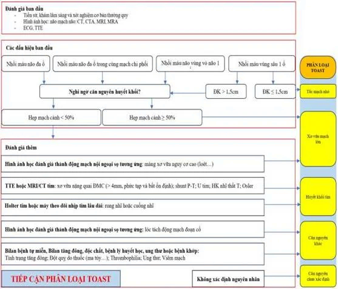
        

      

    

  

  

    

      Lưu Đồ Tương Tác
      Hình 2. Sơ Đồ Chẩn Đoán TIA & Đột Quỵ Nhẹ Dựa Trên Thời Gian & MRI DWI
    

    

      

  

    

      
        <svg width="18" height="18" viewBox="0 0 24 24" fill="none" stroke="currentColor" stroke-width="2"><rect x="3" y="3" width="18" height="18" rx="2"/><path d="M7 8h10M7 12h10M7 16h6"/></svg>
      
      Hình 2. Sơ Đồ Chẩn Đoán TIA & Đột Quỵ Nhẹ Dựa Trên Thời Gian & MRI DWI
    

    QĐ 3312/BYT • Tissue-based TIA
  

  
  

    <svg class="med-svg" viewBox="0 0 920 540" width="100%" height="100%" preserveAspectRatio="xMidYMid meet">
  <defs>
    <marker id="arr-tia" viewBox="0 0 10 10" refX="6" refY="5" markerWidth="6" markerHeight="6" orient="auto-start-reverse">
      <path d="M 0 1.5 L 8 5 L 0 8.5 z" fill="var(--color-text-muted, #64748b)" />
    </marker>
    <marker id="arr-tia-act" viewBox="0 0 10 10" refX="6" refY="5" markerWidth="6" markerHeight="6" orient="auto-start-reverse">
      <path d="M 0 1.5 L 8 5 L 0 8.5 z" fill="var(--color-primary, #0284c7)" />
    </marker>
  </defs>

  <!-- Root -->
  <g class="flow-node">
    <rect x="260" y="15" width="400" height="60" rx="10" fill="var(--color-primary-subtle, rgba(2,132,199,0.12))" stroke="var(--color-primary, #0284c7)" stroke-width="2"/>
    <text x="460" y="38" font-size="14" font-weight="700" fill="var(--color-primary, #0284c7)" text-anchor="middle">KHIẾM KHUYẾT THẦN KINH KHU TRÚ CẤP TÍNH</text>
    <text x="460" y="58" font-size="11" fill="var(--color-text-muted, #64748b)" text-anchor="middle">Triệu chứng tự hồi phục hoàn toàn hoặc thoái lui nhanh</text>
  </g>

  <!-- Flow to Decision 1 -->
  <path d="M 460 75 L 460 110" fill="none" stroke="var(--color-primary, #0284c7)" stroke-width="2" marker-end="url(#arr-tia-act)"/>

  <!-- Decision 1 -->
  <g class="flow-node">
    <polygon points="460,110 630,150 460,190 290,150" fill="var(--color-warning-subtle, rgba(245,158,11,0.12))" stroke="var(--color-warning, #f59e0b)" stroke-width="2"/>
    <text x="460" y="146" font-size="12.5" font-weight="700" fill="var(--color-warning, #d97706)" text-anchor="middle">Thời Gian Kéo Dài</text>
    <text x="460" y="162" font-size="11" fill="var(--color-text-muted, #64748b)" text-anchor="middle">Triệu Chứng Lâm Sàng?</text>
  </g>

  <!-- D1 Branch Right: >= 24h -->
  <path d="M 630 150 L 720 150" fill="none" stroke="var(--color-danger, #ef4444)" stroke-width="2" marker-end="url(#arr-tia-act)"/>
  <g>
    <rect x="642" y="132" width="65" height="20" rx="4" fill="var(--color-surface, #ffffff)" stroke="var(--color-border, #cbd5e1)" stroke-width="1"/>
    <text x="674" y="146" font-size="10.5" font-weight="600" fill="var(--color-danger, #ef4444)" text-anchor="middle">≥ 24 giờ</text>
  </g>
  <g class="flow-node">
    <rect x="720" y="118" width="180" height="64" rx="8" fill="var(--color-danger-subtle, rgba(239,68,68,0.12))" stroke="var(--color-danger, #ef4444)" stroke-width="1.8"/>
    <text x="810" y="142" font-size="12.5" font-weight="700" fill="var(--color-danger, #ef4444)" text-anchor="middle">Nhồi Máu Não Thực Sự</text>
    <text x="810" y="160" font-size="10.5" fill="var(--color-text-muted, #64748b)" text-anchor="middle">Tiêu chuẩn thời gian cổ điển</text>
  </g>

  <!-- D1 Branch Down: < 24h -->
  <path d="M 460 190 L 460 230" fill="none" stroke="var(--color-warning, #f59e0b)" stroke-width="2" marker-end="url(#arr-tia-act)"/>
  <g>
    <rect x="428" y="196" width="64" height="20" rx="4" fill="var(--color-surface, #ffffff)" stroke="var(--color-border, #cbd5e1)" stroke-width="1"/>
    <text x="460" y="210" font-size="10.5" font-weight="600" fill="var(--color-warning, #d97706)" text-anchor="middle">&lt; 24 giờ</text>
  </g>

  <!-- Suspect TIA Step -->
  <g class="flow-node">
    <rect x="280" y="230" width="360" height="52" rx="8" fill="var(--color-surface, #ffffff)" stroke="var(--color-primary, #0284c7)" stroke-width="1.5"/>
    <text x="460" y="252" font-size="12.5" font-weight="700" fill="var(--color-primary, #0284c7)" text-anchor="middle">Nghi Ngờ Cơn Thiếu Máu Não Thoáng Qua (TIA)</text>
    <text x="460" y="270" font-size="11" fill="var(--color-text-muted, #64748b)" text-anchor="middle">Chỉ định MRI sọ não chuỗi xung khuếch tán (DWI) khẩn cấp</text>
  </g>

  <!-- Flow to Decision 2 -->
  <path d="M 460 282 L 460 320" fill="none" stroke="var(--color-primary, #0284c7)" stroke-width="2" marker-end="url(#arr-tia-act)"/>

  <!-- Decision 2 -->
  <g class="flow-node">
    <polygon points="460,320 630,360 460,400 290,360" fill="var(--color-warning-subtle, rgba(245,158,11,0.12))" stroke="var(--color-warning, #f59e0b)" stroke-width="2"/>
    <text x="460" y="355" font-size="12.5" font-weight="700" fill="var(--color-warning, #d97706)" text-anchor="middle">MRI DWI Có Tổn Thương</text>
    <text x="460" y="372" font-size="11" fill="var(--color-text-muted, #64748b)" text-anchor="middle">Ổ Nhồi Máu Cấp Mới?</text>
  </g>

  <!-- D2 Branch Left: DWI (+) -->
  <path d="M 290 360 L 190 360" fill="none" stroke="var(--color-danger, #ef4444)" stroke-width="2" marker-end="url(#arr-tia-act)"/>
  <g>
    <rect x="210" y="345" width="60" height="20" rx="4" fill="var(--color-surface, #ffffff)" stroke="var(--color-border, #cbd5e1)" stroke-width="1"/>
    <text x="240" y="359" font-size="10.5" font-weight="600" fill="var(--color-danger, #ef4444)" text-anchor="middle">DWI (+)</text>
  </g>
  <g class="flow-node">
    <rect x="30" y="325" width="160" height="70" rx="8" fill="var(--color-danger-subtle, rgba(239,68,68,0.12))" stroke="var(--color-danger, #ef4444)" stroke-width="1.8"/>
    <text x="110" y="348" font-size="12" font-weight="700" fill="var(--color-danger, #ef4444)" text-anchor="middle">Minor Stroke</text>
    <text x="110" y="366" font-size="10.5" font-weight="600" fill="var(--color-text, #334155)" text-anchor="middle">(Đột Quỵ Nhẹ)</text>
    <text x="110" y="382" font-size="9.5" fill="var(--color-text-muted, #64748b)" text-anchor="middle">Có hoại tử tế bào não</text>
  </g>

  <!-- D2 Branch Right: DWI (-) -->
  <path d="M 630 360 L 730 360" fill="none" stroke="var(--color-success, #22c55e)" stroke-width="2" marker-end="url(#arr-tia-act)"/>
  <g>
    <rect x="650" y="345" width="60" height="20" rx="4" fill="var(--color-surface, #ffffff)" stroke="var(--color-border, #cbd5e1)" stroke-width="1"/>
    <text x="680" y="359" font-size="10.5" font-weight="600" fill="var(--color-success, #16a34a)" text-anchor="middle">DWI (-)</text>
  </g>
  <g class="flow-node">
    <rect x="730" y="325" width="160" height="70" rx="8" fill="var(--color-success-subtle, rgba(34,197,94,0.12))" stroke="var(--color-success, #22c55e)" stroke-width="1.8"/>
    <text x="810" y="348" font-size="12" font-weight="700" fill="var(--color-success, #16a34a)" text-anchor="middle">TIA Xác Định Mô Học</text>
    <text x="810" y="366" font-size="10.5" font-weight="600" fill="var(--color-text, #334155)" text-anchor="middle">(Tissue-based TIA)</text>
    <text x="810" y="382" font-size="9.5" fill="var(--color-text-muted, #64748b)" text-anchor="middle">Không tổn thương DWI</text>
  </g>

  <!-- Convergence to ABCD2 and Therapy -->
  <path d="M 110 395 L 110 465 L 300 465" fill="none" stroke="var(--color-border, #cbd5e1)" stroke-width="1.8"/>
  <path d="M 810 395 L 810 465 L 620 465" fill="none" stroke="var(--color-border, #cbd5e1)" stroke-width="1.8"/>
  <path d="M 460 400 L 460 455" fill="none" stroke="var(--color-primary, #0284c7)" stroke-width="1.8" marker-end="url(#arr-tia-act)"/>

  <g class="flow-node">
    <rect x="250" y="455" width="420" height="65" rx="8" fill="var(--color-primary-subtle, rgba(2,132,199,0.12))" stroke="var(--color-primary, #0284c7)" stroke-width="2"/>
    <text x="460" y="480" font-size="13" font-weight="700" fill="var(--color-primary, #0284c7)" text-anchor="middle">PHÂN TẦNG NGUY CƠ ABCD² &amp; KHỞI ĐỘNG KHÁNG TIỂU CẦU</text>
    <text x="460" y="502" font-size="11" fill="var(--color-text, #334155)" text-anchor="middle">ABCD² ≥ 4 hoặc NIHSS ≤ 3: DAPT khẩn cấp trong 24h đầu</text>
  </g>
</svg>
  

  

      

        
        Thời gian & chẩn đoán hình ảnh
      

      

        
        Minor Stroke / Hoại tử mô học
      

      

        
        TIA mô học xác định
      

  

      

        <em>Hình 2: Phân nhánh chẩn đoán xác định TIA vs Nhồi máu não dựa trên thời gian kéo dài triệu chứng lâm sàng (&lt; 24h vs &ge; 24h) và sự xuất hiện của tổn thương trên MRI xung DWI. (Nguồn: Quyết định 3312/QĐ-BYT).</em>
      

      

        

          <i class="fa-solid fa-image"></i> Đối chiếu hình ảnh lưu đồ gốc từ Quyết định 3312/QĐ-BYT
        

        

          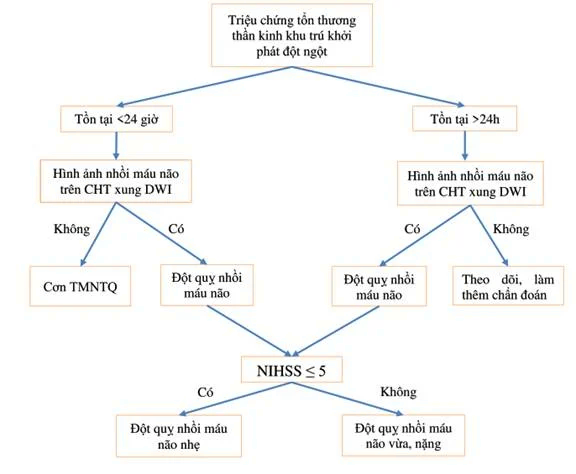
        

      

    

  

  <h3 class="subsection-title">2.3. Khuyến Cáo Liệu Pháp Kháng Kết Tập Tiểu Cầu (KTTC) Trong TIA & Đột Quỵ Nhẹ</h3>
  

    <table class="table-custom">
      <thead>
        <tr>
          <th>Phân Tầng Nguy Cơ</th>
          <th>Tiêu Chuẩn Đánh Giá</th>
          <th>Phác Đồ Kháng Tiểu Cầu Khuyến Cáo</th>
          <th>Thời Gian Duy Trì</th>
        </tr>
      </thead>
      <tbody>
        <tr>
          <td><strong>Nguy cơ thấp</strong></td>
          <td>TIA có điểm <strong>ABCD2 &lt; 4 điểm</strong></td>
          <td><strong>Kháng tiểu cầu đơn:</strong> Aspirin liều nạp 81 – 325 mg/ngày, sau đó duy trì 81 – 100 mg/ngày. Dị ứng Aspirin: đổi sang Clopidogrel 75 mg/ngày hoặc Cilostazol 100 mg x 2 lần/ngày.</td>
          <td>Dài hạn</td>
        </tr>
        <tr>
          <td><strong>Nguy cơ cao</strong></td>
          <td>
            TIA có <strong>ABCD2 &ge; 4 điểm</strong> 
            HOẶC Đột quỵ nhẹ <strong>NIHSS &le; 3 điểm</strong>
          </td>
          <td>
            <strong>Kháng tiểu cầu kép (DAPT — Phác đồ CHANCE / POINT):</strong> 
            <strong>Aspirin</strong> (nạp 162 – 325 mg, duy trì 81 – 100 mg/ngày) phối hợp <strong>Clopidogrel</strong> (nạp 300 – 600 mg, duy trì 75 mg/ngày). Khởi động sớm trong <strong>24 giờ đầu</strong> (tối đa 7 ngày đầu).
          </td>
          <td>
            Duy trì DAPT trong <strong>21 đến 90 ngày</strong>, sau đó chuyển về kháng tiểu cầu đơn dài hạn.
          </td>
        </tr>
        <tr>
          <td><strong>Nguy cơ rất cao</strong></td>
          <td>
            TIA có <strong>ABCD2 &ge; 5 điểm</strong> 
            HOẶC Đột quỵ nhẹ <strong>NIHSS &le; 5 điểm</strong> 
            kèm theo hẹp động mạch nội/ngoại sọ &gt; 30%
          </td>
          <td>
            <strong>Kháng tiểu cầu kép (DAPT — Phác đồ THALES):</strong> 
            <strong>Aspirin</strong> (nạp 162 – 325 mg, duy trì 81 – 100 mg/ngày) phối hợp <strong>Ticagrelor</strong> (nạp 180 mg, duy trì 90 mg x 2 lần/ngày).
          </td>
          <td>
            Duy trì trong vòng <strong>30 ngày</strong>, sau đó chuyển về kháng tiểu cầu đơn dài hạn (theo dõi sát nguy cơ xuất huyết).
          </td>
        </tr>
      </tbody>
    </table>
  

  

    

      Lưu Đồ Tương Tác
      Hình 3. Lưu Đồ Sử Dụng Thuốc Chống Kết Tập Tiểu Cầu (QĐ 3312/QĐ-BYT)
    

    

      

  

    

      
        <svg width="18" height="18" viewBox="0 0 24 24" fill="none" stroke="currentColor" stroke-width="2"><rect x="3" y="3" width="18" height="18" rx="2"/><path d="M7 8h10M7 12h10M7 16h6"/></svg>
      
      Hình 3. Lưu Đồ Sử Dụng Thuốc Chống Kết Tập Tiểu Cầu (QĐ 3312/QĐ-BYT)
    

    QĐ 3312/BYT • DAPT Protocol
  

  
  

    <svg class="med-svg" viewBox="0 0 920 440" width="100%" height="100%" preserveAspectRatio="xMidYMid meet">
  <defs>
    <marker id="arr-antipl" viewBox="0 0 10 10" refX="6" refY="5" markerWidth="6" markerHeight="6" orient="auto-start-reverse">
      <path d="M 0 1.5 L 8 5 L 0 8.5 z" fill="var(--color-text-muted, #64748b)" />
    </marker>
    <marker id="arr-antipl-act" viewBox="0 0 10 10" refX="6" refY="5" markerWidth="6" markerHeight="6" orient="auto-start-reverse">
      <path d="M 0 1.5 L 8 5 L 0 8.5 z" fill="var(--color-primary, #0284c7)" />
    </marker>
  </defs>

  <!-- Root -->
  <g class="flow-node">
    <rect x="250" y="15" width="420" height="58" rx="10" fill="var(--color-primary-subtle, rgba(2,132,199,0.12))" stroke="var(--color-primary, #0284c7)" stroke-width="2"/>
    <text x="460" y="38" font-size="14" font-weight="700" fill="var(--color-primary, #0284c7)" text-anchor="middle">TIA / NHỒI MÁU NÃO KHÔNG DO CĂN NGUYÊN TIM</text>
    <text x="460" y="56" font-size="11" fill="var(--color-text-muted, #64748b)" text-anchor="middle">Xơ vữa động mạch lớn, nhánh xuyên lỗ khuyết, hoặc ESUS</text>
  </g>

  <!-- Flow to Stratification -->
  <path d="M 460 73 L 460 105" fill="none" stroke="var(--color-primary, #0284c7)" stroke-width="2" marker-end="url(#arr-antipl-act)"/>

  <!-- Decision Hub -->
  <g class="flow-node">
    <rect x="300" y="105" width="320" height="46" rx="8" fill="var(--color-warning-subtle, rgba(245,158,11,0.12))" stroke="var(--color-warning, #f59e0b)" stroke-width="2"/>
    <text x="460" y="133" font-size="13" font-weight="700" fill="var(--color-warning, #d97706)" text-anchor="middle">PHÂN TẦNG NGUY CƠ LÂM SÀNG &amp; MẠCH MÁU</text>
  </g>

  <!-- 3 Branches -->
  <path d="M 460 151 L 460 175 M 150 175 L 770 175" fill="none" stroke="var(--color-border, #cbd5e1)" stroke-width="1.8"/>
  <path d="M 150 175 L 150 205" fill="none" stroke="var(--color-border, #cbd5e1)" stroke-width="1.8" marker-end="url(#arr-antipl)"/>
  <path d="M 460 175 L 460 205" fill="none" stroke="var(--color-border, #cbd5e1)" stroke-width="1.8" marker-end="url(#arr-antipl)"/>
  <path d="M 770 175 L 770 205" fill="none" stroke="var(--color-border, #cbd5e1)" stroke-width="1.8" marker-end="url(#arr-antipl)"/>

  <!-- Branch 1: Low Risk -->
  <g>
    <rect x="75" y="180" width="150" height="20" rx="4" fill="var(--color-surface, #ffffff)" stroke="var(--color-border, #cbd5e1)" stroke-width="1"/>
    <text x="150" y="194" font-size="10.5" font-weight="600" fill="var(--color-success, #16a34a)" text-anchor="middle">Nguy cơ thấp (ABCD² &lt; 4)</text>
  </g>
  <g class="flow-node">
    <rect x="40" y="205" width="220" height="110" rx="8" fill="var(--color-success-subtle, rgba(34,197,94,0.12))" stroke="var(--color-success, #22c55e)" stroke-width="1.8"/>
    <text x="150" y="230" font-size="13" font-weight="700" fill="var(--color-success, #16a34a)" text-anchor="middle">Kháng Tiểu Cầu Đơn (SAPT)</text>
    <text x="150" y="255" font-size="11.5" font-weight="600" fill="var(--color-text, #334155)" text-anchor="middle">Aspirin 81 – 100 mg/ngày</text>
    <text x="150" y="275" font-size="11" fill="var(--color-text-muted, #64748b)" text-anchor="middle">Hoặc Clopidogrel 75 mg/ngày</text>
    <text x="150" y="295" font-size="10.5" fill="var(--color-success, #16a34a)" text-anchor="middle">Duy trì đơn trị liệu dài hạn</text>
  </g>

  <!-- Branch 2: High Risk CHANCE/POINT -->
  <g>
    <rect x="360" y="180" width="200" height="20" rx="4" fill="var(--color-surface, #ffffff)" stroke="var(--color-border, #cbd5e1)" stroke-width="1"/>
    <text x="460" y="194" font-size="10.5" font-weight="600" fill="var(--color-warning, #d97706)" text-anchor="middle">Nguy cơ cao (ABCD² ≥ 4 / NIHSS ≤ 3)</text>
  </g>
  <g class="flow-node">
    <rect x="350" y="205" width="220" height="110" rx="8" fill="var(--color-warning-subtle, rgba(245,158,11,0.12))" stroke="var(--color-warning, #f59e0b)" stroke-width="1.8"/>
    <text x="460" y="230" font-size="13" font-weight="700" fill="var(--color-warning, #d97706)" text-anchor="middle">DAPT CHANCE / POINT</text>
    <text x="460" y="255" font-size="11" font-weight="600" fill="var(--color-text, #334155)" text-anchor="middle">Aspirin + Clopidogrel</text>
    <text x="460" y="275" font-size="10.5" fill="var(--color-text-muted, #64748b)" text-anchor="middle">Khởi động sớm trong 24h đầu</text>
    <text x="460" y="295" font-size="10.5" fill="var(--color-warning, #d97706)" text-anchor="middle">Duy trì 21 – 90 ngày</text>
  </g>
  <path d="M 460 315 L 460 345" fill="none" stroke="var(--color-success, #22c55e)" stroke-width="1.5" marker-end="url(#arr-antipl-act)"/>
  <g class="flow-node">
    <rect x="360" y="345" width="200" height="45" rx="6" fill="var(--color-surface, #ffffff)" stroke="var(--color-success, #22c55e)" stroke-width="1.5"/>
    <text x="460" y="367" font-size="11" font-weight="600" fill="var(--color-success, #16a34a)" text-anchor="middle">Sau đó chuyển về SAPT đơn</text>
    <text x="460" y="381" font-size="9.5" fill="var(--color-text-muted, #64748b)" text-anchor="middle">Duy trì phòng ngừa thứ phát dài hạn</text>
  </g>

  <!-- Branch 3: Very High Risk THALES -->
  <g>
    <rect x="665" y="180" width="210" height="20" rx="4" fill="var(--color-surface, #ffffff)" stroke="var(--color-border, #cbd5e1)" stroke-width="1"/>
    <text x="770" y="194" font-size="10.5" font-weight="600" fill="var(--color-danger, #ef4444)" text-anchor="middle">Rất cao (NIHSS ≤ 5 + Hẹp ĐM &gt; 30%)</text>
  </g>
  <g class="flow-node">
    <rect x="660" y="205" width="220" height="110" rx="8" fill="var(--color-danger-subtle, rgba(239,68,68,0.12))" stroke="var(--color-danger, #ef4444)" stroke-width="1.8"/>
    <text x="770" y="230" font-size="13" font-weight="700" fill="var(--color-danger, #ef4444)" text-anchor="middle">DAPT THALES Phác Đồ</text>
    <text x="770" y="255" font-size="11" font-weight="600" fill="var(--color-text, #334155)" text-anchor="middle">Aspirin + Ticagrelor 90mg x2</text>
    <text x="770" y="275" font-size="10.5" fill="var(--color-text-muted, #64748b)" text-anchor="middle">Khởi động sớm trong 24h đầu</text>
    <text x="770" y="295" font-size="10.5" fill="var(--color-danger, #ef4444)" text-anchor="middle">Duy trì đúng 30 ngày</text>
  </g>
  <path d="M 770 315 L 770 345" fill="none" stroke="var(--color-success, #22c55e)" stroke-width="1.5" marker-end="url(#arr-antipl-act)"/>
  <g class="flow-node">
    <rect x="670" y="345" width="200" height="45" rx="6" fill="var(--color-surface, #ffffff)" stroke="var(--color-success, #22c55e)" stroke-width="1.5"/>
    <text x="770" y="367" font-size="11" font-weight="600" fill="var(--color-success, #16a34a)" text-anchor="middle">Sau đó chuyển về SAPT đơn</text>
    <text x="770" y="381" font-size="9.5" fill="var(--color-text-muted, #64748b)" text-anchor="middle">Tránh DAPT kéo dài gây xuất huyết</text>
  </g>
</svg>
  

  

      

        
        Nguy cơ thấp: SAPT dài hạn
      

      

        
        Nguy cơ cao: DAPT Aspirin + Clopidogrel (21-90 ngày)
      

      

        
        Nguy cơ rất cao: DAPT Aspirin + Ticagrelor (30 ngày)
      

  

      

        <em>Hình 3: Lưu đồ phân nhánh chỉ định kháng tiểu cầu kép (DAPT) ngắn hạn dưới 90 ngày chuyển đổi sang đơn trị liệu dài hạn sau 90 ngày. (Nguồn: Quyết định 3312/QĐ-BYT).</em>
      

      

        

          <i class="fa-solid fa-image"></i> Đối chiếu hình ảnh lưu đồ gốc từ Quyết định 3312/QĐ-BYT
        

        

          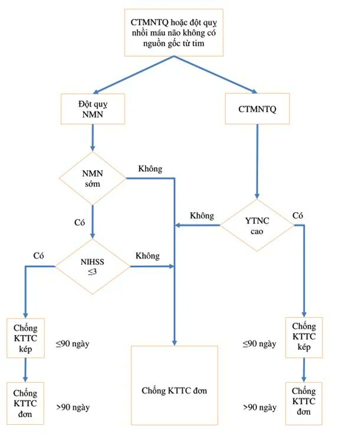
        

      

    

  

  

    

      Lưu Đồ Tương Tác
      Hình 4. Lưu Đồ Khuyến Cáo Điều Trị Thuốc Chống Đông (QĐ 3312/QĐ-BYT)
    

    

      

  

    

      
        <svg width="18" height="18" viewBox="0 0 24 24" fill="none" stroke="currentColor" stroke-width="2"><rect x="3" y="3" width="18" height="18" rx="2"/><path d="M7 8h10M7 12h10M7 16h6"/></svg>
      
      Hình 4. Lưu Đồ Khuyến Cáo Điều Trị Thuốc Chống Đông (QĐ 3312/QĐ-BYT)
    

    QĐ 3312/BYT • DIN Rule
  

  
  

    <svg class="med-svg" viewBox="0 0 880 380" width="100%" height="100%" preserveAspectRatio="xMidYMid meet">
  <defs>
    <marker id="arr-anticoag" viewBox="0 0 10 10" refX="6" refY="5" markerWidth="6" markerHeight="6" orient="auto-start-reverse">
      <path d="M 0 1.5 L 8 5 L 0 8.5 z" fill="var(--color-text-muted, #64748b)" />
    </marker>
    <marker id="arr-anticoag-act" viewBox="0 0 10 10" refX="6" refY="5" markerWidth="6" markerHeight="6" orient="auto-start-reverse">
      <path d="M 0 1.5 L 8 5 L 0 8.5 z" fill="var(--color-primary, #0284c7)" />
    </marker>
  </defs>

  <!-- Root -->
  <g class="flow-node">
    <rect x="220" y="15" width="440" height="58" rx="10" fill="var(--color-primary-subtle, rgba(2,132,199,0.12))" stroke="var(--color-primary, #0284c7)" stroke-width="2"/>
    <text x="440" y="38" font-size="14" font-weight="700" fill="var(--color-primary, #0284c7)" text-anchor="middle">TIA / NHỒI MÁU NÃO DO CĂN NGUYÊN TỪ TIM</text>
    <text x="440" y="56" font-size="11" fill="var(--color-text-muted, #64748b)" text-anchor="middle">Rung nhĩ không do van tim, van cơ học, hẹp hai lá, huyết khối buồng tim</text>
  </g>

  <!-- Flow to Valve Decision -->
  <path d="M 440 73 L 440 105" fill="none" stroke="var(--color-primary, #0284c7)" stroke-width="2" marker-end="url(#arr-anticoag-act)"/>

  <!-- Valve Decision -->
  <g class="flow-node">
    <polygon points="440,105 630,145 440,185 250,145" fill="var(--color-warning-subtle, rgba(245,158,11,0.12))" stroke="var(--color-warning, #f59e0b)" stroke-width="2"/>
    <text x="440" y="141" font-size="12.5" font-weight="700" fill="var(--color-warning, #d97706)" text-anchor="middle">Van Tim Cơ Học HOẶC</text>
    <text x="440" y="157" font-size="11" fill="var(--color-text-muted, #64748b)" text-anchor="middle">Hẹp Van Hai Lá Vừa – Nặng?</text>
  </g>

  <!-- Left: Yes -> VKA -->
  <path d="M 250 145 L 170 145 L 170 200" fill="none" stroke="var(--color-danger, #ef4444)" stroke-width="2" marker-end="url(#arr-anticoag-act)"/>
  <g>
    <rect x="175" y="133" width="60" height="20" rx="4" fill="var(--color-surface, #ffffff)" stroke="var(--color-border, #cbd5e1)" stroke-width="1"/>
    <text x="205" y="147" font-size="10.5" font-weight="600" fill="var(--color-danger, #ef4444)" text-anchor="middle">Có (+)</text>
  </g>
  <g class="flow-node">
    <rect x="50" y="200" width="240" height="75" rx="8" fill="var(--color-danger-subtle, rgba(239,68,68,0.12))" stroke="var(--color-danger, #ef4444)" stroke-width="1.8"/>
    <text x="170" y="224" font-size="13" font-weight="700" fill="var(--color-danger, #ef4444)" text-anchor="middle">Kháng Vitamin K (Warfarin)</text>
    <text x="170" y="244" font-size="11" font-weight="600" fill="var(--color-text, #334155)" text-anchor="middle">Mục tiêu INR 2.5 – 3.5 (van cơ học)</text>
    <text x="170" y="260" font-size="10.5" fill="var(--color-text-muted, #64748b)" text-anchor="middle">INR 2.0 – 3.0 (hẹp van hai lá hậu thấp)</text>
  </g>

  <!-- Right: No -> DOACs -->
  <path d="M 630 145 L 710 145 L 710 200" fill="none" stroke="var(--color-success, #22c55e)" stroke-width="2" marker-end="url(#arr-anticoag-act)"/>
  <g>
    <rect x="645" y="133" width="60" height="20" rx="4" fill="var(--color-surface, #ffffff)" stroke="var(--color-border, #cbd5e1)" stroke-width="1"/>
    <text x="675" y="147" font-size="10.5" font-weight="600" fill="var(--color-success, #16a34a)" text-anchor="middle">Không (-)</text>
  </g>
  <g class="flow-node">
    <rect x="580" y="200" width="260" height="75" rx="8" fill="var(--color-success-subtle, rgba(34,197,94,0.12))" stroke="var(--color-success, #22c55e)" stroke-width="1.8"/>
    <text x="710" y="224" font-size="13" font-weight="700" fill="var(--color-success, #16a34a)" text-anchor="middle">Ưu Tiên Tuyệt Đối DOACs</text>
    <text x="710" y="244" font-size="11" font-weight="600" fill="var(--color-text, #334155)" text-anchor="middle">Dabigatran 150mg x2 • Rivaroxaban 20mg</text>
    <text x="710" y="260" font-size="10.5" fill="var(--color-text-muted, #64748b)" text-anchor="middle">Apixaban 5mg x2 • Edoxaban 60mg</text>
  </g>

  <!-- Convergence to DIN Rule -->
  <path d="M 170 275 L 170 305 L 300 305" fill="none" stroke="var(--color-border, #cbd5e1)" stroke-width="1.8"/>
  <path d="M 710 275 L 710 305 L 580 305" fill="none" stroke="var(--color-border, #cbd5e1)" stroke-width="1.8"/>
  <path d="M 440 185 L 440 295" fill="none" stroke="var(--color-primary, #0284c7)" stroke-width="1.8" marker-end="url(#arr-anticoag-act)"/>

  <g class="flow-node">
    <rect x="140" y="295" width="600" height="68" rx="8" fill="var(--color-primary-subtle, rgba(2,132,199,0.12))" stroke="var(--color-primary, #0284c7)" stroke-width="2"/>
    <text x="440" y="318" font-size="13" font-weight="700" fill="var(--color-primary, #0284c7)" text-anchor="middle">THỜI ĐIỂM KHỞI ĐỘNG CHỐNG ĐÔNG: QUY TẮC DIN (1 – 3 – 6 – 12 NGÀY)</text>
    <text x="440" y="338" font-size="11" fill="var(--color-text, #334155)" text-anchor="middle">• Ngày 1: TIA • Ngày 3: Nhồi máu nhỏ (NIHSS &lt; 8) • Ngày 6: Nhồi máu vừa (NIHSS 8–15)</text>
    <text x="440" y="354" font-size="11" font-weight="600" fill="var(--color-danger, #ef4444)" text-anchor="middle">• Ngày 12 – 14: Nhồi máu lớn (NIHSS &gt; 15, sau khi chụp CT/MRI loại trừ xuất huyết chuyển dạng)</text>
  </g>
</svg>
  

  

      

        
        VKA cho van cơ học / Hẹp 2 lá
      

      

        
        DOACs cho rung nhĩ không van
      

      

        
        Quy tắc DIN 1-3-6-12 ngày
      

  

      

        <em>Hình 4: Lưu đồ lựa chọn thuốc chống đông: Ưu tiên DOACs cho rung nhĩ không van; bắt buộc dùng Kháng vitamin K (Warfarin mục tiêu INR 2.5 – 3.5) cho hẹp van hai lá vừa/nặng hoặc van cơ học. (Nguồn: Quyết định 3312/QĐ-BYT).</em>
      

      

        

          <i class="fa-solid fa-image"></i> Đối chiếu hình ảnh lưu đồ gốc từ Quyết định 3312/QĐ-BYT
        

        

          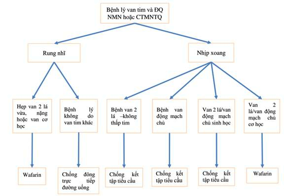
        

      

    

  

</section>

---

<section id="sec-nhoi-mau-nao-cap" class="guideline-section">
  <h2 class="section-title"><i class="fa-solid fa-brain"></i> 3. Nhồi Máu Não Cấp: Đánh Giá & Kiểm Soát Huyết Áp Cá Thể Hóa</h2>

  <h3 class="subsection-title">3.1. Phân Loại Mức Độ Nặng Theo Thang Điểm NIHSS</h3>
  <ul>
    <li><strong>NIHSS 0 – 5 điểm:</strong> Mức độ nhẹ.</li>
    <li><strong>NIHSS 6 – 10 điểm:</strong> Mức độ trung bình.</li>
    <li><strong>NIHSS 11 – 20 điểm:</strong> Mức độ vừa đến nặng.</li>
    <li><strong>NIHSS &gt; 20 điểm:</strong> Mức độ rất nặng, đe dọa tính mạng trực tiếp.</li>
  </ul>

  <h3 class="subsection-title">3.2. Quy Tắc Kiểm Soát Các Chỉ Số Sinh Tồn Cốt Lõi</h3>
  <ul>
    <li><strong>Hỗ trợ hô hấp:</strong> Duy trì đường thở thông thoáng; bổ sung oxy khi <strong>SpO2 &le; 94%</strong>; không thở oxy thường quy cho bệnh nhân không thiếu oxy.</li>
    <li><strong>Kiểm soát thân nhiệt:</strong> Dùng Paracetamol hạ sốt khi thân nhiệt <strong>&gt; 38°C</strong>; tìm kiếm và điều trị các nguyên nhân gây sốt (viêm phổi hít, nhiễm trùng tiểu).</li>
    <li><strong>Kiểm soát đường huyết:</strong> Hạ đường huyết: Bù Glucose tĩnh mạch ngay khi glucose máu <strong>&lt; 60 mg/dL (&lt; 3.3 mmol/L)</strong> để loại trừ giả đột quỵ; Tăng đường huyết: Dùng Insulin khi glucose <strong>&gt; 180 mg/dL (&gt; 10.0 mmol/L)</strong>, duy trì đích an toàn <strong>140 – 180 mg/dL (7.8 – 10.0 mmol/L)</strong>.</li>
  </ul>

  <h3 class="subsection-title">3.3. Chiến Lược Kiểm Soát Huyết Áp Giai Đoạn Cấp (24 Giờ Đầu)</h3>
  

    <table class="table-custom">
      <thead>
        <tr>
          <th>Bệnh Cảnh Lâm Sàng</th>
          <th>Mục Tiêu Huyết Áp Bắt Buộc</th>
          <th>Chiến Lược Điều Chỉnh & Thuốc Ưu Tiên</th>
        </tr>
      </thead>
      <tbody>
        <tr>
          <td><strong>Có chỉ định Tiêu sợi huyết (rt-PA)</strong></td>
          <td>
            Trước khi tiêm thuốc: <strong>HATT &lt; 185 mmHg và HATTr &lt; 110 mmHg</strong>. 
            Trong 24 giờ đầu sau tiêm: <strong>Duy trì &lt; 180/105 mmHg</strong>.
          </td>
          <td>
            Ưu tiên thuốc hạ áp truyền tĩnh mạch tác dụng nhanh, ngắn, dễ chỉnh liều: <strong>Nicardipine truyền TM</strong> (khởi đầu 5 mg/h, tăng dần 2.5 mg/h mỗi 5 – 15 phút, tối đa 15 mg/h) hoặc Labetalol. 
            <em>Không cố tình hạ HATT xuống &lt; 130 – 140 mmHg trong 72 giờ đầu.</em>
          </td>
        </tr>
        <tr>
          <td><strong>KHÔNG điều trị Tiêu sợi huyết</strong></td>
          <td>
            <strong>Huyết áp &lt; 220/110 mmHg:</strong> <strong>TUYỆT ĐỐI KHÔNG HẠ ÁP</strong> trong ít nhất 24 giờ đầu.
          </td>
          <td>
            Duy trì áp lực tưới máu não bàng hệ. 
            <em>Ngoại lệ bắt buộc hạ áp:</em> Bệnh mạch vành cấp, suy tim cấp ứ huyết, phình tách động mạch chủ ngực, tiền sản giật/sản giật.
          </td>
        </tr>
        <tr>
          <td><strong>Huyết áp cực cao không tiêu sợi huyết (&ge; 220/120 mmHg)</strong></td>
          <td>
            <strong>Hạ tối đa 15%</strong> mức huyết áp ban đầu trong vòng 24 giờ đầu tiên.
          </td>
          <td>Hạ áp từ từ và thận trọng; tránh tụt áp đột ngột làm lan rộng vùng lõi hoại tử.</td>
        </tr>
        <tr>
          <td><strong>Có chỉ định Lấy huyết khối cơ học (LHKCH)</strong></td>
          <td>
            Trước can thiệp: <strong>&le; 185/110 mmHg</strong>. 
            Trong và sau can thiệp 24h: <strong>&lt; 180/105 mmHg</strong>.
          </td>
          <td>
            <strong>Sau khi đã tái thông thành công (mTICI 2b – 3):</strong> Kiểm soát chặt chẽ HATT <strong>&lt; 140 mmHg</strong> để phòng ngừa xuất huyết tái tưới máu (Reperfusion hemorrhage), nhưng <em>không để tụt HATT &lt; 130 mmHg</em>.
          </td>
        </tr>
      </tbody>
    </table>
  

  

    

      Lưu Đồ Tương Tác
      Hình 5. Lưu Đồ Quy Trình Chẩn Đoán Nhồi Máu Não Cấp (QĐ 3312/QĐ-BYT)
    

    

      

  

    

      
        <svg width="18" height="18" viewBox="0 0 24 24" fill="none" stroke="currentColor" stroke-width="2"><rect x="3" y="3" width="18" height="18" rx="2"/><path d="M7 8h10M7 12h10M7 16h6"/></svg>
      
      Hình 5. Lưu Đồ Quy Trình Chẩn Đoán Nhồi Máu Não Cấp (QĐ 3312/QĐ-BYT)
    

    QĐ 3312/BYT • Code Stroke
  

  
  

    <svg class="med-svg" viewBox="0 0 820 530" width="100%" height="100%" preserveAspectRatio="xMidYMid meet">
  <defs>
    <marker id="arr-diag" viewBox="0 0 10 10" refX="6" refY="5" markerWidth="6" markerHeight="6" orient="auto-start-reverse">
      <path d="M 0 1.5 L 8 5 L 0 8.5 z" fill="var(--color-text-muted, #64748b)" />
    </marker>
    <marker id="arr-diag-act" viewBox="0 0 10 10" refX="6" refY="5" markerWidth="6" markerHeight="6" orient="auto-start-reverse">
      <path d="M 0 1.5 L 8 5 L 0 8.5 z" fill="var(--color-primary, #0284c7)" />
    </marker>
  </defs>

  <!-- Step 1: Emergency Contact -->
  <g class="flow-node">
    <rect x="230" y="15" width="360" height="55" rx="8" fill="var(--color-primary-subtle, rgba(2,132,199,0.12))" stroke="var(--color-primary, #0284c7)" stroke-width="2"/>
    <text x="410" y="36" font-size="13.5" font-weight="700" fill="var(--color-primary, #0284c7)" text-anchor="middle">TIẾP NHẬN NGHI NGỜ ĐỘT QUỴ CẤP</text>
    <text x="410" y="54" font-size="11" fill="var(--color-text-muted, #64748b)" text-anchor="middle">Dấu hiệu BE-FAST (+) • Khởi phát khiếm khuyết thần kinh khu trú</text>
  </g>

  <path d="M 410 70 L 410 98" fill="none" stroke="var(--color-primary, #0284c7)" stroke-width="2" marker-end="url(#arr-diag-act)"/>

  <!-- Step 2: Stabilization and Triage -->
  <g class="flow-node">
    <rect x="200" y="98" width="420" height="60" rx="8" fill="var(--color-surface, #ffffff)" stroke="var(--color-primary, #0284c7)" stroke-width="1.8"/>
    <text x="410" y="122" font-size="13" font-weight="700" fill="var(--color-primary, #0284c7)" text-anchor="middle">Ổn Định Ban Đầu &amp; Phân Luồng Triage (≤ 10 Phút)</text>
    <text x="410" y="142" font-size="11" fill="var(--color-text, #334155)" text-anchor="middle">Kiểm tra ABC • Đo Glucose mao mạch ngay • Tính điểm NIHSS &amp; LKW</text>
  </g>

  <path d="M 410 158 L 410 188" fill="none" stroke="var(--color-primary, #0284c7)" stroke-width="2" marker-end="url(#arr-diag-act)"/>

  <!-- Step 3: Urgent Imaging -->
  <g class="flow-node">
    <rect x="180" y="188" width="460" height="60" rx="8" fill="var(--color-surface, #ffffff)" stroke="var(--color-primary, #0284c7)" stroke-width="1.8"/>
    <text x="410" y="212" font-size="13" font-weight="700" fill="var(--color-primary, #0284c7)" text-anchor="middle">Hình Ảnh Học Thần Kinh Khẩn Cấp (≤ 20 – 25 Phút)</text>
    <text x="410" y="232" font-size="11" fill="var(--color-text, #334155)" text-anchor="middle">Chụp CLVT sọ não không cản quang (NCCT) hoặc MRI sọ não cấp</text>
  </g>

  <path d="M 410 248 L 410 278" fill="none" stroke="var(--color-primary, #0284c7)" stroke-width="2" marker-end="url(#arr-diag-act)"/>

  <!-- Decision: Bleeding? -->
  <g class="flow-node">
    <polygon points="410,278 590,315 410,352 230,315" fill="var(--color-warning-subtle, rgba(245,158,11,0.12))" stroke="var(--color-warning, #f59e0b)" stroke-width="2"/>
    <text x="410" y="311" font-size="12.5" font-weight="700" fill="var(--color-warning, #d97706)" text-anchor="middle">Có Xuất Huyết Não</text>
    <text x="410" y="327" font-size="11" fill="var(--color-text-muted, #64748b)" text-anchor="middle">Trên NCCT / MRI T2* GRE?</text>
  </g>

  <!-- Left: Bleeding Yes -> ICH Protocol -->
  <path d="M 230 315 L 140 315 L 140 375" fill="none" stroke="var(--color-danger, #ef4444)" stroke-width="2" marker-end="url(#arr-diag-act)"/>
  <g>
    <rect x="150" y="303" width="55" height="20" rx="4" fill="var(--color-surface, #ffffff)" stroke="var(--color-border, #cbd5e1)" stroke-width="1"/>
    <text x="177" y="317" font-size="10.5" font-weight="600" fill="var(--color-danger, #ef4444)" text-anchor="middle">Có (+)</text>
  </g>
  <g class="flow-node">
    <rect x="30" y="375" width="220" height="75" rx="8" fill="var(--color-danger-subtle, rgba(239,68,68,0.12))" stroke="var(--color-danger, #ef4444)" stroke-width="1.8"/>
    <text x="140" y="399" font-size="12.5" font-weight="700" fill="var(--color-danger, #ef4444)" text-anchor="middle">Xuất Huyết Não (ICH / SAH)</text>
    <text x="140" y="419" font-size="10.5" fill="var(--color-text, #334155)" text-anchor="middle">Kiểm soát HA cấp (HA &lt; 140)</text>
    <text x="140" y="435" font-size="10" fill="var(--color-text-muted, #64748b)" text-anchor="middle">Đảo ngược kháng đông • Hội chẩn Ngoại TK</text>
  </g>

  <!-- Right/Down: No -> Ischemia -->
  <path d="M 410 352 L 410 380" fill="none" stroke="var(--color-success, #22c55e)" stroke-width="2" marker-end="url(#arr-diag-act)"/>
  <g>
    <rect x="375" y="356" width="70" height="20" rx="4" fill="var(--color-surface, #ffffff)" stroke="var(--color-border, #cbd5e1)" stroke-width="1"/>
    <text x="410" y="370" font-size="10.5" font-weight="600" fill="var(--color-success, #16a34a)" text-anchor="middle">Không (-)</text>
  </g>
  <g class="flow-node">
    <rect x="290" y="380" width="240" height="65" rx="8" fill="var(--color-success-subtle, rgba(34,197,94,0.12))" stroke="var(--color-success, #22c55e)" stroke-width="1.8"/>
    <text x="410" y="404" font-size="13" font-weight="700" fill="var(--color-success, #16a34a)" text-anchor="middle">Nhồi Máu Não Cấp Xác Định</text>
    <text x="410" y="424" font-size="11" fill="var(--color-text-muted, #64748b)" text-anchor="middle">Đánh giá ASPECTS • Khảo sát mạch máu CTA</text>
  </g>

  <!-- Reperfusion activation -->
  <path d="M 410 445 L 410 475" fill="none" stroke="var(--color-primary, #0284c7)" stroke-width="2" marker-end="url(#arr-diag-act)"/>
  <g class="flow-node">
    <rect x="210" y="475" width="400" height="42" rx="8" fill="var(--color-primary, #0284c7)" stroke="var(--color-primary, #0284c7)" stroke-width="1"/>
    <text x="410" y="501" font-size="12.5" font-weight="700" fill="#ffffff" text-anchor="middle">KÍCH HOẠT QUY TRÌNH TÁI TƯỚI MÁU KHẨN CẤP</text>
  </g>
</svg>
  

  

      

        
        Quy trình cấp cứu thần kinh
      

      

        
        Xuất huyết não (ICH/SAH)
      

      

        
        Nhồi máu não cấp xác định
      

  

      

        <em>Hình 5: Lưu đồ các bước chẩn đoán từ khi tiếp nhận bệnh nhân có khiếm khuyết thần kinh khu trú đến chẩn đoán hình ảnh loại trừ chảy máu não. (Nguồn: Quyết định 3312/QĐ-BYT).</em>
      

      

        

          <i class="fa-solid fa-image"></i> Đối chiếu hình ảnh lưu đồ gốc từ Quyết định 3312/QĐ-BYT
        

        

          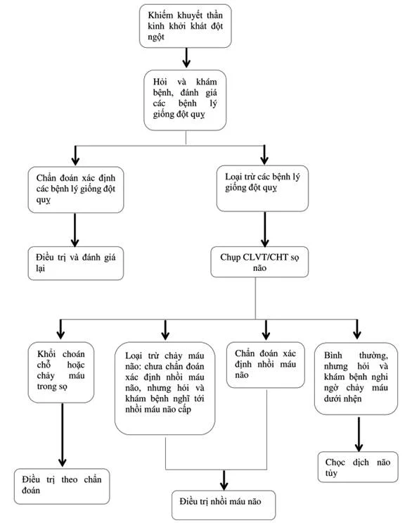
        

      

    

  

  

    

      Lưu Đồ Tương Tác
      Hình 6. Lưu Đồ Quy Trình Điều Trị Tái Tưới Máu Cấp Cứu (QĐ 3312/QĐ-BYT)
    

    

      

  

    

      
        <svg width="18" height="18" viewBox="0 0 24 24" fill="none" stroke="currentColor" stroke-width="2"><rect x="3" y="3" width="18" height="18" rx="2"/><path d="M7 8h10M7 12h10M7 16h6"/></svg>
      
      Hình 6. Lưu Đồ Quy Trình Điều Trị Tái Tưới Máu Cấp Cứu (QĐ 3312/QĐ-BYT)
    

    QĐ 3312/BYT • Bridging Therapy
  

  
  

    <svg class="med-svg" viewBox="0 0 940 560" width="100%" height="100%" preserveAspectRatio="xMidYMid meet">
  <defs>
    <marker id="arr-reperf" viewBox="0 0 10 10" refX="6" refY="5" markerWidth="6" markerHeight="6" orient="auto-start-reverse">
      <path d="M 0 1.5 L 8 5 L 0 8.5 z" fill="var(--color-text-muted, #64748b)" />
    </marker>
    <marker id="arr-reperf-act" viewBox="0 0 10 10" refX="6" refY="5" markerWidth="6" markerHeight="6" orient="auto-start-reverse">
      <path d="M 0 1.5 L 8 5 L 0 8.5 z" fill="var(--color-primary, #0284c7)" />
    </marker>
  </defs>

  <!-- Root -->
  <g class="flow-node">
    <rect x="250" y="15" width="440" height="55" rx="10" fill="var(--color-primary-subtle, rgba(2,132,199,0.12))" stroke="var(--color-primary, #0284c7)" stroke-width="2"/>
    <text x="470" y="36" font-size="14" font-weight="700" fill="var(--color-primary, #0284c7)" text-anchor="middle">NHỒI MÁU NÃO CẤP XÁC ĐỊNH</text>
    <text x="470" y="54" font-size="11" fill="var(--color-text-muted, #64748b)" text-anchor="middle">Đã loại trừ xuất huyết não • Xác định chính xác Last Known Well (LKW)</text>
  </g>

  <!-- Split to 2 Pillars -->
  <path d="M 470 70 L 470 95 M 220 95 L 720 95" fill="none" stroke="var(--color-border, #cbd5e1)" stroke-width="1.8"/>
  <path d="M 220 95 L 220 120" fill="none" stroke="var(--color-border, #cbd5e1)" stroke-width="1.8" marker-end="url(#arr-reperf)"/>
  <path d="M 720 95 L 720 120" fill="none" stroke="var(--color-border, #cbd5e1)" stroke-width="1.8" marker-end="url(#arr-reperf)"/>

  <!-- Left Pillar: IVT -->
  <g class="flow-node">
    <rect x="50" y="120" width="340" height="52" rx="8" fill="var(--color-primary-subtle, rgba(2,132,199,0.12))" stroke="var(--color-primary, #0284c7)" stroke-width="1.8"/>
    <text x="220" y="142" font-size="13" font-weight="700" fill="var(--color-primary, #0284c7)" text-anchor="middle">1. TIÊU SỢI HUYẾT TĨNH MẠCH (IVT)</text>
    <text x="220" y="159" font-size="10.5" fill="var(--color-text-muted, #64748b)" text-anchor="middle">Alteplase 0.9 mg/kg hoặc Tenecteplase 0.25 mg/kg</text>
  </g>

  <path d="M 220 172 L 220 195" fill="none" stroke="var(--color-primary, #0284c7)" stroke-width="1.8" marker-end="url(#arr-reperf-act)"/>

  <!-- IVT Decision -->
  <g class="flow-node">
    <polygon points="220,195 340,225 220,255 100,225" fill="var(--color-warning-subtle, rgba(245,158,11,0.12))" stroke="var(--color-warning, #f59e0b)" stroke-width="1.8"/>
    <text x="220" y="222" font-size="12" font-weight="700" fill="var(--color-warning, #d97706)" text-anchor="middle">Cửa Sổ Thời Gian</text>
    <text x="220" y="236" font-size="10" fill="var(--color-text-muted, #64748b)" text-anchor="middle">Tính từ LKW?</text>
  </g>

  <!-- IVT <= 4.5h -->
  <path d="M 100 225 L 40 225 L 40 280 L 110 280" fill="none" stroke="var(--color-success, #22c55e)" stroke-width="1.8" marker-end="url(#arr-reperf-act)"/>
  <g class="flow-node">
    <rect x="25" y="280" width="185" height="90" rx="8" fill="var(--color-success-subtle, rgba(34,197,94,0.12))" stroke="var(--color-success, #22c55e)" stroke-width="1.8"/>
    <text x="117" y="303" font-size="12" font-weight="700" fill="var(--color-success, #16a34a)" text-anchor="middle">Chỉ Định IVT Ngay</text>
    <text x="117" y="321" font-size="10.5" font-weight="600" fill="var(--color-text, #334155)" text-anchor="middle">Cửa sổ ≤ 4.5 giờ</text>
    <text x="117" y="337" font-size="10" fill="var(--color-text-muted, #64748b)" text-anchor="middle">HA &lt; 185/110, PLT ≥ 100k</text>
    <text x="117" y="353" font-size="10" fill="var(--color-text-muted, #64748b)" text-anchor="middle">INR ≤ 1.7 • DNT &lt; 45–60 phút</text>
  </g>

  <!-- IVT 4.5 - 9h Wake up -->
  <path d="M 340 225 L 400 225 L 400 280 L 330 280" fill="none" stroke="var(--color-warning, #f59e0b)" stroke-width="1.8" marker-end="url(#arr-reperf-act)"/>
  <g class="flow-node">
    <rect x="230" y="280" width="185" height="90" rx="8" fill="var(--color-warning-subtle, rgba(245,158,11,0.12))" stroke="var(--color-warning, #f59e0b)" stroke-width="1.8"/>
    <text x="322" y="303" font-size="12" font-weight="700" fill="var(--color-warning, #d97706)" text-anchor="middle">Mismatch Mở Rộng</text>
    <text x="322" y="321" font-size="10.5" font-weight="600" fill="var(--color-text, #334155)" text-anchor="middle">4.5 – 9h hoặc Wake-up</text>
    <text x="322" y="337" font-size="10" fill="var(--color-text-muted, #64748b)" text-anchor="middle">MRI DWI-FLAIR mismatch</text>
    <text x="322" y="353" font-size="10" fill="var(--color-text-muted, #64748b)" text-anchor="middle">hoặc CTP penumbra/core &gt; 1.2</text>
  </g>

  <!-- Right Pillar: EVT -->
  <g class="flow-node">
    <rect x="550" y="120" width="340" height="52" rx="8" fill="var(--color-primary-subtle, rgba(2,132,199,0.12))" stroke="var(--color-primary, #0284c7)" stroke-width="1.8"/>
    <text x="720" y="142" font-size="13" font-weight="700" fill="var(--color-primary, #0284c7)" text-anchor="middle">2. LẤY HUYẾT KHỐI CƠ HỌC (EVT)</text>
    <text x="720" y="159" font-size="10.5" fill="var(--color-text-muted, #64748b)" text-anchor="middle">Stent retriever kết hợp ống hút áp lực âm qua DSA</text>
  </g>

  <path d="M 720 172 L 720 195" fill="none" stroke="var(--color-primary, #0284c7)" stroke-width="1.8" marker-end="url(#arr-reperf-act)"/>

  <!-- EVT Decision -->
  <g class="flow-node">
    <polygon points="720,195 840,225 720,255 600,225" fill="var(--color-warning-subtle, rgba(245,158,11,0.12))" stroke="var(--color-warning, #f59e0b)" stroke-width="1.8"/>
    <text x="720" y="222" font-size="12" font-weight="700" fill="var(--color-warning, #d97706)" text-anchor="middle">Tắc ĐM Lớn (LVO)?</text>
    <text x="720" y="236" font-size="10" fill="var(--color-text-muted, #64748b)" text-anchor="middle">ĐM Cảnh / Đoạn M1 ĐMN Giữa</text>
  </g>

  <!-- EVT 0 - 6h Standard -->
  <path d="M 600 225 L 540 225 L 540 280 L 610 280" fill="none" stroke="var(--color-success, #22c55e)" stroke-width="1.8" marker-end="url(#arr-reperf-act)"/>
  <g class="flow-node">
    <rect x="525" y="280" width="185" height="90" rx="8" fill="var(--color-success-subtle, rgba(34,197,94,0.12))" stroke="var(--color-success, #22c55e)" stroke-width="1.8"/>
    <text x="617" y="303" font-size="12" font-weight="700" fill="var(--color-success, #16a34a)" text-anchor="middle">EVT Chuẩn (Class I, A)</text>
    <text x="617" y="321" font-size="10.5" font-weight="600" fill="var(--color-text, #334155)" text-anchor="middle">Cửa sổ 0 – 6 giờ</text>
    <text x="617" y="337" font-size="10" fill="var(--color-text-muted, #64748b)" text-anchor="middle">ASPECTS ≥ 6 (hoặc ≥ 3)</text>
    <text x="617" y="353" font-size="10" fill="var(--color-text-muted, #64748b)" text-anchor="middle">mRS nền 0–1 • Tuần hoàn trước</text>
  </g>

  <!-- EVT 6 - 24h Extended -->
  <path d="M 840 225 L 900 225 L 900 280 L 830 280" fill="none" stroke="var(--color-warning, #f59e0b)" stroke-width="1.8" marker-end="url(#arr-reperf-act)"/>
  <g class="flow-node">
    <rect x="730" y="280" width="185" height="90" rx="8" fill="var(--color-warning-subtle, rgba(245,158,11,0.12))" stroke="var(--color-warning, #f59e0b)" stroke-width="1.8"/>
    <text x="822" y="303" font-size="12" font-weight="700" fill="var(--color-warning, #d97706)" text-anchor="middle">EVT Mở Rộng 6–24h</text>
    <text x="822" y="321" font-size="10.5" font-weight="600" fill="var(--color-text, #334155)" text-anchor="middle">Tiêu chuẩn DAWN / DEFUSE 3</text>
    <text x="822" y="337" font-size="10" fill="var(--color-text-muted, #64748b)" text-anchor="middle">Định lượng Penumbra/Core</text>
    <text x="822" y="353" font-size="10" fill="var(--color-text-muted, #64748b)" text-anchor="middle">Lõi nhồi máu Core &lt; 70 ml</text>
  </g>

  <!-- Bridging Banner Bottom -->
  <path d="M 117 370 L 117 410 L 470 410" fill="none" stroke="var(--color-border, #cbd5e1)" stroke-width="1.8"/>
  <path d="M 617 370 L 617 410 L 470 410" fill="none" stroke="var(--color-border, #cbd5e1)" stroke-width="1.8"/>
  <path d="M 470 410 L 470 435" fill="none" stroke="var(--color-danger, #ef4444)" stroke-width="2" marker-end="url(#arr-reperf-act)"/>

  <g class="flow-node">
    <rect x="120" y="435" width="700" height="95" rx="10" fill="var(--color-danger-subtle, rgba(239,68,68,0.12))" stroke="var(--color-danger, #ef4444)" stroke-width="2"/>
    <text x="470" y="462" font-size="13.5" font-weight="700" fill="var(--color-danger, #ef4444)" text-anchor="middle">NGUYÊN TẮC ĐIỀU TRỊ BẮC CẦU (BRIDGING THERAPY)</text>
    <text x="470" y="484" font-size="11.5" font-weight="600" fill="var(--color-text, #334155)" text-anchor="middle">Nếu đủ tiêu chuẩn cả IVT và EVT: Tiêm thuốc tiêu sợi huyết tĩnh mạch ngay lập tức</text>
    <text x="470" y="502" font-size="11" fill="var(--color-text, #334155)" text-anchor="middle">Đồng thời chuyển bệnh nhân sang phòng can thiệp mạch số hóa xóa nền (DSA)</text>
    <text x="470" y="520" font-size="11" font-weight="700" fill="var(--color-danger, #ef4444)" text-anchor="middle">TUYỆT ĐỐI KHÔNG TRÌ HOÃN EVT ĐỂ THEO DÕI ĐÁP ỨNG CỦA IVT!</text>
  </g>
</svg>
  

  

      

        
        Tiêu sợi huyết TM (IVT)
      

      

        
        Lấy huyết khối cơ học (EVT)
      

      

        
        Điều trị bắc cầu (Bridging) khẩn cấp
      

  

      

        <em>Hình 6: Phân nhánh điều trị tái tưới máu theo cửa sổ thời gian: Tiêu sợi huyết tĩnh mạch (&lt; 4.5h hoặc 4.5 – 9h có mismatch) và Lấy huyết khối cơ học (cửa sổ 0 – 6h dựa vào ASPECTS, 6 – 24h dựa vào DAWN/DEFUSE 3). (Nguồn: Quyết định 3312/QĐ-BYT).</em>
      

      

        

          <i class="fa-solid fa-image"></i> Đối chiếu hình ảnh lưu đồ gốc từ Quyết định 3312/QĐ-BYT
        

        

          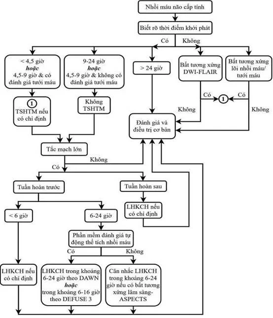
        

      

    

  

</section>

---

<section id="sec-hinh-anh-hoc-4p" class="guideline-section">
  <h2 class="section-title"><i class="fa-solid fa-x-ray"></i> 4. Hình Ảnh Học Thần Kinh 4P & Thang Điểm ASPECTS</h2>

  <h3 class="subsection-title">4.1. Mô Hình 4 Chữ P Trong Đánh Giá Hình Ảnh Học Đột Quỵ Cấp</h3>
  <ul>
    <li><strong>Parenchyma (Nhu mô):</strong> Loại trừ xuất huyết não, đánh giá mức độ lan rộng của tổn thương nhồi máu sớm (dấu hiệu xóa mờ rãnh cuộn não, ruy băng thùy đảo, xóa mờ nhân đậu), loại trừ tổn thương giả đột quỵ (u não, áp xe, viêm não).</li>
    <li><strong>Pipes (Hệ mạch máu):</strong> Khảo sát bằng CTA hoặc MRA từ quai động mạch chủ lên đến các nhánh nội sọ để phát hiện vị trí tắc mạch lớn (LVO: ICA, M1, M2, Basilar) và đánh giá tuần hoàn bàng hệ (Collaterals).</li>
    <li><strong>Perfusion (Tưới máu):</strong> Đo lường lưu lượng máu não (CBF), thể tích máu não (CBV), thời gian vận chuyển trung bình (MTT) và thời gian đạt nồng độ đỉnh (Tmax) để tính toán chính xác thể tích lõi hoại tử không hồi phục (<strong>Lõi = CBF &lt; 30%</strong> hoặc <strong>CBV &lt; 2 mL/100g</strong>).</li>
    <li><strong>Penumbra (Vùng tranh tối tranh sáng):</strong> Vùng mô não bị thiếu máu đe dọa (<strong>Tmax &gt; 6 giây</strong>) nhưng chưa hoại tử hoàn toàn. Vùng tranh tối tranh sáng được tính bằng hiệu số: <strong>Penumbra = Vùng giảm tưới máu (PWI) – Lõi hoại tử (DWI)</strong>.</li>
  </ul>

  <h3 class="subsection-title">4.2. Thang Điểm ASPECTS (Alberta Stroke Program Early CT Score)</h3>
  

    Áp dụng trên phim cắt lớp vi tính không tiêm thuốc cản quang đối với tuần hoàn não trước (vùng cấp máu của động mạch não giữa — MCA). Điểm số tối đa là <strong>10 điểm</strong> (nhu mô hoàn toàn bình thường); mỗi vùng trong số 10 vùng giải phẫu có dấu hiệu giảm đậm độ sớm sẽ bị trừ đi 1 điểm:
  

  <ul>
    <li><strong>Lát cắt mức hạch nền (Ganglionic level):</strong> 4 vùng sâu gồm Nhân đuôi (C), Nhân đậu (L), Bao trong (IC), Vỏ thùy đảo (I); và 3 vùng vỏ não MCA gồm M1 (vỏ não trước), M2 (vỏ não bên cạnh thùy đảo), M3 (vỏ não sau).</li>
    <li><strong>Lát cắt phía trên hạch nền (Supraganglionic level):</strong> 3 vùng vỏ não ở cao gồm M4, M5, M6.</li>
  </ul>

  

    
<i class="fa-solid fa-calculator"></i> Chỉ Định Lấy Huyết Khối Cơ Học Trong Cửa Sổ 6 Giờ Theo Điểm ASPECTS

    

      <ul>
        <li><strong>ASPECTS &ge; 6 điểm:</strong> Chỉ định can thiệp lấy huyết khối cơ học tuyệt đối (Class I, Level A).</li>
        <li><strong>ASPECTS 3 – 5 điểm (Lõi nhồi máu lớn):</strong> Cân nhắc chỉ định can thiệp sau khi đánh giá tỷ lệ Penumbra/Lõi và nguyện vọng của gia đình bệnh nhân.</li>
        <li><strong>ASPECTS 0 – 2 điểm:</strong> Tổn thương hoại tử nhu mô quá rộng, chống chỉ định can thiệp lấy huyết khối do nguy cơ xuất huyết chuyển dạng tử vong rất cao.</li>
      </ul>
    

  

  

    

      Hình Ảnh Tài Liệu Gốc
      Hình 7. Phân Vùng Giải Phẫu Của Thang Điểm ASPECTS 10 Vùng
    

    

      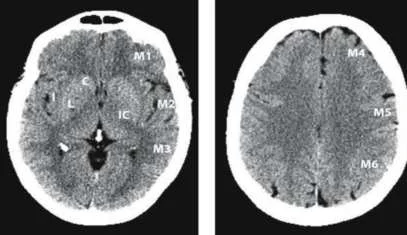
      

        <em>Hình 7: Phân vùng 10 khu vực giải phẫu của thang điểm ASPECTS trên lát cắt ngang nhân nền/đồi thị và lát cắt trên nhân nền. (Nguồn: Quyết định 3312/QĐ-BYT).</em>
      

    

  

  

    

      Lưu Đồ Tương Tác
      Hình 8. Lưu Đồ Sử Dụng Hình Ảnh Học Trong Đột Quỵ Nhồi Máu Não Cấp
    

    

      

  

    

      
        <svg width="18" height="18" viewBox="0 0 24 24" fill="none" stroke="currentColor" stroke-width="2"><rect x="3" y="3" width="18" height="18" rx="2"/><path d="M7 8h10M7 12h10M7 16h6"/></svg>
      
      Hình 8. Lưu Đồ Sử Dụng Hình Ảnh Học Trong Đột Quỵ Nhồi Máu Não Cấp
    

    QĐ 3312/BYT • Neuroimaging
  

  
  

    <svg class="med-svg" viewBox="0 0 940 590" width="100%" height="100%" preserveAspectRatio="xMidYMid meet">
  <defs>
    <marker id="arr-img" viewBox="0 0 10 10" refX="6" refY="5" markerWidth="6" markerHeight="6" orient="auto-start-reverse">
      <path d="M 0 1.5 L 8 5 L 0 8.5 z" fill="var(--color-text-muted, #64748b)" />
    </marker>
    <marker id="arr-img-act" viewBox="0 0 10 10" refX="6" refY="5" markerWidth="6" markerHeight="6" orient="auto-start-reverse">
      <path d="M 0 1.5 L 8 5 L 0 8.5 z" fill="var(--color-primary, #0284c7)" />
    </marker>
  </defs>

  <!-- Step 1: NCCT -->
  <g class="flow-node">
    <rect x="280" y="15" width="380" height="52" rx="8" fill="var(--color-primary-subtle, rgba(2,132,199,0.12))" stroke="var(--color-primary, #0284c7)" stroke-width="2"/>
    <text x="470" y="37" font-size="13.5" font-weight="700" fill="var(--color-primary, #0284c7)" text-anchor="middle">CLVT SỌ NÃO KHÔNG TIÊM THUỐC (NCCT)</text>
    <text x="470" y="54" font-size="11" fill="var(--color-text-muted, #64748b)" text-anchor="middle">Khảo sát đầu tay cấp cứu • Loại trừ 100% xuất huyết não</text>
  </g>

  <path d="M 470 67 L 470 95" fill="none" stroke="var(--color-primary, #0284c7)" stroke-width="2" marker-end="url(#arr-img-act)"/>

  <!-- Step 2: Early Ischemic Changes and ASPECTS -->
  <g class="flow-node">
    <rect x="250" y="95" width="440" height="56" rx="8" fill="var(--color-surface, #ffffff)" stroke="var(--color-primary, #0284c7)" stroke-width="1.8"/>
    <text x="470" y="118" font-size="13" font-weight="700" fill="var(--color-primary, #0284c7)" text-anchor="middle">Đánh Giá Dấu Hiệu Thiếu Máu Sớm &amp; ASPECTS</text>
    <text x="470" y="137" font-size="11" fill="var(--color-text, #334155)" text-anchor="middle">Mất dải vỏ đảo • Xóa rãnh cuộn não • Điểm ASPECTS (0 – 10)</text>
  </g>

  <!-- Split: IVT vs CTA -->
  <path d="M 330 151 L 200 151 L 200 185" fill="none" stroke="var(--color-success, #22c55e)" stroke-width="1.8" marker-end="url(#arr-img-act)"/>
  <path d="M 610 151 L 700 151 L 700 185" fill="none" stroke="var(--color-primary, #0284c7)" stroke-width="1.8" marker-end="url(#arr-img-act)"/>

  <!-- Left: IVT -->
  <g class="flow-node">
    <rect x="90" y="185" width="220" height="60" rx="8" fill="var(--color-success-subtle, rgba(34,197,94,0.12))" stroke="var(--color-success, #22c55e)" stroke-width="1.8"/>
    <text x="200" y="208" font-size="13" font-weight="700" fill="var(--color-success, #16a34a)" text-anchor="middle">TIÊU SỢI HUYẾT (IVT)</text>
    <text x="200" y="228" font-size="10.5" fill="var(--color-text-muted, #64748b)" text-anchor="middle">ASPECTS ≥ 7 • Cửa sổ ≤ 4.5h</text>
  </g>

  <!-- Right: CTA -->
  <g class="flow-node">
    <rect x="540" y="185" width="320" height="60" rx="8" fill="var(--color-primary-subtle, rgba(2,132,199,0.12))" stroke="var(--color-primary, #0284c7)" stroke-width="1.8"/>
    <text x="700" y="208" font-size="13" font-weight="700" fill="var(--color-primary, #0284c7)" text-anchor="middle">CẮT LỚP VI TÍNH MẠCH MÁU (CTA)</text>
    <text x="700" y="228" font-size="10.5" fill="var(--color-text-muted, #64748b)" text-anchor="middle">Tắc ĐM lớn (ICA, M1-M2, BA) • Tuần hoàn bàng hệ</text>
  </g>

  <!-- CTA to 3 Windows -->
  <path d="M 700 245 L 700 280 M 340 280 L 830 280" fill="none" stroke="var(--color-border, #cbd5e1)" stroke-width="1.8"/>
  <path d="M 340 280 L 340 310" fill="none" stroke="var(--color-border, #cbd5e1)" stroke-width="1.8" marker-end="url(#arr-img)"/>
  <path d="M 570 280 L 570 310" fill="none" stroke="var(--color-border, #cbd5e1)" stroke-width="1.8" marker-end="url(#arr-img)"/>
  <path d="M 800 280 L 800 310" fill="none" stroke="var(--color-border, #cbd5e1)" stroke-width="1.8" marker-end="url(#arr-img)"/>

  <!-- Window 1: <= 6h -->
  <g class="flow-node">
    <rect x="250" y="310" width="180" height="46" rx="6" fill="var(--color-surface, #ffffff)" stroke="var(--color-border, #cbd5e1)" stroke-width="1.5"/>
    <text x="340" y="331" font-size="12" font-weight="700" fill="var(--color-text, #334155)" text-anchor="middle">Cửa Sổ ≤ 6 Giờ</text>
    <text x="340" y="347" font-size="10" fill="var(--color-text-muted, #64748b)" text-anchor="middle">Đánh giá ASPECTS NCCT</text>
  </g>
  <path d="M 340 356 L 340 390" fill="none" stroke="var(--color-success, #22c55e)" stroke-width="1.5" marker-end="url(#arr-img-act)"/>
  <g class="flow-node">
    <rect x="250" y="390" width="180" height="70" rx="8" fill="var(--color-success-subtle, rgba(34,197,94,0.12))" stroke="var(--color-success, #22c55e)" stroke-width="1.8"/>
    <text x="340" y="413" font-size="12" font-weight="700" fill="var(--color-success, #16a34a)" text-anchor="middle">EVT Khẩn Cấp</text>
    <text x="340" y="431" font-size="10.5" fill="var(--color-text, #334155)" text-anchor="middle">ASPECTS ≥ 6: Can thiệp ngay</text>
    <text x="340" y="447" font-size="10" fill="var(--color-warning, #d97706)" text-anchor="middle">ASPECTS 3–5: Chọn lọc</text>
  </g>

  <!-- Window 2: 6 - 12h -->
  <g class="flow-node">
    <rect x="480" y="310" width="180" height="46" rx="6" fill="var(--color-surface, #ffffff)" stroke="var(--color-border, #cbd5e1)" stroke-width="1.5"/>
    <text x="570" y="331" font-size="12" font-weight="700" fill="var(--color-text, #334155)" text-anchor="middle">Cửa Sổ 6 – 12 Giờ</text>
    <text x="570" y="347" font-size="10" fill="var(--color-text-muted, #64748b)" text-anchor="middle">ASPECTS 3–5 hoặc &gt; 6</text>
  </g>
  <path d="M 570 356 L 570 390" fill="none" stroke="var(--color-warning, #f59e0b)" stroke-width="1.5" marker-end="url(#arr-img-act)"/>
  <g class="flow-node">
    <rect x="480" y="390" width="180" height="70" rx="8" fill="var(--color-warning-subtle, rgba(245,158,11,0.12))" stroke="var(--color-warning, #f59e0b)" stroke-width="1.8"/>
    <text x="570" y="413" font-size="12" font-weight="700" fill="var(--color-warning, #d97706)" text-anchor="middle">EVT Chọn Lọc</text>
    <text x="570" y="431" font-size="10.5" fill="var(--color-text, #334155)" text-anchor="middle">Hội chẩn chuyên gia</text>
    <text x="570" y="447" font-size="10" fill="var(--color-text-muted, #64748b)" text-anchor="middle">Bàng hệ tốt trên CTA</text>
  </g>

  <!-- Window 3: 6 - 24h Mismatch -->
  <g class="flow-node">
    <rect x="710" y="310" width="180" height="46" rx="6" fill="var(--color-surface, #ffffff)" stroke="var(--color-border, #cbd5e1)" stroke-width="1.5"/>
    <text x="800" y="331" font-size="12" font-weight="700" fill="var(--color-text, #334155)" text-anchor="middle">Cửa Sổ 6 – 24 Giờ</text>
    <text x="800" y="347" font-size="10" fill="var(--color-text-muted, #64748b)" text-anchor="middle">CTP / MRP Tưới Máu</text>
  </g>
  <path d="M 800 356 L 800 390" fill="none" stroke="var(--color-primary, #0284c7)" stroke-width="1.5" marker-end="url(#arr-img-act)"/>
  <g class="flow-node">
    <rect x="710" y="390" width="180" height="70" rx="8" fill="var(--color-primary-subtle, rgba(2,132,199,0.12))" stroke="var(--color-primary, #0284c7)" stroke-width="1.8"/>
    <text x="800" y="413" font-size="12" font-weight="700" fill="var(--color-primary, #0284c7)" text-anchor="middle">Tưới Máu Não Mismatch</text>
    <text x="800" y="431" font-size="10.5" fill="var(--color-text, #334155)" text-anchor="middle">Tỷ số Penumbra/Core ≥ 1.8</text>
    <text x="800" y="447" font-size="10" fill="var(--color-text-muted, #64748b)" text-anchor="middle">Và Lõi Core &lt; 70 ml</text>
  </g>

  <!-- Decision Mismatch to EVT or Med -->
  <path d="M 800 460 L 800 490" fill="none" stroke="var(--color-primary, #0284c7)" stroke-width="1.5" marker-end="url(#arr-img-act)"/>
  <g class="flow-node">
    <rect x="670" y="490" width="260" height="50" rx="6" fill="var(--color-success-subtle, rgba(34,197,94,0.12))" stroke="var(--color-success, #22c55e)" stroke-width="1.5"/>
    <text x="800" y="512" font-size="11.5" font-weight="700" fill="var(--color-success, #16a34a)" text-anchor="middle">Thỏa Mãn: Chỉ Định EVT Lấy Huyết Khối</text>
    <text x="800" y="528" font-size="10" fill="var(--color-danger, #ef4444)" text-anchor="middle">Không thỏa: Điều trị nội khoa tối ưu</text>
  </g>
</svg>
  

  

      

        
        NCCT & ASPECTS
      

      

        
        CTA & Chỉ định EVT
      

      

        
        Tưới máu não CTP/MRP 6-24h
      

  

      

        <em>Hình 8: Lưu đồ lựa chọn hình ảnh học: CT không cản quang loại trừ chảy máu &rarr; đánh giá ASPECTS &rarr; CTA tìm tắc mạch lớn trong cửa sổ &le; 6h; bắt buộc làm CT/MR tưới máu (Perfusion) khi bệnh nhân đến trong cửa sổ kéo dài 6 – 24h. (Nguồn: Quyết định 3312/QĐ-BYT).</em>
      

      

        

          <i class="fa-solid fa-image"></i> Đối chiếu hình ảnh lưu đồ gốc từ Quyết định 3312/QĐ-BYT
        

        

          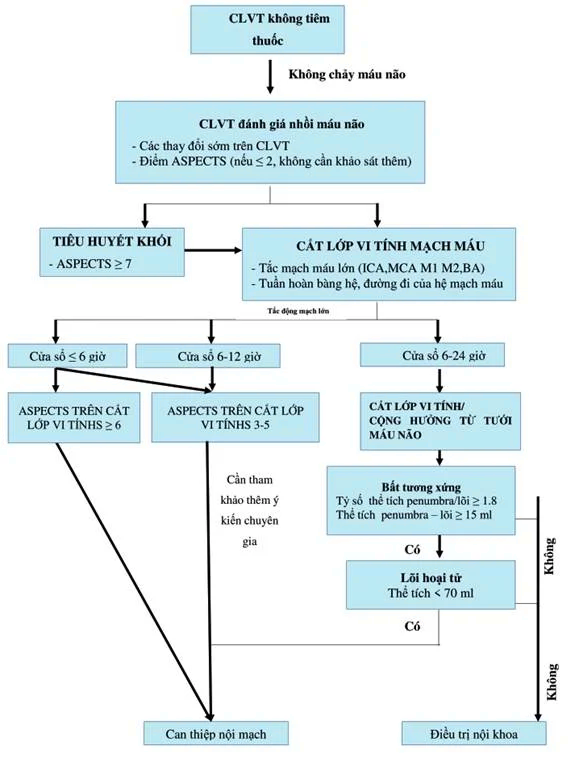
        

      

    

  

</section>

---

<section id="sec-tieu-soi-huyet" class="guideline-section">
  <h2 class="section-title"><i class="fa-solid fa-syringe"></i> 5. Liệu Pháp Tiêu Sợi Huyết Đường Tĩnh Mạch (rt-PA)</h2>

  <h3 class="subsection-title">5.1. Cơ Chế Tác Dụng & Các Chế Phẩm Thuốc</h3>
  

    Các thuốc tiêu huyết khối là chất hoạt hóa plasminogen mô tái tổ hợp (rt-PA), kích hoạt chuyển đổi plasminogen thành plasmin tự do. Plasmin cắt đứt mạng lưới polyme fibrin thành các mảnh thoái giáng fibrin (FDPs), làm tan cục huyết khối và tái lập lưu thông dòng máu não.
  

  

    

      Hình Ảnh Tài Liệu Gốc
      Hình 9. Cơ Chế Hoạt Động Của Thuốc Tiêu Huyết Khối (rt-PA)
    

    

      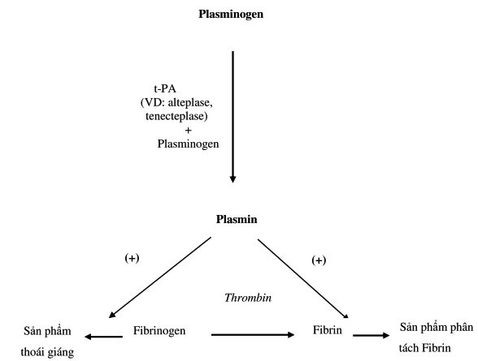
      

        <em>Hình 9: Con đường sinh hóa chuyển đổi Plasminogen thành Plasmin giúp phân giải mạng lưới Fibrin của cục huyết khối. (Nguồn: Quyết định 3312/QĐ-BYT).</em>
      

    

  

  

    <table class="table-custom">
      <thead>
        <tr>
          <th>Đặc Tính Kỹ Thuật</th>
          <th>Alteplase (Actilyse)</th>
          <th>Tenecteplase (TNK-tPA)</th>
        </tr>
      </thead>
      <tbody>
        <tr>
          <td><strong>Cấu trúc & Tính đặc hiệu Fibrin</strong></td>
          <td>rt-PA nguyên bản thế hệ một; gắn vừa phải với fibrin.</td>
          <td>Đột biến biến đổi 3 vị trí acid amin; <strong>đặc hiệu với fibrin gấp 14 lần</strong> so với Alteplase.</td>
        </tr>
        <tr>
          <td><strong>Thời gian bán thải</strong></td>
          <td>Rất ngắn (4 – 6 phút). Bắt buộc phải duy trì truyền tĩnh mạch liên tục trong 1 giờ.</td>
          <td>Kéo dài (20 – 24 phút). <strong>Cho phép tiêm tĩnh mạch một liều bolus duy nhất trong 5 – 10 giây</strong>.</td>
        </tr>
        <tr>
          <td><strong>Liều lượng khuyến cáo</strong></td>
          <td>
            <strong>Liều chuẩn: 0.9 mg/kg</strong> (tối đa 90 mg). Tiêm bolus tĩnh mạch 10% trong 1 phút, truyền tĩnh mạch 90% còn lại trong 60 phút. 
            <em>Liều thấp (Châu Á / nguy cơ xuất huyết cao):</em> <strong>0.6 mg/kg</strong> (tối đa 60 mg, 15% bolus, 85% truyền 60 phút).
          </td>
          <td>
            <strong>0.25 mg/kg</strong> (tối đa 25 mg) tiêm tĩnh mạch bolus 1 lần duy nhất. 
            <em>Ưu tiên chỉ định vượt trội:</em> Rất thuận lợi cho việc chuyển tuyến và là lựa chọn ưu tiên trước khi can thiệp lấy huyết khối cơ học.
          </td>
        </tr>
      </tbody>
    </table>
  

  <h3 class="subsection-title">5.2. Tiêu Chuẩn Chỉ Định, Chống Chỉ Định & Đích Thời Gian</h3>
  <ul>
    <li><strong>Cửa sổ điều trị chuẩn:</strong> Khởi phát trong vòng <strong>4.5 giờ (270 phút)</strong> tính từ thời điểm khởi phát triệu chứng hoặc thời điểm cuối cùng bệnh nhân còn bình thường.</li>
    <li><strong>Đích thời gian vàng:</strong> Đích thời gian cửa - kim (Door-to-needle time) <strong>&le; 60 phút</strong> từ lúc tiếp nhận; tại các trung tâm đột quỵ chuyên sâu cần phấn đấu đạt <strong>&le; 45 hoặc &le; 30 phút</strong>.</li>
    <li><strong>Mở rộng cửa sổ tiêu sợi huyết (4.5 – 9 giờ & Đột quỵ thức giấc):</strong> <em>Đột quỵ thức giấc (Wake-up stroke):</em> Chỉ định dựa trên tiêu chuẩn <strong>Bất tương xứng DWI-FLAIR (DWI-FLAIR Mismatch)</strong> trên MRI (tổn thương rõ trên DWI nhưng chưa xuất hiện trên FLAIR, chứng tỏ nhồi máu mới xuất hiện &lt; 4.5 giờ); <em>Cửa sổ 4.5 – 9 giờ:</em> Chỉ định khi có hình ảnh tưới máu não tự động (CTP/PWI) đáp ứng tiêu chuẩn lõi hoại tử &lt; 70 mL, tỷ lệ Penumbra/Lõi &gt; 1.2 và thể tích Penumbra &gt; 10 mL.</li>
    <li><strong>Các chống chỉ định tuyệt đối sống còn:</strong> Tiền sử xuất huyết não hoặc có hình ảnh xuất huyết trên CT/MRI cấp; Chấn thương đầu nặng hoặc phẫu thuật sọ não/cột sống trong vòng 3 tháng; Huyết áp không hạ được xuống dưới 185/110 mmHg dù đã dùng thuốc hạ áp tĩnh mạch; Đang dùng thuốc chống đông có <strong>INR &gt; 1.7</strong>, dùng NOAC trong 48 giờ, hoặc Heparin có aPTT kéo dài &gt; 40 giây; Số lượng tiểu cầu <strong>&lt; 100 &times; 10⁹/L</strong>; nồng độ Glucose máu &lt; 50 mg/dL (&lt; 2.7 mmol/L).</li>
  </ul>

  <h3 class="subsection-title">5.3. Xử Trí Tai Biến Chảy Máu Não Có Triệu Chứng Sau Tiêu Sợi Huyết</h3>
  

    Khi bệnh nhân đột ngột đau đầu dữ dội, nôn mửa, huyết áp tăng vọt hoặc điểm NIHSS tăng &ge; 4 điểm: <strong>Dừng ngay lập tức dịch truyền rt-PA</strong> và chụp CT sọ khẩn cấp:
  

  <ul>
    <li>Truyền <strong>Tủa lạnh (Cryoprecipitate) 10 đơn vị (300 – 400 mL)</strong> truyền trong 10 – 30 phút; duy trì đích nồng độ Fibrinogen máu &gt; 150 mg/dL.</li>
    <li>Truyền <strong>Axit Tranexamic 1000 mg</strong> truyền tĩnh mạch chậm trong 10 phút.</li>
    <li>Hội chẩn phẫu thuật thần kinh khẩn cấp để mở sọ giải áp hoặc dẫn lưu não thất nếu khối máu tụ lớn gây thoát vị.</li>
  </ul>
</section>

---

<section id="sec-lay-huyet-khoi-co-hoc" class="guideline-section">
  <h2 class="section-title"><i class="fa-solid fa-code-branch"></i> 6. Can Thiệp Lấy Huyết Khối Cơ Học Nội Mạch (LHKCH)</h2>

  <h3 class="subsection-title">6.1. Tiêu Chuẩn Chỉ Định Can Thiệp</h3>
  <ul>
    <li><strong>Cửa sổ chuẩn &le; 6 giờ đầu:</strong> Tuổi &ge; 18, điểm mRS trước đột quỵ &le; 1; Tắc động mạch lớn tuần hoàn trước (ICA đoạn tận, M1/M2 MCA, A1/A2 ACA); Điểm <strong>NIHSS &ge; 6 điểm</strong> và điểm <strong>ASPECTS &ge; 6 điểm</strong> trên CT không cản quang.</li>
    <li><strong>Cửa sổ mở rộng 6 – 24 giờ đầu:</strong> <em>Tiêu chuẩn DAWN (6 – 24 giờ):</em> Bất tương xứng NIHSS và thể tích lõi hoại tử trên CTP/DWI (&ge; 80 tuổi: NIHSS &ge; 10 và lõi &lt; 21 mL; &lt; 80 tuổi: NIHSS &ge; 10 và lõi &lt; 31 mL, hoặc NIHSS &ge; 20 và lõi &lt; 51 mL); <em>Tiêu chuẩn DEFUSE 3 (6 – 16 giờ):</em> Tuổi 18 – 90, NIHSS &ge; 6, thể tích lõi &lt; 70 mL, thể tích Penumbra &ge; 15 mL và tỷ số Penumbra/Lõi &ge; 1.8.</li>
    <li><strong>Tắc động mạch thân nền (Tuần hoàn sau):</strong> Chỉ định lấy huyết khối cơ học trong cửa sổ <strong>12 – 24 giờ</strong> cho bệnh nhân có NIHSS &ge; 6 điểm để cứu sống thân não.</li>
  </ul>

  <h3 class="subsection-title">6.2. Kỹ Thuật Can Thiệp & Đánh Giá Tái Thông Theo Thang Điểm mTICI</h3>
  

    Sử dụng kỹ thuật hút huyết khối bằng ống hút áp lực âm trực tiếp (Aspiration), sử dụng khung giá kéo huyết khối (Stent retriever), hoặc kỹ thuật phối hợp (Solumbra / CAPTIVE).
  

  <ul>
    <li><strong>mTICI 0:</strong> Không tái thông.</li>
    <li><strong>mTICI 1:</strong> Thuốc qua chỗ tắc nhưng không tưới máu được nhánh xa.</li>
    <li><strong>mTICI 2a:</strong> Tái tưới máu &lt; 50% vùng mạch mục tiêu.</li>
    <li><strong>mTICI 2b:</strong> Tái tưới máu &ge; 50% vùng mạch mục tiêu.</li>
    <li><strong>mTICI 3:</strong> Tái tưới máu hoàn toàn 100% vùng mạch mục tiêu.</li>
    <li><strong>Đích tái thông thành công:</strong> Bắt buộc đạt mức độ từ <strong>mTICI 2b đến mTICI 3</strong>.</li>
  </ul>
</section>

---

<section id="sec-chay-mau-nao" class="guideline-section">
  <h2 class="section-title"><i class="fa-solid fa-droplet"></i> 7. Chảy Máu Não Tự Phát: Kiểm Soát Huyết Áp Cấp & Thang Điểm Tiên Lượng ICH</h2>

  <h3 class="subsection-title">7.1. Chẩn Đoán & Công Thức Đo Thể Tích Khối Máu Tụ (Broderick)</h3>
  

    Chụp CT sọ não không cản quang hiển thị khối máu tụ tăng tỷ trọng tự nhiên (55 – 90 HU). Thể tích khối máu tụ được tính toán theo công thức kinh điển Broderick ABC/2:
  

  

    <strong>V (mL) = ( A × B × C ) / 2</strong>
  

  <ul>
    <li><strong>A:</strong> Đường kính lớn nhất của ổ máu tụ trên lát cắt có diện tích lớn nhất (cm).</li>
    <li><strong>B:</strong> Đường kính lớn nhất vuông góc với đường kính A trên cùng lát cắt đó (cm).</li>
    <li><strong>C:</strong> Độ dày của mỗi lát cắt nhân với số lát cắt quan sát thấy khối máu tụ (cm).</li>
  </ul>

  <h3 class="subsection-title">7.2. Kiểm Soát Huyết Áp Khẩn Cấp Trong Chảy Máu Não</h3>
  <ul>
    <li><strong>Cửa sổ vàng can thiệp:</strong> Cần bắt đầu hạ huyết áp sớm nhất có thể, tối ưu là <strong>trong vòng 2 giờ đầu</strong> kể từ khi khởi phát xuất huyết não để ngăn chặn hiện tượng khối máu tụ tiếp tục lan rộng (Hematoma expansion).</li>
    <li><strong>Mục tiêu huyết áp trong 6 giờ đầu:</strong> Hạ và duy trì <strong>130 mmHg &lt; HATT &lt; 150 mmHg</strong>.</li>
    <li><strong>Nguyên tắc an toàn:</strong> Không được hạ HATT giảm quá 90 mmHg so với trị số ban đầu; duy trì huyết áp ổn định không dao động liên tục trong ít nhất <strong>7 ngày</strong>.</li>
  </ul>

  <h3 class="subsection-title">7.3. Đảo Ngược Thuốc Chống Đông Tức Thời (Anticoagulation Reversal)</h3>
  

    <table class="table-custom">
      <thead>
        <tr>
          <th>Thuốc Chống Đông Đang Dùng</th>
          <th>Tác Nhân Đảo Ngược Khuyến Cáo</th>
          <th>Liều Lượng Chuẩn</th>
          <th>Mục Tiêu Cầm Máu</th>
        </tr>
      </thead>
      <tbody>
        <tr>
          <td><strong>Kháng Vitamin K (Warfarin, Sintrom)</strong></td>
          <td><strong>Phức hợp Prothrombin cô đặc (PCC 4 yếu tố)</strong> kết hợp <strong>Vitamin K1</strong> tiêm tĩnh mạch chậm.</td>
          <td>PCC: <strong>25 – 50 U/kg</strong> tiêm tĩnh mạch; Vitamin K1: 10 mg tiêm TM chậm.</td>
          <td>Đưa <strong>INR &lt; 1.3</strong> trong vòng vài phút.</td>
        </tr>
        <tr>
          <td><strong>Dabigatran (Kháng Thrombin trực tiếp)</strong></td>
          <td><strong>Idarucizumab (Praxbind)</strong> (Kháng thể đơn dòng Fab).</td>
          <td><strong>5g tiêm tĩnh mạch</strong> (chia làm 2 liều bolus 2.5g nối tiếp nhau).</td>
          <td>Trung hòa 100% hoạt tính Dabigatran ngay lập tức.</td>
        </tr>
        <tr>
          <td><strong>Thuốc Kháng Yếu Tố Xa (Rivaroxaban, Apixaban)</strong></td>
          <td><strong>PCC 4 yếu tố</strong> (hoặc Andexanet alfa nếu có sẵn).</td>
          <td>PCC: <strong>50 U/kg</strong> tiêm tĩnh mạch.</td>
          <td>Kích hoạt đông máu phụ thuộc yếu tố hạ lưu.</td>
        </tr>
        <tr>
          <td><strong>Heparin không phân đoạn (UFH) / Trọng lượng phân tử thấp (LMWH)</strong></td>
          <td><strong>Protamine Sulfat</strong></td>
          <td>1 mg Protamine trung hòa 100 UI Heparin dùng trong 2 – 4 giờ trước.</td>
          <td>Bình thường hóa aPTT.</td>
        </tr>
      </tbody>
    </table>
  

  <h3 class="subsection-title">7.4. Tiên Lượng Tử Vong 30 Ngày Bằng Thang Điểm ICH (ICH Score)</h3>
  

    <table class="table-custom">
      <thead>
        <tr>
          <th>Tiêu Chí Đánh Giá</th>
          <th>Phân Tầng Lâm Sàng</th>
          <th>Điểm Số</th>
        </tr>
      </thead>
      <tbody>
        <tr>
          <td><strong>Điểm hôn mê Glasgow (GCS)</strong></td>
          <td>GCS 3 – 4 / GCS 5 – 12 / GCS 13 – 15</td>
          <td><strong>2 điểm</strong> / <strong>1 điểm</strong> / <strong>0 điểm</strong></td>
        </tr>
        <tr>
          <td><strong>Thể tích khối máu tụ</strong></td>
          <td>&ge; 30 mL / &lt; 30 mL</td>
          <td><strong>1 điểm</strong> / <strong>0 điểm</strong></td>
        </tr>
        <tr>
          <td><strong>Máu tràn vào não thất (IVH)</strong></td>
          <td>Có / Không</td>
          <td><strong>1 điểm</strong> / <strong>0 điểm</strong></td>
        </tr>
        <tr>
          <td><strong>Vị trí khối máu tụ</strong></td>
          <td>Dưới lều (thân não, tiểu não) / Trên lều</td>
          <td><strong>1 điểm</strong> / <strong>0 điểm</strong></td>
        </tr>
        <tr>
          <td><strong>Tuổi bệnh nhân</strong></td>
          <td>&ge; 80 tuổi / &lt; 80 tuổi</td>
          <td><strong>1 điểm</strong> / <strong>0 điểm</strong></td>
        </tr>
      </tbody>
    </table>
  

  

    <strong>Tương quan tỷ lệ tử vong 30 ngày:</strong> 0 điểm = 0%; 1 điểm = 13%; 2 điểm = 26%; 3 điểm = 72%; 4 điểm = 97%; 5 – 6 điểm = 100%.
  

</section>

---

<section id="sec-phinh-mach-nao" class="guideline-section">
  <h2 class="section-title"><i class="fa-solid fa-circle-radiation"></i> 8. Phình Động Mạch Não Vỡ (SAH) & Chưa Vỡ (UIAs)</h2>

  <h3 class="subsection-title">8.1. Phình Động Mạch Não Vỡ & Chảy Máu Dưới Nhện</h3>
  <ul>
    <li><strong>Lâm sàng:</strong> Cơn đau đầu bùng nổ dữ dội kiểu sét đánh (Thunderclap headache), cứng gáy, nôn vọt, rối loạn ý thức.</li>
    <li><strong>Chẩn đoán:</strong> CT sọ không cản quang phát hiện 99% trong 24 giờ đầu. Nếu CT âm tính nhưng lâm sàng nghi ngờ rất cao, <strong>bắt buộc chọc dịch não tủy</strong> tìm hồng cầu không đông qua 3 ống nghiệm hoặc sắc tố vàng (Xanthochromia). Chụp mạch DSA là tiêu chuẩn vàng.</li>
    <li><strong>Kiểm soát tối cấp:</strong> Hạ huyết áp tâm thu xuống <strong>&lt; 160 mmHg (hoặc HATB &lt; 110 mmHg)</strong> bằng Nicardipine trước khi bít tắc túi phình; Chống co thắt mạch: <strong>Nimodipine 60 mg uống mỗi 4 giờ</strong> (đến hết ngày 21); Bít tắc túi phình sớm bằng can thiệp Coiling hoặc phẫu thuật Clipping trong <strong>24 – 72 giờ đầu</strong> để phòng ngừa biến cố chảy máu tái phát.</li>
  </ul>

  

    

      Lưu Đồ Tương Tác
      Hình 10. Lưu Đồ Chẩn Đoán & Điều Trị Vỡ Phình Mạch Não (De Oliveira Manoel)
    

    

      

  

    

      
        <svg width="18" height="18" viewBox="0 0 24 24" fill="none" stroke="currentColor" stroke-width="2"><rect x="3" y="3" width="18" height="18" rx="2"/><path d="M7 8h10M7 12h10M7 16h6"/></svg>
      
      Hình 10. Lưu Đồ Chẩn Đoán & Điều Trị Vỡ Phình Mạch Não (De Oliveira Manoel)
    

    De Oliveira Manoel / AHA SAH
  

  
  

    <svg class="med-svg" viewBox="0 0 880 580" width="100%" height="100%" preserveAspectRatio="xMidYMid meet">
  <defs>
    <marker id="arr-sah" viewBox="0 0 10 10" refX="6" refY="5" markerWidth="6" markerHeight="6" orient="auto-start-reverse">
      <path d="M 0 1.5 L 8 5 L 0 8.5 z" fill="var(--color-text-muted, #64748b)" />
    </marker>
    <marker id="arr-sah-act" viewBox="0 0 10 10" refX="6" refY="5" markerWidth="6" markerHeight="6" orient="auto-start-reverse">
      <path d="M 0 1.5 L 8 5 L 0 8.5 z" fill="var(--color-primary, #0284c7)" />
    </marker>
  </defs>

  <!-- Root -->
  <g class="flow-node">
    <rect x="210" y="15" width="460" height="56" rx="8" fill="var(--color-primary-subtle, rgba(2,132,199,0.12))" stroke="var(--color-primary, #0284c7)" stroke-width="2"/>
    <text x="440" y="37" font-size="13.5" font-weight="700" fill="var(--color-primary, #0284c7)" text-anchor="middle">NGHI NGỜ VỠ PHÌNH ĐỘNG MẠCH NÃO (SAH)</text>
    <text x="440" y="55" font-size="11" fill="var(--color-text-muted, #64748b)" text-anchor="middle">Đau đầu sét đánh (Thunderclap) • Cứng gáy • Rối loạn ý thức cấp</text>
  </g>

  <path d="M 440 71 L 440 98" fill="none" stroke="var(--color-primary, #0284c7)" stroke-width="2" marker-end="url(#arr-sah-act)"/>

  <!-- Step 2: NCCT -->
  <g class="flow-node">
    <rect x="240" y="98" width="400" height="50" rx="8" fill="var(--color-surface, #ffffff)" stroke="var(--color-primary, #0284c7)" stroke-width="1.8"/>
    <text x="440" y="120" font-size="13" font-weight="700" fill="var(--color-primary, #0284c7)" text-anchor="middle">Chụp CLVT Sọ Não Không Tiêm Thuốc (NCCT) Cấp</text>
    <text x="440" y="137" font-size="10.5" fill="var(--color-text-muted, #64748b)" text-anchor="middle">Độ nhạy &gt; 98% trong 6 – 12 giờ đầu</text>
  </g>

  <path d="M 440 148 L 440 175" fill="none" stroke="var(--color-primary, #0284c7)" stroke-width="2" marker-end="url(#arr-sah-act)"/>

  <!-- Decision: SAH blood on NCCT? -->
  <g class="flow-node">
    <polygon points="440,175 620,210 440,245 260,210" fill="var(--color-warning-subtle, rgba(245,158,11,0.12))" stroke="var(--color-warning, #f59e0b)" stroke-width="2"/>
    <text x="440" y="206" font-size="12" font-weight="700" fill="var(--color-warning, #d97706)" text-anchor="middle">Thấy Máu Trong Khoang</text>
    <text x="440" y="222" font-size="10.5" fill="var(--color-text-muted, #64748b)" text-anchor="middle">Dưới Nhện (SAH)?</text>
  </g>

  <!-- Left: Neg -> LP -->
  <path d="M 260 210 L 150 210 L 150 260" fill="none" stroke="var(--color-warning, #f59e0b)" stroke-width="1.8" marker-end="url(#arr-sah-act)"/>
  <g>
    <rect x="165" y="198" width="65" height="20" rx="4" fill="var(--color-surface, #ffffff)" stroke="var(--color-border, #cbd5e1)" stroke-width="1"/>
    <text x="197" y="212" font-size="10" font-weight="600" fill="var(--color-warning, #d97706)" text-anchor="middle">Âm tính (-)</text>
  </g>
  <g class="flow-node">
    <rect x="40" y="260" width="220" height="70" rx="8" fill="var(--color-warning-subtle, rgba(245,158,11,0.12))" stroke="var(--color-warning, #f59e0b)" stroke-width="1.8"/>
    <text x="150" y="283" font-size="12" font-weight="700" fill="var(--color-warning, #d97706)" text-anchor="middle">Chọc Dò Dịch Não Tủy (LP)</text>
    <text x="150" y="301" font-size="10" fill="var(--color-text, #334155)" text-anchor="middle">Thực hiện sau 6–12h tìm Xanthochromia</text>
    <text x="150" y="317" font-size="9.5" fill="var(--color-text-muted, #64748b)" text-anchor="middle">Âm tính: Loại trừ SAH • (+) Tiếp tục</text>
  </g>

  <!-- Right: Pos -> Confirmed SAH -->
  <path d="M 620 210 L 710 210 L 710 260" fill="none" stroke="var(--color-danger, #ef4444)" stroke-width="1.8" marker-end="url(#arr-sah-act)"/>
  <g>
    <rect x="635" y="198" width="70" height="20" rx="4" fill="var(--color-surface, #ffffff)" stroke="var(--color-border, #cbd5e1)" stroke-width="1"/>
    <text x="670" y="212" font-size="10" font-weight="600" fill="var(--color-danger, #ef4444)" text-anchor="middle">Dương tính (+)</text>
  </g>
  <g class="flow-node">
    <rect x="580" y="260" width="260" height="70" rx="8" fill="var(--color-danger-subtle, rgba(239,68,68,0.12))" stroke="var(--color-danger, #ef4444)" stroke-width="1.8"/>
    <text x="710" y="283" font-size="12.5" font-weight="700" fill="var(--color-danger, #ef4444)" text-anchor="middle">Xác Định Xuất Huyết Dưới Nhện</text>
    <text x="710" y="301" font-size="10.5" fill="var(--color-text, #334155)" text-anchor="middle">Kiểm soát HA tâm thu &lt; 160 mmHg</text>
    <text x="710" y="317" font-size="10" fill="var(--color-danger, #ef4444)" text-anchor="middle">Nimodipine 60mg mỗi 4h phòng co thắt</text>
  </g>

  <!-- LP pos connects to Angiography -->
  <path d="M 150 330 L 150 355 L 440 355" fill="none" stroke="var(--color-border, #cbd5e1)" stroke-width="1.8"/>
  <path d="M 710 330 L 710 355 L 440 355" fill="none" stroke="var(--color-border, #cbd5e1)" stroke-width="1.8"/>
  <path d="M 440 355 L 440 375" fill="none" stroke="var(--color-primary, #0284c7)" stroke-width="2" marker-end="url(#arr-sah-act)"/>

  <!-- Step: Angiography -->
  <g class="flow-node">
    <rect x="250" y="375" width="380" height="50" rx="8" fill="var(--color-surface, #ffffff)" stroke="var(--color-primary, #0284c7)" stroke-width="1.8"/>
    <text x="440" y="397" font-size="13" font-weight="700" fill="var(--color-primary, #0284c7)" text-anchor="middle">Chụp Mạch Máu Não (CTA và/hoặc DSA)</text>
    <text x="440" y="414" font-size="10.5" fill="var(--color-text-muted, #64748b)" text-anchor="middle">Xác định vị trí, kích thước, cổ túi phình và giải phẫu tuần hoàn</text>
  </g>

  <!-- Split: Coiling vs Clipping -->
  <path d="M 440 425 L 440 445 M 270 445 L 610 445" fill="none" stroke="var(--color-border, #cbd5e1)" stroke-width="1.8"/>
  <path d="M 270 445 L 270 465" fill="none" stroke="var(--color-border, #cbd5e1)" stroke-width="1.8" marker-end="url(#arr-sah)"/>
  <path d="M 610 445 L 610 465" fill="none" stroke="var(--color-border, #cbd5e1)" stroke-width="1.8" marker-end="url(#arr-sah)"/>

  <!-- Coiling -->
  <g class="flow-node">
    <rect x="160" y="465" width="220" height="65" rx="8" fill="var(--color-success-subtle, rgba(34,197,94,0.12))" stroke="var(--color-success, #22c55e)" stroke-width="1.8"/>
    <text x="270" y="488" font-size="12" font-weight="700" fill="var(--color-success, #16a34a)" text-anchor="middle">1. Coiling Nội Mạch Qua Da</text>
    <text x="270" y="506" font-size="10.5" fill="var(--color-text, #334155)" text-anchor="middle">Thả vòng xoắn kim loại nút tắc</text>
    <text x="270" y="520" font-size="10" fill="var(--color-text-muted, #64748b)" text-anchor="middle">Ưu tiên cao tuổi, tuần hoàn sau</text>
  </g>

  <!-- Clipping -->
  <g class="flow-node">
    <rect x="500" y="465" width="220" height="65" rx="8" fill="var(--color-primary-subtle, rgba(2,132,199,0.12))" stroke="var(--color-primary, #0284c7)" stroke-width="1.8"/>
    <text x="610" y="488" font-size="12" font-weight="700" fill="var(--color-primary, #0284c7)" text-anchor="middle">2. Phẫu Thuật Kẹp Cổ (Clipping)</text>
    <text x="610" y="506" font-size="10.5" fill="var(--color-text, #334155)" text-anchor="middle">Mở nắp sọ vi phẫu kẹp cổ</text>
    <text x="610" y="520" font-size="10" fill="var(--color-text-muted, #64748b)" text-anchor="middle">Ưu tiên người trẻ, MCA, máu tụ lớn</text>
  </g>

  <!-- Timing bottom -->
  <path d="M 270 530 L 270 545 L 440 545" fill="none" stroke="var(--color-border, #cbd5e1)" stroke-width="1.5"/>
  <path d="M 610 530 L 610 545 L 440 545" fill="none" stroke="var(--color-border, #cbd5e1)" stroke-width="1.5"/>
  <path d="M 440 545 L 440 555" fill="none" stroke="var(--color-primary, #0284c7)" stroke-width="1.5"/>
  <text x="440" y="570" font-size="11" font-weight="700" fill="var(--color-danger, #ef4444)" text-anchor="middle">BẮT BUỘC TIẾN HÀNH BÍT TẮC TÚI PHÌNH TRONG VÒNG 24 – 72 GIỜ ĐẦU!</text>
</svg>
  

  

      

        
        Chẩn đoán hình ảnh NCCT / LP
      

      

        
        Kiểm soát cấp cứu HA & Nimodipine
      

      

        
        Can thiệp nút túi phình trong 24-72h
      

  

      

        <em>Hình 10: Quy trình từ CT sọ não, chọc dịch não tủy khi CT âm tính, chụp mạch CTA/DSA và chụp lại sau 1 – 3 tuần để loại trừ co thắt mạch che lấp túi phình. (Nguồn: Quyết định 3312/QĐ-BYT).</em>
      

      

        

          <i class="fa-solid fa-image"></i> Đối chiếu hình ảnh lưu đồ gốc từ Quyết định 3312/QĐ-BYT
        

        

          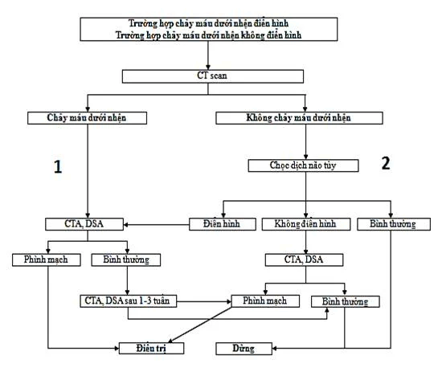
        

      

    

  

  <h3 class="subsection-title">8.2. Phình Động Mạch Não Chưa Vỡ (UIAs) & Thang Điểm PHASES</h3>
  <ul>
    <li>Phần lớn không triệu chứng; dấu hiệu cảnh báo chèn ép thần kinh sọ gồm: <strong>Chèn ép dây III gây sụp mi và giãn đồng tử</strong> (phình PcomA — dọa vỡ khẩn), chèn ép dây II gây bán manh/giảm thị lực (phình AcomA lớn).</li>
    <li><strong>Thang điểm PHASES:</strong> Lượng giá nguy cơ vỡ túi phình trong 5 năm (dựa trên Phân bố địa lý, Huyết áp, Tuổi &ge; 70, Kích thước túi phình, Tiền sử vỡ túi phình khác, và Vị trí túi phình).</li>
  </ul>
</section>

---

<section id="sec-hktmn" class="guideline-section">
  <h2 class="section-title"><i class="fa-solid fa-network-wired"></i> 9. Huyết Khối Tĩnh Mạch Não (HKTMN / CVST)</h2>

  <h3 class="subsection-title">9.1. Dịch Tễ & Đặc Điểm Hình Ảnh Học</h3>
  <ul>
    <li>Chiếm 0.5 – 1% các ca đột quỵ; gặp chủ yếu ở người trẻ tuổi (tuổi trung bình 33 tuổi), <strong>nữ giới chiếm 2/3 trường hợp</strong>, liên quan đến thai kỳ, thời kỳ hậu sản, dùng thuốc tránh thai chứa estrogen, hoặc hội chứng tăng đông máu.</li>
    <li><strong>Hình ảnh học:</strong> 30% phim CT thường hoàn toàn bình thường. Dấu hiệu chỉ điểm trên CTV là <strong>Dấu hiệu Delta rỗng (Empty delta sign)</strong> do khuyết thuốc cản quang trung tâm bao quanh bởi màng não cứng ngấm thuốc. MRI xung MRV là phương pháp có độ nhạy và độ đặc hiệu cao nhất.</li>
  </ul>

  

    

      Lưu Đồ Tương Tác
      Hình 11. Lưu Đồ Chẩn Đoán & Điều Trị Huyết Khối Tĩnh Mạch Não (AHA/ASA)
    

    

      

  

    

      
        <svg width="18" height="18" viewBox="0 0 24 24" fill="none" stroke="currentColor" stroke-width="2"><rect x="3" y="3" width="18" height="18" rx="2"/><path d="M7 8h10M7 12h10M7 16h6"/></svg>
      
      Hình 11. Lưu Đồ Chẩn Đoán & Điều Trị Huyết Khối Tĩnh Mạch Não (AHA/ASA)
    

    AHA/ASA • CVST Protocol
  

  
  

    <svg class="med-svg" viewBox="0 0 860 480" width="100%" height="100%" preserveAspectRatio="xMidYMid meet">
  <defs>
    <marker id="arr-cvst" viewBox="0 0 10 10" refX="6" refY="5" markerWidth="6" markerHeight="6" orient="auto-start-reverse">
      <path d="M 0 1.5 L 8 5 L 0 8.5 z" fill="var(--color-text-muted, #64748b)" />
    </marker>
    <marker id="arr-cvst-act" viewBox="0 0 10 10" refX="6" refY="5" markerWidth="6" markerHeight="6" orient="auto-start-reverse">
      <path d="M 0 1.5 L 8 5 L 0 8.5 z" fill="var(--color-primary, #0284c7)" />
    </marker>
  </defs>

  <!-- Root -->
  <g class="flow-node">
    <rect x="200" y="15" width="460" height="55" rx="8" fill="var(--color-primary-subtle, rgba(2,132,199,0.12))" stroke="var(--color-primary, #0284c7)" stroke-width="2"/>
    <text x="430" y="37" font-size="13.5" font-weight="700" fill="var(--color-primary, #0284c7)" text-anchor="middle">NGHI NGỜ HUYẾT KHỐI TĨNH MẠCH NÃO (CVST)</text>
    <text x="430" y="55" font-size="11" fill="var(--color-text-muted, #64748b)" text-anchor="middle">Đau đầu tiến triển • Phù gai thị • Co giật • Thai kỳ / Thuốc tránh thai</text>
  </g>

  <path d="M 430 70 L 430 98" fill="none" stroke="var(--color-primary, #0284c7)" stroke-width="2" marker-end="url(#arr-cvst-act)"/>

  <!-- Step 2: MRV / CTV -->
  <g class="flow-node">
    <rect x="180" y="98" width="500" height="50" rx="8" fill="var(--color-surface, #ffffff)" stroke="var(--color-primary, #0284c7)" stroke-width="1.8"/>
    <text x="430" y="120" font-size="13" font-weight="700" fill="var(--color-primary, #0284c7)" text-anchor="middle">Chụp Cắt Lớp Tĩnh Mạch (CTV) Hoặc MRI Tĩnh Mạch (MRV)</text>
    <text x="430" y="137" font-size="10.5" fill="var(--color-text-muted, #64748b)" text-anchor="middle">Tìm khuyết thuốc xoang tĩnh mạch (Empty Delta Sign), phù não &amp; xuất huyết</text>
  </g>

  <path d="M 430 148 L 430 178" fill="none" stroke="var(--color-danger, #ef4444)" stroke-width="2" marker-end="url(#arr-cvst-act)"/>

  <!-- Step 3: Anticoagulation Mandate -->
  <g class="flow-node">
    <rect x="100" y="178" width="660" height="75" rx="10" fill="var(--color-danger-subtle, rgba(239,68,68,0.12))" stroke="var(--color-danger, #ef4444)" stroke-width="2"/>
    <text x="430" y="202" font-size="13.5" font-weight="700" fill="var(--color-danger, #ef4444)" text-anchor="middle">KHỞI ĐỘNG CHỐNG ĐÔNG NGAY LẬP TỨC TRONG GIAI ĐOẠN CẤP</text>
    <text x="430" y="222" font-size="11" font-weight="600" fill="var(--color-text, #334155)" text-anchor="middle">LMWH (Enoxaparin 1 mg/kg x 2 lần/ngày) hoặc UFH truyền TM chỉnh theo aPTT</text>
    <text x="430" y="240" font-size="11" font-weight="700" fill="var(--color-danger, #ef4444)" text-anchor="middle">BẮT BUỘC DÙNG KỂ CẢ KHI ĐÃ CÓ XUẤT HUYẾT NÃO CHUYỂN DẠNG DO TẮC XOANG!</text>
  </g>

  <path d="M 430 253 L 430 282" fill="none" stroke="var(--color-primary, #0284c7)" stroke-width="2" marker-end="url(#arr-cvst-act)"/>

  <!-- Decision: Clinical Course -->
  <g class="flow-node">
    <polygon points="430,282 610,317 430,352 250,317" fill="var(--color-warning-subtle, rgba(245,158,11,0.12))" stroke="var(--color-warning, #f59e0b)" stroke-width="2"/>
    <text x="430" y="313" font-size="12" font-weight="700" fill="var(--color-warning, #d97706)" text-anchor="middle">Diễn Tiến Thần Kinh</text>
    <text x="430" y="329" font-size="10.5" fill="var(--color-text-muted, #64748b)" text-anchor="middle">Sau Khởi Động Chống Đông?</text>
  </g>

  <!-- Left: Stable -> Oral Anticoagulation -->
  <path d="M 250 317 L 150 317 L 150 375" fill="none" stroke="var(--color-success, #22c55e)" stroke-width="2" marker-end="url(#arr-cvst-act)"/>
  <g>
    <rect x="155" y="305" width="85" height="20" rx="4" fill="var(--color-surface, #ffffff)" stroke="var(--color-border, #cbd5e1)" stroke-width="1"/>
    <text x="197" y="319" font-size="10" font-weight="600" fill="var(--color-success, #16a34a)" text-anchor="middle">Ổn định / Khá hơn</text>
  </g>
  <g class="flow-node">
    <rect x="30" y="375" width="340" height="85" rx="8" fill="var(--color-success-subtle, rgba(34,197,94,0.12))" stroke="var(--color-success, #22c55e)" stroke-width="1.8"/>
    <text x="200" y="398" font-size="12.5" font-weight="700" fill="var(--color-success, #16a34a)" text-anchor="middle">Chống Đông Đường Uống Duy Trì</text>
    <text x="200" y="417" font-size="10.5" fill="var(--color-text, #334155)" text-anchor="middle">Warfarin (mục tiêu INR 2.0 – 3.0) hoặc DOACs</text>
    <text x="200" y="433" font-size="10" fill="var(--color-text-muted, #64748b)" text-anchor="middle">• 3 – 6 tháng: Có yếu tố kích hoạt tạm thời</text>
    <text x="200" y="449" font-size="10" fill="var(--color-text-muted, #64748b)" text-anchor="middle">• 6 – 12 tháng: Tự phát • Dài hạn: Hội chứng APLS</text>
  </g>

  <!-- Right: Worsening -> Rescue -->
  <path d="M 610 317 L 710 317 L 710 375" fill="none" stroke="var(--color-danger, #ef4444)" stroke-width="2" marker-end="url(#arr-cvst-act)"/>
  <g>
    <rect x="625" y="305" width="80" height="20" rx="4" fill="var(--color-surface, #ffffff)" stroke="var(--color-border, #cbd5e1)" stroke-width="1"/>
    <text x="665" y="319" font-size="10" font-weight="600" fill="var(--color-danger, #ef4444)" text-anchor="middle">Xấu đi / Phù lớn</text>
  </g>
  <g class="flow-node">
    <rect x="490" y="375" width="340" height="85" rx="8" fill="var(--color-danger-subtle, rgba(239,68,68,0.12))" stroke="var(--color-danger, #ef4444)" stroke-width="1.8"/>
    <text x="660" y="398" font-size="12.5" font-weight="700" fill="var(--color-danger, #ef4444)" text-anchor="middle">Can Thiệp Cứu Nguy Cấp Cứu</text>
    <text x="660" y="417" font-size="10.5" font-weight="600" fill="var(--color-danger, #ef4444)" text-anchor="middle">1. Mở Sọ Giải Áp Khẩn Cấp (Decompressive)</text>
    <text x="660" y="433" font-size="10" fill="var(--color-text, #334155)" text-anchor="middle">Cứu sống bệnh nhân tụt não đe dọa tử vong</text>
    <text x="660" y="449" font-size="10" fill="var(--color-text-muted, #64748b)" text-anchor="middle">2. Can thiệp nội mạch: Hút huyết khối cơ học</text>
  </g>
</svg>
  

  

      

        
        Chẩn đoán CTV / MRV xoang TM
      

      

        
        Chống đông cấp cứu bắt buộc LMWH/UFH
      

      

        
        Duy trì uống 3-12 tháng
      

  

      

        <em>Hình 11: Lưu đồ điều trị HKTMN: Khởi động thuốc chống đông ngay lập tức (LMWH hoặc Heparin) kể cả khi đã có tổn thương nhồi máu hoặc chảy máu não; theo dõi mở sọ giải áp nếu có hiệu ứng khối đe dọa tụt não. (Nguồn: Quyết định 3312/QĐ-BYT).</em>
      

      

        

          <i class="fa-solid fa-image"></i> Đối chiếu hình ảnh lưu đồ gốc từ Quyết định 3312/QĐ-BYT
        

        

          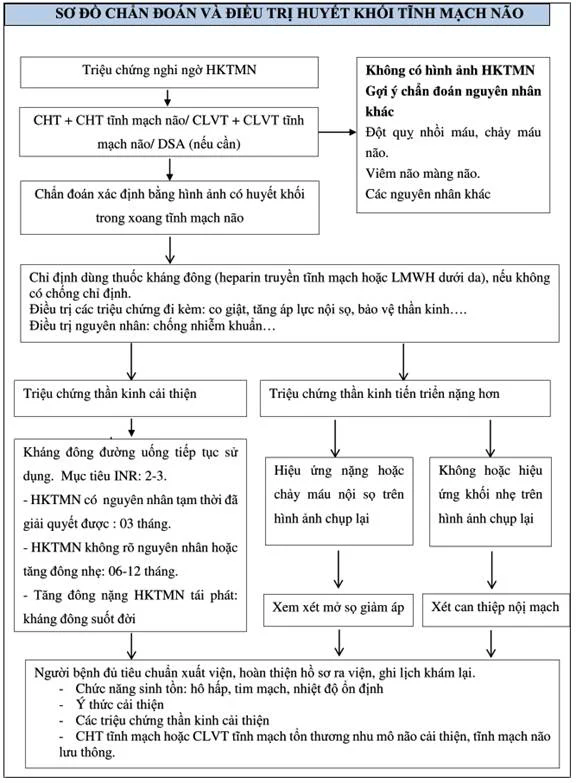
        

      

    

  

  <h3 class="subsection-title">9.2. Khuyến Cáo Điều Trị Bằng Thuốc Chống Đông</h3>
  <ul>
    <li><strong>Giai đoạn cấp:</strong> Sử dụng ngay Heparin trọng lượng phân tử thấp (LMWH liều điều trị) hoặc Heparin không phân đoạn truyền tĩnh mạch. <em>Chỉ định dùng chống đông bắt buộc ngay cả khi bệnh nhân đã có biến chứng nhồi máu tĩnh mạch kèm chuyển dạng chảy máu não</em>.</li>
    <li><strong>Thời gian duy trì chống đông đường uống (Warfarin đích INR 2.0 – 3.0 hoặc DOACs):</strong> Duy trì <strong>3 tháng</strong> nếu có yếu tố nguy cơ tạm thời đã giải quyết dứt điểm; Duy trì <strong>6 – 12 tháng</strong> nếu HKTMN tự phát không rõ nguyên nhân; Duy trì <strong>suốt đời</strong> nếu có tình trạng tăng đông nặng do di truyền hoặc HKTMN tái phát.</li>
  </ul>
</section>

---

<section id="sec-sa-sut-tri-tue" class="guideline-section">
  <h2 class="section-title"><i class="fa-solid fa-head-side-virus"></i> 10. Sa Sút Trí Tuệ Nguyên Nhân Mạch Máu (VaD)</h2>
  
  

    Là nguyên nhân gây sa sút trí tuệ thường gặp thứ hai sau bệnh Alzheimer, chiếm tới <strong>30% tại các nước Châu Á</strong>. Thường khởi phát đột ngột sau biến cố đột quỵ hoặc suy giảm nhận thức tiến triển từng bậc (Stepwise progression), nổi trội với suy giảm chức năng điều hành thùy trán, giảm khả năng tập trung, dáng đi chậm chạp và rối loạn tiểu tiện xuất hiện sớm.
  

  <ul>
    <li><strong>Chẩn đoán:</strong> Tiêu chuẩn DSM-5 kết hợp bộ trắc nghiệm tâm thần kinh (MOCA nhạy hơn MMSE trong phát hiện suy giảm nhận thức do mạch máu).</li>
    <li><strong>Điều trị nội khoa:</strong> Kiểm soát nghiêm ngặt các yếu tố nguy cơ mạch máu (Huyết áp &lt; 130/80 mmHg, Statin liều cao, kiểm soát đái tháo đường); Thuốc ức chế men acetylcholinesterase: <strong>Donepezil</strong> (Khuyến cáo Loại I, Hạng A) hoặc Galantamine cho thể sa sút trí tuệ hỗn hợp; Thuốc đối vận thụ thể NMDA: <strong>Memantine</strong> (Khuyến cáo Loại I, Hạng A) giúp làm chậm suy thoái nhận thức; Bổ sung các hợp chất nuôi dưỡng và dinh dưỡng thần kinh: Citicoline, Cerebrolysin concentrate, Ginkgo biloba chuẩn hóa EGb761 (240 mg/ngày), Vinpocetine.</li>
  </ul>
</section>

---

<section id="sec-avm-nao" class="guideline-section">
  <h2 class="section-title"><i class="fa-solid fa-diagram-project"></i> 11. Dị Dạng Động - Tĩnh Mạch Não (AVM)</h2>

  <h3 class="subsection-title">11.1. Phân Loại Spetzler - Martin Đánh Giá Độ Khó Phẫu Thuật</h3>
  

    Thang điểm Spetzler - Martin đánh giá nguy cơ biến chứng và tỷ lệ tàn tật phẫu thuật dựa trên 3 tiêu chí:
  

  <ul>
    <li><strong>Kích thước khối dị dạng (Nidus):</strong> Nhỏ &lt; 3 cm (1 điểm); Trung bình 3 – 6 cm (2 điểm); Lớn &gt; 6 cm (3 điểm).</li>
    <li><strong>Vị trí liên quan vùng não chức năng:</strong> Nằm ngoài vùng chức năng (0 điểm); Nằm trong vùng chức năng quan trọng như vỏ não vận động, cảm giác, ngôn ngữ, thị giác, đồi thị, thân não (1 điểm).</li>
    <li><strong>Kiểu dẫn lưu tĩnh mạch:</strong> Chỉ dẫn lưu tĩnh mạch vỏ nông (0 điểm); Có dẫn lưu qua hệ tĩnh mạch sâu (1 điểm).</li>
  </ul>

  

    
<i class="fa-solid fa-scalpel"></i> Định Hướng Điều Trị Theo Phân Độ Spetzler - Martin

    

      <ul>
        <li><strong>Grade I & II:</strong> Vi phẫu thuật cắt bỏ trọn vẹn khối dị dạng là lựa chọn ưu tiên hàng đầu, tỷ lệ khỏi triệt để cao và tai biến thấp.</li>
        <li><strong>Grade III:</strong> Cần hội chẩn đa mô thức chuyên sâu; thường phối hợp can thiệp nút mạch nút tắc một phần dị dạng trước khi vi phẫu hoặc phối hợp xạ phẫu (Gamma Knife).</li>
        <li><strong>Grade IV & V:</strong> Nguy cơ tàn tật và tử vong do can thiệp phẫu thuật vượt trội so với nguy cơ tự nhiên. Ưu tiên <strong>điều trị bảo tồn nội khoa</strong> theo dõi, trừ khi khối AVM bị vỡ gây máu tụ lớn chèn ép đe dọa tử vong.</li>
      </ul>
    

  

</section>

---

<section id="sec-du-phong-thu-phat" class="guideline-section">
  <h2 class="section-title"><i class="fa-solid fa-shield-halved"></i> 12. Chiến Lược Dự Phòng Thứ Phát Nhồi Máu Não Theo Căn Nguyên</h2>

  <h3 class="subsection-title">12.1. Đột Quỵ Do Xơ Vữa Động Mạch Lớn Ngoại Sọ (Hẹp Mạch Cảnh)</h3>
  <ul>
    <li><strong>Hẹp mạch cảnh có triệu chứng nặng (70 – 99%):</strong> Khuyến cáo thực hiện <strong>Phẫu thuật bóc nội mạc động mạch cảnh (CEA)</strong> hoặc <strong>Đặt stent mạch cảnh (CAS)</strong> trong vòng <strong>2 tuần đầu</strong> kể từ khi khởi phát biến cố đột quỵ. Người bệnh &ge; 70 tuổi ưu tiên CEA hơn CAS.</li>
    <li><strong>Kiểm soát lipid máu tích cực:</strong> Statin cường độ cao (Atorvastatin 80 mg hoặc Rosuvastatin 40 mg) phối hợp Ezetimibe để đưa <strong>LDL-C &lt; 70 mg/dL (1.8 mmol/L)</strong>, hoặc <strong>&lt; 55 mg/dL (1.4 mmol/L)</strong> ở nhóm nguy cơ tim mạch rất cao.</li>
  </ul>

  <h3 class="subsection-title">12.2. Đột Quỵ Do Thuyên Tắc Từ Tim & Bít Lỗ Bầu Dục (PFO)</h3>
  <ul>
    <li><strong>Rung nhĩ không van:</strong> Bắt buộc dùng thuốc chống đông đường uống thế hệ mới (DOACs: Dabigatran, Rivaroxaban, Apixaban, Edoxaban) lâu dài.</li>
    <li><strong>Thời điểm khởi đầu lại chống đông sau nhồi máu não do rung nhĩ:</strong> TIA dùng ngay ngày 1; Đột quỵ nhẹ dùng vào ngày 3; Đột quỵ trung bình dùng vào ngày 6; Đột quỵ nặng/nhồi máu diện rộng cần trì hoãn đến <strong>ngày thứ 12 – 14</strong> sau khi đã chụp lại CT/MRI loại trừ xuất huyết não chuyển dạng.</li>
    <li><strong>Chỉ định bít lỗ bầu dục (PFO) qua da:</strong> Khuyến cáo ở bệnh nhân trẻ tuổi (<strong>18 – 60 tuổi</strong>), nhồi máu não không rõ nguyên nhân (ESUS) có PFO mang đặc điểm giải phẫu nguy cơ cao (kèm phình vách liên nhĩ hoặc luồng thông phải - trái lớn).</li>
  </ul>

  

    

      Lưu Đồ Tương Tác
      Hình 12. Lưu Đồ Hướng Dẫn Xử Trí Nhồi Máu Não Kèm Còn Lỗ Bầu Dục (PFO)
    

    

      

  

    

      
        <svg width="18" height="18" viewBox="0 0 24 24" fill="none" stroke="currentColor" stroke-width="2"><rect x="3" y="3" width="18" height="18" rx="2"/><path d="M7 8h10M7 12h10M7 16h6"/></svg>
      
      Hình 12. Lưu Đồ Hướng Dẫn Xử Trí Nhồi Máu Não Kèm Còn Lỗ Bầu Dục (PFO)
    

    AHA/ASA • PFO Occlusion
  

  
  

    <svg class="med-svg" viewBox="0 0 860 520" width="100%" height="100%" preserveAspectRatio="xMidYMid meet">
  <defs>
    <marker id="arr-pfo" viewBox="0 0 10 10" refX="6" refY="5" markerWidth="6" markerHeight="6" orient="auto-start-reverse">
      <path d="M 0 1.5 L 8 5 L 0 8.5 z" fill="var(--color-text-muted, #64748b)" />
    </marker>
    <marker id="arr-pfo-act" viewBox="0 0 10 10" refX="6" refY="5" markerWidth="6" markerHeight="6" orient="auto-start-reverse">
      <path d="M 0 1.5 L 8 5 L 0 8.5 z" fill="var(--color-primary, #0284c7)" />
    </marker>
  </defs>

  <!-- Root -->
  <g class="flow-node">
    <rect x="220" y="15" width="420" height="55" rx="8" fill="var(--color-primary-subtle, rgba(2,132,199,0.12))" stroke="var(--color-primary, #0284c7)" stroke-width="2"/>
    <text x="430" y="37" font-size="13.5" font-weight="700" fill="var(--color-primary, #0284c7)" text-anchor="middle">NHỒI MÁU NÃO CĂN NGUYÊN CHƯA RÕ (ESUS)</text>
    <text x="430" y="55" font-size="11" fill="var(--color-text-muted, #64748b)" text-anchor="middle">Bệnh nhân trẻ (18 – 60 tuổi) • Nghi ngờ thuyên tắc mạch nghịch thường</text>
  </g>

  <path d="M 430 70 L 430 98" fill="none" stroke="var(--color-primary, #0284c7)" stroke-width="2" marker-end="url(#arr-pfo-act)"/>

  <!-- Step 2: TEE -->
  <g class="flow-node">
    <rect x="180" y="98" width="500" height="50" rx="8" fill="var(--color-surface, #ffffff)" stroke="var(--color-primary, #0284c7)" stroke-width="1.8"/>
    <text x="430" y="120" font-size="13" font-weight="700" fill="var(--color-primary, #0284c7)" text-anchor="middle">1. Siêu Âm Tim Qua Thực Quản (TEE) Với Nghiệm Pháp Bọt Cản Âm</text>
    <text x="430" y="137" font-size="10.5" fill="var(--color-text-muted, #64748b)" text-anchor="middle">Phát hiện luồng thông Phải – Trái (Shunt) &amp; Phình vách liên nhĩ (ASA)</text>
  </g>

  <path d="M 430 148 L 430 178" fill="none" stroke="var(--color-primary, #0284c7)" stroke-width="2" marker-end="url(#arr-pfo-act)"/>

  <!-- Decision 1: PFO Present? -->
  <g class="flow-node">
    <polygon points="430,178 590,213 430,248 270,213" fill="var(--color-warning-subtle, rgba(245,158,11,0.12))" stroke="var(--color-warning, #f59e0b)" stroke-width="2"/>
    <text x="430" y="209" font-size="12" font-weight="700" fill="var(--color-warning, #d97706)" text-anchor="middle">Có Luồng Thông PFO</text>
    <text x="430" y="225" font-size="10.5" fill="var(--color-text-muted, #64748b)" text-anchor="middle">Trên Siêu Âm Tim TEE?</text>
  </g>

  <!-- Left: No PFO -->
  <path d="M 270 213 L 150 213 L 150 270" fill="none" stroke="var(--color-text-muted, #64748b)" stroke-width="1.8" marker-end="url(#arr-pfo)"/>
  <g>
    <rect x="175" y="201" width="60" height="20" rx="4" fill="var(--color-surface, #ffffff)" stroke="var(--color-border, #cbd5e1)" stroke-width="1"/>
    <text x="205" y="215" font-size="10" font-weight="600" fill="var(--color-text-muted, #64748b)" text-anchor="middle">Không (-)</text>
  </g>
  <g class="flow-node">
    <rect x="50" y="270" width="200" height="60" rx="8" fill="var(--color-surface, #ffffff)" stroke="var(--color-border, #cbd5e1)" stroke-width="1.5"/>
    <text x="150" y="295" font-size="12" font-weight="700" fill="var(--color-text, #334155)" text-anchor="middle">Tiếp Tục Tìm Căn Nguyên Khác</text>
    <text x="150" y="315" font-size="10.5" fill="var(--color-text-muted, #64748b)" text-anchor="middle">Duy trì SAPT (Aspirin 81-100mg)</text>
  </g>

  <!-- Down: Yes PFO -> Exclusion Bilan -->
  <path d="M 430 248 L 430 278" fill="none" stroke="var(--color-warning, #f59e0b)" stroke-width="2" marker-end="url(#arr-pfo-act)"/>
  <g>
    <rect x="405" y="252" width="50" height="20" rx="4" fill="var(--color-surface, #ffffff)" stroke="var(--color-border, #cbd5e1)" stroke-width="1"/>
    <text x="430" y="266" font-size="10" font-weight="600" fill="var(--color-warning, #d97706)" text-anchor="middle">Có (+)</text>
  </g>
  <g class="flow-node">
    <rect x="230" y="278" width="400" height="58" rx="8" fill="var(--color-warning-subtle, rgba(245,158,11,0.12))" stroke="var(--color-warning, #f59e0b)" stroke-width="1.8"/>
    <text x="430" y="301" font-size="12.5" font-weight="700" fill="var(--color-warning, #d97706)" text-anchor="middle">2. Bilan Loại Trừ Triệt Để Căn Nguyên Khác</text>
    <text x="430" y="321" font-size="10.5" fill="var(--color-text, #334155)" text-anchor="middle">Holter ECG ≥ 24–48h loại AF • CTA loại hẹp ĐM cảnh • Siêu âm DVT chân</text>
  </g>

  <path d="M 430 336 L 430 365" fill="none" stroke="var(--color-primary, #0284c7)" stroke-width="2" marker-end="url(#arr-pfo-act)"/>

  <!-- Decision 2: RoPE Score >= 7 and High risk PFO? -->
  <g class="flow-node">
    <polygon points="430,365 610,400 430,435 250,400" fill="var(--color-warning-subtle, rgba(245,158,11,0.12))" stroke="var(--color-warning, #f59e0b)" stroke-width="2"/>
    <text x="430" y="396" font-size="12" font-weight="700" fill="var(--color-warning, #d97706)" text-anchor="middle">Thang Điểm RoPE ≥ 7 Điểm</text>
    <text x="430" y="412" font-size="10.5" fill="var(--color-text-muted, #64748b)" text-anchor="middle">VÀ PFO Nguy Cơ Cao (Shunt Lớn / ASA)?</text>
  </g>

  <!-- Left: Medical -->
  <path d="M 250 400 L 150 400 L 150 450" fill="none" stroke="var(--color-text-muted, #64748b)" stroke-width="1.8" marker-end="url(#arr-pfo)"/>
  <g>
    <rect x="165" y="388" width="70" height="20" rx="4" fill="var(--color-surface, #ffffff)" stroke="var(--color-border, #cbd5e1)" stroke-width="1"/>
    <text x="200" y="402" font-size="10" font-weight="600" fill="var(--color-text-muted, #64748b)" text-anchor="middle">Không thỏa</text>
  </g>
  <g class="flow-node">
    <rect x="40" y="450" width="220" height="60" rx="8" fill="var(--color-surface, #ffffff)" stroke="var(--color-border, #cbd5e1)" stroke-width="1.5"/>
    <text x="150" y="473" font-size="12" font-weight="700" fill="var(--color-text, #334155)" text-anchor="middle">Điều Trị Nội Khoa Bảo Tồn</text>
    <text x="150" y="493" font-size="10" fill="var(--color-text-muted, #64748b)" text-anchor="middle">Kháng tiểu cầu đơn (hoặc DOACs nếu DVT)</text>
  </g>

  <!-- Right: Closure -->
  <path d="M 610 400 L 710 400 L 710 450" fill="none" stroke="var(--color-success, #22c55e)" stroke-width="2" marker-end="url(#arr-pfo-act)"/>
  <g>
    <rect x="635" y="388" width="70" height="20" rx="4" fill="var(--color-surface, #ffffff)" stroke="var(--color-border, #cbd5e1)" stroke-width="1"/>
    <text x="670" y="402" font-size="10" font-weight="600" fill="var(--color-success, #16a34a)" text-anchor="middle">Thỏa mãn (+)</text>
  </g>
  <g class="flow-node">
    <rect x="550" y="450" width="300" height="65" rx="8" fill="var(--color-success-subtle, rgba(34,197,94,0.12))" stroke="var(--color-success, #22c55e)" stroke-width="2"/>
    <text x="700" y="473" font-size="12.5" font-weight="700" fill="var(--color-success, #16a34a)" text-anchor="middle">CHỈ ĐỊNH ĐÓNG PFO BẰNG DÙ QUA DA</text>
    <text x="700" y="491" font-size="10" fill="var(--color-text, #334155)" text-anchor="middle">DAPT 1–6 tháng sau bít dù • Tiếp tục Aspirin ≥ 5 năm</text>
    <text x="700" y="505" font-size="9.5" font-weight="600" fill="var(--color-success, #16a34a)" text-anchor="middle">Giảm &gt; 60 – 70% nguy cơ đột quỵ tái phát</text>
  </g>
</svg>
  

  

      

        
        Siêu âm TEE bọt cản âm
      

      

        
        Thang điểm RoPE & Bilan loại trừ
      

      

        
        Can thiệp bít dù PFO qua da
      

  

      

        <em>Hình 12: Quy trình chẩn đoán loại trừ căn nguyên khác, đánh giá thang điểm RoPE và chỉ định can thiệp đóng PFO bằng dù qua da kết hợp kháng tiểu cầu kéo dài. (Nguồn: Quyết định 3312/QĐ-BYT).</em>
      

      

        

          <i class="fa-solid fa-image"></i> Đối chiếu hình ảnh lưu đồ gốc từ Quyết định 3312/QĐ-BYT
        

        

          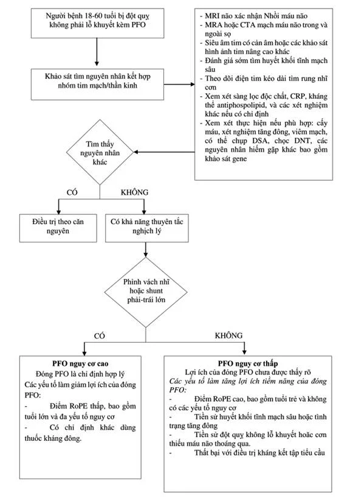
        

      

    

  

</section>

---

<section id="sec-phuc-hoi-chuc-nang" class="guideline-section">
  <h2 class="section-title"><i class="fa-solid fa-person-walking"></i> 13. Phục Hồi Chức Năng Đa Chuyên Ngành & Neuroplasticity</h2>

  

    Phục hồi chức năng (PHCN) sau đột quỵ phải được triển khai theo mô hình <strong>Đội ngũ đa chuyên ngành (Multidisciplinary Team)</strong> gồm bác sĩ PHCN, điều dưỡng, kỹ thuật viên vật lý trị liệu, hoạt động trị liệu, ngôn ngữ trị liệu, tâm lý học và dinh dưỡng. Quá trình phục hồi dựa trên nguyên lý <strong>Tính mềm dẻo của hệ thần kinh (Neuroplasticity)</strong>, trong đó não bộ tái tổ chức các đường dẫn truyền thần kinh thông qua việc tập luyện chủ động, lặp đi lặp lại và theo tác vụ cụ thể (Task-oriented training).
  

  

    <table class="table-custom">
      <thead>
        <tr>
          <th>Lĩnh Vực Can Thiệp</th>
          <th>Khuyến Cáo Chuyên Môn Cốt Lõi</th>
          <th>Phân Loại</th>
          <th>Mức Bằng Chứng</th>
        </tr>
      </thead>
      <tbody>
        <tr>
          <td><strong>Thời điểm rời giường sớm</strong></td>
          <td>Bắt đầu vận động sớm tại giường trong vòng <strong>24 – 48 giờ đầu</strong> khi huyết động và thần kinh đã ổn định.</td>
          <td><strong>Class I</strong></td>
          <td><strong>Level A</strong></td>
        </tr>
        <tr>
          <td><strong>Vận động cường độ cao tối cấp</strong></td>
          <td><strong>TUYỆT ĐỐI KHÔNG vận động cường độ cao trong vòng 24 giờ đầu</strong> vì làm tăng tỷ lệ tử vong và tàn phế sau 3 tháng (thử nghiệm AVERT).</td>
          <td><strong>Class III (Hại)</strong></td>
          <td><strong>Level A</strong></td>
        </tr>
        <tr>
          <td><strong>Sàng lọc rối loạn nuốt</strong></td>
          <td><strong>BẮT BUỘC sàng lọc chức năng nuốt sớm</strong> bằng nghiệm pháp nuốt nước trước khi cho bệnh nhân ăn, uống hoặc uống thuốc đường miệng để phòng ngừa viêm phổi hít sặc (60% hít sặc là thầm lặng).</td>
          <td><strong>Class I</strong></td>
          <td><strong>Level B</strong></td>
        </tr>
        <tr>
          <td><strong>Co cứng cơ sau đột quỵ</strong></td>
          <td><strong>Tiêm Botulinum Toxin A</strong> vào các cơ co cứng đích ở chi trên và chi dưới để giảm trương lực cơ, cải thiện tầm vận động và vệ sinh cá nhân.</td>
          <td><strong>Class I</strong></td>
          <td><strong>Level A</strong></td>
        </tr>
        <tr>
          <td><strong>Nẹp cổ tay chống co cứng</strong></td>
          <td><strong>KHÔNG khuyến cáo</strong> sử dụng nẹp hoặc băng cố định cổ tay/bàn tay kéo dài để phòng ngừa co cứng cơ.</td>
          <td><strong>Class III</strong></td>
          <td><strong>Level B</strong></td>
        </tr>
        <tr>
          <td><strong>Đau vai & Bán trật khớp vai</strong></td>
          <td>Tư thế khớp vai đúng, dùng đai treo nâng đỡ khớp vai bên liệt; <strong>TUYỆT ĐỐI KHÔNG dùng bài tập ròng rọc cao qua đầu</strong> vì gây rách chóp xoay và tổn thương khớp vai nặng nề.</td>
          <td><strong>Class IIa</strong></td>
          <td><strong>Level C</strong></td>
        </tr>
        <tr>
          <td><strong>Tập dáng đi & Bàn chân rủ</strong></td>
          <td>Chỉ định <strong>Nẹp dưới gối (Ankle-Foot Orthosis — AFO)</strong> hỗ trợ bàn chân rủ giúp bệnh nhân đi lại an toàn, phòng ngừa té ngã.</td>
          <td><strong>Class I</strong></td>
          <td><strong>Level A</strong></td>
        </tr>
        <tr>
          <td><strong>Kích thích não không xâm lấn</strong></td>
          <td>Kích thích dòng điện một chiều xuyên sọ (tDCS) hoặc kích thích từ trường xuyên sọ lặp lại (rTMS) hỗ trợ kích thích tái lập kết nối neuron.</td>
          <td><strong>Class IIb</strong></td>
          <td><strong>Level B</strong></td>
        </tr>
      </tbody>
    </table>
  

</section>

---

<section id="sec-tai-lieu-tham-khao" class="guideline-section">
  <h2 class="section-title"><i class="fa-solid fa-book-medical"></i> 14. Tài Liệu Tham Khảo Chuẩn AMA</h2>

  

    <ol class="references-ama">
      <li>Bộ Y tế Việt Nam. <em>Hướng dẫn chẩn đoán và điều trị đột quỵ não</em> (Ban hành kèm theo Quyết định số 3312/QĐ-BYT ngày 05 tháng 11 năm 2024 của Bộ trưởng Bộ Y tế). Hà Nội: Nhà xuất bản Y học; 2024.</li>
      <li>Powers WJ, Rabinstein AA, Ackerson T, et al. Guidelines for the early management of patients with acute ischemic stroke: 2019 update to the 2018 guidelines for the early management of acute ischemic stroke. <em>Stroke</em>. 2019;50(12):e344-e418. doi:10.1161/STR.0000000000000211.</li>
      <li>Greenberg SM, Ziai WC, Cordonnier C, et al. 2022 Guideline for the management of patients with spontaneous intracerebral hemorrhage: a guideline from the American Heart Association/American Stroke Association. <em>Stroke</em>. 2022;53(7):e282-e361. doi:10.1161/STR.0000000000000407.</li>
      <li>Hoh BL, Ko NU, Amin-Hanjani S, et al. 2023 Guideline for the management of patients with aneurysmal subarachnoid hemorrhage: a guideline from the American Heart Association/American Stroke Association. <em>Stroke</em>. 2023;54(7):e314-e370. doi:10.1161/STR.0000000000000436.</li>
      <li>Kleindorfer DO, Towfighi A, Chaturvedi S, et al. 2021 Guideline for the prevention of stroke in patients with stroke and transient ischemic attack: a guideline from the American Heart Association/American Stroke Association. <em>Stroke</em>. 2021;52(7):e364-e467. doi:10.1161/STR.0000000000000375.</li>
      <li>Campbell BCV, De Silva DA, Macleod MR, et al. Ischaemic stroke. <em>Nat Rev Dis Primers</em>. 2019;5(1):70. doi:10.1038/s41572-019-0118-8.</li>
    </ol>
  

</section>
