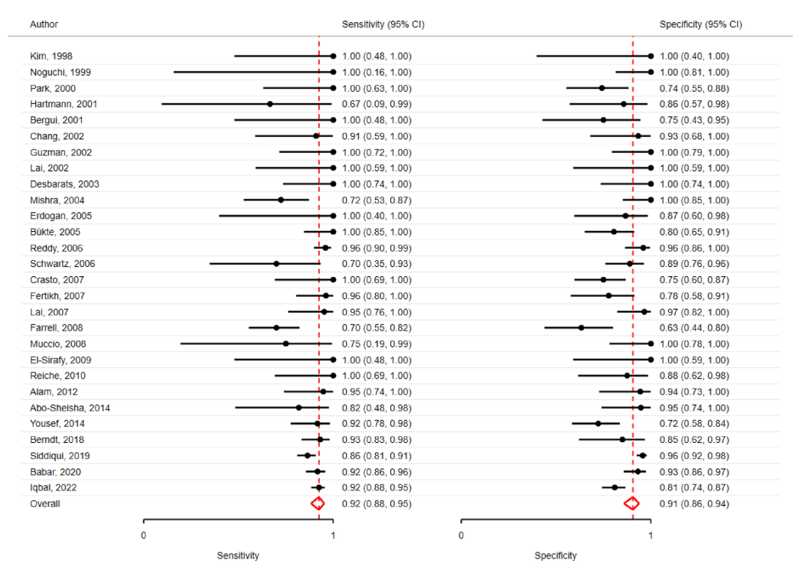
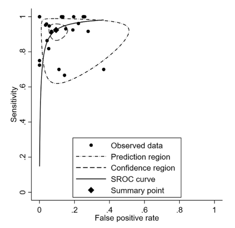
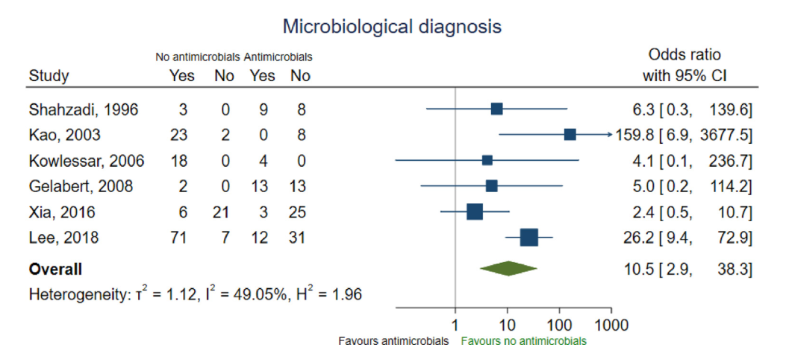
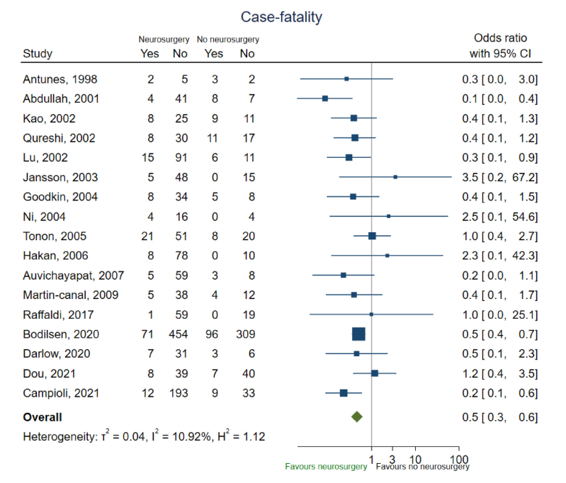
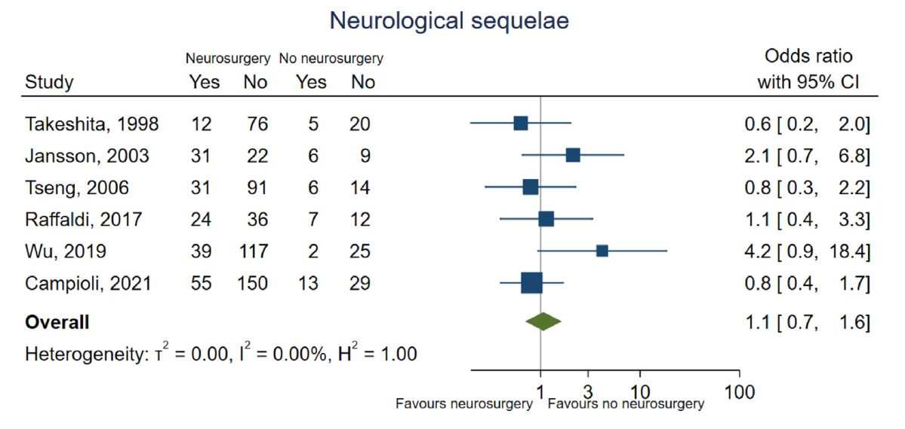
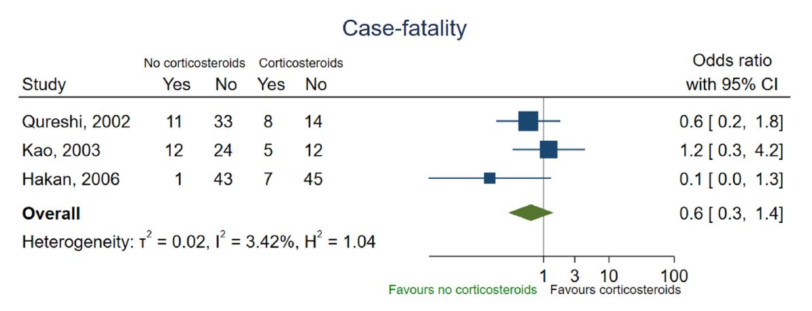

  

    

      
MRI DWI/ADC Se 92%

      
Độ nhạy 92% và độ đặc hiệu 91% trong chẩn đoán phân biệt áp xe não với u nang

    

    

      
OR 10.5 Tìm Vi Khuẩn

      
Trì hoãn kháng sinh &lt; 24h tăng tỷ lệ cấy mủ dương tính từ 33% lên 80%

    

    

      
Mổ Giảm 50% Tử Vong

      
Chọc hút hoặc cắt bỏ giúp giảm tỷ lệ tử vong từ 24% xuống 9% (OR = 0.5)

    

    

      
6 - 8 Tuần Kháng Sinh

      
Thời gian điều trị kháng sinh tĩnh mạch chuẩn cho ổ áp xe đã chọc hút

    

  

  

    

      
🧲

      

        
Chẩn Đoán Hình Ảnh Đột Phá (MRI DWI)

        
Xung khuyếch tán (DWI/ADC) phân biệt dịch mủ hoại tử hạn chế khuyếch tán với hoại tử u; CT scan cản quang chỉ dùng thay thế khi không có MRI.

      

    

    

      
🎯

      

        
Ngoại Thần Kinh Sớm &amp; Trì Hoãn Thuốc Có Chọn Lọc

        
Can thiệp ngoại khoa sớm cứu mạng bệnh nhân; hoãn kháng sinh &lt; 24h ở BN ổn định để tối ưu hóa mẫu cấy mủ và xét nghiệm phân tử 16S PCR.

      

    

    

      
🛡️

      

        
Phác Đồ Đích &amp; Thận Trọng Thuốc Bổ Trợ

        
Kháng sinh ngấm não tối ưu (Ceph III + Metronidazole); Dexamethasone chỉ định chặt chẽ khi có phù não nặng; không dùng thuốc chống động kinh dự phòng thường quy.

      

    

  

  

    <a href="#sec-tong-quan-dich-te-sinh-ly" class="quickmenu-item active">1. Tổng Quan &amp; Dịch Tễ</a>
    <a href="#sec-chan-doan-hinh-anh-mri" class="quickmenu-item">2. MRI DWI/ADC (Fig 3, 4)</a>
    <a href="#sec-tri-hoan-khang-sinh-lay-mau" class="quickmenu-item">3. Trì Hoãn Kháng Sinh (Fig 5)</a>
    <a href="#sec-xet-nghiem-phan-tu-pcr-ngs" class="quickmenu-item">4. Xét Nghiệm Phân Tử (Table 2)</a>
    <a href="#sec-can-thiep-phau-thuat-than-kinh" class="quickmenu-item">5. Ngoại Thần Kinh (Fig 7, 8)</a>
    <a href="#sec-phac-do-khang-sinh-kinh-nghiem" class="quickmenu-item">6. Phác Đồ Kháng Sinh (Table 4)</a>
    <a href="#sec-thoi-gian-tri-va-corticosteroid" class="quickmenu-item">7. Thời Gian &amp; Steroid (Fig 17)</a>
    <a href="#sec-du-phong-co-giat-mcq" class="quickmenu-item">8. Dự Phòng Co Giật &amp; 5 MCQ</a>
  

  {/* ==================== SECTION 1 ==================== */}
  

    

      🧠
      <h2 class="sec-title">1. Định Nghĩa, Dịch Tễ Học Tử Vong (7% - 13% - 20%), Di Chứng 70% &amp; Cơ Chế Lan Truyền Vi Sinh</h2>
    

    

      

        💡
        

          <strong>Cột Mốc Hướng Dẫn Thực Hành Lâm Sàng ESCMID 2024 (Clinical Microbiology and Infection):</strong>
          Áp xe não là một vùng mủ có bao xơ (encapsulated area of pus) khu trú bên trong nhu mô não. Hướng dẫn ESCMID 2024 là văn kiện y học chứng cứ quốc tế toàn diện đầu tiên thiết lập các tiêu chuẩn vàng từ chẩn đoán hình ảnh, xét nghiệm vi sinh phân tử, thời điểm can thiệp ngoại khoa đến phác đồ kháng sinh và điều trị bổ trợ cho cả trẻ em và người lớn.
        

      

      
Dữ Liệu Dịch Tễ Học Tử Vong Tích Lũy &amp; Di Chứng Lâu Dài

      

        

          

          
Tỷ Lệ Tử Vong Tích Lũy Báo Động 📉

          

            
Mặc dù đã có những tiến bộ về ngoại thần kinh và kháng sinh, áp xe não vẫn có tỷ lệ tử vong tích lũy rất cao theo thời gian:

            <ul class="clin-card-list">
              <li>Tử vong sau 30 ngày: <strong>7%</strong>.</li>
              <li>Tử vong sau 90 ngày: <strong>13%</strong>.</li>
              <li><strong>Tử vong sau 1 năm:</strong> <strong>20%</strong> (1/5 bệnh nhân tử vong).</li>
            </ul>
          

        

        

          

          
Gánh Nặng Di Chứng Thần Kinh ⚡

          

            
Khoảng <strong>70% số người sống sót</strong> phải chịu đựng các di chứng thần kinh kéo dài hoặc suốt đời:

            <ul class="clin-card-list">
              <li>Khiếm khuyết thần kinh khu trú (liệt nửa người, thất ngôn, mất phối hợp vận động).</li>
              <li><strong>Động kinh thứ phát (Epilepsy):</strong> Xuất hiện ở khoảng 1/3 số bệnh nhân sống sót.</li>
              <li>Suy giảm nhận thức và chất lượng sống suy giảm trầm trọng.</li>
            </ul>
          

        

      

      
Cơ Chế Lan Truyền &amp; Phân Bố Vi Sinh Học Theo Bối Cảnh Lâm Sàng

      

        

          

          

            
🦷

            
Áp Xe Mắc Phải Cộng Đồng (Cơ Địa Bình Thường)

          

          

            Chủ yếu lan truyền từ răng miệng, viêm tai giữa mạn, viêm xoang. Tác nhân chiếm ưu thế tuyệt đối là các vi khuẩn thường trú vùng khoang miệng: <strong>Streptococcus anginosus group</strong> (*Streptococcus intermedius*), các loài <strong>Fusobacterium spp.</strong>, và <strong>Aggregatibacter spp.</strong>
          

          
Vi khuẩn khoang miệng chiếm ưu thế

        

        

          

          

            
✂️

            
Áp Xe Sau Phẫu Thuật Ngoại Thần Kinh

          

          

            Hình thành sau mở nắp sọ, đặt dẫn lưu não thất hoặc chấn thương thấu sọ. Tác nhân thường gặp nhất là <strong>Staphylococcus aureus</strong> (bao gồm cả MRSA) và các <strong>trực khuẩn Gram âm</strong> đường ruột hoặc vi khuẩn bệnh viện đa kháng (*Pseudomonas aeruginosa*).
          

          
Tụ cầu vàng &amp; Trực khuẩn Gram (-)

        

        

          

          

            
🛡️

            
Bệnh Nhân Suy Giảm Miễn Dịch Nghiêm Trọng

          

          

            Ghép tạng, hóa trị liệu ung thư, HIV/AIDS: Cần đặc biệt cảnh giác với các tác nhân cơ hội hiếm gặp như <strong>Nocardia spp.</strong>, nấm sợi (*Aspergillus*, *Mucorales*), <strong>Listeria monocytogenes</strong>, ký sinh trùng <strong>Toxoplasma gondii</strong> và Lao sọ não (*M. tuberculosis*).
          

          
Tác nhân cơ hội &amp; Nocardia / Nấm

        

      

    

  

  {/* ==================== SECTION 2 ==================== */}
  

    

      🧲
      <h2 class="sec-title">2. Chẩn Đoán Hình Ảnh Ưu Tiên: MRI DWI/ADC (Khuyến Cáo Mạnh, Bằng Chứng Cao) &amp; Figures 3, 4</h2>
    

    

      

        ⭐
        

          <strong>Khuyến Cáo Cốt Lõi Về Chẩn Đoán Hình Ảnh (Key Question 1 - Strong, High Evidence):</strong>
          ESCMID 2024 <strong>khuyến cáo mạnh mẽ</strong> sử dụng <strong>Chụp cộng hưởng từ (MRI) sọ não</strong> bao gồm các chuỗi xung khuyếch tán (DWI/ADC) và chuỗi xung T1-weighted có và không bơm thuốc đối quang từ gadolinium cho tất cả bệnh nhân nghi ngờ áp xe não. <em>Chụp CT scan có cản quang chỉ được khuyến cáo sử dụng thay thế khi MRI không có sẵn.</em>
        

      

      
Độ Chính Xác Chẩn Đoán Của MRI Khuyếch Tán (DWI/ADC)

      

        

          

          
Đặc Điểm Hình Ảnh Điển Hình 🖼️

          

            <ul class="clin-card-list">
              <li><strong>T1 có Gadolinium:</strong> Viền ngấm thuốc dạng vòng đều, mỏng (ring-enhancing lesion) bao quanh lõi hoại tử trung tâm.</li>
              <li><strong>Chuỗi xung DWI/ADC:</strong> Lõi mủ đặc quánh trung tâm gây <strong>hạn chế khuyếch tán nước tự do rất mạnh</strong> $
ightarrow$ Tăng sáng trên DWI và giảm tín hiệu trên bản đồ ADC.</li>
              <li>Giúp phân biệt rõ ràng với u não dạng nang/hoại tử (không hạn chế khuyếch tán ở trung tâm).</li>
            </ul>
          

        

        

          

          
Chỉ Số Thống Kê Phân Tích Gộp (2.128 BN) 📊

          

            <ul class="clin-card-list">
              <li><strong>Độ nhạy (Sensitivity):</strong> <strong>92%</strong> (95% CI: 88% – 95%).</li>
              <li><strong>Độ đặc hiệu (Specificity):</strong> <strong>91%</strong> (95% CI: 86% – 94%).</li>
              <li><strong>Giá trị dự báo dương tính (PPV):</strong> <strong>88%</strong>.</li>
              <li><strong>Giá trị dự báo âm tính (NPV):</strong> <strong>90%</strong>.</li>
            </ul>
          

        

      

      {/* FIGURE 3 & 4 CARDS */}
      

        

          
          

            
Figure 3. Forest Plot Độ Nhạy &amp; Độ Đặc Hiệu Của MRI DWI/ADC

            Tổng hợp từ 28 nghiên cứu độc lập (2.128 bệnh nhân) chứng minh độ nhạy 92% và độ đặc hiệu 91% trong chẩn đoán áp xe não.
          

        

        

          
          

            
Figure 4. Đường Cong SROC Của MRI DWI/ADC

            Đường cong SROC tóm tắt năng lực chẩn đoán vượt trội của chuỗi xung khuyếch tán trong phân biệt áp xe não với u não hoại tử.
          

        

      

    

  

  {/* ==================== SECTION 3 ==================== */}
  

    

      ⏳
      <h2 class="sec-title">3. Trì Hoãn Kháng Sinh Trước Can Thiệp Ngoại Khoa (OR = 10.5, Tăng Tỷ Lệ Cấy Mủ 80% vs 33%) &amp; Figure 5</h2>
    

    

      

        ⚠️
        

          <strong>Khuyến Cáo Có Điều Kiện Của ESCMID 2024 (Key Question 2 - Low Certainty):</strong>
          Khuyến cáo <strong>tạm thời trì hoãn sử dụng kháng sinh kinh nghiệm</strong> cho đến khi thực hiện xong thủ thuật chọc hút hoặc cắt bỏ ổ áp xe ở những bệnh nhân <strong>KHÔNG CÓ BIỂU HIỆN LÂM SÀNG NGUY KỊCH</strong> (không có sốc nhiễm trùng, không có nguy cơ vỡ áp xe vào não thất, không có dấu hiệu dọa tụt não), với điều kiện can thiệp ngoại thần kinh được tiến hành sớm, tốt nhất là <strong>trong vòng 24 giờ</strong> kể từ khi có chẩn đoán hình ảnh.
        

      

      
Cơ Sở Y Học Chứng Cứ Về Hiệu Quả &amp; Tính An Toàn

      

        

          

          
Tăng Đột Biến Tỷ Lệ Tìm Thấy Vi Khuẩn 🧫

          

            <ul class="clin-card-list">
              <li>Nhóm trì hoãn kháng sinh: Tỷ lệ cấy mủ dương tính đạt tới <strong>80%</strong> (123/153 BN).</li>
              <li>Nhóm dùng kháng sinh trước mổ: Tỷ lệ cấy mủ dương tính giảm tụt xuống chỉ còn <strong>33%</strong> (41/126 BN).</li>
              <li>👉 <strong>Tỷ số chênh OR = 10.5 (95% CI: 2.9 – 38.3; p &lt; 0.001)</strong>, tăng cơ hội tìm thấy vi trùng lên gấp hơn 10 lần!</li>
            </ul>
          

        

        

          

          
Tính An Toàn Lâm Sàng Được Xác Lập 🛡️

          

            <ul class="clin-card-list">
              <li>Nghiên cứu thuần tập quốc gia Đan Mạch (485 BN) chứng minh việc trì hoãn kháng sinh &lt; 24h ở BN không nguy kịch <strong>không làm tăng tỷ lệ tử vong</strong> sau 6 tháng (RR: 0.79 [0.42 - 1.52]).</li>
              <li>Không làm tăng tỷ lệ di chứng bất lợi (RR: 1.15 [0.87 - 1.52]).</li>
              <li><strong style="color: #dc2626;">Cảnh báo ngoại lệ:</strong> BN có sepsis, hôn mê sâu hoặc dọa thoát vị não phải dùng kháng sinh ngay lập tức.</li>
            </ul>
          

        

      

      {/* FIGURE 5 CARD */}
      

        
        

          
Figure 5. Biểu Đồ Tỷ Số Chênh OR Trong Xác Định Căn Nguyên Vi Sinh

          Phân tích gộp từ 6 nghiên cứu đối chứng chứng minh việc tạm hoãn kháng sinh trước mổ giúp tăng khả năng tìm ra tác nhân vi khuẩn với OR gộp = 10.5 (95% CI: 2.9 - 38.3).
        

      

    

  

  {/* ==================== SECTION 4 ==================== */}
  

    

      🧬
      <h2 class="sec-title">4. Xét Nghiệm Sinh Học Phân Tử 16S rDNA PCR &amp; NGS (Bảng 2: Tương Quan Cấy vs Phân Tử Trên 280 Mẫu)</h2>
    

    

      

        💡
        

          <strong>Vai Trò Của Kỹ Thuật Phân Tử (Key Question 3 - Conditional, Moderate Evidence):</strong>
          ESCMID 2024 khuyến cáo sử dụng các xét nghiệm chẩn đoán sinh học phân tử (như PCR phổ rộng 16S rDNA hoặc giải trình tự gen thế hệ mới - NGS) trên bệnh phẩm mủ áp xe não ở những bệnh nhân có <strong>kết quả cấy mủ thông thường âm tính</strong>.
        

      

      
Tương Quan Giữa Nuôi Cấy &amp; Chẩn Đoán Phân Tử (Table 2 ESCMID - 280 Bệnh Nhân)

      

        <table class="regimen-table">
          <thead>
            <tr>
              <th style="width: 25%;">Nghiên Cứu &amp; Năm</th>
              <th style="width: 15%; text-align: center;">Tổng Số BN</th>
              <th style="width: 15%; text-align: center;">Cấy Mủ (+)</th>
              <th style="width: 15%; text-align: center;">Kỹ Thuật Phân Tử (+)</th>
              <th style="width: 15%; text-align: center;">Đồng Thuận Cả Hai (+)</th>
              <th style="width: 15%; text-align: center;">Phát Hiện Thêm Vk Miệng</th>
            </tr>
          </thead>
          <tbody>
            <tr>
              <td class="source-cell">Al Masalma, 2009</td>
              <td style="text-align: center;">20</td>
              <td style="text-align: center;">17 (85%)</td>
              <td style="text-align: center;">19 (95%)</td>
              <td style="text-align: center;">15 (75%)</td>
              <td style="text-align: center;">8/12 (75%)</td>
            </tr>
            <tr>
              <td class="source-cell">Al Masalma, 2012</td>
              <td style="text-align: center;">51</td>
              <td style="text-align: center;">30 (59%)</td>
              <td style="text-align: center;">39 (76%)</td>
              <td style="text-align: center;">37 (73%)</td>
              <td style="text-align: center;">14/20 (70%)</td>
            </tr>
            <tr>
              <td class="source-cell">Andersen, 2022</td>
              <td style="text-align: center;">41</td>
              <td style="text-align: center;">37 (90%)</td>
              <td style="text-align: center;">37 (90%)</td>
              <td style="text-align: center;">35 (85%)</td>
              <td style="text-align: center;">16/28 (57%)</td>
            </tr>
            <tr>
              <td class="source-cell">Hartung, 2021</td>
              <td style="text-align: center;">36</td>
              <td style="text-align: center;">26 (72%)</td>
              <td style="text-align: center;">28 (78%)</td>
              <td style="text-align: center;">28 (78%)</td>
              <td style="text-align: center;">17/22 (77%)</td>
            </tr>
            <tr>
              <td class="source-cell">Kommedal, 2014</td>
              <td style="text-align: center;">37</td>
              <td style="text-align: center;">34 (92%)</td>
              <td style="text-align: center;">36 (97%)</td>
              <td style="text-align: center;">33 (89%)</td>
              <td style="text-align: center;">24/32 (75%)</td>
            </tr>
            <tr>
              <td class="source-cell">Stebner, 2021</td>
              <td style="text-align: center;">46</td>
              <td style="text-align: center;">42 (91%)</td>
              <td style="text-align: center;">46 (100%)</td>
              <td style="text-align: center;">19 (41%)</td>
              <td style="text-align: center;">33/42 (79%)</td>
            </tr>
            <tr>
              <td class="source-cell"><strong>TỔNG CỘNG GỘP</strong></td>
              <td style="text-align: center;"><strong>280</strong></td>
              <td style="text-align: center;"><strong>224 (80%)</strong></td>
              <td style="text-align: center;"><strong>228 (81%)</strong></td>
              <td style="text-align: center;"><strong>187 (67%)</strong></td>
              <td style="text-align: center;"><strong>115/173 (66%)</strong></td>
            </tr>
          </tbody>
        </table>
      

      

        🌟
        

          <strong>Ý Nghĩa Lâm Sàng Cốt Lõi Của 16S rDNA PCR &amp; NGS:</strong>
          Kỹ thuật phân tử giúp phát hiện thêm tác nhân ở <strong>13% các trường hợp cấy mủ hoàn toàn âm tính</strong>. Đặc biệt, xét nghiệm phân tử giúp mở rộng khả năng xác định các vi khuẩn kỵ khí vùng miệng phức tạp trong <strong>66%</strong> trường hợp và phát hiện nhanh các tác nhân kén khí nguy hiểm như *Nocardia spp.* hoặc *Toxoplasma*.
        

      

    

  

  {/* ==================== SECTION 5 ==================== */}
  

    

      🩺
      <h2 class="sec-title">5. Chỉ Định Can Thiệp Ngoại Thần Kinh (Chọc Hút vs Cắt Bỏ, Giảm 50% Tử Vong) &amp; Figures 7, 8</h2>
    

    

      

        🚨
        

          <strong>Khuyến Cáo Mạnh Mẽ Của ESCMID 2024 (Key Question 4 - Strong, Moderate Evidence):</strong>
          ESCMID 2024 <strong>khuyến cáo mạnh mẽ</strong> tiến hành can thiệp ngoại thần kinh bằng <strong>chọc hút định vị (aspiration) hoặc cắt bỏ ổ áp xe (excision) càng sớm càng tốt</strong> cho tất cả bệnh nhân khi có thể thực hiện được, ngoại trừ áp xe do ký sinh trùng *Toxoplasma gondii*.
           <em>Lưu ý Corrigendum 2024:</em> Ban biên soạn ESCMID đã chính thức đính chính chất lượng bằng chứng cho khuyến cáo này là mức <strong>Trung bình (Moderate)</strong> chứ không phải mức Thấp như trong bản in thử ban đầu.
        

      

      
Hiệu Quả Cứu Mạng &amp; An Toàn Di Chứng Của Phẫu Thuật Thần Kinh

      

        

          

          
Giảm Một Nửa Nguy Cơ Tử Vong (OR = 0.5) 📉

          

            <ul class="clin-card-list">
              <li>Tỷ lệ tử vong ở nhóm điều trị bảo tồn (không mổ): <strong>24%</strong> (172/704 BN).</li>
              <li>Tỷ lệ tử vong ở nhóm có can thiệp phẫu thuật: chỉ <strong>9%</strong> (140/1484 BN).</li>
              <li>👉 <strong>Tỷ số chênh OR = 0.5 (95% CI: 0.3 – 0.6)</strong>, can thiệp ngoại khoa giúp giảm 50% nguy cơ tử vong!</li>
            </ul>
          

        

        

          

          
Không Làm Gia Tăng Di Chứng Thần Kinh 🧠

          

            <ul class="clin-card-list">
              <li>Tỷ lệ di chứng thần kinh vĩnh viễn: <strong>26%</strong> ở nhóm điều trị bảo tồn vs <strong>28%</strong> ở nhóm phẫu thuật.</li>
              <li>👉 <strong>OR = 1.1 (95% CI: 0.7 – 1.6; p = 0.75)</strong>: Không có sự khác biệt có ý nghĩa thống kê về di chứng thần kinh.</li>
              <li>Tỷ lệ chảy máu sau thủ thuật rất thấp (0% - 3%).</li>
            </ul>
          

        

      

      {/* FIGURE 7 & 8 CARDS */}
      

        

          
          

            
Figure 7. Nguy Cơ Tử Vong Theo Can Thiệp Phẫu Thuật

            Phân tích gộp từ 17 nghiên cứu (2.188 BN) chỉ ra can thiệp phẫu thuật thần kinh giúp giảm nguy cơ tử vong với OR gộp = 0.5 (95% CI: 0.3 - 0.6).
          

        

        

          
          

            
Figure 8. Nguy Cơ Di Chứng Thần Kinh Theo Can Thiệp

            Phân tích gộp từ 6 nghiên cứu đối chứng chứng minh can thiệp phẫu thuật không làm gia tăng di chứng thần kinh kéo dài (OR = 1.1; 95% CI: 0.7 - 1.6).
          

        

      

    

  

  {/* ==================== SECTION 6 ==================== */}
  

    

      💊
      <h2 class="sec-title">6. Phác Đồ Kháng Sinh Kinh Nghiệm (Cộng Đồng, Suy Giảm Miễn Dịch, Sau Mổ Thần Kinh) (Table 4)</h2>
    

    

      
Khuyến Cáo Lựa Chọn Kháng Sinh Kinh Nghiệm Ban Đầu (Table 4 ESCMID 2024)

      

        <table class="regimen-table">
          <thead>
            <tr>
              <th style="width: 25%;">Phân Nhóm Lâm Sàng</th>
              <th style="width: 40%;">Phác Đồ Kháng Sinh Chuẩn (Standard)</th>
              <th style="width: 35%;">Phác Đồ Thay Thế (Alternatives)</th>
            </tr>
          </thead>
          <tbody>
            <tr>
              <td class="source-cell"><strong>Áp xe não mắc phải cộng đồng</strong> (Miễn dịch bình thường)</td>
              <td>
                Khuyến cáo Mạnh (Strong) 
                • <strong>Cephalosporin thế hệ 3</strong> (Cefotaxime 2g q4-6h IV HOẶC Ceftriaxone 2g q12h IV) 
                • PHỐI HỢP VỚI <strong>Metronidazole</strong> 500mg q8h (hoặc 15mg/kg liều tải, sau đó 7.5mg/kg q6h IV). 
                <em>Nếu nghi ngờ Pseudomonas (viêm tai giữa thủng màng nhĩ):</em> Dùng <strong>Ceftazidime</strong> thay thế.
              </td>
              <td>
                • <strong>Meropenem</strong> 2g IV mỗi 8 giờ (truyền kéo dài).
              </td>
            </tr>
            <tr>
              <td class="source-cell"><strong>Bệnh nhân suy giảm miễn dịch nặng</strong> (Ghép tạng, ung thư, HIV)</td>
              <td>
                Khuyến cáo Có điều kiện 
                Phối hợp 4 thuốc bao phủ toàn diện: 
                • <strong>Cephalosporin thế hệ 3</strong> 
                • + <strong>Metronidazole</strong> 
                • + <strong>Voriconazole</strong> (bao phủ nấm <em>Aspergillus</em>) 
                • + <strong>TMP-SMX</strong> (bao phủ <em>Nocardia</em> &amp; <em>Toxoplasma</em>)
              </td>
              <td>
                • <strong>Meropenem</strong> 2g q8h IV 
                • + <strong>Voriconazole</strong> 
                • + <strong>TMP-SMX</strong>
              </td>
            </tr>
            <tr>
              <td class="source-cell"><strong>Áp xe sau phẫu thuật ngoại thần kinh</strong> (Post-neurosurgical)</td>
              <td>
                Khuyến cáo Có điều kiện 
                • <strong>Meropenem</strong> 2g IV mỗi 8 giờ 
                • PHỐI HỢP VỚI <strong>Vancomycin</strong> (15-20 mg/kg q8-12h IV) HOẶC <strong>Linezolid</strong> (600mg q12h IV) (bao phủ MRSA và trực khuẩn Gram âm đa kháng).
              </td>
              <td>
                • <strong>Ceftazidime</strong> + Linezolid 
                • HOẶC <strong>Cefepime</strong> + Linezolid
              </td>
            </tr>
          </tbody>
        </table>
      

      

        <FlowchartViewer
          title="Lưu Đồ Tiếp Cận Chẩn Đoán, Can Thiệp Ngoại Khoa & Kháng Sinh Kinh Nghiệm Áp Xe Não (ESCMID 2024)"
          code={`graph TD
  START["BỆNH NHÂN NGHI NGỜ ÁP XE NÃO TRÊN HÌNH ẢNH HỌC <small>Tổn thương choán chỗ nội sọ dạng nang • Bắt thuốc viền hình nhẫn</small>"]:::start --> MRI_DWI["CHỤP MRI SỌ NÃO CHUỖI XUNG KHUẾCH TÁN (DWI / ADC) <small>Tiêu chuẩn vàng: Dịch mủ hoại tử hạn chế khuếch tán (DWI tăng, ADC giảm)</small>"]:::action

  MRI_DWI --> CRITICAL_CHECK{"Đánh Giá Nguy Cơ Nguy Kịch & Tụt Kẹt Não?"}:::question

  CRITICAL_CHECK -- "NGUY KỊCH: Có Sepsis, GCS < 9 hoặc Phù não dọa thoát vị" --> IMMEDIATE_ABX["KHỞI TRỊ KHÁNG SINH TĨNH MẠCH CẤP CỨU NGAY <small>• Không trì hoãn • Phối hợp Dexamethasone chống phù não cấp</small>"]:::danger

  CRITICAL_CHECK -- "KHÔNG NGUY KỊCH: Huyết động ổn định, không dọa thoát vị não" --> DELAY_ABX["TRÌ HOÃN KHÁNG SINH NGẮN NGÀY (&lt; 24 GIỜ) <small>Khuyến cáo ESCMID 2024: Tăng tỷ lệ cấy mủ dương tính từ 33% lên 80% (OR 10.5)</small>"]:::action

  DELAY_ABX --> SURGERY["HỘI CHẨN NGOẠI THẦN KINH KHẨN CẤP <small>Ưu tiên chọc hút mủ định vị (Stereotactic Aspiration) hoặc Mở hộp sọ cắt bỏ</small>"]:::start

  SURGERY --> MICRO["XÉT NGHIỆM VI SINH TOÀN DIỆN BỆNH PHẨM MỦ <small>Nhuộm Gram • Cấy ái khí, kỵ khí • 16S rDNA PCR / Giải trình tự metagenomic NGS</small>"]:::action

  MICRO --> EMPIRIC_ABX{"Lựa Chọn Kháng Sinh Tĩnh Mạch Kinh Nghiệm Theo Phân Nhóm?"}:::question
  IMMEDIATE_ABX --> EMPIRIC_ABX

  EMPIRIC_ABX -- "Mắc phải tại cộng đồng (Miễn dịch bình thường)" --> REG_COMM["CEFTRIAXONE (2g q12h IV) + METRONIDAZOLE (500mg q8h IV) <small>Bao phủ liên cầu khuẩn, phế cầu và vi khuẩn kỵ khí vùng tai mũi họng/răng</small>"]:::success

  EMPIRIC_ABX -- "Bệnh nhân suy giảm miễn dịch (Ghép tạng, ung thư, HIV)" --> REG_IMMUNO["CEFTRIAXONE + METRONIDAZOLE + VORICONAZOLE + TMP-SMX <small>Bao phủ mở rộng Nấm Aspergillus, Toxoplasma gondii & Nocardia</small>"]:::danger

  EMPIRIC_ABX -- "Sau phẫu thuật ngoại thần kinh / Chấn thương sọ não" --> REG_POSTOP["MEROPENEM (2g q8h IV) + VANCOMYCIN / LINEZOLID <small>Bao phủ MRSA, trực khuẩn Gram âm đa kháng & Pseudomonas</small>"]:::warning

  REG_COMM --> DURATION{"Thời Gian Điều Trị Kháng Sinh Tĩnh Mạch?"}:::question
  REG_IMMUNO --> DURATION
  REG_POSTOP --> DURATION

  DURATION -- "Ổ áp xe đã được chọc hút mủ (Aspirated)" --> DUR_6W["ĐIỀU TRỊ 6 - 8 TUẦN KHÁNG SINH TĨNH MẠCH"]:::action
  DURATION -- "Ổ áp xe được phẫu thuật cắt bỏ trọn vẹn (Excised)" --> DUR_4W["ĐIỀU TRỊ 4 TUẦN KHÁNG SINH TĨNH MẠCH"]:::action`}
        />
      

    

  

  {/* ==================== SECTION 7 ==================== */}
  

    

      ⏱️
      <h2 class="sec-title">7. Thời Gian Dùng Kháng Sinh IV (Table 5: 6-8 Tuần vs 4 Tuần) &amp; Liệu Pháp Corticosteroid Bổ Trợ (Figure 17)</h2>
    

    

      
Khuyến Cáo Thời Gian Điều Trị Kháng Sinh Đường Tĩnh Mạch (Table 5 ESCMID)

      

        <table class="regimen-table">
          <thead>
            <tr>
              <th style="width: 40%;">Phương Pháp Can Thiệp Ổ Áp Xe</th>
              <th style="width: 35%; text-align: center;">Thời Gian Kháng Sinh Tĩnh Mạch (IV)</th>
              <th style="width: 25%; text-align: center;">Mức Khuyến Cáo</th>
            </tr>
          </thead>
          <tbody>
            <tr>
              <td class="source-cell"><strong>Ổ áp xe đã được chọc hút mủ (Aspirated)</strong></td>
              <td style="text-align: center;"><strong>6 đến 8 tuần</strong></td>
              <td style="text-align: center;">Có điều kiện (Thấp)</td>
            </tr>
            <tr>
              <td class="source-cell"><strong>Ổ áp xe được phẫu thuật cắt bỏ triệt để (Excised)</strong></td>
              <td style="text-align: center;"><strong>4 tuần</strong></td>
              <td style="text-align: center;">Đồng thuận chuyên gia</td>
            </tr>
            <tr>
              <td class="source-cell"><strong>Điều trị nội khoa bảo tồn (Conservatively treated)</strong></td>
              <td style="text-align: center;"><strong>6 đến 8 tuần</strong></td>
              <td style="text-align: center;">Có điều kiện (Thấp)</td>
            </tr>
          </tbody>
        </table>
      

      
Liệu Pháp Kháng Viêm Corticosteroid Bổ Trợ (Dexamethasone)

      

        

          

          
Chỉ Định Chặt Chẽ Của ESCMID 2024 🎯

          

            
• <strong>Khuyến cáo mạnh mẽ (Strong recommendation):</strong> Chỉ sử dụng Corticosteroid bổ trợ cho bệnh nhân có triệu chứng nghiêm trọng do <strong>phù nề quanh ổ áp xe rộng</strong> hoặc <strong>có dấu hiệu đe dọa thoát vị não</strong> trên hình ảnh.

            
• Tránh dùng thường quy khi không có phù não nặng vì steroid có thể cản trở tạo vỏ bọc xơ và giảm nồng độ kháng sinh thâm nhập.

          

        

        

          

          
Bằng Chứng Về Tính An Toàn (Figure 17) 🛡️

          

            
• Phân tích gộp chứng minh việc sử dụng Dexamethasone <strong>không làm tăng tỷ lệ tử vong</strong> (pooled OR = 0.6; 95% CI: 0.3 – 1.4).

            
• Không làm tăng nguy cơ vỡ áp xe vào hệ thống não thất (21% ở nhóm dùng steroid vs 29% ở nhóm không dùng; p = 0.41).

          

        

      

      {/* FIGURE 17 CARD */}
      

        
        

          
Figure 17. Nguy Cơ Tử Vong Dựa Trên Việc Sử Dụng Dexamethasone Bổ Trợ

          Biểu đồ Forest plot chứng minh tính an toàn lâm sàng của liệu pháp dexamethasone bổ trợ, không làm gia tăng nguy cơ tử vong cho bệnh nhân có phù não nặng (OR gộp = 0.6; 95% CI: 0.3 - 1.4).
        

      

    

  

  {/* ==================== SECTION 8 ==================== */}
  

    

      ⚡
      <h2 class="sec-title">8. Khuyến Cáo Không Dùng Thuốc Chống Động Kinh Dự Phòng Thường Quy, Cheat-Sheet &amp; 5 MCQ</h2>
    

    

      
Khuyến Cáo Về Thuốc Chống Động Kinh Dự Phòng (Key Question 10)

      

        ⚠️
        

          <strong>Khuyến Cáo Có Điều Kiện Chống Lại (Conditionally Recommend Against):</strong>
          ESCMID 2024 <strong>khuyến cáo chống lại việc sử dụng thường quy thuốc chống động kinh để dự phòng tiên phát</strong> (primary prophylaxis) ở những bệnh nhân áp xe não chưa từng xuất hiện cơn co giật trên lâm sàng (Chất lượng bằng chứng: Rất thấp).
           • <em>Lý do:</em> Bằng chứng hiện tại không cho thấy thuốc dự phòng ngăn ngừa được động kinh thứ phát lâu dài, trong khi làm tăng nguy cơ gặp tác dụng phụ và tương tác thuốc. Thuốc chống động kinh chỉ nên được khởi động ngay khi bệnh nhân xuất hiện ít nhất một cơn co giật trên lâm sàng.
        

      

      
Cheat-Sheet Tóm Tắt Quy Chuẩn Lâm Sàng ESCMID 2024

      

        ⚡
        

          • <strong>Chẩn đoán hình ảnh số 1:</strong> MRI chuỗi xung khuyếch tán DWI/ADC (Se 92%, Sp 91%). 
          • <strong>Phẫu thuật thần kinh:</strong> Chọc hút hoặc cắt bỏ giúp giảm 50% tử vong (OR 0.5); tiến hành càng sớm càng tốt. 
          • <strong>Trì hoãn kháng sinh &lt; 24h:</strong> Áp dụng cho BN không nguy kịch $
ightarrow$ Tăng cấy mủ dương tính từ 33% lên 80% (OR 10.5). 
          • <strong>Cấy mủ âm tính:</strong> Làm ngay xét nghiệm sinh học phân tử 16S rDNA PCR hoặc NGS. 
          • <strong>Kháng sinh cộng đồng:</strong> Ceftriaxone (hoặc Cefotaxime) + Metronidazole. 
          • <strong>Kháng sinh suy giảm miễn dịch:</strong> Ceph III + Metronidazole + Voriconazole + TMP-SMX. 
          • <strong>Kháng sinh sau mổ thần kinh:</strong> Meropenem + Vancomycin / Linezolid. 
          • <strong>Thời gian điều trị:</strong> 6 đến 8 tuần (chọc hút/bảo tồn); 4 tuần (cắt bỏ triệt để). 
          • <strong>Dexamethasone:</strong> Chỉ dùng khi có phù quanh áp xe rộng hoặc dọa thoát vị não. 
          • <strong>Thuốc chống động kinh:</strong> KHÔNG dùng dự phòng thường quy nếu chưa có co giật.
        

      

      
5 Câu Hỏi Trắc Nghiệm Tự Lượng Giá Lâm Sàng (MCQ Quiz)

      

        
Câu 1: Phương pháp chẩn đoán hình ảnh nào được ESCMID 2024 khuyến cáo mạnh mẽ là lựa chọn ưu tiên hàng đầu để chẩn đoán xác định và phân biệt áp xe não với u não hoại tử dạng nang?

        

          
A. Chụp X-quang sọ thẳng nghiêng

          
B. Chụp cộng hưởng từ (MRI) sọ não bao gồm các chuỗi xung khuyếch tán (DWI/ADC)

          
C. Chụp xạ hình não SPECT

          
D. Chụp mạch máu não qua da (DSA)

        

        

          <strong>Giải thích:</strong> MRI chuỗi xung khuyếch tán (DWI/ADC) là tiêu chuẩn vàng chẩn đoán hình ảnh với độ nhạy 92% và độ đặc hiệu 91% nhờ phát hiện hiện tượng hạn chế khuyếch tán mạnh của lõi mủ trung tâm.
        

      

      

        
Câu 2: Theo phân tích gộp trong hướng dẫn ESCMID 2024, việc tạm thời trì hoãn kháng sinh trước can thiệp ngoại thần kinh ở bệnh nhân áp xe não không nguy kịch mang lại lợi ích gì?

        

          
A. Làm giảm kích thước khối áp xe

          
B. Làm tăng nồng độ bạch cầu đa nhân trung tính trong máu

          
C. Làm tăng tỷ lệ xác định được vi khuẩn gây bệnh từ 33% lên 80% (OR = 10.5)

          
D. Giúp bệnh nhân không cần phải can thiệp phẫu thuật

        

        

          <strong>Giải thích:</strong> Trì hoãn kháng sinh ngắn ngày (&lt; 24h) ở bệnh nhân ổn định giúp tăng tỷ lệ cấy mủ dương tính từ 33% lên 80% (tỷ số chênh OR = 10.5) mà không làm tăng nguy cơ tử vong sau 6 tháng.
        

      

      

        
Câu 3: Phác đồ kháng sinh kinh nghiệm đường tĩnh mạch nào được ESCMID 2024 khuyến cáo hàng đầu cho áp xe não mắc phải tại cộng đồng ở người có hệ miễn dịch bình thường?

        

          
A. Cephalosporin thế hệ 3 (Ceftriaxone hoặc Cefotaxime) PHỐI HỢP VỚI Metronidazole

          
B. Vancomycin đơn trị liệu

          
C. Ciprofloxacin phối hợp Gentamicin

          
D. Amoxicillin uống đơn thuần

        

        

          <strong>Giải thích:</strong> Tác nhân cộng đồng chủ yếu là liên cầu khoang miệng (Streptococcus anginosus group) và vi khuẩn kỵ khí (Fusobacterium), do đó Cephalosporin III phối hợp Metronidazole là phác đồ chuẩn hàng đầu.
        

      

      

        
Câu 4: Thời gian điều trị kháng sinh đường tĩnh mạch chuẩn được khuyến cáo cho bệnh nhân áp xe não được xử trí bằng thủ thuật chọc hút mủ (aspiration) là bao lâu?

        

          
A. 10 đến 14 ngày

          
B. 2 đến 3 tuần

          
C. 4 tuần

          
D. 6 đến 8 tuần

        

        

          <strong>Giải thích:</strong> Theo Bảng 5 ESCMID 2024, thời gian điều trị kháng sinh tĩnh mạch cho áp xe não đã chọc hút mủ hoặc điều trị bảo tồn là 6 đến 8 tuần (chỉ rút ngắn xuống 4 tuần nếu ổ áp xe được cắt bỏ triệt để).
        

      

      

        
Câu 5: Thái độ của ESCMID 2024 đối với việc sử dụng thường quy thuốc chống động kinh để dự phòng tiên phát ở bệnh nhân áp xe não chưa từng có cơn co giật lâm sàng là gì?

        

          
A. Khuyến cáo mạnh mẽ sử dụng cho tất cả bệnh nhân trong 6 tháng

          
B. Khuyến cáo có điều kiện CHỐNG LẠI việc sử dụng thường quy dự phòng tiên phát

          
C. Bắt buộc dùng phối hợp 2 loại thuốc chống động kinh ngay khi nhập viện

          
D. Chỉ định tiêm Phenobarbital liều cao tĩnh mạch mỗi ngày

        

        

          <strong>Giải thích:</strong> ESCMID 2024 khuyến cáo có điều kiện chống lại việc dùng thuốc chống động kinh dự phòng thường quy khi chưa xuất hiện co giật lâm sàng vì không chứng minh được hiệu quả ngăn ngừa động kinh muộn trong khi làm tăng tác dụng phụ.
        

      

      
Danh Mục Tài Liệu Tham Khảo Chuẩn AMA

      

        <strong>Tài liệu gốc chính thức:</strong>
        <ol style="margin-left: 1.5rem; margin-top: 0.5rem; line-height: 1.8;">
          <li>Bodilsen J, D'Alessandris QG, Humphreys H, et al. European Society of Clinical Microbiology and Infectious Diseases guidelines on diagnosis and treatment of brain abscess in children and adults. <em>Clin Microbiol Infect</em>. 2024;30(1):66-89. doi:10.1016/j.cmi.2023.08.016.</li>
          <li>Bodilsen J, D'Alessandris QG, Humphreys H, et al. Corrigendum to “European society of clinical microbiology and infectious diseases guidelines on diagnosis and treatment of brain abscess in children and adults” [Clin Microbiol and Infect 30(1) (2024 Jan) 66-89]. <em>Clin Microbiol Infect</em>. 2024;30(5):698. doi:10.1016/j.cmi.2024.01.026.</li>
          <li>Brouwer MC, Tunkel AR, McKhann GM, van de Beek D. Brain abscess. <em>N Engl J Med</em>. 2014;371(5):447-456. doi:10.1056/NEJMra1301635.</li>
          <li>Kim YJ, Chang KH, Song IC, et al. Brain abscess and necrotic or cystic brain tumors: comparison with two-step diffusion-weighted imaging and apparent diffusion coefficient map. <em>Radiology</em>. 2002;225(2):567-573. doi:10.1148/radiol.2252011708.</li>
        </ol>
      

    

  

{/* BOTTOM NAV */}

  

    <a href="#/ebm/kho-guidelines" class="btn btn-primary">
      <i class="fa-solid fa-arrow-left"></i> Quay lại Kho Guidelines
    </a>
    <a href="#sec-tong-quan-dich-te-sinh-ly" class="btn">
      <i class="fa-solid fa-arrow-up"></i> Lên đầu trang
    </a>
  

