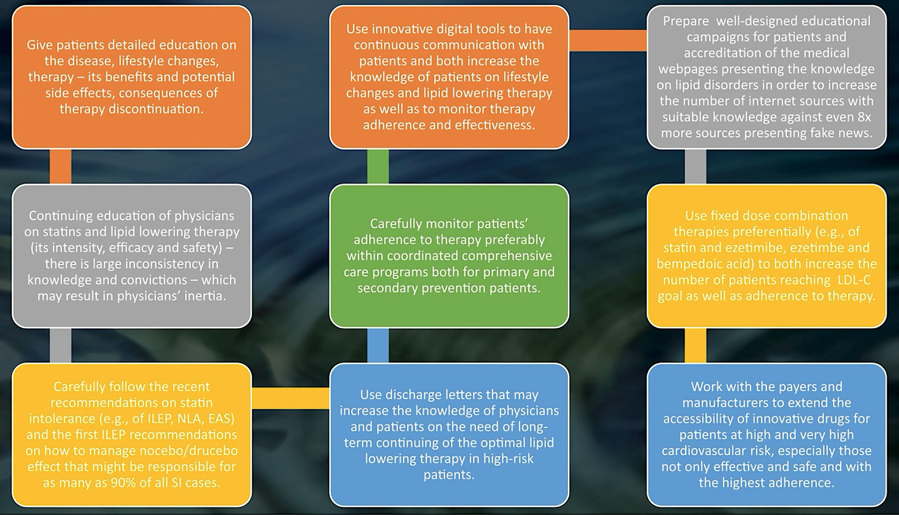
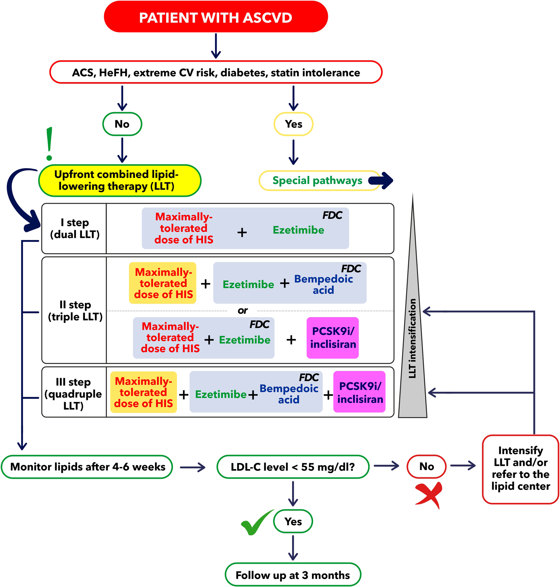
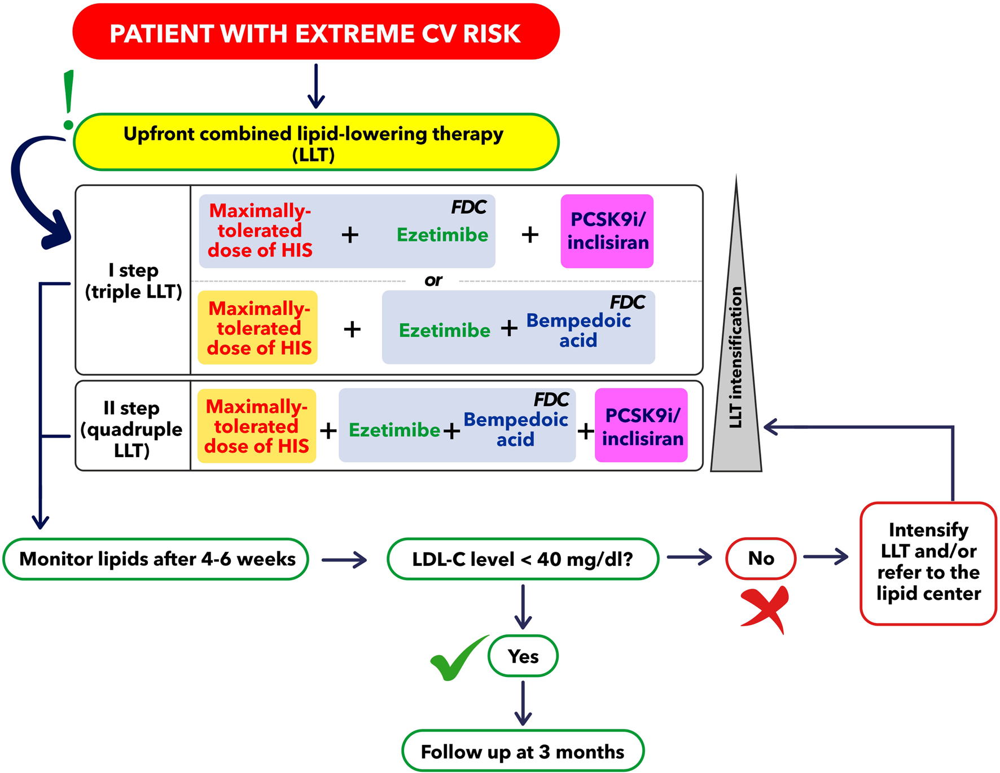
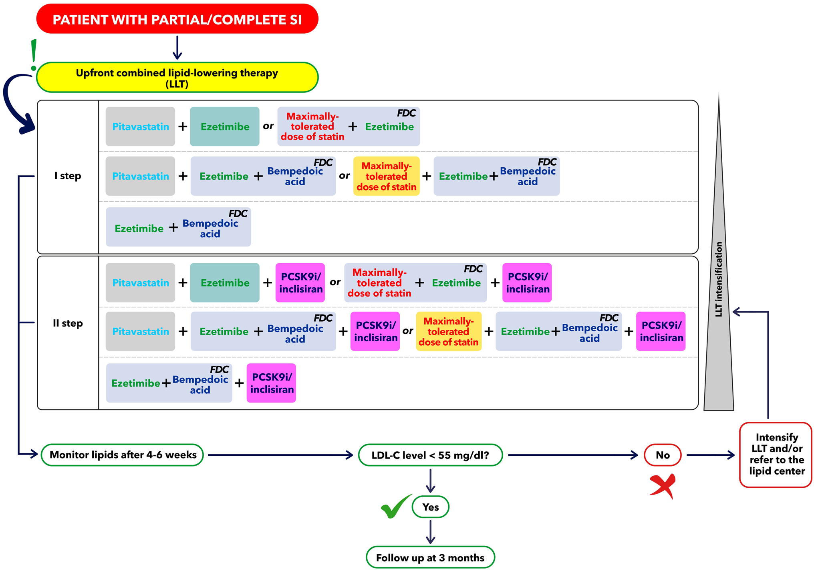
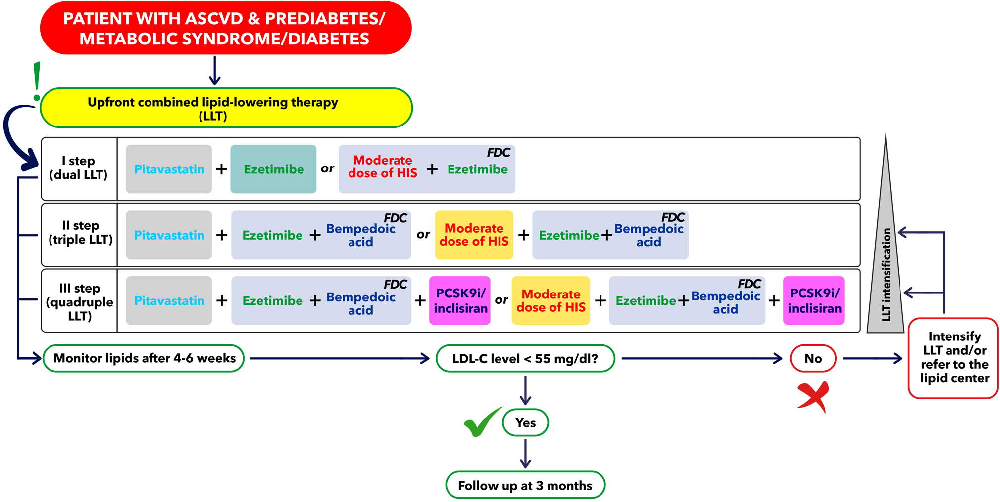

  

    

      
&lt; 40 mg/dL

      
Đích LDL-C Cực Kỳ Nghiêm Ngặt (Extreme CV Risk)

    

    

      
Upfront FDC

      
Phối Hợp Đôi / Ba Sớm Ngay Khi Xuất Viện

    

    

      
NNT = 21

      
Giảm Tử Vong Chung Sau ACS Từ Ngày Thứ 52

    

    

      
90% Drucebo

      
Bất Dung Nạp Cơ Thực Tế Rất Thấp (5.9%–7%)

    

  

  

    

      
⚡

      

        
Can Thiệp Càng Sớm Càng Tốt (Upfront)

        
Chuyển đổi từ tư duy bậc thang chậm chạp (stepwise) sang khởi trị phối hợp đôi/ba ngay từ đầu (Upfront Combination) bằng viên phối hợp cố định liều (FDC) để đập tan sự trì trệ lâm sàng.

      

    

    

      
🎯

      

        
Đích LDL-C &lt; 40 mg/dL Đột Phá

        
Xác lập phân nhóm Nguy cơ tim mạch cực kỳ cao (Extreme CV Risk) với mục tiêu LDL-C &lt; 40 mg/dL (1.0 mmol/L) bằng phác đồ phối hợp ba (Triple LLT) hoặc bốn (Quadruple LLT).

      

    

    

      
🛡️

      

        
Thuốc Thế Hệ Mới &amp; Xóa Bỏ Nỗi Sợ Cơ

        
Ứng dụng Axit Bempedoic (chọn lọc gan ACSVL1 không gây đau cơ), Pitavastatin (không gây NOD), Inclisiran (siRNA tiêm 2 lần/năm), giải mã hiệu ứng tâm lý Drucebo/Nocebo.

      

    

  

  

    <a href="#sec-1" class="quickmenu-item active">1. Gánh Nặng &amp; Khoảng Trống</a>
    <a href="#sec-2" class="quickmenu-item">2. Phối Hợp Sớm &amp; RCT</a>
    <a href="#sec-3" class="quickmenu-item">3. Thuốc Mới &amp; Drucebo</a>
    <a href="#sec-4" class="quickmenu-item">4. Phác Đồ Tổng Quát Fig 2</a>
    <a href="#sec-5" class="quickmenu-item">5. 3 Phân Nhóm Đặc Biệt</a>
    <a href="#sec-6" class="quickmenu-item">6. Thư Xuất Viện Chuẩn</a>
    <a href="#sec-7" class="quickmenu-item">7. CDSS ILEP 2024</a>
  

  <!-- ===================================================================== -->
  <!-- SECTION 1: DỊCH TỄ HỌC & KHOẢNG TRỐNG THỰC TẾ -->
  <!-- ===================================================================== -->
  

    

      📊
      <h2 class="sec-title">Phần 1: Bối Cảnh Dịch Tễ Học, Gánh Nặng Bệnh Tim Thiếu Máu Cục Bộ &amp; Khoảng Trống Thực Tế</h2>
    

    

      

        💡
        

          <strong>Tuyên Ngôn Đồng Thuận ILEP 2024 (Drugs 2024;84:1541-1577):</strong>
          Hội đồng Chuyên gia Lipid Quốc tế (International Lipid Expert Panel - ILEP) công bố bản đồng thuận lâm sàng toàn diện nhằm giải quyết bài toán nhức nhối nhất trong tim mạch: <em>Làm thế nào để đưa phần lớn bệnh nhân sau Hội chứng vành cấp (ACS) và bệnh tim mạch do xơ vữa (ASCVD) đạt được mục tiêu LDL-C nhanh nhất, an toàn nhất và duy trì bền vững nhất?</em>
        

      

      
1. Gánh Nặng Dịch Tễ Học Toàn Cầu Theo Nghiên Cứu GBD 2022

      

        

          
9 Triệu Ca Tử Vong Do IHD Hàng Năm

          

            Theo nghiên cứu Gánh nặng bệnh tật toàn cầu (Global Burden of Disease - GBD) năm 2022, ước tính có <strong>hơn 315 triệu ca mắc bệnh tim thiếu máu cục bộ (IHD)</strong>, đóng góp vào <strong>hơn 9 triệu ca tử vong mỗi năm trên toàn thế giới</strong>.
          

        

        

          
4.5 Triệu Tử Vong Do Trực Tiếp Tăng LDL-C

          

            Trong số 9 triệu ca tử vong do IHD, có đến <strong>4.5 triệu ca tử vong (chiếm đúng 50%)</strong> được xác định là do trực tiếp liên quan đến nồng độ cholesterol lipoprotein tỷ trọng thấp (LDL-C) tăng cao kéo dài trong tuần hoàn.
          

        

        

          
Nguyên Lý Nền Tảng Trong Kiểm Soát Lipid

          

            • <em>"Càng thấp càng tốt và duy trì càng lâu càng tốt"</em> (<strong>Lower is better for longer</strong>). 
            • Bằng chứng đương đại bổ sung thêm nguyên tắc sống còn: <em>"Can thiệp càng sớm càng tốt"</em> (<strong>The earlier the better</strong>).
          

        

        

          
Khả Năng Phòng Ngừa Tuyệt Đối

          

            Hội đồng chuyên gia nhấn mạnh phần lớn gánh nặng tử vong và tàn phế của ASCVD <strong>hoàn toàn có thể phòng ngừa và thay đổi được</strong> nếu bệnh nhân được tiếp cận các liệu pháp hạ lipid máu tích cực, kịp thời và không bị trì hoãn.
          

        

      

      
2. Khoảng Trống Thất Vọng Giữa Hướng Dẫn Điều Trị &amp; Thực Tế Lâm Sàng (DA VINCI &amp; SANTORINI)

      

        Mặc dù các hướng dẫn quốc tế (ESC/EAS, ACC/AHA) liên tục thắt chặt mục tiêu LDL-C, thực tế lâm sàng cho thấy tỷ lệ bệnh nhân đạt đích thấp đến mức báo động:
      

      

        <table class="regimen-table">
          <thead>
            <tr>
              <th style="width: 25%;">Nghiên Cứu / Khảo Sát</th>
              <th style="width: 35%;">Quần Thể &amp; Phương Pháp</th>
              <th style="width: 40%;">Thực Trạng Kiểm Soát LDL-C Báo Động</th>
            </tr>
          </thead>
          <tbody>
            <tr>
              <td class="source-cell"><strong>Nghiên Cứu DA VINCI (2021)</strong></td>
              <td>Khảo sát trên diện rộng tại 18 quốc gia Châu Âu đánh giá việc thực thi hướng dẫn ESC/EAS 2019.</td>
              <td>
                • Chỉ có <strong>17% bệnh nhân dự phòng cấp 1 nguy cơ rất cao</strong> đạt mục tiêu LDL-C. 
                • Chỉ có <strong>22% bệnh nhân dự phòng cấp 2 (đã có ASCVD)</strong> đạt đích. 
                • Khu vực Trung và Đông Âu (CEE): Tồi tệ nhất, <strong>chỉ 13% bệnh nhân nguy cơ rất cao đạt đích LDL-C &lt; 55 mg/dL (1.4 mmol/L)</strong>.
              </td>
            </tr>
            <tr>
              <td class="source-cell"><strong>Nghiên Cứu SANTORINI (2020–2021)</strong></td>
              <td>Đánh giá kiểm soát lipid ở người nguy cơ cao và rất cao tại Tây Âu (N = 9,044).</td>
              <td>
                • <strong>22% bệnh nhân nguy cơ cao hoặc rất cao hoàn toàn không nhận được bất kỳ thuốc hạ lipid máu nào</strong>. 
                • Chỉ có <strong>20.1% tổng số bệnh nhân đạt được mục tiêu</strong> điều trị theo khuyến cáo của hướng dẫn.
              </td>
            </tr>
          </tbody>
        </table>
      

      
3. Nguyên Nhân Gốc Rễ: Sự Trì Trệ Lâm Sàng &amp; Những Sai Lầm Thực Hành

      

        

          
"Sự Trì Trệ Lâm Sàng" (Therapeutic Inertia)

          

            Bác sĩ không tăng liều statin hoặc không bổ sung thuốc non-statin kịp thời khi bệnh nhân chưa đạt đích. Xu hướng kê đơn statin liều thấp/trung bình vì quá lo sợ tác dụng phụ ngoài ý muốn mà không có bằng chứng khoa học.
          

        

        

          
Sai Lầm Về "Kỳ Nghỉ Statin" (Statin Holidays)

          

            Nhiều bác sĩ khuyên bệnh nhân tạm ngừng statin vài tháng trong năm để "cho gan nghỉ ngơi" - một thực hành hoàn toàn phản khoa học, làm tăng vọt biến thiên LDL-C và gây bùng phát biến cố mạch vành cấp tái phát.
          

        

        

          
Tỷ Lệ Bỏ Thuốc Cao Ở Bệnh Nhân

          

            Thời gian trung vị để bệnh nhân tự ý ngừng statin sau biến cố tim mạch chỉ là <strong>khoảng 15 tháng</strong>. Nguyên nhân chủ yếu do gánh nặng uống nhiều viên thuốc rời rạc và nỗi lo sợ mơ hồ về tổn thương cơ/gan.
          

        

      

    

  

  <!-- ===================================================================== -->
  <!-- SECTION 2: CHIẾN LƯỢC PHỐI HỢP THUỐC SỚM (UPFRONT) & BẰNG CHỨNG RCT -->
  <!-- ===================================================================== -->
  

    

      💊
      <h2 class="sec-title">Phần 2: Chiến Lược Phối Hợp Thuốc Sớm (Upfront Combination) — Bước Đột Phá Lịch Sử</h2>
    

    

      

        

          <strong style="color: var(--color-success, #10b981); font-size: 1.05rem;">Khuyến Cáo Cốt Lõi ILEP: Khởi Trị Phối Hợp Thuốc Sớm Ngay Từ Đầu (Upfront Combination)</strong>
          Khuyến cáo Mạnh • Mức Bằng chứng A
        

        

          Để khắc phục triệt để sự chậm trễ của phương pháp bậc thang truyền thống (chỉ thêm thuốc sau khi đơn trị liệu statin thất bại sau 4–12 tuần), ILEP 2024 khuyến cáo <strong>khởi trị ngay liệu pháp phối hợp đôi (Statin liều dung nạp tối đa + Ezetimibe, ưu tiên dạng viên FDC) ngay trong đợt nằm viện hoặc tại thời điểm xuất viện</strong> cho tất cả bệnh nhân sau Hội chứng vành cấp (ACS) và bệnh nhân tim mạch do xơ vữa (ASCVD).
        

      

      
1. Bằng Chứng Thử Nghiệm Ngẫu Nhiên Đối Chứng RACING (Hàn Quốc)

      

        

          
Thiết Kế Nghiên Cứu RACING (N = 3,780)

          

            Thực hiện trên 3,780 bệnh nhân ASCVD (trong đó 2,497 người có tiền sử can thiệp mạch vành qua da PCI). So sánh giữa:
            <ul style="margin: 0.35rem 0 0 1rem; padding: 0; font-size: 0.82rem; line-height: 1.55;">
              <li><strong>Nhánh phối hợp đôi:</strong> Rosuvastatin 10 mg + Ezetimibe 10 mg (Statin hoạt lực trung bình + Ezetimibe).</li>
              <li><strong>Nhánh statin đơn trị liều cao:</strong> Rosuvastatin 20 mg (Statin hoạt lực cao đơn trị).</li>
            </ul>
          

        

        

          
Kết Quả Vượt Trội Sau 3 Năm

          

            • <strong>Không kém hơn về biến cố tim mạch (MACE):</strong> 9.1% so với 9.9% (đạt tiêu chí non-inferiority). 
            • <strong>Tăng tỷ lệ đạt đích LDL-C &lt; 70 mg/dL:</strong> 73% so với 55% (p &lt; 0.001). 
            • <strong>Giảm tỷ lệ ngừng thuốc do tác dụng phụ:</strong> 4.8% so với 8.2% (p &lt; 0.001), cải thiện tuân thủ rõ rệt trên người cao tuổi và bệnh nhân đái tháo đường.
          

        

      

      
2. Bằng Chứng Dữ Liệu Thế Giới Thực (RWE) Từ Đăng Ký Quốc Gia PL-ACS (Ba Lan)

      

        

          
Cỡ Mẫu Khổng Lồ 38,023 Bệnh Nhân Xuất Viện Sau ACS

          

            Phân tích hồi cứu từ Hệ thống đăng ký Hội chứng vành cấp Ba Lan (PL-ACS) trên 38,023 bệnh nhân sau nhồi máu cơ tim, so sánh giữa nhóm dùng statin đơn trị liệu và nhóm được khởi trị <strong>phối hợp Statin + Ezetimibe ngay từ đầu (Upfront)</strong>.
          

        

        

          
Giảm Mạnh Tử Vong Mọi Nguyên Nhân Từ Ngày Thứ 52!

          

            Nhóm phối hợp thuốc sớm giúp giảm tử vong có ý nghĩa thống kê ngoạn mục:
            <ul style="margin: 0.35rem 0 0 1rem; padding: 0; font-size: 0.82rem; line-height: 1.55;">
              <li><strong>Tử vong 1 năm:</strong> 3.5% so với 5.9% (p &lt; 0.001).</li>
              <li><strong>Tử vong 2 năm:</strong> 4.3% so với 7.8% (p &lt; 0.001).</li>
              <li><strong>Tử vong 3 năm:</strong> <strong>5.5% so với 10.2%</strong> (giảm tuyệt đối 4.7%).</li>
              <li><strong>Chỉ số NNT (Number Needed to Treat):</strong> Cực kỳ ấn tượng <strong>NNT = 21</strong>. Đường cong sinh tồn tách biệt ngay từ <strong>ngày thứ 52</strong> sau biến cố.</li>
            </ul>
          

        

      

      
3. Phân Tích Gộp Banach &amp; Cộng Sự (ESC Congress 2024, N = 106,358)

      

        <table class="regimen-table">
          <thead>
            <tr>
              <th style="width: 25%;">Tiêu Chí Đánh Giá (End-points)</th>
              <th style="width: 35%;">Mức Độ Giảm Biến Cố Của Phối Hợp Statin + Ezetimibe Upfront</th>
              <th style="width: 40%;">Ý Nghĩa Thống Kê &amp; Lâm Sàng</th>
            </tr>
          </thead>
          <tbody>
            <tr>
              <td class="source-cell"><strong>Hạ nồng độ LDL-C</strong></td>
              <td>Giảm thêm trung bình <strong>12.13 mg/dL (0.31 mmol/L)</strong></td>
              <td>p &lt; 0.0001 (So với chỉ tăng liều statin đơn trị)</td>
            </tr>
            <tr>
              <td class="source-cell"><strong>Tử vong do mọi nguyên nhân</strong></td>
              <td><strong>Giảm 25% nguy cơ</strong> (RR = 0.75, 95% CI: 0.65–0.86)</td>
              <td>p &lt; 0.001 (Cứu sống 25 trên 1000 bệnh nhân)</td>
            </tr>
            <tr>
              <td class="source-cell"><strong>Tử vong do tim mạch (CVD)</strong></td>
              <td><strong>Giảm 25% nguy cơ</strong> (RR = 0.75, 95% CI: 0.62–0.91)</td>
              <td>p = 0.003</td>
            </tr>
            <tr>
              <td class="source-cell"><strong>Biến cố tim mạch chính (MACE)</strong></td>
              <td><strong>Giảm 28% nguy cơ</strong> (RR = 0.72, 95% CI: 0.63–0.82)</td>
              <td>p &lt; 0.0001</td>
            </tr>
          </tbody>
        </table>
      

      
4. Ưu Thế Vượt Trội Của Viên Phối Hợp Liều Cố Định (FDC - Fixed Dose Combination)

      

        Một nghiên cứu quan sát trên <strong>311,242 bệnh nhân</strong> so sánh việc sử dụng cùng một mức liều statin + ezetimibe dưới dạng 2 viên rời rạc so với 1 viên phối hợp cố định liều (FDC):
      

      

        

          
Mức Giảm LDL-C Thực Tế

          

            Nhóm sử dụng viên FDC giúp <strong>giảm nồng độ LDL-C mạnh hơn đáng kể: 28.4% so với chỉ 19.4% ở nhóm dùng 2 viên rời</strong> (p &lt; 0.001), do loại bỏ hoàn toàn tình trạng bệnh nhân tự ý bỏ bớt một trong hai viên thuốc.
          

        

        

          
Tỷ Lệ Đạt Mục Tiêu Kiểm Soát

          

            • Đạt đích LDL-C &lt; 70 mg/dL: <strong>31.5% ở nhóm FDC so với 21.0% ở nhóm viên rời</strong>. 
            • Đạt đích nghiêm ngặt LDL-C &lt; 55 mg/dL: <strong>11.0% ở nhóm FDC so với chỉ 5.7% ở nhóm viên rời</strong> (tăng gấp đôi tỷ lệ đạt đích).
          

        

      

    

  

  <!-- ===================================================================== -->
  <!-- SECTION 3: DƯỢC LÝ HỌC THẾ HỆ MỚI & GIẢI MÃ HIỆU ỨNG DRUCEBO -->
  <!-- ===================================================================== -->
  

    

      🧪
      <h2 class="sec-title">Phần 3: Dược Lý Học Thuốc Thế Hệ Mới &amp; Giải Mã Hiện Tượng Bất Dung Nạp Statin (Hiệu Ứng Drucebo)</h2>
    

    

      
1. Axit Bempedoic (Bempedoic Acid - BA) — Cơ Chế Myalgia-Free Đột Phá

      

        

          
Hoạt Hóa Chọn Lọc Gan Bởi Enzym ACSVL1

          

            Bempedoic acid là một tiền chất (prodrug), bắt buộc phải được chuyển hóa hoạt hóa bởi enzym <strong>very long-chain acyl-CoA synthetase-1 (ACSVL1)</strong>. Enzym này phân bố dồi dào ở gan nhưng <strong>hoàn toàn vắng mặt trong mô cơ vân</strong>. Do đó, thuốc ức chế enzym ATP-citrate lyase (ACL) tại gan mà <strong>không gây đau cơ hay yếu cơ (myalgias)</strong>.
          

        

        

          
Kết Cục Lâm Sàng Từ Thử Nghiệm CLEAR Outcomes (N = 13,970)

          

            Nghiên cứu trên bệnh nhân bất dung nạp statin: Giảm 21.1% LDL-C, <strong>giảm 13% biến cố MACE gộp</strong> (HR 0.87, NNT = 63), giảm 23% nhồi máu cơ tim, giảm 19% tái thông mạch vành. Đặc biệt, thuốc giúp <strong>hạ mạnh nồng độ hsCRP đến hơn 40% trong pha 3 và 21.6% trong thử nghiệm kết cục</strong>.
          

        

      

      
2. Pitavastatin — Statin Mạnh An Toàn Trên Chuyển Hóa Đường (Không Gây NOD)

      

        

          
Cơ Chế Không Ảnh Hưởng Con Đường PI3K

          

            Khác với Atorvastatin hay Rosuvastatin liều cao có thể làm tăng nhẹ nguy cơ đái tháo đường mới khởi phát (NOD), Pitavastatin không ức chế con đường phosphatidylinositol 3-kinase (PI3K). Do đó, thuốc <strong>không gây tăng đường huyết, không làm tăng nguy cơ NOD, và cải thiện chỉ số FBG/HbA1c</strong>.
          

        

        

          
Thử Nghiệm REPRIEVE (N = 7,769 Bệnh Nhân Nhiễm HIV)

          

            Sử dụng Pitavastatin 4 mg/ngày trên bệnh nhân HIV có nguy cơ tim mạch thấp-trung bình giúp <strong>giảm mạnh 35% biến cố MACE</strong> (4.81 so với 7.32 trên 1000 người-năm). Ngoài ra, thuốc giúp <strong>giảm 33% nguy cơ tiến triển mảng bám mạch vành không vôi hóa</strong> trên chụp cắt lớp mạch vành (CCTA).
          

        

      

      
3. Inclisiran — Công Nghệ siRNA Tiêm Định Kỳ 2 Lần / Năm

      

        Inclisiran là chuỗi siRNA mạch kép liên hợp GalNAc, nhắm trúng đích mRNA PCSK9 trong bào tương gan. Dữ liệu từ <strong>ORION-3</strong> (theo dõi 4 năm hạ 44.2% LDL-C) và <strong>VICTORION-Initiate</strong> chứng minh chiến lược <em>Inclisiran-first</em> giúp <strong>hạ 60% LDL-C và đưa 81.8% bệnh nhân ASCVD đạt mức LDL-C &lt; 70 mg/dL</strong> với phác đồ tiêm cực kỳ thuận tiện: liều đầu, lặp lại sau 3 tháng, và sau đó <strong>duy trì chỉ 2 lần/năm</strong>.
      

      
4. Bản Chất Thật Của Bất Dung Nạp Statin &amp; Hiệu Ứng Drucebo / Nocebo

      

        

          
Tỷ Lệ Bất Dung Nạp Thực Tế Cực Kỳ Thấp (5.9% – 7%)

          

            Phân tích gộp trên <strong>4.2 triệu bệnh nhân</strong> của ILEP chứng minh tỷ lệ bất dung nạp statin khách quan chỉ chiếm từ <strong>5.9% đến 7%</strong>. Đặc biệt, tỷ lệ bất dung nạp hoàn toàn (không thể dung nạp bất kỳ liều nào của bất kỳ statin nào) là <strong>cực kỳ hiếm gặp, dưới 3%</strong>.
          

        

        

          
90% Triệu Chứng Đau Cơ Là Do Hiệu Ứng Drucebo!

          

            <strong>Hiệu ứng Drucebo (Dose-Related or Drug-related Nocebo Effect)</strong>: Bệnh nhân tự phát sinh cảm giác đau mỏi cơ do tâm lý lo sợ hoặc đọc tin giả tiêu cực trên internet, không phải do cơ chế độc tính cơ thực thụ. ILEP đề xuất kế hoạch <strong>PLIP (Personalized Lipid Intervention Plan)</strong> kết hợp giáo dục người bệnh giúp <strong>95% số bệnh nhân từng báo cáo bất dung nạp statin đạt mục tiêu LDL-C thành công</strong>!
          

        

      

      
5. 8 Hoạt Động Cải Thiện Tuân Thủ &amp; Phòng Ngừa Ngừng Statin (Figure 1 ILEP 2024)

      <!-- FIG CARD 1 -->
      

        
        

          
Figure 1. The Summary of the Different Activities That Might Effectively Improve Statin Adherence and Avoid Discontinuation

          8 nhóm giải pháp đồng bộ được ILEP 2024 khuyến nghị nhằm nâng cao tỷ lệ tuân thủ điều trị hạ lipid máu và ngăn chặn tỷ lệ bỏ thuốc (Trang 1564, tài liệu gốc).
        

      

      

        <table class="regimen-table">
          <thead>
            <tr>
              <th style="width: 25%;">Nhóm Hoạt Động (Activity)</th>
              <th style="width: 75%;">Nội Dung Khuyến Nghị Lâm Sàng Của ILEP</th>
            </tr>
          </thead>
          <tbody>
            <tr>
              <td class="source-cell"><strong>1. Giáo dục bệnh nhân chi tiết</strong></td>
              <td>Giải thích rõ ràng về căn nguyên mảng xơ vữa, lợi ích bảo vệ tim mạch sống còn, tác dụng phụ thực tế của thuốc và hệ quả nguy hiểm của việc tự ý ngừng thuốc.</td>
            </tr>
            <tr>
              <td class="source-cell"><strong>2. Ứng dụng công nghệ số</strong></td>
              <td>Sử dụng ứng dụng di động, tin nhắn nhắc thuốc tự động và thiết bị đo theo dõi liên tục để tăng cường giao tiếp 2 chiều giữa bác sĩ và người bệnh.</td>
            </tr>
            <tr>
              <td class="source-cell"><strong>3. Chiến dịch truyền thông sạch</strong></td>
              <td>Phối hợp với các hội chuyên khoa kiểm định các trang thông tin y khoa chính thống nhằm đẩy lùi tin giả (fake news) và định kiến sai lầm về statin trên mạng xã hội.</td>
            </tr>
            <tr>
              <td class="source-cell"><strong>4. Đào tạo liên tục cho bác sĩ</strong></td>
              <td>Cập nhật liên tục kiến thức cho đội ngũ y tế cơ sở và bác sĩ gia đình về hoạt lực mạnh, tính an toàn cao của statin để xóa bỏ sự trì trệ điều trị.</td>
            </tr>
            <tr>
              <td class="source-cell"><strong>5. Chăm sóc toàn diện đa chuyên khoa</strong></td>
              <td>Quản lý người bệnh chặt chẽ trong các chương trình phục hồi chức năng tim mạch và dự phòng thứ phát phối hợp giữa tim mạch, nội tiết, dinh dưỡng.</td>
            </tr>
            <tr>
              <td class="source-cell"><strong>6. Ưu tiên viên phối hợp FDC</strong></td>
              <td>Kê đơn viên phối hợp cố định liều (Statin/Ezetimibe, Ezetimibe/Bempedoic acid) để giảm số lượng viên thuốc phải uống mỗi ngày xuống còn 1 viên duy nhất.</td>
            </tr>
            <tr>
              <td class="source-cell"><strong>7. Quản lý bất dung nạp &amp; Drucebo</strong></td>
              <td>Áp dụng thang điểm chẩn đoán khách quan của ILEP/NLA/EAS để bóc tách hiệu ứng Drucebo, trấn an tâm lý và cá thể hóa phác đồ thay vì ngừng thuốc vội vã.</td>
            </tr>
            <tr>
              <td class="source-cell"><strong>8. Mẫu thư xuất viện chuẩn hóa</strong></td>
              <td>Sử dụng mẫu thư xuất viện chuẩn hóa ghi rõ mục tiêu LDL-C cần đạt và lộ trình nâng bậc thuốc cho bác sĩ tuyến dưới và người bệnh.</td>
            </tr>
          </tbody>
        </table>
      

    

  

  <!-- ===================================================================== -->
  <!-- SECTION 4: PHÁC ĐỒ HẠ LIPID TỔNG QUÁT CHO ASCVD (FIGURE 2) -->
  <!-- ===================================================================== -->
  

    

      🗺️
      <h2 class="sec-title">Phần 4: Phác Đồ Hạ Lipid Máu Tối Ưu Tổng Quát Cho Bệnh Nhân ASCVD (Figure 2)</h2>
    

    

      <!-- FIG CARD 2 -->
      

        
        

          
Figure 2. Overall Pathway of Optimal LLT in ASCVD Patients

          Phác đồ bậc thang nâng cao bắt đầu bằng liệu pháp phối hợp đôi sớm (Upfront Dual LLT) hướng tới đích LDL-C &lt; 55 mg/dL (Trang 1566, tài liệu gốc).
        

      

      
Lưu Đồ Thuật Toán Trực Quan Hóa (Editorial SVG Flowchart Fig 2)

      

        Mô hình hóa toàn diện thuật toán Figure 2 bằng đồ họa xuất bản Inline SVG vector chuẩn CliniPortal 2.0:
      

      <!-- EDITORIAL SVG FLOWCHART FIG 2 -->
      

        <svg viewBox="0 0 960 560" width="100%" height="auto" xmlns="http://www.w3.org/2000/svg" style="font-family: system-ui, -apple-system, sans-serif;">
          <defs>
            <linearGradient id="g-red-hdr" x1="0%" y1="0%" x2="100%" y2="0%">
              <stop offset="0%" stop-color="#dc2626" />
              <stop offset="100%" stop-color="#991b1b" />
            </linearGradient>
            <linearGradient id="g-green-hdr" x1="0%" y1="0%" x2="100%" y2="0%">
              <stop offset="0%" stop-color="#16a34a" />
              <stop offset="100%" stop-color="#15803d" />
            </linearGradient>
            <marker id="arrow-f2" viewBox="0 0 10 10" refX="6" refY="5" markerWidth="6" markerHeight="6" orient="auto">
              <path d="M 0 0 L 10 5 L 0 10 z" fill="#64748b" />
            </marker>
          </defs>

          <!-- Top Banner: PATIENT WITH ASCVD -->
          <rect x="280" y="15" width="400" height="42" rx="21" fill="url(#g-red-hdr)" />
          <text x="480" y="41" font-size="14" font-weight="800" fill="#ffffff" text-anchor="middle" letter-spacing="0.5">
            BỆNH NHÂN ĐÃ XÁC ĐỊNH MẮC ASCVD
          </text>

          <path d="M 480 57 L 480 80" stroke="#64748b" stroke-width="2" marker-end="url(#arrow-f2)" />

          <!-- Decision node: Phân nhóm đặc biệt -->
          <rect x="180" y="82" width="600" height="36" rx="18" fill="#f8fafc" stroke="#dc2626" stroke-width="2" />
          <text x="480" y="105" font-size="12" font-weight="700" fill="#991b1b" text-anchor="middle">
            Có tiêu chuẩn đặc biệt? (Nguy cơ cực kỳ cao, Bất dung nạp statin, Đái tháo đường/RL chuyển hóa)
          </text>

          <!-- Branching No vs Yes -->
          <path d="M 330 118 L 330 150" stroke="#64748b" stroke-width="2" marker-end="url(#arrow-f2)" />
          <path d="M 630 118 L 630 150" stroke="#64748b" stroke-width="2" marker-end="url(#arrow-f2)" />

          <circle cx="330" cy="134" r="14" fill="#ffffff" stroke="#16a34a" stroke-width="2" />
          <text x="330" y="139" font-size="11" font-weight="800" fill="#16a34a" text-anchor="middle">NO</text>

          <circle cx="630" cy="134" r="14" fill="#ffffff" stroke="#ca8a04" stroke-width="2" />
          <text x="630" y="139" font-size="11" font-weight="800" fill="#ca8a04" text-anchor="middle">YES</text>

          <!-- Node Special Pathways -->
          <rect x="520" y="152" width="220" height="42" rx="8" fill="#fefce8" stroke="#ca8a04" stroke-width="1.5" />
          <text x="630" y="174" font-size="12" font-weight="700" fill="#a16207" text-anchor="middle">Chuyển Phác Đồ Riêng</text>
          <text x="630" y="188" font-size="10" fill="#854d0e" text-anchor="middle">(Xem chi tiết Mục 5: Fig 3, 4, 5)</text>

          <!-- Banner: Upfront combined LLT -->
          <rect x="80" y="152" width="380" height="42" rx="8" fill="#fef08a" stroke="#ca8a04" stroke-width="2" />
          <text x="270" y="174" font-size="12" font-weight="800" fill="#854d0e" text-anchor="middle">
            KHỞI TRỊ PHỐI HỢP THUỐC SỚM (UPFRONT LLT)
          </text>
          <text x="270" y="188" font-size="10" fill="#713f12" text-anchor="middle">Ưu tiên hàng đầu dạng viên phối hợp cố định liều FDC</text>

          <path d="M 270 194 L 270 215" stroke="#64748b" stroke-width="2" marker-end="url(#arrow-f2)" />

          <!-- Big Container: 3 Steps -->
          <rect x="60" y="218" width="620" height="230" rx="8" fill="var(--color-surface-2, #f8fafc)" stroke="#94a3b8" stroke-width="1.5" />

          <!-- Step 1 (Dual LLT) -->
          <rect x="75" y="230" width="100" height="52" rx="4" fill="#e2e8f0" />
          <text x="125" y="252" font-size="11" font-weight="700" fill="#1e293b" text-anchor="middle">BƯỚC 1</text>
          <text x="125" y="268" font-size="9.5" fill="#475569" text-anchor="middle">(Phối hợp đôi)</text>

          <rect x="185" y="230" width="480" height="52" rx="4" fill="#ffffff" stroke="#cbd5e1" />
          <text x="260" y="260" font-size="12" font-weight="700" fill="#dc2626">Statin hoạt lực cao tối đa</text>
          <text x="375" y="260" font-size="14" font-weight="700" fill="#64748b">+</text>
          <text x="440" y="260" font-size="12" font-weight="700" fill="#16a34a">Ezetimibe (10 mg)</text>
          <rect x="560" y="244" width="90" height="24" rx="4" fill="#dcfce7" stroke="#16a34a" />
          <text x="605" y="260" font-size="10" font-weight="800" fill="#15803d" text-anchor="middle">VIÊN FDC</text>

          <!-- Step 2 (Triple LLT) -->
          <rect x="75" y="295" width="100" height="68" rx="4" fill="#e2e8f0" />
          <text x="125" y="325" font-size="11" font-weight="700" fill="#1e293b" text-anchor="middle">BƯỚC 2</text>
          <text x="125" y="341" font-size="9.5" fill="#475569" text-anchor="middle">(Phối hợp ba)</text>

          <rect x="185" y="295" width="480" height="68" rx="4" fill="#ffffff" stroke="#cbd5e1" />
          <text x="200" y="322" font-size="11" fill="var(--color-text, #1e293b)">• Statin tối đa + Ezetimibe FDC + <strong style="color: #0284c7;">Axit Bempedoic (180 mg)</strong></text>
          <text x="200" y="348" font-size="11" fill="var(--color-text, #1e293b)">• HOẶC Statin tối đa + Ezetimibe FDC + <strong style="color: #c026d3;">Ức chế PCSK9 (mAb / siRNA)</strong></text>

          <!-- Step 3 (Quadruple LLT) -->
          <rect x="75" y="375" width="100" height="58" rx="4" fill="#e2e8f0" />
          <text x="125" y="402" font-size="11" font-weight="700" fill="#1e293b" text-anchor="middle">BƯỚC 3</text>
          <text x="125" y="418" font-size="9.5" fill="#475569" text-anchor="middle">(Phối hợp bốn)</text>

          <rect x="185" y="375" width="480" height="58" rx="4" fill="#ffffff" stroke="#cbd5e1" />
          <text x="200" y="400" font-size="11" font-weight="700" fill="#1e293b">Phối hợp đồng thời 4 cơ chế tác động:</text>
          <text x="200" y="420" font-size="10.5" fill="var(--color-text, #1e293b)">Statin liều tối đa + Ezetimibe FDC + <strong style="color: #0284c7;">Axit Bempedoic</strong> + <strong style="color: #c026d3;">Ức chế PCSK9</strong></text>

          <!-- Arrow from container to evaluation -->
          <path d="M 370 448 L 370 475" stroke="#64748b" stroke-width="2" marker-end="url(#arrow-f2)" />

          <!-- Evaluation Node -->
          <rect x="160" y="478" width="420" height="48" rx="24" fill="#ffffff" stroke="#0284c7" stroke-width="2" />
          <text x="370" y="500" font-size="12" font-weight="800" fill="#0369a1" text-anchor="middle">
            ĐO LẠI LIPID SAU 4 – 6 TUẦN ĐIỀU TRỊ
          </text>
          <text x="370" y="516" font-size="11" font-weight="700" fill="#0284c7" text-anchor="middle">
            Đã đạt mục tiêu LDL-C &lt; 55 mg/dL (1.4 mmol/L)?
          </text>

          <!-- Branch to Success -->
          <path d="M 580 502 L 720 502" stroke="#16a34a" stroke-width="2" marker-end="url(#arrow-f2)" />
          <rect x="730" y="478" width="200" height="48" rx="8" fill="#dcfce7" stroke="#16a34a" stroke-width="1.5" />
          <text x="830" y="499" font-size="11" font-weight="700" fill="#15803d" text-anchor="middle">ĐẠT ĐÍCH (&lt; 55 mg/dL)</text>
          <text x="830" y="515" font-size="10" fill="#166534" text-anchor="middle">Duy trì phác đồ • Tái khám 3 tháng</text>

          <!-- Escalation Line -->
          <path d="M 370 526 L 370 545 L 700 545 L 700 330 L 685 330" stroke="#dc2626" stroke-width="1.5" stroke-dasharray="4 3" marker-end="url(#arrow-f2)" />
          <text x="705" y="440" font-size="10" font-weight="700" fill="#dc2626" transform="rotate(90 705 440)">NÂNG BẬC ĐIỀU TRỊ (Intensify LLT)</text>
        </svg>
      

    

  

  <!-- ===================================================================== -->
  <!-- SECTION 5: PHÁC ĐỒ CHO 3 PHÂN NHÓM ĐẶC BIỆT -->
  <!-- ===================================================================== -->
  

    

      🎯
      <h2 class="sec-title">Phần 5: Phác Đồ Hạ Lipid Máu Cho 3 Phân Nhóm Lâm Sàng Đặc Biệt (Figures 3, 4, 5)</h2>
    

    

      <!-- ================= 1. EXTREME CV RISK ================= -->
      
1. Phân Nhóm Nguy Cơ Tim Mạch Cực Kỳ Cao (Extreme CV Risk) — Đích Đột Phá LDL-C &lt; 40 mg/dL

      
      

        🚨
        

          <strong>Khái Niệm Phân Nhóm "Nguy Cơ Cực Kỳ Cao" Của ILEP:</strong>
          Mặc dù hướng dẫn ESC xếp tất cả bệnh nhân sau ACS vào nhóm "nguy cơ rất cao", ILEP nhấn mạnh đây là nhóm không đồng nhất. Bệnh nhân có nguy cơ tái phát biến cố cực kỳ lớn (10%–20% trong vòng 12 tháng đầu) bắt buộc phải được áp dụng <strong>mục tiêu kiểm soát LDL-C đột phá &lt; 40 mg/dL (1.0 mmol/L)</strong> và <strong>khởi trị ngay bằng phác đồ phối hợp ba (Triple LLT)</strong>.
        

      

      

        

          
5 Tiêu Chuẩn Xác Định Nguy Cơ Cực Kỳ Cao

          

            Áp dụng cho bệnh nhân ASCVD <strong>chưa đạt đích dù đã dùng Statin tối đa + Ezetimibe</strong> VÀ có ít nhất một trong các tiêu chí:
            <ul style="margin: 0.35rem 0 0 1rem; padding: 0; font-size: 0.82rem; line-height: 1.55;">
              <li><strong>1. Nhồi máu cơ tim tái phát:</strong> Bị MI kèm một biến cố mạch máu khác trong vòng 2 năm qua.</li>
              <li><strong>2. ACS kèm bệnh đa nhánh mạch vành (MVD).</strong></li>
              <li><strong>3. ACS kèm bệnh động mạch ngoại biên (PAD)</strong> hoặc bệnh đa mạch máu (PVD).</li>
              <li><strong>4. ACS kèm tăng cholesterol máu gia đình (FH).</strong></li>
              <li><strong>5. ACS kèm đái tháo đường</strong> có thêm ít nhất 1 yếu tố: hsCRP &gt; 2 mg/L, bệnh thận mạn, hoặc Lp(a) &gt; 50 mg/dL.</li>
            </ul>
          

        

        

          
Chiến Lược Khởi Trị Phối Hợp Ba Ngay (Upfront Triple LLT)

          

            • <strong>Khởi trị ngay Bước I (Phối hợp ba):</strong> Statin hoạt lực cao tối đa + Ezetimibe FDC + <strong>Ức chế PCSK9 (Evolocumab / Alirocumab / Inclisiran)</strong>. 
            • <em>Lựa chọn thay thế:</em> Statin tối đa + Ezetimibe FDC + <strong>Axit Bempedoic</strong>. 
            • <strong>Bước II (Phối hợp bốn):</strong> Nếu sau 4–6 tuần vẫn chưa đạt <strong>LDL-C &lt; 40 mg/dL</strong>, tiến hành phối hợp đồng thời cả 4 nhóm thuốc.
          

        

      

      <!-- FIG CARD 3 -->
      

        
        

          
Figure 3. Special Pathway for Patients with Extreme CV Risk

          Phác đồ điều trị phân nhóm nguy cơ tim mạch cực kỳ cao với đích kiểm soát đột phá LDL-C &lt; 40 mg/dL (Trang 1567, tài liệu gốc).
        

      

      <!-- ================= 2. STATIN INTOLERANCE ================= -->
      
2. Phân Nhóm Bất Dung Nạp Statin (Statin Intolerance - SI) Đã Xác Định Khách Quan

      

        

          
Bất Dung Nạp Một Phần (Partial SI)

          

            • <strong>Bước 1:</strong> Không nâng liều statin chậm chạp! Dùng ngay <strong>liều statin tối đa có thể dung nạp được</strong> (hoặc chuyển sang <strong>Pitavastatin</strong>) phối hợp với Ezetimibe FDC. 
            • Cân nhắc thêm ngay Axit Bempedoic (Phối hợp ba). 
            • <strong>Bước 2:</strong> Bổ sung thuốc ức chế PCSK9 (Alirocumab / Evolocumab / Inclisiran) nếu chưa đạt LDL-C &lt; 55 mg/dL.
          

        

        

          
Bất Dung Nạp Toàn Phần (Complete SI, &lt; 3%)

          

            • <strong>Bước 1:</strong> Khởi trị ngay phác đồ non-statin đôi: <strong>Ezetimibe + Axit Bempedoic FDC</strong>. 
            • <strong>Bước 2:</strong> Khởi trị phác đồ phối hợp ba non-statin: <strong>Ezetimibe + Axit Bempedoic FDC + Ức chế PCSK9</strong> (Evolocumab / Alirocumab / Inclisiran) để đưa bệnh nhân về đích an toàn.
          

        

      

      <!-- FIG CARD 4 -->
      

        
        

          
Figure 4. Special Pathway for Participants with Objectively Confirmed Partial/Complete Statin Intolerance

          Phác đồ điều trị cá thể hóa cho người bệnh bất dung nạp statin một phần hoặc toàn phần (Trang 1568, tài liệu gốc).
        

      

      <!-- ================= 3. METABOLIC / DIABETES ================= -->
      
3. Phân Nhóm ASCVD Kèm Tiền ĐTĐ / Hội Chứng Chuyển Hóa / Đái Tháo Đường

      

        Trước nguy cơ gia tăng đái tháo đường khởi phát mới (NOD) khi dùng statin mạnh liều cao, ILEP khuyến nghị phác đồ chuyên biệt tối ưu hóa bảo vệ chuyển hóa:
      

      

        

          
Bước 1: Phối Hợp Đôi Bảo Vệ Chuyển Hóa

          

            Khởi trị ngay bằng <strong>Pitavastatin + Ezetimibe FDC</strong> (Pitavastatin không làm tăng đường huyết, cải thiện FBG/HbA1c). Lựa chọn thay thế là phối hợp liều trung bình của statin mạnh (Rosuvastatin 20 mg hoặc Atorvastatin 40 mg) với Ezetimibe FDC.
          

        

        

          
Bước 2 &amp; 3: Bổ Sung Axit Bempedoic &amp; PCSK9i

          

            Bổ sung <strong>Axit Bempedoic</strong> vào phác đồ trên (Axit Bempedoic kiểm soát tốt lipid mà hoàn toàn không gây rối loạn đường huyết). Nếu sau 4–6 tuần chưa đạt LDL-C &lt; 55 mg/dL, tiến hành bổ sung thuốc ức chế PCSK9 (mAb hoặc siRNA).
          

        

      

      <!-- FIG CARD 5 -->
      

        
        

          
Figure 5. Special Pathway for Participants with ASCVD and Metabolic Disorders

          Phác đồ điều trị chuyên biệt cho bệnh nhân ASCVD kèm đái tháo đường hoặc hội chứng chuyển hóa (Trang 1569, tài liệu gốc).
        

      

    

  

  <!-- ===================================================================== -->
  <!-- SECTION 6: CHUYỂN GIAO & THƯ XUẤT VIỆN CHUẨN HÓA -->
  <!-- ===================================================================== -->
  

    

      ✉️
      <h2 class="sec-title">Phần 6: Quản Lý Chuyển Giao Xuất Viện &amp; Mẫu Thư Xuất Viện Tiêu Chuẩn (Table 2)</h2>
    

    

      
Vai Trò Của Mẫu Thư Xuất Viện Tiêu Chuẩn Dành Cho Bệnh Nhân Sau ACS

      

        Khoảng trống thông tin giữa bác sĩ tim mạch can thiệp tại bệnh viện và bác sĩ gia đình (GPs) tại cộng đồng là nguyên nhân hàng đầu khiến bệnh nhân bị trì trệ điều trị hoặc tự ý bỏ thuốc. ILEP đề xuất áp dụng rộng rãi <strong>Mẫu thư xuất viện chuẩn hóa (Table 2)</strong>:
      

      

        <table class="regimen-table">
          <thead>
            <tr>
              <th>Nội Dung Thư Xuất Viện Tiêu Chuẩn Cho Bệnh Nhân Sau Hội Chứng Vành Cấp (ACS) — Table 2 ILEP</th>
            </tr>
          </thead>
          <tbody>
            <tr>
              <td style="padding: 1.25rem; font-size: 0.88rem; line-height: 1.75;">
                

                  <strong>Kính gửi Người bệnh:</strong> Bạn vừa trải qua một đợt <strong>nhồi máu cơ tim (cơn đau tim cấp tính)</strong>. Để giảm thiểu tối đa nguy cơ xảy ra một cơn đau tim tái phát đe dọa tính mạng, cũng như phòng ngừa nguy cơ đột quỵ não hoặc xơ vữa tắc hẹp động mạch chi dưới (gây đau cách hồi bắp chân, có thể dẫn đến cắt cụt chi), việc tuân thủ nghiêm ngặt các hướng dẫn y khoa là bắt buộc.
                

                

                  Sau nhồi máu cơ tim, nồng độ <strong>cholesterol lipoprotein tỷ trọng thấp (LDL-C) bắt buộc phải được kiểm tra định kỳ và phải đạt được mục tiêu LDL-C &lt; 55 mg/dL (&lt; 1.4 mmol/L)</strong> (hoặc <strong>&lt; 40 mg/dL</strong> nếu thuộc nhóm nguy cơ cực kỳ cao). Mục tiêu sống còn này được thực hiện qua lộ trình sau:
                

                <ol style="margin: 0.5rem 0 1rem 1.25rem; padding: 0;">
                  <li><strong>Bước 1:</strong> Sử dụng liều cao nhất dung nạp được của statin hoạt lực mạnh (như Atorvastatin hoặc Rosuvastatin). Bác sĩ sẽ khởi trị phối hợp ngay lập tức statin cùng với ezetimibe (ưu tiên dạng viên 1 viên duy nhất FDC).</li>
                  <li><strong>Bước 2:</strong> Nếu sau 4–6 tuần điều trị, nồng độ LDL-C vẫn duy trì ≥ 55 mg/dL (1.4 mmol/L), hãy bổ sung ngay ezetimibe hoặc axit bempedoic vào phác đồ đang dùng.</li>
                  <li><strong>Bước 3:</strong> Nếu sau 4–6 tuần tiếp theo chỉ số LDL-C vẫn chưa hạ xuống dưới ngưỡng 55 mg/dL, hãy phối hợp thêm thuốc ức chế PCSK9 (Alirocumab, Evolocumab tiêm mỗi 2–4 tuần, hoặc Inclisiran tiêm định kỳ chỉ 2 lần mỗi năm). <em>Hãy luôn chủ động hỏi bác sĩ về các chương trình bảo hiểm hoặc hỗ trợ chi trả</em>.</li>
                  <li><strong>Bước 4:</strong> Song hành cùng việc uống thuốc đúng giờ, bạn bắt buộc phải thay đổi lối sống toàn diện: ăn nhạt, chế độ ăn Địa Trung Hải, tập thể dục đều đặn, kiểm soát chặt chẽ huyết áp, đường huyết và <strong>tuyệt đối không hút thuốc lá</strong>.</li>
                </ol>
              </td>
            </tr>
          </tbody>
        </table>
      

    

  

  <!-- ===================================================================== -->
  <!-- SECTION 7: BỘ TÍNH TOÁN CDSS ILEP 2024 & TRÍCH DẪN AMA -->
  <!-- ===================================================================== -->
  

    

      🩺
      <h2 class="sec-title">Phần 7: Bộ Công Cụ CDSS Tính Toán Lâm Sàng ILEP 2024 &amp; Trích Dẫn Y Văn</h2>
    

    

      
Công Cụ Hỗ Trợ Ra Quyết Định Lâm Sàng (ILEP 2024 Dyslipidemia Decision Support)

      

        Nhập các đặc điểm lâm sàng của bệnh nhân để tự động xác định phân nhóm nguy cơ, mục tiêu LDL-C và phác đồ phối hợp thuốc khuyến nghị:
      

      <!-- CDSS WIDGET -->
      

        

          <h4 style="margin: 0; font-size: 1.15rem; color: var(--color-primary, #0284c7);">
            <i class="fa-solid fa-stethoscope"></i> CDSS: Phân Tầng Phác Đồ Hạ Lipid Máu ILEP 2024
          </h4>
          
            ILEP Clinical Consensus
          
        

        

          

            <label style="display: block; font-size: 0.82rem; font-weight: 700; margin-bottom: 0.25rem; color: var(--color-text);">Tình trạng ASCVD / ACS:</label>
            <select id="ilep-ascvd" style="width: 100%; padding: 0.5rem; border-radius: 6px; border: 1px solid var(--color-border); background: var(--color-surface); color: var(--color-text);">
              <option value="post-acs">Vừa qua Hội chứng vành cấp (Post-ACS)</option>
              <option value="chronic-ascvd">ASCVD mạn tính ổn định</option>
            </select>
          

          

            <label style="display: block; font-size: 0.82rem; font-weight: 700; margin-bottom: 0.25rem; color: var(--color-text);">Tiêu chí Nguy cơ CỰC KỲ CAO (Extreme):</label>
            <select id="ilep-extreme" style="width: 100%; padding: 0.5rem; border-radius: 6px; border: 1px solid var(--color-border); background: var(--color-surface); color: var(--color-text);">
              <option value="no">Không có tiêu chuẩn cực kỳ cao</option>
              <option value="yes">Có (MI tái phát &lt; 2 năm, MVD, PAD, FH, ĐTĐ + hsCRP)</option>
            </select>
          

          

            <label style="display: block; font-size: 0.82rem; font-weight: 700; margin-bottom: 0.25rem; color: var(--color-text);">Tình trạng Dung nạp Statin:</label>
            <select id="ilep-statin" style="width: 100%; padding: 0.5rem; border-radius: 6px; border: 1px solid var(--color-border); background: var(--color-surface); color: var(--color-text);">
              <option value="tolerant">Dung nạp tốt statin hoạt lực cao</option>
              <option value="partial-si">Bất dung nạp một phần (Partial SI)</option>
              <option value="complete-si">Bất dung nạp hoàn toàn (Complete SI)</option>
            </select>
          

          

            <label style="display: block; font-size: 0.82rem; font-weight: 700; margin-bottom: 0.25rem; color: var(--color-text);">Bệnh đồng mắc Đái tháo đường / Chuyển hóa:</label>
            <select id="ilep-dm" style="width: 100%; padding: 0.5rem; border-radius: 6px; border: 1px solid var(--color-border); background: var(--color-surface); color: var(--color-text);">
              <option value="no">Không có ĐTĐ / Hội chứng chuyển hóa</option>
              <option value="yes">Có Tiền ĐTĐ / Hội chứng chuyển hóa / ĐTĐ</option>
            </select>
          

        

        <button id="btn-calc-ilep" style="background: var(--color-primary, #0284c7); color: #fff; border: none; padding: 0.6rem 1.5rem; border-radius: 6px; font-weight: 700; cursor: pointer; display: inline-flex; align-items: center; gap: 0.5rem;">
          <i class="fa-solid fa-wand-magic-sparkles"></i> Phân Tích Khuyến Cáo ILEP 2024
        </button>

        

      

    

  

  <!-- CITATION BOX -->
  

    <strong>Trích dẫn tài liệu gốc chuẩn AMA:</strong>
    

      Banach M, Reiner Ž, Surma S, Bajraktari G, Bielecka-Dabrowa A, Bunc M, et al. 2024 Recommendations on the Optimal Use of Lipid-Lowering Therapy in Established Atherosclerotic Cardiovascular Disease and Following Acute Coronary Syndromes: A Position Paper of the International Lipid Expert Panel (ILEP). <em>Drugs</em>. 2024;84(12):1541-1577. doi:<a href="https://doi.org/10.1007/s40265-024-02105-5" target="_blank" rel="noopener noreferrer" style="color: var(--color-primary, #0284c7); text-decoration: underline;">10.1007/s40265-024-02105-5</a>
    

  

<!-- BOTTOM NAV -->

  

    <a href="#/ebm/kho-guidelines" class="btn btn-primary" style="display: inline-flex; align-items: center; gap: 0.5rem; padding: 0.6rem 1.25rem; border-radius: 6px; text-decoration: none; font-weight: 600;">
      <i class="fa-solid fa-arrow-left"></i> Quay lại Kho Guidelines
    </a>
    <a href="#sec-1" class="btn" style="display: inline-flex; align-items: center; gap: 0.5rem; padding: 0.6rem 1.25rem; border-radius: 6px; border: 1px solid var(--color-border); text-decoration: none; font-weight: 600;">
      <i class="fa-solid fa-arrow-up"></i> Lên đầu trang
    </a>
  

<script is:inline dangerouslySetInnerHTML={{ __html: `
  function calculateILEP() {
    const ascvd = document.getElementById('ilep-ascvd')?.value || 'post-acs';
    const extreme = document.getElementById('ilep-extreme')?.value || 'no';
    const statin = document.getElementById('ilep-statin')?.value || 'tolerant';
    const dm = document.getElementById('ilep-dm')?.value || 'no';
    const resultDiv = document.getElementById('ilep-result');
    if (!resultDiv) return;

    let targetLDL = '< 55 mg/dL (1.4 mmol/L)';
    let recs = [];
    let alerts = [];

    if (extreme === 'yes') {
      targetLDL = '< 40 mg/dL (1.0 mmol/L) [EXTREME RISK TARGET]';
      recs.push('<strong>Phân nhóm Nguy cơ CỰC KỲ CAO (Extreme CV Risk):</strong> Bắt buộc đưa LDL-C xuống dưới ngưỡng đột phá <strong>< 40 mg/dL (1.0 mmol/L)</strong> do nguy cơ tái phát biến cố lên tới 10-20% trong 1 năm đầu.');
      recs.push('<strong>Khởi trị ngay Phối Hợp Ba (Triple LLT):</strong> Statin hoạt lực cao tối đa + Ezetimibe FDC + <strong>Thuốc ức chế PCSK9 (Evolocumab / Alirocumab / Inclisiran)</strong> ngay tại thời điểm xuất viện. (Lựa chọn thay thế: thay PCSK9i bằng Axit Bempedoic).');
      recs.push('<strong>Đánh giá sau 4-6 tuần:</strong> Nếu LDL-C vẫn ≥ 40 mg/dL, nâng bậc ngay lên <strong>Phối Hợp Bốn (Quadruple LLT)</strong>: Statin tối đa + Ezetimibe FDC + Axit Bempedoic + Ức chế PCSK9.');
    } else if (statin === 'complete-si') {
      recs.push('<strong>Bất dung nạp Statin hoàn toàn (Complete SI):</strong> Khởi trị ngay phác đồ non-statin đôi: <strong>Ezetimibe 10 mg + Axit Bempedoic 180 mg (viên phối hợp FDC)</strong>.');
      recs.push('<strong>Bước tiếp theo:</strong> Bổ sung sớm <strong>Thuốc ức chế PCSK9</strong> (Alirocumab / Evolocumab hoặc Inclisiran) để đạt mục tiêu LDL-C < 55 mg/dL mà hoàn toàn không cần dùng Statin.');
      alerts.push('Theo dõi nồng độ acid uric và tiền sử sỏi mật/gân gót khi dùng Axit Bempedoic.');
    } else if (statin === 'partial-si') {
      recs.push('<strong>Bất dung nạp Statin một phần (Partial SI):</strong> Dùng ngay liều statin tối đa dung nạp được (hoặc chuyển sang <strong>Pitavastatin 2-4 mg</strong>) phối hợp với Ezetimibe FDC.');
      recs.push('Cân nhắc thêm ngay Axit Bempedoic vào phác đồ (Phối hợp ba) để tăng hiệu quả hạ lipid mà không làm bùng phát triệu chứng cơ.');
      alerts.push('Lưu ý 90% triệu chứng đau mỏi cơ là do hiệu ứng Drucebo/Nocebo. Cần trấn an và giáo dục người bệnh theo kế hoạch can thiệp cá nhân hóa PLIP.');
    } else if (dm === 'yes') {
      recs.push('<strong>ASCVD kèm Đái tháo đường / Rối loạn chuyển hóa:</strong> Ưu tiên khởi trị phối hợp đôi <strong>Pitavastatin + Ezetimibe FDC</strong> (Pitavastatin không ức chế PI3K nên không gây tăng đường huyết hoặc đái tháo đường mới NOD). Lựa chọn thay thế: Statin mạnh liều trung bình + Ezetimibe FDC.');
      recs.push('Nếu chưa đạt đích LDL-C < 55 mg/dL sau 4-6 tuần: Bổ sung <strong>Axit Bempedoic (180 mg)</strong> - hoạt chất này kiểm soát tốt cả lipid lẫn đường huyết FBG/HbA1c mà không gây NOD.');
    } else {
      // General ASCVD pathway
      recs.push('<strong>Phác đồ Tổng Quát ASCVD:</strong> Khởi trị ngay <strong>Phối hợp đôi sớm (Upfront Dual LLT)</strong> bằng <strong>Statin hoạt lực cao tối đa + Ezetimibe FDC (1 viên duy nhất)</strong> ngay tại thời điểm xuất viện.');
      recs.push('Bằng chứng PL-ACS chứng minh phối hợp sớm giúp giảm tử vong có ý nghĩa bắt đầu từ ngày thứ 52 (NNT = 21).');
      recs.push('<strong>Đo lại lipid sau 4-6 tuần:</strong> Nếu LDL-C ≥ 55 mg/dL -> Nâng bậc lên Phối hợp ba (thêm Axit Bempedoic HOẶC Ức chế PCSK9). Nếu vẫn chưa đạt -> Nâng lên Phối hợp bốn.');
    }

    resultDiv.innerHTML = \`
      

        

          <h5 style="margin: 0; font-size: 1rem; color: var(--color-text);">
            Mục Tiêu LDL-C Mục Tiêu: \${targetLDL}
          </h5>
          ILEP 2024 Upfront Protocol
        

        

          <strong style="color: #0284c7; font-size: 0.9rem;">Khuyến Cáo Phác Đồ Cá Thể Hóa:</strong>
          <ul style="margin: 0.35rem 0 0 1.25rem; padding: 0; font-size: 0.85rem; line-height: 1.65;">
            \${recs.map(r => \`<li style="margin-bottom: 0.35rem;">\${r}</li>\`).join('')}
          </ul>
        

        \${alerts.length > 0 ? \`
          

            <strong style="color: #dc2626; font-size: 0.85rem;"><i class="fa-solid fa-triangle-exclamation"></i> Cảnh Báo Lâm Sàng & An Toàn:</strong>
            <ul style="margin: 0.25rem 0 0 1.25rem; padding: 0; font-size: 0.82rem; line-height: 1.55; color: #991b1b;">
              \${alerts.map(a => \`<li>\${a}</li>\`).join('')}
            </ul>
          

        \` : ''}
      

    \`;
  }

  document.addEventListener('DOMContentLoaded', () => {
    const btn = document.getElementById('btn-calc-ilep');
    if (btn) btn.addEventListener('click', calculateILEP);
    calculateILEP();
  });
` }} />
