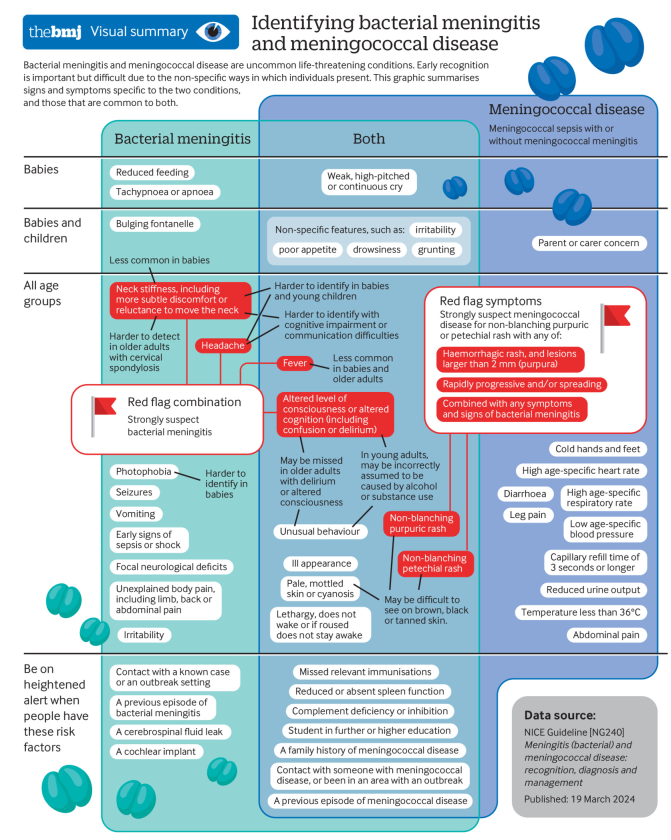

  

    

      
Trẻ Em &amp; Người Lớn

      
Mở rộng phạm vi áp dụng toàn diện mọi lứa tuổi thay vì chỉ trẻ em (NICE 2010)

    

    

      
4 Dấu Hiệu Cờ Đỏ

      
Sốt + Đau đầu + Cứng gáy + Rối loạn ý thức kích hoạt nghi ngờ khẩn cấp

    

    

      
1 Giờ Vàng

      
Khởi động kháng sinh tĩnh mạch trong vòng 60 phút đầu kể từ khi đến bệnh viện

    

    

      
Tái Khám 4 - 6 Tuần

      
Mọi bệnh nhân bắt buộc được khám chuyên khoa sàng lọc thính lực và di chứng

    

  

  

    

      
🚩

      

        
Nhận Diện Cờ Đỏ Toàn Diện

        
Áp dụng tổ hợp cờ đỏ 4 triệu chứng cho mọi lứa tuổi; không quy chụp thay đổi tri giác ở người trẻ do say rượu; cảnh giác cao ở nhóm nguy cơ (vô lách, sinh viên ký túc xá).

      

    

    

      
🚑

      

        
Kháng Sinh Trước &amp; Tại Viện

        
Tiêm Ceftriaxone/Benzylpenicillin bắp ngoài bệnh viện cho ca nghi não mô cầu; bảo đảm khung giờ vàng 1 giờ tại viện dưới sự chỉ đạo của Bác sĩ cao cấp.

      

    

    

      
🩺

      

        
Theo Dõi Đa Chuyên Khoa Dài Hạn

        
Không xuất viện khi chưa có kế hoạch theo dõi; tái khám mốc 4-6 tuần cho người lớn; theo dõi phát triển thần kinh 1 năm (trẻ &lt; 12 tháng) và 2 năm (trẻ em nói chung).

      

    

  

  

    <a href="#sec-tong-quan-nhan-dien" class="quickmenu-item active">1. Giới Thiệu &amp; Cờ Đỏ</a>
    <a href="#sec-bieu-hien-lam-sang" class="quickmenu-item">2. Triệu Chứng Theo Tuổi</a>
    <a href="#sec-benh-nao-mo-cau-infographic" class="quickmenu-item">3. Não Mô Cầu &amp; Infographic</a>
    <a href="#sec-yeu-to-nguy-co-safety-net" class="quickmenu-item">4. Yếu Tố Nguy Cơ &amp; An Toàn</a>
    <a href="#sec-khang-sinh-truoc-va-tai-vien" class="quickmenu-item">5. Kháng Sinh Trước &amp; Tại Viện</a>
    <a href="#sec-cham-soc-hau-xuat-vien" class="quickmenu-item">6. Theo Dõi Sau Xuất Viện</a>
    <a href="#sec-thuc-te-nghien-cuu-tuong-lai" class="quickmenu-item">7. Rào Cản 3.8h &amp; Nghiên Cứu</a>
    <a href="#sec-tham-khao-mcq" class="quickmenu-item">8. Cheat-Sheet &amp; MCQ</a>
  

  <!-- ==================== SECTION 1 ==================== -->
  

    

      🚩
      <h2 class="sec-title">1. Giới Thiệu, Lịch Sử Cập Nhật NG240 &amp; Tổ Hợp Cờ Đỏ (Red Flag)</h2>
    

    

      

        💡
        

          <strong>Sự Tiến Hóa Của Hướng Dẫn Lâm Sàng NICE 2024 (NG240 / BMJ 2024):</strong>
          Viêm màng não do vi khuẩn (Bacterial meningitis) và bệnh do não mô cầu (Meningococcal disease) là các tình trạng cấp cứu nội - nhi khoa đe dọa trực tiếp đến tính mạng. Sau bản hướng dẫn đầu tiên năm 2010 (vốn chỉ giới hạn ở trẻ em), Viện Y tế và Chất lượng Điều trị Quốc gia Anh (NICE) đã tiến hành rà soát giám sát toàn diện và chính thức ban hành <strong>Hướng dẫn cập nhật năm 2024 (NICE Guideline NG240)</strong>. Bước đột phá lớn nhất của bản cập nhật này là <strong>mở rộng phạm vi đối tượng áp dụng từ chỉ trẻ em sang bao gồm toàn bộ người trưởng thành</strong>, phản ánh những thay đổi trong dịch tễ học tiêm chủng vắc-xin và chuẩn hóa quy trình chăm sóc đa chuyên khoa lâu dài.
        

      

      
Định Nghĩa Thuật Ngữ Cốt Lõi Theo NICE 2024

      

        

          

          
Viêm Màng Não Vi Khuẩn (Bacterial Meningitis) 🧠

          

            
Bao gồm hai nhóm thực thể lâm sàng:

            <ul class="clin-card-list">
              <li>Viêm màng não do não mô cầu <strong>không kèm theo nhiễm trùng huyết do não mô cầu</strong> (meningococcal sepsis).</li>
              <li>Viêm màng não do các chủng vi khuẩn khác gây ra (như Phế cầu khuẩn <em>S. pneumoniae</em>, <em>Haemophilus influenzae</em>, <em>Listeria monocytogenes</em>, Liên cầu nhóm B).</li>
            </ul>
          

        

        

          

          
Bệnh Do Não Mô Cầu (Meningococcal Disease) 🩸

          

            
Bao gồm tình trạng nhiễm trùng hệ thống xâm lấn:

            <ul class="clin-card-list">
              <li><strong>Nhiễm trùng huyết do não mô cầu (Meningococcal sepsis)</strong> có kèm theo viêm màng não do não mô cầu.</li>
              <li>Nhiễm trùng huyết do não mô cầu đơn độc (meningococcemia tối cấp) mà không có viêm màng não đi kèm.</li>
            </ul>
          

        

      

      
Cơ Chế Nhận Biết Lâm Sàng &amp; Tổ Hợp Dấu Hiệu "Cờ Đỏ" (Red Flag Combinations)

      

        

          

          

            
🚩

            
Tổ Hợp Dấu Hiệu "Cờ Đỏ" Của Viêm Màng Não Vi Khuẩn (Mọi Lứa Tuổi)

          

          

            
Sự hiện diện đơn độc của từng triệu chứng có độ nhạy và độ đặc hiệu không đồng đều và dễ gây nhầm lẫn. Bắt buộc phải kích hoạt cảnh báo đỏ và hành động cấp cứu khi bệnh nhân có <strong>Tổ hợp 4 dấu hiệu "Cờ đỏ"</strong> sau:

            <ol style="margin-left: 1.2rem; line-height: 1.8;">
              <li><strong>Sốt (Fever)</strong>.</li>
              <li><strong>Đau đầu (Headache)</strong>.</li>
              <li><strong>Cứng gáy (Neck stiffness)</strong>.</li>
              <li><strong>Thay đổi mức độ ý thức hoặc nhận thức (Altered level of consciousness or cognition)</strong>, bao gồm cả tình trạng lú lẫn hoặc sảng (delirium).</li>
            </ol>
          

          
Kích hoạt cấp cứu khẩn cấp

        

        

          

          

            
⚖️

            
Phương Pháp Luận Đánh Giá Bằng Chứng GRADE Của NICE

          

          

            <ul style="margin-left: 1rem; line-height: 1.7;">
              <li><strong>4 Cấp độ chắc chắn:</strong> Cao (High), Trung bình (Moderate), Thấp (Low), Rất thấp (Very low) dựa trên tổng quan hệ thống và phân tích hiệu quả chi phí (cost-effectiveness).</li>
              <li><strong>Đồng thuận chuyên gia (Committee consensus):</strong> Khi bằng chứng thử nghiệm lâm sàng bị giới hạn, NICE dựa trên kinh nghiệm đa ngành của Ủy ban Hướng dẫn để đưa ra các Tuyên bố thực hành tốt lâm sàng (Good practice statements).</li>
            </ul>
          

          
Chuẩn mực GRADE &amp; Đồng thuận

        

      

    

  

  <!-- ==================== SECTION 2 ==================== -->
  

    

      👥
      <h2 class="sec-title">2. Bảng Triệu Chứng Lâm Sàng Chi Tiết Theo Nhóm Tuổi (Table 1 &amp; Table 2)</h2>
    

    

      
Triệu Chứng Gợi Ý Viêm Màng Não Ở Trẻ Sơ Sinh, Trẻ Em &amp; Người Trẻ Tuổi (Table 1 NICE)

      

        <table class="regimen-table">
          <thead>
            <tr>
              <th style="width: 20%;">Nhóm Biểu Hiện</th>
              <th style="width: 35%;">Triệu Chứng &amp; Dấu Hiệu Cụ Thể</th>
              <th style="width: 45%;">Ý Nghĩa Sinh Lý &amp; Bẫy Lâm Sàng Thực Hành</th>
            </tr>
          </thead>
          <tbody>
            <tr>
              <td class="source-cell">Tổ Hợp Cờ Đỏ</td>
              <td>• Sốt • Đau đầu • Cứng gáy • Thay đổi ý thức/nhận thức (lú lẫn, mê sảng)</td>
              <td>• Sốt và cứng gáy <strong>ít gặp hơn ở trẻ sơ sinh</strong>. • Đau đầu và cứng gáy rất <strong>khó xác định ở trẻ sơ sinh và trẻ nhỏ</strong> chưa biết nói.</td>
            </tr>
            <tr>
              <td class="source-cell"><strong>Diện mạo bên ngoài</strong></td>
              <td>
                • <strong>Thóp phồng (Bulging fontanelle)</strong> 
                • Sốt (Fever) 
                • Diện mạo bệnh nặng (Ill appearance) 
                • <strong>Ban xuất huyết không mất khi ấn kính</strong> 
                • Da tái, nổi vân tím hoặc tím tái
              </td>
              <td>
                • Thóp phồng chỉ đánh giá được khi thóp còn mở (đặc hiệu cao nhưng không nhạy). 
                • Luôn hỏi người nhà xem đã dùng <em>thuốc hạ sốt</em> trước đó chưa. 
                • Ban xuất huyết cần tìm kỹ ở toàn thân và kết mạc mắt; <strong>rất khó quan sát trên nền da tối màu (nâu, đen, rám nắng)</strong>.
              </td>
            </tr>
            <tr>
              <td class="source-cell"><strong>Hành vi &amp; Tri giác</strong></td>
              <td>
                • <strong>Kích thích, dễ quấy khóc (Irritability)</strong> 
                • <strong>Lờ đờ (Lethargy)</strong> 
                • Bỏ bú, giảm bú (Reduced feeding) 
                • <strong>Tiếng khóc thét cao giọng hoặc khóc liên tục</strong> 
                • Hành vi bất thường (kích động hoặc ủ rũ)
              </td>
              <td>
                • Rất phổ biến ở trẻ sơ sinh và trẻ nhỏ. 
                • Cần khai thác kỹ sự thay đổi hành vi so với thường ngày từ cha mẹ. 
                • Tiếng khóc the thé (high-pitched cry) là dấu hiệu cảnh báo tăng áp lực nội sọ cấp.
              </td>
            </tr>
            <tr>
              <td class="source-cell"><strong>Thần kinh &amp; Hô hấp</strong></td>
              <td>
                • Dấu thần kinh khu trú (Focal deficits) 
                • <strong>Sợ ánh sáng (Photophobia)</strong> 
                • Co giật (Seizures) 
                • <strong>Thở nhanh, ngừng thở, thở rên (Grunting)</strong> 
                • Đau cơ thể không rõ nguyên nhân, nôn mửa
              </td>
              <td>
                • Co giật và dấu thần kinh khu trú có độ đặc hiệu rất cao. 
                • Thở rên và cơn ngừng thở là dấu hiệu suy sụp nặng ở trẻ sơ sinh. 
                • Đau chân hoặc đau cơ dữ dội gợi ý nhiễm khuẩn huyết xâm lấn.
              </td>
            </tr>
          </tbody>
        </table>
      

      
Triệu Chứng Gợi Ý Viêm Màng Não Ở Người Lớn &amp; Người Cao Tuổi (Table 2 NICE)

      

        <table class="regimen-table">
          <thead>
            <tr>
              <th style="width: 20%;">Nhóm Biểu Hiện</th>
              <th style="width: 35%;">Triệu Chứng &amp; Dấu Hiệu Ở Người Lớn</th>
              <th style="width: 45%;">Cảnh Báo Lâm Sàng &amp; Nguy Cơ Bỏ Sót</th>
            </tr>
          </thead>
          <tbody>
            <tr>
              <td class="source-cell">Tổ Hợp Cờ Đỏ</td>
              <td>• Sốt • Đau đầu • Cứng gáy • Thay đổi ý thức hoặc nhận thức</td>
              <td>
                • <strong>Sốt ít gặp hơn ở người cao tuổi</strong> (có thể thân nhiệt bình thường hoặc hạ thân nhiệt). 
                • Đau đầu và cứng gáy khó xác định ở người sa sút trí tuệ hoặc <strong>viêm thoái hóa khớp cổ</strong>. 
                • Thay đổi ý thức dễ bị bỏ sót ở người già có sảng nền (delirium).
              </td>
            </tr>
            <tr>
              <td class="source-cell">CẢNH BÁO BẪY TÂM THẦN</td>
              <td><strong>Hành vi bất thường &amp; Biến đổi tri giác cấp tính</strong> (Kích động, hung hăng, lú lẫn hoặc trầm cảm ủ rũ)</td>
              <td>
                <strong style="color: #dc2626;">CẢNH BÁO TỐI QUAN TRỌNG CỦA NICE 2024:</strong> 
                Ở bệnh nhân thanh thiếu niên và người trẻ tuổi, sự thay đổi hành vi hoặc tri giác cấp tính <strong>RẤT DỄ BỊ QUY KẾT SAI LỆCH LÀ DO SAY RƯỢU HOẶC SỬ DỤNG CHẤT GÂY NGHIỆN</strong>, dẫn đến việc chậm trễ điều trị kháng sinh và gây tử vong oan uổng!
              </td>
            </tr>
            <tr>
              <td class="source-cell"><strong>Dấu hiệu thực thể khác</strong></td>
              <td>
                • Ban xuất huyết không mất khi ấn kính 
                • Da tái, nổi vân tím (mottled skin) 
                • Dấu thần kinh khu trú, co giật 
                • Sợ ánh sáng, nôn mửa, đau cơ dữ dội
              </td>
              <td>
                • Ban xuất huyết có độ nhạy và đặc hiệu ở mức trung bình; cần khám toàn thân kể cả kết mạc mắt. 
                • Co giật mới khởi phát ở người lớn là một dấu hiệu nguy cơ cao chỉ định chụp CT đầu trước khi chọc dò tủy sống.
              </td>
            </tr>
          </tbody>
        </table>
      

    

  

  <!-- ==================== SECTION 3 ==================== -->
  

    

      🔬
      <h2 class="sec-title">3. Bệnh Do Não Mô Cầu (Table 3) &amp; Sơ Đồ Trực Quan BMJ Infographic (Figure 1)</h2>
    

    

      
Triệu Chứng &amp; Dấu Hiệu Gợi Ý Bệnh Do Não Mô Cầu Ở Mọi Lứa Tuổi (Table 3 NICE)

      

        <table class="regimen-table">
          <thead>
            <tr>
              <th style="width: 25%;">Phân Loại Dấu Hiệu</th>
              <th style="width: 40%;">Triệu Chứng Lâm Sàng Điển Hình</th>
              <th style="width: 35%;">Giá Trị Chẩn Đoán &amp; Ý Nghĩa Thực Hành</th>
            </tr>
          </thead>
          <tbody>
            <tr>
              <td class="source-cell">Dấu Hiệu Cờ Đỏ</td>
              <td>
                • <strong>Tử ban (Purpura):</strong> Ban xuất huyết hoại tử không mất khi ấn kính kích thước <strong>&gt; 2 mm</strong>. 
                • Ban xuất huyết/tử ban <strong>tiến triển và lan rộng cực kỳ nhanh chóng</strong>. 
                • Bất kỳ dấu hiệu viêm màng não nào kết hợp với ban không mất khi ấn kính.
              </td>
              <td>
                • Tử ban (Purpura) có <strong>độ đặc hiệu cực cao</strong> đối với nhiễm trùng huyết não mô cầu. 
                • Tốc độ lan rộng của ban phản ánh trực tiếp mức độ đông máu nội mạch hoại tử (DIC).
              </td>
            </tr>
            <tr>
              <td class="source-cell">Sốc &amp; Suy Giảm Tưới Máu</td>
              <td>
                • <strong>Tay chân lạnh ngắt (Cold hands and feet)</strong>. 
                • <strong>Thời gian đổ đầy mao mạch (CRT) ≥ 3 giây</strong>. 
                • Mạch nhanh hoặc nhịp tim &lt; 60 lần/phút (trẻ &lt; 12 tuổi). 
                • Huyết áp tụt theo lứa tuổi. 
                • Thiểu niệu / vô niệu.
              </td>
              <td>
                • Dấu hiệu sớm của sốc nhiễm trùng trước khi huyết áp tụt rõ rệt. 
                • CRT ≥ 3s có độ đặc hiệu cao chỉ điểm tình trạng co mạch ngoại vi bù trừ.
              </td>
            </tr>
            <tr>
              <td class="source-cell"><strong>Dấu hiệu toàn thân đặc hiệu</strong></td>
              <td>
                • <strong>Đau chân dữ dội (Severe leg pain)</strong>. 
                • Đau bụng, tiêu chảy. 
                • Thở rên (Grunting) ở trẻ nhỏ. 
                • Sốt cao hoặc thân nhiệt hạ &lt; 36°C. 
                • Mối lo ngại bất thường của cha mẹ.
              </td>
              <td>
                • <strong>Đau chân có độ đặc hiệu cực kỳ cao</strong> đối với bệnh não mô cầu xâm lấn. 
                • Tiêu chảy và đau bụng thường dẫn đến chẩn đoán nhầm thành nhiễm trùng tiêu hóa.
              </td>
            </tr>
          </tbody>
        </table>
      

      <!-- FIGURE 1 CARD: BMJ VISUAL SUMMARY INFOGRAPHIC -->
      

        
        

          
Figure 1. Sơ Đồ Trực Quan Hóa Của BMJ: Nhận Biết Viêm Màng Não Vi Khuẩn &amp; Bệnh Do Não Mô Cầu (NICE 2024)

          Sơ đồ trực quan từ tạp chí The BMJ phân tách hai nhánh bệnh lý song song và vùng giao thoa:
           • <strong>Nhánh Viêm màng não vi khuẩn:</strong> Trẻ sơ sinh (giảm bú, thở nhanh/ngừng thở, thóp phồng); Trẻ em &amp; người lớn (cứng gáy, đau đầu, sợ ánh sáng, nôn, dấu thần kinh khu trú, co giật; lưu ý khó phát hiện cứng gáy ở người già do thoái hóa cột sống cổ).
           • <strong>Nhánh Bệnh do não mô cầu:</strong> Trẻ sơ sinh (tiếng khóc the thé, thở rên); Dấu hiệu sốc &amp; nhiễm độc toàn thân (tay chân lạnh, nhịp tim nhanh, huyết áp hạ, CRT ≥ 3s, thiểu niệu, đau bụng, tiêu chảy, đau chân dữ dội); Ban xuất huyết hoại tử (tử ban &gt; 2mm, lan rộng nhanh, khó nhìn trên da tối màu).
           • <strong>Vùng triệu chứng chung (Giao thoa):</strong> Sốt (có thể vắng mặt ở trẻ sơ sinh và người già), kích thích quấy khóc, lờ đờ khó đánh thức, thay đổi ý thức và biến đổi hành vi cấp tính (cảnh giác không quy nhầm do rượu/ma túy ở người trẻ).
        

      

    

  

  <!-- ==================== SECTION 4 ==================== -->
  

    

      ⚠️
      <h2 class="sec-title">4. Các Yếu Tố Nguy Cơ Kích Hoạt Cảnh Giác Cao Độ &amp; Lời Khuyên An Toàn</h2>
    

    

      
8 Yếu Tố Nguy Cơ Kích Hoạt Tăng Cường Cảnh Giác Lâm Sàng Cao Độ (Heightened Alert)

      

        ⚡
        

          NICE 2024 khuyến cáo bác sĩ lâm sàng phải <strong>tăng cường cảnh giác cao độ (be on heightened alert)</strong> ngay cả khi bệnh nhân chưa biểu hiện đầy đủ tổ hợp dấu hiệu cờ đỏ, nếu họ có bất kỳ yếu tố nguy cơ dịch tễ hoặc bệnh nền nào sau đây:
        

      

      

        

          

          
Yếu Tố Miễn Dịch &amp; Tiêm Chủng 💉

          

            <ul class="clin-card-list">
              <li><strong>Tiền sử tiêm chủng:</strong> Chưa tiêm phòng hoặc bỏ lỡ các mũi tiêm vắc-xin bảo vệ quan trọng (vắc-xin não mô cầu MenACWY/MenB, phế cầu PCV, hoặc Hib).</li>
              <li><strong>Chức năng lách:</strong> Bệnh nhân bị mất chức năng lách giải phẫu (đã cắt lách) hoặc vô lách chức năng (bệnh hồng cầu hình liềm).</li>
              <li><strong>Hệ thống bổ thể:</strong> Suy giảm bổ thể bẩm sinh (C5 - C9) hoặc đang sử dụng thuốc ức chế bổ thể (Eculizumab, Ravulizumab).</li>
              <li><strong>Tiền sử bệnh lý:</strong> Đã từng bị viêm màng não vi khuẩn hoặc bệnh do não mô cầu trước đây.</li>
            </ul>
          

        

        

          

          
Yếu Tố Giải Phẫu &amp; Môi Trường Xã Hội 🏫

          

            <ul class="clin-card-list">
              <li><strong>Môi trường học đường &amp; Ký túc xá:</strong> Học sinh, sinh viên đại học/cao đẳng, đặc biệt là những người mới chuyển vào sống trong các khu <strong>ký túc xá tập thể lớn (shared accommodation)</strong>.</li>
              <li><strong>Yếu tố tiếp xúc dịch tễ:</strong> Có tiền sử tiếp xúc trực tiếp với người bệnh xác định nhiễm não mô cầu/Hib, sống cùng nhà hoặc đi qua vùng đang có dịch lưu hành.</li>
              <li><strong>Rò rỉ dịch não tủy (CSF leak):</strong> Do chấn thương sọ não vỡ nứt xương sọ nền hoặc dị tật bẩm sinh màng não.</li>
              <li><strong>Thiết bị cấy ghép ốc tai (Cochlear implants):</strong> Có nguy cơ cao bị viêm màng não phế cầu xâm lấn.</li>
            </ul>
          

        

      

      
Lời Khuyên An Toàn (Safety Netting Advice) Khi Cho Bệnh Nhân Về Nhà

      

        🛡️
        

          <strong>Tuyên Bố Thực Hành Tốt Về Lưới An Toàn Lâm Sàng:</strong>
          Nếu sau khi thăm khám kỹ lưỡng, bác sĩ quyết định cho bệnh nhân về nhà tự theo dõi vì chưa đủ tiêu chuẩn nghi ngờ viêm màng não, <strong>bắt buộc phải cung cấp hướng dẫn an toàn bằng văn bản chi tiết</strong>.
           Yêu cầu bệnh nhân hoặc người chăm sóc <strong>phải đưa người bệnh quay trở lại bệnh viện ngay lập tức</strong> nếu:
          <ul style="margin-left: 1.5rem; margin-top: 0.3rem; line-height: 1.7;">
            <li>Xuất hiện bất kỳ triệu chứng mới nào trong tổ hợp cờ đỏ (sốt cao, đau đầu dữ dội, cứng cổ, lơ mơ).</li>
            <li>Các nốt ban đỏ chuyển từ dạng ấn biến mất (blanching) sang dạng xuất huyết <strong>không biến mất khi ấn kính (non-blanching)</strong>.</li>
            <li>Bất kỳ triệu chứng sẵn có nào tiến triển xấu đi hoặc người chăm sóc cảm thấy lo lắng bất thường.</li>
          </ul>
        

      

    

  

  <!-- ==================== SECTION 5 ==================== -->
  

    

      ⏱️
      <h2 class="sec-title">5. Kháng Sinh Trước Viện &amp; Khung Giờ Vàng 1 Giờ Tại Bệnh Viện (Table 4)</h2>
    

    

      
Chỉ Định Kháng Sinh Trước Khi Nhập Viện (Pre-hospital Antibiotics)

      

        

          

          
Nghi Ngờ Bệnh Do Não Mô Cầu 🚨

          

            
• <strong>Hành động bắt buộc:</strong> Tiêm ngay một liều kháng sinh tĩnh mạch (IV) hoặc tiêm bắp (IM) ngoài bệnh viện <strong>càng sớm càng tốt</strong>.

            
• <em>Ngoại lệ:</em> Chỉ hoãn tiêm nếu việc thực hiện làm chậm trễ đáng kể quá trình vận chuyển bệnh nhân cấp cứu đến viện.

          

        

        

          

          
Nghi Ngờ Viêm Màng Não Vi Khuẩn 🚑

          

            
• <strong>Hành động có chọn lọc:</strong> Chỉ tiêm kháng sinh ngoài bệnh viện khi <strong>tiên lượng có sự chậm trễ đáng kể</strong> trong quá trình vận chuyển bệnh nhân đến bệnh viện.

            
• Nếu khoảng cách di chuyển ngắn và bệnh nhân sắp tới viện → ưu tiên chuyển viện khẩn để làm chẩn đoán tại viện trước.

          

        

      

      

        💉
        

          <strong>Lựa Chọn Thuốc &amp; Đường Tiêm Ngoài Bệnh Viện:</strong>
           • <strong>Ceftriaxone</strong> là lựa chọn hàng đầu (tiêm bắp hoặc tĩnh mạch). <strong>Benzylpenicillin</strong> là thuốc thay thế phổ biến trên xe cấp cứu hoặc phòng khám tuyến cơ sở.
           • <strong>Tiêm bắp (IM)</strong> được khuyến cáo là đường dùng thực tế và dễ thao tác nhất ngoài cộng đồng.
           • <strong style="color: #dc2626;">Chống chỉ định an toàn:</strong> Tuyệt đối không tiêm kháng sinh ngoài bệnh viện nếu bệnh nhân có tiền sử <strong>dị ứng nặng (phù mạch, sốc phản vệ)</strong> với Ceftriaxone hoặc Penicillin.
        

      

      
Khung Giờ Vàng 1 Giờ &amp; Trình Tự Xét Nghiệm Tại Viện (Table 4 NICE)

      

        <table class="regimen-table">
          <thead>
            <tr>
              <th style="width: 25%;">Tình Trạng Nghi Ngờ</th>
              <th style="width: 35%;">Yêu Cầu Thời Gian Dùng Kháng Sinh</th>
              <th style="width: 40%;">Trình Tự Xét Nghiệm &amp; Chọc Dò Tủy Sống (LP)</th>
            </tr>
          </thead>
          <tbody>
            <tr>
              <td class="source-cell">Nghi ngờ Viêm Màng Não Vi Khuẩn</td>
              <td><strong>Trong vòng 1 giờ</strong> kể từ khi bệnh nhân đến bệnh viện (Golden Hour).</td>
              <td>
                • Thực hiện <strong>cấy máu và chọc dò tủy sống (LP)</strong> trước khi tiêm kháng sinh. 
                • <strong style="color: #dc2626;">ĐIỀU KIỆN SỐNG CÒN:</strong> Chỉ thực hiện LP trước nếu thủ thuật đảm bảo an toàn và <em>hoàn toàn không làm chậm trễ việc dùng kháng sinh vượt quá mốc 1 giờ vàng</em>.
              </td>
            </tr>
            <tr>
              <td class="source-cell">Nghi ngờ Bệnh Do Não Mô Cầu</td>
              <td><strong>Trong vòng 1 giờ</strong> kể từ khi bệnh nhân đến bệnh viện.</td>
              <td>
                • Thực hiện <strong>cấy máu và xét nghiệm máu STAT</strong> trước khi truyền kháng sinh. 
                • <em>Tuyệt đối không trì hoãn kháng sinh</em> để chờ đợi kết quả xét nghiệm hay chẩn đoán hình ảnh.
              </td>
            </tr>
          </tbody>
        </table>
      

      

        ⭐
        

          <strong>Vai Trò Của Bác Sĩ Lâm Sàng Cao Cấp (Senior Clinical Decision Maker):</strong>
          NICE 2024 nhấn mạnh sự tham gia trực tiếp của một bác sĩ lâm sàng cao cấp ngay tại khoa cấp cứu để đưa ra quyết định chọc dò tủy sống an toàn, chỉ định đúng và đảm bảo mục tiêu 1 giờ vàng dùng thuốc không bị phá vỡ bởi các rào cản hành chính.
        

      

    

  

  <!-- ==================== SECTION 6 ==================== -->
  

    

      🩺
      <h2 class="sec-title">6. Kế Hoạch Đánh Giá &amp; Theo Dõi Định Kỳ Sau Xuất Viện (Table 5)</h2>
    

    

      

        ⚠️
        

          <strong>Nguyên Tắc Xuất Viện Nghiêm Ngặt Của NICE 2024:</strong>
          Tuyệt đối <strong>không cho bệnh nhân xuất viện</strong> cho đến khi các đánh giá sàng lọc ban đầu đã hoàn tất và một kế hoạch theo dõi chi tiết sau xuất viện được thiết lập, ghi rõ trong Thư ra viện (Discharge summary). Rất nhiều di chứng thần kinh và nhận thức không bộc lộ ngay mà tiến triển âm thầm nhiều tháng hoặc nhiều năm sau đợt bệnh cấp.
        

      

      
Kế Hoạch &amp; Nội Dung Theo Dõi Định Kỳ Sau Xuất Viện (Table 5 NICE)

      

        <table class="regimen-table">
          <thead>
            <tr>
              <th style="width: 25%;">Nhóm Đối Tượng</th>
              <th style="width: 25%;">Mốc Thời Gian Tái Khám</th>
              <th style="width: 50%;">Nội Dung Đánh Giá Sàng Lọc Bắt Buộc</th>
            </tr>
          </thead>
          <tbody>
            <tr>
              <td class="source-cell">Người Trưởng Thành (Adults)</td>
              <td><strong>4 – 6 tuần</strong> sau xuất viện (khám với bác sĩ chuyên khoa bệnh viện).</td>
              <td>
                • <strong>Kết quả đo thính lực chính quy</strong> (Audiological assessment) và nhu cầu cấy ốc tai điện tử khẩn cấp. 
                • Tổn thương cơ xương khớp (Damage to bones and joints). 
                • Biến chứng da (sẹo hoại tử co rút do ban tử ban). 
                • Các vấn đề tâm lý xã hội (trầm cảm, lo âu, rối loạn stress). 
                • Các di chứng thần kinh và nhu cầu chăm sóc hỗ trợ tại nhà.
              </td>
            </tr>
            <tr>
              <td class="source-cell">Trẻ Em Dưới 12 Tháng Tuổi</td>
              <td><strong>1 năm</strong> sau xuất viện (khám với bác sĩ chuyên khoa Nhi).</td>
              <td>
                Đánh giá toàn diện các biến chứng khởi phát muộn về: 
                • Phát triển tâm thần vận động (Neurodevelopmental). 
                • Chỉnh hình và cơ xương khớp (Orthopaedic). 
                • Các giác quan (thính giác, thị giác). 
                • Tâm lý và tương tác xã hội.
              </td>
            </tr>
            <tr>
              <td class="source-cell"><strong>Trẻ sơ sinh, trẻ em &amp; thanh thiếu niên</strong></td>
              <td>Theo dõi kéo dài <strong>ít nhất 2 năm</strong> sau xuất viện.</td>
              <td>Được theo dõi và đánh giá định kỳ bởi Dịch vụ phát triển trẻ em cộng đồng (Community child development services) để tầm soát liên tục các nguy cơ suy giảm nhận thức học đường muộn.</td>
            </tr>
            <tr>
              <td class="source-cell">Bệnh nhân dùng thuốc chống động kinh</td>
              <td><strong>3 tháng</strong> sau xuất viện.</td>
              <td>Chuyển khám chuyên khoa động kinh (Bác sĩ thần kinh hoặc điều dưỡng chuyên khoa động kinh) để <strong>rà soát lại thuốc (medicines review)</strong> và cân nhắc lộ trình giảm liều/ngừng thuốc.</td>
            </tr>
          </tbody>
        </table>
      

    

  

  <!-- ==================== SECTION 7 ==================== -->
  

    

      📊
      <h2 class="sec-title">7. Thực Trạng Cửa - Kháng Sinh (3.8h) &amp; 5 Câu Hỏi Nghiên Cứu Ưu Tiên (Table 6)</h2>
    

    

      
Thực Trạng Triển Khai Đời Thực: Rào Cản Thời Gian "Cửa - Kháng Sinh"

      

        

          

          

            
⏱️

            
Khoảng Cách Thực Tế Giữa Khuyến Cáo &amp; Đời Thực

          

          

            <ul style="margin-left: 1rem; line-height: 1.7;">
              <li><strong>Số liệu đáng báo động:</strong> Nghiên cứu hồi cứu hồ sơ bệnh án được NICE dẫn chứng cho thấy <strong>thời gian trung vị từ khi đến viện đến khi tiêm liều kháng sinh đầu tiên (Door-to-antibiotic time) lên tới 3.8 giờ</strong> (khoảng phân vị IQR: 1.4 đến 6.1 giờ).</li>
              <li><strong>Nguyên nhân chậm trễ:</strong> Trì hoãn chờ đợi làm xét nghiệm máu, chờ chụp CT sọ não không cần thiết, hoặc thiếu vắng bác sĩ cao cấp đưa ra quyết định tại khoa cấp cứu.</li>
              <li><strong>Yêu cầu hành động:</strong> Tất cả bệnh viện phải tái cấu trúc luồng tiếp nhận cấp cứu để bảo đảm mục tiêu 1 giờ vàng cho mọi ca nghi ngờ.</li>
            </ul>
          

          
Thời gian trung vị thực tế: 3.8 giờ

        

        

          

          

            
👥

            
Ủy Ban Xây Dựng Hướng Dẫn Đa Chiều &amp; Tiếng Nói Người Bệnh

          

          

            <ul style="margin-left: 1rem; line-height: 1.7;">
              <li><strong>Thành phần đa ngành:</strong> Bác sĩ truyền nhiễm, vi sinh lâm sàng, cấp cứu nhi, hồi sức thần kinh, lão khoa, thần kinh học, bác sĩ gia đình (GP) và dược sĩ lâm sàng.</li>
              <li><strong>Thành viên không chuyên môn (Lay members):</strong> Gồm <strong>3 thành viên</strong> đại diện cho tiếng nói của người bệnh và gia đình người sống sót sau viêm màng não, bảo đảm khuyến nghị phản ánh đúng nhu cầu phục hồi thực tế.</li>
            </ul>
          

          
3 Đại diện người bệnh tham gia

        

      

      
5 Câu Hỏi Nghiên Cứu Ưu Tiên Hàng Đầu Của NICE (Table 6)

      

        <table class="regimen-table">
          <thead>
            <tr>
              <th style="width: 10%;">STT</th>
              <th style="width: 45%;">Câu Hỏi Nghiên Cứu Trọng Tâm Của NICE</th>
              <th style="width: 45%;">Ý Nghĩa Lâm Sàng &amp; Định Hướng Tương Lai</th>
            </tr>
          </thead>
          <tbody>
            <tr>
              <td class="source-cell"><strong>1</strong></td>
              <td><strong>Kết cục lâu dài sau viêm màng não vi khuẩn ở giai đoạn nhũ nhi là gì?</strong></td>
              <td>Làm sáng tỏ gánh nặng di chứng phát triển thần kinh khởi phát muộn để tối ưu hóa phác đồ theo dõi trẻ sau xuất viện.</td>
            </tr>
            <tr>
              <td class="source-cell"><strong>2</strong></td>
              <td><strong>Có thể áp dụng chất chỉ điểm sinh học mới của ký chủ (host biomarkers) hoặc kỹ thuật siêu gen (metagenomics) trên máu/DNT để chẩn đoán không?</strong></td>
              <td>Tìm kiếm các phương pháp chẩn đoán phân tử không phụ thuộc nuôi cấy, có độ chính xác cao ngay cả khi bệnh nhân đã dùng kháng sinh trước đó.</td>
            </tr>
            <tr>
              <td class="source-cell"><strong>3</strong></td>
              <td><strong>Hiệu quả của các đợt kháng sinh ngắn ngày (so với chuẩn) trong điều trị viêm màng não do <em>Enterobacterales</em> ở trẻ sơ sinh?</strong></td>
              <td>Giảm thiểu độc tính của thuốc, rút ngắn ngày nằm viện và hạn chế phát sinh chủng vi khuẩn đa kháng thuốc ở trẻ sơ sinh.</td>
            </tr>
            <tr>
              <td class="source-cell"><strong>4</strong></td>
              <td><strong>Ở bệnh nhân suy giảm ý thức, việc theo dõi áp lực nội sọ (ICP) xâm lấn và không xâm lấn có giúp cải thiện kết cục không?</strong></td>
              <td>Xác định xem theo dõi ICP chủ động có giúp phát hiện sớm và can thiệp kịp thời nguy cơ thoát vị não đe dọa tử vong hay không.</td>
            </tr>
            <tr>
              <td class="source-cell"><strong>5</strong></td>
              <td><strong>Hiệu quả của Corticosteroid hỗ trợ kèm kháng sinh ở trẻ sơ sinh nghi ngờ hoặc xác định viêm màng não vi khuẩn là gì?</strong></td>
              <td>Giải quyết khoảng trống chứng cứ lâm sàng kéo dài nhiều thập kỷ về vai trò của steroid hỗ trợ ở lứa tuổi sơ sinh.</td>
            </tr>
          </tbody>
        </table>
      

    

  

  <!-- ==================== SECTION 8 ==================== -->
  

    

      📚
      <h2 class="sec-title">8. Cheat-Sheet Thực Hành, Câu Hỏi Tự Lượng Giá &amp; Trích Dẫn Chuẩn AMA</h2>
    

    

      
Cheat-Sheet Tóm Tắt Quy Chuẩn Hành Động Lâm Sàng (NICE 2024)

      

        ⚡
        

          • <strong>Nghi ngờ Não mô cầu ngoài viện:</strong> Tiêm ngay Ceftriaxone (hoặc Benzylpenicillin) IM/IV trước khi chuyển viện. 
          • <strong>Nghi ngờ Viêm màng não ngoài viện:</strong> Chỉ tiêm kháng sinh trước viện nếu tiên lượng chuyển viện chậm trễ đáng kể. 
          • <strong>Mục tiêu tại bệnh viện:</strong> Tiêm kháng sinh tĩnh mạch trong vòng <strong>1 giờ</strong> đầu tiên. 
          • <strong>Chọc dò DNT (LP):</strong> Làm trước kháng sinh nếu an toàn và KHÔNG làm chậm thuốc quá 1 giờ. 
          • <strong>Cờ đỏ viêm màng não:</strong> Sốt + Đau đầu + Cứng gáy + Rối loạn ý thức/nhận thức. 
          • <strong>Cờ đỏ não mô cầu:</strong> Tử ban (purpura &gt; 2mm), ban lan rộng cực nhanh, CRT ≥ 3s, đau chân dữ dội. 
          • <strong>Tái khám sau xuất viện:</strong> Bắt buộc hẹn khám lại mốc <strong>4 – 6 tuần</strong> cho toàn bộ người lớn.
        

      

      
5 Câu Hỏi Trắc Nghiệm Tự Lượng Giá Lâm Sàng (MCQ Quiz)

      

        
Câu 1: Theo hướng dẫn cập nhật NICE 2024 (NG240), thay đổi lớn nhất về phạm vi đối tượng áp dụng so với bản hướng dẫn năm 2010 là gì?

        

          
A. Chỉ áp dụng cho trẻ sơ sinh dưới 1 tháng tuổi

          
B. Loại bỏ nhóm đối tượng học sinh, sinh viên đại học

          
C. Mở rộng phạm vi từ chỉ trẻ em sang bao gồm cả người trưởng thành

          
D. Chỉ áp dụng cho bệnh nhân suy giảm miễn dịch nặng

        

        

          <strong>Giải thích:</strong> Hướng dẫn NICE 2010 trước đây chỉ áp dụng cho trẻ em. Bản cập nhật toàn diện năm 2024 (NG240) đã chính thức mở rộng phạm vi điều trị cho toàn bộ người trưởng thành.
        

      

      

        
Câu 2: Tổ hợp 4 dấu hiệu "Cờ đỏ" (Red flag combination) của Viêm màng não vi khuẩn theo NICE 2024 bao gồm những triệu chứng nào?

        

          
A. Sốt, đau bụng, tiêu chảy, thở rên

          
B. Sốt, đau đầu, cứng gáy, thay đổi mức độ ý thức hoặc nhận thức

          
C. Đau chân dữ dội, tay chân lạnh, CRT ≥ 3 giây, ban xuất huyết

          
D. Thóp phồng, khóc thét the thé, giảm bú, co giật

        

        

          <strong>Giải thích:</strong> Tổ hợp cờ đỏ chuẩn áp dụng cho mọi lứa tuổi gồm 4 dấu hiệu: Sốt, Đau đầu, Cứng gáy và Thay đổi ý thức/nhận thức (lú lẫn hoặc sảng).
        

      

      

        
Câu 3: Cảnh báo lâm sàng quan trọng nào được NICE 2024 đặc biệt lưu ý khi tiếp cận bệnh nhân thanh thiếu niên và người trẻ tuổi có biểu hiện hành vi bất thường hoặc thay đổi tri giác cấp tính?

        

          
A. Luôn quy kết do hạ đường huyết

          
B. Bắt buộc phải chụp MRI sọ não khẩn cấp

          
C. Cho về nhà theo dõi nếu không có sốt

          
D. Rất dễ bị quy kết sai lệch do say rượu hoặc sử dụng ma túy, dẫn đến bỏ sót chẩn đoán viêm màng não

        

        

          <strong>Giải thích:</strong> NICE 2024 cảnh báo ở người trẻ tuổi, sự kích động, lơ mơ hoặc lú lẫn cấp rất hay bị nhân viên y tế quy nhầm cho ngộ độc rượu hoặc chất kích thích, làm mất cơ hội dùng kháng sinh cứu mạng.
        

      

      

        
Câu 4: Khuyến cáo của NICE 2024 về việc dùng kháng sinh trước khi nhập viện (ngoài bệnh viện) đối với bệnh nhân nghi ngờ Bệnh do não mô cầu là gì?

        

          
A. Tiêm ngay một liều Ceftriaxone hoặc Benzylpenicillin (IM hoặc IV) càng sớm càng tốt trừ khi làm chậm trễ chuyển viện

          
B. Tuyệt đối không dùng kháng sinh ngoài bệnh viện trong mọi tình huống

          
C. Chỉ cho uống kháng sinh dạng viên

          
D. Chờ đến khi bệnh nhân xuất hiện ban tử ban hoại tử mới được tiêm

        

        

          <strong>Giải thích:</strong> Bệnh do não mô cầu tiến triển trụy mạch rất nhanh. NICE khuyến cáo tiêm ngay một liều kháng sinh bắp hoặc tĩnh mạch ngoài bệnh viện càng sớm càng tốt.
        

      

      

        
Câu 5: Theo NICE 2024, thời điểm bắt buộc tái khám tại bệnh viện đối với người trưởng thành sau khi xuất viện vì viêm màng não hoặc bệnh não mô cầu là khi nào?

        

          
A. Sau 1 tuần xuất viện

          
B. Sau 6 tháng xuất viện

          
C. Trong vòng 4 đến 6 tuần sau xuất viện

          
D. Chỉ tái khám khi bệnh nhân có triệu chứng sốt trở lại

        

        

          <strong>Giải thích:</strong> Tất cả người lớn sau xuất viện phải được sắp xếp tái khám chuyên khoa tại bệnh viện trong mốc 4 – 6 tuần để đo thính lực chính quy và tầm soát các di chứng xương khớp, sẹo hoại tử da và tâm thần kinh.
        

      

      
Danh Mục Tài Liệu Tham Khảo Chuẩn AMA

      

        <strong>Tài liệu gốc chính thức:</strong>
        <ol style="margin-left: 1.5rem; margin-top: 0.5rem; line-height: 1.8;">
          <li>National Institute for Health and Care Excellence (NICE). <em>Meningitis (bacterial) and meningococcal disease: recognition, diagnosis and management</em>. NICE guideline NG240. London: NICE; 2024. Available from: https://www.nice.org.uk/guidance/ng240.</li>
          <li>Paing A, Elliff-O'Shea L, Boardman L, Turner D, Glennie L, on behalf of the Guideline Committee. Meningitis (bacterial) and meningococcal disease: recognition, diagnosis and management—summary of updated NICE guidance. <em>BMJ</em>. 2024;387:q2452. doi:10.1136/bmj.q2452.</li>
          <li>National Institute for Health and Care Excellence (NICE). <em>Suspected sepsis: recognition, diagnosis and early management</em>. NICE guideline NG51. London: NICE; 2016 (updated 2024).</li>
          <li>World Health Organization. <em>WHO guidelines on meningitis diagnosis, treatment and care</em>. Geneva: World Health Organization; 2025.</li>
        </ol>
      

    

  

<!-- BOTTOM NAV -->

  

    <a href="#/ebm/kho-guidelines" class="btn btn-primary">
      <i class="fa-solid fa-arrow-left"></i> Quay lại Kho Guidelines
    </a>
    <a href="#sec-tong-quan-nhan-dien" class="btn">
      <i class="fa-solid fa-arrow-up"></i> Lên đầu trang
    </a>
  

