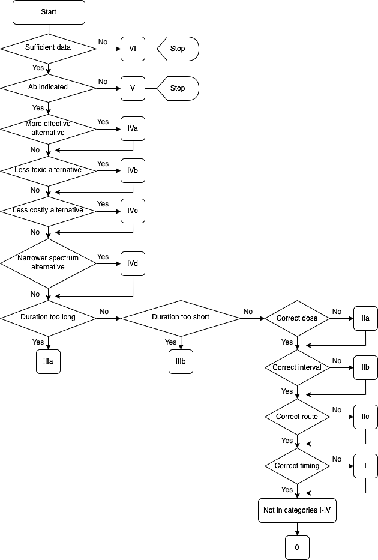

  

    

      
MRSA Lên Tới 47%

      
Tỷ lệ phân lập MRSA tại đơn vị nội trú bệnh viện tuyến trung ương (RSUPN)

    

    

      
Liên Quan Quinolone

      
Tiền sử dùng kháng sinh Quinolone trong 1 năm tăng nguy cơ nhiễm MRSA có ý nghĩa

    

    

      
Lưu Đồ Gyssens I - VI

      
Tiêu chuẩn vàng định tính chất lượng kê đơn trong Chương trình Quản lý Kháng sinh

    

    

      
ABSSSI ≥ 75 cm²

      
Định nghĩa diện tích thương tổn da của FDA để phân loại nhiễm trùng da cấp tính nặng

    

  

  

    

      
📊

      

        
Quản Lý Kháng Sinh Hệ Thống (Gyssens &amp; AWaRe)

        
Kiểm soát chặt chẽ kê đơn qua Lưu đồ Gyssens; ưu tiên nhóm Access, hạn chế nhóm Watch và bảo tồn nhóm Reserve theo chiến lược của WHO.

      

    

    

      
📏

      

        
Phân Tầng Nguy Cơ Đa Chiều (Eron &amp; MRSA)

        
Đánh giá toàn diện theo thang điểm Eron Class 1 - 4 và nhận diện các yếu tố nguy cơ CA-MRSA / HA-MRSA để lựa chọn đường dùng thuốc chính xác.

      

    

    

      
🚨

      

        
Cấp Cứu Đe Dọa Tính Mạng &amp; Kháng Độc Tố

        
Cắt lọc hoại tử khẩn cấp trong NF (tử vong 50%); phối hợp Clindamycin triệt tiêu siêu kháng nguyên độc tố trong TSS, SSSS và NF thể 2.

      

    

  

  

    <a href="#sec-tong-quan-amr-aware" class="quickmenu-item active">1. AMR &amp; WHO AWaRe</a>
    <a href="#sec-luu-do-gyssens" class="quickmenu-item">2. Lưu Đồ Gyssens (Figure 1)</a>
    <a href="#sec-phan-loai-muc-do-nang" class="quickmenu-item">3. Phân Loại SSTI &amp; Eron</a>
    <a href="#sec-yeu-to-nguy-co-mrsa" class="quickmenu-item">4. Nguy Cơ HA/CA-MRSA</a>
    <a href="#sec-phac-do-benh-da-mu" class="quickmenu-item">5. Quản Lý Bệnh Da Mủ</a>
    <a href="#sec-viem-mo-te-bao-hong-ban" class="quickmenu-item">6. Viêm Mô Tế Bào 5 Ngày</a>
    <a href="#sec-cap-cuu-hoai-tu-tss-ssss" class="quickmenu-item">7. Hoại Tử, TSS &amp; SSSS</a>
    <a href="#sec-nguoi-cao-tuoi-cheat-sheet-mcq" class="quickmenu-item">8. Người Cao Tuổi &amp; 5 MCQ</a>
  

  {/* ==================== SECTION 1 ==================== */}
  

    

      🌍
      <h2 class="sec-title">1. Bối Cảnh Toàn Cầu, Gánh Nặng MRSA &amp; Hệ Thống Phân Loại AWaRe Của WHO</h2>
    

    

      

        🚨
        

          <strong>Báo Động Đỏ Về Đề Kháng Kháng Sinh (AMR) &amp; MRSA Trong Da Liễu:</strong>
          Theo các báo cáo toàn cầu năm 2019, AMR chịu trách nhiệm trực tiếp cho <strong>1,27 triệu ca tử vong</strong> và liên quan đến 4,95 triệu ca tử vong trên toàn thế giới. Trong chuyên khoa Da liễu, Tụ cầu vàng kháng methicillin (MRSA) đã trở thành căn nguyên của <strong>tới 50% số ca SSTI</strong>.
        

      

      
Dữ Liệu Dịch Tễ Học Đề Kháng Khu Vực Châu Á Được Trích Dẫn

      

        

          

          
Dữ Liệu Từ Đài Loan (Taiwan Data) 🇹🇼

          

            <ul class="clin-card-list">
              <li>MRSA chiếm tới <strong>57,6%</strong> tổng số các chủng <em>S. aureus</em> phân lập từ bệnh nhân SSTI.</li>
              <li>Trong đó: 61,6% là MRSA bệnh viện (HA-MRSA) và 38,4% là MRSA cộng đồng (CA-MRSA).</li>
              <li><strong style="color: #dc2626;">Hơn 94% các chủng MRSA đã kháng với Erythromycin và Clindamycin</strong>.</li>
              <li>Tất cả chủng MRSA vẫn còn nhạy cảm 100% với Linezolid, Teicoplanin và Vancomycin.</li>
            </ul>
          

        

        

          

          
Dữ Liệu RSUPN Dr. Cipto Mangunkusumo 🇮🇩

          

            <ul class="clin-card-list">
              <li><strong>Khoa khám Da mủ ngoại trú:</strong> <em>S. aureus</em> chiếm 23,8%, <em>S. pyogenes</em> 7,1%, đồng nhiễm 55%; tỷ lệ MRSA là 2%.</li>
              <li><strong>Đơn vị Nội trú:</strong> <strong>Tỷ lệ MRSA lên tới 47%</strong> ở bệnh nhân SSTI!</li>
              <li><strong style="color: #dc2626;">MỐI LIÊN HỆ ĐẶC BIỆT:</strong> Nghiên cứu xác định tiền sử sử dụng <strong>kháng sinh nhóm Quinolone</strong> có mối liên quan độc lập có ý nghĩa thống kê với tình trạng nhiễm MRSA sau đó.</li>
            </ul>
          

        

      

      
Khung Phân Loại Kháng Sinh AWaRe Của Tổ Chức Y Tế Thế Giới (WHO)

      

        

          

          

            
🟢

            
ACCESS (Tiếp Cận)

          

          

            Các kháng sinh phổ rộng chống lại các tác nhân nhạy cảm phổ biến, tiềm năng gây kháng thuốc thấp. Khuyến cáo là <strong>lựa chọn hàng đầu hoặc hàng thứ hai</strong> cho các nhiễm trùng da thường gặp (như Amoxicillin, Cefadroxil, Dicloxacillin).
          

          
Lựa chọn ưu tiên hàng đầu

        

        

          

          

            
🟡

            
WATCH (Theo Dõi)

          

          

            Gồm các kháng sinh có nguy cơ chọn lọc đề kháng cao hơn, được xếp vào nhóm cực kỳ quan trọng cho y học người (Quinolones, Cephalosporin thế hệ 3, Carbapenems). Chỉ dùng cho các chỉ định đặc biệt có chọn lọc.
          

          
Hạn chế &amp; giám sát kê đơn

        

        

          

          

            
🔴

            
RESERVE (Dự Trữ)

          

          

            "Vũ khí cuối cùng" (last resort) dành riêng cho các nhiễm trùng nặng do vi khuẩn đa kháng thuốc khi mọi lựa chọn khác thất bại (Linezolid, Daptomycin, Colistin, Ceftaroline). Bắt buộc quản lý và báo cáo nghiêm ngặt.
          

          
Bảo tồn nghiêm ngặt

        

      

    

  

  {/* ==================== SECTION 2 ==================== */}
  

    

      📊
      <h2 class="sec-title">2. Đánh Giá Chất Lượng Kê Đơn Bằng Lưu Đồ Gyssens (Figure 1 &amp; Code Trực Quan)</h2>
    

    

      

        💡
        

          <strong>Lưu Đồ Gyssens (Gyssens et al., 1992) Trong Quản Lý Kháng Sinh (Antimicrobial Stewardship):</strong>
          Khác với phương pháp Khảo sát Tỷ lệ Hiện mắc (Point Prevalence Survey - PPS) chỉ chụp lại một lát cắt thời điểm, Lưu đồ Gyssens là công cụ đánh giá <strong>định tính toàn diện theo chiều dọc</strong> của toàn bộ quá trình kê đơn điều trị, giúp phân tích chính xác nguyên nhân gốc rễ của sai sót và tối ưu hóa việc sử dụng thuốc.
        

      

      {/* FIGURE 1 CARD */}
      

        
        

          
Figure 1. Lưu Đồ Gyssens Đánh Giá Định Tính Kê Đơn Kháng Sinh (JDVI 2024)

          Lưu đồ phân loại chất lượng kê đơn qua cây quyết định logic gồm 6 nhóm phân hạng từ Nhóm I (hoàn toàn đúng) đến Nhóm VI (không đủ dữ liệu đánh giá).
        

      

      

        

  

    

      
        <svg width="18" height="18" viewBox="0 0 24 24" fill="none" stroke="currentColor" stroke-width="2"><rect x="3" y="3" width="18" height="18" rx="2"/><path d="M7 8h10M7 12h10M7 16h6"/></svg>
      
      Lưu Đồ Gyssens Đánh Giá Định Tính Kê Đơn Kháng Sinh Hệ Thống (Gyssens et al. / JDVI 2024)
    

    Gyssens Method • AMS
  

  
  

    <svg class="med-svg" viewBox="0 0 920 460" width="100%" height="100%" preserveAspectRatio="xMidYMid meet">
    <defs>
      <marker id="arr-gys" viewBox="0 0 10 10" refX="6" refY="5" markerWidth="6" markerHeight="6" orient="auto-start-reverse">
        <path d="M 0 1.5 L 8 5 L 0 8.5 z" fill="var(--color-text-muted, #64748b)" />
      </marker>
      <marker id="arr-gys-act" viewBox="0 0 10 10" refX="6" refY="5" markerWidth="6" markerHeight="6" orient="auto-start-reverse">
        <path d="M 0 1.5 L 8 5 L 0 8.5 z" fill="var(--color-primary, #0284c7)" />
      </marker>
    </defs>

    <g class="flow-node">
      <rect x="230" y="15" width="460" height="50" rx="8" fill="var(--color-primary-subtle, rgba(2,132,199,0.12))" stroke="var(--color-primary, #0284c7)" stroke-width="2"/>
      <text x="460" y="36" font-size="13" font-weight="700" fill="var(--color-primary, #0284c7)" text-anchor="middle">ĐÁNH GIÁ ĐƠN THUỐC KHÁNG SINH ĐIỀU TRỊ SSTI</text>
      <text x="460" y="52" font-size="10.5" fill="var(--color-text-muted, #64748b)" text-anchor="middle">Phương pháp Gyssens định tính chất lượng kê đơn kháng sinh</text>
    </g>

    <path d="M 460 65 L 460 90 M 120 90 L 800 90" fill="none" stroke="var(--color-border, #cbd5e1)" stroke-width="1.8"/>
    <path d="M 120 90 L 120 115" fill="none" stroke="var(--color-border, #cbd5e1)" stroke-width="1.8" marker-end="url(#arr-gys)"/>
    <path d="M 350 90 L 350 115" fill="none" stroke="var(--color-border, #cbd5e1)" stroke-width="1.8" marker-end="url(#arr-gys)"/>
    <path d="M 570 90 L 570 115" fill="none" stroke="var(--color-border, #cbd5e1)" stroke-width="1.8" marker-end="url(#arr-gys)"/>
    <path d="M 800 90 L 800 115" fill="none" stroke="var(--color-border, #cbd5e1)" stroke-width="1.8" marker-end="url(#arr-gys)"/>

    <g class="flow-node">
      <rect x="20" y="115" width="200" height="75" rx="8" fill="var(--color-surface, #ffffff)" stroke="var(--color-border, #cbd5e1)" stroke-width="1.5"/>
      <text x="120" y="138" font-size="12" font-weight="700" fill="var(--color-text, #334155)" text-anchor="middle">Nhóm VI: Thiếu Dữ Liệu</text>
      <text x="120" y="156" font-size="10" fill="var(--color-text-muted, #64748b)" text-anchor="middle">Bệnh án không đủ thông tin</text>
      <text x="120" y="172" font-size="9.5" fill="var(--color-text-muted, #64748b)" text-anchor="middle">Không thể thẩm định</text>
    </g>

    <g class="flow-node">
      <rect x="250" y="115" width="200" height="75" rx="8" fill="var(--color-danger-subtle, rgba(239,68,68,0.12))" stroke="var(--color-danger, #ef4444)" stroke-width="1.8"/>
      <text x="350" y="138" font-size="12" font-weight="700" fill="var(--color-danger, #ef4444)" text-anchor="middle">Nhóm V: Không Chỉ Định</text>
      <text x="350" y="156" font-size="10" fill="var(--color-text, #334155)" text-anchor="middle">Kê đơn hoàn toàn sai</text>
      <text x="350" y="172" font-size="9.5" font-weight="600" fill="var(--color-danger, #ef4444)" text-anchor="middle">Lạm dụng kháng sinh</text>
    </g>

    <g class="flow-node">
      <rect x="470" y="115" width="200" height="75" rx="8" fill="var(--color-warning-subtle, rgba(245,158,11,0.12))" stroke="var(--color-warning, #f59e0b)" stroke-width="1.8"/>
      <text x="570" y="138" font-size="12" font-weight="700" fill="var(--color-warning, #d97706)" text-anchor="middle">Nhóm IV: Có Thuốc Tốt Hơn</text>
      <text x="570" y="156" font-size="10" fill="var(--color-text, #334155)" text-anchor="middle">IVa: Hiệu quả hơn • IVb: Ít độc</text>
      <text x="570" y="172" font-size="9.5" fill="var(--color-text-muted, #64748b)" text-anchor="middle">IVc: Rẻ hơn • IVd: Phổ hẹp hơn</text>
    </g>

    <g class="flow-node">
      <rect x="700" y="115" width="200" height="75" rx="8" fill="var(--color-warning-subtle, rgba(245,158,11,0.12))" stroke="var(--color-warning, #f59e0b)" stroke-width="1.8"/>
      <text x="800" y="138" font-size="12" font-weight="700" fill="var(--color-warning, #d97706)" text-anchor="middle">Nhóm III: Sai Thời Gian</text>
      <text x="800" y="156" font-size="10" fill="var(--color-text, #334155)" text-anchor="middle">IIIa: Quá dài (&gt; 5–7 ngày)</text>
      <text x="800" y="172" font-size="9.5" fill="var(--color-text-muted, #64748b)" text-anchor="middle">IIIb: Dùng quá ngắn ngày</text>
    </g>

    <path d="M 570 190 L 570 230 M 350 230 L 570 230" fill="none" stroke="var(--color-border, #cbd5e1)" stroke-width="1.8"/>
    <path d="M 460 230 L 460 255" fill="none" stroke="var(--color-primary, #0284c7)" stroke-width="2" marker-end="url(#arr-gys-act)"/>

    <g class="flow-node">
      <rect x="250" y="255" width="420" height="60" rx="8" fill="var(--color-surface, #ffffff)" stroke="var(--color-warning, #f59e0b)" stroke-width="1.8"/>
      <text x="460" y="278" font-size="12.5" font-weight="700" fill="var(--color-warning, #d97706)" text-anchor="middle">Nhóm II: Sai Liều Lượng, Khoảng Cách Hoặc Đường Dùng</text>
      <text x="460" y="296" font-size="10.5" fill="var(--color-text-muted, #64748b)" text-anchor="middle">IIa: Sai liều lượng • IIb: Sai khoảng cách dùng thuốc • IIc: Đường dùng không phù hợp</text>
    </g>

    <path d="M 460 315 L 460 345" fill="none" stroke="var(--color-success, #22c55e)" stroke-width="2" marker-end="url(#arr-gys-act)"/>

    <g class="flow-node">
      <rect x="180" y="345" width="560" height="70" rx="10" fill="var(--color-success-subtle, rgba(34,197,94,0.12))" stroke="var(--color-success, #22c55e)" stroke-width="2"/>
      <text x="460" y="370" font-size="13.5" font-weight="700" fill="var(--color-success, #16a34a)" text-anchor="middle">NHÓM I: KÊ ĐƠN HOÀN TOÀN HỢP LÝ &amp; TỐI ƯU</text>
      <text x="460" y="390" font-size="11" font-weight="600" fill="var(--color-text, #334155)" text-anchor="middle">Đạt chuẩn quản lý sử dụng kháng sinh (Antimicrobial Stewardship - AMS) cao nhất</text>
      <text x="460" y="405" font-size="10" fill="var(--color-text-muted, #64748b)" text-anchor="middle">Đúng chỉ định • Đúng thuốc • Đúng liều • Đủ thời gian</text>
    </g>
  </svg>
  

  

      

        
        Nhóm I: Kê đơn hoàn toàn hợp lý &amp; tối ưu
      

      

        
        Nhóm II-IV: Sai liều, sai thời gian hoặc có thuốc tốt hơn
      

      

        
        Nhóm V: Sử dụng kháng sinh không có chỉ định
      

  

      

      {/* VISUAL DIAGRAM CODE: TÁI HIỆN CODE LƯU ĐỒ GYSSENS */}
      

        

          <i class="fa-solid fa-diagram-project"></i> Sơ Đồ Thuật Toán Tái Hiện Bằng Code: Cây Quyết Định Phân Loại Gyssens (Nhóm I – VI)
        

        

          {/* BƯỚC 1 & 2 */}
          

            
📋 BƯỚC 1 &amp; 2: DỮ LIỆU &amp; CHỈ ĐỊNH

            

              • <strong>Đủ dữ liệu hồ sơ bệnh án không?</strong> 
              &nbsp;&nbsp;❌ Không $
ightarrow$ <strong style="color: #64748b;">Nhóm VI (Không đủ dữ liệu)</strong>. 
              &nbsp;&nbsp;✅ Có $
ightarrow$ Chuyển xét chỉ định. 
              • <strong>Có chỉ định dùng kháng sinh không?</strong> 
              &nbsp;&nbsp;❌ Không $
ightarrow$ <strong style="color: #dc2626;">Nhóm V (Không có chỉ định / Dùng sai)</strong>. 
              &nbsp;&nbsp;✅ Có $
ightarrow$ Chuyển xét thuốc thay thế.
            

          

          {/* BƯỚC 3 */}
          

            
🔄 BƯỚC 3: XÉT THUỐC TỐI ƯU HƠN (NHÓM IV)

            

              • <strong>Có thuốc khác tốt hơn để thay thế không?</strong> 
              &nbsp;&nbsp;👉 <strong>IVa:</strong> Có thuốc <strong>hiệu quả hơn</strong>. 
              &nbsp;&nbsp;👉 <strong>IVb:</strong> Có thuốc <strong>ít độc tính hơn</strong>. 
              &nbsp;&nbsp;👉 <strong>IVc:</strong> Có thuốc <strong>chi phí rẻ hơn</strong> (tiết kiệm). 
              &nbsp;&nbsp;👉 <strong>IVd:</strong> Có thuốc <strong>phổ hẹp hơn</strong> (xuống thang). 
              &nbsp;&nbsp;✅ Không có thuốc tốt hơn $
ightarrow$ Xét thời gian.
            

          

          {/* BƯỚC 4 & 5 */}
          

            
⏱️ BƯỚC 4 &amp; 5: THỜI GIAN &amp; CÁCH DÙNG

            

              • <strong>Thời gian dùng thuốc (Nhóm III):</strong> 
              &nbsp;&nbsp;👉 <strong>IIIa:</strong> Thời gian <strong>quá dài</strong>. 
              &nbsp;&nbsp;👉 <strong>IIIb:</strong> Thời gian <strong>quá ngắn</strong>. 
              • <strong>Liều &amp; Cách dùng (Nhóm II):</strong> 
              &nbsp;&nbsp;👉 <strong>IIa:</strong> Sai liều lượng | <strong>IIb:</strong> Sai khoảng cách liều. 
              &nbsp;&nbsp;👉 <strong>IIc:</strong> Sai đường dùng | <strong>IId:</strong> Sai thời điểm bắt đầu.
            

          

        

        

          🏆 NẾU VƯỢT QUA TOÀN BỘ CÁC CÂU HỎI TRÊN VÀ ĐÚNG MỌI TIÊU CHÍ $
ightarrow$ ĐẠT CHUẨN NHÓM I: SỬ DỤNG KHÁNG SINH HOÀN TOÀN HỢP LÝ &amp; CHÍNH XÁC
        

      

    

  

  {/* ==================== SECTION 3 ==================== */}
  

    

      📑
      <h2 class="sec-title">3. Hệ Thống Phân Loại SSTI: IDSA Sửa Đổi (Table 1), FDA ABSSSI &amp; Thang Điểm Eron</h2>
    

    

      
Phân Loại Nhiễm Trùng Da &amp; Mô Mềm (Table 1 JDVI / IDSA Sửa Đổi)

      

        <table class="regimen-table">
          <thead>
            <tr>
              <th style="width: 25%;">Tiêu Chí Phân Loại</th>
              <th style="width: 35%;">Thể Hoại Tử (Necrotic SSTIs)</th>
              <th style="width: 40%;">Thể Không Hoại Tử (Non-necrotic SSTIs)</th>
            </tr>
          </thead>
          <tbody>
            <tr>
              <td class="source-cell"><strong>Bệnh cảnh lâm sàng</strong></td>
              <td>Viêm cân mạc hoại tử (necrotizing fasciitis), viêm cơ mủ (pyomyositis), hoại tử cơ (myonecrosis), hoại tử Fournier.</td>
              <td>Chốc lở, nhọt, hậu bối, vết cắn, loét tỳ đè, hồng ban (erysipelas), viêm mô tế bào (cellulitis), nhiễm trùng vết mổ, áp xe da.</td>
            </tr>
            <tr>
              <td class="source-cell"><strong>Tính chất mủ</strong></td>
              <td>Thường là <strong>Không mủ</strong> lan tỏa trong mô sâu (hoặc dịch màu nước rửa thịt).</td>
              <td>
                • <strong>Có mủ (Purulent):</strong> Nhọt, hậu bối, áp xe da. 
                • <strong>Không mủ (Non-purulent):</strong> Viêm mô tế bào, hồng ban.
              </td>
            </tr>
            <tr>
              <td class="source-cell"><strong>Mức độ nghiêm trọng</strong></td>
              <td colspan="2">
                • <strong>Nhẹ (Mild):</strong> Tổn thương khu trú tại chỗ, không có dấu hiệu toàn thân. 
                • <strong>Trung bình (Moderate):</strong> Tổn thương lan rộng HOẶC có kèm <strong>từ 2 tiêu chuẩn SIRS trở lên</strong>. 
                • <strong>Nặng (Severe):</strong> Thất bại sau 48 giờ dùng kháng sinh uống, HOẶC SIRS kèm huyết động xấu đi, rối loạn chức năng cơ quan, hoặc bệnh nhân suy giảm miễn dịch nặng.
              </td>
            </tr>
          </tbody>
        </table>
      

      
Định Nghĩa FDA ABSSSI &amp; Thang Điểm Phân Tầng Lâm Sàng Eron (Class 1 – 4)

      

        

          

          
Tiêu Chuẩn FDA ABSSSI 📐

          

            
<strong>Acute Bacterial Skin and Skin Structure Infections (ABSSSI):</strong>

            
Định nghĩa bởi FDA nhằm chuẩn hóa các nghiên cứu lâm sàng mới về kháng sinh:

            <ul class="clin-card-list">
              <li>Nhiễm trùng da cấp tính do vi khuẩn (hồng ban, viêm mô tế bào, áp xe lớn, nhiễm trùng vết mổ).</li>
              <li>Có <strong>diện tích bề mặt tổn thương (sưng đỏ, chai cứng) ≥ 75 cm²</strong>.</li>
              <li>Biểu thị mức độ nhiễm trùng lan rộng cần can thiệp kháng sinh toàn thân tích cực.</li>
            </ul>
          

        

        

          

          
Thang Điểm Phân Tầng Eron (Class 1 - 4) 🏥

          

            <ul class="clin-card-list">
              <li><strong>Class 1:</strong> Không độc tính toàn thân, không bệnh đồng mắc phức tạp $
ightarrow$ <em>Điều trị ngoại trú</em>.</li>
              <li><strong>Class 2:</strong> Triệu chứng toàn thân nhẹ hoặc có bệnh nền mạn tính (đái tháo đường, suy mạch máu) $
ightarrow$ <em>Kháng sinh uống hoặc tiêm ngoại trú/CDU</em>.</li>
              <li><strong>Class 3:</strong> Nhiễm độc toàn thân rõ (sốt, thở nhanh, hạ HA) hoặc bệnh nền mất bù $
ightarrow$ <em>Nhập viện điều trị kháng sinh tĩnh mạch</em>.</li>
              <li><strong>Class 4:</strong> Nhiễm khuẩn huyết đe dọa mạng sống / hoại tử $
ightarrow$ <em>Hồi sức ICU + phẫu thuật khẩn</em>.</li>
            </ul>
          

        

      

    

  

  {/* ==================== SECTION 4 ==================== */}
  

    

      ⚠️
      <h2 class="sec-title">4. Bảng Yếu Tố Nguy Cơ HA-MRSA vs CA-MRSA (Table 2) &amp; Cảnh Báo Quinolone</h2>
    

    

      
Đối Chiếu Các Yếu Tố Nguy Cơ Của HA-MRSA và CA-MRSA (Table 2 JDVI)

      

        <table class="regimen-table">
          <thead>
            <tr>
              <th style="width: 50%;">HA-MRSA (Nhiễm Trùng Bệnh Viện)</th>
              <th style="width: 50%;">CA-MRSA (Nhiễm Trùng Mắc Phải Tại Cộng Đồng)</th>
            </tr>
          </thead>
          <tbody>
            <tr>
              <td>
                • Người cao tuổi (Elderly) 
                • Thời gian nằm viện kéo dài (Long hospitalization) 
                • Có thủ thuật xâm lấn (catheter tĩnh mạch, đặt ống thông) 
                • Có tiền sử nhiễm hoặc khư trú MRSA trước đó 
                • Đang hoặc vừa mới tiếp xúc/sử dụng kháng sinh diện rộng 
                • Có bệnh lý đồng mắc nặng (ung thư, suy thận mạn, tim mạch)
              </td>
              <td>
                • Trẻ em dưới 2 tuổi (Trẻ nhỏ) 
                • Vận động viên thể thao (đặc biệt môn đối kháng/tiếp xúc da) 
                • Người tiêm chích ma túy (IV drug users) 
                • Nam giới quan hệ tình dục đồng giới (MSM) 
                • Quân nhân, tù nhân sống trong môi trường tập thể 
                • Người ở nhà mở, trại tị nạn 
                • Bác sĩ thú y, người nuôi thú cưng, người chăn nuôi lợn 
                • Vừa trải qua bệnh giống cúm (post-influenza) hoặc viêm phổi nặng 
                • Tiền sử dùng kháng sinh trong vòng 1 năm, <strong>ĐẶC BIỆT LÀ NHÓM QUINOLONE HOẶC MACROLIDE</strong>
              </td>
            </tr>
          </tbody>
        </table>
      

      

        ⚠️
        

          <strong>Cơ Chế Kháng Sinh Quinolone Làm Tăng Nguy Cơ Nhiễm MRSA:</strong>
          Việc sử dụng các kháng sinh nhóm Fluoroquinolone (Ciprofloxacin, Levofloxacin) gây áp lực chọn lọc tiêu diệt hệ vi sinh vật thường trú nhạy cảm trên da và niêm mạc, đồng thời làm tăng biểu hiện của các bơm tống thuốc (efflux pumps) và đột biến gen kháng thuốc ở tụ cầu vàng, tạo điều kiện cho các dòng CA-MRSA mang độc tố PVL phát triển áp đảo.
        

      

    

  

  {/* ==================== SECTION 5 ==================== */}
  

    

      🧴
      <h2 class="sec-title">5. Quản Lý Bệnh Da Mủ (Chốc Lở, Nhọt, Hậu Bối, Viêm Bạch Huyết)</h2>
    

    

      
Chốc Lở (Impetigo), Chốc Loét (Ecthyma) &amp; Viêm Nang Lông (Folliculitis)

      

        

          

          
Thể Nhẹ, Khu Trú 🟢

          

            
• <strong>Bôi tại chỗ:</strong> Mỡ <strong>Axit Fusidic 2%</strong> là lựa chọn hàng đầu.

            
• Bôi 2 - 3 lần/ngày trong 5 - 7 ngày.

            
• Tránh lạm dụng kháng sinh uống cho tổn thương nhỏ nhằm bảo tồn hệ vi sinh.

          

        

        

          

          
Lan Rộng / Dịch / Chốc Loét 🟡

          

            
• Bắt buộc dùng <strong>kháng sinh đường uống</strong>:

            
• MSSA &amp; Liên cầu: <strong>Amoxicillin-clavulanic</strong>, <strong>Cefadroxil</strong>, hoặc <strong>Clindamycin</strong> (Erythromycin nếu dị ứng penicillin).

            
• Nghi ngờ MRSA: <strong>TMP-SMX</strong>, <strong>Clindamycin</strong> hoặc <strong>Doxycycline</strong> (chỉ dùng cho trẻ ≥ 8 tuổi).

            
• Chốc loét (Ecthyma): Phối hợp bôi tại chỗ + uống.

          

        

      

      
Nhọt (Furuncles), Hậu Bối (Carbuncles) &amp; Viêm Đường Bạch Huyết

      

        

          

          

            
✂️

            
Nhọt Đơn Độc, Chưa Biến Chứng

          

          

            Chỉ định duy nhất là <strong>Rạch và Dẫn lưu (I&amp;D)</strong> kết hợp bôi mỡ Axit fusidic 2% tại chỗ. <strong>Hoàn toàn không cần kháng sinh hệ thống</strong>.
          

          
Chỉ cần I&amp;D cơ học

        

        

          

          

            
⏱️

            
Quy Tắc 48 Giờ &amp; Nguy Cơ MRSA

          

          

            Nếu nhọt/hậu bối có biến chứng sau I&amp;D được cho uống Amox-Clav hoặc Cefadroxil nhưng <strong>không cải thiện sau 48 giờ</strong>: Bắt buộc nghĩ ngay đến MRSA, chuyển sang kháng sinh tĩnh mạch (Vancomycin).
          

          
Đánh giá lại mốc 48 giờ

        

        

          

          

            
🔴

            
Biến Chứng Viêm Bạch Huyết (Lymphangitis)

          

          

            Xuất hiện các vệt đỏ lan dọc theo đường dẫn lưu bạch huyết do Liên cầu nhóm A: Chỉ định kháng sinh truyền tĩnh mạch: <strong>Ampicillin-sulbactam</strong> (cho trẻ ≥ 1 tuổi), <strong>Clindamycin</strong> hoặc <strong>Vancomycin</strong>.
          

          
Kháng sinh truyền tĩnh mạch

        

      

    

  

  {/* ==================== SECTION 6 ==================== */}
  

    

      🔴
      <h2 class="sec-title">6. Viêm Mô Tế Bào &amp; Hồng Ban: Phác Đồ 5 Ngày &amp; Dự Phòng Tái Phát</h2>
    

    

      
Tiêu Chuẩn Lựa Chọn Kháng Sinh Trong Viêm Mô Tế Bào (Cellulitis) &amp; Hồng Ban (Erysipelas)

      

        <table class="regimen-table">
          <thead>
            <tr>
              <th style="width: 25%;">Bệnh Cảnh Lâm Sàng</th>
              <th style="width: 35%;">Kháng Sinh Lựa Chọn Hàng Đầu</th>
              <th style="width: 40%;">Lưu Ý Lâm Sàng &amp; Đường Dùng</th>
            </tr>
          </thead>
          <tbody>
            <tr>
              <td class="source-cell"><strong>Hồng ban (Erysipelas)</strong></td>
              <td><strong>Penicillin</strong> hoặc <strong>Amoxicillin</strong></td>
              <td>Tổn thương nông ở trung bì, gờ nổi rõ, bờ ranh giới sắc nét. Thể nhẹ dùng đường uống.</td>
            </tr>
            <tr>
              <td class="source-cell"><strong>Viêm mô tế bào nhẹ</strong></td>
              <td><strong>Cephalosporin thế hệ 1</strong> (Cephalexin, Cefadroxil) hoặc <strong>Amoxicillin-clavulanate</strong>, Nafcillin, Clindamycin</td>
              <td>Tổn thương sâu dưới da, bờ không sắc nét. Điều trị ngoại trú đường uống trong <strong>5 ngày</strong>.</td>
            </tr>
            <tr>
              <td class="source-cell"><strong>Viêm mô tế bào trung bình - nặng</strong></td>
              <td><strong>Cefazolin IV</strong> hoặc <strong>Ampicillin-sulbactam IV</strong></td>
              <td>Bệnh nhân có sốt hoặc đáp ứng toàn thân SIRS, cần nhập viện truyền tĩnh mạch.</td>
            </tr>
            <tr>
              <td class="source-cell">Thể nặng ở người suy giảm miễn dịch</td>
              <td><strong>Vancomycin</strong> PHỐI HỢP VỚI <strong>Piperacillin-tazobactam</strong> hoặc Carbapenem (Meropenem / Imipenem)</td>
              <td>Bắt buộc bao phủ đồng thời cả trực khuẩn mủ xanh (<em>P. aeruginosa</em>) và MRSA.</td>
            </tr>
          </tbody>
        </table>
      

      
Thời Gian Điều Trị 5 Ngày &amp; Chiến Lược Dự Phòng Tái Phát

      

        

          

          
Thời Gian Điều Trị Chuẩn 5 Ngày ⏱️

          

            
• Liệu trình chuẩn cho viêm mô tế bào và hồng ban không biến chứng là <strong>5 ngày</strong>.

            
• Chỉ kéo dài thêm nếu tổn thương lâm sàng chưa có dấu hiệu thoái lui rõ rệt sau 5 ngày.

            
• Giúp giảm phơi nhiễm kháng sinh thừa và hạn chế nguy cơ kháng thuốc.

          

        

        

          

          
Dự Phòng Tái Phát Dài Hạn 🛡️

          

            
• Chỉ định cho bệnh nhân tái phát <strong>từ 3 đến 4 lần mỗi năm</strong>:

            
👉 <strong>Amoxicillin đường uống</strong> kéo dài.

            
👉 HOẶC tiêm bắp <strong>Benzathine Penicillin G</strong> định kỳ mỗi 2 đến 4 tuần.

            
• Song song giải quyết phù chân, suy tĩnh mạch và nấm kẽ chân.

          

        

      

    

  

  {/* ==================== SECTION 7 ==================== */}
  

    

      ☣️
      <h2 class="sec-title">7. Cấp Cứu Da Liễu: Viêm Cân Mạc Hoại Tử (4 Type), TSS &amp; Hội Chứng SSSS</h2>
    

    

      
Phân Loại 4 Thể Vi sinh Của Viêm Cân Mạc Hoại Tử (Necrotizing Fasciitis - NF)

      

        <table class="regimen-table">
          <thead>
            <tr>
              <th style="width: 20%;">Phân Loại NF</th>
              <th style="width: 30%;">Căn Nguyên Vi Sinh Học</th>
              <th style="width: 50%;">Phác Đồ Kháng Sinh Khuyến Cáo (JDVI / IDSA)</th>
            </tr>
          </thead>
          <tbody>
            <tr>
              <td class="source-cell"><strong>Type 1</strong></td>
              <td>Đa vi khuẩn (Polymicrobial: vi khuẩn hiếu khí + kỵ khí)</td>
              <td><strong>Piperacillin-tazobactam + Vancomycin</strong>, HOẶC một Carbapenem (Meropenem/Imipenem), HOẶC Cefotaxime + Metronidazole.</td>
            </tr>
            <tr>
              <td class="source-cell">Type 2</td>
              <td>Đơn vi khuẩn (Chủ yếu <em>Streptococcus pyogenes</em> liên cầu A ± <em>S. aureus</em>)</td>
              <td><strong style="color: #dc2626;">Penicillin G + Clindamycin IV</strong> (Clindamycin giúp ức chế sản sinh ngoại độc tố liên cầu tại ribosom).</td>
            </tr>
            <tr>
              <td class="source-cell"><strong>Type 3</strong></td>
              <td>Do phơi nhiễm nguồn nước mặn (<em>Vibrio vulnificus</em>)</td>
              <td><strong>Doxycycline + Ciprofloxacin</strong> HOẶC <strong>Doxycycline + Ceftriaxone</strong>.</td>
            </tr>
            <tr>
              <td class="source-cell"><strong>Type 4</strong></td>
              <td>Do nấm sợi (<em>Mucorales, Rhizopus, Candida spp.</em>)</td>
              <td>Cắt lọc ngoại khoa khẩn cấp + <strong>Thuốc chống nấm hệ thống</strong> (Liposomal Amphotericin B).</td>
            </tr>
          </tbody>
        </table>
      

      
Hội Chứng Sốc Độc Tố (TSS) &amp; Hội Chứng Bong Vảy Da Tụ Cầu (SSSS)

      

        

          

          
Hội Chứng Sốc Độc Tố (TSS) ⚡

          

            
• Do độc tố siêu kháng nguyên (TSST-1 của tụ cầu hoặc SPEA/B/C của liên cầu) gây bão cytokine và tụt huyết áp.

            
• Hồi sức tích cực ICU là cốt lõi.

            
• Kháng sinh diệt khuẩn + ức chế độc tố:

            
👉 <strong>Ampicillin-sulbactam + Clindamycin</strong>

            
👉 HOẶC <strong>Gentamicin + Clindamycin</strong>.

          

        

        

          

          
Hội Chứng Bong Vảy Da Tụ Cầu (SSSS) 👶

          

            
• Hay gặp ở trẻ sơ sinh và trẻ nhỏ do độc tố bong vảy ETA và ETB phá vỡ liên kết desmoglein-1 thượng bì.

            
• Da đỏ đau, bong tróc từng mảng lớn như bị bỏng, không loét niêm mạc.

            
• Phác đồ điều trị đích:

            
👉 <strong>Clindamycin</strong> (uống hoặc IV) + <strong>Ceftriaxone</strong> (tiêm bắp hoặc IV).

          

        

      

    

  

  {/* ==================== SECTION 8 ==================== */}
  

    

      👴
      <h2 class="sec-title">8. SSTI Ở Người Cao Tuổi, Cheat-Sheet Lâm Sàng &amp; 5 Câu Hỏi Tự Lượng Giá</h2>
    

    

      
Đặc Điểm &amp; Lưu Ý Khi Xử Trí SSTI Ở Người Cao Tuổi

      

        ⚠️
        

          <strong>Thách Thức Trong Điều Trị SSTI Ở Người Cao Tuổi:</strong>
           • <strong>Triệu chứng không điển hình:</strong> Có thể không sốt cao hoặc không sưng đỏ rầm rộ do đáp ứng miễn dịch suy giảm, dễ chẩn đoán muộn.
           • <strong>Tỷ lệ nhiễm MRSA và vi khuẩn đa kháng rất cao.</strong>
           • Khuyến cáo thực hiện <strong>cấy máu, cấy dịch chọc hút hoặc sinh thiết da bấm (punch biopsy)</strong> ở người cao tuổi có suy giảm miễn dịch hoặc bệnh nền nặng.
           • Luôn hiệu chỉnh liều kháng sinh theo chức năng thận (CrCl) và kiểm soát tương tác thuốc.
        

      

      
Cheat-Sheet Tóm Tắt Quy Chuẩn Lựa Chọn Kháng Sinh Hệ Thống (JDVI 2024)

      

        ⚡
        

          • <strong>Lưu đồ Gyssens:</strong> Nhóm I (hoàn toàn đúng) $
ightarrow$ Nhóm VI (thiếu dữ liệu). 
          • <strong>Chốc lở nhẹ:</strong> Axit Fusidic 2% bôi tại chỗ; lan rộng: Amox-Clav hoặc Cefadroxil uống. 
          • <strong>Nhọt đơn thuần:</strong> Chỉ cần rạch dẫn lưu (I&amp;D) + Axit Fusidic bôi; KHÔNG cần uống. 
          • <strong>Nhọt không đáp ứng sau 48h:</strong> Xem như MRSA $
ightarrow$ Chuyển Vancomycin IV. 
          • <strong>Doxycycline:</strong> Chỉ dùng cho trẻ em từ 8 tuổi trở lên. 
          • <strong>Viêm mô tế bào:</strong> 5 ngày điều trị chuẩn; tái phát ≥ 3-4 lần/năm dùng Amoxicillin hoặc Benzathine Penicillin G dự phòng. 
          • <strong>Viêm cân mạc hoại tử (NF):</strong> Cắt lọc khẩn; Type 2 dùng Penicillin + Clindamycin. 
          • <strong>TSS &amp; SSSS:</strong> Bắt buộc dùng Clindamycin để ức chế tổng hợp ngoại độc tố. 
          • <strong>Tiền sử Quinolone trong 1 năm:</strong> Yếu tố nguy cơ cao độc lập dẫn đến nhiễm MRSA.
        

      

      
5 Câu Hỏi Trắc Nghiệm Tự Lượng Giá Lâm Sàng (MCQ Quiz)

      

        
Câu 1: Theo nghiên cứu dịch tễ học trích dẫn trong bài báo JDVI 2024 tại Bệnh viện Dr. Cipto Mangunkusumo, yếu tố nào dưới đây có mối liên quan độc lập có ý nghĩa thống kê với tình trạng nhiễm trùng SSTI do MRSA?

        

          
A. Tiền sử tiêm phòng vắc-xin cúm hàng năm

          
B. Sử dụng thuốc bôi Axit fusidic tại chỗ trong quá khứ

          
C. Tiền sử sử dụng kháng sinh nhóm Quinolone trong vòng 1 năm qua

          
D. Tiền sử uống bổ sung vitamin C liều cao

        

        

          <strong>Giải thích:</strong> Nghiên cứu xác định việc sử dụng kháng sinh nhóm Quinolone trong vòng 1 năm trước đó có mối liên quan có ý nghĩa thống kê làm gia tăng tỷ lệ nhiễm trùng da do tụ cầu vàng kháng methicillin (MRSA).
        

      

      

        
Câu 2: Trong Lưu đồ Gyssens đánh giá định tính việc sử dụng kháng sinh, một trường hợp bác sĩ kê đơn kháng sinh điều trị nhưng lựa chọn một loại thuốc có hoạt phổ quá rộng trong khi đã có kháng sinh hoạt phổ hẹp hơn hiệu quả tương đương sẽ được xếp vào phân hạng nào?

        

          
A. Nhóm I

          
B. Nhóm IVd (Có loại kháng sinh khác hoạt phổ hẹp hơn để thay thế)

          
C. Nhóm V (Không có chỉ định)

          
D. Nhóm IIa (Sai liều lượng)

        

        

          <strong>Giải thích:</strong> Nhóm IV trong lưu đồ Gyssens là nhóm có kháng sinh thay thế tối ưu hơn; trong đó IVd là có loại thuốc hoạt phổ hẹp hơn để thay thế nhằm thực hiện xuống thang bảo tồn kháng sinh phổ rộng.
        

      

      

        
Câu 3: Bệnh nhân nam 28 tuổi đến khám vì một ổ nhọt đơn độc đường kính 1.5 cm ở vùng mông, sưng đau khu trú, không sốt, không có vệt đỏ lan, toàn trạng hoàn toàn bình thường. Lựa chọn xử trí ban đầu chuẩn xác nhất là gì?

        

          
A. Rạch và dẫn lưu (I&amp;D) kết hợp bôi mỡ Axit fusidic 2% tại chỗ, không cần kháng sinh uống

          
B. Kê đơn Vancomycin truyền tĩnh mạch

          
C. Kê đơn Doxycycline kết hợp Ciprofloxacin uống trong 14 ngày

          
D. Nhập viện phẫu thuật cắt lọc diện rộng

        

        

          <strong>Giải thích:</strong> Đối với nhọt đơn độc nhẹ chưa có biến chứng, can thiệp Rạch và dẫn lưu (I&amp;D) kết hợp bôi thuốc tại chỗ là đủ để lành bệnh; hoàn toàn không có chỉ định dùng kháng sinh hệ thống.
        

      

      

        
Câu 4: Trong phân loại Viêm cân mạc hoại tử (Necrotizing Fasciitis), thể nào dưới đây do Liên cầu khuẩn tan huyết beta nhóm A (S. pyogenes) gây ra và bắt buộc phải phối hợp Penicillin G với Clindamycin truyền tĩnh mạch?

        

          
A. Type 1

          
B. Type 4

          
C. Type 3

          
D. Type 2

        

        

          <strong>Giải thích:</strong> Type 2 là thể đơn vi khuẩn do Liên cầu nhóm A (Streptococcus pyogenes) gây ra; bắt buộc dùng Penicillin diệt khuẩn phối hợp Clindamycin để ức chế quá trình tổng hợp ngoại độc tố tại ribosom.
        

      

      

        
Câu 5: Đối với trường hợp chốc lở lan rộng nghi ngờ do MRSA ở trẻ em, kháng sinh Doxycycline có giới hạn độ tuổi sử dụng như thế nào?

        

          
A. Dùng được cho mọi lứa tuổi kể cả trẻ sơ sinh

          
B. Chỉ dùng cho trẻ từ 1 tuổi trở lên

          
C. Chỉ được chỉ định cho trẻ em từ 8 tuổi trở lên

          
D. Chống chỉ định tuyệt đối cho người dưới 18 tuổi

        

        

          <strong>Giải thích:</strong> Nhóm Tetracycline (bao gồm Doxycycline) gây lắng đọng ở xương và làm đổi màu men răng vĩnh viễn, do đó chỉ được chỉ định cho trẻ em từ 8 tuổi trở lên.
        

      

      
Danh Mục Tài Liệu Tham Khảo Chuẩn AMA

      

        <strong>Tài liệu gốc chính thức:</strong>
        <ol style="margin-left: 1.5rem; margin-top: 0.5rem; line-height: 1.8;">
          <li>Purnawan SA, Budianti WK, Widaty S. Systemic antibiotic selection in skin and soft tissue infections. <em>J Gen Proced Dermatol Venereol Indones</em>. 2024;8(2):144-152. doi:10.7454/jdvi.v8i2.1193.</li>
          <li>Gyssens IC, van den Broek PJ, Kullberg BJ, Hekster Y, van der Meer JW. Optimizing antimicrobial therapy: A method for qualitative assessment of antibiotic use. <em>Ned Tijdschr Geneeskd</em>. 1992;136(20):993-999.</li>
          <li>World Health Organization. <em>The 2023 WHO AWaRe antibiotic book</em>. Geneva: World Health Organization; 2023.</li>
          <li>Eron LJ, Lipsky BA, Low DE, et al. Managing skin and soft tissue infections: Expert panel recommendations on key issues. <em>J Antimicrob Chemother</em>. 2003;52(Suppl 1):i3-17. doi:10.1093/jac/dkg466.</li>
          <li>Stevens DL, Bisno AL, Chambers HF, et al. Practice guidelines for the diagnosis and management of skin and soft tissue infections: 2014 update by the Infectious Diseases Society of America. <em>Clin Infect Dis</em>. 2014;59(2):147-159. doi:10.1093/cid/ciu444.</li>
        </ol>
      

    

  

{/* BOTTOM NAV */}

  

    <a href="#/ebm/kho-guidelines" class="btn btn-primary">
      <i class="fa-solid fa-arrow-left"></i> Quay lại Kho Guidelines
    </a>
    <a href="#sec-tong-quan-amr-aware" class="btn">
      <i class="fa-solid fa-arrow-up"></i> Lên đầu trang
    </a>
  

