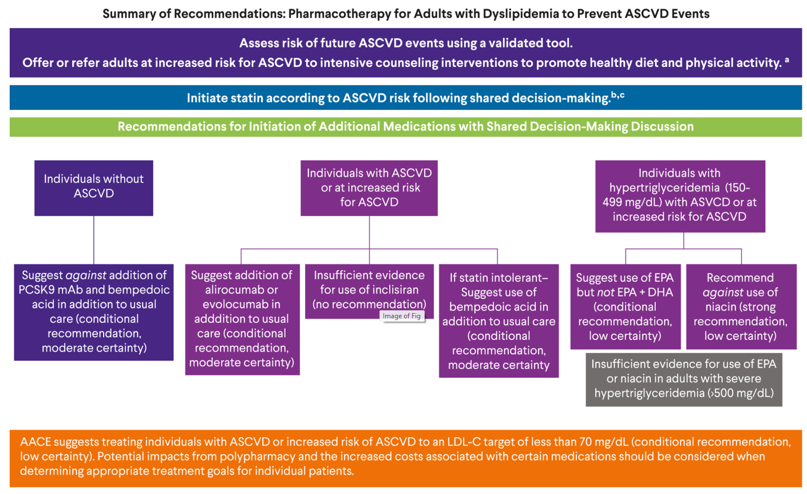

  

    

      
&lt; 70 mg/dL

      
Đích LDL-C Mới (Thay Thế &lt; 55 mg/dL)

    

    

      
PCSK9 mAbs

      
Thêm Vào Statin Khi Có ASCVD / Nguy Cơ Cao

    

    

      
Bempedoic Acid

      
Lựa Chọn Ưu Tiên Khi Không Dung Nạp Statin

    

    

      
Cấm Niacin

      
Khuyến Cáo Mạnh Chống Lại Phối Hợp Niacin

    

  

  

    

      
🎯

      

        
Đích LDL-C Thực Tế &lt; 70 mg/dL

        
AACE 2025 tái thiết lập đích LDL-C &lt; 70 mg/dL (1.8 mmol/L) thay vì &lt; 55 mg/dL trước đây nhằm cân bằng giữa lợi ích giảm biến cố tuyệt đối và nguy cơ đa dược trị (polypharmacy).

      

    

    

      
🧪

      

        
Liệu Pháp Non-statin Cá Thể Hóa

        
Evolocumab/Alirocumab bổ sung cho nhóm nguy cơ cao; Bempedoic Acid giải quyết bài toán đau cơ do cơ chế chọn lọc gan (ACSVL1); Inclisiran cần thêm bằng chứng biến cố cứng.

      

    

    

      
⚠️

      

        
Tái Định Nghĩa Hạ Triglycerid Máu

        
Chỉ định đơn trị Icosapent Ethyl (EPA 4g/ngày) cho TG 150–499 mg/dL kèm ASCVD; nói KHÔNG với phối hợp EPA + DHA; và chính thức khai trừ Niacin khỏi phác đồ tim mạch.

      

    

  

  

    <a href="#sec-1" class="quickmenu-item active">1. PICO &amp; GRADE</a>
    <a href="#sec-2" class="quickmenu-item">2. Nguy Cơ ASCVD &amp; Risk Enhancers</a>
    <a href="#sec-3" class="quickmenu-item">3. Kháng Thể PCSK9</a>
    <a href="#sec-4" class="quickmenu-item">4. Inclisiran &amp; Bempedoic Acid</a>
    <a href="#sec-5" class="quickmenu-item">5. Thuật Toán Điều Trị</a>
    <a href="#sec-6" class="quickmenu-item">6. Triglycerid &amp; Đích LDL-C</a>
    <a href="#sec-7" class="quickmenu-item">7. Khoảng Trống &amp; CDSS</a>
  

  <!-- ===================================================================== -->
  <!-- SECTION 1: TỔNG QUAN, PICO & PHƯƠNG PHÁP LUẬN GRADE -->
  <!-- ===================================================================== -->
  

    

      🔬
      <h2 class="sec-title">Phần 1: Tổng Quan, Mục Tiêu, Phạm Vi Tiếp Cận &amp; Phương Pháp Luận GRADE</h2>
    

    

      

        💡
        

          <strong>Phạm Vi Trọng Tâm Hướng Dẫn AACE 2025:</strong>
          Hướng dẫn này của Hiệp hội Nội tiết Lâm sàng Hoa Kỳ (AACE) tập trung chuyên sâu vào các khuyến cáo dựa trên bằng chứng về việc <strong>sử dụng các thuốc hạ lipid máu không phải statin (nonstatin)</strong> ở người trưởng thành (≥ 18 tuổi) bị rối loạn lipid máu hoặc tăng triglycerid máu, đang điều trị theo tiêu chuẩn chăm sóc thông thường nhưng <strong>chưa đạt được mức LDL-C hoặc triglycerid mục tiêu</strong>, hoặc <strong>không dung nạp được statin</strong>.
        

      

      
1. Gánh Nặng Dịch Tễ Học &amp; Bệnh Đồng Mắc Tim Mạch - Nội Tiết

      

        

          
Tử Vong Do ASCVD Toàn Cầu

          

            Bệnh tim mạch do xơ vữa (ASCVD) cướp đi sinh mạng hơn <strong>20.5 triệu người vào năm 2021</strong>. Riêng tại Mỹ, mỗi năm ghi nhận hơn <strong>800,000 ca tử vong do CVD</strong> (chiếm 1/3 tổng số tử vong). Ít nhất <strong>25% số ca tử vong liên quan trực tiếp đến LDL-C tăng cao</strong>. Hơn 76% người lớn có ASCVD tại Mỹ vẫn có LDL-C &gt; 70 mg/dL.
          

        

        

          
Thách Thức Bệnh Đái Tháo Đường (DM)

          

            Bệnh tim mạch (CVD) là nguyên nhân gây tử vong cho <strong>hơn 66% số bệnh nhân đái tháo đường</strong>. Đặc biệt, <strong>lên đến 95% bệnh nhân đái tháo đường tuýp 2 (T2D) xuất hiện ít nhất một chỉ số lipid máu bất thường</strong>, phản ánh tình trạng xơ vữa tiến triển âm thầm và nguy cơ tồn dư cực lớn.
          

        

      

      
2. Định Nghĩa Lâm Sàng Các Thể Rối Loạn Lipid Máu Theo AACE

      

        <table class="regimen-table">
          <thead>
            <tr>
              <th style="width: 30%;">Thể Rối Loạn Lipid</th>
              <th style="width: 35%;">Tiêu Chuẩn Nồng Độ Lâm Sàng</th>
              <th style="width: 35%;">Ý Nghĩa Phân Tầng Bệnh Học</th>
            </tr>
          </thead>
          <tbody>
            <tr>
              <td class="source-cell"><strong>Rối loạn lipid máu chung (Dyslipidemia)</strong></td>
              <td>LDL-C &gt; 130 mg/dL (3.4 mmol/L) ở dân số chung, HOẶC <strong>&gt; 70 mg/dL (1.8 mmol/L)</strong> ở người đã có tiền sử ASCVD.</td>
              <td>Chỉ định can thiệp lối sống tích cực và phối hợp dược lý hạ lipid máu có mục tiêu.</td>
            </tr>
            <tr>
              <td class="source-cell"><strong>Tăng triglycerid máu (Hypertriglyceridemia)</strong></td>
              <td>Triglycerid <strong>150 – 499 mg/dL</strong> (1.7 – 5.6 mmol/L).</td>
              <td>Gia tăng nguy cơ tồn dư ASCVD; cân nhắc bổ sung Icosapent Ethyl (EPA) khi có kèm ASCVD.</td>
            </tr>
            <tr>
              <td class="source-cell"><strong>Tăng triglycerid máu nghiêm trọng (Severe HyperTG)</strong></td>
              <td>Triglycerid <strong>≥ 500 mg/dL</strong> (5.7 mmol/L).</td>
              <td>Nguy cơ bùng phát <strong>Viêm tụy cấp do tăng triglycerid</strong>; mục tiêu hàng đầu là hạ TG khẩn cấp.</td>
            </tr>
          </tbody>
        </table>
      

      
3. 6 Câu Hỏi Lâm Sàng Trọng Tâm (PICO Questions)

      <ul style="padding-left: 1.25rem; font-size: 0.88rem; line-height: 1.75; margin-bottom: 1.25rem;">
        <li><strong>PICO 1:</strong> Lợi ích và tác hại của các chất ức chế PCSK9 so với điều trị thông thường ở người lớn rối loạn lipid máu?</li>
        <li><strong>PICO 2:</strong> Lợi ích và tác hại của Axit Bempedoic (BA) so với điều trị thông thường?</li>
        <li><strong>PICO 3:</strong> Lợi ích và tác hại của Axit Eicosapentaenoic (EPA) so với phối hợp EPA + DHA ở bệnh nhân tăng triglycerid máu?</li>
        <li><strong>PICO 4:</strong> Lợi ích và tác hại của Niacin giải phóng kéo dài so với các thuốc không phải statin khác (như fibrate, EPA)?</li>
        <li><strong>PICO 5:</strong> Lợi ích và tác hại của việc điều trị đạt mục tiêu LDL-C nghiêm ngặt hơn (&lt; 70 mg/dL) so với mục tiêu thông thường (≥ 70 mg/dL)?</li>
        <li><strong>PICO 6:</strong> Ở người lớn không có bệnh tim mạch, việc bổ sung các yếu tố tăng cường nguy cơ (CAC, ApoB, Lp(a)) vào phương trình tính nguy cơ truyền thống có cải thiện độ chính xác dự báo biến cố không?</li>
      </ul>

      

        📐
        

          <strong>Khái Niệm Sự Khác Biệt Tối Thiểu Có Ý Nghĩa Lâm Sàng (MID - Minimally Important Difference):</strong>
          Hội đồng AACE đã thiết lập trước ngưỡng MID đồng thuận: <strong>Sự khác biệt nguy cơ tuyệt đối là 5 trên 1000 người tham gia</strong> được coi là có ý nghĩa lâm sàng đối với hầu hết các kết cục tim mạch cứng (tử vong do mọi nguyên nhân, tử vong tim mạch, nhồi máu cơ tim, đột quỵ). Riêng đối với biến cố <strong>tái thông mạch vành</strong>, ngưỡng MID được đặt là <strong>50 trên 1000 người</strong>.
        

      

      
4. Bảng Hệ Thống Phân Hạng Khuyến Cáo GRADE của AACE (Table 1)

      

        <table class="regimen-table">
          <thead>
            <tr>
              <th style="width: 25%;">Loại Khuyến Cáo</th>
              <th style="width: 45%;">Định Nghĩa Thực Hành Lâm Sàng</th>
              <th style="width: 30%;">Mức Độ Chắc Chắn Bằng Chứng</th>
            </tr>
          </thead>
          <tbody>
            <tr>
              <td class="source-cell">Khuyến cáo Mạnh (Strong)</td>
              <td>AACE khuyến cáo ủng hộ hoặc chống lại... Độ tin cậy cao vào ước tính tác động trên các kết cục. Hầu hết bệnh nhân được giải thích đầy đủ sẽ chọn phương án được khuyến cáo.</td>
              <td>Cao (⊕⊕⊕⊕) hoặc Trung bình (⊕⊕⊕◯)</td>
            </tr>
            <tr>
              <td class="source-cell">Có điều kiện (Conditional)</td>
              <td>AACE gợi ý ủng hộ hoặc chống lại... Độ tin cậy thấp hơn vào ước tính tác động. Lựa chọn của bệnh nhân có thể thay đổi tùy thuộc vào giá trị cá nhân và sở thích sau thảo luận chung.</td>
              <td>Trung bình (⊕⊕⊕◯) hoặc Thấp (⊕⊕◯◯)</td>
            </tr>
            <tr>
              <td class="source-cell">Không đưa ra khuyến cáo</td>
              <td>Không có đủ dữ liệu đáng tin cậy để xác định cân bằng giữa lợi ích và nguy cơ.</td>
              <td>Rất thấp (⊕◯◯◯) hoặc Không đủ bằng chứng</td>
            </tr>
            <tr>
              <td class="source-cell">Tuyên bố thực hành tốt (GPS)</td>
              <td>Hướng dẫn lâm sàng không phân hạng, mang tính hành động rõ ràng và dựa trên sự đồng thuận tuyệt đối của ban chuyên gia.</td>
              <td>Không phân hạng (Expert Consensus)</td>
            </tr>
          </tbody>
        </table>
      

    

  

  <!-- ===================================================================== -->
  <!-- SECTION 2: ĐÁNH GIÁ NGUY CƠ TIM MẠCH & YẾU TỐ TĂNG CƯỜNG (RISK ENHANCERS) -->
  <!-- ===================================================================== -->
  

    

      🫀
      <h2 class="sec-title">Phần 2: Đánh Giá Nguy Cơ Tim Mạch Do Xơ Vữa &amp; Các Yếu Tố Tăng Cường (Risk Enhancers)</h2>
    

    

      

        

          <strong style="color: var(--color-primary, #0284c7); font-size: 1.05rem;">Khuyến Cáo 1: Sử Dụng Công Cụ Dự Báo Nguy Cơ ASCVD Đã Được Kiểm Định</strong>
          Tuyên bố thực hành tốt (GPS) • Không phân hạng
        

        

          Đối với dự phòng cấp một ở người lớn bị rối loạn lipid máu, AACE khuyến cáo <strong>sử dụng một công cụ hoặc công cụ tính nguy cơ đã được kiểm định</strong> (chẳng hạn như PCE, FRS, hoặc PREVENT) để dự báo nguy cơ biến cố ASCVD trong tương lai như một phần của việc ra quyết định chung về điều trị giữa bác sĩ và người bệnh.
        

      

      
1. Cơ Chế Lâm Sàng &amp; Giá Trị Bổ Sung Của Các "Yếu Tố Tăng Cường Nguy Cơ" (Risk Enhancers)

      

        Hội đồng chuyên gia AACE nhấn mạnh rằng các công cụ tính nguy cơ truyền thống (như Pooled Cohort Equations - PCE, Framingham Risk Score - FRS) đã sở hữu khả năng phân định biến cố tim mạch rất tốt (chỉ số c-statistic dao động từ <strong>0.693 đến 0.84</strong>). Việc bổ sung thêm các yếu tố phi truyền thống chỉ đem lại sự cải thiện tăng thêm cực kỳ nhỏ (incremental) mà <strong>không làm thay đổi đáng kể độ chính xác lâm sàng thực tế</strong>:
      

      

        

          
1. Điểm Vôi Hóa Động Mạch Vành (CAC)

          

            Khi bổ sung CAC vào PCE hoặc FRS, chỉ số c-statistic chỉ tăng khiêm tốn từ <strong>-0.01 đến 0.088</strong>. CAC có giá trị cao nhất ở bệnh nhân có <em>nguy cơ trung gian</em> để quyết định trì hoãn dùng statin nếu CAC = 0. Tuy nhiên:
            <ul style="margin: 0.5rem 0 0 1rem; padding: 0; font-size: 0.82rem; line-height: 1.6;">
              <li><strong>Chống chỉ định đo lặp lại CAC:</strong> Không mang lại giá trị lâm sàng và làm tăng phơi nhiễm bức xạ X-quang.</li>
              <li><strong>Kém tin cậy:</strong> Ở người đái tháo đường, người trẻ &lt; 50 tuổi, người hút thuốc lá hoặc người nhiễm HIV.</li>
            </ul>
          

        

        

          
2. Apolipoprotein B (ApoB)

          

            Bổ sung ngưỡng ApoB &gt; 100 mg/dL chỉ làm tăng c-statistic từ <strong>0.0004 đến 0.002</strong>.
             <em>Giá trị lâm sàng:</em> Trường hợp ApoB tăng cao bất tương xứng so với nồng độ LDL-C khiêm tốn phản ánh tình trạng tăng số lượng hạt xơ vữa (atherogenic particle number) và nguy cơ tồn dư, là cơ sở cân nhắc khởi trị statin ở bệnh nhân ranh giới.
          

        

        

          
3. Lipoprotein(a) [Lp(a)]

          

            Bổ sung ngưỡng Lp(a) &gt; 50 mg/dL chỉ làm tăng c-statistic thêm từ <strong>0 đến 0.0164</strong>.
             <em>Giá trị lâm sàng:</em> Lp(a) là yếu tố nguy cơ di truyền độc lập, hữu ích trong sàng lọc nguy cơ gia đình sớm, nhưng hiện tại chưa có thử nghiệm chứng minh việc hạ đặc hiệu Lp(a) làm giảm biến cố tim mạch.
          

        

        

          
4. Chuyển Đổi Sang Thang PREVENT™ Của AHA

          

            Các công cụ cũ (PCE) có thiên kiến chủng tộc. Thang điểm mới <strong>PREVENT của AHA</strong> đã loại bỏ yếu tố chủng tộc, thay bằng mã bưu chính (ZIP code) để phản ánh bất bình đẳng xã hội, tích hợp thêm eGFR và HbA1c. Tuy nhiên, thang điểm này có xu hướng dự báo mức nguy cơ thấp hơn so với PCE.
          

        

      

      
2. Khung Đánh Giá Từ Bằng Chứng Đến Quyết Định (GRADE EtD Framework - Table 4)

      

        <table class="regimen-table">
          <thead>
            <tr>
              <th style="width: 25%;">Lĩnh Vực Đánh Giá (Domain)</th>
              <th style="width: 75%;">Nội Dung Phân Tích &amp; Thảo Luận Lâm Sàng Dựa Trên Bằng Chứng Của AACE</th>
            </tr>
          </thead>
          <tbody>
            <tr>
              <td class="source-cell"><strong>Giá trị của bệnh nhân</strong></td>
              <td>Rất khác nhau tùy thuộc vào mức độ nhận thức về nguy cơ tim mạch, trình độ học vấn hoặc tiền sử bệnh lý gia đình mắc bệnh tim mạch sớm.</td>
            </tr>
            <tr>
              <td class="source-cell"><strong>Độ mạnh của mối liên quan</strong></td>
              <td>Không ghi nhận sự thay đổi có tác động lâm sàng thực tế đối với chỉ số c-statistic khi bổ sung bất kỳ yếu tố tăng cường nào (CAC, ApoB, Lp(a)) vào mô hình tính nguy cơ chuẩn.</td>
            </tr>
            <tr>
              <td class="source-cell"><strong>Cân bằng Lợi ích / Tác hại</strong></td>
              <td><em>Lợi ích:</em> Cung cấp thêm thông tin giúp bệnh nhân an tâm và hỗ trợ ra quyết định chung. <em>Tác hại:</em> Tăng chi phí xét nghiệm/chẩn đoán hình ảnh, phơi nhiễm bức xạ khi chụp CAC, lo âu tâm lý và tăng số lần thăm khám không cần thiết.</td>
            </tr>
            <tr>
              <td class="source-cell"><strong>Hệ quả xử trí lâm sàng</strong></td>
              <td>Nguy cơ dẫn đến tình trạng <strong>điều trị quá mức (overtreatment)</strong> hoặc gây hoang mang thái quá cho người bệnh khi nhận kết quả bất thường mà không có giải pháp can thiệp thuốc tương xứng.</td>
            </tr>
            <tr>
              <td class="source-cell"><strong>Chi phí y tế</strong></td>
              <td>Tăng đáng kể gánh nặng tài chính do chi phí chụp CAC, đọc phim cắt lớp, chi phí gửi mẫu ApoB/Lp(a) đến phòng xét nghiệm chuyên sâu và thời gian nghỉ việc của người bệnh.</td>
            </tr>
            <tr>
              <td class="source-cell"><strong>Tính công bằng (Equity)</strong></td>
              <td>Các cộng đồng ở vùng nông thôn hoặc vùng sâu vùng xa gặp nhiều rào cản lớn trong việc tiếp cận các trung tâm chụp cắt lớp đo CAC hoặc phòng xét nghiệm lipid phân tử.</td>
            </tr>
          </tbody>
        </table>
      

    

  

  <!-- ===================================================================== -->
  <!-- SECTION 3: KHÁNG THỂ ĐƠN DÒNG ỨC CHẾ PCSK9 -->
  <!-- ===================================================================== -->
  

    

      💉
      <h2 class="sec-title">Phần 3: Kháng Thể Đơn Dòng Ức Chế Thụ Thể PCSK9 (Evolocumab &amp; Alirocumab)</h2>
    

    

      

        

          <strong style="color: var(--color-success, #10b981); font-size: 1.05rem;">Khuyến Cáo 2: Chỉ Định Phối Hợp Kháng Thể PCSK9 (Alirocumab / Evolocumab)</strong>
          Khuyến cáo có điều kiện • Bằng chứng trung bình (⊕⊕⊕◯)
        

        

          Ở người lớn bị rối loạn lipid máu đang sử dụng statin liều dung nạp tối đa, <strong>đã có ASCVD hoặc có nguy cơ cao mắc ASCVD nhưng chưa đạt mục tiêu điều trị (LDL-C &lt; 70 mg/dL)</strong>, AACE gợi ý <strong>phối hợp thêm Evolocumab hoặc Alirocumab</strong> vào phác đồ điều trị thông thường.
        

      

      

        

          <strong style="color: var(--color-danger, #dc2626); font-size: 1.05rem;">Khuyến Cáo 3: Chống Lại Phối Hợp Kháng Thể PCSK9 Ở Người Không Có ASCVD</strong>
          Khuyến cáo chống lại (Có điều kiện) • Bằng chứng trung bình (⊕⊕⊕◯)
        

        

          Ở người lớn bị rối loạn lipid máu <strong>không có tiền sử ASCVD và có thể dung nạp tốt các loại thuốc hạ lipid máu khác</strong>, AACE gợi ý <strong>chống lại (không nên)</strong> việc sử dụng phối hợp thêm evolocumab hoặc alirocumab vào điều trị thông thường.
        

      

      
1. Cơ Chế Sinh Lý Bệnh Học Phân Tử: Chu Trình Thụ Thể LDLR &amp; Vai Trò Của PCSK9

      <ul style="padding-left: 1.25rem; font-size: 0.88rem; line-height: 1.75; margin-bottom: 1rem;">
        <li><strong>PCSK9 (Proprotein convertase subtilisin/kexin type 9):</strong> Protein serine protease do tế bào gan tổng hợp và tiết vào máu, tồn tại dưới dạng hoạt động gắn trực tiếp vào tiểu phân LDL tuần hoàn.</li>
        <li><strong>Chu trình tái tuần hoàn thụ thể LDL sinh lý (LDLR Recycling):</strong> Thụ thể LDLR trên màng tế bào gan bắt giữ hạt LDL-C đưa vào nội bào qua túi nội thực bào (endosome). Trong môi trường acid, hạt LDL tách khỏi LDLR; LDL chuyển đến lysosome phân hủy, còn thụ thể LDLR tự do được <strong>tái tuần hoàn (recycling) trở lại màng tế bào gan</strong> để tiếp tục thanh thải hàng ngàn hạt LDL-C khác.</li>
        <li><strong>Bệnh sinh do PCSK9 gắn LDLR:</strong> Khi LDL-C có gắn kèm protein PCSK9 liên kết với LDLR, sự hiện diện của PCSK9 khóa thụ thể ở cấu hình không tách rời được. Toàn bộ phức hợp LDLR bị chuyển hướng đến lysosome để <strong>tiêu hủy hoàn toàn (lysosomal degradation)</strong> thay vì quay lại bề mặt gan. Hậu quả là số lượng thụ thể LDLR sụt giảm nghiêm trọng, gan mất khả năng thanh thải LDL-C khỏi tuần hoàn, làm nồng độ LDL-C máu tăng vọt.</li>
        <li><strong>Cơ chế tác động của Kháng thể đơn dòng (mAbs):</strong> Evolocumab và Alirocumab là các kháng thể đơn dòng hoàn toàn từ người (fully human IgG). Chúng liên kết đặc hiệu với PCSK9 tự do trong máu với ái lực cực cao, bất hoạt hoàn toàn PCSK9. Khi không còn PCSK9 tự do can thiệp, thụ thể LDLR được bảo vệ khỏi sự phân hủy lysosome, tăng mật độ thụ thể LDLR màng tế bào gan lên gấp nhiều lần, từ đó thúc đẩy thanh thải ồ ạt LDL-C khỏi tuần hoàn (hạ LDL-C từ 50% – 60%).</li>
      </ul>

      <!-- SVG SƠ ĐỒ CƠ CHẾ PCSK9 -->
      

        

          Sơ Đồ Cơ Chế Tác Động Của Kháng Thể Đơn Dòng Ức Chế PCSK9 (Evolocumab / Alirocumab)
        

        <svg viewBox="0 0 900 240" width="100%" height="auto" xmlns="http://www.w3.org/2000/svg" style="font-family: system-ui, -apple-system, sans-serif;">
          <defs>
            <linearGradient id="grad-blue-m" x1="0%" y1="0%" x2="100%" y2="100%">
              <stop offset="0%" stop-color="#0284c7" />
              <stop offset="100%" stop-color="#0369a1" />
            </linearGradient>
            <linearGradient id="grad-red-m" x1="0%" y1="0%" x2="100%" y2="100%">
              <stop offset="0%" stop-color="#ef4444" />
              <stop offset="100%" stop-color="#b91c1c" />
            </linearGradient>
            <linearGradient id="grad-green-m" x1="0%" y1="0%" x2="100%" y2="100%">
              <stop offset="0%" stop-color="#10b981" />
              <stop offset="100%" stop-color="#047857" />
            </linearGradient>
            <marker id="arrow-m" viewBox="0 0 10 10" refX="6" refY="5" markerWidth="6" markerHeight="6" orient="auto">
              <path d="M 0 0 L 10 5 L 0 10 z" fill="#64748b" />
            </marker>
          </defs>

          <!-- Node 1: PCSK9 tự do -->
          <rect x="20" y="30" width="220" height="70" rx="8" fill="#fef2f2" stroke="#ef4444" stroke-width="2" />
          <text x="130" y="58" font-size="13" font-weight="700" fill="#b91c1c" text-anchor="middle">PCSK9 Tự Do Trong Máu</text>
          <text x="130" y="80" font-size="11" fill="#7f1d1d" text-anchor="middle">Gắn LDLR gây tiêu hủy Lysosome</text>

          <!-- Node 2: Kháng thể đơn dòng -->
          <rect x="20" y="140" width="220" height="70" rx="8" fill="#eff6ff" stroke="#0284c7" stroke-width="2" />
          <text x="130" y="168" font-size="13" font-weight="700" fill="#0369a1" text-anchor="middle">Evolocumab / Alirocumab</text>
          <text x="130" y="190" font-size="11" fill="#1e3a8a" text-anchor="middle">Kháng thể đơn dòng hoàn toàn từ người</text>

          <!-- Arrow 1 to Phức hợp bất hoạt -->
          <path d="M 240 65 L 320 105" stroke="#64748b" stroke-width="2" marker-end="url(#arrow-m)" />
          <path d="M 240 175 L 320 135" stroke="#64748b" stroke-width="2" marker-end="url(#arrow-m)" />

          <!-- Node 3: Phức hợp bất hoạt -->
          <rect x="330" y="85" width="220" height="70" rx="8" fill="#f1f5f9" stroke="#64748b" stroke-width="2" />
          <text x="440" y="113" font-size="13" font-weight="700" fill="#1e293b" text-anchor="middle">Phức Hợp Bất Hoạt</text>
          <text x="440" y="135" font-size="11" fill="#475569" text-anchor="middle">Ngăn chặn gắn vào thụ thể LDLR</text>

          <!-- Arrow to LDLR recycling -->
          <path d="M 550 120 L 610 120" stroke="#64748b" stroke-width="2" marker-end="url(#arrow-m)" />

          <!-- Node 4: Bảo vệ LDLR -->
          <rect x="620" y="30" width="260" height="70" rx="8" fill="#ecfdf5" stroke="#10b981" stroke-width="2" />
          <text x="750" y="58" font-size="13" font-weight="700" fill="#047857" text-anchor="middle">Bảo Vệ Thụ Thể LDLR Gan</text>
          <text x="750" y="80" font-size="11" fill="#065f46" text-anchor="middle">Tăng tái tuần hoàn (Recycling) màng gan</text>

          <!-- Arrow down to Clear LDL-C -->
          <path d="M 750 100 L 750 130" stroke="#64748b" stroke-width="2" marker-end="url(#arrow-m)" />

          <!-- Node 5: Hạ LDL-C -->
          <rect x="620" y="140" width="260" height="70" rx="8" fill="url(#grad-green-m)" />
          <text x="750" y="168" font-size="13" font-weight="700" fill="#ffffff" text-anchor="middle">Tăng Bắt Giữ &amp; Thanh Thải LDL-C</text>
          <text x="750" y="190" font-size="11" fill="#e6fffa" text-anchor="middle">Hạ 50%–60% LDL-C • Giảm Biến Cố ASCVD</text>
        </svg>
      

      
2. Bằng Chứng Thử Nghiệm Lâm Sàng Lớn (Landmark RCTs)

      

        <table class="regimen-table">
          <thead>
            <tr>
              <th style="width: 20%;">Thuốc / Thử Nghiệm</th>
              <th style="width: 25%;">Cỡ Mẫu &amp; Phác Đồ Liều Dùng</th>
              <th style="width: 35%;">Kết Cục Lâm Sàng Tuyệt Đối</th>
              <th style="width: 20%;">Tác Dụng Phụ &amp; Rào Cản</th>
            </tr>
          </thead>
          <tbody>
            <tr>
              <td class="source-cell">
                <strong>Evolocumab</strong> 
                FOURIER RCT 
                <em>(N = 27,594)</em>
              </td>
              <td>140 mg tiêm dưới da mỗi 2 tuần, hoặc 420 mg tiêm dưới da mỗi tháng một lần.</td>
              <td>
                • <strong>Giảm nhỏ nguy cơ nhồi máu cơ tim (MI):</strong> Giảm tuyệt đối 11 ca trên 1000 người dùng (ARR = 1.1%). 
                • Không ghi nhận giảm có ý nghĩa lâm sàng đối với tử vong do mọi nguyên nhân hoặc đột quỵ.
              </td>
              <td>Phản ứng nhẹ tại chỗ tiêm (sưng, đỏ da), viêm mũi họng, đau lưng. Tỉ lệ ngừng thuốc rất thấp. Chi phí đắt đỏ.</td>
            </tr>
            <tr>
              <td class="source-cell">
                <strong>Alirocumab</strong> 
                ODYSSEY OUTCOMES 
                <em>(N = 18,924)</em>
              </td>
              <td>75 mg – 150 mg tiêm dưới da mỗi 2 tuần, hoặc 300 mg mỗi tháng một lần.</td>
              <td>
                • <strong>Giảm nhỏ nguy cơ nhồi máu cơ tim (MI):</strong> Giảm tuyệt đối 18 ca trên 1000 người (ARR = 1.8%). 
                • <strong>Giảm rất ít tử vong do mọi nguyên nhân:</strong> Giảm tuyệt đối 6 ca trên 1000 người (ARR = 0.6%).
              </td>
              <td>Phản ứng nhẹ tại chỗ tiêm, ngứa, viêm mũi họng. Chi phí cao, thủ tục bảo hiểm phức tạp.</td>
            </tr>
          </tbody>
        </table>
      

    

  

  <!-- ===================================================================== -->
  <!-- SECTION 4: INCLISIRAN siRNA & AXIT BEMPEDOIC -->
  <!-- ===================================================================== -->
  

    

      💊
      <h2 class="sec-title">Phần 4: Inclisiran (Công Nghệ siRNA) &amp; Axit Bempedoic (Bempedoic Acid)</h2>
    

    

      

        

          <strong style="color: var(--color-warning, #f59e0b); font-size: 1.05rem;">Khuyến Cáo 4: Chưa Đủ Bằng Chứng Lâm Sàng Khuyến Cáo Cho Inclisiran</strong>
          Không đưa ra khuyến cáo • Bằng chứng thấp / Chưa đầy đủ
        

        

          Hiện tại <strong>chưa có đủ bằng chứng lâm sàng về kết cục tim mạch cứng (hard ASCVD outcomes)</strong> để đưa ra khuyến cáo ủng hộ hay chống lại việc sử dụng Inclisiran ở người trưởng thành bị rối loạn lipid máu.
        

      

      
1. Cơ Chế Phân Tử siRNA Inclisiran: Liên Hợp GalNAc &amp; Phức Hợp RISC Cắt mRNA PCSK9

      <ul style="padding-left: 1.25rem; font-size: 0.88rem; line-height: 1.75; margin-bottom: 1rem;">
        <li><strong>Cấu trúc phân tử:</strong> Inclisiran là chuỗi RNA can thiệp nhỏ, mạch kép (double-stranded small interfering RNA - siRNA).</li>
        <li><strong>Cơ chế hướng gan đặc hiệu (GalNAc Targeting):</strong> Phân tử inclisiran được liên hợp hóa với <strong>N-acetylgalactosamine (GalNAc)</strong>. Phức hợp này liên kết chọn lọc cao với <em>thụ thể asialoglycoprotein (ASGPR)</em> phân bố độc quyền trên màng tế bào gan, cho phép thuốc được nhập bào nhanh chóng và chọn lọc vào tế bào gan mà không xâm nhập mô khác.</li>
        <li><strong>Cơ chế phân hủy xúc tác mRNA:</strong> Sau khi vào bào tương gan, chuỗi hướng dẫn của siRNA nạp vào phức hợp cảm ứng tắt tín hiệu do RNA (RNA-induced silencing complex - RISC). Phức hợp RISC bắt cặp bổ sung chính xác với phân tử mRNA mã hóa cho PCSK9 và thực hiện phản ứng cắt xúc tác (catalytic cleavage). mRNA PCSK9 bị phá hủy hoàn toàn, đình chỉ quá trình dịch mã protein PCSK9 mới. Thụ thể LDLR không còn bị PCSK9 tiêu hủy, phục hồi khả năng thanh thải LDL-C.</li>
        <li><strong>Dữ liệu lâm sàng &amp; Đánh giá:</strong> Thử nghiệm chuỗi **ORION-1, 9, 10, và 11** (N = 4,226) cho thấy thuốc hạ LDL-C rất mạnh (~50%). Tuy nhiên thời gian theo dõi còn ngắn (8–77 tuần), số biến cố tích lũy chưa đủ kết luận về tử vong hoặc nhồi máu cơ tim.
           <em>Ưu điểm vượt trội:</em> Liều tiêm cực kỳ thưa: <strong>tiêm dưới da 284 mg liều đầu, lặp lại sau 3 tháng, và sau đó duy trì định kỳ mỗi 6 tháng một lần</strong>.
        </li>
      </ul>

      

        

          <strong style="color: var(--color-primary, #0284c7); font-size: 1.05rem;">Khuyến Cáo 5: Chỉ Định Axit Bempedoic Khi Không Dung Nạp Statin Có ASCVD / Nguy Cơ Cao</strong>
          Khuyến cáo có điều kiện • Bằng chứng trung bình (⊕⊕⊕◯)
        

        

          Ở người lớn bị rối loạn lipid máu <strong>không dung nạp statin, đã có ASCVD hoặc có nguy cơ cao mắc ASCVD</strong>, AACE gợi ý <strong>phối hợp Axit Bempedoic</strong> bổ sung vào điều trị thông thường.
        

      

      

        

          <strong style="color: var(--color-danger, #dc2626); font-size: 1.05rem;">Khuyến Cáo 6: Chống Lại Phối Hợp Axit Bempedoic Ở Người Không Có ASCVD</strong>
          Khuyến cáo chống lại (Có điều kiện) • Bằng chứng trung bình (⊕⊕⊕◯)
        

        

          Ở người lớn bị rối loạn lipid máu <strong>không có ASCVD và có thể dung nạp tốt các thuốc hạ lipid máu khác</strong>, AACE gợi ý <strong>chống lại (không nên)</strong> việc sử dụng phối hợp thêm axit bempedoic.
        

      

      
2. Cơ Chế Độc Đáo Của Axit Bempedoic: Tiền Chất Chọn Lọc Tế Bào Gan &amp; Không Gây Đau Cơ (Myalgia-Free)

      

        

          
Ức Chế ATP-Citrate Lyase (ACL) Thượng Nguồn

          

            Axit Bempedoic ức chế enzym then chốt **ATP-citrate lyase (ACL)**, nằm ngay phía thượng nguồn của enzym HMG-CoA reductase (đích của statin) trong con đường sinh tổng hợp cholesterol nội bào tại gan. Sự sụt giảm cholesterol nội bào kích hoạt cơ chế feedback làm tăng mật độ thụ thể LDLR màng gan.
          

        

        

          
Cơ Chế Tiền Chất (Prodrug) Gan-Đặc Hiệu

          

            Axit Bempedoic là tiền chất chưa có hoạt tính. Nó bắt buộc phải được chuyển hóa hoạt hóa bởi enzym **very long-chain acyl-CoA synthetase-1 (ACSVL1)**. Enzym này chỉ phân bố ở tế bào gan mà <strong>hoàn toàn không có mặt trong mô cơ vân (skeletal muscle)</strong>. Vì vậy, tế bào cơ vân không bị ức chế tổng hợp cholesterol, <strong>loại bỏ hoàn toàn tác dụng phụ đau cơ/yếu cơ (myalgia)</strong> của statin.
          

        

        

          
Thử Nghiệm CLEAR Outcomes (N = 13,970)

          

            Nghiên cứu trên bệnh nhân không dung nạp statin (theo dõi 3.4 năm, liều 180 mg/ngày uống 1 lần): 
            • <strong>Giảm nhỏ nguy cơ nhồi máu cơ tim (MI):</strong> Giảm tuyệt đối 11 ca trên 1000 người (ARR = 1.1%). 
            • <strong>Giảm nhẹ bệnh mạch máu ngoại vi (PVD):</strong> Giảm tuyệt đối 6 ca trên 1000 người (ARR = 0.6%). 
            • Không làm giảm đáng kể tử vong do mọi nguyên nhân, tử vong tim mạch hay đột quỵ.
          

        

        

          
Cảnh Báo Tác Dụng Phụ Nghiêm Trọng

          

            Axit Bempedoic cạnh tranh đào thải acid uric qua ống thận, làm tăng nguy cơ:
            <ul style="margin: 0.35rem 0 0 1rem; padding: 0; font-size: 0.82rem; line-height: 1.5;">
              <li><strong>Bệnh gút cấp (Gout flare)</strong> do tăng acid uric máu.</li>
              <li><strong>Sỏi mật (Cholelithiasis)</strong>.</li>
              <li><strong>Đứt gân (Tendon rupture)</strong> (gân gót Achilles, cơ nhị đầu).</li>
              <li>Tăng tỉ lệ ngừng thuốc do biến cố bất lợi: tăng 21 ca dừng thuốc trên 1000 người.</li>
            </ul>
          

        

      

      
3. Bảng Tổng Hợp 4 Thuốc Non-statin Được FDA Phê Duyệt Cho Rối Loạn Lipid Máu (Table 13)

      

        <table class="regimen-table">
          <thead>
            <tr>
              <th style="width: 15%;">Tên Thuốc</th>
              <th style="width: 25%;">Cơ Chế Hoạt Động Chính</th>
              <th style="width: 20%;">Đường Dùng &amp; Liều Lượng</th>
              <th style="width: 20%;">Hiệu Quả ASCVD Tuyệt Đối</th>
              <th style="width: 20%;">Tác Dụng Phụ &amp; Chi Phí</th>
            </tr>
          </thead>
          <tbody>
            <tr>
              <td class="source-cell"><strong>Alirocumab</strong></td>
              <td>Kháng thể đơn dòng gắn PCSK9 tự do ngoại bào, tăng mật độ thụ thể LDLR màng gan.</td>
              <td>Tiêm dưới da: 75–150 mg mỗi 2 tuần hoặc 300 mg mỗi tháng.</td>
              <td>↓↓ Nhồi máu cơ tim (MI) và ↓ Tử vong do mọi nguyên nhân.</td>
              <td>Viêm mũi họng, phản ứng tại chỗ tiêm, cúm. Chi phí rất đắt ($$$)</td>
            </tr>
            <tr>
              <td class="source-cell"><strong>Evolocumab</strong></td>
              <td>Kháng thể đơn dòng gắn PCSK9 tự do ngoại bào, tăng mật độ thụ thể LDLR màng gan.</td>
              <td>Tiêm dưới da: 140 mg mỗi 2 tuần hoặc 420 mg mỗi tháng.</td>
              <td>↓↓ Nhồi máu cơ tim (MI).</td>
              <td>Phản ứng tại chỗ tiêm, viêm mũi họng, đau lưng. Chi phí rất đắt ($$$)</td>
            </tr>
            <tr>
              <td class="source-cell"><strong>Inclisiran</strong></td>
              <td>Can thiệp RNA (siRNA) hướng tế bào gan qua GalNAc, xúc tác phân hủy mRNA PCSK9.</td>
              <td>Tiêm dưới da: 284 mg liều đầu, sau 3 tháng, và duy trì mỗi 6 tháng.</td>
              <td>Chưa đủ bằng chứng lâm sàng về cải thiện biến cố ASCVD cứng.</td>
              <td>Phản ứng tại chỗ tiêm, đau khớp. Rất đắt ($$$) • Tiêm tại cơ sở y tế</td>
            </tr>
            <tr>
              <td class="source-cell"><strong>Bempedoic Acid</strong></td>
              <td>Tiền chất hoạt hóa bởi ACSVL1 gan, ức chế ATP-citrate lyase (ACL), giảm tổng hợp cholesterol.</td>
              <td>Đường uống: 180 mg một lần mỗi ngày.</td>
              <td>↓↓ Nhồi máu cơ tim (MI).</td>
              <td><strong>Tăng acid uric (Gút), sỏi mật, đứt gân</strong>, thiếu máu. Chi phí trung bình ($$)</td>
            </tr>
          </tbody>
        </table>
      

    

  

  <!-- ===================================================================== -->
  <!-- SECTION 5: LƯU ĐỒ THUẬT TOÁN ĐIỀU TRỊ AACE 2025 -->
  <!-- ===================================================================== -->
  

    

      🗺️
      <h2 class="sec-title">Phần 5: Thuật Toán Phác Đồ Điều Trị Dược Lý Rối Loạn Lipid Máu Theo AACE 2025</h2>
    

    

      <!-- FIG CARD ẢNH GỐC -->
      

        
        

          
Figure 1. Summary of Recommendations: Pharmacotherapy for Adults with Dyslipidemia to Prevent ASCVD Events

          Sơ đồ phác đồ điều trị dược lý rối loạn lipid máu ở người lớn nhằm dự phòng biến cố tim mạch do xơ vữa (Trang 237, Hướng dẫn thực hành lâm sàng AACE 2025).
        

      

      
Lưu Đồ Thuật Toán Trực Quan Hóa (Editorial Interactive SVG Flowchart AACE 2025)

      

        Theo đúng <strong>Quy tắc chuyển đổi lưu đồ hình ảnh sang mã nguồn trực quan (Flowchart Image-to-Code Rule)</strong>, sơ đồ Figure 1 được tái hiện toàn vẹn bằng chuẩn đồ họa xuất bản Inline SVG vector sắc nét, tự động thích ứng hoàn toàn chế độ Dark Mode:
      

      <!-- EDITORIAL SVG FLOWCHART -->
      

        <svg viewBox="0 0 1020 720" width="100%" height="auto" xmlns="http://www.w3.org/2000/svg" style="font-family: system-ui, -apple-system, sans-serif;">
          <defs>
            <linearGradient id="flow-hdr-purple" x1="0%" y1="0%" x2="100%" y2="0%">
              <stop offset="0%" stop-color="#4a1d96" />
              <stop offset="100%" stop-color="#3b0764" />
            </linearGradient>
            <linearGradient id="flow-hdr-blue" x1="0%" y1="0%" x2="100%" y2="0%">
              <stop offset="0%" stop-color="#0284c7" />
              <stop offset="100%" stop-color="#0369a1" />
            </linearGradient>
            <linearGradient id="flow-hdr-green" x1="0%" y1="0%" x2="100%" y2="0%">
              <stop offset="0%" stop-color="#16a34a" />
              <stop offset="100%" stop-color="#15803d" />
            </linearGradient>
            <linearGradient id="flow-hdr-orange" x1="0%" y1="0%" x2="100%" y2="0%">
              <stop offset="0%" stop-color="#ea580c" />
              <stop offset="100%" stop-color="#c2410c" />
            </linearGradient>
            <linearGradient id="flow-box-purple" x1="0%" y1="0%" x2="100%" y2="100%">
              <stop offset="0%" stop-color="#6b21a8" />
              <stop offset="100%" stop-color="#581c87" />
            </linearGradient>
            <marker id="flow-arrow" viewBox="0 0 10 10" refX="6" refY="5" markerWidth="6" markerHeight="6" orient="auto">
              <path d="M 0 0 L 10 5 L 0 10 z" fill="#64748b" />
            </marker>
          </defs>

          <!-- TIÊU ĐỀ LƯU ĐỒ -->
          <text x="510" y="24" font-size="15" font-weight="800" fill="var(--color-text, #1e293b)" text-anchor="middle" letter-spacing="0.5">
            AACE 2025: PHÁC ĐỒ ĐIỀU TRỊ DƯỢC LÝ DỰ PHÒNG BIẾN CỐ TIM MẠCH (ASCVD)
          </text>

          <!-- BANNER 1: ĐÁNH GIÁ NGUY CƠ & LỐI SỐNG -->
          <rect x="20" y="38" width="980" height="48" rx="6" fill="url(#flow-hdr-purple)" />
          <text x="510" y="58" font-size="13" font-weight="700" fill="#ffffff" text-anchor="middle">
            1. Đánh giá nguy cơ biến cố ASCVD tương lai bằng công cụ đã kiểm định (PCE / FRS / PREVENT)
          </text>
          <text x="510" y="74" font-size="11" fill="#e9d5ff" text-anchor="middle">
            Tư vấn chuyên sâu và chuyển tuyến can thiệp lối sống tích cực: Dinh dưỡng lành mạnh &amp; Vận động thể lực cường độ cao
          </text>

          <!-- ARROW 1 TO 2 -->
          <path d="M 510 86 L 510 102" stroke="#64748b" stroke-width="2" marker-end="url(#flow-arrow)" />

          <!-- BANNER 2: KHỞI TRỊ STATIN -->
          <rect x="20" y="104" width="980" height="34" rx="6" fill="url(#flow-hdr-blue)" />
          <text x="510" y="126" font-size="13" font-weight="700" fill="#ffffff" text-anchor="middle">
            2. Khởi trị STATIN theo phân tầng nguy cơ ASCVD dựa trên quá trình ra quyết định chung (Shared Decision-Making)
          </text>

          <!-- ARROW 2 TO 3 -->
          <path d="M 510 138 L 510 154" stroke="#64748b" stroke-width="2" marker-end="url(#flow-arrow)" />

          <!-- BANNER 3: KHỞI TRỊ THUỐC BỔ SUNG -->
          <rect x="20" y="156" width="980" height="30" rx="6" fill="url(#flow-hdr-green)" />
          <text x="510" y="176" font-size="12" font-weight="700" fill="#ffffff" text-anchor="middle">
            3. Khuyến Cáo Khởi Trị Thuốc Bổ Sung (Non-statin) Cùng Thảo Luận Quyết Định Chung
          </text>

          <!-- LINE CONNECTING 3 BRANCHES -->
          <path d="M 510 186 L 510 215" stroke="#64748b" stroke-width="2" />
          <path d="M 160 215 L 850 215" stroke="#64748b" stroke-width="2" />
          <path d="M 160 215 L 160 235" stroke="#64748b" stroke-width="2" marker-end="url(#flow-arrow)" />
          <path d="M 510 215 L 510 235" stroke="#64748b" stroke-width="2" marker-end="url(#flow-arrow)" />
          <path d="M 850 215 L 850 235" stroke="#64748b" stroke-width="2" marker-end="url(#flow-arrow)" />

          <!-- ================= NHÁNH 1: KHÔNG CÓ ASCVD ================= -->
          <rect x="50" y="238" width="220" height="52" rx="6" fill="url(#flow-box-purple)" />
          <text x="160" y="260" font-size="13" font-weight="700" fill="#ffffff" text-anchor="middle">Bệnh Nhân KHÔNG</text>
          <text x="160" y="278" font-size="13" font-weight="700" fill="#ffffff" text-anchor="middle">Có ASCVD</text>

          <path d="M 160 290 L 160 330" stroke="#64748b" stroke-width="2" marker-end="url(#flow-arrow)" />

          <!-- Box Khuyến Cáo Nhánh 1 -->
          <rect x="30" y="332" width="260" height="155" rx="8" fill="var(--color-surface-2, #f8fafc)" stroke="#ef4444" stroke-width="2" />
          <rect x="30" y="332" width="260" height="26" rx="6" fill="#fee2e2" />
          <text x="160" y="349" font-size="11" font-weight="700" fill="#b91c1c" text-anchor="middle">CHỐNG LẠI DÙNG NON-STATIN</text>

          <text x="45" y="375" font-size="11" font-weight="700" fill="var(--color-text, #1e293b)">AACE gợi ý CHỐNG LẠI:</text>
          <text x="45" y="395" font-size="11" fill="var(--color-text, #1e293b)">• Phối hợp Kháng thể PCSK9</text>
          <text x="45" y="413" font-size="11" fill="var(--color-text, #1e293b)">• Phối hợp Axit Bempedoic</text>
          <text x="45" y="433" font-size="10" fill="#64748b">(Khuyến cáo có điều kiện, bằng chứng TB)</text>
          <line x1="45" y1="442" x2="275" y2="442" stroke="#e2e8f0" stroke-width="1" />
          <text x="45" y="458" font-size="11" font-weight="700" fill="#b45309">• Chưa đủ bằng chứng</text>
          <text x="55" y="474" font-size="10" fill="#64748b">cho sử dụng Inclisiran (No rec)</text>

          <!-- ================= NHÁNH 2: CÓ ASCVD HOẶC NGUY CƠ CAO ================= -->
          <rect x="390" y="238" width="240" height="52" rx="6" fill="url(#flow-box-purple)" />
          <text x="510" y="260" font-size="13" font-weight="700" fill="#ffffff" text-anchor="middle">Bệnh Nhân CÓ ASCVD Hoặc</text>
          <text x="510" y="278" font-size="13" font-weight="700" fill="#ffffff" text-anchor="middle">Nguy Cơ Cao Mắc ASCVD</text>

          <path d="M 510 290 L 510 315" stroke="#64748b" stroke-width="2" />
          <path d="M 370 315 L 650 315" stroke="#64748b" stroke-width="2" />
          <path d="M 370 315 L 370 330" stroke="#64748b" stroke-width="2" marker-end="url(#flow-arrow)" />
          <path d="M 510 315 L 510 330" stroke="#64748b" stroke-width="2" marker-end="url(#flow-arrow)" />
          <path d="M 650 315 L 650 330" stroke="#64748b" stroke-width="2" marker-end="url(#flow-arrow)" />

          <!-- Sub-node 2A: PCSK9 mAbs -->
          <rect x="305" y="332" width="130" height="155" rx="6" fill="var(--color-surface-2, #f8fafc)" stroke="#0284c7" stroke-width="1.5" />
          <rect x="305" y="332" width="130" height="24" rx="5" fill="#e0f2fe" />
          <text x="370" y="348" font-size="10" font-weight="700" fill="#0369a1" text-anchor="middle">Alirocumab / Evolocumab</text>
          <text x="315" y="375" font-size="10" font-weight="700" fill="#047857">GỢI Ý PHỐI HỢP</text>
          <text x="315" y="395" font-size="10" fill="var(--color-text, #1e293b)">vào statin liều tối</text>
          <text x="315" y="412" font-size="10" fill="var(--color-text, #1e293b)">đa nếu chưa đạt</text>
          <text x="315" y="429" font-size="10" font-weight="700" fill="#b91c1c">LDL-C &lt; 70 mg/dL</text>
          <text x="315" y="455" font-size="9" fill="#64748b">(Conditional,</text>
          <text x="315" y="470" font-size="9" fill="#64748b">Moderate certainty)</text>

          <!-- Sub-node 2B: Inclisiran -->
          <rect x="445" y="332" width="130" height="155" rx="6" fill="var(--color-surface-2, #f8fafc)" stroke="#d97706" stroke-width="1.5" />
          <rect x="445" y="332" width="130" height="24" rx="5" fill="#fef3c7" />
          <text x="510" y="348" font-size="10" font-weight="700" fill="#b45309" text-anchor="middle">Inclisiran (siRNA)</text>
          <text x="455" y="378" font-size="10" font-weight="700" fill="#b45309">CHƯA ĐỦ</text>
          <text x="455" y="396" font-size="10" font-weight="700" fill="#b45309">BẰNG CHỨNG</text>
          <text x="455" y="418" font-size="10" fill="var(--color-text, #1e293b)">để đưa ra khuyến</text>
          <text x="455" y="434" font-size="10" fill="var(--color-text, #1e293b)">cáo ủng hộ hay</text>
          <text x="455" y="450" font-size="10" fill="var(--color-text, #1e293b)">chống lại.</text>
          <text x="455" y="472" font-size="9" fill="#64748b">(No recommendation)</text>

          <!-- Sub-node 2C: Bempedoic Acid -->
          <rect x="585" y="332" width="130" height="155" rx="6" fill="var(--color-surface-2, #f8fafc)" stroke="#8b5cf6" stroke-width="1.5" />
          <rect x="585" y="332" width="130" height="24" rx="5" fill="#f3e8ff" />
          <text x="650" y="348" font-size="10" font-weight="700" fill="#6b21a8" text-anchor="middle">Axit Bempedoic</text>
          <text x="595" y="375" font-size="10" font-weight="700" fill="#b91c1c">NẾU KHÔNG</text>
          <text x="595" y="392" font-size="10" font-weight="700" fill="#b91c1c">DUNG NẠP STATIN</text>
          <text x="595" y="414" font-size="10" fill="var(--color-text, #1e293b)">Gợi ý phối hợp</text>
          <text x="595" y="431" font-size="10" fill="var(--color-text, #1e293b)">Axit Bempedoic</text>
          <text x="595" y="455" font-size="9" fill="#64748b">(Conditional,</text>
          <text x="595" y="470" font-size="9" fill="#64748b">Moderate certainty)</text>

          <!-- ================= NHÁNH 3: TĂNG TRIGLYCERID 150-499 ================= -->
          <rect x="730" y="238" width="240" height="52" rx="6" fill="url(#flow-box-purple)" />
          <text x="850" y="258" font-size="12" font-weight="700" fill="#ffffff" text-anchor="middle">Tăng TG 150–499 mg/dL Kèm</text>
          <text x="850" y="276" font-size="12" font-weight="700" fill="#ffffff" text-anchor="middle">ASCVD / Nguy Cơ Cao</text>

          <path d="M 850 290 L 850 315" stroke="#64748b" stroke-width="2" />
          <path d="M 785 315 L 915 315" stroke="#64748b" stroke-width="2" />
          <path d="M 785 315 L 785 330" stroke="#64748b" stroke-width="2" marker-end="url(#flow-arrow)" />
          <path d="M 915 315 L 915 330" stroke="#64748b" stroke-width="2" marker-end="url(#flow-arrow)" />

          <!-- Sub-node 3A: EPA (IPE) -->
          <rect x="725" y="332" width="120" height="155" rx="6" fill="var(--color-surface-2, #f8fafc)" stroke="#10b981" stroke-width="1.5" />
          <rect x="725" y="332" width="120" height="24" rx="5" fill="#d1fae5" />
          <text x="785" y="348" font-size="10" font-weight="700" fill="#065f46" text-anchor="middle">EPA (Icosapent Ethyl)</text>
          <text x="733" y="375" font-size="10" font-weight="700" fill="#047857">GỢI Ý PHỐI HỢP</text>
          <text x="733" y="394" font-size="10" fill="var(--color-text, #1e293b)">dùng EPA (4g/d)</text>
          <text x="733" y="412" font-size="10" font-weight="700" fill="#dc2626">KHÔNG DÙNG</text>
          <text x="733" y="430" font-size="10" font-weight="700" fill="#dc2626">phối hợp EPA+DHA</text>
          <text x="733" y="455" font-size="9" fill="#64748b">(Conditional,</text>
          <text x="733" y="470" font-size="9" fill="#64748b">Low certainty)</text>

          <!-- Sub-node 3B: Niacin -->
          <rect x="855" y="332" width="120" height="155" rx="6" fill="var(--color-surface-2, #f8fafc)" stroke="#dc2626" stroke-width="2" />
          <rect x="855" y="332" width="120" height="24" rx="5" fill="#fee2e2" />
          <text x="915" y="348" font-size="10" font-weight="700" fill="#991b1b" text-anchor="middle">Axit Nicotinic (Niacin)</text>
          <text x="863" y="375" font-size="10" font-weight="700" fill="#dc2626">KHUYẾN CÁO</text>
          <text x="863" y="393" font-size="10" font-weight="700" fill="#dc2626">CHỐNG LẠI</text>
          <text x="863" y="412" font-size="10" fill="var(--color-text, #1e293b)">Không có lợi ích</text>
          <text x="863" y="430" font-size="10" fill="var(--color-text, #1e293b)">Tác hại vượt trội</text>
          <text x="863" y="455" font-size="9" fill="#64748b">(Strong rec,</text>
          <text x="863" y="470" font-size="9" fill="#64748b">Low certainty)</text>

          <!-- Box cảnh báo TG ≥ 500 mg/dL -->
          <rect x="725" y="500" width="250" height="54" rx="6" fill="#f1f5f9" stroke="#94a3b8" stroke-dasharray="3 3" />
          <text x="850" y="522" font-size="10" font-weight="700" fill="#475569" text-anchor="middle">TĂNG TG NGHIÊM TRỌNG (≥ 500 mg/dL):</text>
          <text x="850" y="540" font-size="10" fill="#64748b" text-anchor="middle">Chưa đủ bằng chứng dùng EPA hoặc Niacin phòng ASCVD</text>

          <!-- ================= BANNER CUỐI: MỤC TIÊU ĐIỀU TRỊ LDL-C ================= -->
          <rect x="20" y="575" width="980" height="115" rx="8" fill="url(#flow-hdr-orange)" />
          <text x="510" y="605" font-size="14" font-weight="800" fill="#ffffff" text-anchor="middle">
            MỤC TIÊU ĐIỀU TRỊ LDL-C THEO AACE 2025: ĐÍCH &lt; 70 mg/dL (1.8 mmol/L)
          </text>
          <text x="510" y="630" font-size="11.5" fill="#ffedd5" text-anchor="middle">
            AACE gợi ý điều trị bệnh nhân có ASCVD hoặc nguy cơ cao mắc ASCVD đạt mục tiêu LDL-C &lt; 70 mg/dL (Khuyến cáo có điều kiện, Bằng chứng thấp).
          </text>
          <text x="510" y="652" font-size="11" fill="#fff7ed" text-anchor="middle">
            Cần cân nhắc cẩn trọng các tác động tiềm tàng từ gánh nặng Đa Dược Trị (Polypharmacy) và Gia Tăng Chi Phí Y Tế
          </text>
          <text x="510" y="672" font-size="11" fill="#fff7ed" text-anchor="middle">
            khi xác định mục tiêu điều trị cá thể hóa cho từng người bệnh cụ thể (thay vì cố ép xuống &lt; 55 mg/dL).
          </text>
        </svg>
      

    

  

  <!-- ===================================================================== -->
  <!-- SECTION 6: TĂNG TRIGLYCERID, NIACIN & ĐÍCH LDL-C < 70 MG/DL -->
  <!-- ===================================================================== -->
  

    

      🎯
      <h2 class="sec-title">Phần 6: Quản Lý Tăng Triglycerid Máu, Khai Trừ Niacin &amp; Đích LDL-C &lt; 70 mg/dL</h2>
    

    

      
1. Axit Eicosapentaenoic (EPA / IPE) vs Phối Hợp EPA + DHA

      
      

        

          <strong style="color: var(--color-success, #10b981); font-size: 1.05rem;">Khuyến Cáo 7 &amp; 8: Chỉ Định EPA Đơn Trị (Icosapent Ethyl)</strong>
          Khuyến cáo có điều kiện • Bằng chứng thấp (⊕⊕◯◯)
        

        

          Ở người lớn có nồng độ Triglycerid 150–499 mg/dL kèm tiền sử ASCVD hoặc có nguy cơ cao, AACE gợi ý <strong>phối hợp EPA (dưới dạng Icosapent Ethyl - IPE)</strong> bổ sung vào statin. Ngược lại, <strong>chưa đủ bằng chứng</strong> để khuyến cáo ủng hộ hay chống lại việc dùng EPA ở bệnh nhân tăng TG nghiêm trọng (≥ 500 mg/dL).
        

      

      

        

          <strong style="color: var(--color-danger, #dc2626); font-size: 1.05rem;">Khuyến Cáo 9 &amp; 10: Chống Lại Sử Dụng Phối Hợp EPA + DHA</strong>
          Khuyến cáo chống lại (Có điều kiện) • Bằng chứng thấp (⊕⊕◯◯)
        

        

          Ở người lớn có Triglycerid 150–499 mg/dL kèm ASCVD hoặc nguy cơ cao, AACE gợi ý <strong>chống lại việc phối hợp EPA cộng DHA</strong> vào statin. Đồng thời, <strong>chưa đủ bằng chứng</strong> để đưa ra khuyến cáo đối với nhóm TG ≥ 500 mg/dL.
        

      

      

        

          
Bằng Chứng EPA Đơn Trị (REDUCE-IT &amp; JELIS)

          

            Phân tích gộp 4 thử nghiệm lâm sàng (27,255 bệnh nhân), nổi bật là <strong>REDUCE-IT</strong> (liều 4g/ngày IPE) và <strong>JELIS</strong> (liều 1.8g/ngày EPA): Giúp <strong>giảm nhỏ nguy cơ nhồi máu cơ tim (MI)</strong> (giảm tuyệt đối 8 ca trên 1000 người, ARR = 0.8%). 
            Cảnh báo an toàn: Liệu pháp EPA làm <strong>tăng nguy cơ rung nhĩ (AF) và xuất huyết lớn (major bleeding)</strong>, cần theo dõi thận trọng ở người có tiền sử loạn nhịp hoặc đang dùng thuốc kháng đông.
          

        

        

          
Thất Bại Của Phối Hợp EPA + DHA (STRENGTH)

          

            Thử nghiệm <strong>STRENGTH</strong> (dùng 4g/ngày hỗn hợp axit béo omega-3 chứa cả EPA và DHA) <strong>hoàn toàn không ghi nhận bất kỳ sự sụt giảm có ý nghĩa lâm sàng nào đối với các biến cố tim mạch hoặc tử vong</strong>. 
            Hơn nữa, phối hợp này làm <strong>tăng tỷ lệ ngừng thuốc do tác dụng phụ tiêu hóa</strong> (tăng 27 ca dừng thuốc trên 1000 người) và thành phần DHA có xu hướng <strong>làm tăng nồng độ LDL-C</strong> ở một số bệnh nhân.
          

        

      

      
2. Bảng Đánh Giá Kết Cục Lâm Sàng Của EPA So Với Usual Care (Table 9)

      

        <table class="regimen-table">
          <thead>
            <tr>
              <th style="width: 25%;">Biến Cố Lâm Sàng (Theo Dõi 0.6–5 Năm)</th>
              <th style="width: 35%;">Tác Động Tuyệt Đối Ước Tính Trên 1000 BN (95% CI)</th>
              <th style="width: 20%;">Mức Độ Bằng Chứng</th>
              <th style="width: 20%;">Kết Luận Lâm Sàng</th>
            </tr>
          </thead>
          <tbody>
            <tr>
              <td class="source-cell"><strong>Nhồi máu cơ tim (MI)</strong></td>
              <td><strong>Giảm 8 ca (Giảm 11 đến Giảm 5)</strong></td>
              <td>Trung bình</td>
              <td><strong style="color: var(--color-success, #10b981);">Giảm nhỏ, có ý nghĩa lâm sàng</strong></td>
            </tr>
            <tr>
              <td class="source-cell">Tử vong do mọi nguyên nhân</td>
              <td>Giảm 2 ca (Giảm 11 đến Tăng 9)</td>
              <td>Thấp</td>
              <td>Không giảm có ý nghĩa</td>
            </tr>
            <tr>
              <td class="source-cell">Tử vong do tim mạch (CVD)</td>
              <td>Giảm 3 ca (Giảm 6 đến Tăng 1)</td>
              <td>Thấp</td>
              <td>Không giảm có ý nghĩa</td>
            </tr>
            <tr>
              <td class="source-cell">Đột quỵ (Stroke)</td>
              <td>Giảm 4 ca (Giảm 9 đến Tăng 4)</td>
              <td>Thấp</td>
              <td>Không giảm có ý nghĩa</td>
            </tr>
            <tr>
              <td class="source-cell">Tái thông mạch vành</td>
              <td>Giảm 13 ca (Giảm 21 đến Giảm 4)</td>
              <td>Trung bình</td>
              <td>Không đạt ngưỡng có ý nghĩa (MID = 50)</td>
            </tr>
          </tbody>
        </table>
      

      
3. Liệu Pháp Axit Nicotinic (Niacin) &amp; Khuyến Cáo Mạnh Chống Lại

      

        

          <strong style="color: var(--color-danger, #dc2626); font-size: 1.05rem;">Khuyến Cáo 11 &amp; 12: Khuyến Cáo Mạnh Chống Lại Sử Dụng Niacin</strong>
          Khuyến cáo Mạnh Chống Lại • Bằng chứng thấp (⊕⊕◯◯)
        

        

          Ở người lớn có Triglycerid 150–499 mg/dL kèm ASCVD hoặc nguy cơ cao, AACE <strong>khuyến cáo mạnh chống lại việc sử dụng Niacin</strong> phối hợp với điều trị thông thường. Chưa có đủ bằng chứng lâm sàng đối với nhóm TG ≥ 500 mg/dL.
        

      

      

        

          
Thất Bại Lâm Sàng (AIM-HIGH &amp; HPS2-THRIVE)

          

            Niacin ức chế giải phóng acid béo tự do từ mô mỡ và tăng mạnh nồng độ HDL-C. Tuy nhiên, hai thử nghiệm lớn <strong>AIM-HIGH</strong> và <strong>HPS2-THRIVE</strong> chứng minh việc tăng HDL-C bằng con đường này <strong>hoàn toàn không đem lại bất kỳ lợi ích giảm biến cố tim mạch nào</strong>. Năm 2016, FDA đã chính thức <strong>rút phê duyệt</strong> đối với các viên phối hợp cố định liều chứa Niacin và Statin.
          

        

        

          
Tác Hại Lâm Sàng Nghiêm Trọng Vượt Trội

          

            Niacin dẫn đến <strong>sự gia tăng lớn tỷ lệ ngừng thuốc do tác dụng phụ</strong> (tăng tuyệt đối 98 ca dừng thuốc trên 1000 người dùng). Các biến cố nguy hiểm bao gồm: đỏ bừng mặt (flushing), rối loạn tiêu hóa, tăng men gan, bệnh gút cấp, và đặc biệt làm <strong>tăng nguy cơ nhiễm trùng nghiêm trọng, xuất huyết và bùng phát tăng đường huyết cấp</strong> ở bệnh nhân đái tháo đường.
          

        

      

      
4. Bảng Đánh Giá Kết Cục Lâm Sàng Của Niacin So Với Usual Care (Table 11)

      

        <table class="regimen-table">
          <thead>
            <tr>
              <th style="width: 25%;">Biến Cố Lâm Sàng (Theo Dõi 2–3 Năm)</th>
              <th style="width: 35%;">Tác Động Tuyệt Đối Trên 1000 BN (95% CI)</th>
              <th style="width: 20%;">Mức Độ Bằng Chứng</th>
              <th style="width: 20%;">Kết Luận Lâm Sàng</th>
            </tr>
          </thead>
          <tbody>
            <tr>
              <td class="source-cell"><strong>Đứt quãng điều trị do tác dụng phụ</strong></td>
              <td><strong>Tăng 98 ca (Tăng 39 đến Tăng 172)</strong></td>
              <td>Trung bình</td>
              <td><strong style="color: var(--red, #dc2626);">Tác hại lớn vượt trội lợi ích</strong></td>
            </tr>
            <tr>
              <td class="source-cell">Nhồi máu cơ tim (MI)</td>
              <td>Giảm 6 ca (Giảm 14 đến Tăng 3)</td>
              <td>Thấp</td>
              <td>Giảm không đáng kể / Trivial</td>
            </tr>
            <tr>
              <td class="source-cell">Tử vong do tim mạch (CVD)</td>
              <td>Giảm 3 ca (Giảm 8 đến Tăng 2)</td>
              <td>Thấp</td>
              <td>Không có lợi ích lâm sàng</td>
            </tr>
          </tbody>
        </table>
      

      
5. Mục Tiêu Điều Trị LDL-C &lt; 70 mg/dL &amp; Lý Giải Thay Đổi So Với Mốc &lt; 55 mg/dL

      

        

          <strong style="color: var(--color-primary, #0284c7); font-size: 1.05rem;">Khuyến Cáo 13: Đặt Mục Tiêu Điều Trị LDL-C &lt; 70 mg/dL (1.8 mmol/L)</strong>
          Khuyến cáo có điều kiện • Bằng chứng thấp (⊕⊕◯◯)
        

        

          Ở người lớn đang điều trị rối loạn lipid máu có ASCVD hoặc nguy cơ cao mắc ASCVD, AACE gợi ý <strong>đặt mục tiêu điều trị LDL-C &lt; 70 mg/dL</strong> (1.8 mmol/L).
        

      

      

        

          
Cơ Sở Khoa Học Của Ngưỡng &lt; 70 mg/dL

          

            • <strong>Thử nghiệm Treat-Stroke-to-Target:</strong> Đích LDL-C &lt; 70 mg/dL so với 90–100 mg/dL sau đột quỵ thiếu máu cục bộ giúp giảm nhẹ biến cố gộp. 
            • <strong>Phân tích gộp 10 RCT (102,632 bệnh nhân):</strong> Đưa LDL-C xuống &lt; 70 mg/dL giúp <strong>giảm vừa phải nguy cơ nhồi máu cơ tim</strong> (giảm tuyệt đối 12 ca trên 1000 người, ARR = 1.2%) và giảm rất ít (trivial) tử vong do mọi nguyên nhân (giảm 5 ca/1000 người).
          

        

        

          
Tại Sao Bãi Bỏ Mục Tiêu &lt; 55 mg/dL Của 2017?

          

            Trước đây, khuyến cáo đích LDL-C &lt; 55 mg/dL (hoặc &lt; 50 mg/dL) chủ yếu ngoại suy từ thử nghiệm đơn lẻ <strong>IMPROVE-IT</strong> (phối hợp Simvastatin + Ezetimibe). Tuy nhiên, các phân tích gộp sau đó trên đa nhóm thuốc <strong>không chứng minh được lợi ích lâm sàng vượt trội hay sự giảm tử vong có ý nghĩa khi hạ LDL-C xuống &lt; 55 mg/dL</strong> so với mốc &lt; 70 mg/dL. Ngược lại, việc cố ép đích quá thấp làm gia tăng tình trạng đa dược trị, chi phí y tế đắt đỏ và tăng tác dụng phụ.
          

        

      

      
6. Bảng Đánh Giá Kết Cục Đích LDL-C &lt; 70 mg/dL So Với ≥ 70 mg/dL (Table 12)

      

        <table class="regimen-table">
          <thead>
            <tr>
              <th style="width: 25%;">Kết Cục Lâm Sàng (Theo Dõi 0.5–6 Năm)</th>
              <th style="width: 35%;">Tác Động Tuyệt Đối Trên 1000 BN (95% CI)</th>
              <th style="width: 20%;">Mức Độ Bằng Chứng</th>
              <th style="width: 20%;">Kết Luận Lâm Sàng</th>
            </tr>
          </thead>
          <tbody>
            <tr>
              <td class="source-cell"><strong>Nhồi máu cơ tim (MI)</strong></td>
              <td><strong>Giảm 12 ca (Giảm 17 đến Giảm 6)</strong></td>
              <td>Trung bình</td>
              <td><strong style="color: var(--color-success, #10b981);">Giảm vừa phải, có ý nghĩa lâm sàng</strong></td>
            </tr>
            <tr>
              <td class="source-cell">Tử vong do mọi nguyên nhân</td>
              <td>Giảm 5 ca (Giảm 10 đến Giảm 1)</td>
              <td>Thấp</td>
              <td>Giảm không đáng kể / Trivial</td>
            </tr>
            <tr>
              <td class="source-cell">Tử vong do tim mạch (CVD)</td>
              <td>Giảm 5 ca (Giảm 8 đến Giảm 1)</td>
              <td>Thấp</td>
              <td>Giảm không đáng kể / Trivial</td>
            </tr>
            <tr>
              <td class="source-cell">Đột quỵ (Stroke)</td>
              <td>Giảm 4 ca (Giảm 56 đến Giảm 3)</td>
              <td>Thấp</td>
              <td>Không giảm đáng kể</td>
            </tr>
            <tr>
              <td class="source-cell">Đứt quãng điều trị do tác dụng phụ</td>
              <td>Tăng 1 ca trên 1000 người mỗi năm</td>
              <td>Trung bình</td>
              <td>Tăng rất ít / Dung nạp tốt</td>
            </tr>
          </tbody>
        </table>
      

    

  

  <!-- ===================================================================== -->
  <!-- SECTION 7: KHOẢNG TRỐNG NGHIÊN CỨU & BỘ TÍNH TOÁN CDSS -->
  <!-- ===================================================================== -->
  

    

      🔬
      <h2 class="sec-title">Phần 7: Khoảng Trống Nghiên Cứu &amp; Công Cụ Hỗ Trợ Quyết Định Lâm Sàng (CDSS AACE 2025)</h2>
    

    

      
1. 5 Khoảng Trống Bằng Chứng Lâm Sàng Trọng Yếu (Evidence Gaps)

      

        

          
1. Thiếu Dữ Liệu Đa Dạng Chủng Tộc

          

            Thiếu trầm trọng sự đại diện của các chủng tộc phi da trắng (người da đen, người gốc Á, người gốc Tây Ban Nha) trong các thử nghiệm lâm sàng lớn của thuốc ức chế PCSK9 (chỉ chiếm 15%–20% đối tượng tham gia).
          

        

        

          
2. Quần Thể Người Cao Tuổi (&gt; 75 Tuổi)

          

            Chưa có đủ dữ liệu chắc chắn về hiệu quả và tính an toàn thực tế khi khởi trị mới các thuốc hạ lipid máu không phải statin ở người cao tuổi khỏe mạnh không có tiền sử bệnh tim mạch.
          

        

        

          
3. Bệnh Nhân Đái Tháo Đường Tuýp 1 (T1D)

          

            Hầu như không có dữ liệu biến cố tim mạch lâm sàng cứng đối với các liệu pháp non-statin ở bệnh nhân T1D, mặc dù nhóm này có nguy cơ xơ vữa mạch máu từ rất sớm.
          

        

        

          
4. Phòng Ngừa Viêm Tụy Cấp Do Tăng TG (≥ 500 mg/dL)

          

            Chưa có bất kỳ thử nghiệm ngẫu nhiên có đối chứng (RCT) nào đánh giá xem liệu các thuốc hạ TG (fibrate, omega-3) có thực sự làm giảm tỷ lệ viêm tụy cấp ở bệnh nhân có TG ≥ 500 mg/dL hay không.
          

        

        

          
5. Các Liệu Pháp Nhắm Trúng Đích Mới

          

            Đang mong đợi kết quả từ các thử nghiệm lâm sàng pha 3 đánh giá hiệu quả giảm biến cố ASCVD của các thuốc oligonucleotide hoặc siRNA nhắm chọn lọc vào <strong>Apolipoprotein C-III (ApoC-III)</strong> và <strong>Lipoprotein(a) [Lp(a)]</strong> (như Pelacarsen, Olpasiran).
          

        

      

      
2. Công Cụ Hỗ Trợ Ra Quyết Định Lâm Sàng (AACE 2025 Dyslipidemia CDSS)

      

        Nhập các thông số của người bệnh để nhận phân tầng khuyến cáo dược lý cá thể hóa chuẩn AACE 2025:
      

      <!-- CDSS INTERACTIVE WIDGET -->
      

        

          <h4 style="margin: 0; font-size: 1.15rem; color: var(--color-primary, #0284c7);">
            <i class="fa-solid fa-stethoscope"></i> CDSS: Hướng Dẫn Kê Đơn Non-Statin AACE 2025
          </h4>
          
            AACE 2025 Algorithm
          
        

        

          

            <label style="display: block; font-size: 0.82rem; font-weight: 700; margin-bottom: 0.25rem; color: var(--color-text);">Tiền sử Tim Mạch (ASCVD):</label>
            <select id="aace-ascvd" style="width: 100%; padding: 0.5rem; border-radius: 6px; border: 1px solid var(--color-border); background: var(--color-surface); color: var(--color-text);">
              <option value="ascvd">Đã có ASCVD hoặc Nguy cơ cao</option>
              <option value="no-ascvd">Chưa có ASCVD (Nguy cơ thấp/TB)</option>
            </select>
          

          

            <label style="display: block; font-size: 0.82rem; font-weight: 700; margin-bottom: 0.25rem; color: var(--color-text);">Nồng độ LDL-C hiện tại (mg/dL):</label>
            <input type="number" id="aace-ldlc" value="85" min="20" max="400" style="width: 100%; padding: 0.5rem; border-radius: 6px; border: 1px solid var(--color-border); background: var(--color-surface); color: var(--color-text);" />
          

          

            <label style="display: block; font-size: 0.82rem; font-weight: 700; margin-bottom: 0.25rem; color: var(--color-text);">Nồng độ Triglycerid (mg/dL):</label>
            <input type="number" id="aace-tg" value="220" min="50" max="1500" style="width: 100%; padding: 0.5rem; border-radius: 6px; border: 1px solid var(--color-border); background: var(--color-surface); color: var(--color-text);" />
          

          

            <label style="display: block; font-size: 0.82rem; font-weight: 700; margin-bottom: 0.25rem; color: var(--color-text);">Dung Nạp Statin:</label>
            <select id="aace-statin" style="width: 100%; padding: 0.5rem; border-radius: 6px; border: 1px solid var(--color-border); background: var(--color-surface); color: var(--color-text);">
              <option value="tolerant">Dung nạp tốt liều tối đa</option>
              <option value="intolerant">Không dung nạp statin (đau cơ)</option>
            </select>
          

        

        <button id="btn-calc-aace" style="background: var(--color-primary, #0284c7); color: #fff; border: none; padding: 0.6rem 1.5rem; border-radius: 6px; font-weight: 700; cursor: pointer; display: inline-flex; align-items: center; gap: 0.5rem;">
          <i class="fa-solid fa-wand-magic-sparkles"></i> Phân Tích Khuyến Cáo AACE 2025
        </button>

        

      

    

  

  <!-- CITATION BOX -->
  

    <strong>Trích dẫn tài liệu gốc chuẩn AMA:</strong>
    

      Patel SB, Wyne KL, Afreen S, Belalcazar LM, Bird MD, Coles S, Marrs JC, Peng CH, Pulipati VP, Sultan S, Zilbermint M. American Association of Clinical Endocrinology Clinical Practice Guideline on Pharmacologic Management of Adults With Dyslipidemia. <em>Endocr Pract</em>. 2025;31(3):236-262. doi:<a href="https://doi.org/10.1016/j.eprac.2024.09.016" target="_blank" rel="noopener noreferrer" style="color: var(--color-primary, #0284c7); text-decoration: underline;">10.1016/j.eprac.2024.09.016</a>
    

  

<!-- BOTTOM NAV -->

  

    <a href="#/ebm/kho-guidelines" class="btn btn-primary" style="display: inline-flex; align-items: center; gap: 0.5rem; padding: 0.6rem 1.25rem; border-radius: 6px; text-decoration: none; font-weight: 600;">
      <i class="fa-solid fa-arrow-left"></i> Quay lại Kho Guidelines
    </a>
    <a href="#sec-1" class="btn" style="display: inline-flex; align-items: center; gap: 0.5rem; padding: 0.6rem 1.25rem; border-radius: 6px; border: 1px solid var(--color-border); text-decoration: none; font-weight: 600;">
      <i class="fa-solid fa-arrow-up"></i> Lên đầu trang
    </a>
  

<script is:inline dangerouslySetInnerHTML={{ __html: `
  function calculateAACE() {
    const ascvd = document.getElementById('aace-ascvd')?.value || 'ascvd';
    const ldlc = parseFloat(document.getElementById('aace-ldlc')?.value) || 0;
    const tg = parseFloat(document.getElementById('aace-tg')?.value) || 0;
    const statin = document.getElementById('aace-statin')?.value || 'tolerant';
    const resultDiv = document.getElementById('aace-result');
    if (!resultDiv) return;

    let targetLDL = 70;
    let recs = [];
    let warnings = [];

    // 1. Phân tầng LDL-C và Thuốc Non-statin
    if (ascvd === 'no-ascvd') {
      recs.push('<strong>Dự phòng cấp một (Không có ASCVD):</strong> Tiếp tục duy trì thay đổi lối sống tích cực và Statin liều chuẩn nếu có chỉ định. Chống chỉ định phối hợp thêm Kháng thể PCSK9 hoặc Axit Bempedoic (Khuyến cáo có điều kiện, Bằng chứng TB).');
      recs.push('<strong>Inclisiran:</strong> Chưa đủ bằng chứng lâm sàng về kết cục ASCVD cứng (Không đưa ra khuyến cáo).');
    } else {
      // Có ASCVD hoặc nguy cơ cao
      if (ldlc >= 70) {
        if (statin === 'tolerant') {
          recs.push('<strong>LDL-C chưa đạt mục tiêu (< 70 mg/dL):</strong> Gợi ý <strong>phối hợp thêm Evolocumab hoặc Alirocumab</strong> vào statin liều dung nạp tối đa (Khuyến cáo có điều kiện, Bằng chứng TB). Thuốc giúp giảm thêm 11-18 ca nhồi máu cơ tim trên 1000 người.');
        } else {
          recs.push('<strong>Không dung nạp statin:</strong> Gợi ý <strong>phối hợp Axit Bempedoic (180 mg/ngày)</strong> vào điều trị thông thường (Khuyến cáo có điều kiện, Bằng chứng TB). Cơ chế chọn lọc gan (ACSVL1) không gây đau cơ.');
          warnings.push('<strong>Cảnh báo Axit Bempedoic:</strong> Theo dõi nồng độ acid uric máu (nguy cơ gút cấp), sàng lọc tiền sử sỏi mật và cảnh báo triệu chứng viêm/đứt gân gót.');
        }
      } else {
        recs.push('<strong>Đã đạt mục tiêu LDL-C (< 70 mg/dL):</strong> Tiếp tục duy trì phác đồ điều trị nền tảng và đánh giá lại lipid định kỳ.');
      }
    }

    // 2. Phân tầng Triglycerid
    if (tg >= 500) {
      warnings.push('<strong>Tăng Triglycerid nghiêm trọng (≥ 500 mg/dL):</strong> Ưu tiên hàng đầu là phòng ngừa viêm tụy cấp. Hiện tại AACE ghi nhận <em>chưa đủ bằng chứng</em> để khuyến cáo ủng hộ hay chống lại EPA hoặc Niacin trong phòng ngừa biến cố ASCVD ở phân nhóm này.');
    } else if (tg >= 150) {
      if (ascvd === 'ascvd') {
        recs.push('<strong>Tăng Triglycerid máu (150–499 mg/dL):</strong> Gợi ý <strong>phối hợp EPA (Icosapent Ethyl - IPE 4g/ngày)</strong> vào statin (Khuyến cáo có điều kiện, Bằng chứng thấp). Giúp giảm 8 ca nhồi máu cơ tim trên 1000 người.');
        warnings.push('<strong>Cảnh báo EPA:</strong> Tăng nguy cơ Rung nhĩ (AF) và Xuất huyết lớn; theo dõi cẩn trọng nếu đang dùng thuốc chống đông.');
      }
      recs.push('<strong>Khuyến cáo chống lại EPA + DHA:</strong> Không dùng phối hợp EPA + DHA do không có lợi ích tim mạch (thử nghiệm STRENGTH) và DHA làm tăng LDL-C.');
      recs.push('<strong>Khuyến cáo mạnh chống lại Niacin:</strong> Cấm dùng phối hợp Niacin do không giảm biến cố tim mạch và tăng 98 ca ngừng thuốc/1000 BN vì tác dụng phụ nghiêm trọng.');
    }

    resultDiv.innerHTML = \`
      

        

          <h5 style="margin: 0; font-size: 1rem; color: var(--color-text);">
            Mục tiêu LDL-C Khuyến Cáo: &lt; \${targetLDL} mg/dL (1.8 mmol/L)
          </h5>
          AACE 2025 EBM Protocol
        

        

          <strong style="color: #0284c7; font-size: 0.9rem;">Khuyến Cáo Dược Lý Cụ Thể:</strong>
          <ul style="margin: 0.35rem 0 0 1.25rem; padding: 0; font-size: 0.85rem; line-height: 1.65;">
            \${recs.map(r => \`<li style="margin-bottom: 0.35rem;">\${r}</li>\`).join('')}
          </ul>
        

        \${warnings.length > 0 ? \`
          

            <strong style="color: #dc2626; font-size: 0.85rem;"><i class="fa-solid fa-triangle-exclamation"></i> Lưu Ý An Toàn & Cảnh Báo:</strong>
            <ul style="margin: 0.25rem 0 0 1.25rem; padding: 0; font-size: 0.82rem; line-height: 1.55; color: #991b1b;">
              \${warnings.map(w => \`<li>\${w}</li>\`).join('')}
            </ul>
          

        \` : ''}
      

    \`;
  }

  document.addEventListener('DOMContentLoaded', () => {
    const btn = document.getElementById('btn-calc-aace');
    if (btn) btn.addEventListener('click', calculateAACE);
    calculateAACE();
  });
` }} />
