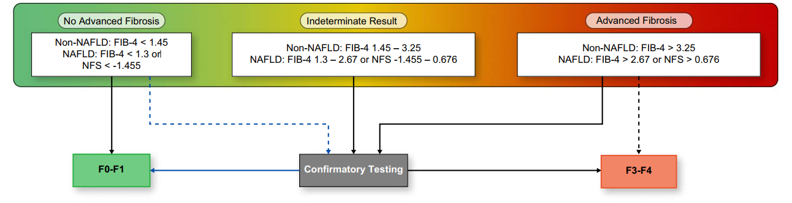

  

    

      
2 triệu

      
Ca tử vong mỗi năm toàn cầu do xơ hóa &amp; bệnh gan mạn tính

    

    

      
FIB-4 &amp; NFS

      
Xét nghiệm đầu tay ưu tiên — Chi phí thấp, độ nhạy cao để loại trừ F3-F4

    

    

      
30% - 40%

      
Bệnh nhân rơi vào vùng xám không xác định — Cần kiểm chứng bằng LSM-TE / MRE

    

    

      
0.2% - 0.01%

      
Tỷ lệ chảy máu &amp; tử vong do sinh thiết gan — Động lực chuyển dịch sang NILDA

    

  

  

    

      
🧪

      

        
Ưu tiên Xét nghiệm Đơn giản

        
Sử dụng FIB-4 cho mọi nguyên nhân và NFS cho MASLD/NAFLD. Hiệu năng tương đương các xét nghiệm độc quyền đắt tiền (ELF, FibroTest) với chi phí thấp và độ sẵn có cao.

      

    

    

      
🔄

      

        
Chiến lược Đánh giá Tuần tự

        
Bắt đầu bằng FIB-4/NFS ở tuyến ban đầu. Nếu rơi vào vùng không xác định (FIB-4 1.3 - 2.67 hoặc NFS -1.455 đến 0.676), tiến hành NILDA hình ảnh (LSM-TE/MRE) để phân tầng.

      

    

    

      
⚠️

      

        
Hiểu rõ Giới hạn &amp; Gây nhiễu

        
Không dùng NILDA máu để theo dõi thoái lui xơ hóa hoặc phân độ mỡ gan. Cẩn trọng trước các yếu tố gây nhiễu: tuổi cao, đợt bùng phát men gan cấp, cắt lách và suy thận.

      

    

  

  

    <a href="#sec-tongquan" class="quickmenu-item active">1. Tổng quan &amp; Rủi ro</a>
    <a href="#sec-phuongphap" class="quickmenu-item">2. PICO &amp; GRADE</a>
    <a href="#sec-chidau-yeutonhieu" class="quickmenu-item">3. Chỉ dấu &amp; Nhiễu</a>
    <a href="#sec-thangdiem-giaiphaubenh" class="quickmenu-item">4. Giải phẫu bệnh &amp; Máu</a>
    <a href="#sec-khuyennghi-lamsang" class="quickmenu-item">5. Khuyến nghị PICO 1-3</a>
    <a href="#sec-thuattoan" class="quickmenu-item">6. Thuật toán Xử trí</a>
    <a href="#sec-donghoc-thoaihoamo" class="quickmenu-item">7. Động học &amp; Mỡ gan</a>
    <a href="#sec-treem-tuonglai" class="quickmenu-item">8. Trẻ em &amp; Tương lai</a>
  

  {/* ==================== SECTION 1 ==================== */}
  

    
🩺 <h2 class="sec-title">1. Giới Thiệu, Mục Tiêu &amp; Rủi Ro Của Sinh Thiết Gan</h2>

    

      

        🌍
        

          <strong>Gánh nặng Y tế Bệnh Gan Mạn Tính (CLD)</strong>
          Bệnh gan mạn tính dẫn đến xơ hóa gan là nguyên nhân gây ra khoảng <strong>2 triệu ca tử vong mỗi năm trên toàn thế giới</strong>. Hầu hết các biến cố lâm sàng nghiêm trọng (mất bù gan, tăng áp lực tĩnh mạch cửa, xuất huyết do vỡ giãn tĩnh mạch thực quản, bệnh não gan, cổ trướng và ung thư biểu mô tế bào gan - HCC) xuất hiện chủ yếu ở giai đoạn <strong>xơ hóa tiến triển (advanced fibrosis, F3-F4)</strong>. Do đó, phát hiện sớm và chính xác tình trạng xơ hóa là chìa khóa then chốt trong quản lý bệnh nhân.
        

      

      

        

          

          

            
🧪

            
Định Nghĩa &amp; Phân Loại NILDA

          

          

            
<strong>NILDA (Noninvasive Liver Disease Assessments)</strong> bao gồm toàn bộ các phương pháp không xâm lấn đánh giá bệnh gan:

            <ul style="margin-left: 1rem; line-height: 1.7;">
              <li><strong>NILDA dựa trên xét nghiệm máu (Blood-based NILDA)</strong>: Trọng tâm chính của hướng dẫn AASLD 2025, gồm các chỉ dấu sinh học gián tiếp và trực tiếp.</li>
              <li><strong>NILDA dựa trên chẩn đoán hình ảnh (Imaging-based NILDA)</strong>: Gồm siêu âm đo độ cứng gan (Transient Elastography - TE/FibroScan, 2D-SWE, pSWE) và cộng hưởng từ đàn hồi (MRE).</li>
            </ul>
          

          
Phạm vi: Toàn diện xét nghiệm máu người lớn &amp; trẻ em

        

        

          

          

            
⚠️

            
Biến Chứng &amp; Rủi Ro Sinh Thiết Gan

          

          

            
Mặc dù sinh thiết gan từng là "tiêu chuẩn vàng", kỹ thuật này chứa đựng nhiều nguy cơ:

            <ul style="margin-left: 1rem; line-height: 1.7;">
              <li><strong>Đau</strong>: Biến chứng phổ biến nhất sau thủ thuật.</li>
              <li><strong>Chảy máu lâm sàng rõ rệt</strong>: Tỷ lệ <strong>1 / 500 ca (0.2%)</strong>.</li>
              <li><strong>Chảy máu nghiêm trọng</strong>: Tỷ lệ <strong>1 / 2.500 đến 1 / 10.000 ca (0.04% - 0.01%)</strong>.</li>
              <li><strong>Tử vong liên quan thủ thuật</strong>: Tỷ lệ <strong>1 / 10.000 đến 1 / 12.000 ca (0.01% - 0.0083%)</strong>.</li>
              <li><strong>Sai số kỹ thuật</strong>: Sai số chọn mẫu (Sampling bias), sai số phân loại và phân bố tổn thương không đồng đều.</li>
            </ul>
          

          
Động lực phát triển &amp; chuẩn hóa NILDA máu

        

      

      

        🔬
        

          <strong>Sự Khác Biệt Về Mô Hình Phân Bố Xơ Hóa Theo Nguyên Nhân</strong>
          <ul style="margin-top: 0.5rem; margin-left: 1.25rem; line-height: 1.6;">
            <li><strong>Bệnh gan thoái hóa mỡ (MASLD/MASH) &amp; Bệnh gan do rượu (ALD)</strong>: Xơ hóa khởi phát tại <strong>Vùng 3 (trung tâm tiểu thùy)</strong> với mô hình quanh xoang gan và quanh tế bào gan (perisinusoidal &amp; pericellular pattern).</li>
            <li><strong>Viêm gan virus (HBV, HCV) &amp; Viêm gan tự miễn (AIH)</strong>: Xơ hóa chủ yếu bắt đầu từ <strong>khoảng cửa (portal-based)</strong> với các dải xơ mở rộng vào nhu mô.</li>
            <li><strong>Bệnh gan ở trẻ em</strong>: Tổn thương xơ hóa thường khởi phát do tắc mật hoặc di truyền. Ở trẻ em bị NASH/MASH, xơ hóa và viêm thường bắt đầu ở <strong>Vùng 1 (quanh khoảng cửa)</strong> khác biệt so với người lớn.</li>
          </ul>
        

      

    

  

  {/* ==================== SECTION 2 ==================== */}
  

    
⚖️ <h2 class="sec-title">2. Phương Pháp Luận PICO, Thang Đo GRADE &amp; Chỉ Số Hiệu Suất</h2>

    

      
AASLD đã thành lập hội đồng chuyên gia độc lập xây dựng 6 câu hỏi lâm sàng theo mô hình PICO, thẩm định bằng chứng qua hệ thống GRADE và phân tích đa chiều các chỉ số hiệu suất chẩn đoán độc lập với tỷ lệ lưu hành bệnh.

      

        <table class="regimen-table">
          <thead>
            <tr>
              <th style="width: 12%;">Mã PICO</th>
              <th style="width: 28%;">Đối Tượng Lâm Sàng (P)</th>
              <th style="width: 30%;">Can Thiệp (I) &amp; So Sánh (C)</th>
              <th style="width: 30%;">Kết Cục Chẩn Đoán &amp; Đối Chiếu (O)</th>
            </tr>
          </thead>
          <tbody>
            <tr>
              <td class="source-cell"><strong>PICO 1</strong></td>
              <td>Người lớn mắc bệnh gan mạn (HCV, HBV, HIV/HCV, HIV/HBV, NAFLD/MASLD, ALD, PBC, PSC)</td>
              <td>Các bộ chỉ dấu sinh học máu (Blood-based NILDA panels) đơn lẻ</td>
              <td>Độ chính xác phân chia giai đoạn xơ hóa (F0-1 vs. F2-4, F0-2 vs. F3-4, F0-3 vs. F4) so với sinh thiết gan.</td>
            </tr>
            <tr>
              <td class="source-cell"><strong>PICO 2</strong></td>
              <td>Người lớn mắc bệnh gan mạn tính</td>
              <td>So sánh đối đầu giữa các bộ chỉ dấu máu với nhau (FIB-4 vs. APRI vs. ELF vs. FibroTest...)</td>
              <td>Xác định bộ chỉ dấu máu ưu việt hơn trong phân độ xơ hóa gan so với sinh thiết.</td>
            </tr>
            <tr>
              <td class="source-cell"><strong>PICO 3</strong></td>
              <td>Người lớn mắc bệnh gan mạn tính</td>
              <td>Sự kết hợp 2 bộ chỉ dấu máu (sử dụng đồng thời hoặc tuần tự)</td>
              <td>Xác định sự kết hợp có ưu việt hơn 1 bộ chỉ dấu đơn độc trong phân độ xơ hóa gan.</td>
            </tr>
            <tr>
              <td class="source-cell"><strong>PICO 4</strong></td>
              <td>Người lớn mắc bệnh gan mạn tính</td>
              <td>Đo lường nối tiếp theo thời gian (serial measurements) các chỉ dấu máu</td>
              <td>Độ chính xác dự báo tiến triển (progression) hoặc thoái lui (regression) xơ hóa so với sinh thiết cặp.</td>
            </tr>
            <tr>
              <td class="source-cell"><strong>PICO 5</strong></td>
              <td>Bệnh nhân mắc NAFLD / MASLD</td>
              <td>Các bộ chỉ dấu sinh học máu chuyên biệt cho thoái hóa mỡ (Steatosis-targeted panels)</td>
              <td>Độ chính xác phân độ mỡ gan (S0 vs. S1-3, S0-1 vs. S2-3, S0-2 vs. S3) so với sinh thiết, MRS hoặc MRI-PDFF.</td>
            </tr>
            <tr>
              <td class="source-cell"><strong>PICO 6</strong></td>
              <td>Bệnh nhi (&lt;18 tuổi) mắc bệnh gan mạn (HCV, HBV, Teo đường mật - BA, Xơ nang - CFLD, NAFLD)</td>
              <td>Các bộ chỉ dấu sinh học máu</td>
              <td>Độ chính xác trong phân chia giai đoạn xơ hóa gan so với sinh thiết gan ở trẻ em.</td>
            </tr>
          </tbody>
        </table>
      

      

        

          

          

            
📊

            
Hệ Thống Phân Loại Bằng Chứng GRADE

          

          

            
<strong>Xếp hạng ban đầu</strong>: RCT bắt đầu ở mức <em>Cao (High)</em>; Nghiên cứu quan sát bắt đầu ở mức <em>Thấp (Low)</em>.

            <ul style="margin-left: 1rem; line-height: 1.6;">
              <li><strong>5 Yếu tố giảm cấp (Rate down)</strong>: Nguy cơ sai lệch (Risk of bias), Tính không nhất quán (Inconsistency), Bằng chứng gián tiếp (Indirectness), Thiếu chính xác (Imprecision), Sai lệch công bố (Publication bias).</li>
              <li><strong>4 Yếu tố tăng cấp (Rate up)</strong>: Cỡ tác động lớn (RR = 0.5) hoặc rất lớn (RR = 0.2), Khuynh hướng đáp ứng - liều lượng (Dose-response), Kiểm soát triệt để yếu tố gây nhiễu (Confounding).</li>
              <li><strong>Mức độ khuyến nghị</strong>: <em>Khuyến nghị Mạnh (Strong)</em> (hầu hết bệnh nhân nên áp dụng) và <em>Khuyến nghị Có điều kiện (Conditional)</em> (cần cá thể hóa và chia sẻ quyết định).</li>
            </ul>
          

          
Quy trình đạt đồng thuận: Bỏ phiếu &ge; 75% chuyên gia

        

        

          

          

            
📐

            
Chỉ Số Hiệu Suất Chẩn Đoán Cốt Lõi

          

          

            <ul style="margin-left: 1rem; line-height: 1.6;">
              <li><strong>Độ nhạy &amp; Độ đặc hiệu</strong>: Độc lập với tỷ lệ lưu hành bệnh. Độ nhạy cao tối ưu cho <em>loại trừ (rule-out)</em>; độ đặc hiệu cao tối ưu cho <em>khẳng định (rule-in)</em>.</li>
              <li><strong>PPV &amp; NPV</strong>: Phụ thuộc chặt chẽ vào tỷ lệ lưu hành. Ở tuyến ban đầu (prevalence thấp), NPV của FIB-4 rất cao giúp loại trừ F3-F4 an toàn, nhưng PPV thấp.</li>
              <li><strong>Tỷ số khả dĩ (Likelihood Ratio)</strong>: <strong>LR+ &gt; 10</strong> khẳng định chẩn đoán mạnh mẽ; <strong>LR- &lt; 0.1</strong> loại trừ bệnh dứt khoát.</li>
              <li><strong>Tỷ số chênh chẩn đoán (DOR)</strong>: DOR = LR+ / LR-, chỉ số tổng hợp tin cậy không phụ thuộc tỷ lệ bệnh.</li>
              <li><strong>AUROC</strong>: 0.7 - 0.8 (Chấp nhận được), 0.8 - 0.9 (Xuất sắc), &gt; 0.9 (Vượt trội).</li>
            </ul>
          

          
Trọng tâm: Đánh giá độc lập với tỷ lệ lưu hành

        

      

    

  

  {/* ==================== SECTION 3 ==================== */}
  

    
🧪 <h2 class="sec-title">3. Phân Loại Chỉ Dấu Sinh Học Máu &amp; Yếu Tố Lâm Sàng Gây Nhiễu</h2>

    

      
Các xét nghiệm máu không xâm lấn phản ánh động học phức tạp giữa phản ứng viêm hoại tử và quá trình tổng hợp / thoái biến chất nền ngoại bào (ECM). NILDA máu được chia thành 2 nhóm bản chất:

      

        

          

          

            
📉

            
Chỉ Dấu Gián Tiếp (Indirect Markers)

          

          

            
Phản ánh tình trạng viêm gan, tổn thương hủy hoại tế bào gan hoặc hệ quả của tăng áp lực tĩnh mạch cửa (giảm tiểu cầu do cường lách):

            <ul style="margin-left: 1rem; line-height: 1.7;">
              <li><strong>Enzyme men gan</strong>: AST, ALT, GGT.</li>
              <li><strong>Chỉ số tế bào &amp; tổng hợp</strong>: Số lượng tiểu cầu, Albumin, Bilirubin toàn phần, INR, Prothrombin Index.</li>
              <li><strong>Chất phản ứng &amp; chuyển hóa</strong>: Haptoglobin, Apolipoprotein A1, Cholesterol toàn phần, Urea, Glucose huyết tương.</li>
            </ul>
          

          
Thường quy, sẵn có, chi phí cực thấp

        

        

          

          

            
🔬

            
Chỉ Dấu Trực Tiếp (Direct Markers)

          

          

            
Là các đại phân tử được giải phóng trực tiếp từ các nguyên bào sợi cơ (myofibroblasts) hoạt hóa và sự tái cấu trúc sợi collagen:

            <ul style="margin-left: 1rem; line-height: 1.7;">
              <li><strong>Axit Hyaluronic (HA)</strong>: Phản ánh sự thanh thải của tế bào nội mô xoang gan.</li>
              <li><strong>Phân đoạn Procollagen</strong>: PIIINP, PRO-C3 (đầu tận N-terminal propeptide của collagen type III).</li>
              <li><strong>Điều hòa thoái biến ECM</strong>: TIMP-1, MMP-1, MMP-2, YKL-40, TGF-β₁.</li>
              <li><strong>Protein trọng lượng lớn</strong>: α₂-Macroglobulin (ức chế protease mô).</li>
            </ul>
          

          
Đặc hiệu tái cấu trúc ECM, chi phí cao / độc quyền

        

      

      <h3 style="margin-top: 1.75rem; margin-bottom: 0.75rem; color: var(--color-primary);"><i class="fa-solid fa-triangle-exclamation"></i> Các Yếu Tố Lâm Sàng Gây Nhiễu Kết Quả Xét Nghiệm Máu (Table 6)</h3>
      
Các chỉ dấu máu không đặc hiệu tuyệt đối cho gan. Bác sĩ lâm sàng bắt buộc phải nhận diện các tình trạng bệnh lý hệ thống làm sai lệch kết quả:

      

        <table class="regimen-table">
          <thead>
            <tr>
              <th style="width: 25%;">Yếu Tố / Tình Trạng Lâm Sàng</th>
              <th style="width: 25%;">Thang Điểm Bị Ảnh Hưởng</th>
              <th style="width: 25%;">Chiều Hướng Biến Thiên</th>
              <th style="width: 25%;">Cơ Chế Gây Nhiễu &amp; Xử Trí</th>
            </tr>
          </thead>
          <tbody>
            <tr>
              <td class="source-cell"><strong>Tuổi tác cực đoan</strong> (&lt;35 hoặc &ge;65 tuổi)</td>
              <td>FIB-4, NFS, ELF</td>
              <td>Dương tính giả ở người già Âm tính giả ở người trẻ</td>
              <td>Tuổi là biến số nhân trong công thức. Ở người &ge;65 tuổi, độ đặc hiệu của điểm cắt thấp sụt giảm nghiêm trọng (chỉ còn ~20%), cần điều chỉnh ngưỡng cắt.</td>
            </tr>
            <tr>
              <td class="source-cell"><strong>Cắt lách (Splenectomy)</strong></td>
              <td>APRI, FIB-4, NFS, FibroMeter</td>
              <td>Đánh giá thấp giả tạo</td>
              <td>Số lượng tiểu cầu tăng vọt sau cắt lách làm giảm giả tạo các chỉ số tính bằng mẫu số tiểu cầu.</td>
            </tr>
            <tr>
              <td class="source-cell"><strong>Giảm tiểu cầu ngoài gan</strong> (ITP, hóa trị, thuốc kháng virus HIV)</td>
              <td>APRI, FIB-4, NFS</td>
              <td>Tăng giả tạo mức xơ hóa</td>
              <td>Tiểu cầu giảm không do cường lách/tăng áp cửa đẩy điểm số lên nhóm nguy cơ cao giả tạo.</td>
            </tr>
            <tr>
              <td class="source-cell"><strong>Sử dụng rượu cấp / mạn</strong></td>
              <td>FibroTest, Hepascore</td>
              <td>Tăng giả tạo điểm số</td>
              <td>Rượu kích hoạt cảm ứng enzyme GGT huyết thanh tăng vọt.</td>
            </tr>
            <tr>
              <td class="source-cell"><strong>Viêm gan bùng phát cấp</strong> (Đợt cấp AIH, DILI, HBV cấp)</td>
              <td>APRI, FIB-4, NFS</td>
              <td>Tăng vọt giả tạo cực lớn</td>
              <td>AST, ALT tăng gấp hàng chục lần do hoại tử tế bào gan cấp tính, không phản ánh lượng sợi xơ mạn tính. Hoãn làm xét nghiệm cho đến khi men gan ổn định.</td>
            </tr>
            <tr>
              <td class="source-cell"><strong>Bệnh thận mạn (CKD) &amp; Lọc máu</strong></td>
              <td>APRI, FIB-4, FibroMeter</td>
              <td>Đánh giá thấp giả tạo</td>
              <td>Urea máu cao làm giảm điểm FibroMeter. Bệnh nhân lọc máu có mức transaminase nền rất thấp khiến FIB-4 và APRI bị hạ thấp giả tạo.</td>
            </tr>
            <tr>
              <td class="source-cell"><strong>Suy dinh dưỡng / Viêm hệ thống</strong></td>
              <td>NFS, FibroTest</td>
              <td>Tăng giả tạo NFS / FibroTest</td>
              <td>Albumin giảm do dinh dưỡng kém làm tăng điểm NFS; viêm hệ thống làm tăng α₂-macroglobulin làm tăng điểm FibroTest.</td>
            </tr>
            <tr>
              <td class="source-cell"><strong>Tán huyết, Hội chứng Gilbert, Tắc mật</strong></td>
              <td>FibroTest, Hepascore</td>
              <td>Tăng giả tạo điểm số</td>
              <td>Bilirubin tăng và Haptoglobin giảm (do tán huyết) làm sai lệch thuật toán sinh hóa.</td>
            </tr>
            <tr>
              <td class="source-cell"><strong>Trạng thái sau ăn (Postprandial)</strong></td>
              <td>NFS, Axit Hyaluronic (HA), LSM-TE</td>
              <td>Tăng giả tạo kết quả</td>
              <td>Glucose máu sau ăn &gt; 110 mg/dL làm tăng NFS. Đo LSM-TE sau ăn có thể tăng độ cứng gan lên tới 26%. Yêu cầu nhịn ăn &ge; 4-6 giờ.</td>
            </tr>
            <tr>
              <td class="source-cell"><strong>Bệnh lý xơ hóa ngoài gan</strong> (Xơ phổi kẽ, xơ cứng bì)</td>
              <td>ELF, Fibrospect</td>
              <td>Tăng giả tạo điểm số</td>
              <td>Tăng các chỉ dấu chu chuyển collagen tuần hoàn toàn thân (HA, PIIINP, TIMP-1).</td>
            </tr>
          </tbody>
        </table>
      

    

  

  {/* ==================== SECTION 4 ==================== */}
  

    
🔬 <h2 class="sec-title">4. Đối Chiếu Giải Phẫu Bệnh &amp; Các Thang Điểm Xơ Hóa Máu</h2>

    

      
Để chuẩn hóa việc đánh giá hiệu năng chẩn đoán của NILDA, AASLD đã quy đổi các hệ thống phân độ mô bệnh học khác nhau về 3 ngưỡng cắt lâm sàng thống nhất:

      

        Xơ hóa đáng kể (Significant fibrosis): &ge; F2
        Xơ hóa tiến triển (Advanced fibrosis): F3 - F4
        Xơ gan (Cirrhosis): F4
      

      

        <table class="regimen-table">
          <thead>
            <tr>
              <th style="width: 20%;">Hệ thống điểm Giải phẫu bệnh</th>
              <th style="width: 15%;">F0 (Không xơ hóa)</th>
              <th style="width: 15%;">F1 (Xơ hóa nhẹ)</th>
              <th style="width: 18%;">F2 (Xơ hóa đáng kể)</th>
              <th style="width: 18%;">F3 (Xơ hóa tiến triển)</th>
              <th style="width: 14%;">F4 (Xơ gan)</th>
            </tr>
          </thead>
          <tbody>
            <tr>
              <td class="source-cell"><strong>METAVIR</strong> <em>(Nhiều nguyên nhân)</em></td>
              <td>Không xơ hóa</td>
              <td>Xơ hóa khoảng cửa chưa có vách xơ</td>
              <td>Xơ hóa khoảng cửa kèm theo một vài vách xơ</td>
              <td>Nhiều vách xơ (xơ hóa cầu nối) nhưng chưa xơ gan</td>
              <td>Xơ gan hoàn toàn</td>
            </tr>
            <tr>
              <td class="source-cell"><strong>Ishak</strong> <em>(Thang 0-6 điểm)</em></td>
              <td><strong>0</strong>: Không xơ hóa</td>
              <td><strong>1-2</strong>: Xơ hóa một vài hoặc hầu hết khoảng cửa, có/không vách xơ ngắn</td>
              <td><strong>3</strong>: Xơ hóa hầu hết khoảng cửa kèm cầu nối P-P thỉnh thoảng</td>
              <td><strong>4</strong>: Cầu nối lan tỏa (P-P); <strong>5</strong>: Cầu nối kèm nốt tái tạo thỉnh thoảng</td>
              <td><strong>6</strong>: Xơ gan nghĩ nhiều hoặc chắc chắn</td>
            </tr>
            <tr>
              <td class="source-cell"><strong>Brunt-Kleiner</strong> <em>(NAFLD / MASLD)</em></td>
              <td>Không xơ hóa</td>
              <td><strong>1A</strong>: Quanh xoang mảnh V3; <strong>1B</strong>: Quanh xoang dày V3; <strong>1C</strong>: Chỉ khoảng cửa</td>
              <td>Quanh xoang gan Vùng 3 kèm xơ hóa quanh khoảng cửa</td>
              <td>Xơ hóa cầu nối (Bridging fibrosis)</td>
              <td>Xơ gan</td>
            </tr>
            <tr>
              <td class="source-cell"><strong>Scheuer / Batts-Ludwig</strong> <em>(Viêm gan virus &amp; tự miễn)</em></td>
              <td>Không xơ hóa</td>
              <td>Giãn rộng khoảng cửa, có dải xơ</td>
              <td>Vách xơ quanh khoảng cửa hoặc P-P, cấu trúc tiểu thùy còn nguyên</td>
              <td>Xơ hóa kèm biến đổi cấu trúc tiểu thùy</td>
              <td>Xơ gan rõ</td>
            </tr>
            <tr>
              <td class="source-cell"><strong>Knodell</strong> <em>(Viêm gan virus)</em></td>
              <td>Không xơ hóa</td>
              <td>Giãn rộng xơ hóa khoảng cửa</td>
              <td>N/A</td>
              <td>Xơ hóa cầu nối (Bridging)</td>
              <td>Xơ gan</td>
            </tr>
            <tr>
              <td class="source-cell"><strong>ALD Score</strong> <em>(Gan do rượu)</em></td>
              <td>Không xơ hóa hoặc chỉ khoảng cửa</td>
              <td>Quanh khoảng cửa lan rộng</td>
              <td>Xơ hóa cầu nối (Bridging)</td>
              <td>Xơ gan</td>
              <td>N/A</td>
            </tr>
          </tbody>
        </table>
      

      <h3 style="margin-top: 1.75rem; margin-bottom: 0.75rem; color: var(--color-primary);"><i class="fa-solid fa-calculator"></i> Các Thuật Toán Đánh Giá Xơ Hóa Bằng Chỉ Dấu Máu Được Chọn (Table 5)</h3>

      

        <table class="regimen-table">
          <thead>
            <tr>
              <th style="width: 15%;">Tên Thuật Toán</th>
              <th style="width: 10%;">Phân Loại</th>
              <th style="width: 15%;">Biến Lâm Sàng</th>
              <th style="width: 25%;">Chỉ Dấu Gián Tiếp &amp; Trực Tiếp</th>
              <th style="width: 35%;">Công Thức &amp; Cơ Chế Tính Điểm</th>
            </tr>
          </thead>
          <tbody>
            <tr>
              <td class="source-cell"><strong>APRI</strong> (2003)</td>
              <td>Đơn giản</td>
              <td>Không</td>
              <td>AST, Tiểu cầu</td>
              <td><code>[(AST / ULN) / Số lượng tiểu cầu (10⁹/L)] × 100</code></td>
            </tr>
            <tr>
              <td class="source-cell"><strong>FIB-4</strong> (2006)</td>
              <td>Đơn giản</td>
              <td>Tuổi (năm)</td>
              <td>AST, ALT, Tiểu cầu</td>
              <td><code>[Tuổi × AST (U/L)] / [Tiểu cầu (10⁹/L) × √ALT (U/L)]</code></td>
            </tr>
            <tr>
              <td class="source-cell"><strong>NFS</strong> (2007)</td>
              <td>Đơn giản</td>
              <td>Tuổi, BMI, Đái tháo đường / IFG</td>
              <td>AST, ALT, Tiểu cầu, Albumin</td>
              <td><code>-1.675 + 0.037×Tuổi + 0.094×BMI + 1.13×(ĐTĐ: Có=1/Không=0) + 0.99×(AST/ALT) - 0.013×Tiểu cầu - 0.66×Albumin</code></td>
            </tr>
            <tr>
              <td class="source-cell"><strong>FibroTest® / FibroSure®</strong></td>
              <td>Độc quyền</td>
              <td>Tuổi, Giới</td>
              <td>Bilirubin toàn phần, GGT, Haptoglobin, ApoA1, α₂-Macroglobulin</td>
              <td>Thuật toán bản quyền phức tạp tích hợp 5 chỉ dấu sinh hóa.</td>
            </tr>
            <tr>
              <td class="source-cell"><strong>ELF™ Test</strong> (2004)</td>
              <td>Độc quyền</td>
              <td>Không</td>
              <td>Chỉ dấu trực tiếp: Axit Hyaluronic (HA), PIIINP, TIMP-1</td>
              <td><code>2.494 + 0.846×ln(HA) + 0.735×ln(PIIINP) + 0.391×ln(TIMP-1)</code></td>
            </tr>
            <tr>
              <td class="source-cell"><strong>HepaScore</strong> (2005)</td>
              <td>Độc quyền</td>
              <td>Tuổi, Giới</td>
              <td>Bilirubin toàn phần, GGT, HA, α₂-Macroglobulin</td>
              <td>Thuật toán độc quyền tích hợp chỉ dấu gián tiếp và trực tiếp.</td>
            </tr>
            <tr>
              <td class="source-cell"><strong>FibroMeter™</strong> (2005)</td>
              <td>Độc quyền</td>
              <td>Tuổi</td>
              <td>Tiểu cầu, Chỉ số Prothrombin, Urea, AST, HA, α₂-Macroglobulin</td>
              <td>Thuật toán độc quyền kết hợp chỉ số chức năng thận và gan.</td>
            </tr>
          </tbody>
        </table>
      

      <h3 style="margin-top: 1.75rem; margin-bottom: 0.75rem; color: var(--color-primary);"><i class="fa-solid fa-magnifying-glass-chart"></i> Dữ Liệu Hiệu Suất Của Điểm Số NFS Qua Các Nghiên Cứu Lớn (Table 7)</h3>
      
Tổng hợp dữ liệu phân tích gộp (Meta-analysis) từ <strong>11.372 bệnh nhân NAFLD</strong>: tại điểm cắt thấp &le; -1.455, trung vị độ nhạy loại trừ F3-F4 là <strong>75% (95% CI: 61% - 81%)</strong>; tại điểm cắt cao &gt; 0.676, trung vị độ đặc hiệu khẳng định F3-F4 là <strong>96% (95% CI: 93% - 98%)</strong>; tỷ lệ rơi vào vùng không xác định trung bình là <strong>33.5%</strong>.

      

        <table class="regimen-table">
          <thead>
            <tr>
              <th style="width: 18%;">Tác Giả &amp; Năm</th>
              <th style="width: 12%;">Cỡ Mẫu (n)</th>
              <th style="width: 10%;">Tỷ Lệ F3-4</th>
              <th style="width: 12%;">AUROC</th>
              <th style="width: 16%;">Điểm Cắt Thấp (&le; -1.455) Độ nhạy / Đặc hiệu</th>
              <th style="width: 16%;">Điểm Cắt Cao (&gt; 0.676) Độ nhạy / Đặc hiệu</th>
              <th style="width: 16%;">Nhận Xét &amp; Đặc Điểm Dân Số</th>
            </tr>
          </thead>
          <tbody>
            <tr>
              <td class="source-cell"><strong>Angulo, 2007</strong> (Gốc)</td>
              <td>480</td>
              <td>26%</td>
              <td><strong>0.88</strong></td>
              <td>0.82 / 0.77</td>
              <td>0.51 / 0.98</td>
              <td>LR+ từ 11 - 26 ở điểm cắt cao; Vùng xám 24%.</td>
            </tr>
            <tr>
              <td class="source-cell"><strong>Wong, 2008</strong></td>
              <td>162</td>
              <td>11%</td>
              <td><strong>0.64</strong></td>
              <td>0.39 / 0.81</td>
              <td>0.00 / 0.99</td>
              <td>Dân số Châu Á (Trung Quốc) lưu hành F3-4 thấp trong cộng đồng, hiệu suất giảm.</td>
            </tr>
            <tr>
              <td class="source-cell"><strong>Sumida, 2012</strong></td>
              <td>576</td>
              <td>11%</td>
              <td><strong>0.86</strong></td>
              <td>0.92 / 0.63</td>
              <td>0.33 / 0.96</td>
              <td>Dân số Nhật Bản, độ nhạy loại trừ ở điểm cắt thấp rất cao (92%).</td>
            </tr>
            <tr>
              <td class="source-cell"><strong>Yoneda, 2013</strong></td>
              <td>235</td>
              <td>16%</td>
              <td><strong>0.84</strong></td>
              <td>N/A</td>
              <td>0.68 / 0.88</td>
              <td>Thẩm định riêng trên bệnh nhân NAFLD có <strong>ALT bình thường</strong>.</td>
            </tr>
            <tr>
              <td class="source-cell"><strong>McPherson, 2017</strong> <em>(Nhiễu do tuổi)</em></td>
              <td><strong>654</strong> &bull; &le;35 tuổi (74) &bull; 36-45 tuổi (96) &bull; 46-55 tuổi (197) &bull; 56-64 tuổi (191) &bull; &ge;65 tuổi (76)</td>
              <td>11% 19% 22% 34% 40%</td>
              <td> <strong>0.52</strong> <strong>0.86</strong> <strong>0.81</strong> <strong>0.83</strong> <strong>0.81</strong></td>
              <td> 0.00 / 0.91 0.78 / 0.80 0.81 / 0.65 0.95 / 0.44 <strong>0.93 / 0.20</strong></td>
              <td> 0.00 / 1.00 0.22 / 1.00 0.22 / 0.97 0.31 / 1.00 0.57 / 0.85</td>
              <td><strong>Bằng chứng then chốt về nhiễu tuổi tác</strong>: - &le;35 tuổi: Mất giá trị chẩn đoán (AUROC 0.52). - &ge;65 tuổi: Độ đặc hiệu điểm cắt thấp tụt xuống <strong>20%</strong> gây dương tính giả hàng loạt.</td>
            </tr>
            <tr>
              <td class="source-cell"><strong>Anstee, 2019</strong> (STELLAR)</td>
              <td>2.417</td>
              <td><strong>80%</strong></td>
              <td><strong>0.74</strong></td>
              <td>0.89 / 0.37</td>
              <td>0.38 / 0.89</td>
              <td>Đoàn hệ thử nghiệm lâm sàng, tỷ lệ rơi vào vùng không xác định lên tới <strong>51%</strong>.</td>
            </tr>
            <tr>
              <td class="source-cell"><strong>Alkayyali, 2020</strong></td>
              <td>ĐTĐ (166) Ko ĐTĐ (183)</td>
              <td>29% 10%</td>
              <td><strong>0.73</strong> <strong>0.72</strong></td>
              <td>0.75 / 0.47 0.85 / 0.60</td>
              <td>0.25 / 0.93 0.00 / 0.97</td>
              <td>Đái tháo đường type 2 làm thay đổi phân tầng xơ hóa trên lâm sàng.</td>
            </tr>
          </tbody>
        </table>
      

    

  

  {/* ==================== SECTION 5 ==================== */}
  

    
📋 <h2 class="sec-title">5. Toàn Văn Khuyến Nghị Thực Hành Lâm Sàng AASLD 2025 (PICO 1, 2, 3)</h2>

    

      

        {/* PICO 1 */}
        

          

          

            
1️⃣

            
PICO 1: Hiệu Năng Đơn Lẻ Trong CLD

          

          

            <ul style="margin-left: 1rem; line-height: 1.7;">
              <li><strong>Viêm gan B &amp; C mạn tính (HBV/HCV)</strong>: Khuyến nghị sử dụng các xét nghiệm máu đơn giản như <strong>APRI hoặc FIB-4</strong> làm xét nghiệm ban đầu để phát hiện xơ hóa đáng kể (&ge;F2), tiến triển (F3-4) hoặc xơ gan (F4) trước khi điều trị kháng virus, thay vì không làm xét nghiệm nào. Khuyến nghị Mạnh | Bằng chứng Trung bình</li>
              <li><strong>NAFLD / MASLD</strong>: Khuyến nghị sử dụng các xét nghiệm máu đơn giản như <strong>FIB-4 hoặc NFS</strong> để phát hiện xơ hóa tiến triển (F3-F4) thay vì không làm xét nghiệm nào. Khuyến nghị Mạnh | Bằng chứng Trung bình</li>
              <li><strong>Bệnh gan do rượu (ALD) &amp; Bệnh gan ứ mật (PBC, PSC)</strong>: Chưa có đủ bằng chứng để khuyến nghị sử dụng NILDA máu để phân độ xơ hóa. Không phân hạng (Ungraded)</li>
            </ul>
          

          
Ưu tiên FIB-4 &amp; APRI / NFS làm xét nghiệm ban đầu

        

        {/* PICO 2 */}
        

          

          

            
2️⃣

            
PICO 2: So Sánh Đối Đầu Giữa Các Test Máu

          

          

            <ul style="margin-left: 1rem; line-height: 1.7;">
              <li><strong>HCV mạn tính</strong>: Khuyến nghị sử dụng các xét nghiệm máu đơn giản, ít tốn kém và sẵn có như <strong>FIB-4</strong> hơn là các xét nghiệm độc quyền, phức tạp và đắt tiền (FibroTest, ELF) để đánh giá xơ hóa. Khuyến nghị Mạnh | Bằng chứng Trung bình</li>
              <li><strong>NAFLD / MASLD</strong>: Khuyến nghị sử dụng <strong>FIB-4 hoặc NFS</strong> hơn là các xét nghiệm độc quyền đắt tiền để phát hiện xơ hóa tiến triển (F3-F4). Khuyến nghị Mạnh | Bằng chứng Trung bình</li>
              <li><strong>Cơ sở bằng chứng</strong>: Diện tích dưới đường cong ROC (AUROC) và tỷ số chênh chẩn đoán (DOR) giữa test đơn giản và test độc quyền không có sự khác biệt có ý nghĩa lâm sàng thực tế, trong khi test đơn giản tiết kiệm chi phí và triển khai rộng rãi ở tuyến ban đầu.</li>
            </ul>
          

          
FIB-4 / NFS vượt trội về hiệu quả chi phí &amp; tính khả thi

        

        {/* PICO 3 */}
        

          

          

            
3️⃣

            
PICO 3: Kết Hợp Hai Xét Nghiệm Máu

          

          

            <ul style="margin-left: 1rem; line-height: 1.7;">
              <li><strong>HCV mạn tính chưa điều trị</strong>: Gợi ý việc sử dụng <strong>kết hợp tuần tự (sequential combination)</strong> các chỉ dấu máu mang lại hiệu năng tốt hơn xét nghiệm đơn lẻ trong việc phát hiện &ge;F2 hoặc F4. Không phân hạng (Ungraded)</li>
              <li><strong>NAFLD / MASLD</strong>: Cân nhắc áp dụng <strong>thuật toán kết hợp tuần tự</strong> các NILDA máu để phân tầng xơ hóa tiến triển (F3-F4). Không phân hạng (Ungraded)</li>
              <li><strong>Ý nghĩa vùng xám</strong>: Test đơn lẻ để lại <strong>30% - 40% bệnh nhân</strong> ở vùng không xác định. Chiến lược tuần tự (FIB-4 trước, nếu trung gian làm tiếp ELF hoặc NILDA hình ảnh) giúp giải quyết triệt để vùng xám và giảm chuyển tuyến không cần thiết.</li>
            </ul>
          

          
Chiến lược tuần tự tối ưu hóa phân loại vùng xám

        

      

      

        ⚠️
        

          <strong>Lưu Ý Sống Còn Về Đánh Giá Xơ Hóa Sau Điều Trị DAA Đạt SVR Ở Bệnh Nhân HCV</strong>
          Không có ngưỡng cắt chỉ dấu máu nào được chứng minh tương quan chính xác với mức độ xơ hóa sau khi đạt đáp ứng vi sinh bền vững (SVR). Do men gan sụt giảm tức thì sau sạch virus, các điểm số NILDA máu giảm mạnh gây ra <strong>tỷ lệ âm tính giả rất cao</strong>. Bệnh nhân đã có xơ hóa tiến triển hoặc xơ gan trước điều trị <strong>bắt buộc phải duy trì tầm soát HCC mỗi 6 tháng suốt đời</strong>, tuyệt đối không được dựa vào sự bình thường hóa của FIB-4 sau SVR để ngừng tầm soát.
        

      

    

  

  {/* ==================== SECTION 6 ==================== */}
  

    
🗺️ <h2 class="sec-title">6. Thuật Toán Xử Trí Lâm Sàng Đơn Giản Hóa (Figure 1 &amp; CDSS)</h2>

    

      
Sơ đồ thuật toán chuẩn của AASLD 2025 hướng dẫn nhà lâm sàng tiếp cận bệnh nhân nghi ngờ hoặc có nguy cơ bệnh gan mạn tính (CLD) theo 3 bước tuần tự:

      

        
        

          
Figure 1. Simplified Blood-based NILDA Algorithm for the Clinician

          Sơ đồ thuật toán xử trí lâm sàng dựa trên xét nghiệm máu không xâm lấn (NILDA) đơn giản hóa của AASLD 2025. Phân tầng bệnh nhân thành 3 nhánh: Nguy cơ thấp (F0-F1), Vùng không xác định (cần kiểm chứng bằng LSM-TE/MRE) và Nguy cơ cao (F3-F4, bắt buộc tầm soát HCC định kỳ mỗi 6 tháng).
        

      

      

        

          

          

            
🟢

            
Nhánh 1: Nguy Cơ Thấp (F0 - F1)

          

          

            <ul style="margin-left: 1rem; line-height: 1.7;">
              <li><strong>Nguyên nhân ngoài NAFLD</strong>: FIB-4 &lt; 1.45</li>
              <li><strong>NAFLD / MASLD</strong>: FIB-4 &lt; 1.30 hoặc NFS &lt; -1.455</li>
              <li><strong>Ý nghĩa lâm sàng</strong>: Giá trị dự báo âm tính (NPV) &gt; 90-95%, loại trừ an toàn xơ hóa tiến triển (F3-F4).</li>
              <li><strong>Xử trí</strong>: Theo dõi định kỳ tại y tế cơ sở / chăm sóc ban đầu, tư vấn lối sống, chưa cần can thiệp chuyên khoa hoặc chuyển tuyến.</li>
            </ul>
          

          
Loại trừ F3-F4 — Quản lý tại tuyến cơ sở

        

        

          

          

            
🟡

            
Nhánh 2: Vùng Không Xác Định (Indeterminate)

          

          

            <ul style="margin-left: 1rem; line-height: 1.7;">
              <li><strong>Nguyên nhân ngoài NAFLD</strong>: FIB-4 từ 1.45 đến 3.25</li>
              <li><strong>NAFLD / MASLD</strong>: FIB-4 từ 1.30 đến 2.67 hoặc NFS từ -1.455 đến 0.676</li>
              <li><strong>Tỷ lệ gặp</strong>: Chiếm khoảng 30% - 40% bệnh nhân trong thực tế lâm sàng.</li>
              <li><strong>Xử trí</strong>: <strong>Bắt buộc làm xét nghiệm kiểm chứng mức độ hai</strong>:
                <ul>
                  <li>Đo độ cứng gan bằng siêu âm đàn hồi (LSM-TE / FibroScan, 2D-SWE) hoặc MRE.</li>
                  <li>Hoặc xét nghiệm chỉ dấu trực tiếp (ELF™ Test).</li>
                </ul>
              </li>
            </ul>
          

          
Cần kiểm chứng bằng NILDA hình ảnh (LSM-TE / MRE)

        

        

          

          

            
🔴

            
Nhánh 3: Nguy Cơ Cao (F3 - F4)

          

          

            <ul style="margin-left: 1rem; line-height: 1.7;">
              <li><strong>Nguyên nhân ngoài NAFLD</strong>: FIB-4 &gt; 3.25</li>
              <li><strong>NAFLD / MASLD</strong>: FIB-4 &gt; 2.67 hoặc NFS &gt; 0.676</li>
              <li><strong>Ý nghĩa lâm sàng</strong>: Độ đặc hiệu &gt; 95%, xác nhận có xơ hóa tiến triển hoặc xơ gan.</li>
              <li><strong>Xử trí</strong>:
                <ul>
                  <li>Chuyển khám chuyên khoa Tiêu hóa - Gan mật.</li>
                  <li><strong>Bắt buộc đưa vào chương trình tầm soát Ung thư tế bào gan (HCC) mỗi 6 tháng</strong> (Siêu âm gan &plusmn; AFP).</li>
                  <li>Đánh giá tăng áp lực tĩnh mạch cửa &amp; quản lý nguy cơ giãn tĩnh mạch thực quản.</li>
                </ul>
              </li>
            </ul>
          

          
Chuyển chuyên khoa &amp; Tầm soát HCC mỗi 6 tháng

        

      

    

  

  {/* ==================== SECTION 7 ==================== */}
  

    
📈 <h2 class="sec-title">7. Động Học Xơ Hóa Dọc &amp; Đánh Giá Thoái Hóa Mỡ Gan (PICO 4 &amp; 5)</h2>

    

      <h3 style="color: var(--color-primary); margin-bottom: 0.75rem;"><i class="fa-solid fa-arrows-spin"></i> PICO 4: Đánh Giá Động Học Xơ Hóa Dọc Theo Thời Gian (Longitudinal Monitoring)</h3>
      

        🚫
        

          <strong>Khuyến Nghị Cốt Lõi PICO 4</strong>
          AASLD <strong>khuyến nghị không sử dụng</strong> các xét nghiệm máu NILDA để theo dõi sự tiến triển (progression), trạng thái ổn định (stability) hoặc sự thoái lui (regression) của giai đoạn xơ hóa trên mô bệnh học ở bệnh nhân mắc bệnh gan mạn tính. <em>(Khuyến nghị không phân cấp - Ungraded statement)</em>.
            
          <strong>Lý do</strong>: Lắng đọng và tiêu biến collagen trong gan là quá trình phi tuyến tính. Sự thay đổi của các chỉ số máu gián tiếp phản ánh sự biến thiên của phản ứng viêm hoại tử hơn là sự tái cấu trúc thực sự của khối sợi xơ.
        

      

      

        <table class="regimen-table">
          <thead>
            <tr>
              <th style="width: 25%;">Nghiên Cứu &amp; Nguyên Nhân</th>
              <th style="width: 15%;">Số BN Sinh Thiết Cặp</th>
              <th style="width: 15%;">Khoảng Cách</th>
              <th style="width: 25%;">Biến Đổi Chỉ Dấu Sinh Học</th>
              <th style="width: 20%;">Nhận Xét Lâm Sàng</th>
            </tr>
          </thead>
          <tbody>
            <tr>
              <td class="source-cell"><strong>Poynard et al. (2002, 2003)</strong> <em>HCV (Interferon)</em></td>
              <td>134 BN (2002) 352 BN (2003)</td>
              <td>72 tuần</td>
              <td>FibroTest tăng +0.04 ở nhóm tiến triển và giảm -0.09 đến -0.25 ở nhóm thoái lui (rõ nhất ở nhóm F4 giảm &ge;1 độ).</td>
              <td>Dữ liệu thời kỳ Interferon, tương quan vừa phải.</td>
            </tr>
            <tr>
              <td class="source-cell"><strong>Tachi et al. (2015)</strong> <em>HCV đạt SVR</em></td>
              <td>115 BN</td>
              <td>5.9 &plusmn; 1.8 năm</td>
              <td>APRI, FIB-4, Forns Index giảm mạnh ở tất cả bệnh nhân sau SVR bất kể xơ hóa mô học có thoái lui hay không.</td>
              <td>Điểm số sụt giảm do sạch virus/hết viêm, dễ bỏ sót xơ gan tồn dư.</td>
            </tr>
            <tr>
              <td class="source-cell"><strong>Siddiqui et al. (2019)</strong> <em>NAFLD (NASH CRN)</em></td>
              <td>292 BN</td>
              <td>2.6 năm</td>
              <td>FIB-4, APRI, NFS tăng ở nhóm tiến triển xơ hóa (FIB-4 tăng +0.5) nhưng không giảm đáng kể ở nhóm thoái lui mô học.</td>
              <td>Chỉ dấu gián tiếp nhạy với tiến triển hơn thoái lui.</td>
            </tr>
            <tr>
              <td class="source-cell"><strong>Harrison et al. (2018)</strong> <em>NGM282 Phase II (NASH)</em></td>
              <td>43 BN</td>
              <td>12 tuần</td>
              <td>PRO-C3 và ELF giảm nhanh ở nhóm có đáp ứng mô học (giảm viêm nhu mô).</td>
              <td>Chưa chứng minh tương quan trực tiếp với tiêu sợi collagen ngắn hạn.</td>
            </tr>
            <tr>
              <td class="source-cell"><strong>Anstee / Rinella (2020, 2022)</strong> <em>REGENERATE Phase III</em></td>
              <td>931 BN (F2-F3)</td>
              <td>18 tháng</td>
              <td>Mối liên quan rất yếu (weak associations) giữa biến thiên chỉ dấu máu (FIB-4, ELF, PRO-C3) và cải thiện mô học.</td>
              <td>Thử nghiệm lớn xác nhận NILDA máu không đủ độ nhạy làm surrogate endpoint cho thoái lui xơ hóa.</td>
            </tr>
          </tbody>
        </table>
      

      <h3 style="color: var(--color-primary); margin-top: 1.75rem; margin-bottom: 0.75rem;"><i class="fa-solid fa-oil-can"></i> PICO 5: Đánh Giá &amp; Phân Độ Thoái Hóa Mỡ Gan (Hepatic Steatosis Assessment)</h3>
      

        🚫
        

          <strong>Khuyến Nghị Cốt Lõi PICO 5</strong>
          AASLD <strong>khuyến nghị không sử dụng</strong> các thuật toán NILDA dựa trên xét nghiệm máu để phát hiện hoặc phân độ tình trạng thoái hóa mỡ gan ở bệnh nhân nghi ngờ hoặc đã chẩn đoán NAFLD/MASLD. <em>(Khuyến nghị không phân cấp - Ungraded statement)</em>.
            
          <strong>Phương pháp thay thế chuẩn</strong>: Khuyến cáo sử dụng <strong>Thông số giảm âm có kiểm soát (CAP) trên FibroScan</strong> hoặc <strong>Cộng hưởng từ tỷ lệ phần mỡ mật độ proton (MRI-PDFF / MRS)</strong> để định lượng chính xác tỷ lệ mỡ trong gan.
        

      

      

        <table class="regimen-table">
          <thead>
            <tr>
              <th style="width: 20%;">Thuật Toán Mỡ Gan</th>
              <th style="width: 35%;">Thành Phần Cấu Tạo</th>
              <th style="width: 25%;">Nghiên Cứu Đối Chiếu &amp; Cutoff</th>
              <th style="width: 20%;">Hiệu Suất (AUROC / Se / Sp)</th>
            </tr>
          </thead>
          <tbody>
            <tr>
              <td class="source-cell"><strong>Fatty Liver Index (FLI)</strong></td>
              <td>Triglyceride, BMI, Vòng eo (WC), GGT</td>
              <td>Cuthbertson 2014 (Cutoff &gt; 60 vs. Sinh thiết)</td>
              <td>AUROC 0.83 (Se 76%, Sp 87%)</td>
            </tr>
            <tr>
              <td class="source-cell"><strong>Hepatic Steatosis Index (HSI)</strong></td>
              <td>8 × (ALT/AST) + BMI + 2 (nếu ĐTĐ) + 2 (nếu nữ)</td>
              <td>Cuthbertson 2014 (Cutoff &gt; 41.6 vs. Sinh thiết)</td>
              <td>AUROC 0.81 (Se 61%, Sp 93%)</td>
            </tr>
            <tr>
              <td class="source-cell"><strong>NAFLD Liver Fat Score (NLFS)</strong></td>
              <td>Hội chứng chuyển hóa, ĐTĐ type 2, Insulin lúc đói, AST, AST/ALT</td>
              <td>Kotronen 2009 (Cutoff -0.640 vs. MRS)</td>
              <td>AUROC 0.87 (Se 86%, Sp 71%)</td>
            </tr>
            <tr>
              <td class="source-cell"><strong>TG-Glucose Index (TyG)</strong></td>
              <td>ln(Triglyceride [mg/dL] × Glucose [mg/dL] / 2)</td>
              <td>Fedchuk 2014 (Cutoff &gt; 8.38 vs. Sinh thiết)</td>
              <td>AUROC 0.90 (Se 80%, Sp 92%)</td>
            </tr>
            <tr>
              <td class="source-cell"><strong>Visceral Adiposity Index (VAI)</strong></td>
              <td>Vòng eo, BMI, Triglyceride, HDL-C (hiệu chỉnh giới tính)</td>
              <td>Fedchuk 2014 (Cutoff &gt; 1.25 vs. Sinh thiết)</td>
              <td>AUROC 0.92 (Se 79%, Sp 92%)</td>
            </tr>
          </tbody>
        </table>
      

    

  

  {/* ==================== SECTION 8 ==================== */}
  

    
👶 <h2 class="sec-title">8. NILDA Ở Trẻ Em (PICO 6) &amp; Định Hướng Nghiên Cứu Tương Lai</h2>

    

      

        🧒
        

          <strong>Khuyến Nghị PICO 6: Đánh Giá Xơ Hóa Ở Trẻ Em</strong>
          Ở bệnh nhi mắc bệnh gan mạn tính, AASLD <strong>gợi ý sử dụng</strong> các xét nghiệm máu đơn giản, chi phí thấp như <strong>APRI hoặc FIB-4</strong> để phát hiện xơ hóa tiến triển (F3-F4) nhằm giảm thiểu nhu cầu sinh thiết gan xâm lấn nguy hiểm. <em>(Khuyến nghị không phân cấp - Ungraded statement)</em>.
        

      

      

        

          

          

            
🏥

            
Hiệu Suất Theo Từng Bệnh Lý Nhi Khoa

          

          

            <ul style="margin-left: 1rem; line-height: 1.7;">
              <li><strong>Teo đường mật bẩm sinh (BA)</strong>: Xơ hóa tiến triển rất sớm. Nghiên cứu của Grieve 2013: <strong>APRI &gt; 1.22</strong> chẩn đoán xơ gan với AUROC 0.83 (Se 75%, Sp 84%). Kim 2010: APRI &gt; 1.01 có AUROC 0.92 cho F3-4. Sau phẫu thuật Kasai, APRI tương quan kém hơn.</li>
              <li><strong>Xơ nang gan (CFLD)</strong>: Nguyên nhân tử vong thứ 3 ở trẻ xơ nang. <strong>APRI &gt; 0.462</strong> làm tăng gấp <strong>7 lần</strong> cơ hội phát hiện xơ hóa tiến triển (AUROC 0.80).</li>
              <li><strong>Viêm gan B trẻ em</strong>: Lebensztejn 2005: <strong>APRI &gt; 0.59</strong> nhận diện &ge;F2 với AUROC 0.75 (PPV 70%, NPV 77%). FibroTest không có ý nghĩa.</li>
              <li><strong>Viêm gan C trẻ em</strong>: APRI rất kém (AUROC 0.49). Ngược lại, <strong>FibroTest</strong> tương quan chặt chẽ ($r = 0.81$); ngưỡng <strong>&ge; 0.25</strong> có AUROC 0.97 cho &ge;F2; ngưỡng <strong>0.54</strong> có AUROC 0.92 cho F3-4.</li>
            </ul>
          

          
APRI vượt trội trong BA &amp; CFLD; FibroTest tối ưu trong HCV nhi

        

        

          

          

            
⚠️

            
Thách Thức &amp; Nhiễu Tăng Trưởng Ở Trẻ

          

          

            <ul style="margin-left: 1rem; line-height: 1.7;">
              <li><strong>Hạn chế của FIB-4</strong>: Kém chính xác ở trẻ nhỏ do biến số tuổi (Age) trong công thức bị lệch khi trẻ chưa trưởng thành.</li>
              <li><strong>Nhiễu do phát triển xương</strong>: Hoạt độ enzyme Alkaline Phosphatase (ALP) và các dấu ấn chu chuyển collagen xương tăng cao sinh lý, gây sai lệch các xét nghiệm collagen trực tiếp như ELF.</li>
              <li><strong>Bất đồng bộ điểm cắt</strong>: Ngưỡng cắt thay đổi theo độ tuổi và bệnh nền, tuyệt đối không áp dụng điểm cắt của người lớn cho trẻ em.</li>
            </ul>
          

          
Cần hiệu chỉnh điểm cắt riêng biệt theo từng độ tuổi nhi khoa

        

      

      <h3 style="color: var(--color-primary); margin-top: 1.75rem; margin-bottom: 0.75rem;"><i class="fa-solid fa-lightbulb"></i> 9 Khu Vực Nghiên Cứu Trọng Điểm Trong Tương Lai Của NILDA (Table 11)</h3>

      

        <table class="regimen-table">
          <thead>
            <tr>
              <th style="width: 8%;">STT</th>
              <th style="width: 32%;">Khu Vực Khoảng Trống Tri Thức</th>
              <th style="width: 60%;">Nội Dung &amp; Mục Tiêu Nghiên Cứu Cần Triển Khai</th>
            </tr>
          </thead>
          <tbody>
            <tr>
              <td class="source-cell"><strong>1</strong></td>
              <td><strong>Chăm sóc ban đầu &amp; Hiệu quả chi phí</strong></td>
              <td>Đối chiếu NILDA độc quyền và không độc quyền trên dân số chăm sóc sức khỏe ban đầu (primary care) có tỷ lệ xơ hóa thấp, kèm phân tích kinh tế y tế (cost-effectiveness).</td>
            </tr>
            <tr>
              <td class="source-cell"><strong>2</strong></td>
              <td><strong>Đa dạng chủng tộc &amp; Trẻ em</strong></td>
              <td>Mở rộng dữ liệu thẩm định trên các chủng tộc thiểu số và đối tượng bệnh nhi đa lứa tuổi.</td>
            </tr>
            <tr>
              <td class="source-cell"><strong>3</strong></td>
              <td><strong>Chuẩn hóa danh pháp MASLD / SLD</strong></td>
              <td>Tái thẩm định tất cả các thuật toán NAFLD trước đây theo hệ thống danh pháp đồng thuận mới là MASLD và Steatotic Liver Disease (SLD).</td>
            </tr>
            <tr>
              <td class="source-cell"><strong>4</strong></td>
              <td><strong>Chỉ dấu trực tiếp mới (PRO-C3)</strong></td>
              <td>Đánh giá liệu PRO-C3 (kết hợp tuổi, ĐTĐ type 2 và tiểu cầu) có thực sự vượt trội hơn FIB-4 trong MASLD/MASH hay không.</td>
            </tr>
            <tr>
              <td class="source-cell"><strong>5</strong></td>
              <td><strong>Thẩm định ELF thế hệ mới</strong></td>
              <td>Thẩm định các bộ chỉ dấu trực tiếp thế hệ mới nhằm tăng độ chính xác phân tầng trong gan thoái hóa mỡ.</td>
            </tr>
            <tr>
              <td class="source-cell"><strong>6</strong></td>
              <td><strong>Kết hợp Tuần tự Máu + Hình ảnh</strong></td>
              <td>Nghiên cứu đối chiếu quy trình kết hợp đồng thời hoặc tuần tự giữa NILDA máu và Elastography để chuẩn hóa chi trả bảo hiểm y tế.</td>
            </tr>
            <tr>
              <td class="source-cell"><strong>7</strong></td>
              <td><strong>Phân biệt Steatosis vs. MASH hoạt động</strong></td>
              <td>Nâng cấp thuật toán máu để phân biệt rõ thoái hóa mỡ đơn thuần (simple steatosis) với viêm gan nhiễm mỡ hoạt động (active MASH).</td>
            </tr>
            <tr>
              <td class="source-cell"><strong>8</strong></td>
              <td><strong>Trí tuệ nhân tạo (AI) &amp; Machine Learning</strong></td>
              <td>Tích hợp dữ liệu nhân trắc học, bệnh sử số hóa và đa dấu ấn sinh học bằng các mô hình học máy hiện đại.</td>
            </tr>
            <tr>
              <td class="source-cell"><strong>9</strong></td>
              <td><strong>Nghiên cứu dọc dài hạn (Longitudinal)</strong></td>
              <td>Theo dõi dài hạn để đánh giá mối liên quan giữa biến thiên NILDA với sống còn thực tế và các kết cục tim mạch - gan mật.</td>
            </tr>
          </tbody>
        </table>
      

    

  

  {/* CITATION BOX */}
  

    <strong>Tài liệu gốc (AMA Citation):</strong>
     
    Sterling RK, Patel K, Duarte-Rojo A, Asrani SK, Alsawas M, Dranoff JA, Fiel MI, Murad MH, Leung DH, Levine D, Taddei TH, Taouli B, Rockey DC. AASLD Practice Guideline on blood-based non-invasive liver disease assessment of hepatic fibrosis and steatosis. <em>Hepatology</em>. 2025;81(1):321-357. doi:10.1097/HEP.0000000000000845.
  

{/* BOTTOM NAVIGATION */}

  

    <a href="#/ebm/kho-guidelines" class="btn btn-primary">
      <i class="fa-solid fa-arrow-left"></i> Quay lại Kho Guidelines
    </a>
    <a href="#sec-tongquan" class="btn">
      <i class="fa-solid fa-arrow-up"></i> Lên đầu trang
    </a>
  

