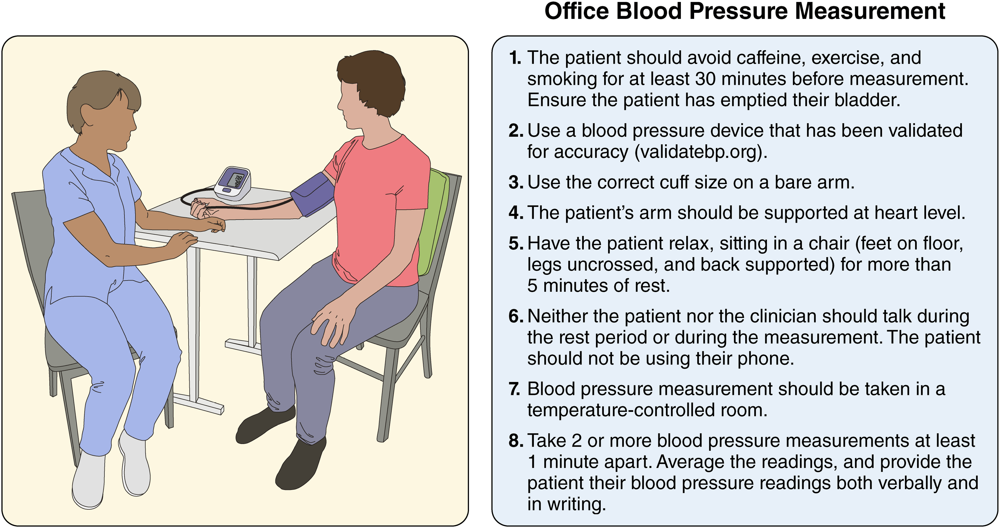
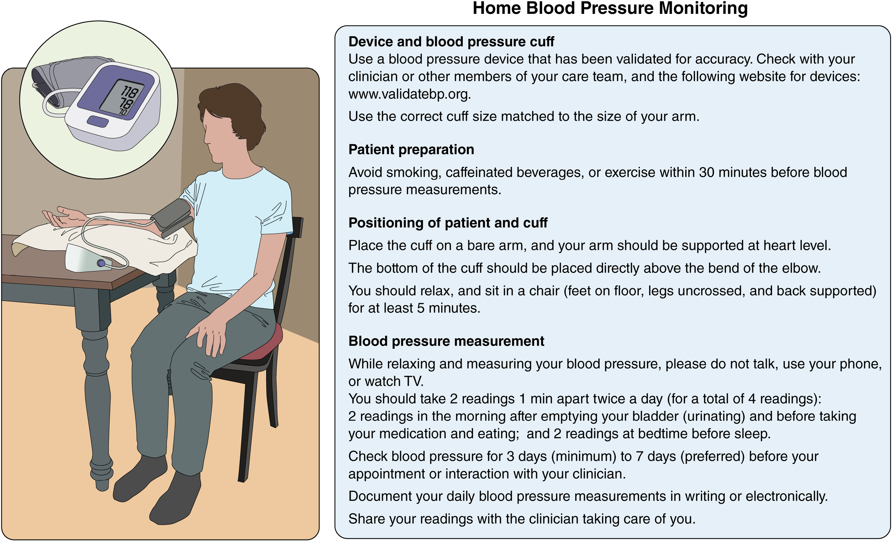

    

      

        
PREVENT ≥ 7.5%

        
Ngưỡng Nguy Cơ Tim Mạch 10 Năm

      

      

        
SPC

        
Ưu Tiên Viên Phối Hợp Liều Cố Định

      

      

        
RDN

        
Chỉ Định Triệt Thần Kinh Thận

      

      

        
Severe HTN

        
Bãi Bỏ Thuật Ngữ HTN Urgency

      

    

  

  
  

    
    

      
📌 <h2 class="sec-title">Phần 1: Định Nghĩa, Phân Loại Huyết Áp, PREVENT &amp; Quy Trình Đo Chuẩn Xác</h2>

      

        
        
Sự Thay Đổi Cốt Lõi: Chuyển Đổi Từ PCE sang PREVENT™ Trong Đánh Giá Nguy Cơ Tim Mạch

        
Một điểm mới mang tính nền tảng trong Hướng dẫn 2025 là Ủy ban biên soạn khuyến cáo sử dụng <strong>phương trình PREVENT™</strong> (Predicting Risk of CVD EVENTS) thay thế cho các Phương trình thuần tập tổng hợp (PCEs) cũ để ước tính nguy cơ tim mạch 10 năm ở người lớn tăng huyết áp chưa có bệnh tim mạch lâm sàng. Sự thay đổi dựa trên 5 cơ sở dữ liệu y khoa:

        

          

            
1. Dữ Liệu Đương Đại &amp; Đa Dạng

            
PCEs từ dữ liệu 1960–1990 cỡ mẫu nhỏ (chỉ da trắng và da đen). PREVENT từ <strong>3.2 triệu cá nhân (1992–2022)</strong> đại diện đa dạng chủng tộc.

          

          

            
2. Phạm Vi Dự Báo Rộng Hơn

            
PCEs chỉ ước tính ASCVD (MI, đột quỵ). PREVENT ước tính <strong>nguy cơ tim mạch toàn bộ (bao gồm cả Suy Tim - Heart Failure)</strong>.

          

          

            
3. Mở Rộng Độ Tuổi Áp Dụng

            
PCEs chỉ áp dụng từ 40–79 tuổi không dùng statin. PREVENT áp dụng rộng rãi từ <strong>30–79 tuổi</strong> và đưa statin vào như yếu tố dự báo.

          

          

            
4. Tích Hợp Thận &amp; Yếu Tố Xã Hội

            
PREVENT tích hợp <strong>chức năng thận (eGFR)</strong> để đánh giá tổn thương cơ quan đích và <strong>Chỉ số thiếu hụt xã hội (SDI)</strong>.

          

          

            
5. Độ Chính Xác Hiệu Chuẩn Cao

            
PCEs dự báo quá mức nguy cơ tim mạch tới 2 lần. PREVENT chứng minh khả năng hiệu chuẩn xuất sắc trên các chủng tộc khác nhau.

          

        

        
Định Nghĩa và Phân Loại Huyết Áp Ở Người Trưởng Thành (Table 4)

        
Huyết áp ở người trưởng thành không mang thai được phân chia thành 4 mức độ dựa trên trung bình của ≥ 2 lần đo cẩn thận thu được trong ≥ 2 dịp khám khác nhau:

        

          <table class="med-table">
            <thead>
              <tr>
                <th>Phân Loại Huyết Áp (Categories)</th>
                <th>Huyết Áp Tâm Thu (SBP)</th>
                <th>Toán Tử</th>
                <th>Huyết Áp Tâm Trương (DBP)</th>
              </tr>
            </thead>
            <tbody>
              <tr>
                <td><strong style="color: var(--green);">Huyết áp Bình thường (Normal)</strong></td>
                <td>&lt; 120 mm Hg</td>
                <td>VÀ</td>
                <td>&lt; 80 mm Hg</td>
              </tr>
              <tr>
                <td><strong style="color: var(--blue);">Huyết áp Tăng nhẹ (Elevated)</strong></td>
                <td>120 – 129 mm Hg</td>
                <td>VÀ</td>
                <td>&lt; 80 mm Hg</td>
              </tr>
              <tr>
                <td><strong style="color: var(--orange);">Tăng Huyết Áp Độ 1 (Stage 1)</strong></td>
                <td>130 – 139 mm Hg</td>
                <td>HOẶC</td>
                <td>80 – 89 mm Hg</td>
              </tr>
              <tr>
                <td><strong style="color: var(--red);">Tăng Huyết Áp Độ 2 (Stage 2)</strong></td>
                <td>≥ 140 mm Hg</td>
                <td>HOẶC</td>
                <td>≥ 90 mm Hg</td>
              </tr>
            </tbody>
          </table>
        

        

          * Quy tắc phân loại: Những người có SBP và DBP rơi vào hai phân loại khác nhau sẽ được xếp vào danh mục cao hơn.
        

        
        

          
<i class="fa-solid fa-calculator"></i> CDSS 1: Phân Loại Huyết Áp (AHA/ACC 2025 Table 4)

          

            

              <label for="input-sbp">SBP (mm Hg):</label>
              <input type="number" id="input-sbp" class="form-control-mini" value="135" min="70" max="260" style="width: 100px;" />
            

            

              <label for="input-dbp">DBP (mm Hg):</label>
              <input type="number" id="input-dbp" class="form-control-mini" value="85" min="40" max="160" style="width: 100px;" />
            

          

          

        

        
Quy Trình Đo Huyết Áp Chuẩn Xác Tại Phòng Khám (Figure 3)

        
Sai sót trong kỹ thuật đo huyết áp rất phổ biến. Hướng dẫn khuyến cáo sử dụng phương pháp dao động ký (oscillometric) với thiết bị tự động thay thế cho phương pháp nghe (auscultatory) truyền thống.

        
        

          
Figure 3. Checklist for Accurate Office Blood Pressure Measurement

          
          

            <strong>Quy trình chuẩn hóa đo huyết áp tại phòng khám gồm 8 bước:</strong> 
            1. Tránh caffeine, tập thể dục và hút thuốc 30 phút trước khi đo; đảm bảo bàng quang rỗng. 
            2. Sử dụng thiết bị đo đã được kiểm chứng độ chính xác (tra cứu tại <em>validatebp.org</em>). 
            3. Sử dụng kích cỡ bao quấn bít (cuff) chính xác trên cánh tay trần. 
            4. Cánh tay của bệnh nhân phải được nâng đỡ ở ngang mức tim. 
            5. Cho bệnh nhân thư giãn, ngồi trên ghế (bàn chân chạm phẳng trên sàn, không bắt chéo chân, tựa lưng) hơn 5 phút. 
            6. Cả bệnh nhân và người đo không nói chuyện trong lúc nghỉ và đo; bệnh nhân không dùng điện thoại. 
            7. Đo trong phòng có kiểm soát nhiệt độ. 
            8. Thực hiện ít nhất 2 lần đo cách nhau tối thiểu 1 phút. Tính trung bình các kết quả và cung cấp bằng lời nói/văn bản.
          

        

        
Hướng Dẫn Tự Theo Dõi Huyết Áp Tại Nhà (HBPM - Figure 4)

        
Theo dõi huyết áp tại nhà kết hợp với các tương tác thường xuyên từ đội ngũ y tế đa chuyên khoa sử dụng phác đồ chuẩn hóa giúp cải thiện kiểm soát huyết áp.

        
        

          
Figure 4. Home Blood Pressure Monitoring

          
          

            <strong>Quy chuẩn thực hiện đo huyết áp tại nhà (HBPM):</strong> 
            • <strong>Thiết bị:</strong> Dùng máy đo đã được xác thực (validatebp.org) với bao đo quấn cánh tay có kích cỡ phù hợp. 
            • <strong>Chuẩn bị:</strong> Không hút thuốc, uống caffeine hoặc tập thể dục trong 30 phút trước khi đo. Quấn bao đo trên cánh tay trần, mép dưới cách nếp khuỷu 2cm, cánh tay đặt ngang mức tim. Ngồi thư giãn (hai chân chạm sàn, không bắt chéo chân, tựa lưng) tối thiểu 5 phút. 
            • <strong>Quá trình đo:</strong> Không nói chuyện, không dùng điện thoại hay xem TV. Đo 2 lần cách nhau 1 phút, ngày đo 2 thời điểm (buổi sáng: sau đi tiểu, trước ăn/uống thuốc; buổi tối: trước khi đi ngủ). Theo dõi ít nhất 3 ngày (tốt nhất là 7 ngày) trước khi tái khám và ghi chép lại.
          

        

        

          ⚠️
          

            <strong>Cảnh Báo Về Thiết Bị Đo Không Băng Quấn (Cuffless Devices / Smartwatches)</strong> 
            Các thiết bị không băng quấn (bao gồm đồng hồ thông minh) hiện <strong>KHÔNG được khuyến cáo</strong> để chẩn đoán hoặc quản lý tăng huyết áp do thiếu độ chính xác và tin cậy (COR 3: No Benefit LOE C-LD).
          

        

        
Đối Chiếu Trị Số Huyết Áp Tại Phòng Khám và Ngoài Phòng Khám (Table 7)

        

          <table class="med-table">
            <thead>
              <tr>
                <th>HA Phòng Khám (Office)</th>
                <th>HA Tại Nhà (HBPM)</th>
                <th>ABPM Ban Ngày</th>
                <th>ABPM Ban Đêm</th>
                <th>ABPM 24 Giờ</th>
              </tr>
            </thead>
            <tbody>
              <tr>
                <td><strong>120 / 80 mm Hg</strong></td>
                <td>120 / 80 mm Hg</td>
                <td>120 / 80 mm Hg</td>
                <td>100 / 65 mm Hg</td>
                <td>115 / 75 mm Hg</td>
              </tr>
              <tr>
                <td><strong style="color: var(--orange);">130 / 80 mm Hg</strong></td>
                <td>130 / 80 mm Hg</td>
                <td>130 / 80 mm Hg</td>
                <td>110 / 65 mm Hg</td>
                <td>125 / 75 mm Hg</td>
              </tr>
              <tr>
                <td><strong style="color: var(--red);">140 / 90 mm Hg</strong></td>
                <td>135 / 85 mm Hg</td>
                <td>135 / 85 mm Hg</td>
                <td>120 / 70 mm Hg</td>
                <td>130 / 80 mm Hg</td>
              </tr>
              <tr>
                <td><strong style="color: #991b1b;">160 / 100 mm Hg</strong></td>
                <td>145 / 90 mm Hg</td>
                <td>145 / 90 mm Hg</td>
                <td>140 / 85 mm Hg</td>
                <td>145 / 90 mm Hg</td>
              </tr>
            </tbody>
          </table>
        

        
Phân Loại Các Thể Tăng Huyết Áp Đặc Biệt (Table 9)

        

          <table class="med-table">
            <thead>
              <tr>
                <th>Nhóm Bệnh Nhân</th>
                <th>Thể Tăng Huyết Áp</th>
                <th>HA Phòng Khám</th>
                <th>HA Ngoài Phòng Khám</th>
              </tr>
            </thead>
            <tbody>
              <tr>
                <td rowspan="4"><strong>Người CHƯA DÙNG thuốc hạ áp</strong></td>
                <td>HA Bình thường liên tục (Sustained normotension)</td>
                <td>Âm tính (-)</td>
                <td>Âm tính (-)</td>
              </tr>
              <tr>
                <td>Tăng huyết áp liên tục (Sustained HTN)</td>
                <td>Dương tính (+)</td>
                <td>Dương tính (+)</td>
              </tr>
              <tr>
                <td><strong style="color: var(--purple);">Tăng huyết áp ẩn giấu (Masked HTN)</strong></td>
                <td>Âm tính (-)</td>
                <td>Dương tính (+)</td>
              </tr>
              <tr>
                <td><strong style="color: var(--blue);">Tăng huyết áp áo choàng trắng (White-coat HTN)</strong></td>
                <td>Dương tính (+)</td>
                <td>Âm tính (-)</td>
              </tr>
              <tr>
                <td rowspan="4"><strong>Người ĐANG DÙNG thuốc hạ áp</strong></td>
                <td>HA được kiểm soát (Controlled HTN)</td>
                <td>Âm tính (-)</td>
                <td>Âm tính (-)</td>
              </tr>
              <tr>
                <td>HA không kiểm soát (Uncontrolled HTN)</td>
                <td>Dương tính (+)</td>
                <td>Dương tính (+)</td>
              </tr>
              <tr>
                <td><strong style="color: var(--purple);">HA ẩn giấu không kiểm soát (Masked uncontrolled HTN)</strong></td>
                <td>Âm tính (-)</td>
                <td>Dương tính (+)</td>
              </tr>
              <tr>
                <td><strong style="color: var(--blue);">Hiệu ứng áo choàng trắng (White-coat effect)</strong></td>
                <td>Dương tính (+)</td>
                <td>Âm tính (-)</td>
              </tr>
            </tbody>
          </table>
        

        
Khuyến Cáo Thực Hành Chẩn Đoán Thể HA Đặc Biệt

        <ul style="padding-left: 1.2rem; font-size: 0.88rem; line-height: 1.7; margin-bottom: 1rem;">
          <li>COR 2a LOE B-NR <strong>Loại trừ THA áo choàng trắng:</strong> Ở người chưa điều trị có HA phòng khám ≥130/80 nhưng &lt;160/100 mm Hg, khuyến cáo dùng HBPM/ABPM loại trừ THA áo choàng trắng trước khi xác định chẩn đoán.</li>
          <li>COR 2a LOE C-LD / B-NR <strong>Loại trừ hiệu ứng áo choàng trắng:</strong> Ở người nghi ngờ THA kháng trị giả tạo hoặc có HA phòng khám tăng cao (≥130/80 nhưng &lt;160/100 mm Hg) khi đang dùng thuốc.</li>
          <li>COR 2a LOE B-NR <strong>Theo dõi chuyển dạng:</strong> Người có THA áo choàng trắng hoặc THA ẩn giấu cần được định kỳ theo dõi bằng HBPM/ABPM để phát hiện sự chuyển sang THA liên tục thực sự.</li>
          <li>COR 2b LOE B-NR <strong>Loại trừ THA ẩn giấu:</strong> Ở người chưa điều trị có HA phòng khám bình thường (&lt;130/80 mm Hg), theo dõi ngoài phòng khám có thể cân nhắc để loại trừ THA ẩn giấu.</li>
          <li>COR 2b LOE B-NR <strong>THA ẩn giấu không kiểm soát:</strong> Ở người dùng thuốc có HA phòng khám &lt;130/80 mm Hg, cân nhắc HBPM/ABPM nhằm phân tầng nguy cơ.</li>
        </ul>

      

    

    
    

      
🏃 <h2 class="sec-title">Phần 2: Chiến Lược Quản Lý Lối Sống &amp; Can Thiệp Tâm Lý Xã Hội (Table 12)</h2>

      

        
Can thiệp lối sống là nền tảng không thể thiếu trong cả phòng ngừa sơ khởi lẫn quản lý điều trị tăng huyết áp ở mọi giai đoạn. Bảng 12 tổng kết 8 can thiệp cốt lõi và mức giảm SBP kỳ vọng:

        

          

            
1. Giảm Cân (Weight Loss)

            

              • <strong>Mục tiêu:</strong> Giảm ≥ 5% trọng lượng cơ thể cho người BMI ≥ 25.0 kg/m² (gốc Á ≥ 23.0 kg/m²). 
              • <strong>Hiệu quả:</strong> Giảm ~1 mm Hg SBP cho mỗi 1 kg giảm được. SBP giảm <strong>-6 đến -8 mm Hg</strong> ở bệnh nhân THA (-3 đến -5 ở người không THA).
            

          

          

            
2. Chế Độ Ăn DASH

            

              • <strong>Mục tiêu:</strong> Chế độ ăn giàu trái cây, rau quả, ngũ cốc nguyên hạt, sữa ít béo; hạn chế chất béo bão hòa. 
              • <strong>Hiệu quả:</strong> Mô hình ăn uống có bằng chứng mạnh nhất, hạ SBP từ <strong>-5 đến -8 mm Hg</strong> ở bệnh nhân THA (-3 đến -7 ở người không THA).
            

          

          

            
3. Giảm Natri (Sodium Reduction)

            

              • <strong>Mục tiêu:</strong> Tiêu thụ &lt; 2300 mg natri/ngày, tiến dần tới mức lý tưởng <strong>&lt; 1500 mg/ngày</strong>. 
              • <strong>Hiệu quả:</strong> Hạ SBP từ <strong>-6 đến -8 mm Hg</strong> ở bệnh nhân THA (-1 đến -4 ở người không THA).
            

          

          

            
4. Muối Kali Thay Thế (Potassium Salt)

            

              • <strong>Mục tiêu:</strong> Thay muối 100% NaCl bằng muối chứa 25%–30% KCl (65%–75% NaCl). 
              • <strong>Hiệu quả:</strong> Hạ SBP <strong>-5 đến -7 mm Hg</strong> (5/1.5 mm Hg). 
              ⚠️ <em>Chống chỉ định nếu có suy thận mạn (CKD) hoặc thuốc giảm bài tiết kali.</em>
            

          

          

            
5. Bổ Sung Kali Thực Phẩm

            

              • <strong>Mục tiêu:</strong> Tăng cường thực phẩm giàu kali đạt 3500–5000 mg/ngày. 
              • <strong>Hiệu quả:</strong> Hạ SBP <strong>-6 mm Hg</strong> ở bệnh nhân THA. 
              ⚠️ <em>Chống chỉ định nếu có suy thận hoặc nguy cơ tăng kali máu.</em>
            

          

          

            
6. Cắt Giảm Rượu Bia

            

              • <strong>Mục tiêu:</strong> Tối ưu là kiêng hoàn toàn. Giới hạn ≤ 1 đơn vị cồn/ngày ở nữ, ≤ 2 đơn vị cồn/ngày ở nam. 
              • <strong>Hiệu quả:</strong> Hạ SBP từ <strong>-4 đến -6 mm Hg</strong> ở bệnh nhân THA.
            

          

          

            
7. Hoạt Động Thể Chất

            

              • <strong>Mục tiêu:</strong> Aerobic 90–150 phút/tuần (65%–75% HR reserve), rèn luyện kháng lực động hoặc kháng lực tĩnh. 
              • <strong>Hiệu quả:</strong> Giảm SBP từ <strong>-2 đến -10 mm Hg</strong>.
            

          

          

            
8. Giảm Căng Thẳng Tâm Lý

            

              • <strong>Mục tiêu:</strong> Thiền định siêu việt (Transcendental meditation), yoga, hoặc kiểm soát nhịp thở (&lt;10 lần/phút). 
              • <strong>Hiệu quả:</strong> Giảm SBP bổ trợ từ <strong>-5 đến -7 mm Hg</strong>.
            

          

        

      

    

    
    

      
🛡️ <h2 class="sec-title">Phần 3: Ngưỡng Khởi Trị Thuốc, Mục Tiêu Điều Trị Tối Ưu &amp; Phác Đồ SPC</h2>

      

        
        
Ngưỡng Khởi Trị Thuốc Hạ Áp Dựa Trên Nguy Cơ Tim Mạch PREVENT (Figure 6)

        <ul style="padding-left: 1.2rem; font-size: 0.88rem; line-height: 1.7; margin-bottom: 1rem;">
          <li>COR 1 LOE A <strong>Huyết áp phòng khám ≥ 140/90 mm Hg:</strong> Bắt buộc khởi trị ngay bằng thuốc hạ áp kết hợp thay đổi lối sống cho tất cả bệnh nhân.</li>
          <li>COR 1 LOE A (SBP) / C-LD (DBP) <strong>Tăng Huyết Áp Độ 1 (130-139/80-89 mm Hg) Nhóm Nguy Cơ Cao:</strong> Bệnh nhân đã có Bệnh tim mạch lâm sàng (CVD), Đái tháo đường (DM), Bệnh thận mạn (CKD), hoặc nguy cơ PREVENT 10 năm ≥ 7.5% <i class="fa-solid fa-arrow-right"></i> Khởi trị ngay bằng thuốc hạ áp kết hợp lối sống.</li>
          <li>COR 1 LOE B-R <strong>Tăng Huyết Áp Độ 1 Nhóm Nguy Cơ Thấp:</strong> Bệnh nhân không có CVD, DM, CKD và nguy cơ PREVENT &lt; 7.5% <i class="fa-solid fa-arrow-right"></i> Thử nghiệm can thiệp lối sống đơn thuần 3–6 tháng. Nếu sau 3–6 tháng HA vẫn ≥ 130/80 mm Hg, khởi trị thuốc hạ áp bổ trợ.</li>
        </ul>

        
        

          
<i class="fa-solid fa-shield-halved"></i> CDSS 2: Khởi Trị Thuốc Theo PREVENT™ (Figure 6)

          

            

              <label for="init-sbp">SBP (mmHg):</label>
              <input type="number" id="init-sbp" class="form-control-mini" value="134" style="width: 90px;" />
            

            

              <label for="init-dbp">DBP (mmHg):</label>
              <input type="number" id="init-dbp" class="form-control-mini" value="84" style="width: 90px;" />
            

            

              <label for="init-cvd">Có CVD?</label>
              <select id="init-cvd" class="form-control-mini">
                <option value="no">Không</option>
                <option value="yes">Có (MI, Đột quỵ, Đau thắt ngực)</option>
              </select>
            

            

              <label for="init-comorbid">Đái tháo đường / CKD?</label>
              <select id="init-comorbid" class="form-control-mini">
                <option value="no">Không</option>
                <option value="yes">Có</option>
              </select>
            

            

              <label for="init-prevent">PREVENT 10 năm:</label>
              <select id="init-prevent" class="form-control-mini">
                <option value="low">&lt; 7.5% (Nguy cơ thấp-TB)</option>
                <option value="high">≥ 7.5% (Nguy cơ cao)</option>
              </select>
            

          

          

        

        
Mục Tiêu Điều Trị Huyết Áp Tối Ưu (Figure 7)

        <ul style="padding-left: 1.2rem; font-size: 0.88rem; line-height: 1.7; margin-bottom: 1rem;">
          <li>COR 1 LOE A (SBP) / B-R (DBP) <strong>Đối với nhóm nguy cơ CVD cao (CVD, DM, CKD, PREVENT ≥ 7.5%):</strong> Mục tiêu SBP khuyến cáo <strong>&lt; 130 mm Hg</strong> và <strong>khuyến khích đạt &lt; 120 mm Hg</strong> để giảm thiểu tối đa MACE và tử vong toàn bộ. Mục tiêu DBP <strong>&lt; 80 mm Hg</strong>.</li>
          <li>COR 2b LOE B-NR <strong>Đối với nhóm nguy cơ CVD thấp (PREVENT &lt; 7.5%):</strong> Mục tiêu SBP &lt; 130 mm Hg và DBP &lt; 80 mm Hg (khuyến khích SBP &lt; 120 mm Hg) có thể được cân nhắc để ngăn tiến triển tổn thương cơ quan đích.</li>
        </ul>

        
4 Nhóm Thuốc Hạ Áp Đầu Tay &amp; Chiến Lược Phối Hợp Viên SPC (Table 14)

        <ul style="padding-left: 1.2rem; font-size: 0.88rem; line-height: 1.7; margin-bottom: 1rem;">
          <li>COR 1 LOE A <strong>Bốn nhóm thuốc đầu tay (First-line):</strong> Lợi tiểu Thiazide-type (Chlorthalidone, Indapamide, Hydrochlorothiazide), Chẹn kênh calci DHP (Amlodipine, Felodipine), ACEi (Lisinopril, Perindopril) hoặc ARB (Valsartan, Losartan, Telmisartan). <em>Thuốc chẹn beta không nằm trong nhóm đầu tay trừ khi có chỉ định bắt buộc (bệnh vành, suy tim).</em></li>
          <li>COR 1 LOE B-R <strong>Tăng Huyết Áp Độ 2 (Stage 2):</strong> Khởi trị ngay bằng phối hợp 2 thuốc hạ áp đầu tay, ưu tiên <strong>Viên Phối Hợp Liều Cố Định (Single-Pill Combination - SPC)</strong> để tăng tuân thủ và rút ngắn thời gian đạt đích.</li>
          <li>COR 3: Harm LOE A <strong>CHỐNG CHỈ ĐỊNH TUYỆT ĐỐI:</strong> Không phối hợp đồng thời 2 thuốc cùng hệ RAAS (ACEi + ARB, hoặc ACEi/ARB + Aliskiren) do nguy cơ suy thận cấp, tăng kali máu nặng và tụt huyết áp.</li>
        </ul>

        
        

          
<i class="fa-solid fa-pills"></i> CDSS 3: Đích Huyết Áp &amp; Thuốc Theo Bệnh Lý

          

            

              <label for="comorbid-select">Bệnh cảnh lâm sàng:</label>
              <select id="comorbid-select" class="form-control-mini" style="width: 100%;">
                <option value="general">Người trưởng thành thông thường (General Adult)</option>
                <option value="high_cvd">Nguy cơ tim mạch cao (PREVENT ≥ 7.5% / CVD)</option>
                <option value="t2d">Đái tháo đường Týp 2 (T2D)</option>
                <option value="ckd">Bệnh thận mạn (CKD) có Albumin niệu ≥ 30 mg/g</option>
                <option value="stroke">Dự phòng thứ phát sau Đột quỵ / TIA</option>
                <option value="cognitive">Bảo vệ nhận thức / Ngừa sa sút trí tuệ (SPRINT-MIND)</option>
                <option value="pregnancy">Thai kỳ (Pregnancy / HDP)</option>
              </select>
            

          

          

        

      

    

    
    

      
⚡ <h2 class="sec-title">Phần 4: Tăng Huyết Áp Kháng Trị &amp; Triệt Thần Kinh Giao Cảm Thận (RDN)</h2>

      

        
        
Định Nghĩa &amp; Quy Trình 7 Bước Xử Trí Tăng Huyết Áp Kháng Trị (Figure 8)

        
<strong>Định nghĩa:</strong> Trị số HA vẫn nằm ngoài mục tiêu dù đã dùng phối hợp tối ưu <strong>≥ 3 thuốc hạ áp</strong> khác cơ chế ở liều tối đa dung nạp (bắt buộc có 1 lợi tiểu); hoặc HA đã kiểm soát nhưng cần từ <strong>≥ 4 thuốc</strong> trở lên.

        <ol style="padding-left: 1.25rem; font-size: 0.88rem; line-height: 1.75; margin-bottom: 1.5rem;">
          <li><strong>Xác nhận kháng trị &amp; Loại trừ kháng trị giả (pseudoresistance):</strong> Đảm bảo kỹ thuật đo chuẩn; đo HBPM/ABPM loại trừ hiệu ứng áo choàng trắng; đánh giá sự tuân thủ điều trị.</li>
          <li><strong>Ngừng các chất gây tăng huyết áp:</strong> NSAIDs, corticoid, thuốc thông mũi, cam thảo, rượu cồn.</li>
          <li><strong>Tối ưu hóa liệu pháp lợi tiểu:</strong> Chuyển từ HCTZ sang lợi tiểu Thiazide-like kéo dài &amp; mạnh mẽ hơn: <strong>Chlorthalidone (12.5–25 mg/ngày)</strong> hoặc <strong>Indapamide (1.25–2.5 mg/ngày)</strong>.</li>
          <li>COR 1 LOE B-R <strong>Bổ sung thuốc thứ 4 (Kháng Mineralocorticoid - MRA):</strong> Thêm <strong>Spironolactone (25–50 mg/ngày)</strong> hoặc Eplerenone (25–50 mg x 2 lần/ngày) ở bệnh nhân có eGFR ≥ 45 mL/phút/1.73m². (Nếu không dung nạp: Amiloride 10-20mg, Chẹn Beta, Chẹn Alpha-1, Tác động trung ương, Aprocitentan 12.5mg, hoặc Hydralazine/Minoxidil).</li>
          <li><strong>Sàng lọc nguyên nhân THA thứ phát:</strong> Cường aldosterone nguyên phát, OSA, Hẹp động mạch thận.</li>
          <li><strong>Chuyển tuyến chuyên khoa:</strong> Nếu HA vẫn không kiểm soát sau 6 tháng.</li>
        </ol>

        
Chỉ Định Triệt Thần Kinh Giao Cảm Động Mạch Thận (RDN - Table 25)

        <ul style="padding-left: 1.2rem; font-size: 0.88rem; line-height: 1.7; margin-bottom: 1rem;">
          <li>COR 2b LOE B-R <strong>Chỉ định RDN:</strong> Lựa chọn bổ trợ hợp lý ở bệnh nhân THA Độ 2 thực sự (SBP phòng khám 140–180 mm Hg và DBP ≥ 90 mm Hg), eGFR ≥ 40 mL/phút/1.73m², đã tối ưu hóa điều trị thuốc nhưng không kiểm soát được HA, hoặc gặp tác dụng phụ không thể dung nạp.</li>
          <li><strong style="color: var(--red);">Chống chỉ định RDN:</strong> THA giao cảm do nguyên nhân thần kinh (neurogenic), phụ nữ mang thai, loạn sản cơ sợi (FMD), động mạch thận đã đặt stent, phình động mạch thận, hẹp động mạch thận có ý nghĩa.</li>
        </ul>

        
        

          
<i class="fa-solid fa-bolt"></i> CDSS 4: Đánh Giá Chỉ Định Triệt Thần Kinh Thận (RDN - Table 25)

          
TIÊU CHUẨN CHỈ ĐỊNH (Tích chọn):

          

            <label class="cdss-chip"><input type="checkbox" id="rdn-c1" class="rdn-check" /> HA ≥140/90 dù đã dùng ≥4 thuốc (gồm MRA)</label>
            <label class="cdss-chip"><input type="checkbox" id="rdn-c2" class="rdn-check" /> Hoặc không thể dung nạp/tăng thêm thuốc</label>
            <label class="cdss-chip"><input type="checkbox" id="rdn-c3" class="rdn-check" /> eGFR ≥ 40 mL/min/1.73m²</label>
            <label class="cdss-chip"><input type="checkbox" id="rdn-c4" class="rdn-check" /> Giải phẫu ĐM thận phù hợp</label>
          

          
CHỐNG CHỈ ĐỊNH (Tích chọn nếu có):

          

            <label class="cdss-chip danger"><input type="checkbox" id="rdn-ex1" class="rdn-ex-check" /> Tăng HA tư thế đứng thần kinh</label>
            <label class="cdss-chip danger"><input type="checkbox" id="rdn-ex2" class="rdn-ex-check" /> Phụ nữ đang mang thai</label>
            <label class="cdss-chip danger"><input type="checkbox" id="rdn-ex3" class="rdn-ex-check" /> Hẹp ĐM thận, Stent cũ, FMD, Phình ĐM thận</label>
          

          

        

      

    

    
    

      
🤰 <h2 class="sec-title">Phần 5: Tăng Huyết Áp Thai Kỳ, Cấp Cứu Tăng Huyết Áp &amp; Quản Lý Chu Phẫu</h2>

      

        
        
Quản Lý Tăng Huyết Áp Trong Thai Kỳ (Table 20 &amp; Table 22)

        <ul style="padding-left: 1.2rem; font-size: 0.88rem; line-height: 1.7; margin-bottom: 1rem;">
          <li>COR 1 LOE B-R <strong>Điều trị Cơn THA Mức Độ Nặng (≥ 160/110 mm Hg):</strong> Bắt buộc khởi trị thuốc hạ áp cấp cứu (Nifedipine uống tác dụng nhanh IR, Labetalol IV, Hydralazine IV) trong vòng <strong>30–60 phút</strong> để hạ HA về &lt;160/110 mm Hg nhằm ngừa đột quỵ mẹ.</li>
          <li>COR 1 LOE B-R <strong>Điều trị THA Mạn Tính:</strong> Đưa mục tiêu huyết áp về <strong>&lt; 140/90 mm Hg</strong>. Thuốc đường uống hàng đầu: <strong>Labetalol</strong> (200–2400 mg/ngày) và <strong>Nifedipine phóng thích kéo dài ER</strong> (30–120 mg/ngày). Second line: Methyldopa, HCTZ.</li>
          <li>COR 3: Harm LOE C-LD / B-NR <strong>CHỐNG CHỈ ĐỊNH TUYỆT ĐỐI TRONG THAI KỲ:</strong> Atenolol, ACEi, ARB, Aliskiren, Nitroprusside, MRA (Spironolactone) do nguy cơ dị tật bẩm sinh, thiểu ối, suy thận thai nhi và độc tính cyanide.</li>
          <li>COR 1 LOE B-R <strong>Phòng ngừa tiền sản giật:</strong> Tư vấn dùng <strong>Aspirin liều thấp (81 mg/ngày)</strong> bắt đầu từ tuần thứ 12 cho phụ nữ nguy cơ cao hoặc trung bình.</li>
        </ul>

        
Cơn Tăng Huyết Áp Cấp Cứu vs Tăng HA Nặng (Figure 9)

        <ul style="padding-left: 1.2rem; font-size: 0.88rem; line-height: 1.7; margin-bottom: 1rem;">
          <li>COR 1 LOE C-LD <strong>Hypertensive Emergency (HA &gt; 180/120 mm Hg KÈM tổn thương cơ quan đích cấp):</strong> Nhập viện ICU ngay. Nhóm không có chỉ định đặc biệt: giảm SBP không quá 25% trong giờ đầu; về &lt;160/100 trong 2–6 giờ tiếp theo; bình thường hóa trong 24–48 giờ.</li>
          <li>COR 1 LOE C-LD <strong>Phình tách động mạch chủ ngực cấp tính:</strong> BẮT BUỘC giảm khẩn cấp SBP xuống <strong>&lt; 120 mm Hg</strong> và nhịp tim &lt; 60 bpm trong vòng 20 phút đầu bằng thuốc chẹn beta IV (esmolol/labetalol) TRƯỚC KHI dùng thuốc giãn mạch.</li>
          <li>COR 3: Harm LOE B-NR <strong>Severe Hypertension KHÔNG có tổn thương cơ quan đích cấp (Bãi bỏ thuật ngữ Hypertensive Urgency):</strong> CHỐNG CHỈ ĐỊNH việc hạ áp nhanh bằng thuốc truyền IV hoặc tăng liều thuốc uống ồ ạt cấp tính. Xử trí bằng thiết lập/tối ưu thuốc uống ngoại trú và tái khám trong 4 tuần.</li>
        </ul>

        
        

          
<i class="fa-solid fa-triangle-exclamation"></i> CDSS 5: Phân Loại &amp; Phân Luồng Cấp Cứu Huyết Áp (Figure 9)

          

            

              <label for="em-sbp">SBP (mmHg):</label>
              <input type="number" id="em-sbp" class="form-control-mini" value="190" style="width: 90px;" />
            

            

              <label for="em-dbp">DBP (mmHg):</label>
              <input type="number" id="em-dbp" class="form-control-mini" value="125" style="width: 90px;" />
            

            

              <label for="em-target">Tổn thương cơ quan đích cấp tính:</label>
              <select id="em-target" class="form-control-mini" style="width: 100%;">
                <option value="none">Không có (Không triệu chứng cấp / Đau đầu nhẹ)</option>
                <option value="aortic">Phình tách động mạch chủ ngực cấp tính</option>
                <option value="general_emergency">Suy tim cấp / Phù phổi / Đột quỵ / MI / AKI cấp</option>
              </select>
            

          

          

        

        
Quản Lý Huyết Áp Chu Phẫu (Perioperative Management)

        <ul style="padding-left: 1.2rem; font-size: 0.88rem; line-height: 1.7;">
          <li>COR 1 LOE B-NR <strong>Duy trì Chẹn Beta (BB):</strong> Bắt buộc tiếp tục BB mạn tính trong suốt giai đoạn phẫu thuật. Ngừng đột ngột BB gây bùng phát giao cảm nguy kịch (COR 3: Harm).</li>
          <li>COR 3: Harm LOE B-R <strong>Chống chỉ định khởi trị BB vào ngày phẫu thuật:</strong> KHÔNG khởi trị BB ngay trong ngày phẫu thuật cho bệnh nhân chưa từng dùng (gây tăng tử vong và đột quỵ).</li>
          <li>COR 2b LOE B-R <strong>Tạm ngừng ACEi/ARB:</strong> Cân nhắc tạm ngừng ACEi/ARB 24 giờ trước phẫu thuật lớn để tránh hạ huyết áp sâu khi khởi mê.</li>
          <li>COR 2b LOE C-LD <strong>Trì hoãn mổ chương trình:</strong> Cân nhắc hoãn mổ nếu SBP ≥ 180 hoặc DBP ≥ 110 mm Hg ở người nguy cơ cao.</li>
        </ul>

      

    

    
    

      
🧠 <h2 class="sec-title">Phần 6: Tăng Huyết Áp Thứ Phát, Bệnh Mạch Máu Não &amp; Sa Sút Trí Tuệ</h2>

      

        
        
Chuyên Sâu Tăng Huyết Áp Thứ Phát (Secondary HTN - Figure 5 &amp; Table 10)

        
Chiếm <strong>5% đến 25%</strong> số bệnh nhân tăng huyết áp. Dấu hiệu gợi ý: THA độ 2/kháng trị, khởi phát &lt;30 tuổi, HA bùng phát đột ngột, tổn thương cơ quan đích không tương xứng, hạ kali máu tự phát/do lợi tiểu, ngáy/OSA, khối u thượng thận tình cờ.

        

          <table class="med-table">
            <thead>
              <tr>
                <th>Nguyên Nhân Thứ Phát</th>
                <th>Tỷ Lệ</th>
                <th>Biểu Hiện Lâm Sàng Gợi Ý</th>
                <th>Xét Nghiệm Tầm Soát &amp; Xác Chẩn</th>
              </tr>
            </thead>
            <tbody>
              <tr>
                <td><strong>Hội chứng Ngưng thở khi ngủ (OSA)</strong></td>
                <td>25% – 50%</td>
                <td>Ngáy lớn, nghẹt thở khi ngủ, THA ban đêm / kháng trị</td>
                <td>Bảng câu hỏi STOP-Bang / Berlin <i class="fa-solid fa-arrow-right"></i> Đa ký giấc ngủ (Polysomnography) hoặc đo tại nhà. Treatment: CPAP (≥4h/đêm), GLP-1 RA (tirzepatide giảm SBP 7.6 mmHg).</td>
              </tr>
              <tr>
                <td><strong>Cường Aldosterone Nguyên Phát (PA)</strong></td>
                <td>5% – 25%</td>
                <td>THA kháng trị, hạ kali máu tự phát (chỉ 20-50% có hypokalemia! K+ bình thường KHÔNG loại trừ PA)</td>
                <td>Đo PAC, PRA, tỷ lệ ARR (dương tính khi ARR ≥ 30, PAC ≥ 10 ng/dL, PRA &lt;1). Ngừng MRA 4-6 tuần trước đo. Xác chẩn: Nghiệm pháp truyền dịch muối đẳng trương 4h hoặc nạp muối oral. Chụp CT thượng thận / AVS.</td>
              </tr>
              <tr>
                <td><strong>Bệnh Thận Mạn (CKD)</strong></td>
                <td>14%</td>
                <td>Tiền sử đái tháo đường, tiểu máu, creatinine tăng</td>
                <td>Điện giải đồ, Creatinine máu (eGFR), Phân tích nước tiểu, Siêu âm thận.</td>
              </tr>
              <tr>
                <td><strong>Do Thuốc / Rượu cồn</strong></td>
                <td>2% – 20%</td>
                <td>Dùng NSAIDs, corticoid, cam thảo, thuốc tránh thai, rượu bia</td>
                <td>Hỏi tiền sử dùng thuốc chi tiết, xét nghiệm độc chất nước tiểu.</td>
              </tr>
              <tr>
                <td><strong>Hẹp Động Mạch Thận (RAS)</strong></td>
                <td>0.1% – 5%</td>
                <td>THA kháng trị, phù phổi cấp huyết động đột ngột (flash pulmonary edema). Xơ vữa ĐM (90%) hoặc Loạn sản cơ sợi FMD (&lt;50t).</td>
                <td>Siêu âm Doppler ĐM thận, MRA, CT angiography. <em>Lưu ý xơ vữa ĐM thận: Điều trị nội khoa tối ưu (RAASi, statin, aspirin) là lựa chọn hàng đầu; Stenting không vượt trội hơn nội khoa!</em> FMD: Nong bóng không stent.</td>
              </tr>
            </tbody>
          </table>
        

        
Quản Lý HA Ở Bệnh Nhân Bệnh Mạch Máu Não (Cerebrovascular Disease)

        
        

          

            
1. Xuất Huyết Não Cấp (Acute ICH)

            

              • COR 2a LOE A SBP nhập viện 150–220 mm Hg <i class="fa-solid fa-arrow-right"></i> Hạ ngay SBP xuống <strong>130 đến &lt;140 mm Hg</strong> trong 7 ngày đầu. 
              ⚠️ <strong>CẢNH BÁO AN TOÀN:</strong> Ngừng ngay thuốc hạ áp nếu SBP &lt; 130 mm Hg (gây hại!). Dùng Nicardipine/Clevidipine IV, tránh nitrat. 
              • COR 3: Harm SBP &gt; 220 mm Hg <i class="fa-solid fa-arrow-right"></i> CHỐNG CHỈ ĐỊNH hạ SBP &lt; 130! Chỉ hạ thận trọng về 160–180 mm Hg.
            

          

          

            
2. Đột Quỵ Nhồi Máu Cấp (Ischemic Stroke)

            

              • COR 1 LOE B-NR <strong>Dùng tiêu sợi huyết (tPA):</strong> Hạ SBP <strong>&lt; 185/110 mm Hg</strong> trước tPA và giữ <strong>&lt; 180/105 mm Hg</strong> trong 24 giờ đầu. 
              • COR 2a LOE B-NR <strong>Lấy huyết khối (EVT):</strong> Duy trì <strong>≤ 180/105 mm Hg</strong> trong 24 giờ. 
              🛑 <strong>CHỐNG CHỈ ĐỊNH (COR 3: Harm, LOE A):</strong> Sau tái thông EVT thành công, <strong>KHÔNG hạ SBP &lt; 140 mm Hg</strong> trong 24–72h (Thử nghiệm ENCHANTED-2 MT &amp; OPTIMAL-BP bị dừng sớm do tăng tàn phế/tử vong!). 
              • Không tPA/EVT: Nếu HA ≥ 220/120 mm Hg <i class="fa-solid fa-arrow-right"></i> Hạ ~15% trong 24h (COR 2b).
            

          

        

        
Ngăn Ngừa Sa Sút Trí Tuệ (Dementia &amp; MCI Prevention - SPRINT-MIND)

        <ul style="padding-left: 1.2rem; font-size: 0.88rem; line-height: 1.7;">
          <li>COR 1 LOE A <strong>Bảo vệ tế bào thần kinh &amp; nhận thức:</strong> Ở tất cả người lớn tăng huyết áp, kiểm soát SBP tích cực đạt mục tiêu <strong>SBP &lt; 130 mm Hg</strong> được khuyến cáo mạnh mẽ nhằm ngăn ngừa nguy cơ <strong>Suy giảm nhận thức nhẹ (MCI) và Sa sút trí tuệ (Dementia / Alzheimer)</strong>. Dữ liệu SPRINT-MIND chứng minh 3.5 năm kiểm soát tích cực giúp duy trì hiệu quả bảo vệ tế bào thần kinh lên đến 7 năm.</li>
        </ul>

      

    

    
    

      
💊 <h2 class="sec-title">Phần 7: Tương Tác Thuốc, Chức Năng Tình Dục &amp; Chăm Sóc Hệ Thống Telehealth</h2>

      

        
        
Tương Tác Thuốc Dược Động Học &amp; Dược Lực Học Quan Trọng (Table 16 &amp; Table 17)

        
        

          <table class="med-table">
            <thead>
              <tr>
                <th>Phối Hợp Thuốc Tương Tác</th>
                <th>Cơ Chế Tương Tác</th>
                <th>Hậu Quả Lâm Sàng &amp; Hướng Xử Trí</th>
              </tr>
            </thead>
            <tbody>
              <tr>
                <td><strong>Verapamil / Diltiazem + CYP3A4 Substrates</strong> (Tacrolimus, Statin, DOACs, Eplerenone)</td>
                <td>Ức chế enzym CYP3A4 mạnh tại gan và ruột</td>
                <td>Tăng nồng độ Tacrolimus (độc thận), Statin (tiêu cơ vân), DOAC (xuất huyết), Eplerenone (sụt áp, tăng K+). Giảm liều hoặc chọn CCB DHP.</td>
              </tr>
              <tr>
                <td><strong>Patiromer (Gắn Kali) + Thuốc Hạ Áp</strong> (Amlodipine, Furosemide, BB, Telmisartan)</td>
                <td>Gắn kết làm giảm hấp thu các thuốc hạ áp tại đường tiêu hóa</td>
                <td><strong>Xử trí:</strong> Bắt buộc uống các thuốc hạ áp cách xa Patiromer ít nhất <strong>3 giờ trước hoặc sau</strong>.</td>
              </tr>
              <tr>
                <td><strong>Thiazide / RAASi + Lithium</strong></td>
                <td>Giảm độ thanh thải Lithium qua thận</td>
                <td>Tăng nguy cơ ngộ độc Lithium cấp tính. Giám sát nồng độ Lithium máu chặt chẽ.</td>
              </tr>
              <tr>
                <td><strong>NSAIDs + Tất Cả Thuốc Hạ Áp</strong></td>
                <td>NSAID gây giữ muối nước tại thận và co mạch</td>
                <td>Làm giảm đáng kể hiệu quả hạ áp của tất cả các nhóm thuốc hạ áp.</td>
              </tr>
              <tr>
                <td><strong>NSAIDs + ACEi / ARB</strong></td>
                <td>Co tiểu ĐM đến (NSAID) + Giãn tiểu ĐM đi (RAASi)</td>
                <td>Nguy cơ rất cao gây <strong>Suy Thận Cấp (AKI)</strong>. Hạn chế dùng chung.</td>
              </tr>
              <tr>
                <td><strong>ACEi + ARB hoặc Aliskiren</strong></td>
                <td>Ức chế kép hệ Renin-Angiotensin-Aldosterone</td>
                <td>COR 3: Harm Độc thận nặng, tăng K+ máu kịch phát, tụt HA. Absolute Contraindication!</td>
              </tr>
              <tr>
                <td><strong>CCB Dihydropyridine + ACEi / ARB</strong></td>
                <td>ACEi/ARB làm giãn tiểu ĐM đi, giải áp mao mạch ngoại vi</td>
                <td><strong>Tương tác có lợi:</strong> Giảm đáng kể tác dụng phụ phù chân đặc trưng của CCB DHP.</td>
              </tr>
              <tr>
                <td><strong>RAASi + Lợi Tiểu Thiazide / Quai</strong></td>
                <td>Cân bằng bài tiết Kali tại ống thận</td>
                <td><strong>Tương tác có lợi:</strong> Thiazide thải K+ bù trừ cho tác dụng giữ K+ của RAASi, giúp ổn định K+ máu.</td>
              </tr>
            </tbody>
          </table>
        

        
Ảnh Hưởng Trên Chức Năng Tình Dục (Sexual Dysfunction)

        <ul style="padding-left: 1.2rem; font-size: 0.88rem; line-height: 1.7; margin-bottom: 1rem;">
          <li><strong>Thuốc gây ảnh hưởng nhiều nhất:</strong> Lợi tiểu Thiazide và Thuốc chẹn Beta (ngoại trừ Nebivolol) liên quan nhiều nhất đến rối loạn cương dương ở nam và giảm ham muốn ở nữ.</li>
          <li><strong>Thuốc an toàn &amp; Thân thiện nhất:</strong> Thuốc chẹn thụ thể Angiotensin (<strong>ARB</strong>) có hồ sơ thân thiện nhất, hỗ trợ cải thiện chức năng tình dục.</li>
          <li><strong>Thuốc PDE-5i (Sildenafil, Tadalafil):</strong> An toàn khi dùng cùng thuốc hạ áp thông thường, nhưng COR 3: Harm <strong>CHỐNG CHỈ ĐỊNH TUYỆT ĐỐI dùng chung với các thuốc nhóm NITRATE</strong> do nguy cơ tụt HA nguy kịch.</li>
        </ul>

        
Kế Hoạch Chăm Sóc Hệ Thống &amp; Ứng Dụng Y Tế Từ Xa (Telehealth)

        <ul style="padding-left: 1.2rem; font-size: 0.88rem; line-height: 1.7;">
          <li>COR 1 LOE A <strong>Mô hình Chăm sóc Đội ngũ (Team-Based Care):</strong> Phối hợp giữa bác sĩ, dược sĩ lâm sàng, điều dưỡng, chuyên gia dinh dưỡng giúp tối ưu hóa tuân thủ và hạ áp vượt trội. Trao quyền cho dược sĩ/điều dưỡng chỉnh liều theo thuật toán.</li>
          <li>COR 1 LOE B-NR <strong>Bệnh Án Điện Tử (EHR/HIT):</strong> Tích hợp CNTT sàng lọc chủ động bệnh nhân chưa được kiểm soát.</li>
          <li>COR 2a LOE B-R <strong>Y Tế Từ Xa (Telehealth + HBPM):</strong> Truyền dữ liệu HA từ xa giúp tối ưu điều chỉnh liều thuốc an toàn và bền vững.</li>
        </ul>

      

    

    
    

      
📚 <h2 class="sec-title">Tài Liệu Tham Khảo Standard AMA &amp; Liên Kết Hệ Sinh Thái</h2>

      

        

          1. Jones DW, Ferdinand KC, Taler SJ, et al. 2025 AHA/ACC/AANP/AAPA/ABC/ACCP/ACPM/AGS/AMA/ASPC/NMA/PCNA/SGIM Guideline for the Prevention, Detection, Evaluation and Management of High Blood Pressure in Adults: A Report of the American College of Cardiology/American Heart Association Joint Committee on Clinical Practice Guidelines. <em>Hypertension</em>. 2025;82(4):e212-e316. doi:10.1161/HYP.0000000000000249.
        

        

          <h4 style="font-family: 'Plus Jakarta Sans', sans-serif; font-size: 0.9rem; font-weight: 700; margin-bottom: 0.75rem;">🌐 Khám Phá Thêm Trong CliniPortal Ecosystem:</h4>
          

            <a href="2026-aha-acc-ckm-syndrome.html" class="btn btn-primary">
              ❤️ Hướng Dẫn AHA/ACC 2026 về Hội Chứng CKM (Tim - Thận - Chuyển Hóa)
            </a>
            <a href="2024-esc-atrial-fibrillation.html" class="btn">
              ⚡ Hướng Dẫn ESC 2024 về Quản Lý Rung Nhĩ (AF-CARE)
            </a>
            <a href="../../../calculators/cardiology/phan-loai-roi-loan-nhip-studio.html" class="btn">
              🧮 Phân Loại Rối Loạn Nhịp &amp; ECG Studio
            </a>
            <a href="../../../calculators/renal/renal-function.html" class="btn">
              🩺 Tính Chức Năng Thận (eGFR / CrCl)
            </a>
          

        

      

    

  

