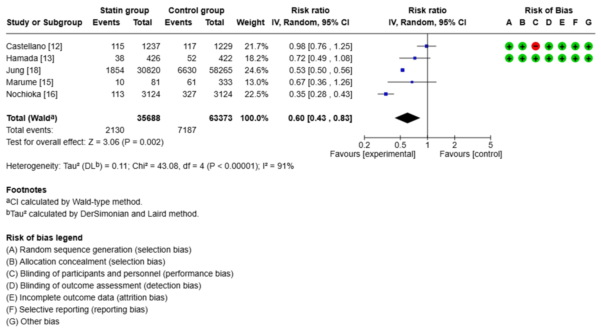
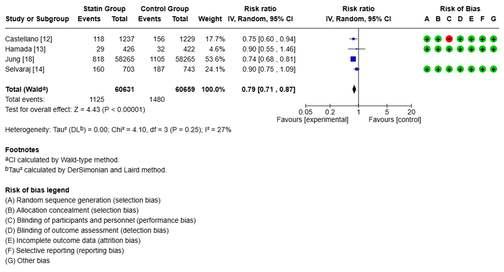
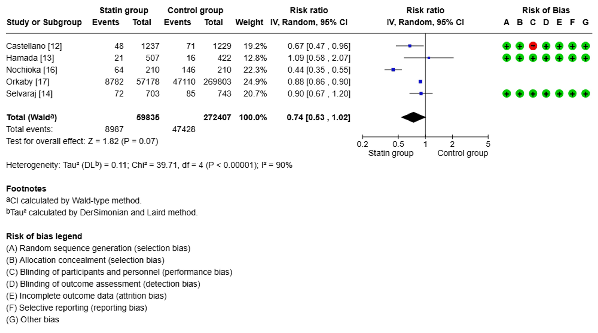
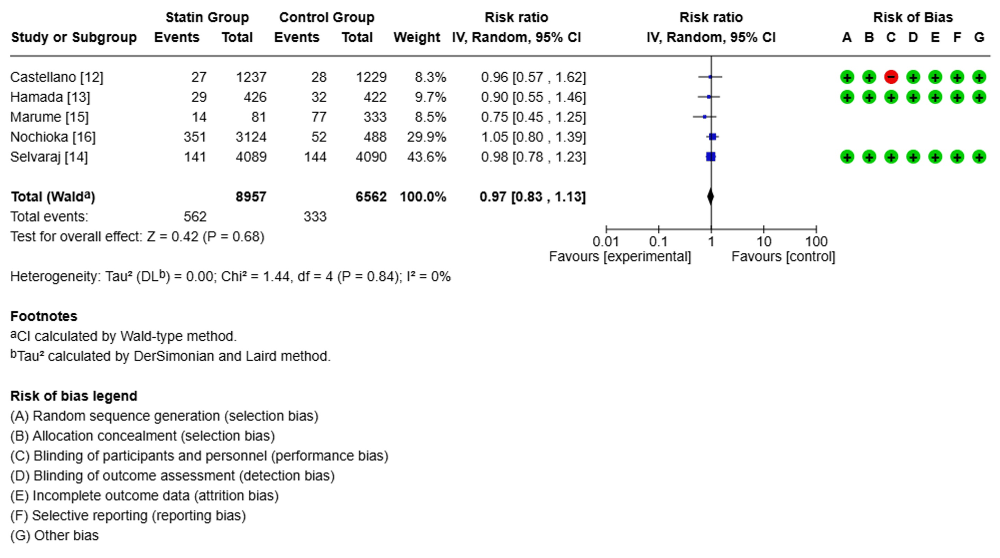

  

    

      
↓ 40%

      
Tử vong do mọi nguyên nhân (RR 0.60; P = 0.002)

    

    

      
↓ 21%

      
Biến cố Tim mạch Chính MACE (RR 0.79; P &lt; 0.00001)

    

    

      
RR 0.74

      
Tử vong Tim mạch (Xu hướng giảm 26%; P = 0.07)

    

    

      
RR 0.97

      
Tái nhập viện Tim mạch (P = 0.68; I² = 0%; Không đổi)

    

    

      
506,813

      
Tổng số bệnh nhân gộp (118K statin vs 388K chứng)

    

    

      
96.9%

      
Tỷ lệ nam giới trong quần thể phân tích

    

  

  

    

      
🏆

      

        
Giảm Mạnh Tử Vong Chung &amp; MACE

        
Statin làm giảm 40% nguy cơ tử vong mọi nguyên nhân (RR 0.60) và giảm 21% biến cố tim mạch chính MACE (RR 0.79, I² = 27%), xác lập lợi ích bảo vệ mạch máu nhất quán.

      

    

    

      
🏥

      

        
Giới Hạn Đối Với Tái Nhập Viện

        
Hoàn toàn không ghi nhận sự cải thiện đối với tỷ lệ tái nhập viện do tim mạch (RR 0.97; P = 0.68; I² = 0%) do sự chi phối của bệnh đồng mắc (suy tim, CKD) và tuân thủ điều trị.

      

    

    

      
🧬

      

        
Vai Trò Hiệu Ứng Pleiotropic

        
4 hiệu ứng ngoài lipid cốt lõi (kháng viêm CRP, tăng tiết NO nội mô, ổn định mảng xơ vữa và chống huyết khối) giúp bảo vệ toàn diện hệ tuần hoàn trước biến cố cấp tính.

      

    

  

  

    <a href="#sec-1" class="quickmenu-item active">1. Tổng Quan &amp; Dược Lý</a>
    <a href="#sec-2" class="quickmenu-item">2. PRISMA 2009 (Fig 1)</a>
    <a href="#sec-3" class="quickmenu-item">3. Đặc Điểm Quần Thể (Tab 1&amp;2)</a>
    <a href="#sec-4" class="quickmenu-item">4. Kết Quả 4 Kết Cục (Forest Plots)</a>
    <a href="#sec-5" class="quickmenu-item">5. Cơ Chế Pleiotropic</a>
    <a href="#sec-6" class="quickmenu-item">6. Bàn Luận Tái Nhập Viện</a>
    <a href="#sec-7" class="quickmenu-item">7. Đánh Giá &amp; Khuyến Nghị</a>
    <a href="#sec-8" class="quickmenu-item">8. Tài Liệu Gốc</a>
  

  <!-- ==================== SECTION 1 ==================== -->
  

    

      🔬
      <h2 class="sec-title">1. Tổng Quan Bối Cảnh, Cơ Sở Dược Lý Học &amp; Mục Tiêu Nghiên Cứu</h2>
    

    

      
      

        Bệnh tim mạch (Cardiovascular Diseases - CVD) vẫn là thách thức y tế công cộng nặng nề nhất trên toàn cầu, cướp đi sinh mạng của khoảng <strong>17.9 triệu người mỗi năm</strong>. Các bệnh lý tim mạch chính bao gồm bệnh mạch vành (CHD), bệnh mạch máu não (đột quỵ não) và bệnh động mạch ngoại biên (PAD).
      

      

        

          

          

            
🩸

            
Cơ Chế Sinh Bệnh Học: Xơ Vữa Động Mạch

          

          

            <ul style="margin-left: 1rem; line-height: 1.7;">
              <li><strong>Vữa xơ động mạch (Atherosclerosis)</strong> là con đường bệnh sinh nền tảng chung thúc đẩy hầu hết các biến cố tim mạch cấp tính đe dọa tính mạng.</li>
              <li>Quá trình này khởi phát từ sự tích tụ lipoprotein giàu cholesterol (đặc biệt là LDL bị oxy hóa) trong lớp nội mô thành mạch, kích hoạt phản ứng viêm và thâm nhiễm đại thực bào.</li>
              <li>Sự tiến triển làm hẹp lòng mạch hoặc nứt vỡ mảng xơ vữa mỏng, giải phóng các yếu tố mô kích hoạt dòng thác đông máu và tạo lập huyết khối cấp tắc nghẽn lòng mạch.</li>
            </ul>
          

          
Bệnh sinh trung tâm

        

        

          

          

            
💊

            
Dược Lý Học Lâm Sàng Của Statin

          

          

            <ul style="margin-left: 1rem; line-height: 1.7;">
              <li>Statin hoạt động thông qua việc <strong>ức chế cạnh tranh chọn lọc enzym HMG-CoA reductase</strong> (3-hydroxy-3-methylglutaryl-coenzyme A reductase) tại tế bào gan.</li>
              <li>Đây là enzym kiểm soát và giới hạn tốc độ của toàn bộ chuỗi phản ứng sinh tổng hợp cholesterol nội sinh tại gan.</li>
              <li>Sự sụt giảm cholesterol nội bào kích hoạt cơ chế feedback dương làm <strong>tăng mật độ thụ thể LDL (LDLR) trên bề mặt tế bào gan</strong>, đẩy mạnh thanh thải LDL-C và các hạt lipoprotein chứa ApoB khỏi tuần hoàn.</li>
            </ul>
          

          
Hạ LDL-C mạnh mẽ

        

      

      

        🎯
        

          <strong>Mục tiêu của nghiên cứu tổng quan hệ thống &amp; phân tích gộp (Cureus 2025):</strong> 
          Mặc dù hiệu quả của statin trong dự phòng biến cố tim mạch cấp 1 và cấp 2 đã được ghi nhận trong nhiều guideline quốc tế, <em>bằng chứng về tác động thực sự của statin đối với nguy cơ tái nhập viện do tim mạch vẫn còn nhiều mâu thuẫn và chưa thống nhất giữa các thử nghiệm lâm sàng</em>. Phân tích này được thực hiện nhằm trả lời dứt khoát 4 câu hỏi lượng giá:
          <ol style="margin-left: 1.25rem; margin-top: 0.4rem; line-height: 1.6;">
            <li>Statin có làm giảm <strong>Tử vong do mọi nguyên nhân (All-Cause Mortality)</strong> không?</li>
            <li>Statin có làm giảm <strong>Tử vong do nguyên nhân tim mạch (CV Mortality)</strong> không?</li>
            <li>Statin bảo vệ chống <strong>Biến cố tim mạch chính (MACE)</strong> ở mức độ nào?</li>
            <li>Statin có thực sự làm giảm tỷ lệ <strong>Tái nhập viện do tim mạch (CV Hospitalization)</strong> trong đời thực hay không?</li>
          </ol>
        

      

    

  

  <!-- ==================== SECTION 2 ==================== -->
  

    

      📑
      <h2 class="sec-title">2. Phương Pháp Nghiên Cứu, Tiêu Chuẩn Lựa Chọn &amp; Lưu Đồ PRISMA 2009 (Figure 1)</h2>
    

    

      
      

        Nghiên cứu tuân thủ nghiêm ngặt theo Hướng dẫn Báo cáo Đánh giá Hệ thống và Phân tích Tổng hợp <strong>PRISMA 2009</strong>. Quy trình tìm kiếm và tuyển chọn được chuẩn hóa theo các tiêu chí lâm sàng định trước.
      

      

        <table class="regimen-table">
          <thead>
            <tr>
              <th style="width: 25%;">Thành tố phương pháp</th>
              <th style="width: 75%;">Chi tiết quy chuẩn trong nghiên cứu (Cureus 2025)</th>
            </tr>
          </thead>
          <tbody>
            <tr>
              <td class="source-cell">Cơ sở dữ liệu</td>
              <td>Tra cứu toàn diện trên <strong>PubMed, Google Scholar và Cochrane Central Register of Controlled Trials</strong> trong giai đoạn từ năm <strong>2013 đến 2024</strong>.</td>
            </tr>
            <tr>
              <td class="source-cell">Thuật ngữ tìm kiếm</td>
              <td>Kết hợp giữa các từ khóa suy tim (<em>heart failure, HF, HFpEF, HFrEF, HFmrEF</em>), liệu pháp statin (<em>statin, lipid-lowering therapy, atorvastatin, rosuvastatin, pitavastatin, simvastatin</em>) và kết cục lâm sàng (<em>all-cause mortality, CV mortality, hospitalizations</em>).</td>
            </tr>
            <tr>
              <td class="source-cell">Tiêu chuẩn nhận bệnh (Inclusion)</td>
              <td>
                • Đối tượng: Người trưởng thành ≥ 18 tuổi có yếu tố nguy cơ tim mạch hoặc bệnh tim mạch đã xác lập. 
                • Thiết kế: Thử nghiệm lâm sàng ngẫu nhiên có đối chứng (RCT), đoàn hệ tiến cứu hoặc đoàn hệ hồi cứu. 
                • Can thiệp &amp; Đối chứng: Dùng statin so sánh trực tiếp với giả dược, không dùng statin hoặc không điều trị. 
                • Cỡ mẫu tối thiểu: <strong>≥ 50 người tham gia</strong>. Thời gian theo dõi: <strong>Tối thiểu ≥ 12 tháng</strong>. 
                • Báo cáo đầy đủ ít nhất 1 trong 4 kết cục chính: Tử vong mọi nguyên nhân, tử vong tim mạch, MACE, tái nhập viện.
              </td>
            </tr>
            <tr>
              <td class="source-cell">Tiêu chuẩn loại trừ (Exclusion)</td>
              <td>Báo cáo ca bệnh, loạt ca, bài tổng quan, thư biên tập, nghiên cứu nhi khoa, bệnh lý phi tim mạch, và nghiên cứu có thời gian theo dõi &lt; 12 tháng.</td>
            </tr>
            <tr>
              <td class="source-cell">Đánh giá sai lệch (Risk of Bias)</td>
              <td>
                • Thử nghiệm RCT: Sử dụng <strong>Cochrane Risk-of-Bias Tool</strong> (7 tên miền sai lệch). 
                • Nghiên cứu quan sát: Sử dụng thang điểm <strong>Newcastle-Ottawa Scale (NOS)</strong> (Tuyển chọn, Đồng nhất, Kết cục).
              </td>
            </tr>
          </tbody>
        </table>
      

      <h3 class="sec-subtitle" style="margin-top: 1.5rem;">Lưu Đồ Quy Trình Tuyển Chọn Nghiên Cứu PRISMA (Figure 1 Reconstructed)</h3>

      

        

          
          <!-- Box 1: Identification -->
          

            
TỔNG SỐ BẢN GHI TÌM KIẾM HỆ THỐNG BAN ĐẦU (N = 621)

            

              Cơ sở dữ liệu điện tử (N = 611): PubMed (460), Cochrane Central (121), Google Scholar (30) 
              Nguồn bổ sung khác (N = 10): Tra cứu thư mục thủ công, Kỷ yếu hội nghị (ESC, AHA, ACC)
            

          

          
↓

          <!-- Box 2: Duplicate removal -->
          

            <strong>Loại bỏ bản ghi trùng lặp (N = 29)</strong> → Còn lại <strong>592 bản ghi</strong> sàng lọc
          

          
↓

          <!-- Box 3: Screening -->
          

            

              <strong style="color: #16a34a;">Đánh giá toàn văn (Full-Text)</strong> 
              <strong>N = 50 bài báo</strong> được tải toàn văn
            

            

              <strong>Loại qua Tiêu đề &amp; Tóm tắt</strong> 
              <strong>N = 542 bài báo</strong> không phù hợp
            

          

          
↓

          <!-- Box 4: Eligibility Exclusions -->
          

            

              
NGHIÊN CỨU ĐƯỢC TUYỂN CHỌN

              
N = 7 Nghiên Cứu

              
(Tổng cộng 506,813 Bệnh nhân)

            

            

              <strong>Loại bỏ sau đánh giá toàn văn (N = 43):</strong> 
              • Không có nhóm đối chứng: n = 15 
              • Cỡ mẫu quá nhỏ (&lt; 50 BN): n = 10 
              • Dữ liệu thiếu / không đầy đủ: n = 11 
              • Thời gian theo dõi ngắn (&lt; 12 tháng): n = 7
            

          

        

      

    

  

  <!-- ==================== SECTION 3 ==================== -->
  

    

      👥
      <h2 class="sec-title">3. Đặc Điểm Chi Tiết 7 Nghiên Cứu Tuyển Chọn &amp; Quần Thể 506K Bệnh Nhân (Tables 1 &amp; 2)</h2>
    

    

      
      

        Tổng cộng có <strong>506,813 bệnh nhân</strong> từ 7 nghiên cứu đủ tiêu chuẩn được đưa vào phân tích tổng hợp. Trong đó có <strong>118,491 bệnh nhân thuộc nhóm can thiệp sử dụng statin</strong> và <strong>388,322 bệnh nhân thuộc nhóm chứng không sử dụng statin</strong>. Thời gian theo dõi trung bình của toàn bộ phân tích gộp đạt <strong>3.7 năm</strong> (dao động từ 2 năm đến 6 năm 8 tháng).
      

      <h3 class="sec-subtitle">Bảng 1: Các Đặc Điểm Thiết Kế Chính Của 7 Nghiên Cứu Đưa Vào Phân Tích Gộp</h3>
      

        <table class="regimen-table">
          <thead>
            <tr>
              <th style="width: 17%;">Nghiên cứu / Năm</th>
              <th style="width: 10%; text-align: center;">Quốc gia</th>
              <th style="width: 11%; text-align: center;">Thiết kế</th>
              <th style="width: 18%;">Tiêu chuẩn nhận bệnh</th>
              <th style="width: 14%;">Statin can thiệp</th>
              <th style="width: 16%;">Tiêu chí đánh giá chính</th>
              <th style="width: 14%;">Hạn chế chính</th>
            </tr>
          </thead>
          <tbody>
            <tr>
              <td class="source-cell"><strong>Castellano et al., 2022</strong></td>
              <td style="text-align: center;">Châu Âu</td>
              <td style="text-align: center;">RCT</td>
              <td>Bệnh nhân sau nhồi máu cơ tim (Post-MI)</td>
              <td>Atorvastatin <em>(Polypill)</em></td>
              <td>Tử vong mọi nguyên nhân, tử vong tim mạch, MACE</td>
              <td>Không phân tầng theo liều/hoạt lực statin; thiếu số liệu CKD.</td>
            </tr>
            <tr>
              <td class="source-cell"><strong>Hamada et al., 2023</strong></td>
              <td style="text-align: center;">Nhật Bản</td>
              <td style="text-align: center;">RCT</td>
              <td>Chạy thận nhân tạo chu kỳ kèm rối loạn lipid máu</td>
              <td>Pitavastatin</td>
              <td>Tử vong mọi nguyên nhân, tử vong CV, MACE, tái nhập viện CV</td>
              <td>Cỡ mẫu nhỏ; khó khái quát cho người không chạy thận.</td>
            </tr>
            <tr>
              <td class="source-cell"><strong>Selvaraj et al., 2022</strong></td>
              <td style="text-align: center;">Hoa Kỳ</td>
              <td style="text-align: center;">RCT</td>
              <td>Có/không có suy tim và có tiền sử rung nhĩ</td>
              <td>Statin tiêu chuẩn <em>(vs Icosapent ethyl)</em></td>
              <td>Tử vong tim mạch, MACE, tái nhập viện do tim mạch</td>
              <td>Statin không đồng nhất; theo dõi ngắn; loại statin ít phổ biến.</td>
            </tr>
            <tr>
              <td class="source-cell"><strong>Marume et al., 2019</strong></td>
              <td style="text-align: center;">Nhật Bản</td>
              <td style="text-align: center;">Đoàn hệ tiến cứu</td>
              <td>Suy tim cấp không kèm bệnh động mạch vành</td>
              <td>Không chỉ rõ loại statin</td>
              <td>Tử vong mọi nguyên nhân, tái nhập viện do tim mạch</td>
              <td>Cỡ mẫu rất nhỏ (112 BN); không báo cáo loại/liều statin.</td>
            </tr>
            <tr>
              <td class="source-cell"><strong>Nochioka et al., 2015</strong></td>
              <td style="text-align: center;">Nhật Bản</td>
              <td style="text-align: center;">Đoàn hệ tiến cứu</td>
              <td>Suy tim phân suất tống máu bảo tồn (HFpEF)</td>
              <td>Không chỉ rõ loại statin</td>
              <td>Tử vong mọi nguyên nhân, tử vong CV, tái nhập viện CV</td>
              <td>Thiết kế quan sát; thiếu thông tin loại và cường độ statin.</td>
            </tr>
            <tr>
              <td class="source-cell"><strong>Orkaby et al., 2020</strong></td>
              <td style="text-align: center;">Hoa Kỳ</td>
              <td style="text-align: center;">Đoàn hệ hồi cứu</td>
              <td>Cựu chiến binh ≥ 75 tuổi không có ASCVD ban đầu</td>
              <td>Bất kỳ đơn kê statin mới nào</td>
              <td>Tử vong mọi nguyên nhân, tử vong tim mạch, MACE</td>
              <td>97.3% nam giới; nguy cơ sai số do yếu tố nhiễu tồn dư cao.</td>
            </tr>
            <tr>
              <td class="source-cell"><strong>Jung et al., 2021</strong></td>
              <td style="text-align: center;">Hàn Quốc</td>
              <td style="text-align: center;">Đoàn hệ hồi cứu</td>
              <td>Người có nguy cơ tim mạch được dự báo trước</td>
              <td>Không chỉ rõ loại statin</td>
              <td>Tử vong do mọi nguyên nhân, MACE</td>
              <td>Thiếu dữ liệu về BMI và CKD; thiếu hiệu chỉnh lối sống.</td>
            </tr>
          </tbody>
        </table>
      

      <h3 class="sec-subtitle" style="margin-top: 1.75rem;">Bảng 2: Đặc Điểm Lâm Sàng Nền Của Quần Thể Bệnh Nhân Trong Từng Nghiên Cứu</h3>
      

        <table class="regimen-table">
          <thead>
            <tr>
              <th style="width: 20%;">Nghiên cứu / Năm</th>
              <th style="width: 8%; text-align: center;">Nhóm</th>
              <th style="width: 11%; text-align: center;">Số lượng (N)</th>
              <th style="width: 13%; text-align: center;">Tuổi (Năm)</th>
              <th style="width: 12%; text-align: center;">BMI (kg/m²)</th>
              <th style="width: 9%; text-align: center;">Nam (%)</th>
              <th style="width: 9%; text-align: center;">THA (%)</th>
              <th style="width: 9%; text-align: center;">ĐTĐ (%)</th>
              <th style="width: 9%; text-align: center;">CKD (%)</th>
            </tr>
          </thead>
          <tbody>
            <tr>
              <td rowspan="2" class="source-cell"><strong>Castellano et al., 2022</strong></td>
              <td style="text-align: center; color: #16a34a; font-weight: bold;">S</td>
              <td style="text-align: center;">1,237</td>
              <td style="text-align: center;">75.8 ± 6.7</td>
              <td style="text-align: center;">27.4 ± 4.4</td>
              <td style="text-align: center;">69.0%</td>
              <td style="text-align: center;">77.0%</td>
              <td style="text-align: center;">42.0%</td>
              <td style="text-align: center; color: #94a3b8;">NR</td>
            </tr>
            <tr>
              <td style="text-align: center; color: #64748b;">C</td>
              <td style="text-align: center;">1,229</td>
              <td style="text-align: center;">76.1 ± 6.5</td>
              <td style="text-align: center;">27.5 ± 4.3</td>
              <td style="text-align: center;">69.0%</td>
              <td style="text-align: center;">78.8%</td>
              <td style="text-align: center;">43.2%</td>
              <td style="text-align: center; color: #94a3b8;">NR</td>
            </tr>

            <tr>
              <td rowspan="2" class="source-cell"><strong>Hamada et al., 2023</strong></td>
              <td style="text-align: center; color: #16a34a; font-weight: bold;">S</td>
              <td style="text-align: center;">426</td>
              <td style="text-align: center;">61.0 ± 10.8</td>
              <td style="text-align: center; color: #94a3b8;">NR</td>
              <td style="text-align: center;">60.0%</td>
              <td style="text-align: center;">88.2%</td>
              <td style="text-align: center; color: #94a3b8;">NR</td>
              <td style="text-align: center; color: #94a3b8;">NR</td>
            </tr>
            <tr>
              <td style="text-align: center; color: #64748b;">C</td>
              <td style="text-align: center;">422</td>
              <td style="text-align: center;">59.7 ± 11.0</td>
              <td style="text-align: center; color: #94a3b8;">NR</td>
              <td style="text-align: center;">61.4%</td>
              <td style="text-align: center;">93.3%</td>
              <td style="text-align: center; color: #94a3b8;">NR</td>
              <td style="text-align: center; color: #94a3b8;">NR</td>
            </tr>

            <tr>
              <td rowspan="2" class="source-cell"><strong>Selvaraj et al., 2022</strong></td>
              <td style="text-align: center; color: #16a34a; font-weight: bold;">S</td>
              <td style="text-align: center;">703</td>
              <td style="text-align: center;">63.0</td>
              <td style="text-align: center;">31.0</td>
              <td style="text-align: center;">69.3%</td>
              <td style="text-align: center;">93.7%</td>
              <td style="text-align: center;">53.9%</td>
              <td style="text-align: center;">27.0%</td>
            </tr>
            <tr>
              <td style="text-align: center; color: #64748b;">C</td>
              <td style="text-align: center;">743</td>
              <td style="text-align: center;">63.0</td>
              <td style="text-align: center;">31.0</td>
              <td style="text-align: center;">69.3%</td>
              <td style="text-align: center;">85.1%</td>
              <td style="text-align: center;">58.7%</td>
              <td style="text-align: center;">21.2%</td>
            </tr>

            <tr>
              <td rowspan="2" class="source-cell"><strong>Marume et al., 2019</strong></td>
              <td style="text-align: center; color: #16a34a; font-weight: bold;">S</td>
              <td style="text-align: center;">56</td>
              <td style="text-align: center;">78.0 ± 9.0</td>
              <td style="text-align: center;">24.6 ± 4.4</td>
              <td style="text-align: center;">19.0%</td>
              <td style="text-align: center;">89.0%</td>
              <td style="text-align: center;">36.0%</td>
              <td style="text-align: center; color: #94a3b8;">NR</td>
            </tr>
            <tr>
              <td style="text-align: center; color: #64748b;">C</td>
              <td style="text-align: center;">56</td>
              <td style="text-align: center;">76.0 ± 10.0</td>
              <td style="text-align: center;">24.6 ± 5.3</td>
              <td style="text-align: center;">22.0%</td>
              <td style="text-align: center;">86.0%</td>
              <td style="text-align: center;">36.0%</td>
              <td style="text-align: center; color: #94a3b8;">NR</td>
            </tr>

            <tr>
              <td rowspan="2" class="source-cell"><strong>Nochioka et al., 2015</strong></td>
              <td style="text-align: center; color: #16a34a; font-weight: bold;">S</td>
              <td style="text-align: center;">626</td>
              <td style="text-align: center;">69.4 ± 11.2</td>
              <td style="text-align: center;">24.2 ± 3.6</td>
              <td style="text-align: center;">65.5%</td>
              <td style="text-align: center;">82.7%</td>
              <td style="text-align: center;">28.9%</td>
              <td style="text-align: center; color: #94a3b8;">NR</td>
            </tr>
            <tr>
              <td style="text-align: center; color: #64748b;">C</td>
              <td style="text-align: center;">626</td>
              <td style="text-align: center;">70.0 ± 11.9</td>
              <td style="text-align: center;">24.2 ± 4.1</td>
              <td style="text-align: center;">67.0%</td>
              <td style="text-align: center;">80.7%</td>
              <td style="text-align: center;">26.0%</td>
              <td style="text-align: center; color: #94a3b8;">NR</td>
            </tr>

            <tr>
              <td rowspan="2" class="source-cell"><strong>Orkaby et al., 2020</strong></td>
              <td style="text-align: center; color: #16a34a; font-weight: bold;">S</td>
              <td style="text-align: center;">57,178</td>
              <td style="text-align: center;">81.1 ± 4.1</td>
              <td style="text-align: center;">27.4 ± 3.6</td>
              <td style="text-align: center;">97.3%</td>
              <td style="text-align: center;">77.8%</td>
              <td style="text-align: center;">23.4%</td>
              <td style="text-align: center;">1.9%</td>
            </tr>
            <tr>
              <td style="text-align: center; color: #64748b;">C</td>
              <td style="text-align: center;">326,981</td>
              <td style="text-align: center;">81.5 ± 1.5</td>
              <td style="text-align: center;">27.4 ± 1.6</td>
              <td style="text-align: center;">97.3%</td>
              <td style="text-align: center;">77.8%</td>
              <td style="text-align: center;">23.4%</td>
              <td style="text-align: center;">1.9%</td>
            </tr>

            <tr>
              <td rowspan="2" class="source-cell"><strong>Jung et al., 2021</strong></td>
              <td style="text-align: center; color: #16a34a; font-weight: bold;">S</td>
              <td style="text-align: center;">58,265</td>
              <td style="text-align: center;">59.2 ± 9.0</td>
              <td style="text-align: center; color: #94a3b8;">NR</td>
              <td style="text-align: center;">45.5%</td>
              <td style="text-align: center;">69.2%</td>
              <td style="text-align: center;">28.7%</td>
              <td style="text-align: center; color: #94a3b8;">NR</td>
            </tr>
            <tr>
              <td style="text-align: center; color: #64748b;">C</td>
              <td style="text-align: center;">58,265</td>
              <td style="text-align: center;">58.2 ± 9.1</td>
              <td style="text-align: center; color: #94a3b8;">NR</td>
              <td style="text-align: center;">46.2%</td>
              <td style="text-align: center;">39.7%</td>
              <td style="text-align: center;">13.7%</td>
              <td style="text-align: center; color: #94a3b8;">NR</td>
            </tr>
          </tbody>
        </table>
      

      

        <em>*Chú thích: S = Nhóm can thiệp Statin; C = Nhóm chứng (Control); NR = Không báo cáo (Not Reported); THA = Tăng huyết áp; ĐTĐ = Đái tháo đường; CKD = Bệnh thận mạn.</em>
      

    

  

  <!-- ==================== SECTION 4 ==================== -->
  

    

      📊
      <h2 class="sec-title">4. Kết Quả Định Lượng Phân Tích Gộp &amp; 4 Biểu Đồ Forest Plot Trực Quan</h2>
    

    

      
      

        Phân tích gộp đánh giá tác động của statin trên 4 tiêu chí lâm sàng độc lập, thể hiện sự tương phản rõ rệt giữa khả năng giảm biến cố tử vong/xơ vữa và tỷ lệ tái nhập viện:
      

      <!-- KẾT CỤC 1: TỬ VONG MỌI NGUYÊN NHÂN -->
      <h3 class="sec-subtitle">A. Tử Vong Do Mọi Nguyên Nhân (All-Cause Mortality) — Giảm 40% (P = 0.002)</h3>
      

        Liệu pháp statin giúp <strong>giảm 40% nguy cơ tử vong do mọi nguyên nhân</strong> một cách có ý nghĩa thống kê: <strong>RR = 0.60 (95% CI: 0.43–0.83; P = 0.002)</strong>. Mức độ không đồng nhất cao (I² = 91%) phản ánh sự đa dạng về mức độ nguy cơ tim mạch nền giữa các nghiên cứu.
      

      

        <table class="regimen-table">
          <thead>
            <tr>
              <th>Nghiên cứu</th>
              <th style="text-align: center;">Nhóm Statin (Biến cố/Tổng)</th>
              <th style="text-align: center;">Nhóm Chứng (Biến cố/Tổng)</th>
              <th style="text-align: center;">Trọng số (Weight)</th>
              <th style="text-align: center;">Risk Ratio [95% CI]</th>
              <th style="text-align: center;">Đánh giá RoB</th>
            </tr>
          </thead>
          <tbody>
            <tr>
              <td>Castellano 2022</td>
              <td style="text-align: center;">115 / 1237</td>
              <td style="text-align: center;">117 / 1229</td>
              <td style="text-align: center;">21.7%</td>
              <td style="text-align: center;">0.98 [0.76, 1.25]</td>
              <td style="text-align: center;">High (Open-label)</td>
            </tr>
            <tr>
              <td>Hamada 2023</td>
              <td style="text-align: center;">38 / 426</td>
              <td style="text-align: center;">52 / 422</td>
              <td style="text-align: center;">18.2%</td>
              <td style="text-align: center;">0.72 [0.49, 1.08]</td>
              <td style="text-align: center;">Low RoB</td>
            </tr>
            <tr>
              <td>Jung 2021</td>
              <td style="text-align: center;">1854 / 30820</td>
              <td style="text-align: center;">6630 / 58265</td>
              <td style="text-align: center;">24.6%</td>
              <td style="text-align: center; font-weight: bold; color: #16a34a;">0.53 [0.50, 0.56]</td>
              <td style="text-align: center;">Good (NOS)</td>
            </tr>
            <tr>
              <td>Marume 2019</td>
              <td style="text-align: center;">10 / 81</td>
              <td style="text-align: center;">61 / 333</td>
              <td style="text-align: center;">13.0%</td>
              <td style="text-align: center;">0.67 [0.36, 1.26]</td>
              <td style="text-align: center;">Good (NOS)</td>
            </tr>
            <tr>
              <td>Nochioka 2015</td>
              <td style="text-align: center;">113 / 3124</td>
              <td style="text-align: center;">327 / 3124</td>
              <td style="text-align: center;">22.5%</td>
              <td style="text-align: center; font-weight: bold; color: #16a34a;">0.35 [0.28, 0.43]</td>
              <td style="text-align: center;">Good (NOS)</td>
            </tr>
            <tr style="background: var(--color-surface-2, rgba(0,0,0,0.03)); font-weight: bold;">
              <td>TỔNG GỘP (Total Wald)</td>
              <td style="text-align: center; color: #16a34a;">2,130 / 35,688</td>
              <td style="text-align: center; color: #dc2626;">7,187 / 63,373</td>
              <td style="text-align: center;">100.0%</td>
              <td style="text-align: center; font-size: 1rem; color: #16a34a;">0.60 [0.43, 0.83]</td>
              <td style="text-align: center;">Z = 3.06 (P = 0.002)</td>
            </tr>
          </tbody>
        </table>
      

      

        
        

          
Figure 2. Biểu Đồ Forest Plot So Sánh Tử Vong Do Mọi Nguyên Nhân Giữa Nhóm Statin và Nhóm Đối Chứng

          Mô hình hiệu ứng ngẫu nhiên (Random-effects IV). Hình thoi tổng hợp nằm hoàn toàn về phía bên trái đường vô hiệu (RR = 0.60; P = 0.002), xác nhận statin giảm 40% tử vong chung. Thang điểm Risk of Bias của các nghiên cứu hiển thị chi tiết ở cột bên phải.
        

      

      <!-- KẾT CỤC 2: MACE -->
      <h3 class="sec-subtitle" style="margin-top: 2rem;">B. Biến Cố Tim Mạch Chính (MACE) — Giảm 21% Nhất Quán (P &lt; 0.00001, I² = 27%)</h3>
      

        Statin gắn liền với mức <strong>giảm 21% nguy cơ biến cố tim mạch chính</strong> (nhồi máu cơ tim, đột quỵ, tái thông mạch và tử vong tim mạch): <strong>RR = 0.79 (95% CI: 0.71–0.87; P &lt; 0.00001)</strong>. Đặc biệt, độ không đồng nhất rất thấp (I² = 27%), chứng minh hiệu quả ngăn ngừa biến cố mạch máu xơ vữa của statin là vô cùng ổn định.
      

      

        <table class="regimen-table">
          <thead>
            <tr>
              <th>Nghiên cứu</th>
              <th style="text-align: center;">Nhóm Statin (Biến cố/Tổng)</th>
              <th style="text-align: center;">Nhóm Chứng (Biến cố/Tổng)</th>
              <th style="text-align: center;">Trọng số (Weight)</th>
              <th style="text-align: center;">Risk Ratio [95% CI]</th>
              <th style="text-align: center;">Hiệu ứng lâm sàng</th>
            </tr>
          </thead>
          <tbody>
            <tr>
              <td>Castellano 2022</td>
              <td style="text-align: center;">118 / 1237</td>
              <td style="text-align: center;">156 / 1229</td>
              <td style="text-align: center;">17.7%</td>
              <td style="text-align: center; font-weight: bold; color: #16a34a;">0.75 [0.60, 0.94]</td>
              <td style="text-align: center;">Giảm 25% MACE</td>
            </tr>
            <tr>
              <td>Hamada 2023</td>
              <td style="text-align: center;">29 / 426</td>
              <td style="text-align: center;">32 / 422</td>
              <td style="text-align: center;">4.6%</td>
              <td style="text-align: center;">0.90 [0.55, 1.46]</td>
              <td style="text-align: center;">Tương đương</td>
            </tr>
            <tr>
              <td>Jung 2021</td>
              <td style="text-align: center;">818 / 58265</td>
              <td style="text-align: center;">1105 / 58265</td>
              <td style="text-align: center; font-weight: bold;">53.6%</td>
              <td style="text-align: center; font-weight: bold; color: #16a34a;">0.74 [0.68, 0.81]</td>
              <td style="text-align: center;">Giảm 26% MACE</td>
            </tr>
            <tr>
              <td>Selvaraj 2022</td>
              <td style="text-align: center;">160 / 703</td>
              <td style="text-align: center;">187 / 743</td>
              <td style="text-align: center;">24.1%</td>
              <td style="text-align: center;">0.90 [0.75, 1.09]</td>
              <td style="text-align: center;">Tương đương</td>
            </tr>
            <tr style="background: var(--color-surface-2, rgba(0,0,0,0.03)); font-weight: bold;">
              <td>TỔNG GỘP (Total Wald)</td>
              <td style="text-align: center; color: #16a34a;">1,125 / 60,631</td>
              <td style="text-align: center; color: #dc2626;">1,480 / 60,659</td>
              <td style="text-align: center;">100.0%</td>
              <td style="text-align: center; font-size: 1rem; color: #16a34a;">0.79 [0.71, 0.87]</td>
              <td style="text-align: center; color: #16a34a;">P &lt; 0.00001 (I² = 27%)</td>
            </tr>
          </tbody>
        </table>
      

      

        
        

          
Figure 4. Biểu Đồ Forest Plot Đánh Giá Biến Cố Tim Mạch Chính (MACE)

          Hiệu quả giảm 21% nguy cơ MACE có ý nghĩa cực kỳ cao (Z = 4.43; P &lt; 0.00001) với độ không đồng nhất rất thấp (I² = 27%, Chi² = 4.10, df = 3).
        

      

      <!-- KẾT CỤC 3: TỬ VONG TIM MẠCH -->
      <h3 class="sec-subtitle" style="margin-top: 2rem;">C. Tử Vong Do Nguyên Nhân Tim Mạch (Cardiovascular Mortality) — Xu Hướng Giảm 26% (P = 0.07)</h3>
      

        Ghi nhận xu hướng giảm 26% tử vong tim mạch ở nhóm dùng statin: <strong>RR = 0.74 (95% CI: 0.53–1.02; P = 0.07)</strong>. Kết quả chưa đạt ý nghĩa thống kê do khoảng tin cậy đi qua 1.0 và tính không đồng nhất cao (I² = 90%), chi phối bởi sự khác biệt lớn giữa nghiên cứu Nochioka (giảm 56%) và Hamada (không giảm).
      

      

        <table class="regimen-table">
          <thead>
            <tr>
              <th>Nghiên cứu</th>
              <th style="text-align: center;">Nhóm Statin (Biến cố/Tổng)</th>
              <th style="text-align: center;">Nhóm Chứng (Biến cố/Tổng)</th>
              <th style="text-align: center;">Trọng số (Weight)</th>
              <th style="text-align: center;">Risk Ratio [95% CI]</th>
              <th style="text-align: center;">Hiệu ứng lâm sàng</th>
            </tr>
          </thead>
          <tbody>
            <tr>
              <td>Castellano 2022</td>
              <td style="text-align: center;">48 / 1237</td>
              <td style="text-align: center;">71 / 1229</td>
              <td style="text-align: center;">19.2%</td>
              <td style="text-align: center; font-weight: bold; color: #16a34a;">0.67 [0.47, 0.96]</td>
              <td style="text-align: center;">Giảm 33%</td>
            </tr>
            <tr>
              <td>Hamada 2023</td>
              <td style="text-align: center;">21 / 507</td>
              <td style="text-align: center;">16 / 422</td>
              <td style="text-align: center;">12.8%</td>
              <td style="text-align: center;">1.09 [0.58, 2.07]</td>
              <td style="text-align: center;">Tương đương</td>
            </tr>
            <tr>
              <td>Nochioka 2015</td>
              <td style="text-align: center;">64 / 210</td>
              <td style="text-align: center;">146 / 210</td>
              <td style="text-align: center;">22.3%</td>
              <td style="text-align: center; font-weight: bold; color: #16a34a;">0.44 [0.35, 0.55]</td>
              <td style="text-align: center;">Giảm 56%</td>
            </tr>
            <tr>
              <td>Orkaby 2020</td>
              <td style="text-align: center;">8782 / 57178</td>
              <td style="text-align: center;">47110 / 269803</td>
              <td style="text-align: center; font-weight: bold;">24.9%</td>
              <td style="text-align: center; font-weight: bold; color: #16a34a;">0.88 [0.86, 0.90]</td>
              <td style="text-align: center;">Giảm 12%</td>
            </tr>
            <tr>
              <td>Selvaraj 2022</td>
              <td style="text-align: center;">72 / 703</td>
              <td style="text-align: center;">85 / 743</td>
              <td style="text-align: center;">20.7%</td>
              <td style="text-align: center;">0.90 [0.67, 1.20]</td>
              <td style="text-align: center;">Tương đương</td>
            </tr>
            <tr style="background: var(--color-surface-2, rgba(0,0,0,0.03)); font-weight: bold;">
              <td>TỔNG GỘP (Total Wald)</td>
              <td style="text-align: center;">8,987 / 59,835</td>
              <td style="text-align: center;">47,428 / 272,407</td>
              <td style="text-align: center;">100.0%</td>
              <td style="text-align: center; font-size: 1rem; color: #0284c7;">0.74 [0.53, 1.02]</td>
              <td style="text-align: center;">Z = 1.82 (P = 0.07; I² = 90%)</td>
            </tr>
          </tbody>
        </table>
      

      

        
        

          
Figure 3. Biểu Đồ Forest Plot Đánh Giá Tử Vong Do Nguyên Nhân Tim Mạch

          Hình thoi gộp nằm chếch sang trái nhưng chạm đường vô hiệu (RR = 0.74; 95% CI: 0.53–1.02; P = 0.07).
        

      

      <!-- KẾT CỤC 4: TÁI NHẬP VIỆN TIM MẠCH -->
      <h3 class="sec-subtitle" style="margin-top: 2rem;">D. Tái Nhập Viện Do Tim Mạch (Cardiovascular Hospitalization) — Hoàn Toàn Không Đổi (RR 0.97; P = 0.68; I² = 0%)</h3>
      

        Liệu pháp statin <strong>hoàn toàn không đem lại sự thay đổi có ý nghĩa thống kê</strong> đối với tỷ lệ tái nhập viện: <strong>RR = 0.97 (95% CI: 0.83–1.13; P = 0.68)</strong>. Điểm ấn tượng nhất là tính đồng nhất tuyệt đối giữa các nghiên cứu (<strong>I² = 0%</strong>), khẳng định sự thất bại của statin trên tiêu chí này là một phát hiện chân thực.
      

      

        <table class="regimen-table">
          <thead>
            <tr>
              <th>Nghiên cứu</th>
              <th style="text-align: center;">Nhóm Statin (Biến cố/Tổng)</th>
              <th style="text-align: center;">Nhóm Chứng (Biến cố/Tổng)</th>
              <th style="text-align: center;">Trọng số (Weight)</th>
              <th style="text-align: center;">Risk Ratio [95% CI]</th>
              <th style="text-align: center;">Kết luận</th>
            </tr>
          </thead>
          <tbody>
            <tr>
              <td>Castellano 2022</td>
              <td style="text-align: center;">27 / 1237</td>
              <td style="text-align: center;">28 / 1229</td>
              <td style="text-align: center;">8.3%</td>
              <td style="text-align: center;">0.96 [0.57, 1.62]</td>
              <td style="text-align: center;">Không khác biệt</td>
            </tr>
            <tr>
              <td>Hamada 2023</td>
              <td style="text-align: center;">29 / 426</td>
              <td style="text-align: center;">32 / 422</td>
              <td style="text-align: center;">9.7%</td>
              <td style="text-align: center;">0.90 [0.55, 1.46]</td>
              <td style="text-align: center;">Không khác biệt</td>
            </tr>
            <tr>
              <td>Marume 2019</td>
              <td style="text-align: center;">14 / 81</td>
              <td style="text-align: center;">77 / 333</td>
              <td style="text-align: center;">8.5%</td>
              <td style="text-align: center;">0.75 [0.45, 1.25]</td>
              <td style="text-align: center;">Không khác biệt</td>
            </tr>
            <tr>
              <td>Nochioka 2015</td>
              <td style="text-align: center;">351 / 3124</td>
              <td style="text-align: center;">52 / 488</td>
              <td style="text-align: center;">29.9%</td>
              <td style="text-align: center;">1.05 [0.80, 1.39]</td>
              <td style="text-align: center;">Không khác biệt</td>
            </tr>
            <tr>
              <td>Selvaraj 2022</td>
              <td style="text-align: center;">141 / 4089</td>
              <td style="text-align: center;">144 / 4090</td>
              <td style="text-align: center; font-weight: bold;">43.6%</td>
              <td style="text-align: center;">0.98 [0.78, 1.23]</td>
              <td style="text-align: center;">Không khác biệt</td>
            </tr>
            <tr style="background: var(--color-surface-2, rgba(0,0,0,0.03)); font-weight: bold;">
              <td>TỔNG GỘP (Total Wald)</td>
              <td style="text-align: center;">562 / 8,957</td>
              <td style="text-align: center;">333 / 6,562</td>
              <td style="text-align: center;">100.0%</td>
              <td style="text-align: center; font-size: 1rem; color: #dc2626;">0.97 [0.83, 1.13]</td>
              <td style="text-align: center; color: #dc2626;">P = 0.68 (I² = 0.0%)</td>
            </tr>
          </tbody>
        </table>
      

      

        
        

          
Figure 5. Biểu Đồ Forest Plot Đánh Giá Tỷ Lệ Tái Nhập Viện Do Tim Mạch

          Hình thoi gộp nằm đè chính xác lên đường vô hiệu RR = 1.0 (RR = 0.97; P = 0.68) với độ đồng nhất tuyệt đối giữa các nghiên cứu (I² = 0%, Chi² = 1.44, df = 4, P = 0.84).
        

      

    

  

  <!-- ==================== SECTION 5 ==================== -->
  

    

      🧬
      <h2 class="sec-title">5. Cơ Chế Sinh Lý Bệnh Học &amp; 4 Hiệu Ứng Đa Tác Động (Pleiotropic Effects) Của Statin</h2>
    

    

      
      

        Lợi ích tim mạch vượt trội của statin không chỉ bắt nguồn đơn thuần từ việc hạ nồng độ LDL-C lưu hành trong huyết tương. Các dữ liệu khoa học hiện đại khẳng định statin sở hữu các <strong>hiệu ứng đa tác động ngoài lipid (Pleiotropic Effects)</strong> can thiệp trực tiếp vào từng nấc thang sinh bệnh học của xơ vữa động mạch:
      

      

        

          

          

            
1️⃣

            
Tác Động Kháng Viêm Hệ Thống

          

          

            <ul style="margin-left: 1rem; line-height: 1.7;">
              <li>Statin ức chế các chất trung gian tiền viêm mạch máu và làm sụt giảm nhanh nồng độ <strong>C-reactive protein độ nhạy cao (hs-CRP)</strong>.</li>
              <li><em>Bằng chứng kinh điển:</em> Thử nghiệm bước ngoặt <strong>JUPITER</strong> chứng minh Rosuvastatin giúp hạ CRP và giảm mạnh biến cố tim mạch ngay cả ở những bệnh nhân có LDL-C nền hoàn toàn bình thường nhưng có tình trạng viêm vi thể tiềm ẩn.</li>
            </ul>
          

          
Hạ hs-CRP độc lập

        

        

          

          

            
2️⃣

            
Cải Thiện Chức Năng Tế Bào Nội Mạc

          

          

            <ul style="margin-left: 1rem; line-height: 1.7;">
              <li>Statin ổn định phân tử mRNA và <strong>tăng cường biểu hiện của enzym endothelial nitric oxide synthase (eNOS)</strong> tại tế bào nội mô mạch máu.</li>
              <li>Gia tăng sản sinh oxit nitric (NO) nội sinh, thúc đẩy cơ chế giãn mạch qua trung gian dòng chảy (FMD), cải thiện tính đàn hồi và giảm độ cứng thành động mạch.</li>
            </ul>
          

          
Tăng tiết NO nội mô

        

        

          

          

            
3️⃣

            
Ổn Định Mảng Bám Xơ Vữa Mạch Vành

          

          

            <ul style="margin-left: 1rem; line-height: 1.7;">
              <li>Statin làm suy giảm sự xâm nhập và hoạt hóa của đại thực bào trong lõi lipid hoại tử, ức chế enzym phân giải nền metalloproteinase (MMP).</li>
              <li>Gia tăng tổng hợp collagen giúp <strong>làm dày lớp vỏ xơ bảo vệ (fibrous cap)</strong>, biến mảng xơ vữa mỏng dễ vỡ thành mảng xơ vữa xơ chai ổn định, ngăn ngừa biến cố nứt vỡ mảng bám gây tắc mạch cấp.</li>
            </ul>
          

          
Làm dày vỏ xơ mảng bám

        

        

          

          

            
4️⃣

            
Tác Động Chống Oxy Hóa &amp; Kháng Huyết Khối

          

          

            <ul style="margin-left: 1rem; line-height: 1.7;">
              <li>Ức chế enzym NADPH oxidase, làm giảm sản sinh các gốc tự do oxy hóa hoạt tính (ROS) tại thành mạch.</li>
              <li>Làm giảm biểu hiện của yếu tố mô (Tissue Factor), ức chế kết tập tiểu cầu và giảm nồng độ fibrinogen tuần hoàn, ngăn chặn sự hình thành cục máu đông cấp tính tại vị trí tổn thương xơ vữa.</li>
            </ul>
          

          
Kháng đông &amp; chống ROS

        

      

    

  

  <!-- ==================== SECTION 6 ==================== -->
  

    

      🏥
      <h2 class="sec-title">6. Giải Mã Sự Thất Bại Của Statin Trên Tiêu Chí Tái Nhập Viện Do Tim Mạch</h2>
    

    

      
      

        Tại sao một liệu pháp giảm mạnh 40% tử vong chung và giảm 21% biến cố tim mạch chính lại <strong>hoàn toàn không làm suy giảm tỷ lệ tái nhập viện (RR 0.97; P = 0.68)</strong>? Nghiên cứu của Ghani Khan et al. (Cureus 2025) đã chỉ ra 3 nguyên nhân cốt lõi trong thực hành lâm sàng:
      

      

        

          

          

            
⚠️

            
1. Sự Thống Trị Của Gánh Nặng Bệnh Đồng Mắc

          

          

            

              Bệnh nhân tim mạch thường có nhiều bệnh đồng mắc phức tạp: <strong>70.4% tăng huyết áp, 34.2% đái tháo đường, suy thận mạn và suy tim mất bù</strong>. Dù statin kiểm soát tốt xơ vữa mạch vành, các đợt bùng phát suy tim sung huyết, rối loạn nhịp tim hoặc suy thận cấp vẫn là nguyên nhân hàng đầu đưa bệnh nhân tái nhập viện.
            

          

          
Đợt cấp ngoài xơ vữa

        

        

          

          

            
💊

            
2. Rào Cản Tuân Thủ Thuốc Trong Đời Thực

          

          

            

              Trong các nghiên cứu đời thực (Real-World Evidence), <strong>tỷ lệ tuân thủ statin dài hạn thường giảm xuống dưới 50% sau 1–2 năm</strong> do lo ngại tác dụng phụ trên cơ hoặc nhận thức chủ quan của bệnh nhân. Sự ngắt quãng thuốc làm mất đi lớp bảo vệ nội mạc và ổn định mảng bám liên tục.
            

          

          
Tuân thủ kém dài hạn

        

        

          

          

            
🏥

            
3. Tính Biến Thiên Của Tiêu Chuẩn Nhập Viện

          

          

            

              Chỉ định nhập viện chịu ảnh hưởng lớn từ chính sách bảo hiểm y tế, quy trình sàng lọc cấp cứu và thói quen thực hành của từng trung tâm y tế tại từng quốc gia, khiến tiêu chí này mang tính chủ quan cao hơn nhiều so với tiêu chí cứng như tử vong.
            

          

          
Sai số hệ thống y tế

        

      

    

  

  <!-- ==================== SECTION 7 ==================== -->
  

    

      🩺
      <h2 class="sec-title">7. Đánh Giá Chất Lượng Thiết Kế, Hạn Chế Lâm Sàng &amp; Khuyến Nghị Thực Hành</h2>
    

    

      
      

        ⚠️
        

          <strong>Hạn chế lâm sàng lớn nhất: Khoảng trống về giới tính (96.9% nam giới):</strong> 
          Quần thể nghiên cứu gộp có đến <strong>96.9% là nam giới</strong>, chủ yếu do nghiên cứu hồi cứu quy mô khổng lồ của Orkaby et al. (2020) trên dữ liệu cựu chiến binh Mỹ (Veterans) chiếm tới 384,159 đối tượng (97.3% nam). Do đó:
          <ul style="margin-left: 1.25rem; margin-top: 0.3rem; line-height: 1.6;">
            <li>Cần hết sức thận trọng khi suy diễn trực tiếp kết quả giảm tử vong và MACE sang cho quần thể <strong>nữ giới</strong> (kết quả này trùng khớp với thử nghiệm <em>STAREE 2026 trên NEJM</em> gần đây cũng cho thấy lợi ích statin ở phụ nữ cao tuổi mờ nhạt hơn nam giới).</li>
            <li>Các nghiên cứu gộp sử dụng không đồng nhất giữa các loại statin tan trong dầu (lipophilic: atorvastatin, simvastatin) và tan trong nước (hydrophilic: rosuvastatin, pravastatin) cũng như thiếu chuẩn hóa liều lượng/hoạt lực.</li>
          </ul>
        

      

      <h3 class="sec-subtitle" style="margin-top: 1.5rem;">Khuyến Nghị Hành Động Cho Bác Sĩ Tim Mạch &amp; Nội Khoa Thực Hành</h3>

      

        <table class="regimen-table">
          <thead>
            <tr>
              <th style="width: 28%;">Khía cạnh thực hành</th>
              <th style="width: 72%;">Hành động lâm sàng chuẩn y học chứng cứ (EBM 2025–2026)</th>
            </tr>
          </thead>
          <tbody>
            <tr>
              <td class="source-cell">Chỉ định Statin</td>
              <td>
                • <strong>Duy trì chỉ định statin mạnh mẽ</strong> ở mọi bệnh nhân có nguy cơ tim mạch hoặc bệnh mạch vành đã xác lập để tận dụng lợi ích giảm 40% tử vong chung và 21% MACE. 
                • Khởi trị statin liều dung nạp tối đa để đạt đích kép LDL-C theo khuyến cáo ESC/EAS và AHA/ACC.
              </td>
            </tr>
            <tr>
              <td class="source-cell">Quản lý Tái nhập viện</td>
              <td>
                • <strong>Không thể chỉ dựa vào một viên thuốc Statin để ngăn ngừa tái nhập viện:</strong> Bắt buộc triển khai mô hình quản lý bệnh mạn tính đa chuyên khoa (phối hợp chặt chẽ thuốc suy tim tứ trụ GDMT, tối ưu hóa huyết áp, kiểm soát đường huyết bằng SGLT2i/GLP-1RA). 
                • Thiết lập chương trình theo dõi ngoại trú sát sao sau xuất viện trong "cửa sổ nguy cơ" 30 ngày đầu.
              </td>
            </tr>
            <tr>
              <td class="source-cell">Nâng cao Tuân thủ</td>
              <td>
                • Chủ động giải thích hiệu ứng Drucebo và lợi ích sống còn lâu dài cho người bệnh. 
                • Ưu tiên sử dụng <strong>viên phối hợp cố định liều (Single-Pill Combination / Polypill)</strong> như trong nghiên cứu SECURE (Castellano et al., 2022) để đơn giản hóa phác đồ và giảm thiểu tình trạng bỏ thuốc.
              </td>
            </tr>
          </tbody>
        </table>
      

    

  

  <!-- ==================== SECTION 8 ==================== -->
  

    

      📚
      <h2 class="sec-title">8. Trích Dẫn Tài Liệu Tham Khảo Chuẩn AMA</h2>
    

    

      
      

        <ol>
          <li>
            <strong>Ghani Khan K, Kaur P, Bhagat M, Klair HK, Bakhtawar M, Aldea Saldaña JM, Bello HM, Mahmoud HAH, Babu M, Mahajan T, Khan U, Rai M.</strong> Effect of Statin Therapy on Clinical Outcomes in Patients With Cardiovascular Risks: A Systematic Review and Meta-Analysis. <em>Cureus</em>. 2025;17(7):e88238. Published online July 18, 2025. DOI: <a href="https://doi.org/10.7759/cureus.88238" target="_blank" rel="noopener noreferrer" style="color: var(--color-primary); text-decoration: underline;">10.7759/cureus.88238</a>.
          </li>
          <li>
            <strong>Castellano JM, Pocock SJ, Bhatt DL, et al; SECURE Investigators.</strong> Polypill Strategy in Secondary Cardiovascular Prevention. <em>N Engl J Med</em>. 2022;387(11):967-977. DOI: <a href="https://doi.org/10.1056/NEJMoa2208275" target="_blank" rel="noopener noreferrer" style="color: var(--color-primary); text-decoration: underline;">10.1056/NEJMoa2208275</a>.
          </li>
          <li>
            <strong>Hamada Y, Fukuma S, Yamamoto Y, et al.</strong> Pitavastatin for Secondary Prevention of Cardiovascular Events in Hemodialysis Patients With Dyslipidemia (PASSPORT): A Randomized Controlled Trial. <em>Am J Kidney Dis</em>. 2023;82(6):708-718.
          </li>
          <li>
            <strong>Orkaby AR, Driver JA, Ho YL, et al.</strong> Association of Statin Use With All-Cause and Cardiovascular Mortality in US Veterans 75 Years and Older. <em>JAMA</em>. 2020;324(1):68-78. DOI: <a href="https://doi.org/10.1001/jama.2020.7848" target="_blank" rel="noopener noreferrer" style="color: var(--color-primary); text-decoration: underline;">10.1001/jama.2020.7848</a>.
          </li>
          <li>
            <strong>Ridker PM, Danielson E, Fonseca FA, et al; JUPITER Study Group.</strong> Rosuvastatin to prevent vascular events in men and women with elevated C-reactive protein. <em>N Engl J Med</em>. 2008;359(21):2195-2207.
          </li>
        </ol>
      

    

  

<!-- BOTTOM NAV -->

  

    <a href="#/ebm/kho-guidelines" class="btn btn-primary" style="display: inline-flex; align-items: center; gap: 0.5rem; padding: 0.6rem 1.2rem; border-radius: 8px; background: var(--color-primary, #0284c7); color: #fff; text-decoration: none; font-weight: 600;">
      <i class="fa-solid fa-arrow-left"></i> Quay lại Kho Guidelines
    </a>
    <a href="#sec-1" class="btn" style="display: inline-flex; align-items: center; gap: 0.5rem; padding: 0.6rem 1.2rem; border-radius: 8px; border: 1px solid var(--color-border, #cbd5e1); color: var(--color-text, #0f172a); text-decoration: none; font-weight: 500;">
      <i class="fa-solid fa-arrow-up"></i> Lên đầu trang
    </a>
  

