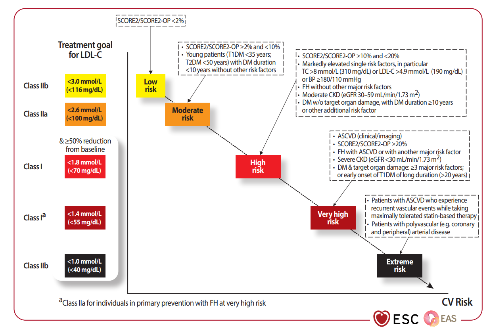
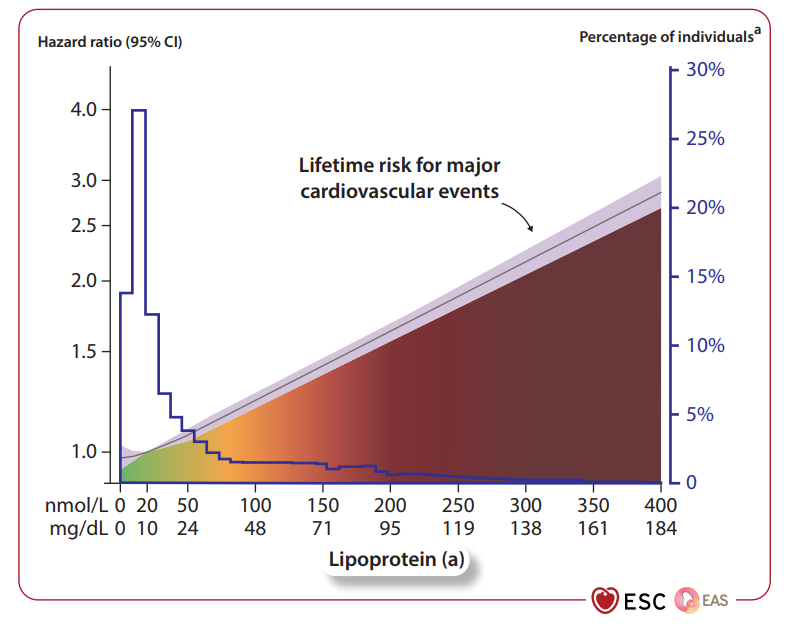
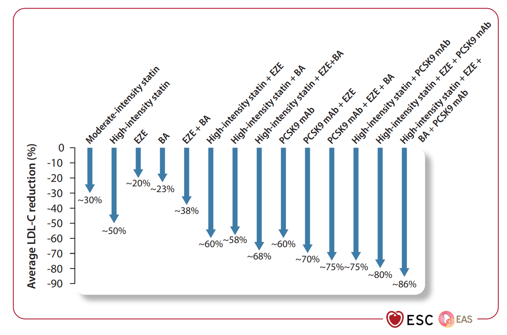

  

    

      
SCORE2 / OP

      
Dự Báo Biến Cố Cả Tử Vong &amp; Không Tử Vong Đến 89 Tuổi

    

    

      
&lt; 40 mg/dL

      
Đích LDL-C Đột Phá Cho Nhóm Nguy Cơ Cực Kỳ Cao (Extreme Risk)

    

    

      
~86% Hạ LDL-C

      
Hiệu Lực Phối Hợp Bốn Thuốc (Statin + EZE + BA + PCSK9i)

    

    

      
REPRIEVE &amp; STOP-CA

      
Mở Rộng Chỉ Định Statin Cho HIV (≥ 40t) &amp; Hóa Trị Anthracycline

    

  

  

    

      
📐

      

        
Hiện Đại Hóa Phân Tầng Bằng SCORE2 &amp; Risk Modifiers

        
Thay thế hoàn toàn mô hình SCORE truyền thống bằng SCORE2/SCORE2-OP dựa trên Non-HDL-C. Tích hợp điểm số vôi hóa mạch vành CAC (> 300), nồng độ Lp(a) ≥ 50 mg/dL, mãn kinh sớm, tiền sản giật và chủng tộc Nam Á.

      

    

    

      
⚡

      

        
Chiến Lược 'Strike Early and Strong' Sau ACS

        
Chấm dứt sự trì trệ bậc thang ngoại trú. Khởi trị Statin hoạt lực cao tức thì ngay tại giường bệnh kèm phối hợp sớm Ezetimibe trước khi xuất viện để bảo vệ tối đa nội mạc trong cửa sổ nguy cơ nhạy cảm.

      

    

    

      
🛡️

      

        
Vũ Khí Điều Trị Mới &amp; Đối Tượng Đặc Thù

        
Công nhận chính thức Axit Bempedoic (CLEAR Outcomes), Inclisiran (siRNA tiêm 2 lần/năm), Evinacumab (ức chế ANGPTL3 cho HoFH). Chỉ định Statin bảo vệ toàn diện cho người nhiễm HIV và bệnh nhân ung thư hóa trị.

      

    

  

<!-- QUICK ACCESS MENU -->

  

    ⚡ ĐIỀU HƯỚNG NHANH 7 PHẦN HƯỚNG DẪN ESC/EAS 2025
  

  

    <a href="#sec-1" class="quickmenu-chip">1. Bối Cảnh &amp; SCORE2</a>
    <a href="#sec-2" class="quickmenu-chip">2. Bậc Thang Nguy Cơ &amp; Đích Kép</a>
    <a href="#sec-3" class="quickmenu-chip">3. Risk Modifiers &amp; Lp(a)</a>
    <a href="#sec-4" class="quickmenu-chip">4. Vũ Khí Mới &amp; 13 Phác Đồ</a>
    <a href="#sec-5" class="quickmenu-chip">5. Chiến Lược ACS &amp; Triglycerid</a>
    <a href="#sec-6" class="quickmenu-chip">6. HIV, Hóa Trị &amp; So Sánh 2019–2025</a>
    <a href="#sec-7" class="quickmenu-chip">7. Bộ Tính CDSS &amp; Trích Dẫn</a>
  

  <!-- ===================================================================== -->
  <!-- SECTION 1: BỐI CẢNH & ĐỘT PHÁ SCORE2 / SCORE2-OP -->
  <!-- ===================================================================== -->
  

    

      📈
      <h2 class="sec-title">Phần 1: Bối Cảnh, Động Lực Cập Nhật &amp; Cuộc Cách Mạng Thay Thế SCORE Bằng SCORE2 / SCORE2-OP</h2>
    

    

      

        Rối loạn lipid máu vẫn là một trong những <strong>yếu tố nguy cơ có thể thay đổi cốt lõi nhất</strong> đối với bệnh tim mạch do xơ vữa (ASCVD). Kể từ sau hướng dẫn tiêu chuẩn năm 2019, hàng loạt thử nghiệm lâm sàng lớn mang tính bước ngoặt (CLEAR Outcomes, REPRIEVE, STOP-CA, RACING) và các công nghệ dược phẩm sinh học đột phá (siRNA, ức chế ANGPTL3, ức chế ACL) đã thúc đẩy Hiệp hội Tim mạch Châu Âu (ESC) và Hiệp hội Xơ vữa động mạch Châu Âu (EAS) ban hành <strong>Bản Cập Nhật Tiêu Điểm ESC/EAS 2025 (Focused Update)</strong>.
      

      
1. Ba Trục Đột Phá Cốt Lõi Của Bản Cập Nhật 2025

      

        

          
1. Hiện đại hóa phân tầng nguy cơ

          

            Xóa bỏ hoàn toàn mô hình dự báo tử vong thuần túy (SCORE cũ), chuyển dịch sang thuật toán <strong>SCORE2</strong> và <strong>SCORE2-OP</strong> nhằm ước tính toàn diện nguy cơ biến cố tim mạch cả tử vong và không tử vong.
          

        

        

          
2. Mở rộng yếu tố điều chỉnh (Risk Modifiers)

          

            Tích hợp các chỉ dấu cận lâm sàng và yếu tố chuyên biệt: vôi hóa mạch vành CAC (> 300), nồng độ Lipoprotein(a), mãn kinh sớm, tiền sản giật và kiểu hình nguy cơ cao của chủng tộc Nam Á.
          

        

        

          
3. Tăng cường độ &amp; Đích điều trị trúng đích

          

            Xác lập đích LDL-C đột phá <strong>&lt; 40 mg/dL (&lt; 1.0 mmol/L)</strong> cho nhóm Nguy cơ cực kỳ cao (Extreme Risk); Áp dụng chiến lược <em>"Strike early and strong"</em> phối hợp thuốc sớm tại viện sau ACS; Tích hợp Axit Bempedoic, Inclisiran và Evinacumab.
          

        

      

      
2. Phân Tích Ưu Thế Sinh Học &amp; Dịch Tễ Của SCORE2 và SCORE2-OP

      

        💡
        

          <strong>Tại Sao ESC/EAS 2025 Khai Tử Mô Hình SCORE Truyền Thống?</strong> 
          Mô hình SCORE 2019 bộc lộ 3 nhược điểm chí mạng trong kỷ nguyên y học can thiệp hiện đại:
          (1) <em>Chỉ dự báo nguy cơ tử vong do tim mạch (fatal CVD)</em>: Bỏ sót hoàn toàn gánh nặng tàn phế của các biến cố không tử vong (nhồi máu cơ tim cấp sống sót, đột quỵ thiếu máu não để lại di chứng);
          (2) <em>Giới hạn độ tuổi áp dụng tối đa đến 70 tuổi</em>: Trong khi dân số Châu Âu và toàn cầu đang già hóa nhanh chóng;
          (3) <em>Sử dụng Cholesterol toàn phần làm biến số đầu vào</em>: Bỏ sót giá trị độc lập của các phân đoạn lipoprotein chứa ApoB sinh xơ vữa.
        

      

      

        <table class="regimen-table">
          <thead>
            <tr>
              <th style="width: 25%;">Đặc Tính So Sánh</th>
              <th style="width: 35%;">Mô Hình SCORE Cũ (2019)</th>
              <th style="width: 40%;">Mô Hình SCORE2 / SCORE2-OP Mới (2025)</th>
            </tr>
          </thead>
          <tbody>
            <tr>
              <td class="source-cell"><strong>Độ tuổi áp dụng</strong></td>
              <td>Chỉ áp dụng từ 40 đến 65 (tối đa 70 tuổi).</td>
              <td><strong>SCORE2:</strong> Người trưởng thành ≤ 70 tuổi. <strong>SCORE2-OP:</strong> Người cao tuổi từ <strong>70 đến 89 tuổi</strong> (Khuyến cáo Nhóm I, Bằng chứng B).</td>
            </tr>
            <tr>
              <td class="source-cell"><strong>Kết cục dự báo (Outcomes)</strong></td>
              <td>Chỉ dự báo nguy cơ tử vong do tim mạch trong 10 năm (Fatal CVD).</td>
              <td>Dự báo nguy cơ 10 năm đối với <strong>CẢ BIẾN CỐ TỬ VONG VÀ KHÔNG TỬ VONG</strong> (Nhồi máu cơ tim, đột quỵ, tử vong mạch vành).</td>
            </tr>
            <tr>
              <td class="source-cell"><strong>Chỉ số lipid máu đầu vào</strong></td>
              <td>Cholesterol toàn phần (Total Cholesterol - TC).</td>
              <td><strong>Non-HDL Cholesterol (Non-HDL-C)</strong>: Phản ánh trực tiếp toàn bộ lượng hạt lipoprotein chứa ApoB gây xơ vữa (VLDL, IDL, LDL, Lp(a)).</td>
            </tr>
            <tr>
              <td class="source-cell"><strong>Hiệu chỉnh theo địa lý</strong></td>
              <td>Phân loại thô sơ thành 2 vùng nguy cơ.</td>
              <td>Hiệu chuẩn tinh tế và chính xác cho <strong>4 nhóm quốc gia (Country Clusters)</strong> tại Châu Âu (Nguy cơ Thấp, Trung bình, Cao, Rất cao).</td>
            </tr>
            <tr>
              <td class="source-cell"><strong>Quy tắc chuyển đổi ngưỡng</strong></td>
              <td>Mốc nguy cơ thấp (1%), cao (5%), rất cao (10%).</td>
              <td>Áp dụng <strong>hệ số chuyển đổi nhân 2×</strong> để tương thích giữa ngưỡng SCORE cũ và ngưỡng SCORE2/SCORE2-OP tương ứng.</td>
            </tr>
          </tbody>
        </table>
      

    

  

  <!-- ===================================================================== -->
  <!-- SECTION 2: BẬC THANG NGUY CƠ & ĐÍCH KIỂM SOÁT LDL-C KÉP -->
  <!-- ===================================================================== -->
  

    

      🪜
      <h2 class="sec-title">Phần 2: Ma Trận Bậc Thang Nguy Cơ Tim Mạch &amp; Nguyên Tắc Đích Kiểm Soát LDL-C Kép (Table 1 &amp; Figure 1)</h2>
    

    

      
1. Nguyên Tắc Đích Kép (Dual Goal Principle) Bắt Buộc Của ESC/EAS 2025

      

        Bản cập nhật 2025 bảo lưu các con số đích tuyệt đối nhưng đưa ra quy định kiểm định nghiêm ngặt: Đối với các nhóm nguy cơ cao, rất cao và cực kỳ cao, bác sĩ <strong>BẮT BUỘC PHẢI ĐẠT ĐỒNG THỜI CẢ HAI TIÊU CHÍ</strong>:
      

      

        <strong>TIÊU CHUẨN ĐÍCH KÉP (DUAL GOAL):</strong> 
        1. Mức giảm nồng độ tuyệt đối đạt dưới ngưỡng mục tiêu tương ứng (&lt; 70, &lt; 55, hoặc &lt; 40 mg/dL). 
        <strong>VÀ</strong> 
        2. Mức giảm tương đối <strong>tối thiểu ≥ 50% so với nồng độ LDL-C nền ban đầu</strong> (trước khi khởi trị hoặc trước khi nâng bậc).
      

      
2. Bảng Phân Tầng Nguy Cơ &amp; Đích Điều Trị Chuẩn (Table 1 ESC/EAS 2025)

      

        <table class="regimen-table">
          <thead>
            <tr>
              <th style="width: 20%;">Phân Nhóm Nguy Cơ</th>
              <th style="width: 45%;">Tiêu Chuẩn Xác Định Lâm Sàng</th>
              <th style="width: 25%;">Đích Kiểm Soát LDL-C</th>
              <th style="width: 10%;">Class</th>
            </tr>
          </thead>
          <tbody>
            <tr>
              <td class="source-cell"><strong>Nguy cơ thấp (Low risk)</strong></td>
              <td>• SCORE2 / SCORE2-OP &lt; 2%. • Không có yếu tố nguy cơ tim mạch lớn khác.</td>
              <td><strong>&lt; 3.0 mmol/L</strong> (&lt; 116 mg/dL)</td>
              <td>IIb</td>
            </tr>
            <tr>
              <td class="source-cell"><strong>Nguy cơ trung bình (Moderate risk)</strong></td>
              <td>• SCORE2 / SCORE2-OP từ 2% đến &lt; 10%. • Người trẻ (ĐTĐ típ 1 &lt; 35 tuổi, ĐTĐ típ 2 &lt; 50 tuổi) mắc bệnh &lt; 10 năm không có yếu tố nguy cơ khác.</td>
              <td><strong>&lt; 2.6 mmol/L</strong> (&lt; 100 mg/dL) <small>VÀ giảm ≥ 50% so với nền</small></td>
              <td>IIa</td>
            </tr>
            <tr>
              <td class="source-cell"><strong>Nguy cơ cao (High risk)</strong></td>
              <td>• SCORE2 / SCORE2-OP từ 10% đến &lt; 20%. • Yếu tố nguy cơ đơn lẻ tăng rõ rệt: TC &gt; 8 mmol/L (310 mg/dL), LDL-C &gt; 4.9 mmol/L (190 mg/dL), hoặc HA ≥ 180/110 mmHg. • Tăng cholesterol gia đình (FH) chưa có biến cố tim mạch. • Bệnh thận mạn mức độ vừa (eGFR 30–59 mL/phút/1.73 m²). • Đái tháo đường ≥ 10 năm hoặc kèm thêm yếu tố nguy cơ tim mạch.</td>
              <td><strong>&lt; 1.8 mmol/L</strong> (&lt; 70 mg/dL) <small>VÀ giảm ≥ 50% so với nền</small></td>
              <td>I</td>
            </tr>
            <tr>
              <td class="source-cell"><strong>Nguy cơ rất cao (Very high risk)</strong></td>
              <td>• <strong>Đã xác lập ASCVD</strong> trên lâm sàng hoặc chẩn đoán hình ảnh rõ rệt. • SCORE2 / SCORE2-OP ≥ 20%. • FH kèm ASCVD hoặc kèm thêm 1 yếu tố nguy cơ lớn. • Bệnh thận mạn nặng (eGFR &lt; 30 mL/phút/1.73 m²). • Đái tháo đường kèm tổn thương cơ quan đích (≥ 3 yếu tố nguy cơ hoặc ĐTĐ típ 1 khởi phát sớm kéo dài &gt; 20 năm).</td>
              <td><strong>&lt; 1.4 mmol/L</strong> (&lt; 55 mg/dL) <small>VÀ giảm ≥ 50% so với nền</small></td>
              <td>Ia</td>
            </tr>
            <tr>
              <td class="source-cell" style="background: rgba(15, 23, 42, 0.05);"><strong>Nguy cơ cực kỳ cao (Extreme risk)</strong></td>
              <td>• Bệnh nhân ASCVD bị <strong>biến cố mạch máu tái phát</strong> trong khi đang điều trị statin liều tối đa dung nạp được. • Bệnh nhân mắc <strong>bệnh đa mạch máu (polyvascular disease)</strong>, ví dụ bệnh mạch vành kết hợp bệnh mạch máu ngoại biên (PAD) hoặc bệnh mạch máu não.</td>
              <td><strong>&lt; 1.0 mmol/L</strong> (&lt; 40 mg/dL) <small>VÀ giảm ≥ 50% so với nền</small></td>
              <td>IIb</td>
            </tr>
          </tbody>
        </table>
      

      
3. Hình Ảnh Trích Xuất Gốc (Figure 1 ESC/EAS 2025)

      <!-- FIG CARD 1 -->
      

        
        

          
Figure 1. Treatment goal for LDL-C by CV risk categories

          Sơ đồ bậc thang phân tầng nguy cơ tim mạch từ Nguy cơ Thấp đến Nguy cơ Cực kỳ Cao và các mốc kiểm soát LDL-C tương ứng theo hướng dẫn ESC/EAS 2025 (Trích từ trang 3, tài liệu gốc).
        

      

      
4. Tái Hiện Sơ Đồ Bậc Thang Trực Quan (Editorial SVG Graphic Figure 1)

      

        Mô hình hóa toàn diện cấu trúc bậc thang phân tầng nguy cơ và đích kiểm soát LDL-C bằng đồ họa Inline SVG vector chuẩn CliniPortal 2.0 (tương thích 100% Dark Mode, không dùng thẻ HTML trong text, đường nối trực giao chuẩn):
      

      <!-- EDITORIAL SVG STAIRCASE FIG 1 -->
      

        <svg viewBox="0 0 1000 760" width="100%" height="auto" xmlns="http://www.w3.org/2000/svg" style="font-family: system-ui, -apple-system, sans-serif; display: block; margin: 0 auto; max-width: 1000px;">
          <defs>
            <marker id="arrow-esc-axis" viewBox="0 0 10 10" refX="6" refY="5" markerWidth="6" markerHeight="6" orient="auto">
              <path d="M 0 0 L 10 5 L 0 10 z" fill="#0f172a" />
            </marker>
            <marker id="arrow-esc-down" viewBox="0 0 10 10" refX="5" refY="6" markerWidth="6" markerHeight="6" orient="auto">
              <path d="M 0 0 L 5 10 L 10 0 z" fill="#64748b" />
            </marker>
          </defs>

          <!-- Outer Container Background -->
          <rect x="10" y="10" width="980" height="740" rx="12" fill="var(--color-surface-2, #f8fafc)" stroke="var(--color-border, #cbd5e1)" stroke-width="1.5" />

          <!-- ================= LEFT PILLAR: TREATMENT GOALS ================= -->
          <rect x="35" y="40" width="220" height="660" rx="8" fill="var(--color-surface, #ffffff)" stroke="var(--color-border, #cbd5e1)" stroke-width="1" />
          
          <text x="145" y="75" font-size="14" font-weight="800" fill="var(--color-text, #0f172a)" text-anchor="middle">ĐÍCH KIỂM SOÁT LDL-C</text>
          <text x="145" y="93" font-size="11" font-weight="600" fill="var(--color-text-muted, #64748b)" text-anchor="middle">(Treatment Goal for LDL-C)</text>

          <!-- Goal 1: Low Risk -->
          <rect x="50" y="120" width="115" height="46" rx="6" fill="#fef08a" stroke="#ca8a04" stroke-width="1.5" />
          <text x="107" y="140" font-size="11.5" font-weight="800" fill="#854d0e" text-anchor="middle">&lt; 3.0 mmol/L</text>
          <text x="107" y="155" font-size="10" font-weight="700" fill="#a16207" text-anchor="middle">(&lt; 116 mg/dL)</text>
          <text x="195" y="148" font-size="12" font-weight="800" fill="#854d0e">Class IIb</text>

          <!-- Goal 2: Moderate Risk -->
          <rect x="50" y="210" width="115" height="46" rx="6" fill="#fed7aa" stroke="#ea580c" stroke-width="1.5" />
          <text x="107" y="230" font-size="11.5" font-weight="800" fill="#9a3412" text-anchor="middle">&lt; 2.6 mmol/L</text>
          <text x="107" y="245" font-size="10" font-weight="700" fill="#c2410c" text-anchor="middle">(&lt; 100 mg/dL)</text>
          <text x="195" y="238" font-size="12" font-weight="800" fill="#9a3412">Class IIa</text>

          <!-- Badge Dual Goal Rule -->
          <rect x="48" y="295" width="194" height="28" rx="14" fill="#fee2e2" stroke="#dc2626" stroke-width="1" />
          <text x="145" y="313" font-size="10.5" font-weight="800" fill="#991b1b" text-anchor="middle">&amp; GIẢM ≥ 50% SO VỚI NỀN</text>

          <!-- Goal 3: High Risk -->
          <rect x="50" y="360" width="115" height="46" rx="6" fill="#ef4444" stroke="#b91c1c" stroke-width="1.5" />
          <text x="107" y="380" font-size="11.5" font-weight="800" fill="#ffffff" text-anchor="middle">&lt; 1.8 mmol/L</text>
          <text x="107" y="395" font-size="10" font-weight="700" fill="#fee2e2" text-anchor="middle">(&lt; 70 mg/dL)</text>
          <text x="195" y="388" font-size="12" font-weight="800" fill="#dc2626">Class I</text>

          <!-- Goal 4: Very High Risk -->
          <rect x="50" y="490" width="115" height="46" rx="6" fill="#991b1b" stroke="#7f1d1d" stroke-width="1.5" />
          <text x="107" y="510" font-size="11.5" font-weight="800" fill="#ffffff" text-anchor="middle">&lt; 1.4 mmol/L</text>
          <text x="107" y="525" font-size="10" font-weight="700" fill="#fee2e2" text-anchor="middle">(&lt; 55 mg/dL)</text>
          <text x="195" y="518" font-size="12" font-weight="800" fill="#991b1b">Class Ia</text>

          <!-- Goal 5: Extreme Risk -->
          <rect x="50" y="620" width="115" height="46" rx="6" fill="#0f172a" stroke="#334155" stroke-width="1.5" />
          <text x="107" y="640" font-size="11.5" font-weight="800" fill="#ffffff" text-anchor="middle">&lt; 1.0 mmol/L</text>
          <text x="107" y="655" font-size="10" font-weight="700" fill="#94a3b8" text-anchor="middle">(&lt; 40 mg/dL)</text>
          <text x="195" y="648" font-size="12" font-weight="800" fill="#0f172a">Class IIb</text>

          <!-- ================= RIGHT AREA: CV RISK STAIRCASE ================= -->
          <!-- X-axis Line -->
          <path d="M 280 690 L 950 690" stroke="#0f172a" stroke-width="2.5" marker-end="url(#arrow-esc-axis)" />
          <text x="910" y="718" font-size="13" font-weight="900" fill="#0f172a" text-anchor="middle">NGUY CƠ TIM MẠCH (CV RISK) ➔</text>

          <!-- Descending Staircase Dotted Trend Line -->
          <path d="M 360 170 L 440 250 L 580 390 L 730 520 L 870 640" fill="none" stroke="#64748b" stroke-width="2" stroke-dasharray="6 4" />

          <!-- STEP 1: LOW RISK -->
          <rect x="300" y="45" width="140" height="35" rx="4" fill="var(--color-surface, #ffffff)" stroke="#64748b" stroke-dasharray="3 3" />
          <text x="370" y="67" font-size="10.5" font-weight="700" fill="#475569" text-anchor="middle">SCORE2/OP &lt; 2%</text>
          <path d="M 370 80 L 370 120" stroke="#64748b" stroke-width="1.5" marker-end="url(#arrow-esc-down)" />
          
          <rect x="325" y="125" width="90" height="48" rx="6" fill="#facc15" stroke="#ca8a04" stroke-width="2" />
          <text x="370" y="146" font-size="12" font-weight="900" fill="#713f12" text-anchor="middle">LOW</text>
          <text x="370" y="161" font-size="10.5" font-weight="800" fill="#854d0e" text-anchor="middle">RISK</text>

          <!-- STEP 2: MODERATE RISK -->
          <rect x="420" y="100" width="220" height="70" rx="4" fill="var(--color-surface, #ffffff)" stroke="#64748b" stroke-dasharray="3 3" />
          <text x="530" y="118" font-size="10" font-weight="700" fill="#1e293b" text-anchor="middle">• SCORE2 / SCORE2-OP 2% đến &lt; 10%</text>
          <text x="530" y="134" font-size="9.5" fill="#475569" text-anchor="middle">• ĐTĐ trẻ tuổi (ĐTĐ1 &lt; 35t; ĐTĐ2 &lt; 50t)</text>
          <text x="530" y="148" font-size="9.5" fill="#475569" text-anchor="middle">mắc bệnh &lt; 10 năm, không yếu tố khác</text>
          <path d="M 440 170 L 440 210" stroke="#64748b" stroke-width="1.5" marker-end="url(#arrow-esc-down)" />

          <rect x="390" y="215" width="105" height="48" rx="6" fill="#fb923c" stroke="#ea580c" stroke-width="2" />
          <text x="442" y="236" font-size="11.5" font-weight="900" fill="#7c2d12" text-anchor="middle">MODERATE</text>
          <text x="442" y="251" font-size="10.5" font-weight="800" fill="#9a3412" text-anchor="middle">RISK</text>

          <!-- STEP 3: HIGH RISK -->
          <rect x="580" y="160" width="280" height="110" rx="4" fill="var(--color-surface, #ffffff)" stroke="#64748b" stroke-dasharray="3 3" />
          <text x="720" y="178" font-size="10" font-weight="700" fill="#1e293b" text-anchor="middle">• SCORE2 / SCORE2-OP 10% đến &lt; 20%</text>
          <text x="720" y="194" font-size="9.5" fill="#475569" text-anchor="middle">• TC &gt; 310 mg/dL, LDL-C &gt; 190 mg/dL, HA ≥ 180/110</text>
          <text x="720" y="210" font-size="9.5" fill="#475569" text-anchor="middle">• Tăng cholesterol gia đình (FH) đơn thuần</text>
          <text x="720" y="226" font-size="9.5" fill="#475569" text-anchor="middle">• Bệnh thận mạn vừa (eGFR 30–59 mL/phút)</text>
          <text x="720" y="242" font-size="9.5" fill="#475569" text-anchor="middle">• ĐTĐ ≥ 10 năm hoặc kèm yếu tố nguy cơ</text>
          <path d="M 640 270 L 590 355" stroke="#64748b" stroke-width="1.5" marker-end="url(#arrow-esc-down)" />

          <rect x="540" y="360" width="100" height="48" rx="6" fill="#ef4444" stroke="#b91c1c" stroke-width="2" />
          <text x="590" y="381" font-size="12" font-weight="900" fill="#ffffff" text-anchor="middle">HIGH</text>
          <text x="590" y="396" font-size="10.5" font-weight="800" fill="#fee2e2" text-anchor="middle">RISK</text>

          <!-- STEP 4: VERY HIGH RISK -->
          <rect x="670" y="325" width="280" height="110" rx="4" fill="var(--color-surface, #ffffff)" stroke="#64748b" stroke-dasharray="3 3" />
          <text x="810" y="343" font-size="10" font-weight="800" fill="#991b1b" text-anchor="middle">• ĐÃ XÁC LẬP ASCVD (Lâm sàng / Cận lâm sàng)</text>
          <text x="810" y="359" font-size="9.5" font-weight="700" fill="#1e293b" text-anchor="middle">• SCORE2 / SCORE2-OP ≥ 20%</text>
          <text x="810" y="375" font-size="9.5" fill="#475569" text-anchor="middle">• FH kèm ASCVD hoặc thêm 1 yếu tố nguy cơ lớn</text>
          <text x="810" y="391" font-size="9.5" fill="#475569" text-anchor="middle">• Bệnh thận mạn nặng (eGFR &lt; 30 mL/phút)</text>
          <text x="810" y="407" font-size="9.5" fill="#475569" text-anchor="middle">• ĐTĐ tổn thương cơ quan đích (≥ 3 yếu tố nguy cơ)</text>
          <path d="M 730 435 L 730 490" stroke="#64748b" stroke-width="1.5" marker-end="url(#arrow-esc-down)" />

          <rect x="680" y="495" width="115" height="48" rx="6" fill="#991b1b" stroke="#7f1d1d" stroke-width="2" />
          <text x="737" y="516" font-size="11.5" font-weight="900" fill="#ffffff" text-anchor="middle">VERY HIGH</text>
          <text x="737" y="531" font-size="10.5" font-weight="800" fill="#fca5a5" text-anchor="middle">RISK</text>

          <!-- STEP 5: EXTREME RISK -->
          <rect x="740" y="565" width="240" height="60" rx="4" fill="var(--color-surface, #ffffff)" stroke="#64748b" stroke-dasharray="3 3" />
          <text x="860" y="583" font-size="9.5" font-weight="700" fill="#0f172a" text-anchor="middle">• ASCVD tái phát biến cố mạch máu</text>
          <text x="860" y="597" font-size="9" fill="#475569" text-anchor="middle">khi đang dùng statin tối đa dung nạp</text>
          <text x="860" y="611" font-size="9.5" font-weight="700" fill="#991b1b" text-anchor="middle">• Bệnh đa mạch máu (Mạch vành + PAD)</text>
          <path d="M 865 625 L 865 645" stroke="#64748b" stroke-width="1.5" marker-end="url(#arrow-esc-down)" />

          <rect x="815" y="650" width="110" height="45" rx="6" fill="#0f172a" stroke="#334155" stroke-width="2" />
          <text x="870" y="670" font-size="11" font-weight="900" fill="#ffffff" text-anchor="middle">EXTREME</text>
          <text x="870" y="684" font-size="10" font-weight="800" fill="#94a3b8" text-anchor="middle">RISK</text>
        </svg>
      

    

  

  <!-- ===================================================================== -->
  <!-- SECTION 3: CÁC YẾU TỐ ĐIỀU CHỈNH NGUY CƠ & ĐỘT PHÁ LP(A) -->
  <!-- ===================================================================== -->
  

    

      🔬
      <h2 class="sec-title">Phần 3: Các Yếu Tố Điều Chỉnh Nguy Cơ (Risk Modifiers) &amp; Đột Phá Lipoprotein(a) (Figure 3)</h2>
    

    

      

        Điểm số nguy cơ tính theo thuật toán SCORE2/SCORE2-OP chỉ là khung ước tính nền tảng trên dân số chung. Trên từng cá thể, ESC/EAS 2025 yêu cầu tích hợp các <strong>Yếu Tố Điều Chỉnh Nguy Cơ (Risk Modifiers)</strong> nhằm tái phân loại chính xác mức độ nguy cơ lâm sàng thực tế, đặc biệt ở những bệnh nhân có điểm số nằm quanh ngưỡng quyết định điều trị.
      

      
1. Vôi Hóa Mạch Vành (Coronary Artery Calcium - CAC)

      

        

          
CAC &gt; 300: Tái Phân Loại Sang Dự Phòng Thứ Phát

          

            Phát hiện điểm vôi hóa mạch vành <strong>CAC &gt; 300 Agatston</strong> ở người có vẻ khỏe mạnh cho phép <strong>tái phân loại thẳng vào nhóm nguy cơ rất cao (tương đương dự phòng cấp hai)</strong>, chỉ định khởi trị ngay statin hoạt lực cao kết hợp ezetimibe nhằm đưa LDL-C &lt; 55 mg/dL.
          

        

        

          
CAC = 0: Hạ Bậc Nguy Cơ Cần Thận Trọng

          

            Điểm số <strong>CAC = 0 phản ánh nguy cơ tim mạch rất thấp trong 5–10 năm tới</strong>, có thể trì hoãn điều trị thuốc ở người có nguy cơ trung bình. <em>Lưu ý quan trọng:</em> Không dùng CAC = 0 để hạ bậc điều trị ở người <strong>đang dùng statin</strong> (vì statin thúc đẩy canxi hóa để ổn định mảng xơ vữa) hoặc người hút thuốc lá nặng / ĐTĐ trẻ tuổi.
          

        

      

      
2. Các Yếu Tố Nguy Cơ Đặc Thù Ở Nữ Giới &amp; Kiểu Hình Chủng Tộc Nam Á

      

        

          ♀️
          

            <strong>Mãn Kinh Sớm (Premature Menopause, &lt; 40 tuổi):</strong> Việc sụt giảm estrogen nội sinh quá sớm kích hoạt sự gia tăng nồng độ LDL-C, Triglycerid, ApoB và đẩy nhanh tốc độ tiến triển xơ vữa động mạch. Bệnh nhân cần được tính toán nguy cơ tích cực hơn tuổi đời thực tế.
          

        

        

          🤰
          

            <strong>Rối Loạn Tăng Huyết Áp Thai Kỳ &amp; Tiền Sản Giật (Pre-eclampsia):</strong> Là dấu ấn sinh học phản ánh rối loạn chức năng nội mạc hệ thống và tổn thương vi mạch lan tỏa. Phụ nữ có tiền sử tiền sản giật đối mặt với nguy cơ mắc bệnh mạch vành, suy tim và đột quỵ tăng gấp 2–3 lần trong đời.
          

        

        

          🌏
          

            <strong>Kiểu Hình Chủng Tộc Nam Á (South Asian Phenotype):</strong> Dù nồng độ LDL-C xét nghiệm thường nằm trong giới hạn bình thường, người gốc Nam Á mang đặc điểm chuyển hóa bất lợi: Nồng độ Triglycerid cao, HDL-C thấp, tỷ lệ hạt LDL nhỏ đậm đặc (small dense LDL) dễ oxy hóa rất cao, kèm tăng nồng độ Lp(a). ESC/EAS 2025 xếp chủng tộc Nam Á vào <strong>nhóm nguy cơ rất cao trong bảng hiệu chuẩn SCORE2</strong>.
          

        

      

      
3. Đột Phá Khuyến Cáo Đo Lường Lipoprotein(a) [Lp(a)] &amp; Dữ Liệu UK Biobank (Figure 3)

      

        🧬
        

          <strong>Khuyến Cáo Đo Lp(a) Ít Nhất 1 Lần Trong Đời:</strong> 
          ESC/EAS 2025 khuyến nghị <strong>đo nồng độ Lipoprotein(a) ít nhất một lần trong đời cho tất cả người trưởng thành</strong> (Class IIa, Level B). 
          • Ngưỡng <strong>Lp(a) ≥ 50 mg/dL (≥ 105 nmol/L)</strong> được công nhận là một yếu tố điều chỉnh nguy cơ quan trọng (Risk Modifier) chuyển bậc điều trị. 
          • Khuyến nghị sử dụng các bộ xét nghiệm miễn dịch không nhạy với kích thước isoform của apo(a) và <strong>ưu tiên báo cáo kết quả bằng đơn vị nmol/L</strong> để phản ánh chính xác số lượng hạt sinh xơ vữa.
        

      

      <!-- FIG CARD 3 -->
      

        
        

          
Figure 3. Association between Lp(a) levels and lifetime risk of major cardiovascular events

          Đồ thị phân tích từ ngân hàng sinh học UK Biobank (415,274 đối tượng da trắng và 443,180 cá thể không có ASCVD trước đó). Đường màu xanh biểu thị phân bố tần suất Lp(a) trong cộng đồng (phần lớn &lt; 50 nmol/L). Dải màu chuyển tiếp biểu thị nguy cơ trọn đời của biến cố tim mạch bắt đầu tăng nhẹ từ ngưỡng &gt; 62 nmol/L (30 mg/dL) và tăng vọt tuyến tính mạnh mẽ khi Lp(a) ≥ 105 nmol/L (50 mg/dL), đạt Hazard Ratio &gt; 2.5 đến 3.0 (Trích từ trang 7, tài liệu gốc).
        

      

    

  

  <!-- ===================================================================== -->
  <!-- SECTION 4: KHO VŨ KHÍ NON-STATIN & 13 PHÁC ĐỒ HẠ LIPID -->
  <!-- ===================================================================== -->
  

    

      💊
      <h2 class="sec-title">Phần 4: Kho Vũ Khí Liệu Pháp Non-Statin Tiên Tiến &amp; So Sánh 13 Phác Đồ Hạ Lipid Máu (Figure 2)</h2>
    

    

      
1. Cơ Chế Sinh Học &amp; Vai Trò Của Các Hoạt Chất Non-Statin Mới

      

        

          
Axit Bempedoic (Bempedoic Acid - 180 mg/ngày)

          

            • <em>Khuyến cáo:</em> Lựa chọn hàng đầu cho bệnh nhân <strong>bất dung nạp statin</strong> (Class I, Level B). Khuyến nghị phối hợp thêm vào statin liều tối đa kèm ezetimibe khi chưa đạt đích (Class IIa, Level C). 
            • <em>Cơ chế:</em> Tiền chất được hoạt hóa độc quyền bởi enzym <strong>ACSVL1 tại gan</strong> để ức chế <strong>ATP-citrate lyase (ACL)</strong> ở thượng nguồn con đường tổng hợp cholesterol. Cơ vân không có ACSVL1 nên thuốc <strong>hoàn toàn không gây đau cơ (Myalgia-free)</strong>. 
            • <em>Bằng chứng:</em> Thử nghiệm <strong>CLEAR Outcomes</strong> chứng minh giảm <strong>13% biến cố MACE</strong> và giảm 27% nhồi máu cơ tim. 
            • <em>Cảnh báo an toàn:</em> Tăng nhẹ acid uric máu (tăng nguy cơ gút 3.1% vs 2.1%), tăng nhẹ men gan, sỏi mật và nguy cơ đứt gân.
          

        

        

          
Inclisiran (siRNA Hướng Gan — Tiêm Mỗi 6 Tháng)

          

            • <em>Cơ chế:</em> Chuỗi RNA can thiệp nhỏ (siRNA) gắn đuôi GalNAc hướng đặc hiệu vào thụ thể ASGPR của tế bào gan. Tại tế bào chất, phức hợp RISC xúc tác cắt chọn lọc mRNA của protein PCSK9, ngăn chặn quá trình dịch mã tổng hợp PCSK9. 
            • <em>Hiệu quả:</em> Liều tiêm dưới da tại thời điểm 0, 3 tháng và sau đó <strong>định kỳ mỗi 6 tháng (2 lần/năm)</strong> giúp hạ nồng độ LDL-C bền vững lên đến <strong>~50%</strong>. 
            • <em>Vị trí khuyến cáo:</em> Lựa chọn thay thế hoặc phối hợp cho nhóm nguy cơ rất cao chưa đạt đích; các thử nghiệm kết cục tim mạch cứng (ORION-4, VICTORION-2 PREVENT) đang được tiến hành để cập nhật khuyến cáo thường quy vào năm 2026–2027.
          

        

        

          
Evinacumab (Kháng Thể Đơn Dòng Ức Chế ANGPTL3)

          

            • <em>Khuyến cáo:</em> Chỉ định cho bệnh nhân mắc <strong>Tăng cholesterol máu gia đình đồng hợp tử (HoFH)</strong> từ 5 tuổi trở lên chưa đạt mục tiêu điều trị bằng các liệu pháp thông thường (Class IIa, Level B). 
            • <em>Cơ chế đột phá:</em> Kháng thể đơn dòng gắn và bất hoạt protein giống angiopoietin 3 (<strong>ANGPTL3</strong>), giải phóng hoạt tính của enzym Lipoprotein Lipase (LPL) và Endothelial Lipase (EL). 
            • <em>Ý nghĩa:</em> Hạ nồng độ LDL-C từ <strong>45% đến 50% thông qua con đường hoàn toàn độc lập với thụ thể LDL (LDLR-independent)</strong>, tạo bước ngoặt cứu sống bệnh nhân HoFH bị mất hoàn toàn chức năng thụ thể LDLR.
          

        

      

      
2. Sơ Đồ Đối Chiếu 13 Phác Đồ Hạ Lipid Máu (Figure 2 ESC/EAS 2025)

      <!-- FIG CARD 2 -->
      

        
        

          
Figure 2. Average LDL-C reduction (%) with different lipid-lowering regimens

          Mức độ hạ LDL-C trung bình từ các phác đồ đơn trị (30%–60%) đến các liệu pháp phối hợp đôi (58%–70%), phối hợp ba (68%–80%) và phối hợp bốn (Quadruple therapy hạ tối đa ~86%) theo hướng dẫn cập nhật ESC/EAS 2025 (Trích từ trang 5, tài liệu gốc).
        

      

      

        <table class="regimen-table">
          <thead>
            <tr>
              <th style="width: 35%;">Phác Đồ Điều Trị (Regimen)</th>
              <th style="width: 25%;">Thành Phần Thuốc</th>
              <th style="width: 20%;">Mức Giảm LDL-C Trung Bình</th>
              <th style="width: 20%;">Thanh Hiệu Lực Trực Quan</th>
            </tr>
          </thead>
          <tbody>
            <tr>
              <td class="source-cell">Statin cường độ trung bình</td>
              <td>Atorvastatin 10–20mg, Rosuvastatin 5–10mg</td>
              <td><strong>~ 30%</strong></td>
              <td>

</td>
            </tr>
            <tr>
              <td class="source-cell">Statin cường độ cao</td>
              <td>Atorvastatin 40–80mg, Rosuvastatin 20–40mg</td>
              <td><strong>~ 50%</strong></td>
              <td>

</td>
            </tr>
            <tr>
              <td class="source-cell">Ezetimibe đơn trị (EZE)</td>
              <td>Ezetimibe 10mg/ngày</td>
              <td><strong>~ 20%</strong></td>
              <td>

</td>
            </tr>
            <tr>
              <td class="source-cell">Axit Bempedoic đơn trị (BA)</td>
              <td>Bempedoic acid 180mg/ngày</td>
              <td><strong>~ 23%</strong></td>
              <td>

</td>
            </tr>
            <tr>
              <td class="source-cell">Ezetimibe + Axit Bempedoic</td>
              <td>EZE 10mg + BA 180mg (Viên FDC)</td>
              <td><strong>~ 38%</strong></td>
              <td>

</td>
            </tr>
            <tr>
              <td class="source-cell">Statin cường độ cao + EZE</td>
              <td>Statin tối đa + Ezetimibe 10mg (FDC)</td>
              <td><strong>~ 60% – 65%</strong></td>
              <td>

</td>
            </tr>
            <tr>
              <td class="source-cell">Statin cường độ cao + BA</td>
              <td>Statin tối đa + Bempedoic acid 180mg</td>
              <td><strong>~ 58%</strong></td>
              <td>

</td>
            </tr>
            <tr>
              <td class="source-cell">Statin tối đa + EZE + BA (Bộ Ba Uống)</td>
              <td>Statin tối đa + EZE 10mg + BA 180mg</td>
              <td><strong>~ 68%</strong></td>
              <td>

</td>
            </tr>
            <tr>
              <td class="source-cell">Kháng thể đơn dòng PCSK9 (mAbs)</td>
              <td>Evolocumab 140mg/2w hoặc Alirocumab</td>
              <td><strong>~ 60%</strong></td>
              <td>

</td>
            </tr>
            <tr>
              <td class="source-cell">PCSK9 mAbs + Ezetimibe</td>
              <td>Evolocumab/Alirocumab + EZE 10mg</td>
              <td><strong>~ 75%</strong></td>
              <td>

</td>
            </tr>
            <tr>
              <td class="source-cell">Statin cường độ cao + PCSK9 mAbs</td>
              <td>Statin tối đa + Evolocumab/Alirocumab</td>
              <td><strong>~ 75%</strong></td>
              <td>

</td>
            </tr>
            <tr>
              <td class="source-cell">Statin tối đa + EZE + PCSK9 mAbs</td>
              <td>Statin tối đa + EZE 10mg + PCSK9 mAbs</td>
              <td><strong>~ 80%</strong></td>
              <td>

</td>
            </tr>
            <tr style="background: rgba(220, 38, 38, 0.06);">
              <td class="source-cell"><strong>Phối hợp bốn thuốc (Quadruple Therapy)</strong></td>
              <td><strong>Statin tối đa + EZE + BA + PCSK9 mAbs</strong></td>
              <td><strong style="color: #dc2626;">~ 86%</strong></td>
              <td>

</td>
            </tr>
          </tbody>
        </table>
      

    

  

  <!-- ===================================================================== -->
  <!-- SECTION 5: CHIẾN LƯỢC ACS & TĂNG TRIGLYCERID MÁU -->
  <!-- ===================================================================== -->
  

    

      🫀
      <h2 class="sec-title">Phần 5: Chiến Lược "Strike Early and Strong" Trong Hội Chứng Vành Cấp &amp; Quản Lý Tăng Triglycerid Máu</h2>
    

    

      
1. Triết Lý "Strike Early and Strong" Trong Hội Chứng Vành Cấp (ACS)

      

        Trong giai đoạn cấp tính và bán cấp sau nhồi máu cơ tim, mảng xơ vữa đang trong tình trạng bất ổn định cao độ kèm phản ứng viêm toàn thân dữ dội. Thực tế lâm sàng trước đây áp dụng mô hình tăng liều bậc thang chậm chạp (stepwise) khiến bệnh nhân rơi vào "khoảng trống nguy cơ" nguy hiểm trong 60–90 ngày đầu sau xuất viện.
      

      

        ⚡
        

          <strong>Phác Đồ Phối Hợp Thuốc Sớm Tại Viện Của ESC/EAS 2025:</strong> 
          • <strong>Khởi trị statin hoạt lực cao tức thì</strong> cho tất cả bệnh nhân ACS ngay trong thời gian nằm viện, bất kể nồng độ LDL-C ban đầu (<strong>Khuyến cáo Nhóm I</strong>). 
          • <strong>Chủ động phối hợp thêm Ezetimibe ngay trước khi xuất viện</strong> (<strong>Khuyến cáo Nhóm IIa</strong>) đối với bệnh nhân được đánh giá khó đạt đích nếu chỉ dùng statin đơn trị liệu (đặc biệt là bệnh nhân đã dùng statin từ trước hoặc có mức LDL-C nền cao). 
          • Lợi ích của chiến lược khởi trị phối hợp sớm đã được củng cố vững chắc qua các thử nghiệm landmark: <strong>IMPROVE-IT, HUYGENS, PACMAN-AMI, SWEDEHEART và AT-TARGET IT</strong>, chứng minh làm tăng độ dày vỏ bao xơ (fibrous cap) và giảm đáng kể thể tích mảng xơ vữa.
        

      

      
2. Phác Đồ Điều Trị Tăng Triglycerid Máu

      

        

          1️⃣
          

            <strong>Statin Là Nền Tảng Hàng Đầu:</strong> Ở bệnh nhân có Triglycerid &gt; 150 mg/dL, Statin liều dung nạp tối đa vẫn là lựa chọn ưu tiên số 1 để giảm nguy cơ tim mạch tồn dư.
          

        

        

          2️⃣
          

            <strong>Icosapent Ethyl (IPE - 2g × 2 lần/ngày):</strong> Hoạt chất duy nhất được khuyến nghị phối hợp cùng statin cho bệnh nhân nguy cơ cao hoặc rất cao nếu nồng độ TG duy trì từ <strong>135 đến 499 mg/dL</strong> (<strong>Khuyến cáo Nhóm IIa, Mức độ bằng chứng B</strong> dựa trên thử nghiệm REDUCE-IT giảm 25% biến cố tim mạch). Cần theo dõi nguy cơ rung nhĩ và chảy máu nhẹ.
          

        

        

          3️⃣
          

            <strong>Volanesorsen (Ức chế Antisense ApoC-III):</strong> Được khuyến nghị cho bệnh nhân tăng TG nghiêm trọng do <strong>Hội chứng chylomicron máu gia đình (FCS)</strong> kháng trị với các liệu pháp chuẩn nhằm phòng ngừa viêm tụy cấp đe dọa tính mạng (<strong>Khuyến cáo Nhóm IIa, Bằng chứng B</strong> - phê duyệt bởi EMA).
          

        

      

      
3. Khuyến Cáo Nhóm III: Cảnh Báo Chống Lại Thực Phẩm Bổ Sung &amp; Fibrates

      

        <strong style="color: #991b1b;">🚫 KHUYẾN CÁO CLASS III (CHỐNG CHỈ ĐỊNH RÕ RÀNG / HẠI NHIỀU HƠN LỢI):</strong> 
        • <strong>Thực phẩm bổ sung &amp; Vitamin:</strong> ESC/EAS 2025 phản đối mạnh mẽ việc kê đơn men gạo đỏ (red yeast rice), phytosterols, và các viên dầu cá omega-3 generic bán tự do trên thị trường để phòng ngừa biến cố ASCVD do thiếu bằng chứng bảo vệ tim mạch và tiềm ẩn độc tố. 
        • <strong>Fibrates thông thường &amp; Hỗn hợp EPA + DHA:</strong> Không được khuyến cáo thường quy do các thử nghiệm lâm sàng lớn (ACCORD, PROMINENT, STRENGTH) đều thất bại trong việc chứng minh lợi ích giảm biến cố tim mạch cứng khi phối hợp cùng statin.
      

    

  

  <!-- ===================================================================== -->
  <!-- SECTION 6: ĐỐI TƯỢNG ĐẶC BIỆT & SO SÁNH 2019 VS 2025 -->
  <!-- ===================================================================== -->
  

    

      👥
      <h2 class="sec-title">Phần 6: Khuyến Cáo Cho Đối Tượng Đặc Biệt (HIV, Hóa Trị Ung Thư) &amp; Bảng Đối Chiếu ESC 2019 vs 2025 (Table 2)</h2>
    

    

      
1. Dự Phòng Cấp Một Ở Người Nhiễm HIV (PWH) — Đột Phá Thử Nghiệm REPRIEVE

      

        🎗️
        

          <strong>Chỉ Định Statin Dự Phòng Cấp 1 Cho Mọi Bệnh Nhân HIV ≥ 40 Tuổi:</strong> 
          • Dựa trên kết quả chấn động từ thử nghiệm lâm sàng <strong>REPRIEVE</strong> (7,770 bệnh nhân HIV nguy cơ tim mạch thấp đến trung bình, ghi nhận mức giảm ấn tượng <strong>35% biến cố MACE</strong>), ESC/EAS 2025 đưa ra khuyến cáo mới: 
          <strong>Chỉ định điều trị statin dự phòng cấp một cho TẤT CẢ người nhiễm HIV từ 40 tuổi trở lên, bất kể nồng độ LDL-C ban đầu là bao nhiêu</strong>. 
          • <em>Lựa chọn ưu tiên hàng đầu:</em> <strong>Pitavastatin (2–4 mg/ngày)</strong> được khuyến nghị đặc hiệu nhờ con đường chuyển hóa qua glucuronid hóa, hầu như không phụ thuộc CYP3A4, triệt tiêu nguy cơ tương tác thuốc nguy hiểm với các phác đồ kháng virus (ART: ức chế protease hoặc NNRTI).
        

      

      
2. Bảo Vệ Tim Mạch Cho Bệnh Nhân Ung Thư Dùng Anthracycline — Thử Nghiệm STOP-CA

      

        🎗️
        

          <strong>Chỉ Định Statin Bảo Vệ Tim Trong Hóa Trị:</strong> 
          • Bệnh nhân ung thư điều trị các phác đồ hóa trị chứa <strong>Anthracycline (Doxorubicin, Epirubicin)</strong> đối mặt với nguy cơ độc tính tim mạn tính gây suy tim không hồi phục. 
          • Thử nghiệm <strong>STOP-CA</strong> chứng minh Atorvastatin 40mg khởi trị đồng thời với hóa trị giúp giảm gần 3 lần tỷ lệ suy giảm phân suất tống máu thất trái (LVEF giảm ≥ 10% xuống &lt; 55%). 
          • ESC/EAS 2025 khuyến nghị: <strong>Cân nhắc chỉ định statin cho bệnh nhân có nguy cơ cao hoặc rất cao gặp độc tính trên tim do hóa trị Anthracycline (Khuyến cáo Nhóm IIa, Mức độ bằng chứng B)</strong>.
        

      

      
3. Bảng Đối Chiếu Cốt Lõi: ESC/EAS 2019 vs Bản Cập Nhật Focused Update 2025 (Table 2)

      

        <table class="regimen-table">
          <thead>
            <tr>
              <th style="width: 25%;">Chủ Đề / Phân Mục Lâm Sàng</th>
              <th style="width: 35%;">Hướng Dẫn Tiêu Chuẩn ESC/EAS 2019</th>
              <th style="width: 40%;">Bản Cập Nhật Focused Update ESC/EAS 2025</th>
            </tr>
          </thead>
          <tbody>
            <tr>
              <td class="source-cell"><strong>Mô hình phân tầng nguy cơ</strong></td>
              <td>Dùng mô hình SCORE cũ (chỉ dự báo tử vong 10 năm, TC đầu vào, giới hạn ≤ 70 tuổi).</td>
              <td>Thay thế hoàn toàn bằng <strong>SCORE2</strong> (≤ 70t) và <strong>SCORE2-OP</strong> (70–89t), dùng Non-HDL-C, dự báo cả tử vong và không tử vong.</td>
            </tr>
            <tr>
              <td class="source-cell"><strong>Đích kiểm soát LDL-C</strong></td>
              <td>Đích tuyệt đối (&lt; 55 mg/dL ở nhóm Rất cao, &lt; 70 mg/dL ở nhóm Cao).</td>
              <td><strong>Bắt buộc nguyên tắc ĐÍCH KÉP</strong>: Vừa đạt số tuyệt đối VỪA phải <strong>giảm ≥ 50% so với nền</strong>. Bổ sung đích <strong>&lt; 40 mg/dL cho Extreme Risk</strong>.</td>
            </tr>
            <tr>
              <td class="source-cell"><strong>Thuốc non-statin mới</strong></td>
              <td>Chỉ nhấn mạnh Ezetimibe và Kháng thể ức chế PCSK9 (mAbs).</td>
              <td>Bổ sung khuyến cáo cho <strong>Axit Bempedoic</strong> (Class I cho bất dung nạp statin), <strong>Inclisiran</strong> (siRNA), và <strong>Evinacumab</strong> (ức chế ANGPTL3 cho HoFH).</td>
            </tr>
            <tr>
              <td class="source-cell"><strong>Phác đồ trong ACS</strong></td>
              <td>Tiếp cận từng bước chậm chạp (stepwise) sau khi xuất viện.</td>
              <td>Khuyến khích mạnh mẽ <strong>phối hợp đôi sớm tại viện</strong> (Statin hoạt lực cao + Ezetimibe trước xuất viện).</td>
            </tr>
            <tr>
              <td class="source-cell"><strong>Đánh giá Lipoprotein(a)</strong></td>
              <td>Đo một lần trong đời nếu có thể; xem như yếu tố tăng cường nguy cơ chung.</td>
              <td>Trở thành <strong>Yếu tố điều chỉnh nguy cơ chính thức Class IIa</strong> khi nồng độ ≥ 50 mg/dL (105 nmol/L); ưu tiên đơn vị nmol/L.</td>
            </tr>
            <tr>
              <td class="source-cell"><strong>Kiểm soát tăng Triglycerid</strong></td>
              <td>Fibrates &amp; statin; vai trò của omega-3 còn tranh cãi.</td>
              <td>Khuyên dùng <strong>Icosapent Ethyl tinh khiết liều cao (4g/ngày)</strong> (Class IIa, REDUCE-IT); <strong>Volanesorsen</strong> cho hội chứng FCS.</td>
            </tr>
            <tr>
              <td class="source-cell"><strong>Bệnh nhân nhiễm HIV</strong></td>
              <td>Chỉ cân nhắc statin khi có rối loạn lipid máu và nguy cơ tim mạch cao.</td>
              <td><strong>Khuyến nghị dùng Statin cho MỌI bệnh nhân HIV ≥ 40 tuổi</strong> bất kể LDL-C nền (Class IIa theo REPRIEVE, ưu tiên Pitavastatin).</td>
            </tr>
            <tr>
              <td class="source-cell"><strong>Độc tính tim do hóa trị</strong></td>
              <td>Không có khuyến cáo cụ thể.</td>
              <td><strong>Cân nhắc chỉ định Statin</strong> cho bệnh nhân dùng Anthracycline có nguy cơ cao độc tính tim (Class IIa theo STOP-CA).</td>
            </tr>
            <tr>
              <td class="source-cell"><strong>Thực phẩm bổ sung</strong></td>
              <td>Không khuyến cáo dùng chung.</td>
              <td><strong>CHỐNG CHỈ ĐỊNH RÕ RÀNG (Class III)</strong> đối với việc dùng thực phẩm bổ sung/vitamin để ngừa biến cố tim mạch.</td>
            </tr>
          </tbody>
        </table>
      

    

  

  <!-- ===================================================================== -->
  <!-- SECTION 7: BỘ TÍNH TOÁN CDSS ESC 2025 & TRÍCH DẪN Y VĂN -->
  <!-- ===================================================================== -->
  

    

      🧮
      <h2 class="sec-title">Phần 7: Bộ Công Cụ CDSS Tính Đích LDL-C ESC 2025 &amp; Tài Liệu Tham Khảo AMA</h2>
    

    

      
1. Công Cụ Hỗ Trợ Ra Quyết Định Lâm Sàng (Interactive CDSS Widget)

      

        Nhập các thông số lâm sàng của bệnh nhân để hệ thống tự động xác định phân tầng nguy cơ theo ESC/EAS 2025, tra cứu đích LDL-C kép bắt buộc và đưa ra khuyến cáo dược lý cá thể hóa:
      

      <!-- CDSS CALCULATOR WIDGET -->
      

        

          
          

            <label style="display: block; font-size: 0.82rem; font-weight: 700; color: var(--color-text, #0f172a); margin-bottom: 0.35rem;">1. Nhóm Tuổi &amp; Dân Số:</label>
            <select id="calc-age" style="width: 100%; padding: 0.5rem; border-radius: 6px; border: 1px solid var(--color-border, #cbd5e1); background: var(--color-surface, #ffffff); font-size: 0.85rem; color: var(--color-text, #0f172a);">
              <option value="adult">Người trưởng thành ≤ 70 tuổi (Thuật toán SCORE2)</option>
              <option value="elderly">Người cao tuổi 70 – 89 tuổi (Thuật toán SCORE2-OP)</option>
            </select>
          

          

            <label style="display: block; font-size: 0.82rem; font-weight: 700; color: var(--color-text, #0f172a); margin-bottom: 0.35rem;">2. Tiền Sử Bệnh Tim Mạch Do Xơ Vữa (ASCVD):</label>
            <select id="calc-ascvd" style="width: 100%; padding: 0.5rem; border-radius: 6px; border: 1px solid var(--color-border, #cbd5e1); background: var(--color-surface, #ffffff); font-size: 0.85rem; color: var(--color-text, #0f172a);">
              <option value="none">Chưa xác lập ASCVD (Dự phòng cấp một)</option>
              <option value="ascvd-stable">Đã xác lập ASCVD (Ổn định, sau ACS &gt; 2 năm hoặc can thiệp mạch vành đơn nhánh)</option>
              <option value="ascvd-extreme">ASCVD Nguy cơ Cực kỳ Cao (Biến cố mạch máu tái phát trong 2 năm HOẶC Bệnh đa mạch máu)</option>
            </select>
          

          

            <label style="display: block; font-size: 0.82rem; font-weight: 700; color: var(--color-text, #0f172a); margin-bottom: 0.35rem;">3. Điểm Nguy Cơ SCORE2 / SCORE2-OP Dự Báo:</label>
            <select id="calc-score2" style="width: 100%; padding: 0.5rem; border-radius: 6px; border: 1px solid var(--color-border, #cbd5e1); background: var(--color-surface, #ffffff); font-size: 0.85rem; color: var(--color-text, #0f172a);">
              <option value="low">&lt; 2% (Nguy cơ thấp)</option>
              <option value="mod">2% đến &lt; 10% (Nguy cơ trung bình)</option>
              <option value="high">10% đến &lt; 20% (Nguy cơ cao)</option>
              <option value="vhigh">≥ 20% (Nguy cơ rất cao)</option>
            </select>
          

          

            <label style="display: block; font-size: 0.82rem; font-weight: 700; color: var(--color-text, #0f172a); margin-bottom: 0.35rem;">4. Bệnh Kèm Theo (Đái Tháo Đường &amp; Bệnh Thận Mạn):</label>
            <select id="calc-comorb" style="width: 100%; padding: 0.5rem; border-radius: 6px; border: 1px solid var(--color-border, #cbd5e1); background: var(--color-surface, #ffffff); font-size: 0.85rem; color: var(--color-text, #0f172a);">
              <option value="none">Không có ĐTĐ hoặc CKD</option>
              <option value="dm-young">ĐTĐ người trẻ mắc &lt; 10 năm, không tổn thương cơ quan đích</option>
              <option value="dm-ckd-mod">ĐTĐ ≥ 10 năm HOẶC CKD giai đoạn 3 (eGFR 30–59 mL/phút)</option>
              <option value="dm-ckd-severe">ĐTĐ tổn thương cơ quan đích (≥ 3 YTNC) HOẶC CKD giai đoạn 4-5 (eGFR &lt; 30)</option>
            </select>
          

          

            <label style="display: block; font-size: 0.82rem; font-weight: 700; color: var(--color-text, #0f172a); margin-bottom: 0.35rem;">5. Yếu Tố Điều Chỉnh Nguy Cơ (Risk Modifiers):</label>
            <select id="calc-modifier" style="width: 100%; padding: 0.5rem; border-radius: 6px; border: 1px solid var(--color-border, #cbd5e1); background: var(--color-surface, #ffffff); font-size: 0.85rem; color: var(--color-text, #0f172a);">
              <option value="none">Không có yếu tố điều chỉnh đặc biệt</option>
              <option value="cac-300">Điểm vôi hóa mạch vành CAC &gt; 300 Agatston</option>
              <option value="lpa-high">Lipoprotein(a) ≥ 50 mg/dL (≥ 105 nmol/L)</option>
              <option value="female-mod">Mãn kinh sớm (&lt; 40 tuổi) HOẶC Tiền sản giật thai kỳ</option>
              <option value="south-asian">Chủng tộc Nam Á (South Asian Phenotype)</option>
            </select>
          

          

            <label style="display: block; font-size: 0.82rem; font-weight: 700; color: var(--color-text, #0f172a); margin-bottom: 0.35rem;">6. Quần Thể Đặc Biệt (HIV hoặc Hóa Trị):</label>
            <select id="calc-special" style="width: 100%; padding: 0.5rem; border-radius: 6px; border: 1px solid var(--color-border, #cbd5e1); background: var(--color-surface, #ffffff); font-size: 0.85rem; color: var(--color-text, #0f172a);">
              <option value="none">Không thuộc nhóm đặc thù</option>
              <option value="hiv">Bệnh nhân nhiễm HIV ≥ 40 tuổi (Thử nghiệm REPRIEVE)</option>
              <option value="chemo">Bệnh nhân hóa trị phác đồ Anthracycline (Thử nghiệm STOP-CA)</option>
            </select>
          

        

        <button type="button" id="btn-calc-esc" style="background: var(--color-primary, #0284c7); color: #ffffff; border: none; padding: 0.65rem 1.5rem; border-radius: 8px; font-size: 0.9rem; font-weight: 800; cursor: pointer; display: inline-flex; align-items: center; gap: 0.5rem;">
          ⚡ PHÂN TẦNG NGUY CƠ &amp; TÍNH ĐÍCH LDL-C THEO ESC 2025
        </button>

        

      

      
2. Trích Dẫn Tài Liệu Tham Khảo Chuẩn AMA

      

        <ol style="margin: 0; padding-left: 1.25rem;">
          <li style="margin-bottom: 0.5rem;">
            Pradhan A, Thandi P, Mahajan K, Iellamo F, Perrone-Filardi P, Perrone MA. 2025 ESC/EAS Dyslipidemia Guidelines Focused Update: Intensifying Prevention, Risk Stratification, and Therapy. <em>Am J Cardiol</em>. 2026;xxx(xxx):xxx-xxx. doi:10.1016/j.amjcard.2026.02.059
          </li>
          <li style="margin-bottom: 0.5rem;">
            Mach F, Baigent C, Catapano AL, et al. 2019 ESC/EAS Guidelines for the management of dyslipidaemias: lipid modification to reduce cardiovascular risk. <em>Eur Heart J</em>. 2020;41(1):111-188. doi:10.1093/eurheartj/ehz455
          </li>
          <li style="margin-bottom: 0.5rem;">
            Nissen SE, Lincoff AM, Brennan D, et al. Bempedoic Acid and Cardiovascular Outcomes in Statin-Intolerant Patients (CLEAR Outcomes). <em>N Engl J Med</em>. 2023;388(15):1353-1364. doi:10.1056/NEJMoa2215024
          </li>
          <li style="margin-bottom: 0.5rem;">
            Grinspoon SK, Fitch KV, Zanni MV, et al. Pitavastatin to Prevent Cardiovascular Events in HIV Infection (REPRIEVE). <em>N Engl J Med</em>. 2023;389(8):687-699. doi:10.1056/NEJMoa2304193
          </li>
          <li>
            Neilan TG, Quinaglia T, Onoue T, et al. Atorvastatin for Anthracycline-Induced Cardiotoxicity: The STOP-CA Randomized Clinical Trial. <em>JAMA</em>. 2023;330(6):528-536. doi:10.1001/jama.2023.11887
          </li>
        </ol>
      

    

  

<!-- SCRIPT IS:INLINE FOR CDSS CALCULATOR -->
<script is:inline dangerouslySetInnerHTML={{ __html: `
(function() {
  function initEscCalculator() {
    var btn = document.getElementById('btn-calc-esc');
    var out = document.getElementById('esc-calc-output');
    if (!btn || !out) return;

    btn.onclick = function() {
      var age = document.getElementById('calc-age').value;
      var ascvd = document.getElementById('calc-ascvd').value;
      var score2 = document.getElementById('calc-score2').value;
      var comorb = document.getElementById('calc-comorb').value;
      var modifier = document.getElementById('calc-modifier').value;
      var special = document.getElementById('calc-special').value;

      var tier = 'low';
      var rationale = [];

      // Phân tầng nguy cơ logic ESC 2025
      if (ascvd === 'ascvd-extreme') {
        tier = 'extreme';
        rationale.push('Bệnh nhân ASCVD có biến cố tái phát trong 2 năm HOẶC mắc bệnh đa mạch máu (Mạch vành + Ngoại biên) ➔ Xếp nhóm NGUY CƠ CỰC KỲ CAO (Extreme Risk).');
      } else if (ascvd === 'ascvd-stable' || comorb === 'dm-ckd-severe' || score2 === 'vhigh') {
        tier = 'vhigh';
        rationale.push('Đã xác lập ASCVD, hoặc SCORE2/OP ≥ 20%, hoặc ĐTĐ tổn thương cơ quan đích / CKD độ 4-5 ➔ Xếp nhóm NGUY CƠ RẤT CAO (Very High Risk).');
      } else if (comorb === 'dm-ckd-mod' || score2 === 'high') {
        tier = 'high';
        rationale.push('SCORE2/OP từ 10% đến &lt; 20%, hoặc ĐTĐ ≥ 10 năm / CKD độ 3 ➔ Xếp nhóm NGUY CƠ CAO (High Risk).');
      } else if (comorb === 'dm-young' || score2 === 'mod') {
        tier = 'mod';
        rationale.push('SCORE2/OP từ 2% đến &lt; 10%, hoặc ĐTĐ người trẻ mắc &lt; 10 năm ➔ Xếp nhóm NGUY CƠ TRUNG BÌNH (Moderate Risk).');
      } else {
        tier = 'low';
        rationale.push('SCORE2/OP &lt; 2%, không có yếu tố xơ vữa ➔ Xếp nhóm NGUY CƠ THẤP (Low Risk).');
      }

      // Nâng bậc bởi Risk Modifiers
      if (modifier === 'cac-300') {
        if (tier === 'low' || tier === 'mod' || tier === 'high') {
          tier = 'vhigh';
          rationale.push('<strong>Vôi hóa mạch vành CAC &gt; 300:</strong> Tái phân loại thẳng vào nhóm NGUY CƠ RẤT CAO (tương đương dự phòng thứ phát).');
        }
      } else if (modifier === 'lpa-high') {
        if (tier === 'mod') {
          tier = 'high';
          rationale.push('<strong>Lp(a) ≥ 50 mg/dL (105 nmol/L):</strong> Nâng bậc nguy cơ từ Trung bình lên CAO để kiểm soát LDL-C tích cực hơn.');
        } else {
          rationale.push('<strong>Lp(a) ≥ 50 mg/dL (105 nmol/L):</strong> Là yếu tố điều chỉnh nguy cơ Class IIa, củng cố chỉ định hạ LDL-C trúng đích.');
        }
      } else if (modifier === 'south-asian' || modifier === 'female-mod') {
        rationale.push('<strong>Yếu tố điều chỉnh (Nam Á / Nữ giới đặc thù):</strong> Cần cân nhắc khởi trị thuốc sớm hơn ngưỡng thông thường.');
      }

      var goalHtml = '';
      var recHtml = '';

      if (tier === 'extreme') {
        goalHtml = '
&lt; 1.0 mmol/L (&lt; 40 mg/dL)

BẮT BUỘC GIẢM ≥ 50% SO VỚI NỀN (Class IIb)
';
        recHtml = '• <strong>Phác đồ khuyến cáo:</strong> Khởi trị phối hợp ba (Triple LLT): Statin liều cao + Ezetimibe 10mg (FDC) + <strong>Axit Bempedoic (180 mg)</strong> HOẶC <strong>Kháng thể PCSK9 (Evolocumab/Alirocumab)</strong>. • Nếu chưa đạt đích: Cân nhắc phối hợp bốn (Quadruple Therapy) giúp hạ LDL-C đến ~86%.';
      } else if (tier === 'vhigh') {
        goalHtml = '
&lt; 1.4 mmol/L (&lt; 55 mg/dL)

BẮT BUỘC GIẢM ≥ 50% SO VỚI NỀN (Class Ia)
';
        recHtml = '• <strong>Phác đồ khuyến cáo:</strong> Statin hoạt lực cao tối đa (Atorvastatin 80mg / Rosuvastatin 40mg) phối hợp sớm Ezetimibe 10mg dưới dạng viên FDC. • Nếu sau 4–6 tuần chưa đạt: Bổ sung Kháng thể PCSK9 hoặc Axit Bempedoic (180mg) hoặc Inclisiran.';
      } else if (tier === 'high') {
        goalHtml = '
&lt; 1.8 mmol/L (&lt; 70 mg/dL)

BẮT BUỘC GIẢM ≥ 50% SO VỚI NỀN (Class I)
';
        recHtml = '• <strong>Phác đồ khuyến cáo:</strong> Khởi trị Statin hoạt lực cao liều dung nạp tối đa. • Phối hợp thêm Ezetimibe 10mg nếu LDL-C nền quá cao hoặc chưa đạt mục tiêu sau 4–6 tuần.';
      } else if (tier === 'mod') {
        goalHtml = '
&lt; 2.6 mmol/L (&lt; 100 mg/dL)

VÀ GIẢM ≥ 50% SO VỚI NỀN (Class IIa)
';
        recHtml = '• <strong>Phác đồ khuyến cáo:</strong> Thay đổi lối sống tích cực + Cân nhắc Statin cường độ trung bình nếu LDL-C duy trì trên ngưỡng.';
      } else {
        goalHtml = '
&lt; 3.0 mmol/L (&lt; 116 mg/dL)

Khuyến cáo Class IIb
';
        recHtml = '• <strong>Phác đồ khuyến cáo:</strong> Can thiệp lối sống, dinh dưỡng lành mạnh, vận động thể lực thường quy; chưa có chỉ định dùng thuốc.';
      }

      var specialNote = '';
      if (special === 'hiv') {
        specialNote = '
<strong>ĐỐI TƯỢNG ĐẶC BIỆT (HIV ≥ 40 TUỔI - REPRIEVE):</strong> Chỉ định Statin dự phòng cấp 1 bất kể mức LDL-C nền! Ưu tiên hàng đầu là <strong>Pitavastatin (2–4 mg/ngày)</strong> do không chuyển hóa qua CYP3A4, triệt tiêu tương tác với phác đồ ARVs.
';
      } else if (special === 'chemo') {
        specialNote = '
<strong>ĐỐI TƯỢNG ĐẶC BIỆT (HÓA TRỊ ANTHRACYCLINE - STOP-CA):</strong> Cân nhắc chỉ định Statin bảo vệ tim (Atorvastatin 40mg) khởi trị đồng thời với hóa trị nhằm phòng ngừa suy giảm chức năng thất trái không hồi phục (Class IIa).
';
      }

      out.style.display = 'block';
      out.innerHTML = '
' +
        '
' +
          '
KẾT QUẢ ĐÁNH GIÁ NGUY CƠ ESC/EAS 2025:
' +
          '
' + goalHtml + '
' +
        '
' +
        '
' +
          '<strong>Lý giải phân tầng:</strong><ul style=\"margin: 0.25rem 0 0 1.2rem; padding: 0;\">' + rationale.map(function(r) { return '<li>' + r + '</li>'; }).join('') + '</ul>' +
        '
' +
        '
' +
          recHtml +
        '
' +
        specialNote +
      '
';
    };
  }

  if (document.readyState === 'loading') {
    document.addEventListener('DOMContentLoaded', initEscCalculator);
  } else {
    initEscCalculator();
  }
})();
` }} />
