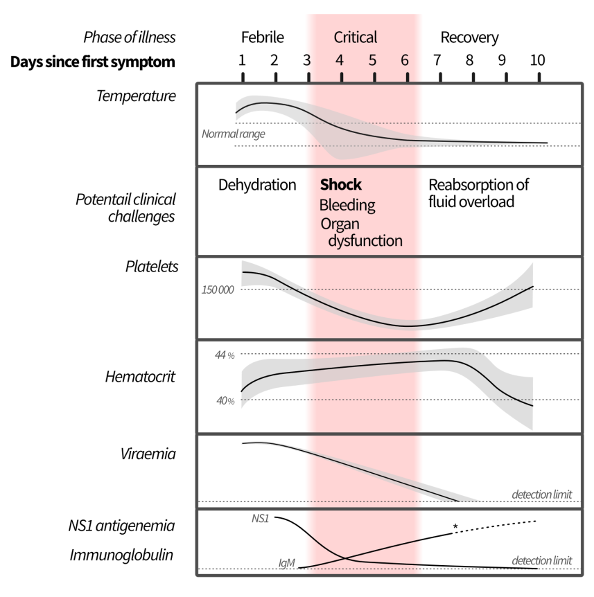
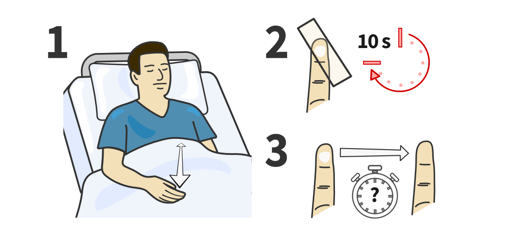
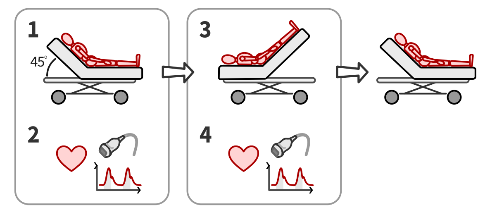

  

    

      
3,9 tỷ

      
Người đang bị đe dọa bởi Arbovirus truyền qua muỗi Aedes toàn cầu

    

    

      
Dịch Tinh Thể

      
Lựa chọn hàng đầu (Crystalloids) — giảm biến cố bất lợi nặng so với Colloids

    

    

      
CRT &gt; 3s / Lactate

      
Chỉ số tưới máu ngoại biên hướng dẫn dịch truyền (Khuyến nghị MẠNH)

    

    

      
CẤM NSAIDs

      
Chống chỉ định tuyệt đối trong pha cấp do nguy cơ xuất huyết tiêu hóa tử vong

    

  

  

    

      
🧪

      

        
Chẩn đoán phân biệt Arbovirus

        
Dengue (cô đặc máu, giảm tiểu cầu, giảm BC) vs. Chikungunya (đau/viêm khớp dữ dội) vs. Zika (ngứa, phát ban) vs. Sốt vàng (vàng da, suy gan thận).

      

    

    

      
💧

      

        
Hồi sức dịch thông minh

        
Bù dịch ORS theo phác đồ ngoại trú; dùng dịch tinh thể đẳng trương nội trú; hướng dẫn thể tích bằng đích CRT, động học Lactate và test nâng chân PLR.

      

    

    

      
🛑

      

        
An toàn thuốc &amp; Cảnh báo

        
Cấm dùng NSAIDs và Corticoid thường quy. Không truyền tiểu cầu dự phòng khi &lt; 50.000/µL nếu không chảy máu. Phác đồ NAC cho suy gan Sốt vàng.

      

    

  

  

    <a href="#sec-dichte" class="quickmenu-item active">1. Dịch tễ</a>
    <a href="#sec-chandoan" class="quickmenu-item">2. Chẩn đoán PB</a>
    <a href="#sec-donghoc" class="quickmenu-item">3. Động học Dengue</a>
    <a href="#sec-ngoaitru" class="quickmenu-item">4. Quản lý ngoại trú</a>
    <a href="#sec-hoisucdich" class="quickmenu-item">5. Hồi sức dịch</a>
    <a href="#sec-tuoimau" class="quickmenu-item">6. CRT &amp; Lactate</a>
    <a href="#sec-hotro" class="quickmenu-item">7. Thuốc &amp; Sốt vàng</a>
    <a href="#sec-grade" class="quickmenu-item">8. Bằng chứng GRADE</a>
  

  {/* SECTION 1: DICH TE HOC */}
  

    
🌏 <h2 class="sec-title">1. Đại Cương &amp; Bối Cảnh Dịch Tễ Học Arbovirus Toàn Cầu</h2>

    

      

        🦟
        

          <strong>Tác nhân &amp; Véc-tơ truyền bệnh:</strong>
          Các bệnh lý do vi rút truyền qua động vật chân khớp (Arbovirus) bao gồm <strong>Dengue, Chikungunya, và Zika</strong> được truyền chủ yếu bởi muỗi thuộc chi <em>Aedes (Stegomyia)</em> (chủ yếu là <em>Aedes aegypti</em> và <em>Aedes albopictus</em>). Trong môi trường đô thị, loài muỗi này cũng là tác nhân truyền vi rút <strong>Sốt vàng (Yellow fever)</strong>.
        

      

      

        

          

          

            
📊

            
Gánh Nặng Y Tế Toàn Cầu

          

          

            <ul style="margin-left: 1rem; line-height: 1.7;">
              <li>Đe dọa sức khỏe của khoảng <strong>3,9 tỷ người</strong> tại các vùng nhiệt đới và cận nhiệt đới</li>
              <li>Biến đổi khí hậu &amp; đô thị hóa đang mở rộng phạm vi véc-tơ sang các vùng ôn đới</li>
              <li>Tần suất bùng phát dịch tăng cao, số ca mắc nặng và tử vong tăng theo mùa</li>
            </ul>
          

          
Thách thức y tế công cộng ưu tiên của WHO

        

        

          

          

            
⚠️

            
Thách Thức Đồng Lưu Hành

          

          

            <ul style="margin-left: 1rem; line-height: 1.7;">
              <li>Sự <strong>lưu hành đồng thời (co-circulation)</strong> của nhiều loại Arbovirus trong cùng một khu vực</li>
              <li>Gây khó khăn rất lớn trong chẩn đoán phân biệt ở giai đoạn sớm</li>
              <li>Dễ chẩn đoán nhầm Dengue nặng với các bệnh cảnh sốt cấp tính khác</li>
            </ul>
          

          
Cần bộ tiêu chuẩn phân loại nhạy &amp; đặc hiệu

        

      

    

  

  {/* SECTION 2: CHAN DOAN PHAN BIET */}
  

    
🔬 <h2 class="sec-title">2. Chẩn Đoán Phân Biệt Lâm Sàng Giữa Các Arbovirus</h2>

    

      
Dựa trên tổng quan hệ thống và phân tích gộp các nghiên cứu lâm sàng, WHO 2025 đã chuẩn hóa các dấu hiệu phân biệt Arbovirus với các nguyên nhân gây sốt khác và phân biệt giữa các Arbovirus với nhau:

      <h3 class="sec-subtitle">Bảng 1: Biểu hiện phân biệt Arbovirus với các nguyên nhân gây sốt khác</h3>
      

        <table class="regimen-table">
          <thead>
            <tr>
              <th style="width:25%">Mức độ bằng chứng</th>
              <th style="width:75%">Các biểu hiện lâm sàng đặc trưng</th>
            </tr>
          </thead>
          <tbody>
            <tr>
              <td class="source-cell">Bằng chứng MẠNH High</td>
              <td>Phát ban (Rash), Viêm kết mạc (Conjunctivitis), Đau khớp (Arthralgia - Dengue/Chikungunya), Đau cơ/xương (Myalgia/bone pain), Xuất huyết da/niêm mạc (Haemorrhage), Giảm tiểu cầu (Thrombocytopenia - Dengue), Tăng Hematocrit tiến triển (Dengue), Giảm bạch cầu (Leukopenia - Dengue), Đau đầu (Dengue), Ngứa (Pruritus - Zika).</td>
            </tr>
            <tr>
              <td class="source-cell">Bằng chứng TRUNG BÌNH Moderate</td>
              <td>Tích tụ dịch kẽ / Tràn dịch màng (Fluid accumulation), Viêm khớp (Arthritis - Chikungunya), Ớn lạnh (Chills - Dengue/Chikungunya), Rối loạn vị giác (Dysgeusia - Dengue).</td>
            </tr>
            <tr>
              <td class="source-cell">Bằng chứng YẾU Low</td>
              <td>Suy nhược (Asthenia), Đau sau hố mắt (Retro-ocular pain).</td>
            </tr>
          </tbody>
        </table>
      

      <h3 class="sec-subtitle" style="margin-top: 1.5rem;">Bảng 2: So sánh đặc điểm lâm sàng đối đầu giữa Dengue, Chikungunya &amp; Zika</h3>
      

        <table class="regimen-table">
          <thead>
            <tr>
              <th style="width:18%">Mức độ bằng chứng</th>
              <th style="width:28%">🦟 Sốt xuất huyết Dengue</th>
              <th style="width:27%">🦴 Sốt Chikungunya</th>
              <th style="width:27%">🌿 Nhiễm vi rút Zika</th>
            </tr>
          </thead>
          <tbody>
            <tr>
              <td class="source-cell">MẠNH (High)</td>
              <td>
                • <strong>Giảm tiểu cầu nặng</strong> 
                • <strong>Tăng Hematocrit tiến triển</strong> 
                • <strong>Giảm bạch cầu rõ rệt</strong>
              </td>
              <td>
                • <strong>Đau khớp dữ dội (Arthralgia)</strong> (đối xứng, đa khớp nhỏ/lớn, kéo dài)
              </td>
              <td>
                • <strong>Ngứa nhiều (Pruritus)</strong>
              </td>
            </tr>
            <tr>
              <td class="source-cell">TRUNG BÌNH (Mod)</td>
              <td>
                • Chán ăn hoặc Nôn ói 
                • Đau bụng vùng gan 
                • Ớn lạnh, Xuất huyết da/niêm 
                • Phát ban &amp; Viêm kết mạc
              </td>
              <td>
                • <strong>Viêm khớp thực sự (Arthritis)</strong> 
                • Đau cơ hoặc đau xương 
                • Phát ban &amp; Viêm kết mạc
              </td>
              <td>
                • Phát ban dạng dát sẩn 
                • Viêm kết mạc mắt không mủ
              </td>
            </tr>
            <tr>
              <td class="source-cell">YẾU (Low)</td>
              <td>
                • Đau sau hố mắt, Đau đầu 
                • Gan to, Tiêu chảy, Ho 
                • Tăng men gan AST/ALT 
                • Nghiệm pháp dây thắt (+)
              </td>
              <td>
                • Xuất huyết da/niêm mạc 
                • Sưng hạch ngoại biên
              </td>
              <td>
                • Viêm họng hoặc Đau họng
              </td>
            </tr>
          </tbody>
        </table>
      

      

        🟡
        

          <strong>Đặc điểm nhận diện Sốt vàng (Yellow Fever):</strong>
          Khác biệt hoàn toàn ở những ca bệnh nặng khi tiến triển sang <strong>giai đoạn nhiễm độc thứ hai</strong>: Kèm theo <strong>suy gan cấp và suy thận cấp</strong>, biểu hiện <strong>vàng da niêm tiến triển (jaundice)</strong>, tiểu sẫm màu, đau hạ sườn phải và xuất huyết tiêu hóa ồ ạt ("chất nôn đen" do máu biến tính).
        

      

    

  

  {/* SECTION 3: DONG HOC 3 PHA DENGUE */}
  

    
📈 <h2 class="sec-title">3. Động Học Sinh Lý Bệnh &amp; Phân Loại Bệnh Dengue</h2>

    

      

        
        

          
Fig. 1 – Tiến trình tự nhiên của bệnh Sốt xuất huyết Dengue theo ngày (WHO 2025 Figure 2-1)

          Động học tương quan giữa Thân nhiệt, Hiện tượng thoát huyết tương, Số lượng Tiểu cầu/Hematocrit và Tải lượng Vi rút / Kháng thể.
        

      

      

        

          

          

            
1

            
Pha Sốt (Febrile Phase) Ngày 1 – Ngày 3

          

          

            <ul style="margin-left:1rem;line-height:1.7;">
              <li>Sốt cao đột ngột liên tục, đau đầu, đau cơ khớp</li>
              <li>Nguy cơ <strong>mất nước (Dehydration)</strong> do sốt cao, nôn ói</li>
              <li>Tải lượng vi rút (Viraemia) và kháng nguyên NS1 cao nhất</li>
              <li>Bạch cầu và tiểu cầu bắt đầu giảm nhẹ</li>
            </ul>
          

          
Bù dịch sớm bằng đường uống

        

        

          

          

            
2

            
Pha Nguy Hiểm (Critical Phase) Ngày 4 – Ngày 6 (Thời điểm hạ sốt)

          

          

            <ul style="margin-left:1rem;line-height:1.7;">
              <li><strong>Thoát huyết tương (Plasma leakage)</strong> đỉnh điểm do tăng tính thấm thành mạch</li>
              <li><strong>Hematocrit tăng vọt</strong> (cô đặc máu), <strong>Tiểu cầu giảm sâu nhất</strong></li>
              <li>Biến chứng: <strong>Sốc giảm thể tích</strong>, Xuất huyết nặng, Suy đa tạng</li>
            </ul>
          

          
Theo dõi sát CRT, Hct, Dấu hiệu cảnh báo

        

        

          

          

            
3

            
Pha Hồi Phục (Recovery Phase) Ngày 7 – Ngày 10

          

          

            <ul style="margin-left:1rem;line-height:1.7;">
              <li>Dịch thoát mạch được <strong>tái hấp thu (Fluid reabsorption)</strong> về lòng mạch</li>
              <li>Hct ổn định về bình thường; Bạch cầu tăng nhanh, Tiểu cầu hồi phục</li>
              <li>Kháng thể IgM và IgG xuất hiện rõ rệt</li>
              <li><strong>Nguy cơ quá tải dịch (Fluid overload)</strong> nếu tiếp tục truyền dịch nhanh</li>
            </ul>
          

          
Giảm và ngưng truyền dịch tĩnh mạch

        

      

      <h3 class="sec-subtitle" style="margin-top: 1.5rem;">6 Dấu Hiệu Cảnh Báo Của Sốt Xuất Huyết Dengue (Dengue with Warning Signs)</h3>
      

        🚨
        

          <strong>Bắt buộc nhập viện theo dõi nội trú khi xuất hiện bất kỳ dấu hiệu nào sau đây:</strong>
          <ol style="margin-left: 1.2rem; margin-top: 0.4rem; line-height: 1.7;">
            <li><strong>Đau bụng:</strong> Đau bụng tiến triển tăng dần đến liên tục và dữ dội (vùng hạ sườn phải).</li>
            <li><strong>Rối loạn tri giác:</strong> Vật vã, kích thích, lờ đừ hoặc li bì, ngủ gà.</li>
            <li><strong>Xuất huyết niêm mạc:</strong> Chảy máu chân răng, chảy máu mũi, xuất huyết âm đạo bất thường, tiểu máu.</li>
            <li><strong>Gan to:</strong> Gan to &gt; 2 cm dưới bờ sườn.</li>
            <li><strong>Nôn ói dai dẳng:</strong> Nôn &ge; 3 lần trong 1 giờ hoặc &ge; 4 lần trong 6 giờ.</li>
            <li><strong>Tăng Hematocrit tiến triển:</strong> Hct tăng liên tiếp trên ít nhất 2 lần xét nghiệm kèm tiểu cầu giảm nhanh.</li>
          </ol>
        

      

    

  

  {/* SECTION 4: QUAN LY NGOAI TRU & DIEU TRI TRIEU CHUNG */}
  

    
💊 <h2 class="sec-title">4. Khuyến Nghị Điều Trị Ngoại Trú Cho Bệnh Nhân Không Nặng</h2>

    

      <h3 class="sec-subtitle">4.1. Liệu Pháp Bù Dịch Đường Uống Theo Phác Đồ (Protocolized Oral Rehydration)</h3>
      

        🥛
        

          <strong>Khuyến nghị WHO [Conditional, Low Certainty]:</strong> Gợi ý sử dụng bù dịch đường uống theo phác đồ (protocolized) thay vì bù dịch tự do. Bệnh nhân được cấp cốc đong thể tích (ví dụ 200 ml) và bảng tự ghi chép lượng nước uống vào và lượng nước tiểu hàng ngày. Giúp giảm nguy cơ nhập viện từ 50/1.000 xuống 28/1.000 (RR 0.55).
          <ul style="margin-left: 1rem; margin-top: 0.4rem;">
            <li><strong>Dịch khuyên dùng:</strong> Oresol (ORS), nước dừa tươi, nước trái cây không thêm đường, nước cháo loãng pha muối, sữa/sữa chua uống.</li>
            <li><strong>Dịch CẤM dùng:</strong> Tránh tuyệt đối nước ngọt có ga, nước ép đóng chai công nghiệp có hàm lượng đường &gt; 5% (làm tăng áp lực thẩm thấu ruột gây tiêu chảy và tăng đường huyết).</li>
          </ul>
        

      

      <h3 class="sec-subtitle" style="margin-top: 1.5rem;">4.2. Kiểm Soát Đau &amp; Hạ Sốt (Symptom Control)</h3>
      

        <table class="regimen-table">
          <thead>
            <tr>
              <th style="width:20%">Hoạt chất</th>
              <th style="width:40%">Liều dùng chuẩn</th>
              <th style="width:40%">Lưu ý lâm sàng &amp; Chống chỉ định</th>
            </tr>
          </thead>
          <tbody>
            <tr>
              <td class="source-cell">Ưu tiên Paracetamol</td>
              <td>
                • <strong>Người lớn (&gt; 50 kg):</strong> 500 mg – 1 g mỗi 4–6 giờ (Tối đa <strong>4 g/ngày</strong>) 
                • <strong>Trẻ em:</strong> 10–15 mg/kg mỗi 4–6 giờ (Tối đa <strong>60 mg/kg/ngày</strong>)
              </td>
              <td>
                • Không lặp lại liều &lt; 4 giờ. Không dùng &gt; 3 ngày ở trẻ nếu không có ý kiến bác sĩ. 
                • <strong>Chỉnh liều suy thận:</strong> GFR 10–50: tối đa 500 mg/6h; GFR &lt; 10: tối đa 500 mg/8h. 
                • <strong>Suy gan / Gilbert:</strong> Tối đa 2 g/ngày. 
                • <strong>CẢNH BÁO:</strong> Không khuyến cáo thường quy cho <strong>Sốt vàng (Yellow fever)</strong> do độc tính gan.
              </td>
            </tr>
            <tr>
              <td class="source-cell">Thay thế Metamizole (Dipyrone)</td>
              <td>
                • <strong>Người lớn (&ge; 15 tuổi, &gt; 53 kg):</strong> 500–1000 mg/lần, tối đa 4 g/ngày 
                • <strong>Trẻ em:</strong> 10 mg/kg/lần (8–16 mg/kg), tối đa 4 lần/ngày
              </td>
              <td>
                • Lựa chọn thay thế ở các nước đã cấp phép lưu hành. 
                • <strong>Nguy cơ suy tủy:</strong> Aplastic anaemia / agranulocytosis. 
                • <strong>Chống chỉ định tuyệt đối:</strong> 3 tháng cuối thai kỳ (suy thận thai nhi, đóng sớm ống động mạch).
              </td>
            </tr>
            <tr>
              <td class="source-cell">CẤM DÙNG NSAIDs &amp; Aspirin</td>
              <td colspan="2">
                <strong>WHO khuyến nghị MẠNH MẼ CHỐNG LẠI việc sử dụng NSAIDs (Aspirin, Ibuprofen, Naproxen, Ketorolac, Indomethacin...)</strong> cho bệnh nhân nghi ngờ hoặc xác định mắc Arbovirus cấp tính [Strong recommendation, Low certainty]. 
                <em>Cơ chế:</em> Ức chế kết tập tiểu cầu không hồi phục + loét niêm mạc dạ dày &rarr; Xuất huyết tiêu hóa ồ ạt tử vong trên nền giảm tiểu cầu của Dengue.
              </td>
            </tr>
            <tr>
              <td class="source-cell">KHÔNG DÙNG Corticosteroids</td>
              <td colspan="2">
                <strong>WHO gợi ý CHỐNG LẠI việc dùng Corticoid hệ thống</strong> cho bệnh nhân không nặng [Conditional, Low certainty]. Không cải thiện tiên lượng, làm chậm thanh thải vi rút và tăng nguy cơ xuất huyết tiêu hóa.
              </td>
            </tr>
          </tbody>
        </table>
      

    

  

  {/* SECTION 5: HOI SUC DICH TRUYEN TINH MACH */}
  

    
💧 <h2 class="sec-title">5. Hồi Sức Dịch Truyền Tĩnh Mạch: Dịch Tinh Thể vs. Cao Phân Tử</h2>

    

      

        ✅
        

          <strong>Khuyến nghị WHO [Conditional, Low Certainty]:</strong>
          WHO gợi ý sử dụng <strong>dung dịch tinh thể (crystalloids - Ringer's Lactate, NaCl 0.9%)</strong> thay vì dung dịch cao phân tử (colloids) cho bệnh nhân cần bù dịch tĩnh mạch điều trị sốt xuất huyết Dengue/Arbovirus nặng.
        

      

      

        

          

          

            
🧪

            
Dung Dịch Tinh Thể (Crystalloids)

          

          

            <ul style="margin-left: 1rem; line-height: 1.7;">
              <li><strong>Ringer's Lactate / Acetate:</strong> Dung dịch cân bằng sinh lý, ít gây toan chuyển hóa tăng clo máu</li>
              <li>Hiệu quả tử vong và suy tạng tương đương cao phân tử (RR = 1.0)</li>
              <li>Thời gian nằm viện tương đương (~4 ngày)</li>
              <li>Chi phí thấp, sẵn có và an toàn vượt trội</li>
            </ul>
          

          
Lựa chọn đầu tay chuẩn hóa

        

        

          

          

            
⚠️

            
Dung Dịch Cao Phân Tử (Colloids)

          

          

            <ul style="margin-left: 1rem; line-height: 1.7;">
              <li><strong>Dextran 40/70, HES (Starch), Gelafusine:</strong> Không giảm tử vong hay chảy máu lâm sàng</li>
              <li><strong>Gia tăng biến cố bất lợi nặng:</strong> RR 7.75 (tăng 27 ca/1.000 BN), gồm phản ứng truyền dịch sốt rét run dữ dội</li>
              <li>Nguy cơ suy thận cấp và rối loạn đông máu tiêu thụ</li>
            </ul>
          

          
Chỉ dành cho hồi sức sốc kháng trị chuyên sâu

        

      

      <h3 class="sec-subtitle" style="margin-top: 1.5rem;">Bảng Thống Kê Các Nghiên Cứu Đánh Giá Dịch Truyền (Table 5-1 WHO 2025)</h3>
      

        <table class="regimen-table">
          <thead>
            <tr>
              <th style="width:60%">Loại dung dịch truyền tĩnh mạch được đánh giá</th>
              <th style="width:20%">Số lượng RCTs</th>
              <th style="width:20%">Tổng số bệnh nhân tích lũy</th>
            </tr>
          </thead>
          <tbody>
            <tr>
              <td class="source-cell">Tinh thể Ringer's Lactate</td>
              <td>7</td>
              <td>484</td>
            </tr>
            <tr>
              <td class="source-cell">Cao phân tử Dextran (Dextran 40 - 10% &amp; Dextran 70 - 6%)</td>
              <td>5</td>
              <td>577</td>
            </tr>
            <tr>
              <td class="source-cell">Cao phân tử HES / Starch (3%, 6%, 10%)</td>
              <td>5</td>
              <td>388</td>
            </tr>
            <tr>
              <td class="source-cell">Tinh thể NaCl 0.9% đẳng trương</td>
              <td>3</td>
              <td>266</td>
            </tr>
            <tr>
              <td class="source-cell">Cao phân tử Gelatins (Gelafusine 3% &amp; 4%)</td>
              <td>2</td>
              <td>207</td>
            </tr>
            <tr>
              <td class="source-cell">Tinh thể Hypertonic lactated saline (Muối ưu trương)</td>
              <td>1</td>
              <td>48</td>
            </tr>
            <tr>
              <td class="source-cell">Chất keo tự nhiên Albumin</td>
              <td>0</td>
              <td>0</td>
            </tr>
          </tbody>
        </table>
      

    

  

  {/* SECTION 6: CHI SO TUOI MAU NGOAI BIEN */}
  

    
💓 <h2 class="sec-title">6. Hướng Dẫn Thể Tích Dịch Bằng Chỉ Số Tưới Máu: CRT, Lactate &amp; PLR</h2>

    

      

        

          

          

            
⏱️

            
Thời Gian Đổ Đầy Mao Mạch (CRT) Khuyến nghị MẠNH MẼ [Strong, Low Certainty]

          

          

            <ul style="margin-left: 1rem; line-height: 1.7;">
              <li>Đánh giá trực quan, không xâm lấn tình trạng tưới máu mô ngoại vi</li>
              <li>Hiệu quả kiểm soát tử vong tương đương đo Lactate (RR 0.89)</li>
              <li>Giảm nhu cầu lọc máu RRT (RR 0.71; giảm 17 ca/1.000 BN)</li>
              <li>Chi phí cực thấp, phù hợp mọi tuyến y tế</li>
            </ul>
          

          
Khuyến nghị áp dụng thường quy tại giường

        

        

          

          

            
🩸

            
Định Lượng Lactate Máu Khuyến nghị MẠNH MẼ [Strong, Moderate]

          

          

            <ul style="margin-left: 1rem; line-height: 1.7;">
              <li>Phản ánh mức độ chuyển hóa kỵ khí mô sâu do giảm thể tích</li>
              <li>Hồi sức theo đích Lactate giảm tử vong (RR 0.65) và rút ngắn nằm ICU (giảm 1,5 ngày)</li>
              <li><strong>Ngoại lệ:</strong> Không có giá trị theo dõi ở bệnh nhân <strong>suy gan cấp</strong></li>
              <li>Ưu tiên lấy máu mao mạch/tĩnh mạch thay vì chọc ĐM (tránh chảy máu)</li>
            </ul>
          

          
Chỉ dấu vàng đánh giá đáp ứng sốc

        

      

      <h3 class="sec-subtitle">Quy Trình Đo Chuẩn Hóa Thời Gian Đổ Đầy Mao Mạch (CRT) — Fig. 2</h3>
      

        
        

          
Fig. 2 – Suggested Way to Measure Standardized CRT (WHO 2025 Figure 5-1)

          <strong>Bước 1:</strong> Đặt bàn tay ngang mức tim (giữa ngực). <strong>Bước 2:</strong> Ép mạnh mặt lòng đốt xa ngón trỏ trong đúng <strong>10 giây</strong> (bằng ngón cái hoặc phiến kính). <strong>Bước 3:</strong> Buông ra và bấm giờ. <strong>Ngưỡng bất thường: &gt; 3 giây</strong>.
        

      

      <h3 class="sec-subtitle">Nghiệm Pháp Nâng Chân Thụ Động (Passive Leg Raise - PLR) — Fig. 3</h3>
      

        
        

          
Fig. 3 – Standardized Passive Leg Raise Test (WHO 2025 Figure 5-2)

          Tự truyền dịch ảo 150–300 ml máu từ chân về tim. Xuất phát từ tư thế nửa ngồi 45° &rarr; hạ thân trên phẳng và nâng 2 chân lên 45° &rarr; Đo cung lượng tim (CO) sau 30–90 giây. Nếu CO tăng &gt; 10% &rarr; còn đáp ứng bù dịch.
        

      

    

  

  {/* SECTION 7: THUOC HO TRO & SOT VANG */}
  

    
🛡️ <h2 class="sec-title">7. Các Liệu Pháp Hỗ Trợ &amp; Điều Trị Đặc Hiệu Bệnh Sốt Vàng</h2>

    

      <h3 class="sec-subtitle">Đánh Giá Các Liệu Pháp Bổ Trợ Hệ Thống (Arbovirus Nặng)</h3>
      

        <table class="regimen-table">
          <thead>
            <tr>
              <th style="width:25%">Liệu pháp</th>
              <th style="width:30%">Khuyến nghị WHO 2025</th>
              <th style="width:45%">Cơ sở khoa học &amp; Cảnh báo</th>
            </tr>
          </thead>
          <tbody>
            <tr>
              <td class="source-cell">Corticoid nặng</td>
              <td><strong>KHÔNG dùng Corticosteroids</strong> [Conditional, Very Low]</td>
              <td>Không cải thiện tử vong; tăng 11 ca chảy máu tiêu hóa/1.000 BN (RR 1.43); ức chế miễn dịch làm chậm sạch vi rút.</td>
            </tr>
            <tr>
              <td class="source-cell">IVIG thường quy</td>
              <td><strong>KHÔNG dùng Immunoglobulins</strong> [Conditional, Very Low]</td>
              <td>Không có bằng chứng giảm tử vong/chảy máu. Chỉ dùng khi có biến chứng thần kinh đặc hiệu (Hội chứng Guillain-Barré sau Zika/Chikungunya).</td>
            </tr>
            <tr>
              <td class="source-cell">Tiểu cầu dự phòng</td>
              <td><strong>KHÔNG truyền tiểu cầu dự phòng</strong> khi tiểu cầu &lt; 50.000/µL nếu <strong>không có xuất huyết hoạt động</strong> [Conditional, Low]</td>
              <td>Không giảm chảy máu; tăng nguy cơ quá tải dịch tuần hoàn, phản ứng truyền máu và tử vong (RR 2.89). Giảm tiểu cầu Dengue có tính tự hồi phục.</td>
            </tr>
            <tr>
              <td class="source-cell">NAC tĩnh mạch</td>
              <td><strong>GỢI Ý DÙNG NAC</strong> cho suy gan cấp do <strong>Sốt vàng (Yellow Fever)</strong> [Conditional, Very Low]</td>
              <td>Phục hồi Glutathione tế bào gan và dọn gốc tự do, bảo vệ nhu mô gan khỏi hoại tử.</td>
            </tr>
          </tbody>
        </table>
      

      <h3 class="sec-subtitle" style="margin-top: 1.5rem;">Phác Đồ Liều Lượng N-acetylcysteine (NAC) Tĩnh Mạch Trong Suy Gan Sốt Vàng (Table 5-12)</h3>
      

        <table class="regimen-table">
          <thead>
            <tr>
              <th style="width:20%">Cân nặng</th>
              <th style="width:25%">Liều tấn công (Loading - 1 giờ)</th>
              <th style="width:25%">Liều thứ hai (Second - 4 giờ)</th>
              <th style="width:30%">Liều thứ ba (Third - 16 giờ)</th>
            </tr>
          </thead>
          <tbody>
            <tr>
              <td class="source-cell">Nhi 5 kg – 20 kg</td>
              <td><strong>150 mg/kg</strong> trong 3 ml/kg dịch (truyền 1h)</td>
              <td><strong>50 mg/kg</strong> trong 7 ml/kg dịch (truyền 4h)</td>
              <td><strong>100 mg/kg</strong> trong 14 ml/kg dịch (truyền 16h)</td>
            </tr>
            <tr>
              <td class="source-cell">Trẻ lớn 21 kg – 40 kg</td>
              <td><strong>150 mg/kg</strong> trong 100 ml dịch (truyền 1h)</td>
              <td><strong>50 mg/kg</strong> trong 250 ml dịch (truyền 4h)</td>
              <td><strong>100 mg/kg</strong> trong 500 ml dịch (truyền 16h)</td>
            </tr>
            <tr>
              <td class="source-cell">Người lớn &ge; 41 kg</td>
              <td><strong>150 mg/kg</strong> trong 200 ml Dextrose 5% (truyền 1h)</td>
              <td><strong>50 mg/kg</strong> trong 500 ml Dextrose 5% (truyền 4h)</td>
              <td><strong>100 mg/kg</strong> trong 1000 ml Dextrose 5% (truyền 16h)</td>
            </tr>
          </tbody>
        </table>
      

      

        🧪
        

          <strong>Kháng thể đơn dòng TY014 &amp; Sofosbuvir trong Sốt vàng:</strong>
          WHO khuyến nghị <strong>CHỈ SỬ DỤNG TRONG NGHIÊN CỨU LÂM SÀNG (Research setting only)</strong>. Dữ liệu thử nghiệm Sofosbuvir trên 67 bệnh nhân cho thấy độ tin cậy bằng chứng còn Rất Thấp (Very Low Certainty) và chưa có đối chứng ngẫu nhiên chuẩn hóa.
        

      

    

  

  {/* SECTION 8: PHUONG PHAP LUAN GRADE & SOF */}
  

    
⚖️ <h2 class="sec-title">8. Phương Pháp Luận GRADE &amp; Bảng Tóm Tắt Bằng Chứng (Summary of Findings)</h2>

    

      <h3 class="sec-subtitle">Ngưỡng Khác Biệt Quan Trọng Tối Thiểu (MID) &amp; Nguy Cơ Nền (Table 3-1 &amp; 3-2)</h3>
      

        <table class="regimen-table">
          <thead>
            <tr>
              <th style="width:30%">Kết cục lâm sàng</th>
              <th style="width:25%">Ngưỡng MID phê chuẩn</th>
              <th style="width:22%">Nguy cơ nền (Không nặng)</th>
              <th style="width:23%">Nguy cơ nền (Nặng/ICU)</th>
            </tr>
          </thead>
          <tbody>
            <tr>
              <td class="source-cell">Tử vong (Mortality)</td>
              <td><strong>3 ca / 1.000 BN</strong></td>
              <td>1 / 1.000</td>
              <td><strong>20 / 1.000</strong></td>
            </tr>
            <tr>
              <td class="source-cell">Xuất huyết (Bleeding)</td>
              <td>15 ca / 1.000 BN</td>
              <td>5 / 1.000</td>
              <td><strong>25 / 1.000</strong></td>
            </tr>
            <tr>
              <td class="source-cell">Suy tạng (Organ failure)</td>
              <td>15 ca / 1.000 BN</td>
              <td>—</td>
              <td><strong>50 / 1.000</strong></td>
            </tr>
            <tr>
              <td class="source-cell">Nhập viện (Hospitalization)</td>
              <td>15 ca / 1.000 BN</td>
              <td>50 / 1.000</td>
              <td>—</td>
            </tr>
            <tr>
              <td class="source-cell">Thời gian nằm viện / Triệu chứng</td>
              <td><strong>1 ngày</strong></td>
              <td>—</td>
              <td>—</td>
            </tr>
            <tr>
              <td class="source-cell">Biến cố bất lợi nghiêm trọng</td>
              <td>15 ca / 1.000 BN</td>
              <td>—</td>
              <td>—</td>
            </tr>
          </tbody>
        </table>
      

      <h3 class="sec-subtitle" style="margin-top: 1.5rem;">Bảng Tổng Hợp Bằng Chứng GRADE SoF Các Can Thiệp Then Chốt</h3>
      

        <table class="regimen-table">
          <thead>
            <tr>
              <th style="width:25%">Can thiệp đối đầu</th>
              <th style="width:25%">Kết cục chính</th>
              <th style="width:30%">Chỉ số thống kê (KTC 95%)</th>
              <th style="width:20%">Độ tin cậy GRADE</th>
            </tr>
          </thead>
          <tbody>
            <tr>
              <td class="source-cell">ORS phác đồ vs Tự do</td>
              <td>Nhập viện</td>
              <td><strong>RR 0.55 (0.23 – 1.3)</strong> (giảm 22/1.000)</td>
              <td>Thấp Low</td>
            </tr>
            <tr>
              <td class="source-cell">Paracetamol vs SOC</td>
              <td>Thời gian nằm viện</td>
              <td>MD -0.1 ngày (-1.11 đến 0.91)</td>
              <td>Trung bình Mod</td>
            </tr>
            <tr>
              <td class="source-cell">NSAIDs vs SOC (Dengue)</td>
              <td>Hạ sốt / Xuất huyết</td>
              <td>Hạ nhiệt 0.45°C / HR chảy máu 0.8 (0.3–2.2)</td>
              <td>Rất thấp Very Low</td>
            </tr>
            <tr>
              <td class="source-cell">Tinh thể vs Cao phân tử</td>
              <td>Tử vong / Biến cố nặng</td>
              <td>Tử vong RR 1.0 / Biến cố <strong>RR 7.75 (1.31–46.0)</strong></td>
              <td>Thấp Low</td>
            </tr>
            <tr>
              <td class="source-cell">CRT vs Lactate</td>
              <td>Tử vong / Nhu cầu RRT</td>
              <td>Tử vong RR 0.89 / <strong>RRT RR 0.71 (0.47–1.1)</strong></td>
              <td>Cao / TB High/Mod</td>
            </tr>
            <tr>
              <td class="source-cell">Lactate vs ScvO2</td>
              <td>Tử vong / Thở máy</td>
              <td><strong>Tử vong RR 0.65</strong> / Thở máy RR 0.71</td>
              <td>Trung bình Mod</td>
            </tr>
            <tr>
              <td class="source-cell">PLR vs SOC</td>
              <td>Nhu cầu thở máy</td>
              <td><strong>RR 0.52 (0.27 – 0.98)</strong> (giảm 24/1.000)</td>
              <td>Thấp Low</td>
            </tr>
            <tr>
              <td class="source-cell">Corticoid nặng vs SOC</td>
              <td>Chảy máu tiêu hóa</td>
              <td><strong>RR 1.43 (1.22 – 1.66)</strong> (tăng 11/1.000)</td>
              <td>Trung bình Mod</td>
            </tr>
            <tr>
              <td class="source-cell">Truyền tiểu cầu dự phòng</td>
              <td>Tử vong / Chảy máu</td>
              <td>Tử vong <strong>RR 2.89 (0.27–31.4)</strong> / Chảy máu RR 0.83</td>
              <td>Rất thấp Very Low</td>
            </tr>
          </tbody>
        </table>
      

    

  

  {/* CITATION BOX */}
  

    <strong>Tài liệu gốc:</strong> World Health Organization. <em>WHO guidelines for clinical management of arboviral diseases: dengue, chikungunya, Zika and yellow fever</em>. Geneva: World Health Organization; 2025.
     
    Biên tập và chuẩn hóa theo tiêu chuẩn Flagship Dashboard CliniPortal EBM 2026.
  

{/* BOTTOM NAV */}

  

    <a href="#/ebm/kho-guidelines" class="btn btn-primary">
      <i class="fa-solid fa-arrow-left"></i> Quay lại Kho Guidelines
    </a>
    <a href="#sec-dichte" class="btn">
      <i class="fa-solid fa-arrow-up"></i> Lên đầu trang
    </a>
  

