

  

    

      
10.8 Triệu Ca

      
Số ca mắc lao mới toàn cầu năm 2023; 1.25 triệu tử vong (vượt COVID-19)

    

    

      
100% mWRD Ban Đầu

      
Khuyến cáo MẠNH thay thế hoàn toàn soi đờm bằng xét nghiệm phân tử nhanh

    

    

      
10 Thuốc Kháng tNGS

      
Chẩn đoán đồng thời đa kháng thuốc trực tiếp từ đờm bằng giải trình tự mục tiêu

    

    

      
Phác Đồ 6 Tháng BPaLM

      
Chuẩn hóa điều trị MDR/RR-TB rút ngắn toàn đường uống dựa trên kết quả FQ DST

    

  

  

    

      
🔬

      

        
Tiếp Cận Toàn Diện Phân Tử (Universal WRD Access)

        
100% bệnh nhân nghi lao được chỉ định mWRD ban đầu; chấm dứt chẩn đoán chậm trễ bằng soi đờm kính hiển vi cổ điển.

      

    

    

      
🧬

      

        
Đột Phá Targeted NGS &amp; Follow-on DST

        
Đọc trực tiếp đột biến kháng Rifampicin, Fluoroquinolones, Bedaquiline, Linezolid trong vài giờ đến vài ngày để chỉ định BPaLM/BPaL sớm.

      

    

    

      
🏥

      

        
Mạng Lưới 3 Tầng &amp; Chuỗi Chăm Sóc Lấy Người Bệnh Làm Trung Tâm

        
12 mốc chuẩn bao phủ từ tuyến trạm y tế cơ sở đến trung tâm tham chiếu quốc gia, tích hợp xét nghiệm nhiễm lao TBST/IGRA và TPT.

      

    

  

  

    <a href="#sec-dichte-khuyencao" class="quickmenu-item active">1. Dịch Tễ &amp; 21 Khuyến Cáo</a>
    <a href="#sec-phanlop-congnghe" class="quickmenu-item">2. 9 Lớp Xét Nghiệm</a>
    <a href="#sec-chandoan-bandau" class="quickmenu-item">3. mWRD Ban Đầu</a>
    <a href="#sec-theodoi-dst-tngs" class="quickmenu-item">4. Follow-on DST &amp; tNGS</a>
    <a href="#sec-nongdo-toihan-dst" class="quickmenu-item">5. Điểm Cắt CC/CB</a>
    <a href="#sec-chandoan-nhiem-lao" class="quickmenu-item">6. Nhiễm Lao (TBST/IGRA)</a>
    <a href="#sec-do-chinh-xac-ebm" class="quickmenu-item">7. Độ Chính Xác EBM</a>
    <a href="#sec-he-thong-thuat-toan" class="quickmenu-item">8. 4 Thuật Toán Mô Hình</a>
    <a href="#sec-mang-luoi-trien-khai" class="quickmenu-item">9. Mạng Lưới &amp; 10 Bước Triển Khai</a>
  

  <!-- ========================================== -->
  <!-- SECTION 1: DỊCH TỄ HỌC & 21 KHUYẾN CÁO CỐT LÕI -->
  <!-- ========================================== -->
  

    

      🌍
      <h2 class="sec-title">1. Bối Cảnh Dịch Tễ Học Toàn Cầu, Chiến Lược End TB &amp; 21 Khuyến Cáo Cốt Lõi WHO 2025</h2>
    

    

      
      

        

          

          

            
📊

            
Gánh Nặng Lao Hoạt Động &amp; Tử Vong Toàn Cầu

          

          

            
<strong>Nhiễm tiềm ẩn:</strong> Ước tính 1/4 dân số thế giới nhiễm vi khuẩn <em>Mycobacterium tuberculosis</em> (Mtb).

            
<strong>Số ca mắc mới 2023:</strong> Khoảng <strong>10.8 triệu người</strong> chuyển tiến thành bệnh lao hoạt động, trong đó có 8.2 triệu ca được chẩn đoán và báo cáo cho WHO.

            
<strong>Tử vong:</strong> 1.25 triệu ca tử vong năm 2023 (vượt qua COVID-19 trở thành nguyên nhân tử vong hàng đầu do một tác nhân truyền nhiễm đơn lẻ).

          

          
Dịch Tễ Học Khẩn Cấp

        

        

          

          

            
💊

            
Khoảng Trống Điều Trị Lao Kháng Thuốc (DR-TB)

          

          

            
<strong>Lao Hr-TB:</strong> Ước tính 1.000.000 ca kháng Isoniazid (nhạy Rifampicin) trong số các ca báo cáo.

            
<strong>Lao MDR/RR-TB:</strong> Khoảng 410.000 ca phát triển lao đa kháng thuốc hoặc kháng Rifampicin đơn thuần.

            
<strong>Khoảng trống lớn:</strong> Chỉ <strong>2/5</strong> số ca MDR/RR-TB được tiếp cận điều trị; chỉ <strong>55%</strong> bệnh nhân RR-TB được làm xét nghiệm theo dõi kháng Fluoroquinolones (FQs) để tầm soát Pre-XDR-TB.

          

          
Nguy Cơ Bùng Phát Kháng Thuốc

        

        

          

          

            
🎯

            
Chiến Lược End TB (2015–2035) &amp; Tiêu Chuẩn 2023

          

          

            
<strong>Mục tiêu then chốt:</strong> Phát hiện sớm nhiễm lao, phổ cập tiếp cận thử nghiệm độ nhạy cảm của thuốc (universal DST).

            
<strong>Tiếp cận toàn diện theo chuỗi chăm sóc (Care Cascade):</strong> Người tiếp xúc nguy cơ cao phải được xét nghiệm nhiễm lao để điều trị dự phòng (TPT); mWRDs sẵn có cho mọi trường hợp nghi ngờ lao; 100% bệnh nhân vi khuẩn học dương tính phải được xét nghiệm kháng RIF; bệnh nhân RR-TB phải được làm DST kháng FQs, Bedaquiline (BDQ) và Linezolid (LZD).

          

          
Mục Tiêu Thiên Niên Kỷ

        

        

          

          

            
🏷️

            
Nguyên Tắc Phân Lớp Công Nghệ (Class-Based) &amp; WHO PQ

          

          

            
<strong>Chuyển dịch khuyến cáo:</strong> Từ năm 2020, WHO chuyển sang khuyến cáo theo <em>lớp công nghệ</em> (technology classes) thay vì từng thương hiệu riêng lẻ.

            
<strong>9 lớp xét nghiệm hiện hành:</strong> Bao gồm hơn 25 sản phẩm thương mại được xác lập.

            
<strong>Tiền kiểm định (WHO Prequalification - PQ):</strong> Các sản phẩm đạt WHO PQ được đưa vào danh mục cung ứng toàn cầu, tối ưu hóa giá thành, chất lượng và dịch vụ bảo trì.

          

          
Tiêu Chuẩn Toàn Cầu

        

      

      

        📌
        

          <strong>Thay Đổi Bước Ngoặt Của WHO 2025:</strong>
          Chấm dứt hoàn toàn vai trò của soi đờm trực tiếp tìm vi khuẩn kháng cồn toan (AFB smear) làm xét nghiệm chẩn đoán ban đầu. Mọi bệnh nhân nghi ngờ lao phổi hoặc ngoài phổi phải được tiếp cận ngay với các kỹ thuật phân tử nhanh (mWRD).
        

      

      <h3 style="margin-top: 2rem; margin-bottom: 1rem; color: var(--color-primary); font-size: 1.25rem;">
        <i class="fa-solid fa-list-check"></i> Bảng 1.1: Danh Mục Tổng Hợp 21 Khuyến Cáo Của WHO Về Chẩn Đoán Bệnh Lao (Consolidated Recommendations)
      </h3>
      

        <em>(Nguồn: WHO Operational Handbook on Tuberculosis. Module 3: Diagnosis - 2025, Table 1.1, trang 4–6)</em>
      

      

        <table class="regimen-table">
          <thead>
            <tr>
              <th style="width: 8%;">STT</th>
              <th style="width: 62%;">Nội Dung Khuyến Cáo Lâm Sàng Của WHO</th>
              <th style="width: 30%;">Mức Độ Khuyến Cáo &amp; Bằng Chứng</th>
            </tr>
          </thead>
          <tbody>
            <tr>
              <td style="text-align: center; font-weight: bold;">1</td>
              <td>Đối với người lớn và vị thành niên có dấu hiệu/triệu chứng lao hoặc tầm soát dương tính lao phổi, nên sử dụng <strong>LC-aNAATs</strong> trên bệnh phẩm hô hấp làm xét nghiệm chẩn đoán ban đầu thay cho soi kính hiển vi hoặc nuôi cấy.</td>
              <td>Khuyến cáo MẠNH Bằng chứng CAO</td>
            </tr>
            <tr>
              <td style="text-align: center; font-weight: bold;">2</td>
              <td>Đối với người mắc lao xác định vi khuẩn học, nên sử dụng <strong>LC-aNAATs</strong> trên bệnh phẩm hô hấp làm xét nghiệm ban đầu phát hiện kháng Rifampicin thay cho DST nuôi cấy.</td>
              <td>Khuyến cáo MẠNH Bằng chứng CAO</td>
            </tr>
            <tr>
              <td style="text-align: center; font-weight: bold;">3</td>
              <td>Đối với người có dấu hiệu/triệu chứng viêm màng não do lao, nên sử dụng <strong>LC-aNAATs</strong> trên dịch não tủy (CSF) để chẩn đoán ban đầu thay cho soi kính hiển vi hoặc nuôi cấy.</td>
              <td>Khuyến cáo MẠNH Bằng chứng TRUNG BÌNH</td>
            </tr>
            <tr>
              <td style="text-align: center; font-weight: bold;">4</td>
              <td>Đối với người có dấu hiệu/triệu chứng lao ngoài phổi, nên sử dụng <strong>LC-aNAATs</strong> trên chọc hút hạch, mô màng phổi, dịch màng phổi, dịch khớp, dịch màng bụng, dịch màng ngoài tim.</td>
              <td>Khuyến cáo MẠNH Bằng chứng THẤP / RẤT THẤP</td>
            </tr>
            <tr>
              <td style="text-align: center; font-weight: bold;">5</td>
              <td>Đối với người có dấu hiệu/triệu chứng lao phổi, có thể sử dụng <strong>MC-aNAATs</strong> trên bệnh phẩm hô hấp để phát hiện lao phổi và kháng Rifampicin, Isoniazid.</td>
              <td>Cơ sở (Conditional) Bằng chứng TRUNG BÌNH</td>
            </tr>
            <tr>
              <td style="text-align: center; font-weight: bold;">6</td>
              <td>Đối với người lớn và vị thành niên có dấu hiệu/triệu chứng hoặc tầm soát dương tính lao phổi, nên sử dụng <strong>LC-mNAATs</strong> trên bệnh phẩm hô hấp làm xét nghiệm ban đầu.</td>
              <td>Khuyến cáo MẠNH Bằng chứng CAO</td>
            </tr>
            <tr>
              <td style="text-align: center; font-weight: bold;">7</td>
              <td>Đối với người nhiễm HIV (người lớn/vị thành niên) nghi ngờ lao, bệnh nặng hoặc HIV tiến triển, nên <strong>xét nghiệm đồng thời (concurrent testing)</strong> bằng LC-aNAATs (hô hấp) + LF-LAM (nước tiểu).</td>
              <td>Khuyến cáo MẠNH Bằng chứng THẤP</td>
            </tr>
            <tr>
              <td style="text-align: center; font-weight: bold;">8</td>
              <td>Đối với trẻ em âm tính HIV/không rõ HIV nghi ngờ lao phổi, nên <strong>xét nghiệm đồng thời</strong> bằng LC-aNAATs trên mẫu hô hấp và mẫu phân.</td>
              <td>Khuyến cáo MẠNH Bằng chứng THẤP</td>
            </tr>
            <tr>
              <td style="text-align: center; font-weight: bold;">9</td>
              <td>Đối với trẻ em nhiễm HIV nghi ngờ lao phổi, có thể <strong>xét nghiệm đồng thời</strong> bằng LC-aNAATs (hô hấp + phân) và LF-LAM (nước tiểu).</td>
              <td>Cơ sở (Conditional) Bằng chứng THẤP</td>
            </tr>
            <tr>
              <td style="text-align: center; font-weight: bold;">10</td>
              <td>Đối với người mắc lao phổi xác định vi khuẩn học, có thể sử dụng <strong>LC-aNAATs</strong> (Xpert MTB/XDR) trên đờm để phát hiện ban đầu kháng Isoniazid và Fluoroquinolones.</td>
              <td>Cơ sở (Conditional) Bằng chứng TRUNG BÌNH</td>
            </tr>
            <tr>
              <td style="text-align: center; font-weight: bold;">11</td>
              <td>Đối với người mắc lao phổi kháng Rifampicin xác định vi khuẩn học, có thể dùng <strong>LC-aNAATs</strong> trên đờm để phát hiện kháng Ethionamide.</td>
              <td>Cơ sở (Conditional) Bằng chứng RẤT THẤP</td>
            </tr>
            <tr>
              <td style="text-align: center; font-weight: bold;">12</td>
              <td>Đối với người mắc lao phổi kháng Rifampicin xác định vi khuẩn học, có thể dùng <strong>LC-aNAATs</strong> trên đờm để phát hiện kháng Amikacin.</td>
              <td>Cơ sở (Conditional) Bằng chứng THẤP</td>
            </tr>
            <tr>
              <td style="text-align: center; font-weight: bold;">13</td>
              <td>Đối với mẫu đờm soi dương tính hoặc chủng nuôi cấy MTBC, có thể sử dụng <strong>FL-LPA</strong> thương mại làm xét nghiệm ban đầu phát hiện kháng RIF và INH.</td>
              <td>Cơ sở (Conditional) Bằng chứng TRUNG BÌNH</td>
            </tr>
            <tr>
              <td style="text-align: center; font-weight: bold;">14</td>
              <td>Đối với người xác định MDR/RR-TB, có thể sử dụng <strong>SL-LPA</strong> làm xét nghiệm ban đầu phát hiện kháng Fluoroquinolones.</td>
              <td>Cơ sở (Conditional) Bằng chứng TRUNG BÌNH</td>
            </tr>
            <tr>
              <td style="text-align: center; font-weight: bold;">15</td>
              <td>Đối với người xác định MDR/RR-TB, có thể sử dụng <strong>SL-LPA</strong> làm xét nghiệm ban đầu phát hiện kháng các thuốc tiêm hàng hai (SLIDs).</td>
              <td>Cơ sở (Conditional) Bằng chứng THẤP</td>
            </tr>
            <tr>
              <td style="text-align: center; font-weight: bold;">16</td>
              <td>Đối với người mắc lao xác định vi khuẩn học, có thể dùng <strong>HC-rNAATs</strong> (Genoscholar PZA-TB) trên chủng nuôi cấy để phát hiện kháng Pyrazinamide.</td>
              <td>Cơ sở (Conditional) Bằng chứng RẤT THẤP</td>
            </tr>
            <tr>
              <td style="text-align: center; font-weight: bold;">17</td>
              <td>Đối với lao phổi xác định vi khuẩn học, có thể dùng <strong>targeted NGS (tNGS)</strong> trên mẫu hô hấp để chẩn đoán kháng RIF, INH, FQ, PZA và Ethambutol.</td>
              <td>Cơ sở (Conditional) Bằng chứng TRUNG BÌNH / THẤP</td>
            </tr>
            <tr>
              <td style="text-align: center; font-weight: bold;">18</td>
              <td>Đối với lao phổi kháng Rifampicin xác định vi khuẩn học, có thể dùng <strong>tNGS</strong> trên mẫu hô hấp để chẩn đoán kháng INH, FQ, BDQ, LZD, CFZ, PZA, EMB, AMK, STR.</td>
              <td>Cơ sở (Conditional) Bằng chứng CAO đến RẤT THẤP</td>
            </tr>
            <tr>
              <td style="text-align: center; font-weight: bold;">19</td>
              <td>Căn cứ xét nghiệm da dựa trên kháng nguyên <em>M. tuberculosis</em> (<strong>TBSTs</strong>) có thể được sử dụng để xét nghiệm nhiễm lao.</td>
              <td>Cơ sở (Conditional) Bằng chứng RẤT THẤP</td>
            </tr>
            <tr>
              <td style="text-align: center; font-weight: bold;">20</td>
              <td>Phản ứng da Tuberculin (<strong>TST</strong>) hoặc xét nghiệm phóng thích Interferon-gamma (<strong>IGRA</strong>) có thể được dùng để xét nghiệm nhiễm lao.</td>
              <td>Khuyến cáo MẠNH Bằng chứng RẤT THẤP</td>
            </tr>
            <tr>
              <td style="text-align: center; font-weight: bold; color: #dc2626;">21</td>
              <td><strong>KHÔNG ĐƯỢC</strong> sử dụng IGRA và TST tại các nước thu nhập thấp và trung bình để chẩn đoán lao bệnh (phổi/ngoài phổi) hoặc đánh giá bệnh nhân nghi ngờ lao hoạt động.</td>
              <td>Khuyến cáo MẠNH CHỐNG LẠI (Do Not Use)</td>
            </tr>
          </tbody>
        </table>
      

    

  

  <!-- ========================================== -->
  <!-- SECTION 2: PHÂN LOẠI CÔNG NGHỆ & BẢNG THÔNG SỐ -->
  <!-- ========================================== -->
  

    

      🔬
      <h2 class="sec-title">2. Phân Loại Công Nghệ, 9 Lớp Xét Nghiệm mWRD &amp; Bảng Thông Số Kỹ Thuật</h2>
    

    

      <h3 style="color: var(--color-primary); margin-bottom: 1rem;">
        <i class="fa-solid fa-layer-group"></i> Bảng 2.1: Danh Mục Các Lớp Công Nghệ Xét Nghiệm Lao &amp; Sản Phẩm Được WHO Công Nhận
      </h3>
      

        <em>(Nguồn: WHO Operational Handbook on Tuberculosis. Module 3: Diagnosis - 2025, Table 2.1, trang 11–12)</em>
      

      

        <table class="regimen-table">
          <thead>
            <tr>
              <th style="width: 35%;">Mục Đích Lâm Sàng / Lớp Công Nghệ</th>
              <th style="width: 65%;">Các Sản Phẩm Thương Mại Thuộc Lớp Được WHO Khuyến Cáo</th>
            </tr>
          </thead>
          <tbody>
            <tr>
              <td colspan="2" style="background: var(--color-surface-elevated, #f1f5f9); font-weight: bold; color: var(--color-primary);">
                I. Xét Nghiệm Ban Đầu Chẩn Đoán Lao + Phát Hiện Kháng Thuốc
              </td>
            </tr>
            <tr>
              <td><strong>LC-aNAATs</strong> <small>Tự động, độ phức tạp thấp phát hiện TB &amp; kháng RIF</small></td>
              <td>
                • <strong>Xpert® MTB/RIF Ultra</strong> (Cepheid) 
                • <strong>Truenat® MTB Plus &amp; Truenat MTB-RIF Dx</strong> (Molbio Diagnostics)
              </td>
            </tr>
            <tr>
              <td><strong>MC-aNAATs</strong> <small>Tự động, độ phức tạp trung bình phát hiện TB, kháng RIF &amp; INH</small></td>
              <td>
                • <strong>RealTime® MTB &amp; RealTime MTB RIF/INH</strong> (Abbott) 
                • <strong>BD MAX™ MDR-TB</strong> (Becton Dickinson) 
                • <strong>cobas® MTB &amp; cobas MTB-RIF/INH</strong> (Roche) 
                • <strong>FluoroType® MTB &amp; FluoroType MTBDR</strong> (Bruker-Hain Diagnostics)
              </td>
            </tr>

            <tr>
              <td colspan="2" style="background: var(--color-surface-elevated, #f1f5f9); font-weight: bold; color: var(--color-primary);">
                II. Xét Nghiệm Ban Đầu Chẩn Đoán Lao KHÔNG Phát Hiện Kháng Thuốc
              </td>
            </tr>
            <tr>
              <td><strong>LC-mNAATs</strong> <small>Thủ công, độ phức tạp thấp phát hiện MTBC</small></td>
              <td>• <strong>Loopamp™ MTBC Detection Kit (TB-LAMP)</strong> (Eiken Chemical)</td>
            </tr>
            <tr>
              <td><strong>LF-LAM</strong> <small>Sắc ký miễn dịch phát hiện kháng nguyên Lipoarabinomannan nước tiểu</small></td>
              <td>• <strong>Determine™ TB LAM Ag</strong> (Alere / Abbott)</td>
            </tr>

            <tr>
              <td colspan="2" style="background: var(--color-surface-elevated, #f1f5f9); font-weight: bold; color: var(--color-primary);">
                III. Xét Nghiệm Theo Dõi Phát Hiện Kháng Thuốc (Follow-on DST)
              </td>
            </tr>
            <tr>
              <td><strong>LC-aNAATs (Kháng INH &amp; Thuốc hàng 2)</strong></td>
              <td>• <strong>Xpert® MTB/XDR</strong> (Cepheid)</td>
            </tr>
            <tr>
              <td><strong>LPAs</strong> <small>Thử nghiệm lai chuỗi dải mang (Line Probe Assays)</small></td>
              <td>
                • <strong>GenoType® MTBDRplus v2</strong> (Bruker-Hain — kháng RIF &amp; INH) 
                • <strong>GenoType® MTBDRsl</strong> (Bruker-Hain — kháng FQ &amp; SLIDs) 
                • <strong>Genoscholar™ NTM+MDRTB II</strong> (Nipro)
              </td>
            </tr>
            <tr>
              <td><strong>HC-rhNAATs</strong> <small>Xét nghiệm lai đảo ngược độ phức tạp cao</small></td>
              <td>• <strong>Genoscholar PZA-TB II</strong> (Nipro — phát hiện kháng Pyrazinamide)</td>
            </tr>
            <tr>
              <td><strong>Targeted NGS (tNGS)</strong> <small>Giải trình tự gen thế hệ mới mục tiêu đa kháng thuốc</small></td>
              <td>
                • <strong>Deeplex® Myc-TB</strong> (GenoScreen / Illumina) 
                • <strong>AmPORE-TB®</strong> (Oxford Nanopore Technologies — UPDATED 2025) 
                • <strong>TBseq®</strong> (Shengting Medical)
              </td>
            </tr>

            <tr>
              <td colspan="2" style="background: var(--color-surface-elevated, #f1f5f9); font-weight: bold; color: var(--color-primary);">
                IV. Xét Nghiệm Chẩn Đoán Nhiễm Lao (TB Infection)
              </td>
            </tr>
            <tr>
              <td><strong>TBSTs</strong> <small>Xét nghiệm da dựa trên kháng nguyên tái tổ hợp đặc hiệu Mtb</small></td>
              <td>
                • <strong>Diaskintest®</strong> (Generium) 
                • <strong>SIILTIBCY® / Cy-Tb</strong> (Serum Institute of India) 
                • <strong>C-TST</strong> (Anhui Zhifei Longcom)
              </td>
            </tr>
            <tr>
              <td><strong>IGRAs</strong> <small>Xét nghiệm phóng thích Interferon-gamma (máu)</small></td>
              <td>
                • <strong>QuantiFERON-TB® Gold Plus</strong> (QIAGEN) 
                • <strong>T-SPOT®.TB</strong> (Oxford Immunotec) 
                • <strong>TB-IGRA</strong> (Beijing Wantai) 
                • <strong>STANDARD E TB-Feron</strong> (SD Biosensor — NEW 2025) 
                • <strong>LIAISON® QFT-PLUS</strong> (Diasorin / QIAGEN — NEW 2025)
              </td>
            </tr>
            <tr>
              <td><strong>TST Cổ Điển</strong></td>
              <td>• <strong>Tuberculin Purified Protein Derivative (PPD)</strong> chuẩn</td>
            </tr>
          </tbody>
        </table>
      

      

        

          

          

            
🔬

            
Hạn Chế Của Phương Pháp Cổ Điển (Conventional Tests)

          

          

            
<strong>Soi đờm kính hiển vi:</strong> Giới hạn phát hiện (LoD) rất kém (5.000–10.000 AFB/mL đờm), độ nhạy chỉ khoảng 50–60%, không phân biệt được vi khuẩn sống hay chết và không phát hiện được kháng thuốc.

            
<strong>Nuôi cấy lỏng (BACTEC MGIT):</strong> Là tiêu chuẩn vàng vi khuẩn học nhưng thời gian quá chậm (1–3 tuần cho kết quả dương, tới 6 tuần cho kết quả âm), đòi hỏi phòng an toàn sinh học cấp 3 (BSL-3).

            
<strong>Định danh loài (Species Identification):</strong> Bắt buộc chạy que thử kháng nguyên MPT64 (Capilia TB-Neo, Bioline TB Ag MPT64, TBcID) trên khuẩn lạc trước khi khẳng định MTBC và làm DST kiểu hình.

          

          
Thay Thế Bằng Phân Tử

        

      

      <h3 style="color: var(--color-primary); margin-top: 2rem; margin-bottom: 1rem;">
        <i class="fa-solid fa-table-list"></i> Bảng 2.2: Tóm Tắt Thông Số Kỹ Thuật Các Xét Nghiệm Chẩn Đoán Ban Đầu Bệnh Lao
      </h3>
      

        <em>(Nguồn: WHO Operational Handbook on Tuberculosis. Module 3: Diagnosis - 2025, Table 2.2, trang 16–17)</em>
      

      

        <table class="regimen-table">
          <thead>
            <tr>
              <th style="width: 15%;">Tên Sản Phẩm (Lớp)</th>
              <th style="width: 15%;">Hệ Thống / Hãng</th>
              <th style="width: 20%;">Gen Mục Tiêu / Phát Hiện Kháng</th>
              <th style="width: 18%;">Bệnh Phẩm Khuyến Cáo</th>
              <th style="width: 14%;">LoD / Thời Gian</th>
              <th style="width: 18%;">Hạ Tầng &amp; Bảo Quản</th>
            </tr>
          </thead>
          <tbody>
            <tr>
              <td><strong>Truenat MTB Plus</strong> <small>(LC-aNAAT)</small></td>
              <td>Molbio Diagnostics / Truelab Uno/Duo/Quattro</td>
              <td><em>nrdZ, IS6110</em> / Không phát hiện kháng</td>
              <td>Đờm, BAL, dịch hút khí quản, tỵ hầu, dịch dạ dày</td>
              <td>≤ 30 CFU/mL <strong>60 phút</strong></td>
              <td>Chạy pin sạc (15–40°C); Chip bảo quản 2–30°C (2 năm)</td>
            </tr>
            <tr>
              <td><strong>Truenat MTB-RIF Dx</strong> <small>(LC-aNAAT)</small></td>
              <td>Molbio Diagnostics / Truelab Uno/Duo/Quattro</td>
              <td><em>rpoB</em> / Phát hiện kháng RIF</td>
              <td>Bệnh phẩm DNA dương tính từ Truenat MTB Plus</td>
              <td>N/A <strong>60 phút</strong></td>
              <td>Chạy pin sạc (15–40°C); Chip bảo quản 2–30°C (2 năm)</td>
            </tr>
            <tr>
              <td><strong>Xpert MTB/RIF Ultra</strong> <small>(LC-aNAAT)</small></td>
              <td>Cepheid / GeneXpert I, II, IV, XVI, Infinity</td>
              <td><em>IS6110, IS1081, rpoB</em> / Phát hiện kháng RIF</td>
              <td>Đờm, dịch phế quản, phân, CSF, hạch, màng phổi, màng tim, dịch khớp, dịch bụng</td>
              <td><strong>16 CFU/mL</strong> <strong>90 phút</strong></td>
              <td>Nguồn điện ổn định, nhiệt độ ≤ 30°C; Cartridge 2–28°C (9 tháng)</td>
            </tr>
            <tr>
              <td><strong>RealTime MTB &amp; RIF/INH</strong> <small>(MC-aNAAT)</small></td>
              <td>Abbott / m2000sp &amp; m2000rt</td>
              <td><em>IS6110, PAB</em> (TB) / <em>rpoB, katG, inhA</em> (RIF &amp; INH)</td>
              <td>Đờm, dịch rửa phế quản, dịch hút khí quản</td>
              <td>17 CFU/mL (TB), 60 CFU/mL (RIF/INH) <strong>7 giờ</strong></td>
              <td>Nguồn điện ổn định, máy đứng > 300kg; Hóa chất -15 đến -25°C</td>
            </tr>
            <tr>
              <td><strong>BD MAX MDR-TB</strong> <small>(MC-aNAAT)</small></td>
              <td>Becton Dickinson / BD MAX</td>
              <td><em>IS6110, IS1081, rpoB, katG, inhA</em> / Kháng RIF &amp; INH</td>
              <td>Đờm, dịch rửa phế quản, dịch hút khí quản</td>
              <td>20 CFU/mL <strong>&lt; 4 giờ</strong></td>
              <td>Nguồn điện ổn định; Hóa chất bảo quản 2–28°C (9 tháng)</td>
            </tr>
            <tr>
              <td><strong>FluoroType MTB &amp; MTBDR</strong> <small>(MC-aNAAT)</small></td>
              <td>Bruker-Hain / GXT 96 &amp; FluoroCycler XT</td>
              <td><em>IS6110</em> (TB) / <em>rpoB, katG, inhA</em> (RIF &amp; INH)</td>
              <td>Đờm, dịch rửa phế quản, dịch hút khí quản</td>
              <td>15 CFU/mL (TB), 20 CFU/mL (MTBDR) <strong>2.5–3 giờ</strong></td>
              <td>Nguồn điện ổn định; Hóa chất bảo quản -15 đến -25°C</td>
            </tr>
            <tr>
              <td><strong>cobas MTB &amp; MTB-RIF/INH</strong> <small>(MC-aNAAT)</small></td>
              <td>Roche / cobas 5800, 6800, 8800</td>
              <td><em>16S rRNA, esx</em> (TB) / <em>rpoB, katG, inhA</em> (RIF &amp; INH)</td>
              <td>Đờm, dịch rửa phế quản, dịch hút khí quản</td>
              <td><strong>9 CFU/mL</strong> (TB), 180 CFU/mL (RIF/INH) <strong>3.5 giờ</strong></td>
              <td>Nguồn điện ổn định, máy sàn > 600kg; Hóa chất 2–8°C</td>
            </tr>
            <tr>
              <td><strong>TB-LAMP</strong> <small>(LC-mNAAT)</small></td>
              <td>Eiken Chemical / HumaLoop T</td>
              <td><em>IS6110, gyrB</em> / Không phát hiện kháng</td>
              <td>Đờm, dịch rửa phế quản, dịch hút dạ dày</td>
              <td>N/A <strong>90 phút</strong></td>
              <td>Chạy pin/điện (15–40°C); Kit bảo quản 2–30°C (14 tháng)</td>
            </tr>
            <tr>
              <td><strong>Determine TB LAM Ag</strong> <small>(LF-LAM)</small></td>
              <td>Alere / Abbott (Thẻ sắc ký que)</td>
              <td>Kháng nguyên Lipoarabinomannan / Không kháng</td>
              <td><strong>Nước tiểu (Urine)</strong></td>
              <td>N/A <strong>25 phút</strong></td>
              <td>Không cần thiết bị điện; Que thử bảo quản 2–30°C (18 tháng)</td>
            </tr>
          </tbody>
        </table>
      

    

  

  <!-- ========================================== -->
  <!-- SECTION 3: XÉT NGHIỆM BAN ĐẦU & QUY TRÌNH MC-aNAATs -->
  <!-- ========================================== -->
  

    

      🧪
      <h2 class="sec-title">3. Xét Nghiệm Chẩn Đoán Ban Đầu (LC-aNAATs, MC-aNAATs, LC-mNAATs, LF-LAM) &amp; Quy Trình Vận Hành</h2>
    

    

      

        

          

          

            
⚡

            
LC-aNAATs: Xpert Ultra &amp; Truenat

          

          

            
<strong>Cơ chế tự động khép kín:</strong> Tách chiết DNA, phản ứng PCR và phát hiện huỳnh quang diễn ra hoàn toàn trong cartridge/chip nhựa dùng một lần, loại bỏ nguy cơ ngoại nhiễm chéo.

            
<strong>Độ nhạy &amp; Độ đặc hiệu:</strong> Sensitivity chẩn đoán lao phổi đạt <strong>90.4%</strong> (95% CI: 88.0–92.4%) và Specificity đạt <strong>94.9%</strong>. Phát hiện kháng RIF đạt độ nhạy <strong>95.1%</strong> và độ đặc hiệu <strong>98.1%</strong>.

            
<strong>Ưu điểm cơ động:</strong> Truenat chạy bằng pin sạc di động, thích hợp tuyệt đối cho vùng sâu vùng xa không có điện lưới ổn định.

          

          
Trụ Cột Tuyến Đầu

        

        

          

          

            
🏭

            
MC-aNAATs: Công Suất Cao Đa Mục Tiêu

          

          

            
<strong>Tự động hóa hoàn toàn:</strong> Chạy mẻ lớn từ 24 đến 96 mẫu/phiên, phát hiện đồng thời vi khuẩn Lao và tình trạng kháng cả <strong>Rifampicin</strong> lẫn <strong>Isoniazid</strong>.

            
<strong>Hiệu năng vượt trội:</strong> Sensitivity phát hiện TB đạt <strong>93.0%</strong>, Specificity <strong>97.7%</strong>. Phát hiện kháng RIF đạt Se 96.7% / Sp 98.9%; kháng INH đạt Se 86.4% / Sp 99.2%.

            
<strong>Phân tuyến:</strong> Đặt tại các trung tâm xét nghiệm tỉnh/vùng có lưu lượng mẫu chuyển lớn.

          

          
Công Suất Tập Trung

        

      

      

        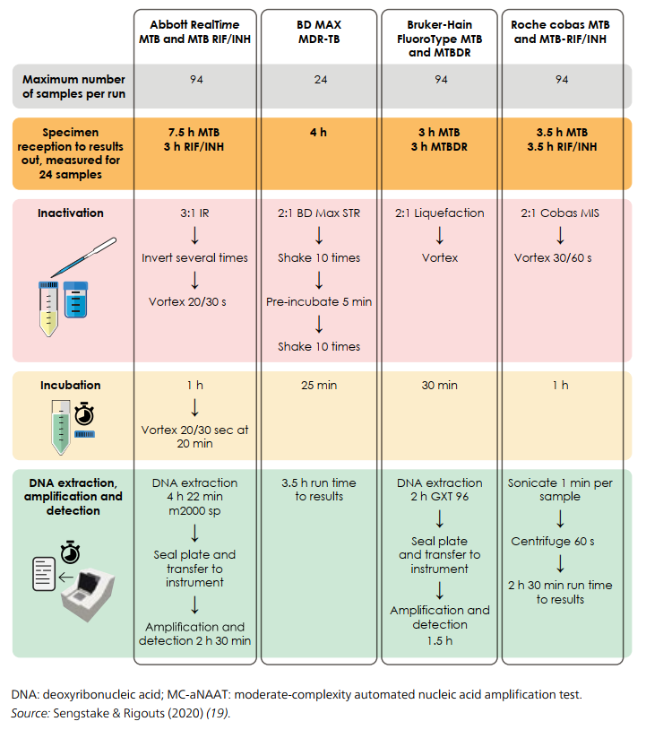
        

          
Figure 2.1. Quy Trình Vận Hành Các Xét Nghiệm MC-aNAATs (Summary of testing procedures for MC-aNAATs)

          Lưu đồ so sánh thời gian, số lượng mẫu trong mẻ và các công đoạn xử lý mẫu đối với 4 hệ thống MC-aNAATs khuyến cáo bởi WHO: Abbott RealTime, BD MAX, Bruker FluoroType và Roche cobas.
        

      

      <!-- VISUAL FLOWCHART COMPONENT REPLACING MONOSPACE ASCII -->
      

        

          <i class="fa-solid fa-code-branch"></i> Lưu Đồ Đối Chiếu 4 Quy Trình Vận Hành MC-aNAATs Chuẩn Hóa
        

        
        

          
          <!-- Abbott -->
          

            

              Abbott RealTime MTB
            

            

              94 mẫu / mẻ 
              ⏱️ <strong>Tổng thời gian:</strong> 7.5h (TB) / 3h (RIF/INH) 
              1️⃣ <strong>Bất hoạt:</strong> 3:1 dung dịch Abbott Inactivation Reagent (IR) 
              2️⃣ <strong>Tách chiết:</strong> Hệ thống m2000sp tự động (4h 22m) 
              3️⃣ <strong>Khuếch đại/Phát hiện:</strong> Máy m2000rt Real-Time PCR (2.5h)
            

          

          <!-- BD MAX -->
          

            

              BD MAX MDR-TB
            

            

              24 mẫu / mẻ 
              ⏱️ <strong>Tổng thời gian:</strong> &lt; 4 giờ (cả TB &amp; RIF/INH) 
              1️⃣ <strong>Bất hoạt:</strong> 2:1 BD Max Sample Treatment Reagent (STR) 
              2️⃣ <strong>Tự động hóa hoàn toàn:</strong> Chuyển trực tiếp ống mẫu vào hệ thống BD MAX tích hợp tách chiết và PCR
            

          

          <!-- Bruker FluoroType -->
          

            

              Bruker FluoroType MTB/MTBDR
            

            

              94 mẫu / mẻ 
              ⏱️ <strong>Tổng thời gian:</strong> 3h (TB) / 3h (MTBDR) 
              1️⃣ <strong>Bất hoạt:</strong> 2:1 Liquefaction Buffer 
              2️⃣ <strong>Tách chiết:</strong> Máy tự động GXT 96 (2 giờ) 
              3️⃣ <strong>Khuếch đại:</strong> Máy nhân gen quang học FluoroCycler XT (1.5 giờ)
            

          

          <!-- Roche cobas -->
          

            

              Roche cobas MTB &amp; RIF/INH
            

            

              94 mẫu / mẻ 
              ⏱️ <strong>Tổng thời gian:</strong> 3.5h (TB) / 3.5h (RIF/INH) 
              1️⃣ <strong>Bất hoạt:</strong> 2:1 cobas Mycobacteria Inactivation Solution 
              2️⃣ <strong>Tự động hóa hoàn toàn:</strong> Hệ thống cobas 5800/6800/8800 thực hiện khép kín nạp mẫu liên tục (random access)
            

          

        

      

    

  

  <!-- ========================================== -->
  <!-- SECTION 4: THEO DÕI KHÁNG THUỐC & TARGETED NGS -->
  <!-- ========================================== -->
  

    

      🧬
      <h2 class="sec-title">4. Xét Nghiệm Theo Dõi Kháng Thuốc (Follow-on DST), Targeted NGS (tNGS) &amp; Đột Biến Kháng Thuốc</h2>
    

    

      

        Sau khi phát hiện bệnh nhân mắc lao kháng Rifampicin (RR-TB) hoặc MDR-TB, việc thực hiện xét nghiệm theo dõi kháng thuốc (Follow-on DST) khẩn cấp là yêu cầu bắt buộc nhằm phân định giữa <strong>MDR-TB nhạy FQ</strong> (đủ điều kiện dùng phác đồ 6 tháng BPaLM), <strong>Pre-XDR-TB</strong> (phác đồ 6 tháng BPaL) và <strong>XDR-TB</strong> (phác đồ cá thể hóa 18 tháng).
      

      <h3 style="color: var(--color-primary); margin-bottom: 1rem;">
        <i class="fa-solid fa-vial-circle-check"></i> Bảng 2.6: So Sánh Các Xét Nghiệm Theo Dõi Phát Hiện Kháng Thuốc Lao
      </h3>
      

        <em>(Nguồn: WHO Operational Handbook on Tuberculosis. Module 3: Diagnosis - 2025, Table 2.6, trang 29–30)</em>
      

      

        <table class="regimen-table">
          <thead>
            <tr>
              <th style="width: 20%;">Lớp Xét Nghiệm / Sản Phẩm</th>
              <th style="width: 22%;">Nền Tảng / Gen Mục Tiêu</th>
              <th style="width: 20%;">Thuốc Phát Hiện Kháng</th>
              <th style="width: 16%;">Thời Gian / Công Suất</th>
              <th style="width: 22%;">Yêu Cầu Hạ Tầng &amp; Khuyến Cáo</th>
            </tr>
          </thead>
          <tbody>
            <tr>
              <td><strong>Xpert MTB/XDR</strong> <small>(LC-aNAAT)</small></td>
              <td>GeneXpert 10 màu / <em>inhA, katG, fabG1, oxyR-ahpC, gyrA, gyrB, rrs, eis</em></td>
              <td><strong>INH, ETO, FQ, AMK</strong></td>
              <td>90 phút 1 mẫu/module</td>
              <td>Điện ổn định, nhiệt độ &lt; 25°C; Khuyến cáo làm ngay sau khi có kết quả mWRD dương tính</td>
            </tr>
            <tr>
              <td><strong>GenoType MTBDRplus / MTBDRsl</strong> <small>(LPA)</small></td>
              <td>Băng lai DNA / <em>rpoB, katG, inhA, gyrA, gyrB, rrs, eis</em></td>
              <td>RIF, INH (v1) / FQ, AMK (v2)</td>
              <td>1–2 ngày 12 hoặc 48 mẫu</td>
              <td>Phòng tách biệt khuếch đại DNA, máy nhân gen, bể lai nhiệt chuyên dụng</td>
            </tr>
            <tr>
              <td><strong>Genoscholar PZA-TB</strong> <small>(HC-rNAAT)</small></td>
              <td>Băng lai 48 đầu dò / toàn bộ gen <em>pncA</em> (&gt; 700 bp)</td>
              <td><strong>Pyrazinamide (PZA)</strong></td>
              <td>1–2 ngày 12 hoặc 48 mẫu</td>
              <td>Thực hiện trên chủng nuôi cấy cách ly; Yêu cầu phòng lai phân tử cao cấp</td>
            </tr>
            <tr>
              <td><strong>Deeplex Myc-TB</strong> <small>(Targeted NGS)</small></td>
              <td>Hệ thống Illumina (iSeq, MiniSeq, MiSeq)</td>
              <td><strong>RIF, INH, PZA, EMB, FQ, BDQ, LZD, CFZ, AMK, STR</strong></td>
              <td>≥ 48 giờ 13–1.200 mẫu</td>
              <td>Hệ thống máy giải trình tự, máy tính phân tích sinh tin học mạnh, Internet tốc độ cao</td>
            </tr>
            <tr>
              <td><strong>AmPORE-TB</strong> <small>(Targeted NGS)</small></td>
              <td>Oxford Nanopore (MinION / GridION)</td>
              <td><strong>RIF, INH, PZA, FQ, BDQ, LZD, CFZ, AMK, STR</strong></td>
              <td><strong>5 giờ</strong> 22 mẫu/flow cell</td>
              <td>Hệ thống Nanopore, máy tính phân tích dữ liệu chuyên dụng, cập nhật thêm PZA/BDQ/CFZ năm 2025</td>
            </tr>
          </tbody>
        </table>
      

      

        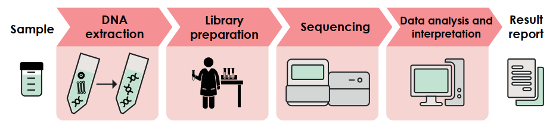
        

          
Figure 2.2. Quy Trình Thử Nghiệm tNGS Từ Mẫu Bệnh Phẩm Đến Báo Cáo Kết Quả (Process of testing, from sample to result report, for targeted NGS)

          Sơ đồ quy trình khép kín 5 bước của giải pháp targeted NGS: từ khâu xử lý mẫu bệnh phẩm hô hấp trực tiếp, tách chiết DNA, chuẩn bị thư viện gen mục tiêu, giải trình tự song song khối lượng lớn đến phân tích sinh tin học tự động đối chiếu Danh mục đột biến WHO (WHO Mutation Catalogue).
        

      

      <!-- VISUAL 5-STEP tNGS WORKFLOW COMPONENT -->
      

        

          <i class="fa-solid fa-arrows-split-up-and-left"></i> Chuỗi 5 Bước Phân Tích tNGS Trực Tiếp Từ Mẫu Đờm Đến Quyết Định Lâm Sàng
        

        

          

            
1

            
<strong>Mẫu Bệnh Phẩm Hô Hấp:</strong> Đờm hoặc dịch rửa phế quản được bất hoạt an toàn sinh học, ly giải vi khuẩn trực tiếp không cần nuôi cấy tiên phát.

          

          

            
2

            
<strong>Tách Chiết DNA Tinh Khiết:</strong> Thu hồi toàn bộ DNA vi khuẩn <em>M. tuberculosis</em> đạt nồng độ và độ tinh sạch tiêu chuẩn.

          

          

            
3

            
<strong>Chuẩn Bị Thư Viện Gen Mục Tiêu:</strong> Nhân bản chọn lọc (Multiplex PCR) các đoạn gen mã hóa đích tác dụng của 10 thuốc chống lao thiết yếu.

          

          

            
4

            
<strong>Giải Trình Tự Song Song Khối Lượng Lớn:</strong> Đọc hàng triệu đoạn trình tự trên máy giải trình tự thế hệ mới (Illumina hoặc Oxford Nanopore).

          

          

            
5

            
<strong>Phân Tích Sinh Tin Học &amp; Báo Cáo Lâm Sàng:</strong> Phần mềm tự động đối chiếu biến dị với WHO Catalogue of Mutations, trả kết quả nhạy/kháng 10 thuốc sau 5h (ONT) hoặc 48h (Illumina).

          

        

      

      <h3 style="color: var(--color-primary); margin-top: 2rem; margin-bottom: 1rem;">
        <i class="fa-solid fa-list-check"></i> Bảng 2.8: Danh Mục Các Giải Pháp tNGS &amp; Các Thuốc Được WHO Khuyến Cáo Đọc Kết Quả Kháng Thuốc
      </h3>
      

        <em>(Nguồn: WHO Operational Handbook on Tuberculosis. Module 3: Diagnosis - 2025, Table 2.8, trang 37)</em>
      

      

        <table class="regimen-table">
          <thead>
            <tr>
              <th style="width: 28%;">Giải Pháp tNGS Được WHO Khuyến Cáo</th>
              <th style="text-align: center;">RIF</th>
              <th style="text-align: center;">INH</th>
              <th style="text-align: center;">PZA</th>
              <th style="text-align: center;">EMB</th>
              <th style="text-align: center;">FQ</th>
              <th style="text-align: center;">BDQ</th>
              <th style="text-align: center;">LZD</th>
              <th style="text-align: center;">CFZ</th>
              <th style="text-align: center;">AMK</th>
              <th style="text-align: center;">STR</th>
            </tr>
          </thead>
          <tbody>
            <tr>
              <td><strong>Deeplex Myc-TB</strong> <small>(GenoScreen / Illumina)</small></td>
              <td style="text-align: center; color: #16a34a; font-weight: bold; font-size: 1.1rem;">✓</td>
              <td style="text-align: center; color: #16a34a; font-weight: bold; font-size: 1.1rem;">✓</td>
              <td style="text-align: center; color: #16a34a; font-weight: bold; font-size: 1.1rem;">✓</td>
              <td style="text-align: center; color: #16a34a; font-weight: bold; font-size: 1.1rem;">✓</td>
              <td style="text-align: center; color: #16a34a; font-weight: bold; font-size: 1.1rem;">✓</td>
              <td style="text-align: center; color: #16a34a; font-weight: bold; font-size: 1.1rem;">✓</td>
              <td style="text-align: center; color: #16a34a; font-weight: bold; font-size: 1.1rem;">✓</td>
              <td style="text-align: center; color: #16a34a; font-weight: bold; font-size: 1.1rem;">✓</td>
              <td style="text-align: center; color: #16a34a; font-weight: bold; font-size: 1.1rem;">✓</td>
              <td style="text-align: center; color: #16a34a; font-weight: bold; font-size: 1.1rem;">✓</td>
            </tr>
            <tr>
              <td><strong>AmPORE-TB</strong> <small>(Oxford Nanopore Technologies)</small></td>
              <td style="text-align: center; color: #16a34a; font-weight: bold; font-size: 1.1rem;">✓</td>
              <td style="text-align: center; color: #16a34a; font-weight: bold; font-size: 1.1rem;">✓</td>
              <td style="text-align: center; color: #16a34a; font-weight: bold; font-size: 1.1rem;">✓*</td>
              <td style="text-align: center; color: #94a3b8;">—</td>
              <td style="text-align: center; color: #16a34a; font-weight: bold; font-size: 1.1rem;">✓</td>
              <td style="text-align: center; color: #16a34a; font-weight: bold; font-size: 1.1rem;">✓*</td>
              <td style="text-align: center; color: #16a34a; font-weight: bold; font-size: 1.1rem;">✓</td>
              <td style="text-align: center; color: #16a34a; font-weight: bold; font-size: 1.1rem;">✓*</td>
              <td style="text-align: center; color: #16a34a; font-weight: bold; font-size: 1.1rem;">✓</td>
              <td style="text-align: center; color: #16a34a; font-weight: bold; font-size: 1.1rem;">✓</td>
            </tr>
            <tr>
              <td><strong>TBSeq</strong> <small>(Shengting Medical)</small></td>
              <td style="text-align: center; color: #94a3b8;">—</td>
              <td style="text-align: center; color: #94a3b8;">—</td>
              <td style="text-align: center; color: #94a3b8;">—</td>
              <td style="text-align: center; color: #16a34a; font-weight: bold; font-size: 1.1rem;">✓</td>
              <td style="text-align: center; color: #94a3b8;">—</td>
              <td style="text-align: center; color: #94a3b8;">—</td>
              <td style="text-align: center; color: #94a3b8;">—</td>
              <td style="text-align: center; color: #94a3b8;">—</td>
              <td style="text-align: center; color: #94a3b8;">—</td>
              <td style="text-align: center; color: #94a3b8;">—</td>
            </tr>
          </tbody>
        </table>
      

      

        <em>* Ghi chú: Dấu (✓*) biểu thị 3 thuốc mới được WHO cập nhật bổ sung tiêu chuẩn đọc kết quả cho AmPORE-TB (ONT) vào năm 2025: Pyrazinamide (PZA), Bedaquiline (BDQ) và Clofazimine (CFZ).</em>
      

    

  

  <!-- ========================================== -->
  <!-- SECTION 5: ĐỊNH NGHĨA DR-TB & NỒNG ĐỘ TỚI HẠN CC/CB -->
  <!-- ========================================== -->
  

    

      💊
      <h2 class="sec-title">5. Định Nghĩa DR-TB, Nồng Độ Tới Hạn (CC) &amp; Điểm Cắt Lâm Sàng (CB) Hàng 1, Hàng 2</h2>
    

    

      

        

          

          

            
⚠️

            
Định Nghĩa Pre-XDR-TB (WHO Chuẩn Hóa)

          

          

            
Bệnh lao do chủng vi khuẩn <em>M. tuberculosis</em> thỏa mãn tiêu chuẩn <strong>MDR/RR-TB</strong> (kháng Rifampicin có hoặc không kèm kháng Isoniazid) VÀ có kháng thêm bất kỳ thuốc nào thuộc nhóm <strong>Fluoroquinolones (Levofloxacin hoặc Moxifloxacin)</strong>.

          

          
Tiền Siêu Kháng Thuốc

        

        

          

          

            
🚨

            
Định Nghĩa XDR-TB (Siêu Kháng Thuốc)

          

          

            
Bệnh lao do chủng vi khuẩn <em>M. tuberculosis</em> thỏa mãn tiêu chuẩn <strong>MDR/RR-TB</strong>, kháng nhóm <strong>Fluoroquinolones</strong> VÀ kháng thêm ít nhất một thuốc thuộc <strong>Nhóm A bổ sung (Bedaquiline hoặc Linezolid)</strong>.

          

          
Siêu Kháng Thuốc

        

      

      <h3 style="color: var(--color-primary); margin-top: 2rem; margin-bottom: 1rem;">
        <i class="fa-solid fa-flask"></i> Bảng 2.9: Nồng Độ Tới Hạn (Critical Concentrations - CC) Của Các Thuốc Hàng 1 Trong DST Kiểu Hình
      </h3>
      

        <em>(Nguồn: WHO Operational Handbook on Tuberculosis. Module 3: Diagnosis - 2025, Table 2.9, trang 45)</em>
      

      

        <table class="regimen-table">
          <thead>
            <tr>
              <th style="width: 25%;">Thuốc Chống Lao Hàng 1</th>
              <th style="width: 15%;">Tên Viết Tắt</th>
              <th style="width: 15%; text-align: center;">Môi Trường LJ (µg/mL)</th>
              <th style="width: 15%; text-align: center;">Middlebrook 7H10 (µg/mL)</th>
              <th style="width: 15%; text-align: center;">Middlebrook 7H11 (µg/mL)</th>
              <th style="width: 15%; text-align: center; background: #e0f2fe;">BACTEC MGIT Lỏng (µg/mL)</th>
            </tr>
          </thead>
          <tbody>
            <tr>
              <td><strong>Rifampicin</strong></td>
              <td>RIF</td>
              <td style="text-align: center;">40.0</td>
              <td style="text-align: center;">1.0</td>
              <td style="text-align: center;">0.5</td>
              <td style="text-align: center; font-weight: bold; color: #0369a1; background: #f0f9ff;">0.5</td>
            </tr>
            <tr>
              <td><strong>Isoniazid</strong></td>
              <td>INH</td>
              <td style="text-align: center;">0.2</td>
              <td style="text-align: center;">0.2</td>
              <td style="text-align: center;">0.2</td>
              <td style="text-align: center; font-weight: bold; color: #0369a1; background: #f0f9ff;">0.1</td>
            </tr>
            <tr>
              <td><strong>Ethambutol</strong></td>
              <td>EMB</td>
              <td style="text-align: center;">2.0</td>
              <td style="text-align: center;">7.5</td>
              <td style="text-align: center;">5.0</td>
              <td style="text-align: center; font-weight: bold; color: #0369a1; background: #f0f9ff;">5.0</td>
            </tr>
            <tr>
              <td><strong>Pyrazinamide</strong></td>
              <td>PZA</td>
              <td style="text-align: center; color: #94a3b8;">—</td>
              <td style="text-align: center; color: #94a3b8;">—</td>
              <td style="text-align: center; color: #94a3b8;">—</td>
              <td style="text-align: center; font-weight: bold; color: #0369a1; background: #f0f9ff;">100.0</td>
            </tr>
            <tr>
              <td><strong>Moxifloxacin (CC)</strong></td>
              <td>MFX</td>
              <td style="text-align: center;">0.5</td>
              <td style="text-align: center;">0.5</td>
              <td style="text-align: center;">1.0</td>
              <td style="text-align: center; font-weight: bold; color: #0369a1; background: #f0f9ff;">0.25</td>
            </tr>
          </tbody>
        </table>
      

      <h3 style="color: var(--color-primary); margin-top: 2rem; margin-bottom: 1rem;">
        <i class="fa-solid fa-prescription-bottle-medical"></i> Bảng 2.10: Nồng Độ Tới Hạn (CC) &amp; Điểm Cắt Lâm Sàng (CB) Của Các Thuốc Điều Trị MDR/RR-TB
      </h3>
      

        <em>(Nguồn: WHO Operational Handbook on Tuberculosis. Module 3: Diagnosis - 2025, Table 2.10, trang 46–47)</em>
      

      

        <table class="regimen-table">
          <thead>
            <tr>
              <th style="width: 15%;">Phân Nhóm</th>
              <th style="width: 25%;">Thuốc Điều Trị MDR/RR-TB</th>
              <th style="width: 12%;">Viết Tắt</th>
              <th style="width: 12%; text-align: center;">LJ (µg/mL)</th>
              <th style="width: 12%; text-align: center;">7H10 (µg/mL)</th>
              <th style="width: 12%; text-align: center;">7H11 (µg/mL)</th>
              <th style="width: 12%; text-align: center; background: #e0f2fe;">MGIT (µg/mL)</th>
            </tr>
          </thead>
          <tbody>
            <tr>
              <td rowspan="5" style="font-weight: bold; background: #f8fafc; color: var(--color-primary);">Nhóm A <small>(Bắt buộc chọn)</small></td>
              <td><strong>Levofloxacin (CC)</strong></td>
              <td>LFX</td>
              <td style="text-align: center;">2.0</td>
              <td style="text-align: center;">1.0</td>
              <td style="text-align: center; color: #94a3b8;">—</td>
              <td style="text-align: center; font-weight: bold; color: #0369a1; background: #f0f9ff;">1.0</td>
            </tr>
            <tr>
              <td><strong>Moxifloxacin (CC)</strong></td>
              <td>MFX</td>
              <td style="text-align: center;">1.0</td>
              <td style="text-align: center;">0.5</td>
              <td style="text-align: center;">0.5</td>
              <td style="text-align: center; font-weight: bold; color: #0369a1; background: #f0f9ff;">0.25</td>
            </tr>
            <tr>
              <td><strong>Moxifloxacin (CB)</strong> <small>(Liều cao 800mg)</small></td>
              <td>MFX-CB</td>
              <td style="text-align: center; color: #94a3b8;">—</td>
              <td style="text-align: center;">2.0</td>
              <td style="text-align: center; color: #94a3b8;">—</td>
              <td style="text-align: center; font-weight: bold; color: #0369a1; background: #f0f9ff;">1.0</td>
            </tr>
            <tr>
              <td><strong>Bedaquiline</strong></td>
              <td>BDQ</td>
              <td style="text-align: center; color: #94a3b8;">—</td>
              <td style="text-align: center; color: #94a3b8;">—</td>
              <td style="text-align: center;">0.25</td>
              <td style="text-align: center; font-weight: bold; color: #0369a1; background: #f0f9ff;">1.0</td>
            </tr>
            <tr>
              <td><strong>Linezolid</strong></td>
              <td>LZD</td>
              <td style="text-align: center; color: #94a3b8;">—</td>
              <td style="text-align: center;">1.0</td>
              <td style="text-align: center;">1.0</td>
              <td style="text-align: center; font-weight: bold; color: #0369a1; background: #f0f9ff;">1.0</td>
            </tr>

            <tr>
              <td rowspan="2" style="font-weight: bold; background: #f8fafc; color: #d97706;">Nhóm B <small>(Ưu tiên thêm)</small></td>
              <td><strong>Clofazimine</strong></td>
              <td>CFZ</td>
              <td style="text-align: center; color: #94a3b8;">—</td>
              <td style="text-align: center; color: #94a3b8;">—</td>
              <td style="text-align: center; color: #94a3b8;">—</td>
              <td style="text-align: center; font-weight: bold; color: #0369a1; background: #f0f9ff;">1.0</td>
            </tr>
            <tr>
              <td><strong>Cycloserine / Terizidone</strong></td>
              <td>CS / TRD</td>
              <td style="text-align: center; color: #94a3b8;">—</td>
              <td style="text-align: center; color: #94a3b8;">—</td>
              <td style="text-align: center; color: #94a3b8;">—</td>
              <td style="text-align: center; font-weight: bold; color: #0369a1; background: #f0f9ff;">16.0</td>
            </tr>

            <tr>
              <td rowspan="6" style="font-weight: bold; background: #f8fafc; color: #475569;">Nhóm C <small>(Bổ trợ khi thiếu)</small></td>
              <td><strong>Ethambutol</strong></td>
              <td>EMB</td>
              <td style="text-align: center;">2.0</td>
              <td style="text-align: center;">5.0</td>
              <td style="text-align: center;">7.5</td>
              <td style="text-align: center; font-weight: bold; color: #0369a1; background: #f0f9ff;">5.0</td>
            </tr>
            <tr>
              <td><strong>Delamanid</strong></td>
              <td>DLM</td>
              <td style="text-align: center; color: #94a3b8;">—</td>
              <td style="text-align: center; color: #94a3b8;">—</td>
              <td style="text-align: center;">0.016</td>
              <td style="text-align: center; font-weight: bold; color: #0369a1; background: #f0f9ff;">0.06</td>
            </tr>
            <tr>
              <td><strong>Pyrazinamide</strong></td>
              <td>PZA</td>
              <td style="text-align: center; color: #94a3b8;">—</td>
              <td style="text-align: center; color: #94a3b8;">—</td>
              <td style="text-align: center; color: #94a3b8;">—</td>
              <td style="text-align: center; font-weight: bold; color: #0369a1; background: #f0f9ff;">100.0</td>
            </tr>
            <tr>
              <td><strong>Amikacin</strong></td>
              <td>AMK</td>
              <td style="text-align: center;">30.0</td>
              <td style="text-align: center;">2.0</td>
              <td style="text-align: center; color: #94a3b8;">—</td>
              <td style="text-align: center; font-weight: bold; color: #0369a1; background: #f0f9ff;">1.0</td>
            </tr>
            <tr>
              <td><strong>Streptomycin</strong></td>
              <td>STR</td>
              <td style="text-align: center;">4.0</td>
              <td style="text-align: center;">2.0</td>
              <td style="text-align: center;">2.0</td>
              <td style="text-align: center; font-weight: bold; color: #0369a1; background: #f0f9ff;">1.0</td>
            </tr>
            <tr>
              <td><strong>Ethionamide / Prothionamide</strong></td>
              <td>ETO / PTO</td>
              <td style="text-align: center;">40.0</td>
              <td style="text-align: center;">5.0</td>
              <td style="text-align: center; color: #94a3b8;">—</td>
              <td style="text-align: center; font-weight: bold; color: #0369a1; background: #f0f9ff;">5.0 / 2.5</td>
            </tr>

            <tr>
              <td style="font-weight: bold; background: #f8fafc; color: #16a34a;">Thuốc Mới</td>
              <td><strong>Pretomanid</strong></td>
              <td>Pa</td>
              <td style="text-align: center; color: #94a3b8;">—</td>
              <td style="text-align: center; color: #94a3b8;">—</td>
              <td style="text-align: center; color: #94a3b8;">—</td>
              <td style="text-align: center; font-weight: bold; color: #0369a1; background: #f0f9ff;">0.5 / 2.0</td>
            </tr>
          </tbody>
        </table>
      

      

        ⚠️
        

          <strong>Quy Tắc Đọc Kết Quả DST Của Pretomanid (Pa) Trên BACTEC MGIT:</strong> 
          • Không mọc ở nồng độ <strong>0.5 µg/mL</strong> → <strong>Nhạy cảm (Susceptible)</strong>. 
          • Mọc ở <strong>0.5 µg/mL</strong> nhưng KHÔNG mọc ở <strong>2.0 µg/mL</strong> → Vẫn xếp loại <strong>Nhạy cảm</strong> nhưng kèm ghi chú lâm sàng nghi ngờ (interpretive uncertainty), cần theo dõi sát đáp ứng điều trị. 
          • Mọc ở nồng độ <strong>2.0 µg/mL</strong> → <strong>Kháng thuốc (Resistant)</strong>.
        

      

    

  

  <!-- ========================================== -->
  <!-- SECTION 6: CHẨN ĐOÁN NHIỄM LAO (TB INFECTION) -->
  <!-- ========================================== -->
  

    

      🛡️
      <h2 class="sec-title">6. Chẩn Đoán Nhiễm Lao (TB Infection): Chuỗi Chăm Sóc 4 Bước, Xét Nghiệm Da TBST &amp; IGRA Máu</h2>
    

    

      

        Chẩn đoán và điều trị nhiễm lao tiềm ẩn (TB Infection) là chiến lược phòng ngừa nòng cốt của WHO nhằm cắt đứt nguồn lây và ngăn chặn sự chuyển tiến sang lao bệnh hoạt động. WHO ban hành chuỗi chăm sóc 4 bước lấy bệnh nhân làm trung tâm, đồng thời mở rộng ứng dụng các xét nghiệm da thế hệ mới (TBSTs) và xét nghiệm phóng thích Interferon-gamma (IGRAs).
      

      

        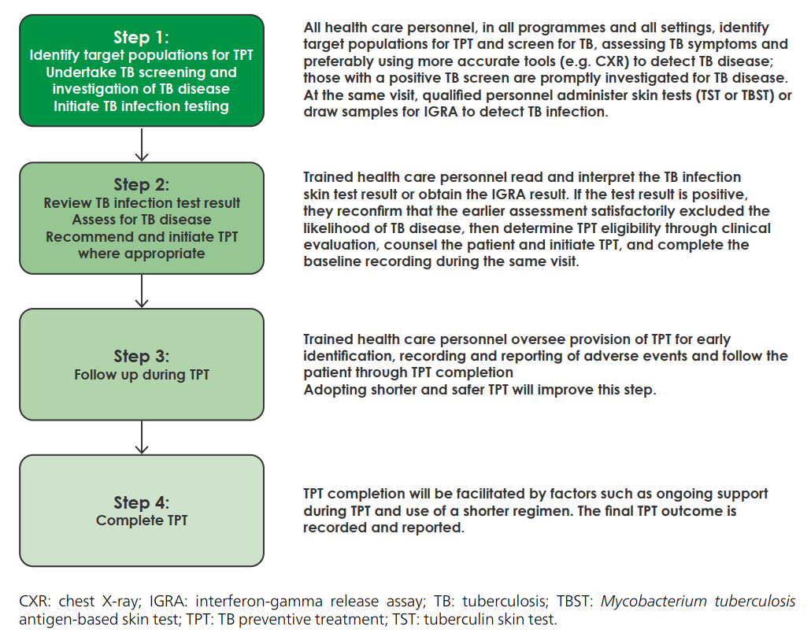
        

          
Figure 2.3. Chuỗi Chăm Sóc Nhiễm Lao 4 Bước Đơn Giản Hóa Lấy Người Bệnh Làm Trung Tâm (Simplified four-step person-centred TB infection cascade of care)

          Sơ đồ 4 bước xuyên suốt: (1) Xác định nhóm nguy cơ &amp; tầm soát lao bệnh; (2) Xét nghiệm nhiễm lao, loại trừ lao hoạt động &amp; bắt đầu điều trị lao dự phòng (TPT); (3) Theo dõi an toàn điều trị &amp; quản lý tác dụng phụ; (4) Hoàn thành phác đồ TPT và ghi nhận dữ liệu chương trình.
        

      

      <!-- VISUAL 4-STEP INFECTION CASCADE COMPONENT -->
      

        

          <i class="fa-solid fa-list-ol"></i> Chi Tiết 4 Bước Chuỗi Chăm Sóc Nhiễm Lao (Cascade of Care)
        

        

          

            
Bước 1: Tầm Soát &amp; Sàng Lọc

            
Xác định đối tượng nguy cơ cao (người tiếp xúc hộ gia đình, người nhiễm HIV, suy giảm miễn dịch). Tầm soát 4 triệu chứng lao và chụp X-quang phổi.

          

          

            
Bước 2: Xét Nghiệm &amp; Khởi Trị TPT

            
Thực hiện TBST, TST hoặc IGRA. Nếu dương tính và loại trừ hoàn toàn lao hoạt động bằng mWRD/CXR → Chỉ định ngay phác đồ TPT ngắn ngày (3HP, 1HP hoặc 3HR).

          

          

            
Bước 3: Theo Dõi &amp; Quản Lý An Toàn

            
Tái khám hàng tháng đánh giá sự tuân thủ, phát hiện độc tính gan của INH/RIF, tương tác thuốc ARV và tư vấn hỗ trợ tâm lý người bệnh.

          

          

            
Bước 4: Hoàn Thành &amp; Báo Cáo

            
Ghi nhận hoàn thành phác đồ dự phòng, cấp giấy chứng nhận và đồng bộ dữ liệu vào hệ thống phần mềm điện tử Prevent TB quốc gia.

          

        

      

      <h3 style="color: var(--color-primary); margin-top: 2rem; margin-bottom: 1rem;">
        <i class="fa-solid fa-syringe"></i> Bảng 2.12: So Sánh Các Xét Nghiệm Da Chẩn Đoán Nhiễm Lao Dựa Trên Kháng Nguyên Đặc Hiệu Mtb (TBSTs)
      </h3>
      

        <em>(Nguồn: WHO Operational Handbook on Tuberculosis. Module 3: Diagnosis - 2025, Table 2.12, trang 60)</em>
      

      

        <table class="regimen-table">
          <thead>
            <tr>
              <th style="width: 25%;">Tiêu Chí So Sánh</th>
              <th style="width: 25%;">Cy-Tb (SIILTIBCY)</th>
              <th style="width: 25%;">Diaskintest</th>
              <th style="width: 25%;">C-TST</th>
            </tr>
          </thead>
          <tbody>
            <tr>
              <td><strong>Nhà sản xuất</strong></td>
              <td>Serum Institute of India (Ấn Độ)</td>
              <td>Generium (Nga)</td>
              <td>Anhui Zhifei Longcom (Trung Quốc)</td>
            </tr>
            <tr>
              <td><strong>Kháng nguyên tái tổ hợp &amp; Vật chủ biểu hiện</strong></td>
              <td>Kháng nguyên đơn ESAT-6 &amp; CFP-10 tách rời (Biểu hiện từ vi khuẩn <em>Lactobacillus lactis</em>)</td>
              <td>Protein dung hợp tái tổ hợp ESAT-6/CFP-10 (Biểu hiện từ <em>Escherichia coli</em>)</td>
              <td>Protein dung hợp tái tổ hợp ESAT-6/CFP-10 (Biểu hiện từ <em>Escherichia coli</em>)</td>
            </tr>
            <tr>
              <td><strong>Hàm lượng trong 1 liều (0.1 mL)</strong></td>
              <td>0.05 µg cho mỗi loại protein (tổng 0.1 µg)</td>
              <td>0.2 µg protein dung hợp tái tổ hợp</td>
              <td>5 U (tương đương protein tái tổ hợp)</td>
            </tr>
            <tr>
              <td><strong>Kỹ thuật tiêm &amp; Đọc kết quả</strong></td>
              <td>Tiêm trong da Mantoux (bảo quản 2–8°C); Đọc đường kính quầng sẩn sau <strong>48–72 giờ</strong></td>
              <td>Tiêm trong da Mantoux (bảo quản 2–8°C); Đọc đường kính quầng sẩn sau <strong>48–72 giờ</strong></td>
              <td>Tiêm trong da Mantoux (bảo quản 2–8°C); Đọc đường kính quầng sẩn/quầng đỏ sau <strong>48–72 giờ</strong></td>
            </tr>
            <tr>
              <td><strong>Chống chỉ định</strong></td>
              <td>Tiền sử dị ứng với các chế phẩm từ <em>L. lactis</em></td>
              <td>Nhiễm trùng cấp hoặc đợt bùng phát mạn tính, dị ứng cấp, động kinh</td>
              <td>Trẻ em &lt; 6 tháng tuổi, người &gt; 65 tuổi, đang sốt hoặc nhiễm trùng cấp tính</td>
            </tr>
          </tbody>
        </table>
      

      

        💡
        

          <strong>Ưu Điểm Vượt Trội Của TBST So Với TST Cổ Điển:</strong>
          TBST sử dụng kháng nguyên đặc hiệu tái tổ hợp ESAT-6 và CFP-10 (vốn bị khuyết thiếu ở chủng vắc-xin BCG và hầu hết các vi khuẩn lao không điển hình NTM). Do đó, TBST <strong>hoàn toàn không bị phản ứng dương tính giả</strong> ở người đã từng tiêm phòng BCG, giúp tiết kiệm chi phí điều trị dự phòng không cần thiết.
        

      

      <h3 style="color: var(--color-primary); margin-top: 2rem; margin-bottom: 1rem;">
        <i class="fa-solid fa-droplet"></i> Bảng 2.13: So Sánh Các Xét Nghiệm Phóng Thích Interferon-Gamma (IGRAs)
      </h3>
      

        <em>(Nguồn: WHO Operational Handbook on Tuberculosis. Module 3: Diagnosis - 2025, Table 2.13, trang 65)</em>
      

      

        <table class="regimen-table">
          <thead>
            <tr>
              <th style="width: 25%;">Xét Nghiệm IGRA</th>
              <th style="width: 20%;">Hãng / Nguyên Lý</th>
              <th style="width: 25%;">Kháng Nguyên Kích Thích</th>
              <th style="width: 15%;">Thời Gian Ủ</th>
              <th style="width: 15%;">Yêu Cầu Thiết Bị</th>
            </tr>
          </thead>
          <tbody>
            <tr>
              <td><strong>QuantiFERON-TB Gold Plus</strong></td>
              <td>QIAGEN / ELISA</td>
              <td>Cocktail peptide ESAT-6 &amp; CFP-10 (kích thích CD4+ và CD8+)</td>
              <td>16–24 giờ</td>
              <td>Tủ ủ 37°C, máy ly tâm, máy rửa &amp; đọc ELISA</td>
            </tr>
            <tr>
              <td><strong>Wantai TB-IGRA</strong></td>
              <td>Beijing Wantai / ELISA</td>
              <td>Protein dung hợp CFP-10/ESAT-6 tái tổ hợp</td>
              <td>20–24 giờ</td>
              <td>Tủ ủ, máy ly tâm, dàn máy phân tích ELISA</td>
            </tr>
            <tr>
              <td><strong>STANDARD E TB-Feron</strong> NEW 2025</td>
              <td>SD Biosensor / ELISA</td>
              <td>Protein tái tổ hợp ESAT-6, CFP-10 và TB7.7</td>
              <td>16–20 giờ</td>
              <td>Tủ ủ, ly tâm, máy rửa &amp; đọc ELISA</td>
            </tr>
            <tr>
              <td><strong>T-SPOT.TB</strong></td>
              <td>Oxford Immunotec / ELISPOT</td>
              <td>Đoạn peptide ESAT-6 &amp; CFP-10 (đếm điểm tế bào tiết IFN-γ)</td>
              <td>16–20 giờ</td>
              <td>Tủ ủ CO₂ 5%, máy ly tâm tách PBMC, máy đọc ELISPOT, tủ an toàn sinh học cấp II</td>
            </tr>
            <tr>
              <td><strong>LIAISON QFT-PLUS</strong> NEW 2025</td>
              <td>Diasorin &amp; QIAGEN / Hóa phát quang CLIA</td>
              <td>Cocktail peptide ESAT-6 &amp; CFP-10</td>
              <td>16–20 giờ</td>
              <td>Tủ ủ, ly tâm, hệ thống phân tích miễn dịch tự động LIAISON CLIA</td>
            </tr>
          </tbody>
        </table>
      

      

        🚫
        

          <strong>CẢNH BÁO LÂM SÀNG NGHIÊM NGẶT (Khuyến Cáo Số 21 - WHO 2025):</strong> 
          <strong>TUYỆT ĐỐI KHÔNG ĐƯỢC</strong> sử dụng các xét nghiệm IGRA (máu) hoặc TST/TBST (da) tại các nước có thu nhập thấp và trung bình (như Việt Nam) để chẩn đoán lao bệnh (lao hoạt động) hoặc loại trừ bệnh lao. TST/IGRA dương tính chỉ phản ánh tình trạng cơ thể đã từng tiếp xúc với kháng nguyên Mtb, hoàn toàn không phân biệt được giữa nhiễm tiềm ẩn và bệnh lao đang tiến triển. Chẩn đoán lao bệnh bắt buộc phải dựa vào triệu chứng lâm sàng, X-quang và bằng chứng vi khuẩn học mWRD/nuôi cấy.
        

      

    

  

  <!-- ========================================== -->
  <!-- SECTION 7: ĐỘ CHÍNH XÁC CHẨN ĐOÁN & BẰNG CHỨNG EBM -->
  <!-- ========================================== -->
  

    

      📊
      <h2 class="sec-title">7. Độ Chính Xác Chẩn Đoán &amp; Bằng Chứng EBM: mWRDs, Kháng RIF &amp; Bảng Đột Biến tNGS</h2>
    

    

      <h3 style="color: var(--color-primary); margin-bottom: 1rem;">
        <i class="fa-solid fa-bullseye"></i> Bảng 3.1: Độ Chính Xác Của Các Xét Nghiệm mWRDs Trong Chẩn Đoán Lao Phổi Ở Người Lớn
      </h3>
      

        <em>(Nguồn: WHO Operational Handbook on Tuberculosis. Module 3: Diagnosis - 2025, Table 3.1, trang 70)</em>
      

      

        <table class="regimen-table">
          <thead>
            <tr>
              <th style="width: 25%;">Lớp Xét Nghiệm Phân Tử</th>
              <th style="width: 18%; text-align: center;">Sensitivity % (95% CI)</th>
              <th style="width: 18%; text-align: center;">Specificity % (95% CI)</th>
              <th style="width: 14%; text-align: center;">Số NC (Cỡ mẫu)</th>
              <th style="width: 25%;">Kết Quả Trên 1.000 BN (Tỷ lệ mắc 10%)</th>
            </tr>
          </thead>
          <tbody>
            <tr>
              <td><strong>LC-aNAATs</strong> <small>(Xpert Ultra / Truenat)</small></td>
              <td style="text-align: center; font-weight: bold; color: #0284c7;">90.4 (88.0–92.4)</td>
              <td style="text-align: center; font-weight: bold; color: #16a34a;">94.9 (93.0–96.3)</td>
              <td style="text-align: center;">34 (14.840)</td>
              <td><strong>TP:</strong> 90 / <strong>FN:</strong> 10 <strong>TN:</strong> 854 / <strong>FP:</strong> 46</td>
            </tr>
            <tr>
              <td><strong>MC-aNAATs</strong> <small>(Abbott, BD MAX, Roche, Bruker)</small></td>
              <td style="text-align: center; font-weight: bold; color: #0284c7;">93.0 (90.9–94.7)</td>
              <td style="text-align: center; font-weight: bold; color: #16a34a;">97.7 (95.6–98.8)</td>
              <td style="text-align: center;">29 (13.852)</td>
              <td><strong>TP:</strong> 93 / <strong>FN:</strong> 7 <strong>TN:</strong> 879 / <strong>FP:</strong> 21</td>
            </tr>
            <tr>
              <td><strong>LC-mNAATs</strong> <small>(TB-LAMP)</small></td>
              <td style="text-align: center; font-weight: bold; color: #0284c7;">84.0 (78.0–89.0)</td>
              <td style="text-align: center; font-weight: bold; color: #16a34a;">96.0 (94.0–97.0)</td>
              <td style="text-align: center;">26 (18.297)</td>
              <td><strong>TP:</strong> 84 / <strong>FN:</strong> 16 <strong>TN:</strong> 864 / <strong>FP:</strong> 36</td>
            </tr>
          </tbody>
        </table>
      

      <h3 style="color: var(--color-primary); margin-top: 2rem; margin-bottom: 1rem;">
        <i class="fa-solid fa-shield-virus"></i> Bảng 3.2: Độ Chính Xác Của Các Xét Nghiệm Phân Tử Trong Phát Hiện Kháng Rifampicin
      </h3>
      

        <em>(Nguồn: WHO Operational Handbook on Tuberculosis. Module 3: Diagnosis - 2025, Table 3.2, trang 71)</em>
      

      

        <table class="regimen-table">
          <thead>
            <tr>
              <th style="width: 25%;">Lớp Xét Nghiệm</th>
              <th style="width: 18%; text-align: center;">Sensitivity % (95% CI)</th>
              <th style="width: 18%; text-align: center;">Specificity % (95% CI)</th>
              <th style="width: 14%; text-align: center;">Số NC (Cỡ mẫu)</th>
              <th style="width: 25%;">Kết Quả Trên 1.000 BN (Tỷ lệ kháng RIF 10%)</th>
            </tr>
          </thead>
          <tbody>
            <tr>
              <td><strong>LC-aNAATs</strong></td>
              <td style="text-align: center; font-weight: bold; color: #dc2626;">95.1 (83.1–98.7)</td>
              <td style="text-align: center; font-weight: bold; color: #16a34a;">98.1 (97.0–98.7)</td>
              <td style="text-align: center;">11 (2.540)</td>
              <td><strong>TP:</strong> 95 / <strong>FN:</strong> 5 <strong>TN:</strong> 883 / <strong>FP:</strong> 17</td>
            </tr>
            <tr>
              <td><strong>MC-aNAATs</strong></td>
              <td style="text-align: center; font-weight: bold; color: #dc2626;">96.7 (93.1–98.4)</td>
              <td style="text-align: center; font-weight: bold; color: #16a34a;">98.9 (97.5–99.5)</td>
              <td style="text-align: center;">18 (2.874)</td>
              <td><strong>TP:</strong> 97 / <strong>FN:</strong> 3 <strong>TN:</strong> 891 / <strong>FP:</strong> 9</td>
            </tr>
          </tbody>
        </table>
      

      <h3 style="color: var(--color-primary); margin-top: 2rem; margin-bottom: 1rem;">
        <i class="fa-solid fa-dna"></i> Bảng 3.6: Độ Chính Xác Của Targeted NGS Trong Phát Hiện Kháng Các Thuốc Điều Trị MDR/RR-TB
      </h3>
      

        <em>(Nguồn: WHO Operational Handbook on Tuberculosis. Module 3: Diagnosis - 2025, Table 3.6, trang 75–76)</em>
      

      

        <table class="regimen-table">
          <thead>
            <tr>
              <th style="width: 25%;">Thuốc Chống Lao Phân Tích</th>
              <th style="width: 20%; text-align: center;">Sensitivity % (95% CI)</th>
              <th style="width: 20%; text-align: center;">Specificity % (95% CI)</th>
              <th style="width: 15%; text-align: center;">Số NC (Cỡ Mẫu)</th>
              <th style="width: 20%; text-align: center;">Chất Lượng Bằng Chứng</th>
            </tr>
          </thead>
          <tbody>
            <tr>
              <td><strong>Isoniazid (INH)</strong></td>
              <td style="text-align: center; font-weight: bold;">96.5 (93.8–99.2)</td>
              <td style="text-align: center; font-weight: bold;">95.8 (91.8–99.8)</td>
              <td style="text-align: center;">12 (1.957)</td>
              <td style="text-align: center;">CAO</td>
            </tr>
            <tr>
              <td><strong>Levofloxacin (LFX)</strong></td>
              <td style="text-align: center; font-weight: bold;">95.8 (90.4–100)</td>
              <td style="text-align: center; font-weight: bold;">96.0 (93.1–98.9)</td>
              <td style="text-align: center;">7 (1.567)</td>
              <td style="text-align: center;">TRUNG BÌNH / CAO</td>
            </tr>
            <tr>
              <td><strong>Moxifloxacin (MFX)</strong></td>
              <td style="text-align: center; font-weight: bold;">96.5 (93.6–99.5)</td>
              <td style="text-align: center; font-weight: bold;">95.2 (91.0–99.4)</td>
              <td style="text-align: center;">8 (1.573)</td>
              <td style="text-align: center;">CAO</td>
            </tr>
            <tr>
              <td><strong>Pyrazinamide (PZA)</strong></td>
              <td style="text-align: center; font-weight: bold;">90.0 (86.8–93.2)</td>
              <td style="text-align: center; font-weight: bold;">98.6 (96.8–100)</td>
              <td style="text-align: center;">3 (615)</td>
              <td style="text-align: center;">CAO</td>
            </tr>
            <tr>
              <td><strong>Bedaquiline (BDQ)</strong></td>
              <td style="text-align: center; font-weight: bold;">67.9 (42.6–93.2)</td>
              <td style="text-align: center; font-weight: bold;">97.0 (94.3–99.7)</td>
              <td style="text-align: center;">4 (550)</td>
              <td style="text-align: center;">THẤP / CAO</td>
            </tr>
            <tr>
              <td><strong>Linezolid (LZD)</strong></td>
              <td style="text-align: center; font-weight: bold;">68.9 (38.7–99.1)</td>
              <td style="text-align: center; font-weight: bold;">99.8 (99.6–100)</td>
              <td style="text-align: center;">6 (1.124)</td>
              <td style="text-align: center;">THẤP / CAO</td>
            </tr>
            <tr>
              <td><strong>Clofazimine (CFZ)</strong></td>
              <td style="text-align: center; font-weight: bold;">70.4 (34.6–100)</td>
              <td style="text-align: center; font-weight: bold;">96.3 (93.2–99.3)</td>
              <td style="text-align: center;">6 (825)</td>
              <td style="text-align: center;">THẤP / CAO</td>
            </tr>
            <tr>
              <td><strong>Amikacin (AMK)</strong></td>
              <td style="text-align: center; font-weight: bold;">87.4 (74.5–100)</td>
              <td style="text-align: center; font-weight: bold;">99.0 (98.4–99.6)</td>
              <td style="text-align: center;">8 (1.118)</td>
              <td style="text-align: center;">RẤT THẤP / TB</td>
            </tr>
            <tr>
              <td><strong>Ethambutol (EMB)</strong></td>
              <td style="text-align: center; font-weight: bold;">96.7 (95.0–98.4)</td>
              <td style="text-align: center; font-weight: bold;">98.4 (96.1–100)</td>
              <td style="text-align: center;">4 (554)</td>
              <td style="text-align: center;">TRUNG BÌNH</td>
            </tr>
            <tr>
              <td><strong>Streptomycin (STR)</strong></td>
              <td style="text-align: center; font-weight: bold;">98.1 (96.1–100)</td>
              <td style="text-align: center; font-weight: bold;">75.0 (59.5–90.5)</td>
              <td style="text-align: center;">5 (743)</td>
              <td style="text-align: center;">CAO / THẤP</td>
            </tr>
          </tbody>
        </table>
      

    

  

  <!-- ========================================== -->
  <!-- SECTION 8: HỆ THỐNG 4 THUẬT TOÁN CHẨN ĐOÁN MÔ HÌNH -->
  <!-- ========================================== -->
  

    

      🔀
      <h2 class="sec-title">8. Hệ Thống 4 Thuật Toán Chẩn Đoán Mô Hình (Model Algorithms 1, 2a, 2b, 3, 4) &amp; Phác Đồ Điều Trị</h2>
    

    

      

        WHO thiết lập hệ thống 4 thuật toán chuẩn mực liên kết chặt chẽ dọc theo chuỗi chăm sóc chẩn đoán: từ phân loại đối tượng nguy cơ, chọn xét nghiệm ban đầu (Thuật toán 1), định hướng thử nghiệm kháng thuốc thứ phát (Thuật toán 2a/2b và 3) đến quản lý điều trị dự phòng nhiễm lao (Thuật toán 4).
      

      <!-- FIGURE 6.1 -->
      

        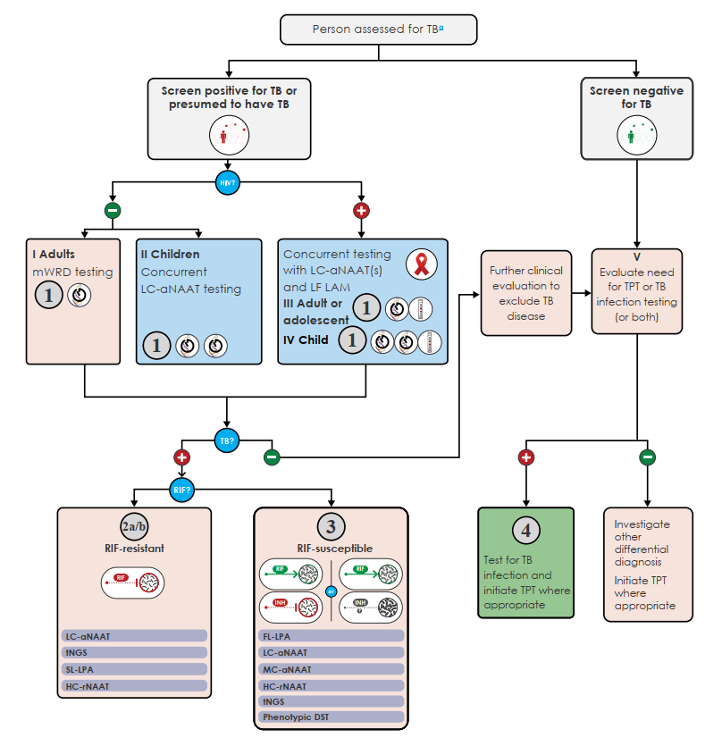
        

          
Figure 6.1. Chuỗi Kết Nối 4 Thuật Toán Chẩn Đoán Mô Hình Của WHO (The cascade of the four diagnostic algorithms)

          Sơ đồ tích hợp toàn diện: Người nghi mắc lao hoặc tầm soát dương tính được phân nhóm theo cơ quan tổn thương (phổi / ngoài phổi), tuổi (người lớn / trẻ em) và tình trạng nhiễm HIV để vào Thuật toán 1; kết quả mWRD điều phối sang Thuật toán 2a/2b (kháng RIF), Thuật toán 3 (nhạy RIF nguy cơ kháng thuốc khác) hoặc Thuật toán 4 (tầm soát nhiễm lao).
        

      

      <!-- FIGURE 6.2 -->
      

        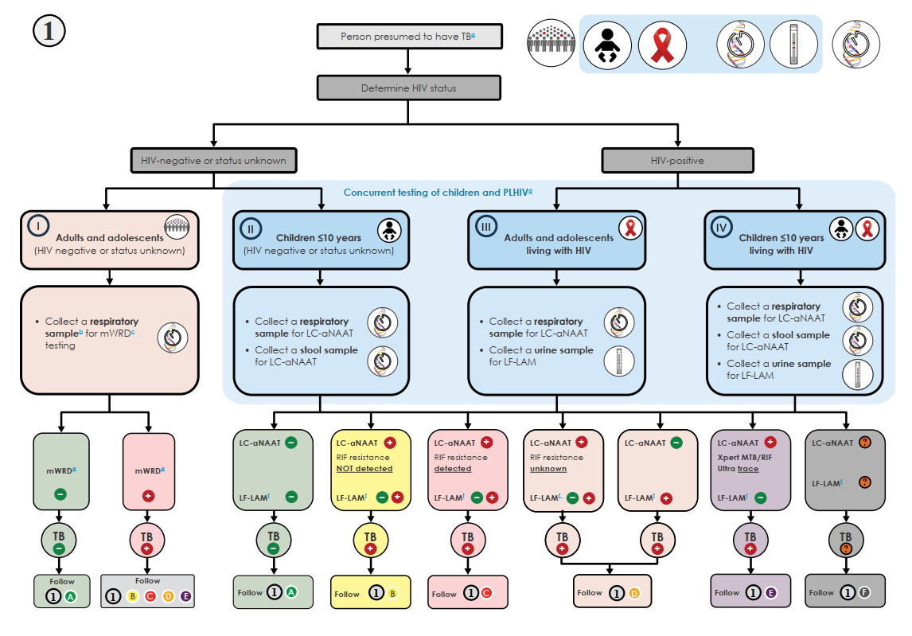
        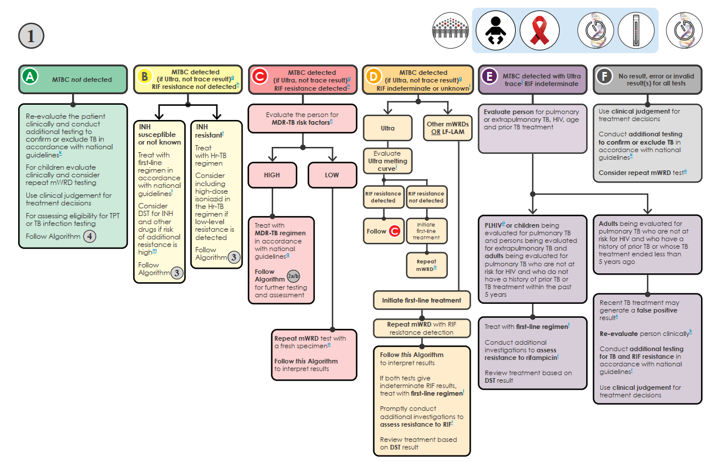
        

          
Figure 6.2. Thuật Toán 1: mWRD Làm Xét Nghiệm Chẩn Đoán Ban Đầu Bệnh Lao (Algorithm 1: mWRD as initial diagnostic test)

          Lưu đồ quyết định lâm sàng phân nhánh theo 6 lối ra: 1A (MTBC Âm tính), 1B (MTBC Dương tính, RIF Susceptible), 1C (MTBC Dương tính, RIF Resistant), 1D (MTBC Dương tính, RIF Không xác định/Lỗi), 1E (Xpert Ultra Trace - Dương tính vết), 1F (Không kết quả/Mẫu lỗi).
        

      

      <!-- 6 BRANCHES DETAILED CARDS -->
      

        

          <i class="fa-solid fa-code-branch"></i> Hướng Dẫn Lâm Sàng Xử Trí 6 Nhánh Ra Thuật Toán 1 (WHO 2025)
        

        

          
          

            
Nhánh 1A: MTBC Không Phát Hiện

            
Đánh giá lại lâm sàng, chẩn đoán phân biệt bệnh phổi khác; cân nhắc chụp X-quang phổi, nuôi cấy đờm hoặc chuyển sang <strong>Thuật toán 4</strong> để đánh giá TPT nếu thuộc đối tượng tiếp xúc.

          

          

            
Nhánh 1B: MTBC Dương, Nhạy RIF

            
Khởi động ngay <strong>Phác đồ hàng 1 chuẩn 6 tháng (2HRZE/4HR)</strong>. Nếu bệnh nhân thuộc vùng dịch tễ kháng thuốc hoặc có tiền sử dùng INH → Chuyển sang <strong>Thuật toán 3</strong> để kiểm tra kháng INH/FQ.

          

          

            
Nhánh 1C: MTBC Dương, Kháng RIF (RR-TB)

            
Khởi động điều trị phác đồ MDR-TB; gửi mẫu làm ngay xét nghiệm DST theo dõi (Xpert XDR / SL-LPA hoặc tNGS) để loại trừ kháng FQ (chuyển sang <strong>Thuật toán 2a hoặc 2b</strong>).

          

          

            
Nhánh 1D: MTBC Dương, Kháng RIF Nghi Ngờ / Lỗi

            
Khởi đầu phác đồ hàng 1, đồng thời lấy mẫu mới làm lại mWRD khẩn cấp hoặc gửi giải trình tự gen / nuôi cấy khẳng định tình trạng kháng RIF.

          

          

            
Nhánh 1E: Xpert Ultra Trace (Vết Dương Tính)

            

              • <em>Trẻ em, người nhiễm HIV, dịch não tủy/ngoài phổi:</em> Coi là <strong>DƯƠNG TÍNH THẬT</strong>, điều trị ngay. 
              • <em>Người lớn âm tính HIV có tiền sử điều trị lao &lt; 5 năm:</em> Nghi ngờ dương tính giả do DNA vi khuẩn chết, đánh giá kỹ lâm sàng trước khi chỉ định.
            

          

          

            
Nhánh 1F: Lỗi Kỹ Thuật (Invalid / Error / No Result)

            
Lấy lại mẫu bệnh phẩm mới và làm lại xét nghiệm ngay trong ngày. Nếu tỷ lệ lỗi phòng xét nghiệm &gt; 5%, cần kiểm tra thiết bị, hóa chất và quy trình thao tác.

          

        

      

      <!-- FIGURE 6.3 -->
      

        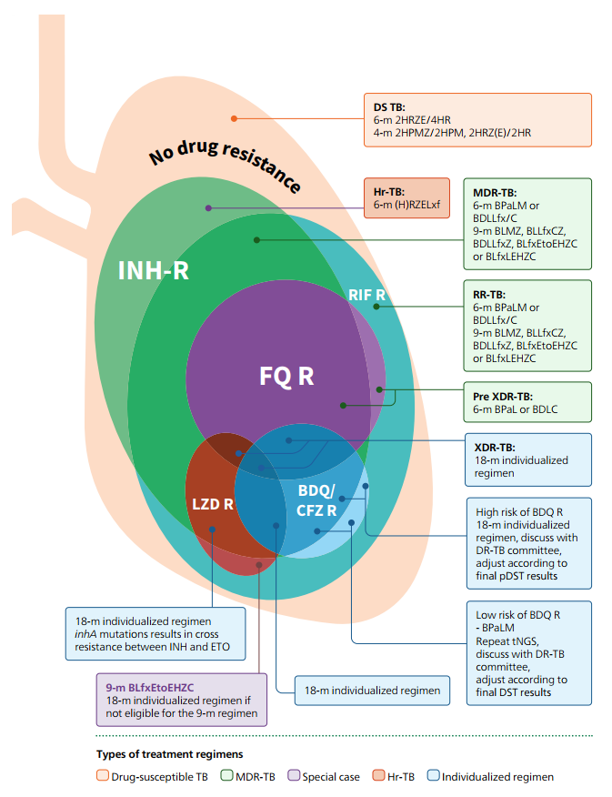
        

          
Figure 6.3. Tổng Quan Các Lựa Chọn Phác Đồ Điều Trị Lao (Treatment option overview)

          Sơ đồ phân nhánh phác đồ điều trị theo từng kiểu hình kháng thuốc: Lao nhạy cảm (DS-TB), Lao kháng INH đơn thuần (Hr-TB), Lao MDR/RR-TB nhạy FQ, Lao Pre-XDR-TB (kháng FQ) và Lao XDR-TB (kháng cả FQ và BDQ/LZD).
        

      

      <!-- REGIMENS SUMMARY -->
      

        

          
1. Lao Nhạy Cảm Thuốc (DS-TB)

          

            • <strong>Phác đồ chuẩn 6 tháng:</strong> <code>2HRZE / 4HR</code>. 
            • <strong>Phác đồ rút ngắn 4 tháng:</strong> <code>2HPMZ / 2HPM</code> (Isoniazid, Rifapentine, Moxifloxacin, Pyrazinamide) cho người ≥ 12 tuổi có tổn thương phổi không hang.
          

        

        

          
2. Lao Kháng INH Đơn Thuần (Hr-TB)

          

            • <strong>Phác đồ 6 tháng kết hợp Fluoroquinolone:</strong> <code>6(H)RZELfx</code> (Rifampicin, Pyrazinamide, Ethambutol, Levofloxacin). Tuyệt đối không bổ sung thuốc tiêm.
          

        

        

          
3. Lao MDR/RR-TB Nhạy FQ

          

            • <strong>Phác đồ ưu tiên 6 tháng toàn đường uống:</strong> <code>BPaLM</code> (Bedaquiline + Pretomanid + Linezolid + Moxifloxacin). 
            • <em>Lựa chọn thay thế:</em> Phác đồ 9 tháng toàn đường uống nếu không đủ điều kiện dùng Pretomanid.
          

        

        

          
4. Lao Pre-XDR-TB (Kháng FQ) &amp; XDR-TB

          

            • <strong>Pre-XDR-TB:</strong> Phác đồ 6 tháng <code>BPaL</code> (Bỏ Moxifloxacin). 
            • <strong>XDR-TB (Kháng cả FQ &amp; BDQ):</strong> Phác đồ cá thể hóa kéo dài <strong>18 tháng</strong> phối hợp các thuốc Nhóm B và C còn nhạy cảm (Linezolid, Clofazimine, Cycloserine, Delamanid, PZA, Carbapenem).
          

        

      

      <!-- FIGURE 6.4 -->
      

        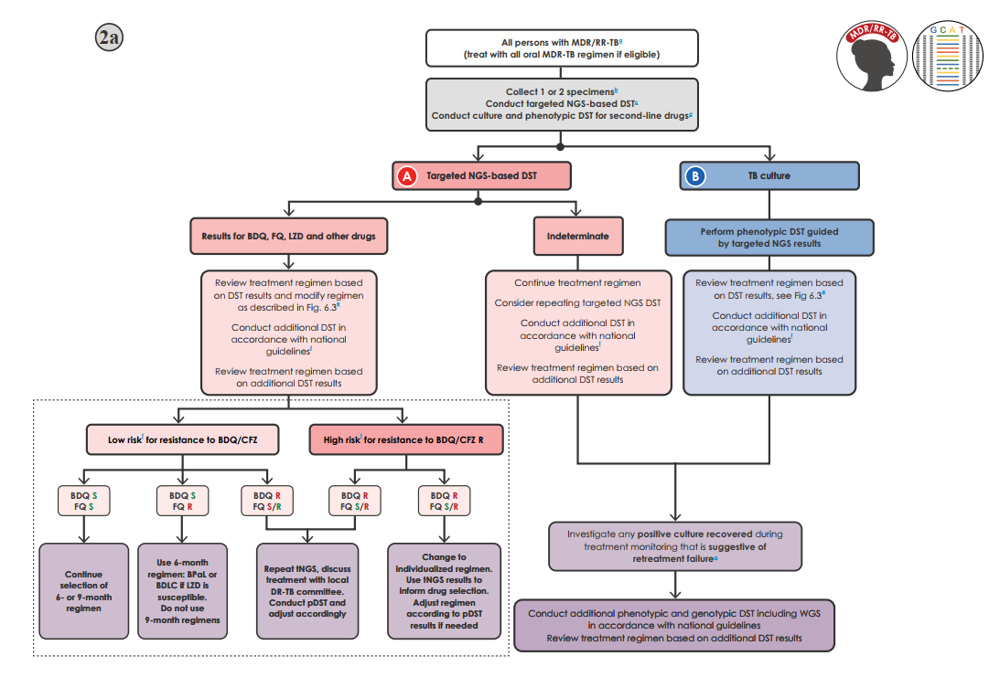
        

          
Figure 6.4. Thuật Toán 2a: Thử Nghiệm Độ Nhạy Cảm Thuốc Cho Bệnh Nhân MDR/RR-TB Bằng Targeted NGS (Algorithm 2a: DST for MDR/RR-TB using targeted NGS)

          Khi có hạ tầng tNGS, tiến hành giải trình tự gen trực tiếp từ mẫu đờm song song với nuôi cấy khẳng định pDST. Quyết định lâm sàng được đưa ra sớm: nếu BDQ và FQ cùng nhạy → Tiếp tục phác đồ 6 tháng BPaLM; nếu FQ kháng nhưng BDQ nhạy → Chuyển ngay sang phác đồ 6 tháng BPaL; nếu BDQ kháng → Đổi sang phác đồ cá thể hóa.
        

      

      <!-- FIGURE 6.5 -->
      

        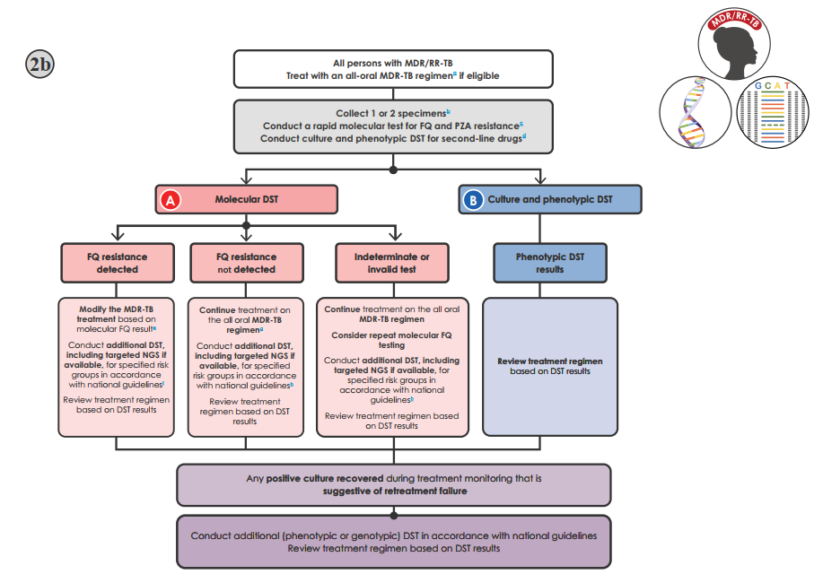
        

          
Figure 6.5. Thuật Toán 2b: DST Cho Người Bệnh MDR/RR-TB Khi Chưa Có Hoặc Hạn Chế Năng Lực tNGS (Algorithm 2b: DST for people with MDR/RR-TB)

          Tại các tuyến chưa triển khai tNGS: Thực hiện xét nghiệm phân tử nhanh FQ (Xpert MTB/XDR hoặc SL-LPA) để sàng lọc khẩn cấp kháng Fluoroquinolones, đồng thời gửi mẫu cấy lỏng BACTEC MGIT làm pDST kiểu hình xác định tính nhạy cảm với Bedaquiline, Linezolid và Clofazimine.
        

      

      <!-- FIGURE 6.6 -->
      

        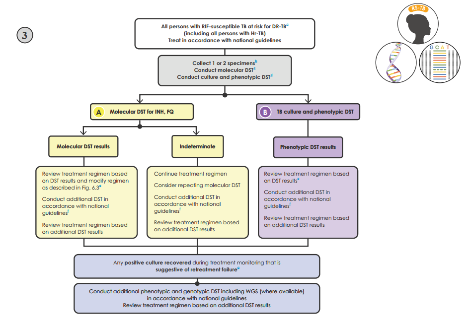
        

          
Figure 6.6. Thuật Toán 3: Thử Nghiệm Theo Dõi Cho Bệnh Nhân Lao Nhạy Cảm RIF Có Nguy Cơ Kháng Thuốc Khác (Algorithm 3: Follow-on testing for RIF-susceptible TB)

          Áp dụng cho người bệnh nhạy RIF nhưng nghi ngờ lao kháng Isoniazid (Hr-TB). Thực hiện xét nghiệm phân tử kháng INH (MC-aNAATs, FL-LPA, Xpert XDR hoặc tNGS): nếu xác nhận kháng INH → Đổi sang phác đồ 6(H)RZELfx; nếu phát hiện kháng thêm FQ → Bỏ Levofloxacin, dùng phác đồ 6(H)RZE hoặc cá thể hóa.
        

      

      <!-- FIGURE 6.7 -->
      

        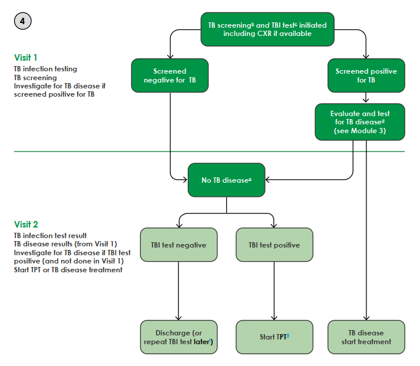
        

          
Figure 6.7. Thuật Toán Quy Trình Chăm Sóc Nhiễm Lao Tích Hợp (Algorithm for person-centred TB infection care)

          Quy trình 2 lần khám tối ưu hóa chuỗi dịch vụ chăm sóc: Lần khám 1 (tầm soát triệu chứng, chụp CXR và làm test da TST/TBST hoặc lấy máu IGRA); Lần khám 2 sau 48–72 giờ (đọc quầng sẩn test da, đối chiếu kết quả IGRA &amp; CXR, loại trừ lao hoạt động và chỉ định ngay phác đồ TPT).
        

      

    

  

  <!-- ========================================== -->
  <!-- SECTION 9: MẠNG LƯỚI PHÂN TẦNG, 10 BƯỚC TRIỂN KHAI & NGÂN SÁCH -->
  <!-- ========================================== -->
  

    

      🏥
      <h2 class="sec-title">9. Mạng Lưới Phân Tầng 3 Cấp (12 Mốc Chuẩn), Khung 10 Bước Triển Khai &amp; Ngân Sách</h2>
    

    

      

        WHO xây dựng Tiêu chuẩn Toàn cầu về Tiếp cận Chẩn đoán Nhanh Bệnh Lao (WHO Standard on Universal Access to Rapid TB Diagnostics) với 12 mốc chuẩn (benchmarks) chia thành 4 bước dọc theo chuỗi dịch vụ chăm sóc, kết hợp mô hình mạng lưới phòng xét nghiệm phân tầng hình tháp 3 cấp.
      

      <!-- FIGURE 4.1 -->
      

        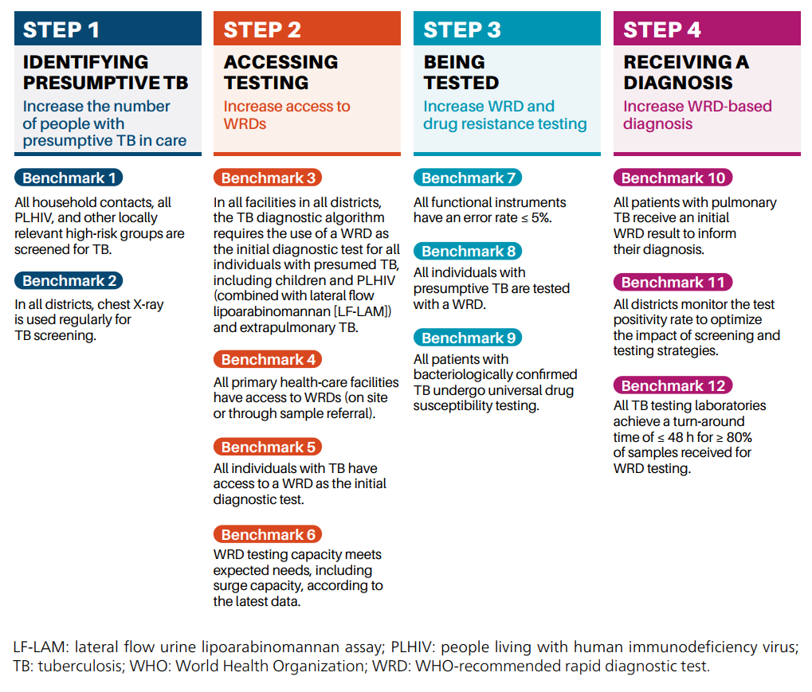
        

          
Figure 4.1. 12 Mốc Chuẩn Thuộc Tiêu Chuẩn WHO Về Tiếp Cận Toàn Diện Chẩn Đoán Nhanh (The 12 benchmarks constituting the WHO standard divided into four steps)

          Chuỗi 4 bước: Bước 1 (Xác định người nghi mắc lao — Tầm soát người tiếp xúc, CXR thường quy); Bước 2 (Tiếp cận xét nghiệm — Thuật toán bắt buộc dùng WRD, 100% tiếp cận WRD ban đầu); Bước 3 (Thực hiện xét nghiệm — Tỷ lệ lỗi máy ≤ 5%, 100% người nghi mắc được xét nghiệm); Bước 4 (Nhận kết quả &amp; kết nối điều trị kịp thời).
        

      

      <!-- FIGURE 4.2 -->
      

        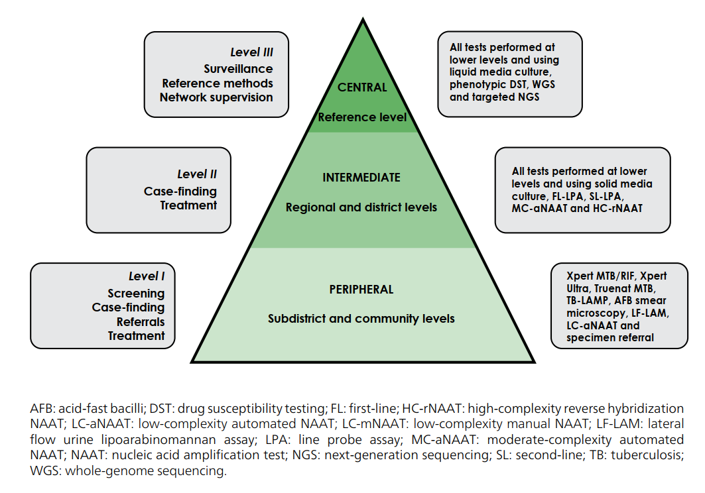
        

          
Figure 4.2. Sơ Đồ Tổ Chức Mạng Lưới Phòng Xét Nghiệm Chẩn Đoán Bệnh Lao Phân Tầng 3 Cấp (Organization of a TB diagnostic testing network)

          Mô hình hình tháp phân tầng tích hợp hệ thống chuyển mẫu (specimen referral system) và kết nối dữ liệu số: Tuyến Ngoại Vi Level I (Trạm y tế, TTYT quận/huyện) → Tuyến Trung Gian Level II (Bệnh viện tỉnh, trung tâm vùng) → Tuyến Trung Ương Level III (Phòng xét nghiệm Tham chiếu Quốc gia NTRL).
        

      

      <!-- TIERED NETWORK TABLE -->
      

        <table class="regimen-table">
          <thead>
            <tr>
              <th style="width: 20%;">Cấp Tuyến Mạng Lưới</th>
              <th style="width: 30%;">Chức Năng Lâm Sàng Chính</th>
              <th style="width: 35%;">Danh Mục Kỹ Thuật Xét Nghiệm Chuẩn</th>
              <th style="width: 15%;">Cấp An Toàn Sinh Học</th>
            </tr>
          </thead>
          <tbody>
            <tr>
              <td><strong>Tuyến Ngoại Vi</strong> <small>(Level I - Peripheral)</small> Trạm y tế, TTYT huyện</td>
              <td>Tầm soát cộng đồng, phát hiện ca bệnh tại chỗ, chuyển mẫu lên tuyến trên, quản lý điều trị ban đầu và điều trị dự phòng TPT.</td>
              <td>• LF-LAM nước tiểu • LC-aNAATs (Xpert Ultra, Truenat) • LC-mNAATs (TB-LAMP) • Test da TST / TBST</td>
              <td>BSL-1 / Cơ Bản <small>Thao tác đóng kín</small></td>
            </tr>
            <tr>
              <td><strong>Tuyến Trung Gian</strong> <small>(Level II - Intermediate)</small> BV tỉnh, Trung tâm vùng</td>
              <td>Chẩn đoán khẳng định, quản lý điều trị chuyên sâu ca khó, theo dõi kháng thuốc dòng hai và tiếp nhận chuyển mẫu từ tuyến huyện.</td>
              <td>• Tất cả kỹ thuật Tuyến I • MC-aNAATs (Abbott, BD, Roche, Bruker) • FL-LPA &amp; SL-LPA • Nuôi cấy môi trường lỏng/rắn • IGRA (ELISA / CLIA)</td>
              <td>BSL-2 <small>Tủ ATSH Cấp II</small></td>
            </tr>
            <tr>
              <td><strong>Tuyến Trung Ương</strong> <small>(Level III - Central)</small> Tham Chiếu Quốc Gia (NTRL)</td>
              <td>Giám sát dịch tễ học kháng thuốc toàn quốc, tham chiếu kỹ thuật, giải quyết bất đồng kết quả, quản lý mạng lưới và kiểm chuẩn EQA.</td>
              <td>• Tất cả kỹ thuật Tuyến I &amp; II • Targeted NGS (tNGS) &amp; WGS • Nuôi cấy BACTEC MGIT &amp; pDST kiểu hình đầy đủ • HC-rNAATs (Genoscholar PZA-TB)</td>
              <td>BSL-3 <small>Áp lực âm chuyên dụng</small></td>
            </tr>
          </tbody>
        </table>
      

      <h3 style="color: var(--color-primary); margin-top: 2rem; margin-bottom: 1rem;">
        <i class="fa-solid fa-list-check"></i> Khung 10 Bước Triển Khai Xét Nghiệm Chẩn Đoán Mới Vào Hệ Thống Y Tế Quốc Gia
      </h3>

      

        

          
1. Chính Sách &amp; Kế Hoạch

          
Thành lập Nhóm công tác kỹ thuật (TWG), cập nhật thuật toán quốc gia, đánh giá thực trạng mạng lưới và lập kế hoạch ngân sách có phân kỳ.

        

        

          
2. Pháp Lý &amp; Đăng Ký

          
Cấp phép lưu hành sản phẩm, thủ tục nhập khẩu thông quan và thực hiện nghiên cứu xác nhận lại (verification study) trên bộ mẫu mù chuẩn hóa.

        

        

          
3. Thiết Bị &amp; Hạ Tầng

          
Đánh giá độ sẵn sàng phòng xét nghiệm (điện, UPS, điều hòa nhiệt độ, thông gió), lắp đặt thiết bị và ký hợp đồng bảo trì phòng ngừa định kỳ.

        

        

          
4. Chuỗi Cung Ứng

          
Dự báo nhu cầu kit thử/hóa chất tiêu hao, duy trì dây chuyền lạnh, kiểm chuẩn lô hóa chất mới (lot testing) và quản lý hạn dùng nghiêm ngặt.

        

        

          
5. Quy Trình Vận Hành (SOPs)

          
Ban hành SOPs chuẩn cho lấy mẫu, vận chuyển, thực hiện kỹ thuật, xử lý bất đồng kết quả và tăng cường tương tác Lâm sàng – Phòng xét nghiệm.

        

        

          
6. Dữ Liệu Số &amp; Kết Nối

          
Kết nối máy xét nghiệm với hệ thống thông tin LIMS, truyền kết quả tự động, bảo mật dữ liệu và chuẩn bị hạ tầng đám mây cho phân tích tNGS.

        

        

          
7. Đảm Bảo Chất Lượng (QA/QC)

          
Vận hành hệ thống quản lý chất lượng QMS, chạy chứng nội bộ hàng ngày (Internal QC), tham gia ngoại kiểm PT định kỳ và theo dõi tỷ lệ lỗi ≤ 5%.

        

        

          
8. Ghi Chép &amp; Báo Cáo

          
Chuẩn hóa phiếu yêu cầu ghi rõ tiền sử/HIV, thiết kế phiếu trả kết quả dễ hiểu cho lâm sàng và đồng bộ dữ liệu vào sổ đăng ký điện tử Prevent TB.

        

        

          
9. Nhân Lực &amp; Đào Tạo

          
Xây dựng bản mô tả công việc (TOR), đào tạo lý thuyết và thực hành, đánh giá năng lực thực hành hàng năm và duy trì cơ chế hỗ trợ kỹ thuật liên tục.

        

        

          
10. Giám Sát &amp; Đánh Giá (M&amp;E)

          
Theo dõi tiến độ lắp đặt, số xét nghiệm thực hiện, tỷ lệ lỗi máy và đánh giá tác động lâm sàng (tăng tỷ lệ xác nhận vi khuẩn, rút ngắn thời gian thu nhận điều trị).

        

      

      <h3 style="color: var(--color-primary); margin-top: 2rem; margin-bottom: 1rem;">
        <i class="fa-solid fa-coins"></i> Bảng 3.1 (Annex 1): Dự Trù Các Khoản Mục Chi Phí Ngân Sách Cho Triển Khai Xét Nghiệm Lao Mới
      </h3>
      

        <em>(Nguồn: WHO Operational Handbook on Tuberculosis. Module 3: Diagnosis - 2025, Annex 1, trang 166–168)</em>
      

      

        <table class="regimen-table">
          <thead>
            <tr>
              <th style="width: 25%;">Hạng Mục Ngân Sách</th>
              <th style="width: 75%;">Các Chi Phí Thành Phần Chi Tiết Cần Dự Trù</th>
            </tr>
          </thead>
          <tbody>
            <tr>
              <td><strong>1. Chính sách &amp; Kế hoạch</strong></td>
              <td>• Họp Nhóm công tác kỹ thuật (TWG) và hội thảo các bên liên quan. • Đánh giá thực trạng mạng lưới (chi phí chuyên gia, di chuyển thực địa, viết báo cáo). • Biên soạn, in ấn và phổ biến hướng dẫn lâm sàng cùng thuật toán chẩn đoán mới.</td>
            </tr>
            <tr>
              <td><strong>2. Pháp lý &amp; Đăng ký</strong></td>
              <td>• Phí nộp hồ sơ cấp phép lưu hành và thủ tục thông quan nhập khẩu sản phẩm. • Chi phí nghiên cứu xác nhận lại (verification study: mẫu chuẩn âm/dương, panel mù, nhân sự thực hiện).</td>
            </tr>
            <tr>
              <td><strong>3. Thiết bị &amp; Hạ tầng</strong></td>
              <td>• Cải tạo phòng xét nghiệm (hệ thống điện, máy phát điện dự phòng, UPS lưu điện, điều hòa không khí, thông gió an toàn). • Mua sắm hoặc thuê thiết bị máy xét nghiệm và thiết bị phụ trợ (máy tính, máy in, tủ lạnh 2–8°C, tủ đông -20°C). • Chi phí vận chuyển, lắp đặt từ chuyên gia hãng và thẩm định thiết bị (IQ/OQ/PQ). • Hợp đồng bảo trì dịch vụ toàn diện (service contract) và hiệu chuẩn định kỳ hàng năm.</td>
            </tr>
            <tr>
              <td><strong>4. Vật tư &amp; Chuỗi cung ứng</strong></td>
              <td>• Mua sắm kit xét nghiệm, cartridge, chip, hóa chất và vật tư tiêu hao (ly đựng mẫu, micropipette, găng tay, khẩu trang N95). • Chi phí vận chuyển bảo quản dây chuyền lạnh liên tục, duy trì kho đệm trung tâm và phân phối về cơ sở. • Chi phí kiểm chuẩn chất lượng từng lô hóa chất mới (lot-to-lot testing).</td>
            </tr>
            <tr>
              <td><strong>5. Quy trình &amp; Lâm sàng</strong></td>
              <td>• Chi phí biên soạn, thẩm định chuyên gia và in ấn bộ quy trình SOPs. • Chi phí tổ chức các lớp tập huấn cho bác sĩ lâm sàng về chỉ định xét nghiệm và phiên giải kết quả.</td>
            </tr>
            <tr>
              <td><strong>6. Dữ liệu số &amp; Kết nối</strong></td>
              <td>• Nâng cấp phần mềm quản lý phòng xét nghiệm LIMS và giải pháp kết nối máy chẩn đoán tự động. • Hạ tầng truyền thông mạng (đường truyền Internet tốc độ cao, máy chủ lưu trữ đám mây cho tNGS).</td>
            </tr>
            <tr>
              <td><strong>7. Đảm bảo chất lượng (QA)</strong></td>
              <td>• Chi phí mua vật liệu kiểm chuẩn nội bộ (QC) hàng ngày. • Chi phí đăng ký mẫu ngoại kiểm PT từ các nhà cung cấp quốc tế. • Chi phí tổ chức các đợt giám sát hỗ trợ tại chỗ và gửi mẫu đối chiếu lên tuyến trên.</td>
            </tr>
            <tr>
              <td><strong>8. In ấn &amp; Báo cáo</strong></td>
              <td>• Thiết kế, in ấn phiếu yêu cầu xét nghiệm, sổ đăng ký, phiếu trả kết quả và nhật ký vận chuyển mẫu.</td>
            </tr>
            <tr>
              <td><strong>9. Nhân lực &amp; Đào tạo</strong></td>
              <td>• Tổ chức khóa đào tạo giảng viên (TOT) và các khóa tập huấn cho kỹ thuật viên xét nghiệm. • Chi phí đánh giá năng lực thực hành cán bộ định kỳ hàng năm.</td>
            </tr>
            <tr>
              <td><strong>10. Giám sát &amp; Đánh giá</strong></td>
              <td>• Họp sơ kết, tổng kết tiến độ triển khai và nghiên cứu đánh giá tác động lâm sàng/kinh tế y tế.</td>
            </tr>
          </tbody>
        </table>
      

    

  

  <!-- CITATION BOX -->
  

    <strong>Tài liệu gốc tham khảo (Chuẩn AMA):</strong> 
    1. World Health Organization. <em>WHO Operational Handbook on Tuberculosis. Module 3: Diagnosis</em>. Geneva, Switzerland: World Health Organization; 2025. Licence: CC BY-NC-SA 3.0 IGO. ISBN: 978-92-4-011099-1. 
    2. World Health Organization. <em>WHO Consolidated Guidelines on Tuberculosis. Module 3: Diagnosis — Rapid Diagnostics for Tuberculosis Detection</em>. Geneva: World Health Organization; 2025. 
    3. World Health Organization. <em>WHO standard: universal access to rapid tuberculosis diagnostics</em>. Geneva: World Health Organization; 2023.
  

<!-- BOTTOM NAV -->

  

    <a href="#/ebm/kho-guidelines" class="btn btn-primary">
      <i class="fa-solid fa-arrow-left"></i> Quay lại Kho Guidelines
    </a>
    <a href="#sec-dichte-khuyencao" class="btn">
      <i class="fa-solid fa-arrow-up"></i> Lên đầu trang
    </a>
  

