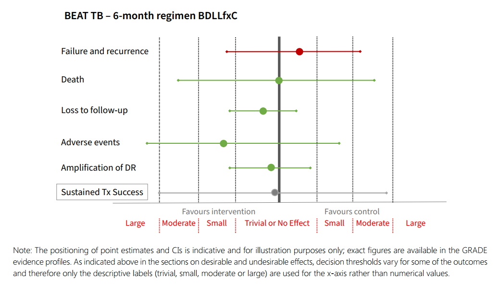

  

    

      
Phác Đồ 6 Tháng BPaLM

      
Lựa chọn ưu tiên hàng đầu toàn đường uống cho MDR/RR-TB nhạy FQ

    

    

      
Rút Ngắn 4 Tháng DS-TB

      
2HPMZ cho người ≥ 12 tuổi và 2HRZ(E) cho trẻ em mắc lao không nặng

    

    

      
3 Phác Đồ 9 Tháng endTB

      
9BLMZ &gt; 9BLLfxCZ &gt; 9BDLLfxZ; thành công 85.2–89.0%, chi phí từ 297 USD

    

    

      
Đồng Điều Trị DAA HCV

      
Khuyến cáo MỚI dùng song song DAA + thuốc lao MDR; tăng 25% tỷ lệ khỏi bệnh

    

  

  

    

      
💊

      

        
Kỷ Nguyên Toàn Đường Uống (All-Oral Era)

        
Loại bỏ hoàn toàn thuốc tiêm gây độc tính điếc và suy thận; phổ cập phác đồ 6 tháng BPaLM/BPaL và 9 tháng cải tiến B-Lzd.

      

    

    

      
🎯

      

        
Cá Thể Hóa &amp; An Toàn Tuyệt Đối

        
Bổ sung phác đồ BDLLfxC cho thai phụ và trẻ em; tối ưu liều Linezolid 600mg; đồng điều trị DAA viêm gan C song song.

      

    

    

      
🏡

      

        
Chăm Sóc Lấy Bệnh Nhân Làm Trung Tâm

        
Chuyển đổi điều trị ngoại trú phân tán tuyến cơ sở, hỗ trợ tuân thủ đa thành phần và giám sát điều trị qua video (VST).

      

    

  

  

    <a href="#sec-dichte-dstb" class="quickmenu-item active">1. Dịch Tễ &amp; Phác Đồ DS-TB</a>
    <a href="#sec-dr-tb-6m-alloral" class="quickmenu-item">2. Phác Đồ 6 Tháng Toàn Uống</a>
    <a href="#sec-dr-tb-9m-endtb" class="quickmenu-item">3. Phác Đồ 9 Tháng endTB</a>
    <a href="#sec-dr-tb-longer-18m" class="quickmenu-item">4. Phác Đồ Kéo Dài &gt;18m</a>
    <a href="#sec-hrtb-dongnhiem-hcv" class="quickmenu-item">5. Lao Hr-TB &amp; Đồng Nhiễm HCV</a>
    <a href="#sec-care-support-vst" class="quickmenu-item">6. Chăm Sóc Người Bệnh &amp; VST</a>
  

  <!-- ========================================== -->
  <!-- SECTION 1: DỊCH TỄ HỌC & ĐIỀU TRỊ DS-TB -->
  <!-- ========================================== -->
  

    

      💊
      <h2 class="sec-title">1. Bối Cảnh Dịch Tễ, Chiến Lược End TB &amp; Điều Trị Lao Nhạy Cảm Thuốc (DS-TB)</h2>
    

    

      

        

          

          

            
📊

            
Gánh Nặng Lâm Sàng Kháng Thuốc

          

          

            
<strong>Ước tính ca mắc MDR/RR-TB:</strong> Khoảng <strong>400.000 người</strong> mắc lao kháng Rifampicin hoặc đa kháng thuốc năm 2023, nhưng chưa tới một nửa số ca được phát hiện và tiếp cận điều trị.

            
<strong>Tiến bộ &amp; Thách thức:</strong> Tỷ lệ thành công điều trị MDR/RR-TB tăng từ 50% (2012) lên 68% (2021), tuy nhiên vẫn còn khoảng <strong>15% bệnh nhân tử vong</strong> trong quá trình điều trị do độc tính phác đồ cũ và chẩn đoán muộn.

          

          
Thách Thức Toàn Cầu

        

        

          

          

            
📐

            
Khung Phương Pháp Luận GRADE

          

          

            
<strong>Cơ sở bằng chứng:</strong> Toàn bộ khuyến cáo trong Hướng dẫn Module 4 (2025) được Hội đồng GDG thẩm định bằng phương pháp GRADE chuẩn quốc tế.

            
<strong>Phân định rõ ràng:</strong> Phân tầng chất lượng bằng chứng (Rất thấp, Thấp, Trung bình, Cao) và cường độ khuyến cáo (Khuyến cáo Mạnh hoặc Khuyến cáo Có điều kiện).

          

          
Chuẩn Mực EBM 2025

        

      

      <h3 style="color: var(--color-primary); margin-top: 2rem; margin-bottom: 1rem;">
        <i class="fa-solid fa-list-check"></i> Bảng 1.1: Tóm Tắt Danh Mục Các Khuyến Cáo Chính Về Điều Trị Lao Nhạy Cảm Thuốc (DS-TB)
      </h3>
      

        <em>(Nguồn: WHO Consolidated Guidelines on Tuberculosis. Module 4: Treatment and Care - 2025, Chapter 1, trang 4–6)</em>
      

      

        <table class="regimen-table">
          <thead>
            <tr>
              <th style="width: 8%;">STT</th>
              <th style="width: 62%;">Nội Dung Khuyến Cáo Của WHO</th>
              <th style="width: 30%;">Cường Độ &amp; Bằng Chứng GRADE</th>
            </tr>
          </thead>
          <tbody>
            <tr>
              <td style="text-align: center; font-weight: bold;">1.1</td>
              <td>Bệnh nhân mới chẩn đoán lao phổi nhạy cảm với thuốc (DS-TB) nên được điều trị phác đồ 6 tháng chứa Rifampicin: <strong>2HRZE / 4HR</strong>.</td>
              <td>Khuyến cáo MẠNH Bằng chứng CAO</td>
            </tr>
            <tr>
              <td style="text-align: center; font-weight: bold;">1.2</td>
              <td>Tần suất dùng thuốc tối ưu cho bệnh nhân lao phổi mới là <strong>dùng hàng ngày (daily dosing)</strong> trong suốt cả giai đoạn tấn công và duy trì.</td>
              <td>Khuyến cáo MẠNH Bằng chứng CAO</td>
            </tr>
            <tr>
              <td style="text-align: center; font-weight: bold; color: #dc2626;">1.3</td>
              <td><strong>KHÔNG KHUYẾN CÁO</strong> sử dụng chế độ liều <strong>3 lần/tuần (thrice-weekly dosing)</strong> trong cả hai giai đoạn tấn công và duy trì cho bệnh nhân DS-TB.</td>
              <td>Không Khuyến Cáo Bằng chứng RẤT THẤP</td>
            </tr>
            <tr>
              <td style="text-align: center; font-weight: bold;">1.4</td>
              <td>Khuyến cáo ưu tiên sử dụng viên kết hợp liều cố định (<strong>FDCs</strong>) thay cho các viên đơn lẻ trong điều trị DS-TB.</td>
              <td>Có điều kiện Bằng chứng THẤP</td>
            </tr>
            <tr>
              <td style="text-align: center; font-weight: bold; color: #dc2626;">1.5</td>
              <td>Ở bệnh nhân lao phổi mới điều trị phác đồ chứa Rifampicin, nếu soi đờm còn dương tính cuối giai đoạn tấn công (tháng thứ 2), <strong>KHÔNG KHUYẾN CÁO KÉO DÀI</strong> giai đoạn tấn công.</td>
              <td>Khuyến cáo MẠNH Bằng chứng CAO</td>
            </tr>
            <tr>
              <td style="text-align: center; font-weight: bold;">2.1</td>
              <td>Người từ 12 tuổi trở lên mắc lao phổi nhạy thuốc có thể điều trị phác đồ rút ngắn <strong>4 tháng 2HPMZ / 2HPM</strong> (Isoniazid, Rifapentine, Moxifloxacin, Pyrazinamide).</td>
              <td>Có điều kiện Bằng chứng TRUNG BÌNH</td>
            </tr>
            <tr>
              <td style="text-align: center; font-weight: bold;">2.2</td>
              <td>Trẻ em và vị thành niên từ 3 tháng đến 16 tuổi mắc lao không nặng (non-severe TB) nên điều trị phác đồ rút ngắn <strong>4 tháng 2HRZ(E) / 2HR</strong>.</td>
              <td>Khuyến cáo MẠNH Bằng chứng TRUNG BÌNH</td>
            </tr>
            <tr>
              <td style="text-align: center; font-weight: bold;">3.1</td>
              <td>Bệnh nhân lao đồng nhiễm HIV phải được điều trị lao hàng ngày với thời gian tối thiểu tương đương bệnh nhân âm tính HIV; khởi động ART sớm trong 2–8 tuần.</td>
              <td>Khuyến cáo MẠNH Bằng chứng CAO</td>
            </tr>
            <tr>
              <td style="text-align: center; font-weight: bold;">4.1</td>
              <td>Bệnh nhân viêm màng não do lao nên được điều trị hỗ trợ ban đầu bằng Corticoid (Dexamethasone hoặc Prednisolone) giảm liều dần trong 6–8 tuần.</td>
              <td>Khuyến cáo MẠNH Bằng chứng TRUNG BÌNH</td>
            </tr>
            <tr>
              <td style="text-align: center; font-weight: bold;">4.2</td>
              <td>Bệnh nhân viêm màng ngoài tim do lao có thể được điều trị hỗ trợ ban đầu bằng Corticoid nhằm giảm nguy cơ co thắt màng tim.</td>
              <td>Có điều kiện Bằng chứng RẤT THẤP</td>
            </tr>
          </tbody>
        </table>
      

      <!-- DETAILED DS-TB PROTOCOLS -->
      

        

          <i class="fa-solid fa-clock-rotate-left"></i> Phân Tích Chuyên Sâu 2 Phác Đồ Rút Ngắn 4 Tháng Của WHO (Study 31 &amp; SHINE)
        

        

          

            
Phác Đồ 4 Tháng 2HPMZ/2HPM (Người ≥ 12 Tuổi)

            

              • <strong>Thành phần:</strong> 2 tháng tấn công (Isoniazid + Rifapentine + Moxifloxacin + Pyrazinamide), tiếp theo là 2 tháng duy trì (Isoniazid + Rifapentine + Moxifloxacin). 
              • <strong>Cơ sở bằng chứng:</strong> Thử nghiệm lâm sàng ngẫu nhiên đối chứng <strong>Study 31/A5349</strong> chứng minh hiệu quả không thua kém (non-inferiority) so với phác đồ chuẩn 6 tháng. 
              • <strong>Lưu ý vận hành:</strong> Bắt buộc uống Rifapentine và Moxifloxacin cùng bữa ăn có chất béo để tối ưu hấp thu; hiện chưa có viên phối hợp FDC cho phác đồ này.
            

          

          

            
Phác Đồ 4 Tháng 2HRZ(E)/2HR (Trẻ Em 3 Tháng – 16 Tuổi)

            

              • <strong>Thành phần:</strong> 2 tháng tấn công HRZ (thêm E nếu ở vùng tỷ lệ kháng INH hoặc HIV cao), 2 tháng duy trì HR. 
              • <strong>Cơ sở bằng chứng:</strong> Thử nghiệm <strong>SHINE</strong> chứng minh tỷ lệ khỏi bệnh đạt 93% ở trẻ mắc lao không nặng (không hang, tổn thương &lt; 1 thùy phổi, không suy hô hấp, âm tính vi khuẩn). 
              • <strong>Chống chỉ định:</strong> Trẻ mắc lao nặng, lao màng não, lao xương khớp, suy dinh dưỡng cấp tính nặng (SAM), sinh non &lt; 37 tuần hoặc cân nặng &lt; 3 kg.
            

          

        

      

    

  

  <!-- ========================================== -->
  <!-- SECTION 2: PHÁC ĐỒ TOÀN UỐNG 6 THÁNG CHO MDR/RR-TB -->
  <!-- ========================================== -->
  

    

      💊
      <h2 class="sec-title">2. Đột Phá Phác Đồ Toàn Uống 6 Tháng: BPaLM / BPaL &amp; BDLLfxC (BEAT-TB 2024)</h2>
    

    

      

        WHO thiết lập cuộc cách mạng điều trị lao kháng thuốc khi khuyến cáo hai phác đồ toàn đường uống rút ngắn 6 tháng (All-Oral 6-Month Regimens) làm lựa chọn ưu tiên hàng đầu, chấm dứt hoàn toàn sự phụ thuộc vào các thuốc tiêm độc tính (Aminoglycosides).
      

      

        

          

          

            
⭐

            
Phác Đồ BPaLM (TB-PRACTECAL)

          

          

            
<strong>Thành phần:</strong> Bedaquiline (B) + Pretomanid (Pa) + Linezolid (L - 600mg) + Moxifloxacin (M) trong 24 tuần (6 tháng).

            
<strong>Chỉ định:</strong> MDR/RR-TB nhạy FQ, từ 14 tuổi trở lên.

            
<strong>Điều chỉnh FQ:</strong> Nếu phát hiện chủng kháng FQ (Pre-XDR-TB) → Rút Moxifloxacin, chuyển sang phác đồ <strong>BPaL</strong>.

          

          
Lựa Chọn Ưu Tiên 1

        

        

          

          

            
🤰

            
Phác Đồ BDLLfxC (BEAT-TB 2024)

          

          

            
<strong>Thành phần:</strong> Bedaquiline (B) + Delamanid (D) + Linezolid (L - 600mg) + Levofloxacin (Lfx) + Clofazimine (C) trong 6 tháng.

            
<strong>Ưu điểm vượt trội:</strong> Sử dụng Delamanid thay Pretomanid, <strong>áp dụng an toàn tuyệt đối cho phụ nữ mang thai, cho con bú và trẻ em &lt; 14 tuổi</strong>.

          

          
Đột Phá Nhóm Đặc Thù

        

      

      <h3 style="color: var(--color-primary); margin-top: 2rem; margin-bottom: 1rem;">
        <i class="fa-solid fa-code-compare"></i> Bảng 1.2: So Sánh Tiêu Chuẩn Lựa Chọn / Loại Trừ Của Thử Nghiệm TB-PRACTECAL &amp; ZeNix
      </h3>
      

        <em>(Nguồn: WHO Consolidated Guidelines on Tuberculosis. Module 4: Treatment and Care - 2025, Chapter 2, Table 1.1, trang 48)</em>
      

      

        <table class="regimen-table">
          <thead>
            <tr>
              <th style="width: 25%;">Tiêu Chí So Sánh</th>
              <th style="width: 37%;">Thử Nghiệm TB-PRACTECAL (BPaLM)</th>
              <th style="width: 38%;">Thử Nghiệm ZeNix (BPaL)</th>
            </tr>
          </thead>
          <tbody>
            <tr>
              <td><strong>Độ tuổi tham gia</strong></td>
              <td>Từ 15 tuổi trở lên</td>
              <td>Từ 14 tuổi trở lên</td>
            </tr>
            <tr>
              <td><strong>Chẩn đoán vi khuẩn học</strong></td>
              <td>Lao phổi xác định vi khuẩn học + Kháng Rifampicin</td>
              <td>Xác định MDR/RR-TB hoặc pre-XDR-TB</td>
            </tr>
            <tr>
              <td><strong>Tình trạng nhiễm HIV</strong></td>
              <td>Bao gồm người nhiễm HIV (không phụ thuộc số lượng CD4)</td>
              <td>Bao gồm người nhiễm HIV có CD4 ≥ 100 cells/mm³</td>
            </tr>
            <tr>
              <td><strong>Tiền sử phơi nhiễm thuốc</strong></td>
              <td>Đã dùng Bdq, Pa, Dlm, Lzd &lt; 1 tháng</td>
              <td>Đã dùng Bdq, Dlm, Lzd &lt; 2 tuần</td>
            </tr>
            <tr>
              <td><strong>Tiêu chuẩn loại trừ</strong></td>
              <td>
                • Phụ nữ mang thai hoặc cho con bú. 
                • Men gan &gt; 3 lần giới hạn trên bình thường. 
                • Khoảng QTcF &gt; 450 ms hoặc có bệnh tim cấu trúc. 
                • Lao màng não, áp-xe não, lao xương khớp.
              </td>
              <td>
                • Phụ nữ mang thai. 
                • Men gan &gt; 3 lần giới hạn trên bình thường. 
                • Chỉ số khối cơ thể BMI &lt; 17 kg/m². 
                • Khoảng QTcF &gt; 500 ms. 
                • Bệnh thần kinh ngoại biên Độ 3–4. 
                • Dùng đồng thời Zidovudine hoặc Stavudine.
              </td>
            </tr>
          </tbody>
        </table>
      

      <h3 style="color: var(--color-primary); margin-top: 2rem; margin-bottom: 1rem;">
        <i class="fa-solid fa-calculator"></i> Bảng 1.3: Chế Độ Liều, Phương Thức Dùng Thuốc &amp; Độ Dung Nạp Điều Chỉnh Độc Tính
      </h3>
      

        <em>(Nguồn: WHO Consolidated Guidelines on Tuberculosis. Module 4: Treatment and Care - 2025, Chapter 2, Table 1.2, trang 50)</em>
      

      

        <table class="regimen-table">
          <thead>
            <tr>
              <th style="width: 25%;">Thông Số Vận Hành</th>
              <th style="width: 37%;">TB-PRACTECAL (Phác Đồ BPaLM)</th>
              <th style="width: 38%;">ZeNix (Phác Đồ BPaL - Nhánh Linezolid 600mg)</th>
            </tr>
          </thead>
          <tbody>
            <tr>
              <td><strong>Thời gian phác đồ</strong></td>
              <td>24 tuần (6 tháng)</td>
              <td>26 tuần (có thể kéo dài tới 39 tuần)</td>
            </tr>
            <tr>
              <td><strong>Liều Bedaquiline (B)</strong></td>
              <td>400 mg x 1 lần/ngày trong 2 tuần đầu; sau đó 200 mg x 3 lần/tuần trong 22 tuần tiếp theo</td>
              <td>200 mg x 1 lần/ngày trong 8 tuần đầu; sau đó 100 mg x 1 lần/ngày trong 18 tuần</td>
            </tr>
            <tr>
              <td><strong>Liều Pretomanid (Pa)</strong></td>
              <td>200 mg x 1 lần/ngày trong 24 tuần</td>
              <td>200 mg x 1 lần/ngày trong 26 tuần</td>
            </tr>
            <tr>
              <td><strong>Liều Linezolid (L)</strong></td>
              <td><strong>600 mg/ngày trong 16 tuần đầu</strong>; giảm xuống 300 mg/ngày trong 8 tuần cuối (hoặc giảm sớm hơn nếu xuất hiện độc tính)</td>
              <td><strong>600 mg/ngày trong 26 tuần</strong> (có thể giảm xuống 300 mg/ngày nếu xuất hiện độc tính tủy xương/thần kinh)</td>
            </tr>
            <tr>
              <td><strong>Tần suất &amp; Giám sát</strong></td>
              <td>7 ngày/tuần trực tiếp quan sát (DOT) hoặc qua video (VST)</td>
              <td>7 ngày/tuần theo dõi qua DOT hoặc thẻ theo dõi</td>
            </tr>
            <tr>
              <td><strong>Gián đoạn tối đa</strong></td>
              <td>Tối đa 2 tuần liên tiếp gián đoạn điều trị</td>
              <td>Tối đa 5 tuần gián đoạn tổng cộng (bắt buộc uống bù liều)</td>
            </tr>
          </tbody>
        </table>
      

      <!-- FIGURE 1.1 -->
      

        
        

          
Figure 1.1. Mô Tả Trực Quan Hiệu Quả Tuyệt Đối Của Phác Đồ BDLLfxC So Với Phác Đồ Chuẩn SoC (Thử nghiệm BEAT-TB 2024)

          Đồ thị đối chiếu các tiêu chí lâm sàng cốt lõi tại tuần thứ 76: Tỷ lệ thành công duy trì tương đương tuyệt đối (86.1% vs 86.0%), tỷ lệ tử vong tương đương (5.0% vs 5.0%), tỷ lệ bỏ trị thấp hơn (1.0% vs 2.0%) và giảm đáng kể biến cố bất lợi nặng Grade 3–5 (34.2% vs 38.0%).
        

      

      <h3 style="color: var(--color-primary); margin-top: 2rem; margin-bottom: 1rem;">
        <i class="fa-solid fa-scale-balanced"></i> Bảng 1.4: Tổng Hợp Quyết Định Của Hội Đồng GDG Về Các Câu Hỏi PICO Cho BPaLM/BPaL
      </h3>
      

        <em>(Nguồn: WHO Consolidated Guidelines on Tuberculosis. Module 4: Treatment and Care - 2025, Chapter 2, Table 1.3, trang 66)</em>
      

      

        <table class="regimen-table">
          <thead>
            <tr>
              <th style="width: 12%;">Sub-PICO</th>
              <th style="width: 25%;">Nhóm Bệnh Nhân</th>
              <th style="width: 20%;">Phác Đồ Can Thiệp</th>
              <th style="width: 25%;">Phác Đồ So Sánh [Nguồn]</th>
              <th style="width: 18%;">Khuyến Cáo WHO</th>
            </tr>
          </thead>
          <tbody>
            <tr>
              <td><strong>3.2</strong></td>
              <td>MDR/RR hoặc Pre-XDR</td>
              <td>BPaL (Lzd 1200mg - 9 tuần)</td>
              <td>BPaL (Lzd 1200mg - 26 tuần) [ZeNix]</td>
              <td>KHÔNG ủng hộ</td>
            </tr>
            <tr>
              <td><strong>3.3</strong></td>
              <td>MDR/RR hoặc Pre-XDR</td>
              <td><strong>BPaL (Lzd 600mg - 26 tuần)</strong></td>
              <td>BPaL (Lzd 1200mg - 26 tuần) [ZeNix]</td>
              <td>ỦNG HỘ can thiệp</td>
            </tr>
            <tr>
              <td><strong>3.4</strong></td>
              <td>MDR/RR hoặc Pre-XDR</td>
              <td>BPaL (Lzd 600mg - 9 tuần)</td>
              <td>BPaL (Lzd 1200mg - 26 tuần) [ZeNix]</td>
              <td>KHÔNG ủng hộ</td>
            </tr>
            <tr>
              <td><strong>4.1</strong></td>
              <td>Lao Pre-XDR (Kháng FQ)</td>
              <td><strong>BPaL (Lzd 600mg - 26 tuần)</strong></td>
              <td>Phác đồ kéo dài 18 tháng [IPD]</td>
              <td>ỦNG HỘ can thiệp</td>
            </tr>
            <tr>
              <td><strong>5.1</strong></td>
              <td>MDR/RR-TB (Nhạy FQ)</td>
              <td><strong>BPaL (Lzd 600mg - 26 tuần)</strong></td>
              <td>Phác đồ 9 tháng chứa Ethionamide</td>
              <td>ỦNG HỘ can thiệp</td>
            </tr>
            <tr>
              <td><strong>6.1</strong></td>
              <td>MDR/RR hoặc Pre-XDR</td>
              <td><strong>BPaLM</strong></td>
              <td>Phác đồ chuẩn SoC [TB-PRACTECAL]</td>
              <td>ỦNG HỘ MẠNH MẼ</td>
            </tr>
            <tr>
              <td><strong>6.2</strong></td>
              <td>MDR/RR hoặc Pre-XDR</td>
              <td><strong>BPaLM</strong></td>
              <td>BPaL (không có Moxifloxacin)</td>
              <td>Ưu tiên BPaLM hơn BPaL</td>
            </tr>
            <tr>
              <td><strong>6.3</strong></td>
              <td>MDR/RR hoặc Pre-XDR</td>
              <td><strong>BPaLM</strong></td>
              <td>BPaLC (bổ sung Clofazimine)</td>
              <td>Ưu tiên BPaLM hơn BPaLC</td>
            </tr>
          </tbody>
        </table>
      

    

  

  <!-- ========================================== -->
  <!-- SECTION 3: PHÁC ĐỒ CẢI TIẾN 9 THÁNG endTB -->
  <!-- ========================================== -->
  

    

      🔬
      <h2 class="sec-title">3. Phác Đồ Cải Tiến 9 Tháng Chứa Bedaquiline (Thử Nghiệm endTB 2024)</h2>
    

    

      

        Dựa trên bằng chứng thử nghiệm lâm sàng ngẫu nhiên đối chứng <strong>endTB (NCT02754765)</strong> thực hiện trên 754 bệnh nhân tại 7 quốc gia, WHO công bố khuyến cáo mới về 3 phác đồ 9 tháng toàn uống chứa Bedaquiline cho bệnh nhân MDR/RR-TB còn nhạy cảm với Fluoroquinolones (FQ-S).
      

      

        📌
        

          <strong>Thứ Tự Ưu Tiên Lựa Chọn Của Hội Đồng GDG WHO (2025):</strong> 
          <strong>9BLMZ (Ưu tiên 1) &gt; 9BLLfxCZ (Ưu tiên 2) &gt; 9BDLLfxZ (Ưu tiên 3)</strong>. 
          Khuyến cáo <strong>TUYỆT ĐỐI KHÔNG SỬ DỤNG</strong> hai phác đồ không chứa Bedaquiline (<code>9DCLLfxZ</code> và <code>9DCMZ</code>) do làm tăng tỷ lệ thất bại lên tới 11.0–11.2% và xuất hiện khuếch đại kháng thuốc thứ phát 4.0–6.7%.
        

      

      <h3 style="color: var(--color-primary); margin-top: 2rem; margin-bottom: 1rem;">
        <i class="fa-solid fa-table"></i> Bảng 2.1: So Sánh Hiệu Quả Lâm Sàng, Biến Cố Bất Lợi &amp; Chi Phí Của 5 Phác Đồ 9 Tháng endTB So Với Phác Đồ Kéo Dài SoC (&gt;18 Tháng)
      </h3>
      

        <em>(Nguồn: WHO Consolidated Guidelines on Tuberculosis. Module 4: Treatment and Care - 2025, Chapter 2, Table 2.3, 2.4, 2.9, 2.10 và Annex 5)</em>
      

      

        <table class="regimen-table">
          <thead>
            <tr>
              <th style="width: 22%;">Thông Số Lâm Sàng</th>
              <th style="width: 13%; text-align: center; background: #f0fdf4;">9BLMZ <small>[Ưu tiên 1]</small></th>
              <th style="width: 13%; text-align: center; background: #f0fdf4;">9BLLfxCZ <small>[Ưu tiên 2]</small></th>
              <th style="width: 13%; text-align: center; background: #f0fdf4;">9BDLLfxZ <small>[Ưu tiên 3]</small></th>
              <th style="width: 13%; text-align: center; background: #fef2f2;">9DCLLfxZ <small>[KHÔNG dùng]</small></th>
              <th style="width: 13%; text-align: center; background: #fef2f2;">9DCMZ <small>[KHÔNG dùng]</small></th>
              <th style="width: 13%; text-align: center;">Phác Đồ SoC <small>(&gt;18 tháng)</small></th>
            </tr>
          </thead>
          <tbody>
            <tr>
              <td><strong>Thành phần thuốc</strong></td>
              <td style="text-align: center; font-size: 0.85rem;">B-Lzd-Mfx-Z</td>
              <td style="text-align: center; font-size: 0.85rem;">B-Lzd-Lfx-Cfz-Z</td>
              <td style="text-align: center; font-size: 0.85rem;">B-Dlm-Lzd-Lfx-Z</td>
              <td style="text-align: center; font-size: 0.85rem;">Dlm-Cfz-Lzd-Lfx-Z</td>
              <td style="text-align: center; font-size: 0.85rem;">Dlm-Cfz-Mfx-Z</td>
              <td style="text-align: center; font-size: 0.85rem;">Cá thể hóa (&gt;18m)</td>
            </tr>
            <tr>
              <td><strong>Thành công duy trì</strong></td>
              <td style="text-align: center; font-weight: bold; color: #16a34a;">89.0%*</td>
              <td style="text-align: center; font-weight: bold; color: #16a34a;">88.7%*</td>
              <td style="text-align: center; font-weight: bold; color: #16a34a;">85.2%</td>
              <td style="text-align: center; color: #dc2626;">76.3%</td>
              <td style="text-align: center; color: #dc2626;">82.2%</td>
              <td style="text-align: center;">77.3%</td>
            </tr>
            <tr>
              <td><strong>Thất bại / Tái phát</strong></td>
              <td style="text-align: center; font-weight: bold;">1.7%</td>
              <td style="text-align: center;">6.1%</td>
              <td style="text-align: center; font-weight: bold;">1.6%</td>
              <td style="text-align: center; color: #dc2626; font-weight: bold;">11.0%*</td>
              <td style="text-align: center; color: #dc2626; font-weight: bold;">11.2%*</td>
              <td style="text-align: center;">2.5%</td>
            </tr>
            <tr>
              <td><strong>Tỷ lệ tử vong</strong></td>
              <td style="text-align: center;">1.7%</td>
              <td style="text-align: center; font-weight: bold; color: #16a34a;">0.9%</td>
              <td style="text-align: center;">2.5%</td>
              <td style="text-align: center;">2.5%</td>
              <td style="text-align: center;">2.8%</td>
              <td style="text-align: center;">3.4%</td>
            </tr>
            <tr>
              <td><strong>Mất dấu điều trị (LTFU)</strong></td>
              <td style="text-align: center; color: #16a34a;">5.9%*</td>
              <td style="text-align: center; color: #16a34a; font-weight: bold;">4.3%*</td>
              <td style="text-align: center;">10.7%</td>
              <td style="text-align: center;">10.2%</td>
              <td style="text-align: center;">3.7%*</td>
              <td style="text-align: center; color: #dc2626;">16.8%</td>
            </tr>
            <tr>
              <td><strong>Khuếch đại kháng thuốc</strong></td>
              <td style="text-align: center; font-weight: bold; color: #16a34a;">0.0%</td>
              <td style="text-align: center;">1.6%</td>
              <td style="text-align: center; font-weight: bold; color: #16a34a;">0.0%</td>
              <td style="text-align: center; color: #dc2626; font-weight: bold;">4.0%</td>
              <td style="text-align: center; color: #dc2626; font-weight: bold;">6.7%</td>
              <td style="text-align: center;">0.0%</td>
            </tr>
            <tr>
              <td><strong>Biến cố nặng (Grade 3–5)</strong></td>
              <td style="text-align: center; font-weight: bold; color: #16a34a;">55.6%</td>
              <td style="text-align: center;">59.0%</td>
              <td style="text-align: center;">63.0%</td>
              <td style="text-align: center;">62.9%</td>
              <td style="text-align: center;">60.0%</td>
              <td style="text-align: center; color: #dc2626;">65.1%</td>
            </tr>
            <tr>
              <td><strong>Chi phí thuốc (USD)</strong></td>
              <td style="text-align: center; font-weight: bold; color: #16a34a;">297 USD</td>
              <td style="text-align: center;">455 USD</td>
              <td style="text-align: center; color: #d97706;">2.219 USD</td>
              <td style="text-align: center;">2.192 USD</td>
              <td style="text-align: center;">2.170 USD</td>
              <td style="text-align: center;">632 USD</td>
            </tr>
            <tr>
              <td><strong>Quyết định WHO</strong></td>
              <td style="text-align: center;">ƯU TIÊN 1</td>
              <td style="text-align: center;">ƯU TIÊN 2</td>
              <td style="text-align: center;">ƯU TIÊN 3</td>
              <td style="text-align: center;">CẤM DÙNG</td>
              <td style="text-align: center;">CẤM DÙNG</td>
              <td style="text-align: center;">So Sánh</td>
            </tr>
          </tbody>
        </table>
      

      <!-- VISUAL FLOWCHART COMPONENT FOR FIGURE 2.1 -->
      

        

          <i class="fa-solid fa-code-branch"></i> Figure 2.1: Sơ Đồ Thứ Tự Ưu Tiên Lựa Chọn Phác Đồ 9 Tháng Cải Tiến (endTB Trial)
        

        

          
          

            
1. Phác Đồ 9BLMZ (Ưu Tiên 1)

            

              <strong>Bedaquiline + Linezolid + Moxifloxacin + Pyrazinamide</strong> 
              • Tỷ lệ thành công duy trì: <strong>89.0%</strong>. 
              • Thất bại / Tái phát: chỉ <strong>1.7%</strong>. 
              • Khuếch đại kháng thuốc: <strong>0.0%</strong>. 
              • Chi phí rẻ nhất: <strong>297 USD</strong> / đợt điều trị.
            

          

          

            
2. Phác Đồ 9BLLfxCZ (Ưu Tiên 2)

            

              <strong>Bedaquiline + Linezolid + Levofloxacin + Clofazimine + PZA</strong> 
              • Tỷ lệ thành công duy trì: <strong>88.7%</strong>. 
              • Tỷ lệ tử vong thấp nhất: <strong>0.9%</strong>. 
              • Chi phí trung bình: <strong>455 USD</strong>. 
              • Thích hợp khi có độc tính tim mạch với Moxifloxacin.
            

          

          

            
3. Phác Đồ 9BDLLfxZ (Ưu Tiên 3)

            

              <strong>Bedaquiline + Delamanid + Linezolid + Levofloxacin + PZA</strong> 
              • Tỷ lệ thành công: <strong>85.2%</strong>. 
              • Khuếch đại kháng thuốc: <strong>0.0%</strong>. 
              • Chi phí cao (<strong>2.219 USD</strong> do giá Delamanid). 
              • Lựa chọn thay thế khi có chống chỉ định với Clofazimine và Moxifloxacin.
            

          

        

        

          
🚫 CẢNH BÁO: Phác Đồ Không Chứa Bedaquiline (9DCLLfxZ &amp; 9DCMZ)

          

            WHO khuyến cáo <strong>KHÔNG SỬ DỤNG</strong> phác đồ chỉ dùng Delamanid kết hợp Clofazimine mà thiếu vắng Bedaquiline. Dữ liệu endTB chứng minh nhóm này có tỷ lệ thất bại và tái phát cao gấp 6–7 lần (11.0–11.2%), đồng thời làm bùng phát hiện tượng khuếch đại kháng thuốc thứ phát (4.0–6.7%).
          

        

      

    

  

  <!-- ========================================== -->
  <!-- SECTION 4: PHÁC ĐỒ KÉO DÀI CÁ THỂ HÓA >18 THÁNG -->
  <!-- ========================================== -->
  

    

      🛡️
      <h2 class="sec-title">4. Phác Đồ Kéo Dài Cá Thể Hóa &gt;18 Tháng: Phân Nhóm A/B/C &amp; Nguyên Tắc Phối Hợp</h2>
    

    

      

        Phác đồ kéo dài (&gt;18 tháng) được chỉ định hạn chế cho các trường hợp: (1) Lao MDR/RR-TB kháng thêm Fluoroquinolones (Lao Pre-XDR-TB); (2) Thất bại hoặc không dung nạp với Bedaquiline/Linezolid (Lao XDR-TB); (3) Lao ngoài phổi phức tạp (lao màng não, lao xương khớp); hoặc (4) Bệnh nhân đã từng điều trị thuốc lao hàng hai trên 1 tháng.
      

      <h3 style="color: var(--color-primary); margin-bottom: 1rem;">
        <i class="fa-solid fa-layer-group"></i> Bảng 2.2: Phân Nhóm Các Thuốc Dùng Trong Xây Dựng Phác Đồ Kéo Dài Cá Thể Hóa Cho Lao MDR/RR-TB
      </h3>
      

        <em>(Nguồn: WHO Consolidated Guidelines on Tuberculosis. Module 4: Treatment and Care - 2025, Chapter 2, Table 3.1, trang 124)</em>
      

      

        <table class="regimen-table">
          <thead>
            <tr>
              <th style="width: 25%;">Phân Nhóm Thuốc</th>
              <th style="width: 25%;">Tên Thuốc Chống Lao</th>
              <th style="width: 15%; text-align: center;">Ký Hiệu</th>
              <th style="width: 35%;">Quy Tắc Phối Hợp Lâm Sàng Của WHO</th>
            </tr>
          </thead>
          <tbody>
            <tr>
              <td rowspan="3" style="font-weight: bold; background: #f8fafc; color: var(--color-primary);">
                NHÓM A <small>(Ưu tiên hàng đầu - Bắt buộc chọn toàn bộ)</small>
              </td>
              <td><strong>Levofloxacin</strong> hoặc <strong>Moxifloxacin</strong></td>
              <td style="text-align: center;">Lfx / Mfx</td>
              <td rowspan="3">
                <strong>Bắt buộc đưa tất cả 3 thuốc Nhóm A</strong> vào phác đồ trừ khi có chống chỉ định, độc tính nặng hoặc xác định vi khuẩn kháng thuốc.
              </td>
            </tr>
            <tr>
              <td><strong>Bedaquiline</strong></td>
              <td style="text-align: center;">Bdq</td>
            </tr>
            <tr>
              <td><strong>Linezolid</strong></td>
              <td style="text-align: center;">Lzd</td>
            </tr>

            <tr>
              <td rowspan="2" style="font-weight: bold; background: #f8fafc; color: #d97706;">
                NHÓM B <small>(Lựa chọn thứ hai - Bổ sung 1 hoặc cả 2)</small>
              </td>
              <td><strong>Clofazimine</strong></td>
              <td style="text-align: center;">Cfz</td>
              <td rowspan="2">
                <strong>Bổ sung ít nhất 1 hoặc cả 2 thuốc Nhóm B</strong> để đảm bảo khởi đầu phác đồ với ít nhất <strong>4 thuốc có hiệu lực</strong>.
              </td>
            </tr>
            <tr>
              <td><strong>Cycloserine</strong> hoặc <strong>Terizidone</strong></td>
              <td style="text-align: center;">Cs / Trd</td>
            </tr>

            <tr>
              <td rowspan="7" style="font-weight: bold; background: #f8fafc; color: #475569;">
                NHÓM C <small>(Bổ sung khi Nhóm A &amp; B không đủ)</small>
              </td>
              <td><strong>Ethambutol</strong></td>
              <td style="text-align: center;">E</td>
              <td rowspan="7">
                Bổ sung các thuốc Nhóm C theo thứ tự ưu tiên giảm dần từ trên xuống dưới khi không thể hoàn thành phác đồ đủ 4 thuốc bằng Nhóm A và B. 
                <em>Lưu ý:</em> Imipenem-cilastatin hoặc Meropenem bắt buộc phối hợp với Clavulanate đường uống.
              </td>
            </tr>
            <tr>
              <td><strong>Delamanid</strong></td>
              <td style="text-align: center;">Dlm</td>
            </tr>
            <tr>
              <td><strong>Pyrazinamide</strong></td>
              <td style="text-align: center;">Z</td>
            </tr>
            <tr>
              <td><strong>Imipenem-cilastatin</strong> hoặc <strong>Meropenem</strong></td>
              <td style="text-align: center;">Ipm-Cln / Mpm</td>
            </tr>
            <tr>
              <td><strong>Amikacin</strong> (hoặc Streptomycin)</td>
              <td style="text-align: center;">Am / S</td>
            </tr>
            <tr>
              <td><strong>Ethionamide</strong> hoặc <strong>Prothionamide</strong></td>
              <td style="text-align: center;">Eto / Pto</td>
            </tr>
            <tr>
              <td><strong>Acid P-aminosalicylic</strong></td>
              <td style="text-align: center;">PAS</td>
            </tr>
          </tbody>
        </table>
      

      

        🚫
        

          <strong>CẤM SỬ DỤNG HOÀN TOÀN:</strong>
          Kanamycin và Capreomycin đã bị WHO <strong>loại bỏ vĩnh viễn</strong> khỏi danh mục thuốc điều trị lao do độc tính điếc thần kinh không hồi phục và suy thận nặng nhưng hiệu quả diệt khuẩn kém hơn hẳn các thuốc toàn đường uống.
        

      

      

        
Quy Tắc Thời Gian Điều Trị Phác Đồ Kéo Dài:

        <ul style="margin-left: 1.5rem; line-height: 1.7; font-size: 0.9rem;">
          <li><strong>Tổng thời gian điều trị:</strong> Kéo dài từ <strong>18 đến 20 tháng</strong> cho đa số bệnh nhân.</li>
          <li><strong>Thời gian sau âm tính hóa:</strong> Phải tiếp tục điều trị tối thiểu <strong>15 đến 17 tháng kể từ khi nuôi cấy đờm chuyển âm tính</strong>.</li>
          <li><strong>Giai đoạn tấn công bằng thuốc tiêm (Amikacin):</strong> Nếu bất khả kháng phải dùng Amikacin, thời gian tiêm kéo dài <strong>6 đến 7 tháng</strong>.</li>
        </ul>
      

    

  

  <!-- ========================================== -->
  <!-- SECTION 5: LAO KHÁNG INH & ĐỒNG NHIỄM HCV -->
  <!-- ========================================== -->
  

    

      🔬
      <h2 class="sec-title">5. Lao Kháng INH (Hr-TB: 6(H)RZELfx) &amp; Đồng Điều Trị Viêm Gan C (DAAs + MDR-TB)</h2>
    

    

      

        

          

          

            
💊

            
Phác Đồ 6(H)RZELfx Cho Lao Hr-TB

          

          

            
<strong>Dịch tễ:</strong> Chiếm tỷ lệ cao trong cộng đồng (~1.000.000 ca mắc mới hàng năm trên toàn cầu).

            
<strong>Phác đồ chuẩn 6 tháng:</strong> <code>6(H)RZELfx</code> (Rifampicin, Ethambutol, Pyrazinamide, Levofloxacin có hoặc không có Isoniazid).

            
<strong>Loại bỏ thuốc tiêm:</strong> Tuyệt đối KHÔNG bổ sung Streptomycin hoặc thuốc tiêm vào phác đồ Hr-TB.

            
<strong>Thời gian:</strong> Tính tròn 6 tháng kể từ ngày bắt đầu phối hợp Levofloxacin.

          

          
Phác Đồ Chuẩn Hóa

        

        

          

          

            
🔄

            
Khuyến Cáo 8.1 (WHO 2025): Đồng Điều Trị DAA

          

          

            
<strong>Tỷ lệ đồng nhiễm:</strong> Chiếm khoảng 10.4% bệnh nhân lao toàn cầu (lên đến 17.5% tại Châu Âu).

            
<strong>Chuyển dịch bước ngoặt:</strong> WHO khuyến cáo <strong>ĐỒNG ĐIỀU TRỊ SONG SONG thuốc kháng vi-rút DAA (Sofosbuvir, Daclatasvir) cùng lúc với phác đồ lao MDR/RR-TB</strong>, thay vì trì hoãn điều trị HCV.

            
<strong>Hiệu quả vượt trội:</strong> Giảm tỷ lệ tử vong, giảm bỏ trị, SVR12 đạt &gt; 95% mà không làm tăng độc tính gan.

          

          
Khuyến Cáo Đột Phá 2025

        

      

      <h3 style="color: var(--color-primary); margin-top: 2rem; margin-bottom: 1rem;">
        <i class="fa-solid fa-chart-line"></i> Bảng 2.3: So Sánh Kết Cục Lâm Sàng Giữa Đồng Điều Trị DAA + MDR-TB &amp; Trì Hoãn Điều Trị HCV
      </h3>
      

        <em>(Nguồn: WHO Consolidated Guidelines on Tuberculosis. Module 4: Treatment and Care - 2025, Chapter 2, Table PICO 8 và Annex 5)</em>
      

      

        <table class="regimen-table">
          <thead>
            <tr>
              <th style="width: 25%;">Kết Cục Lâm Sàng Chi Tiết</th>
              <th style="width: 20%; text-align: center;">Đồng Điều Trị DAA + MDR-TB</th>
              <th style="width: 20%; text-align: center;">Trì Hoãn Điều Trị HCV</th>
              <th style="width: 20%; text-align: center;">Tỷ Lệ Nguy Cơ RR (95% CI)</th>
              <th style="width: 15%; text-align: center;">Mức Bằng Chứng</th>
            </tr>
          </thead>
          <tbody>
            <tr>
              <td><strong>Thành công điều trị Lao (TB Success)</strong></td>
              <td style="text-align: center; font-weight: bold; color: #16a34a;">87.6% (85/97)</td>
              <td style="text-align: center; color: #dc2626;">65.2% (150/230)</td>
              <td style="text-align: center; font-weight: bold; color: #16a34a;">RR = 1.25 (1.07–1.46)*</td>
              <td style="text-align: center;">RẤT THẤP</td>
            </tr>
            <tr>
              <td><strong>Thất bại điều trị Lao (TB Failure)</strong></td>
              <td style="text-align: center; font-weight: bold; color: #16a34a;">1.0% (1/97)</td>
              <td style="text-align: center; color: #dc2626;">3.9% (9/230)</td>
              <td style="text-align: center; font-weight: bold; color: #16a34a;">RR = 0.30 (0.12–0.74)*</td>
              <td style="text-align: center;">RẤT THẤP</td>
            </tr>
            <tr>
              <td><strong>Tử vong do mọi nguyên nhân</strong></td>
              <td style="text-align: center; font-weight: bold;">5.2% (5/97)</td>
              <td style="text-align: center;">11.7% (27/230)</td>
              <td style="text-align: center;">RR = 0.98 (0.22–4.33)</td>
              <td style="text-align: center;">RẤT THẤP</td>
            </tr>
            <tr>
              <td><strong>Mất dấu điều trị (LTFU)</strong></td>
              <td style="text-align: center; font-weight: bold; color: #16a34a;">6.2% (6/97)</td>
              <td style="text-align: center; color: #dc2626;">17.8% (41/230)</td>
              <td style="text-align: center; font-weight: bold; color: #16a34a;">RR = 0.42 (0.24–0.73)*</td>
              <td style="text-align: center;">RẤT THẤP</td>
            </tr>
            <tr>
              <td><strong>Tổng biến cố bất lợi (Total AEs)</strong></td>
              <td style="text-align: center; font-weight: bold; color: #16a34a;">61.7% (50/81)</td>
              <td style="text-align: center;">79.5% (120/151)</td>
              <td style="text-align: center;">RR = 0.72 (0.49–1.07)</td>
              <td style="text-align: center;">RẤT THẤP</td>
            </tr>
            <tr>
              <td><strong>Độc tính bất lợi trên gan (Hepatic AEs)</strong></td>
              <td style="text-align: center; font-weight: bold;">29.6% (24/81)</td>
              <td style="text-align: center;">31.1% (47/151)</td>
              <td style="text-align: center;">RR = 1.19 (0.23–6.16)</td>
              <td style="text-align: center;">RẤT THẤP</td>
            </tr>
            <tr>
              <td><strong>Thành công điều trị HCV (SVR12)</strong></td>
              <td style="text-align: center; font-weight: bold; color: #16a34a;">&gt; 95.1%</td>
              <td style="text-align: center; color: #94a3b8;">N/A (Trì hoãn)</td>
              <td style="text-align: center; font-weight: bold; color: #16a34a;">Khỏi HCV &gt; 95%</td>
              <td style="text-align: center;">RẤT THẤP</td>
            </tr>
          </tbody>
        </table>
      

    

  

  <!-- ========================================== -->
  <!-- SECTION 6: MÔ HÌNH CHĂM SÓC NGƯỜI BỆNH & VST -->
  <!-- ========================================== -->
  

    

      🏡
      <h2 class="sec-title">6. Mô Hình Chăm Sóc Người Bệnh, Y Tế Số (VST), Giám Sát Uống Thuốc &amp; Phân Tán</h2>
    

    

      

        Chiến lược End TB Strategy chuyển dịch mạnh mẽ từ phương thức giám sát áp đặt truyền thống sang <strong>mô hình chăm sóc lấy người bệnh làm trung tâm (People-centred care)</strong>, kết hợp gói can thiệp tuân thủ đa thành phần và các công nghệ y tế số tiên tiến.
      

      <h3 style="color: var(--color-primary); margin-bottom: 1rem;">
        <i class="fa-solid fa-hands-holding-child"></i> Bảng 2.4: Tổng Hợp Các Khuyến Cáo Cốt Lõi Về Phương Thức Giám Sát Uống Thuốc &amp; Mô Hình Chăm Sóc
      </h3>
      

        <em>(Nguồn: WHO Consolidated Guidelines on Tuberculosis. Module 4: Treatment and Care - 2025, Chapter 3, Recommendations 1.1–3.2, trang 177–179)</em>
      

      

        <table class="regimen-table">
          <thead>
            <tr>
              <th style="width: 25%;">Lĩnh Vực Can Thiệp</th>
              <th style="width: 50%;">Nội Dung Khuyến Cáo Lâm Sàng Của WHO</th>
              <th style="width: 25%;">Mức Độ &amp; Bằng Chứng</th>
            </tr>
          </thead>
          <tbody>
            <tr>
              <td><strong>Giáo dục sức khỏe</strong></td>
              <td>Tuyên truyền, giáo dục sức khỏe và tư vấn tuân thủ điều trị cho 100% bệnh nhân lao về cơ chế bệnh, tác dụng phụ và tầm quan trọng của việc hoàn thành phác đồ.</td>
              <td>Khuyến cáo MẠNH Bằng chứng TRUNG BÌNH</td>
            </tr>
            <tr>
              <td><strong>Gói hỗ trợ tuân thủ</strong></td>
              <td>Cung cấp gói can thiệp tuân thủ đa thành phần: hỗ trợ vật chất (thực phẩm, trợ cấp đi lại), hỗ trợ tâm lý (đồng đẳng), công cụ nhắc lịch (SMS Tracers) và hộp thuốc thông minh.</td>
              <td>Có điều kiện Bằng chứng THẤP</td>
            </tr>
            <tr>
              <td><strong>Địa điểm hỗ trợ uống thuốc</strong></td>
              <td><strong>Ưu tiên Hỗ trợ uống thuốc tại cộng đồng hoặc tại nhà</strong> hơn là bắt buộc bệnh nhân di chuyển hàng ngày đến cơ sở y tế hoặc để tự uống không giám sát.</td>
              <td>Có điều kiện Bằng chứng TRUNG BÌNH</td>
            </tr>
            <tr>
              <td><strong>Người hỗ trợ uống thuốc</strong></td>
              <td><strong>Ưu tiên Nhân viên y tế hoặc Cán bộ cộng đồng được đào tạo (Lay providers)</strong> hơn là giao cho người nhà trực tiếp giám sát (giảm áp lực tâm lý gia đình).</td>
              <td>Có điều kiện Bằng chứng RẤT THẤP</td>
            </tr>
            <tr>
              <td><strong>Điều trị qua Video (VST)</strong></td>
              <td><strong>Thực hiện điều trị giám sát qua Video (Video-Supported Treatment - VST)</strong> thay thế giám sát trực tiếp khi có hạ tầng công nghệ thông tin phù hợp.</td>
              <td>Có điều kiện Bằng chứng RẤT THẤP</td>
            </tr>
            <tr>
              <td><strong>Mô hình điều trị DR-TB</strong></td>
              <td><strong>Khuyến cáo Điều trị Ngoại trú (Ambulatory care)</strong> làm chủ đạo cho bệnh nhân lao kháng thuốc; nhập viện cách ly chỉ chỉ định ngắn hạn khi có biến chứng nặng.</td>
              <td>Có điều kiện Bằng chứng RẤT THẤP</td>
            </tr>
            <tr>
              <td><strong>Mô hình quản lý DR-TB</strong></td>
              <td><strong>Ưu tiên Mô hình Chăm sóc Phân tán (Decentralized model)</strong> tại tuyến huyện và xã hơn mô hình tập trung tại trung tâm chuyên sâu tỉnh/trung ương.</td>
              <td>Có điều kiện Bằng chứng RẤT THẤP</td>
            </tr>
            <tr>
              <td><strong>Chăm sóc Trẻ em &amp; Vị thành niên</strong></td>
              <td><strong>Áp dụng Mô hình phân tán và Tích hợp lồng ghép gia đình (Family-centred integrated care)</strong> vào các chương trình sức khỏe trẻ em (MNCAH, IMCI, tiêm chủng).</td>
              <td>Có điều kiện Bằng chứng RẤT THẤP</td>
            </tr>
          </tbody>
        </table>
      

      

        

          
📱 Ứng Dụng Y Tế Số: Điều Trị Qua Video (VST)

          

            Bệnh nhân quay video quá trình uống thuốc gửi qua ứng dụng bảo mật hoặc tương tác trực tuyến với cán bộ y tế. VST mang lại tỷ lệ tuân thủ điều trị tương đương giám sát trực tiếp (DOT), giảm 70% chi phí đi lại và tạo sự thuận tiện tối đa cho người bệnh đang đi làm/học tập.
          

        

        

          
🏥 Mô Hình Chăm Sóc Phân Tán (Decentralization)

          

            Chuyển giao năng lực khám, xét nghiệm mWRD, cấp phát thuốc lao hàng hai và xử trí tác dụng phụ về y tế tuyến huyện và trạm y tế xã. Giúp bệnh nhân tiếp cận dịch vụ ngay gần nhà, giảm tỷ lệ mất dấu điều trị và ngăn chặn lây nhiễm chéo tại bệnh viện.
          

        

      

    

  

  <!-- CITATION BOX -->
  

    <strong>Tài liệu gốc tham khảo (Chuẩn AMA):</strong> 
    1. World Health Organization. <em>WHO Consolidated Guidelines on Tuberculosis. Module 4: Treatment and Care</em>. Geneva, Switzerland: World Health Organization; 2025. Licence: CC BY-NC-SA 3.0 IGO. ISBN: 978-92-4-010724-3. 
    2. Nyang'wa BT, Berry C, Kazounis E, et al. A 24-Week, All-Oral Regimen for Rifampin-Resistant Tuberculosis (TB-PRACTECAL). <em>N Engl J Med</em>. 2022;387(25):2331-2343. 
    3. Conradie F, Bagdasaryan TR, Borisov S, et al. Bedaquiline-Pretomanid-Linezolid Regimens for Drug-Resistant Tuberculosis (ZeNix). <em>N Engl J Med</em>. 2022;387(9):810-823. 
    4. endTB Clinical Trial Results: Evaluating newly approved drugs for multidrug-resistant TB (NCT02754765). Geneva: Médecins Sans Frontières / Partners In Health / Interactive Research and Development; 2024.
  

<!-- BOTTOM NAV -->

  

    <a href="#/ebm/kho-guidelines" class="btn btn-primary">
      <i class="fa-solid fa-arrow-left"></i> Quay lại Kho Guidelines
    </a>
    <a href="#sec-dichte-dstb" class="btn">
      <i class="fa-solid fa-arrow-up"></i> Lên đầu trang
    </a>
  

