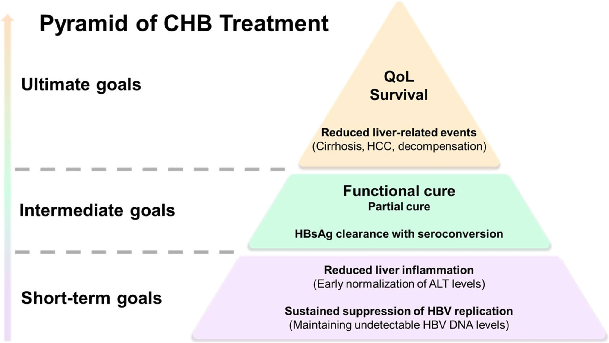
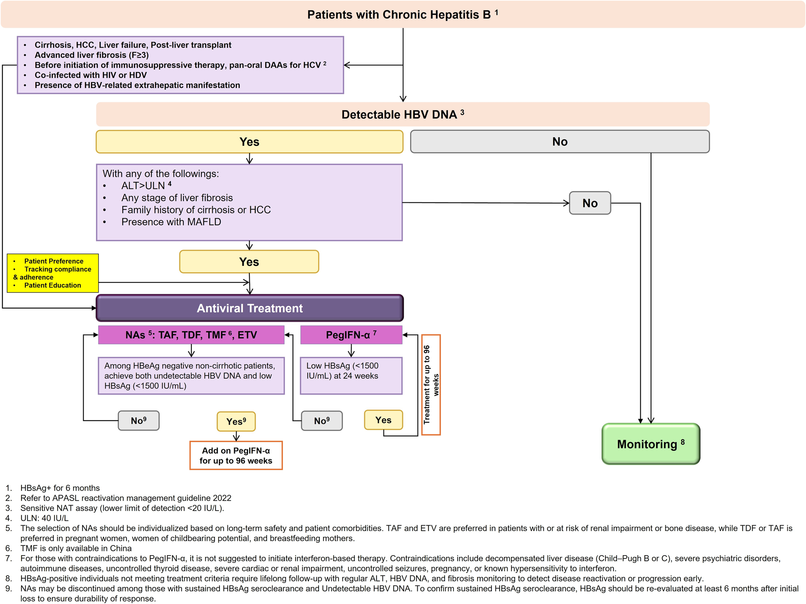

  

    

      
257 triệu

      
Người nhiễm HBV mạn tính toàn cầu — Châu Á-TBD chiếm 2/3

    

    

      
~10 triệu

      
Người nhiễm HBV mạn tính tại Việt Nam (Polaris 2024)

    

    

      
Treat-all

      
Chiến lược mở rộng chỉ định điều trị — tiêu chuẩn vàng APASL 2026

    

    

      
Functional Cure

      
Mục tiêu trung hạn: mất HBsAg bền vững + HBV DNA không phát hiện

    

  

    

      

        
🔄

        

          
Chiến lược Treat-all

          
HBV DNA phát hiện được + ALT &ge; 40 IU/L &rarr; Khởi trị ngay, bất kể giai đoạn xơ hóa, HBeAg hay tiền sử gia đình.

        

      

      

        
🎯

        

          
Đánh giá xơ hóa NITs

          
FIB-4, APRI, VCTE làm công cụ đầu tay. FIB-4 &gt; 1.3 gợi ý &ge; F2; VCTE ngưỡng 7.7 kPa. Sinh thiết chỉ khi NITs mâu thuẫn.

        

      

      

        
🔍

        

          
Tầm soát HCC tối ưu

          
Bộ 3: Siêu âm + AFP + PIVKA-II mỗi 6 tháng khi mPAGE-B &ge; 9. Duy trì suốt đời kể cả sau Functional Cure nếu có xơ gan trước đó.

        

      

    

  

    <a href="#sec-dichte" class="quickmenu-item active">1. Dịch tễ</a>
    <a href="#sec-sinhbenh" class="quickmenu-item">2. Sinh bệnh học</a>
    <a href="#sec-chandoan" class="quickmenu-item">3. Sàng lọc &amp; Chẩn đoán</a>
    <a href="#sec-muctieudieutri" class="quickmenu-item">4. Mục tiêu ĐT</a>
    <a href="#sec-treata" class="quickmenu-item">5. Treat-all &amp; Phác đồ</a>
    <a href="#sec-dacbiet" class="quickmenu-item">6. Cơ địa đặc biệt</a>
    <a href="#sec-hcc" class="quickmenu-item">7. Tầm soát HCC</a>
    <a href="#sec-hieuluc" class="quickmenu-item">8. Hiệu quả so sánh</a>
  

  

    
🌏 <h2 class="sec-title">Dịch Tễ Học &amp; Gánh Nặng Bệnh Tật (GBD 2021 &amp; Polaris 2024)</h2>

    

      

        📊
        

          <strong>Gánh nặng toàn cầu — Table 1</strong>
          Ước tính <strong>257 triệu người</strong> nhiễm HBV mạn tính và khoảng <strong>1,13 triệu ca tử vong hàng năm</strong>. Khu vực Châu Á – Thái Bình Dương chiếm <strong>67% gánh nặng tử vong toàn cầu</strong> (~757.000 ca/năm) và khoảng <strong>15,7 triệu DALYs</strong>.
        

      

      

        

          

          

            
🇻🇳

            
Việt Nam — Gánh nặng HBV

          

          

            <ul style="margin-left: 1rem; line-height: 1.7;">
              <li>Ước tính <strong>~10.098.768 ca</strong> HBsAg dương tính đang hoạt động</li>
              <li>Nằm trong <strong>8 quốc gia chiếm ~90%</strong> ca nhiễm và tử vong HBV tại AP</li>
              <li>Tỷ lệ tử vong &amp; DALYs/100.000 dân thuộc hàng cao nhất khu vực</li>
              <li>Tỷ lệ chẩn đoán và điều trị vẫn <strong>dưới 15%</strong> do rào cản hệ thống</li>
            </ul>
          

          
Nguồn: GBD 2021 &amp; Polaris 2024

        

        

          

          

            
👶

            
Nhi khoa &amp; Khu vực AP

          

          

            <ul style="margin-left: 1rem; line-height: 1.7;">
              <li>Trẻ em &le; 5 tuổi HBsAg(+): <strong>1,6 – 2,6 triệu trẻ</strong> tại AP</li>
              <li>Chiếm <strong>26% – 34%</strong> gánh nặng HBV nhi khoa toàn cầu</li>
              <li>Rào cản: kỳ thị xã hội, chi phí, hệ thống y tế phân mảnh</li>
            </ul>
          

          
Ưu tiên can thiệp sớm &amp; tiêm chủng sinh

        

      

    

  

  

    
🧬 <h2 class="sec-title">Quan Điểm Mới Về Sinh Lý Bệnh &amp; Tiến Triển Tự Nhiên</h2>

    

      

        ⚠️
        

          <strong>Giai đoạn "Dung nạp miễn dịch" — Không còn lành tính</strong>
          APASL 2026 chứng minh giai đoạn này vẫn tồn tại <strong>phản ứng viêm hoại tử gan liên tục</strong> và nguy cơ HCC tiến triển ngay cả khi ALT trong giới hạn bình thường.
        

      

      

        🧫
        

          <strong>Nguy cơ sinh ung thư tồn dư (Residual Oncogenic Risk)</strong>
          Sự tích hợp DNA HBV vào bộ gen tế bào gan xảy ra <strong>từ rất sớm</strong>, thúc đẩy nhân bản vô tính tế bào gan (clonal expansion) — tạo ra nguy cơ ung thư tiềm ẩn ngay cả ở tải lượng vi-rút thấp.
        

      

      

        💡
        

          <strong>Dấu ấn sinh học định lượng mới (Novel Quantitative Biomarkers)</strong>
          <ul style="margin-left: 1rem; margin-top: 0.4rem;">
            <li><strong>qHBsAg:</strong> Phản ánh gián tiếp hoạt động cccDNA; ngưỡng &lt; 1.500 IU/mL &rarr; chọn bệnh nhân add-on Peg-IFN.</li>
            <li><strong>HBV RNA:</strong> Chỉ điểm hoạt động phiên mã cccDNA trong tế bào gan.</li>
            <li><strong>HBcrAg:</strong> Phản ánh DNA HBV đã tích hợp và cccDNA tồn dư.</li>
          </ul>
        

      

      

        📋
        

          <strong>Thay đổi phân loại lâm sàng</strong>
          Phần lớn bệnh nhân CHB trưởng thành biểu hiện ở trạng thái <strong>HBeAg âm tính</strong>. Khái niệm <em>"người mang mầm bệnh không hoạt động"</em> đã bị loại bỏ — thay bằng "Nhiễm HBV mạn tính" để phản ánh đúng nguy cơ tồn dư.
        

      

    

  

  

    
🔬 <h2 class="sec-title">Tiêm Chủng, Sàng Lọc &amp; Đánh Giá Xơ Hóa Gan</h2>

    

      <h3 class="sec-subtitle">Tiêm Chủng Vaccine</h3>
      

        

          

          

            
💉

            
Birth Dose &amp; HBIG

          

          

            <ul style="margin-left: 1rem; line-height: 1.65;">
              <li>Tất cả trẻ sơ sinh ổn định: tiêm vaccine trong <strong>24 giờ đầu</strong> sau sinh A1</li>
              <li>Trẻ từ mẹ HBsAg(+): tiêm trong <strong>12 giờ đầu</strong> + HBIG &rarr; giảm MTCT &lt; 5% A1</li>
              <li>Hoàn thành đủ phác đồ 3 liều theo lịch chuẩn</li>
            </ul>
          

          
Khuyến cáo mạnh — A1

        

        

          

          

            
🩺

            
Xét nghiệm sau tiêm chủng

          

          

            <ul style="margin-left: 1rem; line-height: 1.65;">
              <li><strong>Không khuyến cáo</strong> xét nghiệm anti-HBs thường quy ở người khỏe mạnh đã hoàn thành phác đồ</li>
              <li><strong>Bắt buộc</strong> xét nghiệm anti-HBs sau 1–2 tháng cho: HIV, lọc máu, NVYT nguy cơ cao, bạn tình/gia đình BN HBV A1</li>
              <li>Trẻ từ mẹ HBsAg(+): xét nghiệm HBsAg + anti-HBs lúc <strong>9–12 tháng tuổi</strong> A1</li>
              <li>Không khuyến cáo liều nhắc lại thường quy; chỉ khi anti-HBs &lt; 10 mIU/mL ở nhóm nguy cơ cao</li>
            </ul>
          

        

      

      <h3 class="sec-subtitle">Sàng Lọc Phổ Rộng (Universal Screening)</h3>
      

        📌
        

          <strong>Sàng lọc ít nhất 1 lần trong đời</strong> cho toàn bộ dân số trưởng thành tại vùng lưu hành &ge; 2% (bao gồm Việt Nam) B1. Bộ tối thiểu: <strong>HBsAg + Total anti-HBc</strong>. Khi HBsAg dương tính &rarr; Reflex testing định lượng HBV DNA ngay (B2). Sàng lọc chỉ dựa trên yếu tố nguy cơ bỏ sót tới <strong>2/3 ca nhiễm</strong>.
        

      

      <h3 class="sec-subtitle" style="margin-top: 1.5rem;">Đánh Giá Xơ Hóa Gan — NITs Ưu Tiên Hàng Đầu</h3>
      

        <table class="regimen-table">
          <thead>
            <tr>
              <th style="width:20%">Công cụ</th>
              <th style="width:35%">Ngưỡng cắt lâm sàng</th>
              <th style="width:45%">Ứng dụng &amp; Lưu ý</th>
            </tr>
          </thead>
          <tbody>
            <tr>
              <td class="source-cell">B1 FIB-4</td>
              <td>&gt; 1.3 Xơ hóa đáng kể (&ge; F2) &gt; 2.67 Xơ hóa tiến triển (F3–F4) <em>NCT &ge; 65 tuổi:</em> ngưỡng &gt; 2.0 / &gt; 3.25</td>
              <td>Công cụ sàng lọc chính tại cơ sở hạn chế nguồn lực.</td>
            </tr>
            <tr>
              <td class="source-cell">B1 APRI</td>
              <td>&gt; 0.5 Xơ hóa đáng kể &gt; 1.0 Gợi ý xơ gan</td>
              <td>WHO 2024 khuyến cáo khởi trị ngay khi APRI &gt; 0.5, bất kể HBV DNA hay ALT.</td>
            </tr>
            <tr>
              <td class="source-cell">B2 VCTE (FibroScan)</td>
              <td>7.7 kPa Xơ hóa đáng kể (độ nhạy 64%, đặc hiệu 83%)</td>
              <td>Công cụ bổ trợ, tăng độ chính xác khi quyết định điều trị chưa rõ ràng.</td>
            </tr>
            <tr>
              <td class="source-cell">A1 Sinh thiết gan</td>
              <td colspan="2">Tiêu chuẩn vàng — nhưng <strong>không dùng thường quy</strong>. Chỉ định khi NITs mâu thuẫn hoặc đồng mắc MAFLD có thể thay đổi quyết định điều trị (C2).</td>
            </tr>
          </tbody>
        </table>
      

      

        ⚠️
        

          <strong>Đồng mắc CHB + MAFLD (~35% BN CHB):</strong> NITs hiện tại <strong>không thể phân biệt</strong> nguyên nhân chính gây tổn thương là HBV hay MAFLD. Cần đánh giá thường quy các thành phần chuyển hóa và theo dõi chặt chẽ B2.
        

      

    

  

  

    
🎯 <h2 class="sec-title">Mục Tiêu Điều Trị 3 Cấp Độ — Kim Tự Tháp APASL 2026</h2>

    

      

        
        

          
Fig. 1 – Pyramid of CHB Treatment Goals (APASL 2026)

          Kim tự tháp 3 cấp độ: Đáy (ngắn hạn) &rarr; Thân (Functional/Partial Cure) &rarr; Đỉnh (cải thiện sinh tồn và chất lượng cuộc sống).
        

      

      

        

          

          

            
1

            
Mục tiêu Ngắn hạn

          

          

            <ul style="margin-left:1rem;line-height:1.7;">
              <li>HBV DNA <strong>dưới ngưỡng phát hiện</strong> (kéo dài, bền vững) A1</li>
              <li><strong>Bình thường hóa ALT</strong> — liên quan chặt với giảm nguy cơ HCC A1</li>
              <li>HBeAg(+): đạt <strong>chuyển đổi huyết thanh HBeAg</strong> là đích rất mong muốn A1</li>
            </ul>
          

        

        

          

          

            
2

            
Mục tiêu Trung hạn

          

          

            <ul style="margin-left:1rem;line-height:1.7;">
              <li><strong>Functional Cure:</strong> Mất HBsAg bền vững (&ge; 6 tháng) + HBV DNA không phát hiện sau ngừng điều trị hữu hạn A1</li>
              <li><strong>Partial Cure:</strong> HBsAg &lt; 100 IU/mL — mục tiêu thay thế cho HBeAg(-), liên quan nguy cơ HCC tối thiểu B1</li>
            </ul>
          

          
Đích điều trị ưu tiên của APASL 2026

        

        

          

          

            
3

            
Mục tiêu Dài hạn / Cuối cùng

          

          

            <ul style="margin-left:1rem;line-height:1.7;">
              <li>Ngăn ngừa <strong>xơ gan, suy gan mất bù, HCC</strong> A1</li>
              <li>Tối ưu hóa <strong>chất lượng cuộc sống và tỷ lệ sống sót</strong> dài hạn A1</li>
            </ul>
          

        

      

    

  

  

    
💊 <h2 class="sec-title">Chiến Lược Treat-all, Phác Đồ Kháng Vi-rút &amp; Tiêu Chuẩn Ngừng Thuốc</h2>

    

      

        
        

          
Fig. 2 – CHB Treatment Algorithm (APASL 2026)

          Thuật toán: Đánh giá CHB &rarr; Phân nhánh ưu tiên điều trị ngay vs. đánh giá HBV DNA &rarr; Khởi trị NAs hoặc Peg-IFN &rarr; Tối ưu hóa hướng Functional Cure.
        

      

      <h3 class="sec-subtitle">Nhóm Khởi Trị NGAY — Bất kể HBV DNA &amp; ALT</h3>
      

        🛑
        

          Bắt buộc điều trị kháng vi-rút ngay khi có bất kỳ tình trạng nào: <strong>Xơ gan (bù/mất bù), HCC, Suy gan, Ghép gan; Xơ hóa nặng F &ge; 3; Đang/chuẩn bị dùng ức chế miễn dịch/hóa trị; Đồng nhiễm HIV/HDV/HCV; Biểu hiện ngoài gan do HBV</strong> A1
        

      

      <h3 class="sec-subtitle" style="margin-top: 1.5rem;">Chỉ Định Mở Rộng "Treat-all" — Các Trường Hợp Còn Lại</h3>
      

        ✅
        

          Khởi trị khi: HBV DNA phát hiện được + <strong>bất kỳ yếu tố nào trong 4 tiêu chí</strong>:
          <ol style="margin-left: 1.2rem; margin-top: 0.4rem;">
            <li>ALT &gt; ULN (&ge; 40 IU/L)</li>
            <li>Có bất kỳ mức độ xơ hóa gan</li>
            <li>Tiền sử gia đình có xơ gan hoặc HCC</li>
            <li>Đồng mắc MAFLD</li>
          </ol>
          Nếu không có yếu tố nào &rarr; Theo dõi định kỳ.
        

      

      <h3 class="sec-subtitle" style="margin-top: 1.5rem;">Phác Đồ Kháng Vi-rút Đầu Tay</h3>
      

        <table class="regimen-table">
          <thead>
            <tr>
              <th style="width:12%">Thuốc</th>
              <th style="width:38%">Đặc điểm &amp; Chỉ định ưu tiên</th>
              <th style="width:50%">Lưu ý lâm sàng</th>
            </tr>
          </thead>
          <tbody>
            <tr>
              <td class="source-cell">NAs TAF 25mg</td>
              <td><strong>Ưu tiên hàng đầu</strong> cho NCT, bệnh thận, loãng xương. An toàn xương/thận vượt trội TDF.</td>
              <td>Không cần chỉnh liều khi eGFR &ge; 15 mL/min/1.73m².</td>
            </tr>
            <tr>
              <td class="source-cell">NAs TDF 300mg</td>
              <td>Hiệu quả tốt, chi phí thấp. Lựa chọn hàng đầu trong dự phòng MTCT (thai kỳ từ tuần 28–32).</td>
              <td>Dùng lâu dài ở NCT &rarr; tăng nguy cơ gãy xương và suy thận. Chỉnh liều khi eGFR &lt; 50.</td>
            </tr>
            <tr>
              <td class="source-cell">NAs ETV 0.5mg</td>
              <td>An toàn thận/xương. Hiệu quả cao ở bệnh nhân chưa từng điều trị NUCs.</td>
              <td><strong>KHÔNG</strong> dùng đơn trị cho BN đồng nhiễm HIV. Tăng liều 1mg khi kháng LAM.</td>
            </tr>
            <tr>
              <td class="source-cell">IFN Peg-IFN-&alpha;</td>
              <td>Lựa chọn đầu tay có thời hạn hoặc <em>add-on NAs</em> khi HBsAg &lt; 1.500 IU/mL (tối đa 96 tuần). Đánh giá HBsAg tại tuần 24; nếu &ge; 1.500 IU/mL &rarr; chuyển sang NAs dài hạn.</td>
              <td><strong>Chống chỉ định:</strong> Xơ gan mất bù, thai kỳ, VGAN tự miễn, bệnh tuyến giáp không kiểm soát.</td>
            </tr>
          </tbody>
        </table>
      

      <h3 class="sec-subtitle" style="margin-top: 1.5rem;">Tiêu Chuẩn Ngừng Thuốc NUCs (Discontinuation)</h3>
      

        

          

          

            
✅

            
Tiêu chuẩn Tối ưu (Cả HBeAg+ và –)

          

          
Mất HBsAg bền vững (2 lần, cách &ge; 6 tháng) + HBV DNA không phát hiện, bất kể có anti-HBs hay chưa.

          
Functional Cure đạt được

        

        

          

          

            
⚖️

            
Tiêu chuẩn Cân nhắc (HBeAg– không xơ gan)

          

          
HBV DNA không phát hiện liên tục <strong>&gt; 3 năm</strong>, dưới giám sát chặt chẽ bởi chuyên gia. Theo dõi ít nhất 1 lần/tháng trong 6 tháng đầu sau ngừng.

        

        

          

          

            
🛑

            
Chống chỉ định Ngừng Thuốc

          

          
Tuyệt đối <strong>KHÔNG ngừng NUCs</strong> ở bệnh nhân xơ gan hoặc xơ gan mất bù.

          
Nguy cơ bùng phát suy gan cấp tử vong

        

      

    

  

  

    
👩‍⚕️ <h2 class="sec-title">Quản Lý Trên Các Cơ Địa Đặc Biệt (Special Populations)</h2>

    

      <h3 class="sec-subtitle">Phụ Nữ Mang Thai — Dự Phòng MTCT</h3>
      

        🤰
        

          <strong>Dự phòng MTCT:</strong> Nguy cơ lây vẫn lên đến 30% dù đã tiêm vaccine + HBIG đầy đủ nếu mẹ có HBV DNA &gt; 6–8 log&#8321;&#8320; IU/mL. <strong>Khởi trị TDF hoặc TAF từ tuần 28–32</strong> khi HBeAg(+) và/hoặc HBV DNA &ge; 200.000 IU/mL. Cho con bú an toàn khi đang dùng TDF/TAF.
        

      

      

        ⚠️
        

          <strong>Theo dõi sau sinh (Postpartum):</strong> Ngừng thuốc dự phòng sau sinh có thể kích hoạt đợt bùng phát viêm gan. Theo dõi sát ALT và HBV DNA của người mẹ. Xét nghiệm trẻ: HBsAg + anti-HBs lúc <strong>9–12 tháng tuổi</strong> (không xét nghiệm sớm hơn).
        

      

      <h3 class="sec-subtitle" style="margin-top: 1.5rem;">Đồng Nhiễm Vi-rút Hướng Gan &amp; HIV</h3>
      

        <table class="regimen-table">
          <thead>
            <tr>
              <th style="width:20%">Đồng nhiễm</th>
              <th style="width:80%">Khuyến cáo APASL 2026</th>
            </tr>
          </thead>
          <tbody>
            <tr>
              <td class="source-cell">HBV/HIV</td>
              <td>Khởi động ART ngay cho tất cả BN. Phác đồ bắt buộc chứa <strong>TDF hoặc TAF + Lamivudine hoặc Emtricitabine</strong>. Không dùng ETV đơn trị (nguy cơ kháng HIV).</td>
            </tr>
            <tr>
              <td class="source-cell">HBV/HDV</td>
              <td>Điều trị bằng <strong>Peg-IFN-&alpha; (180 mcg/tuần trong 96 tuần)</strong> hoặc <strong>Bulevirtide (BLV)</strong>. Xơ gan mất bù do HDV: <strong>chống chỉ định Peg-IFN</strong>, ưu tiên đánh giá ghép gan.</td>
            </tr>
            <tr>
              <td class="source-cell">HBV/HCV</td>
              <td>Điều trị HCV bằng DAAs. <strong>Bắt buộc dự phòng NUCs trước khi khởi động DAAs</strong> nếu HBsAg(+) (tái hoạt động HBV 5.9%–24%). Nếu chỉ anti-HBc(+): theo dõi sát ALT, HBsAg, HBV DNA trong suốt liệu trình HCV.</td>
            </tr>
          </tbody>
        </table>
      

      <h3 class="sec-subtitle" style="margin-top: 1.5rem;">Xơ Gan Mất Bù (ESLD) &amp; Bệnh Gan Do Rượu</h3>
      

        

          

          

            
🚨

            
Xơ Gan Mất Bù

          

          

            <ul style="margin-left:1rem;line-height:1.7;">
              <li>Khởi trị NAs <strong>ngay lập tức</strong>, bất kể ALT hay HBeAg, miễn là HBV DNA phát hiện được</li>
              <li>Ưu tiên <strong>TAF &gt; TDF</strong> (an toàn thận/xương vượt trội)</li>
              <li>Duy trì NAs <strong>suốt đời — tuyệt đối không ngừng thuốc</strong></li>
            </ul>
          

          
Ngừng thuốc = nguy cơ tử vong

        

        

          

          

            
🍺

            
CHB + Bệnh Gan Do Rượu

          

          

            <ul style="margin-left:1rem;line-height:1.7;">
              <li><strong>Bắt buộc kiêng rượu hoàn toàn</strong> — hỗ trợ tâm lý xã hội &amp; dược lý cai nghiện</li>
              <li>Điều trị NAs mạnh, duy trì lâu dài (infinite NUCs therapy)</li>
              <li>Interferon <strong>chống chỉ định</strong> trong nhóm này</li>
            </ul>
          

        

      

    

  

  

    
📊 <h2 class="sec-title">Phân Tầng Nguy Cơ &amp; Tầm Soát Ung Thư Gan (HCC Surveillance)</h2>

    

      

        📌
        

          <strong>Phương pháp chuẩn:</strong> Siêu âm + AFP <strong>mỗi 6 tháng</strong> A1. <strong>Chiến lược tối ưu hóa tại AP:</strong> Bộ 3 <strong>Siêu âm + AFP + PIVKA-II</strong> &rarr; tăng độ nhạy &gt; 90% B1. Duy trì tầm soát suốt đời kể cả sau Functional Cure nếu bệnh nhân có F3/xơ gan trước khi đạt mất HBsAg.
        

      

      <h3 class="sec-subtitle" style="margin-top: 1rem;">11 Thang Điểm Dự Báo Nguy Cơ HCC — Table 5</h3>
      

        <table class="regimen-table">
          <thead>
            <tr>
              <th style="width:18%">Thang điểm (Năm)</th>
              <th style="width:30%">Thông số đầu vào</th>
              <th style="width:22%">Quần thể xây dựng</th>
              <th style="width:30%">Phân tầng nguy cơ HCC</th>
            </tr>
          </thead>
          <tbody>
            <tr style="background:#f0fdf4;">
              <td class="source-cell">mPAGE-B 2018</td>
              <td>Tuổi, giới tính, tiểu cầu, albumin</td>
              <td>Châu Á (Hàn Quốc) — 20% xơ gan</td>
              <td>Thấp: 0–8 | <strong>TB: 9–12</strong> | Cao: 13–21 <strong>mPAGE-B &ge; 9 &rarr; BẮT BUỘC tầm soát</strong></td>
            </tr>
            <tr>
              <td class="source-cell">PAGED-B 2024</td>
              <td>Tuổi, giới, tiểu cầu, HBV DNA (năm 0), ĐTĐ</td>
              <td>Châu Á (Hàn Quốc) — 0% xơ gan</td>
              <td>Thấp: 0–6 | Cao: 7–12</td>
            </tr>
            <tr>
              <td class="source-cell">aMAP 2020</td>
              <td>Tuổi, giới, tiểu cầu, albumin, bilirubin</td>
              <td>Châu Á (Trung Quốc) — 19% xơ gan</td>
              <td>Thấp: 0–49.9 | TB: 50–59.9 | Cao: 60–100</td>
            </tr>
            <tr>
              <td class="source-cell">CAGE-B 2020</td>
              <td>Tuổi (năm 5), xơ gan (năm 0), LSM (năm 5)</td>
              <td>Da trắng (Hy Lạp, TBN, Hà Lan, Thổ) — 27% xơ gan</td>
              <td>Thấp: 0–5 | TB: 6–10 | Cao: 11–16</td>
            </tr>
            <tr>
              <td class="source-cell">SAGE-B 2020</td>
              <td>Tuổi (năm 5), LSM (năm 5)</td>
              <td>Da trắng — 27% xơ gan</td>
              <td>Thấp: 0–5 | TB: 6–10 | Cao: 11–15</td>
            </tr>
            <tr>
              <td class="source-cell">REAL-B 2020</td>
              <td>Tuổi, giới, xơ gan, ĐTĐ, tiểu cầu, AFP, rượu</td>
              <td>Đa trung tâm AP (TQ, HQ, HK, Đài, NB, NZ)</td>
              <td>Thấp: 0–3 | TB: 4–7 | Cao: 8–13</td>
            </tr>
            <tr>
              <td class="source-cell">AASL-HCC 2019</td>
              <td>Tuổi, giới, xơ gan, albumin</td>
              <td>Châu Á (Hàn Quốc) — 39% xơ gan</td>
              <td>Thấp: 0–5 | TB: 6–19 | Cao: 20–29</td>
            </tr>
            <tr>
              <td class="source-cell">CAMD 2018</td>
              <td>Tuổi, giới, xơ gan, ĐTĐ</td>
              <td>Châu Á (Đài Loan) — 26% xơ gan</td>
              <td>Thấp: 0–7 | TB: 8–13 | Cao: 14–23 (tại 3 năm)</td>
            </tr>
            <tr>
              <td class="source-cell">HCC-RESCUE 2017</td>
              <td>Tuổi, giới, xơ gan</td>
              <td>Châu Á (Hàn Quốc) — 39% xơ gan</td>
              <td>Thấp: 18–64 | TB: 65–84 | Cao: &ge; 85</td>
            </tr>
            <tr>
              <td class="source-cell">PAGE-B 2016</td>
              <td>Tuổi, giới, tiểu cầu</td>
              <td>Da trắng — 21% xơ gan</td>
              <td>Thấp: 0–9 | TB: 10–17 | Cao: 18–25</td>
            </tr>
            <tr>
              <td class="source-cell">mREACH-B 2014</td>
              <td>Tuổi, giới, HBeAg, ALT, LSM</td>
              <td>Châu Á (Hàn Quốc) — 18% xơ gan</td>
              <td>Thấp: 0–9 | Cao: 10–16</td>
            </tr>
          </tbody>
        </table>
      

      
<em>Ghi chú: Phân tầng dựa trên tỷ lệ tích lũy HCC tại 5 năm (trừ CAMD: 3 năm). Độ chính xác thang điểm giảm sau &gt; 5 năm ức chế vi-rút hoặc khi BN có ĐTĐ đồng mắc.</em>

    

  

  

    
🧪 <h2 class="sec-title">Hiệu Quả So Sánh Các Phác Đồ Kháng Vi-rút — Table 4</h2>

    

      <h3 class="sec-subtitle">1. Ức Chế HBV DNA &amp; Bình Thường Hóa ALT</h3>
      

        <table class="regimen-table">
          <thead>
            <tr>
              <th style="width:12%">Thuốc</th>
              <th style="width:44%">Ức chế HBV DNA (dưới ngưỡng phát hiện)</th>
              <th style="width:44%">Bình thường hóa ALT</th>
            </tr>
          </thead>
          <tbody>
            <tr>
              <td class="source-cell">TDF</td>
              <td>67% (e+) / 93% (e–) &rarr; năm 1 75% (e+) / 91% (e–) &rarr; năm 2 <strong>98% (e+) / 100% (e–) &rarr; năm 10</strong></td>
              <td>67% (e+) / 75% (e–) &rarr; năm 1 78% (e+) / 83% (e–) &rarr; năm 10</td>
            </tr>
            <tr>
              <td class="source-cell">TAF</td>
              <td>64% (e+) / 94% (e–) &rarr; năm 1 73% (e+) / 90% (e–) &rarr; năm 2 <strong>95% tổng &rarr; năm 8</strong></td>
              <td>72% (e+) / 83% (e–) &rarr; năm 1 <strong>87% tổng &rarr; năm 8</strong></td>
            </tr>
            <tr>
              <td class="source-cell">ETV</td>
              <td>67% (e+) / 90% (e–) &rarr; năm 1 <strong>99% (e+) / 98% (e–) &rarr; năm 5</strong></td>
              <td>68% (e+) / 78% (e–) &rarr; năm 1 95% &rarr; năm 5</td>
            </tr>
            <tr>
              <td class="source-cell">Peg-IFN</td>
              <td>14% (e+) / 19% (e–) &rarr; 1.5 năm</td>
              <td>41% (e+) / 59% (e–) &rarr; 1.5 năm</td>
            </tr>
          </tbody>
        </table>
      

      <h3 class="sec-subtitle" style="margin-top: 1.5rem;">2. Cải Thiện Mô Bệnh Học Gan (Thoái Triển Xơ Hóa &amp; Hoại Tử Viêm)</h3>
      

        

          

            
Thoái triển xơ hóa

          

          

            <ul style="margin-left:1rem;line-height:1.7;font-size:0.82rem;">
              <li><strong>TDF:</strong> 51% xơ hóa chung; <strong>74% xơ gan nặng (Ishak &ge; 5)</strong> đảo ngược — sau 5 năm</li>
              <li><strong>ETV:</strong> 39–36% (e+/–) &rarr; năm 1; <strong>80.4% tổng &rarr; năm 5</strong></li>
              <li><strong>Peg-IFN:</strong> 49% (e+) / 55% (e–) &rarr; 1.5 năm</li>
            </ul>
          

        

        

          

            
Cải thiện hoại tử viêm

          

          

            <ul style="margin-left:1rem;line-height:1.7;font-size:0.82rem;">
              <li><strong>TDF:</strong> 87% cải thiện sau 5 năm; 91% ở nhóm Ishak &ge; 3</li>
              <li><strong>ETV:</strong> 72% (e+) / 70% (e–) &rarr; năm 1</li>
              <li><strong>Peg-IFN:</strong> 49% HAI (e+) / 55% (e–) &rarr; 1.5 năm</li>
            </ul>
          

        

      

      <h3 class="sec-subtitle">3. Mất Sạch HBsAg &amp; Giảm Nguy Cơ HCC / Tử Vong</h3>
      

        🏆
        

          <strong>Chiến lược tốt nhất để đạt Functional Cure (HBsAg loss):</strong>
          <ul style="margin-left:1rem;margin-top:0.4rem;">
            <li>NAs đơn trị: &lt; 1%/năm — hiệu quả cực kỳ thấp</li>
            <li>Peg-IFN đơn trị: 11% (e+), 8–14% (e–) sau 3 năm</li>
            <li><strong>Peg-IFN add-on NAs:</strong> RR = <strong>4.52</strong> (95% CI 1.95–10.47) so với NAs đơn trị</li>
            <li><strong>Chuyển đổi NUC &rarr; Peg-IFN:</strong> RR = <strong>12.15</strong> (95% CI 3.99–37.01) so với tiếp tục NAs</li>
          </ul>
        

      

      

        <table class="regimen-table">
          <thead>
            <tr>
              <th style="width:14%">Thuốc</th>
              <th style="width:43%">Giảm nguy cơ HCC (aHR)</th>
              <th style="width:43%">Giảm tử vong / ghép gan (aHR)</th>
            </tr>
          </thead>
          <tbody>
            <tr>
              <td class="source-cell">TDF</td>
              <td>aHR <strong>0.46</strong> so với không điều trị aHR suy gan mất bù: <strong>0.28</strong></td>
              <td>Tử vong/ghép gan: aHR <strong>0.06</strong> Tử vong liên quan gan: <strong>0.26</strong> Mọi nguyên nhân: <strong>0.34</strong></td>
            </tr>
            <tr>
              <td class="source-cell">TAF</td>
              <td>HR <strong>0.27</strong> so với không điều trị</td>
              <td>Dữ liệu dài hạn đang tích lũy (theo dõi năm 8)</td>
            </tr>
            <tr>
              <td class="source-cell">ETV</td>
              <td>HR <strong>0.55</strong> so với không điều trị</td>
              <td>—</td>
            </tr>
            <tr>
              <td class="source-cell">Peg-IFN vs ETV</td>
              <td colspan="2">Nghiên cứu 5 năm HBeAg(+): Xơ gan/HCC nhóm Peg-IFN <strong>0%</strong> vs nhóm ETV <strong>9.1%</strong></td>
            </tr>
          </tbody>
        </table>
      

    

  

  

    <strong>Tài liệu gốc:</strong> You H, Maiwall R, Chen J, Ahn SH, Dokmeci K, et al. APASL clinical practice guidelines on the management of chronic hepatitis B infection: a 2026 update. <em>Hepatol Int</em>. 2026. doi:10.1007/s12072-026-11108-1.
     
    Phiên bản tóm tắt v3.0.0 — cập nhật đầy đủ nội dung từ 3 phần nguồn (P1, P2, P3) ngày 31/08/2026.
  

  

    <a href="#/ebm/kho-guidelines" class="btn btn-primary">
      <i class="fa-solid fa-arrow-left"></i> Quay lại Kho Guidelines
    </a>
    <a href="#sec-dichte" class="btn">
      <i class="fa-solid fa-arrow-up"></i> Lên đầu trang
    </a>
  

