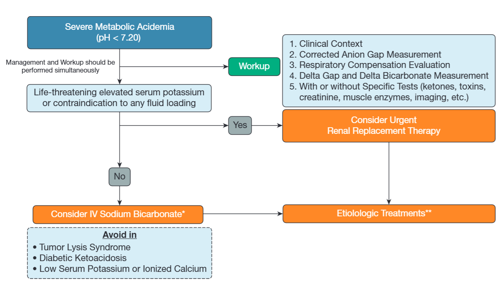

  

    

      
pH &lt; 7.20

      
Ngưỡng định nghĩa toan chuyển hóa nặng tại ICU; liên quan trực tiếp tới ức chế co bóp cơ tim và giãn mạch kháng catecholamine.

    

    

      
Giảm 50% RRT

      
Thử nghiệm BICAR-ICU 2 (629 bệnh nhân) chứng minh truyền NaHCO3 4.2% giúp giảm 50% nhu cầu can thiệp lọc máu cấp cứu.

    

    

      
Đích pH &gt; 7.30

      
Mục tiêu nâng kiềm tạm thời (temporizing goal) nhằm bảo vệ chức năng tạng trong khi giải quyết triệt để căn nguyên gốc rễ.

    

    

      
Bù Ca2+ &amp; K+ Trước

      
Bắt buộc bù đủ canxi ion hóa và kali máu trước khi truyền kiềm để ngăn ngừa co thắt phế quản, suy tim cấp và ngừng tim.

    

  

  

    

      
⚡

      

        
Đánh Giá &amp; Xử Trí Đồng Thời

        
Không trì hoãn can thiệp để chờ đủ xét nghiệm. Song song với hồi sức huyết động, thực hiện quy trình 5 bước: Bối cảnh lâm sàng → Anion Gap hiệu chỉnh → Bù trừ hô hấp → Delta Gap → Xét nghiệm đặc hiệu.

      

    

    

      
🔄

      

        
Phân Nhánh Quyết Định Cấp Cứu

        
Ưu tiên số 1: Nếu có tăng kali máu đe dọa tính mạng hoặc chống chỉ định quá tải thể tích (phù phổi, vô niệu) → Chỉ định lọc máu cấp cứu (Urgent RRT). Nếu không → Cân nhắc truyền Natri Bicarbonate 4.2%.

      

    

    

      
⚠️

      

        
5 Chống Chỉ Định Cốt Tử

        
Tránh truyền NaHCO3 trong: (1) Toan ceton đái tháo đường (DKA); (2) Hội chứng ly giải u (TLS); (3) Hạ canxi ion hóa; (4) Hạ kali máu; (5) Phù phổi cấp quá tải tuần hoàn kèm vô niệu.

      

    

    

      
🫁

      

        
Thông Khí Bảo Vệ Phổi Tránh VILI

        
Tuyệt đối không tăng thông khí phút thô bạo trên máy thở để cố kéo pH về bình thường, vì sẽ làm tăng công suất cơ học (mechanical power) gây tổn thương phổi VILI; phối hợp bù kiềm để duy trì pH an toàn tối thiểu.

      

    

  

  

    <a href="#sec-tongquan-bicanh" class="quickmenu-item active">1. Tổng quan &amp; Định nghĩa</a>
    <a href="#sec-sinhly-ca-benh" class="quickmenu-item">2. Phân tích ca bệnh</a>
    <a href="#sec-quytrinh-5buoc" class="quickmenu-item">3. Quy trình 5 bước</a>
    <a href="#sec-luodo-figure1" class="quickmenu-item">4. Lưu đồ Figure 1</a>
    <a href="#sec-donghoc-bu-kiem" class="quickmenu-item">5. Động học bù kiềm</a>
    <a href="#sec-thucchung-rct" class="quickmenu-item">6. Thực chứng BICAR-ICU</a>
    <a href="#sec-bang-tonghop-rct" class="quickmenu-item">7. Bảng 8 thử nghiệm RCT</a>
    <a href="#sec-chong-chi-dinh" class="quickmenu-item">8. 5 Chống chỉ định</a>
    <a href="#sec-thong-khi-phut" class="quickmenu-item">9. Cài đặt máy thở &amp; VILI</a>
    <a href="#sec-khuyen-cao-thuc-hanh" class="quickmenu-item">10. Khuyến cáo thực hành</a>
    <a href="#sec-citation" class="quickmenu-item">11. Tài liệu tham khảo</a>
  

{/* SECTION 1: BỐI CẢNH LÂM SÀNG & ĐỊNH NGHĨA */}

  

    

      
<i class="fa-solid fa-notes-medical"></i>

      

        
PHẦN 1 • TỔNG QUAN LÂM SÀNG

        
Toan Chuyển Hóa Nặng (pH &lt; 7.20) Tại Hồi Sức Tích Cực: Nguy Cơ &amp; Hệ Lụy Sinh Lý Bệnh

      

    

    

      CHEST 2026 Review
      Tử Vong Đến 50%
    

  

  

    
<strong>Toan chuyển hóa nặng (Severe Metabolic Acidemia)</strong>, được định nghĩa khi <strong>pH máu động mạch &lt; 7.20</strong> kèm nồng độ bicarbonate huyết tương <strong>HCO3- &lt; 20 mEq/L</strong>, là một biến cố lâm sàng cực kỳ nguy kịch xuất hiện ở khoảng 8% đến 15% tổng số bệnh nhân nhập khoa Hồi sức tích cực (ICU), với tỷ lệ tử vong dao động từ 30% đến trên 50%.

    

      

        

          Tác Động Tim Mạch
          <h4>Ức Chế Cơ Tim &amp; Kháng Vận Mạch</h4>
        

        
Toan máu nặng ức chế trực tiếp tính co bóp của sợi cơ tim (negative inotropy), làm giảm cung lượng tim, giãn động mạch ngoại vi nặng nề, và làm <strong>mất tính nhạy cảm của các thụ thể alpha-1 và beta-1 adrenergic với catecholamine</strong>, dẫn đến sốc giãn mạch trơ với thuốc vận mạch.

      

      

        

          Tác Động Phổi &amp; Tuần Hoàn Phổi
          <h4>Co Thắt Mạch Phổi &amp; Tăng Áp Phổi</h4>
        

        
Toan máu gây co thắt tiểu động mạch phổi phản xạ (hypoxic/acidemic pulmonary vasoconstriction), làm tăng vọt hậu gánh thất phải, thúc đẩy suy tim phải cấp tính, đồng thời kích thích trung tâm hô hấp gây thở nhanh sâu (thở Kussmaul) làm kiệt sức cơ hô hấp.

      

      

        

          Rối Loạn Điện Giải &amp; Màng Tế Bào
          <h4>Dịch Chuyển Kali &amp; Giảm Ngưỡng Loạn Nhịp</h4>
        

        
Proton H+ đi vào trong tế bào để trao đổi với ion K+, gây tăng kali máu cấp tính. Toan máu làm giảm ngưỡng kích thích điện học của cơ tim, tăng nguy cơ xuất hiện các rối loạn nhịp thất chết người (nhanh thất, rung thất) và ngừng tuần hoàn.

      

      

        

          Nguyên Nhân Thường Gặp Nhất
          <h4>AKI &amp; Sốc Nhiễm Khuẩn Phối Hợp</h4>
        

        
Đa số các trường hợp toan máu nặng tại ICU không do một nguyên nhân đơn lẻ mà là sự cộng gộp giữa <strong>giảm tưới máu mô (toan lactic trong sốc nhiễm khuẩn/sốc tim)</strong> và <strong>suy giảm khả năng bài tiết acid hữu cơ/tái hấp thu kiềm (tổn thương thận cấp AKI)</strong>.

      

    

  

{/* SECTION 2: PHÂN TÍCH CA LÂM SÀNG & SINH LÝ BỆNH */}

  

    

      
<i class="fa-solid fa-calculator"></i>

      

        
PHẦN 2 • CA LÂM SÀNG MINH HỌA &amp; PHÂN TÍCH TOAN KIỀM

        
Phân Tích Bằng Chứng Sinh Lý Bệnh Học Từ Ca Lâm Sàng Điển Hình Trong CHEST 2026

      

    

    

      Physiologic Analysis
      Cá Thể Hóa
    

  

  

    

      

        

          
<i class="fa-solid fa-vial"></i>

          
Thông Số Khí Máu Động Mạch &amp; Sinh Hóa Đo Được

        

        

          
Bệnh nhân nguy kịch tại ICU nhập viện trong bệnh cảnh sốc nhiễm khuẩn biến chứng suy thận cấp (AKI):

          <ul class="clean-list">
            <li><strong>pH:</strong> 7.19 (Toan máu rất nặng)</li>
            <li><strong>PaCO2:</strong> 30 mmHg (Có đáp ứng bù trừ của hệ hô hấp)</li>
            <li><strong>PaO2:</strong> 70 mmHg (Khí máu phòng)</li>
            <li><strong>HCO3-:</strong> 12 mmol/L (Giảm nặng, xác định toan chuyển hóa là rối loạn nguyên phát)</li>
            <li><strong>Base Excess (Kiềm dư):</strong> -14.5 mmol/L</li>
            <li><strong>Lactate:</strong> 3.0 mmol/L (Tăng nhẹ do giảm tưới máu mô)</li>
            <li><strong>Điện giải đồ:</strong> Na+ 138 mmol/L, K+ 5.2 mmol/L, Cl- 103 mmol/L</li>
            <li><strong>Canxi ion hóa (iCa2+):</strong> 0.97 mmol/L (Giảm nặng đe dọa chức năng co bóp tim)</li>
          </ul>
        

      

      

        

          
<i class="fa-solid fa-brain"></i>

          
Phân Tích Cơ Chế Sinh Lý Bệnh Acid-Base Cốt Lõi

        

        

          <ol class="clean-list">
            <li><strong>1. Khoảng trống Anion hiệu chỉnh (Corrected Anion Gap - cAG):</strong>
               <code>cAG = [Na+] - [Cl-] - [HCO3-] + 2.5 x (4.0 - [Albumin g/dL])</code>
               Khoảng trống Anion đo được là 23 mmol/L (tăng cao &gt; 12), phản ánh sự tích tụ của các anion không đo được (sulfate, phosphate do AKI kết hợp lactate 3 mmol/L). Xét nghiệm beta-hydroxybutyrate âm tính giúp loại trừ toan ceton.
            </li>
            <li><strong>2. Đánh giá bù trừ hô hấp theo Công thức Winters:</strong>
               <code>PaCO2 kỳ vọng = (1.5 x [HCO3-]) + 8 ± 2 = (1.5 x 12) + 8 ± 2 = 26 ± 2 mmHg</code>
               PaCO2 thực tế đo được là 30 mmHg (cao hơn mức kỳ vọng 24–28 mmHg), chứng tỏ bệnh nhân có <strong>toan hô hấp phối hợp</strong> nhẹ do suy kiệt cơ hô hấp hoặc thông khí phế nang chưa đủ.
            </li>
            <li><strong>3. Tỷ số biến thiên Delta Gap và Delta Bicarbonate:</strong>
               <code>Hiệu số định lượng = 0.6 x ΔAG - ΔHCO3-</code>
               Kết quả tính toán trên ca bệnh này không ghi nhận khoảng trống thiếu hụt kiềm thêm, khẳng định <strong>toan chuyển hóa tăng Anion Gap đơn thuần chiếm ưu thế</strong>, không có toan chuyển hóa không tăng anion gap (NAGMA) đi kèm.
            </li>
          </ol>
        

      

    

  

{/* SECTION 3: QUY TRÌNH ĐÁNH GIÁ 5 BƯỚC */}

  

    

      
<i class="fa-solid fa-list-check"></i>

      

        
PHẦN 3 • QUY TRÌNH ĐÁNH GIÁ CHUẨN HÓA

        
5 Bước Đánh Giá Hệ Thống Tiếp Cận Bệnh Nhân Toan Chuyển Hóa Nặng (Diagnostic Workup)

      

    

    

      5-Step Workup
      Thực Hành Chuẩn ICU
    

  

  

    

      <table class="regimen-table">
        <thead>
          <tr>
            <th style="width: 15%;">Bước Đánh Giá</th>
            <th style="width: 25%;">Mục Tiêu &amp; Chỉ Số Cần Đo</th>
            <th style="width: 35%;">Công Thức &amp; Cơ Chế Sinh Lý Bệnh</th>
            <th style="width: 25%;">Hành Động Lâm Sàng Tương Ứng</th>
          </tr>
        </thead>
        <tbody>
          <tr>
            <td><strong>Bước 1: Clinical Context</strong></td>
            <td>Bối cảnh lâm sàng &amp; huyết động</td>
            <td>Tìm kiếm dấu hiệu sốc, tụt huyết áp, thiểu niệu (&lt; 0.5 mL/kg/h), ổ nhiễm trùng, tiền sử dùng Metformin, ngộ độc cồn công nghiệp (methanol, ethylene glycol), ngộ độc Paracetamol.</td>
            <td>Hồi sức thể tích, dùng kháng sinh sớm, rà soát tiền sử độc chất để chuẩn bị thuốc giải độc (Antidote).</td>
          </tr>
          <tr>
            <td><strong>Bước 2: Corrected AG</strong></td>
            <td>Khoảng trống Anion hiệu chỉnh Albumin</td>
            <td><code>cAG = [Na+] - ([Cl-] + [HCO3-]) + 2.5 x (4.0 - Albumin g/dL)</code> Giảm 1 g/dL albumin làm giảm AG giả tạo đi 2.5 mEq/L. Bắt buộc hiệu chỉnh để tránh bỏ sót toan chuyển hóa tăng AG ở bệnh nhân suy dinh dưỡng/nhiễm trùng.</td>
            <td>Nếu cAG &gt; 12: Nhóm tăng Anion Gap (Lactic, Ure máu, Ceton, Độc chất). Nếu cAG bình thường (8–12): Nhóm mất HCO3- (tiêu chảy, rò tiêu hóa, toan hóa ống thận).</td>
          </tr>
          <tr>
            <td><strong>Bước 3: Respiratory Comp</strong></td>
            <td>Đánh giá bù trừ hô hấp</td>
            <td><code>Winters Formula: Expected PaCO2 = 1.5 x [HCO3-] + 8 ± 2</code> Hệ hô hấp đáp ứng bù trừ nhanh bằng cách tăng thông khí phế nang để hạ PaCO2 trong vòng vài giờ.</td>
            <td>Nếu PaCO2 &gt; PaCO2 kỳ vọng: Toan hô hấp đi kèm (kiệt cơ hô hấp, trầm cảm trung tâm hô hấp). Nếu PaCO2 &lt; PaCO2 kỳ vọng: Kiềm hô hấp phối hợp.</td>
          </tr>
          <tr>
            <td><strong>Bước 4: Delta Gap / Ratio</strong></td>
            <td>Tỷ số biến thiên Delta Gap &amp; Delta HCO3-</td>
            <td><code>Delta Ratio = (cAG - 12) / (24 - [HCO3-])</code> • Delta Ratio &lt; 0.8: Toan chuyển hóa hỗn hợp (tăng AG + không tăng AG). • Delta Ratio 0.8–2.0: Toan chuyển hóa tăng AG đơn thuần. • Delta Ratio &gt; 2.0: Có kiềm chuyển hóa đi kèm.</td>
            <td>Phát hiện các rối loạn toan kiềm phức tạp ẩn giấu sau con số pH thông thường.</td>
          </tr>
          <tr>
            <td><strong>Bước 5: Specific Tests</strong></td>
            <td>Xét nghiệm đặc hiệu căn nguyên</td>
            <td>Định lượng: Lactate, Creatinine, Ure, Osmolal Gap (tìm cồn độc hại), Ceton máu (beta-hydroxybutyrate), men cơ CK (tiêu cơ vân), độc chất niệu, khí máu tĩnh mạch trung tâm.</td>
            <td>Xác định chính xác căn nguyên gốc rễ để triển khai điều trị trúng đích.</td>
          </tr>
        </tbody>
      </table>
    

  

{/* SECTION 4: LƯU ĐỒ TIẾP CẬN ĐIỀU TRỊ FIGURE 1 */}

  

    

      
<i class="fa-solid fa-diagram-project"></i>

      

        
PHẦN 4 • LƯU ĐỒ TIẾP CẬN ĐIỀU TRỊ FIGURE 1

        
Cây Quyết Định Xử Trí Toan Chuyển Hóa Nặng (CHEST 2026): Lọc Máu Cấp Cứu vs Natri Bicarbonate

      

    

    

      Figure 1 CHEST 2026
      Flowchart Quyết Định
    

  

  

    {/* Image Card (Image Asset Pipeline theo Rule 4) */}
    

      
      

        
Figure 1. Sơ đồ quy trình tiếp cận điều trị bệnh nhân nguy kịch bị toan chuyển hóa nặng (Trích xuất từ tạp chí CHEST 2026).

        Đánh giá lâm sàng và xử trí cấp cứu phải được thực hiện đồng thời. Bệnh nhân có tăng kali máu đe dọa tính mạng hoặc chống chỉ định quá tải dịch cần được lọc máu cấp cứu (Urgent RRT) ngay lập tức. Bệnh nhân không có các chống chỉ định trên được cân nhắc truyền Natri Bicarbonate tĩnh mạch nhằm mục tiêu duy trì pH &gt; 7.30 trong khi giải quyết căn nguyên.
      

    

    {/* Inline SVG Re-creation (Rule 4.1 Flowchart Image to Visual Code) */}
    

      

        <svg viewBox="0 0 960 620" width="100%" height="auto" style="min-width: 820px; font-family: system-ui, -apple-system, sans-serif;">
          <defs>
            <marker id="arr-blue" viewBox="0 0 10 10" refX="6" refY="5" markerWidth="6" markerHeight="6" orient="auto-start-reverse">
              <path d="M 0 1 L 10 5 L 0 9 z" fill="var(--color-primary, #0284c7)"/>
            </marker>
            <marker id="arr-orange" viewBox="0 0 10 10" refX="6" refY="5" markerWidth="6" markerHeight="6" orient="auto-start-reverse">
              <path d="M 0 1 L 10 5 L 0 9 z" fill="#ea580c"/>
            </marker>
          </defs>

          {/* Top Node: Severe Metabolic Acidemia */}
          <rect x="50" y="25" width="340" height="65" rx="8" fill="#0284c7" stroke="#0369a1" stroke-width="2"/>
          <text x="220" y="50" text-anchor="middle" font-size="16" font-weight="700" fill="#ffffff">Toan Chuyển Hóa Nặng</text>
          <text x="220" y="73" text-anchor="middle" font-size="14" font-weight="600" fill="#e0f2fe">(pH &lt; 7.20)</text>

          {/* Vertical line down */}
          <line x1="220" y1="90" x2="220" y2="155" stroke="var(--color-primary, #0284c7)" stroke-width="2" marker-end="url(#arr-blue)"/>
          <text x="210" y="115" text-anchor="end" font-size="11" font-weight="600" fill="var(--color-text-muted, #64748b)">Xử trí &amp; Đánh giá</text>
          <text x="210" y="132" text-anchor="end" font-size="11" font-weight="600" fill="var(--color-text-muted, #64748b)">tiến hành đồng thời</text>

          {/* Branch to Workup */}
          <line x1="220" y1="125" x2="420" y2="125" stroke="#059669" stroke-width="2" marker-end="url(#arr-blue)"/>
          <rect x="420" y="105" width="100" height="40" rx="6" fill="#059669"/>
          <text x="470" y="130" text-anchor="middle" font-size="14" font-weight="700" fill="#ffffff">Workup</text>

          <line x1="520" y1="125" x2="550" y2="125" stroke="#059669" stroke-width="2" marker-end="url(#arr-blue)"/>

          {/* Workup Box (Right) */}
          <rect x="550" y="55" width="380" height="145" rx="8" fill="#ecfeff" stroke="#0891b2" stroke-width="1.5"/>
          <text x="570" y="80" font-size="13" font-weight="600" fill="#0e7490">1. Bối cảnh lâm sàng (Clinical Context)</text>
          <text x="570" y="103" font-size="13" font-weight="600" fill="#0e7490">2. Đo Anion Gap hiệu chỉnh Albumin</text>
          <text x="570" y="126" font-size="13" font-weight="600" fill="#0e7490">3. Đánh giá bù trừ hô hấp (Winters Formula)</text>
          <text x="570" y="149" font-size="13" font-weight="600" fill="#0e7490">4. Đo Delta Gap &amp; Delta Bicarbonate</text>
          <text x="570" y="172" font-size="13" font-weight="600" fill="#0e7490">5. Xét nghiệm đặc hiệu (Ceton, độc chất, men cơ...)</text>

          {/* Decision Node: Life-threatening K+ or Fluid contraindication */}
          <rect x="50" y="155" width="340" height="70" rx="8" fill="#e0f2fe" stroke="#0284c7" stroke-width="1.5"/>
          <text x="220" y="182" text-anchor="middle" font-size="13" font-weight="700" fill="#0369a1">Tăng Kali Máu Đe Dọa Tính Mạng</text>
          <text x="220" y="205" text-anchor="middle" font-size="13" font-weight="700" fill="#0369a1">HOẶC Chống Chỉ Định Truyền Dịch?</text>

          {/* Branch Yes -> Urgent RRT */}
          <line x1="220" y1="225" x2="220" y2="280" stroke="#ea580c" stroke-width="2"/>
          <line x1="220" y1="280" x2="420" y2="280" stroke="#ea580c" stroke-width="2" marker-end="url(#arr-orange)"/>
          <rect x="420" y="260" width="50" height="35" rx="5" fill="#64748b"/>
          <text x="445" y="283" text-anchor="middle" font-size="13" font-weight="700" fill="#ffffff">CÓ</text>

          <line x1="470" y1="280" x2="550" y2="280" stroke="#ea580c" stroke-width="2" marker-end="url(#arr-orange)"/>

          {/* Urgent RRT Box */}
          <rect x="550" y="245" width="380" height="70" rx="8" fill="#ea580c" stroke="#c2410c" stroke-width="2"/>
          <text x="740" y="275" text-anchor="middle" font-size="15" font-weight="800" fill="#ffffff">CÂN NHẮC LỌC MÁU CẤP CỨU</text>
          <text x="740" y="298" text-anchor="middle" font-size="13" font-weight="600" fill="#ffedd5">(Urgent Renal Replacement Therapy - RRT)</text>

          {/* Branch No -> Consider IV Bicarbonate */}
          <line x1="220" y1="280" x2="220" y2="350" stroke="var(--color-border, #cbd5e1)" stroke-width="2" marker-end="url(#arr-blue)"/>
          <rect x="195" y="350" width="50" height="35" rx="5" fill="#64748b"/>
          <text x="220" y="373" text-anchor="middle" font-size="13" font-weight="700" fill="#ffffff">KHÔNG</text>

          <line x1="220" y1="385" x2="220" y2="430" stroke="#ea580c" stroke-width="2" marker-end="url(#arr-orange)"/>

          {/* Consider Bicarbonate Box */}
          <rect x="60" y="430" width="320" height="50" rx="8" fill="#ea580c" stroke="#c2410c" stroke-width="2"/>
          <text x="220" y="460" text-anchor="middle" font-size="14" font-weight="800" fill="#ffffff">CÂN NHẮC NATRI BICARBONATE TM*</text>

          {/* Avoid in Box (Below Bicarb) */}
          <rect x="50" y="495" width="340" height="105" rx="8" fill="#f8fafc" stroke="#94a3b8" stroke-dasharray="4,4" stroke-width="1.5"/>
          <text x="220" y="520" text-anchor="middle" font-size="13" font-weight="800" fill="#dc2626">TRÁNH DÙNG (AVOID IN):</text>
          <text x="70" y="542" font-size="12" fill="#475569">• Hội chứng ly giải u (Tumor Lysis Syndrome)</text>
          <text x="70" y="562" font-size="12" fill="#475569">• Toan ceton do đái tháo đường (DKA)</text>
          <text x="70" y="582" font-size="12" fill="#475569">• Hạ Kali máu hoặc Hạ Canxi ion hóa chưa bù</text>

          {/* Converge to Etiologic Treatments */}
          <line x1="740" y1="315" x2="740" y2="430" stroke="#ea580c" stroke-width="2" marker-end="url(#arr-orange)"/>
          <line x1="380" y1="455" x2="550" y2="455" stroke="#ea580c" stroke-width="2" marker-end="url(#arr-orange)"/>

          {/* Final Box: Etiologic Treatments */}
          <rect x="550" y="430" width="380" height="110" rx="8" fill="#f97316" stroke="#c2410c" stroke-width="2"/>
          <text x="740" y="460" text-anchor="middle" font-size="15" font-weight="800" fill="#ffffff">ĐIỀU TRỊ CĂN NGUYÊN GỐC RỄ**</text>
          <text x="570" y="485" font-size="12" fill="#ffffff">• Sốc: Hồi sức dịch, vận mạch &amp; kiểm soát ổ nhiễm trùng</text>
          <text x="570" y="505" font-size="12" fill="#ffffff">• Ngộ độc: Thuốc giải độc đặc hiệu (Fomepizole, NAC...)</text>
          <text x="570" y="525" font-size="12" fill="#ffffff">• DKA: Liệu pháp Insulin &amp; bù dịch | TLS: Rasburicase</text>
        </svg>
      

      

        
Sơ Đồ 1. Tái hiện thuật toán lâm sàng phân nhánh quyết định điều trị toan chuyển hóa nặng (CHEST 2026).

        Lưu đồ minh họa hai ngã rẽ cốt tử: Chỉ định lọc máu cấp cứu (Urgent RRT) khi có tăng kali đe dọa hoặc quá tải dịch; hoặc sử dụng Natri Bicarbonate 4.2% như một liệu pháp bắc cầu tạm thời trong khi xử trí triệt để nguyên nhân.
      

    

  

{/* SECTION 5: ĐỘNG HỌC BÙ KIỀM */}

  

    

      
<i class="fa-solid fa-flask-vial"></i>

      

        
PHẦN 5 • ĐỘNG HỌC CUNG CẤP KIỀM ĐỆM

        
So Sánh Động Học Bù Kiềm Giữa Các Chế Phẩm NaHCO3 &amp; Các Phương Thức Lọc Máu (RRT)

      

    

    

      Buffering Kinetics
      Chuẩn Hóa 70kg
    

  

  

    
Khả năng cung cấp kiềm đệm (buffer delivery) và sự thay đổi nồng độ HCO3- trong huyết tương là hai khái niệm sinh lý hoàn toàn khác biệt. Nồng độ HCO3- thực tế đo được bị chi phối bởi thể tích phân bố, sự chuyển hóa thành CO2 đào thải qua phổi, sự phân bố qua màng tế bào và tốc độ sản sinh proton H+ liên tục của mô thiếu máu.

    

      <table class="regimen-table">
        <thead>
          <tr>
            <th style="width: 25%;">Phương Pháp Can Thiệp</th>
            <th style="width: 20%;">Thể Tích / Tốc Độ Dịch</th>
            <th style="width: 25%;">Nồng Độ Kiềm Đệm Lý Thuyết</th>
            <th style="width: 30%;">Khả Năng Cung Cấp Kiềm Thực Tế (BN 70kg)</th>
          </tr>
        </thead>
        <tbody>
          <tr>
            <td><strong>NaHCO3 Đẳng Trương (1.4%)</strong></td>
            <td>1000 mL</td>
            <td>150 mEq/L</td>
            <td><strong>150 mEq</strong> (tổng liều theo chai truyền)</td>
          </tr>
          <tr>
            <td><strong>NaHCO3 Bán Đẳng Trương</strong></td>
            <td>1000 mL</td>
            <td>75 mEq/L</td>
            <td><strong>75 mEq</strong> (tổng liều)</td>
          </tr>
          <tr>
            <td><strong class="text-primary">NaHCO3 Bán Ưu Trương (4.2%)</strong></td>
            <td>1000 mL</td>
            <td>500 mEq/L</td>
            <td><strong>500 mEq</strong> (tổng liều; chế phẩm chuẩn trong BICAR-ICU 1 &amp; 2)</td>
          </tr>
          <tr>
            <td><strong class="text-danger">NaHCO3 Ưu Trương (8.4%)</strong></td>
            <td>100 mL</td>
            <td>1000 mEq/L (1 M)</td>
            <td><strong>100 mEq</strong> (mỗi lọ 100 mL; nguy cơ tăng áp lực thẩm thấu)</td>
          </tr>
          <tr>
            <td><strong>Continuous RRT (CRRT)</strong> <em>(HCO3- dịch thay thế: 34 mEq/L, liều: 20 mL/kg/h)</em></td>
            <td>Không áp dụng</td>
            <td>0.68 mEq/kg/h</td>
            <td><strong>47.6 mEq/h</strong> (duy trì ổn định liên tục 24h, lý tưởng cho huyết động không ổn định)</td>
          </tr>
          <tr>
            <td><strong>Prolonged Intermittent RRT (PIRRT)</strong> <em>(HCO3-: 40 mEq/L, tốc độ dịch lọc: 200 mL/min)</em></td>
            <td>Không áp dụng</td>
            <td>Không áp dụng</td>
            <td><strong>480 mEq/h</strong></td>
          </tr>
          <tr>
            <td><strong class="text-danger">Intermittent Hemodialysis (IHD)</strong> <em>(HCO3-: 40 mEq/L, tốc độ dịch lọc: 800 mL/min)</em></td>
            <td>Không áp dụng</td>
            <td>Không áp dụng</td>
            <td><strong class="text-danger">1920 mEq/h</strong> (khả năng sửa chữa toan kiềm cực nhanh trong cấp cứu)</td>
          </tr>
        </tbody>
      </table>
    

    

      
<i class="fa-solid fa-triangle-exclamation"></i> Nguy Cơ Tăng PaCO2 Nghịch Thường Khi Truyền NaHCO3

      

        Khi truyền NaHCO3 vào máu, phản ứng đệm xảy ra tức thì: <code>H+ + HCO3- ↔ H2CO3 ↔ H2O + CO2</code>. Mỗi 1 mEq NaHCO3 được trung hòa sẽ giải phóng một lượng khí CO2 tương ứng. Khí CO2 khuếch tán qua màng tế bào nhanh hơn ion HCO3- gấp nhiều lần. Nếu bệnh nhân bị hạn chế thông khí phế nang (kiệt cơ hô hấp, thông khí phút cố định trên máy thở), CO2 sẽ tích tụ gây <strong>toan hô hấp nội bào nghịch thường</strong> (đặc biệt tại tế bào cơ tim và tế bào thần kinh), làm nặng thêm tình trạng suy sụp huyết động.
      

    

  

{/* SECTION 6: THỰC CHỨNG LÂM SÀNG BICAR-ICU 1 & 2 */}

  

    

      
<i class="fa-solid fa-chart-line"></i>

      

        
PHẦN 6 • BẰNG CHỨNG LÂM SÀNG THỰC NGHIỆM

        
Bước Ngoặt Thực Chứng: Thử Nghiệm Ngẫu Nhiên Đối Chứng BICAR-ICU 1, BICAR-ICU 2 &amp; SODa-BIC

      

    

    

      RCT Evidence
      Đổi Mới Thực Hành
    

  

  

    

      {/* BICAR-ICU 1 */}
      

        

          
<i class="fa-solid fa-flask"></i>

          
Thử Nghiệm BICAR-ICU 1 (Jaber et al., Lancet 2018)

        

        

          
Thử nghiệm ngẫu nhiên đa trung tâm trên 389 bệnh nhân toan chuyển hóa cấp nghiêm trọng (pH ≤ 7.20, PaCO2 ≤ 45 mmHg, HCO3- ≤ 20 mmol/L):

          <ul>
            <li><strong>Kết quả chung cuộc:</strong> Tiêu chí gộp chính (tử vong do mọi nguyên nhân ở ngày 28 hoặc suy ít nhất một cơ quan ở ngày 7) không khác biệt có ý nghĩa thống kê giữa nhóm dùng NaHCO3 4.2% và nhóm chứng (66% vs 71%, p = 0.35).</li>
            <li><strong>Đột phá ở phân nhóm AKI (AKIN 2–3):</strong> Ở phân nhóm bệnh nhân có tổn thương thận cấp (được xác định trước trong đề cương nghiên cứu):
               • <strong>Giảm tỷ lệ tử vong ngày 28 rõ rệt:</strong> 46% ở nhóm NaHCO3 so với 63% ở nhóm chứng (p = 0.017).
               • <strong>Giảm nhu cầu can thiệp lọc máu (RRT):</strong> 51% so với 73% (p = 0.002).
               • Tăng số ngày sống không cần lọc máu (20 ngày vs 10 ngày).
            </li>
          </ul>
        

      

      {/* BICAR-ICU 2 */}
      

        

          
<i class="fa-solid fa-trophy"></i>

          
Thử Nghiệm BICAR-ICU 2 (Jung et al., 2025/2026)

        

        

          
Thử nghiệm ngẫu nhiên đối chứng lớn nhất lịch sử với <strong>629 bệnh nhân nguy kịch</strong> bị toan chuyển hóa nặng (pH &lt; 7.20, HCO3- &lt; 20 mmol/L):

          <ul>
            <li><strong>Can thiệp:</strong> Truyền Natri Bicarbonate 4.2% điều chỉnh liều để đạt và duy trì mục tiêu pH động mạch ≥ 7.30 trong suốt thời gian nằm ICU.</li>
            <li><strong>Kết quả tiêu chí chính:</strong> Tỷ lệ tử vong sau 90 ngày không có sự khác biệt giữa hai nhóm.</li>
            <li><strong>KẾT QUẢ THỨ CẤP CỰC KỲ QUAN TRỌNG:</strong> Nhóm can thiệp truyền Natri Bicarbonate 4.2% đã <strong>GIẢM 50% TỶ LỆ BỆNH NHÂN PHẢI LỌC MÁU (RRT)</strong> so với nhóm chứng.</li>
            <li><strong>Ý nghĩa:</strong> Khẳng định vững chắc vai trò của NaHCO3 4.2% như một chiến lược bắc cầu tạm thời, bảo vệ thận và trì hoãn/tránh phải can thiệp thủ thuật lọc máu xâm lấn tốn kém.</li>
          </ul>
        

      

      {/* SODa-BIC */}
      

        

          
<i class="fa-solid fa-heart-circle-bolt"></i>

          
Thử Nghiệm SODa-BIC Pilot (Serpa Neto et al., 2023)

        

        

          
Nghiên cứu mù đôi, ngẫu nhiên có đối chứng đánh giá tính khả thi và an toàn của NaHCO3 8.4% (tổng liều 600 mEq, truyền 100 mL/h) ở bệnh nhân toan chuyển hóa trung bình (pH ≤ 7.30):

          <ul>
            <li>Số giờ sống và không cần dùng thuốc vận mạch (vasopressor-free hours) ở ngày thứ 7 ở nhóm dùng bicarbonate <strong>cao hơn rõ rệt: trung vị 132 giờ so với 97 giờ</strong> ở nhóm chứng.</li>
            <li>Không ghi nhận biến cố bất lợi nghiêm trọng về tăng áp lực thẩm thấu hay quá tải dịch khi được kiểm soát tốc độ truyền chặt chẽ.</li>
          </ul>
        

      

    

  

{/* SECTION 7: BẢNG TỔNG HỢP 8 THỬ NGHIỆM TABLE 3 */}

  

    

      
<i class="fa-solid fa-table-list"></i>

      

        
PHẦN 7 • BẢNG TỔNG HỢP DỮ LIỆU LỊCH SỬ TABLE 3

        
Tổng Hợp Các Thử Nghiệm Ngẫu Nhiên Về NaHCO3 Trong Toan Chuyển Hóa (Trừ DKA)

      

    

    

      Table 3 CHEST 2026
      3 Thập Kỷ Nghiên Cứu
    

  

  

    

      <table class="regimen-table">
        <thead>
          <tr>
            <th style="width: 16%;">Tác Giả &amp; Năm</th>
            <th style="width: 18%;">Thiết Kế &amp; Bệnh Cảnh</th>
            <th style="width: 8%;">Cỡ Mẫu (N)</th>
            <th style="width: 10%;">Thở Máy (%)</th>
            <th style="width: 20%;">Phương Án Dùng NaHCO3</th>
            <th style="width: 14%;">Tiêu Chí Chính</th>
            <th style="width: 14%;">Kết Quả Thứ Cấp</th>
          </tr>
        </thead>
        <tbody>
          <tr>
            <td><strong>Cooper và cs (1990)</strong></td>
            <td>Toan lactic; bắt chéo so với NaCl ưu trương</td>
            <td>14</td>
            <td>100%</td>
            <td>NaHCO3 0.9 M (2 mM/kg) truyền trong 15 phút</td>
            <td>Không cải thiện huyết động</td>
            <td>Tăng pH, tăng PaCO2, <strong>giảm canxi ion hóa</strong>.</td>
          </tr>
          <tr>
            <td><strong>Mathieu và cs (1991)</strong></td>
            <td>Toan lactic; bắt chéo so với NaCl ưu trương</td>
            <td>10</td>
            <td>100%</td>
            <td>NaHCO3 0.7 M (1 mM/kg) truyền trong 30 phút</td>
            <td>Không cải thiện huyết động</td>
            <td>Tăng pH, tăng PaCO2, <strong>giảm canxi ion hóa</strong>.</td>
          </tr>
          <tr>
            <td><strong>Mark và cs (1993)</strong></td>
            <td>Toan nhẹ trong phẫu thuật; so với NaCl 0.9%</td>
            <td>40</td>
            <td>100%</td>
            <td>NaHCO3 0.86 M tiêm trong 30 giây</td>
            <td><strong>Giảm 8% cung lượng tim</strong> và giảm 11% VO2 ở nhóm dùng bicarb</td>
            <td>Tăng pH, tăng PaCO2.</td>
          </tr>
          <tr>
            <td><strong>Leung và cs (1994)</strong></td>
            <td>Toan nhẹ trong phẫu thuật; so với Carbicarb</td>
            <td>36</td>
            <td>50%</td>
            <td>NaHCO3 1 M tiêm trong 30 giây</td>
            <td>Sửa chữa nhanh pH và thiếu hụt kiềm</td>
            <td>Nhóm Carbicarb tăng sử dụng lactate.</td>
          </tr>
          <tr>
            <td><strong>Hoste và cs (2005)</strong></td>
            <td>Toan nhẹ; so với dung dịch đệm THAM</td>
            <td>18</td>
            <td>39%</td>
            <td>NaHCO3 1 M truyền trong 60 phút</td>
            <td>Tăng pH và HCO3- ở cả 2 nhóm</td>
            <td>Tăng natri máu, <strong>giảm kali máu</strong>.</td>
          </tr>
          <tr>
            <td><strong>Serpa Neto và cs (2023)</strong> <em>(SODa-BIC)</em></td>
            <td>Toan trung bình (pH ≤ 7.30); so với đối chứng</td>
            <td>30</td>
            <td>80%</td>
            <td>NaHCO3 8.4% (tổng 600 mEq) truyền 100 mL/h</td>
            <td>Tính khả thi &amp; số giờ không dùng vận mạch</td>
            <td>Nhóm bicarb: <strong>132h vs 97h</strong> không cần vận mạch ở ngày 7.</td>
          </tr>
          <tr>
            <td><strong class="text-primary">Jaber và cs (2018)</strong> <em>(BICAR-ICU 1)</em></td>
            <td>Toan nặng (pH ≤ 7.20, HCO3- ≤ 20); so với chứng</td>
            <td>389</td>
            <td>83%</td>
            <td>NaHCO3 4.2% bolus 125–250 mL duy trì đến ngày 28</td>
            <td>Tử vong ngày 28 + suy tạng ngày 7 (không khác biệt chung)</td>
            <td><strong class="text-primary">Phân nhóm AKI:</strong> Tăng sống còn ngày 28 (p=0.017), giảm RRT (p=0.002).</td>
          </tr>
          <tr>
            <td><strong class="text-primary">Jung và cs (2025)</strong> <em>(BICAR-ICU 2)</em></td>
            <td>Toan nặng (pH &lt; 7.20, HCO3- &lt; 20); so với chứng</td>
            <td>629</td>
            <td>75%</td>
            <td>NaHCO3 4.2% điều chỉnh liều đạt đích pH ≥ 7.30</td>
            <td>Tử vong ngày 90 (không khác biệt chung)</td>
            <td><strong class="text-primary">GIẢM 50% NHU CẦU LỌC MÁU (RRT)</strong>.</td>
          </tr>
        </tbody>
      </table>
    

  

{/* SECTION 8: 5 CHỐNG CHỈ ĐỊNH / TRÁNH DÙNG */}

  

    

      
<i class="fa-solid fa-ban"></i>

      

        
PHẦN 8 • CẢNH BÁO AN TOÀN SINH LÝ HỌC

        
5 Bệnh Cảnh Lâm Sàng Bị Chống Chỉ Định Hoặc Tuyệt Đối Tránh Dùng Natri Bicarbonate

      

    

    

      Contraindications
      Tuyệt Đối Thận Trọng
    

  

  

    

      {/* 1. DKA */}
      

        

          Chống Chỉ Định 1
          <h4>Toan Ceton Đái Tháo Đường (DKA)</h4>
        

        
Mặc dù pH có thể giảm rất thấp, các tổng quan hệ thống chứng minh bù NaHCO3 <strong>không rút ngắn thời gian hết toan ceton hay hạ đường huyết</strong>. Ngược lại, kiềm hóa máu kích hoạt dịch chuyển K+ vào nội bào gây <strong>hạ kali máu chết người</strong>, tăng tạo thể ceton nghịch thường ở gan và chậm hồi phục ý thức.

      

      {/* 2. TLS */}
      

        

          Chống Chỉ Định 2
          <h4>Hội Chứng Ly Giải U (TLS) Kèm AKI</h4>
        

        
Trước đây dùng kiềm hóa nước tiểu để hòa tan acid uric. Tuy nhiên, trong TLS luôn có tăng phosphate máu nặng. Kiềm hóa nước tiểu sẽ <strong>thúc đẩy lắng đọng tinh thể Canxi-Phosphate tại ống thận</strong>, gây tắc ống thận cấp và suy thận trơ. Hiện nay Rasburicase đã thay thế hoàn toàn vai trò của bicarbonate.

      

      {/* 3. Hạ Ca2+ ion hóa */}
      

        

          Nguy Hiểm Cấp Tính
          <h4>Hạ Canxi Ion Hóa Chưa Điều Chỉnh</h4>
        

        
Toan máu bảo vệ nồng độ Ca2+ ion hóa tự do do làm giảm gắn kết của Ca2+ với albumin. Khi truyền kiềm nâng pH, Ca2+ tăng gắn kết với albumin và tạo phức hợp carbonate, dẫn tới <strong>tụt đột ngột Canxi ion hóa máu</strong>, gây co thắt phế quản, suy sụp co bóp cơ tim và loạn nhịp thất. <em>Bắt buộc bù Ca2+ trước khi truyền kiềm!</em>

      

      {/* 4. Hạ Kali máu */}
      

        

          Nguy Cơ Ngừng Tim
          <h4>Hạ Kali Máu Chưa Được Bù Đủ</h4>
        

        
Kiềm hóa máu kích thích bơm Na+/K+-ATPase đẩy ion K+ ồ ạt vào trong tế bào. Nếu bệnh nhân đã có hạ kali máu từ trước (K+ &lt; 3.5 mmol/L), việc truyền bicarbonate sẽ kích hoạt cơn xoắn đỉnh, rung thất và ngừng tim. Bắt buộc kiểm tra và bù kali máu an toàn trước.

      

      {/* 5. Phù phổi cấp vô niệu */}
      

        

          Chỉ Định Lọc Máu Bắt Buộc
          <h4>Phù Phổi Cấp Quá Tải Kèm Vô Niệu</h4>
        

        
Mỗi lít NaHCO3 4.2% mang tới 500 mEq natri (tương đương lượng muối trong 3.2 lít NaCl 0.9%). Ở bệnh nhân suy thận vô niệu hoặc suy tim ứ huyết sung huyết, truyền dịch kiềm ưu trương sẽ gây <strong>bùng phát phù phổi cấp huyết động đe dọa tính mạng</strong>. Trường hợp này bắt buộc phải lọc máu cấp cứu (Urgent RRT) để rút dịch và chỉnh toan kiềm.

      

    

  

{/* SECTION 9: CÀI ĐẶT MÁY THỞ & NGUY CƠ VILI */}

  

    

      
<i class="fa-solid fa-lungs"></i>

      

        
PHẦN 9 • CHIẾN LƯỢC CÀI ĐẶT MÁY THỞ

        
Quản Lý Thông Khí Phút (Minute Ventilation) &amp; Ngăn Ngừa Tổn Thương Phổi Do Máy Thở (VILI)

      

    

    

      Mechanical Ventilation
      Tránh Mechanical Power Cao
    

  

  

    

      

        

          
<i class="fa-solid fa-gauge-high"></i>

          
Cạm Bẫy Lâm Sàng Khi Cố Ép Tăng Thông Khí Phút

        

        

          
Để bù trừ cho tình trạng toan chuyển hóa nặng, bác sĩ thường có xu hướng tăng thông khí phút (Minute Ventilation - Ve) trên máy thở bằng cách tăng tần số thở (lên 30–35 lần/phút) hoặc tăng thể tích khí lưu thông (Vt) nhằm đào thải CO2 để nâng pH máu lên.

          <ul>
            <li><strong>Tác hại của việc tăng thông khí thô bạo:</strong>
               • <strong>Làm tăng trực tiếp Công suất cơ học (Mechanical Power):</strong> Năng lượng cơ học tác động liên tục lên phế nang là yếu tố nguy cơ độc lập gây ra tổn thương phổi do máy thở (Ventilator-Induced Lung Injury - VILI).
               • <strong>Bẫy khí và Auto-PEEP:</strong> Tần số thở quá nhanh làm rút ngắn thời gian thở ra, gây căng giãn phế nang quá mức (volutrauma/barotrauma) và tụt huyết áp do chèn ép tĩnh mạch trở về tim.
            </li>
          </ul>
        

      

      

        

          
<i class="fa-solid fa-shield-halved"></i>

          
Chiến Lược Thông Khí Bảo Vệ Phổi Phối Hợp Bù Kiềm

        

        

          
Nhóm tác giả CHEST 2026 khuyến cáo tiếp cận cân bằng sinh lý học:

          <ul>
            <li><strong>Ưu tiên bảo vệ phổi:</strong> Duy trì thể tích khí lưu thông thấp (Vt 6 mL/kg trọng lượng lý tưởng), giới hạn áp lực cao nguyên (Pplat &lt; 30 cmH2O) và Driving Pressure &lt; 14 cmH2O.</li>
            <li><strong>Chấp nhận toan máu cho phép (Permissive Acidemia):</strong> Không cố đưa pH về mức 7.40 bình thường bằng máy thở. Mục tiêu thực tế chỉ là giữ <strong>pH &gt; 7.20 – 7.25</strong>.</li>
            <li><strong>Vai trò của NaHCO3 4.2%:</strong> Sử dụng truyền kiềm đệm ngoại bào nhằm nâng đỡ pH máu qua ngưỡng an toàn, giảm bớt áp lực phải tăng thông khí phút trên máy thở, từ đó bảo vệ phổi toàn diện.</li>
          </ul>
        

      

    

  

{/* SECTION 10: KHUYẾN CÁO THỰC HÀNH LÂM SÀNG */}

  

    

      
<i class="fa-solid fa-stethoscope"></i>

      

        
PHẦN 10 • TÓM TẮT KHUYẾN CÁO THỰC HÀNH (CLINICAL PEARLS)

        
Bộ Quy Tắc 6 Điểm Vàng Ứng Dụng Liệu Pháp NaHCO3 Tại Khoa Hồi Sức Tích Cực

      

    

    

      ICU Protocol 2026
      Checklist Hành Động
    

  

  

    

      

        

          Quy Tắc 1
          <h4>Chỉ Định Đúng Đối Tượng</h4>
        

        
Chỉ định Natri Bicarbonate cho bệnh nhân toan chuyển hóa nặng (pH &lt; 7.20) có <strong>kèm tổn thương thận cấp AKI</strong> (đặc biệt AKIN giai đoạn 2–3) nhằm mục tiêu giảm nhu cầu lọc máu và cải thiện tỷ lệ sống sót.

      

      

        

          Quy Tắc 2
          <h4>Lựa Chọn Chế Phẩm Chuẩn 4.2%</h4>
        

        
Ưu tiên sử dụng dung dịch <strong>Natri Bicarbonate 4.2%</strong> (bán ưu trương, 500 mEq/L) truyền tĩnh mạch có kiểm soát tốc độ thay vì dùng bolus dung dịch 8.4% (1000 mEq/L) để giảm thiểu nguy cơ quá tải thẩm thấu và toan hô hấp nội bào.

      

      

        

          Quy Tắc 3
          <h4>Đích Điều Trị Rõ Ràng</h4>
        

        
Mục tiêu điều trị là <strong>nâng và duy trì pH động mạch ≥ 7.30</strong> (không cố kéo lên 7.40). Kiểm tra lại khí máu động mạch và điện giải đồ sau mỗi <strong>2 đến 4 giờ</strong> để điều chỉnh tốc độ truyền và ngừng thuốc kịp thời khi đạt đích.

      

      

        

          Quy Tắc 4
          <h4>Kiểm Soát Điện Giải Đi Kèm</h4>
        

        
Luôn xét nghiệm và <strong>bù Calci clorid/gluconat đường tĩnh mạch</strong> nếu Ca2+ ion hóa &lt; 1.0 mmol/L; kiểm tra Kali máu trước và trong suốt quá trình truyền kiềm để xử trí kịp thời tình trạng hạ kali máu do dịch chuyển nội bào.

      

      

        

          Quy Tắc 5
          <h4>Chuyển Hướng Lọc Máu Kịp Thời</h4>
        

        
Nếu bệnh nhân xuất hiện tăng kali máu trơ, toan máu trơ tiếp tục xấu đi (pH &lt; 7.10 dù đã bù kiềm), hoặc có dấu hiệu quá tải tuần hoàn (phù phổi cấp, SpO2 tụt), <strong>chuyển ngay sang lọc máu cấp cứu (Urgent RRT / CRRT)</strong> không trì hoãn.

      

      

        

          Quy Tắc 6
          <h4>Giải Quyết Nguyên Nhân Gốc Rễ</h4>
        

        
Natri Bicarbonate chỉ là một "biện pháp bắc cầu tạm thời" (temporizing bridge). Yếu tố quyết định sống còn của người bệnh luôn là hồi sức thể tích, thuốc vận mạch, kiểm soát nguồn nhiễm trùng và điều trị triệt để nguyên nhân sinh toan.

      

    

  

{/* SECTION 11: TÀI LIỆU THAM KHẢO CHUẨN AMA */}

  

    

      
<i class="fa-solid fa-book-bookmark"></i>

      

        
PHẦN 11 • TÀI LIỆU THAM KHẢO CHUẨN AMA

        
Danh Mục Nghiên Cứu Gốc &amp; Báo Cáo Thử Nghiệm Lâm Sàng Đã Trích Dẫn

      

    

    

      AMA Citations
      CHEST 2026
    

  

  

    

      <ol class="clean-list">
        <li><strong>Jung B, Fujii T, et al.</strong> Sodium Bicarbonate Therapy for Patients With Severe Metabolic Acidaemia in the Intensive Care Unit. <em>CHEST</em>. 2026; doi:10.1016/j.chstcc.2026.100271.</li>
        <li><strong>Jaber S, Paugam C, Futier E, et al.</strong> Sodium bicarbonate therapy for patients with severe metabolic acidaemia in the intensive care unit (BICAR-ICU): a multicentre, open-label, randomised controlled, phase 3 trial. <em>Lancet</em>. 2018;392(10141):31-40. doi:10.1016/S0140-6736(18)31080-8</li>
        <li><strong>Jung B, et al.</strong> Sodium bicarbonate therapy in critically ill patients with severe metabolic acidaemia (BICAR-ICU 2): a multicentre, randomised controlled trial. <em>Lancet Respir Med</em>. 2025/2026.</li>
        <li><strong>Serpa Neto A, Fujii T, McNamara M, et al.</strong> Sodium bicarbonate for metabolic acidosis in the ICU: results of a pilot randomized double-blind clinical trial (SODa-BIC). <em>Crit Care Med</em>. 2023;51(11):e221-e233. doi:10.1097/CCM.0000000000005988</li>
        <li><strong>Cooper DJ, Walley KR, Wiggs BR, Russell JA.</strong> Bicarbonate does not improve hemodynamics in critically ill patients who have lactic acidosis. <em>Ann Intern Med</em>. 1990;112(7):492-498. doi:10.7326/0003-4819-112-7-492</li>
        <li><strong>Mathieu D, Neviere R, Billard V, et al.</strong> Effects of sodium bicarbonate on hemodynamic parameters and oxygen tissue delivery in patients with lactic acidosis. <em>Crit Care Med</em>. 1991;19(11):1352-1356. doi:10.1097/00003246-199111000-00008</li>
        <li><strong>Hoste EA, Colpaert K, Vanholder RC, et al.</strong> Sodium bicarbonate versus THAM in ICU patients with mild metabolic acidosis. <em>J Nephrol</em>. 2005;18(3):303-307.</li>
        <li><strong>Kraut JA, Madias NE.</strong> Metabolic acidosis: pathophysiology, diagnosis and management. <em>Nat Rev Nephrol</em>. 2010;6(5):274-285. doi:10.1038/nrneph.2010.33</li>
      </ol>
    

  

